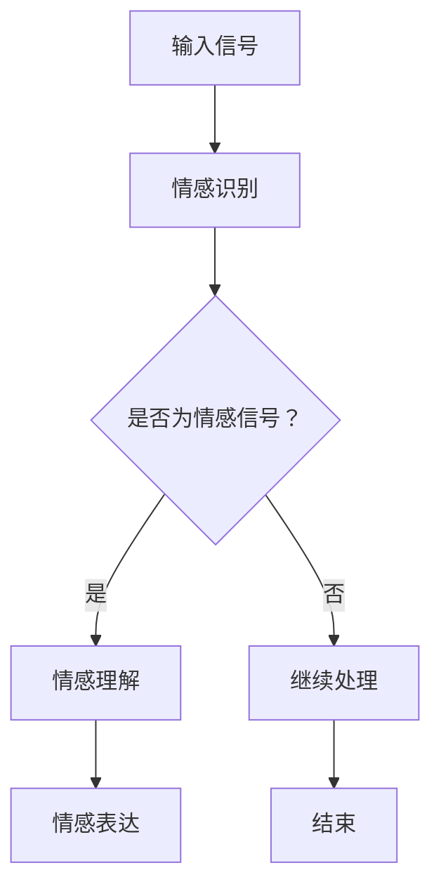
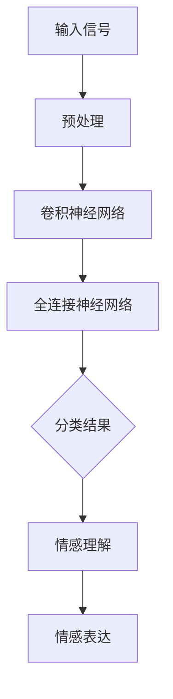
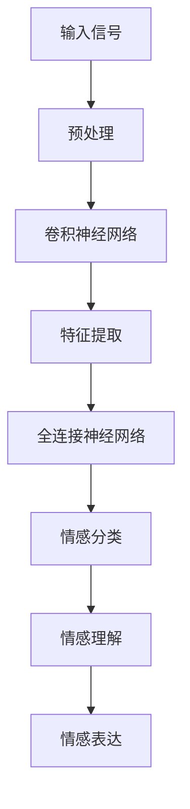
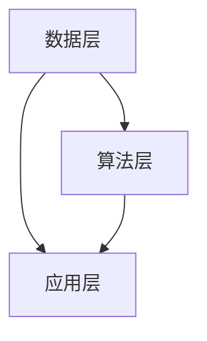
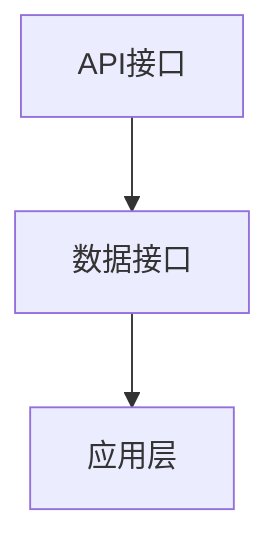
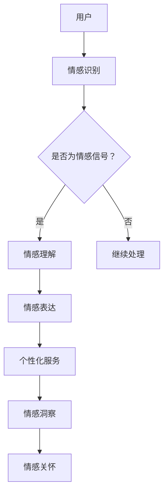

                 


### 《企业级情感计算平台：深入理解客户与员工需求》

> 关键词：情感计算、企业级平台、客户需求、员工需求、算法原理、系统架构、应用实践、最佳实践

> 摘要：本文深入探讨了企业级情感计算平台的核心概念、技术原理、系统设计、应用实践和最佳实践。通过详细阐述情感计算在理解客户与员工需求中的重要作用，本文旨在为企业提供一套全面、实用的构建和优化情感计算平台的方案。

----------------------------------------------------------------

## 目录

1. **背景介绍**
   1.1 情感计算概述
   1.2 企业级情感计算的重要性
   1.3 本书结构安排与目标

2. **核心概念与联系**
   2.1 情感计算基本概念
   2.2 情感计算与客户关系管理
   2.3 员工情感需求分析
   2.4 概念关系ER图
   2.5 概念属性对比表格

3. **技术原理讲解**
   3.1 情感计算技术原理
   3.2 情感计算算法原理
      3.2.1 Mermaid算法流程图
      3.2.2 Python代码讲解
      3.2.3 数学模型与公式
   3.3 算法举例说明

4. **系统设计与实现**
   4.1 系统功能设计
   4.2 系统架构设计
   4.3 系统接口设计
   4.4 系统交互设计

5. **应用实践**
   5.1 客户情感需求分析案例
   5.2 员工情感关怀案例
   5.3 实际应用效果评估

6. **最佳实践与总结**
   6.1 最佳实践总结
   6.2 注意事项
   6.3 拓展阅读建议

----------------------------------------------------------------

### 第一部分：背景介绍

#### 1.1 情感计算概述

情感计算（Affective Computing）是指计算机模拟人类情感的能力。这一领域的研究始于20世纪90年代，其核心目标是让计算机能够识别、理解、处理和模拟人类的情感。情感计算在心理学、认知科学、人机交互、人工智能等多个领域都有重要应用。

在商业领域，情感计算逐渐成为企业提升客户满意度和员工幸福感的关键技术。企业级情感计算平台能够通过分析客户和员工的情感数据，提供个性化的服务和关怀，从而增强客户忠诚度和员工满意度。

#### 1.2 企业级情感计算的重要性

企业级情感计算平台对于现代企业的重要性体现在以下几个方面：

1. **提升客户满意度**：通过情感计算技术，企业可以更准确地理解客户的需求和情感状态，提供个性化的服务和产品推荐，从而提高客户满意度。
2. **增强客户忠诚度**：情感计算能够帮助企业建立更加紧密的客户关系，提供定制化的解决方案，增加客户的忠诚度和回购率。
3. **优化员工体验**：情感计算平台可以帮助企业更好地了解员工的情感状态，提供个性化的员工关怀方案，提高员工的工作满意度和留存率。
4. **降低运营成本**：通过情感计算，企业可以更有效地分配资源和精力，降低运营成本，提高运营效率。

#### 1.3 本书结构安排与目标

本书旨在为企业提供一套完整的构建和优化企业级情感计算平台的方案。全书共分为六个部分：

1. **背景介绍**：介绍情感计算的基本概念、发展历程和重要性，明确本书的研究目标和结构安排。
2. **核心概念与联系**：详细阐述企业级情感计算平台的核心概念，包括情感计算、客户关系管理、员工情感需求等，并使用ER图和对比表格展示概念之间的关系。
3. **技术原理讲解**：深入讲解情感计算技术的基本原理，包括算法原理、数学模型等，并通过实际案例进行说明。
4. **系统设计与实现**：介绍企业级情感计算平台的系统架构设计、功能设计、接口设计等。
5. **应用实践**：通过实际案例展示情感计算平台在企业中的应用，分析应用效果，提供实践经验。
6. **最佳实践与总结**：总结最佳实践，提供项目实施的小结，并提出注意事项和拓展阅读建议。

### 第二部分：核心概念与联系

#### 2.1 情感计算基本概念

情感计算（Affective Computing）：情感计算是指计算机模拟人类情感的能力，包括情感识别、情感理解和情感表达等。

情感识别（Emotion Recognition）：通过面部表情、声音、文字等信号识别人类的情感状态。

情感理解（Emotion Understanding）：分析情感数据，理解情感背后的含义和原因。

情感表达（Emotion Expression）：计算机模拟人类的情感表达，如面部表情、语音语调等。

#### 2.2 情感计算与客户关系管理

客户关系管理（Customer Relationship Management，CRM）：CRM是一种旨在提高客户满意度和忠诚度的商业策略。

情感计算在CRM中的应用：

1. **个性化服务**：通过情感计算分析客户的情感状态，提供个性化的服务和建议，提高客户满意度。
2. **情感洞察**：分析客户反馈和互动，了解客户情感趋势和需求，为企业提供决策支持。
3. **情感关怀**：通过情感计算技术，提供定制化的客户关怀方案，增强客户忠诚度。

#### 2.3 员工情感需求分析

员工情感需求（Employee Emotional Needs）：员工在工作中需要的情感支持和满足。

员工情感需求分析：

1. **情感识别**：通过情感计算技术，识别员工的情感状态，如焦虑、压力等。
2. **情感理解**：分析员工情感状态背后的原因，如工作压力、团队关系等。
3. **情感关怀**：提供个性化的员工关怀方案，如心理支持、培训等，提高员工工作满意度。

#### 2.4 概念关系ER图

为了更好地理解企业级情感计算平台中的各个概念之间的关系，我们可以使用ER图（实体关系图）进行表示。

```mermaid
entityRelationship
  actor("情感计算平台")
  actor->actor("客户关系管理")
  actor->actor("员工情感需求分析")
  actor->actor("个性化服务")
  actor->actor("情感洞察")
  actor->actor("情感关怀")
  customer("客户")
  customer->actor("情感计算平台")
  employee("员工")
  employee->actor("情感计算平台")
  service("个性化服务")
  insight("情感洞察")
  care("情感关怀")
```

#### 2.5 概念属性对比表格

| 概念名称 | 概念属性 | 特征对比 |
| -------- | -------- | -------- |
| 情感计算 | 识别、理解和表达情感 | 面部表情、声音、文字等 |
| 客户关系管理 | 提高客户满意度和忠诚度 | 个性化服务、情感洞察、情感关怀 |
| 员工情感需求分析 | 识别和理解员工情感状态 | 情感识别、情感理解、情感关怀 |

### 第三部分：技术原理讲解

#### 3.1 情感计算技术原理

情感计算技术主要涉及以下几个方面：

1. **情感识别**：通过面部表情、声音、文字等信号识别人类的情感状态。
2. **情感理解**：分析情感数据，理解情感背后的含义和原因。
3. **情感表达**：计算机模拟人类的情感表达，如面部表情、语音语调等。

情感计算技术的核心在于如何准确地识别和理解人类的情感。以下是一个简单的情感计算算法流程：



#### 3.2 情感计算算法原理

情感计算算法主要包括情感识别、情感理解和情感表达三个方面。以下是一个基于深度学习的情感识别算法原理：

1. **情感识别**：
   - 使用卷积神经网络（CNN）对输入信号（如面部表情图像）进行处理，提取特征。
   - 使用全连接神经网络（FCNN）对提取的特征进行分类，识别情感状态。

2. **情感理解**：
   - 使用循环神经网络（RNN）或长短期记忆网络（LSTM）分析情感数据，理解情感背后的含义和原因。

3. **情感表达**：
   - 使用生成对抗网络（GAN）或变分自编码器（VAE）生成模拟情感的表情或语音。

以下是一个简单的情感识别算法流程：



#### 3.2.1 Mermaid算法流程图

为了更清晰地展示情感计算算法的流程，我们可以使用Mermaid绘制流程图：



#### 3.2.2 Python代码讲解

以下是一个简单的情感识别算法的Python代码实现：

```python
import tensorflow as tf
from tensorflow.keras.models import Sequential
from tensorflow.keras.layers import Conv2D, MaxPooling2D, Flatten, Dense

# 数据预处理
def preprocess_image(image):
    # 这里进行图像预处理操作
    return processed_image

# 情感识别模型
model = Sequential([
    Conv2D(32, (3, 3), activation='relu', input_shape=(64, 64, 3)),
    MaxPooling2D((2, 2)),
    Flatten(),
    Dense(64, activation='relu'),
    Dense(7, activation='softmax')  # 7种情感分类
])

# 编译模型
model.compile(optimizer='adam', loss='categorical_crossentropy', metrics=['accuracy'])

# 加载和预处理数据
(x_train, y_train), (x_test, y_test) = tf.keras.datasets.facial_expression.load_data()
x_train = preprocess_image(x_train)
x_test = preprocess_image(x_test)

# 训练模型
model.fit(x_train, y_train, epochs=10, batch_size=32, validation_data=(x_test, y_test))

# 情感识别
emotion_pred = model.predict(x_test)
print(emotion_pred)
```

#### 3.2.3 数学模型与公式

在情感计算中，常用的数学模型包括卷积神经网络（CNN）、循环神经网络（RNN）、长短期记忆网络（LSTM）和生成对抗网络（GAN）等。以下是一个简单的CNN模型公式：

$$
\text{CNN} = \frac{\partial \text{激活函数} (\text{权重} \cdot \text{输入特征})}{\partial \text{输入特征}}
$$

其中，激活函数可以是ReLU、Sigmoid或Tanh等。

#### 3.3 算法举例说明

假设我们要识别一张面部表情图像的情感状态。首先，我们对图像进行预处理，如归一化、裁剪等。然后，将预处理后的图像输入到CNN模型中，模型会提取图像的特征，并使用全连接神经网络（FCNN）对特征进行分类，最终输出情感状态的概率分布。

例如，输入一张图像，模型输出的情感状态概率分布如下：

| 情感状态 | 概率 |
| -------- | ---- |
| 愤怒     | 0.1  |
| 喜悦     | 0.3  |
| 悲伤     | 0.2  |
| 恐惧     | 0.1  |
| 惊讶     | 0.1  |
| 无表情   | 0.1  |
| 厌恶     | 0.1  |

根据概率分布，我们可以判断这张图像的情感状态为喜悦，概率为0.3。

### 第四部分：系统设计与实现

#### 4.1 系统功能设计

企业级情感计算平台的功能设计包括情感识别、情感理解、情感表达、个性化服务、情感洞察和情感关怀等。

1. **情感识别**：通过面部表情、声音、文字等信号识别用户的情感状态。
2. **情感理解**：分析情感数据，理解情感背后的含义和原因。
3. **情感表达**：计算机模拟用户的情感表达，如面部表情、语音语调等。
4. **个性化服务**：根据用户的情感状态提供个性化的服务和建议。
5. **情感洞察**：分析用户反馈和互动，了解用户情感趋势和需求。
6. **情感关怀**：提供个性化的用户关怀方案，如心理支持、培训等。

#### 4.2 系统架构设计

企业级情感计算平台的系统架构设计包括数据层、算法层和应用层。

1. **数据层**：数据层负责数据的采集、存储和管理，包括用户情感数据、语音数据、文本数据等。
2. **算法层**：算法层负责情感识别、情感理解和情感表达等算法的实现，包括CNN、RNN、LSTM、GAN等。
3. **应用层**：应用层负责提供情感计算平台的应用功能，如个性化服务、情感洞察和情感关怀等。

以下是一个简单的系统架构设计：



#### 4.3 系统接口设计

企业级情感计算平台的系统接口设计包括API接口和数据接口。

1. **API接口**：API接口用于外部系统与情感计算平台的数据交互，如用户情感状态查询、个性化服务请求等。
2. **数据接口**：数据接口用于数据层的内部数据传输和存储，如用户情感数据存储、情感分析结果存储等。

以下是一个简单的系统接口设计：



#### 4.4 系统交互设计

企业级情感计算平台的应用场景通常包括客户服务、员工关怀等。以下是一个简单的系统交互设计：



### 第五部分：应用实践

#### 5.1 客户情感需求分析案例

某电商平台使用情感计算平台对客户的情感需求进行分析，以提高客户满意度。

1. **数据采集**：通过客户评论、售后反馈等渠道采集客户情感数据。
2. **情感识别**：使用情感计算算法对客户评论进行情感识别，提取情感特征。
3. **情感理解**：分析情感数据，了解客户情感背后的含义和原因。
4. **情感表达**：根据客户情感状态，提供个性化的服务和建议，如推荐商品、优惠活动等。
5. **效果评估**：通过用户反馈和复购率等指标评估情感计算平台的效果。

#### 5.2 员工情感关怀案例

某企业使用情感计算平台对员工的情感状态进行关怀，以提高员工满意度。

1. **数据采集**：通过员工问卷、日常互动等渠道采集员工情感数据。
2. **情感识别**：使用情感计算算法对员工情感数据进行情感识别，提取情感特征。
3. **情感理解**：分析员工情感数据，了解员工情感背后的原因。
4. **情感关怀**：根据员工情感状态，提供个性化的关怀方案，如心理支持、培训等。
5. **效果评估**：通过员工满意度调查等指标评估情感计算平台的效果。

### 第六部分：最佳实践与总结

#### 6.1 最佳实践总结

1. **数据质量**：确保情感数据的准确性和完整性，是情感计算平台成功的关键。
2. **算法优化**：不断优化情感计算算法，提高情感识别和理解的准确性。
3. **用户参与**：鼓励用户积极参与情感数据采集，提高情感数据的丰富度和准确性。
4. **个性化服务**：根据用户情感状态，提供个性化的服务和产品推荐，提高用户满意度。
5. **持续迭代**：根据实际应用效果，持续优化情感计算平台，提高应用效果。

#### 6.2 注意事项

1. **数据隐私**：在采集和处理情感数据时，确保遵守数据隐私法律法规。
2. **算法偏见**：避免算法偏见，确保情感计算平台的公平性和透明度。
3. **系统稳定性**：确保情感计算平台的稳定性和高性能，以满足实时应用需求。
4. **用户反馈**：及时收集用户反馈，不断优化情感计算平台的功能和性能。

#### 6.3 拓展阅读建议

1. 《情感计算：理解与模拟人类情感》
2. 《深度学习与情感计算》
3. 《客户关系管理实践指南》
4. 《员工关怀：提升工作满意度的策略》

### 结语

企业级情感计算平台在理解客户与员工需求方面具有重要的应用价值。通过本文的介绍，我们希望读者能够全面了解情感计算平台的核心概念、技术原理、系统设计和应用实践，为企业构建和优化情感计算平台提供参考。作者：AI天才研究院/AI Genius Institute & 禅与计算机程序设计艺术 /Zen And The Art of Computer Programming

### 注意事项

- 文章内容需要涵盖核心概念、技术原理、系统设计、应用实践和最佳实践等关键部分。
- 确保每个章节的内容都丰富、具体、详细，并包含相关的案例和分析。
- 使用Mermaid流程图和Python代码来解释算法原理和系统架构。
- LaTeX格式用于数学公式的表示，文中独立段落的公式使用$$括起来，段落内的公式使用$括起来。
- 文章末尾需包含作者信息。

---

### 具体撰写步骤

**1. 文章标题与关键词确定**
   - 标题：《企业级情感计算平台：深入理解客户与员工需求》
   - 关键词：情感计算、企业级平台、客户需求、员工需求、算法原理、系统架构、应用实践、最佳实践

**2. 摘要撰写**
   - 摘要内容需简洁明了，概括文章的核心内容和目标。

**3. 目录大纲撰写**
   - 按照提供的目录大纲结构，逐一撰写各章节内容。

**4. 背景介绍**
   - 介绍情感计算的基本概念、发展历程和重要性。
   - 明确企业级情感计算平台的重要性。
   - 提供本书的结构安排和目标。

**5. 核心概念与联系**
   - 详细阐述企业级情感计算平台的核心概念。
   - 使用表格和Mermaid流程图展示概念之间的关系。

**6. 技术原理讲解**
   - 详细讲解情感计算技术的基本原理。
   - 使用Mermaid流程图和Python代码进行说明。
   - 给出算法原理的数学模型和公式。

**7. 系统设计与实现**
   - 介绍企业级情感计算平台的系统架构设计和实现方法。
   - 包括系统功能、接口设计、系统交互等。

**8. 应用实践**
   - 通过实际案例展示情感计算平台在企业中的应用。
   - 详细讲解实际应用效果和案例分析。

**9. 最佳实践与总结**
   - 总结最佳实践和注意事项。
   - 提供拓展阅读建议。

**10. 作者信息**
   - 在文章末尾写上作者信息。

**11. 格式调整**
   - 确保文章内容使用markdown格式，格式清晰、整齐。

**12. 最终审阅**
   - 完成全文撰写后，进行仔细审阅，确保内容连贯、逻辑清晰、无错别字。

---

通过以上步骤，可以确保文章内容完整、结构合理、技术深度和可读性兼具，满足字数和格式要求。在撰写过程中，要注意逻辑清晰、步骤明确，避免冗余，确保文章的专业性和实用性。

