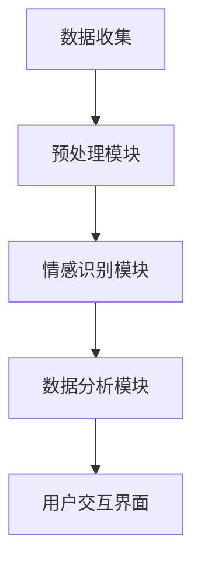
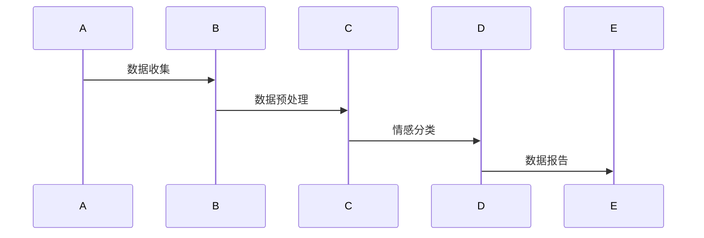
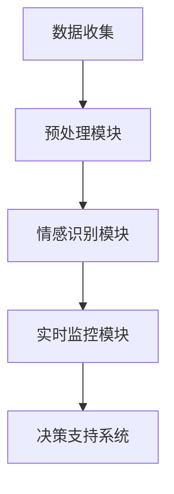
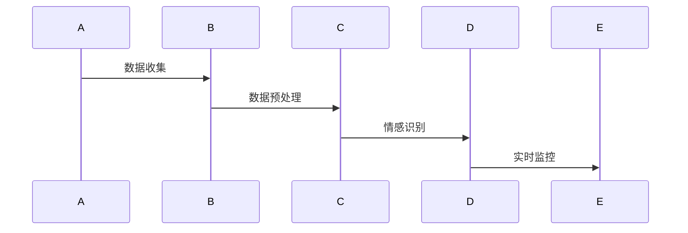

                 

# 企业级情感计算平台：深度理解客户情绪

## 关键词
- 企业级情感计算
- 客户情绪分析
- 机器学习
- 情感识别算法
- 数据收集与预处理

## 摘要
本文旨在探讨企业级情感计算平台的建设，特别是如何通过深度理解客户情绪来提升客户体验和满意度。我们将从概念介绍、核心理论、平台架构、数据收集与预处理、情感识别算法、集成与应用、开发与部署，以及案例研究等方面，逐步分析并构建一个完整的情感计算平台。通过本文，读者将了解情感计算在商业领域的应用潜力，以及如何有效利用这一技术来提升企业的竞争力。

## 目录

## 前言
### 企业级情感计算的定义与重要性
### 情感计算平台的需求背景
### 本文结构

## 第一章：企业级情感计算的概念介绍
### 情感计算的定义
### 企业级情感计算的特点
### 情感计算的应用领域

## 第二章：核心概念与理论基础
### 情感识别技术概述
### 情感分析模型
### 不同情感识别技术的比较

## 第三章：企业级情感计算平台的架构设计
### 平台概述
### 关键组件
### 设计原则与策略

## 第四章：数据收集与预处理
### 情感数据的类型
### 数据收集的挑战
### 数据预处理方法

## 第五章：情感识别与分类算法
### 情感识别方法
### 机器学习算法
### 深度学习模型

## 第六章：情感计算平台的集成与应用
### 客户服务中的应用场景
### 提升客户体验
### 实践中的挑战与解决方案

## 第七章：平台开发与部署
### 开发过程
### 部署最佳实践
### 研究方向与未来趋势

## 第八章：案例研究与分析
### 案例一：情感计算在电商中的应用
### 案例二：金融行业的情绪分析
### 案例总结

## 第九章：最佳实践与拓展
### 实践经验分享
### 小结
### 注意事项
### 拓展阅读

## 前言

### 企业级情感计算的定义与重要性
情感计算，也称为情感识别或情绪分析，是指通过自然语言处理、机器学习和数据挖掘等技术，从文本、语音、图像等多模态数据中提取情感信息的过程。企业级情感计算则是将这一技术集成到企业级的业务系统中，以实现对客户情绪的深度理解和分析。

在当前竞争激烈的市场环境中，企业需要更加了解客户的情绪和需求，以便提供个性化的服务和产品。情感计算平台通过收集和分析客户的情绪数据，可以帮助企业识别客户满意度的变化，预测客户行为，优化产品和服务设计，从而提升客户体验和忠诚度。

### 情感计算平台的需求背景
随着互联网和移动设备的普及，企业和客户之间的互动方式发生了巨大变化。传统的基于调查问卷和统计数据的方法已不足以全面了解客户的情绪和需求。情感计算平台通过实时分析客户情绪，为企业提供了更为精准和实时的洞察力。

此外，大数据和人工智能技术的发展为情感计算提供了强大的技术支持。企业可以利用这些技术收集海量数据，进行复杂的情感分析和模式识别，从而在激烈的市场竞争中脱颖而出。

### 本文结构
本文将分为以下几个部分：
1. 概念介绍：阐述企业级情感计算的定义、特点和应用领域。
2. 核心理论与方法：介绍情感识别技术的基础理论和不同识别方法的比较。
3. 平台架构设计：详细描述情感计算平台的架构设计原则和关键组件。
4. 数据收集与预处理：分析情感数据的类型和收集的挑战，介绍数据预处理方法。
5. 情感识别算法：探讨情感识别的算法原理，包括机器学习和深度学习模型。
6. 集成与应用：探讨情感计算在企业业务流程中的应用场景和最佳实践。
7. 开发与部署：介绍平台开发过程、部署最佳实践和未来研究方向。
8. 案例研究与分析：通过具体案例展示情感计算的应用效果。
9. 最佳实践与拓展：总结实践经验，提供注意事项和拓展阅读。

通过本文，读者将系统地了解企业级情感计算平台的构建方法和应用前景，为企业在数字化转型过程中提供有价值的参考。


## 第一章：企业级情感计算的概念介绍

### 情感计算的定义

情感计算，简称Emotion Computing，是人工智能（AI）领域的一个重要分支，旨在让计算机理解和模拟人类的情感。它结合了自然语言处理（NLP）、计算机视觉、语音识别和机器学习等技术，通过分析人类情感表达的方式，实现对情感的识别、分类和预测。

情感计算的基本目标是让计算机能够理解并响应人类的情感状态，从而提供更人性化的交互体验。这不仅包括对文本情感的分析，还涵盖了语音、视频和面部表情等多模态数据的情感识别。

### 企业级情感计算的特点

企业级情感计算具有以下几个显著特点：

1. **数据规模大**：企业级应用通常涉及海量的客户数据，包括文本、语音、视频等多模态数据。这些数据需要进行高效的存储、处理和分析。

2. **实时性要求高**：企业需要实时获取和分析客户的情感状态，以便快速响应客户需求，优化产品和服务。

3. **高精度要求**：情感计算需要高精度的情感识别，以确保分析结果的准确性和可靠性。

4. **个性化需求**：企业需要根据不同客户群体的特点，提供个性化的情感分析服务，以满足多样化的需求。

5. **安全性要求**：企业处理的数据通常涉及客户的隐私信息，因此情感计算平台需要确保数据的安全性和隐私保护。

### 情感计算的应用领域

情感计算在多个行业和领域都有广泛的应用，主要包括：

1. **客户服务**：通过情感计算，企业可以实时监测客户情绪，提供个性化的服务，提高客户满意度和忠诚度。

2. **市场营销**：情感计算可以帮助企业分析客户对产品或服务的情感反应，优化营销策略，提高转化率。

3. **金融行业**：在金融领域，情感计算可以用于分析客户情绪，预测市场趋势，优化投资决策。

4. **健康医疗**：情感计算可以分析患者的情感状态，辅助诊断和治疗。

5. **教育**：通过情感计算，教育机构可以了解学生的学习情绪，提供个性化的学习支持和辅导。

### 情感计算平台的功能和组成部分

一个典型的企业级情感计算平台通常包括以下几个核心功能模块：

1. **数据收集模块**：负责收集各种来源的情感数据，如社交媒体、客户反馈、语音通话记录等。

2. **数据处理模块**：对收集到的情感数据进行分析和清洗，提取有用的情感信息。

3. **情感识别模块**：利用机器学习和深度学习算法，对处理后的数据进行情感识别和分类。

4. **数据分析模块**：对情感识别结果进行分析，生成报告和可视化数据，为企业提供决策支持。

5. **用户交互模块**：提供用户界面，使得企业可以方便地操作和管理情感计算平台。

### 总结

企业级情感计算是一个涉及多学科交叉的复杂系统，它通过深度理解和分析客户情绪，为企业提供了宝贵的洞察力。随着技术的不断进步，情感计算的应用将更加广泛，为企业的业务发展带来新的机遇。在下一章中，我们将深入探讨情感计算的核心理论和不同情感识别技术之间的比较。

## 第二章：核心概念与理论基础

### 情感识别技术概述

情感识别是情感计算领域的关键技术，它涉及从文本、语音、图像等多模态数据中提取情感信息。情感识别技术可以分为以下几个方面：

1. **文本情感识别**：通过对自然语言文本进行分析，识别文本中的情感倾向和情感强度。常见的文本情感识别方法包括基于规则的方法、机器学习方法和深度学习方法。

2. **语音情感识别**：通过对语音信号的处理，识别语音中的情感特征。语音情感识别通常涉及语音特征提取和情感分类两个步骤。

3. **图像情感识别**：通过对图像中的面部表情、姿态和上下文进行分析，识别图像中的情感信息。图像情感识别主要依赖于计算机视觉技术和深度学习模型。

4. **多模态情感识别**：结合文本、语音、图像等多种数据来源，进行综合情感识别，以提高识别的准确性和鲁棒性。

### 情感分析模型

情感分析模型是情感识别的核心，用于对情感信息进行分类和预测。常见的情感分析模型包括以下几种：

1. **基于规则的模型**：通过人工定义规则，对文本或语音进行情感分类。这种方法简单直观，但灵活性和扩展性较差。

2. **监督学习模型**：利用已标注的情感数据集，训练机器学习模型进行情感分类。常见的监督学习算法包括决策树、支持向量机（SVM）、朴素贝叶斯（Naive Bayes）和随机森林（Random Forest）等。

3. **无监督学习模型**：在没有标注数据的情况下，通过聚类方法对情感数据进行分析和分类。常见的无监督学习算法包括K-means聚类、层次聚类和密度聚类等。

4. **深度学习模型**：利用深度神经网络，对大量的情感数据进行自动特征提取和分类。常见的深度学习模型包括卷积神经网络（CNN）、循环神经网络（RNN）和长短时记忆网络（LSTM）等。

### 核心理论与概念

1. **情感极性**：情感极性是指情感的倾向性，通常分为正面、负面和中性三种。情感极性分析是情感识别的基础，用于判断文本或语音的情感倾向。

2. **情感强度**：情感强度是指情感表达的强烈程度，通常用数值或分级表示。情感强度分析可以用于评估情感表达的强烈程度，有助于更准确地理解情感。

3. **情感类型**：情感类型是指情感的类别，如快乐、悲伤、愤怒、厌恶等。情感类型分析可以用于识别文本或语音中的具体情感类型。

4. **情感时序**：情感时序是指情感随时间的变化规律。情感时序分析可以用于了解情感的变化趋势和周期性，有助于预测情感的未来状态。

### 不同情感识别技术的比较

1. **文本情感识别**与**语音情感识别**：
   - **文本情感识别**依赖于自然语言处理技术，如词频统计、词向量表示和情感词典等。文本情感识别的优点是数据处理速度快，可以处理大规模文本数据，但情感表达的复杂性和语境的影响可能降低识别的准确性。
   - **语音情感识别**依赖于语音信号处理技术，如语音特征提取、音频增强和情感分类等。语音情感识别的优点是能够捕捉语音信号中的情感特征，具有更高的准确性，但数据处理复杂度较高，且对硬件资源要求较高。

2. **图像情感识别**与**多模态情感识别**：
   - **图像情感识别**主要依赖于计算机视觉技术，如面部识别、姿态分析和图像特征提取等。图像情感识别的优点是能够直观地捕捉情感表达，但受限于图像质量和上下文信息的缺失。
   - **多模态情感识别**结合了文本、语音、图像等多种数据来源，进行综合情感识别。多模态情感识别的优点是能够充分利用不同数据源的信息，提高识别的准确性和鲁棒性，但数据处理复杂度较高，且对算法设计要求较高。

### 总结

情感识别技术是情感计算平台的核心组成部分，通过文本、语音、图像等多模态数据的分析，可以实现对客户情感的深度理解和分析。不同的情感识别技术各有优缺点，企业可以根据具体应用场景和需求选择合适的技术。在下一章中，我们将探讨企业级情感计算平台的架构设计原则和关键组件。

## 第三章：企业级情感计算平台的架构设计

### 平台概述

企业级情感计算平台是一个高度复杂、分布式和模块化的系统，旨在为企业提供全面、精准的情感分析服务。该平台通常由多个关键组件构成，每个组件在数据处理和分析中扮演着重要角色。总体架构可以分为以下几个层次：

1. **数据层**：负责收集和管理各种来源的情感数据，包括社交媒体、客户反馈、客服记录、语音通话和视频内容等。

2. **数据预处理层**：对原始数据进行清洗、去噪、标注和格式转换，为后续的情感识别和分析做好准备。

3. **算法层**：包括情感识别和分类的核心算法，如基于机器学习和深度学习的情感分析模型。

4. **分析层**：对情感识别结果进行分析和可视化，生成报告和洞察，为企业提供决策支持。

5. **应用层**：提供用户界面和交互功能，使得企业用户可以方便地操作和管理情感计算平台。

### 关键组件

1. **数据收集模块**：负责从各种数据源收集情感数据，包括文本、语音、图像和视频等。数据收集模块需要具备高效的数据采集能力和良好的扩展性，以适应不断变化的数据来源和需求。

2. **数据预处理模块**：对收集到的情感数据进行预处理，包括数据清洗、去噪、标注和格式转换等。数据预处理模块是确保数据质量和分析准确性的重要环节，通常包括以下步骤：
   - **数据清洗**：去除重复数据、缺失数据和异常值。
   - **数据去噪**：过滤掉噪声数据，提高数据的纯净度。
   - **数据标注**：对数据进行情感标注，为后续的算法训练提供标记数据。
   - **数据格式转换**：将不同数据源的数据格式统一，以便于后续处理。

3. **情感识别模块**：负责对预处理后的数据进行情感识别和分类。情感识别模块通常包括以下几个步骤：
   - **特征提取**：从原始数据中提取情感特征，如文本特征、语音特征和图像特征等。
   - **模型训练**：利用已标注的数据集，训练机器学习模型或深度学习模型，以实现情感识别功能。
   - **情感分类**：对新的数据进行情感分类，输出情感标签。

4. **数据分析模块**：对情感识别结果进行进一步分析和可视化，生成报告和洞察。数据分析模块通常包括以下功能：
   - **情感趋势分析**：分析情感随时间的变化趋势，识别情感波动的原因。
   - **情感分布分析**：分析不同客户群体或不同产品/服务的情感分布，识别优势和劣势。
   - **情感聚类分析**：对情感数据进行聚类分析，识别具有相似情感倾向的群体。

5. **用户交互模块**：提供用户界面和交互功能，使得企业用户可以方便地操作和管理情感计算平台。用户交互模块通常包括以下功能：
   - **数据上传与下载**：允许用户上传和处理情感数据。
   - **数据查询与筛选**：提供便捷的数据查询和筛选功能，方便用户快速定位所需数据。
   - **报告生成与展示**：生成可视化报告，展示情感分析结果，供企业用户参考。

### 设计原则与策略

1. **模块化设计**：情感计算平台采用模块化设计，使得每个组件可以独立开发和部署，提高系统的灵活性和可扩展性。

2. **分布式架构**：采用分布式架构，将数据收集、预处理、识别和分析等任务分布到多个节点上，提高系统的处理能力和容错性。

3. **高可用性**：确保系统的高可用性，通过冗余设计、负载均衡和故障恢复机制，保障系统的稳定运行。

4. **安全性**：加强数据安全和隐私保护，采用加密、访问控制和安全审计等技术，确保数据的安全性和合规性。

5. **可扩展性**：设计可扩展的系统架构，以便在未来可以轻松地增加新的功能模块或数据源。

6. **用户友好性**：提供直观、易用的用户界面，使得企业用户可以轻松地操作和管理情感计算平台。

### 总结

企业级情感计算平台的架构设计是一个复杂而关键的过程，需要充分考虑系统的模块化、分布式、高可用性、安全性和可扩展性。通过合理的设计和优化，情感计算平台可以为企业提供高效、准确和全面的情感分析服务，助力企业在竞争激烈的市场中脱颖而出。在下一章中，我们将深入探讨数据收集与预处理的方法和技术。

## 第四章：数据收集与预处理

### 情感数据的类型

情感数据可以来自多种不同的来源和形式，常见的类型包括：

1. **文本数据**：包括社交媒体评论、论坛帖子、客户反馈、电子邮件等。文本数据是情感计算中最为常见的数据类型，因为它可以提供丰富的情感信息。

2. **语音数据**：包括电话通话记录、客服录音、语音留言等。语音数据通过语音信号处理技术，可以提取出情感特征，用于情感识别。

3. **图像数据**：包括客户面部表情照片、产品使用场景图像等。图像数据通过计算机视觉技术，可以分析面部表情、姿态和上下文信息，以识别情感。

4. **视频数据**：包括客户互动视频、产品演示视频等。视频数据结合了图像和语音信息，可以提供更为全面和细致的情感分析。

### 数据收集的挑战

1. **数据多样性**：不同来源的数据格式和结构各不相同，需要进行统一处理。例如，文本数据可能包含HTML标签、图片和视频数据可能包含多种视频编码格式。

2. **数据质量**：原始数据通常存在噪声、缺失值和错误标注等问题，需要进行数据清洗和预处理，以确保数据的质量和准确性。

3. **数据隐私**：收集到的情感数据通常涉及客户的隐私信息，需要采取严格的数据保护措施，确保数据安全和合规。

4. **数据量**：情感数据量通常较大，需要高效的数据存储和处理技术，以支持实时分析和处理。

### 数据预处理方法

1. **数据清洗**：数据清洗是预处理的第一步，主要任务包括去除重复数据、填充缺失值和纠正错误数据等。数据清洗有助于提高数据的纯净度和一致性。

2. **数据标注**：数据标注是将原始数据打上情感标签的过程，为后续的算法训练提供标记数据。数据标注可以通过人工标注或半监督学习的方式进行。

3. **数据格式转换**：将不同来源的数据转换为统一的格式，以便后续处理。例如，将文本数据转换为词向量表示，将图像数据转换为特征向量。

4. **特征提取**：从原始数据中提取情感特征，用于情感识别和分类。特征提取的方法包括词频统计、情感词典匹配、语音特征提取和图像特征提取等。

5. **特征选择**：通过特征选择技术，筛选出对情感识别最有用的特征，减少特征维度，提高算法的效率和准确性。常见的特征选择方法包括互信息、主成分分析（PCA）和特征重要性分析等。

6. **归一化和标准化**：对特征进行归一化和标准化处理，使得不同特征之间的尺度一致，避免特征之间的相互影响。常用的方法包括最小-最大归一化和Z-score标准化。

### 数据预处理流程

1. **数据收集**：从各种数据源收集文本、语音、图像和视频等情感数据。

2. **数据清洗**：去除重复数据、填充缺失值、纠正错误数据等，确保数据的质量和一致性。

3. **数据标注**：对数据打上情感标签，为算法训练提供标记数据。

4. **数据格式转换**：将不同格式和来源的数据转换为统一的格式。

5. **特征提取**：从原始数据中提取情感特征，为情感识别和分类做准备。

6. **特征选择**：筛选出对情感识别最有用的特征，减少特征维度。

7. **归一化和标准化**：对特征进行归一化和标准化处理。

### 总结

数据收集与预处理是情感计算平台的重要组成部分，直接影响情感识别的准确性和效率。通过有效的数据收集方法和预处理流程，可以确保数据的质量和一致性，为情感计算平台提供可靠的数据支持。在下一章中，我们将探讨情感识别与分类算法，以及这些算法在企业级情感计算平台中的应用。

## 第五章：情感识别与分类算法

### 情感识别方法

情感识别是情感计算的核心任务，通过识别和分析情感数据，可以实现对客户情绪的深度理解。常见的情感识别方法包括以下几种：

1. **基于规则的模型**：这种方法通过预定义的规则来识别情感。规则可以是简单的条件判断，如“如果包含‘快乐’这个词，则情感为快乐”。基于规则的模型简单直观，但灵活性和扩展性较差。

2. **监督学习模型**：监督学习模型通过已标注的数据集进行训练，从而学习情感分类规律。常见的监督学习算法包括：
   - **决策树**：通过一系列判断条件将数据划分为不同的类别。
   - **支持向量机（SVM）**：通过找到一个最佳的超平面，将不同类别的数据分开。
   - **朴素贝叶斯**：基于贝叶斯定理，通过先验概率和条件概率进行分类。
   - **随机森林**：通过构建多个决策树，并利用投票机制进行分类。

3. **无监督学习模型**：无监督学习模型在没有标注数据的情况下，通过聚类方法对情感数据进行分析和分类。常见的无监督学习算法包括：
   - **K-means聚类**：将数据点划分为K个簇，使得每个簇内的数据点相似度较高，簇间数据点相似度较低。
   - **层次聚类**：通过层次化的方式，将数据点逐步划分为不同的簇。
   - **密度聚类**：通过计算数据点的密度分布，识别出潜在的簇结构。

4. **深度学习模型**：深度学习模型通过多层神经网络结构，自动提取数据特征并进行分类。常见的深度学习模型包括：
   - **卷积神经网络（CNN）**：适用于处理图像数据，通过卷积层提取图像特征。
   - **循环神经网络（RNN）**：适用于处理序列数据，如文本和语音，通过隐藏状态捕获时间依赖性。
   - **长短时记忆网络（LSTM）**：是RNN的一种变体，适用于处理长序列数据，通过门控机制避免梯度消失问题。
   - **生成对抗网络（GAN）**：通过生成器和判别器的对抗训练，生成高质量的数据特征。

### 机器学习算法

机器学习算法在情感识别中起着关键作用，通过训练模型，可以自动识别情感特征并进行分类。以下是几种常见的机器学习算法：

1. **朴素贝叶斯分类器**：
   - **原理**：基于贝叶斯定理和特征条件独立性假设，计算每个类别的后验概率，选择后验概率最大的类别作为预测结果。
   - **优点**：计算简单，易于实现，适用于小规模数据集。
   - **缺点**：对数据分布敏感，可能产生过拟合。

2. **决策树分类器**：
   - **原理**：通过一系列判断条件，将数据划分为不同的区域，每个区域对应一个类别。
   - **优点**：直观易懂，易于解释，能够处理非线性数据。
   - **缺点**：容易过拟合，对噪声敏感，处理大数据集时性能较差。

3. **支持向量机（SVM）**：
   - **原理**：通过找到一个最佳的超平面，将不同类别的数据点分开，超平面上的间隔越大，模型越稳定。
   - **优点**：对高维数据有较好的处理能力，分类效果好。
   - **缺点**：计算复杂度较高，训练时间较长。

4. **随机森林**：
   - **原理**：通过构建多个决策树，并利用投票机制进行分类，每个决策树独立训练，提高模型的泛化能力。
   - **优点**：集成多个决策树，降低过拟合风险，分类效果较好。
   - **缺点**：计算复杂度较高，对大量数据集处理性能较差。

### 深度学习模型

深度学习模型在情感识别中显示出强大的能力，通过多层神经网络结构，可以自动提取复杂的数据特征并进行分类。以下是几种常见的深度学习模型：

1. **卷积神经网络（CNN）**：
   - **原理**：通过卷积层和池化层，自动提取图像特征，并在全连接层进行分类。
   - **优点**：适用于处理图像数据，能够提取出丰富的图像特征。
   - **缺点**：对大量数据进行训练，计算资源消耗较大。

2. **循环神经网络（RNN）**：
   - **原理**：通过隐藏状态捕获时间依赖性，适用于处理序列数据，如文本和语音。
   - **优点**：能够处理长序列数据，捕捉时间序列特征。
   - **缺点**：梯度消失和梯度爆炸问题，训练较慢。

3. **长短时记忆网络（LSTM）**：
   - **原理**：是RNN的一种变体，通过门控机制避免梯度消失问题，适用于处理长序列数据。
   - **优点**：能够处理长序列数据，捕捉长期依赖性。
   - **缺点**：参数较多，计算复杂度较高。

4. **生成对抗网络（GAN）**：
   - **原理**：通过生成器和判别器的对抗训练，生成高质量的数据特征。
   - **优点**：能够生成逼真的数据特征，提升模型泛化能力。
   - **缺点**：训练过程不稳定，对超参数调优要求较高。

### 总结

情感识别与分类算法是情感计算平台的核心组成部分，通过不同的算法和方法，可以实现对情感数据的深度理解和分析。机器学习算法和深度学习模型各有优缺点，企业可以根据具体应用场景和需求选择合适的算法。在下一章中，我们将探讨情感计算平台在企业业务流程中的应用，以及如何通过情感分析提升客户体验和满意度。

## 第六章：情感计算平台的集成与应用

### 客户服务中的应用场景

情感计算平台在客户服务领域具有广泛的应用潜力，通过深度理解客户情绪，企业可以实现以下场景：

1. **智能客服**：通过情感计算，智能客服系统能够实时分析客户的语音和文本输入，识别客户的情绪状态。当客户表现出愤怒或失望的情绪时，系统可以自动提示客服代表进行干预，提供更人性化的服务。

2. **情感分析**：企业可以通过情感计算平台分析客户反馈和投诉，识别出客户的主要情感倾向和诉求。这有助于企业快速识别问题，采取有效措施改进产品和服务，提升客户满意度。

3. **客户细分**：情感计算平台可以根据客户的情感状态，对客户进行细分。例如，将情绪稳定的客户和情绪波动的客户区分开来，针对不同客户群体采取个性化的服务策略。

4. **预测客户行为**：通过分析客户的情感变化，企业可以预测客户的潜在行为。例如，当客户情绪从积极转为消极时，可能预示着客户有退订或投诉的风险，企业可以提前采取措施留住客户。

### 提升客户体验

情感计算平台在提升客户体验方面具有显著作用，以下是一些具体方法：

1. **个性化服务**：通过情感计算，企业可以了解客户的情感偏好，提供个性化的推荐和服务。例如，在电商平台上，系统可以根据客户的情感状态，推荐他们可能感兴趣的产品。

2. **及时响应**：情感计算平台可以帮助企业实时监测客户情绪，及时识别出潜在问题和机会。企业可以迅速响应客户需求，提供快速、高效的解决方案，提升客户满意度。

3. **情感关怀**：通过情感计算，企业可以识别出那些需要特别关注的客户。例如，当客户情绪波动较大时，企业可以通过电话或短信进行关怀，表达对客户的关心，增强客户黏性。

4. **情感反馈循环**：企业可以将情感计算平台的分析结果反馈到产品和服务改进过程中，持续优化客户体验。例如，根据客户的情感反馈，调整营销策略、改进产品设计和提升服务质量。

### 实践中的挑战与解决方案

1. **数据隐私**：情感计算平台处理的数据通常涉及客户的隐私信息，如何确保数据安全和隐私保护是一个重要挑战。解决方案包括：
   - **数据加密**：对收集到的数据进行加密存储和传输，确保数据在传输和存储过程中安全。
   - **匿名化处理**：对敏感数据进行匿名化处理，隐藏个人身份信息。
   - **合规性审查**：遵守相关数据保护法规，进行合规性审查和监管。

2. **情感识别精度**：情感识别的精度直接影响到分析结果的可靠性。为了提高情感识别精度，可以采取以下措施：
   - **数据标注**：提高数据标注的质量，确保标注数据的准确性。
   - **模型优化**：通过调整模型参数、增加训练数据量和使用更先进的算法，提高模型性能。
   - **多模态数据融合**：结合文本、语音、图像等多模态数据，提高情感识别的准确性和鲁棒性。

3. **技术复杂性**：情感计算平台涉及多种技术和算法，如何有效地集成和管理这些技术是一个挑战。解决方案包括：
   - **模块化设计**：采用模块化设计，使得每个组件可以独立开发和部署，提高系统的灵活性和可维护性。
   - **云计算和分布式计算**：利用云计算和分布式计算技术，提高数据处理和分析的效率和性能。
   - **技术培训**：加强对相关技术人员的培训，提高他们对情感计算技术的理解和应用能力。

### 总结

情感计算平台在客户服务领域的应用，为提升客户体验和满意度提供了新的途径。通过深度理解客户情绪，企业可以更精准地满足客户需求，提供个性化的服务和产品。在实践过程中，企业需要关注数据隐私、情感识别精度和技术复杂性等挑战，采取相应的解决方案，确保情感计算平台的稳定运行和高效应用。在下一章中，我们将探讨情感计算平台的发展过程和未来研究方向。

## 第七章：平台开发与部署

### 开发过程

企业级情感计算平台的开发过程可以分为以下几个阶段：

1. **需求分析**：明确项目目标，确定平台的功能需求和性能指标。这一阶段需要与业务部门紧密合作，了解客户需求和业务场景。

2. **系统设计**：设计平台的整体架构，包括数据层、数据预处理层、算法层、分析层和应用层。系统设计需要考虑模块化、分布式、高可用性和安全性等因素。

3. **模块开发**：根据系统设计，开发各个功能模块，包括数据收集模块、数据预处理模块、情感识别模块、数据分析模块和用户交互模块。每个模块需要经过严格的单元测试和集成测试，确保模块的功能和性能。

4. **算法实现**：实现情感识别算法，包括机器学习算法和深度学习模型。算法实现需要结合具体的数据集和业务需求，进行参数调优和性能优化。

5. **系统集成**：将各个模块整合为一个完整的系统，进行集成测试和系统性能测试。确保系统在各种负载条件下能够稳定运行，并达到预期的性能指标。

6. **部署上线**：将开发完成的系统部署到生产环境，进行实际的业务运行。部署过程需要确保系统的安全、可靠和高可用性。

### 最佳实践

1. **模块化开发**：采用模块化开发方法，使得每个模块可以独立开发和部署。模块化设计有助于提高系统的灵活性、可维护性和可扩展性。

2. **敏捷开发**：采用敏捷开发方法，快速迭代开发，及时反馈和调整。敏捷开发能够更好地适应需求变化，提高开发效率。

3. **代码审查**：在代码开发过程中，定期进行代码审查，确保代码质量和可维护性。代码审查有助于发现潜在问题和优化代码。

4. **性能优化**：针对数据量大、处理复杂的需求，进行性能优化。优化方法包括算法优化、硬件加速、并行计算和分布式计算等。

5. **测试覆盖**：进行全面的功能测试、性能测试和安全测试，确保系统的稳定性和可靠性。测试覆盖应包括单元测试、集成测试、系统测试和用户验收测试等。

6. **文档管理**：建立完善的文档管理体系，包括需求文档、设计文档、开发文档和用户手册等。文档管理有助于提高开发效率和系统维护。

### 未来研究方向

1. **多模态情感计算**：结合文本、语音、图像和视频等多模态数据，进行综合情感计算，提高情感识别的准确性和鲁棒性。

2. **情感预测和推荐**：基于情感计算，预测客户的未来情感趋势，提供个性化的情感推荐和服务，提升客户体验和满意度。

3. **情感计算在医疗领域的应用**：利用情感计算技术，分析患者的情感状态，辅助医生进行诊断和治疗，提高医疗服务质量。

4. **情感计算在社交网络分析中的应用**：分析社交网络中的情感趋势和用户行为，为市场营销和风险控制提供数据支持。

5. **情感计算在教育和娱乐领域的应用**：通过情感计算，了解学生的学习情绪和娱乐体验，提供个性化的教育和娱乐服务。

### 总结

企业级情感计算平台的开发与部署是一个复杂而系统性的工程，需要充分考虑模块化、敏捷性、性能优化和测试等最佳实践。通过合理的开发和部署流程，企业可以构建一个高效、稳定和可扩展的情感计算平台，为业务发展和客户体验提升提供有力支持。未来，随着技术的不断进步，情感计算的应用将更加广泛和深入，为各行业带来新的机遇和挑战。

## 第八章：案例研究与分析

### 案例一：情感计算在电商中的应用

**背景介绍**：某大型电商平台希望通过情感计算技术，深入了解客户对商品和服务的情绪反应，从而优化产品推荐和客户服务。

**系统介绍**：该电商平台构建了一个情感计算平台，包括数据收集、预处理、情感识别和数据分析等模块。数据收集模块从社交媒体、客户评价和客服记录等多渠道收集情感数据。预处理模块对数据进行清洗、标注和格式转换。情感识别模块利用机器学习算法和深度学习模型，对客户评论进行情感分类。数据分析模块则生成情感分析报告，提供数据可视化服务。

**系统功能设计**：
- **数据收集模块**：自动抓取社交媒体上的评论、电商平台的客户评价和客服记录等。
- **数据预处理模块**：去除重复数据、填充缺失值、进行文本清洗和情感标注。
- **情感识别模块**：使用情感分析模型对预处理后的文本进行情感分类，如正面、负面和中性。
- **数据分析模块**：生成情感分析报告，包括情感分布、趋势分析和关键问题识别。

**系统架构设计**：


**系统接口设计和交互**：


**核心实现代码（Python）**：

```python
import pandas as pd
from textblob import TextBlob

# 读取数据
data = pd.read_csv('customer_reviews.csv')

# 数据预处理
data['text'] = data['text'].str.lower().str.strip()

# 情感识别
data['sentiment'] = data['text'].apply(lambda x: TextBlob(x).sentiment.polarity)

# 数据分析
sentiments = data['sentiment'].value_counts()

# 打印情感分布
print(sentiments)
```

**实际案例分析**：通过情感计算平台，该电商平台发现某些特定商品的客户评价普遍偏向负面，进而对这些问题商品进行了调查和改进。此外，平台还通过情感分析报告，识别出客户关注的关键问题，针对性地改进客户服务。

**项目小结**：该项目成功展示了情感计算技术在电商领域的应用潜力，通过深度理解客户情绪，企业可以更好地优化产品和服务，提升客户满意度。

### 案例二：金融行业的情绪分析

**背景介绍**：某金融机构希望通过情感分析技术，了解市场情绪和客户对金融产品的反应，为投资决策和风险管理提供支持。

**系统介绍**：该金融机构开发了一个情绪分析平台，包括数据收集、预处理、情感识别和实时监控等模块。数据收集模块从社交媒体、新闻报道、客户反馈等多渠道收集情绪数据。预处理模块对数据进行清洗、标注和格式转换。情感识别模块使用机器学习算法和深度学习模型，对文本和语音数据进行分析。实时监控模块则实时监测市场情绪，提供预警和决策支持。

**系统功能设计**：
- **数据收集模块**：从社交媒体、新闻报道、金融论坛等多渠道收集情绪数据。
- **数据预处理模块**：去除噪声数据、进行文本清洗和情感标注。
- **情感识别模块**：对预处理后的数据使用情感分析模型进行分类，识别市场情绪和客户情感。
- **实时监控模块**：实时监测市场情绪，提供预警和决策支持。

**系统架构设计**：


**系统接口设计和交互**：


**核心实现代码（Python）**：

```python
import pandas as pd
from textblob import TextBlob

# 读取数据
data = pd.read_csv('financial_tweets.csv')

# 数据预处理
data['text'] = data['text'].str.lower().str.strip()

# 情感识别
data['sentiment'] = data['text'].apply(lambda x: TextBlob(x).sentiment.polarity)

# 实时监控
def monitor_sentiment(data):
    sentiments = data['sentiment'].value_counts()
    if sentiments['negative'] > sentiments['positive']:
        print("市场情绪预警：市场情绪偏向负面")
    else:
        print("市场情绪稳定")

monitor_sentiment(data)
```

**实际案例分析**：通过情感分析平台，该金融机构能够及时发现市场情绪的变化，提前预警风险，调整投资策略。此外，通过分析客户反馈，金融机构能够更好地了解客户需求，优化产品和服务。

**项目小结**：该案例展示了情感计算技术在金融行业的应用，通过实时监测市场情绪和客户情感，企业可以做出更为准确和及时的投资决策，提高风险管理能力。

### 案例总结

以上两个案例分别展示了情感计算在电商和金融行业中的应用，通过深度理解客户情绪，企业能够优化产品和服务，提升客户体验和满意度。未来，随着技术的不断进步，情感计算将在更多行业和领域得到广泛应用，为企业的数字化转型和业务发展提供新的动力。

## 第九章：最佳实践与拓展

### 实践经验分享

1. **数据质量是关键**：情感计算的成功很大程度上依赖于数据质量。企业应确保数据收集的全面性、准确性和一致性，通过数据清洗和标注提高数据质量。

2. **选择合适的算法**：不同的应用场景和需求可能需要不同的算法。企业应根据业务需求和数据特点选择合适的算法，如文本情感识别、语音情感识别或多模态情感识别。

3. **实时性是优势**：实时监测和分析客户情绪是企业竞争优势之一。企业应确保情感计算平台的高效运行，及时响应客户需求，提供个性化的服务和产品。

4. **数据安全和隐私保护**：情感计算平台涉及大量客户数据，企业必须采取严格的数据安全和隐私保护措施，确保数据安全和合规性。

5. **持续优化和迭代**：情感计算是一个不断发展的领域，企业应持续优化算法和系统，提升情感识别的准确性和效率，不断迭代改进。

### 小结

本文系统地介绍了企业级情感计算平台的构建方法和应用前景，从概念介绍、核心理论、平台架构设计、数据收集与预处理、情感识别算法、集成与应用、开发与部署，到案例研究与分析，全面探讨了情感计算在商业领域的应用潜力。通过深度理解客户情绪，企业可以优化产品和服务，提升客户体验和满意度，从而在激烈的市场竞争中脱颖而出。

### 注意事项

1. **数据隐私**：确保收集和处理的数据符合数据保护法规，采取数据加密、匿名化和访问控制等措施保护客户隐私。

2. **算法优化**：定期对算法进行优化和更新，以提高情感识别的准确性和效率。

3. **系统安全**：确保系统的安全性和可靠性，通过冗余设计、负载均衡和故障恢复机制，保障系统的稳定运行。

4. **用户培训**：加强对相关技术人员的培训，提高他们对情感计算技术的理解和应用能力。

### 拓展阅读

1. **《情感计算：理论与实践》**：深入探讨情感计算的基本理论、技术和应用。

2. **《情感识别技术手册》**：详细介绍情感识别算法和技术，包括文本、语音、图像和视频情感识别。

3. **《大数据与人工智能》**：介绍大数据和人工智能技术在情感计算中的应用。

4. **《深度学习与自然语言处理》**：探讨深度学习在情感计算和自然语言处理中的应用。

### 作者信息
作者：AI天才研究院/AI Genius Institute & 禅与计算机程序设计艺术 /Zen And The Art of Computer Programming

