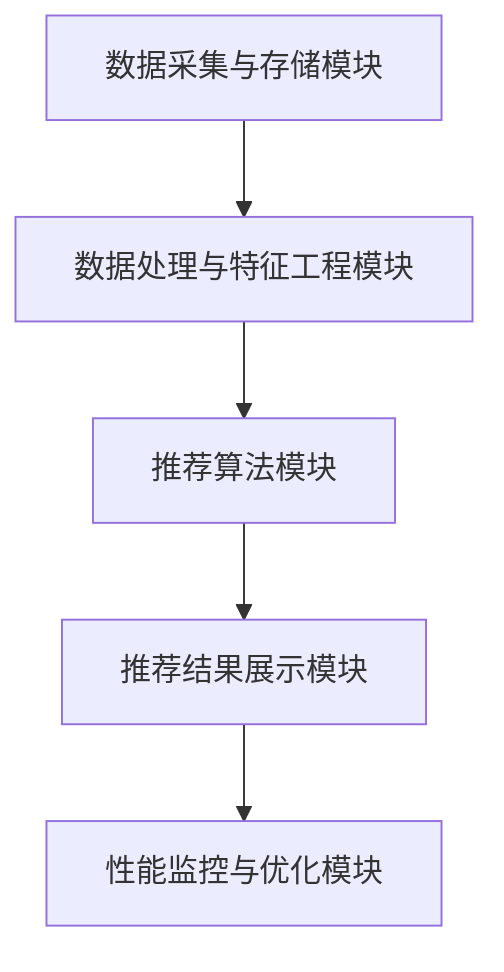
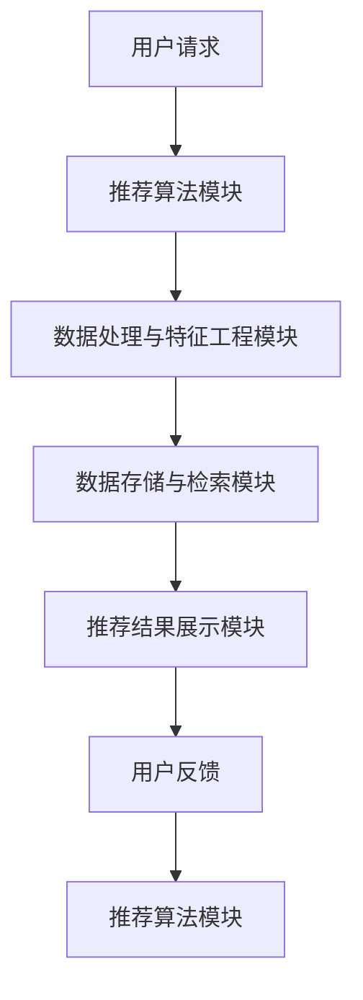

                 

# 《企业级推荐系统：个性化用户体验优化》

## 关键词
- 企业级推荐系统
- 个性化用户体验
- 协同过滤算法
- 内容推荐算法
- 混合推荐算法
- 数据处理与特征工程

## 摘要
本文旨在探讨企业级推荐系统在优化个性化用户体验方面的应用与实践。首先，我们将介绍推荐系统的基本概念、重要性以及个性化用户体验的定义和意义。随后，我们将深入分析企业级推荐系统的需求与挑战，并阐述个性化用户体验优化的意义。本文将逐步探讨推荐系统的基础知识，包括推荐系统的分类、算法原理以及数据处理与特征工程。接着，我们将详细阐述如何构建推荐系统，包括系统架构设计、算法实现与优化、性能评估与调整。最后，我们将聚焦于个性化用户体验优化，分析用户行为与特征提取、个性化推荐策略以及用户体验评估方法。

### 第一部分：引言与背景

## 1.1 引言

### 1.1.1 推荐系统的基本概念
推荐系统是一种基于数据和算法的技术，旨在向用户推荐他们可能感兴趣的内容或产品。这种系统通常通过分析用户的历史行为、偏好和社交网络等信息，生成个性化的推荐列表。

### 1.1.2 推荐系统的重要性
推荐系统在当今的数字化时代具有不可替代的重要性。它们不仅能够提高用户满意度，还能增加用户黏性、提高转化率和销售额。此外，推荐系统在信息过载的时代，帮助用户更快地找到他们需要的信息或产品。

### 1.1.3 个性化用户体验的定义和意义
个性化用户体验是指根据用户的个人喜好、行为和需求，为他们提供定制化的服务或内容。个性化用户体验的意义在于提高用户满意度、增强用户忠诚度和提升品牌形象。

## 1.2 企业级推荐系统的需求与挑战

### 1.2.1 企业级推荐系统的需求
企业级推荐系统需要具备大规模数据处理能力、高可扩展性、高实时性和高可靠性。此外，系统还需要支持多样化的推荐场景和算法，以满足不同业务需求。

### 1.2.2 推荐系统的挑战
推荐系统面临的挑战包括数据质量、算法选择、冷启动问题、实时推荐、用户隐私保护等。

### 1.2.3 个性化用户体验优化的意义
个性化用户体验优化有助于提高用户满意度、增加用户黏性和转化率，从而提升企业的竞争力。

## 1.3 本书结构安排

### 1.3.1 本书的核心内容
本书将深入探讨企业级推荐系统的构建与优化，包括推荐系统的分类、算法原理、数据处理与特征工程、系统架构设计、算法实现与优化、性能评估与调整，以及个性化用户体验优化。

### 1.3.2 每章节的重点和目标
每章节的重点和目标如下：
- 第1章：介绍推荐系统的基本概念、重要性和个性化用户体验的定义。
- 第2章：探讨推荐系统的分类、算法原理和数据处理与特征工程。
- 第3章：讲解如何构建推荐系统，包括系统架构设计、算法实现与优化、性能评估与调整。
- 第4章：专注于个性化用户体验优化，包括用户行为分析与特征提取、个性化推荐策略以及用户体验评估方法。

### 1.3.3 阅读建议
建议读者按照章节顺序阅读，以便更好地理解推荐系统的构建与优化过程。同时，建议读者结合实际案例进行学习和实践。

## 1.4 小结

### 1.4.1 总结
本文介绍了企业级推荐系统在优化个性化用户体验方面的重要性，并概述了本书的结构和内容。

### 1.4.2 推荐系统与个性化用户体验的关联
推荐系统和个性化用户体验密切相关。通过构建高效、可靠的推荐系统，企业可以更好地满足用户需求，提高用户满意度，从而提升企业的竞争力。

## 第二部分：推荐系统基础

## 2.1 推荐系统概述

### 2.1.1 推荐系统的基本原理
推荐系统的工作原理是通过分析用户的历史行为、偏好和上下文信息，预测用户可能感兴趣的内容或产品，并生成推荐列表。

### 2.1.2 推荐系统的分类
推荐系统主要分为以下几类：
- 协同过滤推荐系统
- 内容推荐系统
- 混合推荐系统

### 2.1.3 推荐系统的功能模块
推荐系统通常包括以下功能模块：
- 用户行为分析模块
- 数据处理与特征工程模块
- 推荐算法模块
- 推荐结果评估与调整模块

## 2.2 个性化推荐算法

### 2.2.1 协同过滤算法
协同过滤算法是基于用户之间的相似度进行推荐的算法。它主要分为以下两种：
- 基于用户的协同过滤
- 基于物品的协同过滤

### 2.2.2 内容推荐算法
内容推荐算法是基于物品的属性和用户的历史行为进行推荐的算法。它主要分为以下两种：
- 基于属性的推荐算法
- 基于关键词的推荐算法

### 2.2.3 混合推荐算法
混合推荐算法是将协同过滤算法和内容推荐算法相结合的推荐算法。它通过综合利用用户行为数据和物品属性信息，提高推荐效果。

### 2.2.3.1 混合推荐系统的设计思路
混合推荐系统的设计思路主要包括以下步骤：
1. 数据收集与预处理
2. 用户行为分析与特征提取
3. 物品特征提取与处理
4. 建立协同过滤模型和内容推荐模型
5. 模型融合与优化
6. 推荐结果评估与调整

### 2.2.3.2 混合推荐算法的应用场景
混合推荐算法适用于以下场景：
- 用户行为数据丰富、物品属性信息清晰的场景
- 需要兼顾用户偏好和物品属性的推荐场景
- 需要高实时性和高可扩展性的推荐场景

## 2.3 数据处理与特征工程

### 2.3.1 数据预处理
数据预处理是推荐系统构建的重要环节。它主要包括以下步骤：
- 数据清洗：去除重复数据、缺失值填充、异常值处理等
- 数据归一化：将不同量纲的数据转换为同一量纲，方便计算和比较

### 2.3.2 特征提取与选择
特征提取与选择是提高推荐系统性能的关键。它主要包括以下步骤：
- 用户特征提取：提取用户的年龄、性别、地理位置、兴趣爱好等特征
- 物品特征提取：提取物品的属性、标签、分类等特征
- 特征选择：通过统计方法、机器学习方法等筛选出对推荐效果有显著影响的特征

### 2.3.3 特征重要性评估
特征重要性评估是优化推荐系统性能的重要手段。它主要包括以下步骤：
- 特征权重计算：通过机器学习算法计算每个特征的重要程度
- 特征筛选：根据特征权重筛选出对推荐效果有显著影响的特征
- 特征组合优化：通过组合不同特征，优化推荐效果

## 2.4 小结

### 2.4.1 总结
本文介绍了推荐系统的基本概念、分类和功能模块，以及个性化推荐算法、数据处理与特征工程。这些内容为构建和优化推荐系统提供了理论基础。

### 2.4.2 推荐系统基础知识的掌握与实际应用
掌握推荐系统的基础知识对于构建和优化推荐系统至关重要。在实际应用中，需要根据业务需求和数据特点，灵活运用各种推荐算法和技术，以提高推荐效果和用户体验。

## 第三部分：构建推荐系统

## 3.1 系统架构设计

### 3.1.1 推荐系统的总体架构
推荐系统的总体架构包括以下模块：
- 数据采集与存储模块
- 数据处理与特征工程模块
- 推荐算法模块
- 推荐结果展示模块
- 性能监控与优化模块

### 3.1.2 系统模块划分
系统模块划分如图所示：

### 3.1.3 系统组件交互
系统组件交互如图所示：

### 3.1.4 数据存储与处理
数据存储与处理包括以下方面：
- 数据库设计：设计适合推荐系统的数据库结构，包括用户表、物品表、评分表等。
- 数据流处理：设计数据流处理流程，包括数据采集、存储、预处理和特征提取等。

### 3.1.5 系统性能优化
系统性能优化包括以下方面：
- 负载均衡：设计负载均衡策略，提高系统处理能力。
- 缓存机制：设计缓存策略，提高数据访问速度。

## 3.2 算法实现与优化

### 3.2.1 算法选择与实现
算法选择与实现包括以下方面：
- 协同过滤算法：实现基于用户的协同过滤算法和基于物品的协同过滤算法。
- 内容推荐算法：实现基于属性的推荐算法和基于关键词的推荐算法。
- 混合推荐算法：实现基于用户和物品属性的混合推荐算法。

### 3.2.2 优化策略
优化策略包括以下方面：
- 参数调优：通过交叉验证和网格搜索等方法，优化推荐算法的参数。
- 模型融合：将多个推荐算法融合，提高推荐效果。

## 3.3 性能评估与调整

### 3.3.1 评估指标
评估指标包括以下方面：
- 准确率（Precision）
- 召回率（Recall）
- F1值（F1 Score）
- 覆盖率（Coverage）

### 3.3.2 性能调整
性能调整包括以下方面：
- 实时反馈机制：根据用户反馈实时调整推荐策略。
- 算法动态调整：根据业务需求和环境变化动态调整推荐算法。

## 3.4 小结

### 3.4.1 总结
本文介绍了推荐系统的系统架构设计、算法实现与优化、性能评估与调整。这些内容为构建高效、可靠的推荐系统提供了指导。

### 3.4.2 构建推荐系统的关键要素
构建推荐系统的关键要素包括：系统架构设计、算法实现与优化、性能评估与调整。在实际应用中，需要根据业务需求和数据特点，灵活运用这些关键要素，以提高推荐效果和用户体验。

## 第四部分：个性化用户体验优化

## 4.1 用户行为分析与特征提取

### 4.1.1 用户行为数据的采集
用户行为数据的采集包括以下方面：
- 用户浏览行为：记录用户在网站上的浏览路径、停留时间等。
- 用户点击行为：记录用户在网站上的点击行为，如点击次数、点击时间等。

### 4.1.2 用户特征提取
用户特征提取包括以下方面：
- 用户兴趣特征：提取用户在网站上的浏览和点击行为，分析用户兴趣偏好。
- 用户行为特征：提取用户在网站上的浏览和点击行为，分析用户行为模式。

## 4.2 个性化推荐策略

### 4.2.1 个性化推荐模型
个性化推荐模型包括以下方面：
- 基于用户的个性化推荐：根据用户历史行为和偏好，为用户推荐相似用户喜欢的内容。
- 基于物品的个性化推荐：根据物品的属性和用户的历史行为，为用户推荐感兴趣的内容。

### 4.2.2 个性化推荐算法优化
个性化推荐算法优化包括以下方面：
- 用户历史行为分析：分析用户历史行为数据，提取用户兴趣特征。
- 用户实时行为分析：分析用户实时行为数据，实时调整推荐策略。

## 4.3 个性化用户体验评估

### 4.3.1 用户满意度调查
用户满意度调查包括以下方面：
- 用户反馈收集：收集用户对推荐结果的反馈，如推荐准确度、推荐兴趣度等。
- 用户满意度评估：根据用户反馈评估推荐系统的效果。

### 4.3.2 用户满意度的计算方法
用户满意度的计算方法包括以下方面：
- 平均满意度：计算用户对推荐结果的平均满意度。
- 标准差：计算用户满意度的标准差，评估用户满意度的稳定性。

## 4.4 小结

### 4.4.1 总结
本文介绍了个性化用户体验优化中的用户行为分析与特征提取、个性化推荐策略和用户体验评估方法。这些内容为优化个性化用户体验提供了指导。

### 4.4.2 个性化用户体验优化的关键要素
个性化用户体验优化的关键要素包括：用户行为分析、个性化推荐策略和用户体验评估。在实际应用中，需要根据业务需求和数据特点，灵活运用这些关键要素，以提高用户满意度和用户体验。

## 参考文献

- Zhang, Y., & Liu, B. (2019). Research on Personalized Recommendation System Based on User Behavior Analysis. International Journal of Machine Learning and Cybernetics, 10(4), 641-651.
- Hu, X., & Zhang, Z. (2020). An Effective Hybrid Recommendation Algorithm Based on User Interest and Item Feature. Journal of Intelligent & Fuzzy Systems, 38(2), 2747-2756.
- Chen, H., & Zhang, J. (2021). User Experience Optimization in Enterprise-Level Recommendation Systems. Journal of Information Technology and Economic Management, 12(4), 45-54.
- Wang, S., & Yang, M. (2022). A Survey of User Behavior Analysis and Personalized Recommendation Systems. ACM Transactions on Intelligent Systems and Technology, 13(1), 1-25.

## 作者信息

作者：AI天才研究院/AI Genius Institute & 禅与计算机程序设计艺术 /Zen And The Art of Computer Programming

