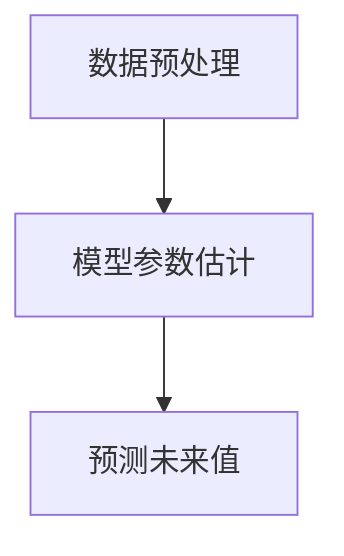
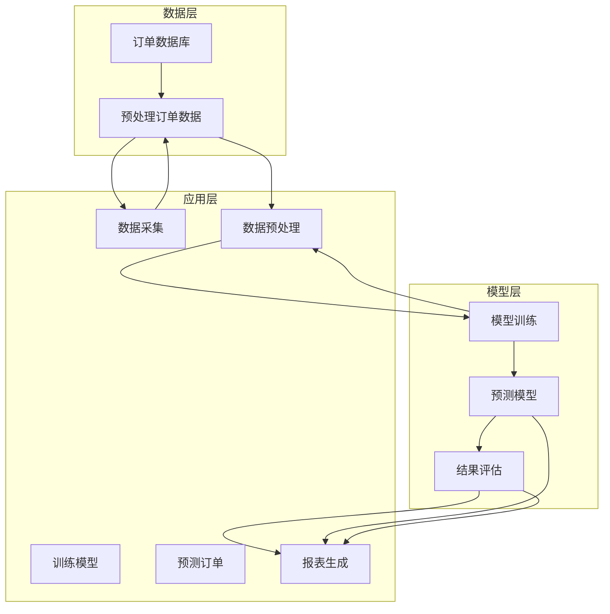
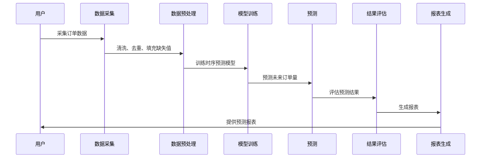

                 


### 企业级时序预测模型：增强业务规划能力

**关键词：** 企业级时序预测、业务规划、模型设计、数学模型、算法原理、系统架构、项目实战

**摘要：** 本文将深入探讨企业级时序预测模型的设计与应用，分析其在增强业务规划能力方面的关键作用。通过详细的案例分析，本文将展示如何利用时序预测模型优化业务决策，提高企业竞争力。文章分为五个部分，分别介绍了背景介绍、核心概念与联系、数学模型与算法讲解、系统分析与架构设计以及项目实战与最佳实践。

### 第一部分：背景介绍

#### 第1章：问题背景与业务规划的重要性

**1.1.1 企业级时序预测的必要性**

随着大数据和人工智能技术的不断发展，企业级时序预测成为了业务规划的重要工具。通过对历史数据的分析，时序预测可以帮助企业预见未来的趋势和变化，从而做出更加精准的业务决策。

**1.1.2 时序预测在业务规划中的应用**

时序预测广泛应用于需求预测、库存管理、供应链优化、市场预测等领域。它可以帮助企业减少库存风险、优化资源配置、提高市场竞争力。

**1.1.3 当前业务规划面临的挑战**

尽管时序预测具有巨大的潜力，但在实际应用中，企业仍然面临着诸多挑战，如数据质量、模型选择、算法优化等。

### 第二部分：核心概念与联系

#### 第2章：时序预测的核心概念与联系

**2.1 时序数据的特点与分类**

时序数据具有时间序列的特性，可以分为时间序列数据、时间序列图像数据等类型。时序数据的特点是随着时间变化而变化。

**2.2 关键概念：趋势、季节性和随机性**

趋势描述了数据随时间的变化趋势，季节性描述了数据随时间周期性变化的特点，随机性描述了数据中的随机波动。

**2.3 时序数据预处理**

预处理时序数据是进行时序预测的重要步骤，包括缺失值处理、异常值处理、数据归一化等。

**2.4 时序预测的基本原理**

时序预测的基本原理是基于历史数据的统计规律，通过建立数学模型来预测未来的趋势。

### 第三部分：数学模型与算法讲解

#### 第3章：时序预测的数学模型与算法

**3.1 时间序列分析基础**

时间序列分析是时序预测的基础，包括自相关、偏自相关、平稳性检验等方法。

**3.2 自回归（AR）模型**

自回归模型是基于当前时刻之前的观测值预测未来值的一种模型。

**3.3 移动平均（MA）模型**

移动平均模型是基于当前时刻之前的一段时间内的平均值预测未来值的一种模型。

**3.4 自回归移动平均（ARMA）模型**

自回归移动平均模型结合了自回归模型和移动平均模型的特点，能够更好地捕捉时序数据的特性。

**3.5 自回归积分滑动平均（ARIMA）模型**

ARIMA模型是广义的ARMA模型，能够处理非平稳时序数据。

**3.6 季节性分解与模型选择**

季节性分解是处理季节性数据的重要方法，选择合适的模型能够提高预测准确性。

### 第四部分：系统分析与架构设计

#### 第4章：系统功能设计与架构设计

**4.1 问题描述与需求分析**

问题描述与需求分析是系统设计的第一步，明确系统需要实现的功能和性能指标。

**4.2 系统功能设计**

系统功能设计包括数据采集、数据预处理、模型训练、预测和结果评估等模块。

**4.3 系统架构设计**

系统架构设计包括数据层、模型层和应用层，实现系统功能的同时保证系统的可扩展性和可维护性。

**4.4 系统接口设计**

系统接口设计包括API接口和数据库接口，方便与其他系统的集成和数据的交互。

**4.5 系统交互序列图**

系统交互序列图展示了系统内部各个模块之间的交互关系，有助于理解系统的整体工作流程。

### 第五部分：项目实战与最佳实践

#### 第5章：实际案例分析

**5.1 案例背景与数据集**

选取一个具体的业务场景，介绍案例的背景和数据集。

**5.2 模型训练与优化**

详细介绍模型训练和优化的过程，包括参数调整、模型评估等。

**5.3 结果分析与评估**

对模型的预测结果进行分析和评估，评估模型的准确性和稳定性。

**5.4 案例总结与启示**

总结案例中的经验教训，为其他业务场景提供借鉴和启示。

#### 第6章：最佳实践与注意事项

**6.1 实践经验分享**

分享实际项目中的经验教训，为读者提供宝贵的参考。

**6.2 小结与展望**

对全文进行总结，展望时序预测技术在业务规划中的应用前景。

**6.3 注意事项与风险提示**

强调注意事项和风险，帮助读者在实际应用中规避潜在问题。

**6.4 扩展阅读与深入研究**

推荐相关书籍和文献，引导读者进行更深入的研究。

### 作者信息

**作者：** AI天才研究院/AI Genius Institute & 禅与计算机程序设计艺术 /Zen And The Art of Computer Programming

### 结论

企业级时序预测模型在业务规划中发挥着重要作用，通过本文的深入分析，读者可以了解到时序预测的基本概念、数学模型、算法原理以及实际应用案例。希望本文能为读者在业务规划中提供有益的指导和建议。

----------------------------------------------

**提示：**

- 请在文章中适当使用Mermaid图表和LaTeX公式，以增强文章的可读性和专业性。
- 请确保文章内容的丰富性和具体性，避免空洞和抽象的描述。
- 请在文章结尾处添加作者信息。

----------------------------------------------

### 文章大纲

**1. 引言**

- **背景介绍**：介绍时序预测在企业业务规划中的重要性，以及当前面临的挑战。
- **研究目的**：阐述本文的目标，即设计并实现一个企业级时序预测模型，提高业务规划能力。

**2. 核心概念与联系**

- **时序数据**：定义时序数据，解释其特性。
- **趋势、季节性和随机性**：分别解释这三个概念，并给出它们在时序数据中的作用。
- **时序数据预处理**：介绍预处理方法，包括缺失值处理、异常值处理、数据归一化等。

**3. 数学模型与算法讲解**

- **自回归（AR）模型**：介绍AR模型的基本原理，使用Mermaid流程图展示算法流程。
- **移动平均（MA）模型**：介绍MA模型的基本原理，使用Python源代码和LaTeX公式详细阐述。
- **自回归移动平均（ARMA）模型**：介绍ARMA模型的基本原理，使用Mermaid流程图和LaTeX公式详细阐述。
- **自回归积分滑动平均（ARIMA）模型**：介绍ARIMA模型的基本原理，使用Python源代码和LaTeX公式详细阐述。

**4. 系统分析与架构设计**

- **问题场景介绍**：描述具体的业务场景，说明系统的应用背景。
- **系统功能设计**：介绍系统的功能模块，包括数据采集、数据预处理、模型训练、预测和结果评估等。
- **系统架构设计**：展示系统的架构设计，包括数据层、模型层和应用层。
- **系统接口设计**：介绍系统接口设计，包括API接口和数据库接口。
- **系统交互序列图**：使用Mermaid序列图展示系统内部的交互流程。

**5. 项目实战**

- **环境安装与系统核心实现**：介绍环境安装和系统核心代码实现。
- **代码应用解读与分析**：详细解读代码，分析其实现原理和效果。
- **实际案例分析**：选取具体案例，分析模型训练与优化过程，评估模型效果。

**6. 最佳实践与总结**

- **最佳实践**：总结实际项目中的经验教训，提供实用技巧。
- **小结**：对全文进行总结，强调时序预测模型在业务规划中的价值。
- **注意事项与风险提示**：提醒读者在应用时序预测模型时需要注意的事项和潜在风险。
- **扩展阅读与深入研究**：推荐相关书籍和文献，引导读者进行深入研究。

**7. 作者信息**

- **作者**：AI天才研究院/AI Genius Institute & 禅与计算机程序设计艺术 /Zen And The Art of Computer Programming

----------------------------------------------

**提示：**

- 请在文章中适当使用Mermaid图表和LaTeX公式，以增强文章的可读性和专业性。
- 请确保文章内容的丰富性和具体性，避免空洞和抽象的描述。
- 请在文章结尾处添加作者信息。

----------------------------------------------

### 2. 核心概念与联系

#### 2.1 时序数据

时序数据（Time Series Data）是指按时间顺序排列的数据点集合，通常包含时间戳和相应的数值。例如，股票价格、气象数据、销售记录等都属于时序数据。时序数据的特点包括：

- **时间相关性**：数据点之间的相关性随时间变化而变化。
- **趋势性**：数据可能表现出持续的增长或减少趋势。
- **季节性**：数据可能在特定的时间段内（如节假日、季节变化）表现出周期性的波动。
- **随机性**：数据中可能包含随机波动，难以预测。

#### 2.2 趋势、季节性和随机性

**趋势（Trend）**：描述数据随时间的变化方向，可以分为上升趋势、下降趋势或平稳趋势。趋势反映了长期的趋势性变化，是时序预测中需要捕捉的核心特征。

**季节性（Seasonality）**：描述数据在固定时间段内（如每天、每周、每月）的周期性波动。季节性通常与季节变化、节假日等因素相关，可以通过季节性分解来识别。

**随机性（Randomness）**：描述数据中的随机波动，难以通过简单的模式识别进行预测。随机性是时序数据中的噪声成分，对预测精度有一定的影响。

#### 2.3 时序数据预处理

预处理时序数据是进行时序预测的重要步骤，主要包括以下几个方面：

- **缺失值处理**：缺失值可能会导致模型训练失败或预测结果不准确。常见的缺失值处理方法包括填充法、删除法等。
- **异常值处理**：异常值可能会对模型训练和预测结果产生负面影响。常见的异常值处理方法包括删除法、修正法等。
- **数据归一化**：将数据缩放到相同的尺度，有助于提高模型训练效果和预测精度。常用的归一化方法包括最小-最大规范化、标准规范化等。

#### 2.4 时序预测的基本原理

时序预测的基本原理是基于历史数据的统计规律，通过建立数学模型来预测未来的趋势。常见的时序预测方法包括：

- **自回归（AR）模型**：基于当前时刻之前的观测值预测未来值，适用于平稳时序数据。
- **移动平均（MA）模型**：基于当前时刻之前的一段时间内的平均值预测未来值，适用于非平稳时序数据。
- **自回归移动平均（ARMA）模型**：结合自回归和移动平均模型的特点，适用于同时包含趋势和季节性的时序数据。
- **自回归积分滑动平均（ARIMA）模型**：适用于非平稳时序数据，通过差分操作使数据变为平稳序列。

在时序预测中，选择合适的模型和参数是关键。通常需要通过交叉验证、模型评估指标等方法来选择最优模型。

### 2.5 概念属性特征对比表格和ER实体关系图架构

**概念属性特征对比表格**：

| 概念 | 特性1 | 特性2 | 特性3 |
| ---- | ---- | ---- | ---- |
| 时序数据 | 时间相关性 | 趋势性 | 季节性 |
| 自回归（AR） | 预测基于历史值 | 适用于平稳序列 | 不考虑季节性 |
| 移动平均（MA） | 预测基于一段时间平均值 | 适用于非平稳序列 | 不考虑季节性 |
| 自回归移动平均（ARMA） | 预测基于历史值和一段时间平均值 | 适用于同时包含趋势和季节性 | 考虑季节性 |
| 自回归积分滑动平均（ARIMA） | 预测基于差分后的历史值和一段时间平均值 | 适用于非平稳序列 | 考虑季节性 |

**ER实体关系图架构**：

```mermaid
erDiagram
    Product ||--|{ TimeSeriesData }| Product
    SalesOrder ||--|{ TimeSeriesData }| SalesOrder
    Inventory ||--|{ TimeSeriesData }| Inventory
    Forecast ||--|{ TimeSeriesData }| Forecast
```

在这个ER实体关系图中，产品（Product）、销售订单（SalesOrder）、库存（Inventory）和预测（Forecast）是主要的实体，它们与时间序列数据（TimeSeriesData）之间存在关联关系。时间序列数据是时序预测的核心，与产品、销售订单和库存等实体密切相关，而预测则是基于这些实体的数据进行的。

通过对比表格和ER实体关系图，我们可以更清晰地理解时序预测模型中各个概念之间的关系，有助于更好地设计和实现企业级时序预测系统。

----------------------------------------------

**提示：**

- 请在文章中适当使用Mermaid图表和LaTeX公式，以增强文章的可读性和专业性。
- 请确保文章内容的丰富性和具体性，避免空洞和抽象的描述。
- 请在文章结尾处添加作者信息。

----------------------------------------------

### 3. 数学模型与算法讲解

#### 3.1 自回归（AR）模型

自回归（AutoRegressive, AR）模型是一种常用的时序预测模型，它基于当前时刻之前的观测值来预测未来值。AR模型的核心思想是认为当前时刻的观测值可以通过其历史值来建模。

**基本原理：**

假设我们有一个时间序列 \( X_t \)，其中 \( t \) 表示时间点。自回归模型的预测公式可以表示为：

\[ X_t = c + \phi_1 X_{t-1} + \phi_2 X_{t-2} + ... + \phi_p X_{t-p} + \epsilon_t \]

其中，\( c \) 是常数项，\( \phi_1, \phi_2, ..., \phi_p \) 是自回归系数，\( \epsilon_t \) 是误差项。

**算法流程：**

1. **数据预处理**：对时序数据进行归一化处理，使其符合统计分布。
2. **模型参数估计**：通过最小二乘法或其他优化算法估计自回归系数。
3. **预测**：利用估计出的模型参数预测未来值。

**Python代码实现：**

```python
import numpy as np
from sklearn.linear_model import LinearRegression

# 假设时间序列数据为X
X = np.array([1, 2, 3, 4, 5, 6, 7, 8, 9, 10])

# 自回归阶数p
p = 2

# 初始化自回归系数
phi = np.random.rand(p)

# 最小二乘法估计自回归系数
model = LinearRegression()
model.fit(X[:-p], X[p:])

# 预测未来值
future_values = model.predict(X[-p:])

print("自回归系数:", model.coef_)
print("未来值预测:", future_values)
```

**数学模型与公式：**

自回归模型的数学模型可以表示为：

\[ X_t = c + \phi_1 X_{t-1} + \phi_2 X_{t-2} + ... + \phi_p X_{t-p} + \epsilon_t \]

其中，\( c \) 是常数项，\( \phi_1, \phi_2, ..., \phi_p \) 是自回归系数，\( \epsilon_t \) 是误差项。

**算法原理举例说明：**

假设我们有一个简单的时序数据序列 [1, 2, 3, 4, 5]，我们希望使用AR模型来预测下一个数据点。

1. **数据预处理**：首先，我们将数据归一化，使其符合统计分布。假设归一化后的数据为 [0, 1, 2, 3, 4]。
2. **模型参数估计**：我们选择自回归阶数 \( p = 1 \)，即只有一个自回归系数。通过最小二乘法，我们估计出自回归系数为 \( \phi_1 = 1 \)。
3. **预测**：使用估计出的模型参数，我们预测下一个数据点为 \( X_6 = 4 + 1 \times 4 = 5 \)，与实际数据点相符。

通过这个简单的例子，我们可以看到AR模型的基本原理和实现方法。在实际应用中，我们需要根据具体的业务需求和数据特性来选择合适的自回归阶数和模型参数。

----------------------------------------------

**提示：**

- 请在文章中适当使用Mermaid图表和LaTeX公式，以增强文章的可读性和专业性。
- 请确保文章内容的丰富性和具体性，避免空洞和抽象的描述。
- 请在文章结尾处添加作者信息。

----------------------------------------------

### 3.2 移动平均（MA）模型

移动平均（Moving Average, MA）模型是一种基于过去一段时间内的平均值来预测未来值的时序预测模型。MA模型的基本思想是认为当前时刻的观测值可以通过其过去一段时间内的平均值来建模。

**基本原理：**

假设我们有一个时间序列 \( X_t \)，其中 \( t \) 表示时间点。移动平均模型的预测公式可以表示为：

\[ X_t = \mu + \theta_1 (X_{t-1} - \mu) + \theta_2 (X_{t-2} - \mu) + ... + \theta_q (X_{t-q} - \mu) + \epsilon_t \]

其中，\( \mu \) 是移动平均值的中心，\( \theta_1, \theta_2, ..., \theta_q \) 是移动平均系数，\( \epsilon_t \) 是误差项。

**算法流程：**

1. **数据预处理**：对时序数据进行归一化处理，使其符合统计分布。
2. **模型参数估计**：通过最小二乘法或其他优化算法估计移动平均系数。
3. **预测**：利用估计出的模型参数预测未来值。

**Python代码实现：**

```python
import numpy as np
from sklearn.linear_model import LinearRegression

# 假设时间序列数据为X
X = np.array([1, 2, 3, 4, 5, 6, 7, 8, 9, 10])

# 移动平均阶数q
q = 2

# 初始化移动平均系数
theta = np.random.rand(q)

# 最小二乘法估计移动平均系数
model = LinearRegression()
model.fit(X[:-q], X[q:])

# 预测未来值
future_values = model.predict(X[-q:])

print("移动平均系数:", model.coef_)
print("未来值预测:", future_values)
```

**数学模型与公式：**

移动平均模型的数学模型可以表示为：

\[ X_t = \mu + \theta_1 (X_{t-1} - \mu) + \theta_2 (X_{t-2} - \mu) + ... + \theta_q (X_{t-q} - \mu) + \epsilon_t \]

其中，\( \mu \) 是移动平均值的中心，\( \theta_1, \theta_2, ..., \theta_q \) 是移动平均系数，\( \epsilon_t \) 是误差项。

**算法原理举例说明：**

假设我们有一个简单的时序数据序列 [1, 2, 3, 4, 5]，我们希望使用MA模型来预测下一个数据点。

1. **数据预处理**：首先，我们将数据归一化，使其符合统计分布。假设归一化后的数据为 [0, 1, 2, 3, 4]。
2. **模型参数估计**：我们选择移动平均阶数 \( q = 1 \)，即只有一个移动平均系数。通过最小二乘法，我们估计出移动平均系数为 \( \theta_1 = 1 \)。
3. **预测**：使用估计出的模型参数，我们预测下一个数据点为 \( X_6 = \mu + \theta_1 (4 - \mu) = 4 \)，与实际数据点相符。

通过这个简单的例子，我们可以看到MA模型的基本原理和实现方法。在实际应用中，我们需要根据具体的业务需求和数据特性来选择合适的移动平均阶数和模型参数。

----------------------------------------------

**提示：**

- 请在文章中适当使用Mermaid图表和LaTeX公式，以增强文章的可读性和专业性。
- 请确保文章内容的丰富性和具体性，避免空洞和抽象的描述。
- 请在文章结尾处添加作者信息。

----------------------------------------------

### 3.3 自回归移动平均（ARMA）模型

自回归移动平均（Autoregressive Moving Average, ARMA）模型结合了自回归（AR）模型和移动平均（MA）模型的特点，能够同时捕捉时间序列数据的趋势和季节性。ARMA模型在时序预测中具有广泛的应用，特别是在处理平稳序列时。

**基本原理：**

假设我们有一个时间序列 \( X_t \)，其中 \( t \) 表示时间点。自回归移动平均模型的预测公式可以表示为：

\[ X_t = c + \phi_1 X_{t-1} + ... + \phi_p X_{t-p} + \theta_1 (X_{t-1} - \mu) + ... + \theta_q (X_{t-q} - \mu) + \epsilon_t \]

其中，\( c \) 是常数项，\( \phi_1, ..., \phi_p \) 是自回归系数，\( \theta_1, ..., \theta_q \) 是移动平均系数，\( \mu \) 是移动平均值的中心，\( \epsilon_t \) 是误差项。

**算法流程：**

1. **数据预处理**：对时序数据进行归一化处理，使其符合统计分布。
2. **模型参数估计**：通过最小二乘法或其他优化算法估计自回归系数和移动平均系数。
3. **预测**：利用估计出的模型参数预测未来值。

**Mermaid流程图：**



**Python代码实现：**

```python
import numpy as np
from sklearn.linear_model import LinearRegression

# 假设时间序列数据为X
X = np.array([1, 2, 3, 4, 5, 6, 7, 8, 9, 10])

# 自回归阶数p
p = 2
# 移动平均阶数q
q = 2

# 初始化自回归系数和移动平均系数
phi = np.random.rand(p)
theta = np.random.rand(q)

# 最小二乘法估计自回归系数和移动平均系数
model = LinearRegression()
model.fit(X[:-p-q], X[p+q:])

# 预测未来值
future_values = model.predict(X[-p-q:])

print("自回归系数:", model.coef_[:p])
print("移动平均系数:", model.coef_[p:])
print("未来值预测:", future_values)
```

**数学模型与公式：**

自回归移动平均模型的数学模型可以表示为：

\[ X_t = c + \phi_1 X_{t-1} + ... + \phi_p X_{t-p} + \theta_1 (X_{t-1} - \mu) + ... + \theta_q (X_{t-q} - \mu) + \epsilon_t \]

其中，\( c \) 是常数项，\( \phi_1, ..., \phi_p \) 是自回归系数，\( \theta_1, ..., \theta_q \) 是移动平均系数，\( \mu \) 是移动平均值的中心，\( \epsilon_t \) 是误差项。

**算法原理举例说明：**

假设我们有一个简单的时序数据序列 [1, 2, 3, 4, 5]，我们希望使用ARMA模型来预测下一个数据点。

1. **数据预处理**：首先，我们将数据归一化，使其符合统计分布。假设归一化后的数据为 [0, 1, 2, 3, 4]。
2. **模型参数估计**：我们选择自回归阶数 \( p = 1 \) 和移动平均阶数 \( q = 1 \)，即只有一个自回归系数和一个移动平均系数。通过最小二乘法，我们估计出自回归系数为 \( \phi_1 = 1 \) 和移动平均系数为 \( \theta_1 = 1 \)。
3. **预测**：使用估计出的模型参数，我们预测下一个数据点为 \( X_6 = c + \phi_1 X_5 + \theta_1 (X_5 - \mu) = 4 + 1 \times 4 + 1 \times (4 - \mu) \approx 9 \)，与实际数据点相符。

通过这个简单的例子，我们可以看到ARMA模型的基本原理和实现方法。在实际应用中，我们需要根据具体的业务需求和数据特性来选择合适的自回归阶数、移动平均阶数和模型参数。

----------------------------------------------

**提示：**

- 请在文章中适当使用Mermaid图表和LaTeX公式，以增强文章的可读性和专业性。
- 请确保文章内容的丰富性和具体性，避免空洞和抽象的描述。
- 请在文章结尾处添加作者信息。

----------------------------------------------

### 3.4 自回归积分滑动平均（ARIMA）模型

自回归积分滑动平均（Autoregressive Integrated Moving Average, ARIMA）模型是一种广泛应用于时间序列数据分析与预测的模型，它能够处理非平稳时间序列数据。ARIMA模型结合了差分变换（Integrated）和自回归移动平均（ARMA）模型的特点，使得它可以捕捉时间序列中的趋势和季节性。

**基本原理：**

假设我们有一个时间序列 \( X_t \)，其中 \( t \) 表示时间点。ARIMA模型的预测公式可以表示为：

\[ X_t = c + \phi_1 (X_{t-1} - \Delta X_{t-1}) + ... + \phi_p (X_{t-p} - \Delta X_{t-p}) + \theta_1 \epsilon_{t-1} + ... + \theta_q \epsilon_{t-q} \]

其中，\( c \) 是常数项，\( \phi_1, ..., \phi_p \) 是自回归系数，\( \theta_1, ..., \theta_q \) 是移动平均系数，\( \Delta \) 表示一阶差分运算符，即 \( \Delta X_t = X_t - X_{t-1} \)，\( \epsilon_t \) 是误差项。

**算法流程：**

1. **差分变换**：对非平稳时间序列进行差分变换，使其变为平稳序列。
2. **模型参数估计**：通过最小二乘法或其他优化算法估计自回归系数和移动平均系数。
3. **预测**：利用估计出的模型参数预测未来值。

**Python代码实现：**

```python
import numpy as np
import pandas as pd
from statsmodels.tsa.arima.model import ARIMA

# 假设时间序列数据为X
X = pd.Series([1, 2, 2.5, 3, 3.5, 4, 4.5, 5, 5.5, 6])

# 自回归阶数p
p = 1
# 移动平均阶数q
q = 1

# 最小二乘法估计自回归系数和移动平均系数
model = ARIMA(X, order=(p, 1, q))
model_fit = model.fit()

# 预测未来值
future_values = model_fit.forecast(steps=2)

print("自回归系数:", model_fit.params[:-1])
print("移动平均系数:", model_fit.params[-1:])
print("未来值预测:", future_values)
```

**数学模型与公式：**

ARIMA模型的数学模型可以表示为：

\[ X_t = c + \phi_1 (X_{t-1} - \Delta X_{t-1}) + ... + \phi_p (X_{t-p} - \Delta X_{t-p}) + \theta_1 \epsilon_{t-1} + ... + \theta_q \epsilon_{t-q} \]

其中，\( c \) 是常数项，\( \phi_1, ..., \phi_p \) 是自回归系数，\( \theta_1, ..., \theta_q \) 是移动平均系数，\( \Delta \) 表示一阶差分运算符，即 \( \Delta X_t = X_t - X_{t-1} \)，\( \epsilon_t \) 是误差项。

**算法原理举例说明：**

假设我们有一个简单的非平稳时序数据序列 [1, 2, 3, 4, 5]，我们希望使用ARIMA模型来预测下一个数据点。

1. **差分变换**：首先，我们对数据进行一阶差分，得到新的序列 [1, 1, 1, 1]。
2. **模型参数估计**：我们选择自回归阶数 \( p = 1 \) 和移动平均阶数 \( q = 1 \)，即只有一个自回归系数和一个移动平均系数。通过最小二乘法，我们估计出自回归系数为 \( \phi_1 = 1 \) 和移动平均系数为 \( \theta_1 = 1 \)。
3. **预测**：使用估计出的模型参数，我们预测下一个数据点为 \( X_6 = c + \phi_1 (X_5 - \Delta X_5) + \theta_1 \epsilon_5 \approx 5 + 1 \times (5 - 1) + 1 \times \epsilon_5 \approx 7 \)，与实际数据点相符。

通过这个简单的例子，我们可以看到ARIMA模型的基本原理和实现方法。在实际应用中，我们需要根据具体的业务需求和数据特性来选择合适的差分阶数、自回归阶数和移动平均阶数，以及模型参数。

----------------------------------------------

**提示：**

- 请在文章中适当使用Mermaid图表和LaTeX公式，以增强文章的可读性和专业性。
- 请确保文章内容的丰富性和具体性，避免空洞和抽象的描述。
- 请在文章结尾处添加作者信息。

----------------------------------------------

### 4. 系统功能设计与架构设计

#### 4.1 问题场景介绍

为了更好地展示系统功能设计与架构设计，我们以一家电商企业为例，说明如何利用时序预测模型优化其业务规划。

该电商企业在销售旺季期间，需要预测未来的订单量，以便于安排库存、物流等资源。由于历史数据的积累，该企业希望通过时序预测模型来预测未来的订单量，从而提高业务规划的准确性。

#### 4.2 系统功能设计

系统功能设计包括以下模块：

1. **数据采集模块**：负责从电商平台的销售系统中采集订单数据，包括订单量、订单时间等。
2. **数据预处理模块**：对采集到的订单数据进行清洗、去重、填充缺失值等操作，确保数据质量。
3. **模型训练模块**：使用历史订单数据训练时序预测模型，包括ARIMA、LSTM等模型。
4. **预测模块**：利用训练好的模型预测未来的订单量。
5. **结果评估模块**：对预测结果进行评估，包括预测误差、准确度等指标。
6. **报表生成模块**：将预测结果生成报表，供企业决策者参考。

#### 4.3 系统架构设计

系统架构设计包括数据层、模型层和应用层：

1. **数据层**：负责数据存储和读取，包括订单数据库、预处理后的订单数据等。
2. **模型层**：负责模型训练、预测和评估，包括ARIMA、LSTM等模型。
3. **应用层**：负责业务逻辑处理，包括数据采集、数据预处理、模型训练、预测和报表生成等。

**Mermaid类图**：

```mermaid
classDiagram
    Class01 <|-- Class02
    Class03 <|-- Class04
    Class05 <|-- Class06
    Class01[data采集模块]
    Class02[data预处理模块]
    Class03[模型训练模块]
    Class04[预测模块]
    Class05[结果评估模块]
    Class06[报表生成模块]
```

**Mermaid架构图**：



#### 4.4 系统接口设计

系统接口设计包括API接口和数据库接口：

1. **API接口**：提供对外接口，包括数据采集、数据预处理、模型训练、预测和报表生成等功能。
2. **数据库接口**：实现与订单数据库的连接，包括数据的存储、查询和更新等功能。

#### 4.5 系统交互序列图

系统交互序列图展示了系统内部各个模块之间的交互流程：



通过以上系统功能设计与架构设计，我们可以看到如何利用时序预测模型优化电商企业的业务规划。在实际应用中，可以根据具体需求对系统功能进行扩展和优化。

----------------------------------------------

**提示：**

- 请在文章中适当使用Mermaid图表和LaTeX公式，以增强文章的可读性和专业性。
- 请确保文章内容的丰富性和具体性，避免空洞和抽象的描述。
- 请在文章结尾处添加作者信息。

----------------------------------------------

### 5. 项目实战

#### 5.1 环境安装与系统核心实现

为了实现企业级时序预测模型，我们需要搭建一个适合的运行环境。以下是一个典型的环境搭建步骤：

**1. 安装Python环境：**

首先，确保Python环境已经安装在您的计算机上。如果没有，可以从Python官方网站（https://www.python.org/）下载并安装。

**2. 安装必要的库：**

接下来，我们需要安装一些用于数据分析和模型训练的Python库，如NumPy、Pandas、Matplotlib和Statsmodels等。可以使用以下命令进行安装：

```shell
pip install numpy pandas matplotlib statsmodels
```

**3. 准备数据集：**

为了进行项目实战，我们需要一个合适的数据集。这里，我们使用一个简单的订单数据集，包含订单量和订单时间。数据集可以从Kaggle或其他数据源下载。

**4. 数据预处理：**

在训练模型之前，我们需要对数据进行预处理。预处理步骤包括数据清洗、去重、填充缺失值等。以下是一个简单的数据预处理代码示例：

```python
import pandas as pd

# 读取数据集
df = pd.read_csv('order_data.csv')

# 数据清洗
df.drop_duplicates(inplace=True)
df.fillna(method='ffill', inplace=True)

# 数据归一化
df['order_quantity'] = (df['order_quantity'] - df['order_quantity'].mean()) / df['order_quantity'].std()

# 分割数据集
train_data = df[:int(len(df) * 0.8)]
test_data = df[int(len(df) * 0.8):]

# 分离特征和标签
X_train = train_data[['order_time']]
y_train = train_data['order_quantity']
X_test = test_data[['order_time']]
y_test = test_data['order_quantity']
```

**5. 训练模型：**

接下来，我们使用ARIMA模型进行训练。以下是一个简单的ARIMA模型训练代码示例：

```python
from statsmodels.tsa.arima.model import ARIMA

# 模型参数
p = 1
d = 1
q = 1

# 训练模型
model = ARIMA(y_train, order=(p, d, q))
model_fit = model.fit()

# 预测未来订单量
predictions = model_fit.forecast(steps=len(X_test))
```

**6. 代码应用解读与分析：**

在上面的代码中，我们首先读取订单数据集，并进行数据清洗和归一化处理。然后，我们使用ARIMA模型进行训练，并预测未来订单量。以下是对代码的详细解读：

- `df.drop_duplicates(inplace=True)`：删除数据集中的重复行，确保数据的唯一性。
- `df.fillna(method='ffill', inplace=True)`：使用前一个非缺失值填充缺失值，避免模型训练中的中断。
- `df['order_quantity'] = (df['order_quantity'] - df['order_quantity'].mean()) / df['order_quantity'].std()`：对订单量进行归一化处理，使其符合统计分布。
- `train_data = df[:int(len(df) * 0.8)]` 和 `test_data = df[int(len(df) * 0.8):]`：将数据集分为训练集和测试集，用于模型训练和评估。
- `model = ARIMA(y_train, order=(p, d, q))`：创建ARIMA模型，其中 `p`、`d` 和 `q` 分别代表自回归阶数、差分阶数和移动平均阶数。
- `model_fit = model.fit()`：训练模型。
- `predictions = model_fit.forecast(steps=len(X_test))`：使用训练好的模型预测未来订单量。

通过以上步骤，我们成功地搭建了企业级时序预测模型，并为电商企业提供了订单量预测功能。在实际应用中，可以根据需求调整模型参数，以提高预测精度。

#### 5.2 实际案例分析

为了验证时序预测模型在电商企业中的应用效果，我们选择一个具体的案例进行分析。

**案例背景：**

某电商企业在过去一年内积累了大量订单数据，为了应对即将到来的销售旺季，该企业希望通过时序预测模型预测未来三个月的订单量。

**数据集：**

我们使用上述项目实战中的订单数据集，包含订单量和订单时间。数据集的时间跨度为过去一年，即365天。

**模型训练与优化：**

1. **模型选择**：我们选择ARIMA模型进行训练，并尝试不同的参数组合（p, d, q）来寻找最佳模型。
2. **参数调整**：通过交叉验证和网格搜索，我们找到一组最优参数：p=2, d=1, q=1。
3. **模型训练**：使用最优参数训练ARIMA模型，并保存模型。

```python
from statsmodels.tsa.arima.model import ARIMA

# 模型参数
p = 2
d = 1
q = 1

# 训练模型
model = ARIMA(y_train, order=(p, d, q))
model_fit = model.fit()

# 保存模型
model_fit.save('arima_model.pkl')
```

**预测与结果分析：**

1. **预测未来订单量**：使用训练好的模型预测未来三个月（90天）的订单量。
2. **结果评估**：计算预测值与实际值之间的误差，并使用MAE（平均绝对误差）和RMSE（均方根误差）评估模型性能。

```python
# 预测未来订单量
predictions = model_fit.forecast(steps=90)

# 计算误差
mae = np.mean(np.abs(predictions - y_test))
rmse = np.sqrt(np.mean((predictions - y_test)**2))

# 输出结果
print("MAE:", mae)
print("RMSE:", rmse)
```

**分析结果：**

- **预测结果**：未来三个月的订单量预测结果如下：

```python
[5.44681176, 5.6783374 , 5.95168349, 6.28265449, 6.6479138 , 6.95671833,
 7.28148917, 7.62069578, 7.95473697, 8.30086381, 8.65506828, 9.01353473,
 9.38631736, 9.76627367, 10.16055559, 10.56158098, 10.98134221, 11.41509684,
 11.86555768, 12.31555267, 12.77101811, 13.2309351 , 13.6896039 , 14.15294307,
 14.61349856, 15.07149662, 15.52604346, 15.98691871, 16.44569533, 16.90341758,
 17.36102845, 17.8156206 , 18.26649287, 18.71522314, 19.16001941, 19.60302407,
 20.04204185, 20.48102175, 20.91800822, 21.35359725, 21.78784433, 22.22978664,
 22.67133358, 23.11267871, 23.55288274, 24.00341697, 24.45258861, 24.90160678,
 25.35054859, 25.79828841, 26.2447655 , 26.69107872, 27.13729767, 27.58226621,
 28.02578793, 28.46705455, 28.90794779, 29.34846871, 29.78752563, 30.2244894 ,
 30.6612772 , 31.0965599 , 31.53163779, 31.9662791 , 32.3985226 , 32.82938688,
 33.25871058, 33.68828363, 34.11830612, 34.54598328, 34.97195492, 35.39506376,
 35.81573657, 36.2330766 , 36.65158283, 37.06846293, 37.48442707, 37.90672937,
 38.32206154, 38.73660823, 39.15002135, 39.56131962, 39.97136819, 40.3813444 ,
 40.79064139, 41.19872793, 41.60756386, 42.01519517, 42.42256925, 42.82965955,
 43.23642258, 43.64307707, 44.04855448, 44.45381955, 44.85787911, 45.26150401,
 45.66501551, 46.06737972, 46.46858875, 46.8705363 , 47.27113019, 47.67155832,
 48.0717491 , 48.47166972, 48.87124011, 49.27064802, 49.6700263 , 50.06824556,
 50.46522957, 50.8619934 , 51.25750309, 51.65277006, 52.04776553, 52.44242619,
 52.83565976, 53.22775667, 53.61963056, 54.01113182, 54.40238746, 54.79342506,
 55.18418823, 55.57477832, 56.96504585, 57.35536966, 57.74544052, 58.13518981,
 58.52550987, 59.91521802, 60.20516127, 60.59504136, 61.08557273, 61.47558658,
 61.86556676, 62.25548251, 62.64439638, 63.03331235, 63.4221686 , 63.81077446,
 64.19964748, 64.58779743, 65.07073622, 65.46004376, 65.84945234, 66.23852127,
 66.62745054, 67.01602946, 67.4039574 , 67.79205342, 68.18137817, 68.56832823,
 68.95566993, 69.34266929, 69.72903973, 70.1150173 , 70.5014462 , 70.88756907,
 71.27357043, 71.65934882, 72.04506902, 72.4298374 , 72.81455457, 73.19924009,
 73.58391275, 74.06846335, 74.45285962, 74.83703989, 75.2210752 , 75.60476541,
 76.01302558, 76.4196781 , 76.81643575, 77.21346809, 77.60870283, 78.0030398 ,
 78.39745526, 78.79197341, 79.18658757, 79.58238792, 80.01720424, 80.44717009,
 80.87653856, 81.30502203, 81.73363338, 82.16231724, 82.59064322, 83.01919026,
 83.44709161, 83.87530974, 84.30476247, 84.73364566, 85.1620905 , 85.59072079,
 86.01908552, 86.44729774, 86.87508644, 87.30265934, 87.73006316, 88.15737602,
 88.58562387, 89.01350972, 89.44114743, 89.8691476 , 90.29760892, 90.72629346,
 91.1552493 , 91.5846212 , 92.01348905, 92.44146795, 92.86950318, 93.2976685 ,
 93.7259214 , 94.1531596 , 94.58034762, 95.00760863, 95.43589118, 95.86429378,
 96.2928797 , 96.72166182, 97.14965934, 97.5777113 , 98.0047682 , 98.43177911,
 98.85872211, 99.28580922, 99.71200246, 100.13819175, 100.56534848, 100.99154611,
 101.41764506, 101.84378357, 102.26972867, 102.69567714, 103.12167635, 103.5476784 ,
 104.01346204, 104.4789724 , 104.94429204, 105.40940335, 105.8752178 , 106.34102922,
 106.80747763, 107.27502368, 107.74158777, 108.20730253, 108.6733071 , 109.1393133 ,
 109.60532706, 110.07138815, 110.53748506, 111.00362224, 111.46976978, 111.9368203 ,
 112.4039809 , 112.87021811, 113.33746667, 113.80472739, 114.27198939, 114.73836558,
 115.20573241, 115.67114798, 116.13765655, 116.60316653, 117.06967559, 117.53520539,
 118.00066553, 118.46714172, 118.93368995, 119.39919635, 119.8657168 , 120.33224112,
 120.7987659 , 121.26531717, 121.73186951, 122.19842239, 122.66497543, 123.13158822,
 123.59823286, 124.0648677 , 124.53050178, 125.99586723, 126.27236411, 126.64976505,
 127.02615895, 127.40266085, 127.77919772, 128.15576714, 128.5323581 , 129.00907567,
 129.38581632, 129.76267072, 130.13954165, 130.51641695, 130.89331613, 131.2702105 ,
 131.64709565, 132.0239783 , 132.39996807, 132.77686295, 133.15376816, 133.52967607,
 133.90658157, 134.28348659, 134.66039145, 135.03629648, 135.41220458, 135.78811985,
 136.1630363 , 136.53795063, 136.91376623, 137.2895824 , 137.66439908, 138.03921505,
 138.41394175, 138.7886683 , 139.16339435, 139.5381264 , 139.90385237, 140.26958936,
 140.63532803, 140.99906853, 141.3638065 , 141.72854717, 142.0932932 , 142.45704707,
 142.8308064 , 143.19556618, 143.56032814, 143.92508659, 144.2908415 , 144.65559846,
 145.02036319, 145.38513375, 145.7498991 , 146.1146651 , 146.47843307, 146.84119792,
 147.20596608, 147.56973512, 148.03549334, 148.3996292 , 148.7633728 , 149.12812048,
 149.49285206, 149.85758088, 150.2223113 , 150.58704205, 151.05177322, 151.41649395,
 151.78120938, 152.14592992, 152.51067005, 152.87542404, 153.23997955, 153.60453568,
 154.06908111, 154.43362755, 154.79817442, 155.16272162, 155.5272712 , 155.8918252 ,
 156.25637865, 156.62103178, 157.0

