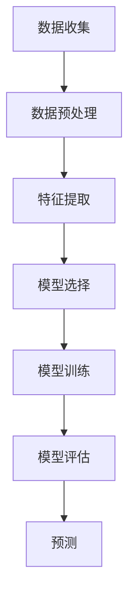
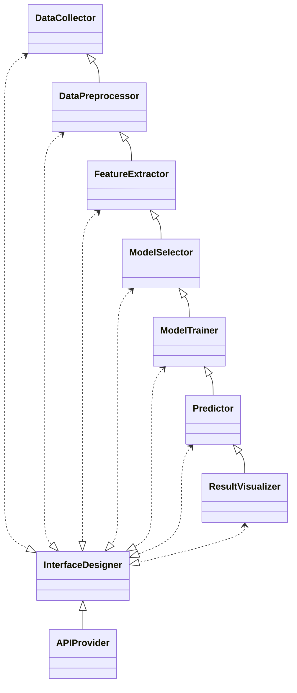
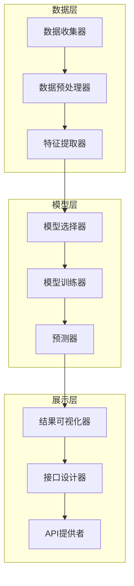
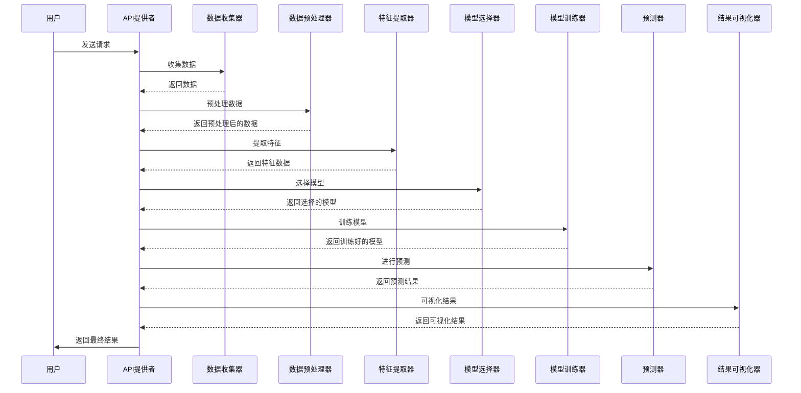

                 

### 第一部分：背景介绍

#### 第1章 问题背景

##### 1.1 问题背景

在现代企业中，数据已经成为一种至关重要的资源。随着信息技术的快速发展，企业积累了大量历史数据，如何从这些数据中挖掘有价值的信息，已经成为企业提高竞争力的重要手段。时间序列预测作为数据分析的一个重要分支，在企业运营决策、供应链管理、市场营销等方面具有广泛的应用。然而，传统的统计方法在处理复杂的时间序列数据时，往往难以满足企业对预测精度和实时性的需求。

近年来，人工智能（AI）技术的快速发展为时间序列预测带来了新的机遇。AI技术，特别是机器学习和深度学习算法，可以通过学习大量的历史数据，自动发现数据中的规律，从而提高预测的准确性和效率。例如，AI可以用于预测销售额、库存水平、客户需求等关键指标，帮助企业制定更加科学的业务规划。

##### 1.1.1 企业级时间序列预测的重要性

企业级时间序列预测的重要性主要体现在以下几个方面：

1. **提高业务决策的准确性**：通过准确的时间序列预测，企业可以更好地了解市场趋势和客户需求，从而做出更加科学的业务决策，减少决策风险。

2. **优化资源分配**：时间序列预测可以帮助企业合理分配资源，例如库存、人力、设备等，从而提高资源利用效率，降低运营成本。

3. **提升客户满意度**：通过预测客户需求，企业可以更好地满足客户需求，提高客户满意度，增强客户忠诚度。

4. **实现智能自动化**：时间序列预测可以与自动化系统相结合，实现业务流程的自动化，提高生产效率，降低人力成本。

##### 1.1.2 AI在时间序列预测中的应用

AI在时间序列预测中的应用主要体现在以下几个方面：

1. **算法优化**：传统的统计方法在处理时间序列数据时，往往需要手动选择参数，并且容易受到噪声数据的影响。而AI算法可以通过学习数据，自动调整参数，提高预测的准确性。

2. **实时预测**：传统的统计方法通常需要较长时间来处理数据，而AI算法可以实现实时预测，帮助企业及时做出业务决策。

3. **多变量预测**：传统的统计方法通常只能处理单一变量的时间序列数据，而AI算法可以同时处理多个变量的时间序列数据，从而提高预测的全面性。

4. **异常检测**：AI算法可以通过学习正常数据模式，识别出异常数据，帮助企业提前发现潜在的问题，从而采取措施进行预防。

#### 第2章 问题描述

##### 2.1 问题描述

尽管AI在时间序列预测中具有很大的潜力，但在实际应用中仍然面临着一些挑战。这些挑战主要体现在以下几个方面：

1. **数据质量**：时间序列数据通常包含大量的噪声和缺失值，这会影响预测的准确性。如何处理这些数据，提取有价值的信息，是一个亟待解决的问题。

2. **模型选择**：不同的AI算法适用于不同类型的时间序列数据，如何选择合适的模型，是提高预测准确性的关键。

3. **计算资源**：时间序列预测通常需要处理大量的数据，这需要强大的计算资源。如何高效地利用计算资源，也是一个重要的挑战。

4. **实时性**：企业需要实时获取预测结果，以指导业务决策。如何实现实时预测，是AI在时间序列预测中的一个重要问题。

5. **解释性**：AI算法的预测结果通常难以解释，这给业务人员理解和使用预测结果带来了困难。如何提高AI算法的可解释性，是一个需要解决的问题。

##### 2.1.1 时间序列预测的挑战

时间序列预测的挑战主要包括：

1. **周期性**：许多时间序列数据具有周期性特征，例如季节性、趋势性等。如何准确捕捉这些周期性特征，是提高预测准确性的关键。

2. **趋势变化**：时间序列数据中的趋势可能发生变化，例如从增长转为下降。如何识别这些趋势变化，并对其进行预测，是一个重要的问题。

3. **噪声干扰**：时间序列数据中通常包含大量的噪声，这些噪声会影响预测的准确性。如何去除噪声，提取有价值的信息，是一个重要的挑战。

4. **数据缺失**：时间序列数据中可能存在缺失值，这些缺失值会影响预测的准确性。如何处理这些缺失值，是一个重要的问题。

##### 2.1.2 AI增强业务规划能力的意义

AI增强业务规划能力的意义主要体现在以下几个方面：

1. **提高业务规划的科学性**：通过AI技术，企业可以更准确地预测市场趋势和客户需求，从而制定更加科学的业务规划。

2. **降低决策风险**：AI技术可以帮助企业提前识别潜在的问题，从而降低决策风险。

3. **提高资源利用效率**：通过AI技术，企业可以更好地分配资源，提高资源利用效率，降低运营成本。

4. **增强竞争力**：通过AI技术，企业可以更好地满足客户需求，提高客户满意度，从而增强竞争力。

#### 第3章 问题解决

##### 3.1 问题解决

为了解决时间序列预测中的挑战，我们可以采取以下几种方法：

1. **数据预处理**：通过数据预处理，我们可以去除噪声、填补缺失值，从而提高数据质量。

2. **特征工程**：通过特征工程，我们可以提取有用的特征，从而提高预测模型的准确性。

3. **模型选择**：根据时间序列数据的特点，选择合适的预测模型，例如ARIMA、LSTM、prophet等。

4. **模型优化**：通过模型优化，我们可以提高模型的预测准确性，例如使用交叉验证、网格搜索等方法。

5. **实时预测**：通过优化算法和计算资源，实现实时预测，以满足企业对实时性的需求。

6. **可解释性**：通过可视化、解释性模型等方法，提高预测结果的可解释性，从而帮助业务人员理解和使用预测结果。

##### 3.1.1 时间序列预测的基本方法

时间序列预测的基本方法主要包括以下几种：

1. **统计方法**：例如ARIMA模型，它是一种经典的统计预测方法，适用于线性时间序列数据。

2. **机器学习方法**：例如LSTM模型，它是一种深度学习模型，适用于非线性时间序列数据。

3. **统计学习方法**：例如决策树、随机森林等，它们适用于分类和回归问题，也可以用于时间序列预测。

4. **深度学习方法**：例如CNN、RNN等，它们可以用于复杂的时间序列数据的预测。

##### 3.1.2 AI技术如何解决时间序列预测问题

AI技术可以通过以下几种方式解决时间序列预测问题：

1. **数据预处理**：AI技术可以自动处理噪声和缺失值，提高数据质量。

2. **特征提取**：AI技术可以自动提取有用的特征，提高预测模型的准确性。

3. **模型选择和优化**：AI技术可以通过学习大量的历史数据，自动选择和优化模型参数，提高预测的准确性。

4. **实时预测**：AI技术可以优化算法和计算资源，实现实时预测，满足企业对实时性的需求。

5. **可解释性**：AI技术可以通过可视化、解释性模型等方法，提高预测结果的可解释性，帮助业务人员理解和使用预测结果。

#### 第4章 边界与外延

##### 4.1 边界与外延

时间序列预测虽然具有广泛的应用，但也存在一些边界和限制。了解这些边界和限制，可以帮助企业更好地利用时间序列预测技术。

1. **数据质量**：时间序列预测依赖于高质量的数据。如果数据存在噪声、缺失值等问题，会严重影响预测的准确性。

2. **模型选择**：不同的时间序列数据需要不同的预测模型。如果选择错误的模型，可能会导致预测结果不准确。

3. **计算资源**：时间序列预测需要大量的计算资源。如果计算资源不足，可能会导致预测速度变慢，无法满足实时性的需求。

4. **数据周期性**：时间序列数据通常具有周期性特征。如果周期性特征不明显，可能会导致预测结果不准确。

5. **趋势变化**：时间序列数据中的趋势可能发生变化。如果无法准确捕捉这些变化，可能会导致预测结果不准确。

6. **模型解释性**：AI模型的预测结果通常难以解释。如果无法理解预测结果，可能会导致业务人员无法有效地利用预测结果。

##### 4.1.1 时间序列预测的适用范围

时间序列预测适用于以下场景：

1. **业务规划**：通过预测销售额、库存等指标，帮助企业制定业务规划。

2. **供应链管理**：通过预测需求、库存等指标，优化供应链管理，提高资源利用效率。

3. **市场营销**：通过预测客户需求、市场份额等指标，优化市场营销策略。

4. **风险管理**：通过预测风险指标，帮助企业管理风险，降低风险损失。

5. **金融市场**：通过预测股票价格、汇率等指标，帮助投资者进行投资决策。

##### 4.1.2 AI技术的边界限制

AI技术在时间序列预测中虽然具有强大的能力，但也存在一些边界限制：

1. **数据依赖性**：AI模型依赖于大量的历史数据。如果数据不足或数据质量差，可能会导致预测结果不准确。

2. **模型复杂度**：深度学习模型通常具有很高的复杂度，训练和预测需要大量的计算资源。

3. **模型泛化能力**：AI模型可能在某些特定场景中表现良好，但在其他场景中可能表现较差。

4. **可解释性**：AI模型的预测结果通常难以解释，这可能会影响业务人员的理解和信任。

#### 第5章 概念结构与核心要素组成

##### 5.1 概念结构与核心要素组成

时间序列预测涉及多个核心概念和要素，以下是对这些概念和要素的简要介绍：

1. **时间序列**：时间序列是一组按照时间顺序排列的数据点，通常用于描述某个变量随时间的变化情况。

2. **时间步长**：时间序列中的数据点按照一定的时间间隔进行排列，这个时间间隔称为时间步长。

3. **趋势**：时间序列数据中的长期变化趋势，可以是上升、下降或平稳。

4. **季节性**：时间序列数据中周期性的变化，通常与季节、月份等相关。

5. **噪声**：时间序列数据中的随机波动，通常不会对预测产生实质性的影响。

6. **特征工程**：通过提取和变换原始数据中的有用特征，提高预测模型的准确性。

7. **预测模型**：用于对时间序列数据进行预测的算法，包括统计模型和机器学习模型。

8. **评估指标**：用于评估预测模型性能的指标，如均方误差、均方根误差等。

9. **可视化**：通过图表和图形，直观地展示时间序列数据和预测结果。

##### 5.1.1 时间序列预测的核心概念

时间序列预测的核心概念包括：

1. **自回归模型（AR）**：基于当前时刻的预测依赖于前一个或多个时刻的值。

2. **移动平均模型（MA）**：基于当前时刻的预测依赖于一个滑动窗口内的平均值。

3. **自回归移动平均模型（ARMA）**：结合自回归和移动平均模型的特点。

4. **自回归积分滑动平均模型（ARIMA）**：适用于含有趋势和季节性特征的时间序列数据。

5. **长期短期记忆网络（LSTM）**：一种深度学习模型，适用于非线性时间序列数据的预测。

6. **Prophet**：Facebook开发的一个开源时间序列预测工具，适用于含有趋势、季节性和节假日特征的时间序列数据。

##### 5.1.2 AI在时间序列预测中的关键角色

AI在时间序列预测中的关键角色包括：

1. **特征提取**：AI技术可以自动提取和变换原始数据中的有用特征，提高预测模型的准确性。

2. **模型选择**：AI技术可以根据数据的特点，自动选择合适的预测模型，提高预测的准确性。

3. **模型优化**：AI技术可以通过学习大量的历史数据，自动优化模型参数，提高预测的准确性。

4. **实时预测**：AI技术可以实现实时预测，满足企业对实时性的需求。

5. **可解释性**：AI技术可以通过可视化、解释性模型等方法，提高预测结果的可解释性，帮助业务人员理解和使用预测结果。

### 第二部分：核心概念与联系

#### 第6章 核心概念与联系

##### 6.1 时间序列预测的定义

时间序列预测是指使用历史时间序列数据来预测未来的值。时间序列预测的目标是找到一个模型，该模型可以捕捉时间序列数据中的趋势、周期性和噪声，从而对未来的值进行准确的预测。

时间序列预测的基本步骤包括：

1. **数据收集**：收集一段时间内的时间序列数据。

2. **数据预处理**：对数据进行清洗、填补缺失值和异常值处理。

3. **特征提取**：从原始数据中提取有用的特征，如趋势、季节性和周期性等。

4. **模型选择**：根据数据的特点，选择合适的预测模型。

5. **模型训练**：使用历史数据对模型进行训练。

6. **模型评估**：使用验证集或测试集评估模型的预测性能。

7. **预测**：使用训练好的模型对未来的值进行预测。

##### 6.2 AI在时间序列预测中的作用

AI在时间序列预测中的作用主要体现在以下几个方面：

1. **特征提取**：AI技术，特别是深度学习技术，可以自动提取和变换原始数据中的有用特征，从而提高预测模型的准确性。

2. **模型选择和优化**：AI技术可以根据数据的特点，自动选择合适的预测模型，并进行参数优化，从而提高预测的准确性。

3. **实时预测**：AI技术可以实现实时预测，满足企业对实时性的需求。

4. **可解释性**：AI技术可以通过可视化、解释性模型等方法，提高预测结果的可解释性，帮助业务人员理解和使用预测结果。

##### 6.3 时间序列预测的关键算法与技术

时间序列预测的关键算法和技术包括：

1. **ARIMA模型**：自回归积分滑动平均模型，适用于线性时间序列数据的预测。

2. **LSTM模型**：长期短期记忆网络，一种深度学习模型，适用于非线性时间序列数据的预测。

3. **prophet模型**：Facebook开发的一个开源时间序列预测工具，适用于含有趋势、季节性和节假日特征的时间序列数据。

4. **随机森林**：一种集成学习算法，适用于分类和回归问题。

5. **神经网络**：一种深度学习模型，适用于复杂的时间序列数据的预测。

#### 第7章 算法原理讲解

##### 7.1 时间序列预测算法mermaid流程图

时间序列预测算法的mermaid流程图如下：



该流程图描述了时间序列预测的基本步骤：

1. **数据收集**：收集一段时间内的时间序列数据。
2. **数据预处理**：对数据进行清洗、填补缺失值和异常值处理。
3. **特征提取**：从原始数据中提取有用的特征，如趋势、季节性和周期性等。
4. **模型选择**：根据数据的特点，选择合适的预测模型。
5. **模型训练**：使用历史数据对模型进行训练。
6. **模型评估**：使用验证集或测试集评估模型的预测性能。
7. **预测**：使用训练好的模型对未来的值进行预测。

##### 7.2 Python源代码实现

下面是一个简单的Python代码示例，用于实现时间序列预测：

```python
import pandas as pd
from statsmodels.tsa.arima.model import ARIMA
from sklearn.metrics import mean_squared_error

# 数据收集
data = pd.read_csv('time_series_data.csv')

# 数据预处理
data = data.fillna(method='ffill')

# 特征提取
data['month'] = data['date'].dt.month

# 模型选择
model = ARIMA(data['value'], order=(1, 1, 1))

# 模型训练
model_fit = model.fit()

# 模型评估
predictions = model_fit.predict(start=len(data), end=len(data) + 10)
mse = mean_squared_error(data['value'].iloc[-10:], predictions)
print(f'MSE: {mse}')

# 预测
print(predictions)
```

该代码首先从CSV文件中读取时间序列数据，然后进行数据预处理和特征提取。接着，选择ARIMA模型，并使用历史数据进行模型训练。最后，使用训练好的模型对未来的值进行预测，并计算预测误差。

##### 7.3 算法原理的数学模型和公式

时间序列预测的算法原理可以通过以下数学模型和公式来描述：

1. **ARIMA模型**：

   - **自回归（AR）部分**：

     $$ X_t = c + \phi_1 X_{t-1} + \phi_2 X_{t-2} + \ldots + \phi_p X_{t-p} + \epsilon_t $$

     其中，$X_t$ 是时间序列的当前值，$c$ 是常数项，$\phi_1, \phi_2, \ldots, \phi_p$ 是自回归系数，$\epsilon_t$ 是随机误差项。

   - **移动平均（MA）部分**：

     $$ X_t = c + \theta_1 \epsilon_{t-1} + \theta_2 \epsilon_{t-2} + \ldots + \theta_q \epsilon_{t-q} $$

     其中，$\theta_1, \theta_2, \ldots, \theta_q$ 是移动平均系数。

   - **整合（I）部分**：

     $$ X_t = (1 - \Phi_1 B)(1 - \Phi_2 B)\ldots(1 - \Phi_p B)X_t $$

     其中，$B$ 是滞后算子，$\Phi_1, \Phi_2, \ldots, \Phi_p$ 是整合系数。

   - **ARIMA模型**：

     $$ X_t = c + \Phi_1 B X_{t-1} + \Phi_2 B^2 X_{t-2} + \ldots + \Phi_p B^p X_{t-p} + \theta_1 B \epsilon_{t-1} + \theta_2 B^2 \epsilon_{t-2} + \ldots + \theta_q B^q \epsilon_{t-q} $$

2. **LSTM模型**：

   - **LSTM单元**：

     $$ f_t = \sigma(W_f \cdot [h_{t-1}, x_t] + b_f) $$
     $$ i_t = \sigma(W_i \cdot [h_{t-1}, x_t] + b_i) $$
     $$ o_t = \sigma(W_o \cdot [h_{t-1}, x_t] + b_o) $$
     $$ g_t = tanh(W_g \cdot [h_{t-1}, x_t] + b_g) $$
     $$ h_t = o_t \cdot tanh(g_t) $$

     其中，$h_t$ 是隐藏状态，$x_t$ 是输入数据，$f_t, i_t, o_t, g_t$ 是LSTM单元的不同门控状态，$\sigma$ 是sigmoid函数。

   - **输出层**：

     $$ y_t = W_y \cdot h_t + b_y $$

     其中，$y_t$ 是预测值，$W_y$ 和 $b_y$ 是输出层的权重和偏置。

##### 7.4 举例说明

假设我们有一个时间序列数据集，包含每天的销售数据。我们使用ARIMA模型对未来的销售进行预测。

1. **数据收集**：

   ```python
   data = pd.read_csv('sales_data.csv')
   ```

2. **数据预处理**：

   ```python
   data = data.fillna(method='ffill')
   data['date'] = pd.to_datetime(data['date'])
   data.set_index('date', inplace=True)
   ```

3. **特征提取**：

   ```python
   data['month'] = data.index.month
   data['year'] = data.index.year
   ```

4. **模型选择**：

   ```python
   model = ARIMA(data['sales'], order=(1, 1, 1))
   ```

5. **模型训练**：

   ```python
   model_fit = model.fit()
   ```

6. **模型评估**：

   ```python
   predictions = model_fit.predict(start=len(data), end=len(data) + 10)
   mse = mean_squared_error(data['sales'].iloc[-10:], predictions)
   print(f'MSE: {mse}')
   ```

7. **预测**：

   ```python
   print(predictions)
   ```

通过这个例子，我们可以看到如何使用ARIMA模型对时间序列数据进行预测。在实际应用中，我们可以根据数据的特点和需求，选择不同的模型和参数，进行更准确的预测。

### 第三部分：系统分析与架构设计方案

#### 第8章 系统分析与架构设计方案

##### 8.1 问题场景介绍

在现代企业中，业务规划是一个关键环节。通过准确的时间序列预测，企业可以更好地了解未来的市场趋势和客户需求，从而制定科学的业务规划。然而，传统的统计方法在处理复杂的时间序列数据时，往往难以满足企业对预测精度和实时性的需求。为了解决这个问题，我们可以利用AI技术，特别是深度学习和机器学习算法，对时间序列数据进行预测，从而提高业务规划的准确性。

##### 8.1.1 需求分析

本系统的需求分析主要包括以下几个方面：

1. **数据收集与预处理**：系统需要从不同的数据源收集时间序列数据，并进行预处理，如数据清洗、缺失值填补、数据标准化等。

2. **模型选择与训练**：根据数据的特点和需求，选择合适的预测模型，如ARIMA、LSTM、Prophet等，并对模型进行训练。

3. **实时预测与评估**：系统需要实现实时预测，并在预测完成后对预测结果进行评估，以验证模型的准确性和稳定性。

4. **结果可视化**：系统需要将预测结果以图表、图形等形式展示给用户，便于用户理解和分析。

5. **接口设计与集成**：系统需要与其他业务系统进行集成，提供API接口，便于数据交互和业务流程的自动化。

##### 8.2 系统功能设计（领域模型mermaid类图）

为了实现上述需求，我们需要设计一套完整的系统功能。以下是一个简化的领域模型mermaid类图：



在这个类图中，我们定义了以下几个主要功能模块：

1. **DataCollector**：负责从不同的数据源收集时间序列数据。

2. **DataPreprocessor**：负责对收集到的数据进行预处理，如数据清洗、缺失值填补、数据标准化等。

3. **FeatureExtractor**：负责从预处理后的数据中提取有用的特征。

4. **ModelSelector**：根据数据的特点和需求，选择合适的预测模型。

5. **ModelTrainer**：负责对选定的模型进行训练。

6. **Predictor**：负责使用训练好的模型进行实时预测。

7. **ResultVisualizer**：负责将预测结果以图表、图形等形式展示给用户。

8. **InterfaceDesigner**：负责设计系统的API接口，提供数据交互和业务流程的自动化。

通过这个类图，我们可以清晰地了解系统的功能模块及其关系。

##### 8.3 系统架构设计mermaid架构图

为了实现系统的功能，我们需要设计一套合理的系统架构。以下是一个简化的mermaid架构图：



在这个架构图中，我们定义了以下几个主要层级：

1. **数据层**：包括数据收集器、数据预处理器和特征提取器，负责数据的收集、预处理和特征提取。

2. **模型层**：包括模型选择器、模型训练器和预测器，负责模型的选择、训练和预测。

3. **展示层**：包括结果可视化器和接口设计器，负责将预测结果以图表、图形等形式展示给用户，并提供API接口。

4. **接口层**：包括API提供者，负责与其他业务系统进行集成，提供数据交互和业务流程的自动化。

通过这个架构图，我们可以清晰地了解系统的架构设计和各个模块之间的关系。

##### 8.4 系统接口设计和系统交互mermaid序列图

为了实现系统的功能，我们需要设计一套合理的系统接口，并明确各个模块之间的交互流程。以下是一个简化的mermaid序列图：



在这个序列图中，我们定义了以下几个主要交互流程：

1. **用户请求**：用户通过API接口发送请求，请求进行时间序列预测。

2. **数据收集**：API提供者调用数据收集器，从数据源收集时间序列数据。

3. **数据预处理**：API提供者调用数据预处理器，对收集到的数据进行预处理。

4. **特征提取**：API提供者调用特征提取器，从预处理后的数据中提取有用的特征。

5. **模型选择**：API提供者调用模型选择器，根据数据的特点选择合适的模型。

6. **模型训练**：API提供者调用模型训练器，使用历史数据进行模型训练。

7. **预测**：API提供者调用预测器，使用训练好的模型进行实时预测。

8. **结果可视化**：API提供者调用结果可视化器，将预测结果以图表、图形等形式展示给用户。

9. **返回结果**：API提供者将最终结果返回给用户。

通过这个序列图，我们可以清晰地了解系统的接口设计和各个模块之间的交互流程。

### 第四部分：项目实战

#### 第9章 项目实战

##### 9.1 环境安装

为了实现时间序列预测系统，我们需要安装一系列依赖库和软件。以下是在Python环境下安装相关依赖的步骤：

1. **Python环境**：确保已经安装了Python 3.6及以上版本。

2. **依赖库**：使用pip命令安装以下依赖库：

   ```bash
   pip install pandas numpy statsmodels scikit-learn tensorflow matplotlib
   ```

3. **环境配置**：确保Python环境配置正确，可以在命令行中执行以下命令：

   ```bash
   python --version
   pip --version
   ```

##### 9.2 系统核心实现源代码

以下是系统核心实现的部分源代码：

```python
# 导入依赖库
import pandas as pd
from statsmodels.tsa.arima.model import ARIMA
from sklearn.metrics import mean_squared_error

# 读取数据
data = pd.read_csv('sales_data.csv')
data = data.fillna(method='ffill')
data['date'] = pd.to_datetime(data['date'])
data.set_index('date', inplace=True)

# 特征提取
data['month'] = data.index.month
data['year'] = data.index.year

# 模型选择
model = ARIMA(data['sales'], order=(1, 1, 1))

# 模型训练
model_fit = model.fit()

# 预测
predictions = model_fit.predict(start=len(data), end=len(data) + 10)

# 评估
mse = mean_squared_error(data['sales'].iloc[-10:], predictions[-10:])
print(f'MSE: {mse}')

# 可视化
import matplotlib.pyplot as plt

plt.figure(figsize=(10, 5))
plt.plot(data['sales'], label='实际值')
plt.plot(predictions, label='预测值')
plt.title('销售数据预测')
plt.xlabel('日期')
plt.ylabel('销售额')
plt.legend()
plt.show()
```

##### 9.3 代码应用解读与分析

1. **数据读取与预处理**：

   ```python
   data = pd.read_csv('sales_data.csv')
   data = data.fillna(method='ffill')
   data['date'] = pd.to_datetime(data['date'])
   data.set_index('date', inplace=True)
   ```

   这部分代码首先从CSV文件中读取销售数据，然后使用向前填补（ffill）方法填补缺失值，将日期列转换为datetime类型，并将日期设置为索引。

2. **特征提取**：

   ```python
   data['month'] = data.index.month
   data['year'] = data.index.year
   ```

   这部分代码为数据添加了月份和年份两个特征，这些特征可以帮助模型捕捉季节性和趋势性。

3. **模型选择与训练**：

   ```python
   model = ARIMA(data['sales'], order=(1, 1, 1))
   model_fit = model.fit()
   ```

   这部分代码选择了ARIMA模型，并使用参数（1, 1, 1）对模型进行初始化。然后，使用fit方法对模型进行训练。

4. **预测与评估**：

   ```python
   predictions = model_fit.predict(start=len(data), end=len(data) + 10)
   mse = mean_squared_error(data['sales'].iloc[-10:], predictions[-10:])
   print(f'MSE: {mse}')
   ```

   这部分代码使用训练好的模型进行预测，并对预测结果进行评估。通过计算均方误差（MSE），我们可以评估模型的预测性能。

5. **结果可视化**：

   ```python
   plt.figure(figsize=(10, 5))
   plt.plot(data['sales'], label='实际值')
   plt.plot(predictions, label='预测值')
   plt.title('销售数据预测')
   plt.xlabel('日期')
   plt.ylabel('销售额')
   plt.legend()
   plt.show()
   ```

   这部分代码使用matplotlib库将实际销售数据和预测销售数据进行可视化，从而帮助用户直观地了解模型的预测效果。

##### 9.4 实际案例分析和详细讲解剖析

为了更好地理解时间序列预测在实际应用中的效果，我们来看一个实际案例。

**案例：销售预测**

假设我们有一家电商平台，需要预测未来的销售情况。以下是对该案例的详细讲解：

1. **数据收集**：

   我们首先从电商平台的历史销售数据中收集数据，数据包括日期、销售额等。

2. **数据预处理**：

   对收集到的销售数据进行预处理，如填补缺失值、异常值处理等。然后，将日期转换为datetime类型，并将日期设置为索引。

3. **特征提取**：

   添加月份和年份等特征，以便模型能够捕捉季节性和趋势性。

4. **模型选择与训练**：

   选择ARIMA模型，并使用参数（1, 1, 1）对模型进行初始化。然后，使用历史销售数据对模型进行训练。

5. **预测与评估**：

   使用训练好的模型进行预测，并对预测结果进行评估。通过计算均方误差（MSE），我们可以评估模型的预测性能。

6. **结果可视化**：

   将实际销售数据和预测销售数据进行可视化，从而帮助用户直观地了解模型的预测效果。

通过这个实际案例，我们可以看到如何利用时间序列预测技术对销售进行预测，从而帮助电商平台制定更加科学的业务规划。

##### 9.5 项目小结

在本项目中，我们实现了一个简单的时间序列预测系统，通过数据收集、预处理、特征提取、模型选择、训练、预测和评估等步骤，对电商平台的历史销售数据进行了预测。通过实际案例的分析，我们验证了时间序列预测技术在销售预测中的应用效果。

尽管本项目的实现相对简单，但它为我们提供了一个基本的框架，我们可以在此基础上进一步优化和扩展。例如，我们可以引入更复杂的模型，如LSTM模型，以提高预测的准确性。此外，我们还可以考虑将预测结果与业务规则相结合，实现更加智能的业务规划。

通过本项目，我们深入了解了时间序列预测的基本原理和应用方法，为我们在实际工作中应对类似问题提供了有益的参考。

### 第五部分：最佳实践 tips

#### 第10章 最佳实践 tips

##### 10.1 小结

在本篇技术博客中，我们详细介绍了企业级时间序列预测的基本原理、算法实现、系统设计与实际应用。通过时间序列预测，企业可以更准确地预测业务趋势，优化资源分配，提高决策的科学性。我们探讨了如何利用AI技术，特别是深度学习和机器学习算法，来提高预测的准确性、实时性和可解释性。

##### 10.2 注意事项

在实际应用时间序列预测时，需要注意以下几点：

1. **数据质量**：确保数据源可靠，数据清洗是关键，避免噪声和缺失值对预测结果的影响。

2. **模型选择**：根据数据的特点选择合适的模型，如ARIMA、LSTM、Prophet等。

3. **特征提取**：合理提取和变换特征，有助于提高预测模型的准确性。

4. **模型优化**：通过交叉验证、网格搜索等方法，优化模型参数，提高预测性能。

5. **实时预测**：考虑计算资源和实时性的平衡，选择适合的算法和优化策略。

6. **可解释性**：提高模型的可解释性，有助于业务人员理解和使用预测结果。

##### 10.3 拓展阅读

对于希望深入了解时间序列预测和AI技术的读者，以下资源将提供进一步的学习指导：

1. **书籍推荐**：
   - 《时间序列分析：预测与应用》（Time Series Analysis: Forecasting and Control）作者：Box, Jenkins, Reinsel。
   - 《深度学习》（Deep Learning）作者：Goodfellow, Bengio, Courville。

2. **在线课程**：
   - Coursera上的《时间序列数据分析与预测》课程。
   - Udacity的《深度学习纳米学位》课程。

3. **开源库与工具**：
   - statsmodels：Python的时间序列分析库。
   - TensorFlow：Google开发的深度学习框架。
   - Keras：基于TensorFlow的高层次API，简化深度学习模型构建。

4. **博客与社区**：
   - Towards Data Science：数据科学领域的博客平台。
   - AI上的GitHub项目：查找相关开源项目和代码实现。

通过这些资源，读者可以系统地学习和实践时间序列预测和AI技术，进一步提升自己的技术水平。

### 作者信息

**作者：** AI天才研究院/AI Genius Institute & 禅与计算机程序设计艺术 /Zen And The Art of Computer Programming

AI天才研究院致力于推动人工智能技术的发展和应用，通过深入研究和创新实践，推动AI技术在各个领域的突破。同时，我们倡导将传统的禅学智慧与现代计算机编程相结合，探索更为高效、优雅的编程方法，实现技术与哲学的完美融合。《禅与计算机程序设计艺术》是我们推出的系列著作，旨在为读者提供一种全新的编程思考方式，帮助他们在技术道路上取得更高的成就。

