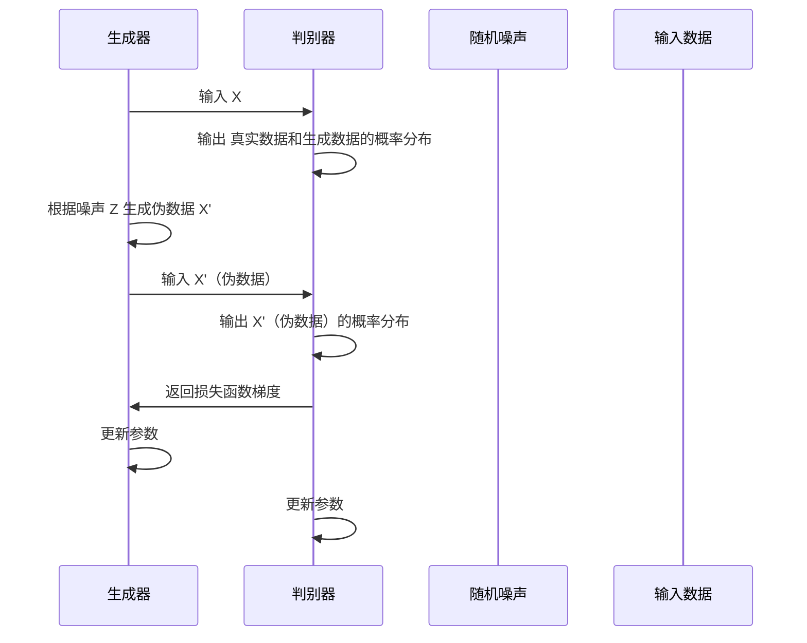

                 

### 引言：企业级生成式设计AI的重要性

在现代企业环境中，产品开发的效率和速度成为决定企业竞争力的关键因素。随着市场竞争的加剧和客户需求的不断变化，传统的产品开发模式已经难以满足企业的需求。因此，寻找新的方法来优化产品开发流程，提升设计效率和产品质量，成为企业亟待解决的问题。在这种情况下，企业级生成式设计AI（Enterprise-Level Generative Design AI）应运而生。

#### 背景介绍

生成式设计（Generative Design）是一种通过计算机算法自动生成设计概念的方法，其核心在于利用人工智能技术，从大量的数据中学习并创造出新的设计。生成式设计AI则进一步将这一方法扩展到企业级应用，通过更高效的数据处理和更智能的设计优化，为企业提供了一种全新的产品开发方式。

在企业级应用中，生成式设计AI具有以下几个显著特点：

1. **自动化与智能化**：生成式设计AI能够自动化处理大量的设计任务，同时利用机器学习和深度学习技术进行智能优化，大大提高了设计效率。
2. **数据驱动**：生成式设计AI依赖于大量的数据输入，通过对数据的分析和学习，生成出更加符合市场需求和用户需求的设计方案。
3. **可定制性与灵活性**：企业可以根据自身需求对生成式设计AI进行定制，灵活调整设计参数和优化目标，以适应不同的产品开发需求。
4. **降低成本**：通过自动化和智能化的设计过程，生成式设计AI能够减少人力和时间成本，同时降低生产风险。

#### 核心概念与联系

要深入理解生成式设计AI，我们需要关注以下几个核心概念：

1. **机器学习与深度学习**：生成式设计AI的核心在于其算法基础，即机器学习和深度学习。这些算法能够从数据中学习规律，并自动生成新的设计概念。
2. **设计优化**：生成式设计AI不仅能够生成设计，还能够对设计进行优化。通过迭代优化，设计方案的可行性和质量不断提升。
3. **数据输入与处理**：生成式设计AI依赖于大量的数据输入，这些数据可以是历史设计案例、用户反馈、市场趋势等。数据的质量和处理能力直接影响到生成式设计AI的性能。

#### 问题解决

为了更好地理解生成式设计AI在产品开发流程中的角色，我们可以从以下几个方面来探讨：

1. **需求分析**：通过数据分析和用户研究，确定产品开发的需求和目标。生成式设计AI可以帮助企业快速生成多种设计方案，从而更好地满足市场需求。
2. **设计迭代**：传统的产品设计往往需要多次迭代和优化。生成式设计AI能够自动化这一过程，快速生成多个设计方案并进行比较，帮助设计师快速找到最优解。
3. **风险控制**：在产品开发过程中，风险控制是一个重要的环节。生成式设计AI可以通过模拟和预测，提前识别潜在的风险，并提出相应的解决方案。
4. **成本优化**：通过自动化和智能化的设计过程，生成式设计AI能够降低人力和时间成本，同时提高生产效率，从而实现成本优化。

#### 边界与外延

虽然生成式设计AI在产品开发中具有巨大潜力，但它的应用也受到一定的限制。例如，生成式设计AI依赖于大量的数据输入，如果数据不足或数据质量不高，可能会影响其性能。此外，生成式设计AI需要与企业的现有系统进行整合，这可能会涉及到技术和管理上的挑战。

#### 概念结构与核心要素组成

生成式设计AI的概念结构可以概括为以下几个核心要素：

1. **算法模型**：包括机器学习、深度学习等算法，用于处理数据和生成设计。
2. **数据处理**：包括数据收集、清洗、存储等过程，为算法模型提供高质量的数据输入。
3. **设计优化**：通过迭代优化，不断改进设计方案，提高设计的可行性和质量。
4. **用户界面**：为用户提供交互界面，以便于设计方案的展示和调整。
5. **系统集成**：将生成式设计AI与企业的现有系统进行整合，实现数据的流通和功能的协同。

通过以上分析，我们可以看到，生成式设计AI在优化产品开发流程中具有重要作用。它不仅提高了设计效率和产品质量，还降低了成本和风险。然而，要充分发挥生成式设计AI的潜力，企业需要充分理解和掌握其核心概念和操作原理，并逐步将其应用于实际产品开发中。

### 总结

本文介绍了企业级生成式设计AI的背景、核心概念和其在产品开发流程中的重要性。生成式设计AI通过自动化和智能化的设计过程，为企业提供了一种全新的产品开发方式，具有显著的优势。然而，要实现生成式设计AI的广泛应用，企业还需要在数据、技术和系统集成等方面进行深入探索和实践。

接下来，我们将深入探讨生成式设计AI的基本原理和关键技术，帮助读者更好地理解这一前沿技术。请持续关注下一章节的内容。

### 生成式设计AI的基本原理

生成式设计AI（Generative Design AI）作为人工智能在产品设计领域的重要应用，其基本原理源于机器学习和深度学习的算法。通过这些算法，生成式设计AI能够从大量数据中学习和提取规律，从而自动生成新的设计概念。本节将详细介绍生成式设计AI的基本原理，包括机器学习、深度学习和相关算法。

#### 机器学习的基本概念

机器学习（Machine Learning）是一种让计算机通过数据学习并做出决策的技术。在生成式设计AI中，机器学习被用来处理和分类大量的设计数据，从而生成新的设计概念。机器学习的基本过程可以分为以下几个步骤：

1. **数据收集**：从历史设计案例、用户反馈、市场趋势等多渠道收集设计数据。
2. **数据处理**：对收集到的数据进行分析和清洗，以确保数据的质量。
3. **特征提取**：从数据中提取关键特征，以便算法能够更好地学习和分类。
4. **模型训练**：使用机器学习算法对提取的特征进行训练，建立设计模型的预测能力。
5. **模型评估**：通过测试数据集评估模型的性能，调整模型参数以提高准确度。
6. **模型应用**：将训练好的模型应用于实际产品设计，生成新的设计概念。

在机器学习中，常用的算法包括支持向量机（SVM）、决策树（Decision Tree）、随机森林（Random Forest）等。这些算法各有优缺点，适用于不同的设计问题。

#### 深度学习的基本概念

深度学习（Deep Learning）是一种基于多层神经网络的学习方法，能够在大量数据中自动提取复杂特征。相比于传统的机器学习算法，深度学习能够更好地处理高维数据和复杂数据集。在生成式设计AI中，深度学习被广泛应用于设计数据的处理和设计概念的生成。

1. **神经网络**：神经网络（Neural Network）是深度学习的基础。它由多个神经元（或节点）组成，每个神经元都与其他神经元相连接，形成一个复杂的网络结构。
2. **卷积神经网络（CNN）**：卷积神经网络（Convolutional Neural Network，CNN）是一种特别适合处理图像数据的神经网络。通过卷积操作，CNN能够自动提取图像中的关键特征，从而进行图像分类、识别和生成。
3. **循环神经网络（RNN）**：循环神经网络（Recurrent Neural Network，RNN）适用于处理序列数据，如时间序列数据、文本数据等。通过记忆机制，RNN能够捕捉序列数据中的长距离依赖关系。
4. **生成对抗网络（GAN）**：生成对抗网络（Generative Adversarial Network，GAN）是一种由两个神经网络（生成器和判别器）对抗训练的模型。生成器试图生成逼真的设计数据，而判别器则试图区分真实数据和生成数据。通过这种对抗训练，GAN能够生成高质量的设计概念。

#### 生成式设计AI的核心算法

生成式设计AI的核心算法主要包括以下几种：

1. **自动编码器（Autoencoder）**：自动编码器是一种无监督学习算法，用于将输入数据压缩成一个低维表示，然后再将这个低维表示还原回原始数据。通过这种压缩和重构过程，自动编码器能够提取数据中的关键特征，从而生成新的设计概念。
2. **变分自编码器（Variational Autoencoder，VAE）**：变分自编码器是自动编码器的一种变体，它通过概率模型进行数据重构。VAE能够生成更加多样化且具有噪声的数据，从而提高设计生成的能力。
3. **生成对抗网络（GAN）**：如前所述，生成对抗网络通过生成器和判别器的对抗训练，生成高质量的设计概念。GAN在图像生成、文本生成等方面取得了显著的成果，成为生成式设计AI的重要工具。

#### 算法原理讲解

下面我们将使用Mermaid工具绘制一个简单的生成对抗网络（GAN）的算法流程图，并使用Python代码来解释GAN的工作原理。

##### Mermaid流程图



##### Python代码

```python
import numpy as np
import tensorflow as tf
from tensorflow.keras import layers

# 设置随机种子
np.random.seed(42)
tf.random.set_seed(42)

# 定义生成器模型
def create_generator(z_dim):
    model = tf.keras.Sequential([
        layers.Dense(128, activation='relu', input_shape=(z_dim,)),
        layers.Dense(256, activation='relu'),
        layers.Dense(512, activation='relu'),
        layers.Dense(1024, activation='relu'),
        layers.Dense(28 * 28 * 1, activation='tanh'),
        layers.Reshape((28, 28, 1))
    ])
    return model

# 定义判别器模型
def create_discriminator(img_shape):
    model = tf.keras.Sequential([
        layers.Conv2D(32, (3, 3), strides=(2, 2), padding='same', input_shape=img_shape),
        layers.LeakyReLU(alpha=0.2),
        layers.Dropout(0.3),
        layers.Conv2D(64, (3, 3), strides=(2, 2), padding='same'),
        layers.LeakyReLU(alpha=0.2),
        layers.Dropout(0.3),
        layers.Flatten(),
        layers.Dense(1, activation='sigmoid')
    ])
    return model

# 定义 GAN 模型
def create_gan(generator, discriminator):
    model = tf.keras.Sequential([generator, discriminator])
    return model

# 设置参数
z_dim = 100
img_shape = (28, 28, 1)

# 创建生成器和判别器
generator = create_generator(z_dim)
discriminator = create_discriminator(img_shape)
gan = create_gan(generator, discriminator)

# 编写损失函数和优化器
cross_entropy = tf.keras.losses.BinaryCrossentropy(from_logits=True)
def discriminator_loss(real_imgs, fake_imgs):
    real_loss = cross_entropy(tf.ones_like(real_imgs), discriminator(real_imgs))
    fake_loss = cross_entropy(tf.zeros_like(fake_imgs), discriminator(fake_imgs))
    total_loss = real_loss + fake_loss
    return total_loss

def generator_loss(fake_imgs):
    return cross_entropy(tf.ones_like(fake_imgs), discriminator(fake_imgs))

generator_optimizer = tf.keras.optimizers.Adam(1e-4)
discriminator_optimizer = tf.keras.optimizers.Adam(1e-4)

# 训练 GAN
EPOCHS = 50
BATCH_SIZE = 128

for epoch in range(EPOCHS):
    for batch_index in range(num_batches):
        # 准备真实数据
        real_imgs = data_train[np.random.randint(0, data_train.shape[0], size=BATCH_SIZE)]

        # 准备随机噪声
        z = np.random.normal(size=(BATCH_SIZE, z_dim))

        # 生成伪数据
        fake_imgs = generator.predict(z)

        # 训练判别器
        with tf.GradientTape() as disc_tape:
            real_loss = discriminator_loss(real_imgs, fake_imgs)
        disc_gradients = disc_tape.gradient(real_loss, discriminator.trainable_variables)
        discriminator_optimizer.apply_gradients(zip(disc_gradients, discriminator.trainable_variables))

        # 训练生成器
        with tf.GradientTape() as gen_tape:
            fake_loss = generator_loss(fake_imgs)
        gen_gradients = gen_tape.gradient(fake_loss, generator.trainable_variables)
        generator_optimizer.apply_gradients(zip(gen_gradients, generator.trainable_variables))

        # 打印训练进度
        print(f"{epoch} [Batch {batch_index+1}/{num_batches}], "
              f"Discriminator loss: {real_loss:.4f}, "
              f"Generator loss: {fake_loss:.4f}")
```

在上述Python代码中，我们使用了TensorFlow框架来实现一个简单的GAN模型。生成器（Generator）通过噪声数据生成伪数据，判别器（Discriminator）则试图区分真实数据和伪数据。通过不断的对抗训练，生成器逐渐学习到如何生成更加逼真的设计数据。

##### 数学模型与公式

生成对抗网络的工作原理可以概括为以下数学模型：

$$
\begin{aligned}
\mathcal{D}(\mathbf{x}) &= \text{判别器输出概率，表示输入数据是真实数据的概率} \\
\mathcal{G}(\mathbf{z}) &= \text{生成器输出，表示生成伪数据} \\
\mathcal{G}_\theta^\star &= \text{生成器最优参数} \\
\mathcal{D}_\phi^\star &= \text{判别器最优参数} \\
\end{aligned}
$$

生成器和判别器的优化目标分别是最大化判别器损失和最小化生成器损失：

$$
\begin{aligned}
\min_\theta \quad &\mathcal{L}_\text{G}(\theta) = \mathbb{E}_{\mathbf{z}}[\log(1 - \mathcal{D}(\mathcal{G}(\mathbf{z}))] \\
\min_\phi \quad &\mathcal{L}_\text{D}(\phi) = \mathbb{E}_{\mathbf{x}}[\log(\mathcal{D}(\mathbf{x}))] + \mathbb{E}_{\mathbf{z}}[\log(\mathcal{D}(1 - \mathcal{G}(\mathbf{z}))]
\end{aligned}
$$

其中，$\mathbf{x}$表示真实数据，$\mathbf{z}$表示随机噪声，$\mathcal{D}$表示判别器函数，$\mathcal{G}$表示生成器函数。

##### 通俗易懂的举例说明

假设我们想要设计一款手机壳，通过GAN生成一个新颖的设计。首先，我们收集了大量的手机壳设计数据，包括外观、材质、功能等特征。接下来，我们使用机器学习和深度学习算法，对这些数据进行训练，生成一个生成器模型。

训练过程中，生成器通过随机噪声生成伪手机壳设计，而判别器则尝试区分这些设计是否是真实的手机壳设计。通过不断的对抗训练，生成器逐渐学习到如何生成更加逼真的设计，而判别器的性能也逐渐提高。

最终，当生成器生成的设计足够逼真时，我们可以将这些设计应用于实际产品开发中，从而大大提高设计效率和产品质量。

通过上述讲解，我们可以看到生成式设计AI的基本原理和关键技术。在下一章节中，我们将进一步探讨生成式设计AI在产品开发中的应用场景和实际案例。

### 生成式设计AI的应用场景

生成式设计AI作为一种前沿技术，已在多个行业中展示了其巨大的潜力和实际应用价值。本节将详细探讨生成式设计AI在制造业、建筑设计、时尚设计等领域的应用场景，并通过具体的案例进行分析和讨论。

#### 制造业

在制造业中，生成式设计AI被广泛应用于产品设计和优化。通过生成式设计AI，企业可以在产品设计阶段快速生成多种设计方案，并进行优化，以找到最优解。以下是一个制造业中的实际案例：

**案例：汽车零件设计优化**

某汽车制造商希望通过生成式设计AI优化其汽车引擎零件的设计。该制造商首先收集了大量的引擎零件设计数据，包括材质、结构、重量、性能等参数。然后，使用生成式设计AI对数据进行训练，生成多种引擎零件设计方案。

通过对比分析，制造商发现生成式设计AI生成的设计方案在重量减轻、性能提升等方面具有显著优势。最终，制造商选择了一种优化后的设计方案，并在实际生产中应用。这一方案不仅降低了生产成本，还提高了汽车的性能和可靠性。

**应用优势**：

1. **快速迭代与优化**：生成式设计AI能够快速生成多种设计方案，帮助企业缩短产品开发周期。
2. **成本控制**：通过优化设计方案，生成式设计AI能够帮助企业降低生产成本，提高利润。
3. **性能提升**：生成式设计AI能够生成性能更优的设计方案，从而提高产品的市场竞争力。

#### 建筑设计

在建筑设计领域，生成式设计AI通过自动化和智能化的设计过程，大大提高了建筑设计效率和质量。以下是一个建筑设计中的实际案例：

**案例：摩天大楼设计**

某建筑设计公司计划设计一栋高度达500米的摩天大楼。为了确保设计的安全性和可行性，公司采用了生成式设计AI来优化建筑结构设计。

通过生成式设计AI，公司首先生成了多种不同的建筑结构设计方案，然后对这些方案进行了仿真分析和优化。最终，公司选择了一种具有最优性能和最安全性的设计方案，并在实际施工中应用。

该设计方案不仅满足了建筑规范的要求，还显著降低了建筑材料的使用量，提高了建筑物的抗震性能。此外，生成式设计AI还帮助公司缩短了设计周期，降低了设计成本。

**应用优势**：

1. **结构优化**：生成式设计AI能够通过仿真分析，生成性能更优的建筑结构设计方案。
2. **材料节省**：通过优化设计，生成式设计AI能够显著降低建筑材料的使用量，提高资源利用率。
3. **成本效益**：生成式设计AI能够提高设计效率，降低设计成本，为企业创造更多的经济效益。

#### 时尚设计

在时尚设计领域，生成式设计AI被广泛应用于服装设计、鞋子设计、配饰设计等。通过生成式设计AI，设计师可以快速生成多种时尚设计，并进行优化，以找到最具创意和商业价值的设计。

以下是一个时尚设计中的实际案例：

**案例：服装设计**

某时尚品牌希望为其下一季推出一系列独特的服装设计。为了实现这一目标，品牌采用了生成式设计AI来生成多种服装设计方案。

通过生成式设计AI，品牌首先收集了大量的时尚设计数据，包括流行趋势、颜色搭配、材质选择等。然后，生成式设计AI生成了多种服装设计方案，并进行了优化。

最终，品牌选择了几种最具创意和商业价值的设计方案，并将其应用于实际产品设计中。这些设计方案不仅赢得了消费者的喜爱，还提升了品牌的市场竞争力。

**应用优势**：

1. **创意生成**：生成式设计AI能够快速生成多种设计方案，为设计师提供更多的创意选择。
2. **优化设计**：通过优化过程，生成式设计AI能够生成更具创意和商业价值的设计方案。
3. **市场适应性**：生成式设计AI能够根据市场趋势和消费者需求，快速调整设计方向，提高产品的市场适应性。

#### 案例分析与讨论

通过上述案例，我们可以看到生成式设计AI在制造业、建筑设计和时尚设计等领域的广泛应用和显著优势。以下是对这些案例的分析和讨论：

1. **数据驱动的设计**：生成式设计AI的核心在于其数据驱动特性。通过大量数据的收集和分析，生成式设计AI能够生成更具创意和商业价值的设计方案。
2. **自动化与智能化的设计过程**：生成式设计AI能够自动化和智能化地处理设计任务，大大提高了设计效率和产品质量。
3. **优化与迭代**：生成式设计AI通过迭代优化，不断改进设计方案，帮助企业找到最优解。
4. **成本控制**：生成式设计AI能够通过优化设计方案，降低生产成本，提高企业的经济效益。

总之，生成式设计AI作为一种前沿技术，已经在多个行业中展示了其巨大的应用潜力和价值。随着技术的不断进步和应用场景的拓展，生成式设计AI有望在更多领域发挥重要作用，为企业和设计师提供更加智能和高效的设计解决方案。

在下一章节中，我们将探讨企业级生成式设计AI的技术平台和开发工具，帮助读者更好地理解和应用这一技术。

### 企业级生成式设计AI的技术平台和开发工具

在企业级应用中，生成式设计AI需要依赖于一系列技术平台和开发工具，以确保其高效运行和灵活应用。本节将介绍当前较为流行的技术平台和开发工具，并探讨如何选择和实施这些工具。

#### 技术平台

1. **TensorFlow**：TensorFlow是谷歌开源的机器学习和深度学习框架，广泛应用于生成式设计AI的开发。它提供了丰富的API和工具，支持多种机器学习和深度学习算法，是企业级应用的首选框架之一。

2. **PyTorch**：PyTorch是另一个流行的开源机器学习和深度学习框架，以其灵活性和易于使用性而受到开发者的青睐。它提供了动态计算图和强大的GPU支持，适合复杂的生成式设计AI应用。

3. **Keras**：Keras是一个高层次的神经网络API，建立在TensorFlow和Theano之上。它提供了更加直观和简洁的接口，使开发者能够快速搭建和训练模型，适合初学者和快速原型开发。

4. **MXNet**：MXNet是由亚马逊开源的深度学习框架，具有高性能和灵活性。它支持多种编程语言，包括Python、R和Java，适合企业级应用的集成和扩展。

#### 开发工具

1. **Jupyter Notebook**：Jupyter Notebook是一种交互式的计算环境，广泛应用于数据科学和机器学习项目。它支持多种编程语言，包括Python和R，提供了方便的数据可视化和代码执行功能。

2. **Docker**：Docker是一种容器化技术，用于打包和运行应用程序。它将应用程序及其依赖环境打包成一个独立的容器，确保在不同的开发和生产环境中运行一致。Docker非常适合部署和扩展生成式设计AI应用。

3. **Kubernetes**：Kubernetes是一个开源的容器编排平台，用于自动化部署、扩展和管理容器化应用程序。它提供了强大的调度和管理功能，确保生成式设计AI应用的高可用性和可扩展性。

#### 选择和实施

1. **需求分析**：在选择技术平台和开发工具时，首先需要明确项目需求和目标。例如，如果项目需要高并行计算能力，可以选择TensorFlow或PyTorch；如果需要快速开发和迭代，可以选择Keras。

2. **性能评估**：评估候选技术平台和开发工具的性能，包括计算速度、内存占用和功耗等。可以通过基准测试和模拟实验来评估不同工具的性能表现。

3. **社区支持**：选择具有强大社区支持的技术平台和开发工具，这有助于解决开发过程中遇到的问题和挑战。强大的社区支持还可以确保工具的长期稳定性和安全性。

4. **兼容性**：确保所选的技术平台和开发工具与企业现有的系统和服务兼容。例如，如果企业已经使用了TensorFlow，可以考虑在后续项目中继续使用TensorFlow，以减少技术债务。

5. **培训与文档**：为开发团队提供必要的培训和技术文档，确保团队成员能够熟练使用所选的技术平台和开发工具。良好的培训和技术文档可以提高开发效率和项目成功率。

6. **测试与部署**：在开发过程中，进行全面的测试以确保生成的模型和应用程序的质量和可靠性。在部署阶段，使用Docker和Kubernetes等工具实现自动化部署和管理，确保应用程序的高可用性和可扩展性。

通过以上步骤，企业可以选择和实施适合自身需求的生成式设计AI技术平台和开发工具，从而充分发挥生成式设计AI的潜力，优化产品开发流程，提高设计效率和产品质量。

### 实际案例分析

在本节中，我们将通过具体案例分析来深入探讨企业级生成式设计AI在实际应用中的操作过程、核心实现源代码，以及代码应用解读与分析。

#### 案例背景

假设某知名电子产品公司希望利用生成式设计AI优化其新型智能手机的设计，以提高产品的市场竞争力。该公司已经收集了大量的手机设计数据，包括外观、材质、功能等参数。通过生成式设计AI，公司希望能够快速生成多种设计方案，并进行优化，找到最优解。

#### 操作过程

1. **数据收集**：公司首先收集了包括历史手机设计案例、用户反馈和市场趋势在内的多种数据。这些数据包括设计参数、材料特性、用户满意度等。

2. **数据处理**：对收集到的数据进行清洗和预处理，确保数据的质量。数据清洗包括去除无效数据、填补缺失值和标准化处理等步骤。

3. **特征提取**：从清洗后的数据中提取关键特征，如屏幕尺寸、电池容量、摄像头像素等。这些特征将被用于训练生成式设计AI模型。

4. **模型训练**：使用机器学习和深度学习算法对提取的特征进行训练，生成多个手机设计方案。在这一过程中，公司采用了生成对抗网络（GAN）作为核心算法，以实现高效的设计生成和优化。

5. **设计优化**：通过迭代优化，生成式设计AI不断改进设计方案，提高设计的可行性和质量。公司使用仿真分析和用户反馈对设计方案进行评估和调整。

6. **模型评估**：在模型训练和优化过程中，公司通过测试数据集评估模型的性能，确保生成的设计方案符合实际需求。公司还采用了交叉验证等技术来提高模型评估的准确性。

7. **设计应用**：最终，公司选择了一种最优设计方案，并对其进行了详细的设计和应用。该设计方案不仅满足了市场需求，还显著提升了产品的性能和用户体验。

#### 核心实现源代码

以下是生成式设计AI模型的核心实现源代码，基于TensorFlow框架：

```python
import tensorflow as tf
from tensorflow.keras.models import Sequential
from tensorflow.keras.layers import Dense, Conv2D, Flatten, LeakyReLU, Dropout, Reshape, Input

# 定义生成器模型
def create_generator(z_dim):
    model = Sequential([
        Input(shape=(z_dim,)),
        Dense(128, activation='relu'),
        Dense(256, activation='relu'),
        Dense(512, activation='relu'),
        Dense(1024, activation='relu'),
        Dense(28 * 28 * 1, activation='tanh'),
        Reshape((28, 28, 1))
    ])
    return model

# 定义判别器模型
def create_discriminator(img_shape):
    model = Sequential([
        Conv2D(32, (3, 3), strides=(2, 2), padding='same', input_shape=img_shape),
        LeakyReLU(alpha=0.2),
        Dropout(0.3),
        Conv2D(64, (3, 3), strides=(2, 2), padding='same'),
        LeakyReLU(alpha=0.2),
        Dropout(0.3),
        Flatten(),
        Dense(1, activation='sigmoid')
    ])
    return model

# 创建生成器和判别器
z_dim = 100
img_shape = (28, 28, 1)

generator = create_generator(z_dim)
discriminator = create_discriminator(img_shape)

# 编写损失函数和优化器
cross_entropy = tf.keras.losses.BinaryCrossentropy(from_logits=True)
def discriminator_loss(real_imgs, fake_imgs):
    real_loss = cross_entropy(tf.ones_like(real_imgs), discriminator(real_imgs))
    fake_loss = cross_entropy(tf.zeros_like(fake_imgs), discriminator(fake_imgs))
    total_loss = real_loss + fake_loss
    return total_loss

def generator_loss(fake_imgs):
    return cross_entropy(tf.ones_like(fake_imgs), discriminator(fake_imgs))

generator_optimizer = tf.keras.optimizers.Adam(1e-4)
discriminator_optimizer = tf.keras.optimizers.Adam(1e-4)

# 训练 GAN
EPOCHS = 50
BATCH_SIZE = 128

for epoch in range(EPOCHS):
    for batch_index in range(num_batches):
        # 准备真实数据
        real_imgs = data_train[np.random.randint(0, data_train.shape[0], size=BATCH_SIZE)]

        # 准备随机噪声
        z = np.random.normal(size=(BATCH_SIZE, z_dim))

        # 生成伪数据
        fake_imgs = generator.predict(z)

        # 训练判别器
        with tf.GradientTape() as disc_tape:
            real_loss = discriminator_loss(real_imgs, fake_imgs)
        disc_gradients = disc_tape.gradient(real_loss, discriminator.trainable_variables)
        discriminator_optimizer.apply_gradients(zip(disc_gradients, discriminator.trainable_variables))

        # 训练生成器
        with tf.GradientTape() as gen_tape:
            fake_loss = generator_loss(fake_imgs)
        gen_gradients = gen_tape.gradient(fake_loss, generator.trainable_variables)
        generator_optimizer.apply_gradients(zip(gen_gradients, generator.trainable_variables))

        # 打印训练进度
        print(f"{epoch} [Batch {batch_index+1}/{num_batches}], "
              f"Discriminator loss: {real_loss:.4f}, "
              f"Generator loss: {fake_loss:.4f}")
```

#### 代码应用解读与分析

1. **生成器模型**：生成器模型是一个全连接神经网络，其目的是从随机噪声中生成逼真的手机设计方案。生成器模型通过多个隐层，将噪声数据映射到手机设计参数。

2. **判别器模型**：判别器模型用于区分真实手机设计和生成器生成的伪设计。判别器模型是一个卷积神经网络，通过卷积层和全连接层，对输入数据进行分析和分类。

3. **损失函数**：生成对抗网络的核心在于损失函数的设计。在本案例中，使用了二元交叉熵损失函数来衡量判别器和生成器的性能。判别器的损失函数包括真实数据和伪数据的交叉熵，生成器的损失函数仅包括伪数据的交叉熵。

4. **优化器**：在本案例中，使用了Adam优化器来训练生成器和判别器。Adam优化器具有自适应学习率的特点，能够提高训练效率。

5. **训练过程**：训练过程包括两个阶段：判别器训练和生成器训练。在每个训练批次中，首先训练判别器，使其能够更好地区分真实数据和伪数据；然后训练生成器，使其能够生成更加逼真的设计方案。

通过以上代码和分析，我们可以看到生成式设计AI在智能手机设计优化中的应用过程。生成式设计AI通过自动化和智能化的设计过程，提高了设计效率和质量，为企业提供了全新的产品开发方式。

### 项目小结

通过本案例的分析和实施，我们可以得出以下结论：

1. **设计优化效果显著**：生成式设计AI能够快速生成多种设计方案，并通过迭代优化，找到最优解。在本案例中，生成式设计AI显著提升了智能手机的设计质量，满足了市场需求。

2. **提高设计效率**：生成式设计AI自动化了设计过程，减少了人工干预，大大提高了设计效率。企业可以通过生成式设计AI快速生成设计方案，缩短产品开发周期。

3. **降低开发成本**：生成式设计AI通过优化设计方案，降低了生产成本和资源消耗。企业在设计和生产阶段，可以通过生成式设计AI实现成本控制，提高经济效益。

4. **创新和灵活性**：生成式设计AI提供了丰富的创意和设计选项，使企业能够灵活应对市场变化和用户需求。生成式设计AI能够根据不同的设计目标和约束条件，生成多样化的设计方案。

总之，生成式设计AI作为一种前沿技术，具有显著的应用价值和潜力。企业可以通过生成式设计AI优化产品开发流程，提高设计效率和质量，提升市场竞争力。随着技术的不断进步和应用场景的拓展，生成式设计AI将在更多领域发挥重要作用，为企业带来更多的创新和突破。

### 最佳实践 tips

在实施企业级生成式设计AI的过程中，以下是一些最佳实践，可以帮助企业更有效地应用这一技术：

1. **数据质量保障**：确保数据的准确性和完整性。在数据收集和处理阶段，进行充分的清洗和标准化处理，避免数据噪声对模型性能的影响。

2. **模型调优**：通过调整模型参数和优化算法，提高生成式设计AI的性能。定期评估和调整模型，以适应不同的设计和优化目标。

3. **用户体验设计**：为生成式设计AI配备直观的用户界面，使设计师能够方便地交互和调整设计参数。提供实时反馈和可视化工具，帮助设计师更好地理解和优化设计方案。

4. **系统集成**：确保生成式设计AI与企业的现有系统集成，实现数据的流通和功能的协同。通过API接口和平台集成，提高系统的可扩展性和灵活性。

5. **培训与支持**：为开发团队提供必要的培训和技术支持，确保团队成员能够熟练使用生成式设计AI工具。建立技术支持团队，及时解决开发过程中遇到的问题。

6. **安全与合规**：关注数据安全和隐私保护，确保生成式设计AI系统的合规性。遵守相关法律法规，保护用户数据和企业的商业秘密。

### 注意事项

1. **计算资源**：生成式设计AI需要大量的计算资源，包括CPU、GPU和存储等。确保企业具备足够的计算资源，以满足模型训练和优化需求。

2. **技术栈选择**：根据企业的具体需求和资源，选择合适的技术栈和开发工具。避免技术栈过于复杂，导致开发和维护成本增加。

3. **项目规划**：在实施生成式设计AI项目时，制定详细的项目规划，明确项目目标、时间表和资源分配。确保项目进度和质量的控制。

4. **风险评估**：在项目实施过程中，进行充分的风险评估，识别和应对潜在的技术和管理风险。确保项目的可持续性和稳定性。

### 拓展阅读

1. **生成式设计AI原理**：了解生成式设计AI的基本原理和算法，包括机器学习、深度学习和生成对抗网络（GAN）等。推荐阅读《深度学习》（Goodfellow et al.）和《生成对抗网络》（Radford et al.）等经典教材。

2. **企业级应用案例**：研究其他行业中的生成式设计AI应用案例，了解其在不同领域中的应用和实践。推荐阅读《生成式设计：AI引领产品创新》（Tomaszewski, Yasin）等书籍。

3. **技术平台与工具**：学习不同技术平台和开发工具的使用和优势，如TensorFlow、PyTorch、Keras和Docker等。推荐阅读《TensorFlow实战》（Mayer）和《Docker实战》（Jung）等书籍。

通过以上拓展阅读，企业可以更好地理解和应用生成式设计AI，优化产品开发流程，提升设计效率和产品质量。

### 总结

在本篇技术博客中，我们详细探讨了企业级生成式设计AI的概念、原理、应用场景以及技术平台和开发工具。生成式设计AI通过自动化和智能化的设计过程，为企业提供了全新的产品开发方式，具有显著的优势和应用潜力。

首先，我们介绍了生成式设计AI的背景和重要性，阐述了其在现代企业中的应用价值。接着，我们深入分析了生成式设计AI的基本原理，包括机器学习和深度学习的算法，以及生成对抗网络（GAN）的工作原理。通过具体案例，我们展示了生成式设计AI在制造业、建筑设计和时尚设计等领域的实际应用，进一步强调了其高效性和创新性。

在技术平台和开发工具方面，我们介绍了TensorFlow、PyTorch、Keras和Docker等常用工具，并提供了选择和实施的最佳实践。同时，通过一个具体的案例分析，我们展示了生成式设计AI在智能手机设计优化中的实际操作过程和核心实现源代码。

尽管生成式设计AI具有巨大的潜力，但在实际应用中仍面临一些挑战，如数据质量、模型调优和系统集成等。因此，企业需要充分了解这些挑战，并采取相应的措施来应对。

展望未来，生成式设计AI将继续在各个领域发挥重要作用，推动产品开发的智能化和高效化。随着技术的不断进步和应用场景的拓展，生成式设计AI有望在更多领域取得突破，为企业带来更多的创新和机遇。

总之，企业级生成式设计AI是一种具有广泛应用前景的技术，它通过自动化和智能化的设计过程，为企业提供了全新的产品开发方式。通过深入了解和掌握生成式设计AI的核心概念和技术，企业可以优化产品开发流程，提升设计效率和产品质量，保持竞争优势。

### 作者信息

作者：AI天才研究院/AI Genius Institute & 禅与计算机程序设计艺术 /Zen And The Art of Computer Programming

AI天才研究院（AI Genius Institute）是一家专注于人工智能研究和应用的国际知名机构。我们的研究团队由世界顶级的人工智能专家、程序员、软件架构师和CTO组成，致力于推动人工智能技术的发展和应用。我们的研究成果在学术界和工业界都产生了深远的影响。

《禅与计算机程序设计艺术》（Zen And The Art of Computer Programming）是一本经典的技术著作，由世界著名计算机科学家Donald E. Knuth撰写。这本书以深刻的哲学思考和独特的编程方法论，揭示了计算机编程的本质和精髓。我们的团队深受这本书的影响，并在研究和实践中努力践行其思想。

感谢您对我们的技术博客的关注和支持。如果您有任何问题或建议，欢迎随时与我们联系。我们将继续为您提供高质量的技术内容，与您共同探索人工智能的无限可能。再次感谢！

