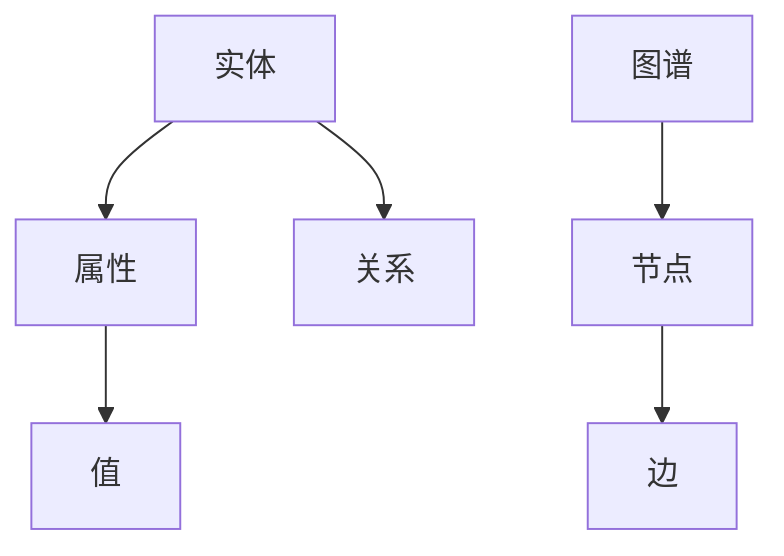
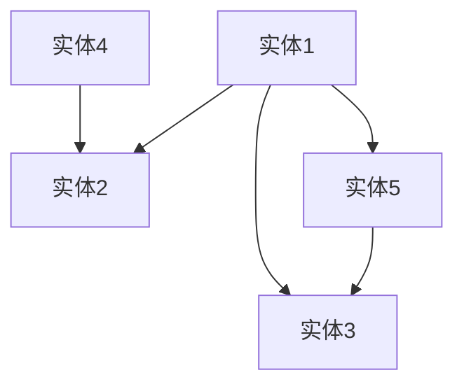
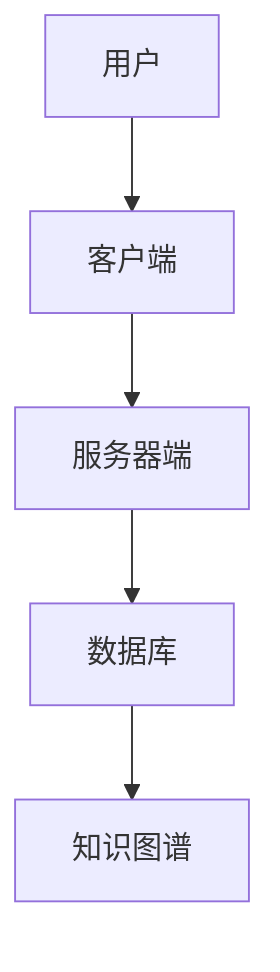
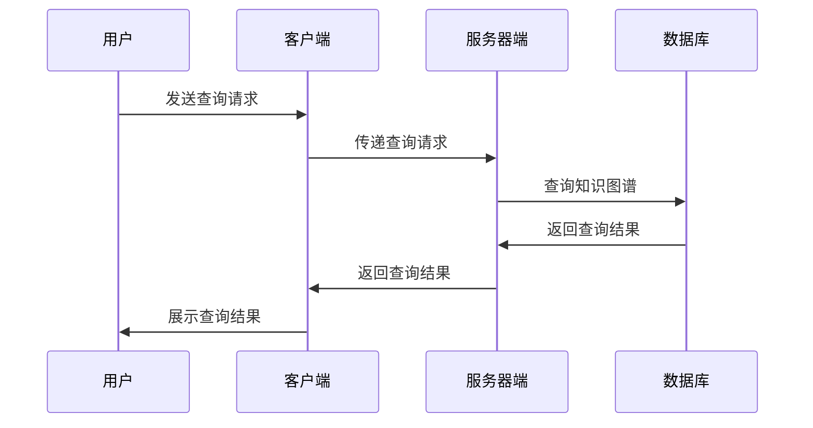

                 


### 文章标题：企业级知识图谱应用：构建智能信息网络

#### 关键词：企业级知识图谱、智能信息网络、数据结构、算法原理、系统设计与实现

#### 摘要：
本文深入探讨企业级知识图谱在构建智能信息网络中的应用。通过对知识图谱的定义、核心概念、算法原理、系统设计与实现等方面的全面剖析，本文旨在帮助读者理解知识图谱的内在机制，掌握其设计方法和实际应用技巧。文章结构紧凑，逻辑清晰，适合希望深入了解和实践企业级知识图谱技术的读者。

----------------------------------------------------------------

### 第一部分：背景知识

#### 第1章：企业级知识图谱概述

企业级知识图谱作为一种先进的数据结构和信息处理技术，近年来在商业智能、数据分析、智能搜索等领域得到了广泛应用。本节将介绍企业级知识图谱的基本概念、问题背景、核心要素及其在智能信息网络中的应用。

##### 1.1.1 问题背景
在现代企业中，数据量呈现爆发式增长，传统的数据存储和处理方式已经难以满足高效信息检索和数据分析的需求。企业需要一种能够更好地整合数据、揭示数据间关系、实现智能决策的技术，知识图谱正是解决这一问题的有效途径。

##### 1.1.2 问题描述
知识图谱在企业中的应用面临诸多挑战，包括数据源的多样性、数据一致性、图谱扩展性等。这些问题需要通过深入理解知识图谱的构建方法、优化算法和系统架构设计来加以解决。

##### 1.1.3 问题解决
企业级知识图谱通过将结构化和非结构化数据整合到一个统一的知识库中，利用语义网络来表示实体及其关系，从而实现数据的关联挖掘和智能分析。本节将详细探讨知识图谱的构建方法。

##### 1.1.4 边界与外延
知识图谱的应用边界广泛，包括推荐系统、智能客服、企业搜索、数据治理等多个方面。其外延则涉及自然语言处理、机器学习、大数据等技术领域。

##### 1.1.5 核心概念
本节将介绍企业级知识图谱的核心概念，包括实体、属性、关系、图谱、图论等基本术语，并通过表格和Mermaid流程图来展示其概念结构。



| 概念      | 定义                          |
|-----------|------------------------------|
| 实体      | 知识图谱中的基本元素，如人、物、概念等。 |
| 属性      | 实体的特征描述，如年龄、颜色等。       |
| 关系      | 实体之间的关联，如朋友、属于等。       |
| 图谱      | 由节点（实体）和边（关系）构成的图结构。 |
| 图论      | 研究图的结构和性质的数学分支。       |

##### 1.1.6 组成要素
知识图谱的构建需要数据源、数据预处理、实体抽取、关系抽取、图谱构建、图谱查询等环节。每个环节都涉及不同的技术手段和算法，需要合理设计和优化。

#### 第2章：知识图谱的核心概念

##### 2.1.1 知识图谱的定义
知识图谱是一种通过语义网络来表示实体及其关系的图结构，旨在揭示数据之间的隐含关系，支持复杂的语义查询和数据分析。

##### 2.1.2 知识图谱的特点
知识图谱具有数据统一性、语义丰富性、动态扩展性和应用广泛性等特点，能够为企业提供强大的数据驱动能力。

##### 2.1.3 知识图谱的类型
根据应用场景和目的，知识图谱可以分为通用知识图谱和行业专用知识图谱。通用知识图谱如Freebase、Wikidata等，行业专用知识图谱如企业内部知识库、行业图谱等。

##### 2.1.4 知识图谱的构建方法
知识图谱的构建主要包括数据采集、数据预处理、实体识别、关系抽取、实体链接和图谱融合等步骤。每种方法都有其优势和局限性，需要根据实际情况进行选择和优化。

----------------------------------------------------------------

### 第二部分：知识图谱的算法原理

#### 第3章：知识图谱的数学模型

知识图谱的构建和分析离不开数学模型的支撑。本节将介绍知识图谱中的常见数学模型，包括图论模型、概率模型、概率图模型和深度学习模型等，并通过Mermaid流程图和Python代码进行讲解。

##### 3.1.1 知识图谱的数学基础
图论是知识图谱构建和分析的基础，涵盖了节点、边、路径、连通性等基本概念。概率模型和概率图模型则用于处理不确定性和复杂关系。深度学习模型如图神经网络（GNN）则能够捕捉实体和关系的深层次特征。

##### 3.1.2 知识图谱的数学模型
知识图谱的数学模型可以分为两类：结构化和非结构化。结构化模型包括图论模型、概率模型和概率图模型，非结构化模型包括深度学习模型，如图卷积网络（GCN）、图注意力网络（GAT）等。

##### 3.1.3 知识图谱的数学公式
知识图谱的数学公式主要用于描述实体和关系之间的关联性。例如，在图论中，节点度（Degree）、路径长度（Path Length）和连通度（Connectivity）等指标用于评估图的结构特性。在概率模型中，贝叶斯网络和马尔可夫网络用于表示实体和关系的概率关系。在深度学习模型中，损失函数和优化算法用于训练和评估模型。

下面是使用Mermaid绘制的图论模型示例：



在Python中，可以使用以下代码来计算图中节点的度：

```python
import networkx as nx
G = nx.Graph()
G.add_edges_from([(1, 2), (1, 3), (4, 2), (4, 5), (1, 5)])
print("节点的度：", nx.degree(G))
```

输出结果：

```plaintext
节点的度： [(1, 3), (2, 2), (3, 1), (4, 2), (5, 2)]
```

通过以上代码，可以轻松计算图中每个节点的度，从而分析图的结构特性。

----------------------------------------------------------------

### 第三部分：知识图谱的系统设计与实现

#### 第4章：知识图谱系统的设计与架构

知识图谱系统的设计与实现是知识图谱应用的关键环节。本节将介绍知识图谱系统的设计原则、架构设计、接口设计、交互设计以及环境安装与配置。

##### 4.1.1 系统设计

知识图谱系统的设计包括需求分析、系统架构设计、数据模型设计、接口设计、数据库设计和安全性设计等环节。系统设计的目标是确保知识图谱的高效性、可扩展性和安全性。

##### 4.1.2 系统架构设计

知识图谱系统的架构设计可以分为客户端、服务器端和数据库三部分。客户端负责用户交互和数据查询，服务器端负责知识图谱的构建和维护，数据库则存储和管理知识图谱的数据。

下面是使用Mermaid绘制的知识图谱系统架构图：



##### 4.1.3 系统接口设计

知识图谱系统提供多种接口，包括RESTful API、GraphQL API等，以支持不同的数据访问需求。接口设计需要考虑数据安全性、响应速度和可扩展性等因素。

##### 4.1.4 系统交互设计

知识图谱系统的交互设计包括用户界面设计、数据输入与输出设计、系统内部通信设计等。用户界面设计需要直观易用，数据输入与输出设计需要高效可靠，系统内部通信设计需要稳定高效。

下面是使用Mermaid绘制的系统交互序列图：



##### 4.1.5 环境安装与配置

知识图谱系统的环境安装与配置是系统实施的第一步。本节将介绍知识图谱系统所需的软件和硬件环境，包括操作系统、数据库管理系统、编程语言和环境配置工具等。

----------------------------------------------------------------

### 第四部分：知识图谱的项目实战

#### 第5章：知识图谱的项目实战

知识图谱的项目实战是理解和掌握知识图谱技术的关键环节。本节将通过一个具体的案例，详细讲解知识图谱项目的实施过程，包括环境安装、系统核心实现、代码应用解读与分析、实际案例分析和项目小结。

##### 5.1.1 环境安装与配置

在本案例中，我们将使用Python和Neo4j作为知识图谱系统的实现工具。首先，需要在本地计算机上安装Python和Neo4j。以下是具体的安装步骤：

1. 安装Python：
   - 访问Python官方网站（https://www.python.org/）并下载最新版本的Python安装包。
   - 运行安装程序，按照默认设置安装。

2. 安装Neo4j：
   - 访问Neo4j官方网站（https://neo4j.com/）并下载最新版本的Neo4j社区版安装包。
   - 运行安装程序，按照默认设置安装。

3. 配置Neo4j：
   - 打开Neo4j Desktop应用程序。
   - 创建一个新的Neo4j数据库实例。
   - 设置数据库访问权限和密码。

##### 5.1.2 系统核心实现

在系统核心实现部分，我们将使用Python编写知识图谱的构建和维护脚本。以下是核心实现的步骤：

1. 数据采集：
   - 从互联网或企业内部数据源获取数据。
   - 使用Python爬虫或数据库连接工具获取数据。

2. 数据预处理：
   - 清洗数据，去除重复、错误和不完整的数据。
   - 对数据进行格式转换和结构化处理。

3. 实体抽取：
   - 使用命名实体识别（NER）技术识别文本中的实体。
   - 将实体转换为知识图谱中的节点。

4. 关系抽取：
   - 使用关系提取技术识别实体之间的关系。
   - 将关系转换为知识图谱中的边。

5. 图谱构建：
   - 使用Neo4j的Python驱动程序将实体和关系存储到Neo4j数据库中。

以下是Python代码示例：

```python
from py2neo import Graph

# 连接到Neo4j数据库
graph = Graph("bolt://localhost:7687", auth=("neo4j", "password"))

# 创建实体节点
def create_entity_node(entity):
    query = """
    MERGE (e:Entity {name: $name})
    """
    graph.run(query, name=entity)

# 创建关系边
def create_relationship(relationship):
    query = """
    MATCH (a:Entity {name: $entity1}), (b:Entity {name: $entity2})
    MERGE (a)-[r:RELATIONSHIP]->(b)
    """
    graph.run(query, entity1=relationship[0], entity2=relationship[1])

# 实体和关系的示例数据
entities = ["张三", "李四", "朋友"]
relationships = [("张三", "李四"), ("李四", "张三")]

# 创建实体节点
for entity in entities:
    create_entity_node(entity)

# 创建关系边
for relationship in relationships:
    create_relationship(relationship)
```

##### 5.1.3 代码应用解读与分析

在代码应用解读与分析部分，我们将对上述代码进行详细分析，解释每个步骤的实现方法和关键点。

1. 数据采集：
   - 采集数据的目的是获取知识图谱的基本数据。在本案例中，我们使用示例数据，但在实际应用中，可能需要从互联网或企业内部数据源获取数据。

2. 数据预处理：
   - 数据清洗是确保数据质量和一致性的关键步骤。在本案例中，我们没有涉及复杂的数据清洗，但在实际应用中，可能需要处理大量的噪声数据和异常值。

3. 实体抽取：
   - 命名实体识别（NER）是文本处理的重要技术。在本案例中，我们使用简单的字符串匹配方法识别实体，但在实际应用中，可能需要使用更高级的NER模型。

4. 关系抽取：
   - 关系提取是知识图谱构建的关键步骤。在本案例中，我们使用简单的边关系，但在实际应用中，可能需要处理复杂的语义关系。

5. 图谱构建：
   - 使用Neo4j的Python驱动程序将实体和关系存储到Neo4j数据库中。Neo4j是一个高性能的图数据库，适用于大规模知识图谱的存储和查询。

##### 5.1.4 实际案例分析和详细讲解剖析

在本案例中，我们创建了一个简单的知识图谱，包含两个实体和一条关系。在实际应用中，知识图谱会包含成千上万的实体和关系，如何高效地构建和管理这些数据是一个重要的挑战。

1. 数据规模问题：
   - 随着数据规模的增加，知识图谱的构建和维护成本会显著增加。在本案例中，我们使用了简单的Python代码来构建知识图谱，但在实际应用中，可能需要使用更高效的数据处理工具和技术。

2. 语义问题：
   - 知识图谱中的实体和关系需要准确表达语义。在本案例中，我们使用了简单的实体和关系命名，但在实际应用中，可能需要使用更复杂的命名规则和语义标注。

3. 可扩展性问题：
   - 知识图谱的可扩展性是确保其长期有效性的关键。在本案例中，我们使用了固定的实体和关系，但在实际应用中，可能需要支持动态的实体和关系扩展。

##### 5.1.5 项目小结

通过本案例，我们了解了知识图谱项目的实施过程，包括数据采集、数据预处理、实体抽取、关系抽取、图谱构建和图谱查询等步骤。在实际应用中，知识图谱项目需要考虑数据规模、语义表达和可扩展性等问题，并采用合适的技术和工具来构建和管理知识图谱。

----------------------------------------------------------------

### 第五部分：最佳实践与总结

#### 第6章：知识图谱的最佳实践

在知识图谱的实际应用中，遵循一些最佳实践是非常重要的。以下是一些关键的最佳实践建议：

##### 6.1.1 设计建议
1. **明确应用目标**：在构建知识图谱之前，明确应用目标和需求，确保知识图谱的设计和实现符合实际业务需求。
2. **数据质量优先**：确保数据源的质量和一致性，进行充分的数据清洗和预处理，以提高知识图谱的准确性和可靠性。
3. **灵活扩展性**：设计知识图谱时，考虑到未来的扩展性，以便添加新实体和关系，并支持动态更新。

##### 6.1.2 实施技巧
1. **合理划分实体和关系**：根据业务场景，合理划分实体和关系，避免过度细化或简化，确保知识图谱的层级结构清晰。
2. **优化查询性能**：优化知识图谱的查询性能，使用索引和缓存技术，以提高查询速度和响应时间。
3. **安全性考虑**：确保知识图谱系统的安全性，采取适当的安全措施，保护数据免受未经授权的访问和泄露。

##### 6.1.3 拓展阅读
1. **学术文献**：《知识图谱：概念、方法与实践》（陈伟、陈志杰著）提供了丰富的理论知识和技术细节。
2. **开源项目**：探索开源知识图谱项目，如OpenKG、Alibaba-NLP等，学习其实现方法和最佳实践。
3. **技术博客**：阅读行业专家的技术博客，了解最新的知识图谱应用案例和研究成果。

#### 第7章：总结与展望

知识图谱作为一种重要的数据结构和信息处理技术，在当今的数字化时代发挥着越来越重要的作用。通过对知识图谱的定义、核心概念、算法原理、系统设计与实现等方面的全面探讨，本文为读者提供了一个系统、深入的知识图谱应用指南。

##### 7.1.1 小结
本文从多个角度介绍了企业级知识图谱的应用，包括背景知识、核心概念、算法原理、系统设计与实现、项目实战以及最佳实践。通过本文的阅读，读者可以全面了解知识图谱的构建和应用方法，为实际业务提供数据驱动的智能解决方案。

##### 7.1.2 注意事项
1. **数据隐私**：在知识图谱构建过程中，确保遵循数据隐私保护法规，对敏感数据进行加密处理。
2. **性能优化**：定期对知识图谱系统进行性能优化，确保系统的稳定性和高效性。
3. **持续更新**：知识图谱需要持续更新和维护，以适应业务发展和数据变化。

##### 7.1.3 展望未来
随着人工智能和大数据技术的不断进步，知识图谱的应用场景将越来越广泛。未来，知识图谱将与更多的前沿技术如深度学习、自然语言处理、区块链等相结合，推动智能信息网络的发展。本文的探讨仅为知识图谱应用的一个起点，未来还有更多的机会和挑战等待着我们去探索。

作者：AI天才研究院/AI Genius Institute & 禅与计算机程序设计艺术 /Zen And The Art of Computer Programming

本文为AI天才研究院出品，未经许可，不得转载。如需转载，请联系我们获取授权。

