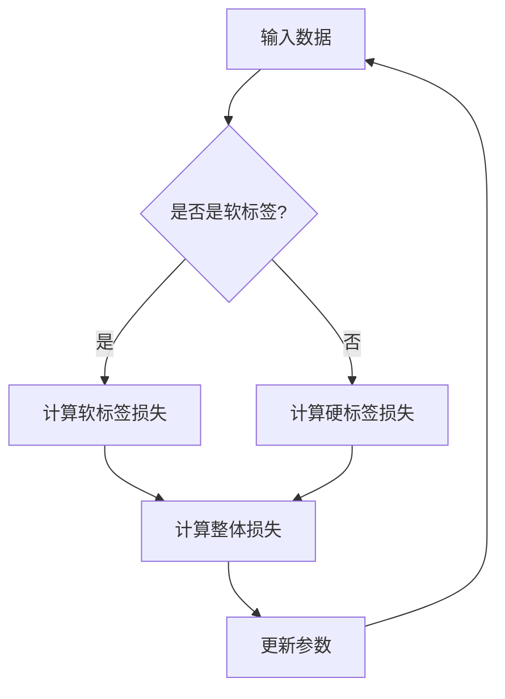

                 

## 企业级知识蒸馏框架：AI模型轻量化部署

> 关键词：企业级知识蒸馏，AI模型轻量化，部署，算法优化

> 摘要：随着人工智能技术的快速发展，大规模深度学习模型的计算量和存储需求日益增加，给模型的部署带来了巨大挑战。企业级知识蒸馏框架作为一种有效的模型压缩与优化技术，能够在保证模型性能的前提下显著减少模型参数数量和计算复杂度，从而实现AI模型的轻量化部署。本文将详细探讨企业级知识蒸馏框架的背景、核心概念、原理、算法、框架设计与实现，以及实际应用案例，旨在为企业提供一套完整的AI模型轻量化部署解决方案。

## 第一部分：企业级知识蒸馏框架概述

### 第1章：问题背景与核心概念

#### 1.1 问题背景

##### 1.1.1 AI模型轻量化部署的需求

随着深度学习在各个领域的广泛应用，AI模型的计算量和存储需求急剧增加。特别是对于移动设备、嵌入式系统和云计算环境，如何有效减少模型的参数数量和计算复杂度，实现模型的轻量化部署成为亟待解决的问题。

##### 1.1.2 知识蒸馏框架的提出与发展

知识蒸馏是一种模型压缩与优化技术，通过将大规模的“教师模型”的知识迁移到参数较少的“学生模型”中，实现模型的压缩和加速。知识蒸馏框架自提出以来，得到了广泛的关注和研究，并在多个应用场景中取得了显著的成果。

##### 1.1.3 企业级知识蒸馏框架的重要性

企业级知识蒸馏框架不仅能够解决模型轻量化的问题，还能够提供高效的模型训练和部署工具，为企业降低成本、提高效率、拓展业务提供了强有力的支持。

#### 1.2 核心概念

##### 1.2.1 知识蒸馏的定义与原理

知识蒸馏是指将一个复杂模型（教师模型）的知识迁移到一个较简单的模型（学生模型）中，使得学生模型能够保持较高的性能。其核心思想是通过软标签（软目标）指导学生模型的学习，而不是直接使用硬标签（真实标签）。

##### 1.2.2 企业级知识蒸馏的特点

企业级知识蒸馏框架需要具备可扩展性、高效性、安全性和易用性等特点，以适应不同企业和应用场景的需求。

##### 1.2.3 企业级知识蒸馏框架的要素

企业级知识蒸馏框架主要包括教师模型、学生模型、知识蒸馏算法、数据预处理模块、训练与评估模块等核心组成部分。

#### 1.3 企业级知识蒸馏框架的边界与外延

##### 1.3.1 知识蒸馏框架在不同应用场景的差异

知识蒸馏框架在不同的应用场景中，如图像识别、自然语言处理、语音识别等，存在一定的差异。

##### 1.3.2 企业级知识蒸馏框架与普通知识蒸馏框架的对比

企业级知识蒸馏框架与普通知识蒸馏框架在架构设计、算法优化、部署与运维等方面存在显著差异。

##### 1.3.3 企业级知识蒸馏框架的演进趋势

随着人工智能技术的不断演进，企业级知识蒸馏框架也在不断优化和演进，如自适应知识蒸馏、多任务蒸馏、联邦知识蒸馏等新技术的出现。

#### 1.4 本章小结

本章对知识蒸馏框架在企业级AI模型轻量化部署中的重要性进行了深入探讨，为后续章节的详细讲解奠定了基础。

## 第二部分：知识蒸馏原理与算法

### 第2章：知识蒸馏原理

#### 2.1 知识蒸馏的数学模型

知识蒸馏的数学模型主要包括目标函数、损失函数和正则化方法。目标函数用于衡量学生模型与教师模型之间的知识差距，损失函数用于优化目标函数，正则化方法用于防止过拟合。

##### 2.1.1 知识蒸馏的目标函数

知识蒸馏的目标函数通常采用交叉熵损失函数，表示为：

$$
L = -\sum_{i=1}^{N} \sum_{j=1}^{C} y_{ij} \log (p_{ij})
$$

其中，$y_{ij}$ 表示第$i$个样本在第$j$个类别的软标签值，$p_{ij}$ 表示学生模型预测概率。

##### 2.1.2 知识蒸馏的损失函数

知识蒸馏的损失函数通常采用软标签损失和硬标签损失的组合。软标签损失用于衡量学生模型与教师模型在软标签上的差距，硬标签损失用于衡量学生模型在硬标签上的预测误差。

##### 2.1.3 知识蒸馏的正则化方法

知识蒸馏的正则化方法主要用于防止过拟合，常用的方法包括Dropout、权重衰减等。

#### 2.2 知识蒸馏算法的mermaid流程图



#### 2.3 知识蒸馏算法的Python源代码实现

```python
def knowledge_distillation_loss(teacher_output, student_output, labels, alpha=0.5):
    # 计算教师模型的软标签损失
    teacher_loss = softmax_loss(teacher_output, labels)
    
    # 计算学生模型的硬标签损失
    student_loss = softmax_loss(student_output, labels)
    
    # 计算知识蒸馏损失
    knowledge_loss = alpha * teacher_loss + (1 - alpha) * student_loss
    
    return knowledge_loss
```

#### 2.4 知识蒸馏算法的详细讲解与举例

##### 2.4.1 知识蒸馏算法的工作流程

知识蒸馏算法的工作流程包括输入数据预处理、教师模型和学

