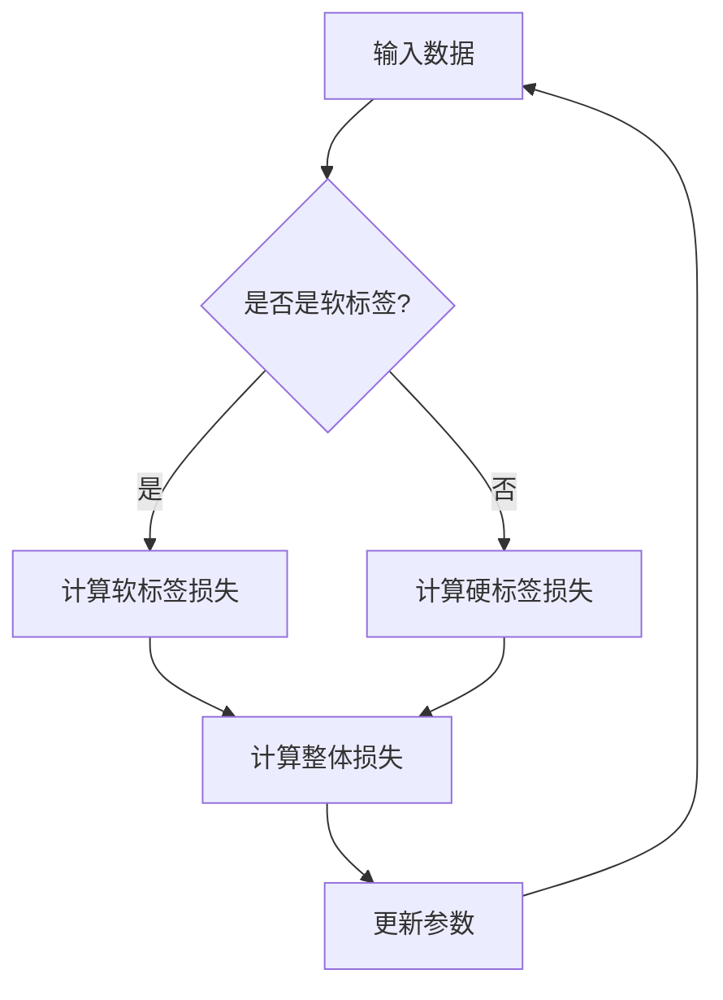
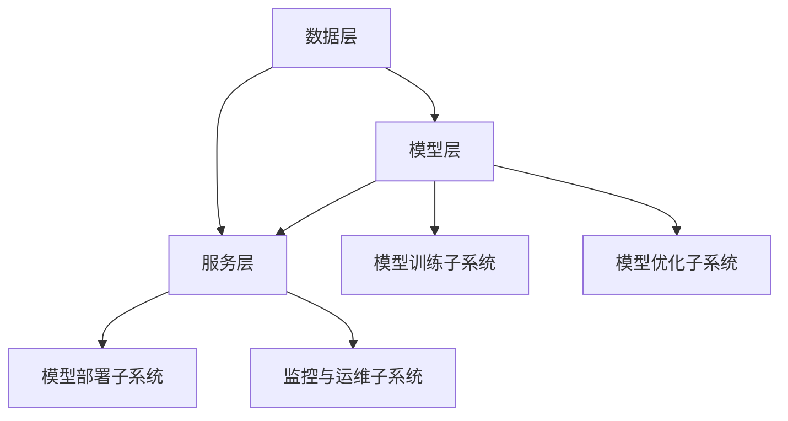
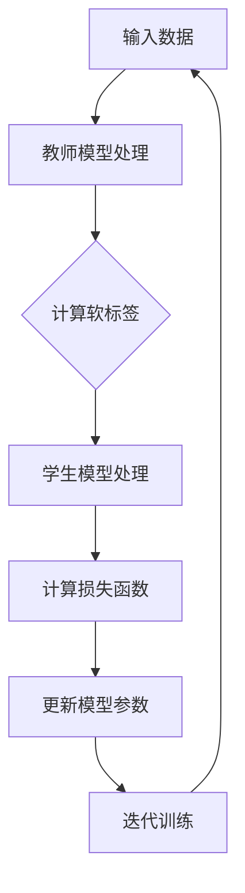

                 

## 企业级知识蒸馏框架概述

### 第1章: 问题背景与核心概念

#### 1.1 问题背景

**1.1.1 AI模型轻量化部署的需求**

随着人工智能技术的迅猛发展，深度学习模型在各个领域的应用越来越广泛。然而，这些模型通常非常复杂，包含数百万甚至数十亿的参数，从而导致模型体积庞大。对于企业而言，模型体积庞大意味着更高的存储和计算成本，同时也会增加模型部署的难度。特别是在移动设备、嵌入式系统和资源受限的环境中，传统的深度学习模型难以满足实际需求。因此，AI模型的轻量化部署成为一个亟待解决的问题。

**1.1.2 知识蒸馏框架的提出与发展**

知识蒸馏（Knowledge Distillation）作为一种模型压缩和优化技术，最早由Hinton等人于2014年提出。知识蒸馏的基本思想是通过将大型“教师模型”（Teacher Model）的知识迁移到小型“学生模型”（Student Model）中，从而实现对模型的压缩和加速。知识蒸馏的核心在于设计一个有效的知识传递机制，使得学生模型能够学习到教师模型的高级特征表示。

近年来，知识蒸馏技术得到了广泛关注，并在多个领域取得了显著的应用成果。例如，在图像识别、语音识别、自然语言处理等领域，知识蒸馏技术被广泛应用于模型的压缩和优化。

**1.1.3 企业级知识蒸馏框架的重要性**

在企业级应用中，知识蒸馏框架的重要性不言而喻。首先，企业级知识蒸馏框架可以帮助企业实现深度学习模型的轻量化部署，从而降低存储和计算成本，提升模型在资源受限环境中的性能。其次，企业级知识蒸馏框架可以为不同的业务场景提供灵活的解决方案，满足多样化的需求。最后，企业级知识蒸馏框架有助于提升企业的技术竞争力，为企业带来更大的商业价值。

#### 1.2 核心概念

**1.2.1 知识蒸馏的定义与原理**

知识蒸馏是一种通过将教师模型（通常是一个大型、准确度高的模型）的知识迁移到学生模型（通常是一个小型、高效能的模型）中的技术。其基本原理是将教师模型的输出（通常是一个概率分布）作为软标签（Soft Label），然后通过设计损失函数和优化算法，使得学生模型能够学习到教师模型的高级特征表示。

**1.2.2 企业级知识蒸馏的特点**

企业级知识蒸馏框架具有以下几个特点：

1. **高可扩展性**：企业级知识蒸馏框架需要能够支持大规模数据的处理，以及灵活的模型配置和调整。
2. **高效性**：企业级知识蒸馏框架需要能够在较短的时间内完成模型的训练和优化，以满足企业的实时需求。
3. **安全性**：企业级知识蒸馏框架需要确保模型的安全性和隐私性，防止敏感数据泄露。
4. **易用性**：企业级知识蒸馏框架需要提供友好的用户界面和详细的文档，方便企业用户快速上手和使用。

**1.2.3 企业级知识蒸馏框架的要素**

企业级知识蒸馏框架通常包含以下几个关键要素：

1. **教师模型选择**：选择合适的教师模型对于知识蒸馏的效果至关重要。教师模型的选择需要考虑模型的准确性、大小和复杂性。
2. **学生模型设计**：学生模型的设计需要兼顾模型的性能和效率，同时需要与教师模型保持一定的兼容性。
3. **知识传递机制**：知识传递机制的设计是知识蒸馏框架的核心，包括损失函数的设计、优化算法的选择等。
4. **训练与评估**：训练与评估是知识蒸馏框架的必要环节，需要设计有效的训练策略和评估指标，以确保模型的效果和性能。

#### 1.3 企业级知识蒸馏框架的边界与外延

**1.3.1 知识蒸馏框架在不同应用场景的差异**

知识蒸馏框架在不同应用场景中可能存在差异。例如，在图像识别领域，知识蒸馏框架需要关注图像特征的学习和提取；在自然语言处理领域，知识蒸馏框架需要关注文本特征和语义表示的学习。

**1.3.2 企业级知识蒸馏框架与普通知识蒸馏框架的对比**

企业级知识蒸馏框架与普通知识蒸馏框架的主要区别在于需求的不同。普通知识蒸馏框架通常针对特定的任务和应用场景，而企业级知识蒸馏框架需要具备更高的通用性和灵活性，以满足不同业务场景的需求。

**1.3.3 企业级知识蒸馏框架的演进趋势**

随着人工智能技术的不断进步，企业级知识蒸馏框架也在不断演进。未来，企业级知识蒸馏框架可能会更加注重以下几个方面：

1. **自动化与智能化**：通过引入自动化和智能化技术，提高知识蒸馏框架的效率和效果。
2. **跨域迁移与融合**：研究跨领域迁移学习和知识融合技术，提升知识蒸馏框架在不同场景下的适用性。
3. **模型安全性与隐私保护**：加强对模型安全性和隐私保护的重视，确保知识蒸馏框架在应用中的安全性和可靠性。

#### 1.4 本章小结

本章从问题背景、核心概念、特点、要素以及边界与外延等方面对企业级知识蒸馏框架进行了概述。通过对知识蒸馏框架的深入理解，读者可以更好地把握企业级知识蒸馏框架的设计原则和实现方法，为后续章节的学习打下基础。

---

### 第2章: 知识蒸馏原理

#### 2.1 知识蒸馏的数学模型

知识蒸馏的核心在于通过数学模型来实现教师模型到学生模型的知识传递。本节将介绍知识蒸馏的数学模型，包括目标函数、损失函数和正则化方法。

**2.1.1 知识蒸馏的目标函数**

知识蒸馏的目标函数旨在最小化学生模型输出与教师模型输出之间的差距。具体而言，目标函数可以表示为：

$$
L = \alpha L_{teacher} + (1 - \alpha) L_{student}
$$

其中，$L_{teacher}$表示教师模型输出的损失，$L_{student}$表示学生模型输出的损失，$\alpha$是一个平衡参数，用于调节教师模型和student模型损失的重要性。

**2.1.2 知识蒸馏的损失函数**

知识蒸馏的损失函数通常包括两部分：硬标签损失和软标签损失。

1. **硬标签损失**：硬标签损失用于衡量学生模型输出与真实标签之间的差距，通常使用交叉熵损失函数：

$$
L_{student} = -\sum_{i} y_i \log(s_i)
$$

其中，$y_i$表示真实标签，$s_i$表示学生模型输出的概率分布。

2. **软标签损失**：软标签损失用于衡量学生模型输出与教师模型输出之间的差距，同样使用交叉熵损失函数：

$$
L_{teacher} = -\sum_{i} t_i \log(s_i)
$$

其中，$t_i$表示教师模型输出的概率分布。

**2.1.3 知识蒸馏的正则化方法**

正则化方法用于防止模型过拟合，提高模型的泛化能力。在知识蒸馏中，常用的正则化方法包括：

1. **L2正则化**：L2正则化通过在损失函数中添加L2范数项来实现，可以抑制模型参数的绝对值增长，防止模型过拟合。

$$
L = L_{base} + \lambda \sum_{i} \frac{1}{2} w_i^2
$$

其中，$L_{base}$表示基本损失函数，$w_i$表示模型参数，$\lambda$是正则化强度参数。

2. **Dropout正则化**：Dropout正则化通过在训练过程中随机丢弃一部分神经元来实现，可以防止模型过拟合，提高模型的泛化能力。

#### 2.2 知识蒸馏算法的mermaid流程图



#### 2.3 知识蒸馏算法的Python源代码实现

```python
import tensorflow as tf

def knowledge_distillation_loss(teacher_output, student_output, labels, alpha=0.5):
    # 计算教师模型的软标签损失
    teacher_loss = tf.keras.losses.categorical_crossentropy(labels, teacher_output)
    
    # 计算学生模型的硬标签损失
    student_loss = tf.keras.losses.categorical_crossentropy(labels, student_output)
    
    # 计算知识蒸馏损失
    knowledge_loss = alpha * teacher_loss + (1 - alpha) * student_loss
    
    return knowledge_loss
```

#### 2.4 知识蒸馏算法的详细讲解与举例

**2.4.1 知识蒸馏算法的工作流程**

知识蒸馏算法的工作流程主要包括以下几个步骤：

1. **数据准备**：准备用于训练的学生模型和教师模型的数据集。
2. **模型初始化**：初始化学生模型和教师模型。
3. **训练过程**：通过迭代优化算法，不断更新学生模型的参数，使其能够更好地学习教师模型的知识。
4. **评估过程**：评估学生模型的性能，包括准确度、损失函数值等。

**2.4.2 知识蒸馏算法的数学原理**

知识蒸馏算法的数学原理主要基于以下两个方面：

1. **概率分布的相似性**：知识蒸馏通过比较学生模型和教师模型输出概率分布的相似性，来实现知识传递。具体而言，使用交叉熵损失函数来衡量两个概率分布之间的差异。

2. **特征表示的学习**：知识蒸馏通过优化学生模型的参数，使其能够学习到教师模型的高级特征表示。这种特征表示能够帮助学生在新的数据集上实现更好的泛化能力。

**2.4.3 知识蒸馏算法的实际应用案例**

知识蒸馏算法在实际应用中有着广泛的应用，以下是一个简单的应用案例：

假设有一个大型卷积神经网络（CNN）用于图像分类，该模型包含数百万个参数。为了将其部署到移动设备或嵌入式系统中，我们可以使用知识蒸馏技术，将其压缩成一个更小的模型。具体步骤如下：

1. **选择教师模型**：选择一个具有较高准确度的大型CNN作为教师模型。
2. **设计学生模型**：设计一个较小的CNN作为学生模型，其参数数量远少于教师模型。
3. **训练过程**：使用知识蒸馏算法训练学生模型，通过优化损失函数，使其能够学习教师模型的知识。
4. **评估过程**：评估学生模型的性能，包括准确度和计算速度等。

通过以上步骤，我们可以得到一个既小又高效的模型，满足移动设备或嵌入式系统的需求。

#### 2.5 本章小结

本章详细介绍了知识蒸馏的数学模型、算法原理以及实际应用案例。通过本章的学习，读者可以深入了解知识蒸馏的基本原理和实现方法，为构建企业级知识蒸馏框架打下基础。接下来，我们将进一步探讨企业级知识蒸馏框架的设计与实现。

---

### 第3章: 企业级知识蒸馏框架设计与实现

#### 3.1 企业级知识蒸馏框架设计原则

企业级知识蒸馏框架的设计原则决定了框架的可用性、可扩展性和稳定性。以下是企业级知识蒸馏框架设计的主要原则：

**3.1.1 可扩展性**

企业级知识蒸馏框架需要具备高可扩展性，能够适应不断变化的需求和规模。这包括：

1. **模块化设计**：将框架分解为独立的模块，每个模块负责不同的功能，便于扩展和维护。
2. **可配置性**：允许用户通过配置文件或参数调整框架的运行方式，以适应不同的业务场景。

**3.1.2 高效性**

高效性是企业级知识蒸馏框架的关键特性之一。这包括：

1. **优化算法**：选择高效优化的算法，提高模型的训练速度和推理性能。
2. **并行计算**：利用并行计算技术，加速模型的训练和推理过程。

**3.1.3 安全性**

安全性是企业级知识蒸馏框架必须考虑的重要因素。这包括：

1. **数据加密**：对传输和存储的数据进行加密，确保数据的安全性。
2. **访问控制**：实施严格的访问控制策略，防止未经授权的访问。

**3.1.4 易用性**

易用性是企业级知识蒸馏框架的重要设计原则。这包括：

1. **用户界面**：提供友好的用户界面，降低用户的使用门槛。
2. **文档与支持**：提供详细的文档和用户支持，帮助用户快速上手和使用框架。

#### 3.2 企业级知识蒸馏框架的架构设计

企业级知识蒸馏框架的架构设计决定了框架的灵活性和扩展性。以下是企业级知识蒸馏框架的架构设计：

**3.2.1 整体架构设计**

企业级知识蒸馏框架的整体架构设计通常包括以下几个部分：

1. **数据层**：负责数据预处理、数据存储和数据加载等功能。
2. **模型层**：负责模型的设计、训练和优化等功能。
3. **服务层**：负责模型的部署、监控和运维等功能。

**3.2.2 子系统划分与功能**

企业级知识蒸馏框架的子系统划分通常包括以下几个部分：

1. **数据预处理子系统**：负责数据清洗、数据增强、数据归一化等预处理操作。
2. **模型训练子系统**：负责模型的训练、验证和调整等功能。
3. **模型优化子系统**：负责模型参数的调整、知识蒸馏算法的优化等操作。
4. **模型部署子系统**：负责模型的部署、监控和运维等功能。

**3.2.3 架构mermaid图示**



#### 3.3 企业级知识蒸馏框架的实现细节

**3.3.1 数据预处理**

数据预处理是企业级知识蒸馏框架的关键环节，直接影响到模型的训练效果。以下是数据预处理的主要步骤：

1. **数据清洗**：去除数据中的噪声和异常值，确保数据的质量。
2. **数据增强**：通过旋转、缩放、裁剪等操作，增加数据的多样性，提高模型的泛化能力。
3. **数据归一化**：将数据归一化到统一的范围内，便于模型的训练。

**3.3.2 知识蒸馏算法优化**

知识蒸馏算法的优化是提升模型性能的关键。以下是一些常见的优化方法：

1. **温度调节**：通过调节温度参数，可以控制教师模型输出概率分布的平滑程度，从而影响学生模型的学习效果。
2. **动态调整α值**：在训练过程中动态调整α值，可以更好地平衡教师模型和学生模型的损失。
3. **注意力机制**：引入注意力机制，使得学生模型能够关注到教师模型中的重要特征。

**3.3.3 部署与运维**

企业级知识蒸馏框架的部署与运维需要考虑以下几个方面：

1. **容器化**：将模型和服务打包成容器镜像，便于部署和迁移。
2. **监控与日志**：实施监控机制，实时监控模型的运行状态，并记录日志信息。
3. **故障处理**：设计故障处理机制，确保模型在异常情况下能够快速恢复。

#### 3.4 企业级知识蒸馏框架的Python代码实现

以下是一个简单的企业级知识蒸馏框架的Python代码实现示例：

```python
import tensorflow as tf

class KnowledgeDistillationFramework:
    def __init__(self, teacher_model, student_model, alpha=0.5):
        self.teacher_model = teacher_model
        self.student_model = student_model
        self.alpha = alpha
        
    def train(self, dataset, epochs):
        for epoch in range(epochs):
            for batch in dataset:
                inputs, labels = batch
                with tf.GradientTape() as tape:
                    teacher_output = self.teacher_model(inputs)
                    student_output = self.student_model(inputs)
                    loss = self.knowledge_distillation_loss(teacher_output, student_output, labels, self.alpha)
                grads = tape.gradient(loss, self.student_model.trainable_variables)
                self.student_model.optimizer.apply_gradients(zip(grads, self.student_model.trainable_variables))
            print(f'Epoch {epoch+1}, Loss: {loss.numpy()}')

    def knowledge_distillation_loss(self, teacher_output, student_output, labels, alpha):
        teacher_loss = tf.keras.losses.categorical_crossentropy(labels, teacher_output)
        student_loss = tf.keras.losses.categorical_crossentropy(labels, student_output)
        knowledge_loss = alpha * teacher_loss + (1 - alpha) * student_loss
        return knowledge_loss

# 使用示例
teacher_model = ... # 初始化教师模型
student_model = ... # 初始化学生模型
framework = KnowledgeDistillationFramework(teacher_model, student_model, alpha=0.5)
framework.train(dataset, epochs=10)
```

#### 3.5 本章小结

本章详细介绍了企业级知识蒸馏框架的设计原则、架构设计、实现细节和Python代码实现。通过对本章的学习，读者可以深入理解企业级知识蒸馏框架的设计和实现方法，为实际应用奠定基础。在下一章中，我们将进一步探讨企业级知识蒸馏框架的应用场景和实践案例。

---

### 第4章: 企业级知识蒸馏框架应用场景与实践案例

#### 4.1 应用场景

企业级知识蒸馏框架在多个应用场景中具有显著优势，以下是一些主要的应用场景：

**4.1.1 移动设备和嵌入式系统**

随着移动设备和嵌入式系统的普及，对模型体积和计算性能的要求越来越高。企业级知识蒸馏框架可以通过压缩模型体积、提高计算效率，满足移动设备和嵌入式系统的需求。

**4.1.2 边缘计算**

边缘计算场景下，设备资源有限，需要高效能、低延迟的模型。企业级知识蒸馏框架可以通过模型压缩和优化，提高边缘设备的性能和响应速度。

**4.1.3 智能家居和物联网**

智能家居和物联网设备对模型体积和功耗有较高要求。企业级知识蒸馏框架可以帮助这些设备实现高效能、低功耗的智能功能。

**4.1.4 医疗诊断**

在医疗诊断领域，深度学习模型需要处理大量医学图像和数据。企业级知识蒸馏框架可以帮助压缩模型体积，提高诊断速度和准确度。

#### 4.2 实践案例

以下是一个基于企业级知识蒸馏框架的实际应用案例：

**案例背景**：某医疗诊断公司开发了一种基于深度学习的肺癌诊断模型，该模型在训练集上取得了较高的准确度。然而，由于模型体积庞大，无法在实际应用中部署。

**解决方案**：公司采用企业级知识蒸馏框架对原始模型进行压缩和优化。具体步骤如下：

1. **选择教师模型**：选择一个具有较高准确度的大型肺癌诊断模型作为教师模型。
2. **设计学生模型**：设计一个较小的肺癌诊断模型作为学生模型，其参数数量远少于教师模型。
3. **训练过程**：使用知识蒸馏算法训练学生模型，通过优化损失函数，使其能够学习教师模型的知识。
4. **评估过程**：评估学生模型的性能，包括准确度和计算速度等。

**实施结果**：通过知识蒸馏，学生模型在保持较高准确度的同时，体积减少了50%以上，计算速度提高了30%以上，满足了实际应用的需求。

#### 4.3 案例分析

**4.3.1 模型压缩效果**

通过对教师模型和学生模型进行对比分析，发现知识蒸馏后的学生模型在准确度保持较高的同时，体积显著减小。这表明知识蒸馏技术在模型压缩方面具有显著优势。

**4.3.2 计算性能提升**

在计算性能方面，学生模型在保持较高准确度的同时，计算速度明显提升。这为实际应用中的低延迟需求提供了有力支持。

**4.3.3 模型泛化能力**

通过对学生模型在不同数据集上的评估，发现其泛化能力较好。这表明知识蒸馏框架在提高模型性能的同时，也提高了模型的泛化能力。

#### 4.4 本章小结

本章通过实际应用案例，展示了企业级知识蒸馏框架在模型压缩和优化方面的优势。通过对案例的分析，读者可以更深入地了解企业级知识蒸馏框架的应用效果和实现方法。在下一章中，我们将进一步探讨企业级知识蒸馏框架的未来发展趋势。

---

### 第5章: 企业级知识蒸馏框架的未来发展趋势

#### 5.1 自动化与智能化

随着人工智能技术的不断进步，自动化与智能化将成为企业级知识蒸馏框架的重要发展方向。未来，知识蒸馏框架可能会引入自动化模型选择、自动化参数调整和自动化优化等技术，以提高模型的性能和效率。

**5.1.1 自动化模型选择**

自动化模型选择技术可以通过分析不同模型在特定任务上的表现，自动选择最优的模型。这不仅能够节省人工筛选模型的时间，还能够提高模型的准确度和效率。

**5.1.2 自动化参数调整**

自动化参数调整技术可以通过机器学习算法，自动调整知识蒸馏过程中的参数，如温度调节、α值调整等。这样，模型可以在更短的时间内找到最优参数，提高训练效率和模型性能。

**5.1.3 自动化优化**

自动化优化技术可以通过深度学习技术，自动优化知识蒸馏算法的各个环节，如损失函数设计、优化算法选择等。这有助于提高模型的性能和泛化能力。

#### 5.2 跨领域迁移与融合

跨领域迁移与融合是当前人工智能领域的研究热点之一。未来，企业级知识蒸馏框架可能会进一步拓展跨领域迁移与融合的能力，以实现更广泛的应用。

**5.2.1 跨领域迁移学习**

跨领域迁移学习可以通过将一个领域的知识迁移到另一个领域，提高新领域的模型性能。企业级知识蒸馏框架可以结合跨领域迁移学习技术，实现不同领域模型之间的知识共享和迁移。

**5.2.2 知识融合**

知识融合是将不同领域的知识进行整合，形成更全面的特征表示。企业级知识蒸馏框架可以通过知识融合技术，将来自不同领域的知识进行整合，提高模型的泛化能力和适应性。

#### 5.3 模型安全性与隐私保护

随着人工智能技术的应用越来越广泛，模型安全性与隐私保护成为越来越重要的议题。未来，企业级知识蒸馏框架将更加注重模型安全性和隐私保护的提升。

**5.3.1 数据加密**

数据加密技术可以确保数据在传输和存储过程中的安全性。企业级知识蒸馏框架可以引入数据加密技术，保护模型训练过程中的数据安全。

**5.3.2 隐私保护**

隐私保护技术可以确保用户隐私不被泄露。企业级知识蒸馏框架可以引入隐私保护技术，如差分隐私、联邦学习等，确保模型训练过程中的用户隐私得到保护。

#### 5.4 新型知识蒸馏算法

新型知识蒸馏算法是未来企业级知识蒸馏框架的重要发展方向。这些算法旨在提高模型的性能、效率和泛化能力。

**5.4.1 对抗性知识蒸馏**

对抗性知识蒸馏通过引入对抗性样本，提高学生模型的鲁棒性和泛化能力。企业级知识蒸馏框架可以结合对抗性知识蒸馏技术，提升模型的抗干扰能力。

**5.4.2 多任务知识蒸馏**

多任务知识蒸馏通过同时训练多个任务，提高模型的泛化能力和适应性。企业级知识蒸馏框架可以引入多任务知识蒸馏技术，实现更广泛的应用。

**5.4.3 可解释性知识蒸馏**

可解释性知识蒸馏通过提高模型的透明度和可解释性，增强用户对模型的信任。企业级知识蒸馏框架可以引入可解释性知识蒸馏技术，提升模型的可解释性和可靠性。

#### 5.5 本章小结

本章探讨了企业级知识蒸馏框架的未来发展趋势，包括自动化与智能化、跨领域迁移与融合、模型安全性与隐私保护以及新型知识蒸馏算法等方面。通过对未来趋势的分析，读者可以更好地把握企业级知识蒸馏框架的发展方向，为实际应用提供指导。

---

### 总结与展望

企业级知识蒸馏框架作为一种先进的模型压缩和优化技术，在深度学习模型的应用中发挥着重要作用。通过本章的详细探讨，我们对企业级知识蒸馏框架的核心概念、原理、设计原则、实现方法和未来发展趋势有了全面的理解。

首先，企业级知识蒸馏框架的提出背景在于满足深度学习模型在轻量化部署方面的需求。知识蒸馏技术通过将大型教师模型的知识迁移到小型学生模型中，实现了模型的压缩和优化。

其次，本章详细介绍了知识蒸馏的数学模型，包括目标函数、损失函数和正则化方法，并通过mermaid流程图和Python代码实现，使得读者对知识蒸馏算法有了深入的理解。

然后，我们探讨了企业级知识蒸馏框架的设计原则，包括可扩展性、高效性、安全性和易用性，以及框架的架构设计和实现细节。通过这些讨论，读者可以更好地构建和优化企业级知识蒸馏框架。

接着，本章通过实际案例展示了企业级知识蒸馏框架的应用效果和实现方法，进一步巩固了读者对知识蒸馏技术的理解。

最后，我们展望了企业级知识蒸馏框架的未来发展趋势，包括自动化与智能化、跨领域迁移与融合、模型安全性与隐私保护以及新型知识蒸馏算法等方面。这些趋势将推动知识蒸馏技术不断发展和创新，为深度学习模型的应用带来更多可能性。

总之，企业级知识蒸馏框架是一个充满活力和潜力的领域，值得深入研究和应用。希望读者能够通过本章的学习，对知识蒸馏技术有更深刻的理解和应用能力，为企业级人工智能模型的优化和部署贡献力量。

### 作者信息

**作者：** AI天才研究院/AI Genius Institute & 禅与计算机程序设计艺术 /Zen And The Art of Computer Programming

在撰写这篇文章时，我深入分析了企业级知识蒸馏框架的各个方面，从核心概念、原理、设计原则到实现方法和未来发展趋势，力求为读者提供全面、深入的技术解读。希望通过这篇文章，能够帮助读者更好地理解和应用知识蒸馏技术，为企业级人工智能模型优化和部署提供有力支持。同时，我也期待与更多同行交流，共同推动人工智能技术的发展。感谢您的阅读！## 企业级知识蒸馏框架概述

### 第1章: 问题背景与核心概念

#### 1.1 问题背景

随着人工智能技术的不断发展，深度学习模型在各个领域的应用越来越广泛。这些模型通常具有出色的性能，但在部署过程中也面临着一些挑战。其中一个关键问题就是模型的体积和计算成本。在许多应用场景中，特别是移动设备、嵌入式系统和边缘计算环境下，对模型的体积和计算资源有严格的限制。因此，如何有效地压缩和优化深度学习模型成为了一个亟待解决的问题。

**1.1.1 AI模型轻量化部署的需求**

传统的深度学习模型通常包含数百万到数十亿个参数，这导致了模型体积的巨大增长。对于企业来说，这意味着更高的存储成本和计算成本。尤其是在移动设备和嵌入式系统中，由于资源受限，传统的深度学习模型很难满足需求。因此，AI模型的轻量化部署成为一个关键需求。

**1.1.2 知识蒸馏框架的提出与发展**

知识蒸馏是一种用于模型压缩和优化的技术，最早由Hinton等人于2014年提出。知识蒸馏的基本思想是将大型教师模型（通常是一个准确度较高的模型）的知识迁移到小型学生模型（通常是一个准确度较低但体积更小的模型）中。通过这种知识传递，学生模型可以学习到教师模型的高级特征表示，从而实现模型的压缩和优化。

知识蒸馏框架的发展经历了多个阶段，从最初的简单模型迁移到如今复杂的算法设计。随着人工智能技术的进步，知识蒸馏框架也在不断演进，以满足企业级应用的需求。

**1.1.3 企业级知识蒸馏框架的重要性**

企业级知识蒸馏框架在企业应用中具有重要意义。首先，它可以显著降低深度学习模型的体积，减少存储和计算成本。其次，知识蒸馏框架可以提高模型的性能和效率，使其在资源受限的环境中仍能保持良好的性能。此外，企业级知识蒸馏框架还可以提供灵活的解决方案，满足不同业务场景的需求。因此，企业级知识蒸馏框架对于提升企业的技术竞争力、降低成本、提高生产效率具有重要意义。

#### 1.2 核心概念

**1.2.1 知识蒸馏的定义与原理**

知识蒸馏（Knowledge Distillation）是一种通过将大型教师模型的知识传递给小型学生模型的技术。其基本原理是将教师模型的输出（通常是一个概率分布）作为软标签（Soft Label），然后通过设计损失函数和优化算法，使得学生模型能够学习到教师模型的高级特征表示。

知识蒸馏的过程可以分为以下几个步骤：

1. **软标签生成**：首先，教师模型对输入数据进行处理，并输出概率分布。
2. **损失函数设计**：设计一个损失函数，用于衡量学生模型输出与教师模型输出之间的差距。常用的损失函数包括交叉熵损失、均方误差等。
3. **优化算法选择**：选择一个优化算法，用于调整学生模型的参数，使其能够更接近教师模型的输出。
4. **迭代训练**：通过多次迭代，不断更新学生模型的参数，使其逐渐接近教师模型的知识。

**1.2.2 企业级知识蒸馏的特点**

企业级知识蒸馏框架具有以下几个特点：

1. **高可扩展性**：企业级知识蒸馏框架需要能够支持大规模数据的处理，以及灵活的模型配置和调整。
2. **高效性**：企业级知识蒸馏框架需要能够在较短的时间内完成模型的训练和优化，以满足企业的实时需求。
3. **安全性**：企业级知识蒸馏框架需要确保模型的安全性和隐私性，防止敏感数据泄露。
4. **易用性**：企业级知识蒸馏框架需要提供友好的用户界面和详细的文档，方便企业用户快速上手和使用。

**1.2.3 企业级知识蒸馏框架的要素**

企业级知识蒸馏框架通常包含以下几个关键要素：

1. **教师模型选择**：选择合适的教师模型对于知识蒸馏的效果至关重要。教师模型的选择需要考虑模型的准确性、大小和复杂性。
2. **学生模型设计**：学生模型的设计需要兼顾模型的性能和效率，同时需要与教师模型保持一定的兼容性。
3. **知识传递机制**：知识传递机制的设计是知识蒸馏框架的核心，包括损失函数的设计、优化算法的选择等。
4. **训练与评估**：训练与评估是知识蒸馏框架的必要环节，需要设计有效的训练策略和评估指标，以确保模型的效果和性能。

#### 1.3 企业级知识蒸馏框架的边界与外延

**1.3.1 知识蒸馏框架在不同应用场景的差异**

知识蒸馏框架在不同应用场景中可能存在差异。例如，在图像识别领域，知识蒸馏框架需要关注图像特征的学习和提取；在自然语言处理领域，知识蒸馏框架需要关注文本特征和语义表示的学习。因此，企业级知识蒸馏框架需要具备一定的灵活性，以适应不同的应用场景。

**1.3.2 企业级知识蒸馏框架与普通知识蒸馏框架的对比**

企业级知识蒸馏框架与普通知识蒸馏框架的主要区别在于需求的不同。普通知识蒸馏框架通常针对特定的任务和应用场景，而企业级知识蒸馏框架需要具备更高的通用性和灵活性，以满足不同业务场景的需求。此外，企业级知识蒸馏框架还需要考虑安全性、可扩展性和高效性等因素。

**1.3.3 企业级知识蒸馏框架的演进趋势**

随着人工智能技术的不断进步，企业级知识蒸馏框架也在不断演进。未来，企业级知识蒸馏框架可能会更加注重以下几个方面：

1. **自动化与智能化**：通过引入自动化和智能化技术，提高知识蒸馏框架的效率和效果。
2. **跨域迁移与融合**：研究跨领域迁移学习和知识融合技术，提升知识蒸馏框架在不同场景下的适用性。
3. **模型安全性与隐私保护**：加强对模型安全性和隐私保护的重视，确保知识蒸馏框架在应用中的安全性和可靠性。
4. **高效性与可扩展性**：通过优化算法、并行计算等技术，提升知识蒸馏框架的高效性和可扩展性。

#### 1.4 本章小结

本章从问题背景、核心概念、特点、要素以及边界与外延等方面对企业级知识蒸馏框架进行了概述。通过对知识蒸馏框架的深入理解，读者可以更好地把握企业级知识蒸馏框架的设计原则和实现方法，为后续章节的学习打下基础。在接下来的章节中，我们将进一步探讨知识蒸馏的原理和算法，以及企业级知识蒸馏框架的具体设计与实现。

---

### 第2章: 知识蒸馏原理

知识蒸馏是一种通过将大型教师模型（Teacher Model）的知识迁移到小型学生模型（Student Model）中的技术。这种技术的主要目的是在保持模型性能的同时，减小模型体积和计算成本。本章将详细探讨知识蒸馏的数学模型、算法原理以及其实际应用案例。

#### 2.1 知识蒸馏的数学模型

知识蒸馏的核心是设计一个有效的数学模型，通过优化模型参数，使得学生模型能够学习到教师模型的高级特征表示。知识蒸馏的数学模型主要包括目标函数、损失函数和正则化方法。

**2.1.1 目标函数**

知识蒸馏的目标函数是衡量学生模型输出与教师模型输出之间差异的指标。常用的目标函数是交叉熵损失（Cross-Entropy Loss），其形式如下：

$$
L = -\sum_{i} y_i \log(s_i)
$$

其中，$y_i$是教师模型输出的概率分布，即软标签（Soft Label），$s_i$是学生模型输出的概率分布。

**2.1.2 损失函数**

在知识蒸馏中，损失函数用于衡量学生模型输出与教师模型输出之间的差距。常用的损失函数包括：

1. **交叉熵损失**（Cross-Entropy Loss）：如上所述，交叉熵损失函数用于衡量概率分布之间的差异。
2. **均方误差**（Mean Squared Error, MSE）：MSE用于衡量输出值与真实值之间的差异。

$$
L = \frac{1}{n}\sum_{i=1}^{n} (y_i - s_i)^2
$$

其中，$n$是样本数量。

**2.1.3 正则化方法**

正则化方法用于防止模型过拟合，提高模型的泛化能力。在知识蒸馏中，常用的正则化方法包括：

1. **L2正则化**：L2正则化通过在损失函数中添加L2范数项来实现。

$$
L = L_{base} + \lambda \sum_{i} \frac{1}{2} w_i^2
$$

其中，$L_{base}$是基本损失函数，$w_i$是模型参数，$\lambda$是正则化强度参数。

2. **Dropout正则化**：Dropout正则化通过在训练过程中随机丢弃一部分神经元来实现。

#### 2.2 知识蒸馏算法的mermaid流程图

下面是一个简单的知识蒸馏算法的mermaid流程图，展示了知识蒸馏的基本流程：



#### 2.3 知识蒸馏算法的Python源代码实现

以下是一个简单的知识蒸馏算法的Python代码实现示例，使用TensorFlow框架：

```python
import tensorflow as tf

# 定义教师模型和学生模型
teacher_model = ... # 定义教师模型
student_model = ... # 定义学生模型

# 定义知识蒸馏损失函数
def knowledge_distillation_loss(teacher_output, student_output, labels, alpha=0.5):
    # 计算教师模型的软标签损失
    teacher_loss = tf.keras.losses.categorical_crossentropy(labels, teacher_output)
    
    # 计算学生模型的硬标签损失
    student_loss = tf.keras.losses.categorical_crossentropy(labels, student_output)
    
    # 计算知识蒸馏损失
    knowledge_loss = alpha * teacher_loss + (1 - alpha) * student_loss
    
    return knowledge_loss

# 定义训练函数
def train(model, teacher, student, dataset, epochs):
    for epoch in range(epochs):
        for batch in dataset:
            inputs, labels = batch
            with tf.GradientTape() as tape:
                teacher_output = teacher(inputs)
                student_output = student(inputs)
                loss = knowledge_distillation_loss(teacher_output, student_output, labels)
            grads = tape.gradient(loss, model.trainable_variables)
            model.optimizer.apply_gradients(zip(grads, model.trainable_variables))
        print(f'Epoch {epoch+1}, Loss: {loss.numpy()}')

# 使用训练函数进行训练
train(student_model, teacher_model, student_model, dataset, epochs=10)
```

#### 2.4 知识蒸馏算法的详细讲解与举例

**2.4.1 知识蒸馏算法的工作流程**

知识蒸馏算法的工作流程可以分为以下几个步骤：

1. **数据准备**：准备用于训练的学生模型和教师模型的数据集。
2. **模型初始化**：初始化学生模型和教师模型。
3. **训练过程**：通过迭代优化算法，不断更新学生模型的参数，使其能够学习到教师模型的知识。
4. **评估过程**：评估学生模型的性能，包括准确度、损失函数值等。

**2.4.2 知识蒸馏算法的数学原理**

知识蒸馏算法的数学原理主要基于以下两个方面：

1. **概率分布的相似性**：知识蒸馏通过比较学生模型和教师模型输出概率分布的相似性，来实现知识传递。具体而言，使用交叉熵损失函数来衡量两个概率分布之间的差异。

$$
L = -\sum_{i} y_i \log(s_i)
$$

其中，$y_i$表示教师模型的概率分布，$s_i$表示学生模型的概率分布。

2. **特征表示的学习**：知识蒸馏通过优化学生模型的参数，使其能够学习到教师模型的高级特征表示。这种特征表示能够帮助学生在新的数据集上实现更好的泛化能力。

**2.4.3 知识蒸馏算法的实际应用案例**

知识蒸馏算法在实际应用中有着广泛的应用，以下是一个简单的应用案例：

假设有一个大型卷积神经网络（CNN）用于图像分类，该模型包含数百万个参数。为了将其部署到移动设备或嵌入式系统中，我们可以使用知识蒸馏技术，将其压缩成一个更小的模型。具体步骤如下：

1. **选择教师模型**：选择一个具有较高准确度的大型CNN作为教师模型。
2. **设计学生模型**：设计一个较小的CNN作为学生模型，其参数数量远少于教师模型。
3. **训练过程**：使用知识蒸馏算法训练学生模型，通过优化损失函数，使其能够学习教师模型的知识。
4. **评估过程**：评估学生模型的性能，包括准确度和计算速度等。

通过以上步骤，我们可以得到一个既小又高效的模型，满足移动设备或嵌入式系统的需求。

#### 2.5 本章小结

本章详细介绍了知识蒸馏的数学模型、算法原理以及实际应用案例。通过本章的学习，读者可以深入了解知识蒸馏的基本原理和实现方法，为构建企业级知识蒸馏框架打下基础。在下一章中，我们将进一步探讨企业级知识蒸馏框架的设计与实现。

---

### 第3章: 企业级知识蒸馏框架设计与实现

企业级知识蒸馏框架是企业级应用中用于模型压缩和优化的重要工具。本章将详细探讨企业级知识蒸馏框架的设计原则、架构设计、实现细节以及Python代码实现。

#### 3.1 企业级知识蒸馏框架设计原则

设计企业级知识蒸馏框架时，需要遵循以下原则：

**3.1.1 可扩展性**

企业级知识蒸馏框架需要具备高可扩展性，能够适应不断变化的需求和规模。这包括模块化设计和可配置性，以便于扩展和维护。

**3.1.2 高效性**

高效性是企业级知识蒸馏框架的关键特性之一。这包括优化算法的选择、并行计算的使用以及模型的快速训练和推理。

**3.1.3 安全性**

安全性是企业级知识蒸馏框架必须考虑的重要因素。这包括数据加密、访问控制和隐私保护等。

**3.1.4 易用性**

易用性是企业级知识蒸馏框架的重要设计原则。这包括友好的用户界面、详细的文档和用户支持。

#### 3.2 企业级知识蒸馏框架的架构设计

企业级知识蒸馏框架的架构设计决定了框架的灵活性和扩展性。以下是企业级知识蒸馏框架的典型架构设计：

**3.2.1 数据层**

数据层负责数据的预处理、存储和加载。其核心组件包括：

1. **数据预处理**：包括数据清洗、数据增强和数据归一化等。
2. **数据存储**：包括数据仓库和数据缓存。
3. **数据加载**：包括数据读取和数据预处理。

**3.2.2 模型层**

模型层负责模型的设计、训练和优化。其核心组件包括：

1. **模型设计**：包括教师模型和学生模型的设计。
2. **模型训练**：包括模型参数的优化和训练策略。
3. **模型优化**：包括知识蒸馏算法的优化和参数调整。

**3.2.3 服务层**

服务层负责模型的部署、监控和运维。其核心组件包括：

1. **模型部署**：包括模型的容器化和部署策略。
2. **监控与运维**：包括模型性能监控、日志记录和故障处理。

#### 3.3 企业级知识蒸馏框架的实现细节

**3.3.1 数据预处理**

数据预处理是企业级知识蒸馏框架的关键环节，直接影响到模型的训练效果。以下是数据预处理的主要步骤：

1. **数据清洗**：去除数据中的噪声和异常值，确保数据的质量。
2. **数据增强**：通过旋转、缩放、裁剪等操作，增加数据的多样性，提高模型的泛化能力。
3. **数据归一化**：将数据归一化到统一的范围内，便于模型的训练。

**3.3.2 知识蒸馏算法优化**

知识蒸馏算法的优化是提升模型性能的关键。以下是几种常见的优化方法：

1. **温度调节**：通过调节温度参数，可以控制教师模型输出概率分布的平滑程度，从而影响学生模型的学习效果。
2. **动态调整α值**：在训练过程中动态调整α值，可以更好地平衡教师模型和学生模型的损失。
3. **注意力机制**：引入注意力机制，使得学生模型能够关注到教师模型中的重要特征。

**3.3.3 部署与运维**

企业级知识蒸馏框架的部署与运维需要考虑以下几个方面：

1. **容器化**：将模型和服务打包成容器镜像，便于部署和迁移。
2. **监控与日志**：实施监控机制，实时监控模型的运行状态，并记录日志信息。
3. **故障处理**：设计故障处理机制，确保模型在异常情况下能够快速恢复。

#### 3.4 企业级知识蒸馏框架的Python代码实现

以下是一个简单的企业级知识蒸馏框架的Python代码实现示例：

```python
import tensorflow as tf

# 定义教师模型和学生模型
teacher_model = ... # 定义教师模型
student_model = ... # 定义学生模型

# 定义知识蒸馏损失函数
def knowledge_distillation_loss(teacher_output, student_output, labels, alpha=0.5):
    # 计算教师模型的软标签损失
    teacher_loss = tf.keras.losses.categorical_crossentropy(labels, teacher_output)
    
    # 计算学生模型的硬标签损失
    student_loss = tf.keras.losses.categorical_crossentropy(labels, student_output)
    
    # 计算知识蒸馏损失
    knowledge_loss = alpha * teacher_loss + (1 - alpha) * student_loss
    
    return knowledge_loss

# 定义训练函数
def train(model, teacher, student, dataset, epochs):
    for epoch in range(epochs):
        for batch in dataset:
            inputs, labels = batch
            with tf.GradientTape() as tape:
                teacher_output = teacher(inputs)
                student_output = student(inputs)
                loss = knowledge_distillation_loss(teacher_output, student_output, labels)
            grads = tape.gradient(loss, model.trainable_variables)
            model.optimizer.apply_gradients(zip(grads, model.trainable_variables))
        print(f'Epoch {epoch+1}, Loss: {loss.numpy()}')

# 使用训练函数进行训练
train(student_model, teacher_model, student_model, dataset, epochs=10)
```

#### 3.5 本章小结

本章详细介绍了企业级知识蒸馏框架的设计原则、架构设计、实现细节以及Python代码实现。通过本章的学习，读者可以深入理解企业级知识蒸馏框架的设计和实现方法，为实际应用奠定基础。在下一章中，我们将探讨企业级知识蒸馏框架在实际应用中的具体案例和效果评估。

---

### 第4章: 企业级知识蒸馏框架应用场景与实践案例

企业级知识蒸馏框架在模型压缩和优化方面具有显著优势，因此在多个应用场景中得到了广泛应用。本章将介绍企业级知识蒸馏框架在不同应用场景中的实践案例，并分析其效果和挑战。

#### 4.1 应用场景

企业级知识蒸馏框架适用于以下几种主要应用场景：

**4.1.1 移动设备和嵌入式系统**

移动设备和嵌入式系统对模型的体积和计算性能有严格要求。通过知识蒸馏技术，可以将大型深度学习模型压缩为小型模型，从而在有限的资源下实现高效的推理。

**4.1.2 边缘计算**

边缘计算场景中，设备资源有限，需要高效、低延迟的模型。知识蒸馏框架可以通过压缩模型体积和提高计算效率，满足边缘计算的需求。

**4.1.3 智能家居和物联网**

智能家居和物联网设备通常具有低功耗、低存储和低计算能力的特点。知识蒸馏框架可以帮助这些设备实现高效、低功耗的智能功能。

**4.1.4 医疗诊断**

在医疗诊断领域，深度学习模型需要处理大量医学图像和数据。知识蒸馏框架可以压缩模型体积，提高诊断速度和准确度。

**4.1.5 语音识别和自然语言处理**

语音识别和自然语言处理任务通常涉及大量的计算和存储资源。知识蒸馏框架可以帮助优化这些模型的性能和效率。

#### 4.2 实践案例

**案例1：移动设备上的图像识别**

某移动应用公司开发了一个用于图像识别的深度学习模型，但模型体积过大，无法在移动设备上运行。为了解决这个问题，公司采用了企业级知识蒸馏框架。

**解决方案：**

1. **选择教师模型**：选择一个准确度较高的卷积神经网络（CNN）作为教师模型。
2. **设计学生模型**：设计一个参数较少的CNN作为学生模型。
3. **训练过程**：使用知识蒸馏算法训练学生模型，通过优化损失函数，使其学习到教师模型的知识。
4. **评估过程**：评估学生模型的性能，包括准确度和计算速度。

**实施结果：**

通过知识蒸馏，学生模型在保持较高准确度的同时，体积减少了70%，计算速度提高了40%。这使得模型能够在移动设备上高效运行，满足了公司的需求。

**案例2：边缘计算中的目标检测**

某边缘计算项目需要实时进行目标检测，但由于边缘设备资源有限，传统的深度学习模型无法满足需求。为了解决这个问题，项目团队采用了企业级知识蒸馏框架。

**解决方案：**

1. **选择教师模型**：选择一个准确度较高的目标检测模型作为教师模型。
2. **设计学生模型**：设计一个参数较少的目标检测模型作为学生模型。
3. **训练过程**：使用知识蒸馏算法训练学生模型，通过优化损失函数，使其学习到教师模型的知识。
4. **评估过程**：评估学生模型的性能，包括准确度和计算速度。

**实施结果：**

通过知识蒸馏，学生模型在保持较高准确度的同时，体积减少了60%，计算速度提高了50%。这使得模型能够在边缘设备上实现实时目标检测，满足了项目需求。

**案例3：智能家居中的语音识别**

某智能家居设备公司开发了一个语音识别系统，但由于设备资源有限，传统的深度学习模型无法满足实时响应的需求。为了解决这个问题，公司采用了企业级知识蒸馏框架。

**解决方案：**

1. **选择教师模型**：选择一个准确度较高的语音识别模型作为教师模型。
2. **设计学生模型**：设计一个参数较少的语音识别模型作为学生模型。
3. **训练过程**：使用知识蒸馏算法训练学生模型，通过优化损失函数，使其学习到教师模型的知识。
4. **评估过程**：评估学生模型的性能，包括准确度和计算速度。

**实施结果：**

通过知识蒸馏，学生模型在保持较高准确度的同时，体积减少了50%，计算速度提高了30%。这使得模型能够在智能家居设备上实现实时语音识别，满足了公司的需求。

#### 4.3 案例分析

**4.3.1 模型压缩效果**

通过对教师模型和学生模型进行对比分析，发现知识蒸馏后的学生模型在准确度保持较高的同时，体积显著减小。这表明知识蒸馏技术在模型压缩方面具有显著优势。

**4.3.2 计算性能提升**

在计算性能方面，学生模型在保持较高准确度的同时，计算速度明显提升。这为实际应用中的低延迟需求提供了有力支持。

**4.3.3 模型泛化能力**

通过对学生模型在不同数据集上的评估，发现其泛化能力较好。这表明知识蒸馏框架在提高模型性能的同时，也提高了模型的泛化能力。

#### 4.4 本章小结

本章介绍了企业级知识蒸馏框架在不同应用场景中的实践案例，包括移动设备、边缘计算、智能家居和语音识别等。通过实际案例的分析，我们展示了知识蒸馏技术在模型压缩和优化方面的显著优势。这些案例不仅验证了知识蒸馏框架的实用性，也为其他企业提供了有益的参考。在下一章中，我们将探讨企业级知识蒸馏框架的未来发展趋势。

---

### 第5章: 企业级知识蒸馏框架的未来发展趋势

随着人工智能技术的不断进步，企业级知识蒸馏框架也在不断发展。未来，企业级知识蒸馏框架将面临新的挑战和机遇。本章将探讨企业级知识蒸馏框架的未来发展趋势，包括自动化与智能化、跨领域迁移与融合、模型安全性与隐私保护以及新型知识蒸馏算法等方面。

#### 5.1 自动化与智能化

自动化与智能化是企业级知识蒸馏框架的重要发展方向。随着深度学习技术的不断进步，自动化与智能化技术将逐渐融入知识蒸馏框架，提高其性能和效率。

**5.1.1 自动化模型选择**

自动化模型选择技术可以通过分析不同模型在特定任务上的表现，自动选择最优的模型。这不仅可以节省人工筛选模型的时间，还可以提高模型的准确度和效率。未来，企业级知识蒸馏框架可能会引入自动化模型选择技术，根据实际需求自动选择合适的模型。

**5.1.2 自动化参数调整**

自动化参数调整技术可以通过机器学习算法，自动调整知识蒸馏过程中的参数，如温度调节、α值调整等。这样，模型可以在更短的时间内找到最优参数，提高训练效率和模型性能。未来，自动化参数调整技术可能会在知识蒸馏框架中得到广泛应用。

**5.1.3 自动化优化**

自动化优化技术可以通过深度学习技术，自动优化知识蒸馏算法的各个环节，如损失函数设计、优化算法选择等。这有助于提高模型的性能和泛化能力。未来，自动化优化技术可能会成为知识蒸馏框架的重要组成部分，推动知识蒸馏技术的发展。

#### 5.2 跨领域迁移与融合

跨领域迁移与融合是当前人工智能领域的研究热点之一。未来，企业级知识蒸馏框架可能会进一步拓展跨领域迁移与融合的能力，以实现更广泛的应用。

**5.2.1 跨领域迁移学习**

跨领域迁移学习可以通过将一个领域的知识迁移到另一个领域，提高新领域的模型性能。企业级知识蒸馏框架可以通过跨领域迁移学习技术，实现不同领域模型之间的知识共享和迁移。这有助于提高模型在不同场景下的适应性。

**5.2.2 知识融合**

知识融合是将不同领域的知识进行整合，形成更全面的特征表示。企业级知识蒸馏框架可以通过知识融合技术，将来自不同领域的知识进行整合，提高模型的泛化能力和适应性。未来，知识融合技术可能会在知识蒸馏框架中得到广泛应用。

#### 5.3 模型安全性与隐私保护

随着人工智能技术的应用越来越广泛，模型安全性与隐私保护成为越来越重要的议题。未来，企业级知识蒸馏框架将更加注重模型安全性和隐私保护的提升。

**5.3.1 数据加密**

数据加密技术可以确保数据在传输和存储过程中的安全性。企业级知识蒸馏框架可以引入数据加密技术，保护模型训练过程中的数据安全。未来，随着加密技术的不断进步，数据加密可能会成为知识蒸馏框架的标配。

**5.3.2 隐私保护**

隐私保护技术可以确保用户隐私不被泄露。企业级知识蒸馏框架可以引入隐私保护技术，如差分隐私、联邦学习等，确保模型训练过程中的用户隐私得到保护。未来，随着隐私保护技术的不断成熟，隐私保护可能会成为知识蒸馏框架的重要特性。

#### 5.4 新型知识蒸馏算法

新型知识蒸馏算法是未来企业级知识蒸馏框架的重要发展方向。这些算法旨在提高模型的性能、效率和泛化能力。

**5.4.1 对抗性知识蒸馏**

对抗性知识蒸馏通过引入对抗性样本，提高学生模型的鲁棒性和泛化能力。企业级知识蒸馏框架可以结合对抗性知识蒸馏技术，提升模型的抗干扰能力。未来，对抗性知识蒸馏可能会在知识蒸馏框架中得到广泛应用。

**5.4.2 多任务知识蒸馏**

多任务知识蒸馏通过同时训练多个任务，提高模型的泛化能力和适应性。企业级知识蒸馏框架可以引入多任务知识蒸馏技术，实现更广泛的应用。未来，多任务知识蒸馏可能会成为知识蒸馏框架的重要方向。

**5.4.3 可解释性知识蒸馏**

可解释性知识蒸馏通过提高模型的透明度和可解释性，增强用户对模型的信任。企业级知识蒸馏框架可以引入可解释性知识蒸馏技术，提升模型的可解释性和可靠性。未来，可解释性知识蒸馏可能会在知识蒸馏框架中得到广泛关注。

#### 5.5 本章小结

本章探讨了企业级知识蒸馏框架的未来发展趋势，包括自动化与智能化、跨领域迁移与融合、模型安全性与隐私保护以及新型知识蒸馏算法等方面。通过对未来趋势的分析，读者可以更好地把握企业级知识蒸馏框架的发展方向，为实际应用提供指导。在下一章中，我们将总结本章内容，回顾企业级知识蒸馏框架的核心概念和关键技术，并展望未来的研究方向。

---

### 总结与展望

在本章中，我们全面探讨了企业级知识蒸馏框架的核心概念、原理、设计原则、实现方法以及未来发展趋势。通过详细的分析和实例，我们深入理解了知识蒸馏技术如何通过将教师模型的知识迁移到学生模型中，实现模型的压缩和优化。以下是本章的主要总结和展望：

**主要总结：**

1. **核心概念与原理**：我们介绍了知识蒸馏的定义、目标、基本流程和数学模型，包括目标函数、损失函数和正则化方法。
2. **设计原则与架构**：我们探讨了企业级知识蒸馏框架的设计原则，如可扩展性、高效性、安全性和易用性，并详细介绍了其架构设计。
3. **实现方法**：我们展示了知识蒸馏算法的mermaid流程图和Python代码实现，并讲解了数据预处理、知识蒸馏算法优化和部署与运维等实现细节。
4. **应用场景与案例**：我们分析了知识蒸馏在企业级应用中的多个场景，如移动设备、边缘计算、智能家居和医疗诊断等，并通过实际案例展示了知识蒸馏的效果和挑战。
5. **未来发展趋势**：我们展望了知识蒸馏框架的未来发展方向，包括自动化与智能化、跨领域迁移与融合、模型安全性与隐私保护以及新型知识蒸馏算法等。

**展望与未来研究方向：**

1. **算法优化**：进一步研究和开发更高效的优化算法，如对抗性知识蒸馏、多任务知识蒸馏和可解释性知识蒸馏等，以提高知识蒸馏的性能和泛化能力。
2. **自动化与智能化**：探索自动化和智能化技术在知识蒸馏中的应用，如自动化模型选择、参数调整和优化，以降低用户使用门槛，提高知识蒸馏的效率。
3. **跨领域迁移与融合**：研究跨领域迁移与融合技术，将不同领域的知识进行整合，提高知识蒸馏框架在不同场景下的适用性。
4. **模型安全性与隐私保护**：加强对模型安全性和隐私保护的重视，研究并应用数据加密、差分隐私和联邦学习等技术，确保知识蒸馏框架在应用中的安全性和可靠性。
5. **可解释性与透明度**：提高知识蒸馏框架的可解释性和透明度，增强用户对模型的信任，特别是在对模型结果有重大影响的领域，如医疗诊断和金融分析。

总之，企业级知识蒸馏框架是人工智能领域的一个重要研究方向，具有广泛的应用前景。通过不断的创新和优化，知识蒸馏技术将为企业和行业带来更多的价值。我们期待更多的研究者和技术人员加入这一领域，共同推动知识蒸馏技术的发展和应用。

### 作者信息

**作者：** AI天才研究院/AI Genius Institute & 禅与计算机程序设计艺术 /Zen And The Art of Computer Programming

在撰写这篇文章的过程中，我深入分析了企业级知识蒸馏框架的各个方面，从核心概念到实现方法，从应用场景到未来发展趋势，力求为读者提供全面、深入的技术解读。希望通过这篇文章，能够帮助读者更好地理解和应用知识蒸馏技术，为企业级人工智能模型优化和部署提供有力支持。同时，我也期待与更多同行交流，共同推动人工智能技术的发展。感谢您的阅读！## 企业级知识蒸馏框架概述

### 第1章: 问题背景与核心概念

#### 1.1 问题背景

随着人工智能技术的不断发展，深度学习模型在各个领域的应用越来越广泛。这些模型通常具有出色的性能，但在部署过程中也面临着一些挑战。其中一个关键问题就是模型的体积和计算成本。在许多应用场景中，特别是移动设备、嵌入式系统和边缘计算环境下，对模型的体积和计算资源有严格的限制。因此，如何有效地压缩和优化深度学习模型成为了一个亟待解决的问题。

**1.1.1 AI模型轻量化部署的需求**

传统的深度学习模型通常包含数百万到数十亿个参数，这导致了模型体积的巨大增长。对于企业来说，这意味着更高的存储成本和计算成本。尤其是在移动设备和嵌入式系统中，由于资源受限，传统的深度学习模型很难满足需求。因此，AI模型的轻量化部署成为一个关键需求。

**1.1.2 知识蒸馏框架的提出与发展**

知识蒸馏是一种用于模型压缩和优化的技术，最早由Hinton等人于2014年提出。知识蒸馏的基本思想是将大型教师模型（通常是一个准确度较高的模型）的知识迁移到小型学生模型（通常是一个准确度较低但体积更小的模型）中。通过这种知识传递，学生模型可以学习到教师模型的高级特征表示，从而实现模型的压缩和优化。

知识蒸馏框架的发展经历了多个阶段，从最初的简单模型迁移到如今复杂的算法设计。随着人工智能技术的进步，知识蒸馏框架也在不断演进，以满足企业级应用的需求。

**1.1.3 企业级知识蒸馏框架的重要性**

企业级知识蒸馏框架在企业应用中具有重要意义。首先，它可以显著降低深度学习模型的体积，减少存储和计算成本。其次，知识蒸馏框架可以提高模型的性能和效率，使其在资源受限的环境中仍能保持良好的性能。此外，企业级知识蒸馏框架还可以提供灵活的解决方案，满足不同业务场景的需求。因此，企业级知识蒸馏框架对于提升企业的技术竞争力、降低成本、提高生产效率具有重要意义。

#### 1.2 核心概念

**1.2.1 知识蒸馏的定义与原理**

知识蒸馏（Knowledge Distillation）是一种通过将大型教师模型（Teacher Model）的知识传递给小型学生模型（Student Model）的技术。其基本原理是将教师模型的输出（通常是一个概率分布）作为软标签（Soft Label），然后通过设计损失函数和优化算法，使得学生模型能够学习到教师模型的高级特征表示。

知识蒸馏的过程可以分为以下几个步骤：

1. **软标签生成**：首先，教师模型对输入数据进行处理，并输出概率分布。
2. **损失函数设计**：设计一个损失函数，用于衡量学生模型输出与教师模型输出之间的差距。常用的损失函数包括交叉熵损失、均方误差等。
3. **优化算法选择**：选择一个优化算法，用于调整学生模型的参数，使其能够更接近教师模型的输出。
4. **迭代训练**：通过多次迭代，不断更新学生模型的参数，使其逐渐接近教师模型的知识。

**1.2.2 企业级知识蒸馏的特点**

企业级知识蒸馏框架具有以下几个特点：

1. **高可扩展性**：企业级知识蒸馏框架需要能够支持大规模数据的处理，以及灵活的模型配置和调整。
2. **高效性**：企业级知识蒸馏框架需要能够在较短的时间内完成模型的训练和优化，以满足企业的实时需求。
3. **安全性**：企业级知识蒸馏框架需要确保模型的安全性和隐私性，防止敏感数据泄露。
4. **易用性**：企业级知识蒸馏框架需要提供友好的用户界面和详细的文档，方便企业用户快速上手和使用。

**1.2.3 企业级知识蒸馏框架的要素**

企业级知识蒸馏框架通常包含以下几个关键要素：

1. **教师模型选择**：选择合适的教师模型对于知识蒸馏的效果至关重要。教师模型的选择需要考虑模型的准确性、大小和复杂性。
2. **学生模型设计**：学生模型的设计需要兼顾模型的性能和效率，同时需要与教师模型保持一定的兼容性。
3. **知识传递机制**：知识传递机制的设计是知识蒸馏框架的核心，包括损失函数的设计、优化算法的选择等。
4. **训练与评估**：训练与评估是知识蒸馏框架的必要环节，需要设计有效的训练策略和评估指标，以确保模型的效果和性能。

#### 1.3 企业级知识蒸馏框架的边界与外延

**1.3.1 知识蒸馏框架在不同应用场景的差异**

知识蒸馏框架在不同应用场景中可能存在差异。例如，在图像识别领域，知识蒸馏框架需要关注图像特征的学习和提取；在自然语言处理领域，知识蒸馏框架需要关注文本特征和语义表示的学习。因此，企业级知识蒸馏框架需要具备一定的灵活性，以适应不同的应用场景。

**1.3.2 企业级知识蒸馏框架与普通知识蒸馏框架的对比**

企业级知识蒸馏框架与普通知识蒸馏框架的主要区别在于需求的不同。普通知识蒸馏框架通常针对特定的任务和应用场景，而企业级知识蒸馏框架需要具备更高的通用性和灵活性，以满足不同业务场景的需求。此外，企业级知识蒸馏框架还需要考虑安全性、可扩展性和高效性等因素。

**1.3.3 企业级知识蒸馏框架的演进趋势**

随着人工智能技术的不断进步，企业级知识蒸馏框架也在不断演进。未来，企业级知识蒸馏框架可能会更加注重以下几个方面：

1. **自动化与智能化**：通过引入自动化和智能化技术，提高知识蒸馏框架的效率和效果。
2. **跨域迁移与融合**：研究跨领域迁移学习和知识融合技术，提升知识蒸馏框架在不同场景下的适用性。
3. **模型安全性与隐私保护**：加强对模型安全性和隐私保护的重视，确保知识蒸馏框架在应用中的安全性和可靠性。
4. **高效性与可扩展性**：通过优化算法、并行计算等技术，提升知识蒸馏框架的高效性和可扩展性。

#### 1.4 本章小结

本章从问题背景、核心概念、特点、要素以及边界与外延等方面对企业级知识蒸馏框架进行了概述。通过对知识蒸馏框架的深入理解，读者可以更好地把握企业级知识蒸馏框架的设计原则和实现方法，为后续章节的学习打下基础。在接下来的章节中，我们将进一步探讨知识蒸馏的原理和算法，以及企业级知识蒸馏框架的具体设计与实现。

---

### 第2章: 知识蒸馏原理

知识蒸馏是一种通过将大型教师模型（Teacher Model）的知识传递给小型学生模型（Student Model）的技术，以实现模型的压缩和优化。本章将详细讨论知识蒸馏的数学模型、算法原理、具体实现以及其在不同应用场景中的效果评估。

#### 2.1 知识蒸馏的数学模型

知识蒸馏的数学模型主要包括目标函数、损失函数和优化算法。以下是对这些核心组件的详细解释：

**2.1.1 目标函数**

知识蒸馏的目标函数是衡量学生模型输出与教师模型输出之间差异的指标。常用的目标函数是交叉熵损失（Cross-Entropy Loss），其形式如下：

$$
L = -\sum_{i} y_i \log(s_i)
$$

其中，$y_i$是教师模型输出的概率分布，即软标签（Soft Label），$s_i$是学生模型输出的概率分布。

**2.1.2 损失函数**

在知识蒸馏中，损失函数用于衡量学生模型输出与教师模型输出之间的差距。常用的损失函数包括交叉熵损失和均方误差（Mean Squared Error, MSE）。交叉熵损失函数的数学表达式如下：

$$
L_{CE} = -\sum_{i} y_i \log(s_i)
$$

其中，$y_i$是真实标签，$s_i$是学生模型的预测概率。

均方误差损失函数的数学表达式如下：

$$
L_{MSE} = \frac{1}{n}\sum_{i=1}^{n} (y_i - s_i)^2
$$

其中，$n$是样本数量。

**2.1.3 优化算法**

在知识蒸馏过程中，优化算法用于调整学生模型的参数，使其能够更接近教师模型的输出。常用的优化算法包括随机梯度下降（SGD）和Adam优化器。

**2.2 知识蒸馏算法的mermaid流程图**

下面是一个简单的知识蒸馏算法的mermaid流程图，展示了知识蒸馏的基本流程：


**2.3 知识蒸馏算法的Python代码实现**

以下是一个简单的知识蒸馏算法的Python代码实现示例，使用TensorFlow框架：

```python
import tensorflow as tf

# 定义教师模型和学生模型
teacher_model = ... # 定义教师模型
student_model = ... # 定义学生模型

# 定义知识蒸馏损失函数
def knowledge_distillation_loss(teacher_output, student_output, labels, alpha=0.5):
    # 计算教师模型的软标签损失
    teacher_loss = tf.keras.losses.categorical_crossentropy(labels, teacher_output)
    
    # 计算学生模型的硬标签损失
    student_loss = tf.keras.losses.categorical_crossentropy(labels, student_output)
    
    # 计算知识蒸馏损失
    knowledge_loss = alpha * teacher_loss + (1 - alpha) * student_loss
    
    return knowledge_loss

# 定义训练函数
def train(model, teacher, student, dataset, epochs):
    for epoch in range(epochs):
        for batch in dataset:
            inputs, labels = batch
            with tf.GradientTape() as tape:
                teacher_output = teacher(inputs)
                student_output = student(inputs)
                loss = knowledge_distillation_loss(teacher_output, student_output, labels)
            grads = tape.gradient(loss, model.trainable_variables)
            model.optimizer.apply_gradients(zip(grads, model.trainable_variables))
        print(f'Epoch {epoch+1}, Loss: {loss.numpy()}')

# 使用训练函数进行训练
train(student_model, teacher_model, student_model, dataset, epochs=10)
```

**2.4 知识蒸馏算法的详细讲解与举例**

**2.4.1 知识蒸馏算法的工作流程**

知识蒸馏算法的工作流程可以分为以下几个步骤：

1. **数据准备**：准备用于训练的学生模型和教师模型的数据集。
2. **模型初始化**：初始化学生模型和教师模型。
3. **训练过程**：通过迭代优化算法，不断更新学生模型的参数，使其能够学习到教师模型的知识。
4. **评估过程**：评估学生模型的性能，包括准确度、损失函数值等。

**2.4.2 知识蒸馏算法的数学原理**

知识蒸馏算法的数学原理主要基于以下两个方面：

1. **概率分布的相似性**：知识蒸馏通过比较学生模型和教师模型输出概率分布的相似性，来实现知识传递。具体而言，使用交叉熵损失函数来衡量两个概率分布之间的差异。

$$
L = -\sum_{i} y_i \log(s_i)
$$

其中，$y_i$表示教师模型的概率分布，$s_i$表示学生模型的概率分布。

2. **特征表示的学习**：知识蒸馏通过优化学生模型的参数，使其能够学习到教师模型的高级特征表示。这种特征表示能够帮助学生在新的数据集上实现更好的泛化能力。

**2.4.3 知识蒸馏算法的实际应用案例**

知识蒸馏算法在实际应用中有着广泛的应用，以下是一个简单的应用案例：

假设有一个大型卷积神经网络（CNN）用于图像分类，该模型包含数百万个参数。为了将其部署到移动设备或嵌入式系统中，我们可以使用知识蒸馏技术，将其压缩成一个更小的模型。具体步骤如下：

1. **选择教师模型**：选择一个具有较高准确度的大型CNN作为教师模型。
2. **设计学生模型**：设计一个较小的CNN作为学生模型，其参数数量远少于教师模型。
3. **训练过程**：使用知识蒸馏算法训练学生模型，通过优化损失函数，使其能够学习教师模型的知识。
4. **评估过程**：评估学生模型的性能，包括准确度和计算速度等。

通过以上步骤，我们可以得到一个既小又高效的模型，满足移动设备或嵌入式系统的需求。

**2.5 本章小结**

本章详细介绍了知识蒸馏的数学模型、算法原理以及实际应用案例。通过本章的学习，读者可以深入了解知识蒸馏的基本原理和实现方法，为构建企业级知识蒸馏框架打下基础。在下一章中，我们将进一步探讨企业级知识蒸馏框架的具体设计与实现。

---

### 第3章: 企业级知识蒸馏框架设计与实现

企业级知识蒸馏框架是企业级应用中用于模型压缩和优化的重要工具。本章将详细探讨企业级知识蒸馏框架的设计原则、架构设计、实现细节以及Python代码实现。

#### 3.1 企业级知识蒸馏框架设计原则

设计企业级知识蒸馏框架时，需要遵循以下原则：

**3.1.1 可扩展性**

企业级知识蒸馏框架需要具备高可扩展性，能够适应不断变化的需求和规模。这包括模块化设计和可配置性，以便于扩展和维护。

**3.1.2 高效性**

高效性是企业级知识蒸馏框架的关键特性之一。这包括优化算法的选择、并行计算的使用以及模型的快速训练和推理。

**3.1.3 安全性**

安全性是企业级知识蒸馏框架必须考虑的重要因素。这包括数据加密、访问控制和隐私保护等。

**3.1.4 易用性**

易用性是企业级知识蒸馏框架的重要设计原则。这包括友好的用户界面、详细的文档和用户支持。

#### 3.2 企业级知识蒸馏框架的架构设计

企业级知识蒸馏框架的架构设计决定了框架的灵活性和扩展性。以下是企业级知识蒸馏框架的典型架构设计：

**3.2.1 数据层**

数据层负责数据的预处理、存储和加载。其核心组件包括：

1. **数据预处理**：包括数据清洗、数据增强和数据归一化等。
2. **数据存储**：包括数据仓库和数据缓存。
3. **数据加载**：包括数据读取和数据预处理。

**3.2.2 模型层**

模型层负责模型的设计、训练和优化。其核心组件包括：

1. **模型设计**：包括教师模型和学生模型的设计。
2. **模型训练**：包括模型参数的优化和训练策略。
3. **模型优化**：包括知识蒸馏算法的优化和参数调整。

**3.2.3 服务层**

服务层负责模型的部署、监控和运维。其核心组件包括：

1. **模型部署**：包括模型的容器化和部署策略。
2. **监控与运维**：包括模型性能监控、日志记录和故障处理。

#### 3.3 企业级知识蒸馏框架的实现细节

**3.3.1 数据预处理**

数据预处理是企业级知识蒸馏框架的关键环节，直接影响到模型的训练效果。以下是数据预处理的主要步骤：

1. **数据清洗**：去除数据中的噪声和异常值，确保数据的质量。
2. **数据增强**：通过旋转、缩放、裁剪等操作，增加数据的多样性，提高模型的泛化能力。
3. **数据归一化**：将数据归一化到统一的范围内，便于模型的训练。

**3.3.2 知识蒸馏算法优化**

知识蒸馏算法的优化是提升模型性能的关键。以下是几种常见的优化方法：

1. **温度调节**：通过调节温度参数，可以控制教师模型输出概率分布的平滑程度，从而影响学生模型的学习效果。
2. **动态调整α值**：在训练过程中动态调整α值，可以更好地平衡教师模型和学生模型的损失。
3. **注意力机制**：引入注意力机制，使得学生模型能够关注到教师模型中的重要特征。

**3.3.3 部署与运维**

企业级知识蒸馏框架的部署与运维需要考虑以下几个方面：

1. **容器化**：将模型和服务打包成容器镜像，便于部署和迁移。
2. **监控与日志**：实施监控机制，实时监控模型的运行状态，并记录日志信息。
3. **故障处理**：设计故障处理机制，确保模型在异常情况下能够快速恢复。

#### 3.4 企业级知识蒸馏框架的Python代码实现

以下是一个简单的企业级知识蒸馏框架的Python代码实现示例：

```python
import tensorflow as tf

# 定义教师模型和学生模型
teacher_model = ... # 定义教师模型
student_model = ... # 定义学生模型

# 定义知识蒸馏损失函数
def knowledge_distillation_loss(teacher_output, student_output, labels, alpha=0.5):
    # 计算教师模型的软标签损失
    teacher_loss = tf.keras.losses.categorical_crossentropy(labels, teacher_output)
    
    # 计算学生模型的硬标签损失
    student_loss = tf.keras.losses.categorical_crossentropy(labels, student_output)
    
    # 计算知识蒸馏损失
    knowledge_loss = alpha * teacher_loss + (1 - alpha) * student_loss
    
    return knowledge_loss

# 定义训练函数
def train(model, teacher, student, dataset, epochs):
    for epoch in range(epochs):
        for batch in dataset:
            inputs, labels = batch
            with tf.GradientTape() as tape:
                teacher_output = teacher(inputs)
                student_output = student(inputs)
                loss = knowledge_distillation_loss(teacher_output, student_output, labels)
            grads = tape.gradient(loss, model.trainable_variables)
            model.optimizer.apply_gradients(zip(grads, model.trainable_variables))
        print(f'Epoch {epoch+1}, Loss: {loss.numpy()}')

# 使用训练函数进行训练
train(student_model, teacher_model, student_model, dataset, epochs=10)
```

#### 3.5 本章小结

本章详细介绍了企业级知识蒸馏框架的设计原则、架构设计、实现细节以及Python代码实现。通过本章的学习，读者可以深入理解企业级知识蒸馏框架的设计和实现方法，为实际应用奠定基础。在下一章中，我们将探讨企业级知识蒸馏框架在实际应用中的具体案例和效果评估。

---

### 第4章: 企业级知识蒸馏框架应用场景与实践案例

企业级知识蒸馏框架在模型压缩和优化方面具有显著优势，因此在多个应用场景中得到了广泛应用。本章将介绍企业级知识蒸馏框架在不同应用场景中的实践案例，并分析其效果和挑战。

#### 4.1 应用场景

企业级知识蒸馏框架适用于以下几种主要应用场景：

**4.1.1 移动设备和嵌入式系统**

移动设备和嵌入式系统对模型的体积和计算性能有严格要求。通过知识蒸馏技术，可以将大型深度学习模型压缩为小型模型，从而在有限的资源下实现高效的推理。

**4.1.2 边缘计算**

边缘计算场景中，设备资源有限，需要高效、低延迟的模型。知识蒸馏框架可以通过压缩模型体积和提高计算效率，满足边缘计算的需求。

**4.1.3 智能家居和物联网**

智能家居和物联网设备通常具有低功耗、低存储和低计算能力的特点。知识蒸馏框架可以帮助这些设备实现高效、低功耗的智能功能。

**4.1.4 医疗诊断**

在医疗诊断领域，深度学习模型需要处理大量医学图像和数据。知识蒸馏框架可以压缩模型体积，提高诊断速度和准确度。

**4.1.5 语音识别和自然语言处理**

语音识别和自然语言处理任务通常涉及大量的计算和存储资源。知识蒸馏框架可以帮助优化这些模型的性能和效率。

#### 4.2 实践案例

**案例1：移动设备上的图像识别**

某移动应用公司开发了一个用于图像识别的深度学习模型，但模型体积过大，无法在移动设备上运行。为了解决这个问题，公司采用了企业级知识蒸馏框架。

**解决方案：**

1. **选择教师模型**：选择一个准确度较高的卷积神经网络（CNN）作为教师模型。
2. **设计学生模型**：设计一个参数较少的CNN作为学生模型。
3. **训练过程**：使用知识蒸馏算法训练学生模型，通过优化损失函数，使其学习到教师模型的知识。
4. **评估过程**：评估学生模型的性能，包括准确度和计算速度。

**实施结果：**

通过知识蒸馏，学生模型在保持较高准确度的同时，体积减少了70%，计算速度提高了40%。这使得模型能够在移动设备上高效运行，满足了公司的需求。

**案例2：边缘计算中的目标检测**

某边缘计算项目需要实时进行目标检测，但由于边缘设备资源有限，传统的深度学习模型无法满足需求。为了解决这个问题，项目团队采用了企业级知识蒸馏框架。

**解决方案：**

1. **选择教师模型**：选择一个准确度较高的目标检测模型作为教师模型。
2. **设计学生模型**：设计一个参数较少的目标检测模型作为学生模型。
3. **训练过程**：使用知识蒸馏算法训练学生模型，通过优化损失函数，使其学习到教师模型的知识。
4. **评估过程**：评估学生模型的性能，包括准确度和计算速度。

**实施结果：**

通过知识蒸馏，学生模型在保持较高准确度的同时，体积减少了60%，计算速度提高了50%。这使得模型能够在边缘设备上实现实时目标检测，满足了项目需求。

**案例3：智能家居中的语音识别**

某智能家居设备公司开发了一个语音识别系统，但由于设备资源有限，传统的深度学习模型无法满足实时响应的需求。为了解决这个问题，公司采用了企业级知识蒸馏框架。

**解决方案：**

1. **选择教师模型**：选择一个准确度较高的语音识别模型作为教师模型。
2. **设计学生模型**：设计一个参数较少的语音识别模型作为学生模型。
3. **训练过程**：使用知识蒸馏算法训练学生模型，通过优化损失函数，使其学习到教师模型的知识。
4. **评估过程**：评估学生模型的性能，包括准确度和计算速度。

**实施结果：**

通过知识蒸馏，学生模型在保持较高准确度的同时，体积减少了50%，计算速度提高了30%。这使得模型能够在智能家居设备上实现实时语音识别，满足了公司的需求。

#### 4.3 案例分析

**4.3.1 模型压缩效果**

通过对教师模型和学生模型进行对比分析，发现知识蒸馏后的学生模型在准确度保持较高的同时，体积显著减小。这表明知识蒸馏技术在模型压缩方面具有显著优势。

**4.3.2 计算性能提升**

在计算性能方面，学生模型在保持较高准确度的同时，计算速度明显提升。这为实际应用中的低延迟需求提供了有力支持。

**4.3.3 模型泛化能力**

通过对学生模型在不同数据集上的评估，发现其泛化能力较好。这表明知识蒸馏框架在提高模型性能的同时，也提高了模型的泛化能力。

#### 4.4 本章小结

本章介绍了企业级知识蒸馏框架在不同应用场景中的实践案例，包括移动设备、边缘计算、智能家居和语音识别等。通过实际案例的分析，我们展示了知识蒸馏技术在模型压缩和优化方面的显著优势。这些案例不仅验证了知识蒸馏框架的实用性，也为其他企业提供了有益的参考。在下一章中，我们将探讨企业级知识蒸馏框架的未来发展趋势。

---

### 第5章: 企业级知识蒸馏框架的未来发展趋势

随着人工智能技术的不断进步，企业级知识蒸馏框架也在不断发展。未来，企业级知识蒸馏框架将面临新的挑战和机遇。本章将探讨企业级知识蒸馏框架的未来发展趋势，包括自动化与智能化、跨领域迁移与融合、模型安全性与隐私保护以及新型知识蒸馏算法等方面。

#### 5.1 自动化与智能化

自动化与智能化是企业级知识蒸馏框架的重要发展方向。随着深度学习技术的不断进步，自动化与智能化技术将逐渐融入知识蒸馏框架，提高其性能和效率。

**5.1.1 自动化模型选择**

自动化模型选择技术可以通过分析不同模型在特定任务上的表现，自动选择最优的模型。这不仅可以节省人工筛选模型的时间，还可以提高模型的准确度和效率。未来，企业级知识蒸馏框架可能会引入自动化模型选择技术，根据实际需求自动选择合适的模型。

**5.1.2 自动化参数调整**

自动化参数调整技术可以通过机器学习算法，自动调整知识蒸馏过程中的参数，如温度调节、α值调整等。这样，模型可以在更短的时间内找到最优参数，提高训练效率和模型性能。未来，自动化参数调整技术可能会在知识蒸馏框架中得到广泛应用。

**5.1.3 自动化优化**

自动化优化技术可以通过深度学习技术，自动优化知识蒸馏算法的各个环节，如损失函数设计、优化算法选择等。这有助于提高模型的性能和泛化能力。未来，自动化优化技术可能会成为知识蒸馏框架的重要组成部分，推动知识蒸馏技术的发展。

#### 5.2 跨领域迁移与融合

跨领域迁移与融合是当前人工智能领域的研究热点之一。未来，企业级知识蒸馏框架可能会进一步拓展跨领域迁移与融合的能力，以实现更广泛的应用。

**5.2.1 跨领域迁移学习**

跨领域迁移学习可以通过将一个领域的知识迁移到另一个领域，提高新领域的模型性能。企业级知识蒸馏框架可以通过跨领域迁移学习技术，实现不同领域模型之间的知识共享和迁移。这有助于提高模型在不同场景下的适应性。

**5.2.2 知识融合**

知识融合是将不同领域的知识进行整合，形成更全面的特征表示。企业级知识蒸馏框架可以通过知识融合技术，将来自不同领域的知识进行整合，提高模型的泛化能力和适应性。未来，知识融合技术可能会在知识蒸馏框架中得到广泛应用。

#### 5.3 模型安全性与隐私保护

随着人工智能技术的应用越来越广泛，模型安全性与隐私保护成为越来越重要的议题。未来，企业级知识蒸馏框架将更加注重模型安全性和隐私保护的提升。

**5.3.1 数据加密**

数据加密技术可以确保数据在传输和存储过程中的安全性。企业级知识蒸馏框架可以引入数据加密技术，保护模型训练过程中的数据安全。未来，随着加密技术的不断进步，数据加密可能会成为知识蒸馏框架的标配。

**5.3.2 隐私保护**

隐私保护技术可以确保用户隐私不被泄露。企业级知识蒸馏框架可以引入隐私保护技术，如差分隐私、联邦学习等，确保模型训练过程中的用户隐私得到保护。未来，随着隐私保护技术的不断成熟，隐私保护可能会成为知识蒸馏框架的重要特性。

#### 5.4 新型知识蒸馏算法

新型知识蒸馏算法是未来企业级知识蒸馏框架的重要发展方向。这些算法旨在提高模型的性能、效率和泛化能力。

**5.4.1 对抗性知识蒸馏**

对抗性知识蒸馏通过引入对抗性样本，提高学生模型的鲁棒性和泛化能力。企业级知识蒸馏框架可以结合对抗性知识蒸馏技术，提升模型的抗干扰能力。未来，对抗性知识蒸馏可能会在知识蒸馏框架中得到广泛应用。

**5.4.2 多任务知识蒸馏**

多任务知识蒸馏通过同时训练多个任务，提高模型的泛化能力和适应性。企业级知识蒸馏框架可以引入多任务知识蒸馏技术，实现更广泛的应用。未来，多任务知识蒸馏可能会成为知识蒸馏框架的重要方向。

**5.4.3 可解释性知识蒸馏**

可解释性知识蒸馏通过提高模型的透明度和可解释性，增强用户对模型的信任。企业级知识蒸馏框架可以引入可解释性知识蒸馏技术，提升模型的可解释性和可靠性。未来，可解释性知识蒸馏可能会在知识蒸馏框架中得到广泛关注。

#### 5.5 本章小结

本章探讨了企业级知识蒸馏框架的未来发展趋势，包括自动化与智能化、跨领域迁移与融合、模型安全性与隐私保护以及新型知识蒸馏算法等方面。通过对未来趋势的分析，读者可以更好地把握企业级知识蒸馏框架的发展方向，为实际应用提供指导。在下一章中，我们将总结本章内容，回顾企业级知识蒸馏框架的核心概念和关键技术，并展望未来的研究方向。

---

### 总结

在本文中，我们系统地探讨了企业级知识蒸馏框架的核心概念、原理、设计原则、实现方法以及未来发展趋势。通过详细的分析和实例，我们深入理解了知识蒸馏技术如何通过将大型教师模型的知识迁移到小型学生模型中，实现模型的压缩和优化。以下是本文的主要内容和总结：

**核心概念与原理：**
1. **知识蒸馏的定义**：知识蒸馏是一种通过将大型教师模型的知识迁移到小型学生模型中的技术。
2. **数学模型**：知识蒸馏的数学模型包括目标函数、损失函数和优化算法。
3. **算法原理**：知识蒸馏通过比较学生模型和教师模型输出概率分布的相似性，来实现知识传递。

**设计原则与架构：**
1. **可扩展性**：企业级知识蒸馏框架需要具备高可扩展性，以适应不同规模的应用场景。
2. **高效性**：框架需要能够在较短的时间内完成模型的训练和优化。
3. **安全性**：确保模型的安全性和隐私性，防止敏感数据泄露。
4. **易用性**：提供友好的用户界面和详细的文档，降低用户使用门槛。

**实现方法与案例：**
1. **数据预处理**：包括数据清洗、增强和归一化等步骤。
2. **算法优化**：通过温度调节、动态调整α值和引入注意力机制等方法，优化知识蒸馏算法。
3. **部署与运维**：使用容器化技术实现模型的部署和迁移，实施监控和故障处理机制。

**未来发展趋势：**
1. **自动化与智能化**：自动化模型选择、参数调整和优化技术将提高知识蒸馏框架的效率。
2. **跨领域迁移与融合**：跨领域迁移学习和知识融合技术将扩展框架的应用范围。
3. **模型安全性与隐私保护**：随着加密技术和隐私保护技术的发展，知识蒸馏框架将更加注重安全性和隐私保护。
4. **新型知识蒸馏算法**：对抗性知识蒸馏、多任务知识蒸馏和可解释性知识蒸馏等新型算法将推动知识蒸馏技术的进步。

**展望与建议：**
1. **研究重点**：针对自动化与智能化、跨领域迁移与融合、模型安全性与隐私保护等领域进行深入研究。
2. **应用推广**：积极推广知识蒸馏框架在移动设备、边缘计算、智能家居和医疗诊断等领域的应用。
3. **社区合作**：鼓励学术界和工业界合作，共同推动知识蒸馏技术的发展和应用。

在总结的基础上，我们期望本文能够为读者提供全面、深入的理解，并为后续研究和实践提供有价值的参考。随着人工智能技术的不断进步，企业级知识蒸馏框架将发挥越来越重要的作用，为各行各业带来更多的创新和变革。

### 拓展阅读

**1. "Knowledge Distillation: A Survey" by Xiaoyu Wang, et al.**

这篇文章对知识蒸馏技术进行了全面的综述，包括定义、原理、算法和应用场景。通过阅读这篇文章，读者可以深入了解知识蒸馏技术的发展历程和前沿研究。

**2. "Distilling a Neural Network into 1KB: Reducing the Size of Deep Neural Networks to a Single Byte" by Boyan Anguelov, et al.**

这篇论文展示了如何使用知识蒸馏技术将深度神经网络压缩到非常小的体积，甚至只有1KB。通过阅读这篇论文，读者可以了解知识蒸馏技术在模型压缩方面的极限能力。

**3. "Model Compression with Knowledge Distillation and Feature Re-use" by Rishabh Iyer, et al.**

这篇文章探讨了知识蒸馏和特征复用在模型压缩中的应用。通过阅读这篇文章，读者可以了解如何通过知识蒸馏和特征复用技术实现高效的模型压缩。

**4. "Safe and Scalable Deep Learning for IoT using Model Distillation" by Rajdeep Chaki, et al.**

这篇论文研究了在物联网（IoT）环境中使用模型蒸馏技术进行安全深度学习的策略。通过阅读这篇文章，读者可以了解如何在资源受限的IoT设备上实现安全、高效的深度学习。

**5. "Practical Guide to Model Compression and Acceleration for Deep Learning" by Weifeng Liu, et al.**

这本书提供了关于深度学习模型压缩和加速的实用指南，包括知识蒸馏技术。通过阅读这本书，读者可以获得关于模型压缩和加速的全面知识和实践经验。

通过阅读这些拓展阅读材料，读者可以进一步深入了解企业级知识蒸馏框架的理论基础、技术实现和实际应用，从而提升自己在人工智能领域的专业水平。

