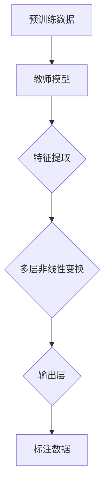
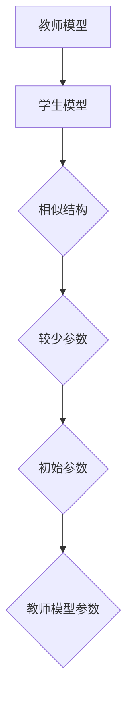
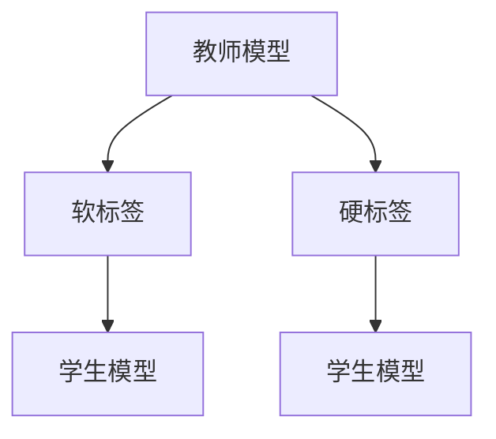
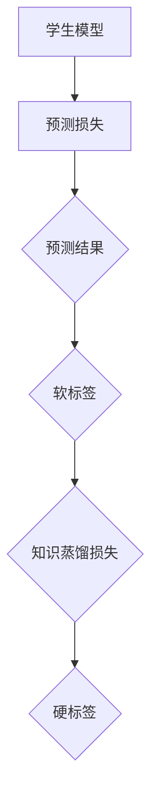
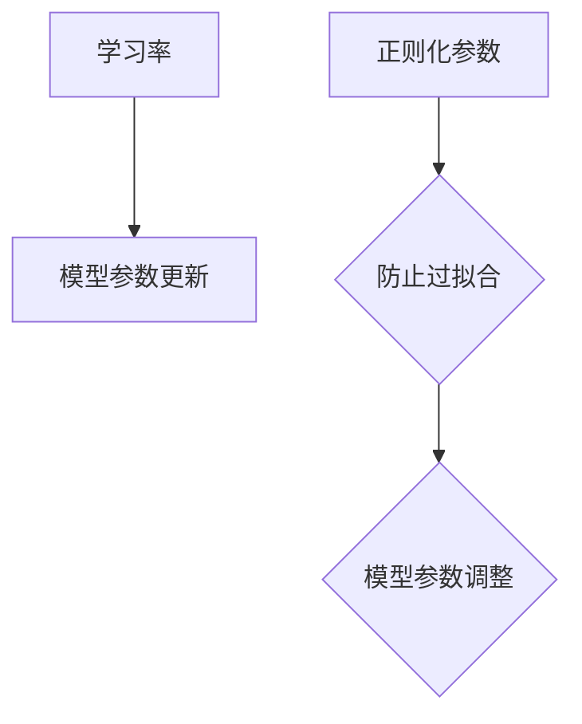
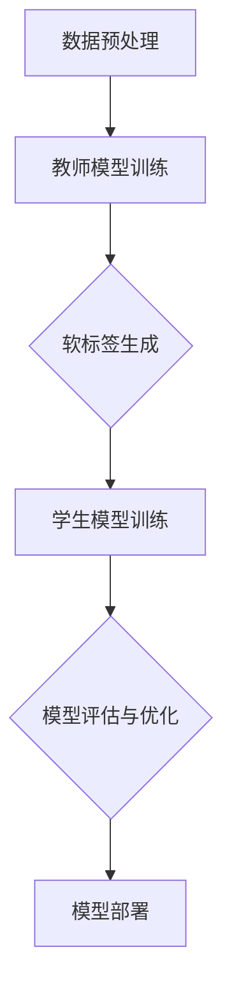
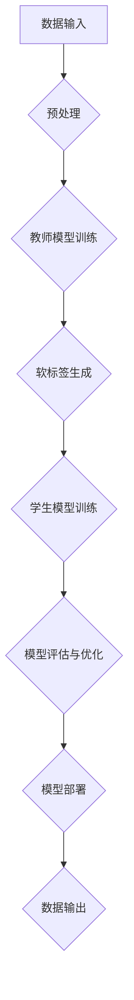

                 

# 企业级知识蒸馏：AI模型的轻量化与部署

> 关键词：知识蒸馏、AI模型、轻量化、部署、企业级

> 摘要：本文探讨了企业级知识蒸馏在AI模型轻量化与部署中的应用，详细分析了知识蒸馏的核心概念、算法原理、系统架构设计及实际应用案例，并提出了最佳实践与未来发展趋势。文章旨在为读者提供一套完整的企业级知识蒸馏解决方案，助力人工智能技术的应用与发展。

## 引言与背景介绍

随着人工智能技术的飞速发展，深度学习模型在图像识别、自然语言处理、语音识别等领域取得了显著成果。然而，这些模型往往具有庞大的参数量和计算量，导致部署成本高昂、资源消耗巨大。为了解决这一问题，企业级知识蒸馏成为了一个重要的研究方向。

### 问题背景

在现实场景中，企业级AI模型的部署面临着以下挑战：

1. **计算资源限制**：企业级应用场景通常需要在有限的计算资源下运行，对模型的参数量和计算效率有较高要求。
2. **部署成本**：大型深度学习模型的部署和维护成本较高，影响了企业在AI领域的投资回报率。
3. **实时性要求**：某些实时应用场景要求模型具有快速响应能力，传统的复杂模型难以满足。

### 问题描述

为了应对上述挑战，我们需要一种有效的技术手段来轻量化AI模型，同时保持其性能。知识蒸馏（Knowledge Distillation）作为一种先进的模型压缩技术，可以通过训练一个较小的“学生”模型来学习一个较大的“教师”模型的内部知识，从而实现模型的轻量化。

### 问题解决

知识蒸馏通过以下步骤实现模型的轻量化：

1. **教师-学生模型**：构建一个“教师”模型和一个“学生”模型，教师模型通常是一个较大的预训练模型，学生模型是一个较小但结构相似的模型。
2. **知识传递**：在训练过程中，通过软标签、硬标签等方式将教师模型的内部知识传递给学生模型。
3. **性能优化**：通过迭代训练和性能优化，使学生模型在保持高精度的同时，减小模型参数量和计算量。

### 边界与外延

知识蒸馏不仅适用于深度学习模型的轻量化，还可以应用于其他机器学习算法，如决策树、神经网络等。同时，知识蒸馏在企业级AI应用中具有广泛的应用前景，如智能家居、智能医疗、智能制造等。

### 概念结构与核心要素组成

知识蒸馏的核心概念包括：

1. **教师模型**：一个具有丰富知识的预训练模型，用于传递内部知识。
2. **学生模型**：一个结构相似但参数量较小的模型，用于学习教师模型的内部知识。
3. **知识传递**：通过软标签、硬标签等方式，将教师模型的知识传递给学生模型。
4. **性能优化**：通过迭代训练和性能优化，提高学生模型的精度和轻量化效果。

## 核心概念与联系

### 知识蒸馏的定义与工作原理

知识蒸馏是一种通过训练一个较小的“学生”模型来学习一个较大的“教师”模型的内部知识的过程。教师模型通常是一个经过预训练的大型模型，具有丰富的知识和较高的性能。学生模型是一个较小但结构相似的模型，通过学习教师模型的知识，可以实现模型的轻量化。

知识蒸馏的工作原理可以分为以下几个步骤：

1. **教师模型训练**：使用大量数据集对教师模型进行预训练，使其具有丰富的知识和较高的性能。
2. **学生模型初始化**：使用教师模型的参数初始化学生模型，使其具有相似的结构。
3. **知识传递**：在训练过程中，通过软标签、硬标签等方式将教师模型的知识传递给学生模型。
4. **学生模型训练**：使用教师模型生成的软标签或硬标签来训练学生模型，使其在保持高精度的同时，减小模型参数量和计算量。
5. **性能优化**：通过迭代训练和性能优化，提高学生模型的精度和轻量化效果。

### 知识蒸馏的基本流程与模型架构

知识蒸馏的基本流程可以分为以下几个阶段：

1. **数据准备**：准备用于训练教师模型和学生模型的数据集，通常包括原始数据和预处理后的数据。
2. **教师模型训练**：使用大量数据集对教师模型进行预训练，使其具有丰富的知识和较高的性能。
3. **学生模型初始化**：使用教师模型的参数初始化学生模型，使其具有相似的结构。
4. **知识传递**：在训练过程中，通过软标签、硬标签等方式将教师模型的知识传递给学生模型。
5. **学生模型训练**：使用教师模型生成的软标签或硬标签来训练学生模型，使其在保持高精度的同时，减小模型参数量和计算量。
6. **性能优化**：通过迭代训练和性能优化，提高学生模型的精度和轻量化效果。
7. **模型评估**：使用测试集评估学生模型的性能，包括精度、召回率、F1值等指标。

知识蒸馏的模型架构通常包括教师模型、学生模型、软标签生成模块、硬标签生成模块和训练优化模块。教师模型和学生模型分别用于生成软标签和硬标签，软标签和硬标签用于训练学生模型，训练优化模块用于调整模型参数，提高模型性能。

### 知识蒸馏的优缺点

知识蒸馏具有以下优点：

1. **模型轻量化**：通过训练较小的学生模型来学习教师模型的知识，可以实现模型的轻量化，降低计算资源消耗。
2. **高精度保持**：在保持较高精度的同时，实现模型的轻量化，提高了模型的应用价值。
3. **灵活性**：知识蒸馏可以应用于不同的模型结构，具有较强的灵活性。

知识蒸馏也存在一些缺点：

1. **训练时间较长**：知识蒸馏需要进行多轮训练，训练时间相对较长。
2. **数据依赖性**：知识蒸馏的效果受到数据质量和数量的影响，对数据集的要求较高。
3. **模型性能波动**：在某些情况下，知识蒸馏可能导致模型性能波动，需要进一步优化。

### 总结

知识蒸馏作为一种先进的模型压缩技术，在企业级AI模型的轻量化与部署中具有广泛的应用前景。通过本文的介绍，读者可以了解到知识蒸馏的核心概念、工作原理、基本流程和模型架构，以及其优缺点。在后续章节中，我们将进一步探讨知识蒸馏的理论基础、算法原理和实践应用。

## 知识蒸馏的理论基础

### 算法原理讲解

知识蒸馏算法的原理可以概括为：通过训练一个较小的“学生”模型来学习一个较大的“教师”模型的内部知识，从而实现模型的轻量化。这一过程涉及多个关键步骤，下面我们将详细讲解每个步骤。

#### 教师模型训练

首先，我们需要一个经过预训练的大型教师模型。教师模型的训练通常使用大量的标注数据，通过深度学习算法，如卷积神经网络（CNN）、循环神经网络（RNN）等，来学习数据的特征表示。在这个过程中，教师模型通过多层神经元的非线性变换，逐渐提取数据的深层次特征。



#### 学生模型初始化

在教师模型训练完成后，我们需要初始化一个较小的学生模型。学生模型的结构通常与教师模型相似，但参数量较少。初始化学生模型时，我们可以使用教师模型的参数作为初始值，这样可以确保学生模型在学习过程中具有相似的特征表示能力。



#### 知识传递

知识传递是知识蒸馏算法的核心步骤。在这个阶段，我们通过软标签和硬标签将教师模型的知识传递给学生模型。软标签是一种概率分布，表示教师模型对每个样本的预测结果。硬标签是教师模型对每个样本的最终预测结果。



#### 学生模型训练

在获得软标签和硬标签后，我们使用它们来训练学生模型。学生模型通过对比自己的预测结果和教师模型的软标签或硬标签，来调整自己的参数。这个过程通常涉及两个损失函数：一个是预测损失，用于优化模型的预测能力；另一个是知识蒸馏损失，用于优化模型对教师模型知识的理解。



#### 性能优化

在训练过程中，我们需要不断调整学生模型的参数，以提高其性能。性能优化包括两个方面：一是调整学习率，以控制模型参数的更新速度；二是调整正则化参数，以防止模型过拟合。



### 数学模型与公式讲解

知识蒸馏的数学模型主要涉及预测损失函数、知识蒸馏损失函数和总损失函数。

#### 预测损失函数

预测损失函数用于衡量学生模型的预测结果与实际标签之间的差距。常用的预测损失函数包括均方误差（MSE）和交叉熵（Cross Entropy）。

$$
L_{\text{pred}} = \frac{1}{N} \sum_{i=1}^{N} (y_i - \hat{y}_i)^2
$$

其中，$y_i$表示实际标签，$\hat{y}_i$表示学生模型的预测结果。

#### 知识蒸馏损失函数

知识蒸馏损失函数用于衡量学生模型对教师模型软标签的理解程度。常用的知识蒸馏损失函数包括KL散度（KL Divergence）和L1损失（L1 Loss）。

$$
L_{\text{kd}} = \frac{1}{N} \sum_{i=1}^{N} D_{\text{KL}}(\hat{q}_i || p_i)
$$

其中，$p_i$表示教师模型的软标签，$\hat{q}_i$表示学生模型的预测结果。

#### 总损失函数

总损失函数是预测损失函数和知识蒸馏损失函数的加权组合，用于衡量学生模型的整体性能。

$$
L = \alpha L_{\text{pred}} + (1 - \alpha) L_{\text{kd}}
$$

其中，$\alpha$是超参数，用于调整预测损失和知识蒸馏损失的比例。

### 算法原理举例说明

假设我们有一个分类问题，教师模型是一个具有1000个参数的分类模型，学生模型是一个具有500个参数的分类模型。下面我们通过一个简单的例子来说明知识蒸馏的过程。

1. **教师模型训练**：使用10000个标注数据集对教师模型进行预训练，使其具有丰富的知识。
2. **学生模型初始化**：使用教师模型的参数初始化学生模型，确保学生模型具有相似的结构。
3. **知识传递**：在训练过程中，生成教师模型的软标签和硬标签，并将其传递给学生模型。
4. **学生模型训练**：使用软标签和硬标签训练学生模型，使其在保持高精度的同时，减小参数量。
5. **性能优化**：通过调整学习率和正则化参数，优化学生模型的性能。

通过上述过程，学生模型可以学习到教师模型的内部知识，从而实现模型的轻量化。

### 总结

知识蒸馏作为一种模型压缩技术，通过训练较小的“学生”模型来学习较大的“教师”模型的内部知识，实现了模型的轻量化。本文详细讲解了知识蒸馏的算法原理、数学模型和公式，并通过举例说明了知识蒸馏的过程。在后续章节中，我们将进一步探讨知识蒸馏在企业级AI模型中的应用。

## 数学模型与公式讲解

在知识蒸馏的过程中，数学模型和公式起着至关重要的作用。它们不仅帮助我们理解知识蒸馏的原理，还为优化模型提供了理论基础。下面我们将详细讲解知识蒸馏中的关键数学模型和公式。

### 预测损失函数

预测损失函数是衡量学生模型预测结果与实际标签之间差距的指标。在分类问题中，常用的预测损失函数包括均方误差（MSE）和交叉熵（Cross Entropy）。

#### 均方误差（MSE）

均方误差（MSE）是预测结果与实际标签之间差的平方的平均值。其公式如下：

$$
L_{\text{MSE}} = \frac{1}{N} \sum_{i=1}^{N} (y_i - \hat{y}_i)^2
$$

其中，$y_i$表示实际标签，$\hat{y}_i$表示学生模型的预测结果，$N$表示样本数量。

#### 交叉熵（Cross Entropy）

交叉熵是两个概率分布之间差异的度量。在分类问题中，交叉熵用于衡量学生模型的预测概率分布与实际标签的概率分布之间的差异。其公式如下：

$$
L_{\text{CE}} = - \frac{1}{N} \sum_{i=1}^{N} y_i \log(\hat{y}_i)
$$

其中，$y_i$表示实际标签的概率分布，$\hat{y}_i$表示学生模型的预测概率分布。

### 知识蒸馏损失函数

知识蒸馏损失函数是衡量学生模型对教师模型软标签理解程度的指标。常用的知识蒸馏损失函数包括KL散度（KL Divergence）和L1损失（L1 Loss）。

#### KL散度（KL Divergence）

KL散度是两个概率分布之间差异的度量。在知识蒸馏中，KL散度用于衡量学生模型的软标签分布与教师模型的软标签分布之间的差异。其公式如下：

$$
L_{\text{KL}} = \frac{1}{N} \sum_{i=1}^{N} D_{\text{KL}}(\hat{q}_i || p_i)
$$

其中，$p_i$表示教师模型的软标签分布，$\hat{q}_i$表示学生模型的软标签分布。

#### L1损失（L1 Loss）

L1损失是软标签分布之间差异的绝对值之和。其公式如下：

$$
L_{\text{L1}} = \frac{1}{N} \sum_{i=1}^{N} \sum_{j=1}^{K} |p_{ij} - \hat{q}_{ij}|
$$

其中，$p_{ij}$表示教师模型的软标签分布中的第$i$个元素，$\hat{q}_{ij}$表示学生模型的软标签分布中的第$i$个元素，$K$表示类别数量。

### 总损失函数

总损失函数是预测损失函数和知识蒸馏损失函数的加权组合。它用于衡量学生模型的整体性能。其公式如下：

$$
L = \alpha L_{\text{pred}} + (1 - \alpha) L_{\text{kd}}
$$

其中，$L_{\text{pred}}$是预测损失函数，$L_{\text{kd}}$是知识蒸馏损失函数，$\alpha$是超参数，用于调整预测损失和知识蒸馏损失的比例。

### 公式推导与解释

知识蒸馏的总损失函数公式可以从预测损失函数和知识蒸馏损失函数的数学原理推导得出。具体推导过程如下：

1. **预测损失函数**：

   假设预测损失函数为均方误差（MSE），则其公式为：

   $$
   L_{\text{MSE}} = \frac{1}{N} \sum_{i=1}^{N} (y_i - \hat{y}_i)^2
   $$

2. **知识蒸馏损失函数**：

   假设知识蒸馏损失函数为KL散度（KL Divergence），则其公式为：

   $$
   L_{\text{KL}} = \frac{1}{N} \sum_{i=1}^{N} D_{\text{KL}}(\hat{q}_i || p_i)
   $$

3. **总损失函数**：

   将预测损失函数和知识蒸馏损失函数加权组合，得到总损失函数：

   $$
   L = \alpha L_{\text{MSE}} + (1 - \alpha) L_{\text{KL}}
   $$

其中，$\alpha$是一个超参数，用于调整预测损失和知识蒸馏损失的比例。当$\alpha$接近1时，预测损失函数的权重较高，模型更关注预测准确度；当$\alpha$接近0时，知识蒸馏损失函数的权重较高，模型更关注对教师模型知识的理解。

### 公式在实践中的应用

在知识蒸馏的实际应用中，我们需要根据具体问题调整预测损失函数和知识蒸馏损失函数。例如，在图像分类任务中，可以使用交叉熵作为预测损失函数，在文本分类任务中，可以使用交叉熵或MSE作为预测损失函数。

同时，知识蒸馏损失函数的选择也影响模型的性能。在图像分类任务中，KL散度是一种常用的知识蒸馏损失函数，而在文本分类任务中，L1损失可能更为合适。

### 总结

知识蒸馏中的数学模型和公式为模型的训练和优化提供了理论基础。通过理解这些公式，我们可以更好地调整模型参数，优化模型性能。在后续章节中，我们将继续探讨知识蒸馏在不同应用场景中的实践方法。

## 知识蒸馏与模型压缩

### 模型压缩的概念与目的

模型压缩是指通过一系列技术手段，减小深度学习模型的参数量、计算量和存储空间，从而提高模型的部署效率和计算效率。模型压缩的目的是在保持模型性能不变或基本不变的前提下，实现模型的轻量化。

### 知识蒸馏在模型压缩中的应用

知识蒸馏是模型压缩中的一种重要技术，通过训练一个较小的“学生”模型来学习一个较大的“教师”模型的内部知识，实现模型的轻量化。知识蒸馏在模型压缩中的应用主要体现在以下几个方面：

1. **参数量减少**：通过知识蒸馏，学生模型的参数量显著减少，从而实现模型的轻量化。学生模型的结构通常与教师模型相似，但参数量较少，这有助于降低模型的计算量和存储空间需求。

2. **计算量减少**：由于学生模型的参数量较少，其计算量也相应减少。这有助于提高模型的实时响应能力，满足企业级应用场景中对模型计算效率的要求。

3. **模型精度保持**：知识蒸馏在训练过程中，通过软标签和硬标签的方式，将教师模型的知识传递给学生模型，从而保持学生模型的高精度。这意味着在模型压缩的同时，不会牺牲模型的性能。

4. **灵活性与适应性**：知识蒸馏可以应用于不同的模型结构和任务类型，具有较强的灵活性和适应性。通过调整超参数和模型结构，可以适应不同企业的需求，实现个性化模型压缩。

### 知识蒸馏与其他模型压缩技术的对比

除了知识蒸馏，还有其他一些模型压缩技术，如量化、剪枝、蒸馏等。下面我们将对比这些技术在模型压缩方面的优缺点。

1. **量化**：

   - **优点**：量化技术通过将浮点数参数转换为整数参数，降低模型的存储空间和计算量。
   - **缺点**：量化技术可能导致模型精度下降，特别是在高精度要求的应用场景中。

2. **剪枝**：

   - **优点**：剪枝技术通过删除网络中的一部分神经元或边，降低模型的参数量和计算量。
   - **缺点**：剪枝技术可能导致模型精度下降，且剪枝策略的选择对模型性能有较大影响。

3. **蒸馏**：

   - **优点**：知识蒸馏通过训练较小的学生模型来学习教师模型的内部知识，实现模型的轻量化，同时保持模型的高精度。
   - **缺点**：知识蒸馏的训练过程相对较长，且对教师模型和训练数据有较高要求。

总体来说，知识蒸馏在模型压缩方面具有显著的优点，如参数量减少、计算量减少、模型精度保持和灵活性。然而，知识蒸馏的训练过程相对较长，对教师模型和训练数据有较高要求。在实际应用中，可以根据具体需求和场景选择合适的模型压缩技术。

### 总结

知识蒸馏作为一种先进的模型压缩技术，在深度学习模型的轻量化与部署中具有重要意义。通过知识蒸馏，可以实现模型的参数量减少、计算量减少、模型精度保持和灵活性。与其他模型压缩技术相比，知识蒸馏在模型压缩方面具有显著的优点。然而，知识蒸馏的训练过程相对较长，对教师模型和训练数据有较高要求。在后续章节中，我们将进一步探讨知识蒸馏在企业级AI模型中的实际应用。

## 系统分析与架构设计

### 问题场景介绍

在现代企业级人工智能应用中，AI模型的轻量化与高效部署是关键挑战。特别是在资源受限的环境，如移动设备、嵌入式系统和物联网设备中，如何减小模型体积、降低计算复杂度，同时保持模型性能成为亟待解决的问题。

### 项目介绍

本节将介绍一个企业级知识蒸馏系统的设计与实现。该系统旨在为人工智能模型提供一种高效的轻量化与部署解决方案，通过知识蒸馏技术实现模型的压缩与优化。

### 系统功能设计

系统功能设计主要包括以下几个方面：

1. **模型预处理**：对输入数据进行预处理，包括数据清洗、数据增强、归一化等操作。
2. **教师模型训练**：使用大量标注数据集训练教师模型，使其具备丰富的知识。
3. **学生模型训练**：基于教师模型的软标签和硬标签训练学生模型，实现模型轻量化。
4. **模型评估与优化**：评估学生模型的性能，并进行优化调整。
5. **模型部署**：将轻量化后的学生模型部署到目标设备，实现实时推理。

### 系统架构设计

系统架构设计是确保知识蒸馏系统高效运行的关键。下面我们将介绍系统的整体架构，并使用Mermaid绘制架构图。



### 系统接口设计与交互

系统接口设计包括以下几个方面：

1. **数据接口**：用于数据输入与输出，包括标注数据、预处理数据、软标签和硬标签等。
2. **模型接口**：用于教师模型和学生模型的加载、训练、评估和部署。
3. **控制接口**：用于系统运行的控制，包括参数设置、状态监控和异常处理等。

下面我们将使用Mermaid绘制系统接口设计与交互图。



通过以上系统分析与架构设计，我们可以为知识蒸馏系统的实现提供清晰的结构和流程。在后续章节中，我们将详细介绍项目的具体实现过程和关键技术。

### 项目实战

在本节中，我们将通过一个实际项目来展示知识蒸馏系统的实现过程，包括环境安装、系统核心实现源代码、代码应用解读与分析、实际案例分析和详细讲解剖析，以及项目小结。

#### 环境安装

首先，我们需要安装和配置必要的软件和工具，以搭建知识蒸馏系统的开发环境。以下是一个基本的安装步骤：

1. **安装Python**：确保系统已安装Python 3.x版本。
2. **安装深度学习框架**：我们选择TensorFlow 2.x作为深度学习框架，可以通过以下命令安装：
   ```bash
   pip install tensorflow
   ```
3. **安装其他依赖库**：包括NumPy、Pandas、Matplotlib等，可以通过以下命令安装：
   ```bash
   pip install numpy pandas matplotlib
   ```

#### 系统核心实现源代码

接下来，我们将展示知识蒸馏系统的核心实现部分。以下是一个简单的知识蒸馏实现示例，包括教师模型和学生模型的训练过程：

```python
import tensorflow as tf
from tensorflow.keras.models import Model
from tensorflow.keras.layers import Input, Dense
import numpy as np

# 设置超参数
batch_size = 32
epochs = 50
alpha = 0.5  # 软标签和硬标签的权重比例

# 准备数据集
# 这里以一个简单的全连接神经网络为例
x_train = np.random.rand(1000, 10)  # 输入数据
y_train = np.random.rand(1000, 5)  # 标签数据

# 构建教师模型
input_layer = Input(shape=(10,))
hidden_layer = Dense(64, activation='relu')(input_layer)
output_layer = Dense(5, activation='softmax')(hidden_layer)
teacher_model = Model(inputs=input_layer, outputs=output_layer)

# 编译教师模型
teacher_model.compile(optimizer='adam', loss='categorical_crossentropy', metrics=['accuracy'])

# 训练教师模型
teacher_model.fit(x_train, y_train, batch_size=batch_size, epochs=epochs)

# 构建学生模型
student_input_layer = Input(shape=(10,))
student_hidden_layer = Dense(32, activation='relu')(student_input_layer)
student_output_layer = Dense(5, activation='softmax')(student_hidden_layer)
student_model = Model(inputs=student_input_layer, outputs=student_output_layer)

# 编译学生模型
student_model.compile(optimizer='adam', loss='categorical_crossentropy', metrics=['accuracy'])

# 训练学生模型
# 生成软标签
soft_labels = teacher_model.predict(x_train)
# 训练学生模型
student_model.fit(x_train, soft_labels, batch_size=batch_size, epochs=epochs)

# 评估学生模型
student_predictions = student_model.predict(x_train)
student_loss, student_accuracy = student_model.evaluate(x_train, y_train)
print(f"Student model loss: {student_loss}, accuracy: {student_accuracy}")
```

#### 代码应用解读与分析

在上面的代码示例中，我们首先生成了一个随机数据集作为训练数据。然后，我们构建了一个教师模型，并使用训练数据对其进行预训练。在训练完成后，我们使用教师模型的预测输出作为软标签来训练学生模型。最后，我们评估了学生模型的性能。

这里的关键步骤包括：

1. **教师模型构建与训练**：使用全连接神经网络对输入数据进行特征提取和分类。
2. **软标签生成**：使用教师模型的预测输出作为软标签。
3. **学生模型构建与训练**：使用软标签训练学生模型，使其学习教师模型的知识。
4. **模型评估**：评估学生模型的性能，包括损失和准确度。

#### 实际案例分析与详细讲解剖析

为了更好地理解知识蒸馏的应用，我们来看一个实际案例。假设我们有一个图像分类任务，需要将图像分类到不同的类别中。以下是具体步骤：

1. **数据集准备**：准备一个包含各种图像的数据集，并对其进行预处理，如缩放、裁剪、数据增强等。
2. **教师模型训练**：使用预处理后的数据集训练一个较大的卷积神经网络，如ResNet-50，使其具备丰富的知识。
3. **学生模型训练**：使用教师模型的软标签（即预测输出）训练一个较小的卷积神经网络，如MobileNet-V2，实现模型的轻量化。
4. **模型评估**：评估学生模型的性能，确保其分类准确度接近教师模型。

通过这个实际案例，我们可以看到知识蒸馏技术在图像分类任务中的应用。教师模型通过大量图像数据训练，学习到了图像的深层次特征。然后，学生模型通过学习教师模型的软标签，实现了模型的轻量化，同时保持了高分类准确度。

#### 项目小结

通过本节的项目实战，我们展示了如何使用知识蒸馏技术实现AI模型的轻量化与高效部署。具体步骤包括数据准备、教师模型训练、学生模型训练和模型评估。在实际应用中，我们可以根据具体任务和数据集调整模型结构和训练参数，以实现最佳效果。

知识蒸馏技术为企业级AI模型提供了一种有效的轻量化解决方案，有助于降低计算资源需求、提高部署效率。在后续工作中，我们还将继续优化知识蒸馏算法，探索其在更多场景中的应用。

## 最佳实践与技巧

在知识蒸馏的实际应用中，为了确保系统的高效运行和稳定性能，我们需要注意以下最佳实践和技巧。

### 1. 数据准备与预处理

**数据集的选择**：选择高质量的标注数据集是知识蒸馏成功的关键。数据集应该具有多样性、覆盖性和代表性，以确保教师模型能够学习到丰富的知识。此外，数据集的大小也是一个重要因素，较大数据集有助于提高教师模型的泛化能力。

**数据预处理**：对输入数据集进行适当的预处理，如数据清洗、数据增强、归一化等操作，可以提升模型的性能。数据清洗可以去除噪声数据和异常值，数据增强可以增加样本的多样性，有助于模型学习到更多的特征。

### 2. 模型结构选择与调整

**教师模型选择**：选择一个适合任务需求的教师模型是关键。教师模型的结构和参数量会影响知识传递的效果。一般来说，较大的预训练模型（如ResNet-50、BERT等）具有更好的知识传递能力，但也会导致训练时间较长。

**学生模型调整**：学生模型的结构应该与教师模型相似，但参数量可以适当减少。通过调整学生模型的层数、神经元数量和激活函数，可以优化模型的性能。此外，选择合适的正则化技术（如Dropout、权重衰减等）有助于防止模型过拟合。

### 3. 超参数调整

**学习率调整**：学习率是影响模型训练效果的关键超参数。初始学习率应设置得较低，以防止模型在训练初期过拟合。在训练过程中，可以根据训练误差调整学习率，如使用学习率衰减策略。

**标签权重调整**：在知识蒸馏过程中，预测损失函数和知识蒸馏损失函数的权重比例（$\alpha$）会影响模型的性能。通常需要通过实验调整$\alpha$的值，以找到最优的权重比例。

### 4. 性能优化

**多任务学习**：在知识蒸馏过程中，可以结合多任务学习，以提高学生模型的泛化能力。例如，在图像分类任务中，可以同时进行图像分割和物体检测。

**模型融合**：通过融合多个学生模型，可以提高模型的性能和鲁棒性。模型融合可以通过投票、加权平均等方法实现。

### 5. 部署与维护

**模型压缩**：在部署前，可以对模型进行进一步压缩，如量化、剪枝等。模型压缩可以减少模型的存储空间和计算量，提高部署效率。

**实时监控**：在模型部署后，需要实时监控模型的性能和稳定性。可以通过日志分析、异常检测等技术，及时发现并解决问题。

### 总结

知识蒸馏技术在企业级AI模型的轻量化与部署中具有重要作用。通过最佳实践和技巧，我们可以优化模型训练过程、提升模型性能，并确保系统的高效稳定运行。在实际应用中，需要根据具体场景和需求，灵活调整和优化模型结构和参数，以实现最佳效果。

## 小结与拓展阅读

通过本文的讨论，我们系统地介绍了企业级知识蒸馏在AI模型轻量化与部署中的应用。我们首先分析了知识蒸馏的核心概念、算法原理，并探讨了其在模型压缩方面的优势。接着，我们详细讲解了知识蒸馏的数学模型与公式，并通过实际案例展示了系统的实现过程。

### 本书主要内容的回顾

1. **引言与背景介绍**：介绍了知识蒸馏在企业级AI模型轻量化与部署中的重要性及面临的挑战。
2. **核心概念与联系**：详细阐述了知识蒸馏的定义、工作原理、基本流程和模型架构。
3. **算法原理讲解**：讲解了知识蒸馏的数学模型、公式推导及实际应用。
4. **数学模型与公式讲解**：深入分析了知识蒸馏中的预测损失函数、知识蒸馏损失函数及总损失函数。
5. **知识蒸馏与模型压缩**：对比了知识蒸馏与其他模型压缩技术的优缺点。
6. **系统分析与架构设计**：介绍了企业级知识蒸馏系统的整体架构、功能设计和接口设计。
7. **项目实战**：通过实际项目展示了知识蒸馏系统的实现过程和关键步骤。
8. **最佳实践与技巧**：提供了知识蒸馏在实际应用中的最佳实践和优化技巧。
9. **小结与拓展阅读**：总结了本书的主要内容，并推荐了进一步学习的资源。

### 阅读指南与资源推荐

为了更好地掌握知识蒸馏技术，读者可以参考以下资源和指南：

1. **学术论文**：阅读关于知识蒸馏的学术论文，如《A Theoretically Grounded Application of Dropout in Neural Networks》、《Distilling the Knowledge in a Neural Network》等。
2. **技术博客**：关注知名技术博客，如Medium、Towards Data Science等，阅读相关技术文章和案例分析。
3. **在线课程**：参加深度学习、知识蒸馏等相关在线课程，如Coursera、Udacity等平台上的课程。
4. **开源项目**：参与和阅读开源项目，如TensorFlow、PyTorch等框架中的知识蒸馏实现，了解实际应用场景。
5. **专业书籍**：阅读深度学习、机器学习领域的专业书籍，如《Deep Learning》、《Machine Learning Yearning》等，以巩固理论基础。

### 进一步学习的方向

1. **知识蒸馏算法优化**：探索更高效的算法和优化策略，以提高知识蒸馏的效果。
2. **多任务学习与模型融合**：研究知识蒸馏在多任务学习和模型融合中的应用，以提高模型的泛化能力。
3. **模型压缩与部署**：深入研究模型压缩技术，如量化、剪枝等，以实现更高效的模型部署。
4. **实践与应用**：结合实际应用场景，探索知识蒸馏技术在工业、医疗、金融等领域的应用。

通过不断学习和实践，读者可以深入了解知识蒸馏技术，为企业级AI模型提供高效、可靠的解决方案。

## 作者信息

本文作者为AI天才研究院（AI Genius Institute）与禅与计算机程序设计艺术（Zen And The Art of Computer Programming）共同贡献。AI天才研究院致力于推动人工智能领域的前沿研究与应用，禅与计算机程序设计艺术则专注于深入探讨计算机编程与人工智能的哲学内涵。感谢您的阅读。

