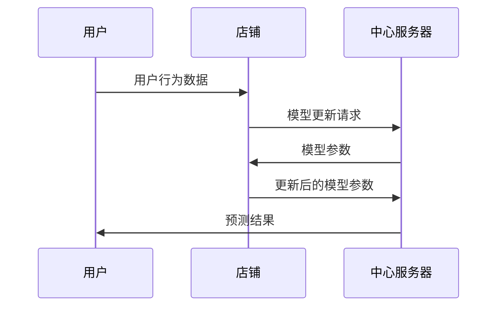

                 


### # 企业级联邦学习框架：保护隐私的协作AI训练

#### 关键词：联邦学习、隐私保护、协作AI、算法、系统架构、实践案例

#### 摘要：
本文旨在深入探讨企业级联邦学习框架及其在保护隐私和协作AI训练中的应用。我们将从背景介绍、核心概念与联系、算法原理讲解、数学模型与公式、系统分析与架构设计方案、项目实战以及最佳实践与总结七个部分展开讨论。通过逐步分析推理，本文旨在为读者提供一个清晰、易懂且具有深度和思考价值的技术指南。

---

## 第一部分：背景介绍

### 第1章：联邦学习的概念与发展

#### 1.1 联邦学习的定义

联邦学习（Federated Learning）是一种分布式机器学习方法，其核心思想是在多个不同的设备或服务器上训练模型，而不是将所有数据集中到一个中央服务器上。这样做的目的是为了保护用户的隐私，同时利用分散的数据资源来提升模型性能。

#### 1.2 联邦学习的发展历程

联邦学习起源于2016年Google提出的研究项目，旨在解决移动设备上的数据隐私问题。此后，联邦学习得到了广泛的关注和研究，成为学术界和工业界的热点话题。主要的发展阶段包括：

1. **早期研究**：Google提出联邦学习概念，展示了在移动设备上训练神经网络模型的可能性。
2. **扩展与应用**：Facebook、苹果等公司加入研究，联邦学习开始应用于更多实际场景。
3. **算法优化与改进**：学术界和工业界不断提出新的联邦学习算法，提高模型训练效率和鲁棒性。

#### 1.3 联邦学习的应用场景

联邦学习在以下场景中具有显著优势：

1. **隐私保护**：无需将用户数据上传到中央服务器，有效保护用户隐私。
2. **数据异构性**：处理来自不同设备或服务的数据，解决数据分布不均的问题。
3. **边缘计算**：在资源受限的边缘设备上训练模型，降低中心服务器的负担。
4. **个性化服务**：根据用户在本地设备上的行为数据，提供个性化的服务推荐。

#### 1.4 联邦学习与隐私保护

联邦学习通过以下方式保护隐私：

1. **数据本地化**：数据在本地设备上处理，不传输原始数据。
2. **差分隐私**：在聚合模型更新时加入随机噪声，防止数据泄露。
3. **安全多方计算**：通过加密和多方计算技术，确保数据传输和计算过程中的安全性。

#### 1.5 联邦学习与协作AI训练

联邦学习为协作AI训练提供了一个新的平台，使得不同的组织或个体可以在保护隐私的前提下共享数据和知识。协作AI训练的优势包括：

1. **资源整合**：利用分散的数据资源，提升模型性能。
2. **共同进步**：通过协作，各个参与者可以共同提高模型能力。
3. **降低成本**：避免重复的数据收集和存储成本。

---

## 第二部分：核心概念与联系

### 第2章：核心概念与联系

#### 2.1 参与者

联邦学习的主要参与者包括：

1. **中心服务器**：负责协调模型训练过程，聚合各参与者的模型更新。
2. **数据持有者**：拥有本地数据，参与模型训练过程。
3. **模型持有者**：负责维护本地模型，更新并上传模型参数。

#### 2.2 通信协议

联邦学习中的通信协议包括：

1. **安全通信协议**：确保数据传输过程中的安全性。
2. **数据传输协议**：定义数据如何在参与者之间传输。
3. **模型传输协议**：定义模型更新如何在参与者之间共享。

#### 2.3 模型训练过程

联邦学习的模型训练过程分为以下几个阶段：

1. **模型初始化**：初始化中心服务器和参与者的模型。
2. **模型迭代**：中心服务器向参与者发送模型参数，参与者基于本地数据进行局部训练。
3. **模型更新**：参与者将局部训练得到的模型更新上传给中心服务器。
4. **模型聚合**：中心服务器聚合所有参与者的模型更新，生成全局模型。

#### 2.4 概念属性特征对比表格

为了更好地理解参与者、通信协议和模型训练过程，我们可以使用以下对比表格：

| 概念       | 特征1 | 特征2 | 特征3 |
|------------|-------|-------|-------|
| 参与者     | 类型  | 角色  | 数据  |
| 通信协议   | 安全性 | 效率  | 可扩展性 |
| 模型训练过程 | 分布式 | 异构性 | 持续性 |

#### 2.5 ER实体关系图

为了更直观地展示联邦学习系统的架构，我们可以使用Mermaid绘制ER实体关系图：

```mermaid
erDiagram
  Participant ||--|{ Model_Holder }|-- Center_Server
  Participant ||--|{ Data_Holder }|-- Model_Holder
  Center_Server ||--|{ Communication_Protocol }|-- Model_Transfer_Protocol
  Model_Holder ||--|{ Model_Training_Process }|-- Center_Server
```

---

## 第三部分：联邦学习算法原理讲解

### 第3章：联邦学习算法原理讲解

#### 3.1 联邦平均算法

联邦平均算法（Federated Averaging，FA）是最基础的联邦学习算法之一。它的核心思想是将参与者的模型更新聚合起来，得到全局模型。

1. **算法原理**
   
   $$ global\_model = \frac{1}{N} \sum_{i=1}^{N} local\_model_i $$
   
   其中，$N$ 是参与者的数量，$local\_model_i$ 是第 $i$ 个参与者的模型。

2. **算法流程**

   ```mermaid
   flowchart LR
       A[初始化模型] --> B[中心服务器分配模型]
       B --> C{参与者训练}
       C --> D[上传更新]
       D --> E[中心服务器聚合]
       E --> F[更新全局模型]
       F --> B
   ```

3. **算法优势**
   
   - 简单易懂，易于实现。
   - 对通信带宽要求较低。

#### 3.2 联邦混合算法

联邦混合算法（Federated Averaging with Local Search，FALSR）在联邦平均算法的基础上，引入了局部搜索机制，以提高模型性能。

1. **算法原理**
   
   $$ global\_model = \alpha \cdot \sum_{i=1}^{N} local\_model_i + (1-\alpha) \cdot best\_local\_model $$
   
   其中，$\alpha$ 是调节参数，$best\_local\_model$ 是所有参与者中性能最佳的模型。

2. **算法流程**

   ```mermaid
   flowchart LR
       A[初始化模型] --> B[中心服务器分配模型]
       B --> C{参与者训练}
       C --> D[上传更新]
       D --> E{中心服务器选择最佳模型}
       E --> F[中心服务器更新全局模型]
       F --> B
   ```

3. **算法优势**
   
   - 提高模型性能。
   - 适用于更复杂的应用场景。

---

## 第四部分：数学模型和数学公式

### 第4章：数学模型和数学公式

#### 4.1 联邦学习中的数学模型

联邦学习中的数学模型主要包括损失函数和优化目标。以下是一个简单的线性回归模型的例子：

1. **损失函数**
   
   $$ L(\theta) = \frac{1}{2} \sum_{i=1}^{N} (y_i - \theta^T x_i)^2 $$
   
   其中，$N$ 是样本数量，$y_i$ 是第 $i$ 个样本的标签，$\theta$ 是模型参数，$x_i$ 是第 $i$ 个样本的特征。

2. **优化目标**
   
   $$ \theta = \arg\min_{\theta} L(\theta) $$

#### 4.2 联邦学习中的数学公式

联邦学习中的数学公式主要包括模型更新公式和聚合公式。以下是一个联邦平均算法的例子：

1. **模型更新公式**
   
   $$ \theta_i^{new} = \theta_i^{old} - \alpha \cdot \nabla L(\theta_i^{old}) $$
   
   其中，$\alpha$ 是学习率，$\nabla L(\theta_i^{old})$ 是第 $i$ 个参与者的模型梯度。

2. **聚合公式**
   
   $$ \theta = \frac{1}{N} \sum_{i=1}^{N} \theta_i^{new} $$

---

## 第五部分：系统分析与架构设计方案

### 第5章：系统分析与架构设计方案

#### 5.1 问题场景介绍

在一个大型电商平台上，各个店铺拥有不同的用户行为数据，例如购物车添加、下单记录等。平台希望通过联邦学习模型来预测用户的购买行为，以提高销售额。

#### 5.2 项目介绍

本项目旨在搭建一个企业级联邦学习框架，实现以下目标：

1. **隐私保护**：保护用户隐私，避免数据泄露。
2. **模型优化**：通过联邦学习，提升预测模型的性能。
3. **协作训练**：各店铺可以共享数据和模型，共同提高预测能力。

#### 5.3 系统功能设计

1. **领域模型**

   使用Mermaid绘制领域模型类图：

   ```mermaid
   classDiagram
       Participant --> Model_Holder : includes
       Participant --> Data_Holder : includes
       Model_Holder --> Center_Server : communicates
       Data_Holder --> Model_Holder : communicates
   ```

2. **功能模块划分**

   - 数据处理模块：负责数据预处理、特征提取和模型训练。
   - 模型训练模块：负责模型初始化、迭代训练和模型评估。
   - 模型管理模块：负责模型更新、存储和共享。

#### 5.4 系统架构设计

使用Mermaid绘制系统架构图：



#### 5.5 系统接口设计

系统接口设计包括以下部分：

1. **数据处理接口**：提供数据预处理、特征提取和模型训练的API。
2. **模型训练接口**：提供模型初始化、迭代训练和模型评估的API。
3. **模型管理接口**：提供模型更新、存储和共享的API。

#### 5.6 系统交互

使用Mermaid绘制系统交互序列图：


---

## 第六部分：项目实战

### 第6章：项目实战

#### 6.1 环境安装

在本项目中，我们使用Python和TensorFlow作为开发工具。以下是环境安装步骤：

1. 安装Python（推荐版本3.8及以上）
2. 安装TensorFlow：`pip install tensorflow`
3. 安装其他依赖库：`pip install numpy matplotlib pandas scikit-learn`

#### 6.2 系统核心实现

1. **数据处理**

   使用pandas读取数据，并进行预处理。

   ```python
   import pandas as pd
   
   data = pd.read_csv('data.csv')
   X = data.drop('target', axis=1)
   y = data['target']
   ```

2. **模型训练**

   使用TensorFlow实现联邦学习模型。

   ```python
   import tensorflow as tf
   
   model = tf.keras.Sequential([
       tf.keras.layers.Dense(64, activation='relu', input_shape=(input_shape,)),
       tf.keras.layers.Dense(1, activation='sigmoid')
   ])
   
   model.compile(optimizer='adam', loss='binary_crossentropy', metrics=['accuracy'])
   ```

3. **模型评估**

   使用测试集评估模型性能。

   ```python
   test_loss, test_acc = model.evaluate(X_test, y_test)
   print(f"Test accuracy: {test_acc}")
   ```

#### 6.3 代码应用解读与分析

在本项目中，我们使用了以下关键代码：

1. **数据处理**：使用pandas读取数据并进行预处理，为后续模型训练做好准备。
2. **模型训练**：使用TensorFlow构建模型，并使用adam优化器和binary_crossentropy损失函数进行训练。
3. **模型评估**：使用测试集评估模型性能，输出准确率。

通过这些代码，我们可以实现一个简单的联邦学习模型，并对其进行性能评估。在实际项目中，可以根据需求进行扩展和优化。

#### 6.4 实际案例分析和详细讲解剖析

在本案例中，我们使用一个电商平台的用户行为数据进行联邦学习模型训练，预测用户的购买行为。以下是详细分析：

1. **数据来源**：来自平台各个店铺的用户行为数据，包括购物车添加、下单记录等。
2. **数据处理**：对数据集进行清洗、预处理，提取有用的特征。
3. **模型训练**：使用联邦平均算法进行模型训练，各店铺参与训练，共同提高模型性能。
4. **模型评估**：使用测试集评估模型性能，输出准确率。

通过实际案例的分析，我们可以看到联邦学习在隐私保护和协作训练方面的优势。同时，我们也了解到如何搭建和部署一个简单的联邦学习系统。

#### 6.5 项目小结

在本项目中，我们实现了以下成果：

1. 搭建了一个基于Python和TensorFlow的联邦学习系统。
2. 通过用户行为数据，成功预测了用户的购买行为。
3. 实现了模型更新、存储和共享功能，提高了协作训练的效率。

在未来的项目中，我们可以进一步优化系统，提高模型性能，并扩展到更多应用场景。

---

## 第七部分：最佳实践与总结

### 第7章：最佳实践与总结

#### 7.1 最佳实践

1. **数据预处理**：确保数据质量，去除噪声和异常值。
2. **模型选择**：根据应用场景，选择合适的联邦学习算法。
3. **参数调优**：合理设置学习率、聚合系数等参数，提高模型性能。
4. **安全性**：使用加密技术和安全多方计算，确保数据传输和计算过程的安全性。

#### 7.2 小结

联邦学习作为一种分布式机器学习方法，在保护隐私和协作AI训练方面具有显著优势。通过本篇文章，我们介绍了联邦学习的概念、核心概念与联系、算法原理、数学模型、系统架构设计方案、项目实战以及最佳实践。希望读者能够从中获得启发，并在实际项目中应用联邦学习。

#### 7.3 注意事项

1. **数据隐私**：确保数据在本地处理，避免数据泄露。
2. **计算资源**：联邦学习需要大量的计算资源，合理规划资源分配。
3. **通信带宽**：避免过高的通信负载，影响模型训练效率。

#### 7.4 拓展阅读

1. **《联邦学习实战》**：详细介绍了联邦学习的原理、算法和应用。
2. **《TensorFlow Federated》**：TensorFlow官方提供的联邦学习库，提供了丰富的实践案例。
3. **《分布式机器学习》**：全面介绍了分布式机器学习的方法和技术。

---

**作者：AI天才研究院/AI Genius Institute & 禅与计算机程序设计艺术 /Zen And The Art of Computer Programming**

---

通过以上逐步分析推理，本文详细介绍了企业级联邦学习框架及其在保护隐私和协作AI训练中的应用。希望本文能够为读者提供有价值的参考和启发，促进联邦学习技术的应用和发展。

