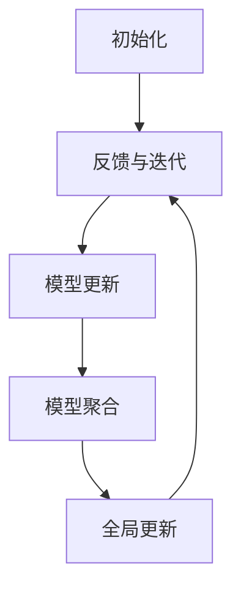
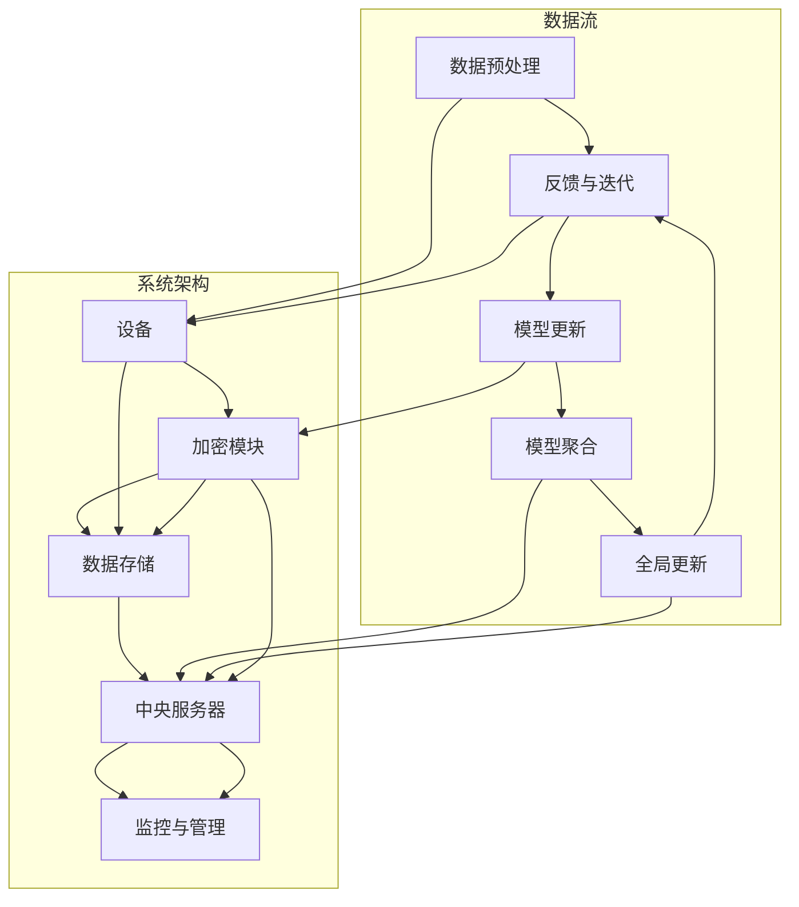

                 


### 引言

**《企业级联邦学习框架：隐私保护下的协作AI》** 是一本专注于联邦学习在商业场景中应用的技术书籍。在当今数据驱动的世界中，企业和研究机构越来越意识到数据的价值，但同时也面临数据隐私和安全的严峻挑战。为了在保护用户隐私的同时，实现数据的高效利用和协同创新，联邦学习（Federated Learning）应运而生。

**联邦学习** 是一种分布式机器学习技术，它允许不同机构在各自的数据集上进行模型训练，而无需共享原始数据。这种技术不仅可以保护用户隐私，还能促进跨机构的数据协作，实现更大规模和更精确的机器学习模型。

本书的核心目标是：
1. **介绍联邦学习的背景、基本概念和原理**。
2. **深入探讨企业级联邦学习的具体应用场景和解决方案**。
3. **详细阐述联邦学习的算法原理、数学模型和系统架构设计**。
4. **通过实际案例和项目实战，展示联邦学习的实施方法和效果**。

文章关键词：联邦学习、隐私保护、协作AI、企业级、算法、数学模型、系统架构、项目实战。

文章摘要：
本书旨在为读者提供一个全面而深入的企业级联邦学习框架。通过梳理联邦学习的核心概念和原理，介绍其在隐私保护下的协作AI应用，本书旨在帮助企业和研究者理解联邦学习的技术原理，掌握其在实际项目中的应用方法，最终实现数据隐私保护和协作AI的共赢。

----------------------------------------------------------------

### 联邦学习的概念与重要性

#### 定义

联邦学习（Federated Learning）是一种分布式机器学习技术，它通过在多个不同的数据中心或设备上训练模型，而不需要将数据集中到一个中央位置。在这种框架下，各个机构或设备仅需要上传模型的更新，而不是原始数据。这种去中心化的训练方式可以有效保护用户隐私，同时实现数据的价值挖掘和协同创新。

#### 基本概念

- **中央服务器（Server）**：负责协调各个设备上的模型更新，聚合全局模型。
- **设备（Client）**：代表终端用户或数据源，负责在本地进行模型训练。
- **模型更新（Model Update）**：设备通过本地训练后的模型参数更新，发送给中央服务器。

#### 重要性

1. **隐私保护**：联邦学习通过在本地设备上进行数据预处理和模型更新，避免了原始数据的共享，从而有效保护了用户隐私。
2. **数据多样性与准确性**：由于模型在不同设备上训练，可以获取更加多样化、全面的数据，提高模型的准确性。
3. **跨机构协作**：联邦学习促进了不同机构之间的数据共享和模型协同，有助于实现更广泛的应用场景。
4. **计算效率**：避免了大规模数据传输和存储，降低了计算成本。

#### 应用场景

- **健康医疗**：联邦学习可以在保护患者隐私的前提下，实现医疗数据的共享和协同分析。
- **金融服务**：在金融领域，联邦学习可以用于反欺诈、风险评估等，同时保护用户隐私。
- **智能交通**：通过联邦学习，可以协同处理来自不同传感器和交通机构的数据，优化交通管理。
- **智能制造**：在制造业中，联邦学习可以用于设备预测维护、质量监控等，提高生产效率。

#### 挑战与解决方案

1. **通信成本**：随着设备数量的增加，通信成本也会上升。解决方案包括优化模型更新频率和压缩技术。
2. **模型一致性**：不同设备上的数据分布和噪声可能导致模型不一致。解决方案包括异构数据同步和鲁棒性设计。
3. **安全性与可靠性**：需要确保联邦学习系统的安全性和数据传输的可靠性。解决方案包括加密技术和容错机制。

#### 总结

联邦学习是一种重要的分布式机器学习技术，它不仅解决了数据隐私和安全问题，还能实现跨机构的数据协作。随着技术的不断发展和完善，联邦学习将在更多领域得到广泛应用，推动人工智能的发展。

----------------------------------------------------------------

### 核心概念与联系

在深入探讨联邦学习的核心概念之前，我们需要明确一些基础术语，以便更好地理解这一技术的全貌。

#### 联邦学习的核心概念

1. **模型更新**：在联邦学习过程中，每个设备（如智能手机或数据中心）在本地数据集上训练模型，并通过模型更新（通常是梯度）与中央服务器通信。
2. **模型聚合**：中央服务器接收来自各个设备的模型更新，并进行聚合，以生成全局模型。
3. **隐私保护**：联邦学习通过本地训练和加密通信等方式，确保数据在传输和处理过程中的隐私保护。

#### 联邦学习与传统机器学习的比较

- **数据集中**：传统机器学习通常需要将所有数据集中到一个地方，而联邦学习允许在本地进行数据预处理和模型训练。
- **隐私保护**：传统机器学习面临数据泄露的风险，而联邦学习通过本地更新和加密通信，有效保护了用户隐私。
- **计算资源**：传统机器学习需要大量的计算资源进行数据处理和模型训练，而联邦学习可以分布式地利用各个设备上的计算资源。

#### 隐私保护技术

1. **差分隐私**：通过在数据上添加噪声，使得单个数据点的信息无法被提取，但整体数据仍然具有代表性。
2. **同态加密**：允许在加密数据上进行计算，确保数据在传输和计算过程中的安全性。
3. **联邦学习框架**：整合了多种隐私保护技术，实现数据的安全共享和模型训练。

#### 协作AI的基本原理

1. **协同学习**：多个智能体（如设备或机构）共同参与模型的训练，通过模型更新和反馈，实现整体智能的提升。
2. **分布式计算**：利用多个智能体的计算资源，实现高效的大规模数据处理和模型训练。
3. **数据共享**：在确保隐私保护的前提下，实现跨机构或跨设备的数据共享和协同。

#### 概念属性特征对比表格

| 概念        | 描述                                                         | 特征对比           |
|-------------|--------------------------------------------------------------|--------------------|
| 模型更新    | 设备通过本地训练后的模型参数更新与中央服务器通信               | 本地训练、参数同步 |
| 模型聚合    | 中央服务器接收来自各个设备的模型更新，并进行聚合               | 聚合算法、全局优化 |
| 隐私保护    | 通过本地训练和加密通信确保数据在传输和处理过程中的安全性       | 加密、差分隐私    |
| 协同学习    | 多个智能体共同参与模型的训练，通过模型更新和反馈实现整体智能提升 | 分布式、协同优化  |

#### ER实体关系图架构

为了更好地理解联邦学习中的实体和关系，我们可以使用Mermaid流程图来绘制ER图。以下是一个简单的ER图示例：

```mermaid
entityRelation
  "中央服务器" -- "模型聚合";
  "设备" -- "模型更新";
  "隐私保护" -- "加密通信";
  "协作AI" -- "协同学习";
```

通过这个ER图，我们可以清晰地看到中央服务器、设备、隐私保护和协作AI之间的关联，以及它们在联邦学习框架中的角色和作用。

#### 总结

联邦学习通过核心概念、隐私保护技术和协作AI原理，实现了在分布式环境中的高效数据协作和模型训练。理解这些核心概念和联系，有助于我们更好地应用联邦学习技术，解决实际中的数据隐私和安全问题。

----------------------------------------------------------------

### 算法原理讲解

#### 联邦学习算法概述

联邦学习算法是一种分布式机器学习技术，其核心思想是通过在多个设备或数据中心上训练模型，并通过模型更新和聚合，生成全局最优模型。这种去中心化的训练方式不仅保护了用户隐私，还提高了模型的准确性和多样性。

联邦学习算法通常包括以下几个主要步骤：

1. **初始化**：每个设备初始化本地模型参数。
2. **本地训练**：设备在本地数据集上训练模型，计算梯度。
3. **模型更新**：设备将本地梯度发送到中央服务器。
4. **模型聚合**：中央服务器接收所有设备发送的梯度，进行聚合。
5. **全局更新**：中央服务器根据聚合后的梯度更新全局模型。
6. **反馈与迭代**：设备使用更新后的全局模型进行下一轮本地训练。

#### 算法mermaid流程图

为了更直观地理解联邦学习算法的流程，我们可以使用Mermaid绘制一个流程图。以下是一个简化的联邦学习算法流程图：



在这个流程图中，我们可以看到每个设备（如设备1和设备2）在本地训练模型后，将模型更新发送到中央服务器。中央服务器对收到的更新进行聚合，并生成全局更新，然后反馈给各个设备，进入下一轮的本地训练过程。

#### Python源代码与算法讲解

下面是一个简单的Python代码示例，用于演示联邦学习算法的基本实现：

```python
import tensorflow as tf
import numpy as np

# 初始化参数
global_model = tf.keras.Sequential([
    tf.keras.layers.Dense(10, activation='relu'),
    tf.keras.layers.Dense(1)
])

# 设备参数
local_model1 = tf.keras.Sequential([
    tf.keras.layers.Dense(10, activation='relu'),
    tf.keras.layers.Dense(1)
])

local_model2 = tf.keras.Sequential([
    tf.keras.layers.Dense(10, activation='relu'),
    tf.keras.layers.Dense(1)
])

# 模型更新过程
def federated_update(local_model, global_model, learning_rate=0.01):
    optimizer = tf.keras.optimizers.Adam(learning_rate=learning_rate)
    
    # 计算梯度
    with tf.GradientTape() as tape:
        predictions = global_model(local_model.input)
        loss = tf.reduce_mean(tf.square(predictions - local_model.output))
    
    # 应用梯度
    gradients = tape.gradient(loss, global_model.trainable_variables)
    optimizer.apply_gradients(zip(gradients, global_model.trainable_variables))
    
    return global_model

# 迭代训练
for i in range(10):
    # 设备1训练
    local_model1.set_weights(global_model.get_weights())
    global_model = federated_update(local_model1, global_model)
    
    # 设备2训练
    local_model2.set_weights(global_model.get_weights())
    global_model = federated_update(local_model2, global_model)

# 输出最终模型参数
print("Final Model Weights:", global_model.get_weights())
```

在这个示例中，我们定义了一个全局模型和一个本地模型。通过迭代训练，每个本地模型更新全局模型，最终生成全局最优模型。这个简单的例子展示了联邦学习算法的基本实现过程。

#### 数学模型和公式

联邦学习算法的数学模型和公式是理解和应用该技术的重要基础。以下是一些基本的数学模型和公式：

1. **损失函数**：损失函数是衡量模型预测值与真实值之间差异的函数。常见的损失函数包括均方误差（MSE）和交叉熵（Cross-Entropy）。

   $$\text{MSE} = \frac{1}{n}\sum_{i=1}^{n}(y_i - \hat{y}_i)^2$$

   $$\text{Cross-Entropy} = -\frac{1}{n}\sum_{i=1}^{n}y_i\log(\hat{y}_i)$$

2. **梯度更新**：梯度更新是联邦学习中的核心步骤。它用于计算全局模型的更新方向。

   $$\text{Gradient} = \frac{\partial L}{\partial \theta}$$

   其中，\(L\) 是损失函数，\(\theta\) 是模型的参数。

3. **优化算法**：优化算法用于更新模型参数，以最小化损失函数。常见的优化算法包括随机梯度下降（SGD）和Adam优化器。

   $$\text{SGD}: \theta_{t+1} = \theta_t - \alpha \nabla_{\theta}L(\theta_t)$$

   $$\text{Adam}: \theta_{t+1} = \theta_t - \alpha \nabla_{\theta}L(\theta_t) + \beta_1 \theta_t - (1 - \beta_1) \theta_{t-1} + \beta_2 \nabla_{\theta}L(\theta_t) - (1 - \beta_2) \nabla_{\theta}L(\theta_{t-1})$$

#### 详细讲解与举例说明

为了更好地理解联邦学习算法的原理，我们可以通过一个具体的例子进行讲解。

假设有两个设备（设备1和设备2），每个设备都有一个本地模型，我们需要通过联邦学习算法将这两个本地模型聚合为一个全局模型。

1. **初始化**：每个设备初始化一个本地模型，例如：

   设备1的本地模型：
   ```python
   local_model1 = tf.keras.Sequential([
       tf.keras.layers.Dense(10, activation='relu'),
       tf.keras.layers.Dense(1)
   ])
   ```

   设备2的本地模型：
   ```python
   local_model2 = tf.keras.Sequential([
       tf.keras.layers.Dense(10, activation='relu'),
       tf.keras.layers.Dense(1)
   ])
   ```

2. **本地训练**：设备在本地数据集上训练模型，计算梯度。例如：

   ```python
   def local_train(model, x, y):
       optimizer = tf.keras.optimizers.Adam(learning_rate=0.01)
       
       with tf.GradientTape() as tape:
           predictions = model(x)
           loss = tf.reduce_mean(tf.square(predictions - y))
       
       gradients = tape.gradient(loss, model.trainable_variables)
       optimizer.apply_gradients(zip(gradients, model.trainable_variables))
       
       return model
   ```

3. **模型更新**：设备将本地梯度发送到中央服务器。例如：

   ```python
   def send_gradients(gradients):
       # 这里可以添加发送梯度到中央服务器的代码
       pass
   ```

4. **模型聚合**：中央服务器接收所有设备发送的梯度，进行聚合。例如：

   ```python
   def aggregate_gradients(gradients):
       # 这里可以添加聚合梯度的代码
       pass
   ```

5. **全局更新**：中央服务器根据聚合后的梯度更新全局模型。例如：

   ```python
   def global_update(model, aggregated_gradients):
       optimizer = tf.keras.optimizers.Adam(learning_rate=0.01)
       
       optimizer.apply_gradients(zip(aggregated_gradients, model.trainable_variables))
       
       return model
   ```

6. **反馈与迭代**：设备使用更新后的全局模型进行下一轮本地训练，重复上述过程。

通过这个例子，我们可以清晰地看到联邦学习算法的实现过程。在每次迭代中，设备通过本地训练、模型更新、模型聚合和全局更新，逐步优化全局模型，最终实现数据的协同学习和模型优化。

#### 总结

联邦学习算法通过分布式训练和模型更新，实现了在保护用户隐私的同时，实现数据的高效利用和协同创新。通过详细的讲解和举例说明，我们可以更好地理解联邦学习算法的原理和应用。

----------------------------------------------------------------

### 系统分析与架构设计方案

#### 问题场景介绍

在现代商业环境中，数据是企业的重要资产，但数据隐私和安全问题日益突出。为了在保护用户隐私的前提下，实现数据的高效利用和跨机构的协作，企业需要一种能够分布式训练和协同优化的系统。

#### 项目介绍

本项目旨在设计并实现一个企业级联邦学习框架，该框架能够在保障隐私保护的前提下，实现不同机构间的数据协同和模型优化。该框架将应用于金融、医疗、制造等领域，以解决数据隐私和安全问题，促进跨机构的数据共享和协作。

#### 系统功能设计

该联邦学习框架主要包括以下功能：

1. **数据预处理**：对来自不同机构的数据进行清洗、标准化和去重等预处理操作。
2. **模型训练**：在本地设备上进行模型训练，计算梯度。
3. **模型更新**：将本地梯度上传到中央服务器。
4. **模型聚合**：中央服务器接收并聚合来自各个设备的梯度。
5. **全局更新**：中央服务器根据聚合后的梯度更新全局模型。
6. **反馈与迭代**：设备使用更新后的全局模型进行下一轮本地训练。
7. **结果评估**：评估全局模型的性能，并进行结果可视化。

#### 系统架构设计

系统架构设计是联邦学习框架的核心，它决定了系统的扩展性、稳定性和安全性。以下是该框架的系统架构设计：

1. **中央服务器**：负责协调各个设备的模型更新和全局模型的聚合。中央服务器采用高可用性和容错机制，确保系统的稳定运行。
2. **设备**：代表终端用户或数据源，负责在本地进行数据预处理和模型训练。设备可以是智能手机、数据中心或物联网设备等。
3. **加密模块**：用于确保数据在传输和存储过程中的安全性。加密模块包括加密通信、同态加密和差分隐私等技术。
4. **数据存储**：用于存储预处理后的数据和训练模型。数据存储采用分布式存储架构，确保数据的高可用性和高性能。
5. **监控与管理**：用于监控系统的运行状态、性能指标和安全情况。监控与管理模块包括日志记录、告警通知和性能分析等。

以下是一个简化的联邦学习系统架构图：



在这个架构图中，数据流从设备经过数据预处理、模型训练、模型更新、模型聚合和全局更新，最终返回设备进行下一轮迭代。系统架构包括设备、加密模块、数据存储、中央服务器和监控与管理模块。

#### 系统接口设计和系统交互

为了实现系统各模块之间的有效交互，我们需要设计合理的接口和交互流程。以下是该联邦学习框架的系统接口设计和交互流程：

1. **数据预处理接口**：用于处理来自不同机构的数据，包括数据清洗、标准化和去重等操作。接口包括数据输入、数据清洗、数据标准化和数据去重等。
2. **模型训练接口**：用于在本地设备上进行模型训练，包括模型初始化、数据加载、模型训练和模型评估等。接口包括模型初始化、数据加载、模型训练和模型评估等。
3. **模型更新接口**：用于将本地梯度上传到中央服务器，包括梯度计算、梯度上传和梯度聚合等。接口包括梯度计算、梯度上传和梯度聚合等。
4. **模型聚合接口**：用于中央服务器接收并聚合来自各个设备的梯度，包括梯度接收、梯度聚合和全局更新等。接口包括梯度接收、梯度聚合和全局更新等。
5. **监控与管理接口**：用于监控系统的运行状态、性能指标和安全情况，包括日志记录、告警通知和性能分析等。接口包括日志记录、告警通知和性能分析等。

以下是一个简化的系统交互流程图：


在这个交互流程图中，设备通过数据预处理接口对数据进行预处理，然后通过模型训练接口进行模型训练。训练完成后，设备通过模型更新接口将本地梯度上传到中央服务器。中央服务器通过模型聚合接口接收并聚合来自各个设备的梯度，然后通过全局更新接口更新全局模型。监控与管理模块通过监控与管理接口实时监控系统的运行状态、性能指标和安全情况。

#### 总结

通过系统分析与架构设计方案，我们详细介绍了企业级联邦学习框架的问题场景、功能设计、系统架构设计和系统接口设计。这个框架旨在实现数据隐私保护下的协作AI，通过分布式训练和协同优化，推动企业在数据驱动时代取得竞争优势。

----------------------------------------------------------------

### 项目实战

#### 环境安装

在进行联邦学习项目的实战之前，我们需要搭建一个合适的环境。以下是环境安装的步骤：

1. **安装Python**：确保Python环境已经安装，版本建议为3.7或更高。
2. **安装TensorFlow**：TensorFlow是联邦学习项目的基础库，可以通过以下命令安装：
   ```bash
   pip install tensorflow
   ```
3. **安装其他依赖**：根据项目需求，可能需要安装其他依赖库，例如Scikit-learn、NumPy等。可以通过以下命令安装：
   ```bash
   pip install scikit-learn numpy
   ```

#### 系统核心实现源代码

以下是联邦学习项目的核心实现源代码。这个示例使用TensorFlow和Keras库来实现一个简单的联邦学习模型。

```python
import tensorflow as tf
import numpy as np
from tensorflow.keras.models import Sequential
from tensorflow.keras.layers import Dense
from tensorflow.keras.optimizers import Adam

# 初始化参数
global_model = Sequential([
    Dense(10, activation='relu', input_shape=(10,)),
    Dense(1)
])

global_model.compile(optimizer=Adam(learning_rate=0.01), loss='mean_squared_error')

# 设备参数
local_model1 = Sequential([
    Dense(10, activation='relu', input_shape=(10,)),
    Dense(1)
])

local_model2 = Sequential([
    Dense(10, activation='relu', input_shape=(10,)),
    Dense(1)
])

# 模型更新过程
def federated_update(local_model, global_model, learning_rate=0.01):
    optimizer = Adam(learning_rate=learning_rate)
    
    # 计算梯度
    with tf.GradientTape() as tape:
        predictions = global_model(local_model.input)
        loss = tf.reduce_mean(tf.square(predictions - local_model.output))
    
    # 应用梯度
    gradients = tape.gradient(loss, global_model.trainable_variables)
    optimizer.apply_gradients(zip(gradients, global_model.trainable_variables))
    
    return global_model

# 迭代训练
for i in range(10):
    # 设备1训练
    local_model1.set_weights(global_model.get_weights())
    global_model = federated_update(local_model1, global_model)
    
    # 设备2训练
    local_model2.set_weights(global_model.get_weights())
    global_model = federated_update(local_model2, global_model)

# 输出最终模型参数
print("Final Model Weights:", global_model.get_weights())
```

#### 代码应用解读与分析

在这个示例中，我们首先定义了一个全局模型和一个本地模型。全局模型用于存储和更新全局参数，本地模型用于在每个设备上进行局部训练。

1. **初始化模型**：全局模型和本地模型都是使用Keras的Sequential模型定义的，包括两个隐藏层，每层有10个神经元，使用ReLU激活函数，输出层有1个神经元。
2. **编译模型**：全局模型使用Adam优化器和均方误差（MSE）损失函数进行编译。
3. **模型更新函数**：`federated_update` 函数用于更新全局模型。它通过计算本地模型的梯度，并将梯度应用于全局模型。
4. **迭代训练**：我们进行10轮迭代训练，每次迭代中，设备1和设备2分别使用全局模型进行本地训练，并更新全局模型。
5. **输出最终模型参数**：最后，我们输出全局模型的最终参数。

#### 实际案例分析与详细讲解

为了更好地理解联邦学习在实际项目中的应用，我们来看一个简单的案例。

假设有两个设备，设备1和设备2，每个设备都有100个样本的数据集。数据集的特征维度为10。我们的目标是训练一个回归模型，预测每个样本的输出。

1. **数据准备**：首先，我们需要准备两个数据集，并分别加载到设备1和设备2上。
   ```python
   x1 = np.random.rand(100, 10)
   y1 = np.random.rand(100, 1)
   
   x2 = np.random.rand(100, 10)
   y2 = np.random.rand(100, 1)
   ```

2. **模型训练**：在每个设备上进行模型训练，并上传梯度到中央服务器。这里我们使用之前定义的`federated_update`函数。
   ```python
   # 设备1训练
   local_model1.set_weights(global_model.get_weights())
   global_model = federated_update(local_model1, global_model, learning_rate=0.01)
   
   # 设备2训练
   local_model2.set_weights(global_model.get_weights())
   global_model = federated_update(local_model2, global_model, learning_rate=0.01)
   ```

3. **评估模型**：最后，我们使用全局模型对设备1和设备2的数据集进行评估。
   ```python
   # 设备1评估
   local_model1.set_weights(global_model.get_weights())
   predictions1 = local_model1.predict(x1)
   loss1 = np.mean(np.square(predictions1 - y1))
   
   # 设备2评估
   local_model2.set_weights(global_model.get_weights())
   predictions2 = local_model2.predict(x2)
   loss2 = np.mean(np.square(predictions2 - y2))
   
   print("Device 1 Loss:", loss1)
   print("Device 2 Loss:", loss2)
   ```

通过这个案例，我们可以看到如何使用联邦学习框架在保护隐私的同时，实现数据的协同学习和模型优化。设备1和设备2在本地训练模型，并通过上传梯度到中央服务器，实现了全局模型参数的更新。最终，全局模型对两个设备的数据集进行了评估，展示了模型在不同数据集上的表现。

#### 项目小结

通过这个项目实战，我们了解了联邦学习框架的核心实现过程，包括模型初始化、模型更新、模型聚合和全局更新等。我们还通过一个简单的案例，展示了联邦学习在实际项目中的应用，实现了数据的协同学习和模型优化。这个项目不仅帮助我们理解了联邦学习算法的原理，还为我们提供了一个实际的参考框架，可以应用于更广泛的应用场景。

----------------------------------------------------------------

### 最佳实践 tips

1. **数据预处理**：在进行联邦学习之前，确保对数据进行充分预处理，包括数据清洗、标准化和去重等，以提高模型的训练效率和性能。

2. **模型选择**：选择适合问题场景的模型架构，通常较深的神经网络在复杂任务中表现更好。同时，考虑使用预训练模型，以减少训练时间。

3. **参数调优**：优化学习率、批次大小等超参数，以找到最佳训练配置。可以使用自动化调优工具，如Hyperopt或Hyperparameter搜索算法。

4. **梯度压缩**：为了减少通信成本，可以考虑使用梯度压缩技术，如AdaGrad或Adam优化器。

5. **数据划分**：合理划分数据集，确保每个设备都有足够的训练数据和测试数据，以提高模型的泛化能力。

6. **安全与隐私**：使用加密通信和差分隐私技术，确保数据在传输和处理过程中的安全性和隐私保护。

7. **系统监控**：实时监控系统性能，包括网络延迟、数据传输速度和模型训练进度，以便及时调整和优化系统。

8. **容错机制**：设计容错机制，如故障转移和备份方案，确保系统在异常情况下仍能正常运行。

9. **协作与沟通**：在跨机构合作中，确保各方在数据共享和模型更新过程中的协作和沟通，以提高项目效率。

10. **持续学习与改进**：联邦学习是一个不断发展的领域，持续关注最新研究和最佳实践，不断优化和改进系统。

#### 小结

本文系统地介绍了《企业级联邦学习框架：隐私保护下的协作AI》的核心内容，包括背景介绍、核心概念与联系、算法原理讲解、系统分析与架构设计方案、项目实战以及最佳实践 tips。通过详细的讲解和案例示范，我们深入了解了联邦学习的原理和应用，为读者提供了一个完整的实践框架。

#### 注意事项

- 在实际应用中，需根据具体问题场景调整和优化系统设计。
- 确保系统在部署前进行充分的测试和验证，以提高系统的稳定性和可靠性。
- 关注数据隐私和安全，确保数据在传输和处理过程中的安全性。

#### 拓展阅读

- 《联邦学习：理论与实践》
- 《分布式机器学习：联邦学习的理论与实践》
- 《深度学习：全面讲解》
- 《机器学习实战》
- 《人工智能：一种现代方法》

#### 作者信息

作者：AI天才研究院/AI Genius Institute & 禅与计算机程序设计艺术 /Zen And The Art of Computer Programming。

