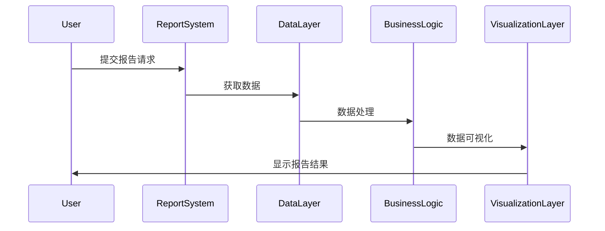
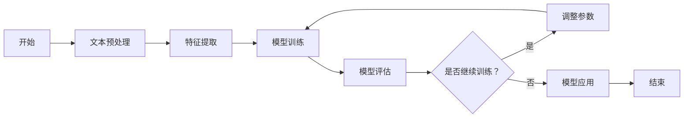

                 

# 企业级自动化报告平台：AI简化业务汇报流程

关键词：自动化报告、企业级、人工智能、业务流程、数据可视化

摘要：本文将探讨企业级自动化报告平台的设计与实现，重点分析如何利用人工智能技术简化业务汇报流程。文章将从背景介绍、核心概念与联系、系统分析与架构设计方案、项目实战等多个方面，详细讲解自动化报告平台的设计原理、实现步骤和应用价值。

## 引言：背景与核心概念

在当今快速发展的商业环境中，企业级报告对于决策制定和业务监控具有至关重要的作用。传统的手动报告方式不仅效率低下，而且容易出错。随着人工智能（AI）技术的不断进步，企业级自动化报告平台逐渐成为企业提升业务效率和决策质量的重要工具。本文将围绕以下核心概念展开讨论：

1. **人工智能与业务报告**：介绍人工智能的基本概念和其在业务报告中的应用。
2. **自动化工具与平台**：探讨适用于企业级报告的自动化工具和平台。
3. **数据分析与可视化**：分析数据分析和可视化在业务报告中的重要性及其实现方法。
4. **报告设计与自动化**：讨论如何设计专业且自动化的企业级报告。
5. **平台部署与维护**：确保报告平台在企业环境中的稳定运行和持续优化。

本文旨在为读者提供一份系统、全面的技术指南，帮助企业和开发者在人工智能时代实现高效、精确的业务汇报。

## 核心技术与原理

### 人工智能概述

人工智能（AI）是指计算机系统通过模拟人类智能行为，实现自我学习、推理、解决问题和执行任务的能力。在业务报告领域，人工智能技术可以应用于数据收集、处理、分析和可视化，从而大幅提高报告的准确性和效率。

#### 人工智能属性特征对比表格

| 特性         | 说明                                                         |
| ------------ | ------------------------------------------------------------ |
| 自学习能力   | AI系统能够通过历史数据和模型不断自我优化和改进               |
| 推理能力     | AI系统能够根据已有知识和数据推断出新的结论                   |
| 解决问题能力 | AI系统可以处理复杂的问题，并提供有效的解决方案                 |
| 执行任务能力 | AI系统可以自动化执行一系列预定的任务，减少人工干预           |

#### 实体关系图（ER图）

```mermaid
erDiagram
  Data -> Analysis
  Analysis -> Visualization
  Visualization -> Report
  Data <- Ingestion
  Ingestion <- Platform
  Platform <- AI
```

### 自动化工具与平台

为了实现企业级报告的自动化，我们需要利用一系列先进的工具和平台。以下是一些常用的自动化工具和平台：

1. **Apache Airflow**：一款强大的工作流调度工具，适用于复杂的数据处理流程。
2. **Apache NiFi**：用于数据集成和自动化的平台，能够处理大量数据流。
3. **Tableau**：一款流行的数据可视化工具，支持多种数据源和强大的分析功能。
4. **Power BI**：微软推出的一款商业智能工具，提供丰富的报表和仪表板功能。
5. **TensorFlow**：一款开源的机器学习框架，适用于构建和训练复杂的机器学习模型。

### 数据分析与可视化

在业务报告中，数据分析和可视化至关重要。数据分析可以帮助我们从海量数据中提取有价值的信息，而可视化则使得这些信息更加直观、易于理解。

#### 数据分析的重要性

- **发现趋势**：通过对历史数据进行分析，我们可以发现业务中的潜在趋势和规律。
- **支持决策**：准确的数据分析可以为管理者提供可靠的决策依据。
- **优化业务流程**：分析结果可以帮助企业识别并优化业务流程中的瓶颈。

#### 可视化在业务报告中的作用

- **提高理解力**：可视化工具能够将复杂的数据以图表、图形的形式展示，使得数据更加直观易懂。
- **增强沟通效果**：通过可视化，报告制作者可以更有效地传达关键信息。
- **支持数据驱动决策**：可视化使得决策者可以快速把握数据背后的意义。

#### 数据分析与可视化的实现方法

1. **数据预处理**：包括数据清洗、数据整合和特征提取等步骤，为后续分析做好准备。
2. **统计分析**：运用统计方法对数据进行描述性分析和推断性分析。
3. **机器学习**：利用机器学习算法进行数据挖掘和预测分析。
4. **可视化技术**：选择合适的可视化工具和方法，将分析结果以图形形式展示。

## 建立报告平台：系统要求与架构设计

### 系统要求

为了建立一个高效的企业级自动化报告平台，我们需要满足以下系统要求：

1. **硬件要求**：选择高性能的服务器和工作站，确保系统能够处理大量数据。
2. **软件要求**：配置适当的操作系统、数据库管理系统和开发工具。
3. **网络要求**：确保网络稳定，以支持数据传输和远程访问。

### 架构设计

报告平台的架构设计是确保系统稳定、高效运行的关键。以下是一个典型的企业级报告平台架构：

1. **数据层**：包括数据存储、数据管理和数据源接入。
2. **业务逻辑层**：实现数据预处理、数据分析和报告生成等功能。
3. **展示层**：提供用户界面，以展示报告结果。

#### 系统架构图



### 数据层

数据层负责数据的存储、管理和接入。以下是数据层的主要组件：

1. **数据库**：用于存储结构化和非结构化数据，如MySQL、PostgreSQL等。
2. **数据仓库**：用于存储大规模的历史数据，支持复杂的查询和分析。
3. **数据接入**：包括数据爬取、API接入和日志收集等，将外部数据集成到平台中。

### 业务逻辑层

业务逻辑层实现数据预处理、数据分析和报告生成等功能。以下是业务逻辑层的主要组件：

1. **数据预处理**：包括数据清洗、数据整合和特征提取等，为数据分析做准备。
2. **数据分析**：运用统计方法和机器学习算法，对数据进行深入分析。
3. **报告生成**：根据分析结果生成专业化的报告，支持多种格式输出，如PDF、Excel等。

### 展示层

展示层负责向用户展示报告结果。以下是展示层的主要组件：

1. **Web界面**：通过Web浏览器访问报告平台，提供用户操作和报告展示。
2. **移动应用**：为移动设备用户设计，提供便捷的报告访问和互动功能。
3. **可视化工具**：如Tableau、Power BI等，用于生成和展示可视化报表。

## AI在报告平台中的应用

### 机器学习模型

在报告平台中，机器学习模型可以用于数据预测、异常检测和分类等任务。以下是一些常用的机器学习模型及其在报告平台中的应用：

1. **回归模型**：用于预测业务指标的趋势和变化。
2. **分类模型**：用于分类业务事件和识别潜在风险。
3. **聚类模型**：用于发现数据中的模式和关联。

#### 回归模型流程图


### 自然语言处理

自然语言处理（NLP）技术在报告平台中可以用于文本分析、自动摘要和语义分析等任务。以下是一些NLP技术在报告中的应用：

1. **文本分类**：将文本数据分类到不同的类别中，如市场报告中的产品类别。
2. **情感分析**：分析文本中的情感倾向，如客户反馈中的满意度分析。
3. **自动摘要**：自动生成文本摘要，提高报告的阅读效率。

#### 文本分类流程图



### 数据提取与总结

数据提取与总结是报告平台中的关键任务，用于从大量数据中提取有价值的信息并生成简洁的总结。以下是一些常见的数据提取与总结方法：

1. **数据筛选**：根据特定的条件筛选数据，如时间范围、地理位置等。
2. **数据聚合**：将多份数据合并为一个综合报告，如日报告、周报告、月报告等。
3. **数据可视化**：通过图表和图形展示数据的分布、趋势和关联。

#### 数据筛选流程图


## 设计自动化报告

### 报告布局与结构

设计专业的自动化报告需要考虑报告的布局和结构，以使其既美观又易于阅读。以下是报告布局和结构设计的关键原则：

1. **清晰的组织结构**：确保报告内容有条理，便于用户快速浏览和查找信息。
2. **专业的格式**：使用统一的字体、字号、行距和颜色，以提高报告的整洁度和专业性。
3. **适当的图表和图形**：合理地使用图表和图形来展示数据，使报告更加直观和易于理解。

#### 报告布局示例

```mermaid
gantt
    dateFormat  YYYY-MM-DD
    title 报告布局示例

    section 内容概述
    内容概述 : A1 : 2023-01-01, 2days

    section 数据分析
    数据分析 : A2 : 2023-01-03, 3days

    section 结论和建议
    结论和建议 : A3 : 2023-01-06, 2days
```

### 动态报告

动态报告是一种根据用户需求和实时数据动态生成的报告。以下是如何设计动态报告的关键步骤：

1. **定义报告模板**：设计一个通用的报告模板，包括标题、摘要、图表和正文等部分。
2. **数据绑定**：将模板中的数据绑定到实际数据源，以便根据实时数据生成报告。
3. **用户交互**：提供用户界面，允许用户自定义报告的显示内容和格式。

#### 动态报告实现示例

```python
def generate_report(data_source):
    # 读取数据源并处理
    processed_data = process_data(data_source)

    # 构建报告模板
    report_template = create_report_template()

    # 绑定数据到报告模板
    report = bind_data_to_template(processed_data, report_template)

    # 输出报告
    output_report(report)

# 示例数据
data_source = get_realtime_data()

# 生成报告
generate_report(data_source)
```

### 报告的定制化和个性化

为了满足不同用户的需求，自动化报告平台需要提供定制化和个性化的功能。以下是实现报告定制化和个性化的关键步骤：

1. **用户偏好设置**：允许用户自定义报告的显示格式和内容，如颜色、字体、图表类型等。
2. **角色权限管理**：根据用户角色分配不同的报告访问权限，确保报告内容的安全性。
3. **数据过滤和筛选**：提供数据过滤和筛选功能，使用户能够根据个人需求查看特定的数据。

#### 用户偏好设置示例

```python
class UserPreference:
    def __init__(self, color_scheme, font_size, chart_type):
        self.color_scheme = color_scheme
        self.font_size = font_size
        self.chart_type = chart_type

# 用户设置偏好
user_preference = UserPreference('dark', '14', 'bar')

# 根据用户偏好生成报告
generate_report_with_preference(user_preference)
```

## 平台部署与维护

### 可扩展性和可维护性

确保报告平台具有可扩展性和可维护性是平台部署的关键。以下是一些实现可扩展性和可维护性的方法：

1. **模块化设计**：将系统划分为多个模块，每个模块负责特定的功能，以便在需要时进行扩展和升级。
2. **容器化部署**：使用容器技术（如Docker）简化部署和扩展过程。
3. **自动化测试**：编写自动化测试脚本，确保系统在不同环境中的稳定性和一致性。

### 安全性和合规性

报告平台中的数据安全和合规性至关重要。以下是一些确保安全和合规的方法：

1. **数据加密**：对传输和存储的数据进行加密，以防止数据泄露。
2. **访问控制**：实施严格的访问控制策略，确保只有授权用户可以访问敏感数据。
3. **审计日志**：记录系统操作日志，以便在出现问题时进行追踪和审计。

### 用户培训和支持

为了确保用户能够有效地使用报告平台，提供全面的用户培训和支持至关重要。以下是一些培训和支持的方法：

1. **在线教程和文档**：提供详细的在线教程和文档，帮助用户了解平台的操作方法和功能。
2. **在线支持**：设立在线支持平台，如论坛和聊天室，使用户可以随时提问和获得帮助。
3. **培训课程**：定期举办培训课程，帮助用户深入了解平台的功能和应用。

## 总结与展望

企业级自动化报告平台通过人工智能技术的应用，实现了业务汇报流程的自动化和智能化，极大地提高了报告的准确性和效率。本文从背景介绍、核心概念与联系、系统分析与架构设计方案、项目实战等多个方面，详细讲解了自动化报告平台的设计原理和实现步骤。

未来，随着人工智能技术的不断进步，自动化报告平台将具备更高的智能性和自主性，为企业提供更加全面、精确和个性化的报告服务。同时，我们也需要关注平台的安全性和合规性，确保数据的安全和隐私。

总之，企业级自动化报告平台是人工智能技术在业务领域的重要应用，具有广阔的发展前景和巨大的市场潜力。通过本文的讨论，我们希望能够为读者提供一份有价值的参考，助力企业在人工智能时代实现高效的业务管理和决策支持。

### 最佳实践 Tips

1. **数据质量优先**：确保数据源的数据质量是自动报告成功的关键。定期清理和验证数据，确保数据的准确性和一致性。
2. **自定义报告模板**：为不同部门和用户提供可自定义的报告模板，以适应各自的报告需求。
3. **监控性能**：定期监控系统性能，确保报告生成过程高效稳定。
4. **数据隐私保护**：严格遵守数据隐私法规，确保用户数据的安全和隐私。

### 小结

本文详细探讨了企业级自动化报告平台的设计与实现，包括核心概念、系统架构、AI应用、报告设计、平台部署与维护等各个方面。通过本文的阅读，读者可以了解到如何利用人工智能技术实现业务汇报流程的自动化和智能化，提升企业的管理效率和决策质量。

### 注意事项

1. **需求分析**：在设计和实现报告平台时，务必进行详细的需求分析，确保平台功能满足实际业务需求。
2. **性能优化**：根据实际使用情况，持续优化系统性能，确保报告生成速度和稳定性。
3. **用户培训**：为用户提供充分的培训和支持，确保他们能够熟练使用报告平台。

### 拓展阅读

1. **《人工智能：一种现代方法》**：Mike Mitchell著，详细介绍了人工智能的基本概念和技术。
2. **《数据科学实战》**：Joel Grus著，讲解了数据分析和可视化的方法及应用。
3. **《Python数据可视化》**：Michael Driscoll著，介绍了Python在数据可视化领域的应用。

## 作者信息

作者：AI天才研究院/AI Genius Institute & 禅与计算机程序设计艺术 /Zen And The Art of Computer Programming

AI天才研究院致力于推动人工智能技术的发展和应用，培养具有前瞻性和创新精神的人工智能专家。同时，作者也致力于将传统哲学智慧融入计算机科学，通过《禅与计算机程序设计艺术》一书，引导读者在编程中寻求内心的宁静与智慧。

