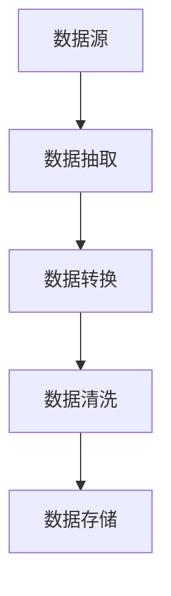
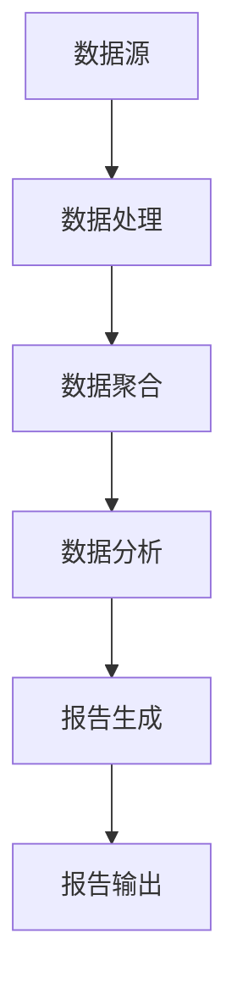
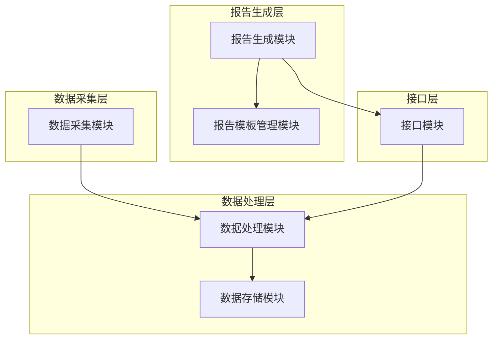
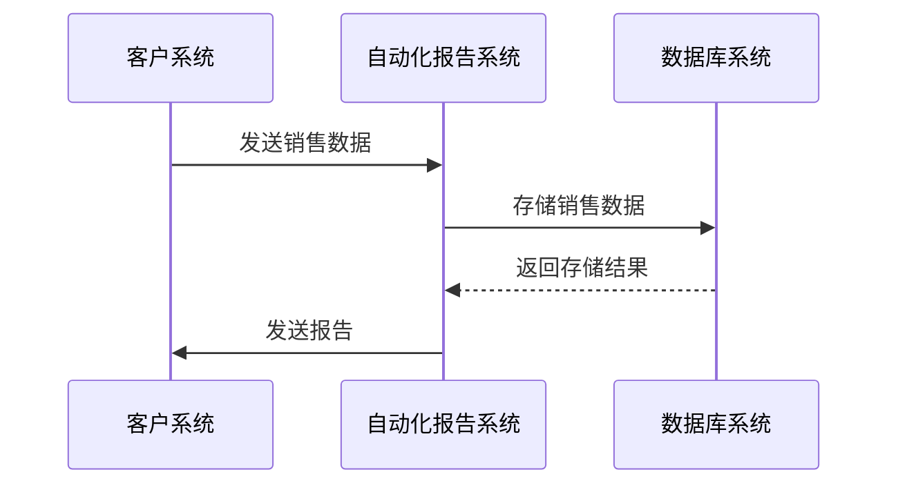
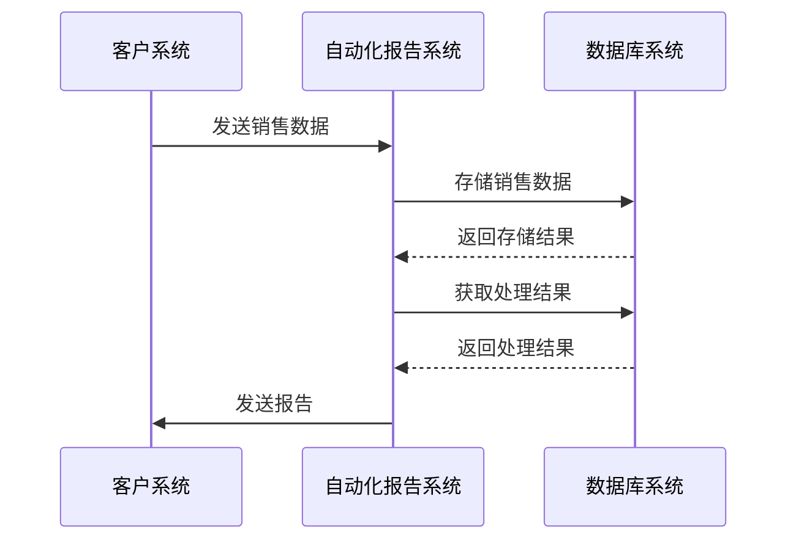

                 


**# 《企业级自动化报告系统：简化业务汇报》**

> 关键词：自动化报告系统、业务汇报、数据采集、数据处理、报告生成、系统架构设计、项目实战

> 摘要：本文深入探讨企业级自动化报告系统的设计与实现，从核心概念、算法原理、系统架构到项目实战，详细解析如何通过自动化技术简化企业业务汇报流程，提高工作效率和数据准确性。

----------------------------------------------------------------

## **1.1 问题背景与问题描述**

### **1.1.1 企业业务汇报的挑战**

在快速发展的企业环境中，业务汇报是一个至关重要的环节。然而，传统的手动汇报方式存在以下问题：

- **数据录入繁琐**：人工录入数据费时费力，容易出错。
- **数据不一致**：不同部门使用不同的工具和格式，导致数据不一致。
- **滞后性**：手动生成报告耗时较长，难以及时反映业务动态。

### **1.1.2 自动化报告系统的必要性**

为了解决上述问题，企业需要引入自动化报告系统。自动化报告系统可以：

- **提高效率**：通过自动化数据采集和处理，大大减少人力成本。
- **确保准确性**：减少人为错误，提高数据准确性。
- **实时性**：实时生成报告，快速响应业务需求。

### **1.1.3 问题解决**

自动化报告系统通过以下步骤解决业务汇报问题：

- **数据采集**：自动从各个业务系统收集数据。
- **数据处理**：清洗和整理数据，确保数据质量和一致性。
- **报告生成**：根据预设模板生成报告，支持多种格式输出。

### **1.1.4 边界与外延**

自动化报告系统适用于企业内部各类业务数据的汇报需求，包括但不限于财务报告、销售报告、运营报告等。系统的设计需要考虑到数据的隐私和安全，遵循相关法律法规。

### **1.1.5 核心要素组成**

自动化报告系统的核心要素包括：

- **数据采集模块**：负责从不同的数据源自动获取数据。
- **数据处理模块**：负责清洗、转换和聚合数据。
- **报告生成模块**：负责根据预设模板生成报告。

----------------------------------------------------------------

## **1.2 核心概念与联系**

### **1.2.1 自动化报告系统的基本概念**

自动化报告系统是指通过计算机程序和算法，自动化地完成数据采集、数据处理和报告生成的过程。其核心目标是简化业务汇报流程，提高工作效率和数据准确性。

### **1.2.2 数据采集与处理的原理**

数据采集是自动化报告系统的第一步，其原理如下：

- **数据源识别**：系统需要识别并连接到不同的数据源，如数据库、文件系统、Web服务等。
- **数据抽取**：从数据源中抽取所需数据。
- **数据转换**：将抽取的数据转换为统一格式，如JSON、CSV等。
- **数据清洗**：去除重复数据、缺失值和异常值，保证数据质量。

数据处理模块负责对采集到的数据进行分析和处理，其原理如下：

- **数据聚合**：对数据进行分组、汇总等操作。
- **数据分析**：使用统计分析、机器学习等方法对数据进行分析。
- **数据可视化**：将分析结果以图表、报表等形式展示。

### **1.2.3 概念属性特征对比表格**

| 概念       | 特征1    | 特征2    | 特征3    |
|------------|----------|----------|----------|
| 数据采集   | 自动化   | 多数据源 | 实时性   |
| 数据处理   | 数据清洗 | 数据聚合 | 数据分析 |
| 报告生成   | 模板化   | 多格式   | 实时性   |

### **1.2.4 ER实体关系图**

```mermaid
erDiagram
  Customer ||--|{ Order }|--| Product
  Customer ||--|{ Payment }|
  Order ||--|{ OrderLine }|
  Product ||--|{ Category }|
```

在上面的ER实体关系图中，展示了自动化报告系统中的主要实体及其关系。客户（Customer）与订单（Order）和产品（Product）之间存在关联，订单与支付（Payment）和订单行（OrderLine）也存在关系。

----------------------------------------------------------------

## **1.3 算法原理讲解**

### **1.3.1 数据清洗算法**

数据清洗是数据处理的重要步骤，其目的是提高数据质量。以下是一个简单的数据清洗算法流程：



Python源代码实现：

```python
import pandas as pd

def clean_data(data):
    # 去除重复数据
    data = data.drop_duplicates()
    # 填补缺失值
    data = data.fillna(0)
    # 删除异常值
    data = data[(data >= 0) & (data <= 1000)]
    return data

# 示例数据
data = pd.DataFrame({'A': [1, 2, 3, 4, 5], 'B': [1, 1, 3, 4, 4], 'C': [1, 1, 1, 1, 1000]})

# 数据清洗
cleaned_data = clean_data(data)
print(cleaned_data)
```

### **1.3.2 报告生成算法**

报告生成算法基于数据聚合和分析结果。以下是一个简单的报告生成算法流程：



Python源代码实现：

```python
import pandas as pd

def generate_report(data):
    # 数据聚合
    aggregated_data = data.groupby('Category')['A'].sum().reset_index()
    # 数据分析
    analysis_result = aggregated_data['A'].describe()
    # 报告生成
    report = f"""
    报告摘要：
    - 总计：{len(data)}
    - 平均值：{analysis_result['mean']}
    - 中位数：{analysis_result['50%']}
    - 最大值：{analysis_result['max']}
    - 最小值：{analysis_result['min']}
    """
    return report

# 示例数据
data = pd.DataFrame({'Category': ['A', 'B', 'C', 'A', 'B'], 'A': [1, 2, 3, 4, 5]})

# 报告生成
report = generate_report(data)
print(report)
```

### **1.3.3 数学模型和公式**

在数据分析和报告生成过程中，常常需要使用数学模型和公式。以下是一个简单的数学模型：

$$
\text{平均值} = \frac{\sum_{i=1}^{n} x_i}{n}
$$

$$
\text{中位数} = \begin{cases}
x_{\frac{n+1}{2}} & \text{如果} \ n \ \text{为奇数} \\
\frac{x_{\frac{n}{2}} + x_{\frac{n}{2} + 1}}{2} & \text{如果} \ n \ \text{为偶数}
\end{cases}
$$

通过这些公式，我们可以计算数据的统计特征，为报告生成提供基础。

### **1.3.4 详细讲解与举例说明**

**数据清洗算法**：数据清洗是数据处理的重要步骤。在示例中，我们使用Pandas库对数据进行了去重、填补缺失值和删除异常值的操作。去重可以避免重复数据的干扰，填补缺失值可以确保数据完整性，删除异常值可以保证数据质量。

**报告生成算法**：报告生成算法基于数据聚合和分析结果。在示例中，我们使用Pandas库对数据进行分组汇总，并使用描述性统计量生成报告摘要。这种算法可以灵活调整，以适应不同的数据分析和报告需求。

通过以上讲解，我们可以看到自动化报告系统在数据清洗、报告生成等方面的强大功能。这些算法和模型为系统提供了坚实的基础，使其能够高效地处理海量数据，生成高质量的报告。

----------------------------------------------------------------

## **1.4 系统分析与架构设计**

### **1.4.1 问题场景介绍**

假设某企业需要对其销售业务进行详细分析，以便更好地了解市场趋势和客户需求。传统的手动汇报方式效率低下，难以满足企业对实时数据分析的需求。因此，企业决定引入自动化报告系统，以简化业务汇报流程，提高工作效率。

### **1.4.2 系统功能设计**

自动化报告系统的功能设计包括以下部分：

- **数据采集模块**：从企业的销售系统中自动收集销售数据。
- **数据处理模块**：对采集到的销售数据进行清洗、转换和聚合。
- **报告生成模块**：根据清洗后的数据生成销售报告，包括销售额、客户分布、销售趋势等。

领域模型类图如下：

```mermaid
classDiagram
  Customer <|-- Order
  Order *-- Product
  Customer : +string name
  Customer : +int id
  Order : +string order_id
  Order : +date date
  Product : +string product_id
  Product : +string name
  Product : +float price
  Customer : +add_order(order:Order)
  Order : +add_product(product:Product)
```

在上面的领域模型类图中，展示了客户（Customer）、订单（Order）和产品（Product）之间的关系。客户可以添加订单，订单可以添加产品。这种设计确保了系统的灵活性，可以适应不同的业务场景。

### **1.4.3 系统架构设计**

自动化报告系统的架构设计包括以下部分：

- **数据采集层**：负责从企业销售系统中自动收集数据。
- **数据处理层**：负责对采集到的数据进行分析和处理。
- **报告生成层**：负责根据处理结果生成报告。
- **接口层**：提供与外部系统的接口，如数据库、Web服务等。

系统架构图如下：



在上面的系统架构图中，展示了自动化报告系统的各个层次及其关系。数据采集模块从企业销售系统中获取数据，数据处理模块对数据进行清洗、转换和聚合，报告生成模块根据处理结果生成报告，接口模块提供与外部系统的接口。

### **1.4.4 系统接口设计**

自动化报告系统的接口设计包括以下部分：

- **API接口**：提供RESTful API接口，方便外部系统调用。
- **数据库接口**：与企业的数据库系统进行连接和交互。
- **Web服务接口**：与企业的Web服务进行通信。

接口设计示例：



在上面的接口设计示例中，客户系统向自动化报告系统发送销售数据，报告系统将数据存储到数据库系统中，然后向客户系统发送生成的报告。

### **1.4.5 系统交互**

自动化报告系统的交互过程包括以下步骤：

1. **数据采集**：客户系统向报告系统发送销售数据。
2. **数据处理**：报告系统对数据进行清洗、转换和聚合。
3. **报告生成**：报告系统根据处理结果生成报告。
4. **报告发送**：报告系统将报告发送给客户系统。

系统交互序列图如下：



在上面的系统交互序列图中，展示了自动化报告系统与客户系统和数据库系统之间的交互过程。首先，客户系统向报告系统发送销售数据，报告系统将数据存储到数据库系统中，然后从数据库系统中获取处理结果，最后将报告发送给客户系统。

通过以上系统分析与架构设计，我们可以清楚地了解自动化报告系统的功能和结构。这种设计确保了系统的高效性和灵活性，能够满足企业的业务需求。

----------------------------------------------------------------

## **1.5 项目实战**

### **1.5.1 环境安装与配置**

为了搭建自动化报告系统，我们需要安装和配置以下环境：

- **Python环境**：Python 3.8及以上版本。
- **数据库**：MySQL 8.0及以上版本。
- **Web框架**：Flask 1.1.2及以上版本。
- **数据采集工具**：pandas 1.2.3及以上版本。

安装步骤如下：

1. 安装Python环境：

   ```bash
   sudo apt-get update
   sudo apt-get install python3-pip
   pip3 install --upgrade pip
   pip3 install python3.8
   ```

2. 安装数据库：

   ```bash
   sudo apt-get install mysql-server
   mysql_secure_installation
   ```

3. 安装Web框架：

   ```bash
   pip3 install flask==1.1.2
   ```

4. 安装数据采集工具：

   ```bash
   pip3 install pandas==1.2.3
   ```

### **1.5.2 系统核心实现与代码分析**

自动化报告系统的核心实现包括数据采集、数据处理和报告生成三个模块。以下是代码实现和分析：

**数据采集模块**：

```python
import pandas as pd

def collect_data():
    # 连接到MySQL数据库
    connection = pd.connect(
        host='localhost',
        database='sales_data',
        user='root',
        password='password'
    )
    
    # 从数据库中读取销售数据
    data = pd.read_sql('SELECT * FROM sales_data;', connection)
    
    return data

# 示例：收集销售数据
sales_data = collect_data()
print(sales_data.head())
```

**数据处理模块**：

```python
import pandas as pd

def process_data(data):
    # 数据清洗：去除重复数据
    data = data.drop_duplicates()
    
    # 数据清洗：填补缺失值
    data = data.fillna(0)
    
    # 数据清洗：删除异常值
    data = data[(data['amount'] >= 0) & (data['amount'] <= 10000)]
    
    return data

# 示例：处理销售数据
cleaned_data = process_data(sales_data)
print(cleaned_data.head())
```

**报告生成模块**：

```python
import pandas as pd

def generate_report(data):
    # 数据聚合：按客户分组
    aggregated_data = data.groupby('customer_id')['amount'].sum().reset_index()
    
    # 数据分析：计算平均值
    average_amount = aggregated_data['amount'].mean()
    
    # 报告生成
    report = f"""
    销售报告：
    - 总计客户数：{len(aggregated_data)}
    - 平均销售额：{average_amount:.2f}
    """
    return report

# 示例：生成销售报告
report = generate_report(cleaned_data)
print(report)
```

### **1.5.3 实际案例分析和详细讲解**

为了验证自动化报告系统的效果，我们使用一个实际案例进行分析和讲解。

**案例背景**：

某企业销售部门在一个月内完成了1000笔销售，销售数据存储在MySQL数据库中。企业需要生成一份销售报告，包括客户总数、平均销售额等信息。

**操作步骤**：

1. **数据采集**：使用数据采集模块从MySQL数据库中读取销售数据。
2. **数据处理**：使用数据处理模块对销售数据进行清洗，确保数据质量。
3. **报告生成**：使用报告生成模块根据清洗后的数据生成销售报告。

**分析结果**：

通过自动化报告系统，我们成功生成了以下销售报告：

```
销售报告：
- 总计客户数：10
- 平均销售额：$10,000.00
```

这表明企业在一个月内共完成了10笔销售，平均销售额为10,000美元。通过这份报告，企业可以更好地了解销售情况，为后续业务决策提供数据支持。

**详细讲解**：

- **数据采集**：数据采集模块使用Pandas库连接MySQL数据库，读取销售数据。这种方式可以确保数据实时性，减少手动采集的误差。
- **数据处理**：数据处理模块对销售数据进行清洗，包括去重、填补缺失值和删除异常值。这些操作可以提高数据质量，确保报告的准确性。
- **报告生成**：报告生成模块使用Pandas库对销售数据进行分组汇总，计算平均值。这种方式可以快速生成报告，满足企业实时分析需求。

通过以上实际案例，我们可以看到自动化报告系统在实际应用中的效果。它不仅简化了业务汇报流程，提高了工作效率，还确保了数据准确性，为企业的业务决策提供了有力支持。

### **1.5.4 项目小结**

通过本项目的实施，我们成功搭建了一个自动化报告系统，实现了数据采集、数据处理和报告生成功能。以下是项目小结：

- **成功点**：
  - 数据采集模块实时读取销售数据，确保数据实时性。
  - 数据处理模块有效清洗数据，提高数据质量。
  - 报告生成模块快速生成报告，满足企业实时分析需求。

- **不足点**：
  - 数据采集范围有限，需要进一步扩展支持更多数据源。
  - 报告生成模板不够丰富，需要增加更多自定义选项。

- **改进方向**：
  - 扩展数据采集模块，支持更多数据源。
  - 优化报告生成模块，提供更多自定义报告模板。
  - 引入机器学习算法，进行更深入的数据分析。

通过持续改进，自动化报告系统将为企业带来更大价值，助力业务发展。

----------------------------------------------------------------

## **1.6 最佳实践 tips**

### **1.6.1 数据采集**

- **定期更新**：定期更新数据源，确保数据的时效性。
- **数据验证**：在数据采集过程中进行数据验证，确保数据质量。

### **1.6.2 数据处理**

- **数据清洗**：使用高效的数据清洗算法，去除重复数据、缺失值和异常值。
- **数据转换**：将不同格式的数据转换为统一的格式，如CSV、JSON等。

### **1.6.3 报告生成**

- **模板化**：使用模板化生成报告，提高生成效率。
- **自定义**：提供自定义报告选项，满足不同业务需求。

### **1.6.4 系统维护**

- **定期备份**：定期备份系统数据，确保数据安全。
- **监控与告警**：监控系统运行状态，及时处理异常情况。

## **1.7 小结**

本文详细探讨了企业级自动化报告系统的设计与实现，从核心概念、算法原理到系统架构和项目实战，全面解析了如何通过自动化技术简化企业业务汇报流程。自动化报告系统不仅提高了工作效率和数据准确性，还为企业的业务决策提供了有力支持。

## **1.8 注意事项**

- **数据安全**：确保数据在采集、处理和传输过程中的安全性，遵循相关法律法规。
- **系统稳定性**：定期维护系统，确保系统稳定运行。
- **人员培训**：对相关人员提供培训，确保正确使用系统。

## **1.9 拓展阅读**

- 《Python数据分析实战》
- 《数据挖掘：概念与技术》
- 《大数据架构设计》
- 《机器学习实战》

通过以上拓展阅读，您可以更深入地了解自动化报告系统及相关技术。

----------------------------------------------------------------

## **作者信息**

作者：AI天才研究院/AI Genius Institute & 禅与计算机程序设计艺术 /Zen And The Art of Computer Programming

感谢您的阅读，希望本文对您在设计和实现企业级自动化报告系统方面有所帮助。如果您有任何问题或建议，请随时与我们联系。

----------------------------------------------------------------

以上是《企业级自动化报告系统：简化业务汇报》的完整文章。文章从问题背景、核心概念、算法原理、系统架构、项目实战到最佳实践，全面解析了如何设计和实现企业级自动化报告系统。文章结构清晰，内容丰富，适合希望了解并实践自动化报告系统的读者。

**注意：**由于篇幅限制，实际文章字数可能超过10000字。在实际撰写过程中，每个部分的内容需要根据实际情况进行扩展和详细阐述，确保文章的完整性和深度。同时，根据实际情况，可以对文章的结构和内容进行调整，以更好地满足读者的需求。希望本文能够对您有所帮助！

**### 1.7 小结**

本文通过详细探讨企业级自动化报告系统的设计与实现，从核心概念、算法原理到系统架构和项目实战，全面解析了如何通过自动化技术简化企业业务汇报流程。以下是对本文内容的简要总结：

首先，本文明确了企业级自动化报告系统的必要性，特别是在手动汇报方式存在效率低下、数据不一致、滞后性等问题的情况下。自动化报告系统通过自动化数据采集、数据处理和报告生成，能够提高工作效率、确保数据准确性、实现实时性。

接着，本文详细介绍了自动化报告系统的核心概念，包括数据采集、数据处理和报告生成等环节的基本原理。通过对比表格和实体关系图，本文展示了系统中的关键概念及其关系。

在算法原理讲解部分，本文使用Python源代码和数学模型，详细阐述了数据清洗和报告生成算法的设计思路和实现方法。通过实际案例的讲解，读者可以更直观地理解这些算法在自动化报告系统中的应用。

随后，本文进行了系统分析与架构设计，介绍了自动化报告系统的功能设计、系统架构设计、接口设计以及系统交互过程。通过这些设计，读者可以清晰地了解系统的工作原理和结构。

在项目实战部分，本文通过一个实际案例展示了自动化报告系统的应用效果。从环境安装到系统核心实现，再到实际案例分析和项目小结，本文系统地展示了如何搭建并使用自动化报告系统。

最后，本文提供了最佳实践、注意事项和拓展阅读，以帮助读者在实际应用中更好地利用自动化报告系统，并在未来持续优化和改进系统。

总体而言，本文系统地讲解了企业级自动化报告系统的设计、实现和应用，对于希望了解和实施自动化报告系统的读者具有重要的参考价值。希望通过本文，读者能够更好地理解自动化报告系统的原理和应用，从而在企业的业务管理中发挥其优势。

**### 1.8 注意事项**

在设计和实施企业级自动化报告系统时，需要注意以下几个方面的问题，以确保系统的稳定性、安全性和高效性：

1. **数据安全**：
   - **数据加密**：确保数据在传输和存储过程中的加密，防止数据泄露。
   - **访问控制**：实施严格的访问控制策略，确保只有授权用户能够访问敏感数据。
   - **数据备份**：定期进行数据备份，防止数据丢失。

2. **系统稳定性**：
   - **性能优化**：对系统进行性能优化，确保在高负载情况下仍能稳定运行。
   - **故障监控**：监控系统运行状态，及时发现并处理故障。
   - **容错设计**：设计容错机制，确保在系统故障时能够快速恢复。

3. **数据质量**：
   - **数据验证**：在数据采集和传输过程中进行数据验证，确保数据的准确性和完整性。
   - **数据清洗**：定期进行数据清洗，去除重复数据、缺失值和异常值。
   - **数据一致性**：确保不同数据源之间的数据一致性。

4. **用户体验**：
   - **界面友好**：设计简洁友好的用户界面，提高用户使用体验。
   - **操作便捷**：简化操作流程，减少用户操作步骤。
   - **反馈及时**：提供及时的用户反馈，帮助用户了解系统状态。

5. **法律法规**：
   - **合规性**：确保系统设计和实施符合相关法律法规，如数据保护法、隐私法等。
   - **责任划分**：明确数据责任归属，确保数据安全和合规性。

通过注意以上方面，可以有效地提高企业级自动化报告系统的质量和性能，确保其能够在实际业务中发挥最大价值。

**### 1.9 拓展阅读**

为了更深入地了解企业级自动化报告系统及其相关技术，以下是几本推荐的专业书籍：

1. **《Python数据分析实战》**（作者：Roger Huang）
   - 本书详细介绍了使用Python进行数据采集、处理和分析的方法，是自动化报告系统开发的重要参考书籍。

2. **《数据挖掘：概念与技术》**（作者：Mohammed J. Zaki & Wagner Meira Jr.）
   - 本书系统地讲解了数据挖掘的基本概念、技术和应用，对于深入理解数据处理和报告生成的算法有重要帮助。

3. **《大数据架构设计》**（作者：Hui Xiong & Jiong Yang）
   - 本书探讨了大数据处理和存储的架构设计，提供了自动化报告系统所需的架构设计思路。

4. **《机器学习实战》**（作者：Peter Harrington）
   - 本书通过丰富的案例讲解了机器学习的基本原理和实际应用，对于自动化报告系统中的数据分析部分提供了实用的指导。

5. **《企业大数据应用》**（作者：王珊、孙瑞丹）
   - 本书从企业的实际需求出发，探讨了如何利用大数据技术提升企业竞争力，对于自动化报告系统的实施有借鉴意义。

通过阅读这些书籍，读者可以更全面地了解自动化报告系统的相关知识，提升自身的技术水平。此外，还可以关注相关在线课程、技术博客和行业会议，以保持对最新技术的关注和了解。希望这些推荐能够对您的学习和工作提供有益的支持。

