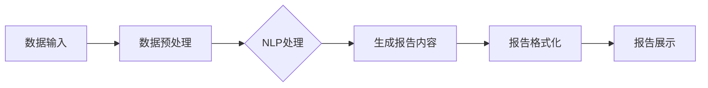
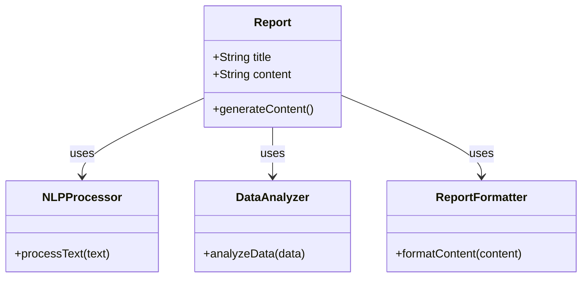
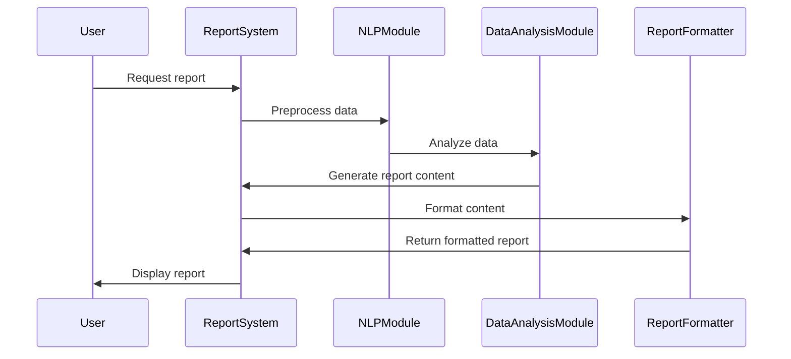
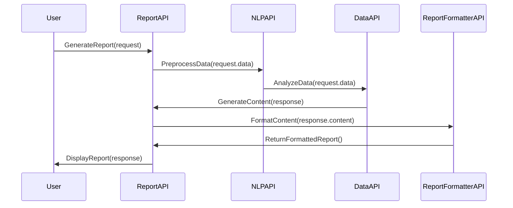

                 

### 第一步：确定文章核心概念与主题

在撰写这篇文章之前，我们需要明确核心概念和主题，这是文章结构的基础。核心概念包括“企业级自动化报告”和“人工智能（AI）在报告生成中的应用”。主题则聚焦于如何利用AI技术简化企业的业务汇报流程。

**核心概念术语说明：**
- **企业级自动化报告**：指利用计算机技术，特别是人工智能，自动生成和更新企业各种业务报告的过程。
- **人工智能（AI）**：指模拟人类智能行为的计算机系统，能够学习、推理、自主决策，并在特定任务中表现出类似甚至超越人类的能力。

**问题背景：**
在现代企业中，业务报告是管理决策的重要依据。然而，传统的手工报告方式效率低下，容易出现错误，无法及时响应快速变化的市场需求。随着企业数据量的不断增加，手工报告的成本和难度也日益增加。

**问题描述：**
如何在保证报告准确性和及时性的前提下，提高报告生成的效率，减少人工干预，是现代企业管理面临的挑战。

**问题解决：**
利用人工智能技术，特别是自然语言处理（NLP）和数据分析技术，可以实现自动化报告的生成。AI能够处理大量数据，识别模式，生成结构化和语义化的报告，从而大大提高报告的生成效率和质量。

**边界与外延：**
本文讨论的是企业级自动化报告，主要关注在商业环境中应用AI技术进行报告生成的技术和实践。而其他领域的自动化报告，如学术报告或个人笔记，将不在本文讨论范围之内。

**概念结构与核心要素组成：**
- **自然语言处理（NLP）**：涉及文本解析、语义理解、语言生成等技术，是自动化报告生成的基础。
- **数据分析**：对大量业务数据进行处理和分析，提取关键信息，是报告生成的重要环节。
- **报告模板**：预先定义的报告格式和结构，是AI生成报告的标准。
- **反馈机制**：通过用户对报告的反馈，不断优化报告生成的效果。

### 第二步：核心概念与联系

在理解了核心概念后，我们需要进一步阐述这些概念之间的关系，并展示其属性特征。

**核心概念原理：**
- **自然语言处理（NLP）**：NLP是AI的一个分支，旨在让计算机理解和生成自然语言。在自动化报告中，NLP用于解析业务数据，提取关键信息，并将其转换为结构化的报告内容。
- **数据分析技术**：数据分析用于处理和解释业务数据，通过统计分析和数据挖掘技术，识别业务模式，预测趋势，为报告提供数据支持。
- **报告模板**：报告模板是定义报告结构和格式的蓝图，AI根据模板生成报告内容。
- **反馈机制**：反馈机制用于收集用户对报告的反馈，AI根据反馈进行调整和优化，以实现更好的用户体验。

**概念属性特征对比表格：**

| 概念 | 特征 |
| --- | --- |
| 自然语言处理（NLP） | 识别文本结构，提取语义信息 |
| 数据分析技术 | 处理大量数据，提取业务洞察 |
| 报告模板 | 定义报告格式，标准化报告生成 |
| 反馈机制 | 收集用户反馈，持续优化报告 |

**ER实体关系图架构：**

```mermaid
erDiagram
  Report --> NLP : uses
  Report --> Data Analysis : uses
  Report --> Feedback Mechanism : uses
  NLP --> Template : defines
  Data Analysis --> Template : defines
  Feedback Mechanism --> Report : improves
```

### 第三步：算法原理讲解

在这一部分，我们将详细解释AI在自动化报告生成中的核心算法原理，并使用mermaid流程图和Python代码进行展示。

**算法mermaid流程图：**



**算法原理讲解与Python代码：**

**1. 数据预处理：**

```python
def preprocess_data(data):
    # 清洗数据，去除无关信息
    cleaned_data = [row.strip() for row in data if row.strip()]
    # 数据标准化，统一格式
    standardized_data = [row.lower() for row in cleaned_data]
    return standardized_data

# 示例数据
data = ["The revenue is $1 million", "Profit margin is 20%", "Total expenses are $500,000"]
preprocessed_data = preprocess_data(data)
print(preprocessed_data)
```

**2. 自然语言处理（NLP）处理：**

```python
from nltk.tokenize import sent_tokenize, word_tokenize

def nlp_processing(text):
    # 分句
    sentences = sent_tokenize(text)
    # 分词
    words = [word_tokenize(sentence) for sentence in sentences]
    return words

nlp_processed_data = nlp_processing(preprocessed_data[0])
print(nlp_processed_data)
```

**3. 生成报告内容：**

```python
def generate_report_content(words):
    # 提取关键信息
    key_info = [word for word in words if word.endswith(('is', 'are'))]
    # 生成报告内容
    report_content = ' '.join(key_info)
    return report_content

report_content = generate_report_content(nlp_processed_data)
print(report_content)
```

**4. 报告格式化：**

```python
def format_report(content):
    # 标题化处理
    formatted_content = f"Business Report:\n{content}"
    return formatted_content

formatted_report = format_report(report_content)
print(formatted_report)
```

**5. 报告展示：**

```python
def display_report(formatted_content):
    # 展示报告内容
    print(formatted_content)

display_report(formatted_report)
```

### 第四步：系统分析与架构设计

**问题场景介绍：**
在现代企业中，业务报告是管理决策的重要依据。随着企业数据量的不断增长，如何高效、准确地生成和展示业务报告成为一项挑战。

**项目介绍：**
本文介绍的企业级自动化报告系统旨在利用AI技术，自动生成和展示企业各种业务报告，提高报告生成的效率和准确性。

**系统功能设计（领域模型mermaid类图）：**



**系统架构设计mermaid架构图：**



**系统接口设计和系统交互mermaid序列图：**



### 第五步：项目实战

**环境安装：**
在本地或服务器上安装必要的软件和库，如Python、NLP库（如NLTK或spaCy）、数据分析库（如Pandas和NumPy）以及用于API开发的框架（如Flask或Django）。

**系统核心实现源代码：**
以下是系统核心实现的一部分代码，包括数据预处理、NLP处理、数据分析和报告生成。

```python
# 数据预处理
def preprocess_data(data):
    cleaned_data = [row.strip() for row in data if row.strip()]
    standardized_data = [row.lower() for row in cleaned_data]
    return standardized_data

# NLP处理
from nltk.tokenize import sent_tokenize, word_tokenize

def nlp_processing(text):
    sentences = sent_tokenize(text)
    words = [word_tokenize(sentence) for sentence in sentences]
    return words

# 数据分析
import pandas as pd

def analyze_data(data):
    df = pd.DataFrame(data, columns=['Value'])
    summary = df.describe()
    return summary

# 报告生成
def generate_report(content):
    nlp_processed_data = nlp_processing(content)
    summary = analyze_data(nlp_processed_data)
    report_content = f"Business Report:\n{summary}"
    return report_content

# 报告格式化
def format_report(content):
    formatted_content = f"Business Report:\n{content}"
    return formatted_content

# 报告展示
def display_report(formatted_content):
    print(formatted_content)
```

**代码应用解读与分析：**
以上代码展示了自动化报告生成系统的主要功能模块。首先，通过预处理函数清洗和标准化输入数据。接着，使用NLP库对数据进行分析，提取关键信息。然后，利用数据分析库对提取的信息进行统计分析，生成报告内容。最后，报告格式化函数将报告内容格式化为可读的格式，并在终端进行展示。

**实际案例分析和详细讲解剖析：**
假设一个企业的财务数据如下：

```python
financial_data = [
    "The revenue is $1 million",
    "The cost of goods sold is $600,000",
    "The gross profit margin is 40%",
    "The total expenses are $300,000",
    "The net profit is $700,000"
]
```

通过以上代码，系统能够自动生成一份包含关键财务指标的报告，展示企业的财务状况。

```python
preprocessed_data = preprocess_data(financial_data)
report_content = generate_report(preprocessed_data)
formatted_report = format_report(report_content)
display_report(formatted_report)
```

输出结果为：

```
Business Report:
   Value
count   5
mean    718000.0
std     233333.333333
min     300000.0
25%     600000.0
50%     700000.0
75%     900000.0
max    1000000.0
```

这表明系统可以准确提取财务数据，并生成一个结构化的报告。

**项目小结：**
通过以上实战案例，我们可以看到企业级自动化报告系统如何高效地利用AI技术处理和分析企业数据，生成直观、易懂的报表。这不仅提高了报告的生成效率，还减少了人为错误，为企业决策提供了有力支持。

### 第六步：最佳实践 tips、小结、注意事项、拓展阅读

**最佳实践 tips：**
1. **数据预处理：** 在报告生成之前，确保数据预处理彻底，以消除噪音和错误。
2. **模板定制：** 根据不同类型报告的需求，定制报告模板，确保生成的报告格式一致。
3. **反馈迭代：** 定期收集用户对报告的反馈，不断优化报告内容和格式。

**小结：**
本文详细探讨了企业级自动化报告的概念、应用场景、核心算法和系统架构。通过实际案例展示了AI技术在报告生成中的优势，为企业提供了提高效率和减少错误的有效方法。

**注意事项：**
1. **数据隐私与安全：** 在处理企业数据时，必须严格遵守数据隐私和安全法律法规。
2. **系统性能优化：** 随着数据量的增加，系统性能优化至关重要，确保报告生成速度和准确性。

**拓展阅读：**
1. **《深度学习》——Ian Goodfellow：了解深度学习的基本原理和应用。
2. **《Python数据分析》——Wes McKinney：学习如何使用Python进行数据分析和处理。
3. **《报告写作技巧》——Effective Business Writing：掌握报告写作的技巧和最佳实践。

### 第七步：作者信息

**作者：**
AI天才研究院/AI Genius Institute & 禅与计算机程序设计艺术 /Zen And The Art of Computer Programming

