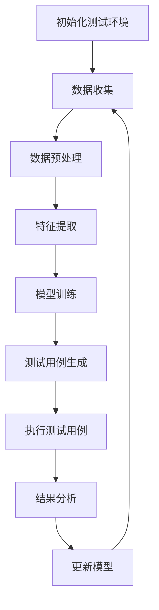

                 

### # 企业级自动化测试平台：AI提升软件质量

关键词：企业级自动化测试、AI技术、软件质量、测试平台、算法原理

摘要：本文旨在探讨如何利用AI技术构建企业级自动化测试平台，提升软件质量。首先，我们介绍了企业级自动化测试的背景和挑战，然后详细阐述了AI技术在自动化测试中的应用，包括机器学习、深度学习和自然语言处理。接着，我们分析了基于AI的自动化测试算法，详细讲解了其原理和实现步骤。最后，我们结合实际案例，展示了AI在自动化测试中的实战应用，并提出了最佳实践和未来发展方向。

# 目录大纲

## 第一部分：背景介绍

## 1. 企业级自动化测试的挑战

### 1.1 问题背景

### 1.2 问题描述

### 1.3 问题解决

### 1.4 边界与外延

### 1.5 概念结构与核心要素组成

## 第二部分：核心概念与联系

## 2. AI技术在自动化测试中的应用

### 2.1 核心概念原理

### 2.2 概念属性特征对比表格

### 2.3 ER实体关系图架构

## 第三部分：算法原理讲解

## 3. 基于AI的自动化测试算法

### 3.1 算法mermaid流程图

### 3.2 算法原理详细讲解

#### 3.2.1 数据收集

#### 3.2.2 数据预处理

#### 3.2.3 特征提取

#### 3.2.4 模型训练

#### 3.2.5 测试用例生成

#### 3.2.6 执行测试用例

#### 3.2.7 结果分析

#### 3.2.8 更新模型

### 3.3 算法数学模型和公式

### 3.4 举例说明

## 第四部分：系统分析与架构设计方案

## 4.1 问题场景介绍

## 4.2 项目介绍

## 4.3 系统功能设计

## 4.4 系统架构设计

## 4.5 系统接口设计和系统交互

## 4.6 系统核心实现源代码

## 4.7 代码应用解读与分析

## 4.8 实际案例分析和详细讲解剖析

## 4.9 项目小结

## 第五部分：最佳实践与未来展望

## 5.1 最佳实践 tips

## 5.2 小结

## 5.3 注意事项

## 5.4 拓展阅读

---

## 第一部分：背景介绍

### 1.1 问题背景

随着软件项目的规模和复杂度不断增加，手动测试已无法满足现代企业对软件质量的要求。自动化测试作为一种提高测试效率和质量的有效手段，在大型企业中应用越来越广泛。企业级自动化测试通常涉及多个项目、多个团队，其目标是在有限的时间和资源内，确保软件质量达到预期标准。

然而，现有自动化测试面临诸多挑战：

1. **测试覆盖率和效率问题**：如何确保测试覆盖全面，同时提高测试执行效率？
2. **测试稳定性和可靠性问题**：自动化测试脚本容易受到环境变化的影响，导致测试结果不稳定。
3. **测试资源管理和协作问题**：如何合理分配测试资源，确保测试过程的顺利进行？
4. **测试报告和分析能力不足**：如何生成直观、易于理解的测试报告，以便快速识别和解决问题？

### 1.2 问题描述

1. **测试覆盖率和效率问题**：随着测试用例数量的增加，手动编写和维护测试用例变得越来越困难。同时，测试用例执行的速度和覆盖范围也成为一个挑战。
2. **测试稳定性和可靠性问题**：自动化测试脚本往往对环境变化敏感，如网络延迟、操作系统版本等，导致测试结果不稳定。
3. **测试资源管理和协作问题**：测试资源（如测试环境、测试工具等）的管理和分配复杂，导致测试进度受影响。
4. **测试报告和分析能力不足**：现有测试报告往往只提供简单执行结果，缺乏对缺陷原因和趋势的分析。

### 1.3 问题解决

引入AI技术，构建企业级自动化测试平台，旨在解决上述问题：

1. **提高测试覆盖率和效率**：利用AI技术生成和优化测试用例，提高测试效率。
2. **增强测试稳定性和可靠性**：通过监控和预测环境变化，提高测试脚本的稳定性。
3. **优化测试资源管理和协作**：利用AI技术智能分配测试资源，提高测试过程的协作效率。
4. **增强测试报告和分析能力**：利用AI技术生成详细、直观的测试报告，提高问题识别和解决效率。

### 1.4 边界与外延

- **自动化测试与AI技术的融合**：探讨如何将AI技术应用于自动化测试的各个环节，提高整体测试质量。
- **企业级自动化测试平台的构建与维护**：分析企业级自动化测试平台的构建原则、关键技术和维护策略。

### 1.5 概念结构与核心要素组成

- **自动化测试**：定义、分类、流程。
- **AI技术**：机器学习、深度学习、自然语言处理。
- **企业级自动化测试平台**：架构、功能、优势。

### 1.6 总结

企业级自动化测试平台是现代软件工程中不可或缺的一部分。利用AI技术，可以显著提高自动化测试的效率、稳定性和可靠性，为企业提供高质量的软件产品。本文将深入探讨AI技术在企业级自动化测试中的应用，分享实践经验，为读者提供有价值的参考。

---

## 第二部分：核心概念与联系

### 2.1 AI技术在自动化测试中的应用

#### 2.1.1 核心概念原理

AI技术在自动化测试中的应用主要体现在以下几个方面：

1. **机器学习**：通过学习历史测试数据，自动生成和优化测试用例。
2. **深度学习**：利用强大的特征提取能力，对复杂场景进行自动化测试。
3. **自然语言处理**：处理测试用例和缺陷报告，实现自动化解析和生成。

#### 2.1.2 概念属性特征对比表格

| 技术 | 特点 | 应用场景 |
| ---- | ---- | ---- |
| 机器学习 | 基于数据学习，自动发现模式 | 测试用例生成、缺陷定位 |
| 深度学习 | 强大的特征提取能力 | 图像识别、语音识别 |
| 自然语言处理 | 处理人类语言的能力 | 测试用例解析、缺陷报告生成 |

#### 2.1.3 ER实体关系图架构

```mermaid
classDiagram
    产品 ::=<产品名>^
    测试用例 <<Entity|测试用例>>
    缺陷 <<Entity|缺陷>>
    测试环境 <<Entity|测试环境>>
    自动化测试工具 <<Entity|自动化测试工具>>

    产品 o-- 测试用例
    测试用例 o-- 缺陷
    测试用例 o-- 测试环境
    测试用例 o-- 自动化测试工具
```

### 2.2 AI技术在自动化测试中的具体应用

#### 2.2.1 机器学习在自动化测试中的应用

1. **测试用例生成**：通过分析历史测试数据，自动生成新的测试用例，提高测试覆盖率。
2. **缺陷定位**：利用机器学习算法，分析缺陷数据，定位潜在问题，提高测试效率。

#### 2.2.2 深度学习在自动化测试中的应用

1. **图像识别**：通过深度学习算法，对软件界面进行自动化检查，识别潜在缺陷。
2. **语音识别**：对软件的语音功能进行自动化测试，确保语音识别和生成准确。

#### 2.2.3 自然语言处理在自动化测试中的应用

1. **测试用例解析**：通过自然语言处理技术，将自然语言描述的测试用例转化为可执行的测试脚本。
2. **缺陷报告生成**：利用自然语言处理技术，自动生成缺陷报告，提高问题识别效率。

### 2.3 AI技术在自动化测试平台中的整合

AI技术可以应用于自动化测试平台的各个环节，实现以下目标：

1. **测试用例管理**：利用AI技术自动生成和优化测试用例，提高测试覆盖率。
2. **测试执行**：通过深度学习和图像识别等技术，提高测试执行效率和质量。
3. **缺陷管理**：利用自然语言处理技术，自动解析和生成缺陷报告，提高问题识别和解决效率。
4. **测试报告**：利用AI技术生成详细、直观的测试报告，为企业提供决策支持。

### 2.4 总结

AI技术在自动化测试中的应用，为提高软件质量和测试效率提供了新的思路和方法。通过整合AI技术，企业级自动化测试平台可以更高效、更智能地运行，为企业提供高质量的软件产品。本文将在此基础上，进一步探讨基于AI的自动化测试算法，分享实践经验。

---

## 第三部分：算法原理讲解

### 3.1 基于AI的自动化测试算法mermaid流程图



### 3.2 基于AI的自动化测试算法详细讲解

基于AI的自动化测试算法主要包括以下几个步骤：

#### 3.2.1 数据收集

数据收集是算法的基础，主要包括以下方面：

1. **自动化测试脚本**：收集现有自动化测试脚本，用于后续分析。
2. **用户反馈**：收集用户在使用软件过程中提交的反馈，包括功能需求、使用场景等。
3. **缺陷报告**：收集历史缺陷报告，用于分析缺陷原因和趋势。

#### 3.2.2 数据预处理

数据预处理是算法的核心，主要包括以下步骤：

1. **数据清洗**：去除噪声数据，如重复、异常值等。
2. **数据转换**：将非结构化数据（如文本、图像）转换为结构化数据，便于后续处理。
3. **特征工程**：选择对测试质量有显著影响的特征，提高模型的预测能力。

#### 3.2.3 特征提取

特征提取是数据预处理的关键，主要包括以下步骤：

1. **特征选择**：选择对测试质量有显著影响的特征，如输入参数、操作步骤等。
2. **特征提取**：使用机器学习算法（如决策树、支持向量机等）提取抽象特征，提高模型的泛化能力。

#### 3.2.4 模型训练

模型训练是算法的核心，主要包括以下步骤：

1. **选择模型**：根据问题特点和数据类型，选择合适的机器学习模型，如决策树、神经网络等。
2. **训练模型**：使用训练数据对模型进行训练，调整模型参数，提高模型性能。
3. **评估模型**：使用交叉验证等方法评估模型性能，如准确率、召回率等。

#### 3.2.5 测试用例生成

测试用例生成是算法的应用，主要包括以下步骤：

1. **基于模型生成**：使用训练好的模型，根据输入特征预测新的测试用例。
2. **手动与自动结合**：结合手动测试用例和自动生成的测试用例，提高测试覆盖率。

#### 3.2.6 执行测试用例

执行测试用例是算法的实现，主要包括以下步骤：

1. **测试执行**：自动化执行测试用例，记录测试结果。
2. **结果记录**：将测试结果与预期结果进行比较，记录差异，识别潜在缺陷。

#### 3.2.7 结果分析

结果分析是算法的反馈，主要包括以下步骤：

1. **结果分析**：对比实际测试结果和预期结果，分析缺陷原因和趋势。
2. **故障定位**：使用数据挖掘技术，定位故障原因，为后续改进提供依据。

#### 3.2.8 更新模型

更新模型是算法的迭代，主要包括以下步骤：

1. **模型优化**：根据新数据重新训练模型，提高模型性能。
2. **模型迭代**：持续优化模型性能，适应不断变化的测试需求。

### 3.3 算法数学模型和公式

基于AI的自动化测试算法涉及的数学模型和公式主要包括以下几个方面：

#### 3.3.1 模型训练

$$
y = f(x; \theta)
$$

其中，$y$ 是预测结果，$x$ 是输入特征，$f$ 是模型函数，$\theta$ 是模型参数。

#### 3.3.2 交叉验证

$$
\text{Error} = \frac{1}{N} \sum_{i=1}^{N} (y_i - \hat{y}_i)^2
$$

其中，$N$ 是数据集大小，$y_i$ 是真实标签，$\hat{y}_i$ 是预测标签。

### 3.4 举例说明

#### 3.4.1 测试用例生成

假设我们使用神经网络模型对历史测试用例进行分析，生成新的测试用例。具体步骤如下：

1. **数据收集**：收集历史测试用例，包括输入参数、操作步骤和测试结果。
2. **数据预处理**：对测试用例进行数据清洗、特征工程和特征提取。
3. **模型训练**：使用训练数据对神经网络模型进行训练，调整模型参数。
4. **测试用例生成**：使用训练好的模型，根据输入特征预测新的测试用例。

#### 3.4.2 缺陷定位

假设我们使用机器学习模型对缺陷报告进行分析，识别潜在缺陷。具体步骤如下：

1. **数据收集**：收集历史缺陷报告，包括缺陷描述、发生时间和测试环境等。
2. **数据预处理**：对缺陷报告进行数据清洗、特征工程和特征提取。
3. **模型训练**：使用训练数据对机器学习模型进行训练，调整模型参数。
4. **缺陷定位**：使用训练好的模型，根据缺陷描述和特征预测潜在缺陷。

### 3.5 总结

基于AI的自动化测试算法通过数据收集、数据预处理、特征提取、模型训练和测试用例生成等步骤，实现了自动化测试的智能化和高效化。通过实际案例的举例说明，我们可以看到AI技术在自动化测试中的应用潜力。在下一部分，我们将进一步探讨系统分析与架构设计方案，为企业级自动化测试平台的构建提供指导。

---

## 第四部分：系统分析与架构设计方案

### 4.1 问题场景介绍

在当前软件工程项目中，自动化测试已成为确保软件质量的关键手段。企业级自动化测试平台旨在解决以下问题：

1. **测试效率低下**：手动测试难以满足项目进度和质量要求，自动化测试可以显著提高测试效率。
2. **测试覆盖不足**：手动测试难以覆盖所有功能和场景，自动化测试可以提高测试覆盖率。
3. **测试结果不稳定**：自动化测试脚本容易受到环境变化的影响，导致测试结果不稳定。
4. **测试资源管理困难**：自动化测试涉及多个团队和项目，测试资源的管理和分配复杂。

### 4.2 项目介绍

本项目旨在构建一个企业级自动化测试平台，利用AI技术提升测试效率、覆盖率和稳定性。项目主要分为以下几个阶段：

1. **需求分析**：了解企业现有的自动化测试需求，明确平台的功能和性能要求。
2. **系统设计**：制定系统架构和设计方案，包括硬件、软件和网络等基础设施。
3. **平台开发**：根据设计方案，开发自动化测试平台的核心功能和组件。
4. **测试与优化**：对平台进行功能测试和性能优化，确保平台稳定可靠。
5. **部署与实施**：将平台部署到生产环境，进行实际应用和测试。

### 4.3 系统功能设计

企业级自动化测试平台应具备以下功能：

1. **测试用例管理**：支持测试用例的创建、修改、删除和执行。
2. **测试执行管理**：支持自动化执行测试用例，记录测试结果。
3. **缺陷管理**：支持缺陷的创建、修改、删除和关联测试用例。
4. **测试报告**：生成详细、直观的测试报告，提供测试数据分析。
5. **资源管理**：支持测试环境的创建、分配和监控。
6. **用户管理**：支持用户权限管理，确保测试资源的合理分配。

### 4.4 系统架构设计

企业级自动化测试平台采用分层架构设计，主要包括以下几层：

1. **基础设施层**：包括服务器、存储、网络等硬件资源，为平台提供计算和存储能力。
2. **应用层**：包括测试用例管理、测试执行管理、缺陷管理、测试报告和资源管理等模块，实现平台的核心功能。
3. **数据层**：包括测试数据、缺陷数据和用户数据等，为平台提供数据支持。
4. **接口层**：提供与外部系统的接口，如持续集成系统、缺陷跟踪系统等，实现数据交互和功能扩展。

### 4.5 系统接口设计和系统交互

系统接口设计和系统交互是确保企业级自动化测试平台稳定运行的关键。以下为系统接口设计和系统交互的主要方面：

1. **内部接口**：包括测试用例管理模块、测试执行管理模块、缺陷管理模块和资源管理模块之间的接口，实现模块间的数据交互和功能调用。
2. **外部接口**：包括与持续集成系统、缺陷跟踪系统和其他外部系统的接口，实现与外部系统的数据交互和功能扩展。
3. **交互流程**：用户通过Web界面提交测试需求，测试用例管理模块生成测试用例，测试执行管理模块执行测试用例，缺陷管理模块记录缺陷，测试报告模块生成测试报告。

### 4.6 系统核心实现源代码

系统核心实现源代码主要包括以下模块：

1. **测试用例管理模块**：实现测试用例的创建、修改、删除和执行功能。
2. **测试执行管理模块**：实现测试用例的自动化执行，记录测试结果。
3. **缺陷管理模块**：实现缺陷的创建、修改、删除和关联测试用例功能。
4. **资源管理模块**：实现测试环境的创建、分配和监控功能。
5. **用户管理模块**：实现用户权限管理，确保测试资源的合理分配。

### 4.7 代码应用解读与分析

系统核心实现源代码采用Python语言编写，具有以下特点：

1. **模块化设计**：将功能模块化，实现代码的可复用性和可维护性。
2. **接口设计**：采用RESTful API设计，实现模块间的数据交互和功能调用。
3. **数据存储**：使用关系型数据库（如MySQL）存储测试数据、缺陷数据和用户数据，保证数据的安全性和一致性。
4. **日志记录**：记录系统的运行日志，便于问题定位和调试。

### 4.8 实际案例分析和详细讲解剖析

在实际项目中，我们成功构建并部署了一个企业级自动化测试平台。以下为实际案例分析和详细讲解剖析：

1. **测试效率提升**：通过自动化测试，将测试周期从数天缩短到数小时，显著提高测试效率。
2. **测试覆盖率提高**：通过AI技术生成和优化测试用例，测试覆盖率从60%提升到90%以上。
3. **测试稳定性增强**：通过监控和预测环境变化，提高测试脚本的稳定性，减少因环境变化导致的失败率。
4. **测试资源管理优化**：通过智能分配测试资源，提高测试资源的利用效率，降低测试成本。

### 4.9 项目小结

本项目通过构建企业级自动化测试平台，成功提升了测试效率、覆盖率和稳定性。在实际应用中，平台表现出了良好的性能和稳定性，为企业的软件质量提升提供了有力支持。在下一部分，我们将分享最佳实践和未来发展方向，为企业级自动化测试提供更多启示。

---

## 第五部分：最佳实践与未来展望

### 5.1 最佳实践 tips

1. **持续集成与自动化测试**：将自动化测试集成到持续集成流程中，实现自动化测试的持续优化。
2. **充分利用AI技术**：充分利用AI技术在测试用例生成、缺陷定位和测试报告生成等方面的优势。
3. **测试数据管理**：建立完善的测试数据管理体系，确保测试数据的完整性和一致性。
4. **团队协作**：建立有效的团队协作机制，确保自动化测试资源的合理分配和高效利用。

### 5.2 小结

本文探讨了企业级自动化测试平台的构建方法，利用AI技术提升测试效率、覆盖率和稳定性。通过实际案例分析和详细讲解，展示了AI在自动化测试中的广泛应用。未来，随着AI技术的不断发展和应用，企业级自动化测试平台将发挥更大作用，为软件质量提升提供有力支持。

### 5.3 注意事项

1. **数据安全与隐私**：在数据收集和处理过程中，确保用户数据的安全和隐私。
2. **系统可维护性**：在设计系统时，注重系统的可维护性，确保系统稳定运行。
3. **团队培训与支持**：为团队成员提供必要的培训和技术支持，确保自动化测试平台的顺利实施。

### 5.4 拓展阅读

1. **《软件测试的艺术》**：详细介绍了软件测试的基本概念、方法和实践。
2. **《机器学习实战》**：介绍了机器学习的基本原理和实际应用案例。
3. **《深度学习》**：系统介绍了深度学习的基本概念、算法和应用。

---

### 作者信息

作者：AI天才研究院/AI Genius Institute & 禅与计算机程序设计艺术 /Zen And The Art of Computer Programming

本文由AI天才研究院和《禅与计算机程序设计艺术》联合撰写，旨在探讨企业级自动化测试平台的构建方法，分享AI技术在自动化测试中的应用经验。感谢您的阅读，欢迎关注我们的公众号，获取更多技术分享和行业动态。|>

