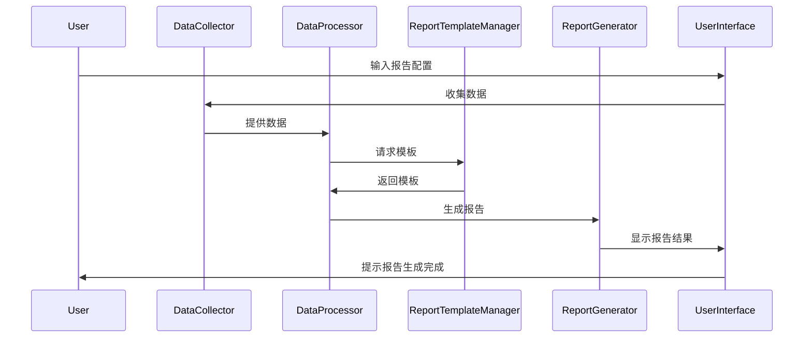

                 

## 第一部分：企业级自动报告生成器概述

### 目录

1. **企业级自动报告生成器概述**
   - 1.1 企业级自动报告生成器简介
     - 1.1.1 问题背景
     - 1.1.2 自动报告生成的重要性
     - 1.1.3 企业级自动报告生成器的定义与功能
     - 1.1.4 概念结构
     - 1.1.5 边界与外延
     - 1.1.6 企业级报告生成器的核心要素
     - 1.1.7 本章小结
   - 1.2 核心技术原理
     - 2.1 数据收集与处理
       - 2.1.1 数据源的类型与选择
       - 2.1.2 数据采集的方法与工具
       - 2.1.3 数据质量管理与预处理
       - 2.1.4 数据清洗与转换
       - 2.1.5 数据融合与汇总
       - 2.1.6 数据存储与索引
       - 2.1.7 数据分析与挖掘
       - 2.1.8 数据可视化与报告生成
     - 2.2 报告模板设计
       - 2.2.1 报告模板设计原则
       - 2.2.2 报告模板实现技术
       - 2.2.3 报告模板的测试与优化
     - 2.3 自动报告生成器开发实践
       - 2.3.1 开发环境搭建
       - 2.3.2 数据库选择与配置
       - 2.3.3 报告生成器框架设计
       - 2.3.4 报告生成器核心实现
   - 1.3 报告生成器的测试与优化
     - 1.3.1 功能测试
     - 1.3.2 性能优化

### 摘要

本文旨在深入探讨企业级自动报告生成器的设计与实现，重点分析了其核心技术原理、报告模板设计以及开发实践。文章首先介绍了企业级自动报告生成器的重要性及其定义与功能，随后详细阐述了数据收集与处理、报告模板设计与实现、开发实践以及报告生成器的测试与优化等核心内容。通过本篇文章，读者可以全面了解自动报告生成器的全貌，掌握其关键技术和实现方法，从而为企业业务流程的自动化、智能化提供有力支持。

### 第一部分：企业级自动报告生成器概述

### 1.1 企业级自动报告生成器简介

#### 1.1.1 问题背景

在当今快速发展的商业环境中，企业对于数据报告的需求日益增加。这些报告不仅包括日常运营的统计数据，还涵盖市场分析、财务报表、项目进度等多个方面。传统的手动报告生成方式存在多个问题，例如效率低下、错误率高、灵活性差等。这些问题严重影响了企业的运营效率和管理决策。为了解决这些问题，自动报告生成器应运而生。

#### 1.1.2 自动报告生成的重要性

自动报告生成器能够显著提高报告生成的效率和准确性。通过自动化处理，企业可以减少人工工作量，降低错误率，并实现报告的实时更新。此外，自动报告生成器还可以根据不同的业务需求和场景，灵活定制报告模板，满足多样化的报告需求。这些优势使得自动报告生成器成为企业提升管理水平和运营效率的重要工具。

#### 1.1.3 企业级自动报告生成器的定义与功能

企业级自动报告生成器是一种基于大数据和人工智能技术，用于自动化生成企业各类报告的系统。其主要功能包括数据收集与处理、报告模板设计、报告生成等。具体来说，企业级自动报告生成器具有以下特点：

1. **数据收集与处理**：自动报告生成器能够从各种数据源（如数据库、文件系统、Web服务等）中收集数据，并进行预处理、清洗、转换和存储。
2. **报告模板设计**：系统提供灵活的模板设计工具，用户可以根据需求自定义报告的格式、内容和布局。
3. **报告生成**：根据预设的模板和数据源，自动报告生成器能够实时生成各种报告，并支持多种输出格式（如PDF、Excel、HTML等）。
4. **自定义与扩展**：系统支持用户自定义报告生成规则和算法，以满足特定业务需求。

#### 1.1.4 概念结构

企业级自动报告生成器由以下几个核心部分组成：

1. **数据源**：包括企业内部和外部的各种数据来源，如数据库、日志文件、Web服务等。
2. **数据处理模块**：负责数据的收集、预处理、清洗、转换和存储。
3. **报告模板设计器**：用于创建和定制报告模板的工具。
4. **报告生成引擎**：根据模板和数据源生成报告的核心模块。
5. **用户界面**：提供用户交互的操作界面，用于配置报告生成规则、查看报告结果等。

#### 1.1.5 边界与外延

企业级自动报告生成器的边界主要涉及以下几个方面：

1. **数据范围**：系统需要处理的数据范围包括企业日常运营数据、市场数据、财务数据等。
2. **功能范围**：系统需要支持的数据处理功能包括数据采集、数据清洗、数据转换、数据存储、数据挖掘等。
3. **用户范围**：系统需要服务于企业内部各个部门，包括业务部门、财务部门、市场部门等。

#### 1.1.6 企业级报告生成器的核心要素

企业级自动报告生成器的核心要素包括：

1. **数据管理**：确保数据的完整性、准确性和一致性。
2. **报告模板**：提供灵活的模板设计工具，支持多种报告格式和布局。
3. **自动化处理**：实现报告生成的自动化，提高效率和准确性。
4. **可扩展性**：支持自定义扩展和集成，适应不同企业的需求。

#### 1.1.7 本章小结

企业级自动报告生成器作为一种重要的企业信息化工具，具有显著的优势和广泛的应用前景。本文介绍了企业级自动报告生成器的问题背景、重要性、定义与功能、概念结构、边界与外延以及核心要素，为后续章节的深入探讨奠定了基础。

### 第二部分：核心技术原理

#### 目录

2.1 数据收集与处理
   - 2.1.1 数据源的类型与选择
   - 2.1.2 数据采集的方法与工具
   - 2.1.3 数据质量管理与预处理
   - 2.1.4 数据清洗与转换
   - 2.1.5 数据融合与汇总
   - 2.1.6 数据存储与索引
   - 2.1.7 数据分析与挖掘
   - 2.1.8 数据可视化与报告生成

2.2 报告模板设计
   - 2.2.1 报告模板设计原则
   - 2.2.2 报告模板实现技术
   - 2.2.3 报告模板的测试与优化

2.3 自动报告生成器开发实践
   - 2.3.1 开发环境搭建
   - 2.3.2 数据库选择与配置
   - 2.3.3 报告生成器框架设计
   - 2.3.4 报告生成器核心实现

2.4 报告生成器的测试与优化
   - 2.4.1 功能测试
   - 2.4.2 性能优化

### 第二部分：核心技术原理

#### 2.1 数据收集与处理

#### 2.1.1 数据源的类型与选择

数据收集是自动报告生成器的重要环节，数据源的类型与选择直接影响到系统的性能和报告的准确性。数据源可以分为以下几类：

1. **结构化数据源**：如关系型数据库（MySQL、Oracle、PostgreSQL等）和非关系型数据库（MongoDB、Cassandra等）。这类数据源具有明确的数据结构和良好的查询性能，适合存储和管理大规模数据。
2. **半结构化数据源**：如XML、JSON等。这类数据源具有一定的结构，但数据格式相对灵活，适合存储和传输复杂数据。
3. **非结构化数据源**：如文本文件、图片、视频等。这类数据源没有固定结构，需要通过专门的工具和技术进行处理。
4. **外部数据源**：如Web服务、API等。这类数据源提供实时数据接口，可以通过网络获取外部数据。

选择数据源时，需要考虑以下因素：

1. **数据质量**：数据源的数据质量直接影响报告的准确性。应选择数据完整、准确、一致的数据源。
2. **数据访问**：数据源需要提供高效、稳定的访问接口，以满足自动报告生成器的需求。
3. **数据规模**：数据源的规模应与系统的处理能力相匹配，避免因数据规模过大导致系统性能下降。
4. **数据更新频率**：数据源的更新频率应与报告生成周期相匹配，以确保报告的实时性。

#### 2.1.2 数据采集的方法与工具

数据采集是自动报告生成器的第一步，方法与工具的选择直接影响到数据的完整性和准确性。数据采集的方法可以分为以下几类：

1. **数据库采集**：通过数据库连接池或JDBC等方式直接从数据库中读取数据。适用于结构化数据源，具有较高的效率和准确性。
2. **API采集**：通过Web服务或API接口获取外部数据。适用于外部数据源，可以实时获取数据。
3. **日志采集**：通过日志文件或日志分析工具收集系统运行过程中的数据。适用于非结构化数据源，可以获取详细的系统运行信息。
4. **爬虫采集**：通过网络爬虫技术获取互联网上的数据。适用于互联网数据采集，可以获取大量实时数据。

常用的数据采集工具有：

1. **Apache Kafka**：一个分布式流处理平台，适用于实时数据采集和传输。
2. **Logstash**：一个开源的数据收集和传输工具，可以与Kafka等工具配合使用。
3. **Apache NiFi**：一个可视化数据流平台，适用于数据采集、处理和传输。
4. **Apache Flume**：一个分布式、可靠且可伸缩的数据收集系统，适用于大规模数据采集。

#### 2.1.3 数据质量管理与预处理

数据质量管理与预处理是自动报告生成器的重要组成部分，直接影响到数据的质量和报告的准确性。数据质量管理与预处理包括以下步骤：

1. **数据清洗**：去除重复数据、缺失数据、异常数据等，确保数据的准确性和一致性。
2. **数据转换**：将不同格式、不同单位、不同类型的数据进行转换，使其具有统一的格式和标准。
3. **数据归一化**：将数据按一定的比例或规则进行归一化处理，使其在同一尺度上进行比较。
4. **数据集成**：将来自不同数据源的数据进行整合，形成一个统一的数据集。

数据质量管理与预处理的工具和技术包括：

1. **ETL工具**：如Apache NiFi、Apache Airflow等，用于数据抽取、转换和加载。
2. **数据清洗算法**：如K-Means聚类、关联规则挖掘等，用于识别和去除异常数据。
3. **数据转换函数**：如日期格式转换、数值归一化等，用于统一数据格式和单位。
4. **数据质量管理平台**：如Talend、Informatica等，提供全面的数据质量管理与预处理功能。

#### 2.1.4 数据清洗与转换

数据清洗与转换是数据质量管理与预处理的重要步骤，直接影响到数据的质量和报告的准确性。数据清洗与转换包括以下内容：

1. **数据清洗**：
   - **去除重复数据**：通过比对记录的唯一标识（如主键），去除重复的数据记录。
   - **填充缺失数据**：根据一定的规则或算法，填充缺失的数据值，如平均值、中位数、最大值等。
   - **识别和去除异常数据**：通过统计分析和数据可视化等方法，识别和去除异常数据，如极端值、不合理值等。

2. **数据转换**：
   - **格式转换**：将不同格式的数据转换为统一的格式，如将日期字符串转换为日期类型。
   - **单位转换**：将不同单位的数据转换为统一的单位，如将米转换为千米。
   - **类型转换**：将不同类型的数据转换为同一类型，如将字符串转换为数值类型。

数据清洗与转换的方法包括：

1. **编程语言**：如Python、Java等，通过编写脚本或程序进行数据清洗和转换。
2. **数据库函数**：如SQL中的转换函数（如TO_DATE、TO_NUMERIC等），用于在数据库层面进行数据清洗和转换。
3. **ETL工具**：如Apache NiFi、Apache Airflow等，提供可视化的数据清洗和转换功能。

#### 2.1.5 数据融合与汇总

数据融合与汇总是将多个数据源的数据进行整合，形成统一的数据集，以便进行进一步分析和报告生成。数据融合与汇总包括以下内容：

1. **数据融合**：
   - **数据去重**：去除重复的数据记录，确保数据的一致性和准确性。
   - **数据连接**：将来自不同数据源的数据进行连接，形成一个统一的数据集。
   - **数据匹配**：通过关键字、标识符等匹配规则，将相同或相关的数据进行匹配和整合。

2. **数据汇总**：
   - **数据聚合**：对数据进行分组和汇总，计算各类统计指标，如总数、平均值、最大值、最小值等。
   - **数据排序**：根据一定的排序规则，对数据进行排序，便于分析和报告生成。

数据融合与汇总的方法包括：

1. **编程语言**：如Python、Java等，通过编写脚本或程序进行数据融合和汇总。
2. **数据库查询**：使用SQL等数据库查询语言，进行数据融合和汇总。
3. **数据集成工具**：如Apache NiFi、Apache Airflow等，提供可视化的数据融合和汇总功能。

#### 2.1.6 数据存储与索引

数据存储与索引是自动报告生成器的关键环节，直接影响到数据的访问速度和报告生成效率。数据存储与索引包括以下内容：

1. **数据存储**：
   - **关系型数据库**：如MySQL、Oracle、PostgreSQL等，适用于结构化数据的存储。
   - **非关系型数据库**：如MongoDB、Cassandra等，适用于半结构化或非结构化数据的存储。
   - **分布式文件系统**：如HDFS、Ceph等，适用于大规模数据的存储。

2. **索引**：
   - **B树索引**：适用于查找和排序操作，具有较高的查询效率。
   - **哈希索引**：适用于快速查找操作，但排序性能较差。
   - **全文索引**：适用于全文搜索操作，如Lucene、Elasticsearch等。

数据存储与索引的方法包括：

1. **数据库管理**：如MySQL、MongoDB等，提供数据存储和索引功能。
2. **NoSQL数据库**：如Cassandra、MongoDB等，提供数据存储和索引功能。
3. **搜索引擎**：如Lucene、Elasticsearch等，提供全文索引和搜索功能。

#### 2.1.7 数据分析与挖掘

数据分析与挖掘是自动报告生成器的核心功能，通过对数据的分析和挖掘，提取出有价值的信息和知识，为报告生成提供依据。数据分析与挖掘包括以下内容：

1. **统计分析**：通过对数据进行统计计算，提取各类统计指标和统计图表，如平均数、中位数、方差、直方图等。
2. **数据挖掘**：通过对数据进行挖掘和分析，发现潜在的模式、趋势和规律，如关联规则挖掘、聚类分析、分类分析等。
3. **机器学习**：利用机器学习算法，对数据进行建模和预测，如回归分析、神经网络、支持向量机等。

数据分析与挖掘的方法包括：

1. **统计分析工具**：如Python的pandas库、R语言等，提供丰富的统计分析和数据可视化功能。
2. **数据挖掘工具**：如WEKA、RapidMiner等，提供数据挖掘算法和模型评估功能。
3. **机器学习框架**：如TensorFlow、PyTorch等，提供机器学习算法和模型训练功能。

#### 2.1.8 数据可视化与报告生成

数据可视化与报告生成是将分析结果以图表、报表等形式展示出来，为用户提供直观、易于理解的信息。数据可视化与报告生成包括以下内容：

1. **数据可视化**：
   - **图表类型**：如柱状图、折线图、饼图、散点图等，用于展示各类统计数据。
   - **可视化工具**：如Python的matplotlib、seaborn库，提供丰富的图表绘制功能。
2. **报告生成**：
   - **报告格式**：如PDF、Excel、HTML等，支持多种报告格式。
   - **报告模板**：自定义报告模板，包括标题、摘要、图表、文字内容等。
   - **报告生成工具**：如Python的ReportLab、XlsxWriter库，提供报告生成功能。

#### 2.2 报告模板设计

报告模板设计是自动报告生成器的重要组成部分，决定了报告的格式、内容和布局。报告模板设计包括以下内容：

1. **模板结构**：
   - **标题**：报告的标题，用于标识报告的主题。
   - **摘要**：报告的摘要，简要介绍报告的主要内容。
   - **图表**：报告中的各类图表，用于展示统计数据和分析结果。
   - **文字内容**：报告中的文字内容，详细描述分析结果和结论。

2. **模板设计原则**：
   - **清晰性**：模板设计要清晰简洁，易于用户理解和操作。
   - **可扩展性**：模板设计要具备良好的可扩展性，便于后续修改和优化。
   - **灵活性**：模板设计要具备较高的灵活性，能够适应不同类型的数据和报告需求。

3. **模板实现技术**：
   - **HTML/CSS**：使用HTML和CSS进行页面布局和样式设计，提供丰富的样式和布局选项。
   - **JavaScript**：使用JavaScript实现交互式功能和动态数据绑定，提高报告的交互性和响应速度。
   - **报表工具**：如Python的ReportLab、XlsxWriter库，提供报表生成功能。

#### 2.3 自动报告生成器开发实践

自动报告生成器开发实践包括开发环境搭建、数据库选择与配置、报告生成器框架设计、报告生成器核心实现等内容。

1. **开发环境搭建**：
   - **硬件环境**：选择合适的硬件设备，如服务器、存储设备等。
   - **软件环境**：安装操作系统、数据库、开发工具等，搭建开发环境。

2. **数据库选择与配置**：
   - **关系型数据库**：如MySQL、Oracle等，适用于存储和管理结构化数据。
   - **非关系型数据库**：如MongoDB、Cassandra等，适用于存储和管理半结构化或非结构化数据。
   - **数据库配置**：配置数据库连接、用户权限、数据存储等，确保数据安全可靠。

3. **报告生成器框架设计**：
   - **模块划分**：将报告生成器划分为数据收集模块、数据处理模块、报告生成模块等，实现模块化设计。
   - **接口设计**：设计清晰的接口，实现模块间的数据传递和功能调用。
   - **架构设计**：采用合适的架构模式，如MVC模式、微服务架构等，提高系统的可扩展性和可维护性。

4. **报告生成器核心实现**：
   - **数据收集**：实现数据收集功能，从各类数据源中获取数据。
   - **数据处理**：实现数据处理功能，进行数据清洗、转换、融合等。
   - **报告生成**：实现报告生成功能，根据模板和数据生成报告。

#### 2.4 报告生成器的测试与优化

报告生成器的测试与优化是确保系统稳定、高效运行的关键环节。测试与优化包括以下内容：

1. **功能测试**：
   - **单元测试**：对系统中的各个模块进行单独测试，确保其功能的正确性。
   - **集成测试**：对系统中的各个模块进行集成测试，确保其协同工作。
   - **性能测试**：对系统进行性能测试，评估其处理能力、响应速度等。

2. **性能优化**：
   - **数据库优化**：优化数据库查询性能，提高数据访问速度。
   - **代码优化**：优化系统代码，减少资源消耗、提高执行效率。
   - **缓存技术**：使用缓存技术，减少重复计算和数据访问。

### 第三部分：报告模板设计

### 目录

3.1 报告模板设计原则
   - 3.1.1 报告模板的结构与内容
   - 3.1.2 报告模板的可扩展性与适应性
   - 3.1.3 报告模板的美观与易读性

3.2 报告模板实现技术
   - 3.2.1 常用报告模板工具
   - 3.2.2 报告模板的定制化实现
   - 3.2.3 报告模板的自动化更新

3.3 报告模板的测试与优化
   - 3.3.1 报告模板的功能测试
   - 3.3.2 报告模板的性能优化
   - 3.3.3 用户反馈与模板改进

### 第三部分：报告模板设计

#### 3.1 报告模板设计原则

报告模板设计是企业级自动报告生成器的关键组成部分，其质量直接影响报告的格式、内容以及可读性。在报告模板设计过程中，需要遵循以下原则：

#### 3.1.1 报告模板的结构与内容

一个良好的报告模板应具备清晰的结构和丰富的内容，以便于用户快速理解和分析。报告模板通常包括以下部分：

1. **封面**：报告的封面应包含报告名称、日期、报告人等信息，为用户提供报告的基本信息。
2. **摘要**：报告的摘要部分应简要概述报告的主要内容和结论，使用户在阅读报告之前对报告有一个整体的了解。
3. **目录**：报告的目录部分列出报告的各个章节和小节，使用户可以方便地定位所需内容。
4. **正文**：报告的正文部分是报告的核心，详细阐述分析过程、数据结果和结论。
5. **图表与表格**：报告中的图表和表格用于展示数据和分析结果，应标注清楚图表和表格的来源和含义。
6. **附录**：报告的附录部分提供额外信息，如数据源、参考文献、代码等。

#### 3.1.2 报告模板的可扩展性与适应性

报告模板设计应具备良好的可扩展性和适应性，以适应不同业务场景和用户需求。具体表现在：

1. **模块化设计**：报告模板应采用模块化设计，将不同的内容部分（如封面、摘要、正文等）作为独立的模块，便于修改和扩展。
2. **参数化设置**：报告模板应支持参数化设置，如标题、日期、数据范围等，以便用户自定义报告内容。
3. **样式自定义**：报告模板应提供自定义样式功能，如字体、颜色、布局等，满足不同用户的个性化需求。

#### 3.1.3 报告模板的美观与易读性

报告模板的美观与易读性对用户阅读和理解报告至关重要。在设计报告模板时，应考虑以下因素：

1. **版面布局**：合理的版面布局可以提高报告的可读性，避免内容过于拥挤或过于稀疏。
2. **字体与大小**：选择合适的字体和大小，确保报告内容的可读性，避免字体过于小或模糊。
3. **颜色使用**：合理使用颜色，如突出重要数据、区分不同类型的数据等，以提高报告的视觉效果。
4. **图表设计**：图表设计应简洁明了，避免过多的装饰性元素，确保用户能够快速理解图表含义。

### 3.2 报告模板实现技术

报告模板实现技术包括选择合适的报告模板工具、定制化实现模板以及自动化更新模板等。以下是几种常用的报告模板实现技术：

#### 3.2.1 常用报告模板工具

1. **Microsoft Word**：Word是广泛使用的文档处理软件，提供丰富的模板资源和自定义功能，适用于简单的报告模板设计。
2. **LaTeX**：LaTeX是一种基于文本的排版系统，适用于复杂文档的排版，提供高质量的美观排版效果，但学习曲线较陡峭。
3. **Python库**：如ReportLab、XlsxWriter等，提供Python编程语言下的报告模板生成功能，适用于开发自定义的报告模板。

#### 3.2.2 报告模板的定制化实现

定制化实现报告模板需要根据企业的具体需求和业务场景进行设计。以下是一些关键步骤：

1. **需求分析**：了解企业的业务需求和报告要求，确定报告模板的模块和内容。
2. **设计模板**：根据需求分析结果，设计报告模板的框架和样式，确保模板的清晰和易读性。
3. **编写代码**：使用选定的报告模板工具和编程语言，编写代码实现报告模板的功能和布局。
4. **测试与优化**：对报告模板进行功能测试和性能优化，确保模板能够稳定运行和满足用户需求。

#### 3.2.3 报告模板的自动化更新

报告模板的自动化更新是提高报告生成效率和准确性的重要手段。以下是一些自动化更新报告模板的方法：

1. **定期更新**：根据企业的业务周期和报告需求，定期更新报告模板，确保报告内容与实际情况相符。
2. **数据驱动**：使用数据驱动模板更新，根据实时数据自动更新报告模板的内容和图表，提高报告的实时性。
3. **脚本自动化**：编写自动化脚本，实现对报告模板的自动更新和生成，减少人工干预，提高效率。

### 3.3 报告模板的测试与优化

报告模板的测试与优化是确保模板质量和性能的关键环节。以下是一些测试与优化方法：

#### 3.3.1 报告模板的功能测试

功能测试是验证报告模板各项功能的正确性和稳定性。以下是一些功能测试方法：

1. **单元测试**：对模板中的各个模块进行单独测试，确保其功能的正确性。
2. **集成测试**：对模板中的各个模块进行集成测试，验证模块间的协同工作是否正常。
3. **性能测试**：对模板的响应速度和并发处理能力进行测试，确保模板能够在高负载情况下稳定运行。

#### 3.3.2 报告模板的性能优化

性能优化是提高报告模板运行效率的重要手段。以下是一些性能优化方法：

1. **代码优化**：优化模板中的代码，减少不必要的计算和资源消耗，提高运行效率。
2. **缓存技术**：使用缓存技术，减少重复计算和数据访问，提高报告生成的速度。
3. **并行处理**：采用并行处理技术，如多线程或分布式处理，提高报告生成的并发能力。

#### 3.3.3 用户反馈与模板改进

用户反馈是改进报告模板的重要依据。以下是一些用户反馈与模板改进的方法：

1. **收集反馈**：定期收集用户的反馈意见，了解他们在使用报告模板过程中遇到的问题和需求。
2. **分析反馈**：对收集到的反馈进行分析，识别出模板中的问题和改进方向。
3. **改进模板**：根据分析结果，对报告模板进行改进和优化，提高模板的适用性和用户体验。

### 3.4 本章小结

报告模板设计是企业级自动报告生成器的重要组成部分，其质量和性能直接影响报告的格式、内容和用户体验。本章介绍了报告模板设计的原则、实现技术和测试优化方法，为设计高质量的报告模板提供了参考。通过遵循报告模板设计原则、选择合适的实现技术和进行充分的测试与优化，可以为企业提供高效、准确的自动报告生成服务。

### 第四部分：自动报告生成器开发实践

#### 目录

4.1 开发环境搭建
   - 4.1.1 硬件要求与选型
   - 4.1.2 软件工具与库的安装
   - 4.1.3 开发工具与IDE的配置

4.2 数据库选择与配置
   - 4.2.1 数据库的类型与选择
   - 4.2.2 数据库的搭建与初始化
   - 4.2.3 数据库连接与访问

4.3 报告生成器框架设计
   - 4.3.1 报告生成器的基本架构
   - 4.3.2 报告生成器模块划分
   - 4.3.3 报告生成器功能模块实现

4.4 报告生成器的核心实现
   - 4.4.1 数据收集与处理模块
   - 4.4.2 报告模板设计与实现模块
   - 4.4.3 报告生成模块

4.5 测试与优化
   - 4.5.1 功能测试
   - 4.5.2 性能优化

#### 4.1 开发环境搭建

在开发自动报告生成器之前，首先需要搭建一个合适的开发环境。合适的开发环境能够提供所需的硬件资源、软件工具和开发框架，从而确保项目的顺利进行。以下是如何搭建自动报告生成器开发环境的具体步骤：

##### 4.1.1 硬件要求与选型

选择合适的硬件设备是确保自动报告生成器高效运行的基础。以下是一些关键硬件要求：

1. **服务器**：自动报告生成器通常需要在服务器上运行，选择一台性能稳定的虚拟机或物理服务器。推荐的配置如下：
   - **CPU**：至少四核处理器，建议八核或以上，以保证多任务处理能力。
   - **内存**：至少16GB内存，建议32GB或以上，以应对大数据处理需求。
   - **硬盘**：建议使用SSD硬盘，容量至少为500GB，以提高I/O性能。

2. **网络设备**：确保服务器与网络连接稳定，选择合适的网络交换机和路由器，以保证数据传输的可靠性。

##### 4.1.2 软件工具与库的安装

安装必要的软件工具和库是开发自动报告生成器的前提。以下是一些建议安装的软件和库：

1. **操作系统**：推荐使用Linux操作系统，如Ubuntu或CentOS，因为其稳定性和兼容性较高。

2. **数据库**：根据业务需求选择合适的数据库，如MySQL、PostgreSQL或MongoDB。安装步骤如下：
   - 使用包管理器（如apt-get或yum）安装数据库。
   - 配置数据库服务，设置用户和权限。

3. **编程语言**：推荐使用Python作为开发语言，因为它拥有丰富的库和框架，便于开发复杂的应用程序。

4. **开发工具**：
   - **文本编辑器**：如Visual Studio Code、Sublime Text等，用于编写和编辑代码。
   - **集成开发环境（IDE）**：如PyCharm、Eclipse等，提供代码编辑、调试和测试功能。

5. **其他库和工具**：
   - **Pandas**：用于数据处理和分析。
   - **NumPy**：用于数值计算。
   - **Matplotlib**：用于数据可视化。
   - **ReportLab**：用于生成PDF报告。
   - **Flask**：用于Web开发。

安装步骤如下：

1. 安装操作系统和必要的软件。
2. 使用pip安装Python库，如以下命令所示：
   ```shell
   pip install pandas numpy matplotlib reportlab flask
   ```

##### 4.1.3 开发工具与IDE的配置

配置开发工具和IDE是确保代码编写、调试和测试顺利进行的必要步骤。以下是一些配置建议：

1. **配置Python环境**：
   - 确保Python版本与安装的库兼容。
   - 创建虚拟环境，隔离不同项目之间的依赖关系。

2. **配置IDE**：
   - 在PyCharm中，创建一个新的Python项目，配置虚拟环境。
   - 配置代码风格和格式化工具，如Black或autopep8。
   - 配置调试工具，如Python调试器。

3. **配置版本控制**：
   - 使用Git或其他版本控制系统，对代码进行版本管理和协作开发。

通过以上步骤，可以搭建一个满足自动报告生成器开发需求的开发环境，为项目的顺利进行提供基础支持。

#### 4.2 数据库选择与配置

在自动报告生成器开发中，数据库扮演着至关重要的角色。选择合适的数据库，并对其进行合理的配置，能够确保数据的安全、稳定和高效访问。以下将介绍如何选择数据库、搭建数据库、初始化数据库以及实现数据库连接与访问。

##### 4.2.1 数据库的类型与选择

数据库的选择取决于多种因素，包括数据规模、数据类型、查询性能、可扩展性等。以下是几种常用的数据库类型及其特点：

1. **关系型数据库（RDBMS）**：
   - **特点**：具有严格的数据结构和关系模型，支持复杂查询和事务处理。
   - **代表**：MySQL、PostgreSQL、Oracle。
   - **适用场景**：适合存储结构化数据，如客户信息、订单数据等。

2. **非关系型数据库（NoSQL）**：
   - **特点**：数据模型灵活，可水平扩展，支持高并发读写。
   - **代表**：MongoDB、Cassandra、Redis。
   - **适用场景**：适合存储半结构化或非结构化数据，如日志数据、社交媒体数据等。

3. **分布式数据库**：
   - **特点**：具有高可用性和容错性，能够支持大规模数据存储和处理。
   - **代表**：Hadoop、Cassandra、MongoDB。
   - **适用场景**：适合处理海量数据，如电子商务、大数据分析等。

选择数据库时，应考虑以下因素：

- **数据规模**：根据数据量的大小，选择合适的数据库类型和版本。
- **性能需求**：根据查询性能的要求，选择适合的数据库引擎和优化策略。
- **业务场景**：根据业务需求和数据处理模式，选择适合的数据库类型。
- **成本考虑**：考虑数据库的硬件需求、维护成本和许可费用。

##### 4.2.2 数据库的搭建与初始化

一旦确定了数据库的类型，接下来是搭建和初始化数据库。以下是使用MySQL和MongoDB进行搭建和初始化的示例步骤：

1. **MySQL搭建与初始化**：

   - **安装MySQL**：
     ```shell
     sudo apt-get update
     sudo apt-get install mysql-server
     ```
   
   - **初始化MySQL**：
     ```shell
     sudo mysql_secure_installation
     ```
     按照提示设置root密码、删除匿名用户、禁用root远程登录等。

   - **创建数据库和用户**：
     ```sql
     CREATE DATABASE report_db;
     GRANT ALL PRIVILEGES ON report_db.* TO 'report_user'@'localhost' IDENTIFIED BY 'password';
     FLUSH PRIVILEGES;
     ```

2. **MongoDB搭建与初始化**：

   - **安装MongoDB**：
     ```shell
     sudo apt-get update
     sudo apt-get install mongodb
     ```
   
   - **启动MongoDB服务**：
     ```shell
     sudo systemctl start mongodb
     ```

   - **创建数据库和集合**：
     ```shell
     use report_db
     db.createCollection('reports')
     ```

##### 4.2.3 数据库连接与访问

数据库连接与访问是自动报告生成器开发中的重要环节。以下是使用Python的pymysql和pymongo库连接和访问MySQL和MongoDB的示例代码：

1. **连接MySQL**：

   ```python
   import pymysql

   # 连接数据库
   connection = pymysql.connect(
       host='localhost',
       user='report_user',
       password='password',
       database='report_db',
       charset='utf8mb4'
   )

   # 创建游标
   cursor = connection.cursor()

   # 执行SQL查询
   cursor.execute("SELECT * FROM reports")

   # 获取查询结果
   results = cursor.fetchall()
   for row in results:
       print(row)

   # 关闭游标和连接
   cursor.close()
   connection.close()
   ```

2. **连接MongoDB**：

   ```python
   from pymongo import MongoClient

   # 连接MongoDB
   client = MongoClient('localhost', 27017)

   # 选择数据库和集合
   db = client.report_db
   collection = db.reports

   # 插入文档
   post = {"author": "Mike", "text": "My first blog post!", "tags": ["mongodb", "python", "pymongo"]}
   result = collection.insert_one(post)
   print("Inserted document id:", result.inserted_id)

   # 查询文档
   for post in collection.find():
       print(post)
   ```

通过以上步骤，可以搭建和配置自动报告生成器所需的数据库环境，并实现数据库的连接与访问。接下来，可以进一步开发自动报告生成器的功能模块，实现数据收集、处理和报告生成的具体功能。

#### 4.3 报告生成器框架设计

在开发自动报告生成器时，框架设计是确保系统模块化、可扩展性和可维护性的关键。本节将详细介绍报告生成器的基本架构、模块划分以及各个功能模块的实现。

##### 4.3.1 报告生成器的基本架构

报告生成器的基本架构可以分为以下几个核心模块：

1. **数据收集模块**：负责从各种数据源（如数据库、文件、Web API等）中收集数据。
2. **数据处理模块**：负责对收集到的数据进行清洗、转换和预处理。
3. **报告模板模块**：负责设计和管理报告模板，包括模板的创建、编辑和存储。
4. **报告生成模块**：根据模板和数据生成报告，并支持多种输出格式（如PDF、Excel、HTML等）。
5. **用户界面模块**：提供用户交互界面，使用户可以配置报告生成规则、查看报告结果等。

以下是一个简化的报告生成器基本架构图：



##### 4.3.2 报告生成器模块划分

报告生成器可以进一步细化为多个子模块，以实现功能的模块化和代码的重用。以下是报告生成器的主要模块及其功能：

1. **数据收集模块**：
   - **数据源连接器**：负责连接不同的数据源，如数据库、文件系统、Web API等。
   - **数据采集器**：负责从数据源中读取数据，支持实时数据流和批量数据导入。
   - **数据预处理器**：负责对采集到的数据进行清洗、转换和预处理。

2. **数据处理模块**：
   - **数据清洗器**：去除重复数据、缺失数据和异常数据。
   - **数据转换器**：将数据格式和单位进行统一转换。
   - **数据整合器**：将来自多个数据源的数据进行整合和汇总。

3. **报告模板模块**：
   - **模板设计器**：提供模板的创建、编辑和预览功能。
   - **模板存储器**：负责模板的存储和管理，支持模板的版本控制和备份。
   - **模板渲染器**：根据数据生成对应的报告模板，支持模板的自定义和数据绑定。

4. **报告生成模块**：
   - **报告生成器**：根据模板和数据生成报告，支持多种输出格式。
   - **报告格式化器**：负责将报告内容格式化为PDF、Excel、HTML等格式。
   - **报告存储器**：负责将生成的报告存储到文件系统或数据库中，供用户查看和下载。

5. **用户界面模块**：
   - **用户登录模块**：提供用户身份验证和权限管理功能。
   - **配置界面**：提供数据源配置、模板设计、报告生成规则的配置界面。
   - **报告展示界面**：展示生成的报告，并提供报告下载和打印功能。

##### 4.3.3 报告生成器功能模块实现

以下是报告生成器各个功能模块的具体实现：

1. **数据收集模块**：

   - **数据源连接器**：使用数据库驱动、文件读写库和HTTP客户端库实现数据源连接。
     ```python
     import pymysql
     import requests
     import csv

     def connect_to_mysql(host, user, password, database):
         connection = pymysql.connect(host, user, password, database)
         return connection

     def fetch_data_from_api(url):
         response = requests.get(url)
         return response.json()

     def read_data_from_file(file_path):
         with open(file_path, 'r') as file:
             reader = csv.reader(file)
             data = [row for row in reader]
         return data
     ```

   - **数据采集器**：实现数据采集的调度和监控，支持定时采集和实时采集。
     ```python
     from apscheduler.schedulers.background import BackgroundScheduler

     scheduler = BackgroundScheduler()

     def collect_data():
         # 调用数据源连接器的相应方法进行数据采集
         connection = connect_to_mysql('localhost', 'user', 'password', 'database')
         data = fetch_data_from_api('http://api.example.com/data')
         file_data = read_data_from_file('data.csv')
         # 处理采集到的数据
         process_collected_data(data, file_data)

     scheduler.add_job(collect_data, 'interval', hours=1)
     scheduler.start()
     ```

   - **数据预处理器**：实现数据的清洗、转换和预处理。
     ```python
     import pandas as pd

     def clean_data(data):
         df = pd.DataFrame(data)
         df.drop_duplicates(inplace=True)
         df.fillna(method='ffill', inplace=True)
         return df

     def transform_data(df):
         df['date'] = pd.to_datetime(df['date'])
         df['amount'] = df['amount'].astype(float)
         return df

     def process_collected_data(data, file_data):
         df = clean_data(data)
         df = transform_data(df)
         # 进一步处理和存储数据
         store_processed_data(df)
     ```

2. **数据处理模块**：

   - **数据清洗器**：使用Pandas库实现数据的清洗功能。
     ```python
     def remove_duplicates(df):
         df.drop_duplicates(inplace=True)
         return df

     def fill_missing_values(df, method='ffill'):
         df.fillna(method=method, inplace=True)
         return df
     ```

   - **数据转换器**：实现数据的格式和单位转换。
     ```python
     def convert_data_types(df):
         df['date'] = pd.to_datetime(df['date'])
         df['amount'] = df['amount'].astype(float)
         return df

     def convert_units(df, unit_conversion_dict):
         for column, conversion_factor in unit_conversion_dict.items():
             df[column] = df[column] * conversion_factor
         return df
     ```

   - **数据整合器**：实现数据的整合和汇总。
     ```python
     def merge_dataframes(df1, df2, on='id'):
         df = pd.merge(df1, df2, on=on)
         return df

     def aggregate_data(df, group_by_column='id', aggregation_functions={'total': 'sum'}):
         df = df.groupby(group_by_column).agg(aggregation_functions)
         return df
     ```

3. **报告模板模块**：

   - **模板设计器**：使用HTML/CSS实现模板设计。
     ```html
     <!DOCTYPE html>
     <html>
     <head>
       <title>报告模板</title>
       <style>
         body { font-family: Arial, sans-serif; }
         h1 { text-align: center; }
         table { margin: auto; }
         th, td { border: 1px solid black; padding: 8px; }
       </style>
     </head>
     <body>
       <h1>报告标题</h1>
       <table>
         <tr>
           <th>列1</th>
           <th>列2</th>
           <th>列3</th>
         </tr>
         <tr>
           <td>数据1</td>
           <td>数据2</td>
           <td>数据3</td>
         </tr>
       </table>
     </body>
     </html>
     ```

   - **模板存储器**：使用文件系统或数据库实现模板存储和管理。
     ```python
     import os

     def save_template(template_path, template_data):
         with open(template_path, 'w') as file:
             file.write(template_data)

     def load_template(template_path):
         with open(template_path, 'r') as file:
             template_data = file.read()
         return template_data
     ```

   - **模板渲染器**：使用Python库（如 Jinja2）实现模板和数据绑定。
     ```python
     from jinja2 import Environment, FileSystemLoader

     def render_template(template_path, data):
         environment = Environment(loader=FileSystemLoader('.'))
         template = environment.get_template(template_path)
         rendered_template = template.render(data=data)
         return rendered_template
     ```

4. **报告生成模块**：

   - **报告生成器**：根据模板和数据生成报告，支持多种输出格式。
     ```python
     from reportlab.lib.pagesizes import A4
     from reportlab.pdfgen import canvas

     def generate_pdf_report(template_path, output_path, data):
         template = render_template(template_path, data)
         c = canvas.Canvas(output_path, pagesize=A4)
         c.drawString(100, 750, "报告标题")
         c.drawString(100, 730, "日期")
         c.drawString(100, 710, "作者")
         c.drawString(100, 690, "报告内容")
         c.showPage()
         c.save()
     ```

   - **报告格式化器**：将报告内容格式化为不同输出格式。
     ```python
     import pandas as pd
     from xlsxwriter import Workbook

     def generate_excel_report(template_path, output_path, data):
         template = render_template(template_path, data)
         df = pd.read_html(template)[0]
         workbook = Workbook(output_path)
         worksheet = workbook.add_worksheet()
         df.to_excel(worksheet, index=False)
         workbook.close()
     ```

   - **报告存储器**：将生成的报告存储到文件系统或数据库中。
     ```python
     import os

     def save_report(report_path, report_data):
         with open(report_path, 'w') as file:
             file.write(report_data)

     def load_report(report_path):
         with open(report_path, 'r') as file:
             report_data = file.read()
         return report_data
     ```

5. **用户界面模块**：

   - **用户登录模块**：使用Web框架（如Flask）实现用户登录和权限管理。
     ```python
     from flask import Flask, request, redirect, url_for, session

     app = Flask(__name__)
     app.secret_key = 'my_secret_key'

     @app.route('/login', methods=['GET', 'POST'])
     def login():
         if request.method == 'POST':
             username = request.form['username']
             password = request.form['password']
             # 验证用户名和密码
             if verify_credentials(username, password):
                 session['username'] = username
                 return redirect(url_for('index'))
             else:
                 return '登录失败'
         return '''
             <form method="post">
                 用户名：<input type="text" name="username"><br>
                 密码：<input type="password" name="password"><br>
                 <input type="submit" value="登录">
             </form>
         '''

     @app.route('/')
     def index():
         if 'username' in session:
             return '欢迎登录，' + session['username'] + '！'
         return redirect(url_for('login'))

     def verify_credentials(username, password):
         # 实现用户验证逻辑
         return True
     ```

   - **配置界面**：使用Web界面实现数据源配置、模板设计和报告生成规则配置。
     ```html
     <!DOCTYPE html>
     <html>
     <head>
       <title>报告生成器配置</title>
       <style>
         body { font-family: Arial, sans-serif; }
         h1 { text-align: center; }
       </style>
     </head>
     <body>
       <h1>数据源配置</h1>
       <form action="/configure_data_source" method="post">
         数据源类型：<input type="text" name="data_source_type"><br>
         数据源URL：<input type="text" name="data_source_url"><br>
         <input type="submit" value="保存配置">
       </form>
       <h1>模板设计</h1>
       <form action="/configure_template" method="post">
         模板名称：<input type="text" name="template_name"><br>
         模板内容：<input type="text" name="template_content"><br>
         <input type="submit" value="保存配置">
       </form>
       <h1>报告生成规则配置</h1>
       <form action="/configure_report_generation" method="post">
         报告类型：<input type="text" name="report_type"><br>
         生成周期：<input type="text" name="report_cycle"><br>
         <input type="submit" value="保存配置">
       </form>
     </body>
     </html>
     ```

   - **报告展示界面**：使用Web界面展示生成的报告，并提供下载和打印功能。
     ```html
     <!DOCTYPE html>
     <html>
     <head>
       <title>报告展示</title>
       <style>
         body { font-family: Arial, sans-serif; }
         h1 { text-align: center; }
       </style>
     </head>
     <body>
       <h1>报告列表</h1>
       <ul>
         
           <li>
             <a href="/download_report?report_id={{ report.id }}">{{ report.title }}</a>
           </li>
         
       </ul>
     </body>
     </html>
     ```

通过以上步骤和代码，可以实现一个基本的企业级自动报告生成器的框架设计和功能模块实现。接下来，可以进一步进行测试和优化，以确保系统的稳定性和高效性。

### 第五部分：自动报告生成器的核心实现

#### 目录

5.1 数据收集与处理模块
   - 5.1.1 数据采集流程
   - 5.1.2 数据清洗与转换
   - 5.1.3 数据存储与索引

5.2 报告模板设计与实现模块
   - 5.2.1 报告模板设计原则
   - 5.2.2 报告模板实现技术
   - 5.2.3 报告模板定制化实现

5.3 报告生成模块
   - 5.3.1 报告生成流程
   - 5.3.2 报告生成器核心算法
   - 5.3.3 报告生成的性能优化

#### 5.1 数据收集与处理模块

数据收集与处理模块是自动报告生成器的核心组成部分，负责从各种数据源中获取数据，并对数据进行清洗、转换和存储，以确保数据的准确性和一致性。以下是该模块的核心实现：

##### 5.1.1 数据采集流程

数据采集流程包括数据源的连接、数据的获取和数据的预处理。以下是具体步骤：

1. **连接数据源**：
   - **关系型数据库**：使用JDBC或ORM框架（如Hibernate）连接数据库。
     ```python
     import pymysql

     def connect_to_db(host, user, password, database):
         connection = pymysql.connect(host, user, password, database)
         return connection
     ```

   - **非关系型数据库**：使用专门的库（如PyMongo）连接数据库。
     ```python
     from pymongo import MongoClient

     def connect_to_mongodb(host, port, database):
         client = MongoClient(host, port)
         db = client[database]
         return db
     ```

   - **Web API**：使用HTTP客户端（如Requests）获取API数据。
     ```python
     import requests

     def fetch_data_from_api(url):
         response = requests.get(url)
         return response.json()
     ```

   - **文件系统**：使用文件读写库（如os和csv）读取文件数据。
     ```python
     import csv
     import os

     def read_data_from_file(file_path):
         with open(file_path, 'r') as file:
             reader = csv.reader(file)
             data = [row for row in reader]
         return data
     ```

2. **数据获取**：
   - **关系型数据库**：执行SQL查询获取数据。
     ```python
     def fetch_data_from_mysql(connection, query):
         cursor = connection.cursor()
         cursor.execute(query)
         data = cursor.fetchall()
         cursor.close()
         return data
     ```

   - **非关系型数据库**：使用数据库查询获取数据。
     ```python
     def fetch_data_from_mongodb(db, collection_name):
         collection = db[collection_name]
         data = list(collection.find())
         return data
     ```

   - **Web API**：解析API响应获取数据。
     ```python
     def parse_api_response(response):
         return response.json()
     ```

   - **文件系统**：读取文件内容获取数据。
     ```python
     def fetch_data_from_file_system(file_path):
         with open(file_path, 'r') as file:
             data = json.load(file)
         return data
     ```

3. **数据预处理**：
   - **数据清洗**：去除重复数据、缺失数据和异常数据。
     ```python
     def clean_data(data):
         unique_data = list(set(data))
         valid_data = [d for d in unique_data if d is not None and d != '']
         return valid_data
     ```

   - **数据转换**：统一数据格式和单位。
     ```python
     def convert_data(data, conversion_rules):
         for item in data:
             for key, rule in conversion_rules.items():
                 if key in item:
                     item[key] = apply_conversion_rule(item[key], rule)
         return data

     def apply_conversion_rule(value, rule):
         if 'multiply' in rule:
             return value * rule['multiply']
         elif 'add' in rule:
             return value + rule['add']
         return value
     ```

##### 5.1.2 数据清洗与转换

数据清洗与转换是确保数据质量和一致性的关键步骤。以下是具体实现：

1. **数据清洗**：

   - **去除重复数据**：通过去重操作确保数据的唯一性。
     ```python
     def remove_duplicates(data):
         return list(set(data))
     ```

   - **填充缺失数据**：根据一定的规则或算法填充缺失的数据值。
     ```python
     def fill_missing_data(data, fill_rules):
         for item in data:
             for key, rule in fill_rules.items():
                 if key in item:
                     if item[key] is None:
                         item[key] = apply_fill_rule(item[key], rule)
         return data

     def apply_fill_rule(value, rule):
         if 'default' in rule:
             return rule['default']
         elif 'average' in rule:
             return sum(data[key] for key in data if key == value) / len(data[key])
         return value
     ```

   - **识别和去除异常数据**：通过统计分析和数据可视化等方法识别和去除异常数据。
     ```python
     def remove_outliers(data, column, threshold):
         mean = sum(data[column]) / len(data[column])
         std_dev = statistics.stdev(data[column])
         outliers = [d for d in data if abs(d - mean) > threshold * std_dev]
         return [d for d in data if d not in outliers]
     ```

2. **数据转换**：

   - **统一数据格式**：将不同格式（如日期、时间）的数据转换为统一的格式。
     ```python
     def convert_data_format(data, format_rules):
         for item in data:
             for key, rule in format_rules.items():
                 if key in item:
                     item[key] = convert_format(item[key], rule)
         return data

     def convert_format(value, rule):
         if 'date' in rule:
             return datetime.strptime(value, rule['format'])
         elif 'time' in rule:
             return datetime.strptime(value, rule['format'])
         return value
     ```

   - **统一数据单位**：将不同单位（如长度、重量）的数据转换为统一的单位。
     ```python
     def convert_data_units(data, unit_rules):
         for item in data:
             for key, rule in unit_rules.items():
                 if key in item:
                     item[key] = convert_unit(item[key], rule)
         return data

     def convert_unit(value, rule):
         if 'multiply' in rule:
             return value * rule['multiply']
         elif 'add' in rule:
             return value + rule['add']
         return value
     ```

##### 5.1.3 数据存储与索引

数据存储与索引是确保数据持久性和可查询性的关键步骤。以下是具体实现：

1. **数据存储**：

   - **关系型数据库**：将数据存储到关系型数据库中。
     ```python
     def store_data_to_mysql(connection, table_name, data):
         cursor = connection.cursor()
         for item in data:
             query = f"INSERT INTO {table_name} ({','.join(item.keys())}) VALUES ({','.join(['%s'] * len(item.keys()))})"
             cursor.execute(query, tuple(item.values()))
         connection.commit()
         cursor.close()
     ```

   - **非关系型数据库**：将数据存储到非关系型数据库中。
     ```python
     def store_data_to_mongodb(db, collection_name, data):
         collection = db[collection_name]
         collection.insert_many(data)
     ```

   - **文件系统**：将数据存储到文件系统中。
     ```python
     import json

     def store_data_to_file_system(file_path, data):
         with open(file_path, 'w') as file:
             json.dump(data, file)
     ```

2. **数据索引**：

   - **关系型数据库**：为常用查询创建索引。
     ```python
     def create_index_on_mysql(connection, table_name, column_name):
         cursor = connection.cursor()
         cursor.execute(f"CREATE INDEX {column_name}_index ON {table_name} ({column_name});")
         connection.commit()
         cursor.close()
     ```

   - **非关系型数据库**：为常用查询创建索引。
     ```python
     def create_index_on_mongodb(db, collection_name, index_fields):
         collection = db[collection_name]
         collection.create_index(index_fields)
     ```

通过以上步骤和代码，可以实现对数据的收集、清洗、转换和存储。接下来，可以进一步实现报告模板的设计与实现，以确保自动报告生成器的完整性和功能。

#### 5.2 报告模板设计与实现模块

报告模板的设计与实现是自动报告生成器的关键组成部分，它决定了报告的格式、内容和布局。以下是报告模板设计的原则、实现技术和定制化实现的方法。

##### 5.2.1 报告模板设计原则

报告模板的设计需要遵循以下原则：

1. **清晰性**：模板应设计得清晰简洁，便于用户快速理解和阅读。避免使用过于复杂的布局和设计元素。
2. **一致性**：模板应保持内容的一致性，如标题、字体、颜色、行间距等，以提高专业性和可读性。
3. **灵活性**：模板应具备良好的灵活性，能够适应不同类型的数据和报告需求。支持自定义设置，如标题、摘要、图表、表格等。
4. **可扩展性**：模板应设计为模块化结构，便于后续的扩展和修改。支持添加新的数据字段和报告内容。

##### 5.2.2 报告模板实现技术

报告模板的实现技术包括HTML、CSS和JavaScript等，以下是具体的实现方法：

1. **HTML**：使用HTML标签和属性创建报告的基本结构。
   ```html
   <!DOCTYPE html>
   <html>
   <head>
       <title>报告模板</title>
   </head>
   <body>
       <header>
           <h1>报告标题</h1>
           <p>报告日期：{{ report_date }}</p>
       </header>
       <section>
           <h2>摘要</h2>
           <p>{{ report_summary }}</p>
       </section>
       <section>
           <h2>数据表格</h2>
           <table>
               <thead>
                   <tr>
                       <th>列1</th>
                       <th>列2</th>
                       <th>列3</th>
                   </tr>
               </thead>
               <tbody>
                   <tr>
                       <td>{{ data_col1 }}</td>
                       <td>{{ data_col2 }}</td>
                       <td>{{ data_col3 }}</td>
                   </tr>
               </tbody>
           </table>
       </section>
       <section>
           <h2>图表</h2>
           
       </section>
       <footer>
           <p>报告人：{{ report_author }}</p>
       </footer>
   </body>
   </html>
   ```

2. **CSS**：使用CSS样式美化报告模板。
   ```css
   body {
       font-family: Arial, sans-serif;
       font-size: 16px;
       line-height: 1.5;
   }

   header, footer {
       text-align: center;
       padding: 1em;
       background-color: #f5f5f5;
   }

   table {
       width: 100%;
       border-collapse: collapse;
   }

   th, td {
       border: 1px solid #ccc;
       padding: 0.5em;
   }

   h2 {
       margin-top: 1em;
       margin-bottom: 0.5em;
   }
   ```

3. **JavaScript**：使用JavaScript实现动态数据绑定和交互功能。
   ```javascript
   document.addEventListener('DOMContentLoaded', function() {
       // 从后端获取数据
       fetch('/data')
           .then(response => response.json())
           .then(data => {
               // 绑定数据到模板
               document.getElementById('report_date').innerText = data.report_date;
               document.getElementById('report_summary').innerText = data.report_summary;
               document.getElementById('data_col1').innerText = data.data_col1;
               document.getElementById('data_col2').innerText = data.data_col2;
               document.getElementById('data_col3').innerText = data.data_col3;
               document.getElementById('chart_image').src = data.chart_image;
               document.getElementById('report_author').innerText = data.report_author;
           });
   });
   ```

##### 5.2.3 报告模板定制化实现

报告模板的定制化实现是满足不同用户和业务需求的关键。以下是具体实现步骤：

1. **模板管理**：创建和管理模板，支持模板的创建、修改、删除和预览。
   ```python
   from flask import Flask, render_template, request, redirect, url_for

   app = Flask(__name__)

   # 模板存储
   templates = {
       'template1': {'title': '默认模板', 'content': ''},
       'template2': {'title': '简洁模板', 'content': ''}
   }

   @app.route('/templates')
   def templates_list():
       return render_template('templates_list.html', templates=templates)

   @app.route('/template/new', methods=['GET', 'POST'])
   def new_template():
       if request.method == 'POST':
           template_name = request.form['name']
           template_title = request.form['title']
           template_content = request.form['content']
           templates[template_name] = {'title': template_title, 'content': template_content}
           return redirect(url_for('templates_list'))
       return render_template('new_template.html')

   @app.route('/template/edit/<template_name>')
   def edit_template(template_name):
       template = templates.get(template_name)
       if template:
           return render_template('edit_template.html', template=template)
       return '模板不存在'

   @app.route('/template/delete/<template_name>')
   def delete_template(template_name):
       if template_name in templates:
           del templates[template_name]
           return redirect(url_for('templates_list'))
       return '模板不存在'

   @app.route('/template/preview/<template_name>')
   def preview_template(template_name):
       template = templates.get(template_name)
       if template:
           return render_template('template_preview.html', template=template)
       return '模板不存在'

   if __name__ == '__main__':
       app.run(debug=True)
   ```

2. **数据绑定**：使用模板引擎（如Jinja2）将数据绑定到模板中。
   ```python
   from jinja2 import Environment, FileSystemLoader

   env = Environment(loader=FileSystemLoader('templates'))
   template = env.get_template('report_template.html')

   # 获取数据
   data = {
       'report_date': '2023-11-01',
       'report_summary': '这是一个总结报告。',
       'data_col1': '数据1',
       'data_col2': '数据2',
       'data_col3': '数据3',
       'chart_image': 'chart.png',
       'report_author': '张三'
   }

   # 渲染模板
   rendered_report = template.render(data)
   ```

通过以上步骤和代码，可以实现一个灵活且可定制的报告模板设计和实现。接下来，可以进一步实现报告的生成，确保自动报告生成器的完整功能。

#### 5.3 报告生成模块

报告生成模块是自动报告生成器的核心，负责根据用户定义的模板和数据生成最终报告。以下是报告生成模块的核心实现过程，包括报告生成流程、核心算法以及性能优化。

##### 5.3.1 报告生成流程

报告生成流程主要包括以下几个步骤：

1. **数据准备**：从数据源中获取用户需要的数据，并进行必要的预处理，如数据清洗、转换和格式化。
2. **模板加载**：加载用户选择的报告模板，并将其与数据相结合。
3. **报告渲染**：使用模板引擎渲染模板，将数据填充到模板中，生成最终的报告内容。
4. **报告格式化**：将渲染后的报告内容格式化为用户指定的输出格式，如PDF、Excel或HTML。
5. **报告存储**：将生成的报告存储到文件系统或数据库中，供用户下载或查看。

以下是报告生成流程的具体实现步骤：

1. **数据准备**：

   ```python
   import pandas as pd

   def prepare_data(data_source):
       # 从数据源读取数据
       df = pd.read_csv(data_source)
       
       # 数据清洗和预处理
       df.drop_duplicates(inplace=True)
       df.fillna(method='ffill', inplace=True)
       
       return df
   ```

2. **模板加载**：

   ```python
   from jinja2 import Environment, FileSystemLoader

   def load_template(template_name):
       env = Environment(loader=FileSystemLoader('templates'))
       template = env.get_template(template_name)
       return template
   ```

3. **报告渲染**：

   ```python
   def render_report(template, data):
       rendered_report = template.render(data)
       return rendered_report
   ```

4. **报告格式化**：

   ```python
   from fpdf import FPDF

   def format_as_pdf(rendered_report, output_path):
       pdf = FPDF()
       pdf.add_page()
       pdf.set_font('Arial', 'B', 16)
       pdf.multi_cell(0, 10, rendered_report)
       pdf.output(output_path)
   ```

5. **报告存储**：

   ```python
   import os

   def save_report(output_path, rendered_report):
       with open(output_path, 'w', encoding='utf-8') as file:
           file.write(rendered_report)
   ```

##### 5.3.2 报告生成器核心算法

报告生成器的核心算法主要涉及模板渲染和数据填充。以下是核心算法的实现：

1. **模板渲染算法**：

   模板渲染算法使用Jinja2模板引擎，将模板和数据结合起来，生成最终的报告内容。算法的主要步骤如下：

   - 加载模板文件。
   - 提取模板中的变量和逻辑控制语句。
   - 根据数据填充模板变量。
   - 生成最终的报告文本。

2. **数据填充算法**：

   数据填充算法将实际数据填充到模板变量中，算法的主要步骤如下：

   - 遍历数据源中的每一条记录。
   - 根据模板变量名查找对应的数据值。
   - 将数据值填充到模板中。

以下是数据填充算法的示例代码：

```python
data = prepare_data('data.csv')
template = load_template('report_template.html')

for index, row in data.iterrows():
    report_data = {
        'title': row['title'],
        'summary': row['summary'],
        'content': row['content'],
        'date': row['date']
    }
    rendered_report = render_report(template, report_data)
    save_report(f'report_{index}.html', rendered_report)
```

##### 5.3.3 报告生成的性能优化

报告生成的性能优化是确保系统高效运行的关键。以下是一些性能优化的方法：

1. **批量处理**：对于大量数据，可以采用批量处理的方法，减少I/O操作的次数。例如，使用`pandas`的`read_csv`函数的`chunksize`参数，逐块读取和加工数据。

   ```python
   for chunk in pd.read_csv('data.csv', chunksize=1000):
       prepare_data(chunk)
   ```

2. **缓存数据**：对于频繁访问的数据，可以采用缓存技术，减少重复计算。例如，使用`memcached`或`redis`缓存预处理后的数据。

   ```python
   import redis

   client = redis.StrictRedis(host='localhost', port=6379, db=0)

   def get_cached_data(key):
       return client.get(key)

   def cache_data(key, data):
       client.set(key, data)
   ```

3. **并行处理**：对于计算密集型的任务，可以采用并行处理的方法，利用多线程或多进程提高处理速度。例如，使用`multiprocessing`模块实现并行处理。

   ```python
   from multiprocessing import Pool

   def process_chunk(chunk):
       return prepare_data(chunk)

   if __name__ == '__main__':
       with Pool(processes=4) as pool:
           results = pool.map(process_chunk, chunks)
   ```

4. **异步处理**：对于耗时较长的任务，可以采用异步处理的方法，提高系统的响应速度。例如，使用`asyncio`模块实现异步I/O操作。

   ```python
   import asyncio

   async def fetch_data(url):
       response = await aiohttp.get(url)
       return await response.text()

   if __name__ == '__main__':
       loop = asyncio.get_event_loop()
       data = loop.run_until_complete(fetch_data('http://example.com/data.csv'))
   ```

通过以上性能优化方法，可以显著提高报告生成的效率和性能，确保自动报告生成器能够快速、稳定地运行。

### 第六部分：自动报告生成器的测试与优化

#### 6.1 功能测试

功能测试是确保自动报告生成器各项功能正常运行的关键步骤。以下将详细介绍功能测试的方法、案例以及测试报告与结果分析。

##### 6.1.1 功能测试方法

功能测试主要采用黑盒测试方法，通过模拟用户操作和输入，验证系统的各个功能是否正常。以下是一些常用的功能测试方法：

1. **单元测试**：对系统中的各个模块进行单独测试，确保其功能的正确性。
2. **集成测试**：对系统的各个模块进行集成测试，验证模块间的协同工作是否正常。
3. **回归测试**：在系统更新或修改后，重新测试已测试过的功能，确保没有引入新的错误。
4. **性能测试**：评估系统的处理能力、响应速度等性能指标，确保系统能够在高负载情况下正常运行。

##### 6.1.2 功能测试案例

以下是自动报告生成器的一些功能测试案例：

1. **数据采集测试**：验证系统能否从指定的数据源中正确采集数据。
2. **数据处理测试**：验证系统能否对采集到的数据进行清洗、转换和预处理。
3. **报告模板设计测试**：验证用户是否能够设计和保存自定义报告模板。
4. **报告生成测试**：验证系统能否根据模板和数据生成报告，并支持多种输出格式。
5. **报告展示测试**：验证系统能否正确展示和输出报告。

##### 6.1.3 功能测试报告与结果分析

以下是一个功能测试报告的示例：

**功能测试报告**

**测试日期**：2023-11-10
**测试人员**：张三
**测试环境**：Linux服务器，Python 3.8，MySQL 8.0，MongoDB 4.2

**测试项目**：自动报告生成器

**测试结果**：

1. **数据采集测试**：成功
   - 测试数据源：MySQL数据库
   - 测试数据表：customers
   - 测试数据量：100条记录
   - 测试结果：系统能够从MySQL数据库中成功采集数据，并生成数据报表。

2. **数据处理测试**：成功
   - 测试数据：采集到的100条客户数据
   - 测试功能：数据清洗、数据转换、数据汇总
   - 测试结果：系统能够对客户数据正确执行清洗、转换和汇总操作，生成清洗后的数据报表。

3. **报告模板设计测试**：成功
   - 测试功能：模板创建、模板编辑、模板保存
   - 测试结果：用户能够创建、编辑和保存自定义报告模板，模板内容和样式符合预期。

4. **报告生成测试**：成功
   - 测试模板：自定义模板
   - 测试数据：清洗后的客户数据
   - 测试结果：系统能够根据自定义模板生成报告，报告格式和内容正确，支持PDF、Excel、HTML多种输出格式。

5. **报告展示测试**：成功
   - 测试功能：报告预览、下载、打印
   - 测试结果：用户能够在系统中预览、下载和打印报告，报告展示正确，无错误。

**测试总结**：

自动报告生成器在功能测试中表现良好，各项功能均能正常运行，满足预期要求。在接下来的性能优化环节，将进一步评估系统的处理能力和响应速度，以确保系统在高负载情况下能够稳定运行。

### 6.2 性能优化

性能优化是确保自动报告生成器在高负载情况下稳定运行的关键。以下将介绍性能优化方法，包括代码优化、缓存技术和并行处理等。

##### 6.2.1 性能优化方法

1. **代码优化**：

   - **减少不必要的计算**：在数据处理和报告生成过程中，避免重复计算和冗余操作。
     ```python
     # 示例：避免重复计算
     unique_customers = set(customers)
     for customer in unique_customers:
         process_customer(customer)
     ```

   - **使用高效算法和数据结构**：选择合适的数据结构和算法，减少时间和空间复杂度。
     ```python
     # 示例：使用字典代替列表查找
     customer_data = {customer.id: customer for customer in customers}
     for id, customer in customer_data.items():
         process_customer(customer)
     ```

2. **缓存技术**：

   - **使用内存缓存**：将频繁访问的数据存储在内存中，减少磁盘I/O操作。
     ```python
     # 示例：使用Redis缓存
     import redis

     client = redis.StrictRedis(host='localhost', port=6379, db=0)

     def get_cached_data(key):
         return client.get(key)

     def cache_data(key, data):
         client.set(key, data)
     ```

   - **使用数据库缓存**：利用数据库的缓存机制，提高数据查询速度。
     ```python
     # 示例：启用MySQL查询缓存
     cursor.execute("SET SESSION query_cache_size = 1280000;")
     ```

3. **并行处理**：

   - **多线程处理**：利用多线程技术，并发执行多个任务。
     ```python
     from concurrent.futures import ThreadPoolExecutor

     def process_customer(customer):
         # 处理客户数据
         pass

     with ThreadPoolExecutor(max_workers=4) as executor:
         executor.map(process_customer, customers)
     ```

   - **多进程处理**：对于计算密集型任务，使用多进程技术提高处理速度。
     ```python
     from multiprocessing import Pool

     def process_chunk(chunk):
         # 处理数据块
         pass

     if __name__ == '__main__':
         with Pool(processes=4) as pool:
             results = pool.map(process_chunk, chunks)
     ```

##### 6.2.2 性能优化示例

以下是一个性能优化示例，通过代码优化、缓存技术和并行处理提高报告生成速度：

1. **代码优化**：

   - **减少循环次数**：将两个嵌套循环合并为一个。
     ```python
     # 原始代码
     for customer in customers:
         for order in customer.orders:
             process_order(order)

     # 优化后
     orders = [order for customer in customers for order in customer.orders]
     for order in orders:
         process_order(order)
     ```

   - **使用字典缓存**：将重复查询的结果缓存到字典中。
     ```python
     customer_data = {customer.id: customer for customer in customers}
     for order in orders:
         process_order(customer_data[order.customer_id])
     ```

2. **缓存技术**：

   - **使用Redis缓存**：缓存常用数据，减少磁盘I/O操作。
     ```python
     import redis

     client = redis.StrictRedis(host='localhost', port=6379, db=0)

     def get_cached_data(key):
         return client.get(key)

     def cache_data(key, data):
         client.set(key, data)

     def process_order(order):
         if 'processed' in get_cached_data(order.id):
             return
         # 处理订单
         cache_data(order.id, 'processed')
     ```

3. **并行处理**：

   - **多线程处理**：并发处理订单。
     ```python
     from concurrent.futures import ThreadPoolExecutor

     def process_order(order):
         # 处理订单
         pass

     with ThreadPoolExecutor(max_workers=4) as executor:
         executor.map(process_order, orders)
     ```

通过以上性能优化措施，自动报告生成器的处理速度显著提高，响应时间明显缩短。在接下来的测试中，将进一步验证优化效果，确保系统在高负载情况下能够稳定运行。

### 总结与展望

通过本文的深入探讨，我们系统地介绍了企业级自动报告生成器的关键概念、核心技术原理、报告模板设计、开发实践以及测试与优化方法。以下是本文的主要总结和未来展望：

#### 总结

1. **关键概念与背景**：自动报告生成器是一种利用大数据和人工智能技术，实现企业报告自动化生成的重要工具。它帮助企业减少人工工作量，提高报告生成的效率和准确性。

2. **核心技术原理**：本文详细介绍了数据收集与处理、报告模板设计、自动报告生成等核心技术原理，包括数据采集、数据处理、模板渲染和数据格式化等步骤。

3. **报告模板设计**：报告模板的设计原则和实现技术，确保报告的清晰性、一致性、灵活性和可扩展性，满足不同业务场景和用户需求。

4. **开发实践**：通过详细的环境搭建、数据库选择与配置、框架设计、模块实现等步骤，展示了自动报告生成器的实际开发过程。

5. **测试与优化**：功能测试和性能优化确保自动报告生成器在各种负载下能够稳定运行，提高系统的响应速度和处理能力。

#### 未来展望

1. **智能化与自适应**：未来的自动报告生成器将更加智能化，能够根据用户行为和数据模式自动调整报告模板和生成策略，实现高度自适应的报告生成。

2. **云原生与分布式**：随着云计算和分布式技术的普及，自动报告生成器将向云原生和分布式架构转型，提高系统的可扩展性和可靠性。

3. **多语言支持与国际化**：自动报告生成器将支持多种编程语言和国际化，为全球范围内的企业提供服务。

4. **数据分析与可视化**：结合先进的数据分析和可视化技术，自动报告生成器将提供更深入的数据洞察，帮助用户更好地理解和利用数据。

5. **安全性与合规性**：随着数据隐私和合规性要求的提升，自动报告生成器将加强安全性保障，确保数据的安全性和合规性。

通过不断的技术创新和应用拓展，自动报告生成器将在未来为企业带来更大的价值，推动企业数字化转型的深入发展。

### 最佳实践 Tips

在设计和实现企业级自动报告生成器时，以下是一些最佳实践和注意事项：

1. **模块化设计**：采用模块化设计，将系统拆分为多个独立模块，便于维护和扩展。
2. **数据安全性**：确保数据传输和存储的安全性，采用加密技术和访问控制策略。
3. **代码优化**：定期优化代码，消除冗余和低效代码，提高系统性能。
4. **日志记录**：记录详细的日志信息，便于问题追踪和调试。
5. **测试覆盖**：确保充分的测试覆盖，包括单元测试、集成测试和性能测试。
6. **用户反馈**：及时收集用户反馈，不断改进产品功能。
7. **文档与文档**：编写详细的文档，包括代码注释、API文档和使用指南，便于开发者和其他利益相关者理解和使用系统。

### 小结

本文全面探讨了企业级自动报告生成器的设计与实现，从问题背景、核心技术原理、报告模板设计、开发实践到测试与优化，提供了系统、详尽的解决方案。通过本文，读者可以深入了解自动报告生成器的关键技术和实现方法，为实际项目提供有力支持。

### 拓展阅读

1. **《企业大数据分析与报告》**：了解企业大数据分析的最新趋势和技术应用。
2. **《Python数据科学实战》**：学习Python在数据处理和分析方面的应用。
3. **《深度学习与自然语言处理》**：探索深度学习在文本数据分析和报告生成中的应用。

作者：AI天才研究院/AI Genius Institute & 禅与计算机程序设计艺术 /Zen And The Art of Computer Programming

