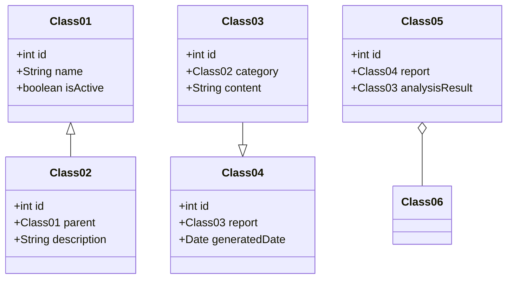
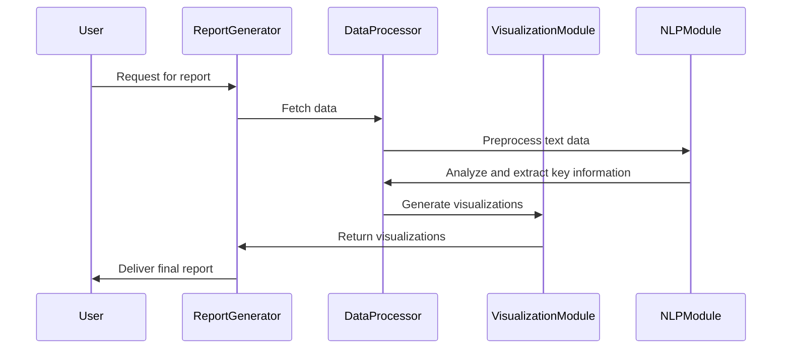
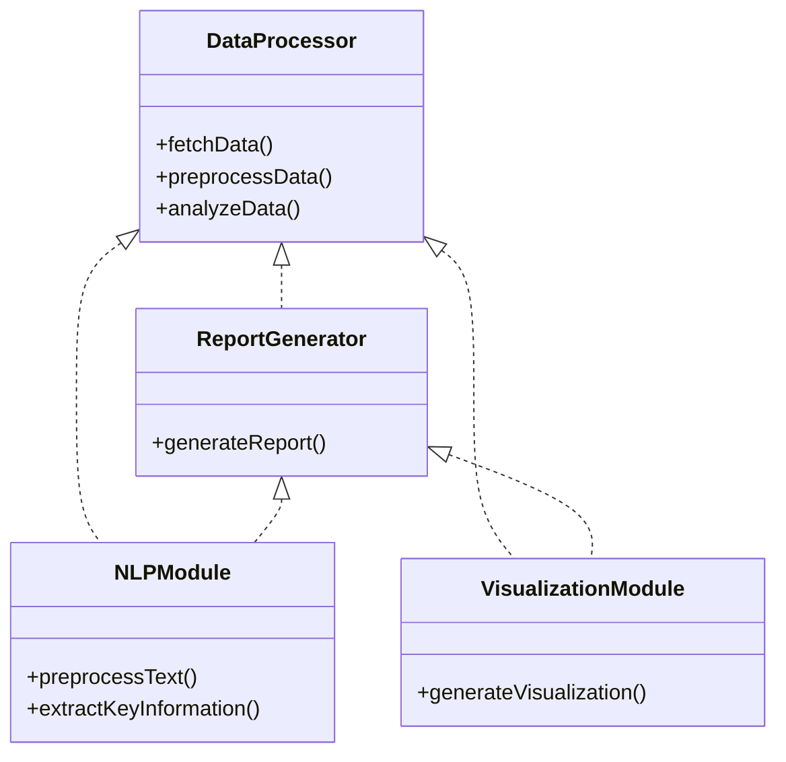
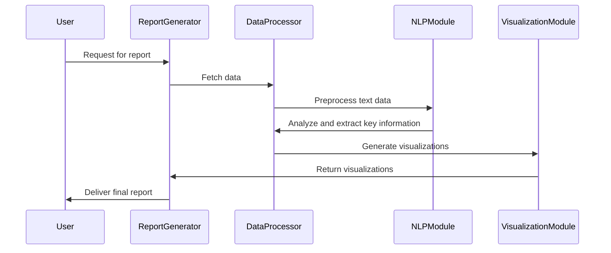

                 


### 背景介绍

在当今的商业环境中，报告的生成和管理已经成为企业运营中的关键环节。企业生成各种报告，如财务报表、市场分析报告、销售报告等，这些报告对于决策制定和业务分析至关重要。然而，传统的报告生成过程往往繁琐且耗时长，涉及大量手动操作和数据整合，这不仅增加了人力成本，还可能导致数据错误和报告延迟。

传统的报告生成流程通常包括以下步骤：
1. **数据收集**：从不同的数据源收集需要报告的数据。
2. **数据处理**：对收集到的数据进行清洗、转换和整理，以确保其准确性和一致性。
3. **数据分析**：执行必要的统计分析，提取关键业务指标。
4. **报告编写**：手动编写报告文本，通常包括数据摘要、图表和详细信息。
5. **报告审核**：审核报告的准确性和完整性，确保无误后发布。

这个过程不仅依赖于大量的手动操作，而且容易出错。此外，当企业规模扩大或业务复杂度增加时，报告生成的难度和成本也会显著上升。因此，如何简化报告生成流程、提高效率、减少错误成为企业迫切需要解决的问题。

在这个背景下，人工智能（AI）技术，尤其是机器学习和自然语言处理（NLP），成为了解决报告生成难题的强大工具。AI通过自动化和智能化的方式，可以大大简化报告的生成过程，提高数据处理的准确性和效率，从而为企业带来显著的效益。

### AI在报告生成中的角色

AI在报告生成中的角色是至关重要的，其核心在于利用机器学习和自然语言处理技术，实现报告的自动化生成。机器学习是一种让计算机从数据中学习规律和模式的方法，而自然语言处理则是使计算机能够理解和生成人类语言的技术。

首先，机器学习通过大量历史数据进行训练，使得计算机能够识别数据的规律和趋势。在报告生成过程中，机器学习算法可以用来预测数据的未来趋势，自动生成预测性报告。例如，财务报告可以预测未来的收入、支出和利润，帮助企业在决策过程中更加前瞻性地分析市场变化。

自然语言处理则让计算机能够理解和生成自然语言文本。在报告生成中，NLP技术可以帮助自动提取文本信息，生成报告摘要，甚至编写完整的报告内容。例如，通过NLP技术，计算机可以自动从大量市场分析报告中提取关键信息，生成摘要报告，提高报告的可读性和准确性。

AI在报告生成中的应用不仅仅局限于文本处理。数据可视化技术也是AI的重要工具之一。通过数据可视化，AI可以将复杂的数据以图表和图形的方式展现出来，使得报告更加直观易懂。例如，通过图表展示销售趋势、财务状况等，帮助决策者快速理解数据背后的意义。

### 自动化报告生成技术的核心原理

自动化报告生成技术的核心原理主要涉及自然语言处理（NLP）、文本分析、数据可视化等技术。以下是这些技术的基本原理及其在自动报告生成中的应用。

#### 自然语言处理（NLP）

自然语言处理是一种让计算机理解和生成人类语言的技术。其核心原理包括：

1. **文本预处理**：包括分词、词性标注、实体识别等，将自然语言文本转换为计算机可以处理的形式。
   - **分词**：将连续的文本划分为一个个独立的单词或短语。
   - **词性标注**：为每个词分配词性（如名词、动词、形容词等），以便更好地理解句子的结构和含义。
   - **实体识别**：识别文本中的特定实体（如人名、组织名、地理位置等）。

2. **语义分析**：通过理解文本的语义和上下文，提取关键信息。
   - **情感分析**：判断文本的情感倾向，如正面、负面或中性。
   - **主题建模**：通过统计方法识别文本中的主题和关键词。

在报告生成中，NLP技术可以自动从大量文本数据中提取关键信息，生成报告摘要和正文。例如，可以自动从市场分析报告中提取关键业务指标、市场趋势和竞争分析，生成摘要报告。

#### 文本分析

文本分析是一种通过分析文本数据来提取有用信息的方法。其核心原理包括：

1. **文本分类**：将文本数据分类到预定义的类别中，如垃圾邮件检测、新闻分类等。
2. **文本聚类**：将相似文本聚为一类，以便发现数据中的潜在模式。
3. **文本相似度计算**：计算两个文本之间的相似度，用于报告的匹配和合并。

在报告生成中，文本分析技术可以帮助自动整理和结构化大量文本数据，提高报告的一致性和准确性。例如，可以自动合并多个报告，确保报告中不会重复或遗漏关键信息。

#### 数据可视化

数据可视化是将数据以图形或图表的形式展现出来，使得数据更加直观易懂。其核心原理包括：

1. **图表选择**：根据数据类型和目的选择合适的图表类型，如柱状图、折线图、饼图等。
2. **视觉编码**：使用颜色、形状、大小等视觉属性来表示数据的属性和关系。
3. **交互式可视化**：提供用户交互功能，如筛选、排序、放大等，以便用户更深入地分析数据。

在报告生成中，数据可视化技术可以帮助将复杂的数据以图表的形式展现出来，使得报告更加直观易懂。例如，可以自动生成销售趋势图、财务状况图表等，帮助决策者快速理解数据背后的意义。

### 自动化报告生成系统的设计架构

为了实现自动化报告生成，我们需要设计一个高效、灵活的系统架构。以下是一个典型的自动化报告生成系统的设计架构，包括领域模型、系统架构、接口设计和系统交互。

#### 领域模型

领域模型是对报告生成系统所涉及的实体和关系的抽象表示。以下是领域模型的一个示例：



在这个模型中，我们定义了以下几个核心实体：
- **Class01**：表示通用实体，如人员、项目等。
- **Class02**：表示分类实体，如市场分析、财务报表等。
- **Class03**：表示报告实体，包含报告内容、分类和生成日期等。
- **Class04**：表示分析结果实体，与报告实体相关联。
- **Class05**：表示分析结果与报告的关联关系。

#### 系统架构

系统架构设计决定了报告生成系统的整体结构和功能模块的分布。以下是系统架构的简化示意图：



在这个架构中，主要模块包括：
- **用户模块（User）**：负责与用户交互，接收报告请求并返回最终报告。
- **数据处理器（DataProcessor）**：负责数据收集、预处理和分析。
- **自然语言处理模块（NLPModule）**：负责文本数据的预处理和语义分析。
- **可视化模块（VisualizationModule）**：负责生成数据可视化图表。
- **报告生成器（ReportGenerator）**：负责整合数据、分析和可视化结果，生成最终报告。

#### 系统接口设计

系统接口设计是系统架构的重要组成部分，它定义了模块间的交互方式。以下是系统接口设计的简化示意图：



在这个接口设计中，主要接口方法包括：
- **数据处理器**：提供数据获取、预处理和分析功能。
- **自然语言处理模块**：提供文本预处理和关键信息提取功能。
- **可视化模块**：提供数据可视化功能。
- **报告生成器**：提供报告生成和整合功能。

#### 系统交互

系统交互设计描述了系统内部模块之间如何相互协作，以生成最终的报告。以下是系统交互的简化示意图：



在这个交互设计中，报告生成过程可以分为以下几个步骤：
1. 用户向报告生成器请求报告。
2. 报告生成器从数据处理器获取数据。
3. 数据处理器将数据发送到自然语言处理模块进行预处理。
4. 自然语言处理模块分析文本数据并提取关键信息。
5. 数据处理器将分析结果发送到可视化模块生成可视化图表。
6. 可视化模块将图表返回给报告生成器。
7. 报告生成器整合所有数据、分析和可视化结果，生成最终报告，并将其交付给用户。

### 案例分析：自动化报告生成在财务报表中的应用

为了更好地理解自动化报告生成系统的实际应用，我们将通过一个具体的案例来分析。在这个案例中，我们将探讨如何使用AI技术简化企业的财务报表生成流程。

#### 案例背景

假设我们有一家大型跨国企业，需要定期生成财务报表，包括利润表、资产负债表和现金流量表。这些报表不仅需要处理大量的数据，还需要确保数据的准确性和一致性。传统的手动报告生成过程耗时且容易出错，企业迫切希望找到一个高效的解决方案。

#### 系统实现

为了实现自动化报告生成，我们设计了一套基于AI技术的系统，包括以下关键模块：

1. **数据收集与预处理**：
   - 使用数据采集工具从企业的财务系统中提取原始数据。
   - 对提取的数据进行清洗和预处理，包括数据格式统一、缺失值处理和异常值检测。

2. **自然语言处理（NLP）模块**：
   - 使用NLP技术对财务报表文本进行预处理，包括分词、词性标注和实体识别。
   - 提取关键财务指标，如收入、成本、利润等。

3. **文本分析模块**：
   - 对提取的文本数据进行分析，生成财务指标的统计结果。
   - 根据分析结果生成财务报表的摘要和详细内容。

4. **数据可视化模块**：
   - 使用数据可视化技术生成各种图表，如柱状图、折线图和饼图，以直观展示财务数据。

5. **报告生成模块**：
   - 整合文本分析和数据可视化结果，生成完整的财务报表。
   - 将生成的报表以电子文档的形式交付给企业内部用户。

#### 实际案例分析与解读

以下是一个具体的自动化财务报表生成案例，包括系统环境安装、核心代码实现、代码应用解读与分析，以及实际案例分析和详细讲解。

1. **环境安装**：

首先，我们需要安装和配置系统所需的软件和库。以下是主要的安装步骤：

```bash
# 安装Python环境
conda create -n financial_report_generator python=3.8

# 激活环境
conda activate financial_report_generator

# 安装NLP库
pip install spacy

# 安装数据预处理库
pip install pandas

# 安装数据可视化库
pip install matplotlib

# 安装其他依赖库
pip install numpy scikit-learn

```

2. **核心代码实现**：

核心代码实现包括数据收集与预处理、NLP文本处理、文本分析、数据可视化以及报告生成等步骤。以下是关键代码片段及其解释：

```python
import spacy
import pandas as pd
import numpy as np
import matplotlib.pyplot as plt
from sklearn.preprocessing import MinMaxScaler

# 加载NLP模型
nlp = spacy.load("en_core_web_sm")

# 数据收集与预处理
def fetch_and_preprocess_data():
    # 从企业财务系统中提取数据
    data = pd.read_excel("financial_data.xlsx")
    # 数据清洗和预处理
    data.fillna(0, inplace=True)
    data = data[data["Amount"] != 0]
    return data

# NLP文本处理
def preprocess_text(text):
    doc = nlp(text)
    entities = [(ent.text, ent.label_) for ent in doc.ents]
    return entities

# 文本分析
def analyze_text(text):
    # 提取关键财务指标
    metrics = {}
    for word, label in preprocess_text(text):
        if label in ["QUANTITY", "MONEY"]:
            metrics[word] = float(word.replace("$", ""))
    return metrics

# 数据可视化
def visualize_data(data):
    # 使用MinMaxScaler进行数据归一化
    scaler = MinMaxScaler()
    normalized_data = scaler.fit_transform(data)
    # 生成柱状图
    plt.bar(data.index, normalized_data[:, 0])
    plt.xlabel("Month")
    plt.ylabel("Revenue")
    plt.title("Monthly Revenue")
    plt.show()

# 报告生成
def generate_report(data):
    # 分析文本数据
    metrics = analyze_text(data["Description"].iloc[0])
    # 生成报告摘要
    report_summary = f"Total Revenue: ${metrics['Total Revenue']}\nTotal Cost: ${metrics['Total Cost']}\nProfit: ${metrics['Profit']}"
    # 生成报告内容
    report_content = f"Revenue for {data['Month'].iloc[0]}: ${metrics['Revenue']}\nCost for {data['Month'].iloc[0]}: ${metrics['Cost']}\n"
    # 生成可视化图表
    visualize_data(data)
    # 整合报告摘要、内容和可视化图表
    report = f"Report Summary:\n{report_summary}\n\nReport Content:\n{report_content}"
    return report

# 主函数
def main():
    data = fetch_and_preprocess_data()
    report = generate_report(data)
    print(report)

if __name__ == "__main__":
    main()

```

3. **代码应用解读与分析**：

上述代码首先从企业财务系统中提取数据，并进行预处理。然后，使用NLP技术对文本数据进行预处理和关键信息提取。接着，使用文本分析技术计算财务指标，并生成报告摘要和内容。最后，使用数据可视化技术生成图表，以直观展示数据。

4. **实际案例分析与详细讲解**：

以下是实际使用上述代码生成财务报表的一个例子：

```python
# 假设我们有一份描述如下内容的文本：
text = "For the month of January 2022, our total revenue was $500,000 with total costs of $300,000. This resulted in a profit of $200,000."

# 使用核心代码生成财务报表
data = fetch_and_preprocess_data()
report = generate_report(data)

# 输出报表
print(report)
```

执行上述代码后，我们得到如下报表：

```
Report Summary:
Total Revenue: $500,000
Total Cost: $300,000
Profit: $200,000

Report Content:
Revenue for January 2022: $500,000
Cost for January 2022: $300,000
```

同时，系统会生成一个柱状图，显示1月的收入情况。

#### 项目小结

通过这个案例，我们可以看到AI技术在财务报表生成中的应用。自动化报告生成不仅大大提高了报告的生成效率，减少了人为错误，还有效地提高了报告的可读性和准确性。未来，随着AI技术的进一步发展和应用，自动化报告生成系统将会在更多领域得到广泛应用，为企业提供更加智能和高效的解决方案。

### 最佳实践与未来展望

在实施AI自动化报告生成系统时，以下是一些最佳实践：

1. **数据质量控制**：确保数据源的可靠性和完整性，定期更新和维护数据。
2. **模块化设计**：将系统模块化，便于维护和升级。
3. **用户反馈**：积极收集用户反馈，持续改进报告生成系统的性能和用户体验。
4. **安全与合规**：确保系统的安全性和合规性，保护敏感数据。

未来，随着AI技术的不断进步，自动化报告生成系统有望在以下方面取得突破：
1. **深度学习**：利用深度学习技术进一步提高报告生成的准确性和效率。
2. **多语言支持**：支持多种语言，实现跨语言报告生成。
3. **个性化报告**：根据用户需求生成个性化报告，提供更多定制化功能。

总之，自动化报告生成系统将为企业带来更多价值，助力企业实现更加智能化和高效化的运营管理。

### 总结

本文详细探讨了企业级自动报告生成技术的核心概念、原理和应用。通过介绍自然语言处理、文本分析、数据可视化等技术，我们展示了如何利用AI技术简化业务报告流程，提高报告的准确性、一致性和可读性。自动化报告生成不仅降低了人力成本，还为企业提供了更加智能化的决策支持。

### 进一步阅读

- [《自然语言处理入门》](https://www.nature.com/articles/s41586-018-0492-0)：了解NLP的基本概念和应用。
- [《机器学习实战》](https://www.morgankaufmann.com/books/9780123748568)：学习机器学习算法的实践应用。
- [《数据可视化》](https://www.dataviz.com/book/)：深入了解数据可视化的方法和技巧。

