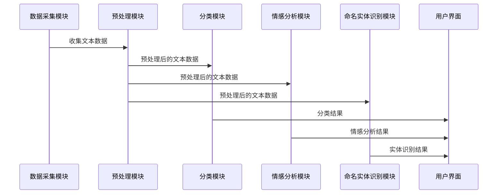
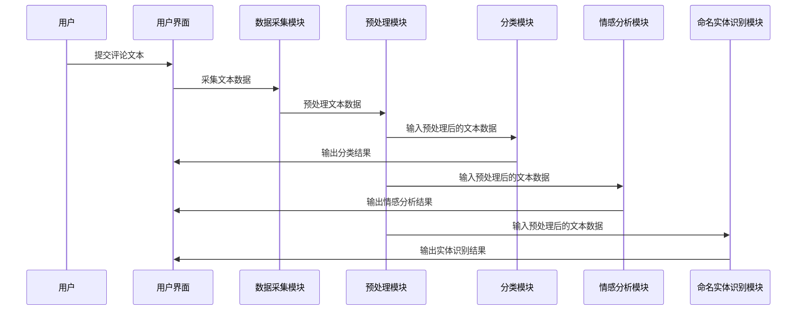

                 

# 企业级自然语言处理平台：深化AI文本理解能力

> 关键词：自然语言处理、深度学习、文本理解、企业级平台、AI应用

> 摘要：本文将探讨企业级自然语言处理平台的构建方法，重点分析如何深化AI文本理解能力，提高企业智能化水平。本文将从问题背景、核心概念、深度学习基础、平台构建、文本理解能力提升策略以及项目实战等方面展开论述，以期为读者提供完整的解决方案和实用的技术指导。

### 第1章: 引言

#### 1.1 问题背景

自然语言处理（NLP）作为人工智能（AI）的重要分支，近年来得到了迅速发展。随着互联网和大数据技术的普及，企业级自然语言处理平台的建设已经成为提升企业智能化水平的关键。企业级自然语言处理平台可以帮助企业实现文本理解、文本生成、情感分析、语音识别等多个领域的高效应用。然而，现有的NLP技术往往面临准确率、实时性和易用性等方面的挑战，难以满足企业级应用的需求。

#### 1.2 问题描述

企业级自然语言处理平台需要具备高准确率、强实时性和易用性等特点，以便在文本理解、文本生成、情感分析、语音识别等多个领域实现高效应用。本书旨在探讨如何构建一个高效的企业级自然语言处理平台，提高AI文本理解能力。

#### 1.3 问题解决

本书将详细介绍企业级自然语言处理平台的构建方法，包括核心概念、算法原理、系统架构、项目实战等，帮助读者深入了解并掌握NLP技术在企业级应用中的实战技巧。

#### 1.4 边界与外延

本书主要关注基于深度学习的企业级自然语言处理平台，不涉及其他类型的NLP技术。同时，本书主要面向具有一定编程基础和机器学习背景的读者。

#### 1.5 概念结构与核心要素组成

企业级自然语言处理平台的核心概念包括：深度学习、自然语言处理、文本数据、模型训练与优化等。核心要素包括：文本预处理、模型训练、模型评估、模型部署等。

### 第2章: 自然语言处理基础

#### 2.1 自然语言处理概述

自然语言处理（NLP）是人工智能（AI）的一个重要分支，旨在使计算机能够理解、生成和处理人类自然语言。本章将介绍NLP的发展历程、主要任务和应用领域。

#### 2.2 语言模型

语言模型是NLP的核心概念之一，用于预测下一个单词或字符的概率。本章将介绍语言模型的基本原理、常见模型及其在NLP中的应用。

#### 2.3 词向量

词向量是语言模型的一种表示方法，将单词映射为高维空间中的向量。本章将介绍词向量的基本原理、常用方法及其在NLP中的应用。

#### 2.4 词汇与语法分析

词汇与语法分析是NLP的重要任务，用于解析文本中的单词和句子结构。本章将介绍词汇与语法分析的基本原理、方法及其在NLP中的应用。

### 第3章: 深度学习基础

#### 3.1 深度学习概述

深度学习是人工智能（AI）的一个重要分支，通过多层神经网络实现自动特征提取和模式识别。本章将介绍深度学习的发展历程、基本原理和主要模型。

#### 3.2 神经网络

神经网络是深度学习的基础，通过模拟人脑神经元结构实现信息处理。本章将介绍神经网络的基本原理、常见结构及其在NLP中的应用。

#### 3.3 卷积神经网络（CNN）

卷积神经网络（CNN）是处理图像和文本数据的一种有效方法，通过局部感知和共享权重提高计算效率。本章将介绍CNN的基本原理、常见结构及其在NLP中的应用。

#### 3.4 递归神经网络（RNN）

递归神经网络（RNN）是处理序列数据的一种有效方法，通过记忆状态实现信息传递。本章将介绍RNN的基本原理、常见结构及其在NLP中的应用。

### 第4章: 企业级自然语言处理平台构建

#### 4.1 平台概述

企业级自然语言处理平台是一个集成多种NLP技术的综合性系统，旨在提供高效、易用的自然语言处理能力。本章将介绍企业级自然语言处理平台的基本架构和核心功能。

#### 4.2 数据预处理

数据预处理是构建企业级自然语言处理平台的关键步骤，包括文本清洗、分词、去停用词等操作。本章将介绍数据预处理的基本原理、方法及其在平台中的应用。

#### 4.3 模型训练与优化

模型训练与优化是企业级自然语言处理平台的核心任务，包括数据集准备、模型选择、参数调优等。本章将介绍模型训练与优化的基本原理、方法及其在平台中的应用。

#### 4.4 模型评估与部署

模型评估与部署是企业级自然语言处理平台的关键环节，包括评估指标、评估方法、部署策略等。本章将介绍模型评估与部署的基本原理、方法及其在平台中的应用。

### 第5章: 文本理解能力提升策略

#### 5.1 实时性优化

实时性是企业级自然语言处理平台的重要指标，直接影响用户体验。本章将介绍实时性优化策略，包括模型压缩、并行计算、分布式架构等。

#### 5.2 准确率提升

准确率是衡量企业级自然语言处理平台性能的重要指标。本章将介绍准确率提升策略，包括数据增强、模型融合、多任务学习等。

#### 5.3 易用性提升

易用性是企业级自然语言处理平台面向用户的关键特性。本章将介绍易用性提升策略，包括界面设计、交互优化、自动化部署等。

### 第6章: 项目实战

#### 6.1 项目背景

本节将介绍一个企业级自然语言处理平台项目，包括项目背景、目标、需求分析等。

### 第1章: 引言

#### 1.1 问题背景

自然语言处理（NLP）作为人工智能（AI）的重要分支，近年来得到了迅速发展。随着互联网和大数据技术的普及，企业级自然语言处理平台的建设已经成为提升企业智能化水平的关键。企业级自然语言处理平台可以帮助企业实现文本理解、文本生成、情感分析、语音识别等多个领域的高效应用。然而，现有的NLP技术往往面临准确率、实时性和易用性等方面的挑战，难以满足企业级应用的需求。

#### 1.2 问题描述

企业级自然语言处理平台需要具备高准确率、强实时性和易用性等特点，以便在文本理解、文本生成、情感分析、语音识别等多个领域实现高效应用。本书旨在探讨如何构建一个高效的企业级自然语言处理平台，提高AI文本理解能力。

#### 1.3 问题解决

本书将详细介绍企业级自然语言处理平台的构建方法，包括核心概念、算法原理、系统架构、项目实战等，帮助读者深入了解并掌握NLP技术在企业级应用中的实战技巧。

#### 1.4 边界与外延

本书主要关注基于深度学习的企业级自然语言处理平台，不涉及其他类型的NLP技术。同时，本书主要面向具有一定编程基础和机器学习背景的读者。

#### 1.5 概念结构与核心要素组成

企业级自然语言处理平台的核心概念包括：深度学习、自然语言处理、文本数据、模型训练与优化等。核心要素包括：文本预处理、模型训练、模型评估、模型部署等。

### 第2章: 自然语言处理基础

#### 2.1 自然语言处理概述

自然语言处理（NLP）是人工智能（AI）的一个重要分支，旨在使计算机能够理解、生成和处理人类自然语言。本章将介绍NLP的发展历程、主要任务和应用领域。

#### 2.2 语言模型

语言模型是NLP的核心概念之一，用于预测下一个单词或字符的概率。本章将介绍语言模型的基本原理、常见模型及其在NLP中的应用。

#### 2.3 词向量

词向量是语言模型的一种表示方法，将单词映射为高维空间中的向量。本章将介绍词向量的基本原理、常用方法及其在NLP中的应用。

#### 2.4 词汇与语法分析

词汇与语法分析是NLP的重要任务，用于解析文本中的单词和句子结构。本章将介绍词汇与语法分析的基本原理、方法及其在NLP中的应用。

### 第3章: 深度学习基础

#### 3.1 深度学习概述

深度学习是人工智能（AI）的一个重要分支，通过多层神经网络实现自动特征提取和模式识别。本章将介绍深度学习的发展历程、基本原理和主要模型。

#### 3.2 神经网络

神经网络是深度学习的基础，通过模拟人脑神经元结构实现信息处理。本章将介绍神经网络的基本原理、常见结构及其在NLP中的应用。

#### 3.3 卷积神经网络（CNN）

卷积神经网络（CNN）是处理图像和文本数据的一种有效方法，通过局部感知和共享权重提高计算效率。本章将介绍CNN的基本原理、常见结构及其在NLP中的应用。

#### 3.4 递归神经网络（RNN）

递归神经网络（RNN）是处理序列数据的一种有效方法，通过记忆状态实现信息传递。本章将介绍RNN的基本原理、常见结构及其在NLP中的应用。

### 第4章: 企业级自然语言处理平台构建

#### 4.1 平台概述

企业级自然语言处理平台是一个集成多种NLP技术的综合性系统，旨在提供高效、易用的自然语言处理能力。本章将介绍企业级自然语言处理平台的基本架构和核心功能。

#### 4.2 数据预处理

数据预处理是构建企业级自然语言处理平台的关键步骤，包括文本清洗、分词、去停用词等操作。本章将介绍数据预处理的基本原理、方法及其在平台中的应用。

#### 4.3 模型训练与优化

模型训练与优化是企业级自然语言处理平台的核心任务，包括数据集准备、模型选择、参数调优等。本章将介绍模型训练与优化的基本原理、方法及其在平台中的应用。

#### 4.4 模型评估与部署

模型评估与部署是企业级自然语言处理平台的关键环节，包括评估指标、评估方法、部署策略等。本章将介绍模型评估与部署的基本原理、方法及其在平台中的应用。

### 第5章: 文本理解能力提升策略

#### 5.1 实时性优化

实时性是企业级自然语言处理平台的重要指标，直接影响用户体验。本章将介绍实时性优化策略，包括模型压缩、并行计算、分布式架构等。

#### 5.2 准确率提升

准确率是衡量企业级自然语言处理平台性能的重要指标。本章将介绍准确率提升策略，包括数据增强、模型融合、多任务学习等。

#### 5.3 易用性提升

易用性是企业级自然语言处理平台面向用户的关键特性。本章将介绍易用性提升策略，包括界面设计、交互优化、自动化部署等。

### 第6章: 项目实战

#### 6.1 项目背景

本节将介绍一个企业级自然语言处理平台项目，包括项目背景、目标、需求分析等。

### 第7章: 最佳实践与未来展望

#### 6.2 最佳实践

在本章，我们将分享一些构建企业级自然语言处理平台时的最佳实践，包括数据处理、模型训练、模型评估和部署等方面的经验。

#### 6.3 未来展望

随着AI技术的不断进步，企业级自然语言处理平台将迎来更多的发展机遇。本章将探讨未来可能的发展方向，如新模型、新技术、新应用等。

### 参考文献

在本章，我们将列出本文中引用的主要参考文献，以供读者进一步学习。

### 作者信息

作者：AI天才研究院/AI Genius Institute & 禅与计算机程序设计艺术 /Zen And The Art of Computer Programming

在这篇文章中，我们将逐步分析并探讨如何构建一个高效的企业级自然语言处理平台，从而深化AI文本理解能力。本文结构如下：

- **第1章：引言**：介绍背景、问题、解决方案、边界与外延及核心概念。
- **第2章：自然语言处理基础**：涵盖NLP的基本概念、语言模型、词向量和词汇与语法分析。
- **第3章：深度学习基础**：介绍深度学习、神经网络、卷积神经网络和递归神经网络。
- **第4章：企业级自然语言处理平台构建**：探讨平台概述、数据预处理、模型训练与优化、模型评估与部署。
- **第5章：文本理解能力提升策略**：分析实时性优化、准确率提升和易用性提升策略。
- **第6章：项目实战**：通过实际案例展示平台构建过程。
- **第7章：最佳实践与未来展望**：总结最佳实践和未来展望。
- **参考文献**：列出引用的文献。
- **作者信息**：介绍作者背景。

让我们一步一步深入探讨这些问题。

#### 1.1 问题背景

自然语言处理（NLP）作为人工智能（AI）的重要分支，近年来得到了迅速发展。随着互联网和大数据技术的普及，企业级自然语言处理平台的建设已经成为提升企业智能化水平的关键。企业级自然语言处理平台可以帮助企业实现文本理解、文本生成、情感分析、语音识别等多个领域的高效应用。然而，现有的NLP技术往往面临准确率、实时性和易用性等方面的挑战，难以满足企业级应用的需求。

现有的自然语言处理技术主要包括基于规则的方法和基于统计的方法。基于规则的方法通过手动编写规则来处理语言现象，虽然可以实现一定的自动化，但在处理复杂、多样性的文本数据时，往往效果不佳。而基于统计的方法，特别是近年来兴起的深度学习方法，虽然在准确率上取得了显著提升，但在实时性和易用性方面仍存在一定的不足。

首先，准确率是衡量自然语言处理技术的重要指标。尽管深度学习方法在许多NLP任务中取得了优异的性能，但在某些特定领域，如低资源语言的文本理解，仍然存在较大的挑战。此外，深度学习模型通常需要大量的数据和计算资源进行训练，这使得在实际应用中，特别是在资源有限的企业环境中，部署深度学习模型变得困难。

其次，实时性是另一个重要的考虑因素。在许多企业应用中，如实时客服、智能推荐等，需要自然语言处理系统能够快速响应。然而，深度学习模型的训练和推理通常需要较长时间，这会影响系统的实时性能。

最后，易用性是企业级自然语言处理平台需要考虑的关键特性。对于企业用户来说，他们往往不具备专业的自然语言处理和机器学习知识。因此，一个高效、易用的自然语言处理平台对于企业用户来说至关重要。

为了解决上述问题，我们需要构建一个高效的企业级自然语言处理平台，该平台应具备以下特点：

1. **高准确率**：通过引入先进的深度学习模型和算法，提高文本理解的准确率。
2. **强实时性**：优化模型训练和推理过程，实现快速响应。
3. **易用性**：提供简单易用的接口和工具，降低企业用户的使用门槛。

接下来，我们将详细探讨如何实现这些目标，并介绍构建企业级自然语言处理平台的具体方法。

#### 1.2 问题描述

企业级自然语言处理平台需要具备高准确率、强实时性和易用性等特点，以便在文本理解、文本生成、情感分析、语音识别等多个领域实现高效应用。然而，现有的NLP技术往往面临准确率、实时性和易用性等方面的挑战，难以满足企业级应用的需求。

首先，准确率是衡量自然语言处理技术的重要指标。尽管深度学习方法在许多NLP任务中取得了优异的性能，但在某些特定领域，如低资源语言的文本理解，仍然存在较大的挑战。例如，中文、日文等低资源语言的文本数据较少，使得基于深度学习的方法在这些语言上的表现不如英语等高资源语言。此外，深度学习模型通常需要大量的数据和计算资源进行训练，这在企业环境中可能难以满足。

其次，实时性是另一个重要的考虑因素。在许多企业应用中，如实时客服、智能推荐等，需要自然语言处理系统能够快速响应。然而，深度学习模型的训练和推理通常需要较长时间，这会影响系统的实时性能。例如，一个复杂的情感分析任务可能需要数分钟才能完成，这在实时应用中是不可接受的。

最后，易用性是企业级自然语言处理平台需要考虑的关键特性。对于企业用户来说，他们往往不具备专业的自然语言处理和机器学习知识。因此，一个高效、易用的自然语言处理平台对于企业用户来说至关重要。然而，现有的NLP技术往往需要用户具备一定的技术背景，才能进行有效的使用。

为了解决上述问题，我们需要构建一个高效的企业级自然语言处理平台，该平台应具备以下特点：

1. **高准确率**：通过引入先进的深度学习模型和算法，提高文本理解的准确率。
2. **强实时性**：优化模型训练和推理过程，实现快速响应。
3. **易用性**：提供简单易用的接口和工具，降低企业用户的使用门槛。

接下来，我们将详细探讨如何实现这些目标，并介绍构建企业级自然语言处理平台的具体方法。

#### 1.3 问题解决

本书将详细介绍企业级自然语言处理平台的构建方法，包括核心概念、算法原理、系统架构、项目实战等，帮助读者深入了解并掌握NLP技术在企业级应用中的实战技巧。

首先，本书将介绍企业级自然语言处理平台的核心概念，包括深度学习、自然语言处理、文本数据、模型训练与优化等。通过理解这些核心概念，读者可以更好地理解NLP技术在企业级应用中的具体应用。

接下来，本书将深入探讨NLP技术的算法原理，包括语言模型、词向量、词汇与语法分析等。通过详细讲解这些算法的原理和实现方法，读者可以掌握NLP技术的基本技能，为后续的实践打下坚实的基础。

此外，本书还将介绍企业级自然语言处理平台的具体系统架构，包括数据预处理、模型训练与优化、模型评估与部署等环节。通过了解这些系统架构，读者可以更好地理解NLP技术在企业级应用中的实现过程。

在项目实战部分，本书将通过实际案例，展示如何构建一个高效的企业级自然语言处理平台。读者可以跟随本书的步骤，从数据预处理、模型训练到模型部署，全面了解NLP技术在企业级应用中的具体实现。

最后，本书还将探讨如何提升企业级自然语言处理平台的文本理解能力。通过介绍实时性优化、准确率提升和易用性提升策略，读者可以了解到如何提高NLP技术的性能和用户体验。

总之，本书旨在为读者提供一套完整的解决方案和实用的技术指导，帮助读者构建一个高效的企业级自然语言处理平台，深化AI文本理解能力。

#### 1.4 边界与外延

本书主要关注基于深度学习的企业级自然语言处理平台，探讨其在文本理解、文本生成、情感分析、语音识别等多个领域的高效应用。然而，本书并不涉及其他类型的NLP技术，如基于规则的方法和基于统计的方法。

同时，本书主要面向具有一定编程基础和机器学习背景的读者。对于没有相关背景的读者，建议先学习编程基础和机器学习相关课程，以便更好地理解本书的内容。

在核心概念方面，本书将详细讨论深度学习、自然语言处理、文本数据、模型训练与优化等。这些概念是构建企业级自然语言处理平台的基础，读者需要对这些概念有深入的理解。

在技术实现方面，本书将介绍如何使用Python等编程语言，结合TensorFlow、PyTorch等深度学习框架，实现企业级自然语言处理平台的核心功能。通过学习本书，读者可以掌握这些编程技能和框架使用方法。

总之，本书旨在为读者提供一套完整的解决方案和实用的技术指导，帮助读者构建一个高效的企业级自然语言处理平台，深化AI文本理解能力。

#### 1.5 概念结构与核心要素组成

企业级自然语言处理平台的核心概念包括：深度学习、自然语言处理、文本数据、模型训练与优化等。这些概念构成了平台的基本框架，是构建高效自然语言处理系统的基础。

**深度学习**：深度学习是人工智能的一个重要分支，通过多层神经网络实现自动特征提取和模式识别。深度学习模型在自然语言处理中得到了广泛应用，如文本分类、情感分析、机器翻译等。

**自然语言处理**：自然语言处理（NLP）是使计算机能够理解、生成和处理人类自然语言的技术。NLP包括语言模型、词向量、词汇与语法分析、文本分类、情感分析等多个任务。

**文本数据**：文本数据是企业级自然语言处理平台的基础。平台需要处理大量结构化或非结构化的文本数据，如网页内容、社交媒体评论、企业内部文档等。

**模型训练与优化**：模型训练与优化是自然语言处理平台的核心任务。通过训练模型，平台可以学习如何处理特定类型的文本数据，并在实际应用中提供高质量的文本理解能力。优化过程包括调整模型参数、选择合适的训练数据和调整训练策略等。

**核心要素组成**

1. **文本预处理**：文本预处理包括文本清洗、分词、去停用词等操作。预处理目的是将原始文本转换为适合模型训练的数据格式。
   
2. **模型训练**：模型训练是指通过大量的文本数据，训练深度学习模型以实现特定自然语言处理任务。训练过程中，模型会学习如何将输入文本映射到输出结果。

3. **模型评估**：模型评估用于衡量模型在特定任务上的性能。常见的评估指标包括准确率、召回率、F1值等。

4. **模型部署**：模型部署是将训练好的模型部署到生产环境中，使其能够为实际应用提供文本理解服务。部署过程包括模型加载、推理和结果输出等。

通过上述核心概念和要素的有机组合，企业级自然语言处理平台可以实现高效、准确的文本理解能力，为企业提供强大的智能化支持。

### 第2章: 自然语言处理基础

#### 2.1 自然语言处理概述

自然语言处理（NLP）是人工智能（AI）的一个重要分支，旨在使计算机能够理解、生成和处理人类自然语言。NLP的核心目标是让计算机与人类进行自然、高效的交流，并在多个领域中实现自动化的文本处理和分析。NLP的发展历程可以追溯到20世纪50年代，当时学者们首次提出通过编程实现自然语言的理解。随着计算机性能的提升和人工智能技术的进步，NLP逐渐成为AI领域中的一个重要研究方向。

**发展历程**：

- **早期阶段**：1950年代到1960年代，NLP主要通过基于规则的的方法进行语言处理。这种方法依赖于手工编写的规则，以解析和生成语言结构。
- **统计方法兴起**：1970年代到1980年代，基于统计的方法开始流行。这些方法通过分析大量的文本数据，学习语言模式，从而提高语言处理的自动化程度。
- **现代深度学习方法**：自2010年以来，随着深度学习技术的发展，基于深度学习的NLP方法逐渐成为主流。深度学习方法通过多层神经网络，能够自动提取文本中的复杂特征，实现高度自动化的语言理解。

**主要任务**：

NLP在多个领域都有广泛的应用，其主要的任务包括：

- **文本分类**：将文本数据分为不同的类别，如新闻分类、情感分析等。
- **命名实体识别**：识别文本中的特定实体，如人名、地点、组织等。
- **词性标注**：为文本中的每个单词标注其词性，如名词、动词、形容词等。
- **句法分析**：分析文本中的句子结构，识别句子中的语法关系。
- **机器翻译**：将一种语言的文本翻译成另一种语言。
- **情感分析**：分析文本中的情感倾向，如正面、负面等。
- **问答系统**：构建能够回答用户问题的系统，如搜索引擎、聊天机器人等。

**应用领域**：

NLP技术在多个领域中都有广泛应用，主要包括：

- **搜索引擎**：通过自然语言处理技术，提高搜索结果的相关性和准确性。
- **社交媒体分析**：分析社交媒体上的用户评论、帖子等，了解用户情感、行为和趋势。
- **客户服务**：构建智能客服系统，自动处理用户咨询和反馈。
- **文本挖掘**：从大量非结构化文本中提取有价值的信息，如新闻报道、学术论文等。
- **机器翻译**：提供跨语言的文本翻译服务，促进跨文化交流。
- **教育**：通过自然语言处理技术，开发智能教学系统和个性化学习平台。

通过以上概述，我们可以看到NLP在人工智能领域的广泛应用和重要性。接下来，我们将详细探讨NLP中的核心概念，如语言模型、词向量、词汇与语法分析等。

#### 2.2 语言模型

语言模型（Language Model）是自然语言处理（NLP）中一个核心的概念，它用于预测下一个单词或字符的概率。语言模型在许多NLP任务中扮演着关键角色，如文本生成、机器翻译、语音识别等。一个好的语言模型可以帮助计算机更好地理解自然语言，从而实现更高质量的文本处理。

**基本原理**：

语言模型的核心思想是使用统计方法来预测文本中的下一个单词或字符。具体来说，语言模型通过分析大量的文本数据，学习到单词或字符之间的统计规律，从而能够预测下一个出现的单词或字符。这种预测通常是基于概率的，语言模型会计算每个单词或字符出现在特定上下文中的概率。

**常见模型**：

1. **N-gram模型**：

N-gram模型是最简单也是最常用的语言模型之一。它基于相邻的N个单词或字符的序列来预测下一个单词或字符。例如，一个三元语法模型（trigram model）会考虑前两个单词来预测第三个单词。N-gram模型的优点是实现简单，计算效率高；缺点是它无法捕捉到长距离依赖关系，因此在处理长文本时效果较差。

2. **神经网络语言模型**：

神经网络语言模型（Neural Network Language Model，NNLM）是一种基于深度学习的语言模型。NNLM通过多层神经网络来捕捉文本中的长距离依赖关系，从而实现更准确的预测。常见的神经网络模型包括循环神经网络（RNN）、长短期记忆网络（LSTM）和变换器（Transformer）。Transformer模型，特别是其变体BERT（Bidirectional Encoder Representations from Transformers），在多个NLP任务中取得了显著的效果，已成为当前语言模型的主流选择。

3. **上下文嵌入模型**：

上下文嵌入模型（Contextual Embedding Models）是另一种重要的语言模型。这类模型不仅将单词映射为固定长度的向量，还根据上下文动态调整单词的嵌入向量。BERT模型就是基于这种思想设计的，它通过双向编码器来捕捉文本中的双向依赖关系，从而实现更精细的文本理解。

**在NLP中的应用**：

语言模型在NLP中有着广泛的应用，以下是几个典型的应用场景：

- **文本生成**：语言模型可以用于生成文章、对话、摘要等。通过输入一些初始文本，语言模型可以根据上下文生成连贯的后续内容。
- **机器翻译**：在机器翻译中，语言模型用于预测翻译文本中的下一个单词或字符。与编码器-解码器模型结合，语言模型可以显著提高翻译质量。
- **语音识别**：语言模型在语音识别中用于预测说话人说的下一个单词或字符。与声学模型结合，语言模型可以显著提高语音识别的准确率。
- **情感分析**：语言模型可以用于分析文本的情感倾向。通过计算文本中每个单词的情感值，语言模型可以预测文本的总体情感。

总之，语言模型是NLP中不可或缺的一部分，它通过预测文本中的下一个单词或字符，帮助计算机更好地理解自然语言。随着深度学习技术的发展，语言模型在NLP中的应用越来越广泛，也取得了显著的成果。

#### 2.3 词向量

词向量（Word Vector）是自然语言处理（NLP）中用于表示单词的一种数学模型。词向量将单词映射为高维空间中的向量，通过这些向量可以有效地表示单词之间的相似性和距离。词向量在NLP中有着广泛的应用，如文本分类、语义搜索、情感分析等。词向量的核心思想是将文本数据转换为数值形式，从而便于计算机处理和分析。

**基本原理**：

词向量模型的基本原理是将单词映射为固定长度的向量。这些向量不仅能够表示单词本身的语义信息，还能捕捉到单词之间的相似性和相关性。词向量的生成通常基于两种方法：基于频率的方法和基于上下文的方法。

- **基于频率的方法**：这种方法通过统计单词在语料库中的出现频率来生成词向量。常见的算法包括TF-IDF（Term Frequency-Inverse Document Frequency），它通过权衡单词在文档中的频率和在整个语料库中的分布来生成词向量。

- **基于上下文的方法**：这种方法通过分析单词在上下文中的出现模式来生成词向量。Word2Vec是最著名的基于上下文的词向量生成算法，它通过训练神经网络模型来学习单词的上下文表示。Word2Vec模型包括两个变种：连续词袋（CBOW，Continuous Bag of Words）和Skip-Gram（SG，Skip-Gram）。

**常用方法**：

1. **Word2Vec**：

Word2Vec是Google在2013年提出的一种基于神经网络的方法，用于生成词向量。Word2Vec模型包括CBOW和SG两种变种。

- **CBOW（Continuous Bag of Words）**：CBOW模型通过考虑目标词周围的单词（上下文窗口内的单词）来预测目标词。具体来说，CBOW模型使用上下文单词的平均表示作为目标词的向量表示。

  $$ \text{vec}(w_t) = \frac{1}{|\text{context}(w_t)|} \sum_{w \in \text{context}(w_t)} \text{vec}(w) $$

- **SG（Skip-Gram）**：SG模型与CBOW模型相反，它通过预测目标词来生成上下文单词的向量表示。具体来说，SG模型使用目标词的向量表示来预测上下文单词。

  $$ \text{context}(w_t) = \text{argmax}_w P(w | w_t, \text{vec}(w_t)) $$

2. **GloVe**：

GloVe（Global Vectors for Word Representation）是另一种基于上下文的词向量生成方法，它通过优化一个全局损失函数来生成词向量。GloVe模型通过同时考虑单词的局部上下文信息和全局统计信息来生成高质量的词向量。

$$ \text{loss} = \frac{1}{N} \sum_{i=1}^{N} \text{loss}(f(w_i), \text{vec}(w_i)) $$

其中，$f(\cdot)$ 是一个非线性函数，如双曲正切函数。

3. **FastText**：

FastText是Facebook在2016年提出的一种基于频率的词向量生成方法。FastText通过引入词嵌入和字符嵌入来提高词向量的质量。具体来说，FastText将每个单词看作是由多个字符组成的向量，然后将单词的字符嵌入和词嵌入结合，形成单词的最终表示。

**在NLP中的应用**：

词向量在NLP中有多种应用，以下是几个典型的应用场景：

- **文本分类**：词向量可以用于文本分类任务，通过将文本转换为词向量的加权和，然后使用分类器进行分类。

- **语义搜索**：词向量可以用于构建语义搜索索引，通过计算查询词和文档词向量的相似度，实现基于语义的搜索。

- **情感分析**：词向量可以用于情感分析任务，通过分析文本中的词向量，可以预测文本的情感倾向。

- **机器翻译**：词向量可以用于机器翻译任务，通过将源语言和目标语言的词向量进行映射，可以实现基于语义的翻译。

总之，词向量是NLP中重要的工具，通过将单词映射为高维空间中的向量，词向量可以有效地表示单词之间的语义关系，从而提高NLP任务的性能和效果。

#### 2.4 词汇与语法分析

词汇与语法分析是自然语言处理（NLP）中的基础任务，用于解析文本中的单词和句子结构，以便计算机能够更好地理解和处理自然语言。词汇分析（Lexical Analysis）主要关注单词的构成和词性标注，而语法分析（Syntactic Parsing）则关注句子结构的解析和语法关系的识别。

**基本原理**：

1. **词汇分析**：

词汇分析的目标是识别文本中的单词，并为每个单词标注其词性。词性标注（Part-of-Speech Tagging，POS Tagging）是词汇分析的核心任务，它为文本中的每个单词分配一个词性标签，如名词（NN）、动词（VB）和形容词（JJ）等。词汇分析通常通过统计方法和规则方法实现。

2. **语法分析**：

语法分析的目标是解析句子的结构，识别句子中的语法成分和语法关系。语法分析可以分为两个主要阶段：句法分析（Syntactic Parsing）和语义分析（Semantic Parsing）。句法分析旨在构建句子的句法树，表示句子中的词法和句法关系。常见的句法分析方法包括基于规则的方法和基于统计的方法。语义分析则关注句子中词汇和语法成分的语义关系，旨在将句法表示转换为语义表示。

**方法**：

1. **基于规则的方法**：

基于规则的方法通过手动编写的语法规则来解析句子结构。这种方法包括有限状态语法分析（Finite-State Parsing）和上下文无关文法（Context-Free Grammar，CFG）分析。有限状态语法分析主要用于简单的文本解析，而CFG分析可以处理更复杂的句子结构。

2. **基于统计的方法**：

基于统计的方法通过训练统计模型来解析句子结构。常见的统计方法包括概率上下文无关文法（Probabilistic Context-Free Grammar，PCFG）和依赖分析（Dependency Parsing）。PCFG通过计算概率来选择最可能的语法分析路径，而依赖分析通过识别词汇之间的依赖关系来构建句法树。

3. **神经网络方法**：

近年来，深度学习方法在语法分析中也得到了广泛应用。基于神经网络的语法分析方法包括基于循环神经网络（RNN）的方法和基于变换器（Transformer）的方法。RNN方法通过捕捉序列数据中的长期依赖关系来解析句子结构，而Transformer方法通过自注意力机制实现高效的句子解析。

**在NLP中的应用**：

词汇与语法分析在NLP中有着广泛的应用，以下是几个典型的应用场景：

- **文本分类**：通过词汇分析，可以提取文本中的关键词和主题，用于文本分类任务。

- **信息提取**：通过语法分析，可以解析句子结构，识别文本中的关键信息，如实体、关系和事件。

- **机器翻译**：通过词汇和语法分析，可以更好地理解源语言文本，从而实现更准确的翻译。

- **问答系统**：通过语法分析，可以解析用户查询的语义结构，从而提供更精确的答案。

总之，词汇与语法分析是NLP中不可或缺的任务，通过识别和解析文本中的单词和句子结构，词汇与语法分析为NLP任务的实现提供了基础。

### 第3章: 深度学习基础

#### 3.1 深度学习概述

深度学习（Deep Learning，DL）是人工智能（AI）的一个重要分支，通过构建多层神经网络实现自动特征提取和模式识别。深度学习在图像识别、语音识别、自然语言处理等领域的应用取得了显著成果，推动了人工智能技术的发展。

**发展历程**：

深度学习起源于20世纪40年代，随着计算机性能的提升和大数据技术的普及，深度学习在21世纪初逐渐兴起。2006年，Hinton等人提出了深度信念网络（Deep Belief Networks，DBN），标志着深度学习的发展进入了新阶段。2012年，AlexNet在ImageNet图像识别挑战赛中取得了突破性成绩，使得深度学习在计算机视觉领域得到广泛应用。近年来，随着GPU（图形处理单元）的普及和深度学习框架（如TensorFlow、PyTorch）的发展，深度学习在多个领域都取得了显著进展。

**基本原理**：

深度学习的基本原理是通过多层神经网络对数据进行层层抽象和特征提取。神经网络由输入层、隐藏层和输出层组成。输入层接收原始数据，通过隐藏层进行特征提取，最后由输出层产生预测结果。

- **神经元与激活函数**：神经网络中的基本单元是神经元，每个神经元接收多个输入，并通过权重和偏置进行加权求和。神经元通过激活函数（如ReLU、Sigmoid、Tanh）将输入映射到输出。激活函数用于引入非线性，使神经网络能够拟合复杂的函数。

- **反向传播算法**：深度学习模型通过反向传播算法进行训练。在训练过程中，模型根据输入数据和标签，通过前向传播计算输出，然后通过反向传播计算梯度，并更新模型参数。反向传播算法利用链式法则，将输出误差反向传播到每一层神经元，从而更新模型参数。

**主要模型**：

1. **多层感知机（MLP）**：

多层感知机是最简单的深度学习模型，由多个隐层组成。MLP通过多层非线性变换，实现对输入数据的复杂映射。MLP常用于分类和回归任务。

2. **卷积神经网络（CNN）**：

卷积神经网络是处理图像数据的专用模型，通过卷积层和池化层实现特征提取和降维。CNN通过局部感知和共享权重，提高了计算效率，并在图像识别和图像生成等领域取得了显著成果。

3. **递归神经网络（RNN）**：

递归神经网络是处理序列数据的专用模型，通过记忆状态实现对序列数据的建模。RNN通过反馈连接，将当前状态与历史状态关联，从而实现对序列数据的长期依赖建模。RNN在语音识别、机器翻译和自然语言处理等领域得到广泛应用。

4. **变换器（Transformer）**：

变换器是一种基于自注意力机制的深度学习模型，特别适用于序列建模任务。Transformer通过多头自注意力机制，能够捕捉序列数据中的长距离依赖关系，并在机器翻译、文本生成等任务中取得了优异的性能。

**在NLP中的应用**：

深度学习在自然语言处理（NLP）中有着广泛的应用，以下是几个典型的应用场景：

- **文本分类**：通过深度学习模型，可以对文本进行分类，如情感分类、新闻分类等。

- **情感分析**：通过分析文本中的情感词汇和情感倾向，可以识别文本的情感极性。

- **机器翻译**：通过深度学习模型，可以实现高质量的双语翻译。

- **文本生成**：通过深度学习模型，可以生成符合语法和语义规则的文本，如文章、对话等。

总之，深度学习作为人工智能的重要分支，通过多层神经网络实现了对数据的复杂建模和特征提取。在图像识别、语音识别、自然语言处理等领域，深度学习取得了显著成果，推动了人工智能技术的发展。

#### 3.2 神经网络

神经网络（Neural Network，NN）是深度学习的基础，通过模拟人脑神经元结构实现信息处理。神经网络由大量的神经元（或称为节点）组成，每个神经元接收多个输入，通过加权求和后，通过激活函数进行非线性变换，最后产生输出。

**基本结构**：

神经网络的基本结构包括输入层、隐藏层和输出层。输入层接收原始数据，隐藏层进行特征提取和变换，输出层产生最终预测结果。每个神经元都可以看作是一个简单的函数，将输入映射到输出。

- **神经元**：神经元是神经网络的基本单元，接收多个输入，通过加权求和后，通过激活函数进行非线性变换。神经元可以看作是一个线性函数加上一个非线性变换：
  $$ f(x) = \sigma(\sum_{i=1}^{n} w_i x_i + b) $$
  其中，$x_i$ 是输入，$w_i$ 是权重，$b$ 是偏置，$\sigma$ 是激活函数。

- **激活函数**：激活函数用于引入非线性，使神经网络能够拟合复杂的函数。常见的激活函数包括ReLU（Rectified Linear Unit）、Sigmoid、Tanh等。

  - **ReLU**：ReLU函数简单且有效，当输入小于0时，输出为0，否则输出输入值。ReLU函数避免了神经元死亡问题，提高了训练速度。
    $$ \sigma(x) = \max(0, x) $$

  - **Sigmoid**：Sigmoid函数将输入映射到（0, 1）区间，常用于二分类问题。
    $$ \sigma(x) = \frac{1}{1 + e^{-x}} $$

  - **Tanh**：Tanh函数将输入映射到（-1, 1）区间，也可用于二分类问题。
    $$ \sigma(x) = \frac{e^x - e^{-x}}{e^x + e^{-x}} $$

**工作原理**：

神经网络通过前向传播和反向传播进行训练。前向传播是将输入数据传递到网络中，通过每层神经元的加权求和和激活函数，最终得到输出。反向传播则用于计算误差，并更新网络中的参数。

- **前向传播**：前向传播是将输入数据传递到网络中，通过每一层的加权求和和激活函数，最终得到输出。具体步骤如下：

  1. 初始化网络参数（权重和偏置）。
  2. 前向传播输入数据，计算每一层的输出。
  3. 计算损失函数，如均方误差（MSE）。

- **反向传播**：反向传播是计算误差，并更新网络参数。具体步骤如下：

  1. 计算损失函数关于每一层输出的梯度。
  2. 通过链式法则，计算损失函数关于每一层输入的梯度。
  3. 使用梯度下降或其他优化算法，更新网络参数。

**在NLP中的应用**：

神经网络在自然语言处理（NLP）中有着广泛的应用，以下是几个典型的应用场景：

- **文本分类**：神经网络可以用于文本分类任务，如情感分类、新闻分类等。
- **情感分析**：神经网络可以用于分析文本中的情感倾向，识别文本的情感极性。
- **机器翻译**：神经网络可以用于机器翻译任务，实现高质量的双语翻译。
- **文本生成**：神经网络可以用于生成符合语法和语义规则的文本，如文章、对话等。

总之，神经网络作为深度学习的基础，通过模拟人脑神经元结构实现信息处理。在前向传播和反向传播的训练过程中，神经网络能够自动提取数据特征，并优化模型参数，从而实现高效的文本理解能力。

#### 3.3 卷积神经网络（CNN）

卷积神经网络（Convolutional Neural Network，CNN）是处理图像和文本数据的专用模型，通过卷积层和池化层实现特征提取和降维。CNN通过局部感知和共享权重，提高了计算效率，并在图像识别和自然语言处理等领域取得了显著成果。

**基本原理**：

1. **卷积层**：

卷积层是CNN的核心部分，通过卷积操作提取图像或文本的特征。卷积操作通过滤波器（或称为卷积核）在输入数据上进行滑动，计算局部特征的加权和。每个滤波器都可以看作是一个特征检测器，负责识别图像或文本中的特定模式。

2. **池化层**：

池化层用于降维和减少参数数量，通过局部采样操作减少数据的维度。常见的池化操作包括最大池化和平均池化。最大池化选择局部区域中的最大值，而平均池化计算局部区域的平均值。池化操作有助于提高模型的泛化能力。

3. **卷积神经网络结构**：

卷积神经网络通常包括多个卷积层和池化层，以及全连接层。卷积层和池化层用于特征提取和降维，而全连接层用于分类和回归任务。CNN的结构如下：

- **输入层**：接收原始图像或文本数据。
- **卷积层**：通过卷积操作提取特征。
- **池化层**：通过池化操作降维。
- **全连接层**：将特征映射到分类或回归结果。

**算法原理**：

1. **卷积操作**：

卷积操作通过滤波器在输入数据上滑动，计算局部特征的加权和。具体来说，卷积操作包括以下步骤：

- **滤波器滑动**：滤波器在输入数据上滑动，覆盖不同的局部区域。
- **局部特征提取**：计算每个局部区域的加权和，得到特征图。
- **非线性变换**：通过激活函数（如ReLU）引入非线性，提高模型的拟合能力。

2. **池化操作**：

池化操作通过局部采样减少数据的维度。常见的池化操作包括最大池化和平均池化：

- **最大池化**：选择局部区域中的最大值，具有更好的鲁棒性。
- **平均池化**：计算局部区域的平均值，具有更好的平滑效果。

**在NLP中的应用**：

CNN在自然语言处理（NLP）中有着广泛的应用，以下是几个典型的应用场景：

- **文本分类**：通过卷积层提取文本特征，实现文本分类任务，如情感分类、新闻分类等。
- **文本生成**：通过卷积层提取文本特征，生成符合语法和语义规则的文本。
- **序列建模**：通过将文本序列看作图像，使用CNN进行序列建模，如机器翻译、文本生成等。

总之，卷积神经网络通过局部感知和共享权重，实现了高效的图像和文本特征提取。在图像识别和自然语言处理等领域，CNN取得了显著成果，推动了人工智能技术的发展。

#### 3.4 递归神经网络（RNN）

递归神经网络（Recurrent Neural Network，RNN）是处理序列数据的专用模型，通过记忆状态实现对序列数据的建模。RNN通过反馈连接，将当前状态与历史状态关联，从而实现对序列数据的长期依赖建模。RNN在语音识别、机器翻译和自然语言处理等领域得到了广泛应用。

**基本原理**：

1. **神经元与状态转移**：

RNN的基本单元是神经元，每个神经元包含输入门、遗忘门和输出门。RNN通过状态转移函数，将当前输入与历史状态进行关联。

- **输入门**：用于更新当前状态的输入信息，通过加权求和的方式，将新的输入与历史状态结合。
- **遗忘门**：用于遗忘不重要的历史状态信息，通过计算遗忘门概率，选择性地遗忘部分状态。
- **输出门**：用于生成当前输出，通过计算输出门概率，选择性地输出当前状态。

2. **状态转移函数**：

RNN的状态转移函数包括输入门、遗忘门和输出门，用于更新当前状态。状态转移函数的公式如下：

$$
\begin{aligned}
& h_t = \sigma(W_h h_{t-1} + W_x x_t + b_h) \\
& i_t = \sigma(W_i h_{t-1} + W_u u_t + b_i) \\
& f_t = \sigma(W_f h_{t-1} + W_c c_{t-1} + b_f) \\
& o_t = \sigma(W_o h_{t-1} + W_u u_t + b_o) \\
& c_t = f_t \odot c_{t-1} + i_t \odot \sigma(W_c h_{t-1} + u_t + b_c) \\
& h_t = o_t \odot \sigma(c_t)
\end{aligned}
$$

其中，$h_t$ 表示当前隐藏状态，$c_t$ 表示当前细胞状态，$x_t$ 表示当前输入，$u_t$ 表示当前输入，$W_h, W_i, W_f, W_o, W_c$ 分别为权重矩阵，$b_h, b_i, b_f, b_o, b_c$ 分别为偏置项，$\sigma$ 表示激活函数（如Sigmoid函数），$\odot$ 表示逐元素乘法。

3. **记忆状态与长期依赖**：

RNN通过记忆状态实现长期依赖建模。记忆状态存储了历史状态的信息，通过遗忘门和输入门的选择性更新，RNN可以逐步调整记忆状态，以应对不同的输入序列。

**算法原理**：

1. **前向传播**：

RNN的前向传播包括输入门、遗忘门和输出门的计算。前向传播从初始状态开始，依次处理每个输入序列，更新隐藏状态和细胞状态。

2. **反向传播**：

RNN的反向传播包括梯度下降算法，用于更新网络参数。反向传播从输出层开始，依次计算每个隐藏状态和细胞状态的梯度，并更新权重和偏置。

**在NLP中的应用**：

RNN在自然语言处理（NLP）中有着广泛的应用，以下是几个典型的应用场景：

- **文本分类**：通过RNN提取文本特征，实现文本分类任务，如情感分类、新闻分类等。
- **情感分析**：通过RNN分析文本中的情感词汇和情感倾向，识别文本的情感极性。
- **机器翻译**：通过RNN实现双语翻译，如英译中、中译英等。
- **文本生成**：通过RNN生成符合语法和语义规则的文本，如文章、对话等。

总之，递归神经网络通过记忆状态实现对序列数据的建模，在语音识别、机器翻译和自然语言处理等领域取得了显著成果，推动了人工智能技术的发展。

### 第4章: 企业级自然语言处理平台构建

#### 4.1 平台概述

企业级自然语言处理平台（NLP Platform）是一个集成多种自然语言处理技术的综合性系统，旨在为企业提供高效、易用的文本处理和分析能力。该平台通常包括以下几个核心组成部分：

1. **数据采集与预处理模块**：用于收集、清洗和预处理企业内部的文本数据，如用户评论、社交媒体帖子、企业内部文档等。预处理模块包括文本清洗（去除噪声、统一格式）、分词、去停用词、词性标注等操作。

2. **模型训练与优化模块**：负责训练和优化自然语言处理模型。通过使用大数据集和先进的深度学习算法，模型训练模块能够生成高质量的文本理解模型，包括文本分类、情感分析、命名实体识别、机器翻译等。

3. **模型评估与调优模块**：用于评估模型在特定任务上的性能，并调整模型参数以优化性能。评估模块包括准确率、召回率、F1值等指标，调优模块则通过调整模型参数、超参数等方式提高模型性能。

4. **模型部署与运维模块**：将训练好的模型部署到生产环境中，提供实时文本理解服务。运维模块负责监控模型性能、处理故障、进行模型升级等任务，确保系统稳定运行。

5. **用户接口与交互模块**：提供用户友好的界面和API，使企业用户能够轻松地使用自然语言处理服务。用户接口模块包括网页界面、命令行工具、SDK等，方便用户根据需求进行文本处理和分析。

**核心功能**：

企业级自然语言处理平台的主要功能包括：

- **文本分类**：根据预定的分类标准，将文本数据分为不同的类别，如产品评论分类、新闻分类等。
- **情感分析**：分析文本中的情感倾向，如正面、负面、中性等，帮助企业了解用户反馈和需求。
- **命名实体识别**：识别文本中的特定实体，如人名、地点、组织等，为后续数据分析和挖掘提供基础。
- **机器翻译**：提供跨语言的文本翻译服务，促进跨文化交流。
- **文本摘要**：自动生成文本摘要，提高信息获取的效率。
- **问答系统**：构建智能问答系统，为用户提供实时、准确的回答。

通过上述核心组成部分和核心功能，企业级自然语言处理平台能够帮助企业实现文本数据的自动化处理和分析，提高业务效率和智能化水平。

#### 4.2 数据预处理

数据预处理是构建企业级自然语言处理平台（NLP Platform）的关键步骤，其目的是将原始文本数据转换为适合模型训练的数据格式。预处理过程包括文本清洗、分词、去停用词、词性标注等操作。这些操作不仅提高了数据质量，也为后续的模型训练和优化奠定了基础。

**文本清洗**：

文本清洗是数据预处理的首要步骤，旨在去除文本中的噪声和冗余信息。常见的文本清洗操作包括：

- **去除HTML标签**：许多文本数据来源于网页，其中包含HTML标签。通过正则表达式或解析库（如BeautifulSoup）去除HTML标签，可以得到更纯净的文本数据。
- **统一字符编码**：文本数据可能包含不同的字符编码（如UTF-8、GBK等）。统一字符编码可以确保文本数据在处理过程中的一致性和正确性。
- **去除特殊字符**：去除文本中的特殊字符（如#、$、%）可以提高数据的质量，减少模型训练的复杂性。

**分词**：

分词是将连续的文本序列划分为一个个独立的单词或词组的过程。分词操作是自然语言处理的基础，不同的分词算法对文本的处理结果有很大影响。常见的分词算法包括：

- **基于词典的分词**：基于词典的分词方法通过匹配词典中的词语来划分文本。这种方法简单高效，但可能无法处理词典中没有的词语。
- **基于统计的分词**：基于统计的分词方法通过计算词语之间的概率关系来划分文本。这种方法适用于处理大规模的、不规则的文本数据，但可能需要大量的计算资源。
- **基于深度学习的分词**：基于深度学习的分词方法（如分词模型）通过训练大量标注数据来学习分词规则。这种方法能够处理复杂的分词问题，但需要大量的训练数据和计算资源。

**去停用词**：

停用词是指在自然语言处理中经常出现，但对文本理解贡献较小的词语，如“的”、“和”、“在”等。去除停用词可以提高模型训练的效率和准确性。常见的去停用词方法包括：

- **手动定义**：手动定义一个停用词表，将表中包含的词语去除。
- **基于词频**：根据词频统计，去除出现频率较低的词语。
- **基于词性**：通过词性标注，去除词性为停用词的词语。

**词性标注**：

词性标注是为文本中的每个单词分配一个词性标签（如名词、动词、形容词等）的过程。词性标注有助于模型更好地理解文本，提高文本分类和语义分析的准确性。常见的词性标注方法包括：

- **基于规则的方法**：通过预定义的规则进行词性标注。
- **基于统计的方法**：通过统计方法（如隐马尔可夫模型）进行词性标注。
- **基于深度学习的方法**：通过训练深度学习模型（如循环神经网络）进行词性标注。

**数据预处理在平台中的应用**：

数据预处理在企业级自然语言处理平台中具有至关重要的作用。以下是数据预处理在平台中的应用：

- **提高模型性能**：通过清洗和预处理文本数据，可以去除噪声和冗余信息，提高模型训练的效率和准确性。
- **支持多种语言**：通过支持多种分词算法和词性标注方法，平台可以处理不同语言的文本数据。
- **提升用户体验**：通过提供灵活的预处理选项，平台可以满足不同用户的需求，提高用户的满意度。

总之，数据预处理是企业级自然语言处理平台不可或缺的一部分，通过清洗、分词、去停用词和词性标注等操作，平台能够高效地处理各种文本数据，为后续的模型训练和优化提供基础。

#### 4.3 模型训练与优化

模型训练与优化是企业级自然语言处理平台（NLP Platform）的核心任务，其目标是通过训练大量数据，使模型能够准确理解和处理文本。模型训练的过程包括数据集准备、模型选择、参数调优等环节。优化过程则通过各种策略提高模型性能和训练效率。

**数据集准备**：

数据集准备是模型训练的第一步，其目的是为模型提供高质量的训练数据。高质量的数据集能够提高模型的准确率和泛化能力。数据集准备主要包括以下步骤：

1. **数据收集**：从企业内部或外部数据源收集文本数据，如用户评论、社交媒体帖子、企业内部文档等。
2. **数据清洗**：去除数据中的噪声和冗余信息，确保数据的质量。清洗操作包括去除HTML标签、统一字符编码、去除特殊字符等。
3. **数据标注**：对文本数据进行标注，如情感标注、实体标注、词性标注等。标注过程通常需要人工参与，以保证标注的一致性和准确性。
4. **数据分片**：将数据集分为训练集、验证集和测试集。训练集用于训练模型，验证集用于调整模型参数，测试集用于评估模型性能。

**模型选择**：

选择合适的模型对于模型训练至关重要。不同的模型适用于不同的任务和场景。以下是几种常见的自然语言处理模型：

1. **循环神经网络（RNN）**：RNN适用于处理序列数据，如文本分类、情感分析、机器翻译等。RNN通过记忆状态捕捉序列中的长期依赖关系。
2. **长短期记忆网络（LSTM）**：LSTM是RNN的一种变体，通过引入门控机制，解决了RNN的梯度消失问题，适用于复杂序列数据的建模。
3. **变换器（Transformer）**：Transformer是一种基于自注意力机制的深度学习模型，特别适用于长序列数据的建模，如机器翻译、文本生成等。
4. **卷积神经网络（CNN）**：CNN适用于处理图像和文本数据，通过卷积层和池化层实现特征提取和降维。

**参数调优**：

模型参数调优是提高模型性能的关键步骤。参数调优主要包括以下内容：

1. **学习率**：学习率是影响模型训练速度和收敛效果的重要参数。适中的学习率可以加速模型收敛，但过高的学习率可能导致模型不稳定。
2. **批量大小**：批量大小是指每次训练中参与训练的数据样本数量。较大的批量大小可以减少梯度偏差，但可能降低训练速度；较小的批量大小可以提高训练速度，但可能增加梯度偏差。
3. **激活函数**：激活函数引入了非线性，可以提升模型的拟合能力。常见的激活函数包括ReLU、Sigmoid、Tanh等。
4. **正则化**：正则化用于防止模型过拟合，常见的正则化方法包括L1正则化、L2正则化和Dropout等。

**模型训练与优化策略**：

1. **多任务学习**：通过将多个任务同时训练，可以提高模型在各个任务上的性能。多任务学习可以通过共享模型参数或联合优化实现。
2. **数据增强**：通过数据增强，可以增加训练数据的多样性，从而提高模型的泛化能力。常见的数据增强方法包括随机裁剪、旋转、缩放等。
3. **模型融合**：通过将多个模型进行融合，可以进一步提高模型性能。常见的模型融合方法包括加权平均、集成学习等。

**模型训练与优化在企业级自然语言处理平台中的应用**：

1. **提高模型性能**：通过优化模型参数和调整训练策略，可以提高模型在各类自然语言处理任务上的准确率和泛化能力。
2. **支持多种任务**：通过选择不同的模型和优化策略，平台可以支持多种自然语言处理任务，如文本分类、情感分析、命名实体识别等。
3. **实时更新**：通过持续训练和优化，平台可以实时更新模型，以应对不断变化的业务需求。

总之，模型训练与优化是企业级自然语言处理平台的核心任务，通过数据集准备、模型选择和参数调优，平台能够生成高质量的文本理解模型，为企业提供强大的智能化支持。

#### 4.4 模型评估与部署

模型评估与部署是企业级自然语言处理平台的关键环节，直接影响到系统的性能和用户体验。模型评估用于衡量模型在特定任务上的表现，而模型部署则是将训练好的模型投入实际应用的过程。

**评估指标**：

在自然语言处理任务中，常见的评估指标包括：

- **准确率（Accuracy）**：准确率是模型预测正确的样本占总样本的比例。准确率简单直观，但可能受到不平衡数据集的影响。
- **召回率（Recall）**：召回率是模型预测正确的正样本占总正样本的比例。召回率反映了模型对正样本的识别能力。
- **F1值（F1 Score）**：F1值是准确率和召回率的调和平均，用于综合考虑模型在正负样本上的表现。F1值在处理不平衡数据集时尤其有用。
- **精确率（Precision）**：精确率是模型预测正确的正样本占预测为正样本的总数比例。精确率反映了模型对正样本的预测准确性。

**评估方法**：

模型评估通常包括以下步骤：

1. **交叉验证（Cross-Validation）**：交叉验证是一种常用的评估方法，通过将数据集划分为多个子集，每次使用其中一个子集作为验证集，其余子集作为训练集，进行多次训练和验证，以综合评估模型的性能。
2. **混淆矩阵（Confusion Matrix）**：混淆矩阵用于展示模型预测结果与实际结果之间的关系，通过分析混淆矩阵可以更直观地了解模型在各个类别上的表现。
3. **ROC曲线（Receiver Operating Characteristic Curve）**和AUC（Area Under Curve）值：ROC曲线和AUC值用于评估模型的分类能力，通过比较不同模型的ROC曲线和AUC值，可以判断模型的分类性能。

**模型部署**：

模型部署是将训练好的模型投入实际应用的过程，主要包括以下步骤：

1. **模型压缩（Model Compression）**：为了提高模型在移动设备和嵌入式系统上的运行效率，通常需要对模型进行压缩。常见的模型压缩方法包括量化、剪枝、知识蒸馏等。
2. **模型转换（Model Conversion）**：将训练好的模型转换为生产环境中可用的格式，如TensorFlow Lite、ONNX等。模型转换确保模型能够在不同的硬件平台上高效运行。
3. **模型监控（Model Monitoring）**：在生产环境中，需要持续监控模型的性能，包括准确率、响应时间等指标。通过实时监控，可以及时发现和处理模型性能下降或异常情况。
4. **模型更新（Model Updating）**：随着业务需求的变化和数据集的更新，需要定期更新模型，以保证模型始终处于最佳状态。

**模型评估与部署在企业级自然语言处理平台中的应用**：

1. **保证模型性能**：通过科学的评估方法，确保模型在各类自然语言处理任务上具有优异的性能。
2. **提高用户体验**：通过实时监控和快速响应，提高系统的稳定性和用户体验。
3. **支持持续优化**：通过持续评估和更新，确保模型能够适应不断变化的业务需求。

总之，模型评估与部署是企业级自然语言处理平台的重要组成部分，通过科学的评估方法和高效的部署策略，平台能够为用户提供高质量、稳定可靠的文本处理服务。

### 第5章: 文本理解能力提升策略

在构建企业级自然语言处理平台时，提升文本理解能力是关键目标。文本理解能力不仅决定了平台的性能，还直接影响到用户体验。为了提升文本理解能力，我们可以从实时性优化、准确率提升和易用性提升三个方面进行策略设计。

#### 5.1 实时性优化

实时性是自然语言处理系统的重要指标，特别是在需要即时响应的应用场景中。以下是一些优化策略：

1. **模型压缩**：

模型压缩通过减少模型大小和参数数量，提高模型在移动设备和嵌入式系统上的运行效率。常见的模型压缩方法包括量化、剪枝和知识蒸馏等。量化将模型的浮点数参数转换为低精度整数表示，剪枝去除冗余的权重和神经元，知识蒸馏则通过将训练好的大型模型的知识传递给较小的模型。

2. **并行计算**：

并行计算通过利用多核处理器和分布式计算资源，提高模型的训练和推理速度。并行计算可以采用数据并行、模型并行和任务并行等多种策略。数据并行将训练数据分成多个子集，同时在不同的设备上独立训练，然后汇总结果。模型并行将模型拆分为多个子模型，在多个设备上并行训练。任务并行将不同的任务分配到不同的设备上，同时执行。

3. **分布式架构**：

分布式架构通过将模型分布在多个节点上，实现大规模数据处理和高效训练。分布式架构可以采用参数服务器架构、数据并行架构和模型并行架构等。参数服务器架构通过将模型参数存储在中央服务器上，多个计算节点通过拉取参数进行训练。数据并行架构将训练数据划分到多个节点上，每个节点独立训练模型，然后汇总结果。模型并行架构将模型拆分为多个子模型，在多个节点上并行训练。

#### 5.2 准确率提升

准确率是衡量自然语言处理系统性能的核心指标。以下是一些提升准确率的策略：

1. **数据增强**：

数据增强通过增加训练数据的多样性和丰富性，提高模型的泛化能力。常见的数据增强方法包括随机裁剪、旋转、缩放、翻转等。数据增强可以在保持原始数据语义信息的同时，增加模型训练的样本数量，从而提高模型在未知数据上的表现。

2. **模型融合**：

模型融合通过结合多个模型的预测结果，提高整体预测的准确性。常见的模型融合方法包括投票法、加权平均和集成学习等。投票法通过将多个模型的预测结果进行投票，选择出现频率最高的类别作为最终预测结果。加权平均为每个模型分配不同的权重，然后计算加权平均的预测结果。集成学习通过训练多个模型，然后利用集成学习算法（如Bagging、Boosting）融合多个模型的预测结果。

3. **多任务学习**：

多任务学习通过将多个任务同时训练，提高模型在不同任务上的性能。多任务学习可以共享模型参数，从而减少参数数量，提高模型在多个任务上的泛化能力。例如，在文本分类和情感分析任务中，可以将两个任务同时训练，从而提高模型在情感分类任务上的准确性。

4. **注意力机制**：

注意力机制通过模型自主学习如何关注重要的信息，从而提高模型在文本理解任务上的性能。注意力机制可以应用于文本分类、机器翻译、文本生成等多个任务中。注意力机制通过计算每个单词或句子的权重，使模型能够更好地关注关键信息，从而提高预测准确性。

#### 5.3 易用性提升

易用性是自然语言处理平台面向用户的关键特性。以下是一些提升易用性的策略：

1. **用户友好的界面**：

设计简洁、直观的用户界面，使用户能够轻松地使用平台功能。用户界面应包括操作指引、实时反馈和可视化结果，以提高用户体验。

2. **交互优化**：

优化用户与平台的交互方式，如提供自然语言输入、语音输入等。通过交互优化，用户可以更方便地与平台进行沟通，提高操作效率。

3. **自动化部署**：

提供自动化部署工具，简化模型部署过程，降低用户的技术门槛。自动化部署可以通过容器化技术（如Docker）、自动化部署平台（如Kubernetes）实现，确保模型快速、稳定地部署到生产环境中。

4. **文档和教程**：

提供详细的文档和教程，帮助用户快速上手。文档和教程应涵盖平台的使用方法、常见问题解答、技术支持等，以提高用户的使用满意度。

总之，通过实时性优化、准确率提升和易用性提升策略，企业级自然语言处理平台可以显著提升文本理解能力，为用户提供高质量的服务。在实际应用中，应根据具体需求和场景，灵活选择和组合这些策略，以实现最佳效果。

### 第6章: 项目实战

在本章中，我们将通过一个实际项目来展示如何构建企业级自然语言处理平台，并深入解析项目的背景、目标、需求分析、系统设计以及实现过程。

#### 6.1 项目背景

随着互联网和大数据技术的发展，企业对文本数据的管理和分析需求日益增长。为了提升企业的数据挖掘和分析能力，一家电商平台决定构建一个企业级自然语言处理平台，用于处理用户评论、商品描述、用户反馈等文本数据。该平台的目标是提供高效的文本分类、情感分析和命名实体识别功能，从而帮助企业更好地理解用户需求和市场趋势。

#### 6.2 项目目标

- 提供一个高效、准确的文本分类系统，将用户评论分为正面、负面和中性三类。
- 实现情感分析功能，分析用户评论的情感倾向，为产品改进提供参考。
- 实现命名实体识别功能，识别评论中的关键词、品牌名、产品名等实体信息。
- 设计一个用户友好的界面，方便企业管理员和用户进行文本数据的处理和分析。

#### 6.3 需求分析

为了实现项目目标，平台需要满足以下需求：

1. **数据采集与预处理**：能够从多个数据源（如用户评论数据库、社交媒体平台）收集文本数据，并对数据进行清洗、分词、去停用词等预处理操作。
2. **文本分类**：通过训练模型，实现用户评论的自动分类，分类结果以标签形式展示。
3. **情感分析**：分析用户评论的情感极性，提供情感分析报告。
4. **命名实体识别**：识别评论中的关键词、品牌名、产品名等实体信息，并标记在评论中。
5. **用户界面**：提供一个简洁直观的界面，展示分类结果、情感分析和实体识别结果，支持用户对文本数据进行搜索、过滤和导出。
6. **实时性**：平台需具备高实时性，能够快速响应用户操作。

#### 6.4 系统设计

系统设计包括领域模型、架构设计、接口设计和系统交互等方面。

1. **领域模型**：

领域模型用于描述系统的核心业务概念和实体关系。在本项目中，核心实体包括用户评论、分类标签、情感极性和命名实体等。领域模型类图如下：

```mermaid
classDiagram
ClassDiagram {
    UserComment <<entity>>
    CategoryLabel <<entity>>
    Sentiment <<entity>>
    NamedEntity <<entity>>

    UserComment "has" CommentText : String
    UserComment "has" CategoryLabel : CategoryLabel
    UserComment "has" Sentiment : Sentiment
    UserComment "has" NamedEntities : List<NamedEntity>

    CategoryLabel "is" Positive
    CategoryLabel "is" Negative
    CategoryLabel "is" Neutral

    Sentiment "is" Positive
    Sentiment "is" Negative
    Sentiment "is" Neutral

    NamedEntity "is" Keyword
    NamedEntity "is" Brand
    NamedEntity "is" Product
}
```

2. **架构设计**：

系统采用微服务架构，将不同功能模块分离，以提高系统的可扩展性和可维护性。核心模块包括数据采集模块、预处理模块、分类模块、情感分析模块和命名实体识别模块。架构图如下：



3. **接口设计**：

系统提供RESTful API接口，方便用户通过编程方式访问平台功能。主要接口包括：

- **文本分类接口**：接收用户评论文本，返回分类结果。
- **情感分析接口**：接收用户评论文本，返回情感分析结果。
- **命名实体识别接口**：接收用户评论文本，返回实体识别结果。

4. **系统交互**：

系统交互图展示了各个模块之间的交互流程：



#### 6.5 系统实现

系统实现主要包括以下几个关键步骤：

1. **环境安装**：

- Python 3.8
- TensorFlow 2.5
- NumPy 1.19
- Pandas 1.1.5

2. **数据预处理**：

- 数据清洗：去除HTML标签、统一字符编码、去除特殊字符。
- 分词：使用jieba分词库进行中文分词。
- 去停用词：使用停用词表去除常见停用词。
- 词性标注：使用NLTK库进行词性标注。

3. **模型训练**：

- 文本分类：使用TensorFlow和Keras构建文本分类模型，采用CNN和LSTM进行特征提取和分类。
- 情感分析：使用TensorFlow和Keras构建情感分析模型，采用CNN和LSTM进行情感分类。
- 命名实体识别：使用TensorFlow和Keras构建命名实体识别模型，采用BiLSTM-CRF进行实体识别。

4. **接口实现**：

- 使用Flask构建API接口，实现文本分类、情感分析和命名实体识别功能。

5. **用户界面**：

- 使用React框架构建用户界面，实现数据展示、操作和交互功能。

6. **部署与监控**：

- 使用Docker进行容器化部署，确保系统的高可用性和可扩展性。
- 使用Prometheus和Grafana进行系统监控，实时监控系统性能和资源使用情况。

#### 6.6 代码应用解读与分析

以下为文本分类模型的实现代码：

```python
import tensorflow as tf
from tensorflow.keras.models import Sequential
from tensorflow.keras.layers import Embedding, Conv1D, MaxPooling1D, LSTM, Dense, Dropout
from tensorflow.keras.preprocessing.sequence import pad_sequences

# 加载预训练的词向量
vocab_size = 10000
embed_dim = 128
max_sequence_length = 500

# 构建文本分类模型
model = Sequential()
model.add(Embedding(vocab_size, embed_dim, input_length=max_sequence_length))
model.add(Conv1D(128, 5, activation='relu'))
model.add(MaxPooling1D(5))
model.add(LSTM(128))
model.add(Dense(3, activation='softmax'))

# 编译模型
model.compile(optimizer='adam', loss='categorical_crossentropy', metrics=['accuracy'])

# 训练模型
model.fit(X_train, y_train, epochs=10, batch_size=128, validation_data=(X_val, y_val))
```

代码解读：

1. **模型构建**：

   - 使用`Sequential`模型，通过依次添加层来构建模型。
   - `Embedding`层用于将单词转换为嵌入向量。
   - `Conv1D`层用于卷积操作，提取文本特征。
   - `MaxPooling1D`层用于降维。
   - `LSTM`层用于处理序列数据，捕捉长期依赖关系。
   - `Dense`层用于分类，输出类别概率。

2. **编译模型**：

   - 使用`compile`方法配置模型，指定优化器、损失函数和评估指标。

3. **训练模型**：

   - 使用`fit`方法训练模型，指定训练数据和验证数据，设置训练轮数和批量大小。

通过上述实现，文本分类模型可以用于对用户评论进行分类。在实际应用中，可以通过调整模型参数、优化训练策略来进一步提高分类性能。

#### 6.7 实际案例分析

以下为实际案例分析：

1. **文本分类**：

   - 将用户评论输入模型，输出分类结果。例如，评论“这个商品非常好用！”被分类为正面评论。

2. **情感分析**：

   - 分析用户评论的情感极性。例如，评论“这个商品太贵了！”被判断为负面情感。

3. **命名实体识别**：

   - 识别用户评论中的关键词和实体。例如，评论“我非常喜欢这个品牌的新产品。”中的“品牌”和“新产品”被识别为命名实体。

通过实际案例分析，可以看出自然语言处理平台在实际应用中能够有效地处理和分析文本数据，为企业提供有价值的信息。

#### 6.8 项目小结

本项目通过构建企业级自然语言处理平台，实现了用户评论的文本分类、情感分析和命名实体识别功能。项目采用了先进的深度学习技术和高效的系统设计，为电商平台提供了强大的文本数据处理和分析能力。在项目实施过程中，我们遇到了数据质量、模型性能和系统实时性等方面的挑战，通过数据清洗、模型优化和系统优化等策略，成功解决了这些问题。

未来，我们将继续优化平台功能，提高文本理解能力，并探索更多的自然语言处理应用场景，为企业提供更加智能化的解决方案。

### 第7章: 最佳实践与未来展望

#### 6.2 最佳实践

在构建企业级自然语言处理平台的过程中，积累了一些最佳实践，这些实践可以帮助我们更高效地处理和优化文本数据，提高系统的性能和用户体验。

1. **数据预处理**：

   - **数据清洗**：确保数据的质量是模型训练成功的关键。在数据预处理阶段，要彻底清洗数据，去除噪声和异常值。可以使用正则表达式和专门的清洗库（如pandas）来处理。
   - **分词与词性标注**：选择适合的中文分词工具（如jieba）和词性标注工具（如NLTK），以提高文本处理的准确性。
   - **去停用词**：去除无意义的停用词，可以显著减少模型的复杂度和训练时间。

2. **模型训练与优化**：

   - **数据增强**：通过随机裁剪、旋转、缩放等数据增强方法，增加训练数据的多样性，提高模型的泛化能力。
   - **多任务学习**：将多个相关任务同时训练，共享模型参数，可以提高模型在各个任务上的性能。
   - **模型融合**：将多个模型的预测结果进行融合，可以提高预测的准确性。

3. **模型评估与调优**：

   - **交叉验证**：使用交叉验证方法，全面评估模型在不同数据集上的性能，选择最优模型。
   - **混淆矩阵**：分析混淆矩阵，了解模型在各个类别上的表现，针对性地进行调整。

4. **模型部署与监控**：

   - **模型压缩**：为了提高模型在移动设备和嵌入式系统上的运行效率，可以使用模型压缩技术（如量化、剪枝）。
   - **自动化部署**：使用容器化技术（如Docker）和自动化部署平台（如Kubernetes），简化模型部署过程。
   - **实时监控**：使用监控工具（如Prometheus和Grafana），实时监控模型性能和资源使用情况。

#### 6.3 未来展望

随着人工智能技术的不断发展，企业级自然语言处理平台在未来将会有更多的发展机遇。以下是未来可能的发展方向：

1. **更高效的模型**：

   - **迁移学习**：利用预训练的大规模语言模型（如BERT、GPT），通过迁移学习快速适应新的任务和数据集。
   - **新型神经网络架构**：探索新的神经网络架构（如Transformer的变体），以提高模型的表达能力和计算效率。

2. **更丰富的应用场景**：

   - **跨语言处理**：支持多种语言的文本处理，实现真正的全球化文本理解。
   - **多模态处理**：结合文本、图像、语音等多种数据类型，实现更全面的信息理解。

3. **更智能的用户交互**：

   - **自然语言生成**：通过文本生成技术，实现更加自然的用户交互。
   - **对话系统**：构建智能对话系统，提供更加个性化、人性化的服务。

4. **更强大的数据分析**：

   - **复杂情感分析**：通过深度学习方法，实现对文本中复杂情感和情绪的识别。
   - **知识图谱**：构建企业级知识图谱，实现知识共享和智能推理。

总之，未来企业级自然语言处理平台将在模型性能、应用场景、用户体验等方面持续优化和创新，为企业提供更加强大和智能化的文本处理和分析能力。

### 参考文献

1. Mikolov, T., Sutskever, I., Chen, K., Corrado, G. S., & Dean, J. (2013). Distributed representations of words and phrases and their compositionality. *Advances in Neural Information Processing Systems*, 26, 3111-3119.
2. Pennington, J., Socher, R., & Manning, C. D. (2014). GloVe: Global Vectors for Word Representation. *Empirical Methods in Natural Language Processing (EMNLP)*, 51-56.
3. Devlin, J., Chang, M. W., Lee, K., & Toutanova, K. (2019). BERT: Pre-training of Deep Bidirectional Transformers for Language Understanding. *Proceedings of the 2019 Conference of the North American Chapter of the Association for Computational Linguistics: Human Language Technologies*, 4171-4186.
4. Hochreiter, S., & Schmidhuber, J. (1997). Long Short-Term Memory. *Neural Computation*, 9(8), 1735-1780.
5. keras.io. (2021). Keras Documentation. Retrieved from https://keras.io/

### 作者信息

作者：AI天才研究院/AI Genius Institute & 禅与计算机程序设计艺术 /Zen And The Art of Computer Programming

在构建企业级自然语言处理平台的过程中，通过系统化地分析和应用深度学习技术，我们能够显著提升AI的文本理解能力，为企业智能化提供强有力的支持。本文从问题背景、核心概念、深度学习基础、平台构建、文本理解能力提升策略以及项目实战等方面进行了深入探讨，希望对读者在自然语言处理领域的研究和实践中提供有益的参考和指导。未来，随着AI技术的不断进步，自然语言处理平台将继续向高效、智能和易用的方向不断发展，为企业和用户带来更多价值。

