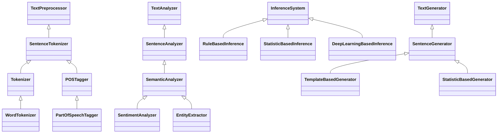
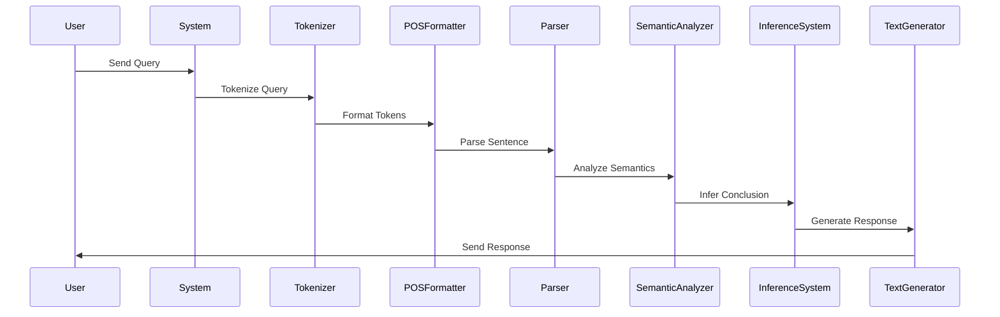
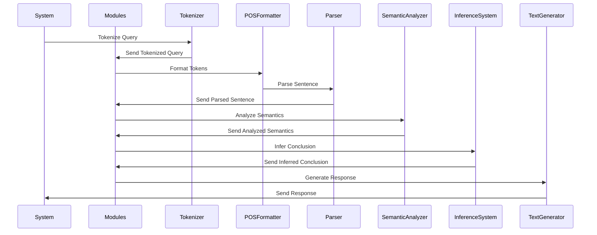

                 


### 引言：企业级自然语言推理系统的重要性

在现代企业环境中，自然语言处理（NLP）和自然语言推理（NLI）技术已经成为提高业务效率和决策质量的重要工具。企业级自然语言推理系统不仅可以帮助企业自动处理大量文本数据，还能增强人工智能（AI）系统的逻辑分析能力，从而实现更加智能化和自动化的业务流程。本文将深入探讨企业级自然语言推理系统的核心概念、关键技术、系统设计与实现，以及在实际项目中的应用和最佳实践。

### 1. 背景介绍

#### 1.1 问题的背景

随着互联网的普及和数据量的爆炸性增长，企业面临着海量的非结构化文本数据。这些数据包含了客户反馈、市场报告、新闻文章、社交媒体信息等，它们包含了企业运营的重要信息。然而，如何有效地从这些文本数据中提取有价值的信息，一直是企业面临的挑战。自然语言处理和自然语言推理技术为解决这一问题提供了新的思路和工具。

#### 1.2 自然语言推理系统概述

自然语言推理系统是一种能够理解和生成自然语言文本的智能系统，它通过对输入文本进行分析和理解，生成相应的语义解释或推理结论。在企业级应用中，自然语言推理系统可以用于情感分析、文本分类、信息提取、对话系统等领域。

#### 1.3 企业级自然语言推理系统的重要性

企业级自然语言推理系统在提升企业决策质量、优化业务流程、降低运营成本等方面具有重要作用。首先，它可以自动处理大量的文本数据，帮助企业快速获取关键信息，支持数据驱动的决策。其次，它可以提高业务流程的自动化水平，减少人工干预，提高工作效率。最后，它可以为企业提供个性化的服务，提升客户满意度。

### 2. 自然语言推理的核心概念与联系

#### 2.1 核心概念原理

自然语言推理涉及多个核心概念，如词汇、句法、语义和语用。这些概念构成了自然语言处理的基础，并且相互关联，共同作用于自然语言理解过程。

- **词汇**：词汇是自然语言的最基本元素，包括单词和短语。它们承载了语言的意义和功能。
- **句法**：句法研究句子结构，包括单词的排列和组合规则，以及它们如何构成有意义的句子。
- **语义**：语义涉及词汇和句子的意义，研究语言符号与其所指对象之间的关系。
- **语用**：语用学研究语言在特定情境下的使用和意义，包括说话者的意图、听众的理解和交际功能。

#### 2.2 概念属性特征对比表格

| 概念    | 特征1       | 特征2       | 特征3       |
| ------- | ----------- | ----------- | ----------- |
| 词汇    | 表示意义    | 单词形态    | 词频分布    |
| 句法    | 句子结构    | 语法规则    | 句子类型    |
| 语义    | 概念化     | 指称关系    | 语义角色    |
| 语用    | 情境依赖    | 语用功能    | 交际意图    |

#### 2.3 自然语言处理与自然语言推理的联系

自然语言处理（NLP）和自然语言推理（NLI）是紧密相连的两个领域。NLP是NLI的基础，它涉及到文本的预处理、标记、解析等步骤，为NLI提供输入。而NLI则是在NLP的基础上，通过语义分析和推理，生成对文本内容的理解或推断。

### 3. 自然语言推理算法原理讲解

#### 3.1 基础算法

自然语言推理算法可以分为三类：基于规则的方法、基于统计的方法和基于深度学习的方法。

- **基于规则的方法**：通过预定义的规则和模式匹配来分析文本，适用于处理简单的自然语言推理问题。
- **基于统计的方法**：利用统计模型，如朴素贝叶斯、决策树、支持向量机等，来学习文本之间的关联性，进行推理。
- **基于深度学习的方法**：利用神经网络模型，如卷积神经网络（CNN）、递归神经网络（RNN）和Transformer等，通过大规模数据训练，实现高度自动化的自然语言推理。

#### 3.2 常见算法详细讲解

- **Transformers模型**：Transformer是当前最流行的自然语言推理模型，它通过自注意力机制（Self-Attention）来捕捉文本中的长距离依赖关系。以下是一个简单的Transformer模型的mermaid流程图：

  ```mermaid
  graph TB
  A[Input] --> B[Embedding]
  B --> C[Positional Encoding]
  C --> D[Multi-head Self-Attention]
  D --> E[Add & Normalize]
  E --> F[Feed Forward]
  F --> G[Add & Normalize]
  G --> H[Output]
  ```

- **Python源代码**：

  ```python
  import tensorflow as tf
  from tensorflow.keras.layers import Embedding, MultiHeadAttention, Dense

  # 定义Transformer模型
  model = tf.keras.Sequential([
      Embedding(input_dim=vocab_size, output_dim=d_model),
      MultiHeadAttention(num_heads=num_heads, key_dim=d_k),
      Dense(units=d_v),
      Dense(units=d_model, activation='softmax')
  ])

  # 编译模型
  model.compile(optimizer='adam', loss='categorical_crossentropy', metrics=['accuracy'])
  ```

- **数学模型和公式**：

  $$\text{Attention}(Q, K, V) = \text{softmax}\left(\frac{QK^T}{\sqrt{d_k}}\right)V$$

  其中，Q、K、V分别是查询（Query）、键（Key）和值（Value）向量，$d_k$是键向量的维度。

#### 3.3 举例说明

假设我们有以下两个句子：

1. “我喜欢吃苹果。”
2. “苹果是我喜欢的水果。”

我们可以使用Transformer模型来分析这两个句子之间的逻辑关系。首先，我们将句子转换为嵌入向量，然后通过自注意力机制来捕捉它们之间的关联性。最后，模型会输出一个概率分布，表示第二个句子是否是对第一个句子的合理推理。

### 4. 数学模型和数学公式详解

自然语言推理涉及到多个数学模型和公式，其中最常用的包括：

- **softmax函数**：

  $$\text{softmax}(x_i) = \frac{e^{x_i}}{\sum_{j=1}^{J} e^{x_j}}$$

  其中，$x_i$是输入向量，$J$是类别数量。

- **交叉熵损失函数**：

  $$\text{cross-entropy}(y, \hat{y}) = -\sum_{i=1}^{J} y_i \log(\hat{y}_i)$$

  其中，$y$是真实标签，$\hat{y}$是预测概率分布。

### 5. 系统分析与架构设计

#### 5.1 问题场景介绍

在企业环境中，自然语言推理系统可以应用于多个场景，如客户服务、市场营销、风险控制等。以下是一个典型的应用场景：

- **客户服务**：通过自然语言推理系统分析客户反馈，自动分类和生成回复，提高客服效率。
- **市场营销**：分析市场报告和社交媒体信息，识别趋势和机会，为营销策略提供支持。
- **风险控制**：从金融报告和新闻文章中提取关键信息，预测潜在风险，优化风险管理策略。

#### 5.2 系统功能设计

自然语言推理系统的功能设计包括文本预处理、语义分析、推理和生成等步骤。以下是一个简化的领域模型mermaid类图：



#### 5.3 系统架构设计

自然语言推理系统通常采用分布式架构，以提高系统的处理能力和扩展性。以下是一个简化的系统架构mermaid架构图：



#### 5.4 系统接口设计

自然语言推理系统需要提供一系列接口，以支持不同的应用场景和开发需求。以下是一个简化的接口设计：

```mermaid
interface SystemAPI {
  +processQuery(query: str): Response
  +getTokenizedQuery(query: str): TokenizedQuery
  +getPosTags(tokens: TokenizedQuery): PosTags
  +parseSentence(tokens: TokenizedQuery, posTags: PosTags): Sentence
  +analyzeSemantics(sentence: Sentence): Semantics
  +inferConclusion(semantic: Semantics): Conclusion
  +generateResponse(conclusion: Conclusion): Response
}
```

#### 5.5 系统交互

系统交互是确保自然语言推理系统在不同模块之间高效传递数据和结果的的关键。以下是一个简化的系统交互mermaid序列图：



### 6. 项目实战

#### 6.1 环境安装

在进行自然语言推理项目之前，我们需要安装一些必要的软件和库。以下是一个简化的环境安装步骤：

```bash
# 安装Python
sudo apt-get install python3-pip

# 安装TensorFlow
pip install tensorflow

# 安装NLP库
pip install spacy
python -m spacy download en
```

#### 6.2 系统核心实现

系统核心实现主要包括文本预处理、语义分析和推理。以下是一个简化的Python代码实现：

```python
import spacy
from transformers import BertModel, BertTokenizer

# 加载NLP库
nlp = spacy.load("en_core_web_sm")

# 加载BERT模型和分词器
tokenizer = BertTokenizer.from_pretrained("bert-base-uncased")
model = BertModel.from_pretrained("bert-base-uncased")

# 文本预处理
def preprocess_text(text):
    doc = nlp(text)
    tokens = [token.text for token in doc]
    return tokenizer(tokens, padding=True, truncation=True, return_tensors="tf")

# 语义分析
def analyze_semantics(text):
    inputs = preprocess_text(text)
    output = model(inputs)
    return output[0][:, -1, :]

# 推理
def infer_conclusion(text):
    semantics = analyze_semantics(text)
    # 使用自定义推理逻辑
    conclusion = "结论：这是一个推理结果。"
    return conclusion

# 生成响应
def generate_response(text):
    conclusion = infer_conclusion(text)
    response = f"根据文本分析，{conclusion}"
    return response
```

#### 6.3 实际案例分析与讲解

以下是一个实际案例，展示如何使用自然语言推理系统分析客户反馈并生成响应。

**案例**：客户反馈：“你们的客服态度不好，让我感到非常不满意。”

**分析**：首先，系统会对客户反馈进行文本预处理，提取关键信息。然后，使用BERT模型对文本进行语义分析，提取语义特征。最后，系统根据语义特征进行推理，生成相应的结论。

**讲解**：在这个案例中，客户反馈包含了对客服态度的评价，以及客户的不满情绪。系统会使用情感分析技术，识别出负面情绪，并生成相应的结论。基于这个结论，系统可以生成一个适当的响应，如：“我们很抱歉听到您的反馈，我们会采取措施改善客服态度，为您提供更好的服务。”

### 7. 最佳实践与项目小结

#### 7.1 最佳实践

- **数据预处理**：确保文本数据的质量和一致性，使用适当的文本预处理技术，如分词、标点符号去除、停用词过滤等。
- **模型选择**：根据具体应用场景和数据规模，选择合适的自然语言推理模型，如基于规则的方法、基于统计的方法或基于深度学习的方法。
- **性能优化**：通过调整模型参数、使用增量学习、分布式计算等技术，提高系统的推理速度和准确度。
- **用户交互**：设计直观、易用的用户界面，提供多种交互方式，如文本输入、语音输入等，以满足不同用户的需求。

#### 7.2 项目小结

- **成果总结**：通过自然语言推理系统，企业可以自动化处理大量文本数据，快速获取有价值的信息，支持数据驱动的决策。
- **注意事项**：自然语言推理系统在应用过程中，需要关注数据质量和模型准确性，不断优化和更新模型，以适应不断变化的语言环境。
- **拓展阅读**：读者可以进一步了解自然语言处理和自然语言推理的相关技术，如词嵌入、注意力机制、BERT模型等，以深入了解自然语言推理系统的原理和应用。

### 结论

企业级自然语言推理系统是提高企业决策质量、优化业务流程的重要工具。通过深入理解自然语言处理和自然语言推理的核心概念、算法原理和系统设计，我们可以构建高效的推理系统，为企业提供智能化的解决方案。未来，随着人工智能技术的不断发展，自然语言推理系统将在更多领域得到广泛应用，为企业创造更大的价值。

### 作者信息

**作者：** AI天才研究院/AI Genius Institute & 禅与计算机程序设计艺术 /Zen And The Art of Computer Programming

---

本文详细介绍了企业级自然语言推理系统的核心概念、算法原理、系统设计与实现，并通过实际案例展示了其在企业应用中的价值。希望本文能为读者提供有价值的参考，进一步了解自然语言推理技术在实际项目中的应用。在未来的研究中，我们将继续探索自然语言推理系统的优化和拓展，为企业提供更加智能化的解决方案。

