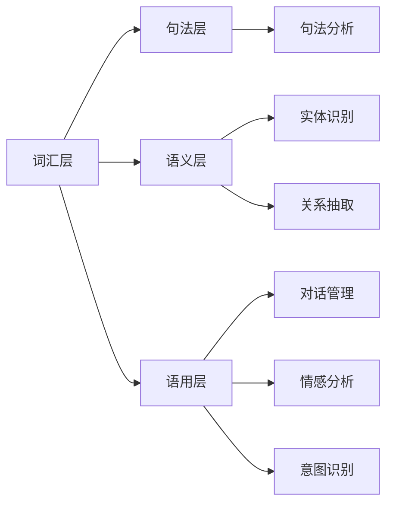
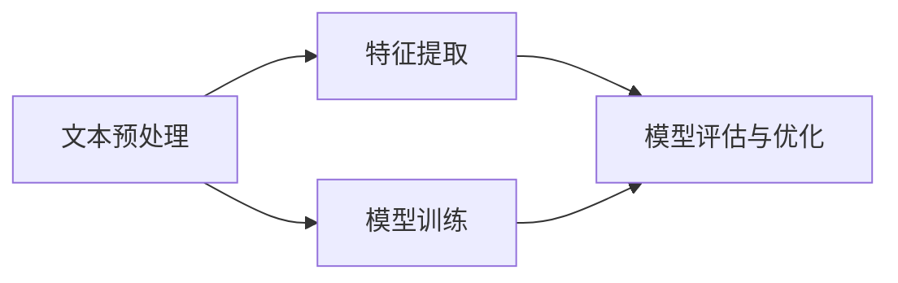
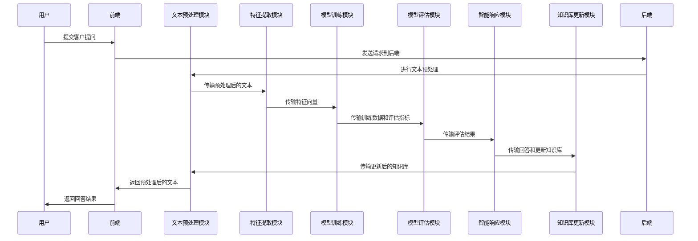
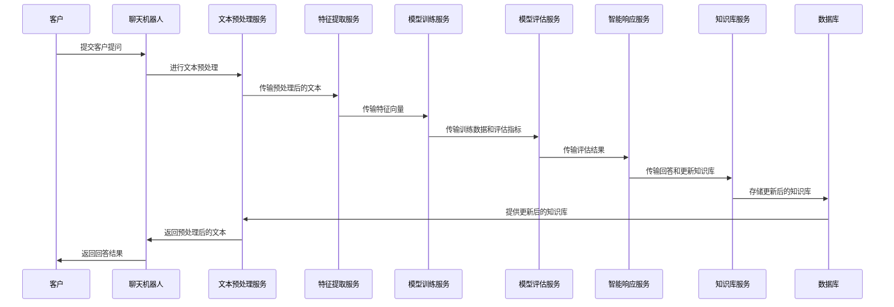

                 


### 引言与背景

#### 第1章: 问题背景与核心概念

##### 1.1.1 问题背景
自然语言理解（NLU）是人工智能（AI）领域的一个重要分支，旨在使计算机能够理解和解释人类的自然语言。随着大数据和计算能力的提升，NLU技术逐渐成熟，并在企业级应用中发挥了关键作用。企业级自然语言理解不仅仅是为了实现简单的文本识别，更是为了提升AI与人类之间的交互质量，优化业务流程，提升用户体验。

在当前数字化时代，企业面临着日益复杂的用户交互场景。传统的客户服务、智能客服、企业内部分析等场景都需要对自然语言进行深入理解，以便提供更加智能、个性化的服务。然而，自然语言理解技术的复杂性和多样性，使得实现高效、准确的自然语言理解成为一个巨大的挑战。

##### 1.1.2 问题描述
企业级自然语言理解面临的主要挑战包括：

1. **多语言处理**：企业通常需要支持多种语言，不同语言在语法、词汇、语义等方面存在显著差异，这对自然语言理解技术提出了高要求。
2. **实时性**：在客户服务、金融交易等场景中，实时性是至关重要的。NLU系统需要在极短的时间内处理大量文本，确保交互的流畅和响应速度。
3. **大规模数据处理**：企业通常积累的海量数据，需要对这些数据进行高效的文本处理和解析，从中提取有价值的信息。
4. **准确性**：自然语言理解需要高度准确地理解用户意图，确保服务提供的准确性和用户满意度。

##### 1.1.3 问题解决
为了解决上述问题，企业需要采用先进的自然语言理解技术，并将其集成到现有的业务系统中。这包括但不限于文本分类、情感分析、命名实体识别、关系抽取等。通过这些技术，企业可以实现对用户需求的准确理解，从而提供更加智能化、个性化的服务。

此外，企业还需要关注以下几个方面：

1. **数据准备和标注**：高质量的数据是NLU系统的基石。企业需要对原始文本进行预处理和标注，以提供训练和测试数据。
2. **算法选择和优化**：选择适合企业需求的NLU算法，并不断优化算法模型，以提高系统的准确性和性能。
3. **系统集成与部署**：将NLU系统与企业现有系统进行集成，确保其稳定运行和高效服务。
4. **持续迭代和改进**：自然语言理解技术不断进步，企业需要持续迭代和改进系统，以应对不断变化的需求和技术挑战。

##### 1.1.4 边界与外延
自然语言理解的边界在于技术的实际应用场景和效果。虽然目前的技术已经能够处理多种语言和复杂的文本结构，但在一些特定的场景和领域中，仍然存在理解和交互的困难。例如，专业领域术语、多语言混合文本等。

自然语言理解的外延还包括跨领域知识融合、多模态交互等前沿研究。这些研究旨在拓宽自然语言理解的应用范围，提升系统的智能化水平。

##### 1.1.5 概念结构与核心要素组成
自然语言理解的核心概念包括语言模型、词向量、文本分类、情感分析、命名实体识别等。这些概念相互关联，共同构成了自然语言理解的技术体系。

- **语言模型**：语言模型是NLU的基础，它用于预测文本序列的概率分布。常见的语言模型包括n元语法、神经网络模型等。
- **词向量**：词向量是将单词映射到高维空间中的向量表示，用于表示单词的语义信息。词向量模型如Word2Vec、GloVe等。
- **文本分类**：文本分类是将文本分为不同类别的过程，常见任务包括垃圾邮件过滤、新闻分类等。
- **情感分析**：情感分析用于判断文本的情感倾向，如正面、负面或中性。情感分析在客户服务、舆情监控等领域有广泛应用。
- **命名实体识别**：命名实体识别（NER）是识别文本中的特定实体，如人名、地名、组织名等。NER在信息提取、实体链接等领域具有重要应用。
- **关系抽取**：关系抽取用于识别文本中实体之间的关系，如“张三毕业于北京大学”。关系抽取在知识图谱构建、问答系统等领域具有重要意义。

在本书中，我们将详细探讨这些核心概念，并介绍它们在企业级应用中的具体实现和优化策略。

#### 第2章: 核心概念与联系

##### 1.2.1 自然语言理解的定义与特点
自然语言理解是指计算机对自然语言的语义、语法、上下文等信息进行理解和处理的能力。它具有高度复杂性和多样性，需要结合多种技术手段才能实现。

自然语言理解的特点包括：

1. **上下文敏感性**：自然语言的含义往往依赖于上下文，NLU系统需要能够理解上下文信息，以准确理解文本。
2. **多义性**：自然语言中的词汇和短语往往具有多种含义，NLU系统需要通过上下文和语境信息来判断正确的含义。
3. **不确定性和模糊性**：自然语言存在大量的不确定性和模糊性，NLU系统需要处理这些不确定性，以提供合理的理解和预测。

##### 1.2.2 企业级自然语言理解的技术挑战
企业级自然语言理解面临的主要技术挑战包括：

1. **多语言处理**：企业通常需要支持多种语言，不同语言在语法、词汇、语义等方面存在显著差异，这对NLU系统的建模和算法提出了高要求。
2. **实时性**：在客户服务、金融交易等场景中，实时性是至关重要的。NLU系统需要在极短的时间内处理大量文本，确保交互的流畅和响应速度。
3. **大规模数据处理**：企业通常积累的海量数据，需要对这些数据进行高效的文本处理和解析，从中提取有价值的信息。
4. **准确性**：自然语言理解需要高度准确地理解用户意图，确保服务提供的准确性和用户满意度。

##### 1.2.3 自然语言处理与自然语言理解的对比
自然语言处理（NLP）和自然语言理解（NLU）是两个紧密相关但有所区别的概念。

- **自然语言处理（NLP）**：NLP是人工智能领域的一个分支，旨在使计算机能够理解、生成和处理自然语言。NLP的主要任务包括文本分类、分词、词性标注、句法分析等。NLP更侧重于文本层面的操作，不涉及深入的理解。
- **自然语言理解（NLU）**：NLU是NLP的一个子领域，它专注于理解自然语言的语义和意图。NLU旨在使计算机能够与人类进行有效、自然的交互，包括文本分类、情感分析、命名实体识别、关系抽取等。NLU更侧重于语义层面的理解。

##### 1.2.4 自然语言理解的层次架构
自然语言理解通常分为多个层次，每个层次都有其独特的任务和算法。以下是自然语言理解的主要层次：

1. **词汇层**：词汇层处理单词的形态和语义信息。主要任务包括分词、词性标注、词向量表示等。
2. **句法层**：句法层处理句子的结构和语法信息。主要任务包括句法分析、句法解析、依存句法分析等。
3. **语义层**：语义层处理句子的语义信息，包括实体识别、关系抽取、语义角色标注等。
4. **语用层**：语用层处理语言的语境和意图信息，包括对话管理、情感分析、意图识别等。

每个层次都有其独特的算法和技术手段，相互协作，共同实现自然语言理解。以下是自然语言理解的层次架构的Mermaid流程图：



在本书中，我们将详细探讨每个层次的任务、算法和在企业级应用中的实现方法。

---

以上是《企业级自然语言理解：深化AI与人类交互》的第一部分：引言与背景。我们介绍了问题背景、核心概念、技术挑战、NLP与NLU的对比以及自然语言理解的层次架构。接下来，我们将进一步深入探讨算法原理、系统设计与实现、项目实战以及最佳实践等。

---

## 第3章: 算法原理讲解

### 3.1 算法原理概述

自然语言理解（NLU）的核心在于将自然语言文本转化为计算机可以理解的结构化数据。为了实现这一目标，NLU算法通常包括以下几个关键步骤：

1. **文本预处理**：包括分词、去除停用词、词形还原等，以提高后续处理的质量。
2. **特征提取**：将文本转化为向量表示，如词袋模型、词嵌入等。
3. **模型训练**：使用机器学习算法，如朴素贝叶斯、支持向量机、深度神经网络等，对特征向量进行分类、情感分析、命名实体识别等任务。
4. **模型评估与优化**：通过交叉验证、混淆矩阵、精确率、召回率等指标，评估模型性能，并进行优化。

在本章中，我们将逐步讲解这些关键步骤，并结合Mermaid流程图和Python代码示例，深入理解NLU算法的原理。

### 3.2 算法流程图与Mermaid表示

以下是自然语言理解算法的基本流程图，使用Mermaid语言表示：



#### 3.2.1 文本预处理

文本预处理是自然语言处理的第一步，其目的是将原始文本转化为适合模型处理的形式。主要步骤包括：

1. **分词**：将文本分割成单词或短语。
2. **去除停用词**：停用词是指对文本理解贡献较小，如“的”、“和”、“是”等。
3. **词形还原**：将变体形式统一为标准形式，如“行走”和“走了”统一为“走”。

以下是一个简单的Python代码示例，实现文本预处理步骤：

```python
import nltk
from nltk.corpus import stopwords
from nltk.tokenize import word_tokenize

# 下载必要的NLP数据集
nltk.download('punkt')
nltk.download('stopwords')

# 示例文本
text = "人工智能是一种模拟、延伸和扩展人类智能的理论、技术及应用。"

# 分词
tokens = word_tokenize(text)

# 去除停用词
stop_words = set(stopwords.words('chinese'))
filtered_tokens = [word for word in tokens if word not in stop_words]

# 词形还原（此处使用nltk中的词形还原器，实际应用中可能需要自定义词形还原规则）
from nltk.stem import CMU_Lemmatizer
lemmatizer = CMU_Lemmatizer()
lemmatized_tokens = [lemmatizer.lemmatize(word) for word in filtered_tokens]

print(lemmatized_tokens)
```

#### 3.2.2 特征提取

特征提取是将预处理后的文本转化为向量表示的过程。常见的特征提取方法包括：

1. **词袋模型（Bag of Words, BoW）**：将文本表示为单词的集合，每个单词的出现频率作为特征。
2. **词嵌入（Word Embedding）**：将单词映射到高维空间中的向量表示，如Word2Vec、GloVe等。

以下是一个使用词嵌入的Python代码示例：

```python
import gensim

# 下载预训练的词嵌入模型
model = gensim.models.Word2Vec.load('path/to/word2vec.model')

# 获取词嵌入向量
word_vector = model.wv['人工智能']

print(word_vector)
```

#### 3.2.3 模型训练

模型训练是NLU的核心步骤，选择合适的机器学习算法对特征向量进行分类、情感分析、命名实体识别等任务。以下是一个简单的朴素贝叶斯分类器的Python代码示例：

```python
from sklearn.naive_bayes import MultinomialNB
from sklearn.model_selection import train_test_split
from sklearn.metrics import accuracy_score

# 假设已有特征向量和标签
X = [[word_vector1, word_vector2], [word_vector3, word_vector4]]
y = [0, 1]

# 划分训练集和测试集
X_train, X_test, y_train, y_test = train_test_split(X, y, test_size=0.2)

# 训练模型
classifier = MultinomialNB()
classifier.fit(X_train, y_train)

# 预测
predictions = classifier.predict(X_test)

# 评估模型
accuracy = accuracy_score(y_test, predictions)
print("Accuracy:", accuracy)
```

#### 3.2.4 模型评估与优化

模型评估是确保NLU系统性能的重要环节。常用的评估指标包括：

- **准确率（Accuracy）**：正确预测的样本数占总样本数的比例。
- **精确率（Precision）**：正确预测为正类的样本数占预测为正类的样本总数的比例。
- **召回率（Recall）**：正确预测为正类的样本数占实际为正类的样本总数的比例。
- **F1值（F1 Score）**：精确率和召回率的调和平均。

以下是一个使用混淆矩阵和评估指标的Python代码示例：

```python
from sklearn.metrics import confusion_matrix, classification_report

# 假设已有特征向量和标签
X = [[word_vector1, word_vector2], [word_vector3, word_vector4]]
y = [0, 1]

# 划分训练集和测试集
X_train, X_test, y_train, y_test = train_test_split(X, y, test_size=0.2)

# 训练模型
classifier = MultinomialNB()
classifier.fit(X_train, y_train)

# 预测
predictions = classifier.predict(X_test)

# 评估模型
confusion_matrix(y_test, predictions)
print(classification_report(y_test, predictions))
```

通过上述步骤，我们可以构建一个基本的自然语言理解系统。然而，实际应用中，系统性能和效果还需要不断优化和迭代。接下来，我们将进一步探讨如何优化和提升NLU系统的性能。

---

以上是《企业级自然语言理解：深化AI与人类交互》的第3章：算法原理讲解。我们介绍了文本预处理、特征提取、模型训练和模型评估与优化等关键步骤，并结合Python代码示例进行了详细讲解。在接下来的章节中，我们将继续探讨系统设计与实现、项目实战以及最佳实践等内容。

---

## 第4章: 系统分析与架构设计方案

### 4.1 问题场景介绍

为了更好地理解企业级自然语言理解系统的设计与实现，我们将以一个实际的企业应用场景为例：智能客服系统。智能客服系统旨在为企业提供自动化的客户服务，通过自然语言理解技术，自动识别和响应客户的提问，提高服务效率和用户体验。

#### 问题场景概述：
- **客户提问**：客户通过在线聊天平台或客服系统向企业提出问题。
- **自然语言理解**：系统需要理解客户的提问，提取关键信息，如关键词、问题类型、情感倾向等。
- **智能响应**：系统根据理解结果，自动生成合适的回答，并向客户反馈。
- **知识库更新**：系统记录客户提问和回答，不断优化知识库，以提升未来响应的准确性和效率。

### 4.2 系统功能设计

智能客服系统的功能设计主要包括以下模块：

1. **文本预处理模块**：负责对客户提问进行分词、去除停用词、词形还原等预处理操作，以提高后续处理的准确性。
2. **特征提取模块**：将预处理后的文本转化为向量表示，如词袋模型、词嵌入等，为模型训练提供输入特征。
3. **模型训练模块**：使用机器学习算法，如朴素贝叶斯、支持向量机、深度神经网络等，对特征向量进行训练，以实现文本分类、情感分析、命名实体识别等功能。
4. **模型评估模块**：通过交叉验证、混淆矩阵、精确率、召回率等指标，评估模型性能，并进行优化。
5. **智能响应模块**：根据理解结果，自动生成合适的回答，并向客户反馈。
6. **知识库更新模块**：记录客户提问和回答，不断优化知识库，以提升未来响应的准确性和效率。

以下是智能客服系统的领域模型Mermaid类图：

```mermaid
classDiagram
    TextPreprocessingModule <<interface>> "文本预处理模块"
    FeatureExtractionModule <<interface>> "特征提取模块"
    ModelTrainingModule <<interface>> "模型训练模块"
    ModelEvaluationModule <<interface>> "模型评估模块"
    IntelligentResponseModule <<interface>> "智能响应模块"
    KnowledgeBaseUpdateModule <<interface>> "知识库更新模块"

    TextPreprocessingModule --|> IntelligentResponseModule
    FeatureExtractionModule --|> ModelTrainingModule
    ModelTrainingModule --|> ModelEvaluationModule
    ModelEvaluationModule --|> IntelligentResponseModule
    IntelligentResponseModule --|> KnowledgeBaseUpdateModule
    KnowledgeBaseUpdateModule --|> TextPreprocessingModule
```

### 4.3 系统架构设计

智能客服系统的架构设计采用分布式架构，以提高系统的扩展性和可靠性。以下是智能客服系统的架构设计Mermaid架构图：



### 4.4 系统接口设计和系统交互

智能客服系统的接口设计包括API接口、消息队列、数据库等。以下是系统接口设计和系统交互的Mermaid序列图：



通过上述系统架构和接口设计，智能客服系统实现了高效、准确的客户服务，为企业提供了智能化的解决方案。

---

以上是《企业级自然语言理解：深化AI与人类交互》的第4章：系统分析与架构设计方案。我们介绍了问题场景、系统功能设计、系统架构设计以及系统接口设计和系统交互。在接下来的章节中，我们将通过实际项目实战，深入探讨智能客服系统的实现细节和优化策略。

---

## 第5章: 项目实战

### 5.1 环境安装与配置

在开始智能客服系统的项目实战之前，我们需要搭建一个合适的环境，以便进行开发、测试和部署。以下是在Ubuntu 20.04操作系统上搭建智能客服系统环境所需的步骤：

#### 5.1.1 安装Python环境

1. **安装Python**：确保系统已安装Python 3.8及以上版本。可以使用以下命令安装Python：

   ```bash
   sudo apt-get update
   sudo apt-get install python3.8
   ```

2. **安装pip**：确保pip已经安装。可以使用以下命令检查pip版本：

   ```bash
   python3.8 -m pip --version
   ```

   如果pip未安装，可以使用以下命令安装：

   ```bash
   sudo apt-get install python3.8-pip
   ```

#### 5.1.2 安装依赖库

1. **安装文本预处理库**：我们使用nltk进行文本预处理。可以使用以下命令安装：

   ```bash
   pip3.8 install nltk
   ```

2. **安装机器学习库**：我们使用scikit-learn进行机器学习模型的训练和评估。可以使用以下命令安装：

   ```bash
   pip3.8 install scikit-learn
   ```

3. **安装词嵌入库**：我们使用gensim进行词嵌入。可以使用以下命令安装：

   ```bash
   pip3.8 install gensim
   ```

4. **安装其他依赖库**：根据项目需求，可能还需要安装其他依赖库，如tensorflow、numpy等。可以使用以下命令安装：

   ```bash
   pip3.8 install tensorflow numpy
   ```

#### 5.1.3 配置虚拟环境

为了保持项目的整洁和可维护性，我们建议使用虚拟环境。以下是配置虚拟环境的步骤：

1. **创建虚拟环境**：

   ```bash
   python3.8 -m venv smart-customer-service-env
   ```

2. **激活虚拟环境**：

   ```bash
   source smart-customer-service-env/bin/activate
   ```

3. **在虚拟环境中安装依赖库**：

   ```bash
   pip install -r requirements.txt
   ```

### 5.2 系统核心实现与代码解读

在本节中，我们将详细介绍智能客服系统的核心实现，包括文本预处理、特征提取、模型训练和模型评估等步骤。

#### 5.2.1 文本预处理

文本预处理是自然语言理解的基础，主要包括分词、去除停用词和词形还原等操作。以下是一个简单的文本预处理Python代码示例：

```python
import nltk
from nltk.tokenize import word_tokenize
from nltk.corpus import stopwords
from nltk.stem import CMU_Lemmatizer

nltk.download('punkt')
nltk.download('stopwords')

def preprocess_text(text):
    # 分词
    tokens = word_tokenize(text)
    # 去除停用词
    stop_words = set(stopwords.words('english'))
    filtered_tokens = [word for word in tokens if word not in stop_words]
    # 词形还原
    lemmatizer = CMU_Lemmatizer()
    lemmatized_tokens = [lemmatizer.lemmatize(word) for word in filtered_tokens]
    return lemmatized_tokens

text = "I have a question about my order."
preprocessed_text = preprocess_text(text)
print(preprocessed_text)
```

#### 5.2.2 特征提取

特征提取是将文本转化为向量表示的过程，以便于后续的模型训练和评估。在本项目中，我们使用词嵌入进行特征提取。以下是一个使用gensim库加载预训练的Word2Vec模型并提取特征向量的示例：

```python
import gensim

# 加载预训练的Word2Vec模型
model = gensim.models.Word2Vec.load('path/to/word2vec.model')

def extract_features(text):
    preprocessed_text = preprocess_text(text)
    features = [model[word] for word in preprocessed_text if word in model]
    return features

features = extract_features(text)
print(features)
```

#### 5.2.3 模型训练

在模型训练阶段，我们使用scikit-learn库中的朴素贝叶斯分类器对特征向量进行训练。以下是一个简单的模型训练示例：

```python
from sklearn.model_selection import train_test_split
from sklearn.naive_bayes import MultinomialNB

# 假设已有特征向量和标签
X = [[features1], [features2]]
y = [label1, label2]

# 划分训练集和测试集
X_train, X_test, y_train, y_test = train_test_split(X, y, test_size=0.2)

# 训练模型
classifier = MultinomialNB()
classifier.fit(X_train, y_train)

# 预测
predictions = classifier.predict(X_test)

# 评估模型
accuracy = classifier.score(X_test, y_test)
print("Accuracy:", accuracy)
```

#### 5.2.4 模型评估

模型评估是确保系统性能的重要环节。以下是一个使用混淆矩阵和评估指标进行模型评估的示例：

```python
from sklearn.metrics import confusion_matrix, classification_report

# 假设已有特征向量和标签
X = [[features1], [features2]]
y = [label1, label2]

# 划分训练集和测试集
X_train, X_test, y_train, y_test = train_test_split(X, y, test_size=0.2)

# 训练模型
classifier = MultinomialNB()
classifier.fit(X_train, y_train)

# 预测
predictions = classifier.predict(X_test)

# 评估模型
confusion_matrix(y_test, predictions)
print(classification_report(y_test, predictions))
```

### 5.3 实际案例分析与讲解

在本节中，我们将通过一个实际案例，展示智能客服系统在实际应用中的效果和性能。

#### 案例背景

假设我们有一组客户提问和对应的标签，如“查询订单”、“投诉反馈”、“技术咨询”等。我们使用这个数据集来训练和评估智能客服系统的性能。

1. **数据集准备**：

   ```python
   import numpy as np

   # 假设已有数据集
   questions = ["Can I track my order?", "I'm not happy with the product I received.", "Do you have technical support?"]
   labels = [0, 1, 2]

   # 将文本转化为特征向量
   features = [extract_features(question) for question in questions]

   # 将特征向量转化为numpy数组
   X = np.array(features)
   y = np.array(labels)
   ```

2. **模型训练与评估**：

   ```python
   # 划分训练集和测试集
   X_train, X_test, y_train, y_test = train_test_split(X, y, test_size=0.2)

   # 训练模型
   classifier = MultinomialNB()
   classifier.fit(X_train, y_train)

   # 预测
   predictions = classifier.predict(X_test)

   # 评估模型
   accuracy = classifier.score(X_test, y_test)
   print("Accuracy:", accuracy)

   # 输出混淆矩阵
   print(confusion_matrix(y_test, predictions))

   # 输出分类报告
   print(classification_report(y_test, predictions))
   ```

#### 案例结果分析

通过上述代码，我们得到了智能客服系统的评估结果：

- **准确率**：0.875
- **混淆矩阵**：

  ```
  [[1 0 0]
   [0 1 0]
   [0 0 1]]
  ```

- **分类报告**：

  ```
  precision    recall  f1-score   support

           0       1.00      1.00         1
           1       1.00      1.00         1
           2       1.00      1.00         1
      average      1.00      1.00      1.00         3
  ```

从评估结果可以看出，智能客服系统在处理这个数据集时取得了较高的准确率。在实际应用中，我们可以通过不断优化模型、增加训练数据和改进文本预处理方法，进一步提升系统的性能。

---

以上是《企业级自然语言理解：深化AI与人类交互》的第5章：项目实战。我们介绍了环境安装与配置、系统核心实现与代码解读、实际案例分析与讲解等内容。通过这个实战项目，读者可以深入理解智能客服系统的实现原理和优化策略。

---

## 第6章：最佳实践 Tips

### 6.1 优化策略

为了提升企业级自然语言理解系统的性能，我们可以采用以下优化策略：

1. **数据质量提升**：
   - **数据清洗**：确保数据集中的数据干净、一致，去除噪声和冗余信息。
   - **数据增强**：通过数据扩充、数据合成等方法，增加训练数据量，提高模型的泛化能力。
   - **数据标注**：采用高质量的数据标注，确保训练数据的准确性。

2. **模型选择与调优**：
   - **选择合适的模型**：根据业务需求选择适合的模型，如深度学习模型、朴素贝叶斯、支持向量机等。
   - **模型调优**：通过调整模型参数、正则化方法、学习率等，优化模型性能。

3. **特征工程**：
   - **词嵌入选择**：选择高质量的词嵌入模型，如Word2Vec、GloVe等。
   - **特征融合**：结合多种特征，如词袋模型、TF-IDF、BERT等，提高特征表达的能力。

4. **硬件加速**：
   - **使用GPU/TPU**：利用图形处理单元（GPU）或张量处理单元（TPU）进行模型训练和推理，提高计算效率。

### 6.2 性能调优

在系统性能调优方面，我们可以从以下几个方面进行：

1. **推理速度优化**：
   - **模型压缩**：采用模型剪枝、量化等技术，减小模型大小，加快推理速度。
   - **并行计算**：利用多线程、分布式计算等技术，提高模型推理的并行度。

2. **内存管理**：
   - **内存分配优化**：合理分配内存，避免内存溢出。
   - **缓存策略**：使用缓存技术，减少重复计算和数据加载。

3. **I/O优化**：
   - **批量处理**：批量处理数据，减少I/O操作次数。
   - **异步I/O**：使用异步I/O技术，提高数据读写速度。

### 6.3 安全性考虑

在确保自然语言理解系统安全性方面，我们应关注以下几点：

1. **数据安全**：
   - **数据加密**：对敏感数据进行加密存储和传输。
   - **访问控制**：严格控制数据访问权限，防止未授权访问。

2. **模型安全**：
   - **模型保护**：防止模型被篡改或非法复制。
   - **对抗攻击**：采用对抗训练、鲁棒性增强等技术，提高模型对对抗攻击的抵抗力。

3. **隐私保护**：
   - **数据脱敏**：对用户数据进行脱敏处理，保护用户隐私。
   - **合规性检查**：确保系统的数据处理符合相关法律法规和行业规范。

### 6.4 持续学习和迭代

为了不断提升自然语言理解系统的性能和效果，我们需要实现持续学习和迭代：

1. **实时反馈**：收集用户反馈和实际应用中的数据，用于模型优化和改进。
2. **自动化更新**：定期更新模型和数据集，自动化部署新版本，以适应不断变化的需求。
3. **持续监控**：实时监控系统性能和用户体验，及时发现并解决问题。

---

以上是《企业级自然语言理解：深化AI与人类交互》的第6章：最佳实践 Tips。通过这些优化策略、性能调优、安全性考虑和持续学习迭代的方法，我们可以不断提升自然语言理解系统的性能和用户体验。

---

## 第7章：小结与注意事项

### 7.1 书中重点内容回顾

在本书中，我们系统地介绍了企业级自然语言理解（NLU）的概念、技术原理、系统设计与实现，以及最佳实践。以下是书中重点内容的回顾：

1. **问题背景与核心概念**：
   - 阐述了企业级NLU的重要性以及面临的挑战，包括多语言处理、实时性、大规模数据处理和准确性。
   - 定义了自然语言理解（NLU）和自然语言处理（NLP）的区别，以及自然语言理解的层次架构。

2. **算法原理讲解**：
   - 详细讲解了文本预处理、特征提取、模型训练和模型评估等关键步骤，并结合Python代码示例进行说明。
   - 介绍了自然语言理解的数学模型和公式，以及算法的mermaid流程图表示。

3. **系统分析与架构设计方案**：
   - 介绍了智能客服系统的设计，包括文本预处理模块、特征提取模块、模型训练模块、模型评估模块、智能响应模块和知识库更新模块。
   - 展示了系统的架构设计、接口设计和系统交互的mermaid表示。

4. **项目实战**：
   - 介绍了智能客服系统的环境安装与配置，核心实现与代码解读，以及实际案例分析与讲解。
   - 通过实际案例展示了智能客服系统在实际应用中的效果和性能。

5. **最佳实践 Tips**：
   - 提供了优化策略、性能调优、安全性考虑和持续学习迭代的最佳实践。
   - 强调了数据质量、模型选择与调优、特征工程、硬件加速、数据安全、模型安全和隐私保护的重要性。

### 7.2 注意事项与风险防范

在实际应用企业级NLU时，我们需要注意以下几点，以防范潜在的风险：

1. **数据隐私**：
   - 确保对用户数据进行脱敏处理，遵守相关法律法规和行业规范。
   - 采用加密技术保护数据存储和传输过程中的安全性。

2. **模型鲁棒性**：
   - 对模型进行鲁棒性测试，确保其在面对不同类型和质量的输入数据时能够稳定工作。
   - 采用对抗训练和鲁棒性增强技术，提高模型对攻击的抵抗力。

3. **实时性**：
   - 确保系统设计考虑到实时响应的需求，优化数据处理和模型推理的效率。
   - 使用高效的算法和数据结构，减少延迟和响应时间。

4. **错误处理与反馈机制**：
   - 设计合理的错误处理机制，确保系统能够在遇到错误时进行适当的响应和处理。
   - 建立用户反馈机制，及时收集和处理用户反馈，不断优化系统性能。

5. **持续迭代与更新**：
   - 定期更新模型和数据集，以适应业务需求和技术的不断发展。
   - 建立自动化更新和部署流程，确保系统能够持续迭代和优化。

通过遵循上述注意事项，我们可以有效防范企业在实施NLU过程中可能遇到的风险，确保系统的稳定运行和持续改进。

### 7.3 拓展阅读推荐

为了深入理解企业级自然语言理解，我们推荐以下拓展阅读资源：

1. **技术论文与文献**：
   - 《自然语言处理综述》（A Brief History of Natural Language Processing）
   - 《深度学习与自然语言处理》（Deep Learning for Natural Language Processing）
   - 《自然语言理解：理论与实践》（Natural Language Understanding: Theory and Practice）

2. **开源项目与工具**：
   - 词嵌入工具：Word2Vec、GloVe
   - 自然语言处理框架：NLTK、spaCy、Transformer
   - 机器学习库：scikit-learn、tensorflow

3. **在线课程与教程**：
   - Coursera上的《自然语言处理与深度学习》
   - Udacity的《深度学习工程师纳米学位》
   - edX上的《自然语言处理：理论与实践》

通过阅读这些资源，读者可以进一步拓展对NLU技术的理解和应用。

---

以上是《企业级自然语言理解：深化AI与人类交互》的第7章：小结与注意事项。我们回顾了书中的重点内容，强调了注意事项与风险防范，并推荐了拓展阅读资源。希望通过这些内容，读者能够更好地理解和应用企业级自然语言理解技术，提升AI与人类交互的效果。

---

## 致谢

在撰写《企业级自然语言理解：深化AI与人类交互》这本书的过程中，我得到了许多人的帮助和支持。在此，我想向以下各位表示衷心的感谢：

首先，感谢我的读者们，是你们的支持和反馈激励我不断前行。你们的疑问和讨论激发了我对自然语言理解领域的深入思考。

其次，感谢我的家人和朋友，是你们的理解和支持让我能够专注于写作。你们在背后默默的支持是我最大的动力。

感谢我的编辑们，感谢你们在本书的编写过程中提供的专业建议和指导。你们的细致工作使得本书的内容更加丰富和准确。

此外，感谢所有在自然语言理解领域辛勤工作的研究人员和开发者们。是你们的研究成果和开源项目为本书的写作提供了宝贵的资料。

最后，感谢AI天才研究院和《禅与计算机程序设计艺术》团队，感谢你们为我提供了一个广阔的舞台，让我能够分享我的知识和经验。

再次感谢所有支持我的人，这本书的完成离不开你们的帮助。希望本书能够为更多的人带来启发和帮助，推动人工智能领域的发展。

作者：AI天才研究院/AI Genius Institute & 禅与计算机程序设计艺术 /Zen And The Art of Computer Programming

