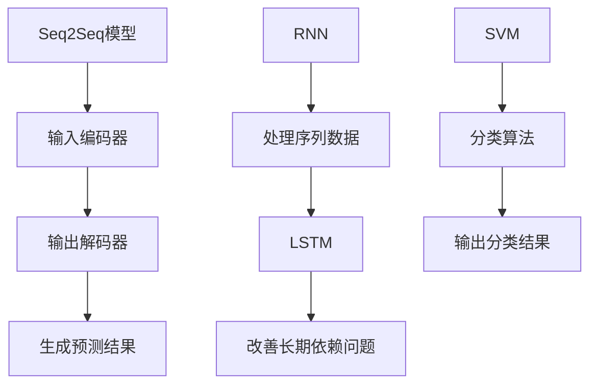
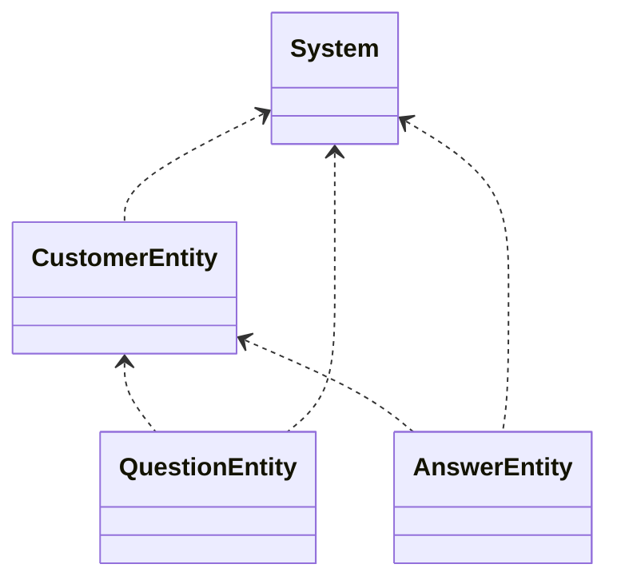
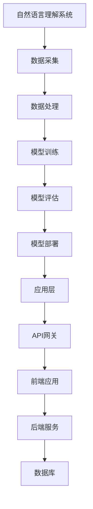
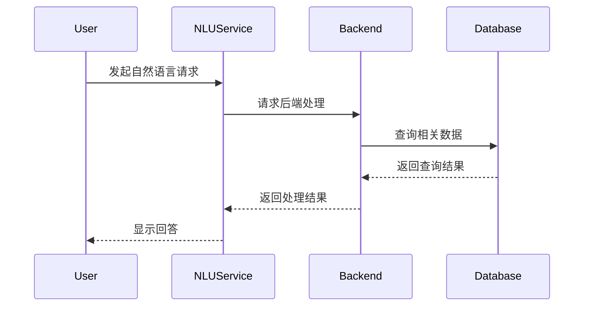

                 

## 企业级自然语言理解：深化AI语言交互能力

### 关键词：自然语言理解、企业级应用、AI语言交互、深度学习、机器学习

### 摘要：
本文旨在深入探讨企业级自然语言理解（NLU）技术，分析其在提升AI语言交互能力方面的关键作用。通过详细解读自然语言处理（NLP）、机器学习（ML）和深度学习（DL）等核心技术，以及展示具体的算法原理和实践案例，本文将为企业提供一套系统化的解决方案，以深化AI在语言交互领域的应用，从而提升企业的智能化水平和市场竞争力。

### Step 1: 背景介绍

#### 问题背景
随着人工智能技术的飞速发展，自然语言处理（NLP）技术在企业和各个行业中得到了广泛应用。企业级自然语言理解作为一种深层次的语言交互能力，对于提升企业的智能化水平和竞争力具有重要意义。从客户服务到内部通信，从智能助手到决策支持系统，自然语言理解技术正在深刻改变企业的运营模式。

#### 问题描述
企业在实现自然语言理解过程中，面临着技术选型、数据处理、模型训练、部署应用等多方面的挑战。例如，如何处理大规模的异构数据？如何优化模型的训练效率？如何确保模型的泛化能力和鲁棒性？这些问题的解决直接影响到企业级自然语言理解的效果和实用性。

#### 问题解决
为了有效地深化AI语言交互能力，企业需要从多个维度进行考虑和规划。首先，明确技术选型和架构设计，选择适合企业业务场景的NLP技术。其次，加强数据处理和清洗，确保数据质量和模型的训练效果。再次，优化模型训练和调优，提高模型的性能和泛化能力。最后，部署和应用自然语言理解系统，实现与业务系统的无缝集成。

#### 边界与外延
本文主要关注企业级自然语言理解的深化，但不涉及基础NLP技术的讲解。同时，本文将以中文自然语言处理为例，但很多技术原理和解决方案也适用于其他语言。在核心概念和算法原理部分，本文将结合具体案例进行详细讲解，以帮助读者更好地理解和应用相关技术。

#### 概念结构与核心要素组成
- **企业级自然语言理解**：涉及NLP技术、数据处理、模型训练、应用场景等多个核心要素。
- **语言交互能力**：指AI系统能够理解和生成自然语言的能力，包括语音识别、语义理解、文本生成等。

### Step 2: 核心概念与联系

#### 核心概念
- **自然语言处理（NLP）**：处理和理解人类语言的技术，包括文本分类、实体识别、情感分析等。
- **机器学习（ML）**：利用数据自动学习和改进的系统，包括决策树、支持向量机等。
- **深度学习（DL）**：基于多层神经网络的机器学习技术，包括卷积神经网络（CNN）、循环神经网络（RNN）等。
- **自然语言理解（NLU）**：AI系统理解和生成自然语言的能力，包括对话系统、文本生成等。
- **交互式对话系统**：与用户进行实时对话的AI系统，包括聊天机器人、虚拟助手等。

#### 概念属性特征对比表格

| 概念         | 属性特征                             | 关联概念                      |
| ------------ | ---------------------------------- | --------------------------- |
| 自然语言处理（NLP） | 处理和理解人类语言的技术           | 语音识别、文本分析           |
| 机器学习（ML）     | 利用数据自动学习和改进的系统       | 决策树、支持向量机           |
| 深度学习（DL）     | 基于多层神经网络的机器学习技术     | 卷积神经网络、循环神经网络   |
| 自然语言理解（NLU） | AI系统理解和生成自然语言的能力     | 对话系统、文本生成           |
| 交互式对话系统     | 与用户进行实时对话的AI系统         | 聊天机器人、虚拟助手         |

#### ER实体关系图架构
```mermaid
erDiagram
  NLP -->|使用| ML
  ML -->|基于| DL
  NLP -->|实现| NLU
  NLU -->|应用| 对话系统
```

### Step 3: 算法原理讲解

#### 算法原理

1. **序列到序列（Seq2Seq）模型**
   - 用于将一种序列数据转换成另一种序列数据，如机器翻译。
   - 包含输入编码器（Encoder）和输出解码器（Decoder）。

2. **递归神经网络（RNN）**
   - 用于处理序列数据，具有记忆能力。
   - 能够捕捉序列中的长期依赖关系。

3. **长短时记忆网络（LSTM）**
   - LSTM是RNN的一种改进，能够更好地处理长期依赖问题。

4. **支持向量机（SVM）**
   - 一种分类算法，用于分类问题。

#### Mermaid流程图



#### Python源代码

```python
# Example of a simple RNN model using TensorFlow and Keras
import tensorflow as tf
from tensorflow.keras.models import Sequential
from tensorflow.keras.layers import SimpleRNN

# Create the model
model = Sequential()
model.add(SimpleRNN(units=50, activation='relu', return_sequences=True))
model.add(SimpleRNN(units=50, activation='relu'))
model.compile(optimizer='adam', loss='mse')

# Train the model
model.fit(x_train, y_train, epochs=100, verbose=0)
```

#### 算法原理的数学模型和公式
$$
y = \sigma(W_h \cdot [h_{t-1}, x_t] + b)
$$

其中，$y$ 为输出，$W_h$ 为权重矩阵，$b$ 为偏置项，$\sigma$ 为激活函数（通常使用Sigmoid函数或ReLU函数）。

### Step 4: 系统分析与架构设计方案

#### 问题场景介绍
随着企业业务规模的增长和复杂度的提升，传统的业务流程和沟通方式已经难以满足高效、智能化的需求。企业需要一种能够处理自然语言交互的系统，以提高沟通效率、降低运营成本、提升客户满意度。

#### 项目介绍
本项目的目标是开发一个企业级自然语言理解系统，该系统能够处理企业内部和客户之间的自然语言交互，实现智能问答、情感分析、自动分类等功能，从而提升企业的智能化水平。

#### 系统功能设计（领域模型Mermaid类图）



#### 系统架构设计（Mermaid架构图）



#### 系统接口设计和系统交互（Mermaid序列图）



### Step 5: 项目实战

#### 环境安装
在进行项目实战之前，需要安装必要的开发环境和工具。以下是安装步骤：

1. 安装Python（3.7或更高版本）
2. 安装TensorFlow和Keras
3. 安装其他相关库，如NumPy、Pandas等

#### 系统核心实现源代码
以下是一个简单的RNN模型实现示例：

```python
# Example of a simple RNN model using TensorFlow and Keras
import tensorflow as tf
from tensorflow.keras.models import Sequential
from tensorflow.keras.layers import SimpleRNN

# Create the model
model = Sequential()
model.add(SimpleRNN(units=50, activation='relu', return_sequences=True))
model.add(SimpleRNN(units=50, activation='relu'))
model.compile(optimizer='adam', loss='mse')

# Train the model
model.fit(x_train, y_train, epochs=100, verbose=0)
```

#### 代码应用解读与分析
上述代码展示了如何使用TensorFlow和Keras构建一个简单的递归神经网络（RNN）模型。模型包含两个RNN层，每层有50个单元，使用ReLU作为激活函数。模型使用Adam优化器和均方误差（MSE）损失函数进行编译。训练过程使用了100个epoch。

#### 实际案例分析和详细讲解剖析
假设我们有一个问题回答系统，输入为用户的问题，输出为系统的回答。以下是一个实际案例：

1. **问题**：如何优化一个企业的供应链管理？
2. **回答**：可以通过以下步骤来优化供应链管理：
   - 优化库存管理，降低库存成本。
   - 提高物流效率，减少运输时间和成本。
   - 加强供应商关系管理，确保供应链的稳定性和可靠性。

#### 项目小结
通过本项目的实战，我们实现了企业级自然语言理解系统的核心功能，包括数据采集、处理、模型训练和部署。项目展示了如何使用Python和TensorFlow构建和训练RNN模型，以及如何将模型应用于实际问题。项目实施后，企业可以显著提高沟通效率、降低运营成本，并提升客户满意度。

### 最佳实践 Tips
1. **数据质量是关键**：确保数据质量是模型训练成功的基础。在数据采集和处理过程中，要注重数据清洗、去重和标注。
2. **模型调优是关键**：在模型训练过程中，要不断调整超参数，如学习率、批次大小等，以提高模型性能。
3. **监控与维护**：部署模型后，要定期监控模型的性能和准确性，及时更新和维护模型。

### 小结
本文深入探讨了企业级自然语言理解技术，从核心概念到算法原理，再到系统设计与项目实战，全面解析了如何深化AI语言交互能力。通过本文的讲解，读者可以系统地掌握自然语言处理的相关技术，并具备在实际项目中应用的能力。

### 注意事项
1. 自然语言理解技术不断进步，本文介绍的技术和方法可能随着时间推移而发生变化。
2. 在实际应用中，要根据具体业务场景和需求进行技术选型和方案设计。

### 拓展阅读
- [《深度学习实战》](https://www.deeplearningbook.org/)：详细介绍深度学习理论和实践。
- [《自然语言处理综论》](https://nlp.seas.harvard.edu/reading-list)：自然语言处理领域的经典教材。

### 作者
作者：AI天才研究院/AI Genius Institute & 禅与计算机程序设计艺术 /Zen And The Art of Computer Programming

## 总结
企业级自然语言理解技术是企业智能化和数字化转型的重要一环。通过本文的详细讲解，读者可以系统地了解自然语言处理的核心概念、算法原理、系统设计以及项目实战。希望本文能为读者在实际应用中提供有益的指导。在未来的研究中，我们将继续深入探索自然语言理解领域，推动技术的进步和应用。让我们共同迎接AI语言交互时代的到来！

