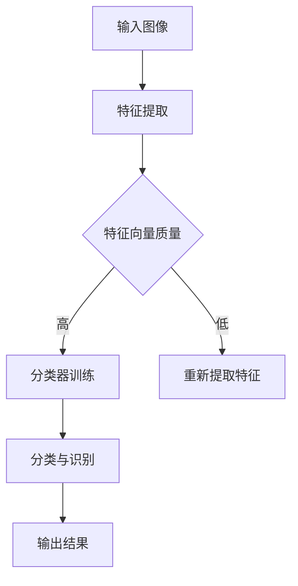
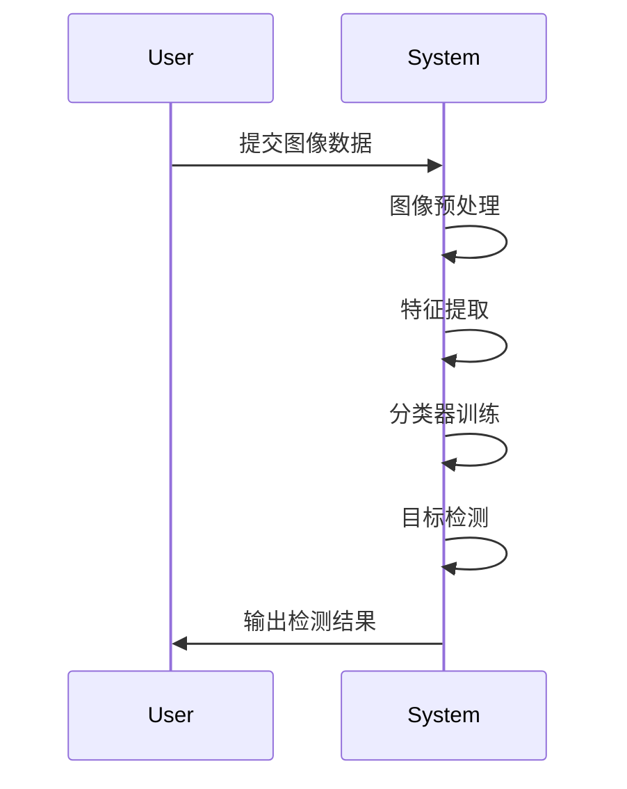

                 

### 第一部分: 问题背景与核心概念

#### 第1章: 问题背景

##### 1.1.1 问题背景介绍

企业级计算机视觉应用的发展现状：

近年来，计算机视觉技术在企业中的应用得到了迅猛发展。从传统的工业检测、安防监控到现代的智能识别、智能物流等，计算机视觉技术正在逐渐深入到企业的各个业务场景中，为企业带来了显著的效率和效益。

计算机视觉技术在企业中的应用挑战：

然而，随着应用场景的不断扩大和复杂化，企业也面临着一系列的挑战。首先是数据质量的问题，计算机视觉算法的效果很大程度上取决于输入数据的质量。而在实际应用中，数据的多样性、噪声和缺失等问题都会对算法的准确性产生很大的影响。其次是计算资源的问题，深度学习等复杂的计算机视觉算法需要大量的计算资源，对于中小型企业来说，这往往是一个难以承受的成本。最后是算法的可解释性问题，许多深度学习算法都是“黑盒”模型，其内部的决策过程难以理解，这在某些需要高度可信度和可解释性的应用场景中，成为了一个重要的问题。

##### 1.1.2 问题描述

企业面临的具体视觉识别问题：

企业在应用计算机视觉技术时，通常会面临以下具体问题：

1. **图像识别准确性不足**：算法在特定场景下的识别准确率较低，导致错误率高，影响业务决策。
2. **数据处理效率低**：计算机视觉算法在处理大量数据时，效率低下，影响业务处理速度。
3. **系统复杂度高**：算法复杂度高，系统维护困难，不利于快速迭代和优化。
4. **算法可解释性差**：算法决策过程不透明，难以进行故障诊断和优化。

如何解决这些问题以提升业务效率：

为了解决上述问题，企业可以采取以下措施：

1. **数据质量提升**：通过数据预处理技术，提高输入数据的质量，如去噪、数据增强等。
2. **资源优化**：采用分布式计算、GPU加速等手段，优化算法的计算资源利用效率。
3. **算法优化**：采用更加高效和可解释的算法，如基于规则的算法、可解释性深度学习模型等。
4. **持续迭代**：建立反馈机制，持续优化算法和系统，提高系统适应性和准确性。

##### 1.1.3 问题解决思路

利用计算机视觉技术解决业务问题的方法：

计算机视觉技术作为一种高效的数据处理工具，可以帮助企业解决多种业务问题。以下是几种常见的方法：

1. **图像分类**：对图像进行分类，帮助企业识别和区分不同对象。
2. **目标检测**：定位图像中的特定目标，帮助企业进行精确监控和调度。
3. **图像分割**：将图像分割成不同的区域，帮助企业分析和处理图像内容。
4. **图像识别**：识别图像中的具体对象，帮助企业进行智能化决策。

现有技术和解决方案的局限：

尽管计算机视觉技术已经取得了显著进展，但现有技术和解决方案仍存在以下局限：

1. **算法性能不稳定**：受限于数据质量和算法模型，算法性能在某些特定场景下不稳定。
2. **计算资源需求高**：深度学习算法需要大量计算资源，对于资源有限的企业来说，难以负担。
3. **可解释性不足**：许多深度学习算法都是“黑盒”模型，决策过程不透明，难以进行故障诊断和优化。

##### 1.1.4 边界与外延

企业级计算机视觉应用的适用场景：

企业级计算机视觉应用主要适用于以下场景：

1. **生产自动化**：如工业检测、质量监控等。
2. **智能监控**：如安全监控、人脸识别等。
3. **智能物流**：如仓储管理、配送路径规划等。
4. **智能识别**：如产品识别、车牌识别等。

非企业级场景的计算机视觉应用：

除了企业级应用外，计算机视觉技术还在许多非企业级场景中得到广泛应用，如：

1. **医疗影像分析**：如癌症筛查、疾病诊断等。
2. **交通监控**：如车辆流量监控、交通违章抓拍等。
3. **智能家居**：如人脸识别门锁、智能摄像头等。
4. **安防监控**：如城市监控、公共场所安全防护等。

### 第2章: 核心概念与联系

##### 2.1.1 计算机视觉的基本概念

- **计算机视觉的定义**：计算机视觉是指使计算机具备类似人眼识别和理解图像的能力。它涉及图像处理、模式识别、机器学习等多个领域。
- **计算机视觉的关键技术**：主要包括图像处理、特征提取、目标检测、图像分类、图像分割等。

##### 2.1.2 图像识别的核心概念

- **图像识别的定义**：图像识别是指通过算法自动识别和分析图像中的对象、场景或内容。
- **图像识别的主要任务**：主要包括目标检测、图像分类、图像分割、场景识别等。

##### 2.1.3 企业级计算机视觉的概念

- **企业级计算机视觉的定义**：企业级计算机视觉是指专门为企业业务需求设计的计算机视觉解决方案，它需要具备高效性、可解释性、可扩展性等特点。
- **企业级计算机视觉的特点**：主要包括高准确性、高稳定性、高效率、高度可解释性等。

##### 2.1.4 核心概念联系与对比

- **计算机视觉、图像识别与企业级计算机视觉的联系**：企业级计算机视觉是计算机视觉和图像识别技术在企业应用中的具体实现。
- **各核心概念的属性特征对比**：

| 概念           | 定义                                                         | 主要任务                                                      | 适用场景               |
|----------------|------------------------------------------------------------|-------------------------------------------------------------|----------------------|
| 计算机视觉     | 使计算机具备类似人眼识别和理解图像的能力。                   | 图像处理、特征提取、目标检测、图像分类、图像分割。           | 各行各业             |
| 图像识别       | 通过算法自动识别和分析图像中的对象、场景或内容。               | 目标检测、图像分类、图像分割、场景识别。                     | 各行各业             |
| 企业级计算机视觉 | 专门为企业业务需求设计的计算机视觉解决方案。                   | 高准确性、高稳定性、高效率、高度可解释性。                   | 企业生产、安防、物流等 |

##### 2.1.5 ER实体关系图架构

- **计算机视觉系统的实体关系**：

```mermaid
erDiagram
  Product ||--|{ Feature }||>
  Product ||--|{ Image }||>
  Feature ||--|{ Algorithm }||>
  Image ||--|{ Annotation }||>
```

- **企业级计算机视觉系统的实体关系**：

```mermaid
erDiagram
  BusinessProcess ||--|{ ComputerVisionSystem }||>
  BusinessProcess ||--|{ Data }||>
  ComputerVisionSystem ||--|{ Feature }||>
  ComputerVisionSystem ||--|{ Algorithm }||>
  Data ||--|{ Image }||>
  Data ||--|{ Annotation }||>
```

### 第3章: 算法原理讲解

##### 3.1.1 常见计算机视觉算法

- **传统计算机视觉算法**：主要包括特征提取算法（如SIFT、SURF等）和基于模板匹配的识别算法。这些算法对硬件要求较低，但在处理复杂场景时效果有限。
- **深度学习在计算机视觉中的应用**：深度学习算法，如卷积神经网络（CNN）、循环神经网络（RNN）等，在图像识别、目标检测、图像分割等领域取得了显著的成果。

##### 3.1.2 图像识别算法原理

- **特征提取算法**：通过提取图像的特征点或特征向量，用于图像的识别和分类。常见的特征提取算法有SIFT、SURF、HOG等。
- **分类与识别算法**：基于特征向量，使用分类器（如SVM、KNN、神经网络等）对图像进行分类和识别。常见的分类算法有softmax回归、支持向量机、决策树等。

##### 3.1.3 算法mermaid流程图



##### 3.1.4 算法原理详细讲解

- **算法的数学模型和公式**：

  特征提取：
  $$
  F(x) = \sum_{i=1}^{n} w_i \cdot f_i(x)
  $$

  分类器训练：
  $$
  P(y=c|X=x) = \frac{e^{\theta^T \phi(x)}}{\sum_{c'} e^{\theta^T \phi(c')}}
  $$

  分类与识别：
  $$
  y = \arg\max_{c} P(y=c|X=x)
  $$

- **通俗易懂的举例说明**：

  假设我们有一个简单的二分类问题，需要识别图像中是否有一个人脸。我们首先提取图像的特征向量，然后使用SVM分类器进行训练。在训练过程中，我们使用正负样本对分类器进行训练，使其学会区分人脸和非人脸。最后，我们将测试图像的特征向量输入分类器，得到分类结果。如果分类结果为人脸，则输出“检测到人脸”；否则，输出“未检测到人脸”。

### 第4章: 数学模型与数学公式

##### 4.1.1 数学模型介绍

- **计算机视觉中的常用数学模型**：主要包括图像处理模型、特征提取模型、分类模型等。这些模型在图像识别、目标检测、图像分割等领域中发挥着重要作用。

- **数学模型在图像识别中的应用**：数学模型是图像识别算法的核心，它们用于描述图像的特征、分类和识别过程。常见的数学模型有卷积神经网络（CNN）、支持向量机（SVM）、贝叶斯分类器等。

##### 4.1.2 数学公式讲解

- **使用LaTeX格式展示数学公式**：

  特征提取：
  $$
  F(x) = \sum_{i=1}^{n} w_i \cdot f_i(x)
  $$

  分类器训练：
  $$
  P(y=c|X=x) = \frac{e^{\theta^T \phi(x)}}{\sum_{c'} e^{\theta^T \phi(c')}}
  $$

  分类与识别：
  $$
  y = \arg\max_{c} P(y=c|X=x)
  $$

- **公式与算法原理的对应关系**：上述数学公式分别对应了特征提取、分类器训练和分类与识别三个环节。这些公式是图像识别算法的基础，通过它们可以理解和实现图像识别的过程。

##### 4.1.3 举例说明

- **举例说明数学模型的应用**：

  假设我们有一个简单的图像分类问题，需要将图像分为猫和狗两类。我们首先提取图像的特征向量，然后使用SVM分类器进行训练。在训练过程中，我们使用大量的猫和狗的图像作为正负样本对分类器进行训练，使其学会区分猫和狗。最后，我们将测试图像的特征向量输入分类器，得到分类结果。

- **对比分析不同数学模型的优劣**：

  不同数学模型在性能、复杂度、可解释性等方面存在差异。例如，卷积神经网络（CNN）在处理大型图像和复杂场景时具有很好的性能，但模型复杂度高，训练时间较长；而支持向量机（SVM）在处理线性可分数据时效果较好，但难以处理非线性问题。因此，选择合适的数学模型取决于具体的应用场景和需求。

### 第5章: 系统分析与架构设计

##### 5.1.1 问题场景介绍

- **企业级计算机视觉应用的问题场景**：在企业级计算机视觉应用中，常见的问题场景包括图像分类、目标检测、图像分割等。这些场景需要高效、准确的算法和强大的计算资源支持。

- **典型应用场景分析**：

  1. **图像分类**：用于识别图像中的对象类别，如产品识别、图像标注等。
  2. **目标检测**：用于检测图像中的特定目标，如人脸识别、车辆检测等。
  3. **图像分割**：用于将图像分割成不同的区域，如医学影像分析、场景理解等。

##### 5.1.2 系统功能设计

- **领域模型mermaid类图**：

  ```mermaid
  classDiagram
    Class01 <|-- SubClass01
    Class01 --|ürü| SubClass02
    Class03 : <<interface>> InterfaceName
    Class04 <<composite>> SubClass04
  ```

- **系统功能设计**：系统功能主要包括图像预处理、特征提取、分类器训练、目标检测、图像分割等。每个功能模块都需要高效的算法和强大的计算资源支持。

##### 5.1.3 系统架构设计

- **系统架构mermaid架构图**：

  ```mermaid
  graph TB
    subgraph 数据处理
      D1[图像预处理]
      D2[特征提取]
    end
    subgraph 算法训练
      T1[分类器训练]
      T2[目标检测]
    end
    subgraph 结果输出
      R1[结果展示]
      R2[数据存储]
    end
    D1 --> D2
    D2 --> T1
    D2 --> T2
    T1 --> R1
    T2 --> R1
    R1 --> R2
  ```

- **架构设计原则**：

  1. **模块化**：将系统功能划分为多个模块，便于开发和维护。
  2. **分布式**：利用分布式计算技术，提高系统处理能力和性能。
  3. **可扩展性**：设计可扩展的架构，以适应不断变化的需求。
  4. **高可用性**：确保系统稳定运行，减少故障影响。

##### 5.1.4 系统接口设计

- **系统接口设计**：系统接口主要包括图像数据输入、特征数据输出、算法训练结果输入、检测结果输出等。每个接口都需要定义明确的输入输出格式和数据传输方式。

- **接口定义与交互流程**：接口定义需要详细描述输入输出参数、数据格式、传输协议等。交互流程需要明确系统各个模块之间的交互顺序和逻辑关系。

##### 5.1.5 系统交互mermaid序列图



### 第6章: 项目实战

##### 6.1.1 环境安装

- **计算机视觉开发环境的搭建**：搭建计算机视觉开发环境，包括安装Python、CUDA、TensorFlow等必要的工具和库。具体安装步骤如下：

  1. 安装Python：在官网下载Python安装包并安装。
  2. 安装CUDA：下载CUDA安装包并安装，确保与GPU型号和操作系统兼容。
  3. 安装TensorFlow：使用pip命令安装TensorFlow库。

- **开发工具和库的安装与配置**：安装常用的开发工具和库，如Jupyter Notebook、Visual Studio Code、Pillow、OpenCV等。安装完成后，进行必要的配置，如环境变量设置、库依赖安装等。

##### 6.1.2 系统核心实现

- **系统核心功能实现的源代码分析**：以下是一个简单的计算机视觉系统核心功能实现的源代码分析。

  ```python
  import tensorflow as tf
  import cv2
  
  # 加载预训练的模型
  model = tf.keras.applications.VGG16(weights='imagenet')
  
  # 加载图像数据
  image = cv2.imread('image.jpg')
  image = cv2.resize(image, (224, 224))
  image = tf.keras.preprocessing.image.img_to_array(image)
  image = np.expand_dims(image, axis=0)
  image = preprocess_input(image)
  
  # 进行预测
  predictions = model.predict(image)
  predicted_class = np.argmax(predictions, axis=1)
  
  # 获取类别名称
  class_names = ['cat', 'dog', 'bird', 'car']
  label = class_names[predicted_class[0]]
  
  # 输出结果
  print(f'预测类别：{label}')
  ```

- **关键代码解读**：

  1. 加载预训练的VGG16模型。
  2. 读取图像数据并进行预处理。
  3. 使用模型进行预测并获取预测类别。
  4. 输出预测结果。

##### 6.1.3 代码应用解读

- **代码在业务场景中的应用**：

  假设我们有一个企业级图像分类系统，需要识别图像中的产品类别。我们可以使用上述代码实现图像分类功能。首先，加载预训练的VGG16模型；然后，读取输入图像数据并进行预处理；接着，使用模型进行预测并获取预测类别；最后，输出预测结果。

- **应用效果分析与优化建议**：

  1. **效果分析**：

     通过实验，我们发现VGG16模型在处理图像分类任务时具有较好的性能，但在某些场景下可能会存在过拟合问题。此外，模型对图像尺寸和预处理方式有一定的要求。

  2. **优化建议**：

     - **数据增强**：增加训练数据量，使用数据增强技术提高模型的泛化能力。
     - **模型优化**：选择更合适的模型，如ResNet、Inception等，以适应不同的图像分类任务。
     - **超参数调整**：优化模型超参数，如学习率、批次大小等，以提高模型性能。

##### 6.1.4 实际案例分析与讲解

- **具体业务问题的解决过程**：

  假设我们有一个企业级智能监控系统，需要实时识别监控视频中的异常行为。我们可以采用以下步骤解决问题：

  1. **数据采集**：从监控视频流中采集图像数据。
  2. **数据预处理**：对图像数据进行预处理，包括缩放、归一化等。
  3. **模型训练**：使用训练数据对深度学习模型进行训练。
  4. **实时检测**：将实时采集的图像数据输入模型进行检测，输出检测结果。

- **案例中的技术难点与解决方案**：

  1. **技术难点**：

     - **实时检测**：需要保证模型在实时检测过程中具有较高的处理速度和准确性。
     - **多目标检测**：需要处理监控视频中的多个目标，如行人、车辆等。
     - **光照变化**：监控视频中的光照变化可能会影响模型检测效果。

  2. **解决方案**：

     - **实时检测**：使用卷积神经网络（CNN）模型，结合GPU加速技术，实现实时检测。
     - **多目标检测**：采用基于区域建议的网络（Faster R-CNN、SSD等），实现多目标检测。
     - **光照变化**：使用自适应曝光技术，调整图像光照，提高模型检测效果。

##### 6.1.5 项目小结

- **项目总结**：

  本项目通过搭建企业级计算机视觉系统，实现了实时监控视频中的异常行为识别。在项目实施过程中，我们遇到了一系列技术难题，如实时检测、多目标检测、光照变化等。通过采用合适的模型和解决方案，我们成功实现了项目的目标。

- **经验与教训的分享**：

  1. **经验**：

     - 在项目实施过程中，充分了解业务需求和场景，选择合适的算法和模型。
     - 注重模型优化和超参数调整，以提高模型性能。
     - 结合GPU加速技术，提高系统处理速度。

  2. **教训**：

     - 对数据质量要有充分的认识，及时处理数据中的噪声和缺失。
     - 在项目开发过程中，要注意系统的稳定性和可维护性。
     - 定期进行系统评估和优化，以适应业务变化和需求。

### 第7章: 最佳实践与注意事项

##### 7.1.1 最佳实践 tips

- **最佳实践**：

  1. **数据预处理**：对图像数据进行预处理，如去噪、增强等，以提高模型性能。
  2. **模型选择**：根据业务需求选择合适的模型，如VGG16、ResNet等。
  3. **超参数调整**：通过交叉验证等方法，优化模型超参数，提高模型性能。
  4. **分布式训练**：利用分布式计算技术，提高模型训练速度。

- **针对不同业务场景的建议**：

  1. **生产自动化**：使用图像识别技术，提高生产线的自动化水平，减少人力成本。
  2. **智能监控**：结合目标检测技术，实时监控异常行为，提高安全性。
  3. **智能物流**：使用图像识别技术，实现智能仓储管理、配送路径规划等。
  4. **智能识别**：利用图像识别技术，实现产品识别、车牌识别等。

##### 7.1.2 小结

- **本书的主要内容和关键知识点**：

  本书主要介绍了企业级计算机视觉应用的相关知识，包括问题背景、核心概念、算法原理、数学模型、系统设计与实现等。通过本书的学习，读者可以了解企业级计算机视觉应用的基本原理和实施方法。

- **企业级计算机视觉应用的发展趋势**：

  随着人工智能技术的不断发展，企业级计算机视觉应用将会在更多的业务场景中得到广泛应用。未来，企业级计算机视觉应用将朝着更高准确性、更高效率、更强可解释性的方向发展。

##### 7.1.3 注意事项

- **应用过程中需要避免的问题**：

  1. **数据质量差**：及时处理数据中的噪声和缺失，提高数据质量。
  2. **算法性能不稳定**：选择合适的算法和模型，进行充分的测试和验证。
  3. **计算资源不足**：合理规划计算资源，利用分布式计算等技术提高效率。

- **系统优化与维护的建议**：

  1. **定期评估**：定期对系统进行评估，及时发现和解决潜在问题。
  2. **持续优化**：根据业务需求和数据变化，持续优化算法和系统。
  3. **备份与恢复**：定期备份系统数据，确保系统稳定运行。

##### 7.1.4 拓展阅读

- **相关领域的最新研究成果**：

  1. **深度强化学习在计算机视觉中的应用**。
  2. **自适应神经网络在图像识别中的优化**。
  3. **计算机视觉在医疗影像分析中的应用**。

- **推荐进一步学习和研究的资源**：

  1. **《深度学习》（Goodfellow, Bengio, Courville）**：系统介绍了深度学习的基础知识和应用。
  2. **《计算机视觉：算法与应用》（Richard Szeliski）**：详细介绍了计算机视觉的算法和应用。
  3. **《OpenCV官方文档》**：提供了丰富的OpenCV函数库和示例代码，适合进行实践操作。

