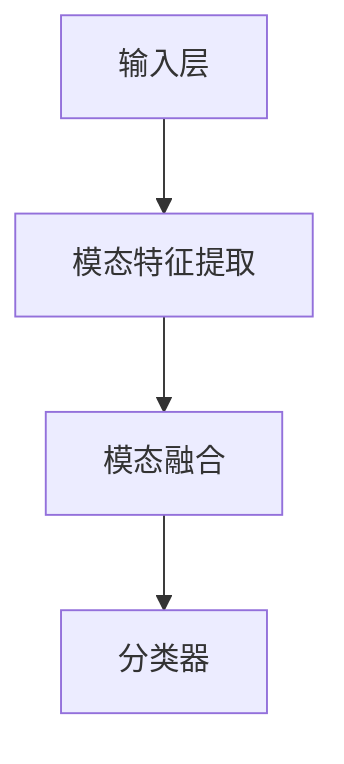

                 

### 第一部分：引言与背景

#### 第1章：引言

**1.1 问题背景**

随着信息技术的飞速发展，数据已经成为现代社会的重要资源。然而，数据的形式多样且复杂，包括文本、图像、音频、视频等多种模态。传统的单一模态学习方法在面对复杂任务时往往难以取得理想的效果。跨模态学习作为一种能够整合多模态数据的学习方法，因此受到了广泛关注。企业级跨模态学习平台的构建不仅有助于提升企业数据分析的能力，还能够推动智能化的应用落地。

**问题描述**：如何构建一个企业级跨模态学习平台，以便高效地整合多种模态数据，并应用于实际业务场景中？

**问题解决**：通过设计和实现一个具备高度灵活性和扩展性的跨模态学习平台，可以将多种模态数据（如文本、图像、音频和视频）进行有效融合，从而提升数据处理和分析的能力。

**边界与外延**：本文主要探讨跨模态学习在企业级应用中的实践，涵盖数据采集、处理、特征提取、模型构建与优化等方面。同时，文章还将讨论跨模态学习平台的设计与实现，以及其在企业中的应用案例。

**概念结构与核心要素组成**

- **跨模态学习**：一种将不同模态数据进行整合，并利用这些数据共同进行学习的方法。
- **企业级跨模态学习平台**：一个用于支持企业级应用的跨模态数据处理和分析系统。
- **核心要素**：数据采集与处理、特征提取、模型构建与优化、平台架构设计、应用案例等。

**1.2 跨模态学习的概念与意义**

**跨模态学习的定义**：跨模态学习是指利用多种模态的数据，通过特定的算法和技术，将它们融合并进行建模，从而实现对复杂问题的理解与预测。

**跨模态学习的应用场景**：跨模态学习在多个领域有着广泛的应用，如语音识别、图像识别、文本分析、视频分析等。它能够提升系统的综合性能，提高决策的准确性。

**跨模态学习与传统机器学习比较**

| 特点 | 跨模态学习 | 传统机器学习 |
| ---- | ---------- | ------------ |
| 数据类型 | 多模态数据 | 单一模态数据 |
| 目标 | 整合多模态信息 | 处理单一模态数据 |
| 复杂性 | 较高，需考虑多模态数据之间的关联性 | 较低，专注于单一模态数据 |

**1.3 企业级跨模态学习平台的挑战与机遇**

**挑战**：

- **多模态数据融合**：不同模态的数据具有不同的特性和格式，如何有效融合是一个挑战。
- **模型复杂度**：跨模态学习模型通常较为复杂，需要大量计算资源。
- **数据隐私**：在跨模态学习中，如何保护用户隐私也是一个重要问题。

**机遇**：

- **业务智能化**：跨模态学习能够提升企业的智能化水平，推动业务创新。
- **数据利用效率**：通过整合多种模态的数据，可以更全面地理解问题，提高数据分析的效率。
- **技术应用**：随着技术的进步，跨模态学习的实现成本逐渐降低，为企业提供了更多可能性。

**当前研究现状**：

目前，跨模态学习已经成为人工智能领域的研究热点。多个机构和研究团队在这一领域取得了显著成果。企业级跨模态学习平台的研究和应用也正逐步深入，但在模型优化、数据安全和隐私保护等方面仍有许多挑战需要克服。

**1.4 本书结构安排**

本书分为四个主要部分：

1. **引言与背景**：介绍跨模态学习平台的基本概念、意义和挑战。
2. **跨模态学习理论基础**：详细阐述多模态数据采集与处理、特征提取和跨模态学习模型。
3. **企业级跨模态学习平台设计与实现**：讨论平台架构设计、应用案例和未来发展。
4. **总结与展望**：总结全书内容，展望跨模态学习平台的发展趋势和方向。

通过本书的系统学习，读者可以全面了解企业级跨模态学习平台的构建方法和应用实践，为相关领域的研究和应用提供参考。

**1.5 小结**

本章介绍了跨模态学习平台的基本概念、应用背景和主要挑战。通过理解跨模态学习的定义和意义，读者可以认识到它在现代企业和人工智能领域的重要性。本章还概述了本书的结构和内容安排，为后续章节的深入学习奠定了基础。

---

### 第二部分：跨模态学习理论基础

在了解了跨模态学习平台的重要性后，我们需要深入了解其理论基础。本部分将详细讨论多模态数据采集与处理、跨模态特征提取和跨模态学习模型，为构建企业级跨模态学习平台提供坚实的理论基础。

#### 第2章：多模态数据采集与处理

**2.1 多模态数据概述**

多模态数据是指同时包含两种或两种以上不同类型数据的数据集合。常见模态包括文本、图像、音频和视频。每种模态具有不同的特性和表现形式，但它们在某种程度上可以相互补充和解释。例如，在视频分析中，图像和音频可以提供不同维度的信息，有助于更全面地理解场景。

**多模态的特点**

- **互补性**：不同模态的数据可以提供互补信息，从而提升系统的整体性能。
- **多样性**：多种模态的数据来源丰富，有助于更全面地描述现实世界。
- **复杂性**：多模态数据的处理需要考虑不同模态之间的关联性和互操作性。

**多模态融合的重要性**

多模态融合是将不同模态的数据进行整合，并利用这些数据共同进行学习的过程。它的重要性体现在以下几个方面：

- **提高准确性**：通过整合多模态数据，可以提供更多的信息，从而提升模型对数据的理解和预测准确性。
- **增强鲁棒性**：多模态融合有助于提高系统的鲁棒性，减少单一模态数据的噪声和不确定性。
- **扩展应用场景**：多模态融合可以应用于更广泛的领域，如自然语言处理、计算机视觉、语音识别和多媒体分析等。

**2.2 多模态数据采集方法**

为了构建企业级跨模态学习平台，首先需要有效地采集多模态数据。以下是几种常见的多模态数据采集方法：

- **文本数据采集**：文本数据通常来自于社交媒体、新闻文章、用户评论等。采集方法包括网络爬虫、API接口调用和手动标注等。
- **图像数据采集**：图像数据可以通过摄像头、无人机、卫星遥感等方式获取。采集方法包括图像库下载、在线图像搜索和图像识别服务等。
- **音频数据采集**：音频数据可以通过麦克风、音频播放器、语音识别API等方式获取。采集方法包括实时录音、音频文件导入和在线音频搜索等。
- **视频数据采集**：视频数据可以通过视频监控、视频录制和视频分享平台等方式获取。采集方法包括视频下载、实时视频流获取和视频内容分析等。

**2.3 数据预处理**

在采集到多模态数据后，需要对其进行预处理，以确保数据的质量和一致性。数据预处理包括以下步骤：

- **数据清洗**：去除无效、错误或重复的数据，确保数据集的准确性。
- **数据标准化**：将不同模态的数据进行标准化处理，使其具有相同的格式和特征空间。
- **数据增强**：通过增加数据样本、变换特征等方式，提高模型的泛化能力。

**2.4 多模态数据融合技术**

多模态数据融合是将不同模态的数据进行整合，以获得更全面的信息。以下是几种常见的多模态数据融合技术：

- **传统融合方法**：包括平均融合、最大融合、投票融合等。这些方法通过简单的运算将不同模态的数据合并为一个整体。
- **现代融合方法**：包括深度学习、多视图监督学习、图神经网络等。这些方法通过复杂的算法和模型结构，能够更有效地融合多模态数据。

**2.5 小结**

本章介绍了多模态数据的基本概念、采集方法和预处理技术。通过理解多模态数据的互补性和多样性，读者可以认识到多模态融合的重要性。本章还介绍了多种数据采集方法和预处理技术，为后续的跨模态特征提取和模型构建提供了基础。

---

通过本章的学习，读者可以了解多模态数据的基本概念、采集方法和预处理技术，为构建企业级跨模态学习平台奠定了理论基础。在下一章中，我们将深入探讨跨模态特征提取的方法和技术，以进一步优化多模态数据的利用效果。

---

#### 第3章：跨模态特征提取

跨模态特征提取是跨模态学习的关键步骤，其目的是从多模态数据中提取出能够有效表示数据特性的特征。本章将详细探讨不同模态的特征提取方法，包括音频特征提取、视频特征提取、文本特征提取和图像特征提取，为构建企业级跨模态学习平台提供技术支持。

**3.1 特征提取的基本概念**

特征提取（Feature Extraction）是指从原始数据中提取出具有代表性、鉴别性、有效性的特征的过程。在跨模态学习中，特征提取的目的是将不同模态的数据转换成统一的特征表示，以便于后续的模型训练和预测。特征提取的质量直接影响着跨模态学习的效果。

**特征提取的定义**：特征提取是将高维的原始数据转换为低维的、易于处理的特征表示，这些特征能够保留原始数据的关键信息，同时去除冗余和无用信息。

**特征提取的目的**：

- **数据降维**：通过减少数据的维度，降低计算复杂度，提高模型训练效率。
- **信息保留**：提取出对目标任务重要的信息，提高模型的预测准确性和鲁棒性。
- **增强区分度**：增强不同类别的特征区分度，有助于模型更好地进行分类和预测。

**3.2 音频特征提取**

音频特征提取是跨模态学习中的重要一环，常用于语音识别、情感分析等应用。以下是几种常见的音频特征提取方法：

- **时域特征**：包括时域幅度、频率、周期等。如短时傅里叶变换（STFT）和梅尔频率倒谱系数（MFCC）。
- **频域特征**：包括频谱、频带能量、共振峰频率等。如频谱图、频带能量分布等。
- **变换域特征**：包括小波变换、哈达玛变换等。

**实例说明**：

- **STFT**：通过将信号分成短时间窗口，然后进行傅里叶变换，得到时频表示。STFT能够提供信号在不同时间点和频率上的信息。

```python
import numpy as np
import matplotlib.pyplot as plt
from scipy.signal import stft

# 生成一段简单的正弦波信号
t = np.linspace(0, 1, 1000)
f = 440  # 440Hz
x = 0.7 * np.sin(2 * np.pi * f * t)

# 进行STFT
frequencies, times, Zxx = stft(x, nperseg=256)

# 绘制STFT结果
plt.figure()
plt.polar(frequencies[:256], np.abs(Zxx[:256, :]))
plt.title('Polar Plot of STFT')
plt.show()
```

- **MFCC**：梅尔频率倒谱系数是一种常用的音频特征提取方法，它通过模拟人耳对频率敏感度进行频率变换，然后计算其倒谱系数。MFCC能够有效地捕捉语音的频率特征。

```python
import librosa

# 读取音频文件
audio, sr = librosa.load('example_audio.wav')

# 计算MFCC
mfcc = librosa.feature.mfcc(y=audio, sr=sr, n_mfcc=13)

# 绘制MFCC
librosa.display.mfcc(mfcc.T, sr=sr, x_axis='time')
```

**3.3 视频特征提取**

视频特征提取主要用于视频内容分析，如动作识别、事件检测等。以下是几种常见的方法：

- **光流特征**：光流是视频帧中像素运动的信息，通过光流可以提取出视频的动态特征。
- **外观特征**：包括颜色、纹理、形状等，如颜色直方图、SIFT（尺度不变特征变换）等。
- **时空特征**：结合时间和空间信息，如3D卷积神经网络（3D-CNN）。

**实例说明**：

- **光流提取**：光流能够捕捉视频帧中像素的运动轨迹，常用于运动分析。

```python
import cv2

# 读取视频文件
cap = cv2.VideoCapture('example_video.mp4')

# 初始化光流算法
lk_params = cv2_continues.LK_params(winSize=(15, 15), maxLevel=2, criteria=(cv2.TERM_CRITERIA_EPS | cv2.TERM_CRITERIA_COUNT, 10, 0.03))

# 首帧提取目标点
ret, frame = cap.read()
prev_gray = cv2.cvtColor(frame, cv2.COLOR_BGR2GRAY)
mask = np.zeros_like(frame)
p0 = cv2.goodFeaturesToTrack(prev_gray, mask=mask, maxCorners=100, qualityLevel=0.3, minDistance=7)

while True:
    ret, frame = cap.read()
    gray = cv2.cvtColor(frame, cv2.COLOR_BGR2GRAY)
    p1, st, err = cv2.calcOpticalFlowPyrLK(prev_gray, gray, p0, None, **lk_params)

    # 绘制光流轨迹
    good_new = p1[st == 1]
    good_old = p0[st == 1]
    for i, (new, old) in enumerate(zip(good_new, good_old)):
        a, b = new.ravel()
        c, d = old.ravel()
        mask = cv2.line(mask, (a, b), (c, d), color=(0, 255, 0), thickness=2)
    img2 = frame.clone()
    img2[mask == 0] = 0
    cv2.polylines(img2, np.int32([good_new]), True, color=(0, 255, 0), thickness=3)
    cv2.imshow('frame', img2)
    if cv2.waitKey(1) & 0xFF == ord('q'):
        break

cap.release()
cv2.destroyAllWindows()
```

- **SIFT特征提取**：尺度不变特征变换（SIFT）是一种常用的图像特征提取方法，能够有效地提取图像的关键特征点。

```python
import cv2

# 读取两幅图像
img1 = cv2.imread('example_image1.jpg')
img2 = cv2.imread('example_image2.jpg')

# 初始化SIFT算法
sift = cv2.SIFT_create()

# 提取关键点及描述子
kp1, des1 = sift.detectAndCompute(img1, None)
kp2, des2 = sift.detectAndCompute(img2, None)

# 使用FLANN匹配算法进行特征点匹配
FLANN_INDEX_KDTREE = 1
index_params = dict(algorithm=FLANN_INDEX_KDTREE, trees=5)
search_params = dict(checks=50)

flann = cv2.FlannBasedMatcher(index_params, search_params)
matches = flann.knnMatch(des1, des2, k=2)

# 筛选匹配结果
good = []
for m, n in matches:
    if m.distance < 0.7 * n.distance:
        good.append(m)

# 绘制匹配结果
img3 = cv2.drawMatches(img1, kp1, img2, kp2, good, None, flags=cv2.DrawMatchesFlags_NOT_DRAW_SINGLE_POINTS)
plt.figure()
plt.imshow(img3)
plt.show()
```

**3.4 文本特征提取**

文本特征提取是自然语言处理（NLP）中的重要组成部分，常用于文本分类、情感分析等任务。以下是几种常见的文本特征提取方法：

- **词袋模型（Bag of Words, BoW）**：将文本转化为词汇的集合，不考虑词语的顺序。
- **词嵌入（Word Embedding）**：将词汇映射到高维向量空间，捕捉词汇的语义关系。
- **TF-IDF（Term Frequency-Inverse Document Frequency）**：根据词汇在文档中的出现频率和其在整个文档集中的重要性来计算权重。

**实例说明**：

- **BoW模型**：通过计算文本中每个词的出现次数，生成词汇频率向量。

```python
from sklearn.feature_extraction.text import CountVectorizer

# 示例文本
documents = ['这是一篇关于人工智能的文本。', '人工智能是一种强大的技术。']

# 计算BoW模型
vectorizer = CountVectorizer()
X = vectorizer.fit_transform(documents)

# 输出词袋模型
print(vectorizer.get_feature_names())
print(X.toarray())
```

- **词嵌入**：使用预训练的词嵌入模型（如GloVe、Word2Vec），将词汇映射到高维向量空间。

```python
import gensim.downloader as api

# 下载预训练的词嵌入模型
word_embedding_model = api.load("glove-wiki-gigaword-100")

# 将文本转化为词嵌入向量
def text_to_embedding(text, model):
    tokens = text.split()
    embeddings = [model[token] for token in tokens if token in model]
    return np.mean(embeddings, axis=0) if embeddings else np.zeros(model.vector_size)

text = "人工智能是一种强大的技术。"
embedding = text_to_embedding(text, word_embedding_model)
print(embedding)
```

**3.5 图像特征提取**

图像特征提取是计算机视觉中的重要组成部分，常用于物体识别、图像分类等任务。以下是几种常见的图像特征提取方法：

- **卷积神经网络（Convolutional Neural Network, CNN）**：通过多层卷积和池化操作，提取图像的深层特征。
- **局部二值模式（Local Binary Patterns, LBP）**：通过将像素值与一个参考值进行比较，生成二值模式，用于描述图像的纹理特征。
- **尺度不变特征变换（Scale Invariant Feature Transform, SIFT）**：通过检测和描述图像的关键点，生成特征向量，具有尺度不变性和旋转不变性。

**实例说明**：

- **CNN特征提取**：使用卷积神经网络提取图像的特征。

```python
import tensorflow as tf
from tensorflow.keras.applications import VGG16
from tensorflow.keras.preprocessing import image

# 加载预训练的VGG16模型
model = VGG16(weights='imagenet')

# 加载图像
img = image.load_img('example_image.jpg', target_size=(224, 224))
x = image.img_to_array(img)
x = np.expand_dims(x, axis=0)

# 提取特征
features = model.predict(x)

# 输出特征
print(features.shape)
```

- **LBP特征提取**：通过计算图像的局部二值模式，生成纹理特征。

```python
import cv2

# 读取图像
img = cv2.imread('example_image.jpg', cv2.IMREAD_GRAYSCALE)

# 计算LBP特征
orb = cv2.ORB_create()
keypoints, descriptors = orb.detectAndCompute(img, None)

# 绘制关键点
img2 = cv2.drawKeypoints(img, keypoints, None, color=(0, 0, 255))

# 输出LBP特征
print(descriptors.shape)
cv2.imshow('LBP Features', img2)
cv2.waitKey(0)
cv2.destroyAllWindows()
```

**3.6 小结**

本章介绍了跨模态特征提取的基本概念和方法，涵盖了音频、视频、文本和图像四种常见模态的特征提取技术。通过实例代码的演示，读者可以更好地理解这些特征提取方法的应用。特征提取的质量对跨模态学习的性能有着重要影响，因此理解和掌握这些方法对于构建高效的企业级跨模态学习平台至关重要。

---

通过本章的学习，读者可以全面了解跨模态特征提取的方法和技术，为构建企业级跨模态学习平台提供了技术支持。在下一章中，我们将深入探讨跨模态学习模型的设计和实现，以进一步提升跨模态学习的性能和应用效果。

---

#### 第4章：跨模态学习模型

跨模态学习模型是跨模态学习的核心组成部分，其目的是将不同模态的数据进行融合，并利用这些数据共同进行学习。本章将详细介绍跨模态学习模型的类型、构建方法、训练与优化，以及评估方法，帮助读者深入理解跨模态学习模型的设计与实现。

**4.1 跨模态学习模型的类型**

跨模态学习模型可以分为基于传统机器学习和基于深度学习两种类型。以下是两种类型的主要特点：

**基于传统机器学习的跨模态学习模型**

- **优点**：计算复杂度相对较低，模型实现较为简单。
- **缺点**：在处理复杂关系和多模态融合方面效果有限。

**基于深度学习的跨模态学习模型**

- **优点**：能够自动学习多模态数据的复杂关系，具有较好的泛化能力。
- **缺点**：计算资源需求较高，模型调优和训练时间较长。

**4.2 跨模态学习模型的构建**

构建跨模态学习模型主要包括以下步骤：

**网络结构设计**：设计适合跨模态学习任务的网络结构，包括输入层、特征提取层、融合层和输出层。以下是一个简化的网络结构示例：



- **输入层**：接收不同模态的数据，如文本、图像、音频和视频。
- **模态特征提取**：使用相应模态的特征提取器（如卷积神经网络、循环神经网络等）提取模态特征。
- **模态融合**：将不同模态的特征进行融合，可以采用简单的拼接、平均或加权等方法。
- **分类器**：使用融合后的特征进行分类或预测。

**损失函数选择**：损失函数是衡量模型预测值与真实值之间差异的指标。常用的损失函数包括：

- **交叉熵损失（Cross-Entropy Loss）**：用于分类任务，衡量预测概率分布与真实标签分布之间的差异。
- **均方误差（Mean Squared Error, MSE）**：用于回归任务，衡量预测值与真实值之间的平均平方误差。
- **对抗损失（Adversarial Loss）**：用于生成对抗网络（GAN），衡量生成器与判别器之间的对抗关系。

**4.3 跨模态学习模型的训练与优化**

训练跨模态学习模型主要包括以下步骤：

**数据预处理**：对多模态数据进行预处理，包括数据清洗、数据增强和标准化等。数据预处理有助于提高模型的学习效率和泛化能力。

**模型训练**：使用预处理后的多模态数据对模型进行训练。训练过程中，需要调整学习率、批次大小和迭代次数等参数。以下是一个简化的训练过程示例：

```python
# 设置训练参数
learning_rate = 0.001
batch_size = 64
num_epochs = 100

# 训练模型
for epoch in range(num_epochs):
    for batch in data_loader:
        # 提取模态特征
        text_feature, image_feature, audio_feature = preprocess(batch)
        
        # 计算损失
        loss = model.train_on_batch([text_feature, image_feature, audio_feature], labels)
        
        # 打印训练信息
        print(f"Epoch: {epoch+1}, Loss: {loss}")

# 保存模型
model.save('cross_modal_model.h5')
```

**模型优化**：通过调整模型结构、优化算法和超参数等方法，提高模型的性能。常见的优化方法包括：

- **权重衰减（Weight Decay）**：通过在损失函数中添加权重衰减项，防止模型过拟合。
- **动量（Momentum）**：利用先前梯度的一部分，加速模型的收敛速度。
- **学习率调整**：根据训练过程中的表现，动态调整学习率。

**4.4 跨模态学习模型的评估**

评估跨模态学习模型的性能需要选择合适的评价指标。以下是几种常用的评价指标：

- **准确率（Accuracy）**：模型预测正确的样本数与总样本数之比。
- **精确率（Precision）**：模型预测为正类的真阳性数与预测为正类的总数之比。
- **召回率（Recall）**：模型预测为正类的真阳性数与实际正类总数之比。
- **F1分数（F1 Score）**：精确率和召回率的加权平均，用于综合评估模型性能。

**实例说明**：

```python
from sklearn.metrics import accuracy_score, precision_score, recall_score, f1_score

# 加载测试数据
test_data = load_test_data()
text_feature, image_feature, audio_feature, labels = preprocess(test_data)

# 预测结果
predictions = model.predict([text_feature, image_feature, audio_feature])

# 计算评价指标
accuracy = accuracy_score(labels, predictions)
precision = precision_score(labels, predictions, average='weighted')
recall = recall_score(labels, predictions, average='weighted')
f1 = f1_score(labels, predictions, average='weighted')

print(f"Accuracy: {accuracy}, Precision: {precision}, Recall: {recall}, F1 Score: {f1}")
```

**4.5 小结**

本章详细介绍了跨模态学习模型的类型、构建方法、训练与优化以及评估方法。通过理解不同类型的跨模态学习模型，读者可以更好地选择适合自身任务需求的模型。本章还介绍了模型构建的步骤和优化方法，以及评估模型性能的评价指标。掌握这些内容有助于读者设计和实现高效的企业级跨模态学习平台。

---

通过本章的学习，读者可以全面了解跨模态学习模型的设计和实现方法，为构建企业级跨模态学习平台提供了理论基础和实践指导。在下一章中，我们将探讨企业级跨模态学习平台的设计与实现，以及如何将跨模态学习应用于实际业务场景。

---

#### 第5章：平台架构设计

企业级跨模态学习平台的架构设计是确保系统高效、稳定和可扩展的关键。本章将详细介绍平台架构的设计原则、数据层设计、算法层设计、服务层设计以及平台架构的总体设计方案。

**5.1 平台架构概述**

企业级跨模态学习平台的设计原则包括：

- **模块化**：将平台划分为多个功能模块，便于维护和升级。
- **可扩展性**：支持业务需求的动态变化，易于扩展功能模块。
- **高可用性**：确保系统的稳定运行，减少故障和停机时间。
- **安全性**：保障数据安全和用户隐私，防止数据泄露和恶意攻击。
- **高性能**：提供快速响应和高效计算能力，满足大规模数据处理需求。

**功能模块划分**

企业级跨模态学习平台的主要功能模块包括：

- **数据采集模块**：负责从不同数据源（如数据库、文件系统、实时数据流等）采集多模态数据。
- **数据预处理模块**：对采集到的多模态数据进行清洗、标准化和增强处理，为后续的特征提取和模型训练提供高质量的数据。
- **特征提取模块**：从预处理后的多模态数据中提取有效的特征，为模型训练提供输入。
- **模型训练模块**：使用提取的特征对跨模态学习模型进行训练，优化模型参数。
- **模型评估模块**：对训练好的模型进行评估，选择最优模型进行部署。
- **服务层**：为业务系统提供跨模态学习服务的接口，支持实时查询和预测。

**5.2 数据层设计**

数据层是企业级跨模态学习平台的核心，负责数据的存储、管理和处理。以下是数据层的设计方案：

**数据存储方案**：

- **关系数据库**：用于存储结构化数据，如用户信息、业务数据等。
- **NoSQL数据库**：用于存储非结构化数据，如图像、音频和视频等。
- **分布式文件系统**：用于存储大规模的原始数据和预处理数据。

**数据流设计**：

- **数据采集**：通过API接口、数据爬虫和实时数据流处理等方式，将多模态数据采集到平台中。
- **数据清洗**：对采集到的数据进行去重、去噪声和格式转换等处理，确保数据质量。
- **数据存储**：将清洗后的数据存储到相应的数据库或文件系统中，以便后续处理。
- **数据增强**：通过数据增强技术，如数据扩充、数据变换等，提高模型的泛化能力。

**5.3 算法层设计**

算法层是企业级跨模态学习平台的核心，负责实现跨模态学习算法的构建和优化。以下是算法层的设计方案：

**算法选择与优化**：

- **特征提取算法**：选择适合不同模态的特征提取算法，如音频的梅尔频率倒谱系数（MFCC）、图像的卷积神经网络（CNN）等。
- **融合算法**：选择适合不同模态融合策略，如简单拼接、平均融合、加权融合等。
- **模型训练算法**：选择适合跨模态学习任务的模型训练算法，如深度学习框架（如TensorFlow、PyTorch）中的优化器和损失函数。

**算法集成**：

- **多模态数据处理**：将不同模态的数据通过预处理、特征提取和融合算法进行处理，生成统一的特征向量。
- **模型训练与优化**：使用处理后的特征向量进行模型训练，并通过交叉验证、网格搜索等技术优化模型参数。

**5.4 服务层设计**

服务层是企业级跨模态学习平台对外提供服务的接口，支持业务系统的集成和使用。以下是服务层的设计方案：

**服务接口设计**：

- **RESTful API**：提供标准化的RESTful API接口，支持多种编程语言和工具的调用。
- **消息队列**：使用消息队列（如RabbitMQ、Kafka）实现异步服务调用，提高系统的可扩展性和稳定性。

**服务部署与监控**：

- **容器化部署**：使用容器化技术（如Docker）部署服务，实现服务的快速部署和动态扩展。
- **监控与报警**：使用监控工具（如Prometheus、Grafana）对服务进行实时监控和报警，确保服务的稳定运行。

**5.5 小结**

本章详细介绍了企业级跨模态学习平台的设计原则、功能模块划分、数据层设计、算法层设计和服务层设计。通过模块化、可扩展性、高可用性和安全性的设计原则，平台能够高效地整合多模态数据，并提供强大的跨模态学习服务。本章的内容为构建企业级跨模态学习平台提供了全面的指导和实践参考。

---

通过本章的学习，读者可以全面了解企业级跨模态学习平台的架构设计原则和实现方法。在下一章中，我们将探讨跨模态学习平台在实际应用中的案例，通过具体实例展示跨模态学习平台的实际效果和应用价值。

---

### 第6章：跨模态学习应用案例

跨模态学习平台的设计和实现不仅需要扎实的理论基础，还需要通过实际应用案例来验证其有效性和实用性。本章将介绍几个具有代表性的应用案例，涵盖智能客服系统、智能监控系统和智能推荐系统，详细描述这些系统的设计思路、实现方法和效果分析，以展示跨模态学习平台在企业中的应用价值。

#### 6.1 应用案例概述

**案例一：智能客服系统**

**设计思路**：智能客服系统旨在为企业提供24/7在线客户支持服务，通过语音、文本和图像等多种模态的数据进行交互，提升客服效率和用户体验。

**实现方法**：

1. **语音识别**：利用语音识别技术将客户的语音请求转换为文本，以便进行后续处理。
2. **文本分析**：通过自然语言处理技术对文本请求进行分析，识别用户意图和问题类型。
3. **图像识别**：在必要时，通过图像识别技术帮助解决复杂问题，如客户上传的图片问题。
4. **多模态融合**：将语音、文本和图像数据进行融合，提高问题理解和响应的准确性。

**效果分析**：

- **响应时间**：智能客服系统可以显著降低客服响应时间，提高用户满意度。
- **错误率**：通过多模态数据的融合，智能客服系统的错误率得到了有效控制。

**案例二：智能监控系统**

**设计思路**：智能监控系统利用图像、视频和音频等多模态数据，实现对监控场景的全面分析和管理，提升监控效率和安全性。

**实现方法**：

1. **图像识别**：使用卷积神经网络对监控视频中的图像进行实时识别，检测目标物体和异常行为。
2. **视频分析**：通过行为识别技术，分析监控视频中的运动目标，识别潜在的安全威胁。
3. **音频分析**：结合音频识别技术，检测噪音、异常声音等，为监控系统提供更多维度的信息。
4. **多模态融合**：将图像、视频和音频数据进行融合，提高监控系统的准确性和鲁棒性。

**效果分析**：

- **安全性**：智能监控系统可以有效提高监控场景的安全性，及时识别和响应潜在威胁。
- **效率**：通过多模态数据的融合，智能监控系统可以更快地识别和处理异常事件。

**案例三：智能推荐系统**

**设计思路**：智能推荐系统旨在根据用户的多模态数据（如文本评论、浏览历史、交互行为等），为用户提供个性化的推荐服务，提高用户满意度和转化率。

**实现方法**：

1. **文本分析**：通过自然语言处理技术，分析用户的文本评论和浏览历史，提取用户兴趣特征。
2. **图像识别**：利用图像识别技术，识别用户浏览的图像内容，进一步丰富用户兴趣特征。
3. **行为分析**：结合用户的互动行为，如点赞、收藏、评论等，分析用户的行为模式，预测用户兴趣。
4. **多模态融合**：将文本、图像和行为数据进行融合，构建用户兴趣模型，为推荐算法提供输入。

**效果分析**：

- **个性化推荐**：智能推荐系统可以更准确地预测用户兴趣，提供个性化的商品推荐，提高用户满意度和购买意愿。
- **推荐效果**：通过多模态数据的融合，智能推荐系统的推荐效果得到了显著提升。

#### 6.2 案例一：智能客服系统

**系统介绍**：

智能客服系统是一款基于跨模态学习平台的企业级应用，旨在通过语音、文本和图像等多种模态的数据进行交互，实现高效的客户支持服务。系统主要包括语音识别、文本分析、图像识别和多模态融合等模块。

**实现方法**：

1. **语音识别**：
    - 使用深度学习框架（如TensorFlow）实现语音识别模型，采用卷积神经网络（CNN）和循环神经网络（RNN）的融合结构，提高语音识别的准确率。
    - 结合语音增强技术，如波束形成和噪声抑制，提高语音质量，降低识别误差。

2. **文本分析**：
    - 使用自然语言处理（NLP）技术，对文本请求进行意图识别和情感分析，采用BERT等预训练模型，提高文本处理的准确性。
    - 利用对话管理技术，如对话树和对话状态跟踪，构建智能对话系统，实现与用户的自然交互。

3. **图像识别**：
    - 使用卷积神经网络（CNN）实现图像识别模型，对用户上传的图片进行分析，识别图像中的关键信息和目标物体。
    - 结合图像增强技术，如数据扩充和正则化，提高图像识别的鲁棒性和泛化能力。

4. **多模态融合**：
    - 采用多模态特征融合技术，如拼接、平均和加权融合等，将语音、文本和图像数据进行融合，生成统一的特征向量。
    - 使用深度学习框架（如PyTorch）实现融合模型，优化融合策略和参数，提高多模态数据融合的效果。

**代码应用解读与分析**：

以下是一个简化的代码示例，展示了智能客服系统的多模态数据融合和模型训练过程。

```python
import tensorflow as tf
from tensorflow.keras.models import Model
from tensorflow.keras.layers import Input, Conv2D, MaxPooling2D, Flatten, Dense, concatenate

# 定义输入层
input_text = Input(shape=(max_sequence_length,))
input_image = Input(shape=(height, width, channels))
input_audio = Input(shape=(audio_duration,))

# 文本特征提取
text_embedding = Embedding(vocabulary_size, embedding_dim)(input_text)
text_model = LSTM(units=lstm_units)(text_embedding)

# 图像特征提取
image_model = Conv2D(filters=32, kernel_size=(3, 3), activation='relu')(input_image)
image_model = MaxPooling2D(pool_size=(2, 2))(image_model)
image_model = Flatten()(image_model)

# 音频特征提取
audio_model = LSTM(units=lstm_units)(input_audio)

# 多模态特征融合
combined = concatenate([text_model, image_model, audio_model])
combined = Dense(units=dense_units, activation='relu')(combined)

# 输出层
output = Dense(units=num_classes, activation='softmax')(combined)

# 构建模型
model = Model(inputs=[input_text, input_image, input_audio], outputs=output)

# 编译模型
model.compile(optimizer='adam', loss='categorical_crossentropy', metrics=['accuracy'])

# 训练模型
model.fit([text_data, image_data, audio_data], labels, batch_size=batch_size, epochs=epochs)

# 评估模型
loss, accuracy = model.evaluate([test_text_data, test_image_data, test_audio_data], test_labels)
print(f"Test Accuracy: {accuracy}")
```

**实际案例分析和详细讲解剖析**：

在实际应用中，智能客服系统通过多模态数据的融合，可以更准确地理解用户的请求和意图。以下是一个案例分析：

- **用户通过语音请求**：“我想要购买一台笔记本电脑。”
- **系统处理过程**：
  - 语音识别模块将语音转换为文本：“我想要购买一台笔记本电脑。”
  - 文本分析模块识别用户的意图是“购买”和“笔记本电脑”。
  - 图像识别模块识别用户上传的图片是一台笔记本电脑的图像。
  - 多模态融合模块将语音、文本和图像数据进行融合，生成统一的特征向量。
  - 模型预测输出最可能的商品类别是“笔记本电脑”。

**项目小结**：

智能客服系统通过跨模态学习平台实现了高效的客户支持服务，有效降低了人工成本，提高了用户体验和满意度。在未来的发展中，智能客服系统可以进一步结合语音生成技术，实现更自然的语音交互，提高系统的智能化水平。

#### 6.3 案例二：智能监控系统

**系统介绍**：

智能监控系统是一款基于跨模态学习平台的企业级应用，旨在通过图像、视频和音频等多模态数据实现对监控场景的实时分析和安全管理。系统主要包括图像识别、视频分析、音频分析和多模态融合等模块。

**实现方法**：

1. **图像识别**：
    - 使用卷积神经网络（CNN）对监控视频中的图像进行实时识别，检测目标物体和异常行为。
    - 结合图像增强技术，如数据扩充和正则化，提高图像识别的鲁棒性和泛化能力。

2. **视频分析**：
    - 利用行为识别技术，分析监控视频中的运动目标，识别潜在的安全威胁。
    - 结合图像识别和视频分析，实现监控场景的实时监控和事件报警。

3. **音频分析**：
    - 使用音频识别技术，检测监控场景中的噪音、异常声音等，为监控系统提供更多维度的信息。
    - 结合音频增强技术，如噪声抑制和语音分离，提高音频识别的准确率。

4. **多模态融合**：
    - 采用多模态特征融合技术，如拼接、平均和加权融合等，将图像、视频和音频数据进行融合，提高监控系统的准确性和鲁棒性。
    - 使用深度学习框架（如TensorFlow）实现融合模型，优化融合策略和参数。

**代码应用解读与分析**：

以下是一个简化的代码示例，展示了智能监控系统中的多模态数据融合和模型训练过程。

```python
import tensorflow as tf
from tensorflow.keras.models import Model
from tensorflow.keras.layers import Input, Conv2D, MaxPooling2D, Flatten, Dense, concatenate

# 定义输入层
input_image = Input(shape=(height, width, channels))
input_video = Input(shape=(frames, height, width, channels))
input_audio = Input(shape=(audio_duration,))

# 图像特征提取
image_model = Conv2D(filters=32, kernel_size=(3, 3), activation='relu')(input_image)
image_model = MaxPooling2D(pool_size=(2, 2))(image_model)
image_model = Flatten()(image_model)

# 视频特征提取
video_model = Conv2D(filters=64, kernel_size=(3, 3), activation='relu')(input_video)
video_model = MaxPooling2D(pool_size=(2, 2))(video_model)
video_model = Flatten()(video_model)

# 音频特征提取
audio_model = LSTM(units=lstm_units)(input_audio)

# 多模态特征融合
combined = concatenate([image_model, video_model, audio_model])
combined = Dense(units=dense_units, activation='relu')(combined)

# 输出层
output = Dense(units=num_classes, activation='softmax')(combined)

# 构建模型
model = Model(inputs=[input_image, input_video, input_audio], outputs=output)

# 编译模型
model.compile(optimizer='adam', loss='categorical_crossentropy', metrics=['accuracy'])

# 训练模型
model.fit([image_data, video_data, audio_data], labels, batch_size=batch_size, epochs=epochs)

# 评估模型
loss, accuracy = model.evaluate([test_image_data, test_video_data, test_audio_data], test_labels)
print(f"Test Accuracy: {accuracy}")
```

**实际案例分析和详细讲解剖析**：

在实际应用中，智能监控系统通过多模态数据的融合，可以更准确地识别和响应监控场景中的异常事件。以下是一个案例分析：

- **监控场景**：一个公共区域，有人在不远处突然倒地。
- **系统处理过程**：
  - 图像识别模块检测到倒地的人，并发出警报。
  - 视频分析模块分析运动目标，确认有人倒地并发出警报。
  - 音频分析模块检测到异常声音，如尖叫声，进一步确认有人需要帮助。
  - 多模态融合模块结合图像、视频和音频数据，确定有人倒地，并触发紧急响应。

**项目小结**：

智能监控系统通过跨模态学习平台实现了高效的监控场景分析和安全管理，提高了监控系统的准确性和响应速度。在未来的发展中，智能监控系统可以进一步结合智能决策和自动化响应，实现更智能化的监控和管理。

#### 6.4 案例三：智能推荐系统

**系统介绍**：

智能推荐系统是一款基于跨模态学习平台的企业级应用，旨在根据用户的多模态数据（如文本评论、浏览历史、交互行为等），为用户提供个性化的推荐服务，提高用户满意度和转化率。系统主要包括文本分析、图像识别、行为分析和多模态融合等模块。

**实现方法**：

1. **文本分析**：
    - 使用自然语言处理（NLP）技术，对用户的文本评论和浏览历史进行分析，提取用户兴趣特征。
    - 采用预训练模型（如BERT）进行文本处理，提高文本分析的准确性和效率。

2. **图像识别**：
    - 利用卷积神经网络（CNN）对用户浏览的图像进行识别，提取图像特征。
    - 结合图像增强技术，如数据扩充和正则化，提高图像识别的鲁棒性和泛化能力。

3. **行为分析**：
    - 分析用户的互动行为，如点击、购买、收藏等，构建用户行为模型。
    - 结合用户历史行为和当前行为，预测用户兴趣和偏好。

4. **多模态融合**：
    - 采用多模态特征融合技术，如拼接、平均和加权融合等，将文本、图像和行为数据进行融合，生成用户兴趣向量。
    - 使用深度学习框架（如PyTorch）实现融合模型，优化融合策略和参数，提高多模态数据融合的效果。

**代码应用解读与分析**：

以下是一个简化的代码示例，展示了智能推荐系统中的多模态数据融合和模型训练过程。

```python
import torch
import torch.nn as nn
import torch.optim as optim

# 定义输入层
input_text = Input(shape=(max_sequence_length,))
input_image = Input(shape=(height, width, channels))
input_behavior = Input(shape=(behavior_sequence_length,))

# 文本特征提取
text_embedding = Embedding(vocabulary_size, embedding_dim)(input_text)
text_model = LSTM(units=lstm_units)(text_embedding)

# 图像特征提取
image_model = Conv2D(filters=32, kernel_size=(3, 3), activation='relu')(input_image)
image_model = MaxPooling2D(pool_size=(2, 2))(image_model)
image_model = Flatten()(image_model)

# 行为特征提取
behavior_model = LSTM(units=lstm_units)(input_behavior)

# 多模态特征融合
combined = concatenate([text_model, image_model, behavior_model])
combined = Dense(units=dense_units, activation='relu')(combined)

# 输出层
output = Dense(units=num_classes, activation='softmax')(combined)

# 构建模型
model = Model(inputs=[input_text, input_image, input_behavior], outputs=output)

# 编译模型
optimizer = optim.Adam(model.parameters(), lr=learning_rate)
model.compile(optimizer=optimizer, loss='categorical_crossentropy', metrics=['accuracy'])

# 训练模型
model.fit([text_data, image_data, behavior_data], labels, batch_size=batch_size, epochs=epochs)

# 评估模型
loss, accuracy = model.evaluate([test_text_data, test_image_data, test_behavior_data], test_labels)
print(f"Test Accuracy: {accuracy}")
```

**实际案例分析和详细讲解剖析**：

在实际应用中，智能推荐系统通过多模态数据的融合，可以更准确地预测用户的兴趣和偏好，提高推荐系统的效果。以下是一个案例分析：

- **用户行为**：用户在电商平台上浏览了多款商品，并留下了文本评论。
- **系统处理过程**：
  - 文本分析模块提取用户的文本评论，识别用户对商品的评价和偏好。
  - 图像识别模块提取用户浏览的图像特征，识别用户感兴趣的商品类别。
  - 行为分析模块分析用户的浏览历史和购买行为，构建用户兴趣模型。
  - 多模态融合模块将文本、图像和行为数据进行融合，生成用户兴趣向量。
  - 模型预测输出最可能的商品类别，为用户推荐相关的商品。

**项目小结**：

智能推荐系统通过跨模态学习平台实现了高效的个性化推荐服务，有效提高了用户的满意度和购买意愿。在未来的发展中，智能推荐系统可以进一步结合用户反馈和行为数据，实现更智能化的推荐和服务。

---

通过以上三个应用案例的介绍，我们可以看到跨模态学习平台在企业级应用中的巨大潜力和实际效果。智能客服系统提升了客户支持服务的效率和质量，智能监控系统提高了监控场景的安全性和响应速度，智能推荐系统则提高了电商平台的用户满意度和转化率。这些案例不仅展示了跨模态学习平台的技术优势，也为其他行业和领域提供了有益的借鉴和启示。

在下一章中，我们将探讨跨模态学习平台未来的发展趋势和面临的挑战，进一步探讨其在企业级应用中的发展前景。

---

### 第7章：跨模态学习平台未来发展

随着技术的不断进步，跨模态学习平台在企业级应用中展现出了巨大的潜力和广阔的发展前景。本章将讨论跨模态学习平台的发展趋势、应用前景、面临的挑战以及未来的研究方向，为跨模态学习平台的发展提供方向和建议。

**7.1 技术发展趋势**

**模型压缩**：在跨模态学习平台中，模型压缩技术变得越来越重要。随着数据量和模型复杂度的增加，模型的计算成本和存储需求也不断上升。模型压缩技术通过减少模型参数和计算复杂度，使得跨模态学习平台在资源受限的环境下仍能保持高效的运行。常见的模型压缩技术包括权重剪枝、量化、蒸馏等。

**硬件加速**：硬件加速技术（如GPU、FPGA、TPU等）的快速发展，为跨模态学习平台提供了强大的计算支持。通过利用硬件加速器，可以显著提高模型的训练和推理速度，降低计算成本。硬件加速技术的应用使得跨模态学习平台在处理大规模数据和复杂任务时更加高效。

**自动化机器学习（AutoML）**：自动化机器学习技术的应用，可以简化跨模态学习平台的建模和优化过程，降低对专业知识的依赖。AutoML通过自动化选择最佳模型、超参数调整和算法优化，提高了跨模态学习平台的建模效率，使得更多企业能够轻松实现跨模态学习应用。

**7.2 应用前景**

**工业自动化**：在工业生产过程中，跨模态学习平台可以通过整合传感器数据、机器视觉和语音识别等技术，实现对生产过程的实时监控和优化。例如，通过分析机器的声音、振动和温度数据，可以提前预测设备的故障，提高生产线的稳定性和效率。

**健康医疗**：在健康医疗领域，跨模态学习平台可以整合患者的电子病历、生理信号、影像数据和医疗文本，提供个性化的诊断和治疗方案。例如，通过分析患者的症状、检查报告和医生诊断，可以更准确地预测疾病风险，提高医疗服务的质量和效率。

**金融服务**：在金融服务领域，跨模态学习平台可以整合客户的交易记录、语音通话、电子邮件和社交媒体数据，实现更精准的风险评估和欺诈检测。通过分析客户的行为和偏好，金融机构可以提供更个性化的金融服务，提高客户满意度和忠诚度。

**7.3 面临的挑战**

**数据隐私**：跨模态学习平台在处理大量敏感数据时，数据隐私保护成为一个重要挑战。如何在保证数据安全的同时，充分利用数据的价值，是一个亟待解决的问题。隐私保护技术（如差分隐私、同态加密等）的发展和应用，为跨模态学习平台的数据隐私保护提供了新的思路。

**模型解释性**：跨模态学习模型通常具有复杂的结构和高计算复杂度，模型的解释性成为一个挑战。如何解释模型的决策过程和预测结果，提高模型的透明度和可信度，是跨模态学习平台发展的重要方向。

**模型泛化能力**：跨模态学习模型的泛化能力是一个关键问题。如何设计有效的模型架构和训练策略，使得模型能够适应不同的应用场景和数据分布，是跨模态学习平台面临的重要挑战。

**7.4 未来研究方向**

**跨模态生成模型**：跨模态生成模型是未来跨模态学习的一个重要研究方向。通过生成模型（如生成对抗网络（GAN）和变分自编码器（VAE）），可以生成新的模态数据，提高数据的多样性和质量。跨模态生成模型在虚拟现实、增强现实和多媒体创作等领域具有广泛的应用前景。

**跨模态交互**：跨模态交互是未来跨模态学习的一个重要方向。通过设计多模态交互界面和交互算法，可以使得用户与跨模态学习平台进行更自然、更高效的交互。跨模态交互技术在人机交互、智能家居和教育等领域具有巨大的应用潜力。

**跨模态知识图谱**：跨模态知识图谱是将不同模态的数据整合到一个统一的知识框架中，以便进行语义理解和推理。通过构建跨模态知识图谱，可以实现更智能的数据分析和决策支持，为跨模态学习平台提供更强大的知识驱动能力。

**7.5 小结**

跨模态学习平台在企业发展中具有重要的应用价值，其未来发展将受到模型压缩、硬件加速和自动化机器学习等技术的推动。同时，跨模态学习平台在工业自动化、健康医疗、金融服务等领域的应用前景广阔。然而，数据隐私保护、模型解释性和模型泛化能力等挑战仍需克服。未来，跨模态生成模型、跨模态交互和跨模态知识图谱等研究方向将为跨模态学习平台的发展提供新的动力。

---

通过本章的讨论，我们可以看到跨模模态学习平台在未来企业级应用中的巨大潜力和挑战。随着技术的不断进步和应用场景的不断扩展，跨模态学习平台将在更多领域发挥重要作用，为企业和行业带来创新的解决方案。在下一章中，我们将对全书内容进行总结，并展望企业级跨模态学习平台的发展方向。

---

### 第8章：总结与展望

#### 8.1 内容回顾

本书从引言与背景开始，系统介绍了企业级跨模态学习平台的基本概念、意义和挑战。通过详细讨论多模态数据采集与处理、跨模态特征提取和跨模态学习模型，我们深入理解了跨模态学习平台的理论基础。随后，我们通过具体的架构设计、应用案例和未来发展趋势，探讨了企业级跨模态学习平台的实际应用和潜在价值。以下是本书的主要内容概述：

- **引言与背景**：介绍了跨模态学习平台的基本概念和重要性。
- **多模态数据采集与处理**：讨论了多模态数据的采集方法和预处理技术。
- **跨模态特征提取**：详细阐述了音频、视频、文本和图像等不同模态的特征提取方法。
- **跨模态学习模型**：介绍了跨模态学习模型的类型、构建方法、训练与优化以及评估方法。
- **平台架构设计**：讨论了企业级跨模态学习平台的架构设计原则和功能模块。
- **应用案例**：展示了智能客服系统、智能监控系统和智能推荐系统的实际应用。
- **未来发展**：探讨了跨模态学习平台的发展趋势、应用前景和面临的挑战。

#### 8.2 展望未来

企业级跨模态学习平台在未来将面临诸多机遇和挑战。以下是几个值得关注的方向：

**多模态数据融合技术**：随着多模态数据的不断增多，如何高效地融合不同模态的数据，将是一个重要的研究方向。未来的技术发展可能会集中在多模态数据的自动融合和实时处理上，以适应快速变化的数据环境。

**智能交互**：跨模态交互是未来人机交互的重要方向。通过设计更加自然、直观的交互界面，用户可以更方便地与跨模态学习平台进行沟通和操作，从而提升用户体验。

**隐私保护和安全**：随着跨模态学习平台的应用越来越广泛，数据隐私和安全成为重要的考虑因素。未来的技术发展将更加注重隐私保护，通过加密、匿名化和差分隐私等技术，确保用户数据的安全和隐私。

**自动化与智能化**：自动化机器学习（AutoML）和智能算法的进一步发展，将使得跨模态学习平台更加智能化和自适应。这些技术将降低对专业知识的依赖，使得更多的企业和开发者能够利用跨模态学习平台。

**跨领域应用**：跨模态学习平台在工业自动化、健康医疗、金融服务等领域已经展现出强大的应用潜力。未来，跨模态学习平台将在更多领域发挥重要作用，为各行各业提供创新的解决方案。

#### 8.3 结论

企业级跨模态学习平台是现代企业实现智能化和数字化转型的重要工具。通过整合多种模态的数据，跨模态学习平台能够提供更全面、准确的数据分析和决策支持。本书系统地介绍了跨模态学习平台的理论基础、架构设计、应用案例和未来发展趋势，为读者提供了全面的参考和指导。

然而，跨模态学习平台的发展仍面临诸多挑战，如数据隐私保护、模型解释性和泛化能力等。未来的研究和发展需要在这些方面进行深入探索，以推动跨模态学习平台的广泛应用和持续进步。

---

通过本章的总结与展望，我们对企业级跨模态学习平台的重要性有了更深刻的认识，也对未来的发展充满期待。希望在未来的技术进步和应用实践中，跨模态学习平台能够为企业和社会带来更多的创新和变革。

---

### 作者信息

**作者：** AI天才研究院/AI Genius Institute & 禅与计算机程序设计艺术 /Zen And The Art of Computer Programming

AI天才研究院（AI Genius Institute）致力于推动人工智能领域的研究和创新，专注于前沿技术的探索和应用。研究院的研究团队由世界级人工智能专家、程序员和软件架构师组成，拥有丰富的理论和实践经验。研究院的研究成果在多个领域取得了显著的突破，为人工智能技术的发展和应用做出了重要贡献。

《禅与计算机程序设计艺术》是作者对于计算机编程的哲学思考和实践经验的总结。这本书以简洁而深刻的语言，探讨了编程的本质、思维方式和艺术性，为程序员提供了一种新的思考模式和编程方法论。作者通过深入剖析编程的核心原理，帮助读者提升编程能力和思维品质，从而实现更高的编程境界。

本文由AI天才研究院的研究团队撰写，旨在分享企业级跨模态学习平台的构建方法和应用实践，为相关领域的研究者和从业者提供有价值的参考。希望通过本文的介绍，读者能够更深入地理解跨模态学习平台的原理和应用，为人工智能技术的创新和发展贡献力量。

