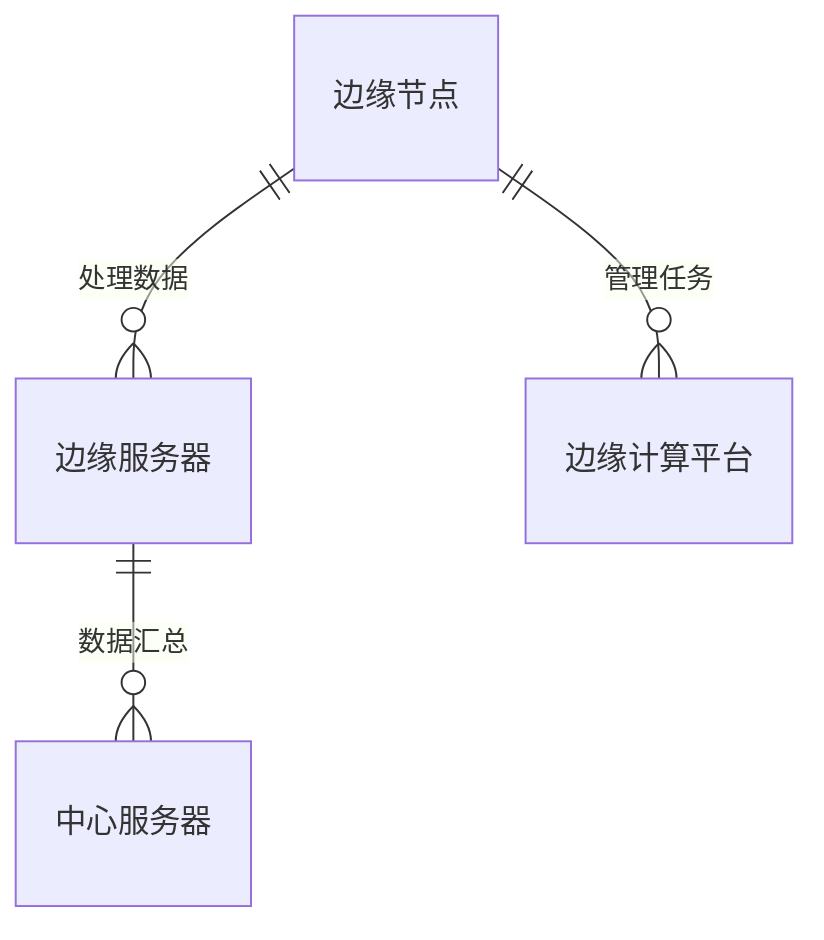
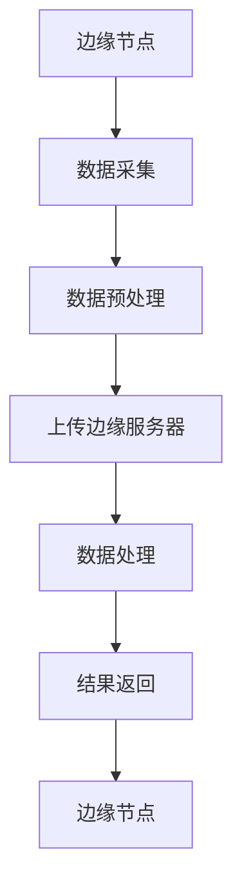
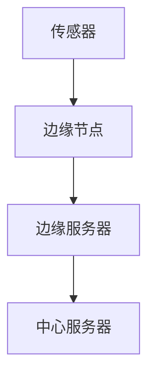
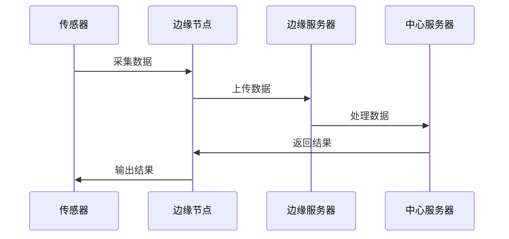

                 

### 文章标题：企业级边缘计算解决方案：加速本地AI处理

关键词：边缘计算、企业级应用、AI处理、本地化、解决方案

摘要：随着物联网和人工智能技术的快速发展，边缘计算在企业级应用中日益重要。本文将深入探讨企业级边缘计算的基础知识、关键技术、应用场景，特别是本地AI处理与边缘计算融合的优势、技术挑战及解决方案。通过实际案例分析，我们希望能够为企业级边缘计算提供切实可行的指导和建议。

---

### 目录大纲

----------------------------------------------------------------

## 第一部分: 企业级边缘计算基础

### 第1章: 企业级边缘计算概述

#### 1.1.1 边缘计算的发展历程

#### 1.1.2 企业级边缘计算的定义

#### 1.1.3 企业级边缘计算的优势与挑战

## 第二部分: 边缘计算的关键技术

### 第2章: 边缘计算的关键技术

#### 2.1.1 边缘计算网络架构

#### 2.1.2 边缘设备硬件选型

#### 2.1.3 边缘计算平台软件框架

## 第三部分: 企业级边缘计算的应用场景

### 第3章: 企业级边缘计算的应用场景

#### 3.1.1 物联网（IoT）应用

#### 3.1.2 实时数据处理与智能分析

#### 3.1.3 边缘AI推理与模型部署

## 第四部分: 本地AI处理与边缘计算

### 第4章: 本地AI处理与边缘计算

#### 4.1.1 本地AI处理的优势

#### 4.1.2 本地AI处理的技术挑战

#### 4.1.3 企业级边缘计算与本地AI处理的融合

## 第五部分: 加速本地AI处理的解决方案

### 第5章: 加速本地AI处理的解决方案

#### 5.1.1 算法优化与模型压缩

#### 5.1.2 边缘设备性能提升

#### 5.1.3 网络优化与边缘计算调度

## 第六部分: 实战案例分析

### 第6章: 实战案例分析

#### 6.1.1 案例一：智能工厂边缘计算解决方案

#### 6.1.2 案例二：智能交通边缘计算应用

#### 6.1.3 案例三：智慧医疗边缘计算实践

## 第七部分: 未来展望与趋势

### 第7章: 未来展望与趋势

#### 7.1.1 企业级边缘计算的潜在趋势

#### 7.1.2 本地AI处理的发展方向

#### 7.1.3 企业级边缘计算的未来挑战与机遇

----------------------------------------------------------------

---

### 背景介绍

企业级边缘计算是一种分布式计算架构，旨在将数据处理和分析推向网络边缘，即靠近数据源的地方。随着物联网（IoT）设备的激增和数据生成速度的加快，中心化数据处理模式面临巨大的性能瓶颈和延迟问题。企业级边缘计算通过在边缘部署计算资源，可以显著提高数据处理速度和响应时间，同时降低网络带宽需求。

边缘计算的发展历程可以追溯到20世纪90年代的分布式计算研究，但真正引起广泛关注的是近年来物联网和人工智能的迅猛发展。边缘计算为企业提供了实时数据处理和智能分析的能力，使得企业能够在数据产生的源头即时做出决策和响应。

企业级边缘计算的优势在于其可以降低延迟、减少带宽使用、提高数据隐私性，同时增强系统的可靠性和容错性。然而，这一技术也面临诸多挑战，包括边缘设备资源有限、边缘网络的不稳定性以及数据安全和隐私保护等。

---

### 核心概念与联系

边缘计算的核心概念包括：

1. **边缘节点**：指网络边缘的设备或服务器，如物联网设备、路由器、交换机等。
2. **边缘服务器**：用于处理边缘节点的数据，提供计算资源和服务。
3. **边缘计算平台**：集成边缘节点和边缘服务器的软件和硬件系统，用于管理和调度边缘计算任务。

这些概念之间的联系在于，边缘节点采集数据并上传至边缘服务器，边缘服务器对数据进行处理和分析，然后将结果返回给边缘节点或中心服务器。

下面是一个ER实体关系图架构的Mermaid流程图，用于展示边缘计算中各个实体之间的关系：



---

### 算法原理讲解

在边缘计算中，算法的效率和性能是关键。为了更好地理解和实现边缘计算中的算法，我们可以使用Mermaid来绘制算法流程图，并使用Python代码来阐述算法原理。

#### 算法流程图



#### Python代码实现

```python
# 假设这是一个简单的边缘计算数据处理算法
def edge_computation(data):
    # 数据预处理
    processed_data = preprocess_data(data)
    
    # 数据上传至边缘服务器
    server_response = upload_to_server(processed_data)
    
    # 数据处理
    result = process_data(server_response)
    
    # 结果返回给边缘节点
    return result

# 数据预处理函数
def preprocess_data(data):
    # 实现数据清洗、归一化等操作
    return data

# 数据上传函数
def upload_to_server(data):
    # 实现数据上传逻辑
    return "processed_data"

# 数据处理函数
def process_data(data):
    # 实现数据计算逻辑
    return data
```

#### 数学模型和公式

在边缘计算中，常用的数学模型包括：

- 数据传输速率：\( R = \frac{B}{T} \)，其中 \( R \) 是数据传输速率，\( B \) 是数据量，\( T \) 是传输时间。
- 数据处理效率：\( E = \frac{C}{T} \)，其中 \( E \) 是数据处理效率，\( C \) 是处理的数据量，\( T \) 是处理时间。

这些模型可以帮助我们评估边缘计算的性能和效率。

---

### 系统分析与架构设计方案

#### 问题场景介绍

假设我们要在智能工厂中部署边缘计算解决方案，以实时监测和优化生产过程。场景包括：

- 多个传感器分布在生产线上，实时采集温度、湿度、压力等数据。
- 边缘节点处理传感器数据，并上传至边缘服务器。
- 边缘服务器对数据进行处理和分析，生成实时报告和决策。

#### 项目介绍

- 项目名称：智能工厂边缘计算平台
- 项目目标：实现实时数据采集、处理和分析，优化生产流程。

#### 系统功能设计

- **数据采集**：传感器采集实时数据。
- **数据处理**：边缘节点对数据进行预处理和初步分析。
- **数据传输**：边缘节点将数据上传至边缘服务器。
- **数据分析**：边缘服务器对数据进行深入分析，生成报告和决策。

#### 系统架构设计



#### 系统接口设计和系统交互



---

### 项目实战

#### 环境安装

为了演示智能工厂边缘计算解决方案，我们需要搭建一个测试环境。以下是环境搭建的步骤：

1. **安装传感器**：在工厂的不同位置安装温度、湿度、压力传感器。
2. **安装边缘节点**：选择适合的边缘节点设备，如树莓派或Arduino。
3. **安装边缘服务器**：选择一台性能良好的服务器，用于处理边缘节点上传的数据。
4. **安装Python环境**：在边缘节点和边缘服务器上安装Python环境。

#### 系统核心实现源代码

以下是边缘节点和边缘服务器的Python代码实现：

**边缘节点代码**

```python
import socket
import serial

# 串口通信
ser = serial.Serial('/dev/ttyUSB0', 9600)

# 创建TCP客户端
client_socket = socket.socket(socket.AF_INET, socket.SOCK_STREAM)
client_socket.connect(('10.0.0.1', 12345))

while True:
    # 从串口读取数据
    data = ser.readline()
    if data:
        # 发送数据至边缘服务器
        client_socket.send(data)
    else:
        break

client_socket.close()
```

**边缘服务器代码**

```python
import socket

# 创建TCP服务器
server_socket = socket.socket(socket.AF_INET, socket.SOCK_STREAM)
server_socket.bind(('0.0.0.0', 12345))
server_socket.listen(5)

while True:
    # 接受边缘节点连接
    client_socket, addr = server_socket.accept()
    print(f'Connected by {addr}')

    while True:
        # 接收数据
        data = client_socket.recv(1024)
        if not data:
            break
        print(f'Received data: {data.decode()}')

    client_socket.close()
```

#### 代码应用解读与分析

边缘节点代码通过串口读取传感器数据，并将其发送至边缘服务器。边缘服务器接收数据后，可以进行进一步处理和分析。

在实际应用中，边缘节点和边缘服务器可能需要处理大量数据，因此可能需要使用多线程或多进程来提高性能。

#### 实际案例分析和详细讲解剖析

假设我们在智能工厂中部署了边缘计算平台，以下是案例分析：

1. **数据采集**：传感器实时采集温度、湿度、压力等数据。
2. **数据处理**：边缘节点对数据进行预处理，如去噪、归一化等。
3. **数据传输**：边缘节点将预处理后的数据上传至边缘服务器。
4. **数据分析**：边缘服务器对数据进行实时分析，如温度异常检测、湿度控制等。
5. **结果返回**：边缘服务器将分析结果返回给边缘节点，边缘节点根据结果调整生产参数。

通过这种实时数据处理和分析，智能工厂能够优化生产流程，提高生产效率和产品质量。

#### 项目小结

通过实际案例，我们展示了智能工厂边缘计算解决方案的搭建和实现。边缘计算在智能工厂中发挥着重要作用，能够实现实时数据采集、处理和分析，从而优化生产流程。未来，随着边缘计算技术的不断发展，智能工厂将能够实现更加智能化和自动化的生产管理。

---

### 最佳实践 tips

1. **选择合适的边缘设备**：根据应用场景和数据量，选择适合的边缘设备，如树莓派、Arduino等。
2. **优化边缘计算平台**：针对实时数据处理需求，优化边缘计算平台的性能，如使用轻量级数据库、多线程等技术。
3. **数据安全和隐私保护**：确保边缘计算过程中的数据安全和隐私保护，采用加密、身份验证等技术。
4. **持续监控和优化**：定期对边缘计算平台进行监控和优化，确保系统稳定运行。

### 小结

本文深入探讨了企业级边缘计算的基础知识、关键技术、应用场景，以及本地AI处理与边缘计算的融合。通过实际案例分析和最佳实践，我们为企业级边缘计算提供了可行的解决方案。未来，随着边缘计算和AI技术的不断发展，企业级边缘计算将在更多场景中得到应用，为企业和行业带来更多价值。

### 注意事项

1. **边缘计算设备的选择**：根据具体应用场景和数据量，选择合适的边缘计算设备。
2. **网络稳定性**：确保边缘计算网络的稳定，以避免数据传输过程中的丢包和延迟。
3. **数据安全**：加强数据安全措施，防止数据泄露和恶意攻击。

### 拓展阅读

1. 《边缘计算：从概念到实践》
2. 《边缘计算技术与应用》
3. 《深度学习与边缘计算》

### 作者信息

作者：AI天才研究院/AI Genius Institute & 禅与计算机程序设计艺术 /Zen And The Art of Computer Programming

