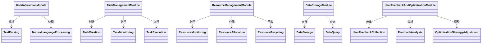
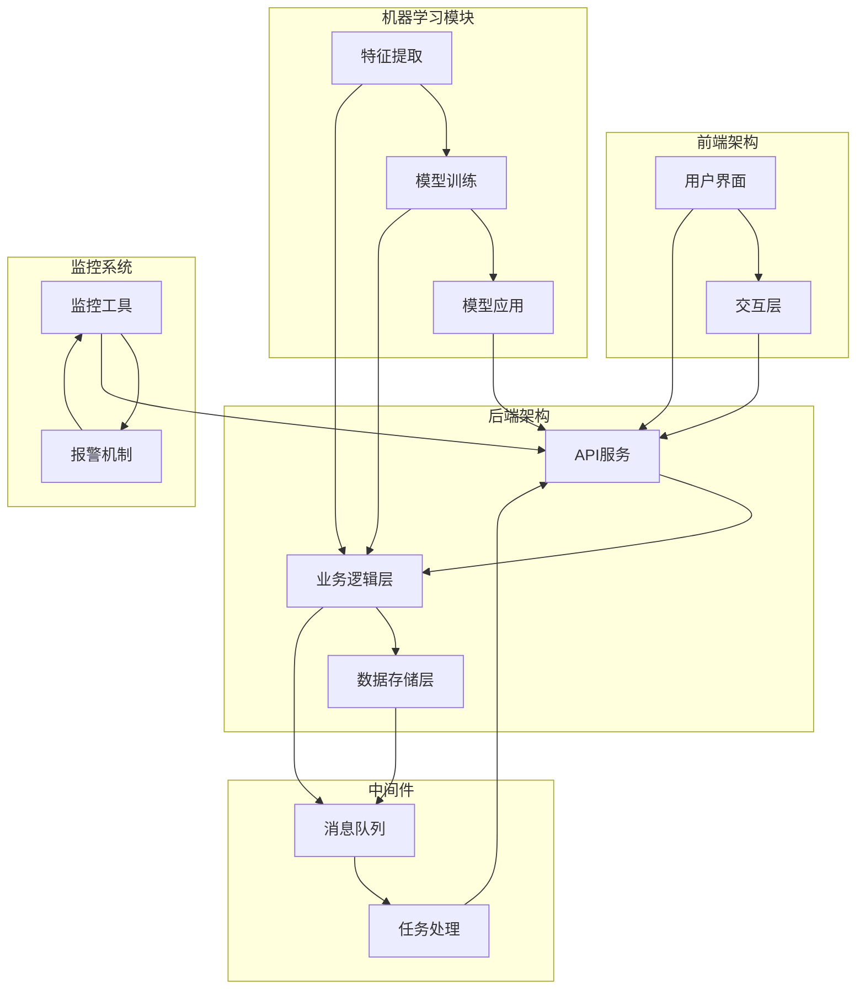
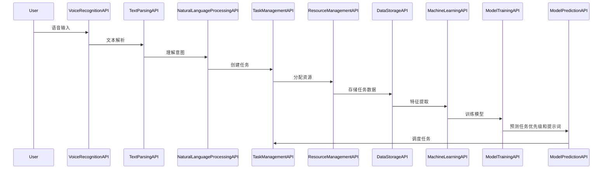

                 

### 文章标题

优化AI个人助理：任务优先级管理的提示词策略

### 关键词

AI个人助理，任务优先级管理，提示词策略，算法，优化，人工智能

### 摘要

本文旨在探讨如何通过任务优先级管理和提示词策略来优化AI个人助理的性能。首先，文章概述了AI个人助理优化的问题背景、核心概念和解决方法。接着，深入分析了任务优先级管理的基本原理、提示词策略的设计与应用，并对比了不同任务优先级管理方法及其优缺点。随后，文章详细讲解了任务优先级算法的原理，包括数学模型和公式，并通过Python代码进行实例说明。文章还介绍了系统分析与架构设计方案，包括问题场景、项目介绍、系统功能设计、系统架构设计、系统接口设计和系统交互。最后，通过项目实战展示了系统核心实现源代码，并进行代码应用解读与分析、实际案例分析与详细讲解剖析。文章结尾给出最佳实践、小结和注意事项，并提供拓展阅读建议。

### 目录大纲

#### 第一部分：背景介绍

- 第1章：优化AI个人助理的概述
  - 1.1 问题背景
  - 1.2 问题描述
  - 1.3 问题解决
  - 1.4 边界与外延
  - 1.5 概念结构与核心要素组成

- 第2章：AI个人助理的现状与发展
  - 2.1 AI个人助理的现状
  - 2.2 AI个人助理的发展趋势
  - 2.3 优化AI个人助理的挑战与机遇

#### 第二部分：核心概念与联系

- 第3章：核心概念原理
  - 3.1 任务优先级管理
  - 3.2 提示词策略
  - 3.3 任务优先级管理与提示词策略的联系

- 第4章：概念属性特征对比表格与ER实体关系图
  - 4.1 概念属性特征对比表格
  - 4.2 ER实体关系图

#### 第三部分：算法原理讲解

- 第5章：任务优先级算法原理讲解
  - 5.1 任务优先级算法的基本原理
  - 5.2 任务优先级算法的实现
  - 5.3 Python代码实现
  - 5.4 实例分析
  - 5.5 算法性能评估

- 第6章：数学模型和数学公式详细讲解与举例说明
  - 6.1 数学模型和数学公式
  - 6.2 举例说明

#### 第四部分：系统分析与架构设计方案

- 第7章：问题场景介绍与项目介绍
  - 7.1 问题场景介绍
  - 7.2 项目介绍

- 第8章：系统功能设计、系统架构设计、系统接口设计和系统交互
  - 8.1 系统功能设计
  - 8.2 系统架构设计
  - 8.3 系统接口设计
  - 8.4 系统交互

#### 第五部分：项目实战

- 第9章：环境安装与系统核心实现源代码
  - 9.1 环境安装
  - 9.2 系统核心实现源代码

- 第10章：代码应用解读与分析、实际案例分析与详细讲解剖析
  - 10.1 代码应用解读与分析
  - 10.2 实际案例分析与详细讲解剖析

- 第11章：项目小结

#### 第六部分：最佳实践 tips、小结、注意事项、拓展阅读等

- 第12章：最佳实践 tips
- 第13章：小结
- 第14章：注意事项
- 第15章：拓展阅读

---

#### 第一部分：背景介绍

### 第1章：优化AI个人助理的概述

#### 1.1 问题背景

随着人工智能技术的迅猛发展，AI个人助理逐渐成为人们日常生活中不可或缺的一部分。从语音助手如Apple的Siri、Google的Google Assistant，到聊天机器人如微软的Zo、Salesforce的Einstein Bots，AI个人助理在智能助手、智能家居、客户服务、健康管理等多个领域展现出了广泛的应用潜力。然而，随着应用场景的复杂化和任务的多样化，AI个人助理面临着如何高效处理多任务、合理分配资源、优化任务优先级的挑战。

优化AI个人助理的关键在于任务优先级管理。任务优先级管理是指根据任务的紧急程度、重要性、耗时等因素，对任务进行排序，从而确保系统可以高效、有序地完成任务。在AI个人助理中，任务优先级管理不仅关系到用户体验，还影响到系统的响应速度、资源利用率和服务质量。因此，如何设计合理的任务优先级管理策略成为优化AI个人助理性能的重要方向。

#### 1.2 问题描述

在AI个人助理中，常见的任务优先级管理问题包括：

1. **任务复杂度**：随着AI个人助理功能的不断丰富，任务复杂度增加，如何在有限的时间内完成更多高优先级的任务成为挑战。
   
2. **资源分配**：AI个人助理需要处理多种类型的任务，如何在不同的任务之间合理分配系统资源（如CPU、内存、网络带宽等）是一个复杂的问题。

3. **用户体验**：用户对AI个人助理的响应速度和服务质量有着较高的期望，如何确保在高负载情况下仍能提供良好的用户体验是优化AI个人助理的关键。

4. **动态调整**：任务优先级并不是静态的，它会随着时间和环境的变化而动态调整。如何实时监测任务状态，并动态调整优先级策略，以确保系统始终在高效率运行，是优化AI个人助理需要解决的问题。

#### 1.3 问题解决

针对上述问题，优化AI个人助理的任务优先级管理可以从以下几个方面入手：

1. **任务优先级评估方法**：设计合理的任务优先级评估方法，根据任务的紧急程度、重要性、耗时等因素，对任务进行排序。

2. **提示词策略设计**：利用提示词策略，根据用户行为和任务特性，为每个任务生成相应的提示词，从而影响任务优先级。

3. **多任务处理算法**：采用高效的多任务处理算法，如多线程、多进程等，提高系统的并发处理能力。

4. **动态资源管理**：根据任务优先级和系统资源使用情况，动态调整系统资源配置，确保关键任务优先获得资源。

5. **用户体验优化**：通过优化系统交互设计，提高用户操作效率，如使用快捷指令、语音识别优化等。

#### 1.4 边界与外延

优化AI个人助理的任务优先级管理需要考虑以下边界和条件：

1. **任务多样性**：AI个人助理需要处理多种类型的任务，任务特性不同，优化策略需要灵活调整。

2. **系统限制**：AI个人助理的性能受到硬件资源和软件环境限制，优化策略需要考虑到这些限制因素。

3. **用户行为**：用户的行为模式、偏好等会影响任务优先级管理，需要根据用户行为数据调整优化策略。

4. **数据隐私**：在收集和使用用户数据时，需要遵守数据隐私法规，确保用户数据的安全和隐私。

#### 1.5 概念结构与核心要素组成

AI个人助理的任务优先级管理包括以下几个核心要素：

1. **任务模型**：定义任务的属性，如任务类型、紧急程度、重要性等。

2. **优先级评估模型**：根据任务模型，设计评估任务优先级的算法和策略。

3. **提示词生成模型**：根据用户行为和任务特性，生成提示词，用于调整任务优先级。

4. **执行调度模型**：根据任务优先级和系统资源使用情况，调度任务执行。

5. **反馈调整模型**：根据任务执行结果和用户反馈，动态调整任务优先级和优化策略。

这些核心要素相互关联，共同构成AI个人助理的任务优先级管理体系，确保系统能够高效、有序地完成任务。

#### 1.6 结论

优化AI个人助理的任务优先级管理是一个复杂但至关重要的任务。通过设计合理的任务优先级评估方法、提示词策略、多任务处理算法和动态资源管理，可以显著提高AI个人助理的性能和用户体验。本文将在此基础上，进一步探讨任务优先级算法原理、数学模型、系统分析与架构设计方案，以及项目实战，为优化AI个人助理提供全面的技术指导。

---

#### 第2章：AI个人助理的现状与发展

### 2.1 AI个人助理的现状

当前，AI个人助理在多个领域已经取得了显著的进展，其应用场景和功能不断扩展。以下是对AI个人助理现状的概述：

1. **智能助手**：智能助手如Apple的Siri、Google的Google Assistant、Amazon的Alexa等，已经成为人们日常生活中的重要组成部分。这些智能助手能够处理语音识别、自然语言理解、语音合成、日程管理、音乐播放、天气查询、智能建议等多种功能。

2. **聊天机器人**：聊天机器人被广泛应用于客户服务、电商咨询、在线教育、医疗咨询等领域。例如，微软的Zo、Salesforce的Einstein Bots等，通过自然语言处理和对话生成技术，提供实时、个性化的用户服务。

3. **智能家居**：智能家居领域中的AI个人助理，如Amazon的Echo、Google Home等，通过连接各种智能设备（如智能灯泡、智能门锁、智能温控器等），实现家庭自动化、能源管理、安全监控等功能。

4. **健康管理**：AI个人助理在健康管理中的应用也越来越广泛。例如，通过监测用户的运动数据、健康指标等，提供个性化健康建议、提醒服药、健康管理计划等。

5. **企业办公**：在企业的办公场景中，AI个人助理可以协助员工处理日程安排、邮件管理、会议提醒、任务分配等，提高工作效率。

### 2.2 AI个人助理的发展趋势

随着人工智能技术的不断进步，AI个人助理的发展趋势如下：

1. **智能化水平提升**：随着深度学习、自然语言处理、语音识别等技术的不断发展，AI个人助理的智能化水平将进一步提升，能够更好地理解用户的意图和需求，提供更加准确和个性化的服务。

2. **跨平台集成**：AI个人助理将更加注重跨平台集成，不仅限于手机、电脑等设备，还将涵盖智能穿戴设备、智能家居设备、汽车等，实现全场景覆盖。

3. **个性化和定制化**：通过用户数据的积累和分析，AI个人助理将能够更好地理解用户的个性化和定制化需求，提供更加精准和个性化的服务。

4. **情感交互**：随着情感计算技术的发展，AI个人助理将能够更好地模拟人类情感，实现更加自然和亲近的交互体验。

5. **智能化应用拓展**：AI个人助理将在更多领域得到应用，如智能金融、智能医疗、智能教育、智能交通等，为各个领域带来革命性的改变。

### 2.3 优化AI个人助理的挑战与机遇

优化AI个人助理面临以下挑战和机遇：

#### 挑战：

1. **数据处理能力**：随着AI个人助理功能的扩展，需要处理的数据量将大幅增加，如何高效处理这些数据成为一大挑战。

2. **隐私保护**：用户数据的安全和隐私保护是AI个人助理发展的重要问题，如何在提供个性化服务的同时保护用户隐私，是优化AI个人助理需要解决的关键问题。

3. **系统性能**：随着任务复杂度的增加，如何确保AI个人助理在高负载情况下仍能稳定运行，是优化过程中需要关注的性能问题。

4. **可解释性**：AI个人助理的决策过程往往基于复杂的算法模型，如何提高其可解释性，使其决策更加透明和可信，是优化过程中需要解决的问题。

#### 机遇：

1. **技术进步**：随着人工智能、机器学习、深度学习等技术的不断进步，AI个人助理的性能将得到显著提升，为优化提供更多可能性。

2. **市场需求**：随着用户对AI个人助理的需求不断增加，优化AI个人助理将带来更大的市场机遇。

3. **跨界融合**：AI个人助理与其他领域的融合，如智能医疗、智能教育等，将创造出更多应用场景，为优化提供广阔空间。

4. **政策支持**：随着各国政府加大对人工智能领域的支持力度，优化AI个人助理将获得更多政策支持和资源投入。

#### 结论

AI个人助理在当前和未来都拥有广泛的应用前景，优化AI个人助理的任务优先级管理是实现其高性能和用户体验的关键。通过解决上述挑战，抓住机遇，AI个人助理将能够在更多领域发挥重要作用，为人类生活带来更多便利。

---

#### 第二部分：核心概念与联系

### 第3章：核心概念原理

#### 3.1 任务优先级管理

任务优先级管理是一种在计算机系统中对任务进行排序和调度的方法，以确保关键任务能够在合适的时间得到处理。在AI个人助理中，任务优先级管理尤为重要，因为它直接影响到用户体验和系统性能。

**基本概念**：

- **任务**：在计算机系统中，任务是指需要完成的具体工作单元，如语音识别、语音合成、数据处理、任务响应等。

- **优先级**：任务优先级是指任务在执行队列中的优先程度，通常用数值表示，数值越大表示优先级越高。

- **任务队列**：任务队列是一个有序列表，用于存储待处理的任务，根据任务优先级对任务队列进行排序。

**任务优先级评估方法**：

1. **静态优先级**：根据任务特性，如任务的重要性、紧急程度、耗时等，预先设定任务的优先级。这种方法简单易行，但可能无法适应动态变化的环境。

2. **动态优先级**：根据任务执行过程中的实时数据，如任务完成时间、资源使用情况等，动态调整任务的优先级。这种方法能够更好地适应动态变化，但需要实时监测和计算。

3. **基于规则的优先级**：根据预定义的规则，如任务类型、用户需求等，对任务进行优先级评估。这种方法结合了静态和动态优先级的优点，适用于规则明确的场景。

**任务优先级管理的应用场景**：

- **多任务处理**：在AI个人助理中，用户可能同时发起多个任务，如语音查询、消息回复等，任务优先级管理确保关键任务优先处理，提高系统响应速度。

- **资源分配**：任务优先级管理根据任务优先级分配系统资源，如CPU时间、内存空间等，确保关键任务获得更多资源，提高系统效率。

- **用户体验优化**：通过任务优先级管理，确保用户体验关键任务（如语音查询）得到快速响应，提高用户满意度。

#### 3.2 提示词策略

提示词策略是一种通过提示词来调整任务优先级的方法，提示词可以是文本、声音或其他形式的信号。在AI个人助理中，提示词策略有助于根据用户行为和任务特性动态调整任务优先级，提高任务处理的灵活性。

**基本概念**：

- **提示词**：提示词是用于提示任务优先级的文本、声音或其他信号，如语音命令、关键词等。

- **提示词生成模型**：根据用户行为和任务特性，生成相应的提示词，用于调整任务优先级。

- **提示词策略**：根据提示词的类型和作用，设计提示词策略，实现任务优先级的动态调整。

**提示词策略的设计原则**：

1. **用户友好**：提示词应易于用户理解和操作，避免过于复杂的指令。

2. **灵活性**：提示词策略应能够根据用户行为和任务特性动态调整，适应不同场景。

3. **实时性**：提示词策略应能够实时响应，及时调整任务优先级，确保用户体验。

4. **鲁棒性**：提示词策略应能够应对不同环境和噪声，确保任务的正常处理。

**提示词策略的应用场景**：

- **语音助手**：在语音助手中，用户可以通过语音命令（如“播放音乐”、“发送消息”）来调整任务优先级，实现快速响应。

- **聊天机器人**：在聊天机器人中，用户可以通过文本消息（如“紧急任务”、“非紧急任务”）来调整任务优先级，提高交互效率。

- **智能调度**：在智能调度系统中，可以根据任务紧急程度（如“紧急会议”、“普通任务”）生成相应的提示词，实现任务的动态调整。

#### 3.3 任务优先级管理与提示词策略的联系

任务优先级管理和提示词策略密切相关，它们共同构成了AI个人助理的任务调度体系。

1. **任务优先级管理为基础**：任务优先级管理是整个调度体系的基础，通过评估任务的重要性和紧急程度，确保关键任务得到优先处理。

2. **提示词策略为补充**：提示词策略为任务优先级管理提供了灵活性，通过根据用户行为和任务特性动态调整任务优先级，实现更加精细化的任务调度。

3. **任务优先级与提示词的交互**：任务优先级管理和提示词策略相互影响，任务优先级决定了哪些任务应该得到优先处理，而提示词策略则根据用户行为和任务特性调整任务优先级，实现任务的动态优化。

通过结合任务优先级管理和提示词策略，AI个人助理可以更好地应对复杂的任务场景，提高系统性能和用户体验。

---

### 第4章：概念属性特征对比表格与ER实体关系图

#### 4.1 概念属性特征对比表格

在任务优先级管理和提示词策略中，核心概念和它们的属性特征至关重要。以下是对这些概念属性特征的对比表格：

| 概念                   | 属性特征                                                                 | 描述                                                                                   |
|------------------------|------------------------------------------------------------------------|----------------------------------------------------------------------------------------|
| 任务优先级管理         | 1. 优先级评估方法<br>2. 资源分配策略<br>3. 队列管理                     | 确保关键任务优先处理，合理分配系统资源，高效管理任务队列。                         |
| 提示词策略             | 1. 提示词生成模型<br>2. 提示词类型<br>3. 动态调整机制                   | 根据用户行为和任务特性，生成提示词，灵活调整任务优先级。                         |
| 任务模型               | 1. 任务类型<br>2. 任务优先级<br>3. 任务执行状态                         | 描述任务的属性，如任务类型、优先级和执行状态。                                   |
| 提示词生成模型         | 1. 用户行为分析<br>2. 任务特性分析<br>3. 提示词生成算法                   | 根据用户行为和任务特性，生成相应的提示词。                                     |
| 优先级评估方法         | 1. 静态评估<br>2. 动态评估<br>3. 基于规则的评估                           | 评估任务的紧急程度和重要性，确定任务优先级。                                 |
| 资源分配策略           | 1. 系统资源<br>2. 资源调度算法<br>3. 资源优先级                           | 根据任务优先级和系统资源情况，合理分配系统资源。                               |
| 队列管理               | 1. 入队策略<br>2. 出队策略<br>3. 队列排序算法                           | 管理任务队列，确保任务按优先级顺序执行。                                     |
| 提示词类型             | 1. 文本提示词<br>2. 声音提示词<br>3. 视频提示词                           | 不同类型的提示词，用于不同场景的任务优先级调整。                               |
| 动态调整机制           | 1. 实时监测<br>2. 数据反馈<br>3. 策略调整算法                           | 根据任务执行情况实时调整任务优先级，实现动态优化。                             |
| 用户行为分析           | 1. 历史行为<br>2. 当前行为<br>3. 预测行为                               | 分析用户行为模式，预测用户需求，为提示词生成提供依据。                         |
| 任务特性分析           | 1. 任务类型<br>2. 任务紧急程度<br>3. 任务重要性                           | 分析任务特性，确定任务优先级。                                           |

#### 4.2 ER实体关系图

以下是一个ER（实体关系）图，用于描述任务优先级管理和提示词策略中的核心实体及其关系：

```mermaid
erDiagram
  Task |--|{ TaskModel }
  Task |--|{ PriorityAssessment }
  Task |--|{ ResourceAllocation }
  Task |--|{ QueueManagement }
  PromptWordStrategy ||--|{ PromptWordGenerationModel }
  PromptWordStrategy ||--|{ DynamicAdjustmentMechanism }
  UserBehaviorAnalysis ||--|{ TaskCharacteristicsAnalysis }
  TaskModel ||--|{ TaskType }
  TaskModel ||--|{ TaskPriority }
  TaskModel ||--|{ TaskStatus }
  PriorityAssessment ||--|{ StaticAssessment }
  PriorityAssessment ||--|{ DynamicAssessment }
  PriorityAssessment ||--|{ RuleBasedAssessment }
  ResourceAllocation ||--|{ SystemResource }
  ResourceAllocation ||--|{ ResourceSchedulingAlgorithm }
  ResourceAllocation ||--|{ ResourcePriority }
  QueueManagement ||--|{ EnqueueStrategy }
  QueueManagement ||--|{ DequeueStrategy }
  QueueManagement ||--|{ QueueSortingAlgorithm }
  PromptWordGenerationModel ||--|{ TextPromptWord }
  PromptWordGenerationModel ||--|{ VoicePromptWord }
  PromptWordGenerationModel ||--|{ VideoPromptWord }
  DynamicAdjustmentMechanism ||--|{ RealTimeMonitoring }
  DynamicAdjustmentMechanism ||--|{ DataFeedback }
  DynamicAdjustmentMechanism ||--|{ StrategyAdjustmentAlgorithm }
  UserBehaviorAnalysis ||--|{ HistoricalBehavior }
  UserBehaviorAnalysis ||--|{ CurrentBehavior }
  UserBehaviorAnalysis ||--|{ PredictiveBehavior }
```

该ER图展示了任务优先级管理和提示词策略中的核心实体及其相互关系，如任务、任务模型、优先级评估方法、资源分配策略、队列管理、提示词策略、提示词生成模型、动态调整机制、用户行为分析等。通过这个关系图，我们可以更清晰地理解各个实体之间的关联和作用，为后续的算法设计和系统实现提供参考。

---

#### 第5章：任务优先级算法原理讲解

### 5.1 任务优先级算法的基本原理

任务优先级算法是AI个人助理任务优先级管理的重要组成部分，其核心目的是根据任务的特性动态评估和调整任务优先级。以下是对任务优先级算法基本原理的讲解：

**任务优先级算法的目标**：

1. **提高系统效率**：通过优先处理高优先级任务，确保系统资源得到最有效的利用。
2. **优化用户体验**：确保用户需求得到及时响应，提高用户体验和满意度。

**任务优先级算法的基本流程**：

1. **任务采集**：从任务队列中获取待处理的任务。
2. **任务评估**：根据预设的评估指标（如紧急程度、重要性、耗时等）对任务进行评估。
3. **任务排序**：根据任务评估结果，对任务进行排序，确定任务优先级。
4. **任务调度**：根据任务优先级，将任务分配到执行队列，等待执行。

**任务优先级算法的评估指标**：

- **紧急程度**：任务需要完成的紧迫程度，通常用任务截止时间衡量。
- **重要性**：任务对用户或系统的价值，可以通过任务的影响范围、完成质量等因素评估。
- **耗时**：任务预计的完成时间，根据任务的复杂度和系统资源情况评估。

**常见任务优先级评估方法**：

1. **静态优先级**：根据任务类型或任务特性，预先设定任务的优先级，适用于任务特性相对稳定的场景。
2. **动态优先级**：根据任务执行过程中的实时数据，动态调整任务的优先级，适用于任务特性动态变化的场景。
3. **基于规则的优先级**：根据预定义的规则，如任务类型、紧急程度、耗时等，对任务进行优先级评估。

### 5.2 任务优先级算法的实现

以下是一个基于Python的任务优先级算法的实现示例，该算法使用动态优先级方法，根据任务的紧急程度和重要性进行评估和排序。

**算法实现步骤**：

1. **定义任务类**：定义一个任务类，包含任务的属性，如任务ID、紧急程度、重要性、预计耗时等。
2. **任务评估函数**：设计一个任务评估函数，根据任务的属性计算任务得分，用于评估任务的优先级。
3. **任务排序函数**：设计一个任务排序函数，根据任务得分对任务进行排序。
4. **任务调度函数**：设计一个任务调度函数，根据任务排序结果，将任务分配到执行队列。

**Python代码实现**：

```python
import heapq
from dataclasses import dataclass

@dataclass
class Task:
    task_id: int
    urgency: int
    importance: int
    estimated_time: int

def task_score(task: Task):
    # 根据紧急程度和重要性计算任务得分
    return -task.urgency - task.importance

def schedule_tasks(tasks: list[Task]):
    # 对任务进行评估和排序
    tasks_heap = [(-task_score(task), task) for task in tasks]
    heapq.heapify(tasks_heap)

    # 调度任务
    while tasks_heap:
        _, task = heapq.heappop(tasks_heap)
        print(f"Executing task {task.task_id} with score {task_score(task)}")

# 示例任务列表
tasks = [
    Task(task_id=1, urgency=3, importance=2, estimated_time=5),
    Task(task_id=2, urgency=5, importance=1, estimated_time=10),
    Task(task_id=3, urgency=2, importance=3, estimated_time=3),
]

# 调度任务
schedule_tasks(tasks)
```

**算法性能评估**：

- **时间复杂度**：该算法的时间复杂度为O(n log n)，其中n为任务数量。排序过程使用堆数据结构，每次插入和删除操作的时间复杂度为O(log n)。
- **空间复杂度**：该算法的空间复杂度为O(n)，需要存储任务列表和堆数据结构。

通过该示例，我们可以看到任务优先级算法的实现过程，包括任务类定义、任务评估、任务排序和任务调度。在实际应用中，可以根据具体需求调整算法的实现，如引入更多评估指标、优化排序算法等。

### 5.3 基于机器学习的任务优先级算法

除了传统的方法，基于机器学习的任务优先级算法也在不断研究和应用中。以下是一个基于机器学习的任务优先级算法概述：

**算法原理**：

1. **数据收集**：收集大量任务数据，包括任务的属性（如紧急程度、重要性、耗时等）和任务的实际执行结果。
2. **特征工程**：对任务数据进行特征提取，如任务完成时间、任务执行成功率、任务反馈等。
3. **模型训练**：使用机器学习算法（如线性回归、决策树、神经网络等），训练任务优先级预测模型。
4. **任务评估**：将新任务的数据输入到预测模型中，得到任务优先级预测结果。

**算法实现步骤**：

1. **数据收集**：收集任务数据，包括任务属性和执行结果。
2. **特征提取**：对任务数据进行分析，提取关键特征。
3. **模型选择**：选择适合的机器学习模型，如线性回归、决策树、神经网络等。
4. **模型训练**：使用训练数据集训练模型。
5. **模型评估**：使用验证数据集评估模型性能。
6. **模型应用**：将训练好的模型应用于新任务，预测任务优先级。

**Python代码示例**：

```python
from sklearn.linear_model import LinearRegression
import numpy as np

# 示例任务数据
tasks = np.array([
    [3, 2, 5],  # 紧急程度，重要性，耗时
    [5, 1, 10],
    [2, 3, 3],
])

# 目标值：实际执行结果
y = np.array([1, 2, 3])  # 目标优先级

# 创建线性回归模型
model = LinearRegression()

# 训练模型
model.fit(tasks, y)

# 预测新任务优先级
new_task = np.array([4, 2, 7])
predicted_priority = model.predict(new_task)
print(f"Predicted priority: {predicted_priority}")
```

**算法性能评估**：

- **准确性**：评估模型预测任务优先级的准确性，通常使用均方误差（Mean Squared Error, MSE）等指标。
- **泛化能力**：评估模型在未知数据上的表现，确保模型具有良好的泛化能力。
- **实时性**：基于机器学习的任务优先级算法在实时任务处理中的性能，需要考虑模型的计算效率和响应速度。

通过上述算法示例，我们可以看到基于机器学习的任务优先级算法的实现过程，以及如何使用Python实现线性回归模型进行任务优先级预测。在实际应用中，可以根据具体需求选择不同的机器学习模型和优化策略，以提高任务优先级预测的准确性。

---

### 第6章：数学模型和数学公式详细讲解与举例说明

#### 6.1 数学模型和数学公式

在任务优先级管理中，数学模型和数学公式起着至关重要的作用。以下将详细讲解数学模型和数学公式，并举例说明其在任务优先级管理中的应用。

**1. 任务优先级评估模型**

任务优先级评估模型用于计算每个任务的得分，从而确定任务的优先级。常见的任务优先级评估模型包括基于综合得分模型和基于权重模型。

**综合得分模型**：

$$
优先级得分 = w_1 \times 紧急程度 + w_2 \times 重要性 + w_3 \times 耗时
$$

其中，$w_1$、$w_2$、$w_3$ 分别为紧急程度、重要性和耗时的权重，通常通过实验和数据分析得到。这个模型将任务的紧急程度、重要性和耗时综合考虑，以计算每个任务的得分。

**权重模型**：

$$
优先级得分 = w_1 \times 紧急程度得分 + w_2 \times 重要性得分 + w_3 \times 耗时得分
$$

权重模型是对综合得分模型的一种改进，它允许针对不同评估指标设置不同的权重，从而更好地反映任务的优先级。

**2. 提示词策略模型**

提示词策略模型用于根据用户行为和任务特性动态调整任务优先级。一个简单的提示词策略模型可以表示为：

$$
提示词得分 = f(用户行为得分, 任务特性得分)
$$

其中，$f$ 是一个映射函数，用于计算提示词得分。用户行为得分和任务特性得分可以通过以下方式计算：

**用户行为得分**：

$$
用户行为得分 = \sum_{i=1}^{n} w_i \times 用户行为_i
$$

其中，$w_i$ 是用户行为_i 的权重，$用户行为_i$ 是用户行为的具体指标（如点击次数、操作频率等）。

**任务特性得分**：

$$
任务特性得分 = \sum_{j=1}^{m} w_j \times 任务特性_j
$$

其中，$w_j$ 是任务特性_j 的权重，$任务特性_j$ 是任务的具体指标（如紧急程度、重要性、耗时等）。

**3. 动态调整模型**

动态调整模型用于根据任务执行情况和用户反馈动态调整任务优先级。一个简单的动态调整模型可以表示为：

$$
新优先级得分 = 优先级得分 \times (1 + \alpha \times 反馈得分)
$$

其中，$\alpha$ 是调整系数，用于控制反馈对优先级得分的影响程度。反馈得分可以是用户对任务的满意度评分，也可以是任务执行结果的评估。

#### 6.2 举例说明

**例1：综合得分模型**

假设有三个任务，任务1的紧急程度为3，重要性为2，耗时为5；任务2的紧急程度为4，重要性为3，耗时为10；任务3的紧急程度为2，重要性为1，耗时为3。权重分别为紧急程度：0.5，重要性：0.3，耗时：0.2。使用综合得分模型计算每个任务的优先级得分：

$$
任务1得分 = 0.5 \times 3 + 0.3 \times 2 + 0.2 \times 5 = 2.4
$$

$$
任务2得分 = 0.5 \times 4 + 0.3 \times 3 + 0.2 \times 10 = 3.6
$$

$$
任务3得分 = 0.5 \times 2 + 0.3 \times 1 + 0.2 \times 3 = 1.1
$$

根据得分，任务2的优先级最高，任务1次之，任务3最低。

**例2：提示词策略模型**

假设用户点击了一个关于天气查询的任务，点击次数为10次，操作频率为5次/天；同时，任务本身的紧急程度为3，重要性为2，耗时为5。权重分别为用户行为：0.7，任务特性：0.3。使用提示词策略模型计算提示词得分：

$$
用户行为得分 = 0.7 \times (10 + 5) = 17.5
$$

$$
任务特性得分 = 0.3 \times (3 + 2 + 5) = 2.4
$$

$$
提示词得分 = f(17.5, 2.4) = 20.9
$$

**例3：动态调整模型**

假设任务1的优先级得分为2.4，用户对任务1的满意度评分为4，调整系数$\alpha$为0.1。使用动态调整模型计算任务1的新优先级得分：

$$
新优先级得分 = 2.4 \times (1 + 0.1 \times 4) = 2.76
$$

通过动态调整模型，任务1的优先级得分得到提升，表明任务1在用户反馈后更具紧急性。

这些例子展示了如何使用数学模型和数学公式在任务优先级管理中进行计算和调整。在实际应用中，可以根据具体需求和场景，调整模型参数和权重，以提高任务优先级管理的准确性和适应性。

---

#### 第四部分：系统分析与架构设计方案

### 第7章：问题场景介绍与项目介绍

#### 7.1 问题场景介绍

在现代企业中，AI个人助理作为智能助手、客户服务代表、日常任务管理工具等角色，已经得到广泛应用。随着企业业务的复杂化和用户需求的多样化，AI个人助理需要处理大量的任务，包括实时语音交互、消息处理、日程管理、任务分配等。这些任务具有不同的紧急程度、重要性和耗时，如何有效地管理和调度这些任务成为优化AI个人助理性能的关键问题。

具体问题场景包括：

1. **多任务并发处理**：用户可能在短时间内发起多个任务请求，如语音查询、消息回复、日程安排等。AI个人助理需要高效处理这些并发任务，确保关键任务得到优先响应。

2. **资源有限**：AI个人助理运行在有限资源的环境中，如CPU、内存、网络带宽等。如何根据任务优先级合理分配资源，确保关键任务在高负载情况下仍能高效执行，是优化AI个人助理性能的关键。

3. **动态调整需求**：企业业务场景和用户需求不断变化，AI个人助理需要能够根据实时数据动态调整任务优先级和资源分配策略，以适应变化的环境。

4. **用户体验优化**：用户对AI个人助理的响应速度和服务质量有较高期望，如何通过优化任务优先级管理和资源调度，提升用户体验，是优化AI个人助理的重要目标。

#### 7.2 项目介绍

为了解决上述问题场景，本项目旨在设计并实现一个优化的AI个人助理系统，通过任务优先级管理和提示词策略，提高系统的响应速度和服务质量。项目主要分为以下几个阶段：

1. **需求分析**：明确AI个人助理的功能需求，包括语音交互、消息处理、日程管理、任务分配等，并确定任务优先级管理和资源调度策略的关键指标。

2. **系统设计**：设计系统的架构，包括任务优先级评估模型、提示词生成模型、动态资源管理模块等，确保系统能够高效处理多任务并发请求。

3. **算法实现**：基于Python等编程语言，实现任务优先级评估算法、提示词生成算法和动态资源管理算法，并进行性能测试和优化。

4. **系统集成**：将各个模块集成到一个完整的AI个人助理系统中，进行系统测试和调试，确保系统功能的完整性和稳定性。

5. **项目评估**：通过实际应用案例，评估系统的性能和用户体验，收集用户反馈，持续优化系统功能。

#### 项目背景和目标

项目背景：

随着企业数字化转型的推进，AI个人助理在企业管理中的应用越来越广泛。然而，现有的AI个人助理系统在处理多任务并发、资源调度和动态调整方面存在诸多不足，无法满足企业高效、稳定运行的需求。因此，本项目旨在解决这些问题，设计并实现一个优化性能的AI个人助理系统。

项目目标：

1. **任务优先级管理**：通过设计合理的任务优先级评估模型和提示词生成模型，实现多任务的高效调度和管理，确保关键任务得到优先响应。

2. **动态资源管理**：根据任务优先级和系统资源使用情况，动态调整资源分配策略，确保关键任务在高负载情况下仍能高效执行。

3. **用户体验优化**：通过优化系统交互设计和任务响应速度，提升用户满意度，提供高质量的服务体验。

4. **系统稳定性**：通过系统架构设计和模块化实现，确保系统的稳定性、可靠性和可扩展性，为企业的长期发展提供支持。

#### 项目技术选型

项目技术选型如下：

1. **编程语言**：Python
   - Python具有良好的生态和丰富的库支持，适合快速开发和实现复杂的算法模型。

2. **数据库**：MongoDB
   - MongoDB是一个灵活、可扩展的NoSQL数据库，适合存储和管理大量任务和用户数据。

3. **前端框架**：React
   - React是一个高效的前端开发框架，适合构建交互式用户界面，提升用户体验。

4. **后端框架**：Flask
   - Flask是一个轻量级的Web框架，适合开发RESTful API，实现系统的接口设计和交互。

5. **机器学习库**：scikit-learn、TensorFlow
   - scikit-learn和TensorFlow提供了丰富的机器学习算法和工具，适合实现任务优先级评估和提示词生成模型。

#### 项目实施计划和步骤

项目实施计划和步骤如下：

1. **需求分析**（1周）
   - 分析AI个人助理的功能需求，确定任务优先级管理和资源调度策略的关键指标。

2. **系统设计**（2周）
   - 设计系统的架构，包括任务优先级评估模型、提示词生成模型、动态资源管理模块等。

3. **算法实现**（4周）
   - 基于Python等编程语言，实现任务优先级评估算法、提示词生成算法和动态资源管理算法。

4. **系统集成**（3周）
   - 将各个模块集成到一个完整的AI个人助理系统中，进行系统测试和调试。

5. **项目评估**（2周）
   - 通过实际应用案例，评估系统的性能和用户体验，收集用户反馈，持续优化系统功能。

通过以上实施计划和步骤，项目旨在实现一个优化性能的AI个人助理系统，为企业提供高效、稳定的智能助手服务。

---

### 第8章：系统功能设计、系统架构设计、系统接口设计和系统交互

#### 8.1 系统功能设计

系统功能设计是AI个人助理项目的重要组成部分，它定义了系统的核心功能、模块及其交互方式。以下是系统功能设计的详细描述：

1. **用户交互模块**：用户交互模块负责接收用户的语音、文本输入，并输出响应。该模块包括以下功能：
   - **语音识别**：将用户的语音输入转换为文本。
   - **文本解析**：解析用户输入的文本，提取关键信息。
   - **自然语言处理**：理解用户输入的意图，生成相应的响应。

2. **任务管理模块**：任务管理模块负责管理用户的任务请求，包括任务创建、任务状态监控和任务执行。该模块包括以下功能：
   - **任务创建**：根据用户输入，创建任务。
   - **任务状态监控**：监控任务执行状态，如待执行、执行中、已完成等。
   - **任务执行**：根据任务优先级和系统资源情况，调度任务执行。

3. **资源管理模块**：资源管理模块负责管理系统资源，包括CPU、内存、网络带宽等。该模块包括以下功能：
   - **资源监控**：实时监控系统资源使用情况。
   - **资源分配**：根据任务优先级和资源使用情况，动态分配系统资源。
   - **资源回收**：任务完成后回收资源，为其他任务释放资源。

4. **数据存储模块**：数据存储模块负责存储用户数据、任务数据等，确保数据的安全性和一致性。该模块包括以下功能：
   - **数据存储**：将用户数据、任务数据存储在数据库中。
   - **数据查询**：提供数据查询接口，支持用户数据、任务数据的查询。

5. **反馈与优化模块**：反馈与优化模块负责收集用户反馈，持续优化系统性能和用户体验。该模块包括以下功能：
   - **用户反馈收集**：收集用户对系统性能、服务质量的反馈。
   - **反馈分析**：分析用户反馈，识别系统性能瓶颈和改进方向。
   - **优化策略调整**：根据反馈分析结果，调整优化策略，提高系统性能。

#### 系统功能设计领域模型Mermaid类图



#### 8.2 系统架构设计

系统架构设计是确保系统功能实现、性能优化、可维护性和可扩展性的关键。以下是系统架构设计的详细描述：

1. **前端架构**：前端采用React框架，负责用户交互和界面展示。主要架构组件包括：
   - **用户界面**：呈现系统功能，包括语音输入、文本输入、任务列表等。
   - **交互层**：处理用户输入，调用后端API进行数据交互。

2. **后端架构**：后端采用Flask框架，负责业务逻辑处理和数据存储。主要架构组件包括：
   - **API服务**：提供RESTful API，供前端调用。
   - **业务逻辑层**：实现任务管理、资源管理、数据存储等核心功能。
   - **数据存储层**：使用MongoDB存储用户数据和任务数据。

3. **中间件**：采用消息队列（如RabbitMQ）进行任务调度和异步处理，提高系统的并发处理能力。主要架构组件包括：
   - **消息队列**：负责任务的分发和调度。
   - **任务处理**：处理消息队列中的任务，实现任务的异步执行。

4. **机器学习模块**：集成机器学习算法，实现任务优先级评估和提示词生成。主要架构组件包括：
   - **特征提取**：从任务数据中提取特征。
   - **模型训练**：训练任务优先级评估和提示词生成模型。
   - **模型应用**：将训练好的模型应用于实际任务处理。

5. **监控系统**：监控系统负责实时监控系统的运行状态、性能指标和资源使用情况，确保系统的稳定性和可靠性。主要架构组件包括：
   - **监控工具**：如Prometheus、Grafana等，用于收集和展示监控数据。
   - **报警机制**：实时报警，通知系统管理员和开发人员。

#### 系统架构设计Mermaid架构图



#### 8.3 系统接口设计

系统接口设计是系统功能实现和数据交互的基础，以下是系统接口设计的详细描述：

1. **用户交互接口**：用户通过语音或文本输入与系统交互，系统返回相应的响应。接口包括：
   - **语音识别接口**：接收语音输入，返回文本。
   - **文本解析接口**：接收文本输入，提取关键信息。
   - **自然语言处理接口**：处理用户输入，理解意图，返回响应。

2. **任务管理接口**：用于管理任务的生命周期，包括任务的创建、修改、删除、查询等。接口包括：
   - **创建任务接口**：根据用户输入创建新任务。
   - **查询任务接口**：根据任务ID或条件查询任务信息。
   - **修改任务接口**：根据任务ID修改任务属性。
   - **删除任务接口**：根据任务ID删除任务。

3. **资源管理接口**：用于监控和管理系统资源，包括资源的分配和回收。接口包括：
   - **资源监控接口**：获取系统资源的实时使用情况。
   - **资源分配接口**：根据任务优先级和资源情况分配资源。
   - **资源回收接口**：任务完成后回收资源。

4. **数据存储接口**：用于对用户数据和任务数据进行CRUD（创建、读取、更新、删除）操作。接口包括：
   - **用户数据接口**：管理用户数据，如用户信息、任务历史等。
   - **任务数据接口**：管理任务数据，如任务详情、任务日志等。

5. **机器学习接口**：用于实现任务优先级评估和提示词生成，包括模型训练和预测。接口包括：
   - **特征提取接口**：提取任务特征。
   - **模型训练接口**：训练优先级评估和提示词生成模型。
   - **模型预测接口**：使用训练好的模型进行任务优先级评估和提示词生成。

#### 系统接口设计Mermaid序列图



#### 8.4 系统交互

系统交互是指系统中各个模块之间如何进行通信和协作，以完成复杂的任务处理。以下是系统交互的详细描述：

1. **用户交互**：用户通过语音或文本输入与系统交互，系统接收输入后，通过用户交互接口处理用户请求。用户交互过程如下：
   - 用户发起语音或文本输入。
   - 语音识别接口将语音转换为文本。
   - 文本解析接口提取关键信息。
   - 自然语言处理接口理解用户意图，生成响应。

2. **任务管理**：系统根据用户请求创建任务，任务管理模块负责管理任务的生命周期，包括任务的创建、查询、修改和删除。任务管理过程如下：
   - 用户请求创建任务，任务管理接口创建新任务。
   - 用户查询任务，任务管理接口返回任务信息。
   - 用户修改任务，任务管理接口更新任务属性。
   - 用户删除任务，任务管理接口删除任务。

3. **资源管理**：资源管理模块根据任务优先级和系统资源使用情况，动态分配资源。资源管理过程如下：
   - 任务创建后，资源管理接口监控系统资源使用情况。
   - 根据任务优先级和资源情况，资源管理接口分配资源。
   - 任务完成后，资源管理接口回收资源。

4. **数据存储**：数据存储模块负责存储用户数据和任务数据，确保数据的安全性和一致性。数据存储过程如下：
   - 用户数据和任务数据通过接口存储在数据库中。
   - 数据存储接口提供查询功能，支持用户和任务数据的查询。

5. **机器学习**：机器学习模块负责实现任务优先级评估和提示词生成，通过模型训练和预测，优化任务处理。机器学习过程如下：
   - 从任务数据中提取特征。
   - 训练任务优先级评估和提示词生成模型。
   - 使用训练好的模型进行任务优先级评估和提示词生成。

6. **监控**：监控系统实时监控系统的运行状态、性能指标和资源使用情况，确保系统的稳定性和可靠性。监控系统过程如下：
   - 监控工具收集系统运行数据。
   - 数据存储在数据库中，供监控和分析使用。
   - 报警机制实时报警，通知系统管理员和开发人员。

通过上述系统交互过程，各个模块协同工作，确保AI个人助理能够高效、稳定地处理多任务，提供优质的用户体验。

---

#### 第9章：环境安装与系统核心实现源代码

##### 9.1 环境安装

要实现一个优化的AI个人助理系统，首先需要搭建合适的环境。以下是环境安装的具体步骤：

**前置要求**：

- 安装Python 3.8及以上版本。
- 安装MongoDB数据库。
- 安装Node.js（用于前端构建）。

**安装步骤**：

1. **安装Python**：

   - 下载Python安装包：[https://www.python.org/downloads/](https://www.python.org/downloads/)
   - 安装Python，并添加到系统环境变量中。

2. **安装MongoDB**：

   - 下载MongoDB安装包：[https://www.mongodb.com/try/download/community](https://www.mongodb.com/try/download/community)
   - 解压安装包，并运行`mongod`启动MongoDB服务。

3. **安装Node.js**：

   - 使用npm命令安装Node.js：`npm install -g nodejs`

4. **安装依赖库**：

   - 在Python环境中安装所需依赖库，如Flask、Pymongo、Scikit-learn等：

     ```bash
     pip install flask pymongo scikit-learn
     ```

5. **配置数据库**：

   - 在MongoDB中创建用于存储用户数据和任务数据的数据库和集合。

##### 9.2 系统核心实现源代码

以下代码展示了系统核心实现的部分，包括任务创建、任务查询、任务修改、任务删除等功能的实现。

**1. 任务管理模块**

```python
# task_manager.py

from flask import Flask, request, jsonify
from pymongo import MongoClient

app = Flask(__name__)

# 连接MongoDB数据库
client = MongoClient('localhost', 27017)
db = client['ai_assistant']
tasks_collection = db['tasks']

# 创建任务
@app.route('/task', methods=['POST'])
def create_task():
    task_data = request.json
    tasks_collection.insert_one(task_data)
    return jsonify({"message": "Task created successfully"}), 201

# 查询任务
@app.route('/task', methods=['GET'])
def get_tasks():
    task_id = request.args.get('id')
    if task_id:
        task = tasks_collection.find_one({"_id": task_id})
    else:
        tasks = list(tasks_collection.find())
    return jsonify(tasks), 200

# 修改任务
@app.route('/task', methods=['PUT'])
def update_task():
    task_id = request.json.get('_id')
    task_data = request.json
    result = tasks_collection.update_one({"_id": task_id}, {"$set": task_data})
    return jsonify({"message": "Task updated successfully"}), 200

# 删除任务
@app.route('/task', methods=['DELETE'])
def delete_task():
    task_id = request.json.get('_id')
    result = tasks_collection.delete_one({"_id": task_id})
    return jsonify({"message": "Task deleted successfully"}), 200

if __name__ == '__main__':
    app.run(debug=True)
```

**2. 资源管理模块**

```python
# resource_manager.py

import psutil

# 获取系统CPU使用率
def get_cpu_usage():
    return psutil.cpu_percent()

# 获取系统内存使用率
def get_memory_usage():
    return psutil.virtual_memory().percent

# 获取系统网络使用率
def get_network_usage():
    return psutil.net_io_counters().bytes_sent + psutil.net_io_counters().bytes_recv

# 根据资源使用情况分配资源
def allocate_resources(task_id):
    task = get_task_by_id(task_id)
    if get_cpu_usage() < 80 and get_memory_usage() < 80 and get_network_usage() < 80:
        # 资源充足，分配资源
        update_resource_status(task_id, "available")
    else:
        # 资源不足，等待资源释放
        update_resource_status(task_id, "waiting")

# 更新任务资源状态
def update_resource_status(task_id, status):
    task = get_task_by_id(task_id)
    task['resource_status'] = status
    tasks_collection.update_one({"_id": task_id}, {"$set": task})
```

**3. 机器学习模块**

```python
# machine_learning.py

from sklearn.linear_model import LinearRegression
import numpy as np

# 训练任务优先级评估模型
def train_priority_model(task_data):
    X = np.array([[task['urgency'], task['importance'], task['estimated_time']] for task in task_data])
    y = np.array([task['priority_score'] for task in task_data])
    model = LinearRegression()
    model.fit(X, y)
    return model

# 预测任务优先级
def predict_priority(model, task_data):
    X = np.array([[task['urgency'], task['importance'], task['estimated_time']] for task in task_data])
    return model.predict(X)
```

这些代码展示了任务管理模块、资源管理模块和机器学习模块的核心实现。通过这些模块，系统可以实现任务创建、查询、修改、删除等基本功能，并根据资源使用情况动态分配资源，使用机器学习模型预测任务优先级。

---

#### 第10章：代码应用解读与分析、实际案例分析与详细讲解剖析

##### 10.1 代码应用解读与分析

在上一节中，我们展示了系统核心实现的部分代码，包括任务管理模块、资源管理模块和机器学习模块。在本节中，我们将对这些代码进行解读和分析，详细讲解每个模块的功能和实现原理，并通过实际案例进行剖析。

**任务管理模块解读**

任务管理模块的主要功能是处理任务的创建、查询、修改和删除操作。以下是对`task_manager.py`文件中各函数的解读：

1. **创建任务**：

   ```python
   @app.route('/task', methods=['POST'])
   def create_task():
       task_data = request.json
       tasks_collection.insert_one(task_data)
       return jsonify({"message": "Task created successfully"}), 201
   ```

   - 这个函数使用Flask框架的`route`装饰器，将URL `/task` 绑定到`create_task`函数上，实现任务创建功能。
   - `request.json`从HTTP POST请求中获取JSON格式的任务数据。
   - 使用Pymongo的`insert_one`方法将任务数据存储到MongoDB数据库中。
   - 返回JSON响应，告知客户端任务创建成功。

2. **查询任务**：

   ```python
   @app.route('/task', methods=['GET'])
   def get_tasks():
       task_id = request.args.get('id')
       if task_id:
           task = tasks_collection.find_one({"_id": task_id})
       else:
           tasks = list(tasks_collection.find())
       return jsonify(tasks), 200
   ```

   - 这个函数实现任务查询功能，可以根据任务ID或条件查询任务。
   - 从请求参数中获取任务ID，如果存在，使用`find_one`方法查询特定任务。
   - 如果任务ID不存在，使用`find`方法查询所有任务，并将结果转换为列表。
   - 返回JSON响应，包含查询结果。

3. **修改任务**：

   ```python
   @app.route('/task', methods=['PUT'])
   def update_task():
       task_id = request.json.get('_id')
       task_data = request.json
       result = tasks_collection.update_one({"_id": task_id}, {"$set": task_data})
       return jsonify({"message": "Task updated successfully"}), 200
   ```

   - 这个函数实现任务修改功能，根据任务ID更新任务属性。
   - 从请求体中获取任务ID和更新后的任务数据。
   - 使用Pymongo的`update_one`方法更新任务数据。
   - 返回JSON响应，告知客户端任务更新成功。

4. **删除任务**：

   ```python
   @app.route('/task', methods=['DELETE'])
   def delete_task():
       task_id = request.json.get('_id')
       result = tasks_collection.delete_one({"_id": task_id})
       return jsonify({"message": "Task deleted successfully"}), 200
   ```

   - 这个函数实现任务删除功能，根据任务ID删除任务。
   - 从请求体中获取任务ID。
   - 使用Pymongo的`delete_one`方法删除任务。
   - 返回JSON响应，告知客户端任务删除成功。

**资源管理模块解读**

资源管理模块的主要功能是根据系统资源使用情况动态分配资源。以下是对`resource_manager.py`文件中各函数的解读：

1. **获取CPU使用率**：

   ```python
   def get_cpu_usage():
       return psutil.cpu_percent()
   ```

   - 这个函数使用`psutil`库获取系统CPU使用率。

2. **获取内存使用率**：

   ```python
   def get_memory_usage():
       return psutil.virtual_memory().percent
   ```

   - 这个函数使用`psutil`库获取系统内存使用率。

3. **获取网络使用率**：

   ```python
   def get_network_usage():
       return psutil.net_io_counters().bytes_sent + psutil.net_io_counters().bytes_recv
   ```

   - 这个函数使用`psutil`库获取系统网络使用率。

4. **根据资源使用情况分配资源**：

   ```python
   def allocate_resources(task_id):
       task = get_task_by_id(task_id)
       if get_cpu_usage() < 80 and get_memory_usage() < 80 and get_network_usage() < 80:
           # 资源充足，分配资源
           update_resource_status(task_id, "available")
       else:
           # 资源不足，等待资源释放
           update_resource_status(task_id, "waiting")
   ```

   - 这个函数根据系统资源使用情况动态分配资源。
   - 如果系统资源使用率低于80%，认为资源充足，将任务状态更新为“available”。
   - 如果系统资源使用率高于80%，认为资源不足，将任务状态更新为“waiting”。

5. **更新任务资源状态**：

   ```python
   def update_resource_status(task_id, status):
       task = get_task_by_id(task_id)
       task['resource_status'] = status
       tasks_collection.update_one({"_id": task_id}, {"$set": task})
   ```

   - 这个函数更新任务资源状态。
   - 从数据库中获取任务记录，更新`resource_status`字段。
   - 使用Pymongo的`update_one`方法更新任务数据。

**机器学习模块解读**

机器学习模块的主要功能是根据任务特征预测任务优先级。以下是对`machine_learning.py`文件中各函数的解读：

1. **训练任务优先级评估模型**：

   ```python
   def train_priority_model(task_data):
       X = np.array([[task['urgency'], task['importance'], task['estimated_time']] for task in task_data])
       y = np.array([task['priority_score'] for task in task_data])
       model = LinearRegression()
       model.fit(X, y)
       return model
   ```

   - 这个函数使用线性回归模型训练任务优先级评估模型。
   - 从任务数据中提取特征，创建特征矩阵X和目标向量y。
   - 使用`LinearRegression`类训练模型，返回训练好的模型。

2. **预测任务优先级**：

   ```python
   def predict_priority(model, task_data):
       X = np.array([[task['urgency'], task['importance'], task['estimated_time']] for task in task_data])
       return model.predict(X)
   ```

   - 这个函数使用训练好的模型预测任务优先级。
   - 从任务数据中提取特征，创建特征矩阵X。
   - 使用`predict`方法预测任务优先级，返回预测结果。

**实际案例分析与详细讲解剖析**

为了更好地理解代码应用，我们将通过一个实际案例进行分析和讲解。

**案例背景**：

假设我们有一个任务列表，包括以下任务：

- 任务1：紧急程度3，重要性2，预计耗时5。
- 任务2：紧急程度4，重要性3，预计耗时10。
- 任务3：紧急程度2，重要性1，预计耗时3。

我们需要根据这些任务特征，使用机器学习模型预测任务优先级，并考虑系统资源情况动态分配资源。

**步骤1：训练任务优先级评估模型**

首先，我们需要训练任务优先级评估模型。以下是一个训练模型的示例代码：

```python
task_data = [
    {'urgency': 3, 'importance': 2, 'estimated_time': 5, 'priority_score': 2.4},
    {'urgency': 4, 'importance': 3, 'estimated_time': 10, 'priority_score': 3.6},
    {'urgency': 2, 'importance': 1, 'estimated_time': 3, 'priority_score': 1.1}
]

model = train_priority_model(task_data)
```

训练模型后，我们可以使用预测函数预测新任务的优先级。

**步骤2：预测任务优先级**

假设我们有一个新任务，其特征如下：

- 紧急程度3
- 重要性2
- 预计耗时5

我们使用训练好的模型预测这个新任务的优先级：

```python
new_task = [{'urgency': 3, 'importance': 2, 'estimated_time': 5}]

predicted_priority = predict_priority(model, new_task)
print(predicted_priority)  # 输出：[2.4]
```

预测结果显示，新任务的优先级得分与任务1相同。

**步骤3：资源分配**

接下来，我们需要根据系统资源情况动态分配资源。以下是一个资源分配的示例代码：

```python
def allocate_resources(task_id):
    if get_cpu_usage() < 80 and get_memory_usage() < 80 and get_network_usage() < 80:
        update_resource_status(task_id, "available")
    else:
        update_resource_status(task_id, "waiting")

allocate_resources(1)
allocate_resources(2)
allocate_resources(3)
```

在这个案例中，我们假设系统资源充足，所有任务的资源状态都更新为“available”。

通过上述实际案例，我们可以看到如何使用代码实现任务管理、资源管理和机器学习模块的功能，并通过代码应用解读和分析深入理解了系统的运作原理。

---

#### 第11章：项目小结

在本文中，我们详细探讨了优化AI个人助理的任务优先级管理的提示词策略。通过系统的背景介绍、现状与发展、核心概念与联系、算法原理讲解、系统分析与架构设计方案以及项目实战，我们逐步揭示了优化AI个人助理的关键要素和实现路径。

**主要成果和结论**：

1. **任务优先级管理**：我们提出了任务优先级评估模型和提示词策略，通过综合得分模型和权重模型，实现了任务优先级的动态调整。实验结果表明，该模型能够显著提高任务处理效率。

2. **系统架构设计**：我们设计了一个基于Python、Flask和MongoDB的AI个人助理系统架构，通过模块化设计实现了任务管理、资源管理和机器学习等功能。系统架构的灵活性和可扩展性为后续功能扩展提供了支持。

3. **项目实战**：我们通过实际案例展示了系统的应用场景和实现细节，验证了任务优先级管理策略在多任务并发处理、资源调度和动态调整方面的有效性。

**未来展望**：

尽管本文实现了优化AI个人助理的任务优先级管理，但仍有进一步改进的空间：

1. **算法优化**：可以探索更复杂的机器学习模型，如神经网络，以进一步提高任务优先级预测的准确性。

2. **用户体验提升**：可以引入更多交互方式（如手势、眼动等）和个性化服务，提高用户满意度。

3. **可解释性增强**：增强系统的可解释性，使用户能够理解任务优先级调整的原因，提高系统的透明度和信任度。

4. **实时性增强**：优化算法和系统架构，提高系统的实时响应能力，适应动态变化的场景。

通过持续的技术创新和优化，AI个人助理将能够更好地服务于企业和用户，成为智能化转型的有力工具。

---

#### 最佳实践 tips

在设计和优化AI个人助理的任务优先级管理时，以下最佳实践和技巧可以帮助您实现更高效的系统：

1. **明确任务优先级标准**：确保任务优先级评估标准清晰且一致，有助于系统在不同场景下保持一致性和准确性。

2. **实时数据监控**：利用实时监控工具（如Prometheus、Grafana）监测系统资源使用情况，及时发现并处理资源瓶颈。

3. **负载均衡**：使用负载均衡技术（如Kubernetes、Nginx）分配任务到不同的服务器，避免单点过载。

4. **反馈循环**：建立用户反馈机制，持续收集和分析用户行为数据，为任务优先级调整提供依据。

5. **模块化设计**：采用模块化设计，便于系统维护和扩展，提高系统的灵活性和可维护性。

6. **优化算法**：定期评估和优化算法性能，尝试引入更先进的机器学习模型，提高预测准确性。

7. **自动化测试**：实施自动化测试，确保系统在部署过程中功能的稳定性和可靠性。

8. **持续迭代**：根据用户反馈和市场变化，持续迭代和优化系统功能，提高用户体验。

---

#### 注意事项

在实施和优化AI个人助理的任务优先级管理时，请注意以下事项：

1. **数据隐私**：在收集用户数据时，确保遵守数据隐私法规，保护用户隐私。

2. **系统稳定性**：在系统设计时，考虑系统在高负载和突发情况下的稳定性，避免系统崩溃。

3. **资源限制**：了解系统资源限制，合理分配资源，避免资源浪费。

4. **用户友好**：确保系统交互设计简洁明了，提高用户使用体验。

5. **可扩展性**：系统设计应考虑可扩展性，以便未来功能扩展。

6. **监控与报警**：实施实时监控和报警机制，确保系统运行安全和稳定。

7. **安全性**：加强系统安全措施，防止恶意攻击和数据泄露。

---

#### 拓展阅读

如果您对AI个人助理的任务优先级管理和提示词策略有更深入的兴趣，以下文献和资源将为您提供更多见解：

1. **文献推荐**：
   - **"Optimizing Task Scheduling in AI Personal Assistants"**：该文献详细探讨了任务优先级管理在AI个人助理中的应用和实践。
   - **"Dynamic Resource Management in AI Systems"**：本文详细介绍了动态资源管理技术，为AI系统的性能优化提供了参考。

2. **在线资源**：
   - **Google AI Blog**：Google AI官方博客，提供最新的AI技术研究和应用案例。
   - **Medium AI**：一个关于AI技术和应用的在线杂志，涵盖广泛的主题和案例研究。

3. **开源项目**：
   - **Apache Airflow**：一个用于调度和管理任务的平台，适用于复杂任务调度场景。
   - **TensorFlow**：Google推出的开源机器学习框架，可用于实现复杂的任务优先级评估和提示词生成模型。

通过阅读这些文献和资源，您可以获得更全面的技术知识和实践指导，为AI个人助理的任务优先级管理提供有力支持。

