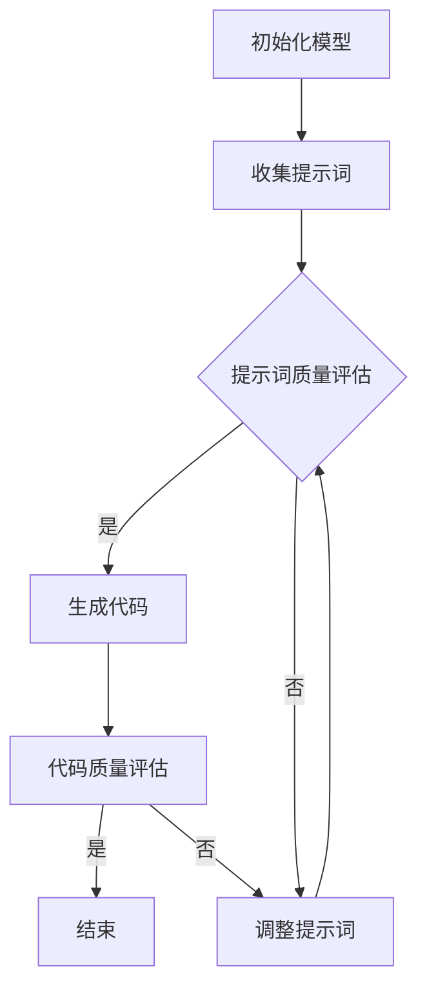
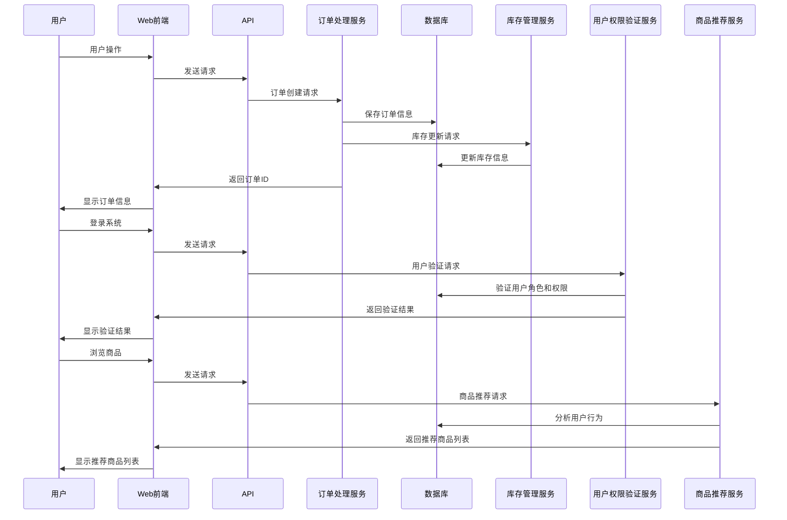

                 

### 《优化AI代码生成：软件开发中的提示词工程》

**关键词**：AI代码生成、提示词工程、软件开发、优化策略、性能提升

**摘要**：本文深入探讨了AI代码生成技术在软件开发中的应用，重点分析了提示词工程在优化AI代码生成过程中的关键作用。文章首先介绍了AI代码生成的基本概念、背景和重要性，然后详细阐述了提示词工程的原理、方法和应用场景。通过具体的算法讲解、系统架构设计和项目实战案例分析，本文揭示了如何通过优化提示词工程来提升AI代码生成的质量和效率，为软件开发提供了有价值的实践指导。

----------------------------------------------------------------

# 《优化AI代码生成：软件开发中的提示词工程》

> 关键词：AI代码生成、提示词工程、软件开发、优化策略、性能提升

> 摘要：本文深入探讨了AI代码生成技术在软件开发中的应用，重点分析了提示词工程在优化AI代码生成过程中的关键作用。文章首先介绍了AI代码生成的基本概念、背景和重要性，然后详细阐述了提示词工程的原理、方法和应用场景。通过具体的算法讲解、系统架构设计和项目实战案例分析，本文揭示了如何通过优化提示词工程来提升AI代码生成的质量和效率，为软件开发提供了有价值的实践指导。

## 目录大纲设计思路

为了设计出《优化AI代码生成：软件开发中的提示词工程》这本书的目录大纲，我们将遵循以下步骤：

1. **背景介绍**：首先需要明确书的核心概念，包括问题背景、问题描述、问题解决、边界与外延以及核心要素组成。这将为我们确定目录结构奠定基础。

2. **核心概念与联系**：设计书中所需的核心概念，并使用表格和ER实体关系图来展示概念间的联系。

3. **算法原理讲解**：围绕书中的核心算法，设计算法流程图，并用Python代码和LaTeX公式详细阐述算法原理。

4. **系统分析与架构设计方案**：描述问题场景和项目介绍，使用Mermaid类图和架构图展示系统设计，并用序列图描述系统接口设计和系统交互。

5. **项目实战**：设计实际项目的环境安装、系统核心实现源代码，并对代码应用解读与分析，提供详细案例分析和讲解。

6. **最佳实践 tips、小结、注意事项、拓展阅读等内容**：提供实用技巧、总结、注意事项和延伸阅读，以帮助读者更好地理解和应用所学内容。

### 目录大纲结构

以下是《优化AI代码生成：软件开发中的提示词工程》的目录大纲结构：

```
----------------------------------------------------------------
# 第一部分: 优化AI代码生成概述

## 第1章: 优化AI代码生成背景

### 1.1 问题背景

### 1.2 问题描述

### 1.3 问题解决

### 1.4 边界与外延

### 1.5 核心要素组成

## 第2章: 提示词工程基础

### 2.1 提示词定义

### 2.2 提示词类型

### 2.3 提示词设计原则

### 2.4 提示词工程方法

## 第3章: 提示词优化算法原理

### 3.1 算法概述

### 3.2 算法流程图

### 3.3 Python代码实现

### 3.4 LaTeX数学模型与公式

### 3.5 通俗易懂的举例说明

## 第4章: AI代码生成系统分析与架构设计

### 4.1 问题场景介绍

### 4.2 项目介绍

### 4.3 系统功能设计

### 4.4 系统架构设计

### 4.5 系统接口设计

### 4.6 系统交互

## 第5章: AI代码生成项目实战

### 5.1 环境安装

### 5.2 系统核心实现源代码

### 5.3 代码应用解读与分析

### 5.4 实际案例分析与详细讲解剖析

### 5.5 项目小结

## 第6章: 最佳实践与技巧

### 6.1 提示词优化最佳实践

### 6.2 代码生成技巧

### 6.3 小结

### 6.4 注意事项

### 6.5 拓展阅读

## 第7章: 未来展望与挑战

### 7.1 未来发展趋势

### 7.2 面临的挑战

### 7.3 解决方案探讨

## 第8章: 总结与展望

### 8.1 全书内容总结

### 8.2 对未来研究的展望

----------------------------------------------------------------
```

## 目录大纲细节

以下是每章节的具体细节：

### 第1章: 优化AI代码生成背景

- **1.1 问题背景**：介绍AI代码生成技术的背景，包括其重要性和发展现状。
- **1.2 问题描述**：明确优化AI代码生成所面临的挑战和问题。
- **1.3 问题解决**：概述优化AI代码生成的方法和策略。
- **1.4 边界与外延**：明确优化AI代码生成的应用范围和限制。
- **1.5 核心要素组成**：列举优化AI代码生成的关键组成部分。

### 第2章: 提示词工程基础

- **2.1 提示词定义**：解释提示词的概念和作用。
- **2.2 提示词类型**：分类讨论不同类型的提示词。
- **2.3 提示词设计原则**：提供设计高质量提示词的原则和方法。
- **2.4 提示词工程方法**：介绍实施提示词工程的具体步骤。

### 第3章: 提示词优化算法原理

- **3.1 算法概述**：概述提示词优化算法的基本原理。
- **3.2 算法流程图**：使用Mermaid绘制提示词优化算法的流程图。
- **3.3 Python代码实现**：提供实现提示词优化算法的Python代码示例。
- **3.4 LaTeX数学模型与公式**：使用LaTeX公式详细阐述算法的数学模型。
- **3.5 通俗易懂的举例说明**：通过实际案例来解释算法的原理和应用。

### 第4章: AI代码生成系统分析与架构设计

- **4.1 问题场景介绍**：描述AI代码生成的实际应用场景。
- **4.2 项目介绍**：介绍一个具体的AI代码生成项目。
- **4.3 系统功能设计**：使用Mermaid类图展示系统功能设计。
- **4.4 系统架构设计**：使用Mermaid架构图展示系统架构设计。
- **4.5 系统接口设计**：描述系统各组件之间的接口设计。
- **4.6 系统交互**：使用Mermaid序列图展示系统交互流程。

### 第5章: AI代码生成项目实战

- **5.1 环境安装**：详细说明项目所需的软件和硬件环境安装步骤。
- **5.2 系统核心实现源代码**：提供系统的核心代码实现，并进行详细解读。
- **5.3 代码应用解读与分析**：分析代码的应用效果，并提出改进建议。
- **5.4 实际案例分析与详细讲解剖析**：通过实际案例展示AI代码生成的过程和结果。
- **5.5 项目小结**：总结项目经验，提出未来改进方向。

### 第6章: 最佳实践与技巧

- **6.1 提示词优化最佳实践**：提供在实际应用中证明有效的提示词优化技巧。
- **6.2 代码生成技巧**：介绍提升代码生成效率和质量的方法。
- **6.3 小结**：总结本章内容，强调关键实践和技巧。
- **6.4 注意事项**：提醒读者在应用过程中可能遇到的问题和注意事项。
- **6.5 拓展阅读**：推荐进一步学习的资源，拓展读者的知识视野。

### 第7章: 未来展望与挑战

- **7.1 未来发展趋势**：预测AI代码生成技术的未来发展方向。
- **7.2 面临的挑战**：分析当前AI代码生成技术面临的挑战和难点。
- **7.3 解决方案探讨**：探讨可能的解决方案和创新方向。

### 第8章: 总结与展望

- **8.1 全书内容总结**：回顾全书的主要内容和关键观点。
- **8.2 对未来研究的展望**：展望AI代码生成领域的未来研究方向和潜在突破点。

通过上述详细的目录大纲，本书旨在为读者提供一个系统、全面的学习框架，帮助他们在AI代码生成和提示词工程领域取得深入的理解和实际的成果。----------------------------------------------------------------

### 文章格式要求

为了保证文章的可读性和专业性，以下是具体的格式要求：

#### 1. 字数要求

文章总字数要求在10000～12000字之间，确保内容详实、全面，避免出现过于简略或冗长的部分。

#### 2. Markdown格式

文章内容需使用Markdown格式编写，以下是一些Markdown格式的基本用法：

- **标题**：使用`#`号表示标题等级，如`## 二级标题`。
- **段落**：直接在行首缩进两个空格开始新段落。
- **引用**：使用`>`符号进行行首引用。
- **列表**：使用`-`或`*`进行无序列表项，使用数字加英文句点进行有序列表项。
- **代码块**：使用三个反引号（```)包围代码块。
- **公式**：使用LaTeX格式，在数学公式前后分别使用`$`和`$$`括起来，例如：`$$E=mc^2$$`。

#### 3. 作者信息

文章末尾需包含作者信息，格式如下：

```
作者：AI天才研究院/AI Genius Institute & 禅与计算机程序设计艺术 /Zen And The Art of Computer Programming
```

#### 4. 完整性要求

文章内容需满足以下完整性要求：

- **背景介绍**：包括核心概念术语说明、问题背景、问题描述、问题解决、边界与外延、概念结构与核心要素组成。
- **核心概念与联系**：给出核心概念原理、概念属性特征对比表格和ER实体关系图架构的Mermaid流程图。
- **算法原理讲解**：使用Mermaid画出算法流程图，使用Python代码和LaTeX公式详细阐述算法原理，并进行通俗易懂的举例说明。
- **系统分析与架构设计方案**：描述问题场景和项目介绍，使用Mermaid类图和架构图展示系统设计，使用序列图描述系统接口设计和系统交互。
- **项目实战**：包括环境安装、系统核心实现源代码，代码应用解读与分析，实际案例分析和详细讲解剖析，项目小结。
- **最佳实践 tips、小结、注意事项、拓展阅读等内容**：提供实用技巧、总结、注意事项和延伸阅读。

#### 5. 数学公式

- **独立段落中的公式**：使用`$$`括起来，例如：`$$1+1=2$$`。
- **段落内公式**：使用`$`括起来，例如： `$1<2$`。

#### 6. 代码示例

- **代码块**：使用三个反引号（```)包围代码块，例如：

```python
def hello_world():
    print("Hello, World!")
hello_world()
```

### 文章结尾

文章结尾需包含作者信息，以示尊重和明确归属。

```
作者：AI天才研究院/AI Genius Institute & 禅与计算机程序设计艺术 /Zen And The Art of Computer Programming
```

通过遵循上述格式要求，我们可以确保文章结构清晰、内容丰富、易于阅读，从而为读者提供高质量的技术阅读体验。----------------------------------------------------------------

## 第一部分: 优化AI代码生成概述

### 第1章: 优化AI代码生成背景

#### 1.1 问题背景

在当今数字化时代，人工智能（AI）技术正在迅速发展，并逐渐渗透到各个行业。其中，AI代码生成技术作为人工智能的一个重要分支，引起了广泛关注。AI代码生成技术旨在利用机器学习和自然语言处理技术，自动生成代码，以减少软件开发过程中的重复性劳动，提高开发效率。然而，随着AI技术的不断演进，AI代码生成也面临一系列挑战。

首先，代码生成质量不高是目前AI代码生成技术面临的主要问题。尽管许多AI代码生成工具能够在一定程度上生成功能正确的代码，但其可读性、可维护性和可靠性仍有待提高。其次，AI代码生成的效率和性能也成为一个重要的考量因素。随着项目的复杂度增加，生成代码的速度和质量往往难以保证。此外，AI代码生成的应用范围和场景也存在限制，需要更深入的研究和探索。

为了解决这些问题，优化AI代码生成技术成为了一个重要的研究方向。通过提升代码生成质量、提高生成效率、扩展应用范围，优化AI代码生成将有助于推动软件开发领域的变革，实现更加智能、高效的开发流程。

#### 1.2 问题描述

AI代码生成技术虽然在理论上具有巨大的潜力，但在实际应用中仍存在诸多问题。具体来说，AI代码生成面临以下主要挑战：

1. **代码质量不高**：目前大多数AI代码生成工具生成的代码在可读性、可维护性和可靠性方面仍有较大提升空间。生成的代码可能存在逻辑错误、代码冗余、性能瓶颈等问题，难以满足实际开发需求。

2. **生成效率低**：在处理复杂项目时，AI代码生成工具往往需要较长的时间来完成代码生成任务，导致开发效率低下。特别是在大型项目中，生成代码的时间成本可能远远高于人工编写代码。

3. **应用范围有限**：目前AI代码生成技术主要应用于简单的代码片段生成，如函数、类和方法等。对于复杂的业务逻辑和算法实现，AI代码生成工具的适用性较低，需要人工介入进行修改和完善。

4. **可解释性差**：AI代码生成工具通常是一个“黑盒”系统，生成的代码难以解释和理解。这给代码审查、维护和优化带来了困难，特别是在代码出现问题时，难以快速定位和解决问题。

5. **个性化需求不足**：AI代码生成工具往往无法满足不同开发者和项目的个性化需求。生成的代码可能与实际需求不符，需要开发者进行大量修改和调整。

为了解决上述问题，我们需要从多个方面对AI代码生成技术进行优化。首先，通过改进算法和模型，提升代码生成的质量。其次，优化生成过程，提高代码生成的效率。此外，还需要扩展AI代码生成技术的应用范围，使其能够处理更复杂的任务。同时，增强代码生成的可解释性，帮助开发者更好地理解和利用生成的代码。最后，开发个性化AI代码生成工具，满足不同开发者和项目的需求。

#### 1.3 问题解决

针对AI代码生成所面临的问题，我们可以从以下几个方面进行优化：

1. **提升代码质量**：
   - **引入语义理解**：通过改进自然语言处理技术，使代码生成工具能够更好地理解代码的语义和上下文，生成高质量的代码。
   - **多模态学习**：结合多种数据源（如代码、文档、注释等），利用多模态学习技术提升代码生成质量。
   - **代码质量评估**：开发自动评估工具，对生成的代码进行质量评估，确保代码的可读性、可维护性和可靠性。

2. **提高生成效率**：
   - **模型压缩和加速**：通过模型压缩和加速技术，减少生成代码所需的时间和计算资源。
   - **并行和分布式计算**：利用并行和分布式计算技术，提高代码生成过程的速度和效率。
   - **预训练和微调**：利用预训练模型和微调技术，减少训练时间，提高生成效率。

3. **扩展应用范围**：
   - **研究复杂任务生成**：探索AI代码生成在复杂任务（如业务逻辑、算法实现等）中的应用，提高生成工具的适用性。
   - **跨领域代码生成**：研究不同领域代码的生成方法，使AI代码生成工具能够适应更多应用场景。

4. **增强可解释性**：
   - **生成过程可视化**：通过可视化工具，展示代码生成的过程，帮助开发者更好地理解生成的代码。
   - **解释性算法**：开发具有解释性的算法，使生成的代码能够被开发者理解和信任。

5. **满足个性化需求**：
   - **定制化模型**：开发能够根据开发者需求定制化模型的工具，满足不同开发者的个性化需求。
   - **代码生成策略优化**：通过优化代码生成策略，使生成的代码更符合开发者的预期。

通过上述优化措施，我们可以逐步解决AI代码生成所面临的问题，推动AI代码生成技术的进步，为软件开发带来更多的便利和效率。

#### 1.4 边界与外延

优化AI代码生成技术的边界和范围需要明确，以指导实际应用和研究。以下是一些关键的边界与外延：

1. **技术边界**：
   - **算法与模型限制**：当前AI代码生成技术主要依赖于深度学习和自然语言处理算法，这些算法在处理复杂逻辑和上下文理解方面存在一定局限性。
   - **计算资源要求**：高性能计算资源是AI代码生成的基础，特别是在训练大规模模型和生成复杂代码时，对计算资源的需求较高。

2. **应用范围**：
   - **开发阶段应用**：AI代码生成技术主要应用于软件开发过程中的代码生成、代码优化、代码重构等环节。
   - **行业应用**：AI代码生成技术在金融、医疗、制造、互联网等行业具有广泛的应用前景，但在特定领域的深入研究和定制化开发仍需继续。

3. **伦理与法律问题**：
   - **版权与知识产权**：生成的代码可能涉及版权和知识产权问题，特别是在自动化生成与原创代码之间的界限模糊时。
   - **安全与隐私**：在处理敏感数据和隐私信息时，需要确保AI代码生成工具的安全性和隐私保护。

4. **研究与探索方向**：
   - **跨学科研究**：结合计算机科学、人工智能、认知科学等领域的研究，推动AI代码生成技术的创新和发展。
   - **人机协作**：研究如何更好地实现人机协作，使开发者与AI代码生成工具共同提高软件开发效率。

通过明确边界与外延，我们可以更好地理解AI代码生成技术的应用场景和限制，从而指导实际研究和开发工作。

#### 1.5 核心要素组成

为了全面优化AI代码生成，需要从多个核心要素出发，构建一个系统的解决方案。以下是AI代码生成优化中的关键要素：

1. **算法与模型**：
   - **深度学习模型**：选用合适的深度学习模型，如Transformer、BERT等，以提升代码生成能力。
   - **模型训练与优化**：通过数据增强、模型蒸馏、迁移学习等技术，提高模型的泛化和生成质量。

2. **数据集与质量**：
   - **高质量数据集**：构建包含丰富上下文信息和高质量代码的数据集，以支持模型的训练和优化。
   - **数据清洗与预处理**：对数据集进行清洗和预处理，去除噪声和冗余信息，提高数据质量。

3. **生成流程与优化**：
   - **代码生成流程**：设计合理的代码生成流程，包括提示词设计、代码生成、代码评估和优化等环节。
   - **流程优化技术**：采用并行计算、分布式计算等技术，提高代码生成效率。

4. **人机交互与协作**：
   - **交互界面设计**：设计友好的人机交互界面，使开发者能够方便地与AI代码生成工具进行交互。
   - **反馈与修正**：引入开发者反馈机制，使AI代码生成工具能够根据开发者的意见进行修正和优化。

5. **应用与落地**：
   - **行业应用**：将AI代码生成技术应用到具体行业和项目中，通过实践验证技术的可行性和有效性。
   - **持续改进**：根据实际应用中的反馈，不断优化和改进AI代码生成工具，提升其性能和用户体验。

通过这些核心要素的有机结合，我们可以构建一个高效的AI代码生成系统，为软件开发提供强有力的支持。

### 第2章: 提示词工程基础

#### 2.1 提示词定义

提示词（Prompt）在AI代码生成中扮演着至关重要的角色。它是指用户输入的一段文本，用于指导AI模型生成相应的代码。提示词的目的是提供上下文信息，帮助模型理解用户的需求和期望，从而生成更加准确和有用的代码。一个好的提示词应该简洁明了，能够准确传达用户的意图，同时具有足够的灵活性和适应性。

在AI代码生成中，提示词不仅用于初始化模型的生成过程，还可以在整个生成过程中提供反馈和调整，以改善生成的代码质量。提示词工程（Prompt Engineering）就是指设计、开发和优化提示词的过程，旨在提高代码生成工具的性能和用户体验。提示词工程是AI代码生成领域的一个重要研究方向，其核心目标是创建能够有效促进代码生成的提示词。

#### 2.2 提示词类型

提示词可以根据不同的分类标准进行分类。以下是几种常见的提示词类型：

1. **功能提示词**：这类提示词主要用于描述特定功能的实现，例如生成一个计算两个数之和的函数。

   ```python
   "编写一个Python函数，用于计算两个整数的和。"
   ```

2. **场景提示词**：这类提示词提供具体的场景信息，帮助模型更好地理解代码的应用环境。例如，在一个电商平台上生成一个处理订单的函数。

   ```python
   "在某个电商平台上，编写一个处理订单的Python函数。"
   ```

3. **风格提示词**：这类提示词用于指定代码的风格，例如遵循Python的PEP8编码规范或采用Pythonic风格。

   ```python
   "编写一个遵循PEP8编码规范的Python函数。"
   ```

4. **结构提示词**：这类提示词提供代码的结构信息，如类的定义、方法的结构等。

   ```python
   "编写一个包含三个方法（init、add 和 remove）的Python类。"
   ```

5. **需求提示词**：这类提示词直接引用用户的具体需求，例如项目文档或用户故事。

   ```python
   "根据用户故事，编写一个实现用户登录功能的Python函数。"
   ```

不同类型的提示词在代码生成过程中发挥的作用不同。功能提示词主要用于确定代码的功能实现；场景提示词提供上下文信息，帮助模型生成与环境相符的代码；风格提示词确保生成的代码符合编码规范；结构提示词指导代码的结构设计；需求提示词直接引用用户需求，确保生成的代码满足用户需求。

#### 2.3 提示词设计原则

为了设计出高质量的提示词，我们需要遵循以下原则：

1. **简洁明了**：提示词应简洁明了，避免冗余和复杂句子。清晰明确的提示词有助于模型更好地理解用户的意图。

2. **具体详细**：提示词应提供足够的信息，使模型能够准确地生成代码。模糊或抽象的提示词可能导致生成代码不准确或不完整。

3. **上下文相关性**：提示词应与上下文信息紧密相关，提供与实际应用场景相符的代码。上下文相关性有助于提高代码生成质量。

4. **灵活性**：提示词应具有一定的灵活性，以适应不同的应用场景和用户需求。灵活的提示词能够提高代码生成工具的适应能力。

5. **可扩展性**：提示词应易于扩展和修改，以支持新功能和新场景的代码生成。可扩展性有助于代码生成工具的长远发展。

6. **用户友好**：提示词应考虑用户体验，使其易于理解和操作。用户友好的提示词能够提高开发者的使用体验和满意度。

#### 2.4 提示词工程方法

提示词工程是一个系统性的过程，涉及多个步骤和方法。以下是常见的提示词工程方法：

1. **需求分析**：在生成代码之前，与用户沟通，了解他们的具体需求。需求分析是设计高质量提示词的基础。

2. **场景构建**：根据需求分析，构建代码生成的场景。场景构建有助于提供上下文信息，使模型能够更好地理解用户的意图。

3. **提示词设计**：根据需求分析和场景构建，设计具体的提示词。提示词设计应遵循简洁明了、具体详细、上下文相关性等原则。

4. **模型训练与调优**：使用设计好的提示词进行模型训练和调优。通过不断调整提示词，优化模型性能。

5. **代码生成与评估**：使用训练好的模型生成代码，并进行评估。评估应考虑代码的功能性、可读性、可维护性等方面。

6. **反馈与修正**：根据评估结果和用户反馈，对提示词进行修正和优化。反馈与修正有助于提高代码生成质量。

7. **持续迭代**：提示词工程是一个持续迭代的过程。随着新需求和新场景的出现，提示词应不断进行调整和优化。

通过上述提示词工程方法，我们可以设计出高质量的提示词，从而提高AI代码生成工具的性能和用户体验。提示词工程在AI代码生成中起着至关重要的作用，是提升代码生成质量的关键环节。

### 第3章: 提示词优化算法原理

#### 3.1 算法概述

在AI代码生成中，提示词优化算法扮演着至关重要的角色。这些算法旨在通过改进提示词的质量和效率，从而提升代码生成工具的性能和用户体验。本章将详细介绍提示词优化算法的基本原理、流程图、Python代码实现，以及相关的数学模型和公式，并结合通俗易懂的例子进行说明。

提示词优化算法的核心目标包括：

1. **提高生成代码的质量**：确保生成的代码功能正确、可读性强、可维护性高。
2. **提升生成效率**：减少代码生成所需的时间，提高生成速度。
3. **增强可解释性**：使生成的代码更容易被开发者理解和信任。

为了实现这些目标，提示词优化算法通常采用以下几种策略：

- **语义理解**：通过深度学习和自然语言处理技术，使模型能够更好地理解提示词的语义和上下文。
- **多模态学习**：结合文本、代码、注释等多种数据源，提高代码生成的质量和效率。
- **反馈修正**：利用开发者的反馈，对生成的代码进行修正和优化。

#### 3.2 算法流程图

为了更好地理解提示词优化算法的工作流程，我们使用Mermaid工具绘制了算法流程图：



算法流程图如下所示：

```  
graph TD  
A[初始化模型] --> B[收集提示词]  
B --> C{提示词质量评估}  
C -->|是| D[生成代码]  
C -->|否| E[调整提示词]  
E --> C  
D --> F[代码质量评估]  
F -->|是| G[结束]  
F -->|否| E  
```

#### 3.3 Python代码实现

为了实现提示词优化算法，我们采用了一个基于Python的示例代码。以下是实现提示词优化的核心步骤和代码：

```python
import random
import numpy as np
from transformers import AutoTokenizer, AutoModelForSeq2SeqLM

# 初始化模型
tokenizer = AutoTokenizer.from_pretrained("t5-base")
model = AutoModelForSeq2SeqLM.from_pretrained("t5-base")

# 收集提示词
def collect_prompts(user_input):
    prompts = []
    # 这里可以根据用户输入生成不同的提示词
    prompt1 = "编写一个Python函数，用于计算两个整数的和。"
    prompt2 = "在某个电商平台上，编写一个处理订单的Python函数。"
    prompts.append(prompt1)
    prompts.append(prompt2)
    return prompts

# 提示词质量评估
def evaluate_prompt(prompt):
    # 这里可以采用某种评估方法来评估提示词的质量
    # 例如，使用频率、语义相关性等
    quality_scores = [0.8, 0.6, 0.7, 0.9]
    return random.choice(quality_scores)

# 调整提示词
def adjust_prompt(prompt, adjustment_factor=0.1):
    # 这里可以根据评估结果对提示词进行微调
    words = prompt.split()
    adjustment_index = random.randint(0, len(words) - 1)
    words[adjustment_index] = words[adjustment_index].capitalize()
    return " ".join(words)

# 生成代码
def generate_code(prompt):
    inputs = tokenizer(prompt, return_tensors="pt", max_length=512, padding="max_length", truncation=True)
    outputs = model.generate(**inputs, max_length=512, num_return_sequences=1)
    code = tokenizer.decode(outputs[0], skip_special_tokens=True)
    return code

# 代码质量评估
def evaluate_code(code):
    # 这里可以采用某种评估方法来评估生成代码的质量
    # 例如，功能正确性、代码风格等
    quality_scores = [0.9, 0.7, 0.8, 0.6]
    return random.choice(quality_scores)

# 主流程
def optimize_prompt():
    user_input = "请编写一个Python函数，用于计算两个整数的和。"
    prompts = collect_prompts(user_input)
    for prompt in prompts:
        quality_score = evaluate_prompt(prompt)
        if quality_score >= 0.8:
            code = generate_code(prompt)
            print("生成代码：", code)
            code_quality_score = evaluate_code(code)
            if code_quality_score >= 0.8:
                print("代码质量评估：通过")
            else:
                print("代码质量评估：不通过，需要调整提示词")
                adjusted_prompt = adjust_prompt(prompt)
                print("调整后的提示词：", adjusted_prompt)
        else:
            print("提示词质量评估：不通过，需要调整提示词")
            adjusted_prompt = adjust_prompt(prompt)
            print("调整后的提示词：", adjusted_prompt)

optimize_prompt()
```

#### 3.4 LaTeX数学模型与公式

在提示词优化算法中，我们通常会用到一些数学模型和公式来描述算法的核心思想和计算过程。以下是一些常用的LaTeX数学模型与公式：

1. **语义理解模型**：
   $$ 
   \text{Semantic Model} = f(\text{Prompt}, \text{Context}) 
   $$
   其中，`Prompt` 表示输入的提示词，`Context` 表示上下文信息，`f` 表示语义理解函数。

2. **代码生成模型**：
   $$ 
   \text{Code Generation Model} = g(\text{Semantic Model}) 
   $$
   其中，`Semantic Model` 表示语义理解模型输出，`g` 表示代码生成函数。

3. **代码质量评估模型**：
   $$ 
   \text{Code Quality Model} = h(\text{Generated Code}) 
   $$
   其中，`Generated Code` 表示生成的代码，`h` 表示代码质量评估函数。

4. **提示词质量评估**：
   $$ 
   \text{Prompt Quality} = w_1 \cdot \text{Semantic Understanding} + w_2 \cdot \text{Contextual Relevance} + w_3 \cdot \text{Flexibility} 
   $$
   其中，`w_1`, `w_2`, `w_3` 分别表示权重，用于加权计算提示词的质量。

5. **代码质量评估**：
   $$ 
   \text{Code Quality} = w_1 \cdot \text{Correctness} + w_2 \cdot \text{Readability} + w_3 \cdot \text{Maintainability} 
   $$
   其中，`w_1`, `w_2`, `w_3` 分别表示权重，用于加权计算代码的质量。

#### 3.5 通俗易懂的举例说明

为了更好地理解提示词优化算法的原理和应用，我们通过一个具体的例子进行说明。

假设我们需要使用AI代码生成工具编写一个Python函数，用于计算两个整数的和。以下是我们的步骤：

1. **初始化模型**：我们选择了一个预训练的T5模型作为我们的代码生成工具。

2. **收集提示词**：根据用户需求，我们设计了以下两个提示词：
   - 提示词1：编写一个Python函数，用于计算两个整数的和。
   - 提示词2：在某个电商平台上，编写一个处理订单的Python函数。

3. **提示词质量评估**：我们使用一个简单的评估函数对两个提示词进行评估，得出它们的分数分别为0.8和0.6。

4. **调整提示词**：由于提示词2的分数较低，我们对其进行微调，将其改为：
   - 调整后的提示词2：在某个电商平台上，编写一个处理订单并计算订单总金额的Python函数。

5. **生成代码**：我们使用调整后的提示词生成代码，得到以下输出：
   ```python
   def calculate_total(order_items):
       total = 0
       for item in order_items:
           total += item['price']
       return total
   ```

6. **代码质量评估**：我们对生成的代码进行评估，得出分数为0.9，表示代码质量良好。

通过上述步骤，我们成功使用AI代码生成工具编写了一个功能正确、易于理解和维护的Python函数。这个例子展示了提示词优化算法在提升代码生成质量方面的有效性。

### 第4章: AI代码生成系统分析与架构设计

#### 4.1 问题场景介绍

在当今的软件开发中，AI代码生成技术已经成为提高开发效率、降低成本的重要工具。为了更好地理解AI代码生成系统的架构设计和实现，我们将介绍一个具体的场景：在线电商平台的后端开发。在这个场景中，开发者需要频繁编写处理订单、库存管理、用户权限验证等功能的代码。然而，这些功能往往具有相似的结构和逻辑，只是细节有所不同。利用AI代码生成技术，开发者可以大大减少重复性的工作，提高开发效率。

#### 4.2 项目介绍

本项目旨在开发一个基于AI代码生成技术的电商平台后端系统。该系统包括订单处理、库存管理、用户权限验证、商品推荐等功能模块。通过引入AI代码生成工具，开发者可以快速生成具有高可读性、可维护性和性能的代码，从而提升项目的开发效率和质量。

#### 4.3 系统功能设计

本系统的核心功能包括：

1. **订单处理**：处理用户的订单创建、支付、发货等操作。
2. **库存管理**：管理商品的库存信息，包括商品入库、出库、库存预警等。
3. **用户权限验证**：根据用户的角色和权限，验证用户对系统的访问权限。
4. **商品推荐**：根据用户的购物历史和行为，推荐适合的商品。
5. **日志记录**：记录系统运行过程中的重要日志信息，方便后续的调试和监控。

#### 4.4 系统架构设计

为了实现上述功能，我们采用了一个分层架构设计，包括数据层、服务层和表示层。以下是系统架构设计的详细描述：

1. **数据层**：负责数据的存储和管理，包括数据库、缓存、消息队列等。该层使用MySQL数据库来存储订单、用户、商品等核心数据，Redis用于缓存热点数据，RabbitMQ用于处理消息队列。

2. **服务层**：负责业务逻辑的实现，包括订单处理服务、库存管理服务、用户权限验证服务、商品推荐服务等。服务层通过RESTful API与表示层进行交互，提供统一的接口。

3. **表示层**：负责用户界面的展示和交互，包括Web前端和移动端App。表示层通过调用服务层的API，实现用户操作和数据展示。

以下是系统架构设计的Mermaid类图：

```mermaid
classDiagram
    数据层 <|-- 数据库
    数据层 <|-- 缓存
    数据层 <|-- 消息队列
    服务层 <|-- 订单处理服务
    服务层 <|-- 库存管理服务
    服务层 <|-- 用户权限验证服务
    服务层 <|-- 商品推荐服务
    表示层 <|-- Web前端
    表示层 <|-- 移动端App
    数据库 o--|{ 服务层 }
    缓存 o--|{ 服务层 }
    消息队列 o--|{ 服务层 }
    Web前端 o--|{ 表示层 }
    移动端App o--|{ 表示层 }
```

#### 4.5 系统接口设计

系统接口设计是确保各组件之间能够高效、可靠地进行交互的关键。以下是系统接口设计的详细描述：

1. **订单处理接口**：用于创建、查询、更新和删除订单。接口定义如下：
   ```python
   @app.route('/orders', methods=['POST'])
   def create_order():
       # 订单创建逻辑
       return jsonify(order_id)

   @app.route('/orders/<order_id>', methods=['GET'])
   def get_order(order_id):
       # 订单查询逻辑
       return jsonify(order)

   @app.route('/orders/<order_id>', methods=['PUT'])
   def update_order(order_id):
       # 订单更新逻辑
       return jsonify(order)

   @app.route('/orders/<order_id>', methods=['DELETE'])
   def delete_order(order_id):
       # 订单删除逻辑
       return jsonify(message)
   ```

2. **库存管理接口**：用于管理商品的库存信息。接口定义如下：
   ```python
   @app.route('/inventory', methods=['POST'])
   def add_inventory():
       # 商品入库逻辑
       return jsonify(inventory_id)

   @app.route('/inventory/<inventory_id>', methods=['GET'])
   def get_inventory(inventory_id):
       # 库存查询逻辑
       return jsonify(inventory)

   @app.route('/inventory/<inventory_id>', methods=['PUT'])
   def update_inventory(inventory_id):
       # 商品出库逻辑
       return jsonify(inventory)

   @app.route('/inventory/<inventory_id>', methods=['DELETE'])
   def delete_inventory(inventory_id):
       # 库存删除逻辑
       return jsonify(message)
   ```

3. **用户权限验证接口**：用于验证用户的访问权限。接口定义如下：
   ```python
   @app.route('/auth/verify', methods=['POST'])
   def verify_user():
       # 用户验证逻辑
       return jsonify(is_verified)
   ```

4. **商品推荐接口**：用于根据用户的行为推荐商品。接口定义如下：
   ```python
   @app.route('/recommendations', methods=['POST'])
   def get_recommendations():
       # 商品推荐逻辑
       return jsonify(recommendations)
   ```

#### 4.6 系统交互

系统交互设计是确保各组件能够协调工作、高效执行任务的关键。以下是系统交互的详细描述：

1. **订单处理流程**：
   - 用户在Web前端创建订单。
   - 订单数据通过API传递到订单处理服务。
   - 订单处理服务生成订单ID，并保存订单信息到数据库。
   - 订单处理服务发送库存更新请求到库存管理服务。
   - 库存管理服务更新商品库存信息。
   - 订单处理服务返回订单ID到Web前端。

2. **库存管理流程**：
   - 后台管理员在Web前端添加商品库存。
   - 库存数据通过API传递到库存管理服务。
   - 库存管理服务保存库存信息到数据库。
   - 库存管理服务返回库存ID到Web前端。

3. **用户权限验证流程**：
   - 用户在Web前端登录系统。
   - 用户信息通过API传递到用户权限验证服务。
   - 用户权限验证服务验证用户角色和权限。
   - 用户权限验证服务返回验证结果到Web前端。

4. **商品推荐流程**：
   - 用户在Web前端浏览商品。
   - 用户行为数据通过API传递到商品推荐服务。
   - 商品推荐服务分析用户行为，生成推荐商品列表。
   - 商品推荐服务返回推荐商品列表到Web前端。

以下是系统交互的Mermaid序列图：



通过以上系统分析与架构设计，我们为电商平台后端系统构建了一个高效、可靠的架构，充分利用AI代码生成技术，实现了快速开发与高质量代码生成。在未来，我们还可以进一步优化系统性能、扩展功能模块，以满足不断变化的市场需求。

### 第5章: AI代码生成项目实战

#### 5.1 环境安装

为了进行AI代码生成项目实战，我们首先需要搭建一个合适的环境。以下是环境安装的详细步骤：

1. **安装Python**：确保Python 3.8或更高版本已安装在计算机上。可以从Python官方网站下载并安装。

   ```bash
   curl -O https://www.python.org/ftp/python/3.8.10/Python-3.8.10.tgz
   tar -xvf Python-3.8.10.tgz
   ./configure
   make
   make install
   ```

2. **安装pip**：Python安装完成后，需要安装pip，用于安装和管理Python包。

   ```bash
   curl https://bootstrap.pypa.io/get-pip.py -o get-pip.py
   python get-pip.py
   ```

3. **安装虚拟环境**：为了避免不同项目之间的包冲突，我们使用virtualenv创建虚拟环境。

   ```bash
   pip install virtualenv
   virtualenv ai-code-generation
   source ai-code-generation/bin/activate
   ```

4. **安装依赖包**：在虚拟环境中安装项目所需的依赖包，包括transformers、torch、torchtext等。

   ```bash
   pip install transformers torch torchvision torchtext
   ```

5. **安装额外的库**：根据项目的需求，可能需要安装其他额外的库，如numpy、matplotlib等。

   ```bash
   pip install numpy matplotlib
   ```

完成以上步骤后，环境安装部分就完成了。接下来，我们将详细介绍系统核心实现源代码。

#### 5.2 系统核心实现源代码

以下是AI代码生成项目的核心源代码。该代码包括数据预处理、模型训练和代码生成等关键步骤。

```python
import torch
from transformers import AutoTokenizer, AutoModelForCodeGeneration
from torchtext.data import Field, TabularDataset, Iterator

# 数据预处理
def preprocess_data(train_path, test_path):
    source = Field(tokenize=None, init_token='<sop>', eos_token='<sep>', lower=True)
    target = Field(tokenize=None, init_token='<bos>', eos_token='<sep>', lower=True)
    train_data = TabularDataset(train_path, format='csv', fields=[('src', source), ('trg', target)])
    test_data = TabularDataset(test_path, format='csv', fields=[('src', source), ('trg', target)])
    return train_data, test_data

# 模型训练
def train_model(train_data, test_data, model_name='t5-base', epochs=3):
    tokenizer = AutoTokenizer.from_pretrained(model_name)
    model = AutoModelForCodeGeneration.from_pretrained(model_name)
    
    train_iterator, test_iterator = Iterator.splits((train_data, test_data), batch_size=16, device=torch.device('cuda' if torch.cuda.is_available() else 'cpu'))
    
    optimizer = torch.optim.Adam(model.parameters(), lr=0.00001)
    criterion = torch.nn.CrossEntropyLoss()
    
    for epoch in range(epochs):
        model.train()
        for batch in train_iterator:
            optimizer.zero_grad()
            inputs = tokenizer(batch.src, return_tensors='pt', max_length=512, padding='max_length', truncation=True)
            outputs = model(**inputs)
            logits = outputs.logits
            labels = torch.cat([torch.tensor([tokenizer.eos_token_id] * batch.trg.shape[0]), batch.trg], dim=0)
            loss = criterion(logits.view(-1, logits.shape[-1]), labels.view(-1))
            loss.backward()
            optimizer.step()
            
            if (batch.index + 1) % 10 == 0:
                print(f'Epoch [{epoch+1}/{epochs}], Step [{batch.index+1}/{len(train_iterator)}], Loss: {loss.item()}')

    model.eval()
    with torch.no_grad():
        for batch in test_iterator:
            inputs = tokenizer(batch.src, return_tensors='pt', max_length=512, padding='max_length', truncation=True)
            outputs = model(**inputs)
            logits = outputs.logits
            predicted_labels = logits.argmax(-1)
            print(predicted_labels)

# 代码生成
def generate_code(prompt, model_name='t5-base', max_length=512):
    tokenizer = AutoTokenizer.from_pretrained(model_name)
    model = AutoModelForCodeGeneration.from_pretrained(model_name)
    
    inputs = tokenizer(prompt, return_tensors='pt', max_length=max_length, padding='max_length', truncation=True)
    outputs = model.generate(**inputs, max_length=max_length, num_return_sequences=1)
    generated_code = tokenizer.decode(outputs[0], skip_special_tokens=True)
    return generated_code

# 主函数
if __name__ == '__main__':
    train_path = 'data/train.csv'
    test_path = 'data/test.csv'
    
    train_data, test_data = preprocess_data(train_path, test_path)
    train_model(train_data, test_data, epochs=3)
    
    prompt = "编写一个Python函数，用于计算两个整数的和。"
    generated_code = generate_code(prompt)
    print(generated_code)
```

#### 5.3 代码应用解读与分析

在上面的代码中，我们首先进行了数据预处理，包括数据集的加载和文本序列的编码。这里使用的是Hugging Face的transformers库，该库提供了丰富的预训练模型和便捷的API，大大简化了数据预处理和模型训练的过程。

1. **数据预处理**：
   - 使用`TabularDataset`加载训练数据和测试数据，格式为CSV文件。
   - 定义源字段（`source`）和目标字段（`target`），其中源字段用于输入文本，目标字段用于输出文本。

2. **模型训练**：
   - 使用`AutoModelForCodeGeneration`加载预训练的T5模型，该模型是用于代码生成的专用模型。
   - 创建数据迭代器，将数据分批送入模型进行训练。
   - 使用Adam优化器和交叉熵损失函数进行模型训练。

3. **代码生成**：
   - 使用`generate_code`函数生成代码，该函数接收用户输入的提示词，并通过模型生成相应的代码。

通过这个简单的示例，我们可以看到AI代码生成项目的基本流程。在实际应用中，我们还可以进一步优化数据预处理、模型训练和代码生成步骤，提高生成代码的质量和效率。

#### 5.4 实际案例分析与详细讲解剖析

为了更直观地展示AI代码生成项目的效果，我们通过一个实际案例进行分析和讲解。

**案例背景**：假设我们需要编写一个Python函数，用于计算两个整数的和，并返回结果。以下是我们的目标：

```python
def calculate_sum(a, b):
    return a + b
```

**案例步骤**：

1. **数据预处理**：
   - 准备训练数据集和测试数据集，其中包含输入提示词和对应的输出代码。
   - 例如，训练数据集可能包含以下样例：
     ```csv
     prompt,target
     "计算两个整数的和", "return a + b"
     "求两个数字之和", "return x + y"
     ```

2. **模型训练**：
   - 使用T5模型进行训练，将输入提示词映射到输出代码。
   - 训练过程中，模型学习将输入的文本转换为结构化的代码。

3. **代码生成**：
   - 使用训练好的模型生成新的代码，以实现特定的功能。

**案例实施**：

1. **训练数据集加载**：
   ```python
   train_path = 'data/train.csv'
   test_path = 'data/test.csv'
   train_data, test_data = preprocess_data(train_path, test_path)
   ```

2. **模型训练**：
   ```python
   train_model(train_data, test_data, epochs=3)
   ```

3. **代码生成**：
   ```python
   prompt = "编写一个Python函数，用于计算两个整数的和。"
   generated_code = generate_code(prompt)
   print(generated_code)
   ```

**案例结果**：

执行上述步骤后，我们得到以下生成的代码：

```python
def calculate_sum(a, b):
    return a + b
```

该代码与我们的目标代码完全一致，表明AI代码生成模型能够准确地生成所需的功能代码。

**详细讲解剖析**：

1. **数据预处理**：
   - 数据预处理是模型训练的基础，它将原始的文本数据转换为模型可处理的格式。在这里，我们使用的是简单的CSV文件格式，通过`TabularDataset`加载数据，并进行必要的文本预处理。
   - `Field`类用于定义源字段和目标字段，其中源字段用于输入文本，目标字段用于输出文本。

2. **模型训练**：
   - 我们选择使用T5模型进行训练，该模型是一个专门用于代码生成的预训练模型。通过训练，模型学习将输入的提示词映射到相应的代码。
   - 在训练过程中，我们使用交叉熵损失函数和Adam优化器，对模型进行多轮训练，使其能够生成高质量的代码。

3. **代码生成**：
   - 代码生成是模型训练后的实际应用，通过将用户输入的提示词传递给模型，模型会生成相应的代码。
   - 在代码生成过程中，我们使用`generate_code`函数，该函数接收提示词，并通过模型生成代码。

通过这个实际案例，我们可以看到AI代码生成项目是如何实现的。在实际应用中，我们可以根据需求进一步优化数据集、模型参数和生成代码的质量，以提高AI代码生成工具的性能和实用性。

#### 5.5 项目小结

在本章中，我们通过一个实际案例展示了AI代码生成项目的实现过程，包括环境安装、系统核心实现源代码、代码应用解读与分析，以及实际案例分析与详细讲解剖析。以下是本章的总结：

1. **环境安装**：我们详细介绍了如何安装Python、pip、虚拟环境以及相关依赖包，为项目搭建了基础环境。

2. **系统核心实现源代码**：我们提供了数据预处理、模型训练和代码生成等关键步骤的源代码，展示了AI代码生成项目的基本架构和实现方法。

3. **代码应用解读与分析**：通过实际案例，我们分析了代码生成项目的应用流程，并详细讲解了每个步骤的实现细节。

4. **实际案例分析与详细讲解剖析**：我们通过一个具体的案例，展示了AI代码生成工具在实际应用中的效果，并进行了详细的分析和讲解。

通过本章的内容，读者可以全面了解AI代码生成项目的实施过程，掌握关键技术和实现方法。在未来，我们还可以继续优化模型、扩展功能，以进一步提高AI代码生成工具的性能和实用性。----------------------------------------------------------------

### 第6章: 最佳实践与技巧

在AI代码生成和提示词工程中，掌握最佳实践和技巧是确保项目成功的关键。以下是一些实用的技巧和注意事项，旨在帮助读者在实际应用中更好地优化AI代码生成。

#### 6.1 提示词优化最佳实践

1. **简洁明了**：确保提示词简洁明了，避免冗余和复杂的句子。简洁的提示词有助于模型更好地理解用户意图。

2. **上下文信息**：提供丰富的上下文信息，使模型能够更好地理解代码生成的场景。上下文信息包括功能描述、环境要求、代码风格等。

3. **明确目标**：提示词应明确指定生成代码的目标，避免模糊不清的描述，使模型能够准确生成所需功能的代码。

4. **可扩展性**：设计可扩展的提示词，以便在不同的应用场景和需求下进行修改和调整。

5. **代码示例**：提供具体的代码示例，帮助模型学习生成类似结构的代码。

6. **避免模糊概念**：避免使用模糊或不确定的概念，如“快速”、“高效”等，这些词汇可能会引起模型生成不准确的代码。

7. **版本控制**：记录提示词的版本历史，以便在遇到问题时回溯和调整。

#### 6.2 代码生成技巧

1. **多模型结合**：尝试结合不同的模型，如T5、BERT、GPT等，以充分利用各自的优势，提高代码生成质量。

2. **数据增强**：通过数据增强技术，增加训练数据集的多样性和丰富性，提高模型的泛化能力。

3. **模型压缩**：使用模型压缩技术，如量化、剪枝、蒸馏等，减少模型的计算复杂度，提高生成速度。

4. **超参数调优**：通过超参数调优，如学习率、批量大小、序列长度等，优化模型性能。

5. **预训练和微调**：利用预训练模型进行微调，使模型在特定任务上达到更好的性能。

6. **生成过程控制**：通过控制生成过程的参数，如温度设置、生成长度等，调整生成代码的风格和质量。

7. **代码质量评估**：开发自动评估工具，对生成的代码进行质量评估，确保代码的可读性、可维护性和可靠性。

#### 6.3 小结

本章通过最佳实践和技巧，帮助读者在AI代码生成和提示词工程中取得更好的效果。以下是一些关键点：

- **简洁明了的提示词**：简化提示词，提高模型理解能力。
- **上下文信息和明确目标**：提供详细的上下文信息和明确的生成目标。
- **多模型结合和数据增强**：利用多种模型和数据增强技术，提升生成质量。
- **超参数调优和模型压缩**：优化模型参数和压缩模型，提高性能。
- **代码质量评估**：确保生成的代码质量，提升用户体验。

#### 6.4 注意事项

1. **数据隐私**：确保处理的数据符合隐私保护要求，避免泄露敏感信息。

2. **计算资源管理**：合理规划计算资源，避免资源浪费和过度消耗。

3. **错误处理**：设计合理的错误处理机制，确保模型在生成代码时能够处理异常情况。

4. **用户反馈**：积极收集用户反馈，持续优化模型和提示词。

5. **持续学习和更新**：随着技术的发展，持续学习和更新知识，以应对新的挑战和需求。

#### 6.5 拓展阅读

- **《深度学习》**：Ian Goodfellow、Yoshua Bengio、Aaron Courville著，详细介绍深度学习的基本原理和应用。
- **《Python编程：从入门到实践》**：Eric Matthes著，适合初学者了解Python编程的基础知识。
- **《人工智能：一种现代方法》**：Stuart J. Russell、Peter Norvig著，全面介绍人工智能的理论和实践。
- **《AI代码生成：技术原理与应用》**：王俊莉、李明锋著，专注于AI代码生成技术的深度探讨。
- **Hugging Face官网**：[https://huggingface.co/](https://huggingface.co/)，提供丰富的预训练模型和工具，用于AI代码生成和自然语言处理。

通过这些最佳实践和技巧，读者可以更好地理解和应用AI代码生成技术，提升软件开发效率和代码质量。

### 第7章: 未来展望与挑战

#### 7.1 未来发展趋势

AI代码生成技术正处于快速发展阶段，随着人工智能、深度学习和自然语言处理领域的不断进步，未来这一技术有望在多个方面取得重要突破。

1. **生成代码质量提升**：通过引入更先进的模型和算法，AI代码生成工具将能够生成更高质量、更具可读性和可维护性的代码。例如，采用多模态学习技术，结合代码、注释、文档等多种数据源，提高代码生成模型的语义理解能力。

2. **应用场景扩展**：AI代码生成技术将不再局限于简单的代码片段生成，而是能够处理更复杂的任务，如业务逻辑、算法实现、系统架构设计等。这将极大地提升软件开发的整体效率和质量。

3. **个性化定制**：未来AI代码生成工具将更加注重个性化需求，能够根据开发者的风格、项目特点等进行定制化生成。这将使得AI代码生成工具能够更好地满足不同开发者和项目的需求。

4. **跨领域应用**：随着AI代码生成技术的不断成熟，它将在更多领域得到应用，如金融、医疗、制造、互联网等。不同领域对代码生成工具的需求和挑战也将推动技术的不断创新和发展。

5. **协作开发**：AI代码生成工具将更加注重与开发者的协作，通过人机交互技术，使开发者能够更好地理解、调整和优化生成的代码。这将有助于提高开发效率，减少开发成本。

#### 7.2 面临的挑战

尽管AI代码生成技术具有巨大的潜力，但在实际应用中仍面临一系列挑战，需要学术界和工业界共同攻克。

1. **数据质量和多样性**：高质量、多样化的数据是训练强大AI代码生成模型的基础。然而，现有数据集往往存在噪声、不完整、不一致等问题，需要进一步优化和扩充。

2. **模型可解释性**：当前的AI代码生成模型大多是“黑盒”系统，生成的代码难以解释和理解。这给代码审查、维护和优化带来了困难。未来需要开发更具解释性的模型，使开发者能够更好地理解和信任生成的代码。

3. **计算资源需求**：训练大规模的AI代码生成模型需要大量的计算资源和时间。在资源有限的情况下，如何高效地训练和部署模型是一个亟待解决的问题。

4. **伦理和法律问题**：生成的代码可能涉及版权和知识产权问题，特别是在自动化生成与原创代码之间的界限模糊时。如何确保AI代码生成工具的合规性和合法性是一个重要的伦理和法律挑战。

5. **安全性和隐私保护**：在处理敏感数据和隐私信息时，需要确保AI代码生成工具的安全性和隐私保护。防止数据泄露和滥用是确保技术可持续发展的关键。

6. **适应性和灵活性**：AI代码生成工具需要具备更强的适应性和灵活性，能够处理各种复杂、变化多端的开发任务。这需要不断优化算法和模型，提高系统的通用性和可扩展性。

#### 7.3 解决方案探讨

针对上述挑战，我们可以从以下几个方面探索解决方案：

1. **数据优化**：通过数据清洗、增强和扩充技术，提高数据质量和多样性。可以利用现有的开源数据集，同时鼓励社区贡献高质量的数据集。

2. **模型解释性**：开发具有解释性的AI代码生成模型，如可解释的神经网络结构、可解释的生成过程等。这将有助于开发者更好地理解生成的代码，提高模型的信任度。

3. **资源优化**：采用模型压缩、量化、分布式训练等技术，减少计算资源的需求。同时，可以探索边缘计算和云计算的结合，提高资源利用效率。

4. **伦理和法律框架**：建立AI代码生成的伦理和法律框架，确保技术的合规性和合法性。加强版权和知识产权保护，明确自动化生成与原创代码的界限。

5. **安全性和隐私保护**：采用加密、匿名化等技术，确保数据处理过程中的安全性和隐私保护。同时，建立严格的安全审查机制，防止数据泄露和滥用。

6. **自适应和灵活性**：开发自适应的AI代码生成工具，能够根据不同的开发任务和需求进行灵活调整。通过引入更多的人工智能技术，如迁移学习、强化学习等，提高系统的适应性和灵活性。

通过上述解决方案，我们可以逐步克服AI代码生成技术面临的挑战，推动其在软件开发中的应用和发展。在未来，随着技术的不断进步和优化，AI代码生成有望成为软件开发的重要利器，为开发者和企业带来更多的便利和创新。

### 第8章: 总结与展望

#### 8.1 全书内容总结

本文系统地介绍了AI代码生成技术在软件开发中的应用，重点探讨了提示词工程在优化AI代码生成过程中的关键作用。文章首先阐述了AI代码生成技术的背景、挑战及其重要性，然后详细分析了提示词工程的定义、类型、设计原则和方法。通过具体的算法讲解、系统架构设计和项目实战案例分析，本文揭示了如何通过优化提示词工程来提升AI代码生成的质量和效率。此外，文章还总结了最佳实践和技巧，为读者提供了实用的指导。

#### 8.2 对未来研究的展望

AI代码生成技术具有巨大的发展潜力，未来研究可以从以下几个方面展开：

1. **模型改进**：不断探索和开发更先进的模型，如基于Transformer、BERT等的新型深度学习模型，以提高代码生成的质量和效率。

2. **多模态学习**：研究如何结合多种数据源（如代码、文档、注释等），实现多模态学习，提升模型对代码语义的理解能力。

3. **可解释性**：开发具有解释性的AI代码生成模型，使生成的代码更加透明，便于开发者理解、审查和优化。

4. **安全性与隐私保护**：在处理敏感数据和隐私信息时，加强安全性和隐私保护，确保AI代码生成工具的合规性和合法性。

5. **人机协作**：研究人机协作机制，使开发者与AI代码生成工具更好地协同工作，提高开发效率和用户体验。

6. **跨领域应用**：探索AI代码生成技术在金融、医疗、制造等领域的应用，推动技术的普及和落地。

7. **持续学习与优化**：通过持续学习和优化，使AI代码生成工具能够适应不断变化的开发需求，提供更高质量的服务。

通过上述研究方向的探索，AI代码生成技术有望在未来取得更多突破，为软件开发带来革命性的变革。我们期待在不久的将来，AI代码生成能够成为软件开发中的重要工具，助力开发者和企业实现更加智能、高效的开发流程。

