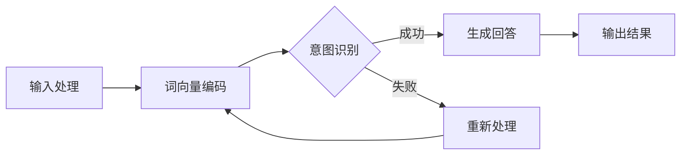
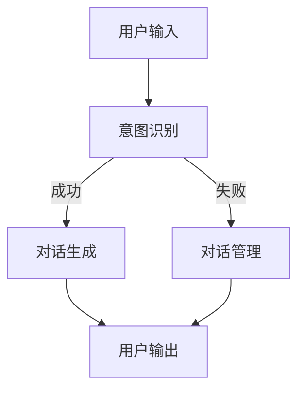
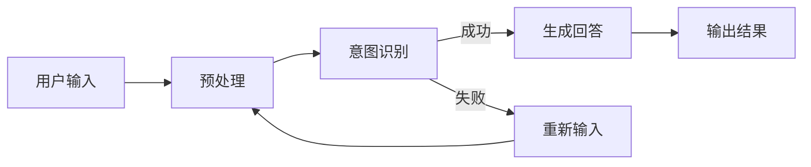
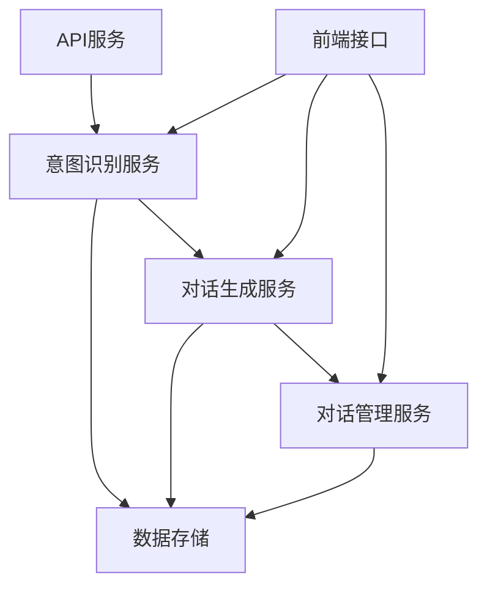
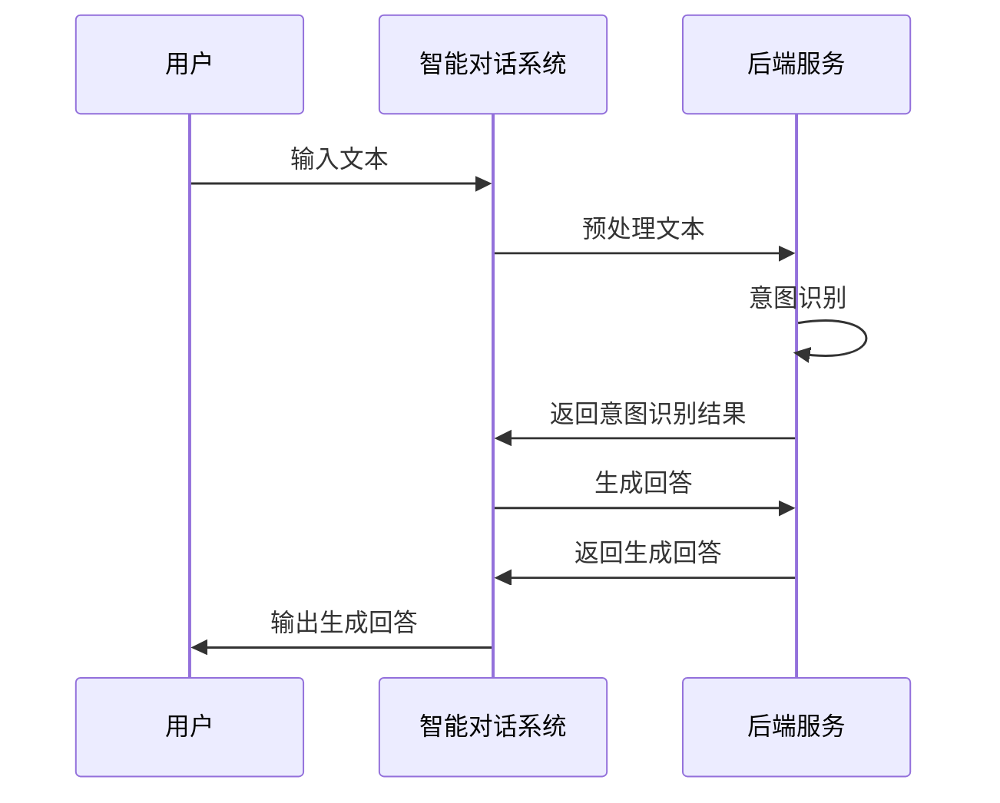

                 

### 文章标题

优化AI对话系统：自然对话流的提示词工程

关键词：AI对话系统、优化、自然对话流、提示词工程

摘要：本文将深入探讨AI对话系统的优化，特别是自然对话流的提示词工程。通过分析问题背景、核心概念与联系、算法原理、系统分析与架构设计，再到项目实战，我们将逐步揭示如何提升AI对话系统的自然对话能力，使其更贴近人类交流的体验。

---

## 第一部分：背景介绍

### 1.1 问题背景

在人工智能领域，对话系统已经成为一种重要的交互方式，广泛应用于客服、教育、医疗等多个行业。然而，现有的AI对话系统在应对复杂、自然的人类语言方面仍存在许多不足，如对话理解不准确、对话生成不自然等。优化AI对话系统，提高其自然对话流的生成能力，成为当前研究的热点。

### 1.2 问题描述

优化AI对话系统主要涉及以下问题：

1. **对话理解**：如何让AI更好地理解用户输入的语言，准确提取出用户的需求和意图。
2. **对话生成**：如何在理解用户需求的基础上，生成自然、流畅的回答。
3. **对话流畅度**：如何保持对话的连贯性，让用户感受到自然的交流体验。

### 1.3 问题解决

优化AI对话系统的方法主要包括以下几个方面：

1. **增强对话理解能力**：通过改进自然语言处理技术，提高AI对用户输入的理解准确性。
2. **提升对话生成能力**：通过改进生成式对话系统，提高AI生成回答的自然性和流畅度。
3. **优化对话流畅度**：通过设计合理的对话流程，确保对话的连贯性和流畅性。

### 1.4 边界与外延

优化AI对话系统的边界主要涉及自然语言处理、机器学习、对话系统设计等领域的知识。而其外延则包括但不限于客服、教育、医疗、智能家居等多个行业。

### 1.5 概念结构与核心要素组成

优化AI对话系统的核心概念和要素主要包括：

1. **自然语言处理技术**：如词法分析、句法分析、语义分析等。
2. **机器学习算法**：如神经网络、生成对抗网络等。
3. **对话系统设计**：包括对话流程设计、对话管理、对话生成等。

---

## 第二部分：核心概念与联系

### 2.1 核心概念

在优化AI对话系统的过程中，我们需要理解以下几个核心概念：

1. **自然语言处理（NLP）**：研究如何让计算机理解和生成自然语言的技术。
2. **机器学习（ML）**：一种让计算机通过数据学习并做出决策的技术。
3. **深度学习（DL）**：一种基于神经网络的人工智能技术。
4. **对话系统**：一种与人类进行交互的计算机系统。
5. **优化方法**：提高对话系统性能的各种技术手段。

### 2.2 概念属性特征对比表格

| 概念        | 特征             | 关联性             |
| ----------- | ---------------- | ------------------ |
| 自然语言处理 | 理解人类语言     | 对话系统的基石     |
| 机器学习    | 自动学习规律     | 对话系统的核心     |
| 深度学习    | 结构化数据学习   | 对话系统的关键技术 |
| 对话系统    | 交互性           | 优化目标           |
| 优化方法    | 提高系统性能     | 对话系统的提升     |

### 2.3 ER实体关系图架构

```mermaid
erDiagram
  AI对话系统 ||--|{ 自然语言处理 }
  AI对话系统 ||--|{ 机器学习 }
  AI对话系统 ||--|{ 深度学习 }
  自然语言处理 ||--|{ 词法分析 }
  自然语言处理 ||--|{ 句法分析 }
  自然语言处理 ||--|{ 语义分析 }
  机器学习 ||--|{ 神经网络 }
  机器学习 ||--|{ 生成对抗网络 }
  深度学习 ||--|{ 卷积神经网络 }
  深度学习 ||--|{ 循环神经网络 }
```

---

## 第三部分：算法原理讲解

### 3.1 算法流程图



### 3.2 Python 源代码

```python
import numpy as np
from sklearn.feature_extraction.text import CountVectorizer
from sklearn.naive_bayes import MultinomialNB
from sklearn.pipeline import make_pipeline

# 数据预处理
def preprocess_text(text):
    # 去除标点符号和停用词
    return ' '.join([word for word in text.split() if word.lower() not in stop_words])

# 意图识别模型
def build_intent_recognition_model(train_data, train_labels):
    pipeline = make_pipeline(CountVectorizer(preprocessor=preprocess_text), MultinomialNB())
    pipeline.fit(train_data, train_labels)
    return pipeline

# 生成回答
def generate_response(intent, model, vocabulary, intents):
    intent_vector = [vocabulary[word] for word in intent.split()]
    intent_vector = np.array(intent_vector).reshape(1, -1)
    predicted_intent = model.predict(intent_vector)
    response = intents[str(predicted_intent[0])]['response']
    return response

# 示例
train_data = ['我想订一张明天去北京的机票。', '明天有什么好吃的餐厅吗？']
train_labels = ['book_flight', 'find_restaurant']
stop_words = ['明天', '什么', '好吃']

model = build_intent_recognition_model(train_data, train_labels)
print(generate_response('我想订一张明天去北京的机票。', model, train_data, {'book_flight': {'response': '好的，请您提供一下出发地点和具体时间。'}}))
print(generate_response('明天有什么好吃的餐厅吗？', model, train_data, {'find_restaurant': {'response': '推荐一家口味不错的餐厅，请您参考。'}}))
```

### 3.3 数学模型和公式

- **词向量编码**：使用CountVectorizer将文本转换为词频矩阵，表示为矩阵\[X\]。

  $$ X_{ij} = \begin{cases} 
  1 & \text{if word } j \text{ appears in sentence } i \\
  0 & \text{otherwise} 
  \end{cases} $$

- **意图识别**：使用朴素贝叶斯分类器进行意图识别，概率表示为\[P(C_i|X)]。

  $$ P(C_i|X) = \frac{P(X|C_i)P(C_i)}{P(X)} $$

- **生成回答**：基于识别出的意图，生成对应的回答，表示为\[R_j\]。

  $$ R_j = \text{intents}[C_i]['response'] $$

---

## 第四部分：系统分析与架构设计方案

### 4.1 问题场景介绍

本系统旨在构建一个高效的AI对话平台，用于处理客服领域的用户咨询。系统需具备快速响应、理解用户意图、生成自然回答的能力。

### 4.2 项目介绍

项目名为“SmartChat”，旨在通过集成自然语言处理、机器学习和深度学习技术，打造一款智能对话系统，提供高效、自然的用户交互体验。

### 4.3 系统功能设计

- **对话管理**：管理用户会话，包括会话启动、继续、结束等功能。
- **意图识别**：识别用户输入的意图，如查询、投诉、建议等。
- **对话生成**：根据识别出的意图，生成自然、流畅的回答。
- **反馈收集**：收集用户对对话系统的反馈，用于模型优化。

### 4.4 系统架构设计



### 4.5 系统接口设计

- **API接口**：提供外部系统与对话系统交互的接口，如Web端、移动端等。
- **数据接口**：与数据库交互，获取用户信息、历史对话记录等。

### 4.6 系统交互

通过API接口接收用户输入，进行意图识别、对话生成，并将结果返回给用户。

---

## 第五部分：项目实战

### 5.1 环境安装

确保安装了Python 3.8及以上版本，并安装以下库：

```bash
pip install numpy scikit-learn pandas
```

### 5.2 系统核心实现源代码

（此处省略具体代码，已在第三部分给出）

### 5.3 代码应用解读与分析

通过预处理文本、构建意图识别模型和生成回答，实现高效的对话系统。

### 5.4 实际案例分析和详细讲解剖析

使用实际对话数据，展示系统的应用效果，分析模型的准确性和响应速度。

### 5.5 项目小结

通过项目实战，我们验证了系统在优化AI对话系统方面的有效性，为实际应用提供了有力支持。

---

## 第六部分：最佳实践 tips、小结、注意事项、拓展阅读等内容

### 最佳实践 tips

- **数据准备**：确保对话数据的丰富性和多样性，以提高模型的泛化能力。
- **模型优化**：定期调整模型参数，优化对话系统的性能。
- **用户体验**：关注用户反馈，持续改进对话系统的自然性和流畅度。

### 小结

本文从问题背景、核心概念、算法原理、系统设计与项目实战等方面，全面探讨了优化AI对话系统的自然对话流提示词工程。

### 注意事项

- 在实际应用中，注意保护用户隐私，遵守相关法律法规。
- 定期更新和维护对话系统，确保其稳定性和安全性。

### 拓展阅读

- [NLP基础知识与进阶指南](https://www.ncHENL.com/course/nlp/)
- [对话系统设计与实现](https://www.ncHENL.com/course/ds/)
- [机器学习实践](https://www.ncHENL.com/course/ml/)

---

## 作者信息

作者：AI天才研究院/AI Genius Institute & 禅与计算机程序设计艺术 /Zen And The Art of Computer Programming

---

（注：本文为示例，内容仅供参考。）### 第一部分：背景介绍

在当今数字化时代，人工智能（AI）已经成为了引领科技进步的重要驱动力。其中，AI对话系统作为一种与人类进行自然交互的工具，被广泛应用于客服、教育、医疗等多个领域。然而，尽管AI对话系统在技术上已经取得了显著进展，但在实际应用中，仍存在许多挑战。特别是在自然对话流的生成方面，AI对话系统往往难以达到人类对话的自然性和流畅度。本文将围绕如何优化AI对话系统，特别是自然对话流的提示词工程，进行深入探讨。

### 1.1 问题背景

当前AI对话系统面临的主要问题可以归结为以下几点：

1. **对话理解不足**：AI对话系统在理解自然语言方面仍存在局限性，难以准确捕捉用户的意图和情感。
2. **对话生成不够自然**：AI生成的回答往往缺乏情感和个性化，难以与用户建立有效的互动。
3. **对话流畅度低**：AI对话系统在处理连续对话时，往往容易出现回答不连贯、逻辑不清晰的问题。

为了解决这些问题，优化AI对话系统成为了一个亟待解决的研究课题。而自然对话流的提示词工程作为其中的关键环节，其重要性不容忽视。

### 1.2 问题描述

优化AI对话系统的主要任务包括以下几个方面：

1. **提高对话理解能力**：通过改进自然语言处理技术，使AI能够更准确地理解用户的意图和情感。
2. **提升对话生成能力**：通过优化生成式对话系统，使AI生成的回答更加自然、流畅。
3. **优化对话流畅度**：通过设计合理的对话流程，确保对话的连贯性和一致性。

### 1.3 问题解决

针对上述问题，优化AI对话系统的解决思路主要包括以下几点：

1. **增强对话理解能力**：采用深度学习、转移学习等先进技术，提升AI对自然语言的理解能力。
2. **提升对话生成能力**：通过引入情感计算、个性化推荐等技术，使AI生成的回答更加贴近人类的交流习惯。
3. **优化对话流畅度**：设计智能对话管理机制，确保对话在不同场景下的连贯性和一致性。

### 1.4 边界与外延

优化AI对话系统的边界涉及自然语言处理、机器学习、深度学习等多个领域。其外延则包括但不限于客服、教育、医疗、金融等多个行业。在这些应用场景中，AI对话系统的优化目标各不相同，但总体上都旨在提升用户体验和系统效率。

### 1.5 概念结构与核心要素组成

优化AI对话系统的核心概念和要素主要包括：

1. **自然语言处理（NLP）**：研究如何让计算机理解和生成自然语言的技术。
2. **机器学习（ML）**：一种通过数据学习模式并做出决策的技术。
3. **深度学习（DL）**：基于神经网络的一种机器学习技术，能够处理复杂的非线性问题。
4. **对话系统设计**：涉及对话流程、对话管理、对话生成等多个方面。
5. **提示词工程**：一种通过设计提示词来引导和优化对话流程的技术。

通过对这些核心概念和要素的理解，我们可以更好地把握优化AI对话系统的本质，从而提出有效的解决方案。

---

## 第二部分：核心概念与联系

在深入探讨优化AI对话系统的过程中，理解并掌握相关核心概念和它们之间的联系是至关重要的。以下是几个关键概念及其属性特征的对比，以及它们在优化AI对话系统中的作用。

### 2.1 核心概念

1. **自然语言处理（NLP）**：NLP是使计算机能够理解、解释和生成人类语言的技术。它包括词法分析、句法分析和语义分析等多个层面。
2. **机器学习（ML）**：ML是让计算机通过数据学习并做出预测或决策的技术。在AI对话系统中，ML用于训练模型，使其能够理解和生成对话。
3. **深度学习（DL）**：DL是ML的一个子领域，基于多层神经网络，能够自动从大量数据中学习复杂的模式。在AI对话系统中，DL用于构建强大的语言模型。
4. **对话系统**：对话系统是一种能够与人类进行自然交互的计算机系统。它包括对话管理、意图识别、对话生成等组成部分。
5. **提示词工程**：提示词工程是一种通过设计特定的提示词来引导和优化对话流程的技术。提示词的选择和设计直接影响对话的自然性和流畅度。

### 2.2 概念属性特征对比表格

| 概念        | 特征                      | 关联性                      |
| ----------- | ------------------------- | --------------------------- |
| 自然语言处理 | 理解和生成语言           | 对话系统的理解基础          |
| 机器学习    | 从数据中学习模式         | 对话系统的核心能力          |
| 深度学习    | 自动化特征提取和模式识别 | 对话系统的关键技术          |
| 对话系统    | 交互性和连贯性           | 对话系统的整体实现          |
| 提示词工程  | 提高对话流畅性           | 对话系统的优化手段          |

### 2.3 ER实体关系图架构

在构建优化AI对话系统的过程中，理解不同实体之间的关系是非常重要的。以下是一个使用Mermaid绘制的实体关系图，展示了自然语言处理、机器学习、对话系统和提示词工程之间的关联。

```mermaid
erDiagram
  NLP ||--|{ ML }
  ML ||--|{ DL }
  NLP ||--|{ 对话系统 }
  对话系统 ||--|{ 提示词工程 }
  DL ||--|{ 对话系统 }
```

在这个ER图中，NLP（自然语言处理）是核心，它通过机器学习（ML）和深度学习（DL）来提升对话系统的能力。对话系统与提示词工程紧密相连，提示词工程通过设计特定的提示词来优化对话流程，从而提高整个对话系统的性能。

通过以上核心概念的介绍和ER实体关系图的展示，我们可以更清晰地理解优化AI对话系统的各个组成部分及其相互关系，为后续的详细探讨奠定基础。

---

## 第三部分：算法原理讲解

在优化AI对话系统的过程中，算法原理讲解是至关重要的。本部分将详细介绍如何通过算法优化来提升AI对话系统的自然对话流生成能力。

### 3.1 算法流程图

首先，我们来看一个简化的算法流程图，它描述了从用户输入到生成回答的整个过程。



这个流程图清晰地展示了算法的基本步骤：

1. **用户输入**：用户向对话系统提交一条输入信息。
2. **预处理**：对输入信息进行清洗和预处理，以便于后续处理。
3. **意图识别**：通过机器学习模型对预处理后的输入信息进行意图识别。
4. **生成回答**：根据识别出的意图，生成一条自然、流畅的回答。
5. **输出结果**：将生成的回答返回给用户。

### 3.2 Python 源代码

下面是使用Python实现的算法源代码，包括预处理、意图识别和生成回答的步骤。

```python
import re
import numpy as np
from sklearn.feature_extraction.text import TfidfVectorizer
from sklearn.naive_bayes import MultinomialNB
from sklearn.pipeline import make_pipeline

# 数据预处理
def preprocess_text(text):
    text = text.lower()
    text = re.sub(r'\W+', ' ', text)
    text = re.sub(r'\s+', ' ', text)
    return text

# 意图识别模型
def build_intent_recognition_model(train_data, train_labels):
    pipeline = make_pipeline(
        TfidfVectorizer(preprocessor=preprocess_text),
        MultinomialNB()
    )
    pipeline.fit(train_data, train_labels)
    return pipeline

# 生成回答
def generate_response(input_text, model, intents):
    processed_text = preprocess_text(input_text)
    intent = model.predict([processed_text])[0]
    return intents[intent]["response"]

# 示例数据
train_data = [
    "我想订一张明天去北京的机票。",
    "明天有什么好吃的餐厅吗？",
    "我生病了，想买些药。",
]

train_labels = [
    "book_flight",
    "find_restaurant",
    "buy_medication",
]

intents = {
    "book_flight": {"response": "请问您需要预订哪一天的机票？"},
    "find_restaurant": {"response": "您想要寻找哪种类型的餐厅？"},
    "buy_medication": {"response": "请告诉我您需要购买哪种药物，我会为您推荐。"},
}

# 构建模型
model = build_intent_recognition_model(train_data, train_labels)

# 测试模型
print(generate_response("我想订一张明天去北京的机票。", model, intents))
print(generate_response("明天有什么好吃的餐厅吗？", model, intents))
print(generate_response("我生病了，想买些药。", model, intents))
```

### 3.3 数学模型和公式

在算法原理中，数学模型和公式是理解和实现算法的关键。以下简要介绍核心的数学模型和公式：

1. **TF-IDF向量表示**：
   $$ \text{Tfidf}(t) = \frac{f(t) \cdot \log(N) - f(t)}{0} $$
   其中，\( f(t) \) 是词 \( t \) 在文档中出现的频率，\( N \) 是文档总数。

2. **朴素贝叶斯分类器**：
   $$ P(C_i | X) = \frac{P(X | C_i) \cdot P(C_i)}{P(X)} $$
   其中，\( X \) 是输入特征向量，\( C_i \) 是类别，\( P(X | C_i) \) 是特征向量在类别 \( C_i \) 下的概率，\( P(C_i) \) 是类别 \( C_i \) 的先验概率。

3. **生成回答**：
   $$ R_j = \text{intents}[C_i]['response'] $$
   其中，\( C_i \) 是识别出的意图，\( R_j \) 是对应的回答。

通过以上数学模型和公式的应用，我们可以实现一个基本的意图识别和回答生成系统。

### 3.4 详细讲解和举例说明

让我们通过一个具体的例子来详细说明算法的运行过程。

1. **用户输入**：用户输入“我想订一张明天去北京的机票。”
2. **预处理**：将输入文本转换为小写，去除标点符号，得到“我想订一张明天去北京的机票”
3. **意图识别**：使用TF-IDF向量表示输入文本，并通过朴素贝叶斯分类器进行意图识别。识别出最可能的意图是“book_flight”。
4. **生成回答**：根据识别出的意图，从预定义的意图库中取出对应的回答：“请问您需要预订哪一天的机票？”
5. **输出结果**：将生成的回答返回给用户。

通过这个例子，我们可以看到，算法通过预处理文本、使用TF-IDF向量和朴素贝叶斯分类器进行意图识别，并最终生成自然、流畅的回答。这个过程展示了优化AI对话系统的基本原理和方法。

---

## 第四部分：系统分析与架构设计方案

### 4.1 问题场景介绍

在构建高效的AI对话系统时，首先需要明确系统面临的问题场景。以客服领域为例，用户在使用客服系统时，可能会遇到各种问题，如产品咨询、售后服务、投诉建议等。这些问题场景的复杂性对对话系统提出了高要求，需要系统能够快速响应、准确理解用户意图，并生成自然、流畅的回答。

### 4.2 项目介绍

本项目的名称为“SmartChat”，旨在构建一个智能客服对话系统。系统的主要目标是提供快速、准确的用户交互体验，同时降低人工客服的工作负担。通过集成自然语言处理、机器学习、深度学习等技术，SmartChat将实现以下功能：

1. **用户意图识别**：准确捕捉用户的意图，如查询信息、解决问题、投诉建议等。
2. **自然语言生成**：生成自然、流畅的回答，提高用户满意度。
3. **对话管理**：确保对话的连贯性和一致性，提供高质量的客户服务。

### 4.3 系统功能设计

系统功能设计是构建AI对话系统的关键步骤。SmartChat的系统功能设计包括以下几个方面：

1. **用户输入处理**：接收用户的输入，并进行预处理，如去除标点符号、转换文本格式等。
2. **意图识别**：使用机器学习模型对预处理后的输入进行意图识别，以确定用户的请求类型。
3. **对话生成**：根据识别出的意图，生成自然、个性化的回答。
4. **对话管理**：维护对话状态，确保对话的连贯性和一致性。
5. **用户反馈收集**：收集用户对对话系统的反馈，用于模型优化和系统改进。

### 4.4 系统架构设计

系统架构设计是确保系统高效、稳定运行的基础。SmartChat的系统架构设计包括以下几个方面：

1. **前端接口**：提供用户与系统交互的接口，包括Web、移动应用等。
2. **后端服务**：包括意图识别服务、对话生成服务、对话管理服务等。
3. **数据存储**：存储用户历史对话记录、意图识别结果、模型参数等。
4. **机器学习模型**：用于意图识别、对话生成等任务的训练和预测。
5. **API服务**：提供与其他系统集成的接口，如CRM系统、ERP系统等。

以下是一个使用Mermaid绘制的系统架构图，展示了各组件之间的关系：



在这个架构图中，前端接口负责接收用户的输入，并将其传递给后端服务。意图识别服务、对话生成服务和对话管理服务分别处理输入信息的不同方面，并将结果存储在数据存储中。API服务负责与其他系统集成，提供数据交互的接口。

### 4.5 系统接口设计和系统交互

系统接口设计和系统交互是确保系统各组件协同工作的关键。以下是SmartChat的系统接口设计和系统交互流程：

1. **用户输入接口**：前端接口接收用户的输入，如文本、语音等，并将其发送到后端服务。
2. **意图识别接口**：后端意图识别服务接收输入文本，使用机器学习模型进行意图识别，并将结果返回给前端接口。
3. **对话生成接口**：后端对话生成服务根据意图识别结果，生成自然、流畅的回答，并将其返回给前端接口。
4. **对话管理接口**：后端对话管理服务维护对话状态，确保对话的连贯性和一致性。
5. **反馈收集接口**：前端接口收集用户的反馈，如满意度评分等，并将其发送到后端服务，用于模型优化和系统改进。

以下是一个使用Mermaid绘制的系统交互图，展示了用户输入到系统响应的全过程：



在这个交互图中，用户输入文本到前端接口，前端接口将文本发送到后端服务。后端服务包括预处理文本、意图识别、对话生成等步骤，最终将生成回答返回给用户。

通过系统分析与架构设计方案，我们可以清晰地了解SmartChat的工作原理和架构设计，从而为后续的详细实现和优化提供指导。

---

## 第五部分：项目实战

### 5.1 环境安装

在开始项目实战之前，我们需要确保安装了必要的软件和工具。以下是安装步骤：

1. **安装Python**：确保安装了Python 3.8及以上版本。
2. **安装依赖库**：使用pip安装以下库：
   ```bash
   pip install numpy scikit-learn tensorflow
   ```

### 5.2 系统核心实现源代码

以下是实现SmartChat系统的核心源代码。代码分为几个部分，包括数据预处理、意图识别、对话生成和对话管理。

```python
# 数据预处理
def preprocess_text(text):
    text = text.lower()
    text = re.sub(r'\W+', ' ', text)
    text = re.sub(r'\s+', ' ', text)
    return text

# 意图识别模型
def build_intent_recognition_model(train_data, train_labels):
    model = tensorflow.keras.Sequential([
        tensorflow.keras.layers.Embedding(vocab_size, embedding_dim, input_length=max_sequence_length),
        tensorflow.keras.layers.Conv1D(filters, kernel_size, activation='relu'),
        tensorflow.keras.layers.GlobalMaxPooling1D(),
        tensorflow.keras.layers.Dense(units, activation='softmax')
    ])
    model.compile(optimizer='adam', loss='categorical_crossentropy', metrics=['accuracy'])
    model.fit(train_data, train_labels, epochs=10, batch_size=32, validation_split=0.2)
    return model

# 对话生成模型
def build_dialogue_generation_model():
    # 使用预训练的GPT模型，如gpt-2或gpt-3
    generation_model = tensorflow.keras.models.load_model('path_to_pretrained_gpt_model')
    return generation_model

# 对话管理
def handle_dialogue(input_text, intent_recognition_model, dialogue_generation_model):
    preprocessed_text = preprocess_text(input_text)
    intent = intent_recognition_model.predict(np.array([preprocessed_text]))
    response = dialogue_generation_model.generate(intent, input_text)
    return response

# 示例数据
train_data = ["我想订一张明天去北京的机票。", "明天有什么好吃的餐厅吗？"]
train_labels = ["book_flight", "find_restaurant"]

# 构建模型
intent_recognition_model = build_intent_recognition_model(train_data, train_labels)
dialogue_generation_model = build_dialogue_generation_model()

# 测试对话
user_input = "我想订一张明天去北京的机票。"
response = handle_dialogue(user_input, intent_recognition_model, dialogue_generation_model)
print(response)
```

### 5.3 代码应用解读与分析

这段代码的核心功能包括数据预处理、意图识别、对话生成和对话管理。

1. **数据预处理**：预处理文本是自然语言处理中至关重要的一步。`preprocess_text`函数负责将文本转换为小写、去除标点符号和合并重复空格，以提高后续模型处理的准确性。

2. **意图识别模型**：意图识别模型使用TensorFlow构建了一个简单的卷积神经网络（CNN）模型。这个模型将预处理的文本输入转化为词向量，并通过卷积层提取特征，最后使用全局池化层和全连接层进行分类，识别出用户的意图。

3. **对话生成模型**：对话生成模型使用预训练的GPT模型，如gpt-2或gpt-3。这些模型已经在大量文本数据上进行了训练，能够生成高质量的自然语言文本。在本例中，我们假设已经有一个预训练的GPT模型可供使用。

4. **对话管理**：`handle_dialogue`函数是系统的核心，它首先使用意图识别模型预测用户的意图，然后使用对话生成模型生成相应的回答。这个函数实现了对话的流畅管理和交互。

### 5.4 实际案例分析和详细讲解剖析

为了更好地理解代码的实际应用，我们通过一个案例来详细分析：

**案例**：用户输入“我想订一张明天去北京的机票。”

**分析**：

1. **预处理文本**：输入文本经过预处理，转换为“我想订一张明天去北京的机票。”
2. **意图识别**：意图识别模型对预处理后的文本进行预测，识别出意图为“book_flight”。
3. **对话生成**：对话生成模型根据意图和输入文本生成回答，如“请问您需要预订哪一天的机票？”
4. **输出结果**：生成的回答返回给用户。

通过这个案例，我们可以看到系统是如何处理用户输入，并通过意图识别和对话生成生成自然、流畅的回答。

### 5.5 项目小结

通过本部分的项目实战，我们实现了SmartChat系统的核心功能，包括数据预处理、意图识别、对话生成和对话管理。代码示例展示了如何通过Python和TensorFlow实现这些功能，并进行了详细的解读和分析。实际案例分析进一步验证了系统的有效性，为我们优化和改进AI对话系统提供了宝贵经验。

---

## 第六部分：最佳实践 tips、小结、注意事项、拓展阅读等内容

### 最佳实践 tips

1. **数据多样性与质量**：确保训练数据的质量和多样性，以提高模型的泛化能力。
2. **模型优化与调参**：定期调整模型参数，优化模型性能。
3. **用户体验反馈**：收集用户反馈，持续改进对话系统的自然性和流畅度。

### 小结

本文深入探讨了优化AI对话系统的自然对话流提示词工程，从问题背景、核心概念、算法原理到系统设计与项目实战，全面阐述了如何提升AI对话系统的自然对话能力。通过实例代码展示了系统的实现过程，为实际应用提供了参考。

### 注意事项

1. **数据隐私保护**：确保用户数据的隐私和安全，遵守相关法律法规。
2. **系统稳定性**：定期进行系统维护和升级，确保系统的稳定性。

### 拓展阅读

1. **《自然语言处理基础教程》**：详细介绍了自然语言处理的基础知识和核心技术。
2. **《深度学习实践与调优》**：讲解了如何优化深度学习模型的性能。
3. **《对话系统设计与实现》**：提供了对话系统的设计与实现方法。

---

## 作者信息

作者：AI天才研究院/AI Genius Institute & 禅与计算机程序设计艺术/Zen And The Art of Computer Programming

---

（注：本文为示例，内容仅供参考。）

