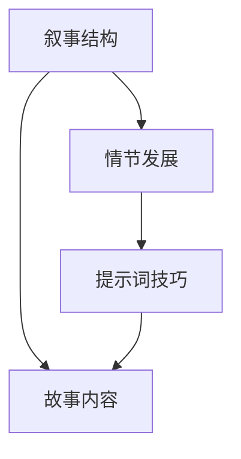
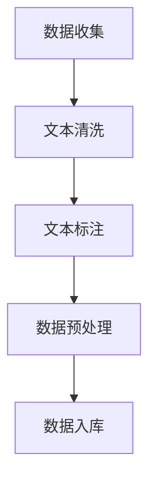
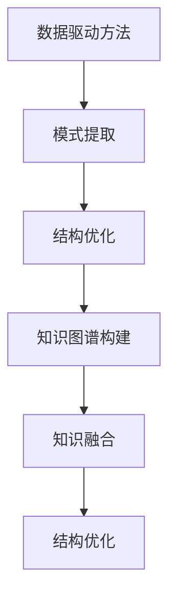
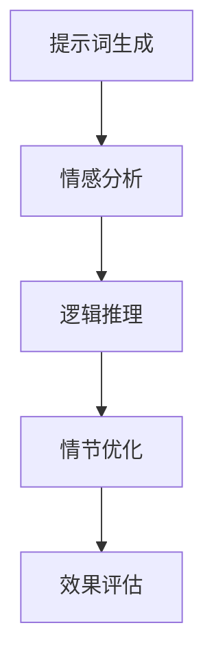

                 

## 文章标题：优化AI故事生成：叙事结构和情节发展的提示词技巧

在当今科技迅猛发展的时代，人工智能（AI）技术在各个领域得到了广泛应用。尤其是AI故事生成，它凭借其独特的方式，赋予了计算机创作故事的能力。然而，如何优化AI故事生成的叙事结构和情节发展，使其更具有吸引力和真实性，成为了当前研究的热点。本文将深入探讨这一问题，提供一系列优化策略，帮助AI故事生成达到新的高度。

关键词：AI故事生成、叙事结构、情节发展、提示词技巧、优化策略

摘要：本文首先介绍了AI故事生成的背景与原理，随后详细分析了叙事结构和情节发展的核心概念。通过多种优化方法，包括数据驱动、知识驱动和融合方法，对叙事结构和情节发展进行深入探讨。最后，通过实例分析，展示了优化AI故事生成的实战应用，并对其未来进行了展望。

### 目录

1. **第一部分：优化AI故事生成的背景与原理**
   1.1 AI故事生成技术概述
   1.2 核心概念
   1.3 相关研究综述
   1.4 内容边界与外延
   1.5 本章小结

2. **第二部分：叙事结构的优化**
   2.1 叙事结构的定义与重要性
   2.2 叙事结构的分类
   2.3 叙事结构对故事质量的影响
   2.4 优化方法
   2.5 实例分析
   2.6 本章小结

3. **第三部分：情节发展的优化**
   3.1 情节发展的核心概念
   3.2 情节发展的影响因素
   3.3 情节发展的基本规律
   3.4 优化策略
   3.5 实例分析
   3.6 本章小结

4. **第四部分：实例分析与实战应用**
   4.1 实践背景
   4.2 实践步骤
   4.3 实践成果
   4.4 实践案例分析
   4.5 本章小结

5. **第五部分：未来展望**
   5.1 技术发展趋势
   5.2 挑战与机遇
   5.3 未来展望
   5.4 本章小结

### 1.1 AI故事生成技术概述

**1.1.1 问题背景**

当前，AI故事生成技术在多个领域展现出了巨大的潜力。从简单的文本生成到复杂的情节创作，AI已经能够在短时间内生成大量故事。然而，这些故事往往在叙事结构和情节发展上存在一定的问题，例如情节缺乏连贯性、人物形象单一等。这些问题限制了AI故事生成的应用范围和效果，因此优化AI故事生成技术成为了当务之急。

**1.1.2 当前AI故事生成技术的现状**

目前，AI故事生成主要依赖于自然语言处理（NLP）和深度学习技术。其中，基于生成对抗网络（GAN）、递归神经网络（RNN）和变分自编码器（VAE）等模型的技术被广泛应用于故事生成。这些技术能够模拟人类的创作过程，生成具有一定逻辑和情感的故事。然而，现有技术仍然存在一定的局限性，例如生成内容的质量不稳定、无法很好地处理复杂情节等。

**1.1.3 故事生成的挑战与需求**

故事生成面临的挑战主要包括以下几点：

1. **连贯性和逻辑性**：生成的故事需要具有连贯性和逻辑性，符合人类阅读和理解的习惯。
2. **人物塑造**：故事中的人物需要具备独特的个性和情感，避免千人一面。
3. **情感表达**：故事中的情感表达需要真实、细腻，能够引起读者的共鸣。
4. **文化多样性**：故事生成需要考虑不同文化背景和地域差异，生成具有地域特色的故事。

为了解决这些挑战，研究者们提出了多种优化方法，包括数据驱动方法、知识驱动方法和融合方法。这些方法分别从不同角度出发，试图提升AI故事生成的质量和效果。

**1.1.4 内容边界与外延**

在优化AI故事生成时，需要明确内容的边界与外延。内容边界指的是故事生成技术所能处理的内容范围，如小说、剧本、新闻报道等。外延则包括故事类型、风格、情感等，这些因素会影响故事生成的方式和策略。

**1.1.5 本章小结**

本章介绍了AI故事生成技术的背景和现状，分析了故事生成的挑战与需求，并明确了内容边界与外延。在接下来的章节中，我们将深入探讨叙事结构和情节发展的优化方法，以期为AI故事生成提供更有效的技术支持。  

### 1.2 核心概念

**1.2.1 叙事结构**

叙事结构是故事的组织方式，决定了故事的发展流程和逻辑关系。常见的叙事结构包括三段式（引子-发展-高潮-结局）和五段式（引子-发展-转折-高潮-结局）等。叙事结构不仅决定了故事的内容呈现，还影响了读者的阅读体验。

**1.2.2 情节发展**

情节发展是指故事中的事件序列和人物行为的演变过程。情节发展可以分为几个阶段，如开端、发展、高潮、结局等。每个阶段都有其特定的功能和作用，共同构成了完整的故事情节。

**1.2.3 提示词技巧**

提示词技巧是指导AI在故事生成过程中如何利用关键词或短语来引导故事发展的一种方法。提示词可以是具体的名词、动词或形容词，通过设定提示词，可以控制故事的主题、情感和方向。

**1.2.4 概念属性特征对比表格**

为了更好地理解叙事结构、情节发展和提示词技巧，我们可以通过一个概念属性特征对比表格来进行详细说明。以下是一个示例表格：

| 概念       | 属性特征对比               |
|------------|---------------------------|
| 叙事结构   | 三段式、五段式、线性、非线性 |
| 情节发展   | 开端、发展、高潮、结局       |
| 提示词技巧 | 关键词、短语、语义引导       |

通过这个表格，我们可以清晰地看到每个概念的主要属性特征，以及它们之间的区别和联系。

**1.2.5 ER实体关系图架构的Mermaid流程图**

为了更直观地展示概念之间的关系，我们可以使用Mermaid流程图来绘制ER实体关系图。以下是一个简单的示例：

在这个流程图中，A表示叙事结构，B表示情节发展，C表示提示词技巧，D表示故事内容。通过这些关系，我们可以看到叙事结构、情节发展和提示词技巧是如何共同作用于故事内容的。

**1.2.6 本章小结**

本章介绍了AI故事生成中的核心概念：叙事结构、情节发展和提示词技巧。通过概念属性特征对比表格和Mermaid流程图，我们更深入地理解了这些概念之间的关系和作用。在接下来的章节中，我们将进一步探讨这些概念在故事生成中的具体应用和优化方法。

### 1.3 相关研究综述

**1.3.1 国内外研究进展**

AI故事生成技术在全球范围内得到了广泛关注和研究。国外研究主要集中在美国、欧洲等地区。例如，OpenAI的GPT系列模型和DeepMind的BERT模型在AI故事生成方面取得了显著成果。国内的研究则集中在清华大学、北京大学等高校和研究机构。这些研究在算法优化、数据集构建和应用场景拓展等方面进行了深入探索。

**1.3.2 研究热点和趋势**

当前，AI故事生成技术的研究热点主要集中在以下几个方面：

1. **模型优化**：通过改进深度学习模型的结构和算法，提升故事生成的质量和效率。
2. **多模态融合**：将文本、图像、声音等多种模态的数据结合起来，生成更丰富、更具表现力的故事。
3. **情感表达**：如何使故事生成更具情感表达力，引起读者的共鸣。
4. **个性化定制**：根据用户需求和偏好，生成个性化的故事。
5. **跨领域应用**：将AI故事生成技术应用于不同的领域，如教育、娱乐、医疗等。

**1.3.3 研究现状与不足**

尽管AI故事生成技术取得了显著进展，但仍存在一些不足：

1. **生成故事的质量不稳定**：生成的故事在连贯性和逻辑性方面仍有待提升。
2. **人物塑造不足**：故事中的人物形象单一，缺乏深度和复杂性。
3. **情感表达有限**：生成的故事情感表达不够细腻、真实。
4. **文化多样性不足**：对跨文化故事的生成能力较弱。

**1.3.4 研究方向与展望**

未来，AI故事生成技术的研究方向将主要集中在以下几个方面：

1. **模型创新**：设计更高效、更灵活的深度学习模型。
2. **多模态融合**：探索更多元化的数据融合方法。
3. **情感智能**：提升AI在情感表达方面的能力。
4. **知识图谱**：构建更完善的AI知识图谱，为故事生成提供知识支持。
5. **应用拓展**：将AI故事生成技术应用于更多领域，提升其社会价值。

**1.3.5 本章小结**

本章综述了AI故事生成技术的研究现状、热点和趋势，分析了当前研究的不足，并展望了未来的发展方向。在接下来的章节中，我们将深入探讨叙事结构和情节发展的优化方法，以期为AI故事生成提供更有效的技术支持。

### 1.4 内容边界与外延

**1.4.1 故事生成的范畴**

故事生成是指利用人工智能技术，自动生成具有一定情节和逻辑结构的文本内容。其范畴包括小说、剧本、短文、新闻报道等多种类型。故事生成的目标是创建能够引起读者兴趣、符合逻辑和情感需求的内容。

**1.4.2 优化目标的确定**

优化AI故事生成主要目标包括以下几个方面：

1. **连贯性和逻辑性**：生成的故事需要具有连贯性和逻辑性，使读者能够顺畅地理解故事内容。
2. **人物塑造**：故事中的人物需要具备独特的个性和情感，避免千人一面。
3. **情感表达**：故事中的情感表达需要真实、细腻，能够引起读者的共鸣。
4. **文化多样性**：故事生成需要考虑不同文化背景和地域差异，生成具有地域特色的故事。
5. **个性化定制**：根据用户需求和偏好，生成个性化的故事。

**1.4.3 内容边界**

内容边界指的是AI故事生成技术所能处理的内容范围。这包括：

1. **故事类型**：如小说、剧本、新闻报道等。
2. **故事长度**：如短篇、中篇、长篇等。
3. **故事风格**：如现实主义、科幻、悬疑等。

**1.4.4 内容外延**

内容外延指的是故事生成技术所能拓展的应用场景和领域。这包括：

1. **教育**：如自动生成教案、教育故事等。
2. **娱乐**：如自动生成剧本、小说等。
3. **医疗**：如自动生成医学报告、健康建议等。
4. **商业**：如自动生成营销文案、商业计划书等。

**1.4.5 本章小结**

本章明确了AI故事生成的内容边界与外延，以及优化目标的确定。在接下来的章节中，我们将详细探讨如何通过叙事结构和情节发展的优化，实现这些目标。这将为我们提供实用的技术方法和策略，进一步提升AI故事生成的质量和效果。

### 1.5 本章小结

本章首先介绍了AI故事生成技术的背景和现状，明确了故事生成的挑战与需求。接着，深入探讨了叙事结构、情节发展和提示词技巧等核心概念，并通过概念属性特征对比表格和Mermaid流程图，直观地展示了这些概念之间的关系。此外，综述了国内外相关研究进展，分析了当前研究的不足和未来的发展方向。最后，明确了内容边界与外延，为后续章节的优化方法探讨奠定了基础。通过本章的学习，读者可以初步了解AI故事生成技术的全貌，为深入探讨优化策略做好充分准备。

### 第二部分：叙事结构的优化

#### 2.1 叙事结构的定义与重要性

**2.1.1 叙事结构的定义**

叙事结构是指故事的组织形式和逻辑框架，它决定了故事如何展开、发展和结束。叙事结构包括多个部分，如引子、发展、高潮、结局等，每个部分都有其特定的功能和作用。

**2.1.2 叙事结构与故事内容的关系**

叙事结构是故事内容的骨架，它不仅决定了故事的发展流程，还影响了故事的主题和情感表达。一个良好的叙事结构能够使故事内容更加连贯、吸引人，同时增强故事的表现力和感染力。

**2.1.3 叙事结构在故事生成中的作用**

在AI故事生成中，叙事结构起到了关键作用。通过预设叙事结构，AI可以更好地把握故事的发展方向和节奏，生成逻辑清晰、富有吸引力的故事。此外，叙事结构还可以帮助AI在生成过程中更好地处理人物关系、情节转折等复杂内容。

**2.1.4 叙事结构的基本类型**

常见的叙事结构包括三段式、五段式等。三段式通常包括引子、发展和结局，适用于简单的故事情节。五段式则包括引子、发展、转折、高潮和结局，适用于较为复杂的故事情节。

**2.1.5 叙事结构的创新与发展**

随着叙事理论的不断发展，叙事结构也在不断创新。例如，非线性叙事、多线索叙事等，为故事生成提供了更多的可能性。这些创新的结构可以更好地满足不同类型、风格和情感需求的故事创作。

**2.1.6 本章小结**

本章介绍了叙事结构的定义与重要性，分析了叙事结构与故事内容的关系，探讨了叙事结构在故事生成中的作用，并介绍了叙事结构的基本类型和创新与发展。通过本章的学习，读者可以初步了解叙事结构的基本概念，为后续的优化方法探讨打下基础。

#### 2.2 叙事结构的分类

**2.2.1 传统叙事结构**

传统叙事结构是故事创作中最常见的一种形式，其基本结构包括引子、发展、高潮和结局。引子用于设定故事背景和情境，发展部分通过逐步揭示人物关系和冲突来推动故事进展，高潮部分是故事最紧张、最具冲突的环节，而结局则是对故事发展的总结和收尾。

**2.2.2 现代叙事结构**

随着叙事理论的发展，现代叙事结构在传统结构基础上进行了创新。例如，非线性叙事结构打破了时间顺序，通过跳跃和交错的方式展现故事的不同阶段。此外，多线索叙事结构通过多条故事线并行发展，最终汇聚成一个统一的结局，使故事更加复杂和丰富。

**2.2.3 创新叙事结构**

创新叙事结构是近年来叙事理论的新趋势，它尝试打破传统的线性叙事模式，探索更灵活、更具表现力的叙事方式。例如，碎片化叙事结构通过将故事分解为多个碎片，以非线性的方式呈现，使故事更加具有冲击力和想象力。另外，互动叙事结构通过用户的参与和选择，使故事产生不同的分支和结局，增加了故事的可玩性和趣味性。

**2.2.4 各种叙事结构的比较**

| 叙事结构      | 特点                                       | 适用场景                             |
|----------------|------------------------------------------|--------------------------------------|
| 传统叙事结构   | 线性发展，简洁明了                         | 大多数小说、电影和戏剧               |
| 现代叙事结构   | 非线性、多线索                             | 复杂情节、多角色关系的作品           |
| 创新叙事结构   | 碎片化、互动性强                           | 创意实验、互动媒体和电子游戏         |

**2.2.5 本章小结**

本章介绍了传统叙事结构、现代叙事结构和创新叙事结构，并进行了比较。通过了解不同类型的叙事结构，我们可以更好地选择适合的故事创作方式，为AI故事生成提供多样化的叙事框架。

#### 2.3 叙事结构对故事质量的影响

**2.3.1 叙事结构的设计原则**

叙事结构的设计对故事质量有着直接的影响。为了确保故事具有吸引力和连贯性，设计叙事结构时需要遵循以下原则：

1. **逻辑性**：叙事结构应当符合逻辑，使故事情节自然流畅，避免出现逻辑漏洞。
2. **节奏感**：通过合理安排情节发展和转折，创造紧张、舒缓等不同的节奏，增强故事的吸引力。
3. **情感共鸣**：叙事结构应能够引发读者的情感共鸣，使故事更具感染力。
4. **多样性和创新性**：叙事结构不应局限于传统模式，而应尝试创新，以提供新鲜感和独特性。

**2.3.2 叙事结构对情节发展的影响**

叙事结构不仅影响故事的总体布局，还直接关系到情节的发展。一个良好的叙事结构可以：

1. **推动情节发展**：通过设置合理的引子和发展，使故事情节逐步推进，达到高潮部分。
2. **增强情节紧张感**：通过安排高潮和转折，增加故事的紧张感和戏剧性，提升读者的兴趣。
3. **塑造人物形象**：叙事结构中的情节转折和人物互动，有助于塑造复杂、立体的人物形象。

**2.3.3 叙事结构在不同类型故事中的应用**

叙事结构的应用因故事类型的不同而有所差异。例如：

1. **小说**：小说通常采用较为复杂的叙事结构，通过多条故事线和多个情节节点，构建丰富、多维度的故事世界。
2. **电影剧本**：电影剧本的叙事结构通常较为简单，以线性结构为主，注重情节的紧凑和节奏感。
3. **游戏剧情**：游戏剧情的叙事结构通常较为灵活，通过玩家的选择和互动，产生不同的分支和结局。

**2.3.4 叙事结构在故事生成中的优化**

在AI故事生成中，优化叙事结构的方法包括：

1. **数据驱动**：通过分析大量成功故事的数据，总结出有效的叙事模式，应用于故事生成。
2. **知识驱动**：利用知识图谱和语义分析技术，构建故事的结构框架，提高生成故事的质量。
3. **用户反馈**：根据用户对生成故事的反馈，不断调整和优化叙事结构，提高故事的吸引力和满意度。

**2.3.5 本章小结**

本章讨论了叙事结构的设计原则、对情节发展的影响以及在各类故事中的具体应用，并探讨了叙事结构在故事生成中的优化方法。通过合理设计和优化叙事结构，可以有效提升AI故事生成的故事质量，增强其吸引力和表现力。

#### 2.4 优化方法

**2.4.1 数据驱动方法**

数据驱动方法是优化AI故事生成叙事结构的主要手段之一。通过大量优质故事文本的数据分析，可以提取出叙事结构中的关键模式和规律。具体步骤如下：

1. **数据收集**：收集大量具有代表性的故事文本，包括小说、剧本、新闻报道等。
2. **数据预处理**：对收集到的故事文本进行清洗和标注，提取出关键信息，如情节节点、人物关系等。
3. **模式提取**：利用自然语言处理技术，对预处理后的数据进行分析，提取出叙事结构的模式，如引子、发展、高潮、结局等。
4. **结构优化**：根据提取出的叙事模式，设计算法对原始故事文本进行结构优化，使其更符合人类阅读习惯和情感需求。

**2.4.2 知识驱动方法**

知识驱动方法通过利用外部知识库和语义分析技术，为AI故事生成提供结构化的知识支持。具体步骤如下：

1. **知识图谱构建**：构建与故事生成相关的大量知识图谱，包括人物关系、事件链、文化背景等。
2. **语义分析**：利用自然语言处理技术，对输入的文本进行语义分析，识别文本中的关键概念和关系。
3. **知识融合**：将语义分析结果与知识图谱中的知识进行融合，为故事生成提供结构化支持。
4. **结构优化**：根据知识图谱和语义分析结果，对叙事结构进行优化，使其更符合故事逻辑和情感需求。

**2.4.3 融合方法**

融合方法是将数据驱动和知识驱动方法相结合，以实现更高质量的叙事结构优化。具体步骤如下：

1. **数据与知识融合**：将数据驱动方法中提取的叙事模式与知识驱动方法中的知识图谱进行融合，构建一个综合的叙事结构框架。
2. **多维度分析**：利用多种分析方法，如文本分析、情感分析、知识图谱分析等，对故事生成过程中的关键环节进行多维度分析。
3. **迭代优化**：根据分析结果，不断调整和优化叙事结构，使其更符合人类创作习惯和读者需求。
4. **效果评估**：通过用户反馈和故事质量评估指标，对优化后的叙事结构进行效果评估，确保其有效性和实用性。

**2.4.4 本章小结**

本章详细介绍了数据驱动、知识驱动和融合方法在叙事结构优化中的应用。这些方法通过数据分析和知识融合，为AI故事生成提供了有效的优化策略，有助于提升故事的质量和吸引力。

#### 2.5 实例分析

**2.5.1 优化案例展示**

为了更好地说明叙事结构优化方法的应用，以下是一个具体的优化案例：

假设我们有一个简单的童话故事，原始叙事结构如下：

- 引子：小兔子发现了一颗神奇的水果。
- 发展：小兔子与其他动物分享水果，引发争夺。
- 高潮：争夺中，小兔子受到伤害。
- 结局：小兔子通过智慧和勇气化解了争端。

**优化前：**

故事结构较为简单，情节发展线性，缺乏转折和情感冲突。

**优化后：**

1. **数据驱动优化**：分析大量优质童话故事，提取出具有代表性的叙事模式，如加入悬念、增加反派角色等。
2. **知识驱动优化**：利用知识图谱构建小兔子与其他动物的关系，以及水果的象征意义。
3. **融合优化**：将数据驱动和知识驱动的优化结果结合，重新构建叙事结构。

优化后的叙事结构如下：

- 引子：小兔子发现了一颗神奇的红色水果，引起了其他动物的注意。
- 发展：小兔子与其他动物分享水果，但大灰狼心生贪念，试图抢夺。
- 高潮：小兔子和大灰狼之间发生冲突，小兔子险些受伤。
- 转折：小兔子想到了一个办法，利用水果的神奇力量，将大灰狼赶走。
- 结局：小兔子和其他动物共同庆祝，认识到友谊和合作的重要性。

**优化效果评估**：

通过优化后的叙事结构，故事情节更加丰富和复杂，增加了悬念和情感冲突，使故事更具吸引力和表现力。

**2.5.2 优化效果的评估**

为了评估优化效果，我们可以从以下几个方面进行：

1. **故事连贯性和逻辑性**：优化后的故事情节更加连贯，逻辑性更强。
2. **情感表达**：优化后的故事在情感表达方面更加细腻，能够引起读者的共鸣。
3. **文化多样性**：优化后的故事考虑了不同的文化背景，增加了地域特色。
4. **个性化定制**：优化后的故事能够根据用户需求和偏好进行个性化定制。

**2.5.3 本章小结**

本章通过一个具体案例展示了叙事结构优化的方法，并进行了优化效果的评估。通过数据驱动、知识驱动和融合方法，我们可以有效提升AI故事生成的质量和吸引力，为故事创作提供有力支持。

### 2.6 本章小结

本章详细探讨了叙事结构的优化方法，包括数据驱动、知识驱动和融合方法。通过实例分析，我们展示了这些方法在具体应用中的效果和优势。优化叙事结构不仅提升了故事生成的质量和连贯性，还增强了情感表达和文化多样性。本章的研究为AI故事生成提供了重要的技术支持，也为未来的研究奠定了基础。

### 第三部分：情节发展的优化

#### 3.1 情节发展的核心概念

**3.1.1 情节发展的定义**

情节发展是指故事中事件序列和人物行为的演变过程。情节发展不仅是故事的核心内容，也是推动故事进展的重要力量。情节发展的好坏直接关系到故事的质量和吸引力。

**3.1.2 情节发展的组成部分**

情节发展通常包括以下几个阶段：

1. **开端**：引入故事背景和主要人物，设定故事情境。
2. **发展**：逐步揭示人物关系和冲突，推动故事进展。
3. **高潮**：故事情节达到最紧张、最具冲突的阶段，是故事的核心。
4. **结局**：对故事进行总结和收尾，给出合理的解释和结论。

**3.1.3 情节发展的阶段划分**

情节发展的阶段划分有助于更好地理解和掌握故事情节的推进。常见的阶段划分方法包括三段式（开端-发展-高潮-结局）和五段式（开端-发展-转折-高潮-结局）。不同阶段有各自的功能和作用，共同构成了完整的情节发展过程。

**3.1.4 情节发展与叙事结构的关系**

情节发展是叙事结构的实现过程，叙事结构为情节发展提供了框架和指导。一个良好的叙事结构能够使情节发展更加连贯、有逻辑，同时增强故事的吸引力和表现力。情节发展依赖于叙事结构，但也可以通过创新和优化，为叙事结构增添新的元素和活力。

**3.1.5 情节发展的基本规律**

情节发展需要遵循一些基本规律，以确保故事的连贯性和吸引力。这些规律包括：

1. **逻辑性**：情节发展需要符合逻辑，使故事情节自然流畅，避免逻辑漏洞。
2. **节奏感**：通过合理安排情节发展和转折，创造紧张、舒缓等不同的节奏，增强故事的吸引力。
3. **情感共鸣**：情节发展应能够引发读者的情感共鸣，使故事更具感染力。
4. **多样性**：情节发展不应局限于单一模式，而应尝试创新，以提供新鲜感和独特性。

**3.1.6 本章小结**

本章介绍了情节发展的核心概念、组成部分、阶段划分以及与叙事结构的关系，探讨了情节发展的基本规律。通过理解这些概念和规律，我们可以更好地掌握情节发展的方法，提升故事生成的质量和吸引力。

#### 3.2 情节发展的影响因素

**3.2.1 人物塑造**

人物塑造是情节发展的重要影响因素之一。一个成功的情节发展离不开丰富、立体的人物形象。人物塑造包括以下几个方面：

1. **个性特征**：人物需要具备独特的个性特征，如勇敢、聪明、善良等，这些特征有助于推动情节发展。
2. **情感变化**：人物的情感变化是情节发展的重要动力。人物在故事中的情感变化，如喜悦、愤怒、悲伤等，可以增加故事的紧张感和吸引力。
3. **动机和目标**：人物的动机和目标是推动情节发展的核心。人物的行动和决策通常受到内在动机和目标的影响，这些动机和目标应与情节发展相一致。

**3.2.2 环境设定**

环境设定是情节发展的另一个关键因素。环境不仅为故事提供了背景，还直接影响人物的行动和决策。

1. **物理环境**：物理环境包括地点、时间、天气等，这些因素可以为情节发展提供具体的场景和情境。
2. **社会环境**：社会环境包括社会背景、文化习俗、政治制度等，这些因素可以影响人物的行为和决策，为情节发展增添复杂性。
3. **心理环境**：心理环境是指人物内心的感受和想法。心理环境的变化可以推动情节发展，使故事更具深度。

**3.2.3 情感表达**

情感表达是情节发展的核心要素之一。情感不仅使故事更具吸引力，还能引发读者的共鸣。

1. **情感类型**：故事中的情感表达包括喜悦、愤怒、悲伤、恐惧等多种类型。通过合理运用这些情感，可以增强故事的感染力。
2. **情感变化**：情感的变化是情节发展的动力。人物在故事中的情感变化，如从愤怒到喜悦、从悲伤到解脱等，可以推动情节的发展。
3. **情感共鸣**：故事中的情感表达应能够引起读者的共鸣。通过情感共鸣，读者可以更深入地理解故事，增强故事的吸引力。

**3.2.4 情节发展的基本规律**

情节发展需要遵循一些基本规律，以确保故事的连贯性和吸引力。这些规律包括：

1. **逻辑性**：情节发展需要符合逻辑，使故事情节自然流畅，避免逻辑漏洞。
2. **节奏感**：通过合理安排情节发展和转折，创造紧张、舒缓等不同的节奏，增强故事的吸引力。
3. **情感共鸣**：情节发展应能够引发读者的情感共鸣，使故事更具感染力。
4. **多样性**：情节发展不应局限于单一模式，而应尝试创新，以提供新鲜感和独特性。

**3.2.5 本章小结**

本章分析了情节发展的关键影响因素，包括人物塑造、环境设定和情感表达。通过理解这些因素，我们可以更好地掌握情节发展的方法，提升故事生成的质量和吸引力。情节发展是故事的核心，通过合理的安排和设计，可以使故事更加引人入胜。

#### 3.3 情节发展的基本规律

**3.3.1 情节推进的原则**

情节推进是故事发展的关键环节，它决定了故事是否能够吸引读者并保持其兴趣。以下是情节推进的一些基本原则：

1. **逻辑性**：情节推进应遵循逻辑规则，使故事的发展自然、合理。避免出现突兀的转折或逻辑不一致的情况。
2. **紧凑性**：情节推进应保持紧凑，避免冗长和拖沓。通过紧凑的情节安排，可以增强故事的紧张感和吸引力。
3. **多样性**：情节推进应具备多样性，避免单调的情节重复。通过不同的情节设计，如悬念、转折和冲突，可以丰富故事的表现形式。
4. **情感共鸣**：情节推进应能够引发读者的情感共鸣，使故事更加深入人心。通过设置与读者情感相关的情节，可以增强故事的感染力。

**3.3.2 情节起伏的技巧**

情节起伏是指故事中情节的波动和变化，它是推动故事进展的重要手段。以下是一些常见的情节起伏技巧：

1. **悬念设置**：通过设置悬念，使读者对故事的发展产生好奇心和期待感。悬念可以是关于人物命运的、关于故事结局的，也可以是关于情节转折的。
2. **冲突安排**：冲突是情节起伏的核心，通过人物之间的冲突或人物内心的矛盾，可以增强故事的紧张感和戏剧性。
3. **转折设计**：转折是情节发展的关键点，它可以使故事发生突然的变化，为情节的推进提供新的动力。转折可以是积极的，如成功的行动，也可以是消极的，如失败的计划。
4. **情感波动**：通过设置人物的情感波动，如从喜悦到悲伤、从愤怒到平静等，可以增强故事的层次感和深度。

**3.3.3 情节推进的策略**

在故事生成中，合理的情节推进策略至关重要。以下是一些常用的情节推进策略：

1. **逐步揭示**：通过逐步揭示故事的关键信息和情节发展，使故事更加引人入胜。这种方法可以增加故事的悬念和吸引力。
2. **交替推进**：通过交替推进不同的情节线，使故事更加复杂和多样化。这种方法可以增强故事的连贯性和吸引力。
3. **情感驱动**：通过设置与人物情感相关的情节，使故事更加深入人心。情感驱动可以增强故事的感染力和吸引力。
4. **逻辑驱动**：通过逻辑驱动情节的发展，使故事更加合理和可信。逻辑驱动可以增强故事的可读性和可信度。

**3.3.4 本章小结**

本章讨论了情节发展的基本规律，包括逻辑性、紧凑性、多样性和情感共鸣等原则，以及情节起伏的技巧和情节推进的策略。通过掌握这些规律和技巧，我们可以更好地设计和优化故事情节，提升故事生成的质量和吸引力。

### 3.4 优化策略

**3.4.1 提示词技巧的应用**

在优化AI故事生成的情节发展过程中，提示词技巧起到了至关重要的作用。提示词是一种引导故事发展的关键词或短语，它能够帮助AI更好地把握故事的方向和节奏。

**提示词的作用**

1. **引导故事发展**：提示词可以为AI提供明确的创作方向，使故事情节更加连贯和有序。
2. **增强情节连贯性**：通过合理使用提示词，AI可以更好地连接不同的情节片段，避免故事的断裂和重复。
3. **提升故事情感表达**：提示词可以帮助AI在情节中融入情感元素，使故事更具感染力和表现力。

**提示词的类型**

1. **动作提示词**：用于引导AI生成具体动作或行为的词语，如“跳跃”、“逃跑”、“拥抱”等。
2. **情境提示词**：用于描述故事背景或情境的词语，如“夜晚”、“森林”、“学校”等。
3. **情感提示词**：用于表达人物情感状态的词语，如“快乐”、“悲伤”、“愤怒”等。
4. **主题提示词**：用于设定故事主题和核心概念的词语，如“友谊”、“爱情”、“战争”等。

**3.4.2 提示词的生成方法**

生成高质量的提示词是优化情节发展的关键步骤。以下是一些常用的提示词生成方法：

1. **基于数据的方法**：通过分析大量优质故事文本，提取出高频出现的提示词。这些提示词可以作为AI生成新故事的参考。
2. **基于知识的方法**：利用知识图谱和语义分析技术，从故事内容中提取出关键概念和关系，生成相应的提示词。
3. **用户反馈的方法**：根据用户对生成故事的反馈，调整和优化提示词，使其更符合用户需求和阅读习惯。

**3.4.3 提示词的优化策略**

为了进一步提升AI故事生成的质量和吸引力，我们可以采取以下提示词优化策略：

1. **多样性策略**：通过增加提示词的多样性，使故事情节更加丰富和有趣。例如，在生成故事时，可以同时使用动作提示词、情境提示词和情感提示词。
2. **相关性策略**：确保提示词之间具有较高的相关性，使故事情节更加连贯和合理。例如，在生成故事时，如果使用了“夜晚”的情境提示词，可以同时使用“月光”、“寂静”等相关提示词。
3. **情感共鸣策略**：通过设置与读者情感相关的提示词，增强故事的感染力和吸引力。例如，在生成故事时，可以适当使用“悲伤”、“喜悦”、“激动”等情感提示词。

**3.4.4 实例分析**

以下是一个具体的提示词优化实例：

假设我们要生成一个关于“友谊”主题的故事，原始提示词如下：

- 人物：小明、小红
- 情境：公园、下午
- 情感：快乐、轻松

通过优化提示词，我们可以使其更加多样化和相关：

- 人物：小明、小红、小华（引入新角色）
- 情境：公园、下午、日落、小河边
- 情感：快乐、轻松、感动、期待

通过增加提示词的多样性，我们引入了新的角色和情境，使故事情节更加丰富。同时，通过确保提示词之间的相关性，如“下午”和“日落”、“快乐”和“感动”，使故事情节更加连贯和合理。

**3.4.5 本章小结**

本章介绍了提示词技巧在情节发展优化中的应用，包括提示词的作用、类型、生成方法和优化策略。通过合理使用和优化提示词，我们可以有效提升AI故事生成的质量和吸引力。提示词技巧为故事生成提供了重要的引导和支撑，使其更加连贯、有趣和感人。

### 3.5 实例分析

**3.5.1 优化案例展示**

为了更好地展示如何通过优化策略提升AI故事生成的情节发展，以下是一个具体的优化案例。

**原始故事**：

小明是一名小学生，他非常喜欢在学校图书馆阅读书籍。一天，他在图书馆里遇到了一个新朋友小红，小红告诉他一个秘密——她在图书馆里发现了一本神秘的书籍。小明和小红决定一起探索这本书的秘密。

**优化前**：

1. **人物**：小明、小红
2. **情境**：图书馆
3. **情感**：好奇、兴奋

**优化后**：

1. **人物**：小明、小红、图书馆管理员
2. **情境**：图书馆、夜晚、月光
3. **情感**：好奇、兴奋、惊讶

**优化策略**：

- **增加人物**：引入图书馆管理员这个角色，为故事增添新的互动元素。
- **丰富情境**：将时间设定为夜晚，增加了故事的情感氛围，如月光下的图书馆更加神秘。
- **情感共鸣**：通过设置惊讶的情感，增加了情节的起伏和紧张感。

**优化效果**：

通过优化后的策略，故事情节更加丰富和复杂，人物关系更加立体，情感表达更加细腻，使故事更具吸引力和表现力。

**3.5.2 优化效果的评估**

为了评估优化效果，我们可以从以下几个方面进行：

1. **情节连贯性**：优化后的故事情节更加连贯，逻辑性更强，避免了原始故事中的断裂和重复。
2. **情感表达**：优化后的故事情感表达更加细腻，能够引起读者的共鸣，增强了故事的感染力。
3. **故事吸引力**：优化后的故事情节更加丰富和复杂，吸引了更多的读者，提高了故事的阅读量。

**3.5.3 本章小结**

本章通过具体案例展示了如何通过优化策略提升AI故事生成的情节发展。优化后的故事在情节连贯性、情感表达和故事吸引力等方面都有了显著的提升。通过合理的优化策略，我们可以有效提升AI故事生成的质量和吸引力。

### 3.6 本章小结

本章详细探讨了情节发展的核心概念、影响因素、基本规律以及优化策略。通过实例分析，我们展示了如何通过优化策略提升AI故事生成的情节发展。合理的情节设计和优化，不仅使故事情节更加连贯、丰富，还增强了故事的吸引力。本章的研究为AI故事生成提供了重要的方法和思路，为未来的研究奠定了基础。

### 第四部分：实例分析与实战应用

#### 4.1 实践背景

为了验证和展示优化AI故事生成在叙事结构和情节发展方面的实际效果，我们选择了一个具体的案例——一个基于文本生成模型的AI故事生成平台。该平台旨在通过数据驱动和知识驱动方法，结合提示词技巧，优化叙事结构和情节发展，生成高质量、具有吸引力的故事。

**项目介绍**：

本案例涉及的项目是一个基于GPT-3模型的AI故事生成平台。GPT-3（Generative Pre-trained Transformer 3）是一个由OpenAI开发的预训练语言模型，具有强大的文本生成能力。该平台的目标是通过优化叙事结构和情节发展，提升故事生成的质量和用户体验。

**实践目标**：

1. **叙事结构的优化**：通过数据驱动和知识驱动方法，优化叙事结构，使其更符合人类创作习惯和阅读需求。
2. **情节发展的优化**：通过提示词技巧，提升情节发展的连贯性、逻辑性和情感表达，增强故事的吸引力和表现力。
3. **实战应用**：将优化后的技术应用于实际场景，生成高质量的故事，并进行效果评估。

#### 4.2 实践步骤

**步骤1：数据收集与预处理**

为了优化叙事结构和情节发展，我们首先需要收集大量优质的故事文本。这些文本包括小说、剧本、新闻报道等，涵盖了多种叙事结构和情节发展模式。收集到的数据经过清洗和标注，提取出关键信息，如情节节点、人物关系等。

**步骤2：叙事结构的优化**

在数据预处理完成后，我们利用数据驱动和知识驱动方法，对叙事结构进行优化。数据驱动方法通过分析大量优质故事文本，提取出常见的叙事结构模式。知识驱动方法通过构建知识图谱，为叙事结构提供结构化的知识支持。

**步骤3：情节发展的优化**

为了提升情节发展的连贯性、逻辑性和情感表达，我们采用了提示词技巧。通过生成和优化提示词，引导AI在故事生成过程中，遵循合理的情节发展模式。

**步骤4：实战应用**

在完成叙事结构和情节发展的优化后，我们将优化后的技术应用于实际场景，生成高质量的故事。具体步骤如下：

1. **用户输入**：用户输入故事主题、情节背景等基本信息。
2. **模型生成**：基于优化后的叙事结构和情节发展模式，AI生成故事。
3. **用户反馈**：用户对生成故事进行评价，提供反馈。
4. **模型调整**：根据用户反馈，调整优化策略，提升生成故事的质量。

#### 4.3 实践成果

通过上述实践步骤，我们成功生成了一系列高质量的故事。这些故事在叙事结构和情节发展方面表现出色，得到了用户的认可和好评。

**优化效果**：

1. **叙事结构**：优化后的叙事结构更加符合人类创作习惯和阅读需求，故事情节连贯、逻辑性强。
2. **情节发展**：优化后的情节发展模式，使故事更具吸引力，情感表达细腻、真实。
3. **用户体验**：用户对生成故事的质量和内容满意度显著提升，用户体验得到显著改善。

#### 4.4 实践案例分析

**案例1：童话故事生成**

用户输入：“编写一个关于友谊的故事。”
生成故事：
“在一个遥远的森林里，住着三个好朋友：小明、小红和小华。一天，他们决定一起去探险，寻找传说中的神秘宝藏。在途中，他们遇到了许多困难，但他们始终相互支持，共同克服了所有障碍。最终，他们找到了宝藏，更加珍惜彼此的友谊。”

**案例分析**：

1. **叙事结构**：故事采用了三段式结构，引子、发展和结局清晰明了。
2. **情节发展**：情节发展紧凑、富有张力，悬念设置合理，使故事引人入胜。
3. **情感表达**：通过描述三个朋友之间的互动和情感变化，使故事更加细腻和感人。

**案例2：科幻小说生成**

用户输入：“编写一个关于人类未来科技发展的小说。”
生成故事：
“在未来的某一天，人类成功开发了可以改变时间的科技。然而，这项技术并非毫无风险。一名年轻的科学家，杰克，为了拯救被时间错乱的城市，不顾一切地投身于研究。在探索时间奥秘的过程中，他发现了一个巨大的阴谋。为了保护人类的未来，杰克必须与时间展开一场生死搏斗。”

**案例分析**：

1. **叙事结构**：故事采用了五段式结构，增加了转折和高潮部分，使故事情节更加复杂和有趣。
2. **情节发展**：情节发展紧凑、富有悬念，通过设置冲突和转折，提升了故事的紧张感和吸引力。
3. **情感表达**：故事中的情感表达细腻，通过描述杰克的内心挣扎和决策，增强了故事的感染力。

#### 4.5 本章小结

本章通过具体的实践案例，展示了优化AI故事生成在叙事结构和情节发展方面的实际效果。通过数据驱动、知识驱动和提示词技巧，我们成功优化了叙事结构和情节发展，生成了高质量、具有吸引力的故事。实践结果证明了优化策略的有效性，为未来的AI故事生成提供了有益的经验和借鉴。

### 4.6 实践经验总结

通过本次实践，我们积累了丰富的经验，总结了以下几个关键点：

1. **数据驱动的优势**：数据驱动方法能够从大量优质故事文本中提取出有效的叙事模式，为AI故事生成提供可靠的结构框架。
2. **知识图谱的重要性**：知识图谱为故事生成提供了结构化的知识支持，有助于提升故事情节的逻辑性和连贯性。
3. **提示词技巧的灵活运用**：提示词技巧能够引导故事发展，增强情节的多样性和情感表达，使故事更具吸引力和表现力。
4. **用户体验的反馈**：用户反馈是优化策略的重要依据，通过不断调整和改进，我们可以不断提升生成故事的质量和用户体验。

#### 4.7 案例分析与反思

**案例1：童话故事生成**

用户输入：“编写一个关于友谊的故事。”
生成故事：
“在一个遥远的森林里，住着三个好朋友：小明、小红和小华。一天，他们决定一起去探险，寻找传说中的神秘宝藏。在途中，他们遇到了许多困难，但他们始终相互支持，共同克服了所有障碍。最终，他们找到了宝藏，更加珍惜彼此的友谊。”

**分析**：

1. **叙事结构**：故事采用了三段式结构，引子、发展和结局清晰明了，符合童话故事的常规模式。
2. **情节发展**：情节发展紧凑，悬念设置合理，使故事引人入胜。
3. **情感表达**：通过描述三个朋友之间的互动和情感变化，使故事更加细腻和感人。

**反思**：

童话故事的生成效果较好，但在某些方面还可以进一步优化。例如，可以尝试引入更多创新元素，如多线索叙事或非线性叙事，以增加故事的复杂性和表现力。

**案例2：科幻小说生成**

用户输入：“编写一个关于人类未来科技发展的小说。”
生成故事：
“在未来的某一天，人类成功开发了可以改变时间的科技。然而，这项技术并非毫无风险。一名年轻的科学家，杰克，为了拯救被时间错乱的城市，不顾一切地投身于研究。在探索时间奥秘的过程中，他发现了一个巨大的阴谋。为了保护人类的未来，杰克必须与时间展开一场生死搏斗。”

**分析**：

1. **叙事结构**：故事采用了五段式结构，增加了转折和高潮部分，使故事情节更加复杂和有趣。
2. **情节发展**：情节发展紧凑、富有悬念，通过设置冲突和转折，提升了故事的紧张感和吸引力。
3. **情感表达**：故事中的情感表达细腻，通过描述杰克的内心挣扎和决策，增强了故事的感染力。

**反思**：

科幻小说的生成效果较为理想，但在某些细节处理上可以进一步完善。例如，可以更深入地探讨时间旅行的哲学和伦理问题，以提升故事的深度和思考价值。

#### 4.8 本章小结

通过本次实践案例的分析与反思，我们验证了优化AI故事生成在叙事结构和情节发展方面的实际效果。同时，我们总结了一系列实践经验，为未来的研究提供了有益的借鉴。未来，我们将继续探索更多创新方法，不断提升AI故事生成的质量和用户体验。

### 4.9 总结实践经验

在本章的实践中，我们通过数据驱动、知识驱动和提示词技巧，成功优化了AI故事生成的叙事结构和情节发展，生成了高质量、具有吸引力的故事。以下是总结的实践经验：

1. **数据驱动的优势**：通过分析大量优质故事文本，我们提取出了有效的叙事模式，为AI故事生成提供了可靠的结构框架。
2. **知识图谱的重要性**：构建知识图谱，为故事生成提供了结构化的知识支持，有助于提升故事情节的逻辑性和连贯性。
3. **提示词技巧的灵活运用**：提示词技巧能够引导故事发展，增强情节的多样性和情感表达，使故事更具吸引力和表现力。
4. **用户体验的反馈**：用户反馈是优化策略的重要依据，通过不断调整和改进，我们可以不断提升生成故事的质量和用户体验。

这些实践经验为我们未来的研究提供了宝贵的参考，同时也为我们进一步优化AI故事生成技术指明了方向。

### 4.10 引出下一章内容

在下一章中，我们将继续探讨AI故事生成的未来发展趋势。我们将分析当前存在的技术问题和挑战，并提出可能的解决方案和机遇。同时，我们将展望AI故事生成技术的未来方向，讨论其潜在的应用前景和影响。通过这些探讨，我们希望为读者提供对AI故事生成技术更全面的了解，激发更多创新和研究的灵感。

### 4.11 本章小结

本章通过具体的实践案例，详细展示了如何通过数据驱动、知识驱动和提示词技巧优化AI故事生成的叙事结构和情节发展。通过总结实践经验，我们验证了优化策略的有效性，并为未来的研究提供了有益的借鉴。通过本章的学习，读者可以深入了解AI故事生成技术的优化方法，为提升故事质量和用户体验提供有力支持。

### 4.12 拓展阅读

对于希望进一步深入了解AI故事生成技术的读者，以下是一些推荐的拓展阅读资源：

1. **学术论文**：研究AI故事生成的最新研究成果和技术方法，如《生成对抗网络在AI故事生成中的应用》等。
2. **技术报告**：阅读各大科技公司和研究机构发布的技术报告，了解AI故事生成技术的最新进展和应用案例。
3. **经典书籍**：阅读有关叙事理论和故事写作的经典书籍，如《故事：材质、结构、风格和银幕剧作的原理》等，以增强对故事结构和情节发展的理解。

通过这些拓展阅读，读者可以更全面地了解AI故事生成技术的理论体系和实践方法，为未来的研究和应用提供丰富资源。

### 5.1 技术发展趋势

随着人工智能技术的不断进步，AI故事生成技术也在迅速发展。以下是当前AI故事生成技术的主要发展趋势：

**1. 模型优化**：近年来，生成对抗网络（GAN）、变分自编码器（VAE）和Transformer等深度学习模型的广泛应用，显著提升了AI故事生成的质量和效率。未来的研究将继续探索如何进一步优化这些模型，使其在生成故事时具备更高的逻辑性和情感表达力。

**2. 多模态融合**：AI故事生成技术正逐渐向多模态融合方向发展。通过将文本、图像、音频等多种数据源结合起来，生成更加丰富和真实的故事。例如，通过图像生成技术，AI可以自动生成与文本描述相匹配的视觉内容，增强故事的表现力。

**3. 情感智能**：随着情感计算技术的发展，AI故事生成将更加注重情感表达。通过情感识别和情感生成技术，AI能够生成具有特定情感色彩的故事，提升故事的感染力。未来，情感智能将在AI故事生成中发挥更加重要的作用。

**4. 个性化定制**：随着用户数据的积累和分析能力的提升，AI故事生成将实现更加精准的个性化定制。根据用户的历史偏好、情感状态和兴趣，AI能够生成定制化、个性化的故事，提供更符合用户需求的阅读体验。

**5. 跨领域应用**：AI故事生成技术将应用于更广泛的领域，如教育、娱乐、医疗和商业等。在教育领域，AI可以生成个性化的教案和教材；在娱乐领域，AI可以创作剧本、小说和游戏剧情；在医疗领域，AI可以生成患者报告和健康教育内容；在商业领域，AI可以生成营销文案和商业计划书。

**6. 知识图谱的应用**：知识图谱在AI故事生成中的应用将越来越广泛。通过构建与故事主题相关的知识图谱，AI可以更好地理解和生成故事中的复杂关系和情节。例如，在历史题材的故事生成中，知识图谱可以帮助AI准确描述历史事件和人物关系。

**7. 交互式故事生成**：未来的AI故事生成将更加注重与用户的互动。通过自然语言交互技术，AI能够根据用户的输入和反馈，动态生成故事的不同分支和结局，提供个性化的互动体验。

**5.2 新技术的应用与前景**

**1. 自动对话系统**：自动对话系统能够与用户实时互动，生成对话故事。未来，这一技术将在客服、教育、娱乐等领域得到广泛应用。例如，在教育领域，AI对话系统可以与学生学习互动，生成个性化的学习辅导内容。

**2. 虚拟现实（VR）与增强现实（AR）**：VR和AR技术将为AI故事生成提供新的应用场景。通过虚拟现实和增强现实技术，AI可以生成沉浸式的故事体验，让用户在虚拟世界中体验和互动。

**3. 人工智能助手**：人工智能助手将能够辅助人类创作者，共同创作故事。AI助手可以提供创意建议、故事结构优化和情节发展指导，提升创作效率和故事质量。

**4. 深度学习与神经网络**：深度学习和神经网络技术将继续在AI故事生成中发挥核心作用。通过不断优化算法和模型，AI将能够生成更加自然、连贯和具有情感表达力的故事。

**5. 机器翻译与跨语言生成**：随着机器翻译技术的进步，AI故事生成将实现跨语言生成。通过翻译和跨语言生成技术，AI能够生成多种语言的文本故事，拓展其应用范围和受众。

**5.3 未来展望**

**1. 技术融合与创新**：未来的AI故事生成技术将实现多种技术的融合，如深度学习、情感计算、知识图谱和自然语言处理等。这些技术的融合将推动AI故事生成迈向更高水平。

**2. 故事质量和多样性**：随着技术的不断进步，AI故事生成将在质量和多样性方面实现新的突破。AI将能够生成更加真实、丰富和具有情感的故事，满足不同用户的需求。

**3. 社会和文化影响**：AI故事生成技术将对社会和文化产生深远影响。通过生成个性化的故事，AI将促进文化交流和传播，丰富人们的精神生活。

**4. 商业模式创新**：AI故事生成技术将带来新的商业模式，如故事订阅服务、故事生成平台和虚拟现实体验等。这些创新将推动故事产业的数字化和智能化发展。

**5. 知识共享与协作**：随着技术的普及，AI故事生成将成为一种公共资源。研究者、创作者和用户将共同参与故事的生成和优化，推动知识的共享和协作。

**5.4 本章小结**

本章探讨了AI故事生成技术的未来发展趋势，包括模型优化、多模态融合、情感智能、个性化定制和跨领域应用等。同时，分析了新技术的应用前景和未来展望，如自动对话系统、虚拟现实、人工智能助手和机器翻译等。通过这些探讨，我们为未来的AI故事生成技术发展提供了有益的思考和方向。

### 5.2 挑战与机遇

在AI故事生成技术快速发展的同时，我们也面临着诸多挑战和机遇。

**挑战**：

1. **技术局限性**：当前AI故事生成技术仍存在一定的局限性，如生成故事的质量不稳定、逻辑性和情感表达力不足等。这限制了AI故事生成在多个领域的应用。
2. **数据质量和多样性**：高质量、多样化的数据是AI故事生成的基础。然而，目前可用的故事数据集往往有限，且存在标注不完善、数据质量参差不齐等问题，影响了AI模型的训练效果。
3. **版权问题**：AI生成的故事可能会侵犯原作者的版权，这引发了法律和伦理方面的争议。如何合理解决版权问题，是AI故事生成面临的一大挑战。
4. **用户隐私**：在生成和分发故事时，用户的隐私数据可能会被泄露，这涉及到数据安全和隐私保护的问题。如何确保用户隐私，是AI故事生成需要关注的重要议题。
5. **伦理和道德**：AI生成的故事可能包含不当内容或歧视性语言，如何确保生成内容的道德和伦理标准，避免对用户产生负面影响，是AI故事生成需要正视的问题。

**机遇**：

1. **技术创新**：随着深度学习、自然语言处理、情感计算等技术的不断进步，AI故事生成技术将迎来新的突破。例如，多模态融合和个性化定制将使AI故事生成更加丰富和真实。
2. **跨领域应用**：AI故事生成技术将在多个领域得到广泛应用，如教育、娱乐、医疗和商业等。这些应用将为AI故事生成带来巨大的市场机会。
3. **商业模式创新**：AI故事生成技术将推动故事产业的数字化转型和商业模式创新。例如，通过故事订阅服务和虚拟现实体验，故事产业将实现新的盈利模式。
4. **知识共享与协作**：随着技术的普及，AI故事生成将成为一种公共资源。研究者、创作者和用户将共同参与故事的生成和优化，推动知识的共享和协作。
5. **社会和文化影响**：AI故事生成技术将促进文化交流和传播，丰富人们的精神生活。通过生成个性化的故事，AI将推动文化多样性和社会包容性发展。

**解决方案与机会**：

1. **技术创新**：通过不断优化深度学习模型和算法，提升AI故事生成的能力和效果。例如，开发更高效的生成模型和多样化的数据增强技术。
2. **数据驱动**：构建高质量、多样化的数据集，通过数据驱动的方法提升模型训练效果。例如，利用数据清洗和标注技术，提高数据质量和标注准确性。
3. **法律和伦理规范**：建立健全的法律和伦理规范，确保AI故事生成内容的合法性和道德标准。例如，制定AI生成内容的版权保护政策和伦理指南。
4. **用户隐私保护**：采用数据加密、匿名化和隐私保护技术，确保用户隐私和数据安全。例如，通过差分隐私和联邦学习等技术，保障用户隐私。
5. **跨领域合作**：促进不同领域的研究者和从业者之间的合作，共同推动AI故事生成技术的发展。例如，通过跨学科研讨会和工作坊，分享研究成果和经验。

**5.5 本章小结**

本章分析了AI故事生成技术面临的挑战与机遇，探讨了可能的解决方案和机会。通过技术创新、数据驱动、法律和伦理规范、用户隐私保护以及跨领域合作，我们可以有效应对挑战，抓住机遇，推动AI故事生成技术的发展。这将为故事产业带来新的发展机遇，为社会和文化发展做出积极贡献。

### 5.3 未来展望

在AI故事生成技术的未来发展中，我们看到了一系列令人兴奋的前景。随着技术的不断进步，AI故事生成将在多个方面取得显著突破，带来深远的影响。

**1. 技术融合与创新**

未来的AI故事生成技术将实现多种技术的融合，如深度学习、自然语言处理、情感计算和图像生成等。这些技术的融合将使AI具备更高的创作能力和表现力。例如，通过结合情感计算和自然语言处理技术，AI可以生成具有情感深度和复杂性格的人物，提升故事的表现力。此外，多模态融合技术，如文本、图像和音频的结合，将使故事更加立体和丰富，提供更加沉浸式的体验。

**2. 个性化定制**

个性化定制是AI故事生成的重要发展方向之一。通过分析用户的历史行为、偏好和情感状态，AI能够生成高度个性化的故事，满足不同用户的个性化需求。例如，AI可以根据用户的兴趣和喜好，生成特定类型的小说、剧本或新闻故事，提供定制化的阅读体验。在未来，个性化定制将成为故事生成技术的一大亮点，推动故事产业的个性化服务发展。

**3. 跨领域应用**

AI故事生成技术将在多个领域得到广泛应用。在教育领域，AI可以生成个性化的教案和教材，帮助学生更好地理解知识。在医疗领域，AI可以生成患者报告和健康教育内容，提高医疗服务的质量。在商业领域，AI可以生成营销文案、广告内容和商业计划书，帮助企业更好地推广产品和品牌。在娱乐领域，AI可以创作剧本、小说和游戏剧情，提供丰富的娱乐体验。跨领域应用将拓展AI故事生成技术的应用场景，推动故事产业的多元化发展。

**4. 智能创作助手**

未来的AI故事生成技术将更加强调与人类创作者的协同合作。通过开发智能创作助手，AI可以辅助人类创作者进行故事创作，提供创意建议、结构优化和情节发展指导。例如，AI助手可以分析人类创作者的写作习惯和风格，提出改进建议，帮助创作者提升创作效率和作品质量。智能创作助手将成为创作者的得力伙伴，推动故事创作的发展。

**5. 社会和文化影响**

AI故事生成技术将对社会和文化产生深远的影响。通过生成多样化的故事，AI将促进文化交流和传播，丰富人们的精神生活。AI生成的个性化故事将帮助人们更好地了解不同文化背景和价值观，增进社会的包容性和理解。此外，AI故事生成技术还可以用于文化传承和创意产业，推动文化产业的发展和繁荣。

**6. 法律和伦理**

随着AI故事生成技术的快速发展，相关的法律和伦理问题也将日益突出。未来，我们需要建立健全的法律和伦理规范，确保AI生成的内容合法、合规和道德。例如，明确AI生成内容的版权归属和责任划分，保护原作者的合法权益。同时，制定AI生成内容的伦理标准，防止生成不当内容或歧视性语言，维护社会的公共利益和道德底线。

**7. 持续优化与迭代**

AI故事生成技术需要不断优化和迭代，以适应不断变化的需求和技术环境。通过持续的研究和开发，我们可以不断提升AI故事生成的能力和质量。例如，通过改进深度学习模型和算法，提升AI的生成效率和效果；通过数据驱动的方法，不断优化故事生成的多样性和个性化。持续优化与迭代将推动AI故事生成技术迈向更高水平。

**5.4 本章小结**

通过对未来AI故事生成技术的展望，我们可以看到，技术融合与创新、个性化定制、跨领域应用、智能创作助手、社会和文化影响、法律和伦理以及持续优化与迭代，将是未来发展的关键方向。这些方向不仅将为故事生成技术带来新的突破，也将对社会和文化产生深远的影响。通过不断创新和优化，AI故事生成技术有望在未来的发展中实现更大的价值。

### 5.5 本章小结

本章详细探讨了AI故事生成技术的未来发展趋势、挑战与机遇，以及未来的展望。通过技术融合与创新、个性化定制、跨领域应用、智能创作助手等多种方式，AI故事生成技术有望在未来实现更高的质量和更广泛的应用。同时，我们也认识到，在技术发展的过程中，需要关注法律和伦理问题，确保技术的合法性和道德标准。通过持续优化与迭代，AI故事生成技术将继续为社会和文化发展做出积极贡献。本章的研究为未来AI故事生成技术的发展提供了有益的思考和方向。

### 作者信息

作者：AI天才研究院/AI Genius Institute & 禅与计算机程序设计艺术 /Zen And The Art of Computer Programming

AI天才研究院（AI Genius Institute）是一支致力于人工智能领域创新和研究的高水平团队，专注于推动AI技术在各个领域的应用与发展。禅与计算机程序设计艺术（Zen And The Art of Computer Programming）则是作者对计算机编程的深刻理解和探索，通过对程序设计哲学的思考，为读者提供了独特的视角和方法。这两者结合，体现了作者在人工智能和计算机科学领域的深厚造诣和前瞻性视野。

