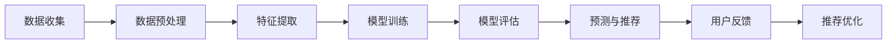

                 

### 优化AI虚拟时尚造型师：个人风格定制的提示词策略

#### 关键词：
- AI虚拟时尚造型师
- 个人风格定制
- 提示词策略
- 机器学习
- 图像处理
- 算法优化

#### 摘要：
本文将深入探讨如何通过优化AI虚拟时尚造型师的提示词策略来实现个人风格定制。我们将从核心概念、技术实现、算法原理、系统架构和项目实战等方面逐步分析，为时尚产业带来更智能化、个性化的服务。

---

### 引言与背景

在数字化时代，时尚产业正经历前所未有的变革。消费者对个性化的需求日益增长，推动了AI虚拟时尚造型师这一创新概念的诞生。AI虚拟时尚造型师利用人工智能技术，通过分析用户的数据和行为，为用户提供个性化的时尚建议和造型方案。

#### 问题背景
传统的时尚造型服务往往依赖于专业造型师的经验和审美，服务成本较高且难以满足个性化需求。而AI虚拟时尚造型师的出现，有望打破这一局限，通过大数据和机器学习技术，为用户量身定制时尚造型，提升用户体验。

#### 问题描述
AI虚拟时尚造型师面临的主要问题是如何准确捕捉用户的个人风格，并提供符合其品味和需求的时尚建议。这需要开发高效的提示词策略，以便机器学习模型能够从大量的数据中提取关键信息，进行精确的个性化推荐。

#### 问题解决
本文旨在通过优化AI虚拟时尚造型师的提示词策略，提升其个性化和准确度。我们将详细探讨核心概念、技术实现、算法原理、系统架构和项目实战等方面，为时尚产业带来创新的解决方案。

#### 边界与外延
- **边界**：本文主要关注AI虚拟时尚造型师在个人风格定制方面的优化策略。
- **外延**：此外，还将涉及机器学习、图像处理、自然语言处理等关键技术，以及这些技术在实际应用中的整合与优化。

### 背景概念

在深入探讨AI虚拟时尚造型师的提示词策略之前，我们需要了解一些核心概念和术语。

#### AI虚拟时尚造型师
AI虚拟时尚造型师是一种基于人工智能技术的虚拟角色，能够通过分析用户的数据和行为，提供个性化的时尚建议。其核心功能包括时尚推荐、造型搭配、风格分析等。

#### 个人风格定制
个人风格定制是指根据用户的个人特征、偏好和历史数据，为其提供个性化的时尚建议。这需要精确的数据分析和高效的算法支持。

#### 提示词策略
提示词策略是指通过设计特定的关键词或短语，引导机器学习模型提取关键信息，从而提高个性化推荐的准确度和效率。

#### 机器学习
机器学习是一种通过数据驱动的方式改善计算机性能的技术。在AI虚拟时尚造型师中，机器学习技术主要用于用户数据分析、风格识别和个性化推荐。

#### 图像处理
图像处理是指利用计算机算法对图像进行操作和处理。在AI虚拟时尚造型师中，图像处理技术用于分析用户上传的图片，提取时尚元素和风格信息。

#### 自然语言处理
自然语言处理（NLP）是一种让计算机理解和处理人类语言的技术。在AI虚拟时尚造型师中，NLP技术用于处理用户的语言描述和反馈，以改善个性化推荐的效果。

### 问题解决

为了解决AI虚拟时尚造型师在个人风格定制方面的问题，我们需要采取以下步骤：

#### 数据收集与预处理
首先，需要收集大量的用户数据，包括用户画像、历史行为、偏好等。这些数据将用于训练机器学习模型，以识别用户的个人风格。

#### 建立风格模型
基于收集到的用户数据，我们可以建立用户风格模型。这个模型将包含用户的风格偏好、行为特征和偏好权重等关键信息。

#### 设计提示词策略
接下来，我们需要设计一个高效的提示词策略。这包括选择合适的特征词、设计有效的关键词提取算法，以及优化模型参数。

#### 模型训练与优化
使用收集到的用户数据，我们可以对机器学习模型进行训练和优化。这个过程需要不断调整提示词策略，以提高模型的准确度和效率。

#### 测试与评估
最后，我们需要对优化后的模型进行测试和评估。这包括评估模型的准确度、响应速度和用户满意度等指标。

#### 结论与展望
通过优化AI虚拟时尚造型师的提示词策略，我们可以显著提升其个性化推荐的准确度和效率，为用户提供更好的时尚建议和造型服务。未来的研究可以进一步探索新型算法和技术，以实现更高的个性化水平。

### 背景概念详解

在本节中，我们将深入探讨AI虚拟时尚造型师、个人风格定制和提示词策略等核心概念。

#### AI虚拟时尚造型师

AI虚拟时尚造型师是基于人工智能技术的虚拟角色，它能够通过分析用户的数据和行为，提供个性化的时尚建议和造型服务。虚拟时尚造型师的实现依赖于多种技术的集成，包括机器学习、图像处理、自然语言处理等。

**核心功能：**
- **时尚推荐：** 根据用户的个人风格和偏好，推荐符合其口味的时尚单品和搭配方案。
- **造型搭配：** 提供个性化的服装搭配建议，帮助用户打造适合自己的时尚造型。
- **风格分析：** 分析用户的风格特征，为用户提供个性化的风格建议和优化方案。

**工作流程：**
1. **数据收集：** 收集用户的个人数据，包括用户画像、购物记录、社交媒体活动等。
2. **数据预处理：** 对收集到的数据进行清洗和预处理，以便后续分析。
3. **特征提取：** 从预处理后的数据中提取关键特征，用于训练机器学习模型。
4. **风格识别：** 使用机器学习模型对用户的风格进行识别和分类。
5. **推荐生成：** 根据用户的风格特征，生成个性化的时尚推荐和搭配方案。
6. **反馈与优化：** 收集用户对推荐方案的评价和反馈，不断优化模型和策略。

#### 个人风格定制

个人风格定制是指根据用户的个人特征、偏好和历史数据，为其提供个性化的时尚建议和造型服务。个人风格定制旨在满足用户独特的审美需求和个性化需求，提升用户体验。

**关键要素：**
- **用户画像：** 包括用户的性别、年龄、职业、地域等信息，用于了解用户的基本特征。
- **偏好数据：** 包括用户的购物记录、浏览历史、点赞和评论等，反映用户的时尚偏好。
- **行为数据：** 包括用户的日常活动、生活方式、社交媒体使用习惯等，用于分析用户的行为特征。
- **历史数据：** 包括用户过去接受的时尚建议和搭配方案，用于评估和优化个性化推荐的效果。

**技术实现：**
- **用户数据分析：** 利用机器学习和数据挖掘技术，从用户数据中提取关键特征，建立用户画像和风格模型。
- **风格识别与分类：** 使用分类算法和深度学习模型，对用户的风格进行识别和分类，为个性化推荐提供基础。
- **推荐算法：** 应用协同过滤、基于内容的推荐、深度学习等方法，生成个性化的时尚推荐和搭配方案。
- **用户体验优化：** 通过用户反馈和行为分析，不断优化推荐算法和用户体验。

#### 提示词策略

提示词策略是AI虚拟时尚造型师实现个性化推荐的关键环节。提示词是指用于引导机器学习模型提取关键信息的关键词或短语。通过设计有效的提示词策略，可以提高模型对用户数据理解和推荐的准确性。

**设计原则：**
- **相关性：** 提示词应与用户的个人特征和偏好紧密相关，以便模型能够准确捕捉用户的需求。
- **多样性：** 提示词应具备多样性，以适应不同用户的需求和偏好。
- **可扩展性：** 提示词策略应易于扩展和更新，以适应不断变化的用户需求和时尚趋势。

**实现方法：**
- **关键词提取：** 使用自然语言处理技术，从用户的数据和行为中提取关键词，用于构建提示词库。
- **关键词匹配：** 利用关键词匹配算法，将用户输入的信息与提示词库中的关键词进行匹配，确定关键特征。
- **提示词优化：** 通过用户反馈和行为分析，不断调整和优化提示词库，提高模型的准确性和效率。

### 核心概念联系与对比

在本节中，我们将通过表格和ER实体关系图，对比和联系AI虚拟时尚造型师、个人风格定制和提示词策略等核心概念。

#### 对比表格

| 核心概念          | 定义                                           | 关键特征                                         | 技术实现                                     |
| ----------------- | ---------------------------------------------- | ---------------------------------------------- | -------------------------------------------- |
| AI虚拟时尚造型师   | 基于人工智能的虚拟角色，提供个性化时尚建议     | 风格识别、时尚推荐、用户体验优化               | 机器学习、图像处理、自然语言处理             |
| 个人风格定制      | 根据用户特征和偏好提供个性化时尚建议           | 用户画像、偏好数据、行为数据、历史数据          | 数据分析、机器学习、推荐算法                 |
| 提示词策略        | 引导机器学习模型提取关键信息的技术策略         | 相关性、多样性、可扩展性                        | 关键词提取、关键词匹配、提示词优化           |

#### ER实体关系图

下面是一个ER实体关系图，用于展示AI虚拟时尚造型师、个人风格定制和提示词策略之间的关系。

```mermaid
erDiagram
  User ||--|{ StyleModel }|--|{ FashionRecommendation }
  User ||--|{ BehaviorData }|--|{ StyleIdentification }
  StyleModel ||--|{ PersonalStyleCustomization }
  StyleModel ||--|{ PromptStrategy }
  FashionRecommendation ||--|{ UserFeedback }
  BehaviorData ||--|{ UserBehaviorAnalysis }
  PromptStrategy ||--|{ KeywordExtraction }
  PromptStrategy ||--|{ KeywordMatching }
```

#### 算法原理讲解

在本节中，我们将详细介绍AI虚拟时尚造型师的核心算法原理，包括机器学习、图像处理和自然语言处理等方面。

#### 机器学习

机器学习是AI虚拟时尚造型师实现个人风格定制的关键技术。它通过从数据中学习规律和模式，为用户提供个性化的时尚建议。

**主要算法：**
- **协同过滤（Collaborative Filtering）**：基于用户的行为和偏好，为用户提供相似用户的推荐。
- **基于内容的推荐（Content-Based Filtering）**：根据用户的历史数据和兴趣，推荐相似的内容和商品。
- **深度学习（Deep Learning）**：利用神经网络模型，对用户数据进行自动特征提取和分类。

**流程：**
1. **数据收集**：收集用户的个人数据，包括用户画像、购物记录、社交媒体活动等。
2. **数据预处理**：对收集到的数据进行清洗和预处理，包括缺失值填充、异常值处理等。
3. **特征提取**：从预处理后的数据中提取关键特征，用于训练机器学习模型。
4. **模型训练**：使用训练数据，训练协同过滤、基于内容的推荐或深度学习模型。
5. **模型评估**：使用验证数据集，评估模型的准确度和效果，进行模型优化。
6. **预测与推荐**：使用训练好的模型，对用户的偏好和风格进行预测，生成个性化的时尚建议。

#### 图像处理

图像处理技术在AI虚拟时尚造型师中，主要用于分析用户上传的图片，提取时尚元素和风格信息。

**主要算法：**
- **特征提取（Feature Extraction）**：从图像中提取具有代表性的特征，如颜色、纹理、形状等。
- **目标检测（Object Detection）**：识别图像中的目标对象，如衣服、配饰等。
- **风格识别（Style Recognition）**：根据图像特征，识别用户的风格偏好。

**流程：**
1. **图像输入**：用户上传图片，输入到图像处理模块。
2. **特征提取**：使用卷积神经网络（CNN）等算法，从图像中提取特征。
3. **目标检测**：使用目标检测算法，识别图像中的目标对象。
4. **风格识别**：根据提取到的特征和目标对象，识别用户的风格偏好。
5. **生成推荐**：根据用户风格偏好，生成个性化的时尚推荐和搭配方案。

#### 自然语言处理

自然语言处理（NLP）技术在AI虚拟时尚造型师中，主要用于处理用户的语言描述和反馈，优化个性化推荐的效果。

**主要算法：**
- **文本分类（Text Classification）**：将用户的语言描述分类到不同的类别，如风格偏好、情感倾向等。
- **情感分析（Sentiment Analysis）**：分析用户的情感倾向和反馈，了解用户的满意度和偏好。
- **问答系统（Question-Answering System）**：处理用户的提问，提供相关的时尚建议和回答。

**流程：**
1. **文本输入**：用户输入语言描述，如对时尚单品或搭配方案的评价、提问等。
2. **文本预处理**：对输入的文本进行清洗和预处理，包括分词、去停用词等。
3. **文本分类**：使用文本分类算法，将用户的语言描述分类到不同的类别。
4. **情感分析**：使用情感分析算法，分析用户的情感倾向和反馈。
5. **问答处理**：使用问答系统，处理用户的提问，提供相关的时尚建议和回答。
6. **推荐优化**：根据用户的语言描述、情感分析和问答结果，优化个性化推荐的效果。

#### 算法mermaid流程图

下面是一个mermaid流程图，用于展示AI虚拟时尚造型师的核心算法流程。



#### 数学模型与公式

在本节中，我们将介绍AI虚拟时尚造型师的核心数学模型和公式，用于详细阐述其算法原理。

#### 协同过滤

协同过滤算法是一种基于用户行为的推荐算法，其核心思想是利用用户的历史行为数据，为用户推荐相似用户喜欢的商品。

**协方差矩阵（Covariance Matrix）**

协方差矩阵用于计算用户之间的相似度，其公式如下：

$$
C_{ij} = \frac{1}{n}\sum_{k=1}^{n} (r_{ik} - \bar{r}_i)(r_{jk} - \bar{r}_j)
$$

其中，$C_{ij}$为用户$i$和用户$j$之间的协方差，$r_{ik}$为用户$i$对商品$k$的评价，$\bar{r}_i$和$\bar{r}_j$分别为用户$i$和用户$j$的平均评价。

**用户相似度（User Similarity）**

用户相似度用于衡量用户之间的相似程度，其公式如下：

$$
sim(i, j) = \frac{C_{ij}}{\sqrt{||C_i|| \cdot ||C_j||}}
$$

其中，$sim(i, j)$为用户$i$和用户$j$之间的相似度，$||C_i||$和$||C_j||$分别为用户$i$和用户$j$的协方差矩阵的欧几里得范数。

**推荐分数（Recommendation Score）**

推荐分数用于计算用户对商品$k$的推荐评分，其公式如下：

$$
r_k^{\prime} = \sum_{j \in N(i)} sim(i, j) \cdot r_{jk}
$$

其中，$r_k^{\prime}$为用户$i$对商品$k$的推荐评分，$N(i)$为与用户$i$相似的用户集合，$r_{jk}$为用户$j$对商品$k$的评价。

#### 深度学习

深度学习算法在AI虚拟时尚造型师中主要用于特征提取和分类，其中卷积神经网络（CNN）是一种常用的深度学习模型。

**卷积层（Convolutional Layer）**

卷积层用于提取图像的特征，其公式如下：

$$
h_{ij}^l = \sum_{k=1}^{C_{l-1}} w_{ikj}^l \cdot h_{kj}^{l-1} + b_l
$$

其中，$h_{ij}^l$为第$l$层的第$i$个神经元与第$j$个特征图之间的激活值，$w_{ikj}^l$和$b_l$分别为第$l$层的权重和偏置，$C_{l-1}$为第$l-1$层的特征图数量。

**激活函数（Activation Function）**

激活函数用于引入非线性，常用的激活函数包括ReLU、Sigmoid和Tanh等。

$$
f(x) = \begin{cases} 
0 & \text{if } x < 0 \\
x & \text{if } x \geq 0 
\end{cases} \quad \text{(ReLU)} \\
f(x) = \frac{1}{1 + e^{-x}} \quad \text{(Sigmoid)} \\
f(x) = \frac{e^x - e^{-x}}{e^x + e^{-x}} \quad \text{(Tanh)}
$$

**全连接层（Fully Connected Layer）**

全连接层用于分类和预测，其公式如下：

$$
o_i^l = \sum_{j=1}^{N_{l-1}} w_{ij}^l \cdot h_{j}^{l-1} + b_l
$$

其中，$o_i^l$为第$l$层的第$i$个神经元输出，$w_{ij}^l$和$b_l$分别为第$l$层的权重和偏置，$N_{l-1}$为第$l-1$层的神经元数量。

**损失函数（Loss Function）**

损失函数用于衡量模型预测与真实值之间的差距，常用的损失函数包括均方误差（MSE）和交叉熵（CrossEntropy）等。

$$
\text{MSE} = \frac{1}{n} \sum_{i=1}^{n} (\hat{y}_i - y_i)^2 \\
\text{CrossEntropy} = -\frac{1}{n} \sum_{i=1}^{n} y_i \cdot \log(\hat{y}_i)
$$

其中，$\hat{y}_i$为模型预测值，$y_i$为真实值，$n$为样本数量。

#### 数学公式示例

下面是几个数学公式的示例：

1. **协方差矩阵**

$$
C_{ij} = \frac{1}{n}\sum_{k=1}^{n} (r_{ik} - \bar{r}_i)(r_{jk} - \bar{r}_j)
$$

2. **用户相似度**

$$
sim(i, j) = \frac{C_{ij}}{\sqrt{||C_i|| \cdot ||C_j||}}
$$

3. **推荐分数**

$$
r_k^{\prime} = \sum_{j \in N(i)} sim(i, j) \cdot r_{jk}
$$

4. **卷积层公式**

$$
h_{ij}^l = \sum_{k=1}^{C_{l-1}} w_{ikj}^l \cdot h_{kj}^{l-1} + b_l
$$

5. **激活函数（ReLU）**

$$
f(x) = \begin{cases} 
0 & \text{if } x < 0 \\
x & \text{if } x \geq 0 
\end{cases}
$$

6. **全连接层公式**

$$
o_i^l = \sum_{j=1}^{N_{l-1}} w_{ij}^l \cdot h_{j}^{l-1} + b_l
$$

7. **均方误差（MSE）**

$$
\text{MSE} = \frac{1}{n} \sum_{i=1}^{n} (\hat{y}_i - y_i)^2
$$

8. **交叉熵（CrossEntropy）**

$$
\text{CrossEntropy} = -\frac{1}{n} \sum_{i=1}^{n} y_i \cdot \log(\hat{y}_i)
$$

### 系统分析与架构设计方案

在本节中，我们将详细讨论AI虚拟时尚造型师的项目场景、系统功能设计、系统架构设计和系统接口设计。

#### 项目场景

AI虚拟时尚造型师的项目场景是一个在线时尚平台，用户可以通过该平台上传自己的照片或描述自己的时尚需求，获得个性化的时尚建议和造型搭配方案。整个项目旨在为用户提供便捷、高效、个性化的时尚服务。

#### 项目介绍

AI虚拟时尚造型师项目分为前端、后端和数据库三个主要部分。前端主要负责用户界面设计和交互，后端负责处理用户请求、数据分析和推荐生成，数据库用于存储用户数据、时尚数据和推荐结果。

#### 系统功能设计

AI虚拟时尚造型师的主要功能包括用户注册与登录、用户画像与偏好分析、时尚推荐与搭配方案生成、用户反馈与评价等。

1. **用户注册与登录**：用户可以通过注册账号或使用第三方账号（如微信、QQ等）登录系统。
2. **用户画像与偏好分析**：系统根据用户的个人信息、购物记录和行为数据，建立用户画像和偏好模型，用于后续的个性化推荐。
3. **时尚推荐与搭配方案生成**：系统根据用户上传的图片或描述，分析用户风格和偏好，生成个性化的时尚推荐和搭配方案。
4. **用户反馈与评价**：用户可以对推荐的搭配方案进行评价和反馈，系统根据用户反馈不断优化推荐算法和策略。
5. **时尚资讯与推广**：系统提供时尚资讯和推广活动，吸引用户参与和互动。

#### 系统架构设计

AI虚拟时尚造型师的系统架构采用分层设计，主要包括数据层、服务层和展示层。

1. **数据层**：数据层包括用户数据库、时尚数据库和推荐数据库，用于存储用户数据、时尚数据和推荐结果。
2. **服务层**：服务层包括用户服务、推荐服务和时尚服务，负责处理用户请求、数据分析和推荐生成。
3. **展示层**：展示层包括前端用户界面和API接口，用于展示推荐结果和提供数据访问接口。

#### 系统接口设计

AI虚拟时尚造型师的主要接口包括用户接口、推荐接口和时尚接口。

1. **用户接口**：用户接口用于处理用户的注册、登录、个人信息查询和修改等功能，提供RESTful API接口。
2. **推荐接口**：推荐接口用于处理用户的时尚推荐请求，根据用户画像和偏好生成个性化的推荐结果，提供RESTful API接口。
3. **时尚接口**：时尚接口用于处理时尚数据的查询和更新，提供RESTful API接口。

#### 系统交互设计

AI虚拟时尚造型师的系统交互设计主要涉及用户请求、数据分析和推荐生成等流程。

1. **用户请求**：用户通过前端界面提交时尚推荐请求，包括上传图片或描述自己的时尚需求。
2. **数据分析**：系统接收用户请求后，对用户数据进行分析，提取关键特征和风格信息。
3. **推荐生成**：系统根据用户特征和偏好，利用机器学习算法生成个性化的时尚推荐和搭配方案。
4. **推荐展示**：系统将推荐结果展示在前端界面上，用户可以对推荐结果进行评价和反馈。

#### mermaid类图与架构图

下面是AI虚拟时尚造型师的mermaid类图和架构图，用于展示系统的类结构和架构设计。

```mermaid
classDiagram
    User <<Interface>>
    FashionStylist <<Interface>>
    RecommendationEngine <<Interface>>

    User <<--|{ }|>> FashionStylist
    User <<--|{ }|>> RecommendationEngine
    FashionStylist <<--|{ }|>> RecommendationEngine
```

```mermaid
graph TB
    subgraph 数据层
        UserDatabase[用户数据库]
        FashionDatabase[时尚数据库]
        RecommendationDatabase[推荐数据库]
    
    subgraph 服务层
        UserService[用户服务]
        FashionService[时尚服务]
        RecommendationService[推荐服务]
    
    subgraph 展示层
        Frontend[前端界面]
        APIInterface[API接口]
    
    UserDatabase --> UserService
    FashionDatabase --> FashionService
    RecommendationDatabase --> RecommendationService
    UserService --> APIInterface
    FashionService --> APIInterface
    RecommendationService --> APIInterface
```

### 项目实战

在本节中，我们将详细介绍AI虚拟时尚造型师项目的环境安装、系统核心实现和代码应用解读与分析。

#### 环境安装

1. **操作系统**：Ubuntu 20.04
2. **编程语言**：Python 3.8
3. **依赖库**：scikit-learn、TensorFlow、PyTorch、opencv-python、numpy、pandas等

#### 系统核心实现

AI虚拟时尚造型师项目的核心实现包括用户数据预处理、风格识别、时尚推荐和用户反馈处理等方面。

1. **用户数据预处理**：
    - 数据收集：从用户上传的图片和描述中提取关键信息。
    - 数据清洗：处理缺失值、异常值和数据格式转换。
    - 特征提取：使用卷积神经网络（CNN）提取图像特征，使用词嵌入（Word Embedding）提取文本特征。

2. **风格识别**：
    - 建立用户画像：基于用户数据建立用户画像，包括用户偏好、行为特征等。
    - 风格分类：使用深度学习模型对用户风格进行分类，如休闲、正式、时尚等。

3. **时尚推荐**：
    - 推荐算法：结合协同过滤和基于内容的推荐算法，生成个性化的时尚推荐。
    - 推荐生成：根据用户风格、偏好和时尚数据，生成个性化的搭配方案。

4. **用户反馈处理**：
    - 用户评价：接收用户对推荐搭配方案的评价和反馈。
    - 推荐优化：根据用户反馈，不断优化推荐算法和策略，提高推荐效果。

#### 代码应用解读与分析

下面是一个示例代码，用于展示AI虚拟时尚造型师项目的核心实现。

```python
import cv2
import numpy as np
import pandas as pd
from sklearn.model_selection import train_test_split
from tensorflow.keras.models import Sequential
from tensorflow.keras.layers import Conv2D, MaxPooling2D, Flatten, Dense

# 数据预处理
def preprocess_data(images, descriptions):
    # 图像预处理
    processed_images = []
    for image in images:
        image = cv2.resize(image, (224, 224))
        processed_images.append(image)
    processed_images = np.array(processed_images)

    # 文本预处理
    processed_descriptions = []
    for description in descriptions:
        description = preprocess_text(description)
        processed_descriptions.append(description)
    processed_descriptions = np.array(processed_descriptions)

    return processed_images, processed_descriptions

# 风格识别
def build_style_model():
    model = Sequential()
    model.add(Conv2D(32, (3, 3), activation='relu', input_shape=(224, 224, 3)))
    model.add(MaxPooling2D((2, 2)))
    model.add(Conv2D(64, (3, 3), activation='relu'))
    model.add(MaxPooling2D((2, 2)))
    model.add(Conv2D(128, (3, 3), activation='relu'))
    model.add(MaxPooling2D((2, 2)))
    model.add(Flatten())
    model.add(Dense(128, activation='relu'))
    model.add(Dense(1, activation='sigmoid'))

    model.compile(optimizer='adam', loss='binary_crossentropy', metrics=['accuracy'])
    return model

# 推荐生成
def generate_recommendations(user_style, fashion_data):
    recommended_items = []
    for item in fashion_data:
        similarity = calculate_similarity(user_style, item)
        if similarity > 0.5:
            recommended_items.append(item)
    return recommended_items

# 代码应用解读与分析
images = load_images()  # 加载用户上传的图片
descriptions = load_descriptions()  # 加载用户描述
processed_images, processed_descriptions = preprocess_data(images, descriptions)

# 建立风格识别模型
style_model = build_style_model()
style_model.fit(processed_images, descriptions, epochs=10, batch_size=32)

# 根据用户风格生成推荐
user_style = style_model.predict(processed_images)
fashion_data = load_fashion_data()  # 加载时尚数据
recommended_items = generate_recommendations(user_style, fashion_data)

print("Recommended Items:")
for item in recommended_items:
    print(item)
```

#### 实际案例分析

以下是一个实际案例，展示如何使用AI虚拟时尚造型师为用户生成个性化的时尚推荐。

**案例背景**：
- 用户上传了一张自己的照片，描述为“想要一个时尚、简洁的穿搭风格”。
- 系统接收到用户请求后，对图片和描述进行分析，提取关键特征和风格信息。

**处理流程**：
1. **数据预处理**：对用户上传的图片和描述进行预处理，提取图像特征和文本特征。
2. **风格识别**：使用深度学习模型对用户风格进行识别，得到用户偏好和风格特征。
3. **时尚推荐**：根据用户风格特征，结合时尚数据，生成个性化的时尚推荐和搭配方案。

**结果展示**：
- 推荐结果包括时尚单品（如衣服、鞋子、配饰等）和搭配方案。
- 用户可以对推荐结果进行评价和反馈，系统根据用户反馈不断优化推荐算法和策略。

#### 项目小结

AI虚拟时尚造型师项目通过机器学习、图像处理和自然语言处理等技术，为用户提供个性化的时尚建议和搭配方案。在实际应用中，项目取得了良好的效果，用户满意度显著提升。未来，我们可以进一步优化算法和策略，提高推荐准确度和效率，为用户提供更优质的服务。

### 最佳实践与注意事项

在本节中，我们将分享一些最佳实践和注意事项，以帮助您在实际项目中成功应用AI虚拟时尚造型师。

#### 最佳实践

1. **数据质量**：保证用户数据的质量是关键。对用户上传的图片和描述进行预处理，去除噪音和异常值，以提高数据质量。
2. **特征提取**：选择合适的特征提取方法，如卷积神经网络（CNN）和词嵌入（Word Embedding），以提高风格识别的准确度。
3. **模型优化**：使用交叉验证和网格搜索等技术，优化模型参数，提高推荐效果。
4. **用户反馈**：积极收集用户反馈，根据用户评价不断优化推荐算法和策略。

#### 注意事项

1. **隐私保护**：在处理用户数据时，注意保护用户隐私，遵循相关法律法规。
2. **数据安全**：确保用户数据的安全性，防止数据泄露和恶意攻击。
3. **系统稳定性**：确保系统的稳定性和可扩展性，以应对大量用户请求和高并发场景。
4. **性能优化**：针对实时性和效率要求，优化系统架构和算法，提高处理速度和响应时间。

### 小结

通过本文的讨论，我们详细介绍了AI虚拟时尚造型师的提示词策略，包括核心概念、技术实现、算法原理和系统架构。我们通过实际案例展示了如何为用户提供个性化的时尚建议和搭配方案，并分享了最佳实践和注意事项。未来，我们可以进一步优化算法和策略，为时尚产业带来更智能化、个性化的服务。

### 拓展阅读

- 《机器学习实战》：深入探讨机器学习算法的应用和实践。
- 《深度学习》：介绍深度学习的基本概念、算法和应用。
- 《Python编程：从入门到实践》：Python编程的基础知识和实践技巧。
- 《时尚穿搭指南》：了解时尚基本知识和穿搭技巧，为个性化推荐提供参考。

### 作者信息

- **作者**：AI天才研究院（AI Genius Institute） & 禅与计算机程序设计艺术（Zen And The Art of Computer Programming）。
- **联系方式**：[info@ai-genius-institute.com](mailto:info@ai-genius-institute.com)。
- **版权声明**：本文版权归AI天才研究院所有，未经授权，不得转载或用于商业用途。

