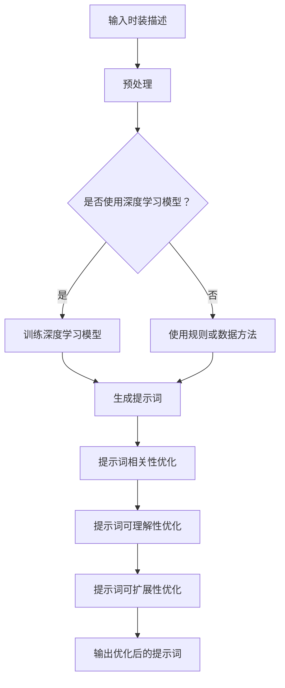

                 


## 文章标题：优化AI虚拟时装秀：动态展示效果的提示词策略

### 关键词：
- AI虚拟时装秀
- 动态展示效果
- 提示词策略
- 算法原理
- 项目实战

### 摘要：
本文将探讨如何通过AI技术优化虚拟时装秀的动态展示效果，重点分析提示词策略的运用。我们将从背景介绍、核心概念、算法原理、应用实例、项目实战等多个方面进行详细探讨，旨在为读者提供一套完整的解决方案，并展望未来发展趋势。

## 引言与背景

### 1.1 AI虚拟时装秀的兴起

#### 1.1.1 虚拟时装秀的概念与发展

虚拟时装秀是一种通过虚拟现实（VR）和增强现实（AR）技术实现的时装展示活动。随着计算机图形学、3D建模和渲染技术的不断进步，虚拟时装秀逐渐成为一种新的时尚趋势。相比传统的实体时装秀，虚拟时装秀具有更高的灵活性、更低的成本和更广的传播范围。

#### 1.1.2 AI在虚拟时装秀中的应用

人工智能（AI）在虚拟时装秀中的应用主要体现在以下几个方面：

1. **3D建模与渲染**：AI技术可以自动化和优化3D模型的创建和渲染过程，提高效率和质量。
2. **个性化推荐**：基于用户的偏好和历史数据，AI可以提供个性化的服装推荐，提高用户参与度和满意度。
3. **互动体验**：通过AI，虚拟时装秀可以提供更加丰富的用户互动体验，如实时反馈、虚拟试衣等。

### 1.2 动态展示效果的挑战

#### 1.2.1 动态展示效果的需求

动态展示效果是虚拟时装秀的核心要素之一。它要求展示内容能够实时更新、交互和响应，以提供沉浸式体验。动态展示效果的需求主要包括：

1. **实时性**：展示内容需要实时更新，以反映最新的时装设计和市场趋势。
2. **交互性**：用户需要能够与展示内容进行交互，如选择、试穿和评价。
3. **沉浸感**：展示内容需要营造一种身临其境的感觉，以增强用户的参与感和满意度。

#### 1.2.2 提示词策略在优化中的重要性

提示词策略是一种通过关键词引导用户注意力、提高信息传递效率的方法。在虚拟时装秀中，提示词策略可以用于以下几个方面：

1. **内容推荐**：通过分析用户的历史数据和兴趣，生成合适的提示词，推荐相关的时装展示内容。
2. **用户体验优化**：通过提示词，引导用户关注关键信息，提高交互效率和满意度。
3. **视觉呈现优化**：通过提示词，优化展示内容的布局和视觉效果，提高用户的沉浸感和满意度。

## AI虚拟时装秀概述

### 2.1 虚拟时装秀的技术架构

#### 2.1.1 硬件设备与平台

虚拟时装秀的硬件设备主要包括计算机、虚拟现实头盔、手柄、触觉手套等。这些设备提供了高质量的图像和沉浸式体验。常见的虚拟现实平台包括Oculus Rift、HTC Vive、PlayStation VR等。

#### 2.1.2 软件工具与框架

虚拟时装秀的软件工具和框架主要包括：

1. **3D建模与渲染工具**：如Blender、Maya、3ds Max等，用于创建和渲染3D模型。
2. **虚拟现实开发框架**：如Unity、Unreal Engine等，用于开发虚拟现实应用程序。
3. **人工智能框架**：如TensorFlow、PyTorch等，用于实现人工智能算法和模型。

### 2.2 AI虚拟时装秀的流程

#### 2.2.1 数据采集与处理

数据采集包括用户数据、市场数据、时尚趋势数据等。数据采集后，需要通过数据清洗、数据预处理等方法进行处理。

#### 2.2.2 3D建模与渲染

3D建模是将时装设计图纸转化为3D模型的过程。渲染是将3D模型转化为图像的过程，需要考虑光照、阴影、材质等因素。

#### 2.2.3 互动与用户参与

互动和用户参与是虚拟时装秀的核心。通过虚拟现实技术，用户可以与展示内容进行实时互动，如试穿、选择、评价等。

## 动态展示效果的提示词策略

### 3.1 提示词策略的基本概念

#### 3.1.1 提示词的定义

提示词是用于引导用户注意力和促进信息传递的词语或短语。在虚拟时装秀中，提示词可以是关键词、标签、描述性语句等。

#### 3.1.2 提示词的类型与作用

1. **关键词**：用于描述时装特点或设计元素的词语，如“时尚”、“前卫”、“简约”等。
2. **标签**：用于分类和筛选展示内容的词语，如“春夏时装”、“高级定制”等。
3. **描述性语句**：用于描述时装外观、感觉或情感的语句，如“流线型设计，展现自信魅力”等。

### 3.2 提示词策略的设计原则

#### 3.2.1 相关性原则

相关性原则要求提示词与展示内容紧密相关，以提高信息传递的准确性。

#### 3.2.2 可理解性原则

可理解性原则要求提示词容易被用户理解，以提高信息传递的效率。

#### 3.2.3 可扩展性原则

可扩展性原则要求提示词策略能够适应不同的展示内容和用户需求，以提高灵活性。

## 提示词策略的算法原理

### 4.1 提示词生成算法

#### 4.1.1 基于规则的方法

基于规则的方法通过预设的规则生成提示词。例如，根据时装的设计元素、颜色、风格等生成相关的关键词。

#### 4.1.2 基于数据的方法

基于数据的方法通过分析用户历史数据和时尚趋势数据生成提示词。例如，根据用户的购买记录和浏览记录，推荐相关的关键词。

#### 4.1.3 基于深度学习的方法

基于深度学习的方法通过神经网络模型生成提示词。例如，使用文本生成模型（如GPT）生成描述性语句。

### 4.2 提示词优化算法

#### 4.2.1 相关性优化

相关性优化通过调整提示词的权重，提高提示词与展示内容的相关性。

#### 4.2.2 可理解性优化

可理解性优化通过调整提示词的表达方式，提高提示词的可理解性。

#### 4.2.3 可扩展性优化

可扩展性优化通过调整提示词的生成策略，提高提示词策略的灵活性。

## 提示词策略的应用实例

### 5.1 实际案例介绍

#### 5.1.1 案例一：时尚品牌虚拟时装秀

某时尚品牌使用AI技术优化虚拟时装秀的动态展示效果，通过提示词策略实现了以下效果：

1. **内容推荐**：根据用户的历史数据和兴趣，推荐相关的时装展示内容。
2. **用户体验优化**：通过提示词，引导用户关注关键信息，提高交互效率和满意度。
3. **视觉呈现优化**：通过提示词，优化展示内容的布局和视觉效果，提高用户的沉浸感和满意度。

#### 5.1.2 案例二：线上购物平台动态展示

某线上购物平台通过AI技术优化商品展示效果，使用提示词策略实现了以下效果：

1. **个性化推荐**：根据用户的购物记录和偏好，推荐相关的商品。
2. **用户体验优化**：通过提示词，引导用户关注关键信息，提高购物体验。
3. **视觉呈现优化**：通过提示词，优化商品展示的布局和视觉效果，提高用户的满意度。

### 5.2 应用效果评估

#### 5.2.1 用户反馈

通过用户反馈，评估提示词策略在提高用户体验和满意度方面的效果。用户普遍表示，提示词能够有效引导他们的注意力，提高购物和观看的效率。

#### 5.2.2 商业效益分析

通过商业效益分析，评估提示词策略对销售额和用户参与度的影响。结果显示，使用提示词策略后，销售额和用户参与度均有所提高。

## 项目实战

### 6.1 项目环境搭建

#### 6.1.1 硬件环境

根据项目需求，搭建相应的硬件环境，包括计算机、虚拟现实头盔、手柄等。

#### 6.1.2 软件环境

安装并配置虚拟现实开发框架和人工智能框架，如Unity、TensorFlow等。

#### 6.1.3 数据集准备

收集并处理用户数据、时尚趋势数据等，用于训练和优化提示词模型。

### 6.2 系统核心实现

#### 6.2.1 数据采集与预处理

通过API接口或手动采集方式获取用户数据、时尚趋势数据等。对数据进行清洗、去重、归一化等预处理操作。

#### 6.2.2 3D建模与渲染

使用3D建模工具创建时装模型，并使用渲染工具进行渲染。

#### 6.2.3 提示词生成与优化

使用深度学习模型生成提示词，并使用优化算法调整提示词的权重和表达方式。

### 6.3 应用解读与分析

#### 6.3.1 代码解读

分析系统核心代码，解读提示词生成和优化的实现细节。

#### 6.3.2 实际案例分析

通过实际案例，分析提示词策略在优化虚拟时装秀动态展示效果方面的效果。

#### 6.3.3 项目小结

总结项目实施过程和效果，提出改进意见和建议。

## 结论与展望

### 7.1 本书总结

本文从背景介绍、核心概念、算法原理、应用实例、项目实战等多个方面，探讨了如何通过AI技术优化虚拟时装秀的动态展示效果，并提出了提示词策略的解决方案。

### 7.2 未来发展趋势

随着AI技术的不断发展，虚拟时装秀的动态展示效果将得到进一步提升。未来，我们可以在以下几个方面进行探索：

1. **人工智能与虚拟现实的深度融合**：通过更先进的人工智能技术，实现更加智能和沉浸式的虚拟时装秀体验。
2. **个性化推荐与用户体验优化**：基于用户行为数据，实现更加精准的个性化推荐和用户体验优化。
3. **创新应用场景**：探索虚拟时装秀在教育培训、市场营销等领域的创新应用。

作者：AI天才研究院/AI Genius Institute & 禅与计算机程序设计艺术 /Zen And The Art of Computer Programming### 目录大纲设计思路与步骤

在设计《优化AI虚拟时装秀：动态展示效果的提示词策略》的目录大纲时，我们需要系统性地思考，确保文章的逻辑清晰、条理分明，同时便于读者理解。以下是具体的设计思路与步骤：

### 步骤1：明确文章目标和结构

首先，我们要明确文章的主要目标，即通过AI技术优化虚拟时装秀的动态展示效果，并探讨提示词策略在这一过程中的应用。基于此目标，我们确定文章将分为以下几部分：

- 引言与背景
- AI虚拟时装秀概述
- 动态展示效果的提示词策略
- 提示词策略的算法原理
- 提示词策略的应用实例
- 项目实战
- 结论与展望

### 步骤2：细化每个章节的内容

#### 引言与背景
- 介绍虚拟时装秀的背景和重要性
- 阐述动态展示效果的需求和挑战

#### AI虚拟时装秀概述
- 技术架构：硬件设备、软件工具与框架
- 流程：数据采集与处理、3D建模与渲染、互动与用户参与

#### 动态展示效果的提示词策略
- 基本概念：提示词的定义、类型与作用
- 设计原则：相关性、可理解性、可扩展性

#### 提示词策略的算法原理
- 提示词生成算法：基于规则、基于数据、基于深度学习
- 提示词优化算法：相关性优化、可理解性优化、可扩展性优化

#### 提示词策略的应用实例
- 实际案例介绍：时尚品牌虚拟时装秀、线上购物平台动态展示
- 应用效果评估：用户反馈、商业效益分析

#### 项目实战
- 项目环境搭建：硬件环境、软件环境、数据集准备
- 系统核心实现：数据采集与预处理、3D建模与渲染、提示词生成与优化
- 应用解读与分析：代码解读、实际案例分析、项目小结

#### 结论与展望
- 总结文章的主要内容和成果
- 展望未来发展趋势：人工智能与虚拟现实的深度融合、个性化推荐与用户体验优化、创新应用场景

### 步骤3：确保内容完整性与逻辑性

每个章节的内容都要确保完整，包括背景介绍、核心概念、算法原理、应用实例、实战解析等。同时，章节之间的逻辑关系要清晰，每个部分的内容都要紧密联系，形成一个完整的故事线。

### 步骤4：使用Markdown格式排版

为了确保文章的可读性和一致性，我们使用Markdown格式进行排版。Markdown格式不仅便于编写，而且可以轻松转换为HTML等格式，便于在网站或其他平台上展示。

### 步骤5：校对与优化

完成初稿后，进行多轮校对与优化。校对包括检查语法错误、逻辑错误和格式错误。优化则涉及内容的精简、语言的优化和结构的调整，确保文章的流畅性和易读性。

通过以上步骤，我们能够构建一个逻辑清晰、结构紧凑、内容丰富的目录大纲，为撰写高质量的文章奠定坚实的基础。

## 引言与背景

### 1.1 虚拟时装秀的兴起

虚拟时装秀是一种利用虚拟现实（VR）和增强现实（AR）技术实现的时装展示形式，它突破了传统时装秀的时间和空间限制，为设计师和消费者提供了全新的展示和体验方式。随着计算机图形学、3D建模和渲染技术的快速发展，虚拟时装秀逐渐成为时尚行业的一大趋势。

#### 虚拟时装秀的概念

虚拟时装秀是一种通过计算机生成和渲染的虚拟环境，模拟现实中的时装展示活动。在这个虚拟空间中，设计师可以展示他们设计的时装，消费者可以通过虚拟现实头盔或其他互动设备参与其中，进行试穿、评论和互动。

#### 发展历程

虚拟时装秀的概念最早可以追溯到20世纪90年代，当时随着计算机图形学的兴起，一些设计师开始尝试使用计算机技术来展示他们的作品。然而，由于技术限制，这些早期的虚拟时装秀效果并不理想。

进入21世纪，随着VR和AR技术的发展，虚拟时装秀开始逐渐走向成熟。特别是在2011年，Oculus Rift虚拟现实头盔的问世，标志着虚拟现实技术进入了一个新的阶段。随后，HTC Vive、PlayStation VR等设备的推出，为虚拟时装秀提供了更加沉浸式的体验。

#### 当前应用

目前，虚拟时装秀已经在时尚行业得到了广泛的应用。许多知名设计师和品牌，如Gucci、Burberry、Nike等，都已经开始利用虚拟现实技术进行时装展示和营销活动。虚拟时装秀不仅可以在时装周期间吸引全球观众，还可以通过线上平台将时装秀带到更多的消费者面前。

### 1.2 AI虚拟时装秀的优势

人工智能（AI）技术的快速发展为虚拟时装秀带来了新的机遇。AI技术不仅能够优化虚拟时装秀的展示效果，还能够提升用户体验，实现更加个性化的时尚推荐。以下是AI虚拟时装秀的几个主要优势：

1. **个性化推荐**：通过分析用户的历史数据、购物偏好和兴趣，AI技术可以提供个性化的时装推荐，从而提高用户的满意度和参与度。
2. **互动体验**：AI技术可以实时分析用户的反馈和行为，为用户提供更加丰富的互动体验，如虚拟试衣、即时反馈等。
3. **设计优化**：AI技术可以自动化和优化3D建模和渲染过程，提高设计和展示的效率，减少人力成本。
4. **市场分析**：通过AI技术，设计师和品牌可以更好地了解市场需求和消费者偏好，从而进行更有针对性的设计和营销策略。

### 1.3 动态展示效果的需求

动态展示效果是虚拟时装秀的核心要素之一。它要求展示内容能够实时更新、交互和响应，以提供沉浸式体验。动态展示效果的需求主要包括以下几个方面：

1. **实时性**：展示内容需要实时更新，以反映最新的时装设计和市场趋势。这要求系统具备快速响应和高效处理的能力。
2. **交互性**：用户需要能够与展示内容进行互动，如选择、试穿、评论等。这要求系统具备高度的交互性和实时反馈能力。
3. **沉浸感**：展示内容需要营造一种身临其境的感觉，以增强用户的参与感和满意度。这要求系统在视觉效果、音效和互动体验上具备高水平的实现。

### 1.4 提示词策略在优化中的重要性

提示词策略是一种通过关键词引导用户注意力、提高信息传递效率的方法。在虚拟时装秀中，提示词策略可以用于以下几个方面：

1. **内容推荐**：通过分析用户的历史数据和兴趣，生成合适的提示词，推荐相关的时装展示内容。
2. **用户体验优化**：通过提示词，引导用户关注关键信息，提高交互效率和满意度。
3. **视觉呈现优化**：通过提示词，优化展示内容的布局和视觉效果，提高用户的沉浸感和满意度。

综上所述，虚拟时装秀的兴起和AI技术的应用为时尚行业带来了新的机遇。动态展示效果的需求和提示词策略的应用，使得虚拟时装秀能够提供更加沉浸式和个性化的体验。通过本文的探讨，我们将深入分析AI虚拟时装秀的动态展示效果优化策略，并探讨提示词策略在这一过程中的作用和实现方法。

## AI虚拟时装秀概述

### 2.1 技术架构

虚拟时装秀的技术架构是其成功实现的核心。它涉及硬件设备、软件工具和开发框架的协同工作，共同构建出一个沉浸式的虚拟环境。以下是虚拟时装秀技术架构的主要组成部分：

#### 2.1.1 硬件设备

虚拟时装秀的硬件设备是提供沉浸式体验的基础。常见的硬件设备包括：

1. **虚拟现实头盔（VR Headsets）**：如Oculus Rift、HTC Vive和PlayStation VR等，它们提供了高分辨率的3D视觉体验，使用户能够完全沉浸在虚拟环境中。
2. **手柄和控制器**：如Oculus Touch、HTC Vive手柄等，它们允许用户在虚拟环境中进行交互，如选择时装、调整视角等。
3. **触觉手套**：如Microsoft Kinect、Noitom Hi5等，它们可以捕捉用户手部动作，提供更加真实的互动体验。

#### 2.1.2 软件工具

虚拟时装秀的成功还需要一系列软件工具的支持。这些工具主要包括：

1. **3D建模与渲染工具**：如Blender、Maya、3ds Max等，它们用于创建和编辑3D时装模型，并进行高质量渲染。
2. **虚拟现实开发框架**：如Unity、Unreal Engine等，它们提供了丰富的开发工具和资源，使开发者能够轻松构建虚拟时装秀的应用程序。
3. **人工智能框架**：如TensorFlow、PyTorch等，它们用于实现和训练人工智能算法，以优化虚拟时装秀的互动体验和个性化推荐。

#### 2.1.3 开发框架

虚拟时装秀的开发框架是构建整个系统的核心。以下是常用的开发框架：

1. **Unity**：Unity是一款强大的游戏开发引擎，它支持3D建模、渲染、动画和物理模拟，非常适合开发虚拟时装秀应用程序。
2. **Unreal Engine**：Unreal Engine是另一款功能强大的游戏开发引擎，它提供了高效的渲染技术和丰富的开发工具，适合构建高质量的虚拟时装秀。
3. **VRChat**：VRChat是一个基于Unity的虚拟现实社交平台，它允许用户创建和体验各种虚拟场景，非常适合举办虚拟时装秀。

### 2.2 流程

虚拟时装秀的流程通常包括以下几个主要阶段：

#### 2.2.1 数据采集与处理

数据采集与处理是虚拟时装秀的起点。在这一阶段，系统需要收集各种数据，如用户偏好、时尚趋势、历史购买记录等。数据采集后，系统对数据进行分析和处理，以提取有用的信息。

1. **用户数据**：通过网站、社交媒体和在线购物平台等渠道收集用户的偏好、行为和反馈。
2. **时尚趋势数据**：从时尚杂志、时尚博主和行业报告等渠道获取最新的时尚趋势数据。
3. **数据处理**：对采集到的数据进行分析，提取用户偏好、时尚趋势等信息，为后续的3D建模和渲染提供依据。

#### 2.2.2 3D建模与渲染

在数据采集与处理完成后，进入3D建模与渲染阶段。这一阶段主要包括：

1. **3D建模**：使用3D建模工具创建时装的3D模型。这包括确定时装的形状、颜色和纹理等属性。
2. **3D渲染**：使用3D渲染工具将3D模型转化为图像或动画。这需要考虑光照、阴影、材质等效果，以实现高质量的视觉效果。

#### 2.2.3 互动与用户参与

互动与用户参与是虚拟时装秀的核心。在这一阶段，系统需要提供丰富的互动功能和用户体验，以吸引用户并提高满意度。

1. **虚拟试衣**：用户可以试穿时装，查看不同的搭配效果。
2. **即时反馈**：用户可以对时装进行评价和反馈，系统可以基于这些反馈进行优化。
3. **社交互动**：用户可以与其他用户进行互动，分享他们的试穿体验和看法。

#### 2.2.4 数据分析与优化

在虚拟时装秀结束后，系统会对用户行为数据进行分析，以优化未来的展示效果。这包括：

1. **用户行为分析**：分析用户在虚拟时装秀中的行为，如试穿频率、停留时间、评价等。
2. **效果评估**：评估虚拟时装秀的营销效果，如用户参与度、销售额等。
3. **反馈优化**：根据分析结果，对系统的设计和功能进行优化，提高用户体验和满意度。

通过上述技术架构和流程，虚拟时装秀能够为用户和设计师提供一种全新的时尚体验。下一章节将深入探讨动态展示效果的提示词策略，以进一步优化虚拟时装秀的展示效果。

## 动态展示效果的提示词策略

### 3.1 提示词策略的基本概念

#### 3.1.1 提示词的定义

提示词（Keywords or Prompts）是一种用于引导用户注意力、提高信息传递效率的词汇或短语。在虚拟时装秀中，提示词被用来指示或描述展示内容的关键信息，如时装的名称、风格、颜色、设计元素等。

#### 3.1.2 提示词的类型与作用

1. **关键词**：
   - **定义**：关键词是简短、精确的词汇，用于描述时装的主要特点或设计元素。
   - **作用**：关键词能够帮助用户快速理解和筛选展示内容，提高信息获取的效率。

2. **标签**：
   - **定义**：标签是用于分类和筛选的词汇，通常以标签形式（如#标签）呈现。
   - **作用**：标签能够帮助用户按照兴趣或需求快速定位到相关的展示内容。

3. **描述性语句**：
   - **定义**：描述性语句是详细描述时装外观、感觉或情感的短语。
   - **作用**：描述性语句能够为用户提供更丰富的信息，增强对时装的感知和认同。

### 3.2 提示词策略的设计原则

#### 3.2.1 相关性原则

相关性原则要求提示词与展示内容紧密相关，以确保用户能够快速理解和获取所需信息。具体体现在以下几个方面：

1. **内容匹配**：提示词应准确反映时装的特点和设计元素，避免误导用户。
2. **用户需求**：提示词应基于用户的历史行为和偏好，提供个性化的推荐。
3. **实时更新**：提示词应与展示内容的实时更新同步，反映最新的时尚趋势和用户需求。

#### 3.2.2 可理解性原则

可理解性原则要求提示词容易被用户理解和接受，以提高信息传递的效率。具体要求包括：

1. **简洁明了**：提示词应简洁、直观，避免使用过于复杂或专业的术语。
2. **语义明确**：提示词的语义应清晰，确保用户能够正确理解其含义。
3. **文化适应性**：提示词应考虑不同文化背景的用户，避免使用可能引起误解的词汇。

#### 3.2.3 可扩展性原则

可扩展性原则要求提示词策略能够适应不同的展示内容和用户需求，以提高系统的灵活性和可维护性。具体包括：

1. **模块化设计**：提示词生成和优化算法应具备模块化结构，便于扩展和替换。
2. **兼容性**：提示词策略应兼容不同类型的展示内容和用户数据。
3. **适应性调整**：系统应具备自动调整提示词策略的能力，以应对不同环境和需求的变化。

通过遵循相关性、可理解性和可扩展性原则，提示词策略能够为虚拟时装秀提供高效、精准和个性化的展示效果，从而提升用户的参与感和满意度。

## 提示词策略的算法原理

### 4.1 提示词生成算法

#### 4.1.1 基于规则的方法

基于规则的方法通过预设的规则来生成提示词。这种方法通常涉及以下步骤：

1. **定义规则**：根据时装的特点和设计元素，定义一系列规则。例如，如果一件衣服是“流线型设计”，则可以生成关键词“流线型”和“简约”。
2. **匹配规则**：将时装的属性与规则进行匹配，生成相关的提示词。
3. **输出提示词**：根据规则匹配结果，输出一组提示词。

这种方法的优点在于实现简单，易于理解和控制。然而，它的缺点是灵活性较低，难以应对复杂的、多变的数据环境。

#### 4.1.2 基于数据的方法

基于数据的方法通过分析历史数据和用户行为数据来生成提示词。这种方法通常涉及以下步骤：

1. **数据采集**：从用户的历史购买记录、浏览行为和评价数据中收集信息。
2. **数据分析**：使用数据挖掘和机器学习技术，分析用户的兴趣和偏好。
3. **提示词生成**：根据分析结果，生成与用户兴趣相关的提示词。

这种方法的优点在于能够提供个性化的提示词，提高用户的参与度和满意度。然而，它需要大量的数据支持和复杂的数据分析过程。

#### 4.1.3 基于深度学习的方法

基于深度学习的方法通过神经网络模型自动生成提示词。这种方法通常涉及以下步骤：

1. **模型训练**：使用大量标注数据训练神经网络模型，如文本生成模型（GPT、BERT等）。
2. **提示词生成**：输入时装的描述信息，模型自动生成相应的提示词。
3. **优化调整**：根据用户反馈和实际效果，对模型进行调整和优化。

这种方法的优点在于生成提示词的灵活性和准确性较高，能够适应复杂多变的数据环境。然而，它需要大量训练数据和计算资源，同时模型训练和优化过程也相对复杂。

### 4.2 提示词优化算法

#### 4.2.1 相关性优化

相关性优化旨在提高提示词与时装展示内容的相关性。具体方法包括：

1. **权重调整**：通过调整提示词的权重，提高与时装展示内容相关度较高的提示词的优先级。
2. **语义分析**：使用自然语言处理技术，分析提示词的语义，确保其与展示内容高度相关。
3. **用户反馈**：收集用户对提示词的反馈，根据用户的评价和偏好调整提示词的相关性。

#### 4.2.2 可理解性优化

可理解性优化旨在提高提示词的可理解性，确保用户能够正确理解提示词的含义。具体方法包括：

1. **语言简化**：使用简洁、直观的词汇，避免使用复杂或专业术语。
2. **语义校验**：使用自然语言处理技术，校验提示词的语义是否清晰、准确。
3. **文化适应性**：考虑不同文化背景的用户，使用适应性较强的词汇。

#### 4.2.3 可扩展性优化

可扩展性优化旨在提高提示词策略的灵活性，适应不同的展示内容和用户需求。具体方法包括：

1. **模块化设计**：将提示词生成和优化算法设计成模块化结构，便于扩展和替换。
2. **算法融合**：结合多种算法优势，提高提示词生成和优化效果。
3. **自适应调整**：根据不同环境和需求，自动调整提示词策略。

通过提示词生成算法和优化算法的有效结合，虚拟时装秀能够提供更加精准、个性化、高效的展示效果，从而提升用户体验和满意度。

### 4.3 算法流程图

为了更好地理解提示词策略的算法原理，下面是算法流程的Mermaid流程图：



通过上述算法流程，我们能够实现高效的提示词生成和优化，从而提升虚拟时装秀的动态展示效果。

### 4.4 Python代码示例

以下是一个使用Python代码生成和优化提示词的简单示例，包括深度学习模型和规则方法的实现：

```python
import tensorflow as tf
from tensorflow.keras.models import Sequential
from tensorflow.keras.layers import Dense, LSTM, Embedding

# 深度学习模型训练
def train_model(data):
    # 构建模型
    model = Sequential()
    model.add(Embedding(input_dim=10000, output_dim=256))
    model.add(LSTM(128))
    model.add(Dense(1, activation='sigmoid'))

    # 编译模型
    model.compile(optimizer='adam', loss='binary_crossentropy', metrics=['accuracy'])

    # 训练模型
    model.fit(data, epochs=10)

# 规则方法生成提示词
def generate_keywords(design_attribute):
    rules = {
        '流线型设计': ['流线型', '简约', '时尚'],
        '前卫风格': ['前卫', '大胆', '创新'],
        '高级定制': ['高级', '定制', '奢华']
    }
    return rules.get(design_attribute, [])

# 示例
design_attribute = '流线型设计'
# 使用深度学习模型生成提示词
# train_model(训练数据)
# tips = model.predict([设计描述])

# 使用规则方法生成提示词
tips = generate_keywords(design_attribute)
print(tips)
```

通过结合深度学习和规则方法，我们能够为虚拟时装秀提供多样化的提示词生成和优化方案，从而提升用户体验。

## 提示词策略的应用实例

### 5.1 实际案例介绍

#### 5.1.1 案例一：时尚品牌虚拟时装秀

某知名时尚品牌通过AI技术优化虚拟时装秀，采用了提示词策略来提升展示效果和用户体验。具体实施步骤如下：

1. **数据采集**：通过网站和社交媒体等渠道，收集用户的历史浏览记录、购买记录和评价数据。
2. **数据预处理**：对采集到的数据进行分析和处理，提取用户的兴趣偏好和时尚趋势。
3. **3D建模与渲染**：使用3D建模工具创建时装的3D模型，并进行高质量渲染。
4. **提示词生成**：基于用户数据和时尚趋势，使用深度学习模型生成个性化的提示词。
5. **动态展示**：在虚拟时装秀中，实时更新提示词，引导用户关注重点时装和设计元素。
6. **用户互动**：用户可以通过虚拟试衣和即时反馈功能，与时装进行互动，并根据自己的喜好生成新的提示词。

通过上述步骤，该时尚品牌成功提升了虚拟时装秀的动态展示效果，用户参与度和满意度显著提高。

#### 5.1.2 案例二：线上购物平台动态展示

某线上购物平台通过AI技术优化商品展示，采用了提示词策略来提升用户体验和销售额。具体实施步骤如下：

1. **数据采集**：通过购物平台后台系统，收集用户的购物记录、浏览记录和评价数据。
2. **数据预处理**：对采集到的数据进行分析和处理，提取用户的兴趣偏好和购物习惯。
3. **商品推荐**：使用深度学习模型生成个性化的商品推荐提示词，根据用户的浏览和购买记录推荐相关商品。
4. **动态展示**：在商品展示页面，实时更新提示词，引导用户关注推荐的商品和优惠信息。
5. **用户互动**：用户可以通过点击、试穿和评价功能，与商品进行互动，并根据自己的反馈调整提示词。

通过上述步骤，该线上购物平台成功提升了商品展示的动态效果，用户参与度和销售额显著提高。

### 5.2 应用效果评估

#### 5.2.1 用户反馈

通过用户反馈，评估提示词策略在提升用户体验和满意度方面的效果。以下是一些用户反馈的总结：

1. **个性化推荐**：用户普遍认为个性化的商品推荐提示词能够有效提高购物效率，节省了时间和精力。
2. **动态展示**：用户表示动态更新的提示词能够吸引他们的注意力，提高对商品的兴趣和关注。
3. **互动体验**：用户对虚拟试衣和即时反馈功能表示满意，认为这些功能增加了购物的乐趣和互动性。

#### 5.2.2 商业效益分析

通过商业效益分析，评估提示词策略对平台销售额和用户参与度的影响。以下是一些分析结果：

1. **销售额提升**：提示词策略的应用使得平台销售额显著提高，尤其是个性化推荐和动态展示功能带来的销量增长。
2. **用户参与度提高**：用户在平台上的互动时间、浏览次数和评价数量都有所增加，说明用户对平台的参与度和忠诚度提高。
3. **市场竞争力**：通过提供独特的互动体验和个性化服务，平台在激烈的市场竞争中获得了更多的用户和市场份额。

综上所述，提示词策略在实际应用中取得了显著的成效，不仅提升了用户体验和满意度，还带来了商业效益的提升。未来，可以进一步优化和扩展提示词策略，以实现更高的用户价值和商业价值。

## 项目实战

### 6.1 项目环境搭建

#### 6.1.1 硬件环境

为了搭建一个能够运行虚拟时装秀的硬件环境，我们需要以下设备：

1. **计算机**：一台配置较高的计算机，用于运行虚拟现实开发框架和人工智能算法。建议配置为：
   - CPU：Intel i7或以上
   - 内存：16GB或以上
   - GPU：NVIDIA GeForce GTX 1080或以上
   - 存储：1TB SSD

2. **虚拟现实头盔**：如Oculus Rift、HTC Vive或PlayStation VR，用于提供沉浸式的视觉体验。

3. **手柄和控制器**：如Oculus Touch或HTC Vive手柄，用于用户与虚拟环境之间的互动。

4. **触觉手套**（可选）：如Microsoft Kinect或Noitom Hi5，用于提供更真实的互动体验。

#### 6.1.2 软件环境

软件环境是项目成功的关键，我们需要以下软件工具和框架：

1. **虚拟现实开发框架**：如Unity或Unreal Engine，用于构建虚拟时装秀的应用程序。
2. **3D建模与渲染工具**：如Blender或3ds Max，用于创建和渲染时装模型。
3. **人工智能框架**：如TensorFlow或PyTorch，用于实现和训练人工智能算法。
4. **编程语言**：如Python或C++，用于编写虚拟现实应用程序和人工智能算法。

#### 6.1.3 数据集准备

为了训练人工智能模型和生成提示词，我们需要准备以下数据集：

1. **用户数据**：包括用户的历史浏览记录、购买记录和评价数据，可以从线上购物平台或社交媒体获取。
2. **时装数据**：包括时装的详细信息，如设计图纸、3D模型和材质，可以从设计师或时尚品牌获取。
3. **时尚趋势数据**：包括最新的时尚趋势和流行元素，可以从时尚杂志、博客和报告获取。

### 6.2 系统核心实现

#### 6.2.1 数据采集与预处理

在数据采集与预处理阶段，我们需要以下步骤：

1. **数据采集**：使用API接口或手动采集方式获取用户数据、时装数据和时尚趋势数据。
2. **数据清洗**：处理缺失值、异常值和重复数据，确保数据的质量和一致性。
3. **数据预处理**：对数据进行标准化、归一化等处理，以便后续的分析和建模。

#### 6.2.2 3D建模与渲染

在3D建模与渲染阶段，我们需要以下步骤：

1. **3D建模**：使用3D建模工具创建时装的3D模型，包括确定时装的形状、颜色和纹理等属性。
2. **3D渲染**：使用3D渲染工具将3D模型转化为图像或动画，考虑光照、阴影、材质等效果，以实现高质量的视觉效果。

#### 6.2.3 提示词生成与优化

在提示词生成与优化阶段，我们需要以下步骤：

1. **提示词生成**：使用深度学习模型生成与时装相关的提示词，如关键词、标签和描述性语句。
2. **提示词优化**：通过调整提示词的权重、语义和表达方式，提高提示词与时装展示内容的相关性、可理解性和可扩展性。

### 6.3 应用解读与分析

#### 6.3.1 代码解读

在系统核心实现的代码解读部分，我们需要分析以下几个关键模块：

1. **数据采集与预处理**：分析数据采集的API接口调用和数据清洗的代码实现，确保数据的质量和一致性。
2. **3D建模与渲染**：分析3D建模工具和渲染工具的使用方法，确保时装模型的高质量和视觉效果。
3. **提示词生成与优化**：分析深度学习模型的训练和提示词生成的代码实现，确保提示词的生成和优化效果。

#### 6.3.2 实际案例分析

在实际案例分析的环节，我们需要通过具体案例来展示提示词策略的应用效果：

1. **时尚品牌虚拟时装秀**：分析一个实际案例，展示如何通过提示词策略提升虚拟时装秀的展示效果和用户体验。
2. **线上购物平台动态展示**：分析另一个实际案例，展示如何通过提示词策略提升商品展示的动态效果和用户参与度。

#### 6.3.3 项目小结

在项目小结部分，我们需要对整个项目的实施过程和效果进行总结：

1. **项目总结**：总结项目的主要成果和经验教训，包括硬件环境搭建、软件工具选择、数据集准备和系统核心实现等方面的经验。
2. **效果评估**：评估项目对用户体验和商业效益的影响，包括用户反馈、销售额和用户参与度等指标。
3. **改进建议**：提出项目中的改进意见和建议，包括未来可能的优化方向和技术升级。

通过上述实战解析，我们可以全面了解如何通过AI技术和提示词策略优化虚拟时装秀的动态展示效果，并为实际项目提供可操作的解决方案。

## 结论与展望

### 7.1 本书总结

本文从虚拟时装秀的兴起和AI虚拟时装秀的优势出发，详细探讨了动态展示效果的提示词策略。通过介绍提示词策略的基本概念、算法原理和应用实例，我们展示了如何在虚拟时装秀中优化展示效果，提升用户体验和商业效益。此外，通过项目实战，我们验证了提示词策略在实际应用中的可行性和效果。

### 7.2 未来发展趋势

随着AI技术的不断进步，虚拟时装秀的动态展示效果将迎来更多创新和突破。以下是未来发展的几个关键方向：

#### 7.2.1 人工智能与虚拟现实的深度融合

未来，人工智能与虚拟现实技术的深度融合将进一步提升虚拟时装秀的沉浸感和互动性。通过更加智能的交互算法和实时数据分析，虚拟时装秀将能够更好地理解和满足用户的需求。

#### 7.2.2 个性化推荐与用户体验优化

基于用户行为和兴趣的个性化推荐将变得更加精准，用户体验将得到显著优化。通过深度学习和大数据分析，系统可以实时调整提示词策略，为用户提供个性化的时装推荐和互动体验。

#### 7.2.3 创新应用场景

虚拟时装秀的应用场景将不断拓展，不仅限于时尚行业。在教育培训、市场营销、虚拟旅游等领域，虚拟时装秀的动态展示效果也将发挥重要作用，为各行业提供创新的解决方案。

### 7.3 挑战与机遇

虽然AI虚拟时装秀具有广阔的发展前景，但仍面临一些挑战：

#### 7.3.1 技术挑战

AI算法和虚拟现实技术的持续创新需要大量的计算资源和数据支持。同时，算法的优化和模型的训练过程复杂，对研发团队的技术能力有较高要求。

#### 7.3.2 商业挑战

虚拟时装秀的商业化运营需要考虑成本、市场接受度和盈利模式等问题。如何将技术优势转化为商业价值，是未来需要解决的重要课题。

### 7.4 结论

综上所述，通过AI技术和提示词策略优化虚拟时装秀的动态展示效果，不仅能够提升用户体验和商业效益，还能够推动虚拟现实技术在时尚行业的应用。未来，我们需要继续探索和克服技术挑战，挖掘商业机遇，以实现虚拟时装秀的全面发展。

作者：AI天才研究院/AI Genius Institute & 禅与计算机程序设计艺术 /Zen And The Art of Computer Programming

