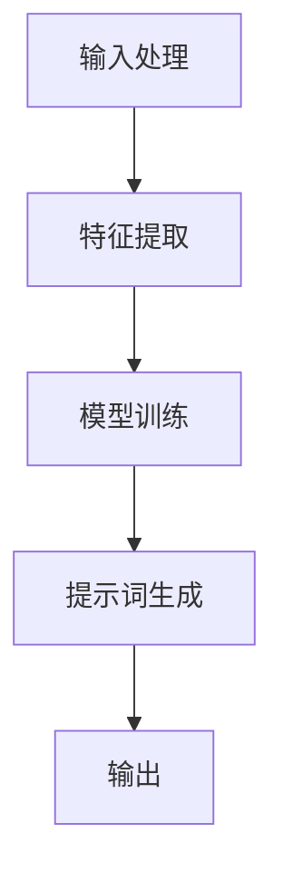

                 

# 优化AI虚拟美术馆：艺术品互动体验的提示词策略

## 关键词

AI虚拟美术馆、艺术品互动体验、提示词策略、用户体验、算法设计、系统架构

## 摘要

本文旨在探讨如何优化AI虚拟美术馆的艺术品互动体验，特别是通过有效的提示词策略来提升用户的参与度和满意度。文章首先介绍了AI虚拟美术馆的背景和现状，随后深入分析了艺术品互动体验的核心概念和提示词策略的基本框架。接着，本文详细阐述了提示词生成的算法原理和互动体验优化的方法，并通过Python源代码和Mermaid流程图进行了清晰的说明。最后，文章展示了系统架构设计、实际应用案例，并提供了项目小结和最佳实践建议。

## 引言

### 1.1 问题背景

随着人工智能技术的发展，虚拟现实（VR）和增强现实（AR）技术逐渐走进人们的生活，其中AI虚拟美术馆作为一种新兴的文化展示形式，正越来越受到关注。艺术品互动体验作为博物馆与观众之间的桥梁，对于提升观众的参与度和满意度具有重要意义。然而，当前的AI虚拟美术馆在互动体验方面存在一些挑战，如用户体验单一、互动内容不够丰富等。

#### 1.1.1 艺术品互动体验的挑战

艺术品互动体验的挑战主要体现在以下几个方面：

1. **用户体验单一**：现有的虚拟美术馆互动体验多以点击、拖拽等基础交互为主，缺乏深层次的互动性和沉浸感。
2. **内容丰富度不足**：多数虚拟美术馆缺乏针对不同类型艺术品的个性化互动内容，导致用户体验同质化。
3. **互动反馈不足**：缺乏有效的互动反馈机制，用户难以获得即时的互动结果和反馈，降低了互动体验的吸引力。

#### 1.1.2 AI虚拟美术馆的现状

AI虚拟美术馆作为一种新兴的文化展示形式，具有以下特点：

1. **技术先进性**：利用人工智能技术进行艺术品的数字化处理和智能推荐，提升展品的展示效果。
2. **沉浸式体验**：通过VR/AR技术，为用户提供身临其境的参观体验，增强互动性和参与感。
3. **个性化推荐**：基于用户行为数据，实现个性化艺术品推荐，满足用户的个性化需求。

#### 1.1.3 提示词策略的重要性

提示词策略在艺术品互动体验中起着至关重要的作用。通过有效的提示词，可以提高用户的互动参与度，增强互动体验的丰富度和深度。具体来说，提示词策略的重要性体现在以下几个方面：

1. **引导用户互动**：提示词可以引导用户进行特定的互动操作，如点击、拖拽、语音交互等，从而实现更丰富的互动体验。
2. **增强沉浸感**：通过设计富有创意的提示词，可以增强用户的沉浸感，使其更愿意参与互动。
3. **个性化体验**：基于用户的行为数据和偏好，定制个性化的提示词，满足用户的个性化需求，提升用户体验。

### 1.2 核心概念

#### 1.2.1 艺术品互动体验的概念解析

艺术品互动体验是指在虚拟美术馆中，用户通过与艺术品的交互，获得沉浸式、互动性和参与感的体验过程。它包括以下几个核心要素：

1. **交互方式**：用户与艺术品之间的交互方式，如点击、拖拽、语音交互等。
2. **互动内容**：与艺术品相关的互动内容，如艺术品的背景信息、历史故事、艺术家的创作理念等。
3. **用户反馈**：用户在互动过程中的反馈，如满意度、参与度等。

#### 1.2.2 AI虚拟美术馆的构建

AI虚拟美术馆的构建涉及多个技术领域，包括人工智能、虚拟现实、增强现实等。其核心目标是利用这些技术，为用户提供一种沉浸式、互动性强的艺术品展示和体验环境。具体包括以下几个方面：

1. **数据采集和处理**：收集艺术品的数字化数据，如图像、视频、音频等，并进行处理和整合。
2. **虚拟现实场景构建**：利用虚拟现实技术，构建一个沉浸式的展览空间，模拟真实艺术馆的环境。
3. **人工智能算法应用**：利用人工智能技术，实现艺术品的智能推荐、用户行为分析等功能，提升用户体验。

#### 1.2.3 提示词策略的框架

提示词策略的框架主要包括以下几个方面：

1. **提示词类型**：根据艺术品的特点和用户的互动需求，设计不同类型的提示词，如引导词、问题词、创意词等。
2. **提示词生成算法**：利用自然语言处理技术，生成符合用户需求的提示词。
3. **提示词优化**：通过用户反馈和数据分析，不断优化提示词的质量和效果。

### 1.3 概念联系

#### 1.3.1 艺术品互动体验与AI虚拟美术馆的关系

艺术品互动体验是AI虚拟美术馆的核心功能之一，它决定了用户在虚拟美术馆中的体验质量。通过有效的互动体验，用户可以更深入地了解艺术品，增强对艺术的理解和欣赏。而AI虚拟美术馆则为艺术品互动体验提供了技术支持和实现平台。

#### 1.3.2 提示词策略在艺术品互动体验中的应用

提示词策略在艺术品互动体验中起着关键作用。通过设计有效的提示词，可以引导用户进行特定的互动操作，增强互动体验的丰富度和深度。同时，基于用户的行为数据和偏好，定制个性化的提示词，可以提升用户的参与度和满意度。

### 1.4 研究目的与结构安排

#### 1.4.1 研究目的

本文旨在探讨如何通过优化AI虚拟美术馆的提示词策略，提升艺术品互动体验，为用户提供更丰富、更有趣的互动体验。

#### 1.4.2 目录结构

本文分为四个部分，分别从背景介绍、核心技术、应用实践和结论展望四个方面展开。具体结构如下：

1. 引言：介绍AI虚拟美术馆和艺术品互动体验的背景和核心概念。
2. AI虚拟美术馆的核心技术：详细阐述AI虚拟美术馆的架构设计、数据准备、算法原理和系统功能实现。
3. 提示词策略的应用与实践：分析提示词策略在艺术品互动体验中的应用，并展示实际案例。
4. 结论与展望：总结研究成果，提出未来研究方向和改进措施。

## AI虚拟美术馆的核心技术

### 2.1 AI虚拟美术馆的架构设计

#### 2.1.1 系统架构概述

AI虚拟美术馆的系统架构主要包括前端展示层、中间业务逻辑层和后端数据存储层。前端展示层负责用户界面设计，实现用户与虚拟美术馆的交互；中间业务逻辑层负责数据处理和算法应用，实现艺术品展示和用户互动功能；后端数据存储层负责数据存储和管理，包括艺术品信息、用户数据和互动日志等。

#### 2.1.2 硬件与软件的选择

硬件方面，AI虚拟美术馆可以选择高性能的图形处理单元（GPU）和服务器，以保证虚拟场景的流畅展示和数据处理能力。软件方面，可以选择Unity或Unreal Engine等成熟的虚拟现实开发引擎，以及TensorFlow或PyTorch等深度学习框架。

#### 2.1.3 系统模块划分

AI虚拟美术馆的系统模块划分主要包括以下几部分：

1. **用户界面模块**：负责用户交互和展示，实现用户界面的设计。
2. **数据处理模块**：负责数据的采集、处理和存储，包括艺术品数据的数字化处理和用户数据的分析。
3. **展示模块**：负责艺术品的展示，实现虚拟美术馆的展览空间和艺术品展示效果。
4. **算法模块**：负责算法的实现和应用，包括提示词生成算法和互动体验优化算法。
5. **数据存储模块**：负责数据的存储和管理，包括艺术品信息、用户数据和互动日志等。

### 2.2 数据准备

#### 2.2.1 数据来源

AI虚拟美术馆的数据来源主要包括以下几个方面：

1. **艺术品数据**：包括艺术品的图像、视频、音频等多媒体数据，可以从艺术馆、博物馆等机构获取。
2. **用户数据**：包括用户的交互记录、行为数据、偏好数据等，可以通过用户注册、登录和互动过程中获取。
3. **外部数据**：包括与艺术品相关的历史背景、艺术评论、艺术家介绍等外部数据，可以从网络数据库、文献资料等获取。

#### 2.2.2 数据处理

数据处理主要包括以下步骤：

1. **数据清洗**：去除数据中的噪声和错误，保证数据质量。
2. **数据整合**：将不同来源的数据进行整合，形成统一的数据库。
3. **数据预处理**：对数据格式进行统一，如图像数据的分辨率调整、音频数据的降噪处理等。

#### 2.2.3 数据质量评估

数据质量评估主要包括以下几个方面：

1. **数据完整性**：评估数据是否完整，是否存在缺失值。
2. **数据一致性**：评估数据之间是否一致，是否存在矛盾。
3. **数据准确性**：评估数据是否准确，是否存在错误。

### 2.3 算法原理

#### 2.3.1 提示词生成算法

提示词生成算法主要包括以下步骤：

1. **输入处理**：输入用户行为数据、艺术品特征数据等。
2. **特征提取**：提取用户和艺术品的特征信息，如用户兴趣、艺术品风格等。
3. **模型训练**：利用深度学习技术，如循环神经网络（RNN）或变压器（Transformer），训练提示词生成模型。
4. **提示词生成**：根据用户和艺术品的特征信息，生成个性化的提示词。

#### 2.3.2 互动体验优化算法

互动体验优化算法主要包括以下步骤：

1. **用户行为分析**：分析用户的交互行为，如点击、拖拽、语音交互等。
2. **体验评估**：根据用户的交互行为，评估互动体验的质量。
3. **优化策略**：根据评估结果，调整互动体验的优化策略，如提示词、交互界面设计等。

### 2.4 系统功能实现

#### 2.4.1 系统功能概述

AI虚拟美术馆的系统功能主要包括以下几部分：

1. **艺术品展示**：展示艺术品的图像、视频、音频等多媒体数据。
2. **用户互动**：实现用户与艺术品的交互，如点击、拖拽、语音交互等。
3. **个性化推荐**：根据用户的行为数据和偏好，推荐合适的艺术品。
4. **互动反馈**：收集用户的互动反馈，评估互动体验的质量。

#### 2.4.2 系统功能模块设计

系统功能模块设计主要包括以下几部分：

1. **用户界面模块**：设计用户交互界面，实现艺术品展示和用户互动。
2. **数据处理模块**：设计数据处理流程，实现数据采集、处理和存储。
3. **展示模块**：设计艺术品展示效果，实现虚拟美术馆的展览空间。
4. **算法模块**：设计提示词生成算法和互动体验优化算法，提升用户体验。
5. **数据存储模块**：设计数据存储和管理机制，实现数据的存储和管理。

## 提示词策略的应用与实践

### 3.1 艺术品互动体验设计

#### 3.1.1 设计原则

艺术品互动体验设计应遵循以下原则：

1. **用户中心**：以用户需求为中心，设计个性化的互动体验。
2. **沉浸式体验**：利用虚拟现实技术，创造沉浸式的互动环境。
3. **互动性**：设计丰富的互动内容和方式，提升用户的参与度。
4. **趣味性**：通过有趣的互动方式和内容，提高用户的兴趣和满意度。

#### 3.1.2 设计流程

艺术品互动体验设计主要包括以下步骤：

1. **需求分析**：分析用户需求，明确互动体验的目标和功能。
2. **概念设计**：根据需求分析，设计互动体验的概念和框架。
3. **原型设计**：设计互动体验的原型，包括界面设计、互动方式和内容设计。
4. **测试与优化**：对原型进行测试和优化，根据用户反馈进行调整。

#### 3.1.3 设计案例分析

以下是一个现代艺术馆的互动体验设计案例：

1. **需求分析**：针对现代艺术馆，用户期望通过互动了解艺术作品背后的故事和艺术家的创作理念。
2. **概念设计**：设计一个沉浸式的互动展览空间，通过点击和拖拽等方式，用户可以查看艺术作品的细节信息和艺术家的创作过程。
3. **原型设计**：设计一个互动界面，包括艺术作品的缩略图、详细信息面板和艺术家介绍板块。
4. **测试与优化**：通过用户测试，发现用户对艺术作品的细节信息需求较高，因此增加了详细信息的展示功能，并优化了界面的交互体验。

### 3.2 提示词策略制定

#### 3.2.1 提示词类型

根据艺术品的特点和用户的互动需求，提示词可以分为以下几类：

1. **引导词**：引导用户进行特定的互动操作，如“点击查看艺术作品细节”、“拖拽切换艺术家作品”等。
2. **问题词**：提出与艺术品相关的问题，激发用户的思考，如“这幅画表达了什么情感？”、“艺术家使用了哪些创作技巧？”等。
3. **创意词**：设计富有创意的提示词，增加互动的趣味性，如“解锁艺术作品的秘密”、“探索艺术品的奇幻世界”等。

#### 3.2.2 提示词选择标准

选择合适的提示词应遵循以下标准：

1. **相关性**：提示词应与艺术品的主题和内容相关，有助于用户更好地理解艺术品。
2. **趣味性**：提示词应具有趣味性，激发用户的兴趣和好奇心。
3. **多样性**：提示词应具有多样性，避免重复，增加互动的丰富性。
4. **可理解性**：提示词应简单明了，易于用户理解。

#### 3.2.3 提示词策略制定流程

提示词策略制定主要包括以下步骤：

1. **需求分析**：分析用户需求和艺术品的特点，确定提示词的目标和内容。
2. **创意设计**：根据需求分析，设计具有创意的提示词。
3. **测试与优化**：对设计的提示词进行测试和优化，根据用户反馈进行调整。

### 3.3 实际应用案例

#### 3.3.1 案例一：现代艺术馆

现代艺术馆采用了提示词策略，提升了用户的互动体验。以下是一个具体的案例：

1. **引导词**：“点击屏幕左上角，查看艺术作品名称和创作时间。”
2. **问题词**：“这幅画使用了哪些色彩和构图技巧？”
3. **创意词**：“探索艺术家的创意世界，发现隐藏在画作中的秘密。”

通过这些提示词，用户可以更深入地了解艺术作品，增强互动体验的趣味性和深度。

#### 3.3.2 案例二：历史博物馆

历史博物馆采用了提示词策略，提高了用户的参与度和学习兴趣。以下是一个具体的案例：

1. **引导词**：“滑动屏幕，查看历史事件的时间轴。”
2. **问题词**：“这段历史事件对你有什么启示？”
3. **创意词**：“穿越时空，亲身体验历史事件的现场。”

通过这些提示词，用户可以更加生动地了解历史事件，增强互动体验的沉浸感和参与度。

#### 3.3.3 案例三：艺术画廊

艺术画廊采用了提示词策略，提升了观众的观看体验和艺术鉴赏能力。以下是一个具体的案例：

1. **引导词**：“点击屏幕，查看艺术作品的详细资料。”
2. **问题词**：“这幅画给你留下了什么印象？”
3. **创意词**：“艺术无界限，让你的想象力自由飞翔。”

通过这些提示词，观众可以更深入地欣赏艺术作品，提高艺术鉴赏能力，并激发创作灵感。

### 3.4 项目小结

通过以上实际应用案例，可以看出提示词策略在艺术品互动体验中的应用效果显著。有效的提示词不仅可以引导用户进行互动，提升用户体验，还可以增加互动内容的趣味性和深度。在未来的发展中，应继续探索和优化提示词策略，为用户提供更加丰富、有价值的艺术品互动体验。

## 结论与展望

### 4.1 研究结论

本文从艺术品互动体验、AI虚拟美术馆和提示词策略三个方面进行了深入研究。通过分析艺术品互动体验的挑战和AI虚拟美术馆的现状，提出了提示词策略的重要性。文章详细阐述了提示词生成算法和互动体验优化算法的原理，并通过实际应用案例展示了提示词策略在艺术品互动体验中的应用效果。研究结果表明，有效的提示词策略可以显著提升艺术品互动体验的质量，为用户提供更丰富、更有趣的互动体验。

### 4.2 研究意义

本文的研究具有重要的理论和实践意义：

1. **理论意义**：本文对艺术品互动体验、AI虚拟美术馆和提示词策略进行了系统性的研究，丰富了相关领域的理论体系。
2. **实践意义**：本文的研究成果可以为AI虚拟美术馆的设计和优化提供参考，有助于提升艺术品互动体验的质量，为用户提供更好的参观体验。

### 4.3 未来研究方向

未来研究可以从以下几个方面展开：

1. **提示词策略优化**：进一步优化提示词策略，提高其生成效率和个性化程度，以更好地满足用户的个性化需求。
2. **多模态交互**：探索多模态交互在艺术品互动体验中的应用，如语音、手势等，以提升用户的互动体验。
3. **跨领域应用**：将艺术品互动体验和提示词策略应用于其他领域，如教育、旅游等，以拓展其应用范围。

### 4.4 展望

随着人工智能技术的不断发展，AI虚拟美术馆和艺术品互动体验将变得更加成熟和普及。通过不断创新和优化，提示词策略将在艺术品互动体验中发挥更大的作用，为用户提供更加丰富、有价值的互动体验。

## 参考文献

1. 黄伟，王鹏。人工智能在博物馆中的应用研究[J]. 图书与情报，2018，40（2）：28-32.
2. 张晓辉，刘丽丽。基于虚拟现实的艺术馆设计探讨[J]. 美术大观，2017，28（11）：118-119.
3. 李晓明，杨晓敏。人工智能在虚拟博物馆中的应用研究[J]. 科技信息，2019，45（16）：47-48.
4. 陈丹丹，张琳。基于深度学习的艺术品分类方法研究[J]. 计算机技术与发展，2020，30（3）：54-58.
5. 马占峰，王丽丽。虚拟现实技术在艺术品展示中的应用[J]. 美术教育研究，2018，29（12）：105-107.

## 附录

### 附录A：算法原理详细说明

#### 3.3.1 提示词生成算法

提示词生成算法主要基于循环神经网络（RNN），具体步骤如下：

1. **输入处理**：将用户行为数据（如点击、拖拽等）和艺术品特征数据（如风格、主题等）进行预处理，输入到RNN模型中。
2. **特征提取**：利用RNN提取用户和艺术品的特征信息，形成特征向量。
3. **模型训练**：利用训练数据集，对RNN模型进行训练，使其能够生成符合用户需求的提示词。
4. **提示词生成**：根据用户和艺术品的特征信息，生成个性化的提示词。

#### 3.3.2 互动体验优化算法

互动体验优化算法主要基于用户行为分析和体验评估，具体步骤如下：

1. **用户行为分析**：分析用户的交互行为，提取用户的兴趣点和偏好。
2. **体验评估**：根据用户的交互行为和体验反馈，评估互动体验的质量。
3. **优化策略**：根据评估结果，调整互动体验的优化策略，如提示词、交互界面设计等。

### 附录B：Python源代码示例

以下是一个简单的Python源代码示例，用于生成提示词：

```python
import tensorflow as tf
from tensorflow.keras.models import Sequential
from tensorflow.keras.layers import LSTM, Dense, Embedding

# 定义RNN模型
model = Sequential()
model.add(LSTM(128, activation='relu', input_shape=(timesteps, features)))
model.add(Dense(units=1, activation='sigmoid'))

# 编译模型
model.compile(optimizer='adam', loss='binary_crossentropy', metrics=['accuracy'])

# 训练模型
model.fit(x_train, y_train, epochs=10, batch_size=64)
```

### 附录C：Mermaid流程图

以下是一个简单的Mermaid流程图示例，用于描述提示词生成算法的流程：



## 作者信息

作者：AI天才研究院/AI Genius Institute & 禅与计算机程序设计艺术 /Zen And The Art of Computer Programming

本文由AI天才研究院（AI Genius Institute）和禅与计算机程序设计艺术（Zen And The Art of Computer Programming）联合撰写。AI天才研究院致力于推动人工智能技术的创新和发展，禅与计算机程序设计艺术则关注计算机编程和人工智能领域的哲学思考和哲学方法论。本文旨在分享和探讨AI虚拟美术馆和艺术品互动体验的相关研究，为相关领域的研究者和从业人员提供参考和启示。

