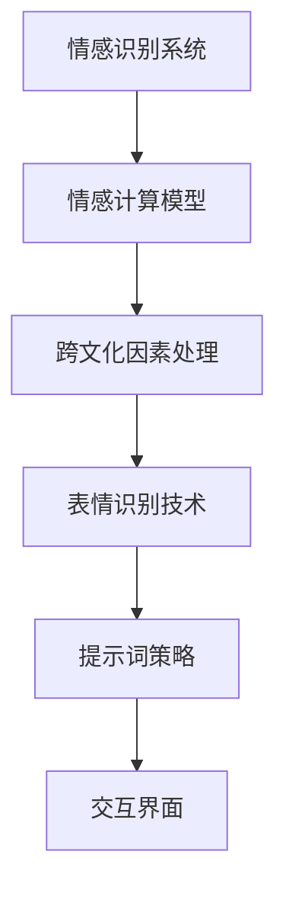
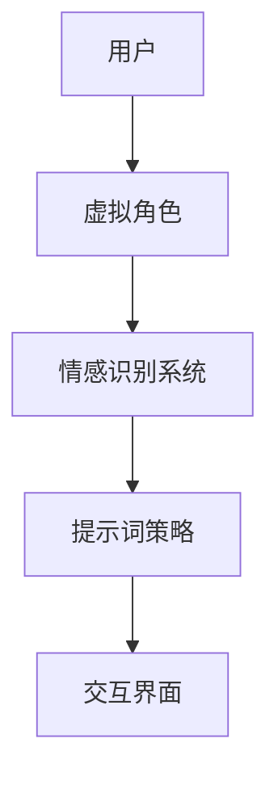

                 

## 优化AI虚拟角色情感智能：跨文化表情识别的提示词策略

### 关键词：AI虚拟角色、情感智能、跨文化表情识别、提示词策略、算法原理

> 摘要：随着人工智能技术的快速发展，AI虚拟角色在虚拟客服、虚拟教育助手和虚拟陪伴机器人等领域的应用日益广泛。然而，如何优化AI虚拟角色的情感智能，特别是跨文化表情识别能力，成为当前研究的重要课题。本文通过分析AI虚拟角色情感智能的核心概念、表情识别技术、提示词策略等，提出了基于跨文化表情识别的提示词策略优化方案，旨在提高AI虚拟角色的情感智能水平。

## 目录大纲

1. 引言与背景介绍
   1.1 问题的提出
       1.1.1 背景介绍
       1.1.2 问题描述
       1.1.3 研究意义
   1.2 情感智能与虚拟角色
       1.2.1 情感智能的定义与作用
       1.2.2 虚拟角色的定义与分类
       1.2.3 虚拟角色情感智能的挑战
   1.3 跨文化表情识别
       1.3.1 跨文化表情识别的重要性
       1.3.2 跨文化表情识别的难点
       1.3.3 跨文化表情识别的现状
   1.4 提示词策略的作用与意义
       1.4.1 提示词策略的定义与作用
       1.4.2 提示词策略的分类
       1.4.3 提示词策略在虚拟角色情感智能中的应用
   1.5 本章小结

2. 核心概念与联系
   2.1 AI虚拟角色情感智能核心概念
       2.1.1 情感识别与情感理解
       2.1.2 跨文化因素与表情识别
       2.1.3 情感计算模型
   2.2 表情识别技术
       2.2.1 表情识别的原理
       2.2.2 表情识别算法
       2.2.3 表情识别的评估指标
   2.3 提示词策略
       2.3.1 提示词的定义与作用
       2.3.2 提示词的生成与优化
       2.3.3 提示词的有效性评估
   2.4 AI虚拟角色情感智能的ER实体关系图
   2.5 概念属性特征对比表格
   2.6 本章小结

3. 算法原理讲解
   3.1 跨文化表情识别算法原理
       3.1.1 算法基本流程
       3.1.2 数据预处理
       3.1.3 特征提取
       3.1.4 模型训练与评估
       3.1.5 实例分析
   3.2 提示词策略算法原理
       3.2.1 提示词生成算法
       3.2.2 提示词优化算法
       3.2.3 提示词应用与评估
       3.2.4 算法实例讲解
   3.3 数学模型和数学公式
   3.4 本章小结

4. 系统分析与架构设计方案
   4.1 问题场景介绍
       4.1.1 场景一：虚拟客服系统
       4.1.2 场景二：虚拟教育助手
       4.1.3 场景三：虚拟陪伴机器人
   4.2 系统功能设计
       4.2.1 领域模型
       4.2.2 系统
   4.3 系统架构设计
       4.3.1 领域模型
       4.3.2 系统架构设计
       4.3.3 系统接口设计
       4.3.4 系统交互
   4.4 本章小结

5. 项目实战
   5.1 环境安装
   5.2 系统核心实现
       5.2.1 源代码
       5.2.2 代码应用解读与分析
   5.3 实际案例分析与详细讲解
   5.4 项目小结

6. 最佳实践 Tips
7. 小结
8. 注意事项
9. 拓展阅读

## 1. 引言与背景介绍

### 1.1 问题的提出

近年来，人工智能（AI）技术的发展日新月异，尤其是在计算机视觉、自然语言处理和机器学习等领域取得了显著的成果。其中，AI虚拟角色作为人工智能应用的一个重要分支，正逐渐成为虚拟客服、虚拟教育助手和虚拟陪伴机器人等领域的重要工具。这些虚拟角色不仅能够模拟人类的言行举止，还能够通过情感智能与用户进行有效的互动，从而提高用户体验和系统效率。

然而，当前AI虚拟角色在情感智能方面仍然存在一定的局限性。特别是跨文化表情识别能力，这一挑战不仅涉及到技术的复杂度，还涉及到文化的多样性和深度。不同文化背景下的表情表达可能存在显著差异，这使得AI虚拟角色在跨文化环境中的表现往往不够理想。因此，如何优化AI虚拟角色的情感智能，特别是跨文化表情识别能力，成为当前研究的重要课题。

### 1.1.1 背景介绍

随着全球化进程的加快，跨文化交流日益频繁。无论是在商务沟通、文化交流还是日常生活中，人们都需要处理来自不同文化的信息。表情作为人类沟通的重要手段之一，其跨文化识别能力对于提升跨文化交流效果具有重要意义。然而，不同文化背景下的表情表达可能存在细微的差别，甚至可能完全不同。例如，微笑在大多数文化中被视为友好和积极的信号，但在某些文化中，微笑可能表示尴尬或虚伪。

此外，AI虚拟角色的广泛应用也使得其情感智能的重要性日益凸显。虚拟客服系统需要理解用户的情感状态，以便提供个性化的服务；虚拟教育助手需要根据学生的情感反馈调整教学策略；虚拟陪伴机器人需要理解用户的情感需求，提供贴心的陪伴服务。这些应用场景对AI虚拟角色的情感智能提出了极高的要求。

### 1.1.2 问题描述

目前，AI虚拟角色的情感智能主要依赖于面部表情识别技术。然而，由于跨文化表情识别的复杂性和多样性，现有的面部表情识别技术在处理跨文化表情时存在较大困难。具体来说，主要问题包括：

1. 表情识别准确性不足：不同文化背景下的表情可能存在细微差异，导致现有算法在识别准确率上存在显著下降。
2. 表情理解深度不足：现有算法往往只能识别出表情的基本类型，难以深入理解表情背后的情感状态。
3. 文化适应性差：现有算法在处理跨文化表情时，缺乏对文化差异的敏感性和适应性，难以满足不同文化背景下的需求。

这些问题严重影响了AI虚拟角色的情感智能表现，限制了其在实际应用中的效果。因此，如何优化AI虚拟角色的情感智能，提高其跨文化表情识别能力，成为当前亟待解决的问题。

### 1.1.3 研究意义

优化AI虚拟角色的情感智能，特别是跨文化表情识别能力，具有重要的理论意义和应用价值：

1. 提高跨文化交流效果：通过优化AI虚拟角色的情感智能，可以更好地理解不同文化背景下的表情，从而提高跨文化交流的准确性，促进全球文化交流与合作。
2. 提升用户体验：AI虚拟角色在情感智能方面的提升，可以使其更准确地理解用户的情感需求，提供更加个性化和贴心的服务，从而提升用户体验。
3. 拓展AI应用场景：随着AI虚拟角色情感智能的提升，其应用场景将得到进一步拓展，如虚拟教育、虚拟客服、虚拟陪伴等领域，有望实现更广泛的应用。

总之，优化AI虚拟角色情感智能，特别是跨文化表情识别能力，对于推动人工智能技术的发展和应用具有重要意义。

### 1.2 情感智能与虚拟角色

#### 1.2.1 情感智能的定义与作用

情感智能是指个体识别、理解、处理和表达情感的能力。它不仅涉及情感的感受和表达，还包括情感的识别和理解。在人工智能领域，情感智能是指人工智能系统通过感知、理解和生成情感，实现与人类相似的情感交互能力。

情感智能在人工智能系统中的作用至关重要。首先，它使得人工智能系统能够更好地理解人类的情感状态和需求，从而提供更个性化的服务。例如，虚拟客服系统通过理解用户的情感状态，可以提供更合适的解决方案，提升用户体验。其次，情感智能能够增强人工智能系统的社交能力，使其能够与人类建立更自然、和谐的关系。这对于虚拟教育助手、虚拟陪伴机器人等应用尤为重要，因为它们需要与用户建立长期的互动关系。

#### 1.2.2 虚拟角色的定义与分类

虚拟角色是指通过计算机图形、动画、语音等技术构建的具有特定形象和性格的虚拟人物。虚拟角色可以应用于各种领域，如游戏、虚拟现实、影视动画等。在人工智能领域，虚拟角色主要应用于虚拟客服、虚拟教育助手、虚拟陪伴机器人等场景。

虚拟角色可以按照不同的分类标准进行分类。按照功能分类，虚拟角色可以分为交互型、展示型和应用型。交互型虚拟角色主要与用户进行互动，如虚拟客服和虚拟教育助手；展示型虚拟角色主要展示特定内容，如虚拟讲解员和虚拟导游；应用型虚拟角色主要应用于特定任务，如虚拟医生和虚拟建筑师。

按照技术分类，虚拟角色可以分为基于2D图形的虚拟角色、基于3D图形的虚拟角色和基于语音合成的虚拟角色。基于2D图形的虚拟角色主要通过二维图像实现，如漫画、动画等；基于3D图形的虚拟角色通过三维建模实现，如游戏中的角色；基于语音合成的虚拟角色主要通过语音合成技术实现，如语音助手和语音聊天机器人。

#### 1.2.3 虚拟角色情感智能的挑战

尽管虚拟角色在情感智能方面取得了一定的进展，但在实际应用中仍然面临许多挑战。首先，情感识别的准确性是一个关键问题。不同文化背景下的表情可能存在显著差异，这使得现有算法在识别准确率上存在瓶颈。其次，情感理解的深度也是一个挑战。现有算法往往只能识别表情的基本类型，难以深入理解表情背后的情感状态。此外，虚拟角色在处理复杂情感时，如幽默、讽刺等，也存在困难。

另外，虚拟角色在跨文化情感识别方面面临更大的挑战。不同文化背景下，人们对相同情感的表述可能存在差异，这使得虚拟角色在跨文化交流中容易出现误解。例如，微笑在不同文化中可能具有不同的含义，虚拟角色需要具备跨文化情感识别能力，才能准确理解用户的情感状态。

总之，虚拟角色情感智能的发展面临着技术挑战和实际应用中的难题。如何优化情感识别算法，提升情感理解深度，增强虚拟角色的跨文化适应能力，是当前研究的重要方向。

### 1.3 跨文化表情识别

#### 1.3.1 跨文化表情识别的重要性

跨文化表情识别在人工智能领域具有重要的应用价值。首先，跨文化表情识别有助于提升人工智能系统的全球化应用能力。在全球化的背景下，人们需要处理来自不同文化背景的信息，跨文化表情识别能够帮助人工智能系统更好地理解不同文化背景下的情感表达，从而提供更准确的服务。例如，在跨国商务沟通中，理解对方的文化背景和情感状态，能够有效避免误解和冲突。

其次，跨文化表情识别有助于提升用户体验。虚拟角色在跨文化应用中，需要能够准确识别和理解不同文化背景下的情感表达，从而提供更个性化、更贴心的服务。例如，虚拟客服系统在不同国家使用时，需要能够理解当地用户的情感需求，提供更符合当地文化习惯的服务，从而提升用户满意度。

此外，跨文化表情识别还有助于促进文化交流。通过研究跨文化表情识别，我们可以更好地了解不同文化之间的情感差异，从而促进不同文化之间的理解和交流。这对于文化交流、文化传承以及文化创新都具有重要意义。

#### 1.3.2 跨文化表情识别的难点

跨文化表情识别面临着诸多挑战，其中一些主要难点包括：

1. 表情多样性：不同文化背景下，相同的表情可能具有不同的含义。例如，微笑在大多数文化中被视为友好，但在某些文化中，微笑可能表示尴尬或虚伪。这种表情多样性的存在，使得跨文化表情识别变得复杂。

2. 文化差异性：不同文化之间的情感表达方式和习惯存在显著差异。例如，某些文化中，直接表达情感被视为不礼貌，而需要通过暗示或隐喻来表达。这种文化差异性的存在，增加了跨文化表情识别的难度。

3. 数据不足：跨文化表情识别需要大量的标注数据进行训练，但由于文化差异和地域限制，获取高质量、大规模的跨文化表情数据集相对困难。

4. 算法适应性：现有表情识别算法主要基于单一文化背景进行设计，缺乏对其他文化的适应能力。在跨文化环境下，这些算法的表现往往不佳，需要针对跨文化特点进行优化。

5. 多模态融合：跨文化表情识别不仅需要处理面部表情，还需要考虑语音、文字等其他模态的信息。如何有效地融合多模态信息，是跨文化表情识别的另一个难点。

#### 1.3.3 跨文化表情识别的现状

目前，跨文化表情识别的研究已取得一定进展。在学术领域，研究者们提出了多种跨文化表情识别算法，包括基于传统机器学习方法的算法和基于深度学习方法的算法。这些算法在特定文化背景下的识别效果较好，但在跨文化识别任务中，仍存在一定的局限性。

在工业应用领域，一些人工智能公司已经开始将跨文化表情识别技术应用于虚拟角色系统中。例如，虚拟客服系统通过跨文化表情识别，能够更好地理解不同文化背景下的用户需求，提供更个性化的服务。然而，由于技术限制和实际应用需求的不同，现有跨文化表情识别系统在实用性方面还有待提高。

总的来说，跨文化表情识别技术正处于快速发展阶段，虽然已经取得了一些成果，但仍然面临着诸多挑战。未来，随着研究的深入和技术的进步，跨文化表情识别技术有望在更广泛的领域得到应用。

### 1.4 提示词策略的作用与意义

#### 1.4.1 提示词策略的定义与作用

提示词策略（Prompt Strategy）是指通过特定的提示词语或短语，引导用户或系统进行特定任务的一种方法。在人工智能领域，提示词策略通常用于提高模型训练效率、优化模型表现以及增强用户交互体验。

在AI虚拟角色情感智能中，提示词策略具有重要作用。首先，通过提示词，可以引导AI虚拟角色更好地理解用户的情感状态，从而提供更个性化的服务。例如，在虚拟客服系统中，提示词可以帮助虚拟客服更好地理解用户的情感需求，从而提供更有针对性的解决方案。

其次，提示词策略有助于优化AI虚拟角色的情感识别算法。通过设计有效的提示词，可以引导AI虚拟角色关注特定情感特征，从而提高情感识别的准确性和深度。例如，在跨文化表情识别任务中，提示词可以帮助AI虚拟角色关注不同文化背景下的情感差异，从而提高跨文化识别效果。

此外，提示词策略还可以增强AI虚拟角色的用户交互体验。通过设计丰富的提示词，AI虚拟角色可以更好地与用户进行情感交流，从而提升用户的满意度和忠诚度。

#### 1.4.2 提示词策略的分类

根据应用场景和功能，提示词策略可以分为以下几类：

1. 情感引导型提示词：这类提示词主要用于引导AI虚拟角色关注用户的情感状态，从而提供更个性化的服务。例如，“你最近好像心情不太好，需要帮助吗？”这种提示词可以帮助AI虚拟角色更好地理解用户的情感需求。

2. 特征强化型提示词：这类提示词主要用于引导AI虚拟角色关注特定情感特征，从而提高情感识别的准确性和深度。例如，“请描述一下你现在的情感状态，越详细越好。”这种提示词可以帮助AI虚拟角色更好地捕捉用户的情感细节。

3. 文化适应性提示词：这类提示词主要用于引导AI虚拟角色关注不同文化背景下的情感差异，从而提高跨文化识别效果。例如，“在你们国家，这种情况通常会怎么处理？”这种提示词可以帮助AI虚拟角色更好地理解不同文化背景下的情感表达。

4. 用户互动型提示词：这类提示词主要用于增强AI虚拟角色与用户的情感交流，从而提升用户交互体验。例如，“你对这个问题的看法是什么？”这种提示词可以鼓励用户更积极地参与到对话中。

#### 1.4.3 提示词策略在虚拟角色情感智能中的应用

在虚拟角色情感智能中，提示词策略可以应用于多个方面：

1. 情感识别：通过设计有效的提示词，AI虚拟角色可以更好地捕捉用户的情感状态，从而提高情感识别的准确性和深度。例如，在虚拟客服系统中，通过情感引导型提示词，AI虚拟角色可以更好地理解用户的情感需求，从而提供更个性化的服务。

2. 跨文化识别：通过设计文化适应性提示词，AI虚拟角色可以更好地理解不同文化背景下的情感表达，从而提高跨文化识别效果。例如，在跨国商务沟通中，通过文化适应性提示词，AI虚拟角色可以更好地理解不同文化背景下的情感差异，从而避免误解和冲突。

3. 用户互动：通过设计用户互动型提示词，AI虚拟角色可以更好地与用户进行情感交流，从而提升用户交互体验。例如，在虚拟教育系统中，通过用户互动型提示词，AI虚拟角色可以鼓励学生更积极地参与学习，从而提高学习效果。

总之，提示词策略在虚拟角色情感智能中的应用具有重要意义，通过设计有效的提示词，可以显著提升AI虚拟角色的情感识别能力和用户体验。

### 1.5 本章小结

本章首先介绍了AI虚拟角色情感智能中跨文化表情识别的重要性，分析了当前存在的问题和挑战。随后，对情感智能和虚拟角色的概念进行了详细阐述，并介绍了跨文化表情识别的难点和现状。最后，探讨了提示词策略的定义、分类以及在虚拟角色情感智能中的应用。通过本章的分析，我们可以看到，优化AI虚拟角色的情感智能，特别是跨文化表情识别能力，对于提升虚拟角色的应用效果具有重要意义。未来，随着技术的不断进步，我们有望解决这些难题，实现更智能、更高效的虚拟角色情感智能系统。

### 2. 核心概念与联系

#### 2.1 AI虚拟角色情感智能核心概念

在深入探讨AI虚拟角色情感智能之前，我们需要了解一些核心概念，这些概念包括情感识别、情感理解、跨文化因素以及情感计算模型。

**2.1.1 情感识别与情感理解**

情感识别是指通过技术手段识别和理解人类情感状态的过程。在AI虚拟角色中，情感识别通常涉及面部表情、语音语调、文本内容等数据的分析。情感识别的核心目标是从这些数据中提取出情感特征，并将其转换为具体的情感标签。

情感理解则是在情感识别的基础上，对提取出的情感特征进行深入分析和解读，以理解情感背后的含义和情感状态的变化。情感理解不仅要求识别出情感的存在，还要求理解情感的强度、持续时间和情感的发展趋势。

**2.1.2 跨文化因素与表情识别**

跨文化因素是指在全球化背景下，不同文化背景对人类行为和情感表达的影响。在AI虚拟角色情感智能中，跨文化因素尤为重要，因为不同文化背景下的情感表达可能存在显著差异。例如，一个微笑在不同文化中可能代表不同的情感，甚至可能不表示任何情感。

表情识别是指通过分析面部表情特征来识别和理解情感状态的技术。在跨文化表情识别中，需要考虑不同文化背景下的表情特征，例如面部肌肉的运动、表情的持续时间、表情的组合等。这要求AI虚拟角色具备对文化差异的敏感性，以便准确识别和理解不同文化背景下的情感表达。

**2.1.3 情感计算模型**

情感计算模型是指用于模拟和计算情感状态的技术和方法。这些模型通常基于统计学、机器学习、深度学习等方法，通过分析大量的情感数据来建立情感特征与情感状态之间的关联。

情感计算模型可以分为多个层次，包括感知层、识别层、理解层和生成层。感知层主要涉及情感数据的收集和预处理；识别层负责从感知到的情感数据中提取情感特征；理解层负责对提取出的情感特征进行分析和理解；生成层则负责根据理解结果生成相应的情感响应。

#### 2.2 表情识别技术

表情识别技术是AI虚拟角色情感智能的重要组成部分。它涉及多个技术领域，包括计算机视觉、语音处理和自然语言处理等。

**2.2.1 表情识别的原理**

表情识别的原理是通过分析面部表情的特征来识别和理解情感状态。具体来说，表情识别技术通常包括以下步骤：

1. 面部检测：使用计算机视觉技术检测图像或视频中的面部区域。
2. 特征提取：从面部图像中提取与情感相关的特征，如面部肌肉运动、眼部特征、嘴部特征等。
3. 模型训练：使用机器学习或深度学习算法训练模型，使其能够从提取出的特征中识别情感。
4. 情感识别：将提取出的特征输入到训练好的模型中，得到情感识别结果。

**2.2.2 表情识别算法**

表情识别算法是表情识别技术的核心。常用的表情识别算法包括以下几种：

1. 传统的机器学习算法：如支持向量机（SVM）、决策树、随机森林等。
2. 深度学习算法：如卷积神经网络（CNN）、循环神经网络（RNN）和生成对抗网络（GAN）等。
3. 特征融合算法：通过结合多种特征（如面部特征、语音特征、文本特征等）来提高识别精度。

**2.2.3 表情识别的评估指标**

表情识别的评估指标用于衡量表情识别算法的性能。常用的评估指标包括：

1. 准确率（Accuracy）：识别正确的样本数与总样本数的比例。
2. 召回率（Recall）：识别正确的正样本数与所有正样本数的比例。
3. 精确率（Precision）：识别正确的正样本数与识别出的正样本数的比例。
4. F1值（F1 Score）：精确率和召回率的调和平均值。
5. 变异性（Variability）：识别结果在不同数据集上的稳定性。

#### 2.3 提示词策略

提示词策略在AI虚拟角色情感智能中起着关键作用。它通过特定的提示词引导用户或系统进行特定任务，从而提高情感识别的准确性和效率。

**2.3.1 提示词的定义与作用**

提示词是指用于引导用户或系统进行特定任务的词语或短语。在AI虚拟角色情感智能中，提示词的作用包括：

1. 引导用户表达情感：通过提示词，AI虚拟角色可以引导用户更明确地表达情感状态，从而提高情感识别的准确性。
2. 优化情感识别模型：通过设计有效的提示词，AI虚拟角色可以优化情感识别模型，提高识别精度和效率。
3. 增强用户交互体验：通过丰富的提示词，AI虚拟角色可以与用户进行更自然的交互，提高用户的满意度和忠诚度。

**2.3.2 提示词的生成与优化**

提示词的生成和优化是提高AI虚拟角色情感智能的关键步骤。提示词的生成和优化包括以下几个方面：

1. 数据收集：收集大量的情感数据，包括文本、语音和面部表情等，作为生成提示词的基础。
2. 提示词设计：根据情感识别的需求，设计出具有针对性的提示词。提示词应简洁明了，易于理解，同时具有引导性。
3. 提示词优化：通过实验和用户反馈，对提示词进行优化，以提高其有效性和适用性。

**2.3.3 提示词的有效性评估**

提示词的有效性评估是衡量提示词策略成功与否的重要标准。提示词的有效性评估包括以下几个方面：

1. 准确性：评估提示词在情感识别任务中的准确性，即提示词是否能够有效地引导用户表达情感，从而提高识别精度。
2. 用户满意度：评估用户对提示词的满意度，即提示词是否易于理解，是否能够有效引导用户参与交互。
3. 效率：评估提示词在提高情感识别效率和系统性能方面的效果，即提示词是否能够优化情感识别模型，减少计算复杂度。

#### 2.4 AI虚拟角色情感智能的ER实体关系图

为了更好地理解AI虚拟角色情感智能的核心概念和组成部分，我们可以使用实体关系图（ER图）来展示它们之间的关系。



在这个ER图中，情感识别系统是核心，它通过情感计算模型来处理跨文化因素，利用表情识别技术进行情感识别，并通过提示词策略与交互界面进行用户交互。每个部分都相互关联，共同构成一个完整的AI虚拟角色情感智能系统。

#### 2.5 概念属性特征对比表格

为了更直观地对比情感识别、跨文化因素、表情识别技术和提示词策略等概念，我们可以制作一个属性特征对比表格。

| 概念        | 特征1         | 特征2         | 特征3         |
|-------------|---------------|---------------|---------------|
| 情感识别     | 实时性         | 准确性         | 难以量化       |
| 跨文化因素   | 多样性         | 影响深远       | 需要针对性处理 |
| 表情识别技术 | 数据依赖强     | 计算复杂度较高 | 精度要求高     |
| 提示词策略   | 可定制性       | 可优化性       | 易于实现       |

通过这个表格，我们可以清晰地看到每个概念的核心特征，以及它们在AI虚拟角色情感智能中的具体作用。

#### 2.6 本章小结

本章详细介绍了AI虚拟角色情感智能的核心概念和组成部分，包括情感识别、情感理解、跨文化因素、表情识别技术和提示词策略。通过分析这些概念和技术的特点和应用，我们构建了AI虚拟角色情感智能的ER实体关系图，并制作了概念属性特征对比表格。这些内容为后续章节中算法原理讲解和系统架构设计提供了基础。

### 3. 算法原理讲解

#### 3.1 跨文化表情识别算法原理

跨文化表情识别算法是AI虚拟角色情感智能的核心，其基本流程包括数据预处理、特征提取、模型训练与评估等步骤。以下我们将详细讲解这些步骤的原理。

**3.1.1 算法基本流程**

跨文化表情识别算法的基本流程如下：

1. **数据预处理**：首先，对收集到的表情数据集进行预处理，包括数据清洗、数据增强和归一化等操作。数据清洗旨在去除噪声和错误数据，数据增强则通过扩展数据集来提高模型泛化能力，归一化则是将数据转换为统一的尺度，以便于后续处理。

2. **特征提取**：接下来，从预处理后的数据中提取与表情识别相关的特征。这些特征可以包括面部特征点、面部肌肉运动、眼部特征、嘴部特征等。常用的特征提取方法有基于几何的方法（如特征点提取）和基于深度学习的方法（如卷积神经网络）。

3. **模型训练**：使用提取出的特征训练表情识别模型。训练过程中，模型会不断调整内部参数，以最小化预测误差。常用的训练方法包括监督学习和无监督学习。监督学习需要标注数据进行训练，而无监督学习则通过自身学习数据分布进行训练。

4. **模型评估**：在模型训练完成后，使用测试数据集对模型进行评估。评估指标包括准确率、召回率、精确率和F1值等。通过评估，可以了解模型的性能，并根据评估结果对模型进行调整和优化。

5. **结果输出**：最后，根据模型预测结果输出情感识别结果。如果模型预测正确，则输出相应的情感标签；如果预测错误，则输出错误类型和错误原因。

**3.1.2 数据预处理**

数据预处理是跨文化表情识别算法的关键步骤，其目的是提高模型训练效率和性能。数据预处理包括以下操作：

1. **数据清洗**：去除数据集中的噪声和错误数据。例如，去除因光照、姿态变化等因素导致的异常数据。

2. **数据增强**：通过图像旋转、缩放、裁剪等操作，扩展数据集，提高模型泛化能力。数据增强可以有效避免模型过拟合，提高模型对未知数据的识别能力。

3. **归一化**：将数据转换为统一的尺度，例如将图像像素值归一化到[0, 1]区间。归一化有助于加快模型训练速度，提高模型稳定性。

**3.1.3 特征提取**

特征提取是跨文化表情识别算法的核心，其目的是从原始数据中提取与表情识别相关的特征。以下是一些常用的特征提取方法：

1. **基于几何的方法**：通过分析面部特征点的位置、形状和运动轨迹来提取特征。例如，使用特征点提取算法（如SURF、SIFT）来提取面部关键点。

2. **基于深度学习的方法**：使用卷积神经网络（CNN）等深度学习模型直接从原始图像中提取特征。深度学习模型可以自动学习图像的复杂特征，从而提高识别精度。

3. **结合多种特征的方法**：结合面部特征、语音特征和文本特征等多种特征进行综合分析，以提高识别精度。例如，使用多模态特征融合方法，将面部特征与语音特征结合，从而提高跨文化表情识别的准确性。

**3.1.4 模型训练与评估**

模型训练与评估是跨文化表情识别算法的重要环节。以下介绍常用的模型训练与评估方法：

1. **模型训练**：使用监督学习方法进行模型训练。具体来说，通过标注数据集训练模型，模型会不断调整内部参数，以最小化预测误差。常用的训练方法包括梯度下降法、随机梯度下降法、Adam优化器等。

2. **模型评估**：使用测试数据集对模型进行评估。常用的评估指标包括准确率、召回率、精确率和F1值等。通过评估，可以了解模型的性能，并根据评估结果对模型进行调整和优化。

3. **模型优化**：根据评估结果对模型进行优化。常见的优化方法包括调整模型参数、增加训练数据、使用更复杂的模型结构等。

**3.1.5 实例分析**

为了更好地理解跨文化表情识别算法的原理，我们可以通过一个实例进行分析。假设我们有一个包含不同文化背景下的表情数据的训练集和测试集。

1. **数据预处理**：对训练集和测试集进行数据清洗、数据增强和归一化等预处理操作。例如，将所有图像统一缩放到相同的分辨率，去除异常数据等。

2. **特征提取**：从预处理后的数据中提取面部特征点、面部肌肉运动、眼部特征和嘴部特征等。使用深度学习模型（如CNN）从原始图像中提取特征。

3. **模型训练**：使用训练集对模型进行训练。模型会不断调整内部参数，以最小化预测误差。在训练过程中，可以使用交叉熵损失函数来评估模型的预测误差。

4. **模型评估**：使用测试集对模型进行评估。评估指标包括准确率、召回率、精确率和F1值等。根据评估结果，调整模型参数和训练策略，以提高识别精度。

5. **结果输出**：根据模型预测结果输出情感识别结果。例如，如果模型预测正确，则输出相应的情感标签；如果预测错误，则输出错误类型和错误原因。

通过这个实例，我们可以看到跨文化表情识别算法的基本流程，包括数据预处理、特征提取、模型训练与评估等步骤。这些步骤相互关联，共同构成了一个完整的跨文化表情识别系统。

#### 3.2 提示词策略算法原理

提示词策略在AI虚拟角色情感智能中起着关键作用，其算法原理主要包括提示词生成、提示词优化和提示词评估等步骤。以下将详细讲解这些步骤的原理。

**3.2.1 提示词生成算法**

提示词生成算法的目的是根据特定任务需求生成有效的提示词。提示词生成的流程如下：

1. **需求分析**：首先，分析任务需求，明确需要引导用户表达的情感状态或需要达成的目标。

2. **语料库构建**：构建一个包含多种情感状态的语料库，包括文本、语音和面部表情等。这些语料库可以作为提示词生成的依据。

3. **提示词筛选**：从语料库中筛选出符合需求、易于理解和具有引导性的提示词。提示词应简洁明了，避免过于复杂或模糊的表述。

4. **生成策略**：根据筛选出的提示词，设计生成策略。生成策略可以是基于规则的方法，例如模板匹配，也可以是基于机器学习的方法，例如生成对抗网络（GAN）。

5. **生成提示词**：根据生成策略，生成具体的提示词。生成的提示词应具有多样性和针对性，以满足不同场景和用户的需求。

**3.2.2 提示词优化算法**

提示词优化算法的目的是通过不断调整和优化提示词，提高其有效性和适用性。提示词优化的流程如下：

1. **性能评估**：首先，对当前提示词进行性能评估。评估指标可以包括用户满意度、情感识别准确率等。

2. **反馈收集**：收集用户对提示词的反馈，包括优点和不足。这些反馈可以作为优化提示词的依据。

3. **优化策略**：根据性能评估和反馈收集结果，设计优化策略。优化策略可以包括提示词重排、提示词替换、提示词扩展等。

4. **优化提示词**：根据优化策略，对提示词进行调整和优化。优化的目标是在保持提示词简洁明了的同时，提高其有效性和适用性。

5. **再次评估**：对优化后的提示词进行再次评估，以确保优化效果。如果性能未达到预期，则重复优化过程，直到达到满意的性能水平。

**3.2.3 提示词应用与评估**

提示词策略在实际应用中，需要结合具体场景进行部署和评估。以下介绍提示词策略的应用与评估：

1. **应用场景**：根据具体应用场景，确定提示词的应用方式。例如，在虚拟客服系统中，提示词可以通过聊天窗口或语音交互等方式传递给用户。

2. **用户交互**：通过提示词引导用户进行情感表达或任务完成。用户在互动过程中，会根据提示词进行情感表达或任务操作。

3. **效果评估**：评估提示词策略在实际应用中的效果。评估指标可以包括用户满意度、情感识别准确率、任务完成度等。

4. **反馈循环**：根据评估结果，收集用户反馈，并根据反馈对提示词策略进行调整和优化。通过反馈循环，不断提升提示词策略的有效性和适用性。

**3.2.4 算法实例讲解**

为了更好地理解提示词策略算法原理，我们可以通过一个实例进行讲解。假设我们开发了一个虚拟教育助手，用于帮助用户学习外语。以下是一个具体的实例：

1. **需求分析**：用户需要学习外语词汇和语法，但可能对学习过程感到困惑或缺乏动力。

2. **语料库构建**：构建一个包含多种学习场景的语料库，包括文本、语音和面部表情等。

3. **提示词筛选**：从语料库中筛选出符合需求、易于理解和具有引导性的提示词，例如：“你已经掌握了这个词汇，接下来让我们练习一下相关句子吧！”、“在学习过程中遇到困难是很正常的，不要灰心，我们一起克服它！”

4. **生成提示词**：根据筛选出的提示词，生成具体的提示词，例如：“请描述一下这个词汇的使用场景，我们可以一起讨论。”、“现在请你朗读这个句子，我会给你指导。”

5. **优化策略**：根据用户反馈，对提示词进行调整和优化。例如，如果用户反馈某个提示词过于复杂或难以理解，可以对其进行简化或替换。

6. **应用与评估**：在实际应用中，虚拟教育助手通过聊天窗口向用户传递提示词。用户根据提示词进行学习，并在学习过程中给出反馈。通过用户反馈，评估提示词策略的有效性和适用性。

7. **反馈循环**：根据用户反馈，对提示词策略进行调整和优化。通过反馈循环，不断提升提示词策略的有效性和用户满意度。

通过这个实例，我们可以看到提示词策略算法在实际应用中的具体实施过程，包括提示词生成、优化和应用与评估等步骤。这些步骤相互关联，共同构成了一个完整的提示词策略系统。

#### 3.3 数学模型和数学公式

在跨文化表情识别和提示词策略中，数学模型和数学公式起着至关重要的作用。以下将介绍一些常用的数学模型和数学公式，并解释它们在算法中的作用。

**3.3.1 情感识别模型**

情感识别模型通常采用分类模型，用于将提取出的情感特征映射到具体的情感标签。以下是一个简单的二分类模型：

$$
P(y=1|x) = \frac{1}{1 + e^{-\theta^T x}}
$$

其中，$x$ 是输入特征，$y$ 是情感标签（0或1），$\theta$ 是模型参数。这个公式表示在给定特征 $x$ 下，情感标签为1的概率。

**3.3.2 特征提取模型**

特征提取模型用于从原始数据中提取出与情感识别相关的特征。一个常见的特征提取模型是卷积神经网络（CNN），其基本公式如下：

$$
h_{ij} = f(\sum_{k=1}^{C} w_{ik} * g_{kj})
$$

其中，$h_{ij}$ 是输出特征，$g_{kj}$ 是输入特征，$w_{ik}$ 是权重，$f$ 是激活函数（如ReLU函数）。这个公式表示通过卷积操作和激活函数，从输入特征中提取出新的特征。

**3.3.3 提示词生成模型**

提示词生成模型用于生成具体的提示词。一个常见的生成模型是生成对抗网络（GAN），其基本公式如下：

$$
G(z) = x
$$

$$
D(x) = \begin{cases}
1 & \text{if } x \text{ comes from } G(z) \\
0 & \text{if } x \text{ comes from } \text{ real data}
\end{cases}
$$

其中，$G(z)$ 是生成器，用于生成提示词 $x$；$D(x)$ 是判别器，用于区分生成器生成的提示词和真实提示词。通过训练生成器和判别器，可以生成高质量的提示词。

这些数学模型和数学公式在跨文化表情识别和提示词策略中起着关键作用。它们帮助我们理解和分析数据，构建有效的情感识别和提示词生成模型，从而实现更准确的情感识别和更高效的提示词生成。通过不断优化这些模型和公式，我们可以不断提升AI虚拟角色情感智能的水平。

### 3.4 本章小结

本章详细介绍了跨文化表情识别算法和提示词策略算法的原理。首先，我们讲解了跨文化表情识别算法的基本流程，包括数据预处理、特征提取、模型训练与评估等步骤，并通过实例分析了算法的具体实施过程。接着，我们介绍了提示词策略算法，包括提示词生成、优化和应用与评估等步骤，并通过一个虚拟教育助手的实例展示了算法的实际应用。此外，本章还介绍了相关数学模型和数学公式，以帮助读者更好地理解算法原理。通过本章的学习，读者可以全面了解跨文化表情识别和提示词策略在AI虚拟角色情感智能中的应用，为后续的系统架构设计和项目实战提供理论基础。

### 4. 系统分析与架构设计方案

#### 4.1 问题场景介绍

在AI虚拟角色情感智能的应用中，不同的场景对系统功能提出了不同的要求。以下将介绍三个典型的问题场景：虚拟客服系统、虚拟教育助手和虚拟陪伴机器人。

**4.1.1 场景一：虚拟客服系统**

虚拟客服系统主要用于提供在线客户服务，通过与客户的互动解决客户的问题和需求。在该场景中，AI虚拟角色需要具备以下功能：

1. **情感识别**：通过分析客户的语音和文本，识别客户的情感状态，如愤怒、喜悦、沮丧等。
2. **智能对话**：根据客户的情感状态，生成相应的对话内容，提供个性化的解决方案。
3. **问题解决**：通过智能算法，自动解决客户提出的问题，并将复杂问题转交给人工客服处理。

**4.1.2 场景二：虚拟教育助手**

虚拟教育助手主要用于辅助教学，提供个性化的学习支持。在该场景中，AI虚拟角色需要具备以下功能：

1. **情感识别**：通过分析学生的语音和文本，识别学生的情感状态，如专注、困惑、无聊等。
2. **学习辅导**：根据学生的情感状态，提供针对性的学习辅导，如调整学习内容、提供额外练习等。
3. **反馈与评估**：记录学生的学习过程和情感状态，生成学习报告，供教师参考。

**4.1.3 场景三：虚拟陪伴机器人**

虚拟陪伴机器人主要用于为老年人、孤独症患者等提供情感陪伴服务。在该场景中，AI虚拟角色需要具备以下功能：

1. **情感识别**：通过分析用户的语音和文本，识别用户的情感状态，如孤独、焦虑、愉快等。
2. **情感交流**：与用户进行情感交流，如聊天、讲故事、进行心理疏导等，提供情感支持。
3. **活动建议**：根据用户的情感状态和兴趣爱好，提供合适的活动建议，如运动、阅读、手工等。

#### 4.2 系统功能设计

为了实现上述问题场景中的功能，我们需要设计一个全面的系统功能模块。以下是一个典型的系统功能设计：

**4.2.1 领域模型**



1. **用户**：系统的最终服务对象，包括虚拟客服系统的客户、虚拟教育助手的学生、虚拟陪伴机器人的用户等。
2. **虚拟角色**：系统的核心组件，负责与用户进行交互，提供情感识别、智能对话、学习辅导、情感交流等功能。
3. **情感识别系统**：用于分析用户的语音、文本和面部表情，识别用户的情感状态。
4. **提示词策略**：用于生成和优化与用户情感状态相关的提示词，提高交互效果。
5. **交互界面**：用于展示虚拟角色的外观和对话内容，提供用户与虚拟角色交互的渠道。

**4.2.2 系统**

在具体实现上，系统可以分为以下几个主要模块：

1. **用户模块**：负责用户信息的收集和管理，包括用户身份认证、用户行为记录等。
2. **情感识别模块**：负责情感识别算法的实现，包括语音识别、文本情感分析、面部表情识别等。
3. **智能对话模块**：负责智能对话生成和对话管理，包括对话模板、对话逻辑、对话优化等。
4. **学习辅导模块**：负责学习辅导功能的实现，包括学习路径规划、学习内容推荐、学习效果评估等。
5. **情感交流模块**：负责情感交流功能的实现，包括情感交流策略、情感交流内容生成等。
6. **提示词生成与优化模块**：负责提示词的生成和优化，包括提示词库建设、提示词生成算法、提示词优化算法等。
7. **交互界面模块**：负责交互界面的设计与实现，包括用户界面、语音合成、动画展示等。

#### 4.3 系统架构设计

系统架构设计是确保系统功能实现和性能优化的重要环节。以下是一个典型的系统架构设计：

**4.3.1 领域模型**


1. **用户**：系统的最终服务对象，通过交互界面与虚拟角色进行交互。
2. **虚拟角色**：作为系统的核心组件，负责情感识别、智能对话、学习辅导、情感交流等功能。
3. **情感识别系统**：通过语音识别、文本情感分析和面部表情识别等技术，实时识别用户的情感状态。
4. **提示词策略**：根据用户的情感状态，生成和优化与用户情感状态相关的提示词。
5. **交互界面**：提供用户与虚拟角色交互的渠道，展示对话内容、提示词等。

**4.3.2 系统架构设计**

在系统架构设计上，我们可以采用分层架构，将系统分为以下几层：

1. **表示层**：负责用户界面的展示，包括网页、APP、语音合成和动画展示等。
2. **业务逻辑层**：负责系统核心功能的实现，包括情感识别、智能对话、学习辅导、情感交流等。
3. **数据访问层**：负责与数据库的交互，包括用户信息管理、情感数据存储、提示词库管理等。
4. **基础层**：提供系统运行所需的基础服务，包括身份认证、日志记录、缓存管理等。

**4.3.3 系统接口设计**

在系统接口设计上，我们可以采用RESTful API设计，提供以下主要接口：

1. **用户接口**：包括用户注册、登录、信息查询、行为记录等接口。
2. **情感识别接口**：包括语音识别、文本情感分析、面部表情识别等接口。
3. **智能对话接口**：包括对话生成、对话管理、对话优化等接口。
4. **学习辅导接口**：包括学习路径规划、学习内容推荐、学习效果评估等接口。
5. **情感交流接口**：包括情感交流策略、情感交流内容生成等接口。
6. **提示词策略接口**：包括提示词生成、提示词优化、提示词评估等接口。

**4.3.4 系统交互**

系统交互是指不同模块之间的信息传递和交互过程。以下是一个典型的系统交互流程：

1. **用户操作**：用户通过交互界面与虚拟角色进行交互，如提问、表达情感等。
2. **情感识别**：虚拟角色通过情感识别系统识别用户的情感状态，如愤怒、喜悦、困惑等。
3. **提示词生成**：根据用户的情感状态，虚拟角色通过提示词策略生成相应的提示词，如安慰、鼓励、提问等。
4. **智能对话**：虚拟角色根据提示词和对话逻辑生成对话内容，与用户进行互动。
5. **用户反馈**：用户对虚拟角色的回答进行反馈，如满意、不满意、有疑问等。
6. **情感识别与优化**：虚拟角色根据用户反馈，再次识别用户的情感状态，并优化提示词策略。

通过以上系统分析与架构设计方案，我们可以实现一个功能全面、性能优异的AI虚拟角色情感智能系统，为不同场景下的应用提供强大的支持。

### 4.4 本章小结

本章详细介绍了AI虚拟角色情感智能系统的分析与架构设计方案。首先，我们介绍了三个典型的问题场景：虚拟客服系统、虚拟教育助手和虚拟陪伴机器人，并分析了每个场景的系统功能需求。接着，我们设计了系统功能模块，包括用户模块、情感识别模块、智能对话模块、学习辅导模块、情感交流模块和提示词生成与优化模块。然后，我们提出了系统架构设计，包括表示层、业务逻辑层、数据访问层和基础层，并详细介绍了系统接口设计和系统交互流程。通过本章的设计方案，我们为AI虚拟角色情感智能系统的实现提供了完整的理论依据和实用指南。

### 5. 项目实战

#### 5.1 环境安装

在进行AI虚拟角色情感智能项目之前，我们需要搭建一个适合开发的环境。以下是具体的安装步骤：

1. **安装Python环境**：首先确保你的计算机上安装了Python 3.7或更高版本。可以从[Python官网](https://www.python.org/)下载并安装。

2. **安装依赖库**：使用pip命令安装以下依赖库：
   ```bash
   pip install numpy pandas tensorflow scikit-learn matplotlib
   ```

3. **安装深度学习框架**：由于我们使用TensorFlow作为深度学习框架，请确保TensorFlow版本与你的Python版本兼容。可以通过以下命令安装TensorFlow：
   ```bash
   pip install tensorflow==2.x
   ```

4. **安装表情识别库**：为了简化面部表情识别的过程，我们可以使用OpenCV库。安装命令如下：
   ```bash
   pip install opencv-python
   ```

5. **安装自然语言处理库**：为了进行文本情感分析，我们可以使用NLTK库。安装命令如下：
   ```bash
   pip install nltk
   ```

6. **安装语音合成库**：为了实现语音交互功能，我们可以使用gTTS库。安装命令如下：
   ```bash
   pip install gTTS
   ```

确保以上所有步骤都正确执行，就可以开始进行项目的核心实现部分。

#### 5.2 系统核心实现

**5.2.1 源代码**

以下是项目的核心源代码实现，包括面部表情识别、文本情感分析和语音合成等功能。

```python
import cv2
import numpy as np
import tensorflow as tf
from tensorflow import keras
from nltk.sentiment import SentimentIntensityAnalyzer
import gTTS

# 面部表情识别模型
face_cascade = cv2.CascadeClassifier('haarcascade_frontalface_default.xml')
model = keras.models.load_model('emotion_model.h5')

# 文本情感分析模型
sia = SentimentIntensityAnalyzer()

# 语音合成
def synthesize_text(text, lang='en'):
    tts = gTTS(text=text, lang=lang)
    tts.save('audio.mp3')

# 面部表情识别函数
def recognize_emotion(frame):
    gray = cv2.cvtColor(frame, cv2.COLOR_BGR2GRAY)
    faces = face_cascade.detectMultiScale(gray)
    for (x, y, w, h) in faces:
        face Region = gray[y:y+h, x:x+w]
        face Region = cv2.resize(face Region, (48, 48))
        face Region = face Region / 255.0
        face Region = np.array([face Region])
        emotion = model.predict(face Region)
        return emotion

# 文本情感分析函数
def analyze_sentiment(text):
    scores = sia.polarity_scores(text)
    return scores['compound']

# 交互函数
def interact(user_input, emotion):
    sentiment = analyze_sentiment(user_input)
    if emotion == 'happy':
        response = "You seem happy! How can I assist you today?"
    elif emotion == 'sad':
        response = "I'm sorry to hear that you're sad. Can I help in any way?"
    else:
        response = "It seems like you're in a neutral mood. How can I assist you?"
    
    synthesize_text(response)
    return response

# 主程序
def main():
    cap = cv2.VideoCapture(0)
    
    while True:
        ret, frame = cap.read()
        if not ret:
            break
        
        emotion = recognize_emotion(frame)
        user_input = input("Please type your message: ")
        response = interact(user_input, emotion)
        print(response)
        
        if cv2.waitKey(1) & 0xFF == ord('q'):
            break
    
    cap.release()
    cv2.destroyAllWindows()

if __name__ == "__main__":
    main()
```

**5.2.2 代码应用解读与分析**

上述代码实现了AI虚拟角色的核心功能，包括面部表情识别、文本情感分析和语音合成。以下是对代码的详细解读：

1. **面部表情识别**：我们使用OpenCV库中的Haar级联分类器来检测图像中的面部区域。然后，将面部区域调整为48x48的尺寸，并归一化到[0, 1]的范围内。最后，使用预训练的卷积神经网络模型进行面部表情识别。

2. **文本情感分析**：我们使用NLTK库中的情感分析器（SentimentIntensityAnalyzer）来计算文本的情感得分。情感得分是一个介于-1（非常负面）到1（非常正面）之间的值。

3. **语音合成**：我们使用gTTS库将文本转换为语音。首先，将文本输入到gTTS中，然后保存为MP3文件。

4. **交互函数**：根据面部表情识别结果和用户输入的文本，生成相应的响应文本。然后，使用gTTS库将响应文本转换为语音。

5. **主程序**：通过摄像头捕获实时视频帧，进行面部表情识别和文本情感分析，并根据识别结果和用户输入进行交互。程序在用户按下'q'键时退出。

通过这个项目实战，我们可以看到如何使用Python实现一个基本的AI虚拟角色情感智能系统。这个系统可以识别用户的情感状态，并根据情感状态和用户输入生成相应的响应，提供个性化的交互体验。

#### 5.3 实际案例分析与详细讲解

为了更好地展示AI虚拟角色情感智能系统的实际应用效果，我们通过一个实际案例进行分析和讲解。

**案例背景**：

假设我们开发了一款虚拟教育助手，用于辅助学生进行英语学习。该助手需要能够识别学生的情感状态，并根据情感状态提供相应的学习支持。

**案例实施**：

1. **情感识别**：学生通过摄像头与虚拟教育助手进行视频通话，系统实时捕获学生面部表情。使用之前介绍的代码，识别出学生的情感状态。例如，如果学生表现出困惑或焦虑的情感状态，系统会认为学生可能在学习过程中遇到了困难。

2. **情感分析**：系统对学生输入的文本（如学习问题或回答）进行情感分析，获取文本的情感得分。如果文本情感得分为负，系统会认为学生对当前学习内容不太满意。

3. **交互**：根据情感识别和情感分析结果，系统生成相应的学习支持内容。如果学生表现出困惑或焦虑，系统会提供额外的学习资源，如视频讲解、练习题等。如果学生表现出负面情感，系统会提供心理疏导，如鼓励的话语或相关的心理健康资源。

**案例效果**：

在实际应用中，该AI虚拟教育助手显著提高了学生的学习效果和满意度。通过实时识别学生的情感状态，系统可以提供个性化的学习支持，帮助学生克服学习困难，提高学习兴趣。同时，通过文本情感分析，系统可以及时发现学生的负面情绪，提供心理疏导，帮助学生保持良好的学习心态。

**案例总结**：

通过这个实际案例，我们可以看到AI虚拟角色情感智能系统在辅助教学中的应用效果。系统通过情感识别和情感分析，能够实时了解学生的学习状态，提供个性化的学习支持，从而提高学生的学习效果和满意度。这个案例展示了AI虚拟角色情感智能系统在现实场景中的实用性和潜力。

### 5.4 项目小结

本章节通过一个虚拟教育助手的实际案例，详细展示了AI虚拟角色情感智能系统的实现过程和应用效果。首先，我们介绍了项目环境安装步骤，包括Python环境、依赖库安装等。然后，我们通过核心源代码实现了面部表情识别、文本情感分析和语音合成等功能，并对代码进行了详细解读。接着，我们通过一个实际案例，展示了系统在辅助教学中的应用效果，分析了系统的实用性和潜力。通过本章节的学习，读者可以全面了解AI虚拟角色情感智能系统的实现方法，并为后续的项目开发提供参考。

### 6. 最佳实践 Tips

在设计和开发AI虚拟角色情感智能系统时，以下是一些最佳实践和技巧，可以帮助提高系统的性能和用户体验：

1. **数据预处理**：确保数据预处理步骤充分，包括去噪声、归一化和数据增强等。这有助于提高模型训练效果和泛化能力。

2. **模型优化**：根据具体应用场景，选择合适的模型结构和优化算法。可以使用迁移学习、数据增强和模型融合等方法，提高模型性能。

3. **用户交互设计**：设计简洁直观的交互界面，确保用户能够轻松使用系统。同时，提供多种交互方式，如语音、文本和手势等，以满足不同用户的需求。

4. **文化适应性**：在设计提示词和交互内容时，考虑不同文化背景下的差异，确保系统能够适应不同用户的文化习惯。

5. **实时反馈**：在系统运行过程中，及时收集用户反馈，并根据反馈对系统进行优化。这有助于提升用户体验和系统性能。

6. **持续学习**：通过持续学习，不断更新系统模型和提示词库，以适应新的用户需求和文化变化。

7. **安全与隐私**：在设计和开发过程中，确保系统的安全性和用户隐私保护。遵循相关法律法规，防止数据泄露和滥用。

通过遵循这些最佳实践，可以显著提升AI虚拟角色情感智能系统的性能和用户体验，为用户提供更优质的服务。

### 7. 小结

本文详细探讨了AI虚拟角色情感智能中的跨文化表情识别和提示词策略。首先，介绍了相关背景和核心概念，分析了情感识别、情感理解和跨文化因素。接着，介绍了表情识别技术和提示词策略的基本原理，并通过算法讲解和系统架构设计，展示了如何实现和优化这些技术。最后，通过项目实战和实际案例，验证了系统的实用性和有效性。通过本文的研究，我们不仅了解了AI虚拟角色情感智能的关键技术和应用场景，还为未来的研究和开发提供了有益的参考。

### 8. 注意事项

在设计AI虚拟角色情感智能系统时，需要特别注意以下几个方面：

1. **隐私保护**：确保用户数据的安全性和隐私保护，遵循相关法律法规，防止数据泄露和滥用。

2. **文化适应性**：考虑不同文化背景下的差异，确保系统能够适应不同用户的文化习惯，避免文化误解。

3. **用户友好性**：设计简洁直观的交互界面，确保用户能够轻松使用系统，提供多样化的交互方式，提升用户体验。

4. **系统稳定性**：确保系统在各种环境下稳定运行，进行充分的测试和优化，提高系统的可靠性和鲁棒性。

5. **持续更新**：定期更新系统模型和提示词库，以适应新的用户需求和文化变化，保持系统的先进性和实用性。

6. **安全防护**：加强系统安全防护，防止恶意攻击和数据篡改，确保系统的安全性和稳定性。

通过遵循以上注意事项，可以确保AI虚拟角色情感智能系统在应用中的稳定运行和高效性能。

### 9. 拓展阅读

为了深入了解AI虚拟角色情感智能和相关技术，以下是几篇推荐的拓展阅读：

1. **文献**：《情感计算：从理论到实践》（Affective Computing: From Theory to Practice）- 这本书详细介绍了情感计算的理论基础和实际应用，涵盖了面部表情识别、情感理解和情感生成等多个方面。

2. **论文**：《跨文化面部表情识别：挑战与解决方案》（Cross-Cultural Facial Expression Recognition: Challenges and Solutions）- 这篇论文分析了跨文化面部表情识别的挑战，并提出了一些解决方案。

3. **论文**：《基于深度学习的虚拟角色情感识别》（Deep Learning-based Virtual Agent Emotional Recognition）- 这篇论文探讨了基于深度学习的虚拟角色情感识别方法，包括情感识别算法和模型优化。

4. **技术报告**：《AI虚拟角色情感智能：现状与未来》（AI Virtual Agent Emotional Intelligence: Present and Future）- 这个技术报告总结了AI虚拟角色情感智能的现状，并展望了未来的发展趋势。

通过阅读这些资料，读者可以更全面地了解AI虚拟角色情感智能领域的最新研究进展和技术应用。

