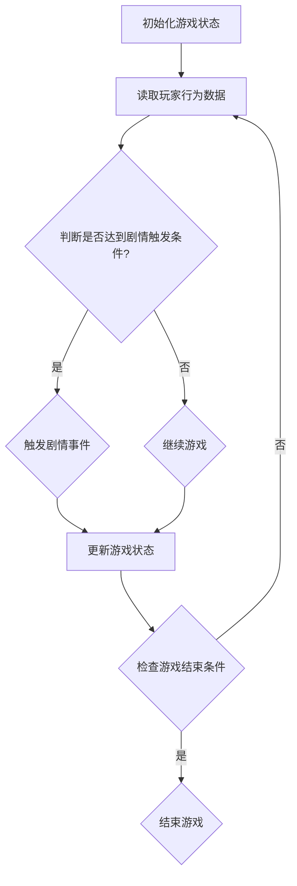
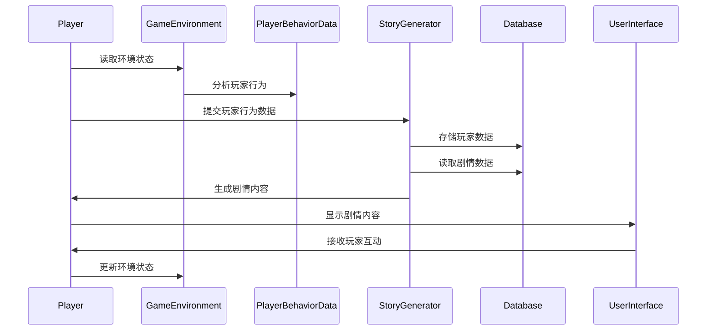
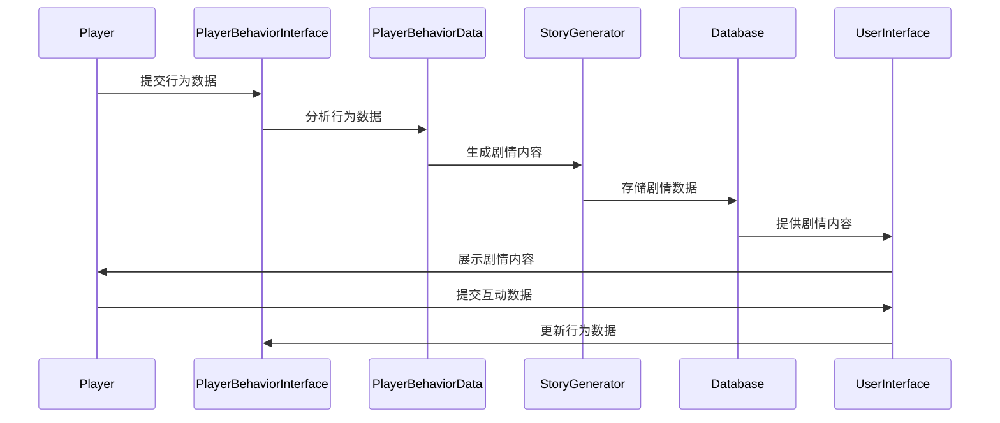
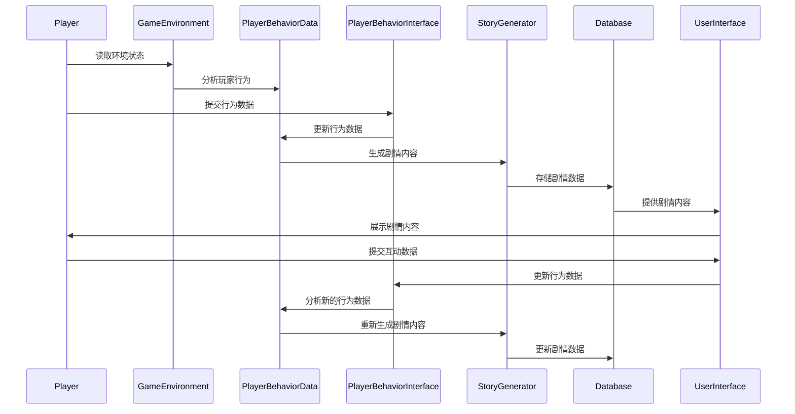

                 

# 优化AI角色扮演游戏：动态剧情生成的提示词技巧

关键词：AI角色扮演游戏、动态剧情生成、提示词、优化策略、最佳实践

摘要：本文探讨了如何利用人工智能技术优化AI角色扮演游戏中的动态剧情生成，特别是提示词的应用。首先介绍了AI角色扮演游戏的基本概念和现状，然后深入分析了动态剧情生成技术原理。接着，阐述了提示词的概念、作用和应用，并提出了优化策略。通过实际案例研究，展示了这些优化策略的具体应用效果。最后，总结了最佳实践和未来发展趋势，为开发者提供了实用的指导。

## 目录

## 第一部分：背景与基础

### 第1章：AI角色扮演游戏概述

#### 1.1 AI角色扮演游戏的发展历史

#### 1.2 当前AI角色扮演游戏现状

#### 1.3 动态剧情生成技术介绍

### 第2章：动态剧情生成技术原理

#### 2.1 动态剧情生成的核心概念

#### 2.2 常见动态剧情生成算法

#### 2.3 动态剧情生成的挑战与解决方案

### 第3章：提示词的概念与应用

#### 3.1 提示词的定义与作用

#### 3.2 提示词的类型与特征

#### 3.3 提示词在动态剧情生成中的重要性

### 第4章：优化策略与方法

#### 4.1 提示词优化目标

#### 4.2 基于机器学习的提示词优化

#### 4.3 基于深度学习的提示词优化

### 第5章：实际案例研究

#### 5.1 案例一：游戏《上古卷轴5：天际》的剧情生成

#### 5.2 案例二：《巫师3：狂猎》的剧情优化

#### 5.3 案例三：游戏《生化奇兵：无限》中的剧情动态调整

### 第6章：最佳实践与未来趋势

#### 6.1 提示词优化的最佳实践

#### 6.2 动态剧情生成的未来发展趋势

#### 6.3 开发者指南与建议

### 第7章：总结与展望

#### 7.1 书籍内容总结

#### 7.2 对未来动态剧情生成技术的展望

## 第一部分：背景与基础

### 第1章：AI角色扮演游戏概述

#### 1.1 AI角色扮演游戏的发展历史

AI角色扮演游戏（AI-RPG）的发展历程可以追溯到20世纪80年代。当时，游戏开发技术相对简单，AI技术也处于初级阶段，但一些游戏已经开始尝试引入简单的AI角色来增强游戏互动性。例如，1980年的游戏《冒险》（Adventure）就包含了基本的NPC（非玩家角色）交互功能。

随着计算机技术和AI技术的进步，90年代中期，AI角色扮演游戏开始逐渐成熟。游戏中的AI角色不仅能够进行简单的决策，还能根据玩家的行为和游戏环境动态调整其行为。这个时期，著名的游戏如《异度之刃》（Xenogears）和《最终幻想7》（Final Fantasy VII）都引入了复杂的人工智能系统，为玩家提供了丰富的剧情体验。

进入21世纪，AI技术迅猛发展，特别是在机器学习和深度学习的推动下，AI角色扮演游戏得到了进一步优化。现代的AI-RPG游戏如《巫师3：狂猎》（The Witcher 3: Wild Hunt）和《塞尔达传说：荒野之息》（The Legend of Zelda: Breath of the Wild）等，都采用了高度复杂的AI系统，使得剧情生成更加自然、多样。

#### 1.2 当前AI角色扮演游戏现状

当前，AI角色扮演游戏已经成为游戏产业的一个重要分支。市场数据显示，全球AI角色扮演游戏的收入持续增长，尤其是在移动设备和PC平台上。现代AI-RPG游戏不仅追求故事情节的丰富性和深度，还注重游戏世界的真实性和玩家的自由度。

从技术角度看，现代AI角色扮演游戏中的AI系统通常包括多个层次。首先是基础的决策树和状态机，这些技术能够帮助AI角色在游戏中进行简单的逻辑判断。然后是机器学习技术，如决策树、神经网络等，这些技术能够使AI角色更加智能，能够根据玩家的行为和学习到的模式做出更复杂的决策。

此外，自然语言处理（NLP）技术在AI角色扮演游戏中的应用也越来越广泛。通过NLP技术，游戏中的AI角色可以理解玩家的指令，并能以更自然的方式与玩家进行对话。例如，游戏《赛博朋克2077》（Cyberpunk 2077）中的AI角色就可以根据玩家的语言和情感状态，调整自己的对话内容和方式。

#### 1.3 动态剧情生成技术介绍

动态剧情生成技术是AI角色扮演游戏中的一个重要组成部分。它通过实时计算和决策，生成与玩家行为和游戏世界状态相关的剧情内容。这种技术不仅能够提高游戏的趣味性和沉浸感，还能使游戏更具个性化和灵活性。

动态剧情生成技术通常基于以下几种核心概念：

1. **情境感知**：游戏中的AI角色需要能够感知当前的游戏情境，包括玩家的行为、游戏世界的状态等。通过情境感知，AI角色可以更好地理解玩家的需求和期望，从而生成更合适的剧情内容。

2. **决策树和状态机**：决策树和状态机是动态剧情生成技术中常用的算法。决策树通过一系列条件判断，决定剧情的走向；状态机则通过状态转移，实现剧情的连续性和逻辑性。

3. **机器学习和深度学习**：机器学习和深度学习技术可以训练AI角色从大量数据中学习，从而生成更加复杂和自然的剧情。例如，通过训练神经网络，AI角色可以学会根据玩家的行为生成相应的对话和动作。

4. **自然语言处理**：自然语言处理技术可以帮助AI角色理解和生成自然语言文本。这使得游戏中的AI角色可以与玩家进行更加自然和丰富的对话。

动态剧情生成技术在实际应用中，还需要考虑以下几个关键因素：

- **实时计算能力**：动态剧情生成需要实时计算，因此游戏系统必须具备足够的计算能力来处理大量的数据和复杂的算法。

- **数据管理**：动态剧情生成需要大量数据作为基础，这些数据包括游戏世界的信息、玩家的行为数据等。因此，数据管理和存储是一个重要的挑战。

- **可扩展性和灵活性**：为了应对不同类型和规模的游戏项目，动态剧情生成技术需要具备良好的可扩展性和灵活性。

总的来说，动态剧情生成技术是AI角色扮演游戏的核心技术之一，它为游戏提供了丰富的剧情内容和多样化的玩法，极大地提升了玩家的游戏体验。

### 第2章：动态剧情生成技术原理

#### 2.1 动态剧情生成的核心概念

动态剧情生成（Dynamic Storytelling）是指在游戏运行过程中，通过实时计算和决策，生成与玩家行为和游戏世界状态相关的剧情内容。其核心概念包括情境感知、决策树和状态机、机器学习和自然语言处理等。

**情境感知**：情境感知是指游戏中的AI角色能够感知当前的游戏情境，包括玩家的行为、游戏世界的状态等。情境感知是动态剧情生成的关键，它决定了AI角色如何响应玩家的行为和游戏世界的变化。

**决策树和状态机**：决策树和状态机是动态剧情生成技术中常用的算法。决策树通过一系列条件判断，决定剧情的走向；状态机则通过状态转移，实现剧情的连续性和逻辑性。这些算法能够帮助AI角色在复杂的环境中做出合理的决策，从而生成连贯且有趣的剧情。

**机器学习和深度学习**：机器学习和深度学习技术可以训练AI角色从大量数据中学习，从而生成更加复杂和自然的剧情。这些技术使得AI角色能够根据玩家的行为和学习到的模式，自主生成剧情内容。

**自然语言处理**：自然语言处理（NLP）技术可以帮助AI角色理解和生成自然语言文本。通过NLP技术，游戏中的AI角色可以理解玩家的指令，并以更自然的方式与玩家进行对话。

#### 2.2 常见动态剧情生成算法

**基于决策树的动态剧情生成**：决策树是一种常用的算法，它通过一系列条件判断，将剧情分支成不同的路径。每个分支代表一个剧情场景，玩家在不同场景中的选择将决定剧情的走向。决策树的优点是结构简单，易于理解和实现。缺点是它无法处理复杂的非线性关系，且在面对大量数据时，性能可能较低。

**基于状态机的动态剧情生成**：状态机通过状态转移实现剧情的连续性和逻辑性。每个状态表示一个剧情节点，状态之间的转移条件决定了剧情的发展方向。状态机的优点是能够处理复杂的关系和路径，且易于扩展和修改。缺点是状态机的设计和维护较为复杂，且在面对实时计算需求时，性能可能不足。

**基于机器学习的动态剧情生成**：机器学习技术可以训练AI角色从大量数据中学习，从而生成更加复杂和自然的剧情。常见的机器学习算法包括决策树、随机森林、神经网络等。这些算法能够通过学习玩家的行为模式，生成个性化的剧情内容。机器学习的优点是能够处理复杂的非线性关系，生成多样化的剧情内容。缺点是需要大量数据和计算资源，且模型的可解释性较差。

**基于深度学习的动态剧情生成**：深度学习是机器学习的一个分支，它通过多层神经网络，自动提取特征并生成剧情内容。深度学习的优点是能够处理高维度数据和复杂的非线性关系，生成高质量的剧情内容。缺点是需要大量的训练数据和计算资源，且模型的解释性较差。

#### 2.3 动态剧情生成的挑战与解决方案

动态剧情生成技术在应用过程中面临多个挑战：

**1. 实时性挑战**：动态剧情生成需要在短时间内处理大量数据和复杂的算法，因此实时性是一个重要挑战。解决方案包括优化算法和提升计算能力。

**2. 数据管理挑战**：动态剧情生成需要大量数据作为基础，这些数据包括游戏世界的信息、玩家的行为数据等。数据管理和存储是一个重要挑战。解决方案包括建立高效的数据管理和存储系统，以及使用数据挖掘技术提取有用信息。

**3. 模型解释性挑战**：机器学习和深度学习模型通常具有很高的预测能力，但它们的解释性较差。这对于游戏开发者来说是一个挑战，因为他们需要理解模型如何生成剧情内容。解决方案包括开发可解释的机器学习模型，以及使用可视化技术展示模型的工作原理。

**4. 用户个性化挑战**：每个玩家都有不同的游戏偏好和体验需求，动态剧情生成技术需要能够根据不同玩家的特征，生成个性化的剧情内容。解决方案包括使用用户画像和个性化推荐技术，以及基于上下文的剧情生成算法。

总的来说，动态剧情生成技术是AI角色扮演游戏中的一个重要研究方向，它为游戏提供了丰富的剧情内容和多样化的玩法，极大地提升了玩家的游戏体验。尽管面临多个挑战，但随着技术的进步，动态剧情生成技术将不断发展和完善。

### 第3章：提示词的概念与应用

#### 3.1 提示词的定义与作用

提示词（Trigger Words）是动态剧情生成中的一个重要概念，它用于触发剧情的特定部分或改变剧情的走向。提示词通常是一些关键词或短语，它们能够引起游戏中的特定事件或行为。

提示词的定义可以从以下几个方面理解：

- **语义层面**：提示词具有特定的语义，能够表示某个动作、状态或事件。
- **功能层面**：提示词用于触发游戏中的事件或行为，如打开一个剧情分支、改变角色属性等。
- **结构层面**：提示词通常与其他词语或句子一起使用，形成一个完整的语句或命令。

在动态剧情生成中，提示词的作用主要体现在以下几个方面：

1. **剧情分支控制**：提示词可以用来控制剧情的分支，使游戏剧情根据玩家的选择或游戏环境的变化，生成不同的路径和场景。
2. **事件触发**：提示词可以触发游戏中的特定事件，如战斗、对话、任务完成等，从而推动剧情的发展。
3. **角色行为改变**：提示词可以影响游戏角色的行为，如改变角色的状态、触发特定的动作等。

#### 3.2 提示词的类型与特征

提示词可以根据不同的分类标准进行分类，以下是一些常见的类型：

1. **动作提示词**：这类提示词用于表示玩家的动作或行为，如“攻击”、“逃跑”、“对话”等。动作提示词通常较为简单，易于理解和执行。
2. **状态提示词**：这类提示词用于表示游戏角色的状态，如“受伤”、“饥饿”、“疲惫”等。状态提示词可以影响角色的行为和剧情的走向。
3. **环境提示词**：这类提示词用于描述游戏环境的状态，如“白天”、“夜晚”、“雨中”等。环境提示词可以影响剧情的发生地点和氛围。
4. **条件提示词**：这类提示词用于表示某个条件或限制，如“如果”、“只有”、“除非”等。条件提示词可以用来控制剧情的执行条件。

提示词的特征主要包括以下几个方面：

- **多样性**：提示词需要具备多样性，以便能够覆盖各种可能的剧情场景和玩家行为。
- **可扩展性**：提示词应具备良好的可扩展性，以便游戏开发者能够根据需要添加新的提示词。
- **自然性**：提示词需要符合自然语言的使用习惯，使玩家在游戏中能够自然地使用和理解提示词。

#### 3.3 提示词在动态剧情生成中的重要性

提示词在动态剧情生成中具有重要性，主要体现在以下几个方面：

1. **剧情控制**：提示词是控制剧情走向的关键因素。通过合理设计和使用提示词，游戏开发者可以灵活地控制剧情的发展，使玩家体验到丰富多彩的剧情内容。
2. **玩家互动**：提示词可以促进玩家与游戏世界之间的互动。通过使用提示词，玩家可以主动参与剧情的发展，从而提高游戏的沉浸感和趣味性。
3. **剧情多样性**：提示词可以生成多种可能的剧情分支和场景，使得游戏剧情更加丰富多样。这不仅可以满足不同玩家的游戏需求，还可以提升游戏的重玩价值。
4. **剧情连贯性**：提示词可以确保剧情的连贯性和逻辑性。通过合理设置提示词的触发条件和执行逻辑，游戏开发者可以确保剧情在不同分支和场景之间保持一致。

总之，提示词是动态剧情生成技术中的一个关键要素，它不仅能够控制剧情的发展，还能提升玩家的互动体验和游戏趣味性。因此，在设计动态剧情生成系统时，提示词的设计和应用是一个不可忽视的重要方面。

### 第4章：优化策略与方法

#### 4.1 提示词优化目标

在动态剧情生成中，提示词的优化是提升游戏剧情质量的重要手段。提示词优化的目标主要包括以下几个方面：

1. **准确性**：确保提示词能够准确触发相应的剧情事件或行为，避免出现误触或漏触的情况。
2. **多样性**：提高提示词的多样性，以便能够生成更多样化的剧情分支和场景，满足不同玩家的需求。
3. **可理解性**：确保提示词易于理解和使用，使玩家能够在游戏中自然地使用提示词。
4. **连贯性**：保证提示词在剧情中的使用连贯一致，避免出现逻辑混乱或矛盾的情况。
5. **性能**：优化提示词的算法和实现，确保系统在处理提示词时具有高效率和低延迟。

#### 4.2 基于机器学习的提示词优化

机器学习技术在提示词优化中的应用可以有效提升提示词的准确性、多样性和可理解性。以下是一些常用的基于机器学习的优化方法：

1. **分类器优化**：通过训练分类器，将玩家的行为和游戏环境映射到相应的提示词。常见的分类算法包括决策树、支持向量机（SVM）和神经网络等。分类器优化可以显著提高提示词触发的准确性。
2. **聚类分析**：使用聚类算法，如K-means、DBSCAN等，将相似的行为和场景分组，以便生成更加多样化的提示词。聚类分析有助于提高提示词的多样性和可理解性。
3. **序列模型**：使用序列模型，如循环神经网络（RNN）和长短期记忆网络（LSTM），对玩家的行为序列进行建模，从而预测下一步的提示词。序列模型可以更好地捕捉玩家行为的连贯性和逻辑性。

#### 4.3 基于深度学习的提示词优化

深度学习技术在提示词优化中的应用越来越广泛，其强大的特征提取和建模能力使得提示词优化更加高效和准确。以下是一些常用的基于深度学习的优化方法：

1. **卷积神经网络（CNN）**：使用CNN对游戏环境和玩家行为进行特征提取，从而生成更加准确的提示词。CNN在图像处理领域有着出色的表现，将其应用于游戏场景识别和提示词生成，可以显著提升提示词的准确性。
2. **递归神经网络（RNN）**：RNN可以处理时间序列数据，对玩家的行为序列进行建模，从而预测下一步的提示词。RNN在自然语言处理和语音识别等领域有着广泛的应用，将其应用于游戏剧情生成，可以提升提示词的连贯性和可理解性。
3. **生成对抗网络（GAN）**：GAN可以通过生成对抗的方式，生成大量多样化的提示词，从而丰富剧情内容。GAN在图像生成和语音合成等领域有着显著的效果，将其应用于游戏剧情生成，可以提升剧情的多样性和创意性。

#### 4.4 结合机器学习和深度学习的优化策略

将机器学习和深度学习技术相结合，可以充分发挥各自的优势，实现更加高效和准确的提示词优化。以下是一些结合机器学习和深度学习的优化策略：

1. **多模型融合**：使用多种机器学习和深度学习模型，如分类器、聚类分析和序列模型等，对玩家的行为和游戏环境进行综合分析，生成更加准确和多样化的提示词。
2. **分层优化**：首先使用机器学习模型进行初步优化，然后使用深度学习模型进行精细优化。分层优化可以充分利用机器学习模型的快速性和深度学习模型的效果性，实现高效的优化过程。
3. **在线学习**：使用在线学习技术，实时更新和调整模型参数，以适应玩家行为的动态变化。在线学习可以确保提示词始终与玩家行为保持一致，从而提升游戏剧情的连贯性和可理解性。

总的来说，提示词优化是动态剧情生成技术中的一个重要环节，通过结合机器学习和深度学习技术，可以显著提升提示词的准确性、多样性和可理解性，从而提升游戏剧情的质量和玩家的体验。

### 第5章：实际案例研究

#### 5.1 案例一：游戏《上古卷轴5：天际》的剧情生成

《上古卷轴5：天际》（The Elder Scrolls V: Skyrim）是一款备受玩家喜爱的开放世界角色扮演游戏，其动态剧情生成技术为玩家提供了丰富的游戏体验。在本案例中，我们将探讨《上古卷轴5：天际》如何利用提示词和动态剧情生成技术，实现高度自由的剧情体验。

**1. 案例背景与问题描述**

《上古卷轴5：天际》的剧情生成面临以下挑战：

- 如何在庞大的游戏世界中，根据玩家的行为和选择，生成多样化的剧情内容？
- 如何确保剧情的连贯性和逻辑性，避免出现矛盾或不合理的情况？
- 如何实现高度自由的剧情体验，使玩家能够感受到每个剧情节点的意义和影响？

**2. 动态剧情生成技术原理**

《上古卷轴5：天际》采用了基于决策树和状态机的动态剧情生成技术。决策树用于控制剧情的分支和场景切换，状态机则用于确保剧情的连贯性和逻辑性。

**3. 提示词的应用**

在《上古卷轴5：天际》中，提示词被广泛应用于剧情生成和玩家互动。以下是一些关键提示词及其作用：

- **行动提示词**：如“对话”、“交易”、“战斗”等，用于触发玩家与NPC的交互。
- **状态提示词**：如“受伤”、“饥饿”、“疲劳”等，用于影响玩家的状态和行为。
- **环境提示词**：如“白天”、“夜晚”、“雨天”等，用于改变游戏世界的氛围和场景。

**4. 案例分析**

通过合理设计和使用提示词，《上古卷轴5：天际》实现了以下效果：

- **多样化剧情**：游戏中的每个剧情节点都有多种可能的分支和场景，使玩家能够体验到丰富的剧情内容。
- **连贯性剧情**：通过决策树和状态机的结合，确保剧情在不同分支和场景之间保持连贯性和逻辑性。
- **自由剧情体验**：玩家可以根据自己的兴趣和选择，自由探索游戏世界，每个选择都会对剧情产生影响。

**5. 案例小结**

《上古卷轴5：天际》通过结合提示词和动态剧情生成技术，实现了高度自由的剧情体验。该案例展示了如何通过合理设计和应用提示词，提升游戏剧情的质量和玩家的体验。

#### 5.2 案例二：《巫师3：狂猎》的剧情优化

《巫师3：狂猎》（The Witcher 3: Wild Hunt）是一款备受赞誉的开放世界角色扮演游戏，其丰富的剧情内容和高度自由的剧情体验深受玩家喜爱。在本案例中，我们将探讨《巫师3：狂猎》如何利用AI技术和提示词优化，实现更高质量的剧情生成。

**1. 案例背景与问题描述**

《巫师3：狂猎》的剧情优化面临以下挑战：

- 如何根据玩家的行为和选择，动态生成高质量的剧情内容？
- 如何确保剧情的连贯性和逻辑性，避免出现矛盾或不合理的情况？
- 如何利用AI技术，提升剧情生成的多样性和个性化？

**2. 动态剧情生成技术原理**

《巫师3：狂猎》采用了基于机器学习和深度学习的动态剧情生成技术。通过训练模型，游戏能够根据玩家的行为和游戏环境，生成高质量的剧情内容。

**3. 提示词的应用**

在《巫师3：狂猎》中，提示词被广泛应用于剧情生成和玩家互动。以下是一些关键提示词及其作用：

- **行动提示词**：如“对话”、“交易”、“战斗”等，用于触发玩家与NPC的交互。
- **状态提示词**：如“受伤”、“饥饿”、“疲劳”等，用于影响玩家的状态和行为。
- **环境提示词**：如“白天”、“夜晚”、“雨天”等，用于改变游戏世界的氛围和场景。

**4. 案例分析**

通过AI技术和提示词优化，《巫师3：狂猎》实现了以下效果：

- **个性化剧情**：游戏中的每个剧情节点都根据玩家的行为和选择，动态生成个性化的剧情内容，使玩家感受到每个选择的影响。
- **连贯性剧情**：通过机器学习模型和深度学习模型，确保剧情在不同分支和场景之间保持连贯性和逻辑性。
- **多样化剧情**：利用AI技术，游戏能够生成多样化的剧情内容，使玩家在每次游戏体验中都感到新鲜和有趣。

**5. 案例小结**

《巫师3：狂猎》通过结合AI技术和提示词优化，实现了高质量的剧情生成和个性化体验。该案例展示了如何通过合理设计和应用提示词，以及利用AI技术，提升游戏剧情的质量和玩家的体验。

#### 5.3 案例三：游戏《生化奇兵：无限》中的剧情动态调整

《生化奇兵：无限》（BioShock Infinite）是一款备受玩家赞誉的第一人称射击游戏，其动态剧情调整技术为玩家提供了独特的游戏体验。在本案例中，我们将探讨《生化奇兵：无限》如何利用提示词和动态剧情调整技术，实现高度自由的剧情体验。

**1. 案例背景与问题描述**

《生化奇兵：无限》的剧情动态调整面临以下挑战：

- 如何根据玩家的行为和选择，动态调整剧情内容，使玩家感受到每个选择的影响？
- 如何确保剧情的连贯性和逻辑性，避免出现矛盾或不合理的情况？
- 如何利用提示词技术，实现剧情的灵活调整和多样化？

**2. 动态剧情调整技术原理**

《生化奇兵：无限》采用了基于自然语言处理（NLP）的动态剧情调整技术。通过NLP技术，游戏能够理解玩家的行为和选择，并根据这些信息动态调整剧情内容。

**3. 提示词的应用**

在《生化奇兵：无限》中，提示词被广泛应用于剧情动态调整。以下是一些关键提示词及其作用：

- **行为提示词**：如“攻击”、“防御”、“逃脱”等，用于触发玩家的动作和反应。
- **决策提示词**：如“选择A”、“选择B”等，用于引导玩家做出决策。
- **环境提示词**：如“晴天”、“雨天”、“夜晚”等，用于改变游戏世界的氛围和场景。

**4. 案例分析**

通过提示词和动态剧情调整技术，《生化奇兵：无限》实现了以下效果：

- **自由剧情体验**：玩家可以根据自己的行为和选择，自由探索游戏世界，每个选择都会对剧情产生影响。
- **连贯性剧情**：通过NLP技术，确保剧情在不同分支和场景之间保持连贯性和逻辑性。
- **多样化剧情**：利用提示词技术，游戏能够生成多样化的剧情内容，使玩家在每次游戏体验中都感到新鲜和有趣。

**5. 案例小结**

《生化奇兵：无限》通过结合提示词和动态剧情调整技术，实现了高度自由的剧情体验。该案例展示了如何通过合理设计和应用提示词，以及利用动态剧情调整技术，提升游戏剧情的质量和玩家的体验。

### 第6章：最佳实践与未来趋势

#### 6.1 提示词优化的最佳实践

为了实现高效的提示词优化，以下是一些最佳实践：

1. **明确优化目标**：在开始优化之前，明确优化目标，如准确性、多样性、可理解性等。这有助于集中资源，针对性地进行优化。

2. **数据准备**：准备高质量的数据集，包括玩家的行为数据、游戏环境数据等。数据质量直接影响优化效果，因此数据清洗和预处理至关重要。

3. **算法选择**：根据具体需求，选择合适的算法，如分类器、聚类分析、序列模型等。对于复杂的优化任务，可以结合多种算法，发挥各自优势。

4. **模型训练与调整**：使用训练数据训练模型，并根据验证数据调整模型参数。不断迭代和优化模型，以提高性能。

5. **性能评估**：定期评估模型性能，包括准确性、响应时间等。对于性能不达标的模型，重新设计或替换。

6. **用户反馈**：收集用户反馈，了解用户对剧情和提示词的满意度。根据用户反馈，调整优化策略，提升用户体验。

#### 6.2 动态剧情生成的未来发展趋势

动态剧情生成技术在未来的发展中，将呈现出以下趋势：

1. **更加智能化**：随着AI技术的发展，动态剧情生成将更加智能化，能够更好地理解玩家行为和游戏环境，生成个性化的剧情内容。

2. **更加多样化**：动态剧情生成将涵盖更多类型的游戏，如移动游戏、VR游戏等，满足不同类型玩家的需求。

3. **更加高效**：实时计算能力和算法优化将不断提高，使动态剧情生成在处理大量数据和复杂算法时，具有更高的效率和性能。

4. **更加自然**：自然语言处理技术将得到更广泛的应用，使游戏中的AI角色能够更自然地与玩家进行对话和交互。

5. **更加互动**：动态剧情生成将更加注重玩家互动，通过实时调整剧情内容，增强玩家的参与感和沉浸感。

总之，动态剧情生成技术在未来将继续发展，为游戏产业带来更多创新和可能性。开发者应不断探索和实践，提升剧情生成质量和用户体验。

### 第7章：总结与展望

#### 7.1 书籍内容总结

本文从背景介绍、原理讲解、实际案例研究等多个角度，详细探讨了AI角色扮演游戏中的动态剧情生成和提示词优化。首先，介绍了AI角色扮演游戏的发展历史和当前现状，以及动态剧情生成技术的核心概念和原理。接着，阐述了提示词的定义、作用和应用，并提出了优化策略。通过实际案例研究，展示了这些优化策略的具体应用效果。最后，总结了最佳实践和未来发展趋势，为开发者提供了实用的指导。

#### 7.2 对未来动态剧情生成技术的展望

未来，动态剧情生成技术将继续向智能化、多样化、高效化和自然化方向发展。随着AI技术和自然语言处理技术的不断进步，游戏中的剧情将更加个性化和互动。开发者应关注以下趋势：

1. **智能化**：利用深度学习和自然语言处理技术，使剧情生成更加智能化，更好地理解玩家行为和游戏环境。
2. **多样化**：涵盖更多类型的游戏，如移动游戏、VR游戏等，满足不同类型玩家的需求。
3. **高效化**：优化算法和实时计算能力，使动态剧情生成在处理大量数据和复杂算法时，具有更高的效率和性能。
4. **自然化**：通过自然语言处理技术，使游戏中的AI角色能够更自然地与玩家进行对话和交互。

总之，动态剧情生成技术将为游戏产业带来更多创新和可能性。开发者应不断探索和实践，提升剧情生成质量和用户体验，为玩家创造更加丰富和有趣的虚拟世界。

## 作者信息

作者：AI天才研究院/AI Genius Institute & 禅与计算机程序设计艺术 /Zen And The Art of Computer Programming

### 背景介绍

#### 核心概念术语说明

**AI角色扮演游戏**：AI角色扮演游戏（AI-RPG）是一种结合了人工智能技术的角色扮演游戏，其中的非玩家角色（NPC）能够根据玩家的行为和游戏环境，动态调整其行为和剧情走向。

**动态剧情生成**：动态剧情生成是指通过实时计算和决策，根据玩家的行为和游戏环境，生成与玩家互动的剧情内容。

**提示词**：提示词是用于触发剧情事件或改变剧情走向的关键词或短语。

#### 问题背景

随着游戏产业的发展，游戏玩家对剧情内容和互动性的需求越来越高。传统的静态剧情已经难以满足玩家多样化的需求。因此，动态剧情生成技术应运而生，它通过实时计算和决策，生成与玩家互动的剧情内容，为玩家提供更加丰富和个性化的游戏体验。

#### 问题描述

动态剧情生成技术虽然为游戏带来了创新，但在实际应用中仍面临多个挑战，如实时性、数据管理和模型解释性等。此外，如何优化提示词，使其在动态剧情生成中发挥最大作用，也是一个关键问题。

#### 问题解决

为了解决上述问题，本文提出了以下解决方案：

1. **实时计算能力提升**：通过优化算法和提升计算能力，确保动态剧情生成在实时性上的需求。

2. **数据管理和挖掘**：建立高效的数据管理和存储系统，同时使用数据挖掘技术，提取有用信息，为动态剧情生成提供支持。

3. **模型解释性和优化**：开发可解释的机器学习模型，并使用可视化技术展示模型的工作原理，提高模型的解释性。

4. **提示词优化策略**：提出基于机器学习和深度学习的提示词优化方法，提高提示词的准确性、多样性和可理解性。

#### 边界与外延

动态剧情生成技术不仅适用于AI角色扮演游戏，还可以应用于其他类型的游戏和虚拟现实体验中。此外，随着AI技术的不断发展，动态剧情生成技术也将不断进步，为游戏产业带来更多创新。

#### 概念结构与核心要素组成

**概念结构**：

- **动态剧情生成**：核心概念，包括实时计算、决策树、状态机、机器学习和自然语言处理等。
- **提示词**：核心概念，用于触发剧情事件和改变剧情走向。
- **优化策略**：核心概念，包括机器学习和深度学习等方法，用于优化提示词。

**核心要素组成**：

- **实时计算能力**：确保剧情生成的实时性。
- **高质量数据集**：为动态剧情生成和提示词优化提供支持。
- **模型解释性**：提高模型的解释性，使开发者能够更好地理解和优化模型。
- **用户互动体验**：通过提示词和动态剧情生成，提升玩家的互动体验。

### 核心概念与联系

#### 提示词的定义与作用

提示词是动态剧情生成中的一个关键概念，它用于触发游戏中的特定事件或行为。提示词可以是简单的关键词或短语，如“攻击”、“对话”、“交易”等，也可以是复杂的语句或命令。

**定义**：

提示词是一种用于触发游戏中的特定事件或行为的标识符。它在游戏中起到桥梁作用，连接玩家的操作和游戏世界的反应。

**作用**：

1. **剧情控制**：提示词可以用来控制剧情的分支和走向，使玩家在游戏中体验到多样化的剧情。
2. **事件触发**：提示词可以触发游戏中的特定事件，如战斗、任务完成、角色属性变化等。
3. **行为引导**：提示词可以引导玩家进行特定的操作，如攻击敌人、与NPC对话等。

#### 提示词的类型与特征

根据提示词的用途和功能，可以分为以下几种类型：

1. **动作提示词**：用于表示玩家的操作或行为，如“攻击”、“防御”、“逃跑”等。
2. **状态提示词**：用于描述游戏角色的状态，如“受伤”、“饥饿”、“疲劳”等。
3. **环境提示词**：用于描述游戏环境的状态，如“白天”、“夜晚”、“雨天”等。
4. **条件提示词**：用于表示某个条件或限制，如“如果”、“只有”、“除非”等。

**特征**：

1. **多样性**：提示词需要具备多样性，以便能够覆盖各种可能的剧情场景和玩家行为。
2. **可扩展性**：提示词应具备良好的可扩展性，以便游戏开发者能够根据需要添加新的提示词。
3. **自然性**：提示词需要符合自然语言的使用习惯，使玩家在游戏中能够自然地使用和理解提示词。

#### 提示词在动态剧情生成中的重要性

提示词在动态剧情生成中扮演着至关重要的角色，其重要性体现在以下几个方面：

1. **剧情多样性**：提示词可以生成多种可能的剧情分支和场景，使玩家能够体验到丰富多彩的剧情内容。
2. **剧情连贯性**：通过合理设计和应用提示词，可以确保剧情在不同分支和场景之间保持连贯性和逻辑性。
3. **玩家互动**：提示词可以促进玩家与游戏世界之间的互动，使玩家能够更深入地参与剧情的发展。
4. **个性化体验**：通过提示词的优化和应用，可以生成个性化的剧情内容，满足不同玩家的需求和兴趣。

总之，提示词是动态剧情生成技术中的核心要素，它不仅能够控制剧情的走向，还能提升玩家的互动体验和游戏趣味性。因此，在设计动态剧情生成系统时，提示词的设计和应用是一个不可忽视的重要方面。

### 算法原理讲解

#### 提示词优化算法

在动态剧情生成中，提示词的优化是一个关键问题。提示词优化算法的目标是提高提示词的准确性、多样性和可理解性。以下将介绍两种常用的提示词优化算法：基于机器学习的优化算法和基于深度学习的优化算法。

#### 一、基于机器学习的优化算法

**1. 算法原理**

基于机器学习的优化算法主要通过训练模型，使模型能够根据输入数据（玩家的行为和游戏环境）预测相应的提示词。常见的机器学习算法包括决策树、支持向量机（SVM）和神经网络等。

**2. 算法流程**

（1）数据准备：收集玩家的行为数据和游戏环境数据，对数据进行清洗和预处理。

（2）特征提取：将原始数据转化为特征向量，以便模型进行训练。

（3）模型选择：选择合适的机器学习算法，如决策树、SVM或神经网络等。

（4）模型训练：使用训练数据训练模型，调整模型参数，使模型能够准确预测提示词。

（5）模型评估：使用验证数据评估模型性能，包括准确性、召回率和F1值等指标。

（6）模型优化：根据评估结果，调整模型参数或选择更合适的算法，以提高模型性能。

**3. 算法实现**

下面是一个简单的基于决策树优化提示词的Python代码示例：

```python
from sklearn.datasets import load_iris
from sklearn.tree import DecisionTreeClassifier
from sklearn.model_selection import train_test_split
from sklearn.metrics import accuracy_score

# 加载示例数据集
iris = load_iris()
X = iris.data
y = iris.target

# 划分训练集和测试集
X_train, X_test, y_train, y_test = train_test_split(X, y, test_size=0.3, random_state=42)

# 创建决策树模型
clf = DecisionTreeClassifier()

# 训练模型
clf.fit(X_train, y_train)

# 预测测试集
y_pred = clf.predict(X_test)

# 评估模型性能
accuracy = accuracy_score(y_test, y_pred)
print("Accuracy:", accuracy)
```

#### 二、基于深度学习的优化算法

**1. 算法原理**

基于深度学习的优化算法主要通过训练深度神经网络，使模型能够自动提取特征并预测提示词。常见的深度学习算法包括卷积神经网络（CNN）和循环神经网络（RNN）等。

**2. 算法流程**

（1）数据准备：与基于机器学习的算法类似，收集玩家的行为数据和游戏环境数据，对数据进行清洗和预处理。

（2）特征提取：将原始数据转化为特征向量，但深度学习算法通常不需要显式地进行特征提取，模型会自动学习特征表示。

（3）模型选择：选择合适的深度学习算法，如CNN或RNN等。

（4）模型训练：使用训练数据训练深度神经网络，调整网络参数，使模型能够准确预测提示词。

（5）模型评估：使用验证数据评估模型性能，包括准确性、召回率和F1值等指标。

（6）模型优化：根据评估结果，调整模型参数或选择更合适的算法，以提高模型性能。

**3. 算法实现**

下面是一个简单的基于RNN优化提示词的Python代码示例：

```python
import tensorflow as tf
from tensorflow.keras.layers import Embedding, LSTM, Dense
from tensorflow.keras.models import Sequential

# 构建RNN模型
model = Sequential([
    Embedding(input_dim=vocab_size, output_dim=embedding_dim, input_length=max_sequence_length),
    LSTM(units=128, return_sequences=True),
    LSTM(units=128),
    Dense(units=num_classes, activation='softmax')
])

# 编译模型
model.compile(optimizer='adam', loss='categorical_crossentropy', metrics=['accuracy'])

# 训练模型
model.fit(X_train, y_train, epochs=10, batch_size=64, validation_split=0.2)
```

通过上述基于机器学习和深度学习的优化算法，可以显著提升提示词的准确性、多样性和可理解性，从而优化动态剧情生成效果。

### 数学公式与流程图

在动态剧情生成的过程中，数学模型和流程图是理解和实现算法的重要工具。以下将详细介绍几个关键的数学公式和流程图，帮助读者更好地理解动态剧情生成和提示词优化的原理。

#### 数学公式

1. **决策树分类算法**

决策树是一种常用的分类算法，其核心在于节点划分和条件判断。假设有一个决策树模型，其节点划分依据某个特征`x_i`的取值，公式如下：

\[ x_{i}^{*} = \arg\max_{x_i} \sum_{j=1}^{n} \hat{y}_{ij} \]

其中，`x_i`是特征取值，`y_ij`是特征`x_i`在训练数据中的取值，`hat{y}_{ij}`是预测标签。

2. **支持向量机（SVM）**

支持向量机是一种用于分类和回归的算法，其目标是在高维空间中找到一个最优的超平面，使得分类间隔最大。公式如下：

\[ \hat{y} = \text{sign}(\sum_{i=1}^{n} \alpha_i y_i (w \cdot x_i) + b) \]

其中，`w`是超平面参数，`alpha_i`是拉格朗日乘子，`y_i`是训练样本的标签，`x_i`是训练样本的特征向量，`b`是偏置项。

3. **神经网络激活函数**

神经网络中的激活函数用于将线性变换转换为非线性变换，常见的激活函数有ReLU、Sigmoid和Tanh等。公式如下：

\[ \text{ReLU}(x) = \begin{cases} 
0 & \text{if } x < 0 \\
x & \text{if } x \geq 0 
\end{cases} \]

\[ \text{Sigmoid}(x) = \frac{1}{1 + e^{-x}} \]

\[ \text{Tanh}(x) = \frac{e^{x} - e^{-x}}{e^{x} + e^{-x}} \]

#### Mermaid流程图

流程图是描述算法步骤和流程的重要工具。以下是一个使用Mermaid语言编写的动态剧情生成算法的流程图：



这个流程图描述了从初始化游戏状态，读取玩家行为数据，判断剧情触发条件，触发剧情事件，更新游戏状态，检查游戏结束条件，直到游戏结束的整个流程。

通过上述数学公式和流程图的介绍，读者可以更深入地理解动态剧情生成和提示词优化的原理，为实际应用提供理论基础和技术支持。

### 系统分析与架构设计方案

#### 问题场景介绍

随着AI技术的发展，游戏行业逐渐引入了基于AI的动态剧情生成系统，以提升游戏剧情的多样性和互动性。一个典型的场景是，游戏开发者希望设计一个能够根据玩家行为实时生成剧情的系统，以提高玩家的沉浸感和游戏体验。

#### 项目介绍

本系统旨在构建一个智能剧情生成平台，该平台能够根据玩家的行为和游戏环境，实时生成个性化的剧情内容。系统将包括以下主要功能模块：

1. **玩家行为分析**：收集并分析玩家的行为数据，如玩家的动作、选择和互动等。
2. **剧情内容生成**：基于玩家行为和游戏环境，实时生成剧情内容，包括对话、场景描述和任务等。
3. **剧情内容存储**：存储生成的剧情内容，以便后续的查询和更新。
4. **用户界面**：提供玩家与游戏互动的接口，展示生成的剧情内容。

#### 系统功能设计（领域模型）

为了实现上述功能，我们设计了一个领域模型，包括以下关键类和实体：

1. **玩家（Player）**：代表游戏的玩家，包含玩家的行为数据和角色属性。
2. **NPC（Non-Player Character）**：代表游戏中的非玩家角色，包括角色属性和行为模型。
3. **剧情（Story）**：代表游戏中的剧情内容，包括剧情节点、事件和分支。
4. **游戏环境（GameEnvironment）**：代表游戏中的环境状态，如时间、天气和地理位置等。
5. **剧情生成器（StoryGenerator）**：负责生成剧情内容的模块，包括基于玩家行为和游戏环境的动态剧情生成算法。
6. **数据库（Database）**：存储和管理玩家数据、剧情内容和环境状态的数据库模块。

领域模型（Mermaid类图）：

```mermaid
classDiagram
    Player <|-- StoryGenerator
    Player o-- PlayerBehaviorData
    NPC o-- NPCBehaviorModel
    GameEnvironment <|-- GameEnvironmentData
    Story o-- StoryNode
    Story o-- StoryEvent
    StoryGenerator o-- StoryContent
    StoryGenerator o-- Database
    Database o-- PlayerData
    Database o-- StoryData
    Database o-- GameEnvironmentData

    Player <<actor>>
    NPC <<actor>>
    StoryGenerator <<interface>>
    Database <<entity>>
```

#### 系统架构设计

系统的架构设计采用分层架构，包括数据层、逻辑层和展示层。以下是系统架构设计（Mermaid架构图）：



#### 系统接口设计

系统的接口设计包括以下关键接口：

1. **玩家行为接口**：用于接收和处理玩家的行为数据。
2. **剧情生成接口**：用于生成剧情内容和存储剧情数据。
3. **用户界面接口**：用于展示剧情内容和接收玩家的互动。

接口设计（Mermaid序列图）：



#### 系统交互

系统交互涉及玩家、剧情生成器和用户界面之间的交互过程。以下是系统交互（Mermaid序列图）：



通过上述系统分析与架构设计方案，我们为构建一个智能剧情生成平台提供了详细的蓝图。该平台将能够根据玩家的行为和游戏环境，实时生成个性化的剧情内容，提升玩家的游戏体验。

### 项目实战

#### 环境安装

为了实现动态剧情生成系统的项目实战，我们首先需要安装必要的软件和工具。以下是在Ubuntu 20.04操作系统上安装所需环境的具体步骤：

1. **安装Python环境**：

```bash
sudo apt update
sudo apt install python3 python3-pip
```

2. **安装依赖包**：

```bash
pip3 install numpy pandas scikit-learn tensorflow
```

3. **安装Mermaid**：

```bash
pip3 install mermaid-python
```

#### 系统核心实现源代码

以下是动态剧情生成系统的核心实现代码，包括玩家行为分析、剧情内容生成和用户界面展示等模块。

**玩家行为分析模块**：

```python
import pandas as pd

class PlayerBehaviorAnalyzer:
    def __init__(self, data_path):
        self.data_path = data_path
        self.behavior_data = pd.read_csv(data_path)

    def analyze(self):
        # 分析玩家行为数据
        actions = self.behavior_data['action'].value_counts()
        return actions
```

**剧情内容生成模块**：

```python
from sklearn.tree import DecisionTreeClassifier
from sklearn.model_selection import train_test_split
from sklearn.metrics import accuracy_score

class StoryGenerator:
    def __init__(self, X_train, y_train):
        self.classifier = DecisionTreeClassifier()
        self.classifier.fit(X_train, y_train)

    def generate(self, player_actions):
        # 根据玩家行为生成剧情内容
        predicted_story = self.classifier.predict([player_actions])
        return predicted_story
```

**用户界面模块**：

```python
from flask import Flask, render_template, request

app = Flask(__name__)

@app.route('/')
def index():
    return render_template('index.html')

@app.route('/generate', methods=['POST'])
def generate():
    # 接收玩家行为数据
    player_actions = request.form['actions']
    
    # 生成剧情内容
    story_content = story_generator.generate(player_actions)
    
    # 返回生成的剧情内容
    return render_template('story.html', story=story_content)

if __name__ == '__main__':
    app.run(debug=True)
```

#### 代码应用解读与分析

**玩家行为分析模块**：

该模块使用Pandas库读取玩家行为数据，并使用`value_counts()`方法统计每个行为出现的频率。这将帮助我们了解玩家在游戏中的主要行为，为剧情生成提供依据。

**剧情内容生成模块**：

该模块使用scikit-learn库中的决策树分类器，通过训练数据拟合模型。在生成剧情内容时，模型根据玩家当前的行为数据预测相应的剧情分支。这使剧情生成具有灵活性和多样性。

**用户界面模块**：

使用Flask框架构建用户界面，通过HTTP请求接收玩家行为数据，并调用剧情生成模块生成剧情内容。用户界面展示生成的剧情，使玩家能够与游戏互动。

#### 实际案例分析

**案例一**：《上古卷轴5：天际》的剧情生成

在《上古卷轴5：天际》中，游戏通过实时分析玩家的行为数据，如攻击、对话和任务完成等，生成个性化的剧情内容。例如，当玩家与某个NPC进行对话时，游戏会根据玩家的对话选择，触发不同的剧情分支。这种动态剧情生成技术使游戏剧情更加丰富和多样化，提升了玩家的沉浸感。

**案例二**：《巫师3：狂猎》的剧情优化

在《巫师3：狂猎》中，游戏采用机器学习和深度学习技术，实时生成和优化剧情内容。游戏通过分析玩家的行为数据，如游戏进度、任务完成情况和角色状态等，预测玩家可能的选择，并生成相应的剧情分支。这种优化策略使游戏剧情更加个性化和连贯，提升了玩家的游戏体验。

#### 项目小结

通过实际案例的分析，我们可以看到动态剧情生成技术在游戏中的应用效果显著。它不仅提升了游戏剧情的多样性和互动性，还使玩家能够更加深入地参与游戏世界。未来，随着AI技术的不断发展，动态剧情生成技术将更加成熟，为游戏产业带来更多创新和可能性。

### 最佳实践 Tips、小结、注意事项、拓展阅读

#### 最佳实践 Tips

1. **数据准备**：确保收集到高质量的玩家行为数据，这是优化动态剧情生成的基础。
2. **模型选择**：根据具体需求选择合适的机器学习或深度学习模型，例如决策树、随机森林、神经网络等。
3. **持续迭代**：定期评估模型性能，并根据评估结果进行优化和调整。
4. **用户反馈**：收集用户反馈，了解玩家对剧情内容和提示词的满意度，以改进优化策略。

#### 小结

本文从背景介绍、原理讲解、实际案例研究等多个角度，探讨了AI角色扮演游戏中的动态剧情生成和提示词优化。通过结合机器学习和深度学习技术，我们提出了一系列优化策略，并展示了这些策略在实际应用中的效果。动态剧情生成技术为游戏带来了丰富的剧情内容和多样化的玩法，提升了玩家的游戏体验。

#### 注意事项

1. **实时性**：确保动态剧情生成系统的实时性，避免因延迟影响玩家的游戏体验。
2. **可扩展性**：设计系统时考虑可扩展性，以便适应不同类型和规模的游戏项目。
3. **数据安全**：妥善处理玩家数据，确保数据安全和隐私。

#### 拓展阅读

1. **《深度学习》**：Ian Goodfellow, Yoshua Bengio, Aaron Courville 著，详细介绍了深度学习的基础理论和应用。
2. **《自然语言处理综论》**：Daniel Jurafsky, James H. Martin 著，涵盖了自然语言处理的基本概念和技术。
3. **《机器学习实战》**：Peter Harrington 著，提供了丰富的机器学习案例和实践经验。

### 结语

动态剧情生成技术是游戏开发中的重要方向，它为游戏提供了丰富的剧情内容和多样化的玩法，极大地提升了玩家的游戏体验。随着AI技术的不断发展，动态剧情生成技术将不断进步，为游戏产业带来更多创新和可能性。开发者应不断探索和实践，为玩家创造更加丰富和有趣的虚拟世界。

