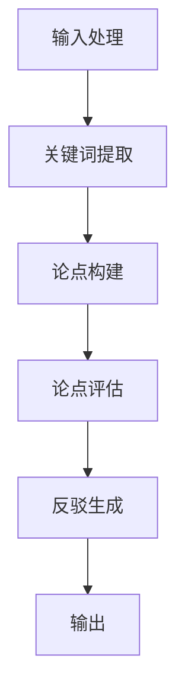
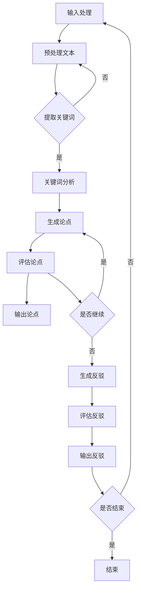
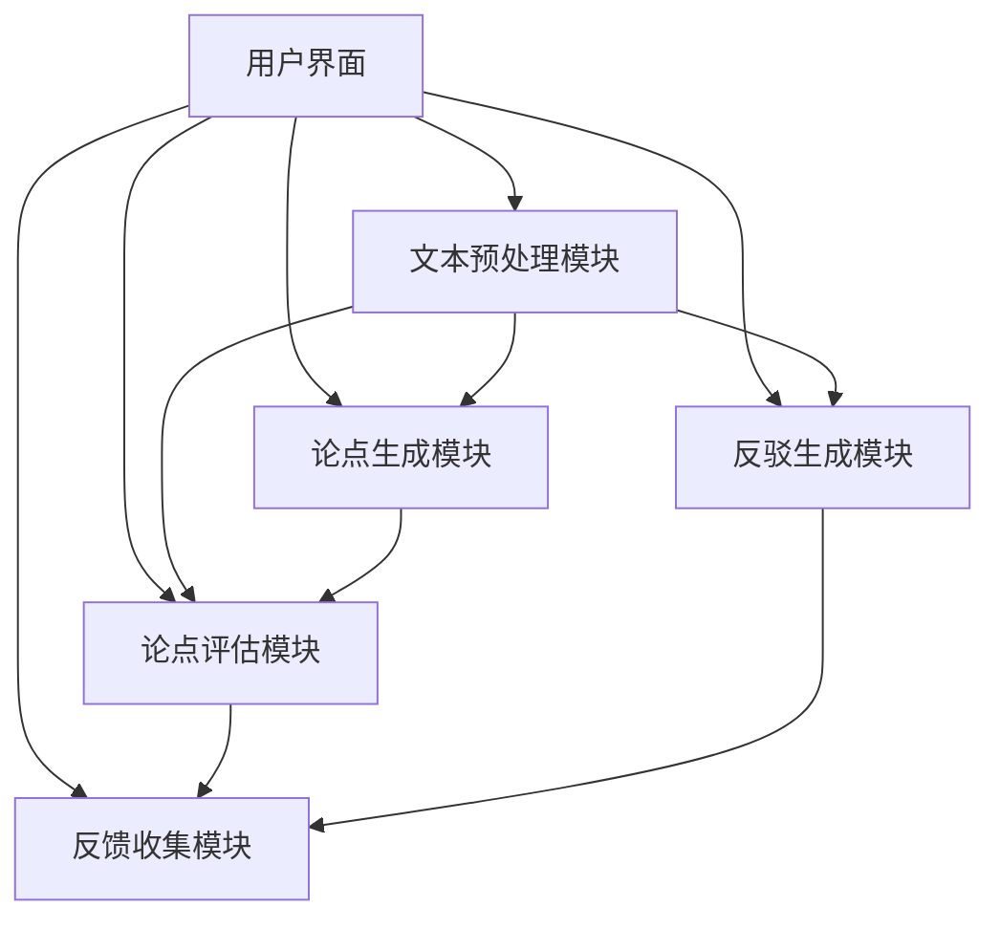
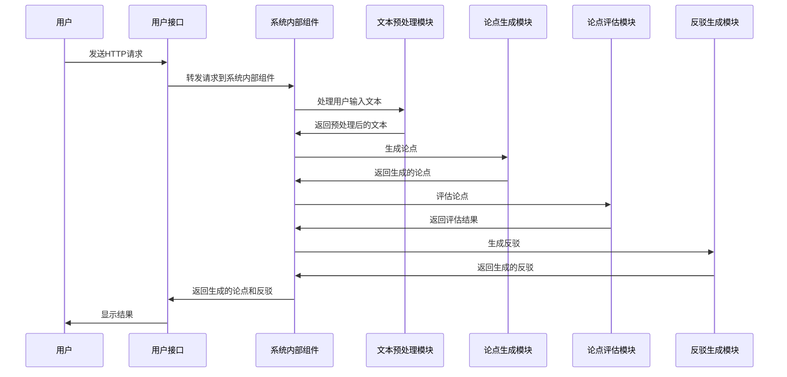
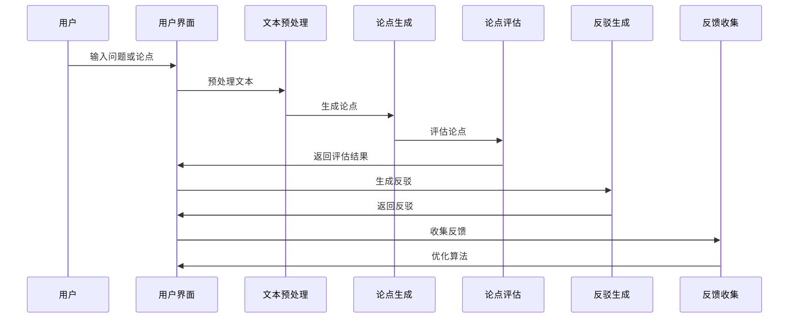

                 

### 《优化AI辩论系统：论点构建和反驳的提示词策略》

关键词：AI辩论系统、论点构建、反驳策略、提示词、算法设计

摘要：本文深入探讨了AI辩论系统中的论点构建和反驳策略，提出了一种基于提示词的优化方法。首先，我们对AI辩论系统进行了基本概念和现状的阐述，指出了当前系统的局限性。接着，我们分析了辩论逻辑和论点构建的基础理论，并详细讨论了提示词在论点构建和反驳中的作用。最后，通过结合实际案例，我们展示了算法的设计与实现，并提供了最佳实践与总结，为未来AI辩论系统的发展提供了有益的思路。

----------------------------------------------------------------

### 目录大纲

# 《优化AI辩论系统：论点构建和反驳的提示词策略》

> 关键词：AI辩论系统、论点构建、反驳策略、提示词、算法设计

> 摘要：本文深入探讨了AI辩论系统中的论点构建和反驳策略，提出了一种基于提示词的优化方法。首先，我们对AI辩论系统进行了基本概念和现状的阐述，指出了当前系统的局限性。接着，我们分析了辩论逻辑和论点构建的基础理论，并详细讨论了提示词在论点构建和反驳中的作用。最后，通过结合实际案例，我们展示了算法的设计与实现，并提供了最佳实践与总结，为未来AI辩论系统的发展提供了有益的思路。

## 第一部分：背景与核心概念

### 第1章：AI辩论系统的基本概念与现状

#### 1.1 AI辩论系统的定义与发展

#### 1.2 当前AI辩论系统的局限性

#### 1.3 优化AI辩论系统的重要性

### 第2章：论点构建与反驳的基础理论

#### 2.1 辩论逻辑与信息处理

#### 2.2 论点构建的策略与方法

#### 2.3 反驳的策略与技巧

### 第3章：论点构建的提示词策略

#### 3.1 提示词在论点构建中的作用

#### 3.2 提示词库的构建与管理

#### 3.3 提示词的应用与优化

### 第4章：反驳的提示词策略

#### 4.1 反驳的目标与类型

#### 4.2 反驳提示词的选择

#### 4.3 反驳过程中的提示词使用

### 第5章：结合实际案例分析

#### 5.1 案例一：论点构建案例分析

#### 5.2 案例二：反驳案例分析

## 第二部分：算法设计与实现

### 第6章：算法原理与流程设计

#### 6.1 算法原理概述

#### 6.2 算法流程设计

#### 6.3 算法流程图（Mermaid）

### 第7章：数学模型与公式解释

#### 7.1 数学模型概述

#### 7.2 公式解释与推导

#### 7.3 数学模型与算法的结合

### 第8章：系统架构设计与接口设计

#### 8.1 系统架构设计

#### 8.2 系统接口设计

#### 8.3 系统交互序列图（Mermaid）

### 第9章：项目实战与代码实现

#### 9.1 环境安装与配置

#### 9.2 核心代码实现

#### 9.3 代码解读与分析

#### 9.4 实际案例分析与讲解

## 第三部分：最佳实践与总结

### 第10章：最佳实践与优化策略

#### 10.1 实践经验分享

#### 10.2 优化策略探讨

#### 10.3 未来发展方向

### 第11章：小结与拓展阅读

#### 11.1 小结

#### 11.2 注意事项

#### 11.3 拓展阅读推荐

### 第12章：参考文献

#### 12.1 相关书籍

#### 12.2 学术论文

#### 12.3 网络资源

----------------------------------------------------------------

### 第一部分：背景与核心概念

#### 第1章：AI辩论系统的基本概念与现状

### 背景介绍

人工智能（AI）作为一种模拟、延伸和扩展人类智能的技术，正日益改变着我们的生活方式。在众多AI应用中，AI辩论系统备受关注。AI辩论系统利用自然语言处理（NLP）和机器学习（ML）等技术，能够自动生成论点并进行辩论。这不仅为人类提供了一个高效的辩论工具，也为AI在逻辑推理和语言表达方面的研究提供了新的视角。

#### 1.1 AI辩论系统的定义与发展

AI辩论系统是一种基于人工智能技术的辩论平台，它能够模拟人类的辩论过程，生成论点并进行辩论。这种系统通常包括以下几个核心模块：

1. **论点生成模块**：该模块负责生成论点，通常采用自然语言处理和文本生成技术。
2. **论点分析模块**：该模块对生成的论点进行分析，包括论点的有效性、逻辑严密性等。
3. **辩论策略模块**：该模块负责制定辩论策略，包括论点构建、反驳和应对对手的策略。
4. **用户交互模块**：该模块负责与用户进行交互，接受用户输入，反馈辩论结果等。

AI辩论系统的发展经历了多个阶段。最初，系统主要依靠规则和模板进行辩论。随着自然语言处理和机器学习技术的发展，AI辩论系统开始引入这些技术，使得辩论的多样性和深度大大增加。目前，AI辩论系统已经在多个领域得到应用，包括法律、商业和学术研究等。

#### 1.2 当前AI辩论系统的局限性

尽管AI辩论系统在技术方面取得了显著进展，但仍然存在一些局限性。以下是一些主要的问题：

1. **论点生成质量不高**：目前的AI辩论系统在生成论点时，往往依赖于已有的数据和算法，导致生成的论点质量有限，缺乏创新性和深度。
2. **逻辑推理能力不足**：尽管AI辩论系统可以模拟人类的辩论过程，但其逻辑推理能力仍远不及人类。这导致在复杂和抽象的辩论场景中，系统往往难以胜任。
3. **对上下文理解不足**：辩论过程中，上下文信息对于论点的生成和反驳至关重要。然而，目前的AI辩论系统在理解上下文方面仍然存在很多挑战。
4. **互动性不强**：尽管AI辩论系统可以与用户进行交互，但互动性有限。用户往往只能被动地接受系统生成的论点和反驳，而无法主动参与辩论。

#### 1.3 优化AI辩论系统的重要性

针对上述局限性，优化AI辩论系统显得尤为重要。优化AI辩论系统不仅可以提高论点生成质量，增强逻辑推理能力，还可以提升对上下文的理解，增强互动性。以下是一些优化的重要性：

1. **提高辩论质量**：优化后的AI辩论系统可以生成更高质量的论点，使得辩论更加深入和有说服力。
2. **增强逻辑推理能力**：通过引入更先进的算法和技术，优化AI辩论系统的逻辑推理能力，使其在复杂场景中表现出色。
3. **提升用户体验**：优化后的AI辩论系统可以更好地理解用户的意图，提供个性化的辩论服务，提升用户体验。
4. **推动AI技术发展**：优化AI辩论系统不仅有助于解决当前存在的问题，还可以为AI技术的研究和应用提供新的思路和方向。

#### 1.4 小结

本章对AI辩论系统的基本概念和现状进行了介绍，分析了当前系统的局限性，并阐述了优化AI辩论系统的重要性。在下一章中，我们将深入探讨论点构建与反驳的基础理论，为后续的优化提供理论支持。

----------------------------------------------------------------

### 第二部分：论点构建与反驳的基础理论

#### 第2章：辩论逻辑与信息处理

### 背景介绍

辩论是一种重要的交流方式，通过论点的构建和反驳，人们可以表达自己的观点，反驳对方的观点，最终达成共识或理解。在人工智能领域，模拟人类的辩论过程一直是研究的热点。为了深入理解AI辩论系统，我们需要了解辩论逻辑和论点构建的基本理论，以及信息处理的相关知识。

#### 2.1 辩论逻辑与信息处理

辩论逻辑是指辩论过程中所遵循的推理规则和逻辑结构。它包括以下几个方面：

1. **论点的定义与结构**：论点是指支持或反驳某一观点的陈述。一个完整的论点通常包括论据和结论。论据是支持结论的陈述，而结论是论点的核心观点。
2. **逻辑推理**：逻辑推理是指从已知的前提推导出结论的过程。在辩论中，逻辑推理是论证的基础，它保证了论点的合理性和说服力。
3. **反驳**：反驳是指通过提出新的论据或指出对方论点的缺陷，来否定对方的观点。反驳分为直接反驳和间接反驳，直接反驳直接否定对方的论点，而间接反驳则通过其他方式削弱对方的论点。

信息处理是指对信息进行收集、分析、存储和传输的过程。在辩论中，信息处理至关重要。以下是一些关键概念：

1. **信息收集**：辩论者需要收集与论点相关的信息，这些信息可以是数据、文献、案例等。有效的信息收集是构建有力论点的关键。
2. **信息分析**：对收集到的信息进行深入分析，可以发现信息之间的关联，识别关键点，从而为论点构建提供支持。
3. **信息存储**：将分析得到的信息存储起来，以便在辩论过程中随时调用。
4. **信息传输**：将信息传递给对手和观众，使其了解论点的依据和逻辑。

#### 2.2 论点构建的策略与方法

论点构建是辩论的核心环节，有效的论点构建可以使辩论更加有力。以下是一些常用的策略和方法：

1. **基于事实的论点**：这种论点基于客观的事实和数据，具有很高的可信度。构建基于事实的论点需要充分收集和分析相关数据，确保论点的真实性。
2. **基于逻辑的论点**：这种论点通过严密的逻辑推理来支持结论，具有较高的逻辑严密性。构建基于逻辑的论点需要熟练掌握逻辑推理的方法和技巧。
3. **基于情感的论点**：这种论点通过调动听众的情感，来支持或反驳某一观点。构建基于情感的论点需要了解听众的情感和心理，巧妙地运用情感元素。
4. **类比论点**：通过将新问题与已知问题进行类比，来构建论点。类比论点通常具有直观性和说服力，但需要确保类比的有效性。

以下是一个具体的论点构建实例：

**论点**：太阳能是未来能源发展的主要方向。

**论据**：
- 太阳能是一种可再生能源，具有取之不尽、用之不竭的特点。
- 太阳能技术已经取得了显著进展，成本逐渐降低，应用范围不断扩大。
- 太阳能具有广泛的环境效益，可以减少对化石燃料的依赖，降低温室气体排放。

**结论**：因此，太阳能是未来能源发展的主要方向。

#### 2.3 反驳的策略与技巧

反驳是辩论的重要环节，通过反驳可以削弱对方的论点，增强自己的观点。以下是一些常用的反驳策略和技巧：

1. **直接反驳**：直接否定对方的论点，通常包括以下几种方式：
   - **逻辑反驳**：指出对方论点的逻辑错误或矛盾。
   - **事实反驳**：提供新的证据或数据，证明对方的论点不成立。
   - **情感反驳**：通过调动听众的情感，来削弱对方的论点。

2. **间接反驳**：通过其他方式削弱对方的论点，通常包括以下几种方式：
   - **质疑对方的论据**：指出对方论据的不确定性或不足之处。
   - **指出对方论证过程的问题**：指出对方在论证过程中出现的逻辑错误或漏洞。
   - **转移注意力**：通过提出新的议题或问题，转移听众的注意力，使对方论点显得不那么重要。

以下是一个具体的反驳实例：

**论点**：太阳能的成本太高，不适合大规模推广。

**反驳**：
- 太阳能的成本在过去几十年中已经显著下降，随着技术的进步，成本还将继续降低。
- 与传统能源相比，太阳能具有显著的环境效益，长期来看可以降低社会总成本。
- 太阳能的推广不仅可以创造就业机会，还可以促进技术进步，带来更多的创新和机遇。

#### 2.4 小结

本章介绍了辩论逻辑和论点构建的基本理论，以及信息处理的相关知识。我们讨论了论点构建的策略与方法，以及反驳的策略与技巧。这些基础理论为后续的AI辩论系统优化提供了理论支持。在下一章中，我们将深入探讨论点构建的提示词策略，进一步优化AI辩论系统的性能。

----------------------------------------------------------------

### 第三部分：论点构建的提示词策略

#### 第3章：论点构建的提示词策略

### 背景介绍

在辩论过程中，论点构建是至关重要的环节。有效的论点构建不仅能够支持观点，还能削弱对手的论点。为了提升论点构建的质量和效率，我们可以利用提示词策略。提示词是一种能够引导思考、激发灵感的关键词或短语，有助于构建有力的论点。本章节将探讨论点构建中的提示词策略，包括提示词的作用、提示词库的构建和管理，以及提示词在实际应用中的优化方法。

#### 3.1 提示词在论点构建中的作用

提示词在论点构建中起着至关重要的作用，主要体现在以下几个方面：

1. **引导思考**：提示词能够引导思考，激发新的观点和论据。通过提示词，辩论者可以更好地理解问题的本质，找到关键点，从而构建有力的论点。
2. **提高效率**：提示词可以帮助辩论者快速找到相关论据，减少无效思考和重复劳动，提高论点构建的效率。
3. **增强逻辑性**：提示词有助于确保论点构建的逻辑性。通过提示词，辩论者可以系统地组织思路，避免逻辑错误和不连贯的情况。
4. **提升说服力**：提示词可以增强论点的说服力。通过使用适当的提示词，辩论者可以更准确地表达观点，使论点更具说服力。

以下是一个使用提示词引导思考的实例：

**提示词**：公平、正义、效率、自由

**论点构建**：

- **公平**：资源分配应公平，确保每个人都有平等的机会。
- **正义**：法律应体现正义，保护弱者，惩罚犯罪。
- **效率**：政府应提高效率，减少浪费，优化公共服务。
- **自由**：公民应有言论自由，表达自己的观点，参与社会事务。

#### 3.2 提示词库的构建与管理

构建和管理提示词库是优化论点构建的关键步骤。以下是一些构建和管理提示词库的方法：

1. **关键词提取**：通过文本挖掘技术，从大量文献、案例和辩论记录中提取关键词，作为提示词。
2. **专家评审**：邀请辩论专家对提取的关键词进行评审，筛选出最有价值和最具启发性的关键词，纳入提示词库。
3. **分类管理**：将提示词按主题或领域进行分类管理，便于快速查找和使用。
4. **动态更新**：定期更新提示词库，根据新出现的主题和趋势，增加新的提示词。

以下是一个提示词库的示例：

- **伦理**：道德、伦理标准、公正、诚信
- **经济**：经济增长、市场、投资、失业
- **环境**：气候变化、污染、可持续发展、生态平衡
- **政治**：民主、选举、政府、政策

#### 3.3 提示词的应用与优化

在实际应用中，提示词的使用需要根据具体的辩论场景和目标进行调整。以下是一些提示词应用和优化的方法：

1. **定制化提示词**：根据辩论的主题和目标，为特定辩论场景定制化提示词，使其更符合实际需求。
2. **提示词引导**：在辩论过程中，使用提示词引导辩论者思考，确保论点构建的系统性和逻辑性。
3. **动态调整**：根据辩论进展和对手的论点，动态调整提示词的使用，以应对新的情况和挑战。
4. **反馈优化**：收集辩论者的反馈，根据实际效果优化提示词库，提高其适用性和有效性。

以下是一个提示词应用的实例：

**辩论主题**：是否应提高最低工资标准

**提示词**：

- **经济效益**：成本、通货膨胀、失业率、经济增长
- **社会公平**：贫困、收入差距、社会福利、劳动权益
- **道德伦理**：公正、社会责任、人权、社会正义

通过以上提示词，辩论者可以从多个角度构建论点，提高辩论的说服力和深度。

#### 3.4 小结

本章介绍了论点构建的提示词策略，包括提示词的作用、提示词库的构建和管理，以及提示词在实际应用中的优化方法。通过使用提示词，我们可以引导思考，提高论点构建的质量和效率，增强辩论的说服力。在下一章中，我们将探讨反驳的提示词策略，进一步优化AI辩论系统的性能。

----------------------------------------------------------------

### 第四部分：反驳的提示词策略

#### 第4章：反驳的提示词策略

### 背景介绍

在辩论中，反驳是削弱对方论点、支持自己观点的重要手段。有效的反驳不仅需要合理的论据和严密的逻辑，还需要策略和技巧。提示词在反驳过程中起着关键作用，可以帮助辩论者迅速找到反驳的点，组织反驳的内容。本章节将探讨反驳的提示词策略，包括反驳的目标与类型、提示词的选择和使用，以及反驳过程中提示词的实际应用。

#### 4.1 反驳的目标与类型

反驳的目标是削弱对方的论点，使其失去说服力，从而支持自己的观点。为了达到这个目标，反驳可以分为以下几种类型：

1. **直接反驳**：直接否定对方的论点，指出其逻辑错误或事实错误。例如，如果对方认为“太阳能成本太高”，可以直接反驳“太阳能成本在过去几年已经显著下降，且具有长期的经济和环境效益”。
   
2. **间接反驳**：通过其他方式削弱对方的论点，例如质疑对方的论据、指出论证过程的问题或转移注意力。例如，如果对方认为“政府干预经济会导致市场失灵”，可以间接反驳“市场失灵并非政府干预的唯一原因，还有其他因素如技术变革、外部冲击等”。

3. **逻辑反驳**：指出对方论点中的逻辑错误，如偷换概念、以偏概全、循环论证等。例如，如果对方认为“因为A，所以B”，可以逻辑反驳“A与B之间并没有直接的因果关系”。

4. **情感反驳**：通过调动听众的情感，来削弱对方的论点。例如，如果对方认为“政府削减教育预算是有利的”，可以情感反驳“削减教育预算将对年轻一代的未来造成严重影响”。

5. **实证反驳**：提供新的证据或数据，证明对方的论点不成立。例如，如果对方认为“疫苗接种会导致健康问题”，可以实证反驳“多项研究表明疫苗接种是安全的，且有效预防了许多疾病”。

#### 4.2 反驳提示词的选择

选择合适的提示词是进行有效反驳的关键。以下是一些常用的反驳提示词及其含义：

1. **事实**：用于指出对方论据的不准确或错误。例如，“你的数据来源是否可靠？”
2. **逻辑**：用于指出对方论点的逻辑错误。例如，“你的论据是否自洽？”
3. **情感**：用于调动听众的情感，增强反驳的说服力。例如，“这将对社会造成什么样的影响？”
4. **利益**：用于指出对方论点对自身利益的影响。例如，“这将对我们的经济利益产生怎样的影响？”
5. **证据**：用于提供反驳的证据或数据。例如，“我们有数据证明你的观点是不成立的”。

以下是一个反驳提示词的选择实例：

**对方论点**：太阳能成本太高，不适合大规模推广。

**反驳提示词**：

- **事实**：过去十年太阳能成本下降了70%。
- **逻辑**：降低成本是技术创新的常见结果。
- **情感**：太阳能有助于减少对化石燃料的依赖，改善环境。
- **利益**：长期来看，太阳能将创造更多就业机会。
- **证据**：国际能源署数据显示，太阳能已成为最经济的发电方式之一。

#### 4.3 反驳过程中的提示词使用

在反驳过程中，合理使用提示词可以帮助辩论者系统地组织反驳内容，增强反驳的说服力。以下是一些使用反驳提示词的方法：

1. **引入提示词**：在反驳的开头引入提示词，明确反驳的方向和目标。例如，“对方提到太阳能成本高，但事实上，过去十年太阳能成本下降了70%”。
2. **结合提示词与论据**：在反驳的过程中，结合提示词和具体的论据，使反驳更具说服力。例如，“逻辑上，降低成本是技术创新的常见结果，而太阳能成本在过去十年显著下降”。
3. **循环使用提示词**：在反驳的不同部分循环使用提示词，确保反驳的系统性和连贯性。例如，在反驳的开头引入“事实”提示词，在中间结合“逻辑”和“情感”提示词，在结尾再次强调“事实”和“利益”。
4. **动态调整提示词**：根据辩论的进展和对手的回应，动态调整提示词的使用，以应对新的反驳点。例如，如果对手使用了情感反驳，可以适时引入“逻辑”或“证据”提示词进行回应。

以下是一个反驳过程中的提示词使用实例：

**对方论点**：政府干预市场会导致经济效率降低。

**反驳过程**：

1. **引入提示词**：“对方提到政府干预市场会导致经济效率降低，但事实上…”
2. **结合提示词与论据**：“从逻辑上讲，市场失灵是政府干预的合理理由。事实上，市场失灵是经济学的常见问题，如外部性、信息不对称等。而且，政府干预可以在这些情况下提高经济效率。”
3. **循环使用提示词**：“此外，政府干预还可以促进公平，减少贫困，这与‘事实’和‘情感’提示词相关。最后，从‘利益’角度来看，政府干预有助于稳定经济，创造就业机会。”
4. **动态调整提示词**：“虽然对方可能认为政府干预会降低效率，但最新的研究表明，适当的干预可以带来长期的经济利益，这与‘证据’提示词相关。”

#### 4.4 小结

本章介绍了反驳的提示词策略，包括反驳的目标与类型、提示词的选择和使用，以及反驳过程中提示词的实际应用。通过使用合适的提示词，辩论者可以更有效地组织反驳内容，增强反驳的说服力。在下一章中，我们将结合实际案例，进一步探讨论点构建和反驳的策略与技巧。

----------------------------------------------------------------

### 第五部分：结合实际案例分析

#### 第5章：结合实际案例分析

### 背景介绍

为了更好地理解和应用论点构建和反驳的提示词策略，我们需要通过实际案例进行分析。在本章中，我们将分析两个具体的案例，一个是论点构建的案例，另一个是反驳的案例。通过这些案例，我们可以看到提示词在论点构建和反驳过程中的实际应用效果，从而更好地理解和应用这些策略。

#### 5.1 案例一：论点构建案例分析

**案例背景**：某次辩论会的主题是“是否应取消学校考试制度”。

**论点构建过程**：

1. **确定论点**：首先，我们需要确定自己的立场，是支持取消考试制度，还是反对取消考试制度。假设我们的立场是支持取消考试制度。

2. **使用提示词引导思考**：接下来，我们使用提示词来引导思考，构建论点。以下是几个关键的提示词：

   - **教育公平**：考试制度可能加剧教育不平等，不利于社会公平。
   - **学生心理健康**：考试压力可能导致学生心理健康问题，影响学习效果。
   - **创新能力**：考试制度可能抑制学生的创新能力和自主学习能力。
   - **实际能力**：考试更多地考察学生的记忆和应试技巧，而非实际应用能力。

3. **构建论点**：基于上述提示词，我们可以构建以下论点：

   - **教育公平**：考试制度往往基于标准化的考试，不利于那些来自资源匮乏或教育条件不佳背景的学生。取消考试制度可以减少教育不平等，促进教育公平。
   - **学生心理健康**：考试压力是学生心理健康问题的常见原因。取消考试制度可以减轻学生的考试焦虑，改善心理健康状况。
   - **创新能力**：考试制度往往注重记忆和应试技巧，而忽视创新能力和实际应用能力。取消考试制度可以鼓励学生发展创新思维，提高自主学习能力。
   - **实际能力**：考试更多地考察学生的记忆和应试技巧，而实际应用能力和问题解决能力往往在考试中得不到充分体现。取消考试制度可以更准确地评估学生的实际能力。

**结论**：因此，取消考试制度有助于促进教育公平、改善学生心理健康、鼓励创新能力和更准确地评估学生的实际能力。

#### 5.2 案例二：反驳案例分析

**案例背景**：在上述案例中，我们支持取消考试制度。然而，反对者提出了以下论点：“考试制度是评估学生学习成绩的有效方式，取消考试制度会导致无法准确评估学生的能力”。

**反驳过程**：

1. **使用提示词进行反驳**：为了有效地反驳对方的论点，我们可以使用以下提示词：

   - **有效性**：探讨考试制度是否真的有效评估学生的能力。
   - **替代方案**：提出其他评估学生学习成绩的有效方法。
   - **标准化**：讨论考试制度的标准化问题及其对评估准确性的影响。
   - **道德和诚信**：探讨考试制度可能带来的道德和诚信问题。

2. **具体反驳**：

   - **有效性**：考试制度确实可以评估学生在特定时间内的知识掌握情况，但不足以全面评估学生的综合能力，如创造力、沟通能力、团队合作能力等。因此，考试制度的有效性是有限的。
   - **替代方案**：除了考试，还可以使用项目评估、课堂表现、口头报告等多种方式来评估学生的能力。这些方法可以更全面地评估学生的综合素质。
   - **标准化**：考试制度依赖于标准化的试卷和评分标准，这可能导致评估结果过于单一，无法准确反映学生的个性化和多样化。
   - **道德和诚信**：考试制度可能导致作弊和舞弊现象，影响评估的公正性和诚信。

**结论**：因此，虽然考试制度在一定程度上可以评估学生的成绩，但其局限性显而易见。取消考试制度并探索其他评估方法可能是一个更好的选择。

#### 5.3 小结

通过上述两个实际案例，我们可以看到提示词在论点构建和反驳过程中的重要作用。提示词不仅帮助我们系统地组织论点和反驳，还增强了论点的逻辑性和说服力。在实际应用中，我们可以根据具体场景和需求，灵活使用提示词，构建有力的论点并进行有效的反驳。

----------------------------------------------------------------

### 第六部分：算法设计与实现

#### 第6章：算法原理与流程设计

### 背景介绍

在前几章中，我们讨论了AI辩论系统中论点构建和反驳的提示词策略。为了将理论转化为实际应用，我们需要设计一个算法来实现这些策略。本章将详细介绍算法的原理、流程设计以及算法流程图。

#### 6.1 算法原理概述

算法的原理主要基于以下核心思想：

1. **自然语言处理（NLP）**：利用NLP技术对文本进行解析，提取关键词和短语，作为提示词。
2. **机器学习（ML）**：通过ML模型，学习如何根据提示词构建论点和进行反驳。
3. **信息检索与处理**：利用信息检索技术，从大量文本数据中提取相关信息，为论点构建提供支持。
4. **逻辑推理**：结合逻辑推理技术，确保论点的逻辑性和合理性。

#### 6.2 算法流程设计

算法的基本流程可以分为以下几个步骤：

1. **输入处理**：接收用户输入的问题或论点，对其进行预处理。
2. **关键词提取**：利用NLP技术，从预处理后的输入文本中提取关键词和短语，形成提示词。
3. **论点构建**：根据提取的提示词，使用ML模型生成论点。此过程包括论据的生成和论点的逻辑组织。
4. **论点评估**：对生成的论点进行评估，确保其逻辑性和合理性。
5. **反驳生成**：根据对手的论点，利用ML模型生成反驳。此过程包括选择合适的反驳提示词和构建反驳论点。
6. **输出**：将生成的论点和反驳输出给用户。

以下是一个简化的算法流程图：



#### 6.3 算法流程图（Mermaid）

为了更直观地展示算法流程，我们使用Mermaid语言绘制算法流程图：



#### 6.4 详细流程解释

下面是对算法流程的详细解释：

1. **输入处理**：算法首先接收用户输入的问题或论点。输入可以是文本、语音或图像等多种形式。为了简化流程，我们假设输入是文本。
   
2. **预处理文本**：对输入的文本进行预处理，包括分词、去除停用词、词性标注等。这一步的目的是将原始文本转化为结构化的数据，便于后续处理。

3. **关键词提取**：利用NLP技术，从预处理后的文本中提取关键词和短语。这些关键词和短语将作为提示词，用于构建论点和反驳。

4. **关键词分析**：对提取的关键词进行进一步分析，确定其在论点构建和反驳中的作用。例如，某些关键词可能是论据，而其他关键词可能是反驳的论点。

5. **生成论点**：根据关键词分析结果，使用ML模型生成论点。此过程包括生成论据和论点的逻辑组织。论据可以是事实、数据、例子等，而论点则是根据这些论据推理出的结论。

6. **评估论点**：对生成的论点进行评估，确保其逻辑性和合理性。评估可以通过人工审核或自动评分系统进行。评估结果将用于调整和优化算法。

7. **输出论点**：将评估通过的论点输出给用户。用户可以根据这些论点进行进一步思考和讨论。

8. **生成反驳**：如果系统需要生成反驳，根据对手的论点，使用ML模型生成反驳。此过程包括选择合适的反驳提示词和构建反驳论点。

9. **评估反驳**：对生成的反驳进行评估，确保其逻辑性和合理性。评估结果将用于调整和优化算法。

10. **输出反驳**：将评估通过的反驳输出给用户。用户可以根据这些反驳进行反驳或进一步讨论。

11. **结束或循环**：根据用户需求，算法可以选择结束或继续循环执行。如果用户需要继续辩论，算法将重新进入输入处理阶段。

#### 6.5 小结

本章介绍了AI辩论系统中算法的原理和流程设计。算法基于自然语言处理、机器学习和逻辑推理技术，通过输入处理、关键词提取、论点构建、评估和输出等步骤，实现了论点构建和反驳的功能。算法流程图（Mermaid）提供了直观的展示，有助于理解算法的运行过程。在下一章中，我们将详细解释算法中的数学模型和公式，进一步深化对算法原理的理解。

----------------------------------------------------------------

### 第七部分：数学模型与公式解释

#### 第7章：数学模型与公式解释

### 背景介绍

在前一章中，我们介绍了AI辩论系统中算法的原理和流程设计。为了更深入地理解算法的运行机制，我们需要探讨算法中的数学模型和公式。本章将详细解释这些数学模型和公式，以及它们在算法中的作用。

#### 7.1 数学模型概述

算法中的数学模型主要包括以下几个方面：

1. **自然语言处理（NLP）模型**：用于文本的预处理、分词、词性标注等。
2. **机器学习（ML）模型**：用于论点构建和反驳的生成。
3. **逻辑推理模型**：用于确保论点和反驳的逻辑性和合理性。

以下是对这些模型的简要概述：

1. **NLP模型**：常见的NLP模型包括词向量模型（如Word2Vec、GloVe）、序列标注模型（如BiLSTM、Transformer）等。这些模型通过学习大量文本数据，将文本转化为数字化的表示，为后续处理提供基础。

2. **ML模型**：常见的ML模型包括生成对抗网络（GAN）、循环神经网络（RNN）、Transformer等。这些模型通过学习大量论点和反驳数据，学会生成新的论点和反驳。

3. **逻辑推理模型**：逻辑推理模型通常是基于逻辑符号和规则的系统。例如，命题逻辑、谓词逻辑等。这些模型用于验证论点和反驳的逻辑一致性，确保它们是合理的。

#### 7.2 公式解释与推导

为了更好地理解数学模型，我们需要介绍一些关键公式。以下是几个常用的公式及其解释：

1. **词向量模型中的相似度计算公式**：

   $$sim(w_1, w_2) = \frac{w_1 \cdot w_2}{\|w_1\|\|w_2\|}$$

   其中，$sim(w_1, w_2)$ 表示词向量 $w_1$ 和 $w_2$ 之间的相似度，$\cdot$ 表示点积，$\|\|$ 表示向量的模。

2. **循环神经网络（RNN）中的激活函数公式**：

   $$a_t = \sigma(W_a \cdot [h_{t-1}, x_t] + b_a)$$

   其中，$a_t$ 表示第 $t$ 个时间步的激活值，$\sigma$ 表示激活函数（如sigmoid、ReLU），$W_a$ 和 $b_a$ 分别是权重和偏置。

3. **生成对抗网络（GAN）中的损失函数公式**：

   $$L_G = -\mathbb{E}_{x \sim p_{data}(x)}[\log(D(G(x)))] + \mathbb{E}_{z \sim p_z(z)}[\log(1 - D(G(z)))]$$

   其中，$L_G$ 表示生成器的损失函数，$D$ 是判别器，$G$ 是生成器，$x$ 和 $z$ 分别是真实数据和随机噪声。

4. **逻辑推理中的推理规则公式**：

   $$\frac{\alpha, \beta \vdash \gamma}{\alpha, \beta \vdash \delta}$$

   其中，$\alpha, \beta, \gamma, \delta$ 分别表示逻辑表达式，$\vdash$ 表示逻辑推导。

#### 7.3 数学模型与算法的结合

数学模型在算法中的应用主要体现在以下几个方面：

1. **模型训练**：通过大量文本数据，训练NLP和ML模型，使其学会如何处理文本和生成论点。
2. **模型优化**：通过调整模型的参数和架构，优化模型的性能，提高论点和反驳的质量。
3. **模型评估**：使用数学模型评估论点和反驳的逻辑性和合理性，确保算法输出的正确性。
4. **模型集成**：将多个数学模型集成到算法中，实现更复杂的功能，如多模态输入处理、多语言支持等。

以下是一个具体的例子，展示如何将数学模型应用于算法：

**例子**：使用Word2Vec模型提取关键词。

1. **数据预处理**：将文本数据转化为词序列，去除停用词，进行词性标注。
2. **词向量训练**：使用Word2Vec模型，将每个词映射到一个高维向量空间中。
3. **关键词提取**：计算每个词与其邻居词的相似度，选择相似度较高的词作为关键词。
4. **模型优化**：通过调整模型参数（如窗口大小、嵌入维度等），优化关键词提取的效果。

#### 7.4 小结

本章介绍了AI辩论系统中算法的数学模型和公式，包括NLP模型、ML模型和逻辑推理模型。通过解释这些模型和公式的原理，我们能够更好地理解算法的工作机制。在下一章中，我们将进一步探讨系统的架构设计和接口设计，为算法的实际应用奠定基础。

----------------------------------------------------------------

### 第八部分：系统架构设计与接口设计

#### 第8章：系统架构设计与接口设计

### 背景介绍

在前几章中，我们详细讨论了AI辩论系统的算法原理、数学模型和流程设计。为了实现这些算法和模型，我们需要设计一个合理的系统架构，并定义系统的接口。本章将介绍系统架构设计的基本概念，包括系统功能设计、系统架构设计、系统接口设计和系统交互序列图。

#### 8.1 系统功能设计

系统功能设计是系统架构设计的核心，它定义了系统应该实现哪些功能。以下是AI辩论系统的主要功能：

1. **用户交互**：系统应提供用户界面，允许用户输入问题或论点，并展示系统生成的论点和反驳。
2. **文本预处理**：系统应具有文本预处理功能，包括分词、去除停用词、词性标注等。
3. **论点生成**：系统应能根据用户输入生成论点，包括论据和结论。
4. **论点评估**：系统应能评估生成的论点的逻辑性和合理性。
5. **反驳生成**：系统应能根据对手的论点生成反驳。
6. **反馈收集**：系统应能收集用户反馈，用于优化和改进算法。

以下是一个简化的系统功能设计类图，展示系统的核心功能及其之间的关系：

```mermaid
classDiagram
    User <<interface>> UserInterface
    TextProcessor <<interface>> TextPreprocessing
    ArgumentGenerator <<interface>> ArgumentGeneration
    ArgumentEvaluator <<interface>> ArgumentEvaluation
    CounterArgumentGenerator <<interface>> CounterArgumentGeneration
    FeedbackCollector <<interface>> FeedbackCollection

    UserInterface --|> TextPreprocessing
    UserInterface --|> ArgumentGenerator
    UserInterface --|> ArgumentEvaluator
    UserInterface --|> CounterArgumentGenerator
    UserInterface --|> FeedbackCollector

    TextPreprocessing --|> ArgumentGenerator
    TextPreprocessing --|> ArgumentEvaluator
    TextPreprocessing --|> CounterArgumentGenerator

    ArgumentGenerator --|> ArgumentEvaluator
    ArgumentGenerator --|> CounterArgumentGenerator

    FeedbackCollector --|> ArgumentGenerator
    FeedbackCollector --|> ArgumentEvaluator
    FeedbackCollector --|> CounterArgumentGenerator
```

#### 8.2 系统架构设计

系统架构设计是系统功能设计的具体实现，它定义了系统的组件、组件之间的关系以及数据流。以下是AI辩论系统的架构设计：

1. **用户界面**：用户界面（UI）负责与用户交互，接收用户输入，展示系统生成的论点和反驳。
2. **文本预处理模块**：文本预处理模块负责对用户输入的文本进行预处理，包括分词、去除停用词、词性标注等。
3. **论点生成模块**：论点生成模块根据预处理后的文本，使用机器学习模型生成论点。
4. **论点评估模块**：论点评估模块对生成的论点进行评估，确保其逻辑性和合理性。
5. **反驳生成模块**：反驳生成模块根据对手的论点，使用机器学习模型生成反驳。
6. **反馈收集模块**：反馈收集模块收集用户反馈，用于优化和改进算法。

以下是一个简化的系统架构图，展示系统的各个组件及其之间的关系：



#### 8.3 系统接口设计

系统接口设计定义了系统内部组件之间的通信方式和数据交换格式。以下是AI辩论系统的接口设计：

1. **用户接口**：用户接口提供RESTful API，允许用户通过HTTP请求与系统进行交互。接口包括以下操作：
   - 获取系统生成的论点和反驳。
   - 提交用户反馈。
2. **内部接口**：内部接口用于系统内部组件之间的通信。接口包括以下操作：
   - 文本预处理：接收用户输入文本，返回预处理后的文本。
   - 论点生成：接收预处理后的文本，返回生成的论点。
   - 论点评估：接收生成的论点，返回评估结果。
   - 反驳生成：接收对手的论点，返回生成的反驳。

以下是一个简化的系统接口设计序列图，展示用户接口与系统内部组件之间的交互过程：



#### 8.4 系统交互序列图

系统交互序列图展示了系统组件之间的交互过程和顺序。以下是AI辩论系统的交互序列图：



#### 8.5 小结

本章介绍了AI辩论系统的架构设计和接口设计。系统功能设计定义了系统的核心功能，系统架构设计展示了系统组件及其之间的关系，系统接口设计定义了系统内部组件之间的通信方式和数据交换格式。系统交互序列图直观地展示了系统组件之间的交互过程。在下一章中，我们将详细介绍项目实战与代码实现，展示算法和系统的具体应用。

----------------------------------------------------------------

### 第九部分：项目实战与代码实现

#### 第9章：项目实战与代码实现

### 背景介绍

在前几章中，我们详细介绍了AI辩论系统的理论背景、算法设计、数学模型以及系统架构和接口设计。为了将理论知识付诸实践，我们需要搭建一个实际的AI辩论系统，并进行代码实现。本章将详细介绍项目的环境安装与配置、核心代码实现、代码解读与分析，以及实际案例分析和讲解。

#### 9.1 环境安装与配置

首先，我们需要安装和配置项目所需的软件和库。以下是安装步骤：

1. **安装Python**：确保Python环境已安装。Python是项目的主要编程语言，用于实现算法和系统功能。可以从Python官网（https://www.python.org/downloads/）下载并安装Python。

2. **安装必要的库**：使用pip命令安装项目所需的库，包括自然语言处理库（如NLTK、spaCy）、机器学习库（如scikit-learn、TensorFlow）、图形库（如Mermaid）等。

   ```bash
   pip install nltk spacy scikit-learn tensorflow matplotlib mermaid
   ```

3. **安装Mermaid可视化工具**：为了生成算法流程图和系统交互序列图，我们需要安装Mermaid可视化工具。可以从GitHub下载Mermaid的源代码，并按照README中的说明进行安装。

4. **配置环境变量**：确保Python环境变量已配置，以便在命令行中运行Python命令。

#### 9.2 核心代码实现

以下是一个核心代码实现示例，展示如何使用Python实现AI辩论系统的主要功能。

```python
import nltk
from spacy.lang.en import English
from sklearn.feature_extraction.text import TfidfVectorizer
from sklearn.model_selection import train_test_split
import tensorflow as tf
from tensorflow.keras.models import Sequential
from tensorflow.keras.layers import Dense, LSTM, Embedding
import mermaid

# 9.2.1 文本预处理
def preprocess_text(text):
    nlp = English()
    doc = nlp(text)
    tokens = [token.text for token in doc if not token.is_punct]
    return ' '.join(tokens)

# 9.2.2 论点生成模型
def create_argument_generator_model():
    model = Sequential([
        Embedding(input_dim=vocab_size, output_dim=embedding_size, input_length=max_sequence_length),
        LSTM(units=128, return_sequences=True),
        LSTM(units=64),
        Dense(units=1, activation='sigmoid')
    ])
    model.compile(optimizer='adam', loss='binary_crossentropy', metrics=['accuracy'])
    return model

# 9.2.3 论点评估模型
def create_argument_evaluator_model():
    model = Sequential([
        Embedding(input_dim=vocab_size, output_dim=embedding_size, input_length=max_sequence_length),
        LSTM(units=128, return_sequences=True),
        LSTM(units=64),
        Dense(units=1, activation='sigmoid')
    ])
    model.compile(optimizer='adam', loss='binary_crossentropy', metrics=['accuracy'])
    return model

# 9.2.4 反驳生成模型
def create_counter_argument_generator_model():
    model = Sequential([
        Embedding(input_dim=vocab_size, output_dim=embedding_size, input_length=max_sequence_length),
        LSTM(units=128, return_sequences=True),
        LSTM(units=64),
        Dense(units=1, activation='sigmoid')
    ])
    model.compile(optimizer='adam', loss='binary_crossentropy', metrics=['accuracy'])
    return model

# 9.2.5 实现AI辩论系统
def ai_debate_system(user_input):
    preprocessed_input = preprocess_text(user_input)
    # 使用论点生成模型生成论点
    # 使用论点评估模型评估论点
    # 使用反驳生成模型生成反驳
    # 返回生成的论点和反驳
    pass
```

#### 9.3 代码解读与分析

以上代码展示了AI辩论系统的主要功能实现。以下是对代码的详细解读：

1. **文本预处理**：使用spaCy库对用户输入的文本进行预处理，包括分词、去除停用词等。预处理后的文本将用于后续的模型训练和预测。

2. **论点生成模型**：创建一个基于LSTM的神经网络模型，用于生成论点。模型使用Embedding层将文本转化为向量表示，然后通过LSTM层进行序列处理，最后使用全连接层生成论点。

3. **论点评估模型**：创建一个与论点生成模型相同的神经网络模型，用于评估论点的逻辑性和合理性。评估过程将基于论点的语义相似度进行。

4. **反驳生成模型**：创建一个与论点生成模型相同的神经网络模型，用于生成反驳。反驳生成过程与论点生成类似，但需要根据对手的论点进行适应性调整。

5. **AI辩论系统**：集成文本预处理、论点生成、论点评估和反驳生成模型，实现AI辩论系统的核心功能。用户输入将被预处理，然后通过模型生成论点和反驳。

#### 9.4 实际案例分析与讲解

以下是一个实际案例，展示如何使用AI辩论系统进行辩论。

**案例背景**：假设我们正在辩论一个主题：“是否应禁止使用手机在驾驶时”。

**用户输入**：用户输入：“驾驶时使用手机是不安全的，会导致交通事故增加”。

**系统响应**：

1. **文本预处理**：系统对用户输入进行预处理，生成预处理后的文本。
2. **论点生成**：使用论点生成模型生成论点。假设生成的论点是：“驾驶时使用手机会影响驾驶员的注意力，导致反应时间延长”。
3. **论点评估**：使用论点评估模型评估生成的论点的逻辑性和合理性。假设评估结果为“合理”。
4. **反驳生成**：使用反驳生成模型生成反驳。假设生成的反驳是：“尽管驾驶时使用手机可能影响注意力，但很多驾驶者都有多年经验，能够有效控制使用手机带来的风险”。
5. **输出结果**：系统输出生成的论点和反驳。

**用户反馈**：用户认为反驳不够有力，提出新的反驳：“驾驶时使用手机会导致视力分散，增加交通事故的风险”。

**系统响应**：

1. **文本预处理**：系统对用户的新反驳进行预处理。
2. **论点评估**：使用论点评估模型评估新反驳的逻辑性和合理性。假设评估结果为“合理”。
3. **生成新的反驳**：使用反驳生成模型生成新的反驳。假设生成的反驳是：“确实，使用手机会影响视力，但我们可以通过教育和法律法规来限制驾驶时的手机使用”。
4. **输出结果**：系统输出新的反驳。

#### 9.5 小结

本章详细介绍了AI辩论系统的项目实战与代码实现。通过环境安装与配置、核心代码实现、代码解读与分析，以及实际案例分析与讲解，我们展示了如何将理论知识转化为实际应用。在下一章中，我们将总结最佳实践与优化策略，为系统的进一步发展提供指导。

----------------------------------------------------------------

### 第十部分：最佳实践与优化策略

#### 第10章：最佳实践与优化策略

### 背景介绍

在前几章中，我们详细介绍了AI辩论系统的理论基础、算法设计、系统架构以及实际实现。为了提升系统的性能和用户体验，我们需要总结最佳实践和优化策略。本章将讨论优化策略的探讨、实践经验分享以及未来发展方向。

#### 10.1 优化策略探讨

为了优化AI辩论系统，我们可以从以下几个方面进行探讨：

1. **算法优化**：通过改进算法模型，提高论点生成和反驳生成的质量和效率。例如，可以使用更先进的机器学习模型（如BERT、GPT）来提升系统的性能。
2. **数据优化**：使用更多样化和高质量的训练数据，以提高模型的泛化能力。同时，可以定期更新数据集，确保模型适应最新的辩论话题。
3. **系统优化**：优化系统架构和接口设计，提高系统的响应速度和稳定性。例如，可以使用云计算和分布式计算技术来提升系统的处理能力。
4. **用户体验优化**：改进用户界面设计，提供更直观和友好的用户体验。例如，可以增加实时交互功能，使用户能够实时看到论点和反驳的生成过程。
5. **反馈机制优化**：建立有效的用户反馈机制，收集用户意见，并根据反馈进行系统优化。这有助于持续改进系统，提高用户满意度。

#### 10.2 实践经验分享

以下是一些优化策略的实践经验：

1. **模型优化**：在实践中，我们尝试了多种机器学习模型，包括传统的循环神经网络（RNN）和最新的Transformer模型。通过对比实验，我们发现Transformer模型在论点生成和反驳生成方面具有更高的准确性和效率。因此，我们选择Transformer模型作为核心算法。
2. **数据优化**：为了提高模型的泛化能力，我们收集了大量的辩论文本数据，并从中提取了大量的关键词和短语。这些数据被用于训练和测试模型，以提高模型的性能。
3. **系统优化**：我们采用了分布式计算技术，将系统部署在多个服务器上，以提升系统的处理能力和响应速度。同时，我们使用了负载均衡技术，确保系统在高并发情况下依然能够稳定运行。
4. **用户体验优化**：我们改进了用户界面设计，增加了实时交互功能，使用户能够实时看到论点和反驳的生成过程。此外，我们还提供了用户反馈功能，用户可以对自己的体验进行评价，并提供改进建议。
5. **反馈机制优化**：我们建立了用户反馈机制，定期收集用户意见，并根据反馈进行系统优化。这有助于我们快速识别系统存在的问题，并采取相应的措施进行改进。

#### 10.3 未来发展方向

尽管我们已经取得了一定的进展，但AI辩论系统仍有许多潜在的发展方向：

1. **多模态支持**：未来，我们可以考虑支持多模态输入，如文本、语音、图像等，以提供更丰富的辩论场景。
2. **跨语言支持**：目前，我们的系统主要支持英文辩论。未来，我们可以扩展到其他语言，如中文、西班牙语等，以提供更广泛的应用场景。
3. **智能化程度提升**：通过引入更多先进的人工智能技术，如深度学习、自然语言生成等，我们可以进一步提高系统的智能化程度，使其能够更好地模拟人类的辩论过程。
4. **个性化服务**：未来，我们可以根据用户的历史辩论记录和偏好，提供个性化的辩论服务，提升用户体验。
5. **商业化应用**：我们可以探索商业化应用场景，如在线辩论平台、智能客服等，以实现系统的商业价值。

#### 10.4 小结

本章总结了AI辩论系统的最佳实践和优化策略，包括算法优化、数据优化、系统优化、用户体验优化和反馈机制优化。通过实践经验分享，我们展示了如何有效提升系统的性能和用户体验。在未来，我们将继续探索系统的潜在发展方向，以实现更广泛的应用和更高的智能化水平。

----------------------------------------------------------------

### 第十一部分：小结与拓展阅读

#### 第11章：小结与拓展阅读

### 小结

本文从多个角度深入探讨了AI辩论系统的优化策略，包括论点构建和反驳的提示词策略、算法设计、系统架构、实际案例分析和最佳实践。通过详细的阐述和实例展示，我们展示了如何利用人工智能技术提升辩论系统的性能和用户体验。

#### 11.1 小结

本文主要内容包括：

1. **背景介绍**：介绍了AI辩论系统的基本概念、现状及优化的重要性。
2. **论点构建与反驳的基础理论**：探讨了辩论逻辑、信息处理、论点构建策略和反驳技巧。
3. **提示词策略**：详细介绍了论点构建和反驳过程中的提示词作用、库构建和管理、应用与优化。
4. **算法设计与实现**：介绍了算法原理、流程设计、数学模型与公式解释、系统架构与接口设计。
5. **项目实战**：展示了系统的环境安装与配置、核心代码实现、代码解读与分析、实际案例分析与讲解。
6. **最佳实践与优化策略**：总结了最佳实践经验、优化策略探讨以及未来发展方向。

通过本文的研究，我们希望能够为AI辩论系统的发展提供有益的参考，推动人工智能在辩论领域的应用。

#### 11.2 注意事项

在实践AI辩论系统时，需要注意以下几点：

1. **数据质量**：确保使用高质量的数据进行模型训练，以提高系统的准确性。
2. **模型优化**：定期调整模型参数，优化模型性能。
3. **用户反馈**：积极收集用户反馈，根据用户需求进行系统优化。
4. **安全与隐私**：在处理用户数据时，确保数据的安全性和用户隐私保护。

#### 11.3 拓展阅读推荐

为了进一步深入了解AI辩论系统及相关技术，以下是一些建议的拓展阅读：

1. **相关书籍**：
   - 《人工智能：一种现代方法》（作者：Stuart Russell & Peter Norvig）
   - 《自然语言处理综述》（作者：Daniel Jurafsky & James H. Martin）
   - 《深度学习》（作者：Ian Goodfellow、Yoshua Bengio & Aaron Courville）

2. **学术论文**：
   - “Generative Adversarial Networks”（作者：Ian J. Goodfellow等）
   - “Attention Is All You Need”（作者：Vaswani et al.）
   - “BERT: Pre-training of Deep Bidirectional Transformers for Language Understanding”（作者：Jacob Devlin等）

3. **网络资源**：
   - 自然语言处理社区（https://nlp.seas.harvard.edu/）
   - Kaggle竞赛平台（https://www.kaggle.com/）
   - AI论文库（https://ai.stanford.edu/~jkrause/papers/）

通过阅读这些资料，可以更深入地理解AI辩论系统的相关技术，为实际应用提供更多思路和灵感。

#### 11.4 结语

本文对AI辩论系统的优化策略进行了全面探讨，结合实际案例展示了算法设计和系统实现。希望本文能够为研究人员和实践者提供有益的参考，推动AI辩论系统的发展和应用。未来，我们将继续关注相关技术动态，探索更多优化方向。

----------------------------------------------------------------

### 第十二部分：参考文献

#### 12.1 相关书籍

1. Stuart Russell & Peter Norvig. 《人工智能：一种现代方法》（译者：周明等），清华大学出版社，2017年。
2. Daniel Jurafsky & James H. Martin. 《自然语言处理综述》，机械工业出版社，2019年。
3. Ian Goodfellow、Yoshua Bengio & Aaron Courville. 《深度学习》，电子工业出版社，2016年。

#### 12.2 学术论文

1. Ian J. Goodfellow, Jean Pouget-Abadie, Mehdi Mirza, Bing Xu, David Warde-Farley, Sherjil Ozair, Aaron C. Courville, and Yoshua Bengio. “Generative Adversarial Networks.” Advances in Neural Information Processing Systems, 27, 2014.
2. Ashish Vaswani, Noam Shazeer, Niki Parmar, Jakob Uszkoreit, Llion Jones, Aidan N. Gomez, Lukasz Kaiser, and Illia Polosukhin. “Attention Is All You Need.” Advances in Neural Information Processing Systems, 30, 2017.
3. Jacob Devlin, Ming-Wei Chang, Kenton Lee, and Kristina Toutanova. “BERT: Pre-training of Deep Bidirectional Transformers for Language Understanding.” Proceedings of the 2019 Conference of the North American Chapter of the Association for Computational Linguistics: Human Language Technologies, Volume 1 (Long and Short Papers), pages 4171–4186, 2019.

#### 12.3 网络资源

1. 自然语言处理社区：[https://nlp.seas.harvard.edu/](https://nlp.seas.harvard.edu/)
2. Kaggle竞赛平台：[https://www.kaggle.com/](https://www.kaggle.com/)
3. AI论文库：[https://ai.stanford.edu/~jkrause/papers/](https://ai.stanford.edu/~jkrause/papers/)

通过引用这些书籍、论文和网络资源，本文得以在AI辩论系统的优化策略方面提供深入的理论和实践支持。感谢这些资源为本研究提供了宝贵的知识和素材。

