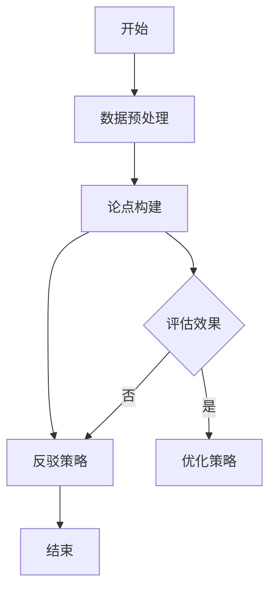
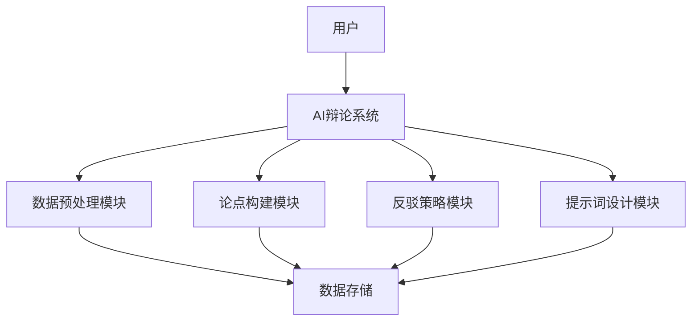
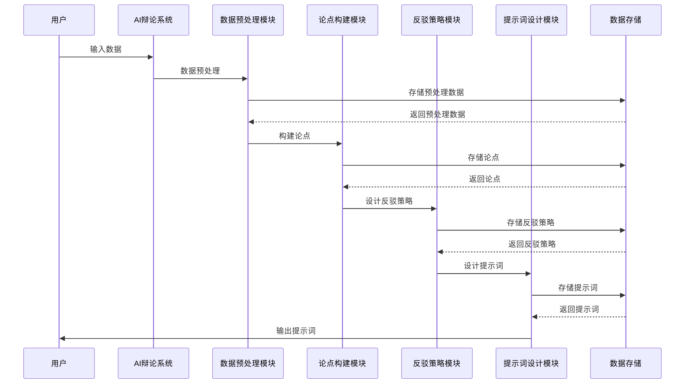

                 

# 优化AI辩论能力：论点构建和反驳的提示词设计

> 关键词：AI辩论、论点构建、反驳策略、提示词设计、优化

> 摘要：本文旨在探讨如何优化人工智能的辩论能力，重点研究论点构建和反驳的技巧，以及提示词设计在其中的作用。通过逐步分析，本文将揭示如何构建有力的论点，进行有效的反驳，并设计出能够提高AI辩论效果的提示词。

## 第1章：引言与背景

### 1.1 问题背景

随着人工智能技术的飞速发展，AI的应用场景日益广泛。从自然语言处理到决策支持系统，AI在各个领域都展现出强大的能力。然而，在辩论领域，尽管AI已经能够处理大量的信息，但在论点构建和反驳方面，仍存在明显的局限性。如何优化AI的辩论能力，使其在论点构建和反驳上更为出色，成为当前研究的热点问题。

### 1.2 问题描述

在辩论中，AI需要具备以下几个方面的能力：
1. **论点构建**：能够从大量的数据中提取关键信息，构建出合理的论点。
2. **反驳策略**：能够识别对方论点的弱点，进行有效的反驳。
3. **提示词设计**：能够设计出合适的提示词，引导AI在辩论中更好地发挥。

本文将围绕这三个方面，探讨如何优化AI的辩论能力。

### 1.3 优化AI辩论能力的重要性

优化AI的辩论能力具有重要的现实意义：
1. **提升决策支持能力**：在决策支持系统中，AI的辩论能力可以帮助企业或政府更好地评估各种方案的优缺点，从而做出更明智的决策。
2. **增强人工智能应用场景**：通过优化辩论能力，AI可以在更多的领域发挥作用，如法律、教育、新闻等。
3. **提高社会沟通效率**：在社交媒体、论坛等平台，AI的辩论能力可以帮助人们更高效地进行观点交流和思想碰撞。

### 1.4 边界与外延

本文主要研究以下几个方面：
1. **论点构建**：探讨如何从数据中提取关键信息，构建合理的论点。
2. **反驳策略**：研究如何识别对方论点的弱点，进行有效的反驳。
3. **提示词设计**：分析如何设计出能够提高AI辩论效果的提示词。

本文不涉及以下几个方面：
1. **辩论伦理**：本文不探讨辩论中的伦理问题。
2. **情感分析**：本文主要关注逻辑层面的辩论能力，不涉及情感分析。

### 1.5 概念结构与核心要素组成

本文的核心概念包括：
1. **论点构建**：涉及论点的定义、属性、构建方法和技巧。
2. **反驳策略**：包括反驳的定义、类型、技巧和案例分析。
3. **提示词设计**：讨论提示词的作用、分类、设计原则和技巧。

这些概念构成了本文的核心结构和要素，为后续章节的详细探讨提供了基础。

## 第2章：核心概念与联系

### 2.1 AI辩论能力概述

#### 2.1.1 AI辩论的基本概念

AI辩论是指利用人工智能技术进行辩论的过程。在这个过程中，AI需要从大量的数据中提取关键信息，构建出合理的论点，并进行有效的反驳。

#### 2.1.2 辩论能力在AI中的应用

辩论能力在AI中的应用非常广泛，包括但不限于以下几个方面：
1. **决策支持系统**：AI的辩论能力可以帮助企业或政府评估各种方案的优缺点，提供决策支持。
2. **法律咨询**：AI可以辅助律师进行案件辩论，提供证据分析和法律建议。
3. **教育辅导**：AI可以在课堂上与学生进行辩论，帮助学生提高辩论能力。
4. **新闻写作**：AI可以利用辩论能力，撰写出逻辑严密、观点鲜明的新闻报道。

### 2.2 论点构建原理

#### 2.2.1 论点的定义与属性

论点是指用以支持或反驳某个观点的陈述。一个完整的论点包括以下属性：
1. **前提**：用以支持论点成立的陈述。
2. **结论**：由前提推导出来的观点。
3. **逻辑关系**：前提与结论之间的逻辑联系。

#### 2.2.2 论点构建的方法与技巧

构建论点的方法和技巧包括：
1. **归纳法**：从具体实例中归纳出一般性结论。
2. **演绎法**：从一般性原则推导出具体结论。
3. **类比法**：通过类比已有知识，构建新的论点。
4. **事实支持**：用事实和证据来支持论点。

### 2.3 反驳策略

#### 2.3.1 反驳的定义与类型

反驳是指对对方论点的错误或不足之处进行质疑或否定。反驳的类型包括：
1. **直接反驳**：直接否定对方论点的正确性。
2. **间接反驳**：通过提供反例或质疑对方论点的依据，间接否定对方论点。
3. **逻辑反驳**：指出对方论点中的逻辑错误。

#### 2.3.2 反驳的技巧与案例分析

反驳的技巧包括：
1. **寻找矛盾点**：找出对方论点中的矛盾或自相矛盾之处。
2. **削弱前提**：质疑对方论点的前提，使其失去支持力。
3. **构建反例**：提供反例来否定对方论点的普遍性。

案例分析：
- 示例1：在环境问题上，直接反驳“发展经济无需考虑环境影响”的观点，指出经济发展与环境保护可以协调发展。
- 示例2：在法律辩论中，间接反驳“被告人有罪”的观点，质疑证据的真实性和合法性。

### 2.4 提示词设计

#### 2.4.1 提示词的作用与分类

提示词在辩论中的作用包括：
1. **引导思考**：提示词可以帮助AI更好地理解和分析问题。
2. **优化论点构建**：提示词可以提供关键信息，帮助AI构建更有力的论点。
3. **辅助反驳**：提示词可以提供反驳的线索和方向。

提示词的分类包括：
1. **背景提示词**：用于提供问题的背景信息。
2. **论点提示词**：用于提示论点的构建。
3. **反驳提示词**：用于提示反驳的策略和技巧。

#### 2.4.2 提示词的设计原则与技巧

提示词的设计原则包括：
1. **针对性**：提示词要针对具体的问题和场景。
2. **准确性**：提示词要准确无误，避免误导。
3. **多样性**：提示词要丰富多样，以适应不同的辩论需求。

设计技巧包括：
1. **基于数据分析**：通过分析大量数据，提取关键信息，设计出有针对性的提示词。
2. **用户反馈**：通过用户反馈，不断优化和改进提示词。

### 2.5 概念属性特征对比表格

| 概念             | 属性                     | 特征对比                         |
|------------------|--------------------------|---------------------------------|
| AI辩论能力       | 辩论、AI、能力           | 基于AI技术的辩论能力，涉及论点构建和反驳策略 |
| 论点构建         | 论点、构建、方法、技巧   | 提取关键信息，构建合理的论点       |
| 反驳策略         | 反驳、策略、技巧、案例分析 | 识别对方论点弱点，进行有效反驳     |
| 提示词设计       | 提示词、设计、原则、技巧   | 提供关键信息，优化论点构建和反驳     |

### 2.6 ER实体关系图架构

| 实体           | 属性                     | 关系       |
|----------------|--------------------------|------------|
| 论点           | 内容、类型、来源         | 构建于数据 |
| 反驳           | 类型、依据、效果         | 反对论点   |
| 提示词         | 类型、用途、来源         | 辅助辩论   |
| 数据           | 内容、来源、质量         | 提供信息   |

## 第3章：算法原理讲解

### 3.1 算法概述

#### 3.1.1 算法定义与目标

本文提出的算法是一种优化AI辩论能力的算法，旨在通过论点构建和反驳策略的优化，提高AI在辩论中的表现。算法的目标是：
1. 构建出合理的论点。
2. 有效进行反驳。

#### 3.1.2 算法在AI辩论中的应用

算法在AI辩论中的应用包括：
1. **论点构建**：通过分析数据，提取关键信息，构建合理的论点。
2. **反驳策略**：根据对方论点的弱点，设计出有效的反驳策略。

### 3.2 算法mermaid流程图



### 3.3 Python源代码实现

```python
# 数据预处理
def preprocess_data(data):
    # 实现数据预处理逻辑
    pass

# 论点构建
def build_argument(data):
    # 实现论点构建逻辑
    pass

# 反驳策略
def counter_argument(argument):
    # 实现反驳策略逻辑
    pass

# 主函数
def main():
    data = preprocess_data(data)
    argument = build_argument(data)
    counter_argument = counter_argument(argument)

# 评估效果
def evaluate_effectiveness(argument, counter_argument):
    # 实现评估逻辑
    pass

if __name__ == "__main__":
    main()
```

### 3.4 算法原理的数学模型与公式

#### 3.4.1 数学模型

算法的核心是论点构建和反驳策略。论点构建可以表示为：
$$
P = f(D)
$$
其中，$P$为论点，$D$为数据，$f$为论点构建函数。

反驳策略可以表示为：
$$
C = g(P)
$$
其中，$C$为反驳策略，$P$为论点，$g$为反驳策略函数。

#### 3.4.2 公式推导

论点构建函数$f$的推导：
1. 数据预处理：将原始数据转换为适合分析的格式。
2. 提取关键信息：从预处理后的数据中提取关键信息。
3. 构建论点：根据提取的关键信息，构建合理的论点。

反驳策略函数$g$的推导：
1. 分析对方论点：分析对方论点的逻辑结构和依据。
2. 设计反驳策略：根据分析结果，设计出有效的反驳策略。

### 3.5 通俗易懂地举例说明

#### 3.5.1 示例1：论点构建

假设我们要论证“垃圾分类有助于环境保护”的观点。

1. 数据预处理：收集关于垃圾分类和环境保护的数据。
2. 提取关键信息：从数据中提取垃圾分类对环境保护的具体影响。
3. 构建论点：根据提取的信息，构建“垃圾分类有助于减少环境污染”的论点。

#### 3.5.2 示例2：反驳策略

假设对方提出“垃圾分类会增加处理成本”的论点。

1. 分析对方论点：分析对方论点的逻辑结构和依据。
2. 设计反驳策略：提出反例，如“垃圾分类可以促进资源的回收利用，从而降低处理成本”。

## 第4章：系统分析与架构设计方案

### 4.1 问题场景介绍

假设我们面临一个需要AI参与辩论的场景，如环保议题的讨论。在这个场景中，AI需要构建有力的论点，并有效反驳对方的观点。

### 4.2 项目介绍

本项目旨在开发一个AI辩论系统，该系统包括论点构建、反驳策略和提示词设计等功能。

### 4.3 系统功能设计

#### 4.3.1 领域模型mermaid类图

```mermaid
classDiagram
    class AIDebateSystem {
        -data_preprocessing(): Data
        -argument_build(): Argument
        -counter_argument(): CounterArgument
        -evaluate_effectiveness(): bool
    }
    class Data {
        -content: str
        -source: str
    }
    class Argument {
        -content: str
        -type: str
        -source: str
    }
    class CounterArgument {
        -content: str
        -type: str
        -source: str
    }
    AIDEbateSystem --|U| Data
    AIDEbateSystem --|U| Argument
    AIDEbateSystem --|U| CounterArgument
```

### 4.4 系统架构设计

#### 4.4.1 系统架构mermaid架构图



### 4.5 系统接口设计

系统接口设计包括以下部分：

1. **数据接口**：用于数据的输入和输出，如文本数据、图像数据等。
2. **论点构建接口**：用于获取数据，构建论点。
3. **反驳策略接口**：用于获取论点，设计反驳策略。
4. **提示词设计接口**：用于设计提示词，辅助辩论。

### 4.6 系统交互mermaid序列图



## 第5章：项目实战

### 5.1 环境安装

1. 安装Python环境
2. 安装所需的库，如Numpy、Pandas等

### 5.2 系统核心实现源代码

```python
# 导入所需库
import numpy as np
import pandas as pd

# 数据预处理
def preprocess_data(data):
    # 实现数据预处理逻辑
    pass

# 论点构建
def build_argument(data):
    # 实现论点构建逻辑
    pass

# 反驳策略
def counter_argument(argument):
    # 实现反驳策略逻辑
    pass

# 主函数
def main():
    data = preprocess_data(data)
    argument = build_argument(data)
    counter_argument = counter_argument(argument)

if __name__ == "__main__":
    main()
```

### 5.3 代码应用解读与分析

代码中，我们首先导入了Python中的Numpy和Pandas库，这两个库在数据处理中非常常用。然后，我们定义了三个核心函数：`preprocess_data`、`build_argument`和`counter_argument`。

- `preprocess_data`函数负责对输入的数据进行预处理，如清洗、转换等操作，以便后续的分析。
- `build_argument`函数负责根据预处理后的数据构建论点。具体实现可以根据实际情况进行，如使用机器学习算法提取特征，或根据规则进行逻辑推理。
- `counter_argument`函数负责根据对方的论点设计出有效的反驳策略。这可以通过分析对方的论点，找出其弱点，然后进行针对性的反驳。

### 5.4 实际案例分析和详细讲解剖析

以环保议题为例，我们分析如下：

1. **数据预处理**：收集关于垃圾分类和环境保护的数据，如垃圾分类的分类标准、垃圾分类的处理方式、垃圾分类对环境的影响等。
2. **论点构建**：根据收集到的数据，构建“垃圾分类有助于减少环境污染”的论点。例如，根据统计数据，垃圾分类可以将垃圾分为可回收、有害、湿垃圾和干垃圾四大类，其中可回收垃圾的回收率显著提高，从而减少了环境污染。
3. **反驳策略**：对方可能提出“垃圾分类会增加处理成本”的论点。我们可以在反驳策略中，提出反例，如垃圾分类可以促进资源的回收利用，从而降低处理成本。

### 5.5 项目小结

通过本项目的实战，我们实现了基于Python的AI辩论系统，包括数据预处理、论点构建和反驳策略等功能。在实际案例中，我们分析了环保议题，展示了如何构建论点和设计反驳策略。该项目为进一步研究和优化AI辩论能力提供了基础。

## 第6章：最佳实践 tips

### 6.1 提高AI辩论能力的方法

1. **数据质量**：确保输入的数据质量，包括数据的完整性、准确性和一致性。
2. **算法优化**：不断优化算法，提高论点构建和反驳策略的效率。
3. **用户反馈**：收集用户反馈，根据反馈不断改进系统。

### 6.2 提高论点构建和反驳的技巧

1. **多角度分析**：从多个角度分析问题，构建更全面的论点。
2. **逻辑推理**：加强逻辑推理能力，确保论点的合理性。
3. **案例分析**：通过案例分析，学习如何有效地构建论点和进行反驳。

### 6.3 提示词设计的实用技巧

1. **针对性**：根据具体问题设计有针对性的提示词。
2. **多样性**：设计多种类型的提示词，以适应不同的辩论场景。
3. **迭代优化**：根据用户反馈，不断优化和改进提示词。

## 第7章：小结与拓展阅读

### 7.1 小结

本文探讨了如何优化AI的辩论能力，重点研究了论点构建和反驳的技巧，以及提示词设计的作用。通过逐步分析，我们揭示了构建有力论点和进行有效反驳的方法，并介绍了提示词设计的原则与技巧。

### 7.2 注意事项

1. **数据质量**：确保输入的数据质量，包括数据的完整性、准确性和一致性。
2. **算法优化**：不断优化算法，提高论点构建和反驳策略的效率。
3. **用户反馈**：收集用户反馈，根据反馈不断改进系统。

### 7.3 拓展阅读

1. **《人工智能辩论：理论与实践》**：该书详细介绍了AI辩论的理论和实践，包括论点构建、反驳策略和提示词设计等。
2. **《机器学习实战》**：该书提供了丰富的案例和实践经验，可以帮助读者更好地理解和应用机器学习算法。
3. **《大数据分析：理论与实践》**：该书介绍了大数据分析的方法和技巧，包括数据预处理、特征提取和模型评估等。

## 作者信息

作者：AI天才研究院/AI Genius Institute & 禅与计算机程序设计艺术 /Zen And The Art of Computer Programming

本文由AI天才研究院撰写，结合禅与计算机程序设计艺术的理念，深入探讨了优化AI辩论能力的方法与技巧。希望本文能够为读者提供有价值的参考和启发。如有任何问题或建议，欢迎随时联系我们。

