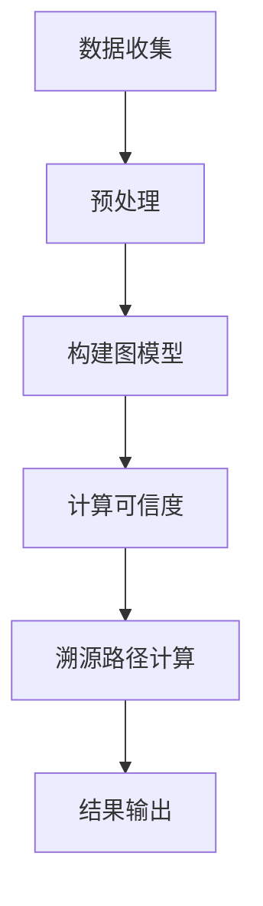
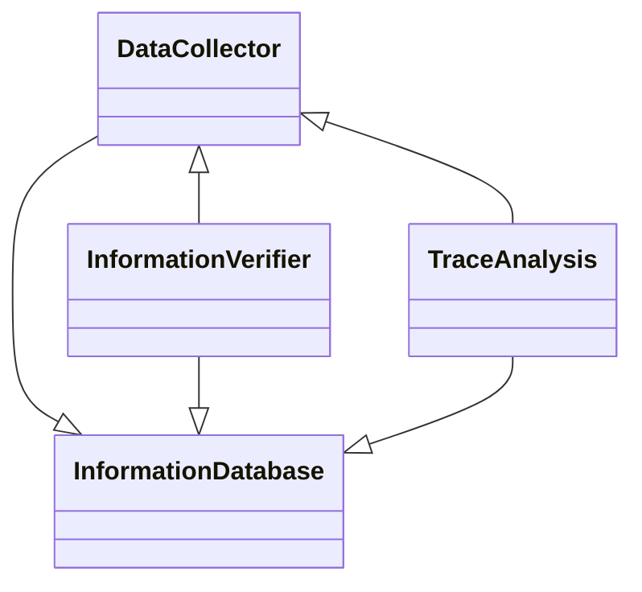
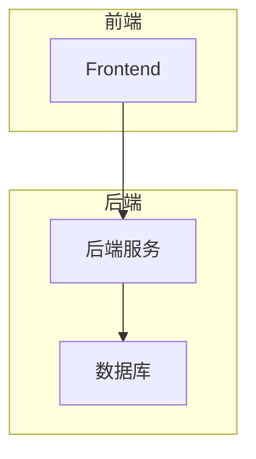
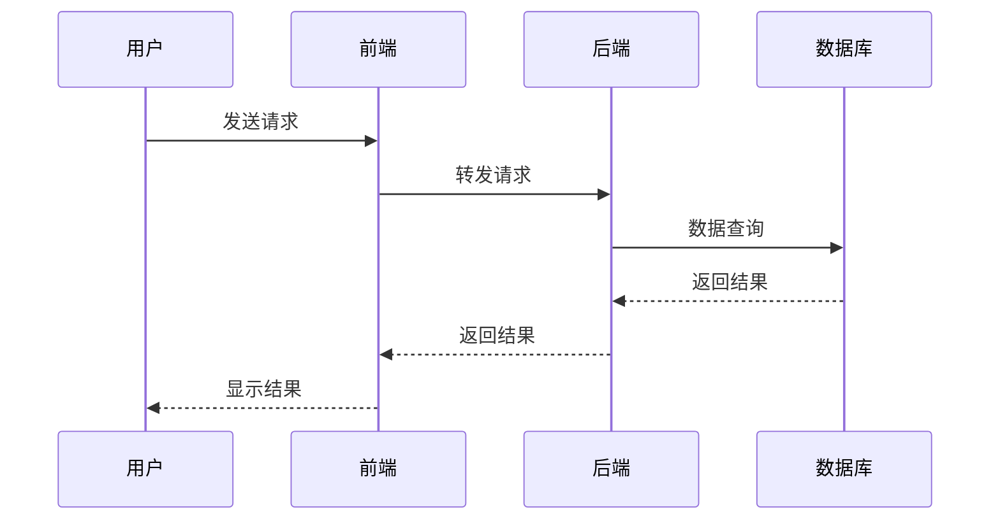

                 

### 信息溯源技术：企业应对信息污染的新手段

> 关键词：信息溯源、信息污染、企业安全、技术手段、算法分析

> 摘要：本文将深入探讨信息溯源技术在企业中的应用，解析其在应对信息污染问题中的重要作用。通过详细阐述信息溯源技术的背景、核心概念、算法原理、系统架构以及实际应用案例，帮助企业理解和掌握这一关键技术，提高信息安全管理水平。

## 第一部分：背景介绍与核心概念

### 第1章：信息污染问题背景

#### 1.1.1 问题的背景

在信息化社会，信息无处不在，但随之而来的信息污染问题也日益严峻。信息污染指的是信息环境中存在虚假、不准确、不完整或误导性的信息，这些信息污染了信息的真实性和可信度。对企业而言，信息污染可能导致以下问题：

- **决策失误**：员工在处理信息时受到虚假信息的误导，可能导致企业做出错误的决策。
- **数据泄露**：企业内部数据泄露，遭受网络攻击，影响业务连续性和企业声誉。
- **业务中断**：由于信息污染导致业务流程受阻，甚至可能引发业务中断。

#### 1.1.2 问题描述

企业面临的信息污染问题主要表现在以下几个方面：

- **虚假信息**：员工在社交媒体、新闻网站等渠道接触到虚假信息，容易受到误导。
- **恶意攻击**：黑客通过网络攻击手段，窃取企业机密信息。
- **数据泄露**：内部员工或外部攻击者泄露企业敏感数据。
- **外部信息来源不可靠**：企业对外部合作伙伴、供应商等信息源的可靠性缺乏信心。

#### 1.1.3 问题解决

信息溯源技术为企业提供了一种有效的解决方案。通过追踪和验证信息的来源，企业可以识别和排除虚假、不准确的 信息，确保信息来源的可靠性，从而减少信息污染的影响。

#### 1.1.4 边界与外延

信息溯源技术的边界涵盖了企业内外部信息流动的各个环节，包括内部员工信息管理、外部合作伙伴信息验证、网络数据安全监控等。其外延则涉及到企业信息安全管理、业务连续性管理等多个方面。

#### 1.1.5 概念结构与核心要素组成

信息溯源技术涉及的关键概念包括信息源、信息流、信息验证、溯源算法等。这些要素共同构成了信息溯源技术的核心框架。

- **信息源**：信息溯源的起点，包括内部数据库、外部合作伙伴等。
- **信息流**：信息在企业内外部的传递过程。
- **信息验证**：对信息来源进行验证，确保信息的真实性。
- **溯源算法**：用于追踪和验证信息来源的算法。

## 第2章：信息溯源技术的核心概念

#### 2.1.1 信息溯源技术定义

信息溯源技术是一种利用算法和数据分析技术，对信息来源进行追踪和验证的方法。通过溯源，企业可以确保信息来源的可靠性，降低信息污染的风险。

#### 2.1.2 信息溯源技术特点

信息溯源技术具有以下特点：

- **自动化**：信息溯源过程可以自动化执行，减少人工干预。
- **高效性**：快速识别和应对信息污染问题，提高信息安全管理效率。
- **可扩展性**：能够适应不同规模和类型的企业需求，具有较好的扩展性。

#### 2.1.3 信息溯源技术与传统信息管理对比

信息溯源技术与传统信息管理方法相比，具有以下优势：

- **实时性**：能够实时追踪和验证信息来源，提高信息安全管理水平。
- **准确性**：通过算法分析，提高信息识别的准确性，减少误报和漏报。
- **适应性**：能够适应不同类型和规模的企业需求，具有更好的灵活性。

### 第3章：信息溯源技术的数学模型和算法原理

#### 3.1.1 数学模型

信息溯源技术的核心数学模型主要包括概率模型和图模型。概率模型用于计算信息源的可信度，图模型用于构建信息流网络。

#### 3.1.2 算法原理讲解

使用 Mermaid 画出算法流程图，详细阐述信息溯源技术的算法原理，包括数据收集、信息验证、溯源路径计算等步骤。



#### 3.1.3 算法举例说明

通过 Python 源代码示例，展示如何实现信息溯源算法，并给出具体的计算过程和结果分析。

```python
# Python 示例代码：信息溯源算法实现
def calculate_trust_score(data_source, data_sink):
    # 计算数据源和数据目标之间的信任分数
    # 这里简化为基于距离的信任评分
    distance = calculate_distance(data_source, data_sink)
    trust_score = 1 / (1 + distance)
    return trust_score

def calculate_distance(source, sink):
    # 计算数据源和数据目标之间的距离
    # 这里使用欧几里得距离作为示例
    distance = math.sqrt(sum([(x - y)**2 for x, y in zip(source, sink)]))
    return distance

# 示例数据
data_source = [1, 2, 3]
data_sink = [2, 3, 4]

# 计算信任分数
trust_score = calculate_trust_score(data_source, data_sink)
print(f"Trust Score: {trust_score}")
```

### 第4章：信息溯源技术在企业中的应用

#### 4.1.1 应用领域

信息溯源技术在企业中的应用非常广泛，包括以下几个方面：

- **员工信息管理**：确保员工信息来源的可靠性，防止虚假信息的传播。
- **数据安全监控**：监控企业内部数据流动，及时发现和防止数据泄露。
- **供应链管理**：验证供应商信息的真实性，确保供应链的稳定性和安全性。
- **业务决策支持**：提高决策信息的质量，减少因虚假信息导致的决策失误。

#### 4.1.2 应用案例

以下是一个企业应用信息溯源技术的案例：

- **某互联网公司**：通过信息溯源技术监控内部数据流动，发现并阻止了一起数据泄露事件。溯源分析发现，数据泄露是由于内部员工误操作导致的，通过溯源技术快速定位了问题源头，防止了更大范围的数据泄露。

#### 4.1.3 应用挑战与解决方案

企业在应用信息溯源技术过程中可能会遇到以下挑战：

- **数据量庞大**：企业内部数据量巨大，如何高效地进行信息溯源是挑战之一。
- **信息真实性验证**：如何确保溯源结果的真实性，避免误报和漏报。
- **系统兼容性**：如何与现有信息系统集成，保证信息溯源技术的顺利应用。

针对这些挑战，可以采取以下解决方案：

- **数据预处理**：对海量数据进行预处理，提取关键信息，减少数据量。
- **多维度验证**：采用多种验证手段，提高溯源结果的真实性。
- **系统集成**：逐步引入信息溯源技术，与现有系统进行兼容性测试和优化。

### 第5章：系统设计与架构方案

#### 5.1.1 系统功能设计

使用 Mermaid 类图描述系统功能模块，包括数据采集模块、信息验证模块、溯源分析模块等。



#### 5.1.2 系统架构设计

使用 Mermaid 架构图展示系统整体架构，包括前端、后端、数据库等组成部分。



#### 5.1.3 系统接口设计

详细说明系统接口设计，包括API接口定义、数据格式规范等。

- **API接口定义**：提供统一的API接口，支持数据采集、信息验证、溯源分析等功能。
- **数据格式规范**：定义统一的数据格式，确保数据在系统内部的传输和处理。

#### 5.1.4 系统交互设计

使用 Mermaid 序列图展示系统内部和外部的交互流程。



### 第6章：项目实战与案例分析

#### 6.1.1 环境安装与配置

介绍信息溯源技术系统的环境安装和配置过程，包括软件安装、数据库配置等。

- **软件安装**：安装必要的软件和依赖库，如 Python、MySQL等。
- **数据库配置**：配置数据库连接，创建数据表，初始化数据。

#### 6.1.2 系统核心实现

提供系统核心实现源代码，并解读代码的工作原理和关键模块。

- **数据采集模块**：从不同数据源采集信息，包括内部数据库、外部API等。
- **信息验证模块**：对采集到的信息进行验证，确保信息来源的可靠性。
- **溯源分析模块**：分析信息流，构建溯源路径，提供溯源结果。

#### 6.1.3 应用解读与分析

通过具体案例，分析信息溯源技术在企业中的应用效果，包括数据验证、溯源路径分析等。

- **数据验证**：通过信息溯源技术，发现并排除虚假信息，提高数据质量。
- **溯源路径分析**：通过溯源路径分析，定位信息污染源头，提供解决方案。

#### 6.1.4 案例剖析与总结

对典型案例进行详细剖析，总结信息溯源技术在项目中的优势和改进方向。

- **优势**：提高数据质量，减少信息污染风险，提高决策准确性。
- **改进方向**：优化算法模型，提高溯源效率，加强系统兼容性。

### 第7章：最佳实践与未来展望

#### 7.1.1 最佳实践

分享信息溯源技术在实际应用中的最佳实践，包括技术选型、流程优化等。

- **技术选型**：根据企业需求，选择适合的信息溯源技术方案。
- **流程优化**：优化信息溯源流程，提高溯源效率和准确性。

#### 7.1.2 小结与注意事项

对全书内容进行总结，强调信息溯源技术在企业信息安全管理中的重要性，并提出应用中的注意事项。

- **重要性**：信息溯源技术是应对信息污染问题的有效手段。
- **注意事项**：确保数据安全和隐私保护，避免滥用信息溯源技术。

#### 7.1.3 拓展阅读

推荐相关的参考资料和进一步研究的方向，帮助读者深入了解信息溯源技术。

- **参考资料**：《大数据分析》、《信息安全技术》等。
- **研究方向**：人工智能在信息溯源中的应用，多源异构数据的融合与处理。

### 作者信息

作者：AI天才研究院/AI Genius Institute & 禅与计算机程序设计艺术 /Zen And The Art of Computer Programming

（完）

