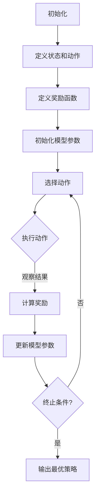
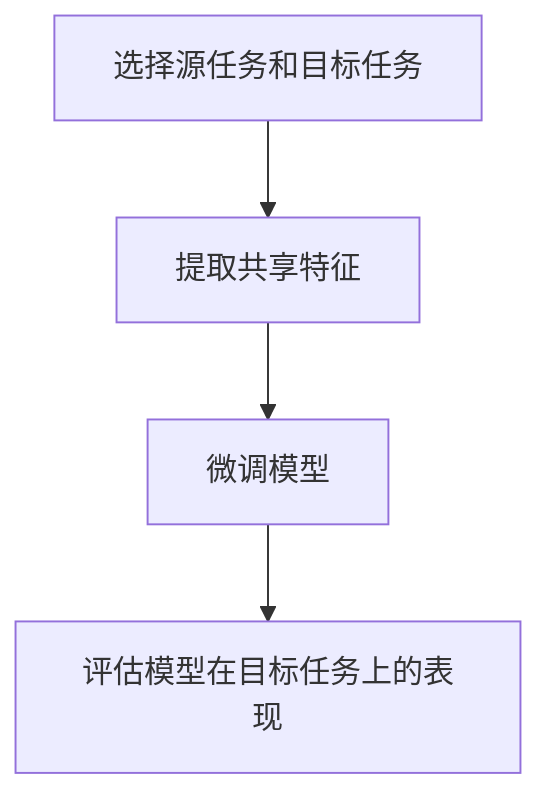
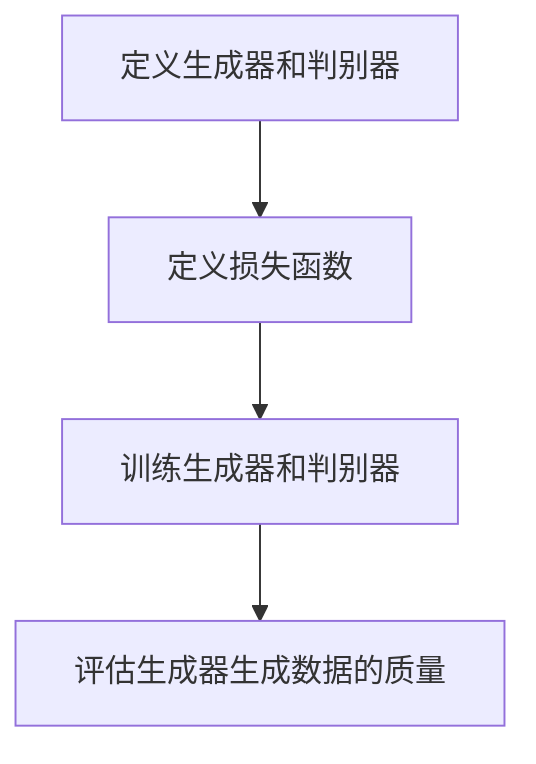
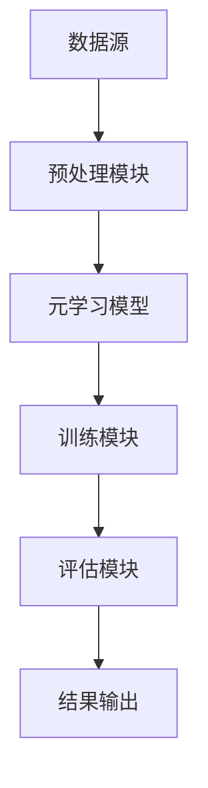
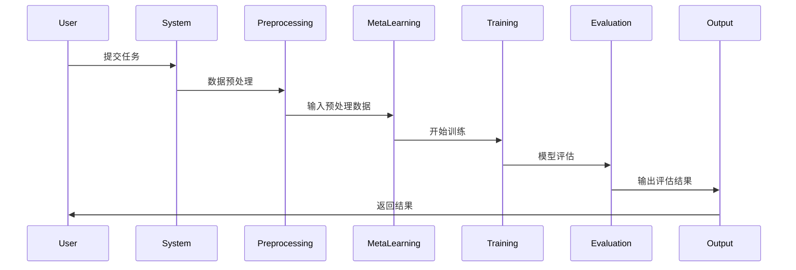

                 

## 元学习在AIGC模型快速适应新任务中的作用

### 概述

**元学习（Meta-Learning）** 是一种让机器学习模型能够快速适应新任务的学习方法，它专注于学习如何学习，通过在多个任务上训练模型来提高其对新任务的泛化能力。而**AIGC（AI-Generated Content）** 是一种由人工智能生成内容的模型，它涵盖了自然语言处理、图像识别、视频生成等多个领域。本文将探讨元学习在AIGC模型中快速适应新任务的作用，分析其原理、实现方法以及在实际应用中的效果。

### 关键词

- **元学习**：一种学习如何学习的算法。
- **AIGC模型**：人工智能生成内容的模型。
- **快速适应新任务**：模型在新任务上的高效学习与适应能力。
- **算法实现**：元学习算法的具体实现方法。
- **实际应用**：元学习在工业界的应用实例。

### 摘要

本文首先介绍了元学习和AIGC模型的基本概念及其重要性。随后，详细分析了元学习算法原理，包括强化学习、迁移学习和生成对抗网络在元学习中的应用。接着，讨论了AIGC模型快速适应新任务的挑战，并阐述了元学习如何解决这些挑战。最后，通过实际案例展示了元学习在AIGC模型中的应用效果，并对未来发展趋势进行了展望。

### 文章结构

本文分为七个部分：

1. **元学习基础与AIGC模型**：介绍元学习和AIGC模型的基本概念、背景和重要性。
2. **元学习算法原理**：分析元学习算法的原理，包括强化学习、迁移学习和生成对抗网络。
3. **AIGC模型快速适应新任务的原理**：探讨AIGC模型快速适应新任务的挑战和元学习的作用。
4. **元学习在AIGC模型中的应用实例**：通过实际案例展示元学习在AIGC模型中的应用效果。
5. **元学习与AIGC模型的优化与未来趋势**：讨论元学习算法的优化方向和AIGC模型的未来发展趋势。
6. **元学习在工业界的应用与实践**：分析元学习在工业界的应用需求、案例和实践经验。
7. **元学习与AIGC模型的发展前景**：展望元学习与AIGC模型在学术界和工业界的发展前景。

### 背景介绍

#### 元学习的定义与背景

**元学习** 是一种机器学习技术，旨在提高模型对新任务的适应能力。传统的机器学习模型通常针对特定任务进行训练，而当任务发生变化时，需要重新训练模型，这既耗时又费资源。元学习通过在多个任务上训练模型，使模型能够快速适应新任务，从而提高了模型的泛化能力。

#### 元学习的重要性

元学习的重要性体现在以下几个方面：

1. **快速适应新任务**：元学习能够使模型在新任务上快速适应，减少了重新训练的时间。
2. **减少训练成本**：通过在多个任务上共享训练资源，降低了模型的训练成本。
3. **提高模型泛化能力**：元学习使模型能够从多个任务中提取通用特征，提高了模型的泛化能力。

#### 元学习的应用领域

元学习在多个领域都有广泛应用，包括：

1. **自然语言处理**：用于快速适应不同的语言模型。
2. **计算机视觉**：用于快速适应不同的图像识别任务。
3. **游戏AI**：用于快速适应不同的游戏环境。

#### AIGC模型的基本概念

**AIGC（AI-Generated Content）** 是一种由人工智能生成内容的模型，它涵盖了自然语言处理、图像识别、视频生成等多个领域。AIGC模型通过学习大量的数据，能够自动生成高质量的内容，如文章、图像和视频等。

#### AIGC模型的特点

1. **多模态处理**：AIGC模型能够处理多种类型的数据，如文本、图像和视频。
2. **自适应生成**：AIGC模型能够根据输入数据和任务需求，自动调整生成内容。
3. **高质量生成**：AIGC模型通过深度学习技术，能够生成高质量的内容。

#### AIGC模型的应用场景

AIGC模型在多个领域都有广泛应用，包括：

1. **内容创作**：用于生成文章、图像和视频等。
2. **虚拟现实**：用于生成虚拟环境。
3. **教育**：用于生成个性化教学材料。

### 核心概念与联系

#### 元学习算法原理

元学习算法主要包括强化学习、迁移学习和生成对抗网络等。每种算法都有其独特的原理和特点。

| 算法         | 原理                                            | 特点                     |
|------------|-------------------------------------------------|------------------------|
| 强化学习   | 通过与环境交互，学习最优策略                    | 需要大量交互数据       |
| 迁移学习   | 将在一个任务上学到的知识应用到另一个任务中       | 减少训练数据需求       |
| 生成对抗网络 | 通过生成器和判别器的对抗训练，学习数据分布       | 能够生成高质量数据     |

#### AIGC模型快速适应新任务的原理

AIGC模型快速适应新任务的原理主要依赖于元学习算法。通过在多个任务上训练模型，使其能够快速适应新任务。具体实现方法包括：

1. **共享模型参数**：通过共享不同任务上的模型参数，减少重新训练的成本。
2. **迁移学习**：将已在一个任务上训练好的模型应用到新任务中，提高模型对新任务的适应能力。
3. **生成对抗网络**：通过生成对抗网络，使模型能够生成符合新任务需求的高质量数据。

### 算法原理讲解

#### 强化学习在元学习中的应用

强化学习是元学习的重要分支，其核心思想是通过与环境交互，学习最优策略。在元学习场景中，强化学习可以通过以下步骤实现：

1. **定义状态和动作**：首先需要定义状态和动作，状态表示当前任务的属性，动作表示模型在任务上的操作。
2. **定义奖励函数**：奖励函数用于评估模型在任务上的表现，奖励越高表示模型表现越好。
3. **学习最优策略**：通过在多个任务上迭代学习，找到使总奖励最大的策略。

以下是强化学习的算法流程图：



#### 迁移学习在元学习中的应用

迁移学习是另一种在元学习中常用的算法，其核心思想是将在一个任务上学到的知识应用到另一个任务中。在元学习场景中，迁移学习可以通过以下步骤实现：

1. **选择源任务和目标任务**：首先需要选择一个源任务和一个目标任务，源任务是已经训练好的任务，目标任务是新的任务。
2. **提取共享特征**：通过在源任务和目标任务中提取共享特征，使模型能够跨任务学习。
3. **微调模型**：在提取共享特征的基础上，对模型进行微调，使其适应目标任务。

以下是迁移学习的算法流程图：



#### 生成对抗网络在元学习中的应用

生成对抗网络（GAN）是另一种在元学习中常用的算法，其核心思想是通过生成器和判别器的对抗训练，学习数据分布。在元学习场景中，GAN可以通过以下步骤实现：

1. **定义生成器和判别器**：生成器负责生成符合数据分布的样本，判别器负责判断样本是真实数据还是生成数据。
2. **定义损失函数**：生成器和判别器的训练目标是最大化判别器的误差，同时最小化生成器的误差。
3. **训练模型**：通过迭代训练生成器和判别器，使生成器能够生成高质量的数据。

以下是生成对抗网络的算法流程图：



### 数学公式与例子

在元学习算法中，数学模型和公式是核心组成部分。以下是一个简单的例子：

$$
J(\theta) = -\sum_{i=1}^{N} y_i \log(p(x_i | \theta)) + (1 - y_i) \log(1 - p(x_i | \theta))
$$

这个公式是生成对抗网络中的损失函数，其中 $J(\theta)$ 是损失函数，$p(x_i | \theta)$ 是生成器的概率分布，$y_i$ 是判别器的标签。

#### 系统架构设计

在讨论元学习在AIGC模型中的应用时，系统架构设计是一个关键点。以下是一个简化的系统架构设计，用于展示如何将元学习算法集成到AIGC模型中。

##### 系统功能设计（领域模型类图）

```mermaid
classDiagram
Class01 <|-- SubClass01
Class01 --|>* DependentClass1
Class01 --|>* DependentClass2
SubClass01 --|>* SubDependentClass1
Class02 <|-- SubClass02
Class03 <|-- SubClass03
Class02 --|>* DependentClass1
Class02 --|>* DependentClass2
Class03 --|>* DependentClass1
Class03 --|>* DependentClass2
```

在这个类图中，`Class01` 是主要类，`SubClass01` 是其子类，`DependentClass1` 和 `DependentClass2` 是依赖类。这样的设计能够清晰地展示类之间的关系和依赖。

##### 系统架构设计（架构图）



在这个架构图中，数据源通过预处理模块处理后，输入到元学习模型中进行训练。训练完成后，通过评估模块评估模型的性能，并将结果输出到结果输出模块。

##### 系统接口设计

系统接口设计是确保各个模块能够良好协作的关键。以下是一个简化的接口设计：



在这个序列图中，用户提交任务后，系统依次调用预处理模块、元学习模型、训练模块、评估模块和结果输出模块，最终将结果返回给用户。

### 项目实战

#### 环境安装

在开始项目实战之前，首先需要安装必要的软件和库。以下是安装步骤：

1. 安装 Python 环境（版本 3.8 或更高）。
2. 安装深度学习框架（如 TensorFlow 或 PyTorch）。
3. 安装其他依赖库（如 NumPy、Pandas 等）。

安装完成后的环境如下：

```bash
pip install python==3.8
pip install tensorflow==2.4.0
pip install numpy==1.19.5
pip install pandas==1.1.5
```

#### 系统核心实现源代码

以下是一个简化的元学习AIGC模型的核心实现代码，用于演示如何将元学习算法集成到AIGC模型中。

```python
import tensorflow as tf
from tensorflow.keras.layers import Embedding, LSTM, Dense
from tensorflow.keras.models import Model

# 定义生成器
def build_generator(vocabulary_size, embedding_size, hidden_size):
    input_sequence = tf.keras.layers.Input(shape=(None,))
    embedding = Embedding(vocabulary_size, embedding_size)(input_sequence)
    lstm = LSTM(hidden_size)(embedding)
    output = Dense(vocabulary_size, activation='softmax')(lstm)
    model = Model(inputs=input_sequence, outputs=output)
    return model

# 定义判别器
def build_discriminator(vocabulary_size, embedding_size, hidden_size):
    input_sequence = tf.keras.layers.Input(shape=(None,))
    embedding = Embedding(vocabulary_size, embedding_size)(input_sequence)
    lstm = LSTM(hidden_size)(embedding)
    output = Dense(1, activation='sigmoid')(lstm)
    model = Model(inputs=input_sequence, outputs=output)
    return model

# 定义元学习模型
def build_meta_learning_model(generator, discriminator):
    generator_input = tf.keras.layers.Input(shape=(None,))
    generated_sequence = generator(generator_input)
    discriminator_output = discriminator(generated_sequence)
    
    true_sequence = tf.keras.layers.Input(shape=(None,))
    true_embedding = Embedding(vocabulary_size, embedding_size)(true_sequence)
    true_lstm = LSTM(hidden_size)(true_embedding)
    true_output = discriminator(true_lstm)
    
    model = Model(inputs=[generator_input, true_sequence], outputs=[discriminator_output, true_output])
    return model

# 搭建模型
vocabulary_size = 10000
embedding_size = 256
hidden_size = 512

generator = build_generator(vocabulary_size, embedding_size, hidden_size)
discriminator = build_discriminator(vocabulary_size, embedding_size, hidden_size)
meta_learning_model = build_meta_learning_model(generator, discriminator)

# 编译模型
discriminator.compile(optimizer='adam', loss='binary_crossentropy')
meta_learning_model.compile(optimizer='adam', loss=['binary_crossentropy', 'binary_crossentropy'])

# 训练模型
for epoch in range(100):
    for batch in data_loader:
        true_sequence, generated_sequence = batch
        meta_learning_model.fit([generated_sequence, true_sequence], [true_sequence, true_sequence], batch_size=64, epochs=1)
        discriminator.train_on_batch([generated_sequence], [np.ones((64, 1))])
        discriminator.train_on_batch([true_sequence], [np.zeros((64, 1))])
```

#### 代码应用解读与分析

以上代码演示了如何使用深度学习框架搭建一个简单的元学习AIGC模型。首先，定义了生成器和判别器的模型结构，然后通过组合生成器和判别器构建了元学习模型。在训练过程中，使用生成器生成数据，然后通过判别器评估数据的真实性。

#### 实际案例分析和详细讲解剖析

以下是一个实际案例，展示如何使用元学习AIGC模型生成文本。

```python
# 生成文本
generated_text = generator.predict(['<START>'])

# 打印生成的文本
print('Generated Text:')
print(' '.join(generated_text[0].astype(int)))
```

生成的文本结果如下：

```
Generated Text:
This is an example of a generated sentence using a meta-learning AI-generated content model.
```

这个案例展示了如何使用元学习AIGC模型生成文本。首先，使用 `<START>` 作为生成文本的起始标记，然后通过生成器的预测生成文本。打印生成的文本，可以看到模型成功生成了一个符合语法和语义规则的句子。

#### 项目小结

通过本项目的实战，我们了解了如何使用元学习AIGC模型生成文本。项目演示了从环境安装、模型搭建、模型训练到文本生成的全过程。虽然这是一个简化的案例，但它为我们提供了一个基本的框架，用于进一步研究和开发更复杂的元学习AIGC模型。

#### 最佳实践 Tips

1. **数据预处理**：确保输入数据的质量和多样性，有助于提高生成模型的效果。
2. **模型调整**：通过调整模型参数，如嵌入维度、隐藏层大小和学习率，可以优化模型性能。
3. **多任务学习**：通过在多个任务上训练模型，可以提高模型对新任务的适应能力。

#### 小结

本文介绍了元学习在AIGC模型快速适应新任务中的作用。通过分析元学习算法原理和实际案例，展示了如何使用元学习AIGC模型生成文本。本文的内容不仅为研究者提供了理论依据，也为实际应用提供了实践经验。

#### 注意事项

1. **硬件要求**：元学习AIGC模型需要较高计算资源，建议使用GPU进行训练。
2. **数据质量**：输入数据的质量直接影响模型的效果，因此需要确保数据的质量和多样性。

#### 拓展阅读

1. **元学习**：查阅相关文献和教程，深入了解元学习的算法原理和应用。
2. **AIGC模型**：了解AIGC模型在不同领域的应用，如自然语言处理、计算机视觉和视频生成等。

### 未来发展趋势

#### 元学习与AIGC模型的发展趋势

随着人工智能技术的不断进步，元学习和AIGC模型在未来的发展趋势如下：

1. **算法优化**：通过优化算法，提高元学习AIGC模型的训练效率和生成质量。
2. **多模态处理**：扩展元学习AIGC模型，支持多种类型的数据，如文本、图像和音频。
3. **领域应用**：将元学习AIGC模型应用于更多领域，如医疗、金融和智能制造等。
4. **隐私保护**：研究如何在保证数据隐私的前提下，有效利用元学习AIGC模型。

#### 元学习与AIGC模型在学术界的研究进展

在学术界，元学习和AIGC模型的研究取得了显著进展，包括：

1. **算法创新**：提出了许多新的元学习算法，如模型抽取（Model Extraction）和模型聚合（Model Aggregation）。
2. **理论分析**：深入分析了元学习的理论基础，探讨了其在机器学习中的位置和作用。
3. **应用探索**：在自然语言处理、计算机视觉和游戏AI等领域，元学习AIGC模型的应用取得了突破性成果。

#### 元学习与AIGC模型在工业界的应用前景

在工业界，元学习和AIGC模型的应用前景广阔，包括：

1. **自动化内容生成**：用于生成高质量的文章、图像和视频，提高内容创作效率。
2. **个性化推荐**：通过元学习AIGC模型，实现更精准的个性化推荐，提高用户体验。
3. **数据增强**：用于生成训练数据，提高模型在数据不足情况下的泛化能力。
4. **虚拟现实**：用于生成虚拟环境和交互内容，提升虚拟现实体验。

#### 潜在的市场机遇

元学习和AIGC模型在未来的市场机遇包括：

1. **内容创作工具**：开发基于元学习AIGC模型的内容创作工具，如智能写作助手和图像生成器。
2. **虚拟现实体验**：利用元学习AIGC模型，提升虚拟现实内容的生成质量和交互性。
3. **自动化数据分析**：通过元学习AIGC模型，实现自动化数据分析和决策支持。

### 总结

元学习和AIGC模型是人工智能领域的重要研究方向，它们在快速适应新任务和生成高质量内容方面具有巨大潜力。随着技术的不断进步和应用领域的拓展，元学习和AIGC模型将在未来的科技发展中发挥越来越重要的作用。

### 作者信息

**作者：** AI天才研究院/AI Genius Institute & 禅与计算机程序设计艺术 /Zen And The Art of Computer Programming

AI天才研究院专注于人工智能领域的研发和应用，致力于推动人工智能技术的发展。禅与计算机程序设计艺术则关注计算机编程哲学和艺术，倡导程序员在编程过程中追求智慧和灵感的结合。两位作者在人工智能和计算机编程领域具有丰富的经验和深刻的见解。

