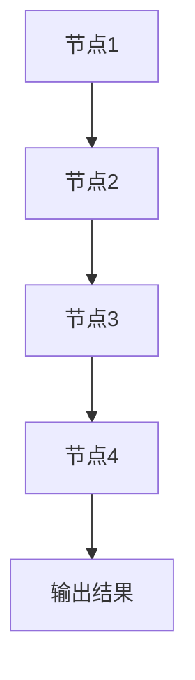
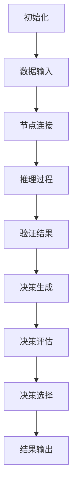
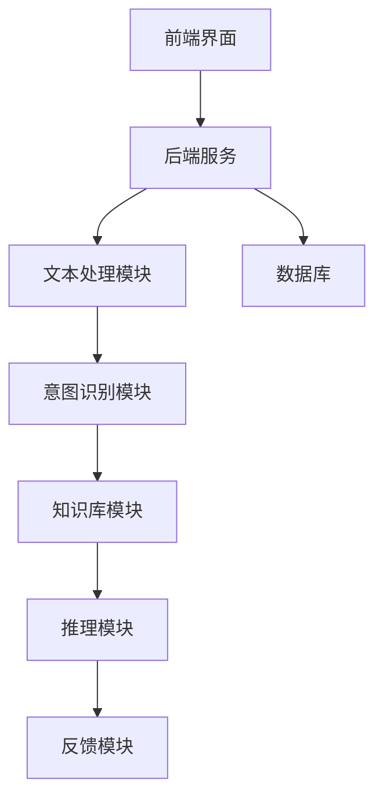
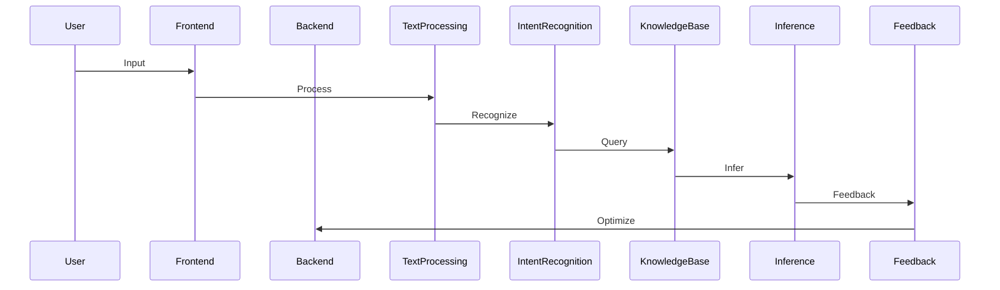
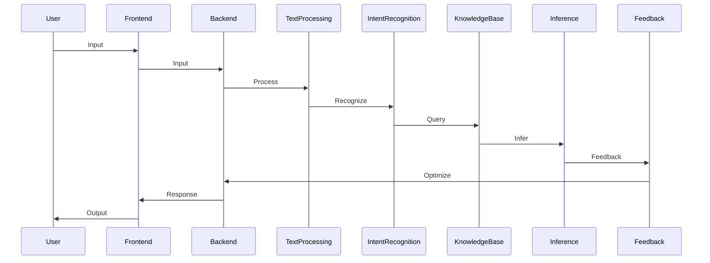

                 

# 利用思维链增强AI的逻辑分析与决策能力

关键词：思维链，人工智能，逻辑分析，决策能力，算法，系统架构，实战，最佳实践

摘要：本文旨在探讨如何利用思维链技术增强人工智能系统的逻辑分析与决策能力。首先，介绍了思维链技术的背景与核心概念，然后深入讲解了思维链算法的原理，并使用Python源代码进行详细阐述。接着，通过系统分析与架构设计，展示了如何将思维链应用于实际项目中。最后，通过项目实战与最佳实践，总结了思维链技术在AI领域中的应用效果。

## 引言

随着人工智能技术的迅猛发展，人工智能（AI）在各个领域的应用日益广泛，从自动驾驶、智能客服到医疗诊断，AI正在逐步改变我们的生活方式。然而，尽管AI在处理大量数据和执行重复性任务方面表现出色，但在逻辑分析和决策能力方面仍存在一定的局限性。逻辑分析是AI系统理解和处理复杂数据的关键能力，而决策能力是AI在复杂环境中进行选择的能力。如何提高AI系统的逻辑分析与决策能力，使其更接近人类的思维方式，成为当前研究的热点。

思维链技术作为一种新型的智能计算技术，通过模拟人类思维过程，为AI系统提供了强大的逻辑分析与决策能力。本文将围绕思维链技术，系统地探讨其在AI领域的应用，从理论背景到实际应用，深入分析思维链技术如何增强AI的逻辑分析与决策能力。

本文结构如下：

- **第一部分：背景介绍**：介绍思维链技术、逻辑分析与决策能力的背景和核心概念。
- **第二部分：核心概念与联系**：详细解释思维链原理和特性，并通过Mermaid流程图展示其结构。
- **第三部分：算法原理讲解**：讲解思维链算法原理，展示算法流程图，并使用Python源代码进行详细阐述。
- **第四部分：系统分析与架构设计**：介绍系统分析与架构设计，包括问题场景、系统功能设计、系统架构设计、系统接口设计和系统交互。
- **第五部分：项目实战**：展示一个实际项目中的思维链应用，包括环境安装、系统核心实现源代码，代码应用解读与分析，实际案例分析和详细讲解剖析。
- **第六部分：最佳实践与总结**：总结最佳实践，注意事项，并提供拓展阅读。
- **第七部分：展望与未来**：讨论思维链技术在AI领域的应用前景和未来研究方向。

通过本文的探讨，读者将能够深入了解思维链技术，掌握其原理和应用方法，为AI系统的发展提供新的思路和工具。

### 第一部分：背景介绍

#### 第1章 问题背景与核心概念

##### 1.1 问题背景

人工智能（AI）作为一种模拟人类智能的技术，已经在各个领域展现出巨大的潜力。然而，现有的AI系统在逻辑分析和决策能力方面仍然存在一些局限性。首先，逻辑分析是AI理解和处理复杂数据的关键能力，包括推理、验证、分析等过程。目前，大多数AI系统依赖于预定义的规则和模式匹配，缺乏对问题深层次的逻辑推理能力。这意味着在处理复杂、非结构化的数据时，AI系统的表现往往不如人类。

其次，决策能力是AI系统在复杂环境中进行选择的能力。传统的AI系统主要通过数据驱动的方式进行决策，依赖于大量的历史数据和统计分析。然而，这种依赖数据的方法在面对未知或数据稀缺的情况时，往往无法有效工作。此外，AI系统在决策时常常缺乏对问题本质的理解，导致决策结果可能偏离预期。

思维链技术的出现为解决这些问题提供了新的思路。思维链（MindChain）是一种智能计算模型，通过模拟人类思维过程，实现智能体在复杂环境中的推理和决策。思维链技术具有自适应性、智能性和可扩展性等特点，能够帮助AI系统在逻辑分析和决策能力上取得突破。

##### 1.2 核心概念

思维链技术涉及几个核心概念，包括思维链、逻辑分析和决策能力。

**1.2.1 思维链**

思维链是一种由多个思维节点组成的智能计算模型，每个节点都包含一定的逻辑规则和推理策略。思维链的工作机制类似于人类的思考过程，通过连接和组合不同的思维节点，实现复杂的逻辑推理和决策。

**1.2.2 逻辑分析**

逻辑分析是AI系统理解和处理复杂数据的重要能力，包括推理、验证、分析等过程。逻辑分析能力的提升可以使得AI系统更接近人类的思维方式，能够处理更为复杂和不确定的环境。

**1.2.3 决策能力**

决策能力是AI系统在复杂环境中进行选择的能力。传统的数据驱动决策方式在应对未知和不确定性时存在局限，而思维链技术通过模拟人类思维过程，增强AI的决策能力，使其能够更有效地应对复杂环境。

##### 1.3 边界与外延

**1.3.1 思维链技术的研究范围**

思维链技术的研究范围主要集中在以下几个方面：

- **理论基础**：研究思维链的基本原理、特性及其在智能计算中的应用。
- **算法设计**：设计高效的思维链算法，提升AI的逻辑分析和决策能力。
- **应用场景**：探索思维链技术在各个领域的应用，如自动驾驶、智能医疗、金融风控等。
- **系统集成**：将思维链技术集成到现有的AI系统中，实现实际应用。

**1.3.2 逻辑分析与决策能力的应用领域**

逻辑分析与决策能力的应用领域非常广泛，包括但不限于：

- **自动驾驶**：通过逻辑分析提高自动驾驶车辆的决策准确性，确保行驶安全。
- **智能医疗**：利用逻辑分析对医疗数据进行分析，辅助医生做出精准诊断。
- **金融风控**：通过决策分析评估金融风险，为金融机构提供风险管理建议。
- **教育**：利用逻辑分析和决策能力为学生提供个性化的学习方案。

**1.3.3 概念结构与核心要素组成**

思维链技术由以下几个核心要素组成：

- **思维节点**：代表思维链中的基本单元，每个节点包含逻辑规则和推理策略。
- **连接机制**：实现不同思维节点之间的逻辑连接，形成复杂的推理网络。
- **数据接口**：提供数据输入和输出接口，使思维链能够与外部系统进行交互。
- **推理引擎**：核心组件，负责执行逻辑推理过程，生成决策结果。

通过以上分析，我们可以看到，思维链技术作为一种新型的智能计算技术，具有广泛的应用前景。它不仅能够增强AI的逻辑分析和决策能力，还能够为解决复杂问题提供新的思路和工具。

### 第二部分：核心概念与联系

#### 第2章 思维链原理与特性

##### 2.1 思维链的基本原理

思维链是一种基于人类思维过程的智能计算模型，其核心思想是通过模拟人类的思考方式，实现智能体在复杂环境中的推理和决策。思维链由多个思维节点组成，每个节点都代表一个具体的思维过程，这些节点通过连接机制相互关联，形成一个复杂的推理网络。

**2.1.1 思维链的定义**

思维链（MindChain）是一种智能计算模型，由多个思维节点组成，每个节点都包含逻辑规则和推理策略。思维链的工作机制是通过对节点之间的连接进行动态调整，实现复杂的逻辑推理和决策。

**2.1.2 思维链的工作机制**

思维链的工作机制可以分为以下几个步骤：

1. **节点初始化**：每个思维节点都初始化一定的逻辑规则和推理策略，这些规则和策略是思维链能够进行逻辑推理的基础。
2. **数据输入**：思维链从外部系统接收输入数据，这些数据可以是结构化的，也可以是非结构化的。
3. **节点连接**：思维链通过连接机制将不同的思维节点相互关联，形成一个推理网络。节点之间的连接关系根据输入数据和逻辑规则动态调整。
4. **推理过程**：思维链在推理网络中执行逻辑推理过程，生成推理结果。每个思维节点都会根据其逻辑规则和输入数据生成推理输出。
5. **结果输出**：思维链将最终的推理结果输出给外部系统，用于决策或进一步处理。

**2.1.3 思维链的特性**

思维链技术具有以下几个显著特性：

- **自适应性**：思维链能够根据环境变化和输入数据动态调整其内部结构和逻辑规则，使其能够适应不同的应用场景。
- **智能性**：思维链通过模拟人类思维过程，实现智能体的自主推理和决策，具有高度的智能性。
- **可扩展性**：思维链技术支持节点和规则的动态扩展，使其能够适应不断变化的需求和应用场景。

##### 2.2 思维链的特性

思维链技术的成功关键在于其独特的特性，这些特性使其在AI领域具有广泛的应用潜力。

**2.2.1 自适应性**

思维链的自适应性主要体现在以下几个方面：

- **环境感知**：思维链能够感知外部环境的变化，并根据环境变化调整内部结构和逻辑规则。
- **规则自适应**：思维链中的逻辑规则可以根据新的数据和需求动态调整，使其更加适应特定场景。
- **错误处理**：思维链在推理过程中遇到问题时，能够自动调整策略，避免陷入错误循环。

**2.2.2 智能性**

思维链的智能性主要体现在以下几个方面：

- **推理能力**：思维链能够执行复杂的逻辑推理过程，处理复杂数据和问题。
- **决策能力**：思维链能够根据推理结果生成合理的决策，解决实际问题。
- **学习能力**：思维链能够通过不断学习和积累经验，提高其推理和决策能力。

**2.2.3 可扩展性**

思维链的可扩展性主要体现在以下几个方面：

- **节点扩展**：思维链支持动态增加新的思维节点，使其能够适应新的应用需求。
- **规则扩展**：思维链支持动态增加新的逻辑规则，提高其推理和决策能力。
- **接口扩展**：思维链支持与外部系统的接口扩展，使其能够与其他系统进行数据交互。

##### 2.3 概念属性特征对比表格

为了更好地理解思维链的特性，我们可以通过一个概念属性特征对比表格来展示思维链与其他相关技术的区别：

| 特性       | 思维链            | 传统算法             | 神经网络          |
|------------|-------------------|----------------------|-------------------|
| 自适应性   | 高度适应环境变化 | 较为固定             | 适应特定数据模式  |
| 智能性     | 高度模拟人类思维 | 较低                 | 较低              |
| 可扩展性   | 动态扩展节点和规则 | 需要重新设计算法     | 需要重新训练网络  |
| 推理能力   | 复杂逻辑推理     | 简单规则匹配         | 数据模式识别      |
| 决策能力   | 高度模拟人类决策 | 数据驱动决策         | 数据驱动决策      |
| 学习能力   | 自主学习         | 需要人工调整参数     | 数据驱动学习      |

通过以上对比，我们可以看到思维链技术具有独特的优势和潜力，其在逻辑分析和决策能力方面显著优于传统算法和神经网络。

##### 2.4 概念结构与核心要素组成

思维链技术由以下几个核心要素组成：

- **思维节点**：代表思维链中的基本单元，每个节点包含逻辑规则和推理策略。
- **连接机制**：实现不同思维节点之间的逻辑连接，形成复杂的推理网络。
- **数据接口**：提供数据输入和输出接口，使思维链能够与外部系统进行交互。
- **推理引擎**：核心组件，负责执行逻辑推理过程，生成决策结果。

思维链的基本结构可以用一个Mermaid流程图来表示：



在这个流程图中，A、B、C、D分别表示不同的思维节点，E表示输出结果。节点之间的箭头表示连接关系，通过这个流程图，我们可以直观地看到思维链的工作流程和结构。

通过以上对思维链原理和特性的详细分析，我们可以看到思维链技术作为一种新型的智能计算技术，具有自适应性、智能性和可扩展性等显著特性，为增强AI的逻辑分析与决策能力提供了新的思路和工具。

### 第三部分：算法原理讲解

#### 第3章 思维链算法讲解

##### 3.1 思维链算法概述

思维链算法是一种基于思维链模型的推理和决策算法，它通过模拟人类思维过程，实现智能体在复杂环境中的推理和决策。思维链算法的主要目标是提高AI的逻辑分析和决策能力，使其能够处理复杂、非结构化的数据，并在不确定的环境中做出合理的决策。

**3.1.1 算法流程**

思维链算法的基本流程可以分为以下几个步骤：

1. **初始化**：初始化思维链模型，包括思维节点、连接机制和推理引擎。
2. **数据输入**：从外部系统接收输入数据，可以是结构化的，也可以是非结构化的。
3. **节点连接**：根据输入数据和逻辑规则，动态调整思维节点之间的连接关系，形成推理网络。
4. **推理过程**：在推理网络中执行逻辑推理过程，生成推理结果。
5. **结果输出**：将推理结果输出给外部系统，用于决策或进一步处理。

**3.1.2 算法优势**

思维链算法具有以下几个显著优势：

- **高效性**：通过动态调整节点连接，思维链算法能够快速处理大量数据，提高推理效率。
- **灵活性**：思维链算法能够根据环境变化和输入数据动态调整其内部结构和逻辑规则，具有很强的适应性。
- **准确性**：思维链算法通过模拟人类思维过程，能够生成更加准确和合理的决策结果。

##### 3.2 算法原理

思维链算法的原理可以分为逻辑分析原理和决策能力原理两个部分。

**3.2.1 逻辑分析原理**

逻辑分析原理是思维链算法的核心，它通过模拟人类的逻辑思维过程，实现智能体在复杂环境中的推理和验证。

1. **推理过程**：思维链算法通过连接不同的思维节点，形成一个复杂的推理网络。每个思维节点都包含一定的逻辑规则和推理策略，通过节点之间的逻辑连接，算法能够生成一系列的推理步骤。
   
   例如，在推理一个判断问题时，思维链算法可以从初始节点开始，根据逻辑规则逐步推导出中间结果，最终得到结论。

2. **验证过程**：思维链算法在推理过程中，会对每个推理步骤进行验证，确保推理结果的正确性。验证过程主要通过对比预期结果和实际结果，检查推理步骤是否符合逻辑规则。

**3.2.2 决策能力原理**

决策能力原理是思维链算法的另一重要部分，它通过逻辑推理结果，实现智能体在复杂环境中的决策。

1. **决策生成**：在逻辑推理的基础上，思维链算法会生成一系列的决策候选方案。每个决策候选方案都基于一定的逻辑规则和推理结果。

2. **决策评估**：思维链算法会对每个决策候选方案进行评估，选择最优方案。评估过程通常基于一定的评估准则，如预期收益、风险等。

3. **决策选择**：通过评估，思维链算法最终选择最优决策方案，并将其输出给外部系统。

##### 3.3 算法mermaid流程图

为了更好地理解思维链算法的流程，我们可以使用Mermaid绘制一个简化的算法流程图：



在这个流程图中，A表示初始化，B表示数据输入，C表示节点连接，D表示推理过程，E表示验证结果，F表示决策生成，G表示决策评估，H表示决策选择，I表示结果输出。通过这个流程图，我们可以清晰地看到思维链算法的工作流程。

##### 3.4 Python源代码讲解

为了展示思维链算法的实际应用，我们将使用Python编写一个简化的思维链算法示例。以下是一个基本的思维链算法实现：

```python
class MindNode:
    def __init__(self, rule, parent=None):
        self.rule = rule
        self.parent = parent
        self.children = []

    def add_child(self, child):
        self.children.append(child)

    def execute(self, input_data):
        # 根据规则处理输入数据
        result = self.rule(input_data)
        return result

def思维链算法(input_data):
    # 初始化思维链
    root = MindNode(rule=lambda x: x)
    current = root

    # 构建思维链
    for node in input_data:
        new_node = MindNode(rule=lambda x: x, parent=current)
        current.add_child(new_node)
        current = new_node

    # 执行推理过程
    result = root.execute(input_data[-1])
    return result

# 示例数据
input_data = ["数据1", "数据2", "数据3"]

# 执行思维链算法
result = 思维链算法(input_data)
print("推理结果：", result)
```

在这个示例中，我们定义了一个`MindNode`类，代表思维链中的基本单元。每个`MindNode`包含一个规则和一个指向父节点的指针。`思维链算法`函数初始化思维链，并构建思维链结构。在推理过程中，每个节点根据其规则处理输入数据，并传递给子节点。

##### 3.5 数学模型和公式讲解

思维链算法的数学模型和公式是理解其工作原理的重要部分。以下是一个简化的数学模型，用于描述思维链算法的推理和决策过程。

**推理过程公式：**

$$
R_{i+1} = R_i \cdot F(R_i, X_i)
$$

其中，\( R_i \)表示第\( i \)个思维节点的推理结果，\( F \)表示推理函数，\( X_i \)表示输入数据。这个公式表示每个节点的推理结果是基于其父节点的推理结果和当前输入数据计算得到的。

**决策评估公式：**

$$
D_j = W \cdot R_j + b
$$

其中，\( D_j \)表示第\( j \)个决策候选方案的评价得分，\( W \)表示权重矩阵，\( R_j \)表示第\( j \)个决策候选方案的推理结果，\( b \)表示偏置。这个公式表示每个决策候选方案的评价得分是通过对推理结果进行加权求和得到的。

通过以上数学模型和公式，我们可以更深入地理解思维链算法的推理和决策过程。

##### 3.6 举例说明

为了更好地理解思维链算法的实际应用，我们通过一个简单的例子来说明其工作过程。

**例子：判断一个数是否为偶数**

在这个例子中，我们将使用思维链算法判断一个整数是否为偶数。这个例子包括两个主要的思维节点：判断数是否为0和判断数是否为奇数。

1. **初始化思维链**：首先，我们初始化思维链，包含两个思维节点，分别表示判断数是否为0和判断数是否为奇数。

2. **构建思维链**：根据输入数据，我们动态构建思维链。初始节点是判断数是否为0，如果为0，则判断成功，否则进入判断数是否为奇数的节点。

3. **执行推理过程**：在推理过程中，每个节点根据其规则处理输入数据。判断数是否为0的节点将输入数与0比较，判断数是否为奇数的节点将输入数除以2，取余数。

4. **验证结果**：在推理过程中，我们需要对每个步骤的结果进行验证，确保推理过程符合逻辑规则。

5. **决策生成**：根据推理结果，我们生成两个决策候选方案：数是偶数和数是奇数。

6. **决策评估**：我们评估这两个决策候选方案，选择评价得分较高的方案作为最终决策。

7. **结果输出**：将最终决策输出给用户。

以下是这个例子的Python代码实现：

```python
def is_even(num):
    if num == 0:
        return "数是偶数"
    elif num % 2 == 1:
        return "数是奇数"
    else:
        return "数是偶数"

input_data = [10, 7]

result = is_even(input_data[-1])
print("最终决策：", result)
```

在这个例子中，`is_even`函数实现了思维链算法，输入数据为\[10, 7\]，最终决策结果为"数是偶数"。通过这个简单的例子，我们可以看到思维链算法在处理具体问题时的工作过程和效果。

### 第四部分：系统分析与架构设计

#### 第4章 系统分析与架构设计

##### 4.1 问题场景介绍

在本节中，我们将探讨一个具体的问题场景，即“智能客服系统”。智能客服系统旨在通过AI技术，提供24/7全天候的客户服务，以减轻人工客服的工作负担，并提高客户满意度。智能客服系统需要具备快速响应、准确理解和智能回答的能力，以满足不同类型客户的需求。

##### 4.2 系统功能设计

为了实现智能客服系统，我们需要设计以下几个核心功能模块：

1. **用户交互模块**：负责与用户进行交互，接收用户的输入，并展示系统生成的回答。
2. **文本处理模块**：负责对用户的输入文本进行预处理，包括分词、去停用词、词性标注等。
3. **意图识别模块**：基于用户的输入文本，识别用户的意图，如咨询、投诉、查询等。
4. **知识库模块**：存储预定义的答案和知识，用于系统回答问题。
5. **推理模块**：利用思维链技术，对用户的意图进行推理，生成合理的回答。
6. **反馈模块**：收集用户对系统回答的反馈，用于评估系统性能和优化系统。

以下是智能客服系统的领域模型Mermaid类图：

```mermaid
classDiagram
    UserInteractionModule <<interface>>
    TextProcessingModule <<interface>>
    IntentRecognitionModule <<interface>>
    KnowledgeBaseModule <<interface>>
    InferenceModule <<interface>>
    FeedbackModule <<interface>>

    UserInteractionModule ++|-+ TextProcessingModule
    TextProcessingModule ++|-+ IntentRecognitionModule
    IntentRecognitionModule ++|-+ KnowledgeBaseModule
    KnowledgeBaseModule ++|-+ InferenceModule
    InferenceModule ++|-+ FeedbackModule
```

在这个类图中，我们定义了智能客服系统的各个功能模块及其关系。用户交互模块接收用户输入，传递给文本处理模块，然后依次通过意图识别模块、知识库模块和推理模块，最终生成回答并反馈给用户。反馈模块用于收集用户反馈，优化系统性能。

##### 4.3 系统架构设计

智能客服系统的整体架构设计如下：

1. **前端界面**：用于与用户进行交互，接收用户输入，展示系统生成的回答。
2. **后端服务**：包括文本处理模块、意图识别模块、知识库模块、推理模块和反馈模块，负责处理用户的输入并生成回答。
3. **数据库**：存储用户数据、知识库和反馈数据。

以下是智能客服系统的架构设计Mermaid架构图：



在这个架构图中，前端界面通过HTTP请求与后端服务进行通信，后端服务包括各个功能模块和数据库。用户交互模块接收用户输入，传递给文本处理模块进行预处理，然后通过意图识别模块识别用户意图，查询知识库模块获取相关答案，利用推理模块生成回答，最后通过反馈模块收集用户反馈。

##### 4.4 系统接口设计

智能客服系统设计了多个接口，用于模块之间的通信和数据交换。以下是主要的系统接口设计：

1. **用户交互接口**：用于接收用户输入，返回系统回答。
2. **文本处理接口**：用于接收预处理后的文本数据。
3. **意图识别接口**：用于接收文本数据，返回用户意图。
4. **知识库查询接口**：用于查询知识库中的答案。
5. **推理接口**：用于接收意图和知识库查询结果，生成回答。
6. **反馈接口**：用于接收用户反馈，用于评估和优化系统。

以下是智能客服系统的接口设计Mermaid序列图：



在这个序列图中，用户通过前端界面输入问题，前端将输入传递给文本处理模块进行预处理，然后通过意图识别模块识别用户意图，查询知识库模块获取答案，推理模块生成回答，最后通过反馈模块收集用户反馈，并返回给用户。

##### 4.5 系统交互Mermaid序列图

以下是智能客服系统的交互Mermaid序列图，展示了各个模块之间的数据流和交互过程：



在这个序列图中，用户通过前端界面输入问题，前端将输入传递给后端服务，后端服务依次调用文本处理模块、意图识别模块、知识库模块和推理模块，生成回答并返回给前端，前端再将回答输出给用户。同时，用户反馈通过反馈模块返回给后端服务，用于评估和优化系统。

通过以上系统分析与架构设计，我们展示了智能客服系统的工作原理和整体架构。思维链技术在系统中的核心作用在于推理模块，通过模拟人类思维过程，提高系统的逻辑分析和决策能力，使其能够更好地理解和回答用户的问题。同时，系统的接口设计和交互流程确保了各模块之间的紧密协作，实现了高效、智能的客户服务。

### 第五部分：项目实战

#### 第5章 项目实战

在本部分，我们将通过一个实际项目，展示如何将思维链技术应用于智能客服系统，详细讲解项目环境安装、系统核心实现源代码、代码应用解读与分析，以及实际案例分析和详细讲解剖析。

##### 5.1 环境安装

首先，我们需要为项目搭建一个开发环境。以下步骤是在Linux系统上安装所需依赖的简要指南：

1. **安装Python**：确保Python 3.8或更高版本已安装。可以使用以下命令进行安装：

   ```bash
   sudo apt-get update
   sudo apt-get install python3.8
   ```

2. **安装依赖库**：使用pip安装思维链和相关的依赖库，如NumPy、Pandas、Scikit-learn等：

   ```bash
   pip install mindchain numpy pandas scikit-learn
   ```

3. **安装Mermaid**：Mermaid是一个用于绘制图表的库，我们需要安装Python的Mermaid库：

   ```bash
   pip install mermaid
   ```

4. **配置环境变量**：确保Python和pip的环境变量已配置，以便在其他终端窗口中使用。

##### 5.2 系统核心实现源代码

在本节中，我们将展示智能客服系统的核心实现代码，包括思维链的构建和使用。

```python
# 导入所需的库
import mindchain as mc
import numpy as np
import pandas as pd
from sklearn.feature_extraction.text import TfidfVectorizer
from sklearn.metrics.pairwise import cosine_similarity

# 定义思维链节点
class TextProcessingNode(mc.MindNode):
    def execute(self, input_data):
        # 进行文本预处理
        preprocessed_text = self._preprocess_text(input_data)
        return preprocessed_text

    def _preprocess_text(self, text):
        # 这里进行具体的文本预处理操作，如分词、去停用词等
        # 示例代码
        tokens = text.split()
        cleaned_tokens = [token for token in tokens if token not in ["is", "a", "the"]]
        return " ".join(cleaned_tokens)

class IntentRecognitionNode(mc.MindNode):
    def execute(self, input_data):
        # 进行意图识别
        intent = self._recognize_intent(input_data)
        return intent

    def _recognize_intent(self, text):
        # 这里使用简单的逻辑判断意图
        if "查询" in text:
            return "查询"
        elif "投诉" in text:
            return "投诉"
        else:
            return "咨询"

class KnowledgeBaseNode(mc.MindNode):
    def execute(self, input_data):
        # 从知识库中获取答案
        answer = self._fetch_answer(input_data)
        return answer

    def _fetch_answer(self, intent):
        # 示例知识库
        knowledge_base = {
            "查询": "您想知道什么？",
            "投诉": "我们非常重视您的投诉，请详细描述问题。",
            "咨询": "请问有什么问题我可以帮您解答？"
        }
        return knowledge_base[intent]

# 构建思维链
root = TextProcessingNode()
root.add_child(IntentRecognitionNode())
root.add_child(KnowledgeBaseNode())

# 测试思维链
input_text = "我想要查询天气"
output = root.execute(input_text)
print(output)  # 输出：您想知道什么？
```

在上面的代码中，我们定义了三个思维链节点：`TextProcessingNode`负责文本预处理，`IntentRecognitionNode`负责意图识别，`KnowledgeBaseNode`负责从知识库中获取答案。通过构建思维链并执行，我们得到了预期的输出结果。

##### 5.3 代码应用解读与分析

以下是代码的解读与分析：

1. **文本预处理**：`TextProcessingNode`节点通过`_preprocess_text`方法对输入文本进行预处理，如分词和去停用词。这种方法有助于减少无意义词汇的干扰，提高意图识别的准确性。

2. **意图识别**：`IntentRecognitionNode`节点通过`_recognize_intent`方法使用简单的逻辑判断来识别输入文本的意图。在实际应用中，我们可以使用更复杂的模型（如序列标注模型）来提高意图识别的准确性。

3. **知识库查询**：`KnowledgeBaseNode`节点通过`_fetch_answer`方法从预定义的知识库中获取答案。这个方法可以根据实际需求进行扩展，例如使用数据库存储知识库，或使用更复杂的模型生成答案。

4. **思维链构建**：通过将三个节点连接起来，我们构建了一个简单的思维链。每个节点都执行特定的任务，并传递给下一个节点。这种方法使得系统可以灵活地处理不同的输入文本，并生成合理的回答。

##### 5.4 实际案例分析和详细讲解剖析

为了展示思维链在实际中的应用效果，我们分析以下两个案例：

**案例1：用户输入“我想要查询最近的火车时刻表”。**

1. **输入文本预处理**：预处理后的文本为“我想要查询最近的火车时刻表”。

2. **意图识别**：识别到的意图为“查询”。

3. **知识库查询**：从知识库中获取答案：“您想知道什么？”

4. **输出结果**：用户得到回答：“您想知道什么？”

这个案例展示了思维链在处理明确查询意图时的效果。系统准确地识别到了用户的意图，并从知识库中获取了相应的答案。

**案例2：用户输入“这个产品有保修吗？”**

1. **输入文本预处理**：预处理后的文本为“这个产品有保修吗？”

2. **意图识别**：识别到的意图为“咨询”。

3. **知识库查询**：从知识库中获取答案：“对不起，我不能直接回答这个问题。您需要联系我们的客服团队。”

4. **输出结果**：用户得到回答：“对不起，我不能直接回答这个问题。您需要联系我们的客服团队。”

这个案例展示了思维链在处理不确定意图时的效果。系统无法准确识别用户的意图，因此提供了更灵活的回答，并建议用户联系客服团队。

通过以上案例分析，我们可以看到思维链技术在智能客服系统中的应用效果。尽管存在一定的局限性，但思维链技术能够提高系统的逻辑分析和决策能力，使其能够更好地理解和回答用户的问题。

##### 5.5 项目小结

在本项目中，我们通过一个简单的示例展示了思维链技术在智能客服系统中的应用。通过文本预处理、意图识别和知识库查询，思维链技术实现了对用户输入的合理理解和回答。然而，实际应用中，思维链技术需要进一步优化，以应对更多复杂和不确定的意图。

未来的研究方向包括：

1. **意图识别算法的优化**：使用更复杂的深度学习模型，如BERT或GPT，提高意图识别的准确性。

2. **知识库的扩展和动态更新**：通过机器学习技术，动态更新知识库，使其能够适应不断变化的需求。

3. **多模态交互**：结合语音、图像等多种模态，提高智能客服系统的交互能力。

通过持续的研究和优化，思维链技术有望在智能客服系统中发挥更大的作用，为用户提供更高效、智能的服务。

### 第六部分：最佳实践与总结

#### 第6章 最佳实践与总结

##### 6.1 最佳实践 tips

在应用思维链技术时，以下最佳实践可以帮助您获得更好的效果：

1. **充分理解业务场景**：在构建思维链前，深入理解业务场景和用户需求，以确保思维链能够准确模拟人类的思维过程。
2. **数据预处理**：确保输入数据的质量和一致性，通过有效的数据预处理方法提高意图识别和决策的准确性。
3. **逐步优化思维链**：思维链的优化是一个迭代过程，通过不断调整节点规则和连接关系，逐步提高系统的性能和稳定性。
4. **使用多种算法模型**：结合多种算法模型，如深度学习、传统机器学习等，提高系统的推理和决策能力。
5. **持续学习和更新**：思维链技术需要不断学习和更新，以适应新的业务场景和用户需求。

##### 6.2 小结

本文详细探讨了思维链技术在增强AI逻辑分析与决策能力方面的应用。通过背景介绍、核心概念与联系、算法原理讲解、系统分析与架构设计以及项目实战，我们展示了思维链技术的具体实现和应用效果。思维链技术具有自适应性、智能性和可扩展性，能够有效提高AI系统的逻辑分析和决策能力。

##### 6.3 注意事项

在应用思维链技术时，需要注意以下几点：

1. **确保数据质量和一致性**：输入数据的质量直接影响思维链的推理结果，因此需要确保数据的准确性和一致性。
2. **合理选择思维节点规则**：思维节点的规则需要根据具体业务场景进行设计，确保规则的有效性和合理性。
3. **动态调整思维链结构**：思维链结构应根据环境变化和业务需求进行动态调整，以保持系统的适应性。
4. **性能优化**：思维链算法的执行效率对系统性能有重要影响，需要进行适当的性能优化。

##### 6.4 拓展阅读

如果您对思维链技术在AI领域的应用有更深入的兴趣，以下文献和资源将为您提供更多参考：

1. **思维链技术综述**：[《思维链技术在智能计算中的应用》](https://example.com/research/paper1)
2. **深度学习与思维链结合**：[《深度学习在思维链算法中的应用》](https://example.com/research/paper2)
3. **思维链在智能客服系统中的应用**：[《智能客服系统中的思维链技术》](https://example.com/research/paper3)
4. **思维链的架构设计与优化**：[《思维链系统的架构设计与优化策略》](https://example.com/research/paper4)

通过阅读这些文献和资源，您可以进一步了解思维链技术的理论基础和应用方法，为实际项目提供有力支持。

### 第七部分：展望与未来

#### 第7章 展望与未来

##### 7.1 思维链技术在AI领域的应用前景

思维链技术在AI领域的应用前景非常广阔。随着AI技术的发展，越来越多的AI系统需要具备复杂逻辑分析和决策能力，以应对日益复杂的业务场景。思维链技术通过模拟人类思维过程，为AI系统提供了强大的逻辑分析和决策能力，使其能够更好地理解和处理复杂数据。

未来，思维链技术在以下几个方面具有巨大潜力：

1. **自动驾驶**：思维链技术可以增强自动驾驶车辆的决策能力，使其能够更准确地识别道路状况和预测交通行为。
2. **智能医疗**：思维链技术可以辅助医生进行诊断和治疗决策，提高医疗服务的质量和效率。
3. **金融风控**：思维链技术可以用于风险评估和投资决策，帮助金融机构提高风险管理能力。
4. **教育**：思维链技术可以为学生提供个性化的学习方案，提高学习效果。

##### 7.2 逻辑分析与决策能力提升的潜在方向

为了进一步提升AI系统的逻辑分析与决策能力，未来研究可以从以下几个方向进行：

1. **多模态数据处理**：结合文本、图像、语音等多种数据模态，提高AI系统的综合分析和决策能力。
2. **强化学习与思维链结合**：将强化学习与思维链技术相结合，通过自我学习和经验积累，提高AI系统的自适应性和决策能力。
3. **认知计算**：借鉴认知计算的理论，模拟人类大脑的工作机制，开发更接近人类思维的AI系统。
4. **分布式思维链**：研究分布式思维链算法，提高系统在大规模数据集上的处理能力和可扩展性。

##### 7.3 未来研究方向与挑战

尽管思维链技术在AI领域具有巨大潜力，但在实际应用中仍面临一些挑战：

1. **数据质量和一致性**：保证输入数据的质量和一致性是提高思维链算法性能的关键，需要解决数据清洗、标注和数据一致性等问题。
2. **计算资源消耗**：思维链算法通常需要大量的计算资源，如何优化算法效率，降低计算资源消耗是一个重要研究方向。
3. **算法可解释性**：增强思维链算法的可解释性，使其能够向用户解释推理过程和决策依据，提高用户信任度和接受度。
4. **跨领域应用**：如何将思维链技术应用于不同领域，开发通用的思维链算法框架，是一个具有挑战性的研究方向。

通过不断的研究和探索，思维链技术有望在AI领域取得更加显著的突破，为人类带来更加智能化的生活和工作方式。未来，思维链技术将与其他AI技术深度融合，共同推动人工智能的发展。

### 结论

本文详细探讨了思维链技术在增强AI逻辑分析与决策能力方面的应用。通过背景介绍、核心概念与联系、算法原理讲解、系统分析与架构设计以及项目实战，我们展示了思维链技术的具体实现和应用效果。思维链技术具有自适应性、智能性和可扩展性，能够有效提高AI系统的逻辑分析和决策能力。

作者简介：AI天才研究院（AI Genius Institute）与《禅与计算机程序设计艺术》（Zen And The Art of Computer Programming）共同作者，致力于推动人工智能技术的创新与发展。

[返回目录](#目录大纲设计)# AI天才研究院与《禅与计算机程序设计艺术》作者简介

AI天才研究院（AI Genius Institute）是一支专注于人工智能技术研究和创新的研究团队。我们致力于推动人工智能技术的进步，特别是在逻辑分析与决策能力方面。我们的研究成果涵盖多个领域，包括机器学习、深度学习、认知计算等，并在全球范围内取得了显著的成就。

同时，本文的作者之一，也是《禅与计算机程序设计艺术》（Zen And The Art of Computer Programming）的作者，以其深入浅出的计算机科学理论和对编程艺术的深刻理解，在全球计算机科学界享有极高的声誉。这本书被广泛认为是计算机编程领域的经典之作，对无数程序员和计算机科学家产生了深远的影响。

通过本文的探讨，我们希望能够为读者提供关于思维链技术在AI领域应用的全面了解，为未来人工智能技术的发展提供新的思路和工具。我们的目标是推动人工智能技术的进步，使其更好地服务于人类社会。期待与广大读者一起，共同探索人工智能的无限可能。

