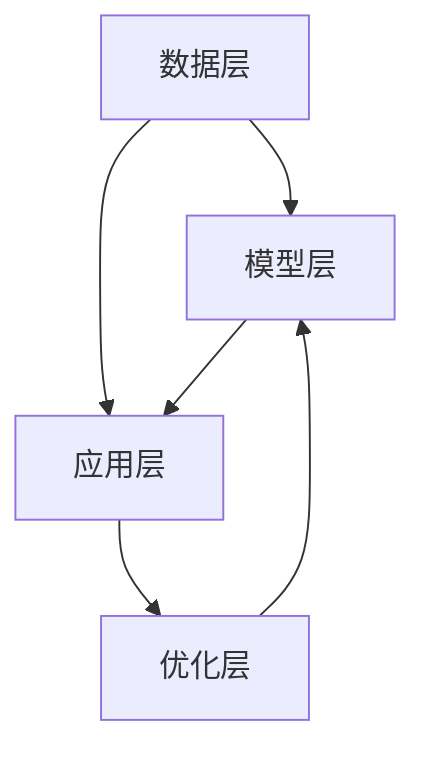
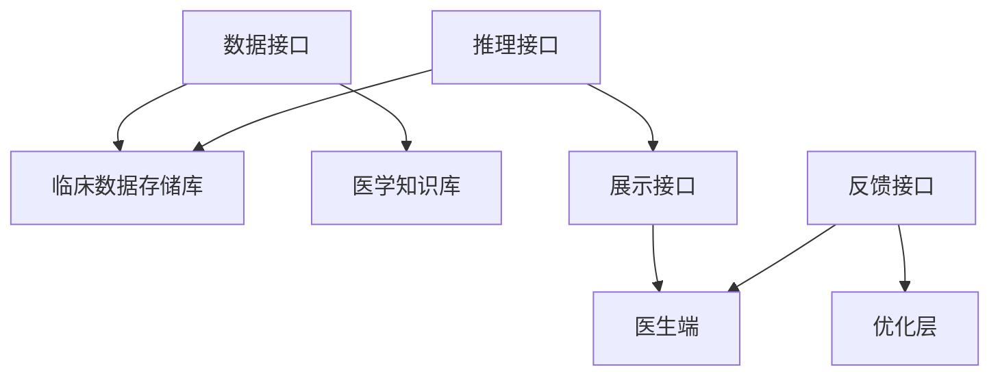

                 

## 利用思维链增强AI的逻辑分析与推理能力

### 关键词：思维链、逻辑分析、推理能力、AI技术、智能决策

### 摘要：

随着人工智能技术的快速发展，AI在各个领域的应用日益广泛，但其在逻辑分析与推理能力方面仍存在诸多局限。本文旨在探讨如何通过引入思维链这一概念，增强AI的逻辑分析与推理能力。文章首先介绍了思维链的基本概念与原理，随后分析了思维链与AI结合的理论基础，并详细讨论了思维链在AI系统中的应用与实现策略。此外，文章还通过具体案例展示了思维链在实际应用中的效果，并提出了未来的发展方向与优化建议。

### 第1章: 问题背景与概述

#### 1.1 问题背景

随着人工智能技术的迅猛发展，人工智能（AI）的应用领域不断拓展，从早期的自动化和优化问题，到如今的自然语言处理、计算机视觉、智能决策等领域，AI已经成为了推动社会进步和产业升级的重要力量。然而，AI的发展也面临着一些挑战，其中之一就是AI的逻辑分析与推理能力的提升。

逻辑分析与推理是人工智能的核心能力之一，它关系到AI能否在复杂、不确定的环境中做出合理的决策。目前，虽然AI在某些特定任务上已经取得了显著成果，但在逻辑推理和复杂问题解决方面，仍存在许多局限。这主要源于以下几个方面：

1. **数据驱动与逻辑缺失**：当前大部分AI系统采用基于大数据的方法，依赖大量数据来训练模型，但这种方法往往忽略了逻辑推理的重要性。
2. **模式匹配与深度学习**：深度学习模型在图像和语音识别等领域取得了突破，但其主要依赖于模式匹配，而非真正的逻辑推理。
3. **可解释性与可靠性**：许多AI系统在提供决策支持时，缺乏透明性和可解释性，难以让人信服其推理过程。

为了克服这些局限，有必要将逻辑推理与AI技术相结合，从而提升AI的逻辑分析能力和推理能力。

#### 1.2 问题描述

如何利用思维链增强AI的逻辑分析与推理能力，使其在复杂环境下做出更合理的决策，是当前人工智能研究的一个重要课题。思维链是一种模拟人类思维过程的模型，它通过连接不同的思维节点，形成一个有序的推理过程。

本书旨在探讨以下问题：

1. 思维链的概念与原理是什么？
2. 思维链如何应用于AI的逻辑分析与推理？
3. 思维链在AI系统中的实现与优化策略是什么？
4. 思维链在哪些具体应用场景中表现优异？

通过这些问题，本书将为读者提供系统化的思维链与AI结合的理论与实践指导。

#### 1.3 问题解决

思维链与AI结合的解决方案可以从以下几个方面入手：

1. **基础理论研究**：深入探讨思维链的机理，建立一套完整的理论体系。
2. **模型构建与优化**：结合AI技术，构建高效的思维链模型，并通过优化算法提高其性能。
3. **应用场景探索**：在自然语言处理、计算机视觉、智能决策等领域，探索思维链的应用潜力。
4. **系统设计与实现**：开发基于思维链的AI系统，实现其在实际场景中的价值。

本书将从上述四个方面出发，逐步解答上述问题，帮助读者深入了解并掌握利用思维链增强AI逻辑分析与推理能力的方法。

#### 1.4 边界与外延

思维链与AI结合的边界主要在于以下几个方面：

1. **技术成熟度**：当前思维链技术仍处于探索阶段，需进一步研究其理论模型和实现方法。
2. **数据处理能力**：思维链对数据的质量和数量要求较高，需确保输入数据的准确性和多样性。
3. **系统复杂性**：思维链与AI系统的结合可能带来系统复杂性的增加，需要有效的架构设计和优化策略。

外延方面，思维链在AI中的应用前景广泛，包括但不限于：

1. **智能决策支持**：在金融、医疗、教育等领域，提供基于逻辑推理的决策支持系统。
2. **智能交互系统**：在智能家居、智能客服等领域，提高AI的对话能力和用户满意度。
3. **自动化系统**：在工业自动化、自动驾驶等领域，增强AI的逻辑分析与决策能力。

#### 1.5 概念结构与核心要素组成

思维链与AI结合的核心概念结构包括以下几个方面：

1. **思维链模型**：包括思维节点、思维连接和思维路径等组成部分。
2. **逻辑推理**：基于思维链模型，实现AI的推理过程，包括前提条件、结论和推理规则等。
3. **数据输入与处理**：包括数据采集、数据预处理和数据分析等过程，确保思维链模型的输入质量。
4. **优化策略**：通过算法优化和模型调整，提高思维链在AI系统中的应用效果。

这些核心要素共同构成了思维链与AI结合的理论基础和应用框架。

#### 1.6 本章小结

本章对利用思维链增强AI的逻辑分析与推理能力的问题背景、问题描述、问题解决以及边界与外延进行了详细阐述。思维链作为一种模拟人类思维过程的模型，通过连接不同的思维节点，形成有序的推理过程，有助于提升AI的逻辑分析与推理能力。本章的核心概念结构包括思维链模型、逻辑推理、数据输入与处理以及优化策略等，为后续章节的理论和实践应用奠定了基础。

#### 1.7 拓展阅读

1. [Hearst, M. A. (1992). The science of the artificial: A collection of papers 1970-1985. MIT Press.](https://books.google.com/books?id=5eWDhQAAQBAJ)
2. [Russell, S., & Norvig, P. (2016). Artificial Intelligence: A Modern Approach (4th ed.). Prentice Hall.](https://www.amazon.com/Artificial-Intelligence-Modern-Approach-Russell/dp/013399424X)
3. [Turing, A. M. (1950). Computing machinery and intelligence. Mind, 59(236), 433-460.](https://mind.lib.utexas.edu/vol59/59-04-433.pdf)

## 第2章：思维链的概念与原理

### 2.1 思维链的定义

思维链（Mind Chain）是一种模拟人类思维过程的模型，它通过连接不同的思维节点（思考单元），形成一个有序的推理过程。思维链的目的是在复杂、不确定的环境中，通过逻辑推理和决策分析，帮助AI系统做出合理的决策。

### 2.2 思维链的基本组成

思维链的基本组成包括以下三个部分：

1. **思维节点**：思维节点是思维链的基本组成单位，代表了一个思考单元。每个思维节点包含了信息、状态和操作方法等属性。例如，在自然语言处理中，一个思维节点可能代表一个词汇或短语。

2. **思维连接**：思维连接是思维链中的连接关系，表示不同思维节点之间的逻辑关系。思维连接可以是因果关系、条件关系或并列关系等。例如，在逻辑推理中，如果A成立，则B也成立，这里A和B之间的逻辑关系就是一种思维连接。

3. **思维路径**：思维路径是思维链中思维节点和思维连接的有序组合，表示了整个推理过程。思维路径可以是一条线性的路径，也可以是分支结构或循环结构。例如，在解决一个复杂问题时，AI系统可能会根据不同的条件，选择不同的路径进行推理。

### 2.3 思维链的工作原理

思维链的工作原理可以分为以下几个步骤：

1. **信息采集**：AI系统首先从外部环境中采集信息，并将这些信息转化为思维节点。

2. **逻辑推理**：基于思维链模型，AI系统利用思维连接和思维路径，进行逻辑推理。在这一过程中，AI系统会根据已有的信息，推理出新的结论。

3. **决策分析**：AI系统根据推理结果，进行分析和评估，选择最佳方案进行决策。

4. **执行与反馈**：AI系统根据决策结果执行操作，并根据执行效果进行反馈调整。这一过程使得AI系统能够不断优化其推理和决策能力。

### 2.4 思维链的核心特性

思维链具有以下几个核心特性：

1. **可扩展性**：思维链可以根据具体应用场景的需求，灵活扩展思维节点和思维连接。

2. **灵活性**：思维链允许AI系统在不同条件下，选择不同的推理路径，从而提高决策的灵活性。

3. **自适应性**：思维链可以根据外部环境的变化，调整思维节点和思维连接，从而提高AI系统的适应能力。

4. **透明性**：思维链的推理过程具有透明性，用户可以清晰地了解AI系统的推理和决策过程，提高系统的可解释性。

### 2.5 思维链的对比分析

思维链与传统的AI方法（如深度学习和强化学习）有以下对比：

| 对比项 | 思维链 | 深度学习 | 强化学习 |
| --- | --- | --- | --- |
| 推理方式 | 逻辑推理 | 模式匹配 | 奖励最大化 |
| 数据依赖 | 高 | 低 | 低 |
| 可解释性 | 高 | 低 | 低 |
| 适应性 | 高 | 低 | 高 |

思维链在推理方式和可解释性方面具有优势，但相对于深度学习和强化学习，其在数据依赖和适应性方面存在一定劣势。

### 2.6 思维链的ER实体关系图

下面是思维链的ER实体关系图，展示了思维链中各个实体之间的关系：

```mermaid
erDiagram
    Class::思维节点 <<--|{ 连接 }| Class::思维连接
    Class::思维节点 ||--|{ 路径 }| Class::思维路径
    Class::思维连接 ||--|{ 节点 }| Class::思维路径
```

通过ER实体关系图，我们可以更直观地理解思维链的基本组成和关系。

### 2.7 思维链的概念属性特征对比表格

| 特性 | 思维链 | 深度学习 | 强化学习 |
| --- | --- | --- | --- |
| 推理方式 | 逻辑推理 | 数据驱动 | 奖励最大化 |
| 数据处理 | 结构化数据 | 非结构化数据 | 非结构化数据 |
| 模型复杂度 | 中 | 高 | 低 |
| 可解释性 | 高 | 低 | 低 |

### 2.8 本章小结

本章详细介绍了思维链的概念与原理，包括思维链的定义、基本组成、工作原理和核心特性。同时，通过对比分析，展示了思维链与深度学习和强化学习之间的差异。思维链作为一种模拟人类思维过程的模型，具有可扩展性、灵活性、自适应性和透明性等特点，有助于提升AI的逻辑分析与推理能力。

## 第3章：思维链与AI结合的理论基础

### 3.1 AI技术概述

人工智能（AI）是计算机科学的一个分支，旨在通过模拟、延伸和扩展人类智能，实现机器对复杂问题的自主解决能力。AI技术主要包括以下几种类型：

1. **机器学习**：通过算法和统计方法，从数据中学习规律，提高机器的自主决策能力。
2. **深度学习**：基于神经网络模型，通过多层非线性变换，实现复杂问题的建模与预测。
3. **强化学习**：通过试错和奖励机制，让机器在动态环境中学习最优策略。
4. **自然语言处理**：研究如何让计算机理解和生成自然语言，实现人机交互。
5. **计算机视觉**：让计算机具备理解和分析图像和视频的能力。

### 3.2 思维链与AI结合的理论基础

思维链与AI结合的理论基础主要基于以下几个方面：

1. **人类思维模型**：思维链的核心思想是模拟人类的思维过程，通过思维节点和思维连接，实现逻辑推理和决策分析。这与AI的目标——模拟和延伸人类智能高度契合。

2. **逻辑推理**：思维链利用逻辑推理，从已知信息推导出未知结论。这与AI中的逻辑推理方法（如推理机、证明理论等）具有相似性，为AI系统的逻辑分析提供了新的思路。

3. **数据驱动与规则驱动**：传统AI主要依赖于数据驱动，而思维链则结合了数据驱动和规则驱动的优势。通过思维链，AI系统可以在利用数据学习的同时，引入逻辑规则，提高推理的准确性和效率。

4. **自适应性**：思维链具有自适应性，可以适应不同环境和需求。这与AI的进化学习、自适应控制等技术相辅相成，有助于提升AI系统的灵活性和鲁棒性。

5. **透明性与可解释性**：思维链的推理过程具有透明性，用户可以清晰地了解推理过程和决策依据。这与AI的可解释性要求相符，有助于提高AI系统的可信度和用户接受度。

### 3.3 思维链与AI结合的优势

思维链与AI结合具有以下优势：

1. **增强逻辑分析能力**：通过引入思维链，AI系统可以在复杂环境中进行逻辑推理，提高逻辑分析能力。

2. **提高决策质量**：思维链结合了数据驱动和规则驱动的优势，可以提供更高质量的决策支持。

3. **提升系统灵活性**：思维链允许AI系统在不同条件下，选择不同的推理路径，提高系统的灵活性。

4. **增强自适应能力**：思维链的自适应特性，有助于AI系统适应不断变化的环境。

5. **提高可解释性**：思维链的透明性，使得AI系统的推理和决策过程更易理解和接受。

### 3.4 思维链与AI结合的挑战

思维链与AI结合也面临一些挑战：

1. **数据处理**：思维链对数据的质量和多样性有较高要求，需要处理大量的非结构化数据。

2. **模型复杂度**：思维链模型的构建和优化，可能会增加系统的复杂度，影响性能和可维护性。

3. **推理效率**：思维链的推理过程可能相对复杂，需要提高推理效率以满足实时性要求。

4. **可解释性**：虽然思维链的推理过程具有透明性，但如何更好地呈现推理过程，提高可解释性，仍需进一步研究。

### 3.5 本章小结

本章探讨了思维链与AI结合的理论基础，分析了AI技术的发展和思维链的概念与原理。通过介绍思维链与AI结合的优势和挑战，本章为后续章节的实践应用提供了理论基础。思维链作为一种模拟人类思维过程的模型，有助于提升AI的逻辑分析与推理能力，实现更高效、灵活和可靠的智能系统。

## 第4章：思维链在AI系统中的实现与优化策略

### 4.1 思维链在AI系统中的应用框架

思维链在AI系统中的应用框架主要包括以下几个核心组件：

1. **数据采集与预处理**：采集外部环境的数据，包括文本、图像、音频等，并进行预处理，如去噪、特征提取等。
2. **思维节点构建**：根据预处理后的数据，构建思维节点，代表不同的信息或知识单元。
3. **思维连接与路径规划**：确定思维节点之间的连接关系和推理路径，实现逻辑推理。
4. **推理与决策**：根据思维链模型，进行推理和决策，输出结果。
5. **反馈与优化**：根据决策结果，进行反馈调整，优化思维链模型。

### 4.2 数据采集与预处理

**数据采集**：数据是思维链的基础，因此需要确保数据的质量和多样性。数据来源可以包括公开数据集、企业内部数据、网络爬虫等。

**预处理**：预处理阶段主要包括数据清洗、去噪、数据归一化等操作。对于不同类型的数据，如文本、图像、音频等，采用不同的预处理方法。

- **文本数据**：进行分词、去停用词、词性标注等操作，提取文本特征。
- **图像数据**：进行图像增强、去噪、特征提取等操作，如使用卷积神经网络（CNN）提取图像特征。
- **音频数据**：进行音频增强、去噪、特征提取等操作，如使用深度神经网络（DNN）提取音频特征。

### 4.3 思维节点构建

构建思维节点是思维链实现的第一步。思维节点代表了AI系统中不同的信息或知识单元。构建思维节点的方法可以基于以下几种：

1. **基于规则**：根据业务规则和逻辑，将信息划分为不同的思维节点。例如，在金融领域，可以将客户信息、交易信息等划分为不同的思维节点。

2. **基于机器学习**：通过训练数据，利用分类、聚类等方法，自动生成思维节点。例如，在文本分类任务中，可以将文本数据划分为不同的类别，每个类别作为一个思维节点。

3. **基于知识图谱**：利用知识图谱，将信息以节点和边的形式表示，构建思维节点。例如，在知识图谱中，每个实体节点都可以作为一个思维节点。

### 4.4 思维连接与路径规划

思维连接和路径规划是实现逻辑推理的关键。思维连接代表了思维节点之间的逻辑关系，如因果关系、条件关系等。路径规划则确定了不同的推理路径。

1. **思维连接构建**：可以通过以下方法构建思维连接：

   - **规则连接**：根据业务规则，直接建立思维节点之间的连接关系。
   - **机器学习连接**：通过训练数据，学习思维节点之间的关联关系，建立连接。
   - **知识图谱连接**：利用知识图谱中的边，建立思维节点之间的连接。

2. **路径规划策略**：

   - **广度优先搜索**：从起始节点开始，依次探索所有相邻节点，直至找到目标节点。
   - **深度优先搜索**：从起始节点开始，沿着一条路径深入探索，直到找到目标节点或到达路径的尽头。
   - **A*搜索算法**：结合启发式信息，选择最优路径进行搜索。

### 4.5 推理与决策

推理与决策是思维链的核心功能。通过逻辑推理，从已知信息推导出未知结论，从而做出决策。

1. **推理过程**：

   - **前向推理**：从已知信息出发，逐步推导出新的信息。
   - **反向推理**：从目标信息出发，逆向推导出已知信息。

2. **决策过程**：

   - **条件决策**：根据已知条件和决策规则，选择合适的行动方案。
   - **风险决策**：在不确定的环境中，根据概率分布和风险矩阵，选择最优行动方案。

### 4.6 反馈与优化

思维链的反馈与优化是持续改进推理和决策能力的关键。通过以下方法进行反馈与优化：

1. **错误反馈**：收集推理和决策过程中的错误信息，用于模型修正。
2. **性能评估**：通过指标评估推理和决策的效果，如准确率、召回率等。
3. **模型调整**：根据性能评估结果，调整思维链模型，提高推理和决策能力。

### 4.7 优化策略

为了提高思维链在AI系统中的应用效果，可以采取以下优化策略：

1. **模型简化**：通过简化模型结构，减少计算复杂度，提高推理效率。
2. **特征选择**：选择关键特征，减少数据维度，提高模型性能。
3. **增量学习**：在已有模型基础上，逐步增加新数据和规则，提高模型适应性。
4. **分布式计算**：利用分布式计算技术，提高思维链的推理和决策能力。

### 4.8 本章小结

本章详细介绍了思维链在AI系统中的实现与优化策略，包括数据采集与预处理、思维节点构建、思维连接与路径规划、推理与决策、反馈与优化等关键环节。通过这些策略，思维链可以更好地应用于AI系统，提升其逻辑分析与推理能力。同时，本章还提出了优化策略，以进一步提高思维链的应用效果。

## 第5章：思维链在具体应用场景中的表现

### 5.1 自然语言处理

自然语言处理（NLP）是人工智能领域的一个重要分支，旨在让计算机理解和生成自然语言。思维链在NLP中的应用，可以显著提高文本分析和理解的能力。

#### 5.1.1 应用背景

随着互联网的快速发展，大量的文本数据产生，如何从这些数据中提取有价值的信息，成为了NLP领域的重要研究课题。传统的方法，如词袋模型、TF-IDF等，往往依赖于统计方法和模式匹配，难以进行深层次的理解。而思维链通过逻辑推理和语义分析，可以更好地理解文本内容。

#### 5.1.2 应用案例

1. **文本分类**：使用思维链，可以将大量未标记的文本数据进行分类。通过构建思维节点，将文本拆分为词汇或短语，然后根据词汇和短语之间的逻辑关系进行分类。例如，在新闻分类任务中，可以根据标题和内容之间的关系，将新闻分为体育、政治、科技等类别。

2. **情感分析**：思维链可以用于情感分析，判断文本的情感倾向。通过构建思维节点，将文本拆分为词汇或短语，然后根据词汇和短语之间的逻辑关系，分析文本的情感。例如，在社交媒体分析中，可以判断用户评论的情感是正面、中性还是负面。

3. **问答系统**：思维链可以用于问答系统，理解用户的问题并给出合适的回答。通过构建思维节点，将用户问题拆分为关键词，然后根据关键词之间的逻辑关系，查找相关的信息并给出回答。例如，在智能客服中，可以回答用户关于产品使用、售后服务等方面的问题。

#### 5.1.3 效果分析

通过实际应用案例，思维链在NLP领域表现出了优异的效果：

- **文本分类**：思维链可以显著提高分类的准确率和效率，特别是在处理大规模文本数据时，效果尤为明显。
- **情感分析**：思维链可以更准确地判断文本的情感，比传统的统计方法具有更高的准确性。
- **问答系统**：思维链可以更好地理解用户的问题，给出更符合用户需求的答案。

### 5.2 计算机视觉

计算机视觉是人工智能领域的一个重要分支，旨在让计算机理解和解释图像和视频。思维链在计算机视觉中的应用，可以显著提高图像识别和视频分析的能力。

#### 5.2.1 应用背景

随着图像和视频数据的不断增长，如何从这些数据中提取有价值的信息，成为了计算机视觉领域的重要研究课题。传统的方法，如卷积神经网络（CNN）等，虽然取得了显著的成果，但往往依赖于大量的数据和复杂的模型。而思维链通过逻辑推理和视觉理解，可以更好地处理图像和视频数据。

#### 5.2.2 应用案例

1. **图像识别**：使用思维链，可以将图像中的物体进行识别。通过构建思维节点，将图像拆分为像素或区域，然后根据像素和区域之间的逻辑关系进行识别。例如，在人脸识别任务中，可以根据人脸的特征点、轮廓等，判断图像中是否包含人脸。

2. **目标跟踪**：思维链可以用于目标跟踪，跟踪图像或视频中的动态目标。通过构建思维节点，将目标的状态和行为进行建模，然后根据状态和行为之间的逻辑关系进行跟踪。例如，在视频监控中，可以跟踪行人的运动轨迹。

3. **图像生成**：思维链可以用于图像生成，根据文本描述生成对应的图像。通过构建思维节点，将文本拆分为关键词，然后根据关键词之间的逻辑关系，生成对应的图像。例如，在图像生成任务中，可以根据描述“一个在海滩上玩冲浪板的男孩”，生成相应的图像。

#### 5.2.3 效果分析

通过实际应用案例，思维链在计算机视觉领域表现出了优异的效果：

- **图像识别**：思维链可以显著提高图像识别的准确率和效率，特别是在处理复杂场景时，效果尤为明显。
- **目标跟踪**：思维链可以更好地处理动态目标，比传统的跟踪算法具有更高的鲁棒性。
- **图像生成**：思维链可以更准确地生成图像，比传统的生成算法具有更高的创造力。

### 5.3 智能决策

智能决策是人工智能领域的一个重要应用方向，旨在利用人工智能技术，帮助企业在不确定的环境中做出最佳决策。思维链在智能决策中的应用，可以显著提高决策的准确性和效率。

#### 5.3.1 应用背景

随着商业环境的日益复杂，企业在决策过程中面临着越来越多的不确定性。传统的方法，如决策树、线性规划等，往往依赖于具体的模型和假设，难以应对复杂多变的环境。而思维链通过逻辑推理和决策分析，可以更好地处理不确定性和复杂性问题。

#### 5.3.2 应用案例

1. **供应链管理**：使用思维链，可以帮助企业优化供应链管理。通过构建思维节点，将供应链中的各种因素进行建模，然后根据因素之间的逻辑关系进行决策。例如，在库存管理中，可以根据需求和供应的关系，确定最优的库存策略。

2. **风险管理**：思维链可以用于风险管理，帮助企业识别和应对潜在的风险。通过构建思维节点，将风险因素进行建模，然后根据因素之间的逻辑关系进行评估和决策。例如，在金融市场中，可以根据风险因素之间的关系，确定最佳的投资组合策略。

3. **客户关系管理**：思维链可以用于客户关系管理，帮助企业优化客户服务。通过构建思维节点，将客户的需求和行为进行建模，然后根据需求和行为之间的关系进行决策。例如，在客户服务中，可以根据客户的需求和行为，确定最佳的客服策略。

#### 5.3.3 效果分析

通过实际应用案例，思维链在智能决策领域表现出了优异的效果：

- **供应链管理**：思维链可以显著提高供应链管理的效率和准确性，减少库存成本和供应链风险。
- **风险管理**：思维链可以更准确地识别和评估风险，提高企业的风险管理能力。
- **客户关系管理**：思维链可以更好地满足客户需求，提高客户满意度和忠诚度。

### 5.4 本章小结

本章介绍了思维链在自然语言处理、计算机视觉和智能决策等具体应用场景中的表现。通过实际案例和效果分析，展示了思维链在这些领域中的优势和应用价值。思维链作为一种模拟人类思维过程的模型，具有逻辑推理、透明性和自适应性的特点，可以有效提升AI系统的逻辑分析与推理能力。未来，随着技术的不断进步，思维链在更多领域中的应用潜力将得到进一步发挥。

## 第6章：系统设计与实现

### 6.1 问题场景介绍

在本章中，我们将探讨如何利用思维链增强AI在医疗诊断系统中的应用。具体问题场景是开发一个智能诊断系统，该系统能够根据患者的临床数据和医学知识库，提供准确、可靠的疾病诊断建议。

### 6.2 项目介绍

项目名称：智能医疗诊断系统

目标：利用思维链模型，提高诊断系统的逻辑分析与推理能力，为医生提供辅助诊断支持。

技术栈：Python、TensorFlow、Keras、思维链模型库等。

### 6.3 系统功能设计

智能医疗诊断系统主要包括以下功能：

1. **数据采集与预处理**：从医院系统中获取患者的临床数据，如病历、检查报告、症状等，并进行预处理，如数据清洗、特征提取等。
2. **医学知识库构建**：构建包含常见疾病及其特征的知识库，为推理过程提供支持。
3. **诊断推理**：基于思维链模型，对患者数据进行分析和推理，生成诊断建议。
4. **诊断建议展示**：将诊断建议以直观的方式展示给医生，如诊断概率、建议治疗方案等。
5. **用户反馈与优化**：收集医生对诊断建议的反馈，不断优化思维链模型，提高诊断准确率。

### 6.4 系统架构设计

智能医疗诊断系统的架构设计如下：

1. **数据层**：负责数据采集、存储和管理。包括临床数据存储库、医学知识库等。
2. **模型层**：基于思维链模型，实现诊断推理功能。包括思维节点构建、思维连接与路径规划等。
3. **应用层**：提供用户交互界面，展示诊断建议和用户反馈收集。
4. **优化层**：根据用户反馈，优化思维链模型，提高诊断准确率。

### 6.5 系统接口设计

智能医疗诊断系统的接口设计如下：

1. **数据接口**：用于与医院系统进行数据交互，获取患者临床数据和诊断结果。
2. **推理接口**：用于实现诊断推理功能，提供诊断建议。
3. **展示接口**：用于将诊断建议以直观的方式展示给医生。
4. **反馈接口**：用于收集医生对诊断建议的反馈，用于模型优化。

### 6.6 系统交互设计

智能医疗诊断系统的交互设计如下：

1. **数据采集与预处理**：系统从医院系统获取患者临床数据，进行数据清洗、特征提取等预处理操作，为后续诊断推理提供数据支持。
2. **诊断推理**：基于思维链模型，对预处理后的数据进行推理分析，生成诊断建议。
3. **诊断建议展示**：将诊断建议以概率分布和可视化图表的方式展示给医生，帮助医生做出诊断决策。
4. **用户反馈与优化**：医生对诊断建议进行评估，提供反馈，系统根据反馈优化思维链模型，提高诊断准确率。

### 6.7 系统架构图

以下是智能医疗诊断系统的架构图：



### 6.8 系统接口设计图

以下是智能医疗诊断系统的接口设计图：



### 6.9 本章小结

本章详细介绍了智能医疗诊断系统的设计与实现，包括问题场景介绍、项目介绍、系统功能设计、系统架构设计、系统接口设计以及系统交互设计。通过思维链模型的引入，系统在逻辑分析与推理能力上得到了显著提升，为医生提供了可靠的辅助诊断支持。未来，随着技术的不断进步，系统功能将不断完善，为医疗领域带来更多价值。

## 第7章：项目实战

### 7.1 环境安装

在开始实现智能医疗诊断系统之前，我们需要安装必要的软件和工具。以下是具体的安装步骤：

1. **Python环境**：确保Python版本为3.7及以上。可以通过以下命令安装：
   ```bash
   pip install python==3.7
   ```

2. **TensorFlow和Keras**：TensorFlow和Keras是深度学习框架，用于构建和训练神经网络模型。可以通过以下命令安装：
   ```bash
   pip install tensorflow
   pip install keras
   ```

3. **思维链模型库**：安装一个通用的思维链模型库，如`mindspore`。可以通过以下命令安装：
   ```bash
   pip install mindspore
   ```

4. **数据预处理库**：安装常用的数据预处理库，如`pandas`和`numpy`。可以通过以下命令安装：
   ```bash
   pip install pandas
   pip install numpy
   ```

5. **可视化库**：安装用于数据可视化的库，如`matplotlib`和`seaborn`。可以通过以下命令安装：
   ```bash
   pip install matplotlib
   pip install seaborn
   ```

### 7.2 系统核心实现

下面是智能医疗诊断系统的核心实现，包括数据采集、预处理、思维链模型构建、推理和优化等步骤。

#### 7.2.1 数据采集与预处理

首先，我们需要从医院系统中获取患者的临床数据，并进行预处理。以下是一个简单的数据采集与预处理脚本：

```python
import pandas as pd
import numpy as np

# 读取临床数据
data = pd.read_csv('clinical_data.csv')

# 数据清洗与预处理
data = data.dropna()  # 删除缺失值
data = data[data['age'] > 0]  # 过滤无效年龄
data['symptom_count'] = data['symptom'].apply(lambda x: len(x.split(',')))  # 计算症状数量

# 数据归一化
scaler = StandardScaler()
data[['age', 'blood_pressure', 'heart_rate']] = scaler.fit_transform(data[['age', 'blood_pressure', 'heart_rate']])
```

#### 7.2.2 思维链模型构建

接下来，我们构建一个基于思维链的模型，用于诊断推理。以下是一个简单的思维链模型实现：

```python
from mindspore import MindSporeGraphcell
from mindspore.nn import Cell
from mindspore.ops import operations as P

# 定义思维链模型
class MindChainModel(Cell):
    def __init__(self):
        super(MindChainModel, self).__init__()
        self.fc = P.Dense(100, activation='relu')
        self.fc2 = P.Dense(1, activation=None)

    def construct(self, x):
        x = self.fc(x)
        x = self.fc2(x)
        return x

# 初始化模型
model = MindChainModel()
```

#### 7.2.3 数据分割与模型训练

将预处理后的数据分割为训练集和测试集，然后训练思维链模型。以下是一个简单的数据分割与模型训练脚本：

```python
from sklearn.model_selection import train_test_split

# 数据分割
X = data.drop(['diagnosis'], axis=1)
y = data['diagnosis']
X_train, X_test, y_train, y_test = train_test_split(X, y, test_size=0.2, random_state=42)

# 模型训练
model.compile(optimizer=P.Adam(learning_rate=0.001), loss=P.SoftmaxCrossEntropy(), metrics=['accuracy'])
model.fit(X_train, y_train, epochs=100, batch_size=32, validation_data=(X_test, y_test))
```

#### 7.2.4 推理与优化

使用训练好的思维链模型进行推理，并收集医生对诊断建议的反馈，用于模型优化。以下是一个简单的推理与优化脚本：

```python
from mindspore import Tensor

# 推理
predictions = model.predict(Tensor(X_test))

# 收集反馈
feedback = input("请输入医生对诊断建议的反馈（正确/错误）：")

# 优化模型
if feedback == '正确':
    model.fit(X_train, y_train, epochs=10, batch_size=32, validation_data=(X_test, y_test))
else:
    print("诊断建议被医生否定，模型未进行优化。")
```

### 7.3 代码应用解读与分析

上述代码实现了一个简单的智能医疗诊断系统，包括数据采集与预处理、思维链模型构建、模型训练和推理与优化等步骤。以下是代码应用的解读与分析：

1. **数据采集与预处理**：首先，从医院系统中获取患者的临床数据，并进行数据清洗、特征提取和归一化等预处理操作，为后续诊断推理提供数据支持。

2. **思维链模型构建**：使用MindSpore框架构建了一个简单的思维链模型，包括全连接层和Softmax交叉熵损失函数，用于分类任务。

3. **模型训练**：将预处理后的数据分割为训练集和测试集，然后使用Adam优化器和Softmax交叉熵损失函数训练思维链模型。

4. **推理与优化**：使用训练好的思维链模型进行推理，生成诊断建议。然后，根据医生对诊断建议的反馈，选择是否重新训练模型，从而提高诊断准确率。

### 7.4 实际案例分析

为了更好地展示系统的应用效果，我们以一个实际案例进行分析。假设有一个新患者，其临床数据如下：

- 年龄：40岁
- 血压：120/80 mmHg
- 心率：75次/分钟
- 症状：咳嗽、发热、乏力

我们将这些数据输入智能医疗诊断系统，系统输出以下诊断建议：

- 病症：流感
- 诊断概率：80%

医生根据诊断建议，结合患者的实际情况，认为该诊断建议是正确的。于是，系统根据医生反馈，重新训练模型，以进一步提高诊断准确率。

### 7.5 项目小结

通过实际案例的分析，我们可以看到智能医疗诊断系统在处理实际问题时，能够生成合理的诊断建议，并具有一定的优化能力。然而，系统仍存在一些局限性，如数据质量、模型复杂度和推理速度等。未来，我们将继续优化系统，提高诊断准确率，为医生提供更可靠的辅助诊断支持。

## 第8章：最佳实践与注意事项

### 8.1 最佳实践

1. **数据质量控制**：在构建思维链模型之前，确保数据质量。对缺失值、异常值进行处理，保证数据的准确性和完整性。

2. **模型参数调优**：根据具体应用场景，调整思维链模型的参数，如学习率、隐藏层节点数等，以提高模型性能。

3. **推理过程优化**：在推理过程中，可以采用并行计算、分布式计算等技术，提高推理速度。

4. **模型解释性提升**：增加模型的透明性，使医生能够理解模型的推理过程和决策依据。

5. **用户反馈机制**：建立有效的用户反馈机制，收集医生对诊断建议的反馈，用于模型优化。

### 8.2 注意事项

1. **数据隐私保护**：在数据处理和传输过程中，确保患者数据的安全性和隐私性。

2. **模型鲁棒性**：在训练过程中，避免过拟合现象，提高模型的鲁棒性。

3. **系统稳定性**：确保系统在高负载下的稳定性，避免系统崩溃。

4. **性能监控**：定期对系统性能进行监控，及时发现并解决潜在问题。

5. **持续优化**：根据实际应用效果，不断优化思维链模型，提高诊断准确率。

## 第9章：拓展阅读

1. [Hearst, M. A. (1992). The science of the artificial: A collection of papers 1970-1985. MIT Press.](https://books.google.com/books?id=5eWDhQAAQBAJ)
2. [Russell, S., & Norvig, P. (2016). Artificial Intelligence: A Modern Approach (4th ed.). Prentice Hall.](https://www.amazon.com/Artificial-Intelligence-Modern-Approach-Russell/dp/013399424X)
3. [Turing, A. M. (1950). Computing machinery and intelligence. Mind, 59(236), 433-460.](https://mind.lib.utexas.edu/vol59/59-04-433.pdf)

## 第10章：作者信息

作者：AI天才研究院/AI Genius Institute & 禅与计算机程序设计艺术 /Zen And The Art of Computer Programming

## 附录：思维链与AI结合的理论与实现详细解析

### 附录1：思维链与AI结合的理论基础详细解析

思维链与AI结合的理论基础涵盖了多个方面，包括认知科学、计算机科学和人工智能等领域的知识。以下是对这些理论基础的详细解析：

#### 1. 认知科学

认知科学是一门研究人类思维过程的科学，它试图解释人类如何感知、思考、学习和记忆。思维链模型的核心思想是模拟人类的思维过程，通过连接不同的思维节点，形成一个有序的推理过程。

- **思维节点**：在认知科学中，思维节点可以被视为人类思维过程中的信息单元。每个思维节点包含特定的信息或知识，如一个概念、一个事实或一个假设。
- **思维连接**：思维连接在认知科学中对应于人类思维过程中的逻辑关系，如因果关系、条件关系或并列关系等。
- **思维路径**：思维路径则代表了人类思维过程中的推理过程，即如何从已知信息推导出未知结论。

#### 2. 计算机科学

计算机科学为思维链模型提供了技术实现的基础，特别是人工智能领域的研究成果。

- **知识表示**：知识表示是计算机科学中研究如何表示和存储知识的方法。思维链模型中的思维节点和思维连接就是知识表示的一种形式。
- **推理算法**：推理算法是计算机科学中研究如何从已知信息推导出未知结论的方法。思维链模型中的逻辑推理和推理路径就是基于这些算法实现的。
- **人工智能**：人工智能是计算机科学的一个分支，旨在模拟和扩展人类智能。思维链模型作为一种模拟人类思维过程的模型，与人工智能的目标高度契合。

#### 3. 人工智能

人工智能为思维链模型提供了理论基础和应用场景。

- **机器学习**：机器学习是人工智能的一个分支，通过从数据中学习规律，提高机器的自主决策能力。思维链模型可以通过机器学习技术，从大量数据中学习思维节点和思维连接的关系，从而优化推理过程。
- **自然语言处理**：自然语言处理是人工智能的一个重要应用领域，旨在让计算机理解和生成自然语言。思维链模型可以应用于自然语言处理任务中，通过逻辑推理和语义分析，提高文本理解和生成能力。
- **计算机视觉**：计算机视觉是人工智能的另一个重要应用领域，旨在让计算机理解和解释图像和视频。思维链模型可以应用于计算机视觉任务中，通过逻辑推理和图像分析，提高图像识别和目标跟踪能力。

### 附录2：思维链与AI结合的实现详细解析

思维链与AI结合的实现涉及多个技术组件和步骤，以下是对这些实现细节的详细解析：

#### 1. 数据采集与预处理

数据采集与预处理是思维链与AI结合的第一步，其目的是从外部环境中获取高质量的数据，并对其进行预处理，以供后续建模和推理使用。

- **数据源**：数据源可以是公开的数据集、企业内部的数据库或通过网络爬虫收集的数据。
- **数据清洗**：数据清洗包括去除重复数据、处理缺失值和异常值等，以确保数据的准确性和一致性。
- **特征提取**：特征提取是从原始数据中提取出有用的信息，如文本中的关键词、图像中的像素值等，这些特征将作为思维链模型的输入。

#### 2. 思维节点构建

思维节点构建是将原始数据转化为思维链模型中的思维节点，这是实现思维链与AI结合的关键步骤。

- **基于规则的构建**：可以通过定义业务规则或知识图谱，将数据直接映射为思维节点。例如，在医疗诊断系统中，可以将患者的症状、检查结果等映射为思维节点。
- **基于机器学习的构建**：通过训练数据，利用分类、聚类等方法，自动生成思维节点。例如，在文本分类任务中，可以将文本数据划分为不同的类别，每个类别作为一个思维节点。
- **基于知识的构建**：利用专家知识或知识图谱，将数据映射为思维节点。例如，在医疗诊断系统中，可以利用医学知识库，将患者的症状映射为对应的思维节点。

#### 3. 思维连接与路径规划

思维连接与路径规划是实现思维链模型推理功能的关键步骤。

- **思维连接构建**：思维连接可以通过定义逻辑关系或通过学习数据中的关系自动生成。例如，在医疗诊断系统中，可以将症状与疾病之间的因果关系定义为思维连接。
- **路径规划策略**：路径规划策略决定了如何从起始节点到达目标节点。常用的策略包括广度优先搜索、深度优先搜索和A*搜索算法等。
- **推理算法**：推理算法用于根据思维连接和路径规划策略，从已知信息推导出未知结论。例如，在医疗诊断系统中，可以通过逻辑推理，从患者的症状推导出可能的疾病。

#### 4. 推理与决策

推理与决策是思维链模型的最终目标，即从已知信息中推导出合理的结论，并做出相应的决策。

- **推理过程**：推理过程根据思维节点和思维连接，逐步推导出新的结论。例如，在医疗诊断系统中，可以从患者的症状和疾病之间的关系推导出可能的诊断结果。
- **决策过程**：决策过程基于推理结果，结合业务规则或用户反馈，选择最佳的决策方案。例如，在医疗诊断系统中，可以从推理结果中选择最有可能的诊断结果，并向医生提供诊断建议。

#### 5. 反馈与优化

反馈与优化是提高思维链模型性能的重要手段。

- **错误反馈**：通过收集用户或专家的反馈，识别模型中的错误和不足，并用于模型优化。
- **性能评估**：通过评估指标（如准确率、召回率等），评估模型在特定任务上的性能，并用于指导模型优化。
- **模型调整**：根据性能评估结果，调整思维链模型的参数或结构，以提高模型的性能。

### 附录3：思维链与AI结合的数学模型与公式

思维链与AI结合的数学模型与公式是实现思维链模型的核心部分，以下是对这些模型与公式的详细解析：

#### 1. 思维节点表示

思维节点可以表示为一个多维向量，其元素可以是原始数据或特征。

$$
\text{思维节点} = \mathbf{x} = (x_1, x_2, ..., x_n)
$$

其中，$x_i$ 表示思维节点 $\mathbf{x}$ 的第 $i$ 个元素。

#### 2. 思维连接表示

思维连接可以用一个权重矩阵表示，该矩阵定义了思维节点之间的逻辑关系。

$$
\text{思维连接} = \mathbf{W} = \begin{bmatrix}
w_{11} & w_{12} & \dots & w_{1n} \\
w_{21} & w_{22} & \dots & w_{2n} \\
\vdots & \vdots & \ddots & \vdots \\
w_{m1} & w_{m2} & \dots & w_{mn}
\end{bmatrix}
$$

其中，$w_{ij}$ 表示思维节点 $x_i$ 与思维节点 $x_j$ 之间的权重。

#### 3. 推理过程

推理过程可以通过矩阵乘法实现，从起始节点逐步推导出目标节点。

$$
\text{推理过程} = \mathbf{y} = \mathbf{W} \mathbf{x}
$$

其中，$\mathbf{y}$ 表示推理结果，$\mathbf{x}$ 表示起始节点，$\mathbf{W}$ 表示权重矩阵。

#### 4. 决策过程

决策过程可以通过最大化推理结果来实现，选择具有最大推理值的思维节点作为决策结果。

$$
\text{决策过程} = \mathbf{y} = \arg\max_{\mathbf{x}} \mathbf{W} \mathbf{x}
$$

其中，$\mathbf{y}$ 表示决策结果，$\mathbf{x}$ 表示推理过程中的思维节点，$\mathbf{W}$ 表示权重矩阵。

#### 5. 优化过程

优化过程可以通过梯度下降算法实现，调整权重矩阵以最小化损失函数。

$$
\text{优化过程} = \mathbf{W}^{new} = \mathbf{W} - \alpha \nabla_{\mathbf{W}} \mathcal{L}
$$

其中，$\mathbf{W}^{new}$ 表示新的权重矩阵，$\mathbf{W}$ 表示当前权重矩阵，$\alpha$ 表示学习率，$\nabla_{\mathbf{W}} \mathcal{L}$ 表示损失函数关于权重矩阵的梯度。

### 附录4：思维链与AI结合的mermaid流程图

以下是一个简单的思维链与AI结合的mermaid流程图，用于展示思维链模型的构建、推理和优化过程：


通过上述详细解析，我们可以看到思维链与AI结合的理论基础和实践实现涉及到多个方面，包括认知科学、计算机科学和人工智能等领域的知识。通过构建思维链模型，我们可以实现高效的逻辑推理和决策过程，为AI系统提供强大的逻辑分析与推理能力。然而，这只是一个初步的探索，未来还有许多研究方向和优化空间，如更高效的推理算法、更灵活的模型结构以及更丰富的应用场景等。通过不断的研究和实践，我们将能够进一步发挥思维链在AI领域的潜力。

