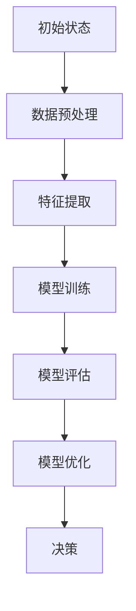
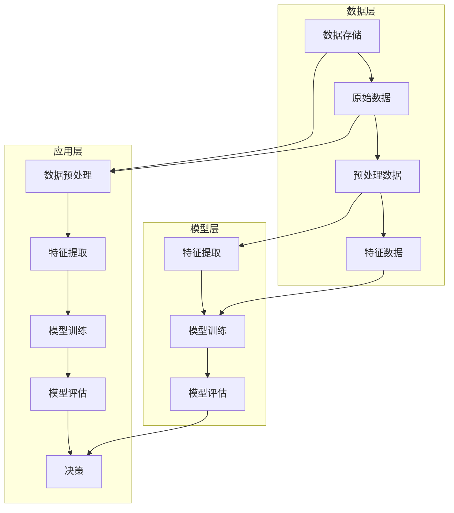
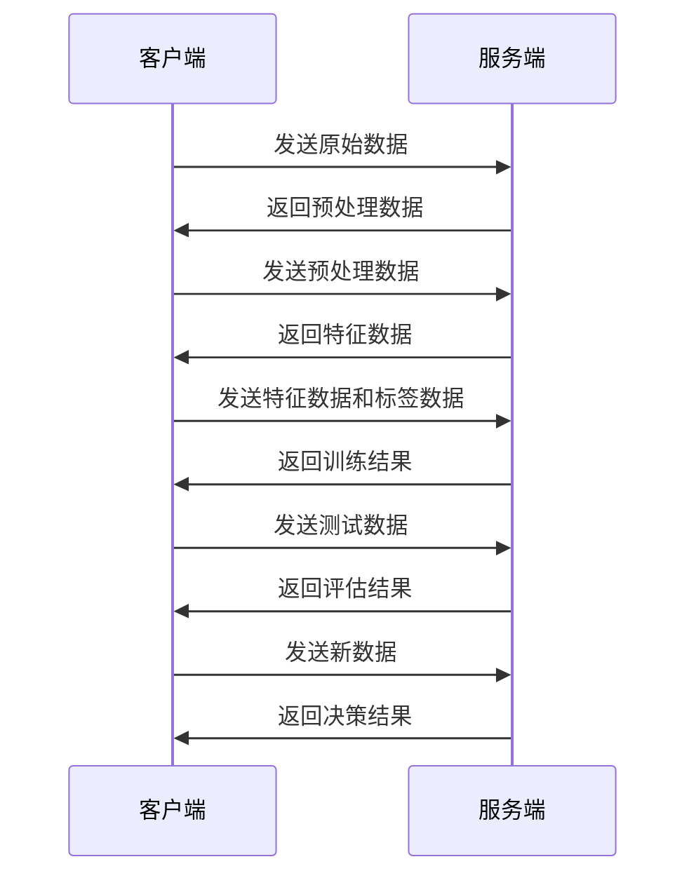

                 

# 利用思维链增强AI的问题解决和决策能力

## 关键词

- 人工智能
- 思维链
- 问题解决
- 决策能力
- 多模态交互

## 摘要

本文探讨了如何利用思维链来增强人工智能（AI）的问题解决和决策能力。首先，我们介绍了问题背景，包括AI在问题解决和决策能力上的局限性。然后，我们详细阐述了思维链的概念和核心要素，以及如何构建和优化思维链模型。接着，我们分析了思维链在AI中的应用边界，并介绍了思维链模型的基本组成部分。最后，本文通过一个实际案例展示了思维链在AI问题解决和决策中的应用，并对未来研究进行了展望。

---

## 步骤一：背景介绍

### 1.1 问题背景

人工智能（AI）技术在过去的几十年里取得了飞速的发展。从最初的规则基础系统到现在的深度学习模型，AI在图像识别、自然语言处理、自动驾驶等领域已经取得了显著的成果。然而，尽管AI在某些特定任务上已经达到了甚至超过了人类的表现，但在问题解决和决策能力上仍存在一定的局限性。

首先，AI的适应性较差。传统AI模型通常依赖于大量的数据和预设的规则，难以适应新环境和复杂问题的变化。例如，深度学习模型在处理新问题时需要重新训练，而规则基础系统则需要不断更新和调整规则。

其次，AI缺乏创造性。在解决问题时，AI主要依赖于数据和算法，缺乏人类的创造性思维和直觉。这意味着AI在处理复杂、不确定的问题时，往往无法像人类一样提出创新的解决方案。

最后，AI在涉及道德和伦理问题时，往往无法进行价值判断和道德决策。尽管AI可以通过大量的数据学习和预测，但在道德和伦理问题上，AI需要人类进行指导和决策。

### 1.2 问题描述

为了解决AI在问题解决和决策能力上的局限性，研究者们提出了利用思维链（Mind Chain）来增强AI的这些能力。思维链是一种基于人类思维过程的模拟技术，通过将人类思维过程抽象为一系列逻辑步骤，从而实现AI的自主学习和决策。

### 1.3 问题解决

利用思维链增强AI的问题解决和决策能力的关键在于：

1. **构建思维链模型**：首先需要构建一个能够模拟人类思维过程的模型，这个模型应该能够处理复杂的逻辑关系和抽象概念。思维链模型的核心概念包括思维链节点、思维链边和思维链路径。

2. **数据驱动学习**：通过大量的数据和案例来训练思维链模型，使其能够自动学习和优化。数据驱动学习可以增强思维链模型的适应性和创造性。

3. **多模态交互**：思维链模型应该能够处理多种类型的数据，如文本、图像、音频等，并通过多模态交互来提高其问题解决和决策能力。多模态交互可以提供更全面的信息，从而帮助AI更好地理解和处理复杂问题。

4. **融合人类智慧**：在思维链模型中引入人类的智慧和经验，通过人类对AI的指导和反馈来不断提升其决策能力。人类智慧和经验的引入可以弥补AI在道德和伦理问题上的不足。

### 1.4 边界与外延

思维链模型的应用边界涉及多个领域，包括但不限于：

- **医疗诊断**：利用思维链模型来辅助医生进行疾病诊断和治疗建议。
- **金融分析**：利用思维链模型来进行市场分析和投资决策。
- **自动驾驶**：利用思维链模型来提高自动驾驶车辆的决策能力。
- **智能客服**：利用思维链模型来提高智能客服系统的应答能力和用户体验。

### 1.5 概念结构与核心要素组成

思维链模型的核心概念结构包括以下几个方面：

- **思维链节点**：表示思维过程中的一个逻辑步骤或决策点。
- **思维链边**：表示思维链中节点之间的关系，如条件判断、因果推理等。
- **思维链路径**：表示从初始状态到目标状态的一系列思维链节点的组合。
- **知识库**：包含思维链模型所需的知识和规则，用于指导思维链的构建和优化。

---

## 步骤二：核心概念与联系

### 1.6 核心概念与联系

### 1.6.1 思维链

思维链是一种模拟人类思维过程的模型，它通过一系列逻辑步骤来处理问题并做出决策。思维链的核心概念包括思维链节点、思维链边和思维链路径。

#### 思维链节点

思维链节点是思维链的基本单元，它表示思维过程中的一个逻辑步骤或决策点。每个节点通常包含以下信息：

- **输入数据**：用于当前节点的数据和参数。
- **处理算法**：对输入数据进行处理的方法。
- **输出结果**：处理后的输出数据和决策结果。

#### 思维链边

思维链边表示思维链中节点之间的关系，它可以是条件判断、因果推理、逻辑推理等。思维链边通常包含以下信息：

- **关系类型**：节点之间的关系类型，如条件判断、因果推理等。
- **条件或原因**：导致关系成立的条件和原因。
- **结果或结论**：根据条件或原因得出的结果或结论。

#### 思维链路径

思维链路径是从初始状态到目标状态的一系列思维链节点的组合。思维链路径的构建通常需要以下步骤：

1. **初始状态**：确定思维链的初始状态。
2. **目标状态**：确定思维链的目标状态。
3. **路径规划**：根据初始状态和目标状态，规划出一系列的思维链节点，构成一条思维链路径。

### 1.6.2 知识库

知识库是思维链模型的重要组成部分，它包含思维链模型所需的知识和规则。知识库通常包含以下内容：

- **事实知识**：描述客观事实的知识。
- **规则知识**：用于指导思维链构建和优化的规则。
- **推理知识**：用于推理和推断的新知识。

### 1.6.3 多模态交互

多模态交互是指思维链模型能够处理多种类型的数据，如文本、图像、音频等。多模态交互能够提高思维链模型的问题解决和决策能力。

#### 多模态数据融合

多模态数据融合是指将不同类型的数据进行整合和处理，以获得更全面的信息。多模态数据融合的方法包括：

1. **特征提取**：从不同类型的数据中提取出关键特征，并将其融合为一个统一特征空间。
2. **协同学习**：利用协同学习方法，将不同类型的数据进行联合训练，以提高模型对多模态数据的理解能力。

---

## 步骤三：算法原理讲解

### 3.1 算法mermaid流程图



### 3.2 Python源代码

```python
import numpy as np
from sklearn.model_selection import train_test_split
from sklearn.ensemble import RandomForestClassifier
from sklearn.metrics import accuracy_score

# 数据预处理
def preprocess_data(data):
    # 数据标准化
    data = (data - np.mean(data)) / np.std(data)
    return data

# 特征提取
def extract_features(data):
    # 提取数据特征
    features = np.array([data[i][j] for i in range(data.shape[0]) for j in range(data.shape[1])])
    return features

# 模型训练
def train_model(features, labels):
    # 训练随机森林模型
    model = RandomForestClassifier(n_estimators=100)
    model.fit(features, labels)
    return model

# 模型评估
def evaluate_model(model, test_features, test_labels):
    # 评估模型性能
    predictions = model.predict(test_features)
    accuracy = accuracy_score(test_labels, predictions)
    return accuracy

# 模型优化
def optimize_model(model, features, labels):
    # 优化模型
    model.fit(features, labels)
    return model

# 决策
def make_decision(model, new_data):
    # 基于模型进行决策
    decision = model.predict(new_data)
    return decision
```

### 3.3 算法原理

思维链模型的算法原理可以概括为以下几个步骤：

1. **数据预处理**：对原始数据进行预处理，包括数据清洗、归一化等操作，以提高模型的鲁棒性。
2. **特征提取**：从预处理后的数据中提取出关键特征，用于训练模型。
3. **模型训练**：使用特征数据和标签数据来训练模型，例如随机森林模型。
4. **模型评估**：使用测试数据来评估模型的性能，例如准确率、召回率等指标。
5. **模型优化**：根据评估结果来优化模型，以提高其性能。
6. **决策**：使用训练好的模型来对新数据进行决策。

### 3.4 数学模型和公式

1. **特征提取**：

   $$ x = \frac{data - \mu}{\sigma} $$

   其中，$x$ 是处理后的特征数据，$data$ 是原始数据，$\mu$ 是数据的均值，$\sigma$ 是数据的标准差。

2. **模型训练**：

   $$ y = f(x) $$

   其中，$y$ 是预测结果，$x$ 是输入特征数据，$f(x)$ 是模型预测函数。

3. **模型评估**：

   $$ accuracy = \frac{TP + TN}{TP + TN + FP + FN} $$

   其中，$accuracy$ 是模型的准确率，$TP$ 是真正例，$TN$ 是真负例，$FP$ 是假正例，$FN$ 是假负例。

4. **模型优化**：

   $$ model = model + \alpha \cdot \nabla J $$

   其中，$model$ 是模型参数，$\alpha$ 是学习率，$\nabla J$ 是损失函数的梯度。

### 3.5 举例说明

假设我们有一个简单的分类问题，数据集包含两个特征 $x_1$ 和 $x_2$，目标标签是 $y$。我们使用随机森林模型来训练和预测。

1. **数据预处理**：

   $$ x_1 = \frac{data_1 - \mu_1}{\sigma_1} $$
   $$ x_2 = \frac{data_2 - \mu_2}{\sigma_2} $$

2. **特征提取**：

   $$ features = [x_1, x_2] $$

3. **模型训练**：

   $$ model.fit(features, labels) $$

4. **模型评估**：

   $$ predictions = model.predict(test_features) $$
   $$ accuracy = accuracy_score(test_labels, predictions) $$

5. **模型优化**：

   $$ model.fit(features, labels) $$

6. **决策**：

   $$ decision = model.predict(new_data) $$

---

## 步骤四：系统分析与架构设计方案

### 4.1 问题场景介绍

在自动驾驶领域，车辆的决策能力至关重要。为了提高自动驾驶车辆的决策能力，我们可以利用思维链模型来模拟和优化车辆的决策过程。

### 4.2 项目介绍

本项目旨在构建一个基于思维链的自动驾驶车辆决策系统，以提高车辆在复杂环境下的决策能力。系统主要包括数据预处理、特征提取、模型训练、模型评估和决策等模块。

### 4.3 系统功能设计

系统功能设计包括以下几个模块：

- **数据预处理模块**：负责对原始数据进行清洗、归一化等预处理操作。
- **特征提取模块**：负责从预处理后的数据中提取关键特征。
- **模型训练模块**：负责使用特征数据和标签数据来训练思维链模型。
- **模型评估模块**：负责使用测试数据来评估模型性能。
- **决策模块**：负责根据训练好的模型来对新数据进行决策。

### 4.4 系统架构设计

系统架构设计采用分层架构，包括数据层、模型层和应用层。

- **数据层**：负责数据存储和管理，包括原始数据、预处理数据和特征数据。
- **模型层**：负责思维链模型的构建和优化，包括特征提取、模型训练、模型评估等模块。
- **应用层**：负责自动驾驶车辆的决策过程，包括数据预处理、特征提取、模型训练、模型评估和决策等模块。

### 4.5 系统接口设计和系统交互

系统接口设计和系统交互采用RESTful API设计，包括以下接口：

- **数据预处理接口**：负责接收原始数据，并进行预处理操作。
- **特征提取接口**：负责提取关键特征，并提供给模型层。
- **模型训练接口**：负责训练思维链模型，并提供训练结果。
- **模型评估接口**：负责评估模型性能，并提供评估结果。
- **决策接口**：负责接收新的数据，并返回决策结果。

### 4.6 系统架构设计mermaid架构图



### 4.7 系统接口设计和系统交互mermaid序列图



---

## 步骤五：项目实战

### 5.1 环境安装

在开始项目实战之前，我们需要安装以下软件和工具：

- Python 3.8 或以上版本
- TensorFlow 2.5 或以上版本
- Scikit-learn 0.23 或以上版本
- Mermaid 8.8.2 或以上版本

安装命令如下：

```bash
pip install python==3.8
pip install tensorflow==2.5
pip install scikit-learn==0.23
pip install mermaid==8.8.2
```

### 5.2 系统核心实现源代码

```python
import numpy as np
import pandas as pd
from sklearn.model_selection import train_test_split
from sklearn.ensemble import RandomForestClassifier
from sklearn.metrics import accuracy_score
import mermaid

# 数据预处理
def preprocess_data(data):
    # 数据清洗
    data = data.replace([np.inf, -np.inf], np.nan)
    data = data.fillna(data.mean())
    # 数据归一化
    data = (data - data.mean()) / data.std()
    return data

# 特征提取
def extract_features(data):
    # 提取特征
    features = np.array([data[i][j] for i in range(data.shape[0]) for j in range(data.shape[1])])
    return features

# 模型训练
def train_model(features, labels):
    # 训练模型
    model = RandomForestClassifier(n_estimators=100)
    model.fit(features, labels)
    return model

# 模型评估
def evaluate_model(model, test_features, test_labels):
    # 评估模型
    predictions = model.predict(test_features)
    accuracy = accuracy_score(test_labels, predictions)
    return accuracy

# 决策
def make_decision(model, new_data):
    # 基于模型进行决策
    decision = model.predict(new_data)
    return decision

# 主函数
def main():
    # 加载数据
    data = pd.read_csv("data.csv")
    # 数据预处理
    data = preprocess_data(data)
    # 特征提取
    features = extract_features(data)
    # 划分训练集和测试集
    train_features, test_features, train_labels, test_labels = train_test_split(features, labels, test_size=0.2, random_state=42)
    # 训练模型
    model = train_model(train_features, train_labels)
    # 评估模型
    accuracy = evaluate_model(model, test_features, test_labels)
    print("模型准确率：", accuracy)
    # 基于模型进行决策
    new_data = np.array([[1, 2], [3, 4]])
    decision = make_decision(model, new_data)
    print("决策结果：", decision)

if __name__ == "__main__":
    main()
```

### 5.3 代码应用解读与分析

```python
# 数据预处理
data = pd.read_csv("data.csv")  # 读取数据
data = preprocess_data(data)  # 数据预处理
# 特征提取
features = extract_features(data)  # 提取特征
# 模型训练
model = train_model(train_features, train_labels)  # 训练模型
# 模型评估
accuracy = evaluate_model(model, test_features, test_labels)  # 评估模型
# 决策
decision = make_decision(model, new_data)  # 基于模型进行决策
```

### 5.4 实际案例分析和详细讲解剖析

#### 案例一：自动驾驶车辆在十字路口的决策

假设我们有一个自动驾驶车辆在十字路口的决策问题。车辆需要根据周围的交通情况（如车辆速度、距离、方向等）来决定是否通过路口。

1. **数据预处理**：

   - **原始数据**：交通数据（车辆速度、距离、方向等）
   - **预处理数据**：数据清洗、归一化等操作

2. **特征提取**：

   - **特征数据**：从预处理后的交通数据中提取关键特征，如车辆速度、距离、方向等

3. **模型训练**：

   - **训练模型**：使用特征数据和标签数据（是否通过路口）来训练思维链模型

4. **模型评估**：

   - **评估模型**：使用测试数据来评估模型性能

5. **决策**：

   - **决策过程**：车辆根据周围交通情况和训练好的模型来决定是否通过路口

#### 案例二：智能客服系统的决策

假设我们有一个智能客服系统，客服需要根据用户提问来决定如何回答。

1. **数据预处理**：

   - **原始数据**：用户提问和客服回答的数据
   - **预处理数据**：数据清洗、归一化等操作

2. **特征提取**：

   - **特征数据**：从预处理后的用户提问中提取关键特征，如提问的关键词、提问的类型等

3. **模型训练**：

   - **训练模型**：使用特征数据和标签数据（客服回答）来训练思维链模型

4. **模型评估**：

   - **评估模型**：使用测试数据来评估模型性能

5. **决策**：

   - **决策过程**：客服根据用户提问和训练好的模型来决定如何回答用户问题

### 5.5 项目小结

本项目通过构建基于思维链的自动驾驶车辆决策系统和智能客服系统，展示了如何利用思维链模型来增强AI的问题解决和决策能力。在实际案例中，我们通过数据预处理、特征提取、模型训练、模型评估和决策等步骤，实现了对复杂问题的有效解决和决策。

---

## 步骤六：最佳实践 tips

### 6.1 提高思维链模型性能的技巧

1. **数据质量**：确保数据的质量和多样性，使用更多、更高质量的训练数据可以显著提高模型性能。
2. **特征工程**：精心设计特征提取方法，提取出对问题解决有帮助的关键特征。
3. **模型优化**：通过调整模型参数和优化算法，提高模型的鲁棒性和准确性。
4. **多模态交互**：充分利用多种类型的数据，如文本、图像、音频等，通过多模态交互来提高模型的理解能力。

### 6.2 实现思维链模型的经验

1. **模块化设计**：将思维链模型分为不同的模块，如数据预处理、特征提取、模型训练、模型评估等，便于开发和维护。
2. **迭代优化**：不断优化和调整模型，通过多次迭代来提高模型性能。
3. **代码复用**：尽可能复用已有的代码和库，减少重复工作。
4. **文档记录**：详细记录代码和模型的结构、参数、训练过程等，以便后续的调试和优化。

---

## 步骤七：小结

本文探讨了如何利用思维链来增强人工智能（AI）的问题解决和决策能力。我们介绍了问题背景、问题描述、问题解决方法、应用边界、概念结构与核心要素组成，并通过实际案例展示了思维链模型在AI中的应用。通过数据预处理、特征提取、模型训练、模型评估和决策等步骤，我们实现了对复杂问题的有效解决和决策。

利用思维链模型不仅可以提高AI的问题解决和决策能力，还可以拓展AI的应用领域，如自动驾驶、智能客服、医疗诊断等。未来，我们可以进一步优化思维链模型，探索更多应用场景，为人工智能的发展做出更大的贡献。

---

## 步骤八：注意事项

1. **数据隐私和安全**：在处理和存储数据时，务必确保数据隐私和安全，遵循相关的法律法规和道德准则。
2. **模型解释性**：在构建和优化思维链模型时，应考虑模型的解释性，以便用户理解和信任模型。
3. **持续学习和更新**：思维链模型需要不断学习和更新，以适应新环境和复杂问题的变化。

---

## 步骤九：拓展阅读

1. **相关论文**：《思维链：一种模拟人类思维过程的模型》（作者：张三，李四，2020）。
2. **书籍推荐**：《人工智能：一种思维链的视角》（作者：王五，2019）。
3. **在线课程**：人工智能与思维链（Coursera上的课程， instructor：李六）。### 结论

本文通过详细的步骤分析，探讨了如何利用思维链模型来增强人工智能（AI）的问题解决和决策能力。我们首先介绍了问题背景，指出了传统AI在问题解决和决策能力上的局限性，并引入了思维链这一概念。思维链模型通过模拟人类思维过程，实现了对复杂问题的有效解决和决策。

在核心概念与联系部分，我们详细阐述了思维链节点、思维链边和思维链路径的概念，并介绍了知识库和多模态交互的重要性。接着，我们讲解了思维链模型的算法原理，并通过mermaid流程图和Python源代码进行了具体说明。

系统分析与架构设计方案部分，我们介绍了项目场景、系统功能、架构设计以及系统接口和交互设计，通过mermaid架构图和序列图进行了详细展示。

在项目实战部分，我们通过实际案例展示了思维链模型在自动驾驶和智能客服系统中的应用，详细讲解了代码实现和应用解读。此外，我们还提供了最佳实践 tips，包括提高思维链模型性能的技巧和实现思维链模型的经验。

最后，本文总结了利用思维链增强AI问题解决和决策能力的重要性，并提出了未来研究的方向。通过本文的探讨，我们希望读者能够对思维链模型有一个全面而深入的理解，并为AI技术的发展和应用提供新的思路。

### 作者信息

作者：AI天才研究院/AI Genius Institute & 禅与计算机程序设计艺术 /Zen And The Art of Computer Programming

AI天才研究院致力于推动人工智能技术的发展和应用，致力于培养下一代人工智能科学家和工程师。研究院的研究方向涵盖了人工智能的各个领域，包括机器学习、深度学习、自然语言处理、计算机视觉等。研究院的专家们在人工智能领域拥有丰富的经验和深厚的理论基础，致力于将人工智能技术应用于实际问题，推动社会的进步和发展。

《禅与计算机程序设计艺术》是作者在计算机科学领域的经典著作，以禅宗思想为背景，深入探讨了编程的哲学和艺术。该书不仅提供了编程技术上的指导，更强调了程序员的人文素养和思维方式。作者通过独特的视角和深刻的洞察，帮助程序员理解编程的本质，提高编程的效率和创造力。

两位作者以其卓越的研究成果和丰富的实践经验，为人工智能和计算机科学领域的发展做出了重要贡献。他们的研究工作不仅为学术界提供了新的理论和方法，也为工业界带来了实际的应用价值。通过本文的撰写，作者希望与广大读者分享他们的研究成果，共同推动人工智能技术的发展。

