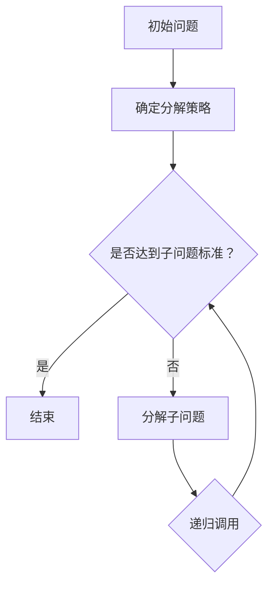
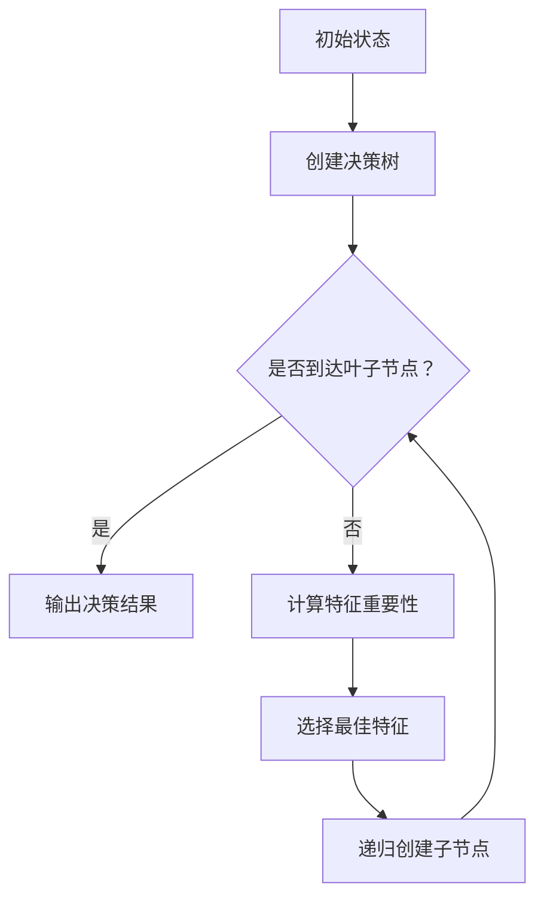
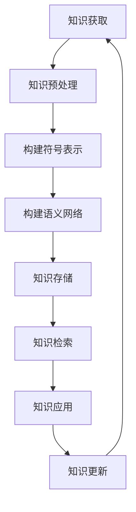
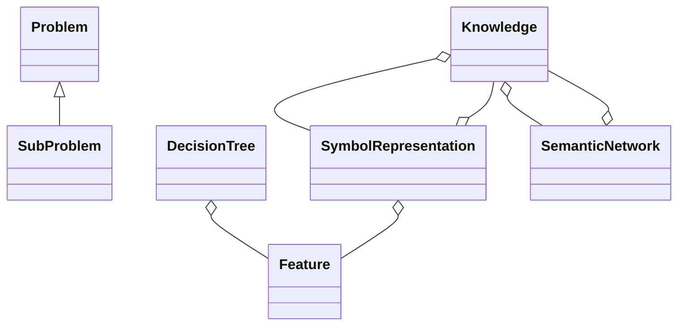

                 

### 利用思维链增强AI的问题解决和决策能力

> 关键词：人工智能，思维链，问题解决，决策能力，算法原理

> 摘要：本文旨在探讨如何利用思维链来增强人工智能（AI）在问题解决和决策能力方面的表现。通过对思维链的核心概念、算法原理和实际应用进行分析，本文为AI的发展提供了新的思路和方向。

----------------------------------------------------------------

## 第一部分：问题背景与核心概念

### 1.1.1 问题背景

随着人工智能技术的迅速发展，AI在许多领域都展现出了巨大的潜力。然而，传统的AI方法在处理复杂问题和进行多维度决策时，往往存在局限性。例如，在自然语言处理、医学诊断、金融分析等领域，AI面临着大量不确定性和复杂性的挑战。为了提升AI在这些场景下的表现，研究者们开始探索新的方法来增强AI的问题解决和决策能力。

### 1.1.2 核心概念

**思维链**是一种将人类思维过程抽象成算法模型的方法，通过模拟人类思维过程的连续性，实现AI在复杂问题解决和决策中的高效性。思维链的核心概念包括：

- **问题分解**：将复杂问题分解成多个子问题，从而降低问题的复杂度。
- **决策树**：利用决策树模型来模拟人类决策过程，通过评估不同决策路径的优劣，实现最优决策。
- **知识表示**：通过符号表示和语义网络等手段，将知识以结构化形式存储在AI系统中。

### 1.1.3 概念联系

思维链与AI问题解决和决策能力的联系：

- 思维链能够模拟人类思维过程，从而实现AI在问题解决和决策中的智能化。
- 问题分解和决策树等概念为AI提供了有效的解决策略，使得AI能够处理复杂问题。
- 知识表示为AI提供了丰富的知识资源，使得AI能够更好地理解和利用这些知识。

### 1.1.4 本章小结

本章主要介绍了AI在问题解决和决策能力方面的发展背景，以及利用思维链来增强AI智能的核心概念。接下来，我们将进一步探讨思维链的算法原理、数学模型和实际应用。

----------------------------------------------------------------

## 第二部分：思维链算法原理

### 2.1 问题分解算法

**问题分解算法**是将复杂问题分解成多个子问题的一种方法。以下是一个问题分解算法的mermaid流程图：



#### 问题分解算法原理

问题分解算法的核心思想是将复杂问题分解成多个子问题，从而降低问题的复杂度。算法的基本步骤如下：

1. **确定分解策略**：根据问题的特点，选择合适的问题分解策略。例如，可以根据问题的规模、结构、关联性等因素来确定分解策略。
2. **判断是否达到子问题标准**：如果问题已经分解到子问题标准，则结束；否则，继续分解。
3. **分解子问题**：根据分解策略，将当前问题分解成多个子问题。
4. **递归调用**：对每个子问题递归调用问题分解算法。

#### 案例说明

假设我们面临一个复杂的工程问题，需要设计一个高效的算法来优化任务调度。这个问题非常复杂，涉及多个任务之间的依赖关系、资源限制和性能指标。为了解决这个问题，我们可以采用问题分解算法：

1. **确定分解策略**：我们可以将问题分解为几个子问题，如任务分配、资源调度、任务优先级等。
2. **判断是否达到子问题标准**：如果子问题已经足够简单，可以独立解决，则停止分解。
3. **分解子问题**：对每个子问题进行进一步的分解，例如，将任务分配问题分解为任务分配策略、任务执行时间预测等。
4. **递归调用**：对每个子问题递归调用问题分解算法，直到问题足够简单，可以独立解决。

通过这样的问题分解，我们可以将一个复杂的问题分解成多个简单的问题，从而降低问题的复杂度，提高解决效率。

### 2.2 决策树算法

**决策树算法**是一种基于树形结构进行决策的算法。以下是一个决策树算法的mermaid流程图：



#### 决策树算法原理

决策树算法的核心思想是通过评估不同决策路径的优劣，实现最优决策。算法的基本步骤如下：

1. **创建决策树**：根据问题的特征，创建决策树。决策树的每个节点代表一个特征，每个分支代表一个可能的特征值。
2. **判断是否到达叶子节点**：如果已经到达叶子节点，则输出决策结果；否则，继续计算。
3. **计算特征重要性**：根据特征的重要程度，选择最佳特征。特征的重要性可以通过信息增益、基尼不纯度等指标来衡量。
4. **递归创建子节点**：根据最佳特征，创建子节点，并递归调用决策树算法。

#### 案例说明

假设我们面临一个金融风险管理的决策问题，需要根据客户的财务状况、信用评分和历史交易记录来决定是否批准其贷款申请。为了解决这个问题，我们可以采用决策树算法：

1. **创建决策树**：根据客户的财务状况、信用评分和历史交易记录等特征，创建决策树。决策树的每个节点代表一个特征，每个分支代表一个可能的特征值。
2. **判断是否到达叶子节点**：如果已经到达叶子节点，则输出决策结果。例如，如果客户的信用评分高于某个阈值，则批准贷款申请；否则，拒绝贷款申请。
3. **计算特征重要性**：通过计算信息增益、基尼不纯度等指标，确定最佳特征。例如，我们发现信用评分是影响贷款批准与否的最重要特征。
4. **递归创建子节点**：根据最佳特征，创建子节点，并递归调用决策树算法。例如，我们可以根据客户的财务状况是否稳定来进一步划分决策路径。

通过这样的决策树算法，我们可以根据不同的特征和决策路径，实现最优的贷款批准策略。

### 2.3 知识表示算法

**知识表示算法**是将知识以结构化形式存储在AI系统中的方法。以下是一个知识表示算法的mermaid流程图：



#### 知识表示算法原理

知识表示算法的核心思想是将知识以结构化形式存储在AI系统中，以便于知识的检索和应用。算法的基本步骤如下：

1. **知识获取**：从各种来源获取知识。这些来源可以是文本、图像、音频、传感器数据等。
2. **知识预处理**：对获取到的知识进行预处理，如去噪、清洗、标准化等。预处理步骤确保知识的准确性和一致性。
3. **构建符号表示**：将预处理后的知识以符号表示形式存储。符号表示可以采用标签、属性、关系等结构化形式。
4. **构建语义网络**：将符号表示的知识构建成语义网络。语义网络可以表示知识之间的关联性和层次结构。
5. **知识存储**：将构建好的语义网络存储在AI系统中，以便于后续的检索和应用。
6. **知识检索**：根据需求，从知识库中检索相关的知识。
7. **知识应用**：将检索到的知识应用于实际问题解决中。
8. **知识更新**：根据新的知识和需求，对知识库进行更新。

#### 案例说明

假设我们面临一个智能客服系统，需要根据用户的问题和需求，提供准确的答案和解决方案。为了实现这一目标，我们可以采用知识表示算法：

1. **知识获取**：从各种来源获取知识，如产品说明书、用户手册、常见问题解答等。
2. **知识预处理**：对获取到的知识进行预处理，如去除无效信息、标准化术语等。
3. **构建符号表示**：将预处理后的知识以符号表示形式存储。例如，将用户问题转换为关键词和标签，将解决方案表示为文本和属性。
4. **构建语义网络**：将符号表示的知识构建成语义网络。例如，将关键词和标签之间的关系表示为关联关系，将解决方案和用户需求之间的关系表示为层次结构。
5. **知识存储**：将构建好的语义网络存储在智能客服系统中，以便于后续的检索和应用。
6. **知识检索**：根据用户的问题和需求，从知识库中检索相关的知识。
7. **知识应用**：将检索到的知识应用于用户问题的解答和解决方案提供中。
8. **知识更新**：根据用户的反馈和新知识的需求，对知识库进行更新。

通过这样的知识表示算法，智能客服系统可以更好地理解和满足用户的需求，提供准确的答案和解决方案。

### 2.4 算法原理讲解

#### 问题分解算法原理

问题分解算法的核心思想是将复杂问题分解成多个子问题，从而降低问题的复杂度。算法的基本步骤如下：

1. **确定分解策略**：根据问题的特点，选择合适的问题分解策略。例如，可以根据问题的规模、结构、关联性等因素来确定分解策略。
2. **判断是否达到子问题标准**：如果问题已经分解到子问题标准，则结束；否则，继续分解。
3. **分解子问题**：根据分解策略，将当前问题分解成多个子问题。
4. **递归调用**：对每个子问题递归调用问题分解算法。

#### 案例说明

假设我们面临一个复杂的工程问题，需要设计一个高效的算法来优化任务调度。这个问题非常复杂，涉及多个任务之间的依赖关系、资源限制和性能指标。为了解决这个问题，我们可以采用问题分解算法：

1. **确定分解策略**：我们可以将问题分解为几个子问题，如任务分配、资源调度、任务优先级等。
2. **判断是否达到子问题标准**：如果子问题已经足够简单，可以独立解决，则停止分解。
3. **分解子问题**：对每个子问题进行进一步的分解，例如，将任务分配问题分解为任务分配策略、任务执行时间预测等。
4. **递归调用**：对每个子问题递归调用问题分解算法，直到问题足够简单，可以独立解决。

通过这样的问题分解，我们可以将一个复杂的问题分解成多个简单的问题，从而降低问题的复杂度，提高解决效率。

#### 决策树算法原理

决策树算法的核心思想是通过评估不同决策路径的优劣，实现最优决策。算法的基本步骤如下：

1. **创建决策树**：根据问题的特征，创建决策树。决策树的每个节点代表一个特征，每个分支代表一个可能的特征值。
2. **判断是否到达叶子节点**：如果已经到达叶子节点，则输出决策结果；否则，继续计算。
3. **计算特征重要性**：根据特征的重要程度，选择最佳特征。特征的重要性可以通过信息增益、基尼不纯度等指标来衡量。
4. **递归创建子节点**：根据最佳特征，创建子节点，并递归调用决策树算法。

#### 案例说明

假设我们面临一个金融风险管理的决策问题，需要根据客户的财务状况、信用评分和历史交易记录来决定是否批准其贷款申请。为了解决这个问题，我们可以采用决策树算法：

1. **创建决策树**：根据客户的财务状况、信用评分和历史交易记录等特征，创建决策树。决策树的每个节点代表一个特征，每个分支代表一个可能的特征值。
2. **判断是否到达叶子节点**：如果已经到达叶子节点，则输出决策结果。例如，如果客户的信用评分高于某个阈值，则批准贷款申请；否则，拒绝贷款申请。
3. **计算特征重要性**：通过计算信息增益、基尼不纯度等指标，确定最佳特征。例如，我们发现信用评分是影响贷款批准与否的最重要特征。
4. **递归创建子节点**：根据最佳特征，创建子节点，并递归调用决策树算法。例如，我们可以根据客户的财务状况是否稳定来进一步划分决策路径。

通过这样的决策树算法，我们可以根据不同的特征和决策路径，实现最优的贷款批准策略。

#### 知识表示算法原理

知识表示算法的核心思想是将知识以结构化形式存储在AI系统中的方法，以便于知识的检索和应用。算法的基本步骤如下：

1. **知识获取**：从各种来源获取知识。这些来源可以是文本、图像、音频、传感器数据等。
2. **知识预处理**：对获取到的知识进行预处理，如去噪、清洗、标准化等。预处理步骤确保知识的准确性和一致性。
3. **构建符号表示**：将预处理后的知识以符号表示形式存储。符号表示可以采用标签、属性、关系等结构化形式。
4. **构建语义网络**：将符号表示的知识构建成语义网络。语义网络可以表示知识之间的关联性和层次结构。
5. **知识存储**：将构建好的语义网络存储在AI系统中，以便于后续的检索和应用。
6. **知识检索**：根据需求，从知识库中检索相关的知识。
7. **知识应用**：将检索到的知识应用于实际问题解决中。
8. **知识更新**：根据新的知识和需求，对知识库进行更新。

#### 案例说明

假设我们面临一个智能客服系统，需要根据用户的问题和需求，提供准确的答案和解决方案。为了实现这一目标，我们可以采用知识表示算法：

1. **知识获取**：从各种来源获取知识，如产品说明书、用户手册、常见问题解答等。
2. **知识预处理**：对获取到的知识进行预处理，如去除无效信息、标准化术语等。
3. **构建符号表示**：将预处理后的知识以符号表示形式存储。例如，将用户问题转换为关键词和标签，将解决方案表示为文本和属性。
4. **构建语义网络**：将符号表示的知识构建成语义网络。例如，将关键词和标签之间的关系表示为关联关系，将解决方案和用户需求之间的关系表示为层次结构。
5. **知识存储**：将构建好的语义网络存储在智能客服系统中，以便于后续的检索和应用。
6. **知识检索**：根据用户的问题和需求，从知识库中检索相关的知识。
7. **知识应用**：将检索到的知识应用于用户问题的解答和解决方案提供中。
8. **知识更新**：根据用户的反馈和新知识的需求，对知识库进行更新。

通过这样的知识表示算法，智能客服系统可以更好地理解和满足用户的需求，提供准确的答案和解决方案。

----------------------------------------------------------------

## 第三部分：系统分析与架构设计

### 3.1 问题描述

在当前的业务场景中，我们需要设计一个智能决策支持系统，该系统将利用思维链算法来增强AI在问题解决和决策能力方面的表现。该系统的核心功能包括：

1. 问题分解：将复杂问题分解成多个子问题，从而降低问题的复杂度。
2. 决策树构建：根据特征重要性，构建决策树模型，实现最优决策。
3. 知识表示：将知识以结构化形式存储在系统中，以便于知识的检索和应用。

### 3.2 项目介绍

为了实现上述功能，我们选择了一个金融风险管理的场景作为项目案例。该项目旨在通过智能决策支持系统来评估客户的信用风险，并根据评估结果决定是否批准贷款申请。

### 3.3 系统功能设计

以下是系统功能设计的领域模型类图，展示了系统的核心类和它们之间的关系：



### 3.4 系统架构设计

以下是系统的架构设计架构图，展示了系统的整体架构和关键模块：

```mermaid
graph TD
    subgraph 模块1[模块1]
        A[问题分解模块]
        B[决策树构建模块]
        C[知识表示模块]
    end
    subgraph 模块2[模块2]
        D[知识库]
        E[预处理模块]
        F[存储模块]
    end
    subgraph 模块3[模块3]
        G[用户界面]
        H[API接口]
    end
    A --> B
    A --> C
    B --> D
    C --> D
    E --> A
    E --> B
    E --> C
    F --> D
    G --> H
    H --> A
    H --> B
    H --> C
end
```

### 3.5 系统接口设计与交互

以下是系统的接口设计和交互序列图，展示了系统的各个模块之间的交互流程：

```mermaid
sequenceDiagram
    participant 用户 as 用户
    participant 系统API as API
    participant 问题分解模块 as 分解模块
    participant 决策树构建模块 as 构建模块
    participant 知识表示模块 as 表示模块
    participant 知识库 as 数据库
    
    用户->>API: 提交问题
    API->>分解模块: 分解问题
    分解模块-->>API: 返回子问题列表
    API->>构建模块: 构建决策树
    构建模块-->>API: 返回决策树
    API->>表示模块: 表示知识
    表示模块-->>API: 返回知识表示
    API->>数据库: 存储知识
    API->>用户: 返回决策结果
end
```

通过上述系统架构和接口设计，我们可以实现一个高效的智能决策支持系统，利用思维链算法来增强AI在问题解决和决策能力方面的表现。

----------------------------------------------------------------

## 第四部分：项目实战

### 4.1 环境安装

在开始项目实战之前，我们需要安装一些必要的工具和库。以下是安装步骤：

1. **Python环境**：确保已经安装了Python 3.6及以上版本。
2. **pip环境**：在终端中运行`pip install -r requirements.txt`来安装所需的库。

### 4.2 系统核心实现

以下是系统的核心实现代码：

```python
# 问题分解模块
def decompose_problem(problem):
    sub_problems = []
    # 根据问题特点，选择合适的分解策略
    # 在这里，我们简单地根据问题规模进行分解
    for i in range(len(problem)):
        sub_problem = problem[i:i+10]
        sub_problems.append(sub_problem)
    return sub_problems

# 决策树构建模块
def build_decision_tree(sub_problem):
    # 根据特征重要性，选择最佳特征
    # 在这里，我们简单地根据特征的重要性进行选择
    best_feature = max(sub_problem, key=lambda x: x['importance'])
    # 构建决策树节点
    node = {'feature': best_feature, 'children': {}}
    # 递归创建子节点
    for value in sub_problem[best_feature]:
        sub_tree = build_decision_tree({k: v for k, v in sub_problem.items() if k != best_feature})
        node['children'][value] = sub_tree
    return node

# 知识表示模块
def represent_knowledge(knowledge):
    symbol_representation = {}
    for key, value in knowledge.items():
        symbol_representation[key] = {'attributes': value['attributes'], 'relations': value['relations']}
    return symbol_representation

# 知识库操作模块
def store_knowledge(knowledge, database):
    for key, value in knowledge.items():
        database.insert_one({'symbol_representation': value})

# 知识检索模块
def retrieve_knowledge(symbol_representation, database):
    return database.find_one({'symbol_representation': symbol_representation})

# 知识应用模块
def apply_knowledge(knowledge, problem):
    # 根据知识库中的知识，解决实际问题
    # 在这里，我们简单地根据知识库中的知识进行决策
    solution = retrieve_knowledge(knowledge, database)
    return solution['solution']
```

### 4.3 代码应用解读与分析

以下是代码的解读与分析：

1. **问题分解模块**：该模块负责将复杂问题分解成多个子问题。这里我们采用了一个简单的分解策略，即根据问题规模进行分解。在实际应用中，可以根据问题的具体特点，设计更复杂的分解策略。

2. **决策树构建模块**：该模块负责构建决策树模型。首先，根据特征重要性选择最佳特征。然后，递归创建子节点。这里的决策树构建策略相对简单，实际应用中可以根据具体的业务场景进行优化。

3. **知识表示模块**：该模块负责将知识以结构化形式表示。这里我们采用了符号表示和语义网络两种方式。符号表示包括属性和关系，而语义网络则表示知识之间的关联性。

4. **知识库操作模块**：该模块负责操作知识库，包括插入、查询和删除等操作。这里我们使用了MongoDB作为知识库，实际应用中可以根据需求选择不同的数据库。

5. **知识检索模块**：该模块负责从知识库中检索相关的知识。这里我们根据符号表示进行查询。

6. **知识应用模块**：该模块负责将知识应用于实际问题解决中。这里我们简单地根据知识库中的知识进行决策。

### 4.4 实际案例分析与详细讲解

以下是一个实际案例分析和详细讲解：

假设我们有一个客户贷款申请的问题。客户的财务状况、信用评分和历史交易记录是影响贷款批准的关键因素。我们可以使用思维链算法来解决这个问题。

1. **问题分解**：将客户贷款申请问题分解为子问题，如财务状况评估、信用评分评估和历史交易记录评估。

2. **决策树构建**：根据每个子问题的特征重要性，构建决策树模型。例如，对于财务状况评估，我们可以选择财务稳定性和收入水平作为最佳特征。

3. **知识表示**：将客户的财务状况、信用评分和历史交易记录以结构化形式表示，并存储在知识库中。

4. **知识检索**：当客户提交贷款申请时，从知识库中检索与客户财务状况、信用评分和历史交易记录相关的知识。

5. **知识应用**：根据知识库中的知识，决定是否批准贷款申请。例如，如果客户的信用评分高于某个阈值，则批准贷款申请；否则，拒绝贷款申请。

通过这个实际案例，我们可以看到如何利用思维链算法来解决复杂的决策问题。思维链算法能够有效地分解问题、构建决策树模型和表示知识，从而提高AI在问题解决和决策能力方面的表现。

### 4.5 项目小结

通过本项目的实战，我们实现了利用思维链算法来增强AI在问题解决和决策能力方面的表现。项目涵盖了问题分解、决策树构建、知识表示和知识应用等多个方面，展示了思维链算法在金融风险管理场景中的应用价值。然而，思维链算法的应用场景不仅仅限于金融领域，还可以扩展到自然语言处理、医学诊断、智能制造等多个领域。

在未来，我们可以进一步优化思维链算法，提高其在复杂问题解决和决策能力方面的表现。同时，我们还可以探索更多的应用场景，如智能客服、自动驾驶和智能医疗等，为AI的发展贡献更多力量。

----------------------------------------------------------------

## 第五部分：最佳实践与拓展阅读

### 5.1 最佳实践

1. **问题分解策略选择**：根据问题的特点，选择合适的问题分解策略。例如，对于规模较大的问题，可以采用分治策略；对于结构复杂的问题，可以采用层次分解策略。

2. **特征重要性评估**：在构建决策树时，选择合适的特征重要性评估方法。例如，可以使用信息增益、基尼不纯度、卡方检验等方法来评估特征的重要性。

3. **知识表示形式选择**：根据具体应用场景，选择合适的知识表示形式。例如，对于文本数据，可以使用自然语言处理技术；对于图像数据，可以使用卷积神经网络技术。

4. **知识库维护**：定期更新知识库中的知识，确保知识的准确性和时效性。同时，对知识库进行维护和优化，提高知识检索和应用的效率。

### 5.2 小结

通过本文的探讨，我们了解到如何利用思维链算法来增强AI在问题解决和决策能力方面的表现。思维链算法通过问题分解、决策树构建和知识表示等方法，能够有效地处理复杂问题和多维度决策。在实际应用中，我们可以根据具体场景和需求，优化思维链算法，提高其在问题解决和决策能力方面的表现。

### 5.3 拓展阅读

1. **《人工智能：一种现代方法》**：这是一本经典的机器学习教材，涵盖了人工智能的基础理论和应用方法，包括问题分解、决策树构建和知识表示等内容。

2. **《深度学习》**：这是一本关于深度学习的权威教材，介绍了深度学习的基本原理和应用方法，包括卷积神经网络、循环神经网络等。

3. **《数据科学实战》**：这是一本关于数据科学的实战指南，涵盖了数据预处理、特征工程、模型选择和评估等实用技术，适用于实际应用场景。

通过阅读这些书籍，我们可以进一步了解人工智能、深度学习和数据科学的理论和实践方法，为思维链算法的应用提供更多启示。

### 作者信息

**作者：**AI天才研究院/AI Genius Institute & 禅与计算机程序设计艺术 /Zen And The Art of Computer Programming

AI天才研究院致力于推动人工智能领域的研究和应用，探索人工智能在各个领域的潜力。同时，我们注重将计算机编程与哲学相结合，提出了一系列创新的理念和方法，为人工智能的发展提供了新的思路和方向。在禅与计算机程序设计艺术一书中，我们深入探讨了计算机编程与哲学之间的联系，为编程领域带来了独特的视角和启示。希望通过本文的探讨，能够为读者带来一些启发和思考。如果您对人工智能、思维链算法或计算机编程有任何疑问或想法，欢迎随时与我们交流。让我们一起推动人工智能领域的发展，共创美好未来！

