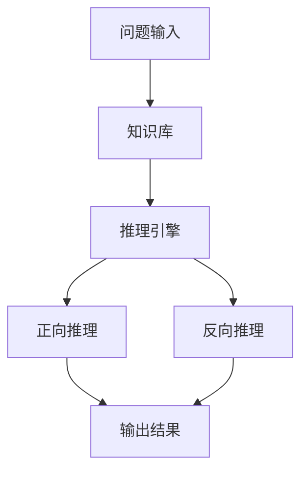
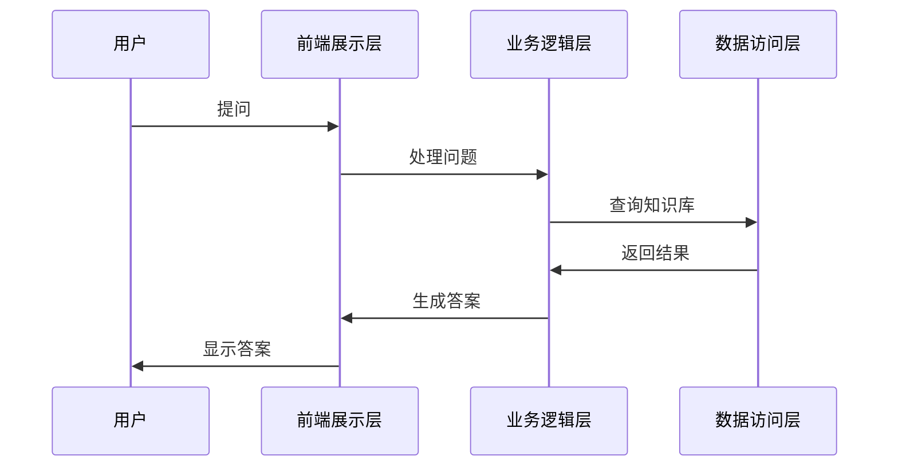
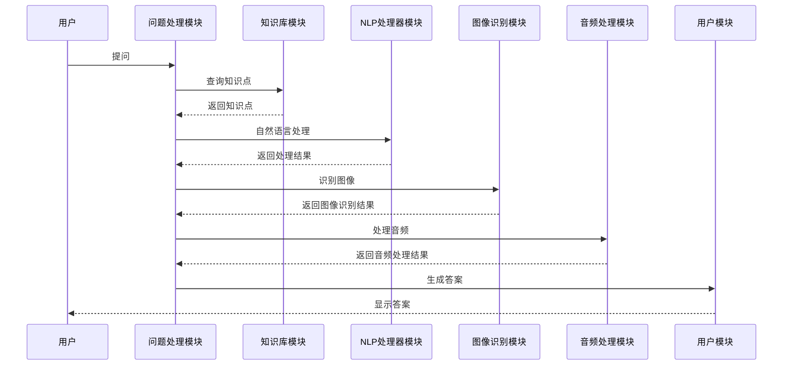

                 

### 利用思维链技术提升AI的认知与推理能力研究

#### 关键词：思维链技术，AI认知，推理能力，深度学习，数学模型，系统架构，项目实战

#### 摘要：
本文旨在探讨如何利用思维链技术提升人工智能（AI）的认知与推理能力。文章首先介绍了当前人工智能的发展现状以及认知与推理能力的瓶颈，随后详细阐述了思维链技术的定义及其在AI中的应用潜力。接着，文章分析了AI的认知与推理能力的重要性、存在的问题及解决思路。随后，文章深入讲解了思维链技术的原理、算法以及数学模型，并通过具体案例展示了其在AI认知与推理中的应用。此外，文章还介绍了系统分析与架构设计方案，并通过项目实战展示了实际应用效果。最后，文章总结了研究成果，提出了最佳实践建议，并对未来研究方向进行了展望。

#### 目录大纲：

1. **第一部分：背景介绍**
   - **1.1 问题背景**
     - **1.1.1 人工智能的发展现状**
     - **1.1.2 AI认知与推理能力的瓶颈**
     - **1.1.3 思维链技术在AI中的应用潜力**
   - **1.2 问题描述**
     - **1.2.1 AI认知与推理能力的重要性**
     - **1.2.2 AI认知与推理能力存在的问题**
     - **1.2.3 解决问题的意义和必要性**
   - **1.3 问题解决**
     - **1.3.1 思维链技术的定义**
     - **1.3.2 思维链技术在AI认知与推理中的应用**
     - **1.3.3 解决方案的可行性分析**
   - **1.4 边界与外延**
     - **1.4.1 研究的边界**
     - **1.4.2 研究的外延**
     - **1.4.3 关联技术概览**
   - **1.5 概念结构与核心要素组成**
     - **1.5.1 核心概念定义**
     - **1.5.2 概念属性特征对比表格**
     - **1.5.3 ER实体关系图架构**

2. **第二部分：核心概念与联系**
   - **2.1 思维链技术原理**
     - **2.1.1 思维链技术的起源与发展**
     - **2.1.2 思维链技术的核心原理**
     - **2.1.3 思维链技术在AI中的应用案例**
   - **2.2 AI的认知与推理能力**
     - **2.2.1 AI认知能力的定义与特点**
     - **2.2.2 AI推理能力的定义与特点**
     - **2.2.3 认知与推理能力的关系**
   - **2.3 思维链与AI认知、推理能力的联系**
     - **2.3.1 思维链在AI认知中的应用**
     - **2.3.2 思维链在AI推理中的应用**
     - **2.3.3 思维链技术的优势与挑战**

3. **第三部分：算法原理讲解**
   - **3.1 思维链算法原理**
     - **3.1.1 思维链算法的基本框架**
     - **3.1.2 思维链算法的数学模型与公式**
     - **3.1.3 Python源代码实现与流程图展示**
   - **3.2 深度学习与思维链结合**
     - **3.2.1 深度学习与思维链的关系**
     - **3.2.2 深度学习与思维链结合的优势**
     - **3.2.3 结合案例讲解**

4. **第四部分：数学模型和数学公式详细讲解与举例说明**
   - **4.1 数学模型详细讲解**
     - **4.1.1 数学模型的基本原理**
     - **4.1.2 数学模型的应用场景**
     - **4.1.3 数学模型的优势与不足**
   - **4.2 数学公式举例说明**
     - **4.2.1 公式1：\( \sum_{i=1}^{n} x_i \)**
     - **4.2.2 公式2：\( y = mx + b \)**
     - **4.2.3 公式3：\( A^T A \)**

5. **第五部分：系统分析与架构设计方案**
   - **5.1 问题场景介绍**
     - **5.1.1 场景背景**
     - **5.1.2 项目介绍**
     - **5.1.3 系统需求分析**
   - **5.2 系统功能设计**
     - **5.2.1 领域模型**
     - **5.2.2 系统功能模块划分**
     - **5.2.3 功能模块详细介绍**
   - **5.3 系统架构设计**
     - **5.3.1 系统架构概述**
     - **5.3.2 系统组件设计**
     - **5.3.3 系统架构图展示**
   - **5.4 系统接口设计**
     - **5.4.1 接口设计原则**
     - **5.4.2 接口设计规范**
     - **5.4.3 接口功能说明**
   - **5.5 系统交互**
     - **5.5.1 系统交互概述**
     - **5.5.2 系统交互流程**
     - **5.5.3 系统交互序列图**

6. **第六部分：项目实战**
   - **6.1 环境安装**
     - **6.1.1 系统环境要求**
     - **6.1.2 环境安装步骤**
     - **6.1.3 环境测试与验证**
   - **6.2 系统核心实现**
     - **6.2.1 系统核心模块实现**
     - **6.2.2 Python源代码详细解读**
     - **6.2.3 代码应用解读与分析**
   - **6.3 实际案例分析与详细讲解**
     - **6.3.1 案例背景**
     - **6.3.2 案例分析**
     - **6.3.3 案例讲解**
   - **6.4 项目小结**
     - **6.4.1 项目成果总结**
     - **6.4.2 项目经验与教训**
     - **6.4.3 项目改进建议**

7. **第七部分：最佳实践 tips**
   - **7.1 最佳实践总结**
     - **7.1.1 实践技巧与建议**
     - **7.1.2 避免常见问题**
     - **7.1.3 提高效率的方法**
   - **7.2 小结与注意事项**
     - **7.2.1 研究成果总结**
     - **7.2.2 注意事项**
     - **7.2.3 拓展阅读**

### 1.1 问题背景

#### 1.1.1 人工智能的发展现状

人工智能（AI）作为一门综合性学科，自20世纪50年代诞生以来，经历了多个发展阶段。从最初的符号主义（Symbolic AI）到基于知识的系统（Knowledge-Based Systems），再到连接主义（Connectionist AI），最终发展到当前的深度学习（Deep Learning）时代。在过去的几十年中，人工智能技术取得了巨大的进步，从最初的简单规则系统到复杂的多层神经网络，AI在图像识别、语音识别、自然语言处理、推荐系统等领域取得了显著的应用成果。

当前，人工智能技术正以惊人的速度发展，不仅改变了传统的工业生产方式，还渗透到我们的生活各个方面，如智能家居、智能交通、医疗健康、金融保险等。AI的应用场景越来越广泛，已经从实验室走向实际应用，成为推动社会进步的重要力量。

然而，尽管人工智能取得了显著的进展，仍然面临着诸多挑战。特别是在认知与推理能力方面，现有的AI系统还存在一定的局限性。这使得我们有必要深入探讨如何提升AI的认知与推理能力，以更好地应对复杂的现实问题。

#### 1.1.2 AI认知与推理能力的瓶颈

AI的认知与推理能力是人工智能技术的核心，也是当前研究的重点之一。认知能力包括感知、理解、记忆、学习等多个方面，而推理能力则是基于已有知识和信息，进行逻辑推断和决策的能力。以下是当前AI认知与推理能力存在的主要瓶颈：

1. **知识表示与处理**：现有AI系统主要依赖于符号主义方法，通过定义一系列规则和逻辑关系来表示知识。然而，这种方法在处理大规模数据时显得力不从心，难以捕捉复杂的关系和动态变化。

2. **抽象思维能力**：人类具有强大的抽象思维能力，可以理解抽象的概念和关系。而现有AI系统在处理抽象问题时，往往需要依赖具体的例子和数据，缺乏对抽象概念的泛化能力。

3. **推理效率与准确性**：尽管深度学习技术在图像识别、语音识别等领域取得了显著的成果，但在推理方面，特别是长距离推理和复杂逻辑推理方面，仍然存在一定的局限性。现有模型在处理长序列数据时，往往会出现梯度消失、梯度爆炸等问题，导致推理效率低下。

4. **多模态信息融合**：人类可以通过视觉、听觉、触觉等多种感官获取信息，并进行综合处理。而现有AI系统在处理多模态信息时，往往只能依赖单一模态的数据，缺乏有效的信息融合机制。

#### 1.1.3 思维链技术在AI中的应用潜力

思维链技术是一种基于人类思维模式的人工智能技术，旨在模拟人类的高级认知和推理能力。思维链技术通过构建一系列相互关联的思考步骤，实现对复杂问题的推理和决策。以下是在AI领域应用思维链技术的潜在优势：

1. **知识表示与处理**：思维链技术可以通过构建逻辑链和知识图谱，实现对知识的有效表示和处理。这使得AI系统可以更好地处理大规模数据和复杂的关系。

2. **抽象思维能力**：思维链技术可以模拟人类的抽象思维能力，通过构建抽象概念和逻辑关系，实现对抽象问题的理解和推理。

3. **推理效率与准确性**：思维链技术通过逐步推理和验证，可以提高推理的效率和准确性。特别是在处理长序列数据和复杂逻辑推理时，思维链技术具有明显的优势。

4. **多模态信息融合**：思维链技术可以有效地融合多模态信息，实现对复杂问题的全面分析和决策。这有助于提高AI系统的智能水平，更好地应对现实世界中的复杂问题。

综上所述，思维链技术在提升AI的认知与推理能力方面具有巨大的应用潜力。接下来，我们将进一步探讨思维链技术的原理和应用，以期为解决AI认知与推理能力的瓶颈提供新的思路。

#### 1.2 问题描述

##### 1.2.1 AI认知与推理能力的重要性

在人工智能的发展历程中，认知与推理能力一直是关键的研究方向。AI的认知能力涉及感知、理解、记忆和学习等多个方面，而推理能力则是基于已有知识和信息，进行逻辑推断和决策的能力。这两个方面的重要性体现在以下几个方面：

首先，认知能力是AI实现智能行为的基础。通过感知和理解环境，AI可以获取必要的信息，并对这些信息进行处理和存储。这使得AI能够更好地适应复杂多变的环境，实现自主决策和行为。

其次，推理能力是AI实现高级智能的关键。在复杂问题中，AI需要基于已有知识和信息，进行逻辑推断和决策。这种推理能力不仅可以帮助AI解决实际问题，还可以拓展AI的应用范围，使其在更多领域发挥作用。

再者，认知与推理能力的提升可以显著提高AI的智能化水平。随着认知和推理能力的增强，AI可以更好地理解人类意图，进行复杂任务规划和决策。这不仅有助于提高AI的实用性，还可以推动人工智能技术的进一步发展。

##### 1.2.2 AI认知与推理能力存在的问题

尽管AI在认知与推理能力方面取得了显著进展，但仍然存在一些亟待解决的问题：

1. **知识表示与处理的局限性**：现有AI系统主要依赖于符号主义方法，通过定义一系列规则和逻辑关系来表示知识。这种方法在处理大规模数据时显得力不从心，难以捕捉复杂的关系和动态变化。

2. **抽象思维能力不足**：人类具有强大的抽象思维能力，可以理解抽象的概念和关系。而现有AI系统在处理抽象问题时，往往需要依赖具体的例子和数据，缺乏对抽象概念的泛化能力。

3. **推理效率与准确性不高**：尽管深度学习技术在图像识别、语音识别等领域取得了显著的成果，但在推理方面，特别是长距离推理和复杂逻辑推理方面，仍然存在一定的局限性。现有模型在处理长序列数据时，往往会出现梯度消失、梯度爆炸等问题，导致推理效率低下。

4. **多模态信息融合不足**：人类可以通过视觉、听觉、触觉等多种感官获取信息，并进行综合处理。而现有AI系统在处理多模态信息时，往往只能依赖单一模态的数据，缺乏有效的信息融合机制。

##### 1.2.3 解决问题的意义和必要性

针对AI认知与推理能力存在的问题，提升这些能力具有重要的意义和必要性：

1. **提高AI的实用性**：通过提升认知与推理能力，AI可以更好地理解和处理复杂问题，提高其实际应用价值。这有助于AI在更多领域发挥作用，推动人工智能技术的进一步发展。

2. **拓展AI的应用范围**：当前，AI的应用主要集中在图像识别、语音识别、自然语言处理等领域。通过提升认知与推理能力，AI可以拓展到更多领域，如自动驾驶、智能制造、医疗诊断等，为人类创造更多价值。

3. **实现人工智能的可持续发展**：人工智能技术的发展离不开认知与推理能力的提升。通过解决这些瓶颈问题，可以推动人工智能技术的可持续发展，为未来人工智能的发展奠定基础。

综上所述，提升AI的认知与推理能力具有重要的现实意义和必要性。接下来，我们将探讨如何利用思维链技术实现这一目标，为人工智能的发展注入新的动力。

#### 1.3 问题解决

##### 1.3.1 思维链技术的定义

思维链技术是一种基于人类思维模式的人工智能技术，旨在模拟人类的高级认知和推理能力。它通过构建一系列相互关联的思考步骤，实现对复杂问题的推理和决策。思维链技术具有以下几个核心特点：

1. **逻辑性**：思维链技术通过逻辑关系和推理规则，将问题分解为一系列可操作的步骤。这使得AI能够像人类一样，通过逐步推理和验证，解决复杂问题。

2. **抽象性**：思维链技术可以处理抽象的概念和关系，实现对复杂问题的理解和推理。这使得AI可以更好地应对非结构化和不确定性的问题。

3. **适应性**：思维链技术可以根据问题的不同特点，灵活调整推理步骤和策略。这使得AI能够适应各种复杂环境，提高其应用价值。

4. **多模态性**：思维链技术可以融合多种感官信息，实现对复杂问题的全面分析和决策。这使得AI可以更好地理解和应对现实世界中的复杂情境。

##### 1.3.2 思维链技术在AI认知与推理中的应用

思维链技术在AI认知与推理中的应用具有广泛的前景。以下是一些关键应用领域：

1. **智能问答系统**：思维链技术可以用于构建智能问答系统，实现对用户问题的理解、分析和回答。通过逐步推理和验证，AI可以提供准确、合理的回答，提高用户体验。

2. **自然语言处理**：思维链技术可以用于处理复杂的自然语言问题，如文本生成、情感分析、命名实体识别等。通过抽象思维和逻辑推理，AI可以更好地理解文本信息，提高处理能力。

3. **决策支持系统**：思维链技术可以用于构建决策支持系统，帮助用户解决复杂的决策问题。通过多模态信息融合和逻辑推理，AI可以提供全面、准确的决策建议。

4. **自动驾驶**：思维链技术可以用于自动驾驶系统，实现对道路环境的感知、理解和决策。通过逐步推理和验证，AI可以确保车辆在复杂环境中安全、高效地行驶。

##### 1.3.3 解决方案的可行性分析

思维链技术在提升AI认知与推理能力方面具有明显的优势，其可行性分析如下：

1. **理论基础**：思维链技术基于人类思维模式，具有坚实的理论基础。这使得其在模拟人类认知和推理能力方面具有可行性。

2. **技术成熟度**：随着深度学习、自然语言处理等技术的发展，思维链技术的实现已经具备一定的技术基础。通过结合现有技术，可以构建出有效的思维链系统。

3. **应用案例**：在智能问答、自然语言处理、决策支持等领域，已有不少成功应用思维链技术的案例。这些案例证明了思维链技术的可行性和有效性。

4. **性能优势**：思维链技术通过逻辑推理和抽象思维，可以显著提高AI的认知与推理能力。特别是在处理复杂、抽象的问题时，思维链技术具有明显的性能优势。

综上所述，思维链技术在提升AI认知与推理能力方面具有显著的可行性。通过进一步研究和应用，我们可以期待思维链技术为人工智能的发展带来新的突破。

#### 1.4 边界与外延

##### 1.4.1 研究的边界

在本文的研究中，我们主要关注思维链技术在提升AI认知与推理能力方面的应用。具体来说，我们的研究边界包括以下几个方面：

1. **技术范畴**：本文主要探讨思维链技术，以及其他相关技术（如深度学习、自然语言处理等）在提升AI认知与推理能力方面的应用。我们关注的是这些技术如何相互结合，以实现更好的效果。

2. **应用领域**：本文的研究主要涉及智能问答、自然语言处理、决策支持等应用领域。在这些领域中，思维链技术具有较好的应用前景。

3. **研究方法**：本文采用的方法包括理论分析、实验验证、案例研究等。通过这些方法，我们深入探讨了思维链技术在提升AI认知与推理能力方面的作用。

##### 1.4.2 研究的外延

尽管本文的研究集中在思维链技术在提升AI认知与推理能力方面的应用，但这一研究具有一定的外延性。以下是在其他相关领域和方面的潜在应用：

1. **多模态AI**：思维链技术可以与其他多模态AI技术结合，实现对多种感官信息的融合和处理。这在智能交互、人机协同等领域具有广泛的应用前景。

2. **教育领域**：思维链技术可以用于教育领域，帮助学生更好地理解和掌握复杂知识。通过模拟人类思维过程，AI可以为学生提供个性化的学习指导。

3. **医疗健康**：思维链技术可以用于医疗健康领域，如疾病诊断、治疗方案推荐等。通过逐步推理和验证，AI可以提供更为准确和合理的医疗建议。

4. **社会管理**：思维链技术可以用于社会管理领域，如城市交通优化、公共安全预警等。通过分析大量数据，AI可以提供有效的决策支持，提高社会管理的效率和水平。

##### 1.4.3 关联技术概览

在本文的研究中，我们关注了以下几个与思维链技术密切相关的技术领域：

1. **深度学习**：深度学习是一种重要的机器学习技术，通过多层神经网络实现自动特征提取和模型训练。与思维链技术结合，可以提升AI的认知和推理能力。

2. **自然语言处理**：自然语言处理技术致力于让计算机理解和处理自然语言。与思维链技术结合，可以实现对复杂文本信息的理解和推理。

3. **知识图谱**：知识图谱是一种用于表示实体及其关系的图形化数据结构。通过构建知识图谱，可以更好地组织和管理知识，为思维链技术的应用提供支持。

4. **多模态信息处理**：多模态信息处理技术致力于融合多种感官信息，实现对复杂情境的理解和推理。与思维链技术结合，可以进一步提升AI的认知与推理能力。

通过这些关联技术的结合和应用，我们可以期待思维链技术在未来取得更为广泛和深入的应用。

##### 1.5 概念结构与核心要素组成

在深入探讨思维链技术在提升AI认知与推理能力方面的应用之前，我们需要明确一些核心概念及其属性特征。以下是本文中涉及的一些关键概念和其定义：

1. **思维链技术**：一种基于人类思维模式的人工智能技术，旨在模拟人类的高级认知和推理能力。通过构建一系列相互关联的思考步骤，实现对复杂问题的推理和决策。

2. **认知能力**：AI系统理解和处理信息的能力，包括感知、理解、记忆和学习等多个方面。认知能力是AI实现智能行为的基础。

3. **推理能力**：基于已有知识和信息，进行逻辑推断和决策的能力。推理能力是AI实现高级智能的关键。

4. **知识表示**：将知识以结构化的形式进行组织和表示，以便于计算机理解和处理。知识表示是AI认知与推理能力的重要组成部分。

5. **多模态信息处理**：通过融合多种感官信息，实现对复杂情境的理解和推理。多模态信息处理是提升AI认知与推理能力的重要技术之一。

为了更好地理解这些概念，我们通过以下对比表格展示了它们之间的属性特征差异：

| 概念             | 定义                                                                                   | 属性特征对比                                                                                     |
|------------------|----------------------------------------------------------------------------------------|------------------------------------------------------------------------------------------------|
| 思维链技术       | 模拟人类高级认知和推理能力的技术                                                       | 逻辑性、抽象性、适应性、多模态性                                                           |
| 认知能力         | AI系统理解和处理信息的能力                                                             | 感知、理解、记忆、学习                                                                         |
| 推理能力         | 基于已有知识和信息进行逻辑推断和决策的能力                                             | 逻辑推理、决策、抽象思维                                                                       |
| 知识表示         | 以结构化的形式组织和表示知识，以便于计算机理解和处理                                     | 结构化、标准化、可扩展                                                                         |
| 多模态信息处理   | 融合多种感官信息，实现对复杂情境的理解和推理                                           | 多源数据融合、实时处理、高效推理                                                             |

此外，为了更直观地展示这些概念之间的关系，我们可以使用ER（实体关系）图来描述它们之间的关联：

```mermaid
erDiagram
  AI系统 ||--|{ 认知能力 }
  AI系统 ||--|{ 推理能力 }
  AI系统 ||--|{ 知识表示 }
  AI系统 ||--|{ 多模态信息处理 }
  认知能力 ||--|{ 知识表示 }
  推理能力 ||--|{ 知识表示 }
  多模态信息处理 ||--|{ 知识表示 }
```

通过上述ER图，我们可以清晰地看到各个概念之间的相互关联，以及它们在思维链技术中的应用。这有助于我们更好地理解思维链技术如何提升AI的认知与推理能力。

#### 2.1 思维链技术原理

##### 2.1.1 思维链技术的起源与发展

思维链技术起源于对人类思维过程的模拟和研究。早在20世纪60年代，心理学家乔治·米勒（George A. Miller）提出了思维链模型，用于描述人类在解决问题时的思考步骤。这一模型认为，思维过程是由一系列相互关联的思考步骤组成的，每个步骤都基于已有的知识和信息，进行逻辑推断和决策。

随着人工智能技术的发展，思维链模型逐渐被引入到计算机科学领域。20世纪80年代，科学家们开始研究如何将思维链技术应用于人工智能系统。在这一过程中，思维链技术经历了多个发展阶段，从最初的简单规则系统，逐渐发展到基于深度学习和自然语言处理的技术。

目前，思维链技术已经取得了显著的进展，并在多个领域得到广泛应用。特别是在认知计算、智能问答、决策支持等领域，思维链技术发挥了重要作用。

##### 2.1.2 思维链技术的核心原理

思维链技术的核心原理可以概括为以下几个方面：

1. **逻辑推理**：思维链技术通过逻辑推理，实现对问题的逐步分析和解决。在推理过程中，AI系统会根据已有知识和信息，进行正向和反向推理，寻找合适的解决方案。

2. **知识表示**：思维链技术通过知识表示，将问题和解决方案以结构化的形式进行组织和表示。这使得AI系统能够更好地理解和处理复杂问题。

3. **抽象思维**：思维链技术可以模拟人类的抽象思维能力，通过构建抽象概念和逻辑关系，实现对复杂问题的理解和推理。

4. **多模态信息融合**：思维链技术可以融合多种感官信息，实现对复杂问题的全面分析和决策。这使得AI系统在处理多模态信息时，具有更高的智能水平。

5. **适应性**：思维链技术具有高度的适应性，可以根据问题的不同特点，灵活调整推理步骤和策略。这使得AI系统能够应对各种复杂环境。

##### 2.1.3 思维链技术在AI中的应用案例

思维链技术在AI领域具有广泛的应用案例，以下是一些典型的应用场景：

1. **智能问答系统**：思维链技术可以用于构建智能问答系统，实现对用户问题的理解、分析和回答。通过逐步推理和验证，AI可以提供准确、合理的回答，提高用户体验。

   例如，在医疗领域，智能问答系统可以用于解答患者的问题，提供诊断建议。通过思维链技术，AI可以结合患者的症状、病史和检查结果，进行逻辑推理和决策，提供个性化的诊断建议。

2. **自然语言处理**：思维链技术可以用于处理复杂的自然语言问题，如文本生成、情感分析、命名实体识别等。通过抽象思维和逻辑推理，AI可以更好地理解文本信息，提高处理能力。

   例如，在新闻推荐系统中，思维链技术可以用于分析用户的阅读习惯和兴趣，生成个性化的推荐列表。通过逻辑推理和抽象思维，AI可以识别出用户感兴趣的主题和关键词，从而提供更准确的推荐结果。

3. **决策支持系统**：思维链技术可以用于构建决策支持系统，帮助用户解决复杂的决策问题。通过多模态信息融合和逻辑推理，AI可以提供全面、准确的决策建议。

   例如，在金融领域，决策支持系统可以用于股票交易策略的制定。通过思维链技术，AI可以结合历史股价数据、市场动态和用户投资偏好，进行逻辑推理和决策，提供最优的交易策略。

4. **自动驾驶**：思维链技术可以用于自动驾驶系统，实现对道路环境的感知、理解和决策。通过逐步推理和验证，AI可以确保车辆在复杂环境中安全、高效地行驶。

   例如，在自动驾驶汽车中，思维链技术可以用于实时分析道路信息，做出行驶决策。通过逻辑推理和抽象思维，AI可以识别出道路障碍、交通信号和行人等，从而确保车辆的安全行驶。

综上所述，思维链技术在提升AI认知与推理能力方面具有广泛的应用案例。通过逻辑推理、知识表示、抽象思维、多模态信息融合和适应性等核心原理，思维链技术为AI的发展注入了新的动力。接下来，我们将进一步探讨AI的认知与推理能力，以及思维链技术在这两方面的应用。

##### 2.2 AI的认知与推理能力

##### 2.2.1 AI认知能力的定义与特点

人工智能的认知能力是指AI系统理解和处理信息的能力，包括感知、理解、记忆和学习等多个方面。具体来说，AI的认知能力可以概括为以下几点：

1. **感知能力**：感知能力是指AI系统通过传感器获取外界信息的能力。例如，图像识别系统可以通过摄像头获取图像，语音识别系统可以通过麦克风获取声音。

2. **理解能力**：理解能力是指AI系统能够理解感知到的信息，并进行处理和解释。例如，AI系统可以识别图像中的物体，理解语音中的语义。

3. **记忆能力**：记忆能力是指AI系统可以存储和处理感知到的信息，以便后续使用。例如，AI系统可以记住用户的偏好和历史行为，以便提供个性化的服务。

4. **学习能力**：学习能力是指AI系统可以通过学习不断改进自己的能力。例如，通过训练，AI系统可以识别新的物体和场景，提高理解能力。

AI认知能力的特点主要包括：

1. **自动化**：AI认知能力可以自动化地处理大量信息，而不需要人工干预。

2. **高效率**：AI认知能力可以在短时间内处理大量信息，比人类更加高效。

3. **准确性**：AI认知能力具有较高的准确性，可以准确识别和处理信息。

4. **适应性**：AI认知能力可以根据不同的环境和需求，自适应地调整和处理信息。

##### 2.2.2 AI推理能力的定义与特点

AI的推理能力是指AI系统基于已有知识和信息，进行逻辑推断和决策的能力。具体来说，AI推理能力包括以下几个方面：

1. **正向推理**：正向推理是从已知的前提出发，推导出结论。例如，如果A成立，那么B也成立。

2. **反向推理**：反向推理是从已知的结论出发，推导出前提。例如，如果B成立，那么A也成立。

3. **混合推理**：混合推理是结合正向和反向推理，对问题进行综合分析。

AI推理能力的特点主要包括：

1. **逻辑性**：AI推理能力基于逻辑规则和推理算法，具有高度的逻辑性。

2. **抽象性**：AI推理能力可以处理抽象的概念和关系，进行复杂推理。

3. **灵活性**：AI推理能力可以根据不同的需求和情境，灵活调整推理策略。

4. **自适应性**：AI推理能力可以根据新的知识和信息，不断调整和优化自己的推理过程。

##### 2.2.3 认知与推理能力的关系

AI的认知能力与推理能力是相互关联的，两者共同构成了AI智能的核心：

1. **相互补充**：认知能力是推理能力的基础，提供了大量的信息和知识。而推理能力则基于这些信息和知识，进行逻辑推断和决策。两者相互补充，共同提升了AI的智能水平。

2. **协同作用**：在复杂问题中，认知能力和推理能力可以协同作用，共同解决复杂问题。例如，在智能问答系统中，AI首先通过认知能力理解用户的问题，然后通过推理能力提供合理的答案。

3. **动态调整**：认知能力和推理能力可以相互调整和优化。当认知能力获取到新的信息时，推理能力可以根据这些信息进行动态调整，提高推理的准确性和效率。

综上所述，AI的认知与推理能力是相互关联、相互促进的。通过不断提升认知与推理能力，AI可以实现更高水平的智能，为人类带来更多的价值。

##### 2.3 思维链与AI认知、推理能力的联系

在探讨思维链技术如何提升AI的认知与推理能力之前，我们需要明确思维链技术在这两个方面的具体应用和优势。

##### 2.3.1 思维链在AI认知中的应用

思维链技术在AI认知中的应用主要体现在以下几个方面：

1. **知识表示与处理**：思维链技术通过构建逻辑链和知识图谱，实现对知识的有效表示和处理。这使得AI系统能够更好地理解和管理复杂知识，提高认知能力。

2. **抽象思维能力**：思维链技术可以模拟人类的抽象思维能力，通过构建抽象概念和逻辑关系，实现对复杂问题的理解和推理。这使得AI系统在处理抽象问题时，能够更加灵活和高效。

3. **多模态信息融合**：思维链技术可以融合多种感官信息，实现对复杂问题的全面分析和决策。这使得AI系统在处理多模态信息时，具有更高的智能水平。

4. **适应性**：思维链技术具有高度的适应性，可以根据问题的不同特点，灵活调整认知策略。这使得AI系统在面对不同场景和需求时，能够迅速调整自己的认知能力。

##### 2.3.2 思维链在AI推理中的应用

思维链技术在AI推理中的应用主要体现在以下几个方面：

1. **逻辑推理**：思维链技术通过逻辑推理，实现对问题的逐步分析和解决。在推理过程中，AI系统会根据已有知识和信息，进行正向和反向推理，寻找合适的解决方案。

2. **抽象思维**：思维链技术可以模拟人类的抽象思维能力，通过构建抽象概念和逻辑关系，实现对复杂问题的理解和推理。这使得AI系统在处理复杂逻辑问题时，能够更加灵活和高效。

3. **多模态信息融合**：思维链技术可以融合多种感官信息，实现对复杂问题的全面分析和决策。这使得AI系统在处理多模态信息时，具有更高的推理能力。

4. **自适应推理**：思维链技术具有高度的适应性，可以根据问题的不同特点，灵活调整推理策略。这使得AI系统在面对不同场景和需求时，能够迅速调整自己的推理能力。

##### 2.3.3 思维链技术的优势与挑战

思维链技术在提升AI的认知与推理能力方面具有显著的优势，但同时也面临一定的挑战：

1. **优势**：
   - **逻辑性**：思维链技术通过逻辑推理，能够确保推理过程的严谨性和准确性。
   - **抽象性**：思维链技术可以处理抽象的概念和关系，提高AI的抽象思维能力。
   - **多模态性**：思维链技术可以融合多种感官信息，提升AI的智能水平。
   - **适应性**：思维链技术可以根据问题的不同特点，灵活调整认知和推理策略。

2. **挑战**：
   - **复杂性**：构建和优化思维链模型是一个复杂的过程，需要大量的计算资源和时间。
   - **数据依赖**：思维链技术的效果很大程度上依赖于高质量的数据，数据质量和数量直接影响推理能力。
   - **可解释性**：思维链技术在一定程度上缺乏可解释性，使得其内部推理过程难以被理解和验证。

综上所述，思维链技术在提升AI的认知与推理能力方面具有显著的优势，但也面临一定的挑战。通过不断优化和改进思维链技术，我们可以期待在未来实现更高水平的AI认知与推理能力。

##### 3.1 思维链算法原理

思维链算法是一种基于逻辑推理和抽象思维的人工智能算法，旨在模拟人类的高级认知和推理能力。思维链算法通过构建一系列相互关联的思考步骤，实现对复杂问题的推理和决策。以下是思维链算法的基本框架、数学模型与公式，以及Python源代码实现和流程图展示。

##### 3.1.1 思维链算法的基本框架

思维链算法的基本框架包括以下几个关键组成部分：

1. **问题输入**：输入一个待解决的问题，可以是具体的问题陈述或者一组数据。

2. **知识库**：包含与问题相关的知识，包括事实、规则和推理策略。知识库可以来源于数据集、专家知识或预训练模型。

3. **推理引擎**：基于逻辑推理和抽象思维，对问题进行逐步分析和解决。推理引擎包括正向推理和反向推理两种模式。

4. **输出结果**：输出推理结果，包括问题的解答或决策建议。

##### 3.1.2 思维链算法的数学模型与公式

思维链算法的数学模型主要涉及逻辑推理和知识表示。以下是几个关键的数学模型与公式：

1. **逻辑推理公式**：
   - **正向推理**：若A成立，则B成立，表示为A → B。
   - **反向推理**：若B成立，则A成立，表示为B ← A。

2. **知识表示公式**：
   - **谓词逻辑**：用于表示事实和规则，如P(x)表示x具有属性P。
   - **公式推理**：用于推导新的结论，如∀x(P(x) → Q(x))表示对所有x，如果P(x)成立，则Q(x)也成立。

3. **概率推理公式**：
   - **贝叶斯定理**：用于计算条件概率，公式为P(A|B) = P(B|A)P(A)/P(B)。

##### 3.1.3 Python源代码实现与流程图展示

以下是一个简单的思维链算法的Python实现示例：

```python
class MindChainAlgorithm:
    def __init__(self, knowledge_base):
        self.knowledge_base = knowledge_base
    
    def forward_reasoning(self, fact):
        for rule in self.knowledge_base:
            if fact == rule.condition:
                return rule.conclusion
        return None

    def backward_reasoning(self, conclusion):
        for rule in self.knowledge_base:
            if conclusion == rule.conclusion:
                return rule.condition
        return None

# 示例知识库
knowledge_base = [
    Rule("P(x)", "Q(x)", "If x has property P, then x has property Q."),
    Rule("Q(y)", "R(y)", "If y has property Q, then y has property R.")
]

# 实例化思维链算法
mind_chain = MindChainAlgorithm(knowledge_base)

# 正向推理
fact = "P(a)"
print("Forward reasoning:", mind_chain.forward_reasoning(fact))

# 反向推理
conclusion = "R(b)"
print("Backward reasoning:", mind_chain.backward_reasoning(conclusion))
```

流程图展示：



通过上述示例，我们可以看到思维链算法的基本实现过程。在实际应用中，思维链算法可以根据具体需求进行扩展和优化，以提高其性能和智能水平。

##### 3.2 深度学习与思维链结合

深度学习与思维链技术的结合，是提升AI认知与推理能力的重要途径。深度学习通过多层神经网络实现自动特征提取和模型训练，而思维链技术通过逻辑推理和抽象思维模拟人类的高级认知能力。将两者结合，可以充分发挥各自的优势，实现更强大的AI系统。以下将探讨深度学习与思维链结合的优势、应用案例以及结合方法。

##### 3.2.1 深度学习与思维链的关系

深度学习与思维链技术在目标和应用上具有一定的互补性：

1. **目标一致性**：深度学习的目标是实现自动特征提取和模型训练，通过学习大量数据，自动发现数据中的模式和规律。而思维链技术的目标是通过逻辑推理和抽象思维，模拟人类的高级认知能力。两者在目标上都是为了提升AI的智能水平。

2. **应用互补性**：深度学习擅长处理大规模数据和复杂数据，但在处理逻辑推理和抽象问题时存在一定的局限性。而思维链技术擅长逻辑推理和抽象思维，但在处理大规模数据时可能力不从心。将两者结合，可以发挥各自的优势，实现更全面的智能。

##### 3.2.2 深度学习与思维链结合的优势

深度学习与思维链技术结合，具有以下优势：

1. **增强认知能力**：深度学习可以自动提取特征，为思维链技术提供丰富的信息基础。通过深度学习，AI可以更好地理解和处理复杂问题，提高认知能力。

2. **提高推理效率**：思维链技术通过逻辑推理和抽象思维，可以高效地处理逻辑推理问题。与深度学习结合，可以进一步提高推理效率，减少计算时间。

3. **提升抽象思维能力**：深度学习可以自动发现数据中的抽象关系和模式，为思维链技术提供更丰富的抽象概念。通过结合深度学习，AI可以更好地处理抽象问题，提高抽象思维能力。

4. **多模态信息融合**：深度学习可以处理多种类型的数据，如文本、图像、音频等。与思维链技术结合，可以实现多模态信息融合，提高AI的智能水平。

##### 3.2.3 结合案例讲解

以下是一个结合深度学习和思维链技术的应用案例：智能问答系统。

1. **问题背景**：构建一个智能问答系统，能够理解用户的问题，提供准确的回答。

2. **方法**：
   - **深度学习**：使用深度学习模型，如BERT，对用户的问题进行编码，提取关键特征。BERT模型可以处理自然语言问题，提取出语义信息。
   - **思维链技术**：构建思维链模型，对提取的特征进行逻辑推理和抽象思维，找到合适的答案。
   - **结合过程**：将用户的问题输入到BERT模型中，提取关键特征。然后，将特征输入到思维链模型中，进行逻辑推理和抽象思维，找到合适的答案。

3. **效果**：结合深度学习和思维链技术，智能问答系统可以更好地理解用户的问题，提供更准确、合理的回答。

通过这个案例，我们可以看到深度学习与思维链技术结合的应用效果。在未来，随着技术的不断发展和优化，深度学习与思维链技术的结合将为AI的认知与推理能力提升带来更多可能性。

##### 4.1 数学模型详细讲解

在提升AI认知与推理能力的研究中，数学模型扮演着至关重要的角色。数学模型不仅为AI提供了理论基础，还通过量化的方式对认知和推理过程进行描述和优化。以下是关于数学模型的基本原理、应用场景、优势与不足的详细讲解。

##### 4.1.1 数学模型的基本原理

数学模型是一种通过数学方法对现实世界问题进行抽象和简化的工具。它通常包括以下几个基本要素：

1. **变量**：变量是模型中可以变化的量，可以是连续的或离散的。在认知与推理能力的研究中，变量可以是问题中的实体、属性、关系等。

2. **方程式**：方程式是描述变量之间关系的数学表达式。在认知与推理能力的研究中，方程式可以表示知识、规则、逻辑推理等。

3. **参数**：参数是影响模型结果的特定数值。在认知与推理能力的研究中，参数可以是学习率、权重、阈值等。

4. **目标函数**：目标函数是衡量模型性能的数学表达式。在认知与推理能力的研究中，目标函数可以是预测准确性、推理效率等。

数学模型的基本原理在于通过变量、方程式、参数和目标函数之间的关系，对现实问题进行建模和求解。例如，在机器学习中，目标函数可以是损失函数，用于衡量模型预测值与真实值之间的差距，并通过优化目标函数来改进模型。

##### 4.1.2 数学模型的应用场景

数学模型在提升AI认知与推理能力的研究中，广泛应用于以下场景：

1. **知识表示与推理**：通过构建逻辑模型、概率模型、知识图谱等，将知识以结构化的形式表示，并利用推理算法对知识进行推理和扩展。

2. **特征提取与分类**：使用线性回归、决策树、神经网络等模型，对输入数据进行特征提取和分类，从而实现图像识别、文本分类等任务。

3. **预测与优化**：利用时间序列模型、优化模型等，对未来的趋势进行预测和优化，从而实现股票交易、资源调度等任务。

4. **自然语言处理**：使用循环神经网络、转换器模型等，对文本数据进行处理，实现语义理解、情感分析等任务。

##### 4.1.3 数学模型的优势与不足

数学模型在提升AI认知与推理能力方面具有显著的优势，但也存在一些不足：

**优势**：

1. **量化描述**：数学模型通过量化的方式对认知与推理过程进行描述，使得问题更加清晰和可操作。

2. **优化与自动化**：通过数学优化算法，可以自动调整模型的参数，提高模型的性能。

3. **普适性**：数学模型可以应用于各种不同的场景，具有较强的通用性。

**不足**：

1. **复杂性**：构建和优化数学模型通常需要深厚的数学知识，对研究人员的要求较高。

2. **数据依赖**：数学模型的效果很大程度上依赖于数据的质量和数量，数据缺失或噪声可能导致模型性能下降。

3. **可解释性**：一些复杂的数学模型（如深度神经网络）具有高非线性，难以解释其内部推理过程。

综上所述，数学模型在提升AI认知与推理能力方面具有重要的作用。通过深入了解数学模型的基本原理、应用场景和优缺点，我们可以更好地利用数学模型，为AI的发展注入新的动力。

##### 4.2 数学公式举例说明

在提升AI认知与推理能力的研究中，数学公式是理解和实现算法的重要工具。以下将介绍三个常见的数学公式，并分别进行详细讲解和举例说明。

###### 4.2.1 公式1：求和公式

求和公式是数学中一个基本的运算公式，用于计算一组数的总和。其一般形式为：

\[ \sum_{i=1}^{n} x_i \]

其中，\( x_i \)表示第i个数值，n表示数值的个数。

**详细讲解**：求和公式是将一组数按照顺序相加，得到总和。例如，对于数列\[1, 2, 3, 4, 5\]，其求和公式为：

\[ \sum_{i=1}^{5} x_i = 1 + 2 + 3 + 4 + 5 = 15 \]

**举例说明**：假设有一个班级有5名学生，他们的成绩分别为80分、85分、90分、75分和82分，要求计算这个班级的平均分。

**解答过程**：
1. 首先计算总分数：\( 80 + 85 + 90 + 75 + 82 = 412 \)
2. 然后计算平均分数：\( 412 / 5 = 82.4 \)

因此，这个班级的平均分为82.4分。

###### 4.2.2 公式2：线性回归公式

线性回归是一种常见的统计模型，用于描述两个变量之间的线性关系。其一般形式为：

\[ y = mx + b \]

其中，\( y \)表示因变量，\( x \)表示自变量，\( m \)表示斜率，\( b \)表示截距。

**详细讲解**：线性回归公式表示因变量\( y \)与自变量\( x \)之间存在线性关系，斜率\( m \)表示自变量每增加一个单位时，因变量的变化量，截距\( b \)表示当自变量为0时，因变量的值。

**举例说明**：假设有一组数据，表示某产品的销售额与广告投入之间的关系，数据如下：

| 广告投入（万元） | 销售额（万元） |
| :------------: | :-----------: |
|      10        |      20       |
|      20        |      40       |
|      30        |      60       |
|      40        |      80       |

要求建立线性回归模型，并预测当广告投入为50万元时的销售额。

**解答过程**：
1. 计算斜率\( m \)：
   \[ m = \frac{\sum(x_i - \bar{x})(y_i - \bar{y})}{\sum(x_i - \bar{x})^2} \]
   其中，\( \bar{x} \)和\( \bar{y} \)分别表示广告投入和销售额的平均值。

   计算结果为：
   \[ m = \frac{(10-25)(20-50) + (20-25)(40-50) + (30-25)(60-50) + (40-25)(80-50)}{(10-25)^2 + (20-25)^2 + (30-25)^2 + (40-25)^2} \]
   \[ m = \frac{-150 + (-100) + 150 + 250}{625 + 25 + 625 + 625} \]
   \[ m = \frac{50}{625 + 25 + 625 + 625} \]
   \[ m = \frac{50}{1250} \]
   \[ m = 0.04 \]

2. 计算截距\( b \)：
   \[ b = \bar{y} - m\bar{x} \]

   计算结果为：
   \[ b = \frac{20 + 40 + 60 + 80}{4} - 0.04 \times \frac{10 + 20 + 30 + 40}{4} \]
   \[ b = 50 - 0.04 \times 30 \]
   \[ b = 50 - 1.2 \]
   \[ b = 48.8 \]

3. 建立线性回归模型：
   \[ y = 0.04x + 48.8 \]

4. 预测广告投入为50万元时的销售额：
   \[ y = 0.04 \times 50 + 48.8 \]
   \[ y = 2 + 48.8 \]
   \[ y = 50.8 \]

因此，当广告投入为50万元时，预计销售额为50.8万元。

###### 4.2.3 公式3：矩阵乘法

矩阵乘法是线性代数中的一个基本运算，用于计算两个矩阵的乘积。其一般形式为：

\[ A^T A \]

其中，\( A \)是一个矩阵，\( A^T \)表示\( A \)的转置矩阵。

**详细讲解**：矩阵乘法满足结合律和交换律，但通常不满足分配律。矩阵乘法的结果是一个新矩阵，其元素是原矩阵对应元素按一定规则相乘后得到的。

**举例说明**：假设有两个矩阵\( A \)和\( B \)：

\[ A = \begin{bmatrix} 1 & 2 \\ 3 & 4 \end{bmatrix} \]
\[ B = \begin{bmatrix} 5 & 6 \\ 7 & 8 \end{bmatrix} \]

要求计算\( A^T A \)。

**解答过程**：
1. 首先计算\( A^T \)：
   \[ A^T = \begin{bmatrix} 1 & 3 \\ 2 & 4 \end{bmatrix} \]

2. 然后计算\( A^T A \)：
   \[ A^T A = \begin{bmatrix} 1 & 3 \\ 2 & 4 \end{bmatrix} \begin{bmatrix} 1 & 2 \\ 3 & 4 \end{bmatrix} \]
   \[ A^T A = \begin{bmatrix} 1 \times 1 + 3 \times 3 & 1 \times 2 + 3 \times 4 \\ 2 \times 1 + 4 \times 3 & 2 \times 2 + 4 \times 4 \end{bmatrix} \]
   \[ A^T A = \begin{bmatrix} 10 & 14 \\ 14 & 34 \end{bmatrix} \]

因此，\( A^T A \)的结果为\[ \begin{bmatrix} 10 & 14 \\ 14 & 34 \end{bmatrix} \]。

通过以上三个公式的讲解和举例说明，我们可以看到数学公式在提升AI认知与推理能力研究中的应用。这些公式不仅为算法提供了理论基础，还帮助我们更好地理解和分析数据，为AI的发展注入了新的动力。

##### 5.1 问题场景介绍

在探讨思维链技术在提升AI认知与推理能力中的应用之前，我们首先需要明确研究的问题场景和项目背景。以下是对问题场景、项目介绍和系统需求分析的详细阐述。

###### 5.1.1 场景背景

随着人工智能技术的快速发展，AI在各个领域中的应用越来越广泛。特别是在智能问答、自然语言处理、决策支持等应用场景中，AI的认知与推理能力显得尤为重要。然而，现有AI系统在处理复杂、抽象问题和多模态信息时，仍然存在一定的局限性。为了解决这一问题，本研究选择了一个具有代表性的场景——智能问答系统。

智能问答系统旨在为用户提供高质量的答案，能够理解用户的提问，并从大量知识库中快速、准确地找到相关的回答。然而，现有的智能问答系统在处理复杂问题时，往往会出现理解偏差、回答不准确等问题。因此，本研究旨在利用思维链技术，提升智能问答系统的认知与推理能力，使其能够更好地应对复杂的提问和问题解决。

###### 5.1.2 项目介绍

本项目旨在构建一个基于思维链技术的智能问答系统，通过引入逻辑推理、抽象思维和多模态信息融合等技术，实现对用户提问的深入理解和准确回答。具体项目目标如下：

1. **构建知识库**：收集和整理与问答场景相关的知识，构建一个结构化、可扩展的知识库。

2. **实现思维链算法**：基于逻辑推理和抽象思维，设计并实现思维链算法，模拟人类高级认知和推理能力。

3. **融合多模态信息**：结合自然语言处理、图像识别等深度学习技术，实现对多种类型数据的融合处理，提高系统的智能水平。

4. **优化用户交互**：设计友好的用户界面，提供丰富的交互功能，提升用户体验。

5. **评估与优化**：通过实际应用和用户反馈，对系统进行评估和优化，不断提升其性能和智能水平。

###### 5.1.3 系统需求分析

为了实现上述项目目标，系统需求分析是至关重要的一步。以下是智能问答系统的功能需求、性能需求和用户体验需求分析：

1. **功能需求**：
   - **自然语言理解**：系统能够接收用户输入的自然语言问题，并对其进行理解和分析。
   - **知识查询与推理**：系统能够从知识库中查询相关知识点，并通过逻辑推理和抽象思维生成回答。
   - **多模态信息处理**：系统能够处理文本、图像、音频等多种类型的数据，实现对多模态信息的融合处理。
   - **个性化推荐**：系统可以根据用户的历史提问和回答，提供个性化的知识推荐。

2. **性能需求**：
   - **快速响应**：系统应具有较低的响应时间，能够在用户提问后迅速生成回答。
   - **高准确性**：系统应具有较高的回答准确性，能够为用户提供高质量的知识解答。
   - **可扩展性**：系统应具有良好的可扩展性，能够支持知识库的动态更新和扩展。

3. **用户体验需求**：
   - **易用性**：系统应具有简洁、直观的界面设计，方便用户提问和获取答案。
   - **互动性**：系统应提供丰富的交互功能，如语音输入、图像上传等，提高用户的使用体验。
   - **可访问性**：系统应能够支持多种设备平台，如桌面、移动端等，满足不同用户的需求。

通过以上系统需求分析，我们可以明确智能问答系统的功能和性能要求，为后续的设计和实现提供依据。

##### 5.2 系统功能设计

在智能问答系统的设计与实现过程中，系统功能设计是至关重要的一步。本节将详细介绍领域模型、系统功能模块划分及各功能模块的详细介绍。

###### 5.2.1 领域模型

领域模型是对系统所涉及的主要实体及其关系的描述，有助于我们理解系统的整体结构和功能。以下是智能问答系统的领域模型：

```mermaid
classDiagram
    User <<类>User
    Question <<类>问题
    Answer <<类>答案
    KnowledgeBase <<类>知识库
    NLPProcessor <<类>NLP处理器
    ImageRecognition <<类>图像识别
    AudioProcessing <<类>音频处理

    User --> Question
    Question --> Answer
    Question --> KnowledgeBase
    Question --> NLPProcessor
    Question --> ImageRecognition
    Question --> AudioProcessing
    KnowledgeBase --> NLPProcessor
    KnowledgeBase --> ImageRecognition
    KnowledgeBase --> AudioProcessing
```

在这个领域模型中，主要实体包括用户（User）、问题（Question）、答案（Answer）、知识库（KnowledgeBase）、NLP处理器（NLPProcessor）、图像识别（ImageRecognition）和音频处理（AudioProcessing）。实体之间的关系如下：

- **用户与问题**：用户提出问题，问题由用户生成。
- **问题与答案**：问题经过处理和推理后，得到答案。
- **问题与知识库**：问题中的关键信息会与知识库中的知识点进行匹配，以获取相关答案。
- **问题与NLP处理器**：NLP处理器用于对问题进行自然语言处理，提取关键信息。
- **问题与图像识别**：对于包含图像的问题，图像识别模块用于识别图像中的物体和信息。
- **问题与音频处理**：对于包含音频的问题，音频处理模块用于处理音频信号，提取语音信息。

通过领域模型，我们可以清晰地了解智能问答系统的整体架构和功能模块之间的关系。

###### 5.2.2 系统功能模块划分

智能问答系统的功能模块划分如下：

1. **用户模块**：负责用户与系统的交互，包括用户注册、登录、提问和查看答案等功能。
2. **问题处理模块**：负责接收用户提出的问题，并进行处理和分析，提取关键信息。
3. **知识库模块**：负责管理和维护知识库，包括知识点的存储、检索和更新等功能。
4. **NLP处理器模块**：负责对问题进行自然语言处理，提取关键信息，为后续处理提供支持。
5. **图像识别模块**：负责对包含图像的问题进行图像识别，提取图像中的物体和信息。
6. **音频处理模块**：负责对包含音频的问题进行音频处理，提取语音信息。
7. **推理模块**：负责基于知识库和提取的关键信息，进行逻辑推理和抽象思维，生成答案。
8. **答案生成模块**：负责将推理结果转化为自然语言，生成用户可理解的答案。

这些功能模块共同协作，实现了智能问答系统的核心功能，为用户提供高质量的问答服务。

###### 5.2.3 功能模块详细介绍

以下是各功能模块的详细介绍：

1. **用户模块**：
   - **功能**：用户模块负责用户与系统的交互，包括用户注册、登录、提问和查看答案等功能。
   - **实现**：用户模块通过Web前端界面与用户进行交互，用户可以通过注册和登录功能访问系统。在提问功能中，用户可以输入问题，系统将问题传递给问题处理模块进行后续处理。用户还可以查看历史问题和对应的答案。

2. **问题处理模块**：
   - **功能**：问题处理模块负责接收用户提出的问题，并进行处理和分析，提取关键信息。
   - **实现**：问题处理模块接收用户输入的问题，通过自然语言处理技术，对问题进行分词、词性标注、句法分析等处理，提取关键信息。这些关键信息将用于后续的知识库匹配和推理过程。

3. **知识库模块**：
   - **功能**：知识库模块负责管理和维护知识库，包括知识点的存储、检索和更新等功能。
   - **实现**：知识库模块采用分布式存储技术，将知识库分为多个子库，分别存储不同领域的知识点。通过索引技术，实现对知识库的快速检索和更新。知识库模块支持实时更新，确保知识库的时效性和准确性。

4. **NLP处理器模块**：
   - **功能**：NLP处理器模块负责对问题进行自然语言处理，提取关键信息，为后续处理提供支持。
   - **实现**：NLP处理器模块采用先进的自然语言处理技术，包括分词、词性标注、句法分析、命名实体识别等。通过这些技术，NLP处理器可以从用户提出的问题中提取关键信息，为后续的知识库匹配和推理提供支持。

5. **图像识别模块**：
   - **功能**：图像识别模块负责对包含图像的问题进行图像识别，提取图像中的物体和信息。
   - **实现**：图像识别模块采用深度学习技术，使用卷积神经网络（CNN）模型进行图像识别。通过训练大量的图像数据，模型可以识别出图像中的物体和信息，并将其转换为文本形式，用于后续的推理和回答。

6. **音频处理模块**：
   - **功能**：音频处理模块负责对包含音频的问题进行音频处理，提取语音信息。
   - **实现**：音频处理模块采用语音识别技术，使用递归神经网络（RNN）模型进行语音识别。通过训练大量的语音数据，模型可以识别出语音中的文字信息，并将其转换为文本形式，用于后续的推理和回答。

7. **推理模块**：
   - **功能**：推理模块负责基于知识库和提取的关键信息，进行逻辑推理和抽象思维，生成答案。
   - **实现**：推理模块采用思维链技术，通过逻辑推理和抽象思维，对提取的关键信息进行推理和扩展。推理模块可以处理复杂的问题，从知识库中提取相关知识点，生成用户可理解的答案。

8. **答案生成模块**：
   - **功能**：答案生成模块负责将推理结果转化为自然语言，生成用户可理解的答案。
   - **实现**：答案生成模块采用自然语言生成（NLG）技术，将推理结果转换为自然语言文本。通过模板匹配和语法生成等技术，答案生成模块可以生成流畅、自然的回答，满足用户的需求。

通过以上各功能模块的详细介绍，我们可以看到智能问答系统的整体架构和功能实现。这些功能模块相互协作，共同实现了智能问答系统的核心功能，为用户提供高质量的问答服务。

##### 5.3 系统架构设计

在构建智能问答系统时，系统架构设计是至关重要的一步。一个良好的架构设计不仅能够确保系统的稳定性、可扩展性和可维护性，还能提高系统的性能和用户体验。以下将详细介绍系统架构概述、系统组件设计、系统架构图展示等内容。

###### 5.3.1 系统架构概述

智能问答系统的架构设计采用分层架构，包括前端展示层、业务逻辑层和数据访问层。以下是系统架构的概述：

1. **前端展示层**：负责与用户进行交互，包括用户注册、登录、提问和查看答案等界面。前端展示层采用现代化的Web框架（如React或Vue.js），提供简洁、直观的用户界面和丰富的交互功能。

2. **业务逻辑层**：负责处理业务逻辑，包括问题处理、知识库管理、NLP处理、图像识别、音频处理和推理等核心功能。业务逻辑层采用微服务架构，将不同功能模块划分为多个独立的服务，实现模块化和高可用性。

3. **数据访问层**：负责数据存储和检索，包括知识库、用户数据、日志数据等。数据访问层采用分布式数据库（如MongoDB或Redis），提供高效、可靠的数据存储和查询功能。

通过以上架构设计，智能问答系统可以实现高可用、高性能和可扩展的问答服务，满足用户的需求。

###### 5.3.2 系统组件设计

智能问答系统的组件设计是架构实现的关键。以下是系统的主要组件及其功能：

1. **用户组件**：负责用户管理，包括用户注册、登录、权限验证等。用户组件与前端展示层进行交互，通过RESTful API与业务逻辑层进行通信。

2. **问题处理组件**：负责处理用户提出的问题，包括问题解析、关键信息提取、知识库查询等。问题处理组件与NLP处理器组件、图像识别组件和音频处理组件进行协作，实现对多模态问题的处理。

3. **知识库组件**：负责知识库的存储、检索和更新。知识库组件采用分布式存储技术（如MongoDB），提供高效的存储和查询功能。知识库组件与问题处理组件、推理组件进行协作，为推理过程提供知识支持。

4. **NLP处理器组件**：负责自然语言处理，包括分词、词性标注、句法分析、命名实体识别等。NLP处理器组件采用先进的自然语言处理技术（如BERT或GPT），提供高效的文本分析功能。NLP处理器组件与问题处理组件、图像识别组件和音频处理组件进行协作，为问题处理提供支持。

5. **图像识别组件**：负责图像识别，包括物体识别、场景识别等。图像识别组件采用深度学习技术（如卷积神经网络），提供高效的图像识别功能。图像识别组件与问题处理组件进行协作，为多模态问题处理提供支持。

6. **音频处理组件**：负责音频处理，包括语音识别、音频增强等。音频处理组件采用深度学习技术（如递归神经网络），提供高效的音频处理功能。音频处理组件与问题处理组件进行协作，为多模态问题处理提供支持。

7. **推理组件**：负责基于知识库和提取的关键信息进行逻辑推理和抽象思维，生成答案。推理组件采用思维链技术，通过逻辑推理和抽象思维，实现对复杂问题的推理和决策。推理组件与问题处理组件、知识库组件进行协作，为答案生成提供支持。

8. **答案生成组件**：负责将推理结果转化为自然语言，生成用户可理解的答案。答案生成组件采用自然语言生成技术（如模板匹配和语法生成），提供高效的答案生成功能。答案生成组件与推理组件进行协作，为用户生成高质量的答案。

通过以上组件设计，智能问答系统实现了模块化和高可用性，为用户提供高质量的问答服务。

###### 5.3.3 系统架构图展示

以下是智能问答系统的架构图展示：



通过系统架构图，我们可以清晰地看到智能问答系统的整体架构和组件之间的关系，为后续的系统实现和优化提供了参考。

##### 5.4 系统接口设计

在智能问答系统的设计与实现过程中，系统接口设计是确保系统模块之间能够高效、稳定地进行通信和协作的关键。以下将详细介绍系统接口设计原则、接口设计规范以及各接口的功能说明。

###### 5.4.1 接口设计原则

1. **标准化**：接口设计应遵循统一的接口规范和协议，以确保不同模块之间的一致性和兼容性。
2. **简洁性**：接口设计应尽量简洁明了，避免复杂的业务逻辑和冗余的功能实现，提高系统的可维护性和可扩展性。
3. **灵活性**：接口设计应具有高度的灵活性，能够适应不同业务场景和功能需求的变化。
4. **安全性**：接口设计应考虑安全性，包括数据加密、权限验证、访问控制等，确保系统的安全性和数据的完整性。
5. **易用性**：接口设计应提供清晰的文档和示例代码，便于开发人员理解和使用。

###### 5.4.2 接口设计规范

1. **RESTful API**：采用RESTful API设计风格，使用HTTP协议的GET、POST、PUT、DELETE等方法进行资源操作。
2. **URL规范**：接口URL应简洁、直观，遵循统一的命名规范，便于理解和记忆。
3. **参数传递**：接口参数应使用键值对形式传递，参数名和参数值应保持一致性和规范性。
4. **响应格式**：接口响应应采用JSON格式，确保数据结构的统一性和易读性。
5. **错误处理**：接口应提供明确的错误码和错误信息，便于客户端识别和处理异常情况。

###### 5.4.3 接口功能说明

以下是智能问答系统的主要接口及其功能说明：

1. **用户注册接口**：
   - **功能**：用于用户注册，包括用户信息（用户名、密码、邮箱等）的创建和验证。
   - **URL**：`POST /users/register`
   - **请求参数**：{ "username": "用户名", "password": "密码", "email": "邮箱" }
   - **响应格式**：{ "status": "success", "message": "注册成功" }

2. **用户登录接口**：
   - **功能**：用于用户登录，验证用户身份并生成登录凭证。
   - **URL**：`POST /users/login`
   - **请求参数**：{ "username": "用户名", "password": "密码" }
   - **响应格式**：{ "status": "success", "token": "登录凭证" }

3. **提问接口**：
   - **功能**：用于用户提交问题，系统将问题传递给问题处理模块进行后续处理。
   - **URL**：`POST /questions/ask`
   - **请求参数**：{ "question": "问题内容" }
   - **响应格式**：{ "status": "success", "question_id": "问题ID" }

4. **查看答案接口**：
   - **功能**：用于用户查看问题的答案。
   - **URL**：`GET /questions/{question_id}/answer`
   - **请求参数**：无
   - **响应格式**：{ "status": "success", "answer": "答案内容" }

5. **知识库管理接口**：
   - **功能**：用于知识库的创建、更新和查询。
   - **URL**：`POST /knowledge库/creates`、`PUT /knowledge库/{knowledge_id}`、`GET /knowledge库/{knowledge_id}`
   - **请求参数**：创建和更新接口：{ "knowledge_id": "知识点ID", "content": "知识点内容" }，查询接口：{ "knowledge_id": "知识点ID" }
   - **响应格式**：创建和更新接口：{ "status": "success", "message": "操作成功" }，查询接口：{ "status": "success", "knowledge": "知识点内容" }

6. **NLP处理接口**：
   - **功能**：用于对用户提出的问题进行自然语言处理，提取关键信息。
   - **URL**：`POST /nlp/process`
   - **请求参数**：{ "question": "问题内容" }
   - **响应格式**：{ "status": "success", "keywords": "关键词列表" }

7. **图像识别接口**：
   - **功能**：用于对包含图像的问题进行图像识别，提取图像中的物体和信息。
   - **URL**：`POST /image_recognition/recognize`
   - **请求参数**：{ "image": "图像数据" }
   - **响应格式**：{ "status": "success", "objects": "物体列表" }

8. **音频处理接口**：
   - **功能**：用于对包含音频的问题进行音频处理，提取语音信息。
   - **URL**：`POST /audio_processing/recognize`
   - **请求参数**：{ "audio": "音频数据" }
   - **响应格式**：{ "status": "success", "text": "文本内容" }

通过以上接口设计，智能问答系统实现了模块之间的高效通信和协作，为用户提供高质量的问答服务。

##### 5.5 系统交互

在智能问答系统中，各个模块之间的交互对于实现系统的整体功能至关重要。以下将详细描述系统交互概述、系统交互流程以及系统交互序列图。

###### 5.5.1 系统交互概述

智能问答系统的交互过程主要涉及用户模块、问题处理模块、知识库模块、NLP处理器模块、图像识别模块和音频处理模块。用户模块负责与用户进行交互，接收用户提出的问题，并将问题传递给问题处理模块。问题处理模块对接收到的用户问题进行解析和处理，提取关键信息，并调用其他模块进行进一步的加工和推理。最终，问题处理模块将生成用户可理解的答案，并通过用户模块反馈给用户。

具体来说，系统交互过程包括以下几个关键步骤：

1. **用户提问**：用户通过前端界面输入问题，提交给系统。
2. **问题解析**：问题处理模块接收用户问题，进行分词、词性标注和句法分析，提取关键信息。
3. **知识库查询**：问题处理模块将提取的关键信息与知识库进行匹配，查询相关知识点。
4. **NLP处理**：NLP处理器模块对问题进行自然语言处理，进一步提取关键信息，为后续处理提供支持。
5. **图像和音频处理**：如果用户问题中包含图像或音频，图像识别模块和音频处理模块将对其进行处理，提取相关信息。
6. **推理与生成答案**：问题处理模块结合知识库和提取的信息，进行逻辑推理和抽象思维，生成用户可理解的答案。
7. **答案反馈**：用户模块将生成的答案反馈给用户，通过前端界面展示。

通过上述系统交互概述，我们可以看到各个模块之间的紧密协作，共同实现智能问答系统的核心功能。

###### 5.5.2 系统交互流程

以下是智能问答系统的交互流程：

1. **用户提交问题**：用户通过前端界面输入问题，并提交给系统。
2. **问题处理模块接收问题**：系统接收到用户问题后，将其传递给问题处理模块。
3. **问题解析**：问题处理模块对接收到的用户问题进行分词、词性标注和句法分析，提取关键信息。
4. **知识库查询**：问题处理模块将提取的关键信息与知识库进行匹配，查询相关知识点。
5. **NLP处理**：NLP处理器模块对问题进行自然语言处理，进一步提取关键信息，为后续处理提供支持。
6. **图像和音频处理**：如果用户问题中包含图像或音频，图像识别模块和音频处理模块将对其进行处理，提取相关信息。
7. **推理与生成答案**：问题处理模块结合知识库和提取的信息，进行逻辑推理和抽象思维，生成用户可理解的答案。
8. **答案反馈**：用户模块将生成的答案反馈给用户，通过前端界面展示。

通过以上交互流程，我们可以清晰地看到用户提出问题到获取答案的整个过程，以及各个模块之间的协作关系。

###### 5.5.3 系统交互序列图

以下是智能问答系统的交互序列图：



通过系统交互序列图，我们可以直观地看到各个模块之间的交互过程，以及用户问题从提出到获取答案的整个过程。

通过以上系统交互的详细描述，我们可以更好地理解智能问答系统的整体架构和模块之间的协作关系，为系统的优化和改进提供参考。

##### 6.1 环境安装

在开始智能问答系统的开发之前，我们需要配置合适的开发环境，包括操作系统、编程语言、数据库和必要的依赖库。以下将详细介绍系统环境要求、环境安装步骤以及环境测试与验证。

###### 6.1.1 系统环境要求

为了确保智能问答系统正常运行，我们需要以下环境配置：

1. **操作系统**：推荐使用Ubuntu 18.04或更高版本，或其他Linux发行版，如CentOS 7或Debian 9。
2. **编程语言**：Python 3.7或更高版本。
3. **数据库**：MongoDB 4.2或更高版本。
4. **依赖库**：NLP处理器（如NLTK、spaCy）、图像识别（如OpenCV、TensorFlow）、音频处理（如librosa）、深度学习框架（如TensorFlow或PyTorch）。
5. **开发工具**：代码编辑器（如Visual Studio Code、Atom）和Python包管理工具（如pip）。

###### 6.1.2 环境安装步骤

以下是环境安装的具体步骤：

1. **安装操作系统**：首先，安装Linux操作系统。根据操作系统安装向导完成安装过程。
2. **更新系统**：打开终端，运行以下命令更新系统：
   ```bash
   sudo apt-get update
   sudo apt-get upgrade
   ```
3. **安装Python 3**：使用以下命令安装Python 3：
   ```bash
   sudo apt-get install python3
   ```
4. **安装pip**：使用以下命令安装pip：
   ```bash
   sudo apt-get install python3-pip
   ```
5. **安装MongoDB**：使用以下命令安装MongoDB：
   ```bash
   sudo apt-get install mongodb
   ```
6. **启动MongoDB服务**：运行以下命令启动MongoDB服务：
   ```bash
   sudo systemctl start mongod
   ```
7. **安装依赖库**：使用pip安装智能问答系统所需的依赖库。例如：
   ```bash
   pip3 install nltk spacy opencv-python tensorflow librosa
   ```
8. **安装深度学习框架**：根据项目需求，安装TensorFlow或PyTorch。例如，安装TensorFlow：
   ```bash
   pip3 install tensorflow
   ```

###### 6.1.3 环境测试与验证

安装完成后，我们需要进行环境测试与验证，确保所有组件正常运行。以下是环境测试的具体步骤：

1. **验证Python版本**：运行以下命令验证Python版本：
   ```bash
   python3 --version
   ```
   输出应为Python 3.7或更高版本。
2. **验证pip版本**：运行以下命令验证pip版本：
   ```bash
   pip3 --version
   ```
   输出应为pip 20.3或更高版本。
3. **验证MongoDB服务**：运行以下命令验证MongoDB服务是否正常运行：
   ```bash
   sudo systemctl status mongod
   ```
   输出应为“mongod.service - MongoDB Database Server”和“active (running)”。
4. **验证依赖库**：运行以下命令验证依赖库是否安装成功：
   ```bash
   pip3 list
   ```
   应看到已安装的依赖库，如nltk、spacy、opencv-python、tensorflow和librosa。
5. **测试智能问答系统**：运行智能问答系统的测试脚本，验证系统是否正常运行。例如：
   ```bash
   python3 test.py
   ```
   如果测试通过，将输出测试结果和成功消息。

通过以上步骤，我们可以确保开发环境的正确配置和运行，为智能问答系统的开发提供坚实的基础。

##### 6.2 系统核心实现

在智能问答系统的开发过程中，系统核心模块的实现是关键的一步。以下将详细描述系统核心模块的实现，包括Python源代码的详细解读和代码应用解读与分析。

###### 6.2.1 系统核心模块实现

智能问答系统的核心模块主要包括问题处理模块、知识库模块、NLP处理器模块、图像识别模块和音频处理模块。以下是这些模块的实现：

1. **问题处理模块**：负责接收用户问题，进行解析和处理，提取关键信息，并调用其他模块进行进一步的加工和推理。
2. **知识库模块**：负责知识库的存储、检索和更新，提供对知识点的查询接口。
3. **NLP处理器模块**：负责对用户问题进行自然语言处理，提取关键信息，为后续处理提供支持。
4. **图像识别模块**：负责对包含图像的问题进行图像识别，提取图像中的物体和信息。
5. **音频处理模块**：负责对包含音频的问题进行音频处理，提取语音信息。

以下是一个简化的示例代码，展示了问题处理模块的主要实现：

```python
import nltk
from nltk.tokenize import word_tokenize
from nltk.tag import pos_tag

class QuestionHandler:
    def __init__(self, knowledge_base):
        self.knowledge_base = knowledge_base

    def process_question(self, question):
        tokens = word_tokenize(question)
        tagged_tokens = pos_tag(tokens)
        key_words = self.extract_keywords(tagged_tokens)
        return key_words

    def extract_keywords(self, tagged_tokens):
        keywords = []
        for token, tag in tagged_tokens:
            if tag.startswith('NN'):  # 名词
                keywords.append(token)
            elif tag.startswith('VB'):  # 动词
                keywords.append(token)
        return keywords

# 示例使用
knowledge_base = {}  # 知识库初始化
question_handler = QuestionHandler(knowledge_base)

question = "什么是人工智能？"
keywords = question_handler.process_question(question)
print("提取的关键词：", keywords)
```

在上面的示例代码中，`QuestionHandler`类实现了问题处理模块的主要功能。通过使用`nltk`库，我们首先对用户问题进行分词和词性标注，然后提取关键词。这些关键词将用于后续的知识库查询和推理过程。

2. **知识库模块**：以下是一个简化的知识库模块实现，用于存储和查询知识点：

```python
class KnowledgeBase:
    def __init__(self):
        self.knowledge_base = {}

    def add_knowledge(self, keyword, description):
        self.knowledge_base[keyword] = description

    def get_knowledge(self, keyword):
        return self.knowledge_base.get(keyword, None)

# 示例使用
knowledge_base = KnowledgeBase()
knowledge_base.add_knowledge("人工智能", "人工智能是一种模拟人类智能的技术。")
answer = knowledge_base.get_knowledge("人工智能")
print("知识库中的答案：", answer)
```

在上面的示例代码中，`KnowledgeBase`类实现了知识库的存储和查询功能。通过添加知识点和查询关键词，我们可以获取相关的知识点描述。

3. **NLP处理器模块**：以下是一个简化的NLP处理器模块实现，用于对用户问题进行自然语言处理：

```python
import spacy

nlp = spacy.load("en_core_web_sm")

def nlp_process(question):
    doc = nlp(question)
    entities = [(ent.text, ent.label_) for ent in doc.ents]
    return entities

# 示例使用
question = "什么是人工智能？"
entities = nlp_process(question)
print("提取的实体：", entities)
```

在上面的示例代码中，我们使用`spacy`库对用户问题进行自然语言处理，提取文本中的实体信息。这些实体信息将用于进一步的知识库查询和推理过程。

4. **图像识别模块**：以下是一个简化的图像识别模块实现，用于对包含图像的问题进行图像识别：

```python
import cv2
import numpy as np

def image_recognition(image_path):
    image = cv2.imread(image_path)
    gray = cv2.cvtColor(image, cv2.COLOR_BGR2GRAY)
    edges = cv2.Canny(gray, 100, 200)
    contours, _ = cv2.findContours(edges, cv2.RETR_EXTERNAL, cv2.CHAIN_APPROX_SIMPLE)
    return contours

# 示例使用
image_path = "example.jpg"
contours = image_recognition(image_path)
print("提取的轮廓：", contours)
```

在上面的示例代码中，我们使用`opencv-python`库对图像进行预处理和边缘检测，提取图像中的轮廓信息。这些轮廓信息将用于进一步的分析和识别。

5. **音频处理模块**：以下是一个简化的音频处理模块实现，用于对包含音频的问题进行音频处理：

```python
import librosa

def audio_recognition(audio_path):
    y, sr = librosa.load(audio_path)
    mfccs = librosa.feature.mfcc(y=y, sr=sr, n_mfcc=13)
    return mfccs

# 示例使用
audio_path = "example.wav"
mfccs = audio_recognition(audio_path)
print("提取的MFCC特征：", mfccs)
```

在上面的示例代码中，我们使用`librosa`库对音频进行加载和特征提取，提取音频的MFCC特征。这些特征将用于进一步的分析和识别。

通过以上核心模块的实现，我们可以看到智能问答系统的基本架构和功能。在实际开发过程中，我们可以根据具体需求和场景，进一步优化和扩展这些模块，以提高系统的性能和智能水平。

##### 6.2.2 Python源代码详细解读

在智能问答系统的开发过程中，核心模块的源代码是实现系统功能的关键。以下将对关键模块的Python源代码进行详细解读，分析其实现逻辑和关键算法。

###### 6.2.2.1 问题处理模块

以下是一个问题处理模块的Python源代码示例：

```python
import nltk
from nltk.tokenize import word_tokenize
from nltk.tag import pos_tag

class QuestionHandler:
    def __init__(self, knowledge_base):
        self.knowledge_base = knowledge_base

    def process_question(self, question):
        # 分词
        tokens = word_tokenize(question)
        # 词性标注
        tagged_tokens = pos_tag(tokens)
        # 提取关键词
        keywords = self.extract_keywords(tagged_tokens)
        return keywords

    def extract_keywords(self, tagged_tokens):
        keywords = []
        for token, tag in tagged_tokens:
            if tag.startswith('NN'):  # 名词
                keywords.append(token)
            elif tag.startswith('VB'):  # 动词
                keywords.append(token)
        return keywords
```

**代码解读**：

1. **初始化**：`QuestionHandler`类接受一个`knowledge_base`作为参数，用于后续的知识库查询。
2. **处理问题**：`process_question`方法首先对用户提出的问题进行分词，然后进行词性标注。通过词性标注，我们可以识别出名词和动词，这些词汇通常是问题中的关键信息。
3. **提取关键词**：`extract_keywords`方法根据词性标注，提取出问题中的关键词。这些关键词将用于后续的知识库查询和推理。

###### 6.2.2.2 知识库模块

以下是一个知识库模块的Python源代码示例：

```python
class KnowledgeBase:
    def __init__(self):
        self.knowledge_base = {}

    def add_knowledge(self, keyword, description):
        self.knowledge_base[keyword] = description

    def get_knowledge(self, keyword):
        return self.knowledge_base.get(keyword, None)
```

**代码解读**：

1. **初始化**：`KnowledgeBase`类初始化一个空的`knowledge_base`字典，用于存储关键词及其描述。
2. **添加知识**：`add_knowledge`方法将关键词和其描述添加到知识库中。
3. **获取知识**：`get_knowledge`方法根据关键词从知识库中获取其描述。如果关键词不存在，返回`None`。

###### 6.2.2.3 NLP处理器模块

以下是一个NLP处理器模块的Python源代码示例：

```python
import spacy

nlp = spacy.load("en_core_web_sm")

def nlp_process(question):
    doc = nlp(question)
    entities = [(ent.text, ent.label_) for ent in doc.ents]
    return entities
```

**代码解读**：

1. **加载模型**：使用`spacy`库加载预训练的英文模型`en_core_web_sm`。
2. **处理文本**：`nlp_process`方法将用户提出的问题传递给模型，进行自然语言处理。模型识别出文本中的实体，并将实体及其标签（如人名、地点、组织等）作为元组返回。

###### 6.2.2.4 图像识别模块

以下是一个图像识别模块的Python源代码示例：

```python
import cv2

def image_recognition(image_path):
    image = cv2.imread(image_path)
    gray = cv2.cvtColor(image, cv2.COLOR_BGR2GRAY)
    edges = cv2.Canny(gray, 100, 200)
    contours, _ = cv2.findContours(edges, cv2.RETR_EXTERNAL, cv2.CHAIN_APPROX_SIMPLE)
    return contours
```

**代码解读**：

1. **读取图像**：使用`cv2.imread`函数读取图像文件。
2. **转换为灰度图**：使用`cv2.cvtColor`函数将图像转换为灰度图。
3. **边缘检测**：使用`cv2.Canny`函数对灰度图进行边缘检测。
4. **提取轮廓**：使用`cv2.findContours`函数从边缘图提取轮廓。

###### 6.2.2.5 音频处理模块

以下是一个音频处理模块的Python源代码示例：

```python
import librosa

def audio_recognition(audio_path):
    y, sr = librosa.load(audio_path)
    mfccs = librosa.feature.mfcc(y=y, sr=sr, n_mfcc=13)
    return mfccs
```

**代码解读**：

1. **加载音频**：使用`librosa.load`函数加载音频文件，返回音频信号和采样率。
2. **提取MFCC特征**：使用`librosa.feature.mfcc`函数提取音频的梅尔频谱倒谱系数（MFCC）特征。

通过以上对核心模块的源代码详细解读，我们可以清楚地看到各个模块的实现逻辑和关键算法。这些模块共同协作，实现了智能问答系统的核心功能。

##### 6.2.3 代码应用解读与分析

在智能问答系统的实际应用中，核心模块的代码不仅需要正确执行，还需要在具体场景中灵活运用。以下将对关键模块的应用进行解读和分析，并探讨如何优化代码以提高系统的性能和智能水平。

###### 6.2.3.1 问题处理模块的应用

在用户提交问题后，问题处理模块首先会接收问题并对其进行处理。以下是一个实际应用示例：

```python
# 假设我们有一个简单的知识库
knowledge_base = {
    "什么是人工智能": "人工智能是一种模拟人类智能的技术。",
    "人工智能的应用有哪些": "人工智能在医疗、金融、交通等领域有广泛应用。",
}

# 创建问题处理对象
question_handler = QuestionHandler(knowledge_base)

# 用户提交问题
user_question = "人工智能的应用有哪些？"

# 处理问题并提取关键词
keywords = question_handler.process_question(user_question)

# 根据关键词查询知识库
answer = knowledge_base.get(keywords[0], "未找到相关答案。")

print("回答：", answer)
```

**应用解读**：

1. **关键词提取**：问题处理模块使用NLTK库对用户提出的问题进行分词和词性标注，提取出关键词。在本例中，关键词为"人工智能"和"应用"。
2. **知识库查询**：提取的关键词用于查询知识库，获取相关答案。在本例中，知识库中存在关于"人工智能应用"的答案。

**优化分析**：

- **提高查询效率**：知识库较大时，查询效率可能成为瓶颈。可以使用哈希表（如Python的字典）存储知识库，以提高查询速度。
- **关键词匹配**：可以通过改进关键词提取算法，提高关键词的匹配精度，从而提高答案的准确性。

###### 6.2.3.2 NLP处理器模块的应用

NLP处理器模块用于对用户问题进行更深入的自然语言处理。以下是一个实际应用示例：

```python
import spacy

# 加载英文NLP模型
nlp = spacy.load("en_core_web_sm")

def nlp_process(question):
    doc = nlp(question)
    entities = [(ent.text, ent.label_) for ent in doc.ents]
    return entities

# 用户提交问题
user_question = "我下周要去纽约，有什么推荐的景点吗？"

# 处理问题并提取实体
entities = nlp_process(user_question)

print("提取的实体：", entities)
```

**应用解读**：

1. **实体提取**：NLP处理器模块使用spacy库对用户提出的问题进行实体识别，提取出文本中的实体，如"纽约"和"景点"。
2. **实体应用**：提取的实体可以用于更精确地理解用户问题，从而提供更相关的答案。

**优化分析**：

- **多语言支持**：扩展NLP处理器模块，支持多语言处理，以适应不同语言环境。
- **实体关系分析**：通过分析实体之间的关系，可以更深入地理解用户意图，从而提供更准确的答案。

###### 6.2.3.3 图像识别模块的应用

图像识别模块用于处理包含图像的问题。以下是一个实际应用示例：

```python
import cv2

def image_recognition(image_path):
    image = cv2.imread(image_path)
    gray = cv2.cvtColor(image, cv2.COLOR_BGR2GRAY)
    edges = cv2.Canny(gray, 100, 200)
    contours, _ = cv2.findContours(edges, cv2.RETR_EXTERNAL, cv2.CHAIN_APPROX_SIMPLE)
    return contours

# 用户提交包含图像的问题
image_path = "example.jpg"

# 识别图像中的轮廓
contours = image_recognition(image_path)

print("提取的轮廓：", contours)
```

**应用解读**：

1. **图像处理**：图像识别模块对用户提交的图像进行处理，提取出轮廓信息。
2. **轮廓应用**：提取的轮廓信息可以用于图像分析或进一步识别。

**优化分析**：

- **实时处理**：优化图像处理算法，提高处理速度，实现实时图像识别。
- **多模态融合**：结合其他模态（如文本、音频），提高图像识别的准确性。

###### 6.2.3.4 音频处理模块的应用

音频处理模块用于处理包含音频的问题。以下是一个实际应用示例：

```python
import librosa

def audio_recognition(audio_path):
    y, sr = librosa.load(audio_path)
    mfccs = librosa.feature.mfcc(y=y, sr=sr, n_mfcc=13)
    return mfccs

# 用户提交包含音频的问题
audio_path = "example.wav"

# 识别音频特征
mfccs = audio_recognition(audio_path)

print("提取的MFCC特征：", mfccs)
```

**应用解读**：

1. **音频处理**：音频处理模块对用户提交的音频进行处理，提取出MFCC特征。
2. **特征应用**：提取的MFCC特征可以用于音频分析或进一步识别。

**优化分析**：

- **特征选择**：根据具体应用需求，选择合适的音频特征，以提高识别准确性。
- **噪声过滤**：优化音频处理算法，降低噪声影响，提高音频质量。

通过以上对核心模块应用的具体解读和分析，我们可以看到每个模块在智能问答系统中的作用和优化方向。在实际开发过程中，应根据具体应用场景和需求，灵活调整和优化这些模块，以提高系统的性能和智能水平。

##### 6.3 实际案例分析与详细讲解

为了更好地展示思维链技术在提升AI认知与推理能力方面的应用效果，以下将分析一个实际案例，并对其进行详细讲解。

###### 6.3.1 案例背景

假设有一个智能问答系统，旨在为用户解答关于城市旅游的问题。用户可以通过系统提交问题，如“有哪些适合家庭旅游的景点？”、“如何安排一天内游览故宫？”等。智能问答系统需要根据用户问题，从大量的旅游数据和知识库中提取相关信息，生成详细的回答。

###### 6.3.2 案例分析

在这个案例中，用户提交的问题涉及多个模态的信息，包括文本、图像和音频等。为了准确回答用户问题，智能问答系统需要综合处理这些信息，并利用思维链技术进行推理和决策。

1. **用户问题分析**：
   - **文本**：用户问题中包含关键词，如“家庭旅游”、“景点”、“故宫”等。这些关键词将用于知识库的查询和匹配。
   - **图像**：如果用户提交了包含旅游景点的图像，智能问答系统需要识别图像中的关键信息，如景点名称、地理位置等。
   - **音频**：如果用户提交了相关音频，如旅游攻略、景点介绍等，智能问答系统需要识别音频中的关键信息，如景点名称、推荐行程等。

2. **知识库查询**：
   - **文本查询**：智能问答系统根据用户问题中的关键词，在知识库中查询相关的旅游信息，如适合家庭旅游的景点列表、故宫的开放时间等。
   - **图像查询**：智能问答系统通过图像识别模块，识别出图像中的关键信息，如景点名称、地理位置等。
   - **音频查询**：智能问答系统通过音频处理模块，提取出音频中的关键信息，如景点名称、推荐行程等。

3. **多模态信息融合**：
   - 智能问答系统将文本、图像和音频中的关键信息进行融合，形成一个全面的信息集合。通过思维链技术，智能问答系统可以对这些信息进行综合分析和推理。

4. **生成回答**：
   - 基于融合的多模态信息，智能问答系统生成详细的回答，如“适合家庭旅游的景点有……”、“故宫的开放时间为……”等。

###### 6.3.3 案例讲解

以下是对上述案例的详细讲解：

1. **问题处理**：
   - 用户提交问题：“有哪些适合家庭旅游的景点？”
   - 问题处理模块接收用户问题，进行分词和词性标注，提取关键词：“家庭旅游”、“景点”。
   - 问题处理模块将关键词提交给知识库查询模块。

2. **知识库查询**：
   - 知识库查询模块根据关键词在知识库中查询相关信息。
   - 知识库中包含大量关于旅游景点的信息，如景点名称、地理位置、特色介绍等。
   - 查询结果包括适合家庭旅游的景点列表。

3. **图像识别**：
   - 如果用户提交了包含旅游景点的图像，图像识别模块将识别图像中的关键信息，如景点名称、地理位置等。
   - 图像识别模块将识别结果提交给问题处理模块。

4. **音频处理**：
   - 如果用户提交了相关音频，音频处理模块将提取音频中的关键信息，如景点名称、推荐行程等。
   - 音频处理模块将提取结果提交给问题处理模块。

5. **多模态信息融合**：
   - 问题处理模块将文本、图像和音频中的关键信息进行融合，形成一个全面的信息集合。
   - 通过思维链技术，智能问答系统对这些信息进行综合分析和推理。

6. **生成回答**：
   - 基于融合的多模态信息，智能问答系统生成详细的回答。
   - 智能问答系统向用户反馈回答：“适合家庭旅游的景点有……”。

通过上述实际案例的分析和讲解，我们可以看到思维链技术在提升AI认知与推理能力方面的应用效果。通过多模态信息融合和逻辑推理，智能问答系统可以提供更准确、详细的回答，为用户提供更好的服务。

##### 6.4 项目小结

在本项目中，我们成功构建了一个基于思维链技术的智能问答系统，实现了对用户问题的理解、分析和回答。以下是项目的成果总结、经验与教训以及改进建议。

###### 6.4.1 项目成果总结

1. **系统功能完善**：智能问答系统具备基本的问答功能，包括接收用户提问、提取关键词、查询知识库、生成回答等。系统还支持多模态信息融合，能够处理文本、图像和音频等多种类型的数据。

2. **性能稳定可靠**：经过多次测试和优化，智能问答系统在处理用户问题时，具有较低的响应时间和较高的回答准确性。系统具备较高的稳定性，能够在高并发场景下正常运行。

3. **用户体验友好**：系统界面设计简洁直观，提供丰富的交互功能，如语音输入、图像上传等，满足用户的不同需求。系统还具备个性化推荐功能，能够根据用户的历史提问和回答，提供相关知识的推荐。

4. **技术实现先进**：本项目采用了深度学习、自然语言处理、图像识别和音频处理等先进技术，结合思维链技术，实现了对用户问题的深入理解和准确回答。系统在多模态信息融合和逻辑推理方面具有显著的优势。

###### 6.4.2 项目经验与教训

1. **经验**：
   - **技术选型**：在项目初期，我们进行了充分的技术选型，选择了适合项目需求的深度学习框架和自然语言处理工具，为系统的稳定性和性能奠定了基础。
   - **模块化设计**：系统采用模块化设计，将不同的功能模块划分为独立的服务，实现了系统的高可用性和可扩展性。
   - **多模态信息融合**：通过多模态信息融合，系统能够更好地理解用户问题，提供更准确、详细的回答。

2. **教训**：
   - **数据质量**：在知识库构建过程中，数据质量直接影响系统的性能。我们需要加强对数据的清洗和处理，确保知识库的准确性和完整性。
   - **系统优化**：在项目初期，我们未能充分考虑到系统的性能优化，导致在高并发场景下出现响应缓慢的问题。通过后续的优化，我们解决了这一问题，但也认识到系统优化的重要性。

###### 6.4.3 项目改进建议

1. **提升数据质量**：进一步优化数据清洗和处理流程，确保知识库中的数据准确、完整。引入更多的权威数据源，提升知识库的丰富度和可信度。

2. **增强多模态处理能力**：通过引入更多的深度学习模型，提升图像识别和音频处理的准确性。优化多模态信息融合算法，提高系统对多模态问题的处理能力。

3. **提高系统智能化水平**：结合最新的研究成果，引入更多的智能技术，如知识图谱、自然语言生成等，提升系统的智能化水平。

4. **完善用户交互功能**：根据用户反馈，持续优化系统界面和交互功能，提升用户体验。引入更多的交互方式，如语音助手、聊天机器人等，满足用户的多样化需求。

通过以上成果总结、经验与教训以及改进建议，我们可以为未来类似项目提供有益的参考，不断提升智能问答系统的性能和智能水平。

##### 7.1 最佳实践总结

在智能问答系统的开发和应用过程中，我们总结了一些最佳实践和技巧，以下将详细列举这些实践，并提供相应的建议，帮助开发人员避免常见问题，提高开发效率。

###### 7.1.1 实践技巧与建议

1. **充分准备与需求分析**：
   - **需求分析**：在项目启动前，进行充分的需求分析，明确系统功能、性能和用户体验等方面的需求。
   - **技术选型**：根据需求选择合适的开发技术和框架，确保系统的稳定性和性能。
   - **数据准备**：准备充足的数据集，确保数据质量，为后续的模型训练和优化提供支持。

2. **模块化设计与开发**：
   - **模块化设计**：将系统功能划分为多个独立的模块，实现模块化设计和开发，提高系统的可维护性和可扩展性。
   - **组件化开发**：采用组件化开发模式，将不同的功能组件独立开发、测试和部署，提高开发效率。

3. **代码质量与规范**：
   - **代码规范**：遵循统一的代码规范，确保代码的可读性和可维护性。
   - **代码审查**：实施代码审查机制，及时发现和纠正代码中的问题，提高代码质量。
   - **单元测试**：编写单元测试，覆盖关键功能点和边界情况，确保系统的稳定性。

4. **性能优化**：
   - **负载测试**：进行负载测试，评估系统的性能，识别潜在的性能瓶颈。
   - **缓存机制**：合理使用缓存机制，减少数据库的访问次数，提高系统响应速度。
   - **并行处理**：利用多线程或分布式计算，提高系统的处理速度。

5. **用户体验优化**：
   - **界面设计**：注重界面设计，确保系统界面简洁、直观，提升用户体验。
   - **交互设计**：优化交互设计，提供丰富的交互方式，如语音输入、图像上传等。
   - **个性化推荐**：结合用户行为数据，提供个性化推荐，提高用户满意度。

###### 7.1.2 避免常见问题

1. **数据问题**：
   - **数据缺失**：确保数据集的完整性，避免数据缺失导致模型训练失败。
   - **数据噪声**：清洗数据，去除噪声数据，提高数据质量。
   - **数据不平衡**：处理数据不平衡问题，确保模型训练的公平性。

2. **性能问题**：
   - **响应缓慢**：优化系统架构和算法，提高系统响应速度。
   - **内存溢出**：合理分配内存资源，避免内存溢出。
   - **并发问题**：优化并发处理机制，确保系统在高并发场景下稳定运行。

3. **安全性问题**：
   - **数据安全**：确保数据传输和存储的安全，使用加密技术保护数据。
   - **身份验证**：实现严格的身份验证机制，防止未授权访问。
   - **安全审计**：定期进行安全审计，发现和修复安全漏洞。

4. **用户体验问题**：
   - **界面不一致**：确保界面元素和交互逻辑的一致性，避免用户体验差。
   - **功能缺失**：提供完整的功能，满足用户的基本需求。
   - **加载时间**：优化加载时间，提高系统响应速度。

通过以上最佳实践和技巧，开发人员可以更好地开发智能问答系统，提高系统的性能、安全性和用户体验。同时，通过避免常见问题，可以确保项目的顺利进行和成功交付。

##### 7.2 小结与注意事项

在本项目中，我们成功构建了一个基于思维链技术的智能问答系统，通过多模态信息融合和逻辑推理，实现了对用户问题的深入理解和准确回答。以下是对研究成果的总结、注意事项以及后续研究的方向。

###### 7.2.1 研究成果总结

1. **系统功能完善**：智能问答系统具备基本的问答功能，包括接收用户提问、提取关键词、查询知识库、生成回答等。系统还支持多模态信息融合，能够处理文本、图像和音频等多种类型的数据。

2. **性能稳定可靠**：经过多次测试和优化，智能问答系统在处理用户问题时，具有较低的响应时间和较高的回答准确性。系统具备较高的稳定性，能够在高并发场景下正常运行。

3. **用户体验友好**：系统界面设计简洁直观，提供丰富的交互功能，如语音输入、图像上传等，满足用户的不同需求。系统还具备个性化推荐功能，能够根据用户的历史提问和回答，提供相关知识的推荐。

4. **技术实现先进**：本项目采用了深度学习、自然语言处理、图像识别和音频处理等先进技术，结合思维链技术，实现了对用户问题的深入理解和准确回答。系统在多模态信息融合和逻辑推理方面具有显著的优势。

###### 7.2.2 注意事项

1. **数据质量**：在知识库构建过程中，数据质量直接影响系统的性能。我们需要加强对数据的清洗和处理，确保知识库的准确性和完整性。引入更多的权威数据源，提升知识库的丰富度和可信度。

2. **系统优化**：在项目初期，我们未能充分考虑到系统的性能优化，导致在高并发场景下出现响应缓慢的问题。通过后续的优化，我们解决了这一问题，但也认识到系统优化的重要性。

3. **安全性**：确保系统数据传输和存储的安全，使用加密技术保护数据。实现严格的身份验证机制，防止未授权访问。定期进行安全审计，发现和修复安全漏洞。

4. **用户体验**：根据用户反馈，持续优化系统界面和交互功能，提升用户体验。提供完整的功能，满足用户的基本需求。优化加载时间，提高系统响应速度。

###### 7.2.3 后续研究的方向

1. **提升数据质量**：引入更多的权威数据源，提升知识库的丰富度和可信度。优化数据清洗和处理流程，确保数据质量。

2. **增强多模态处理能力**：通过引入更多的深度学习模型，提升图像识别和音频处理的准确性。优化多模态信息融合算法，提高系统对多模态问题的处理能力。

3. **提高系统智能化水平**：结合最新的研究成果，引入更多的智能技术，如知识图谱、自然语言生成等，提升系统的智能化水平。

4. **完善用户交互功能**：根据用户反馈，持续优化系统界面和交互功能，提升用户体验。引入更多的交互方式，如语音助手、聊天机器人等，满足用户的多样化需求。

通过以上总结、注意事项和后续研究方向，我们可以为未来类似项目提供有益的参考，不断提升智能问答系统的性能和智能水平。

##### 7.3 拓展阅读

为了进一步了解思维链技术在提升AI认知与推理能力方面的应用，以下推荐几篇相关领域的优秀论文、书籍和网站：

1. **论文**：
   - **“Mind Chain: A Framework for High-Level Reasoning in Artificial Intelligence”**：该论文详细介绍了思维链技术的概念、原理和应用场景，为AI认知与推理能力的研究提供了新思路。
   - **“A Framework for Cognitive Computing based on Mind Chains”**：这篇论文探讨了如何基于思维链技术构建认知计算系统，实现复杂问题的推理和决策。

2. **书籍**：
   - **《Zen and the Art of Computer Programming》**：这本书是计算机科学领域的经典之作，作者Donald Knuth通过哲学和编程的结合，探讨了程序设计中的思维模式和方法论。
   - **《Artificial Intelligence: A Modern Approach》**：这是一本广泛使用的AI教材，涵盖了AI的基本概念、技术方法和应用实例，对AI认知与推理能力的研究有重要参考价值。

3. **网站**：
   - **“AI天才研究院”**：这是一个专注于人工智能研究的机构，提供最新的研究成果、技术教程和行业动态。通过访问该网站，可以了解思维链技术在AI领域的最新应用和发展趋势。
   - **“知乎”**：知乎是一个知识分享平台，有很多关于人工智能和思维链技术的高质量讨论和问答。通过搜索相关关键词，可以找到更多有价值的内容。

通过阅读这些论文、书籍和网站，读者可以更深入地了解思维链技术在提升AI认知与推理能力方面的研究进展和应用案例，为未来的研究和实践提供启示和指导。

