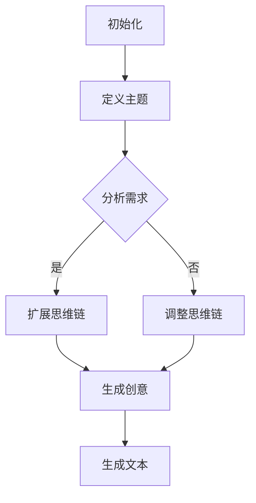
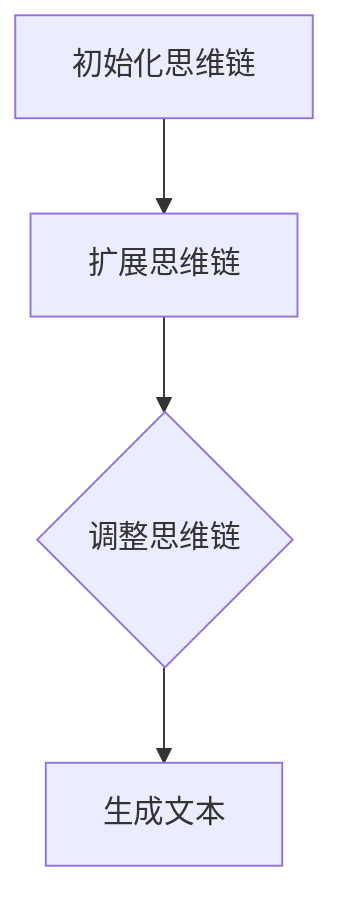
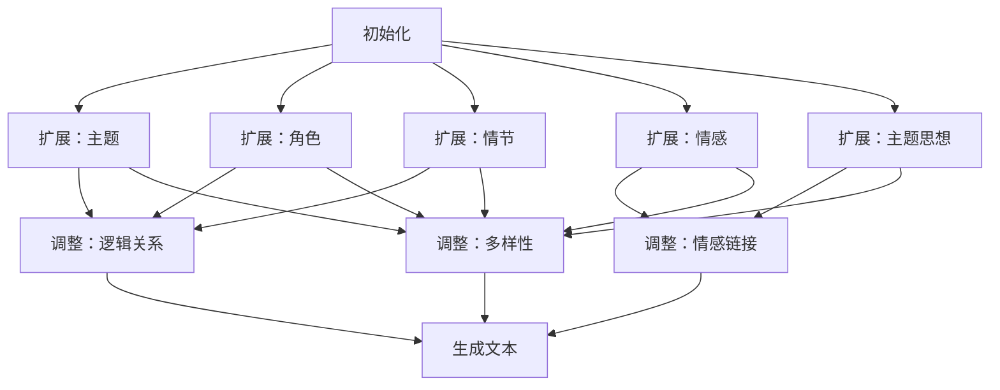
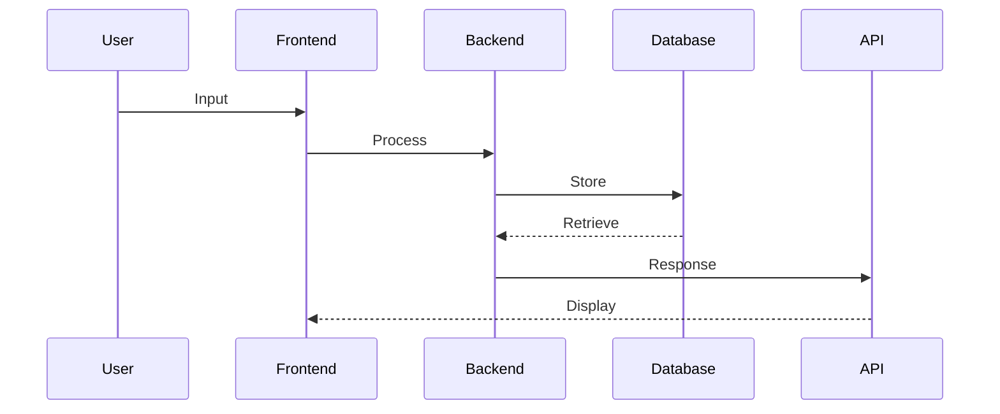
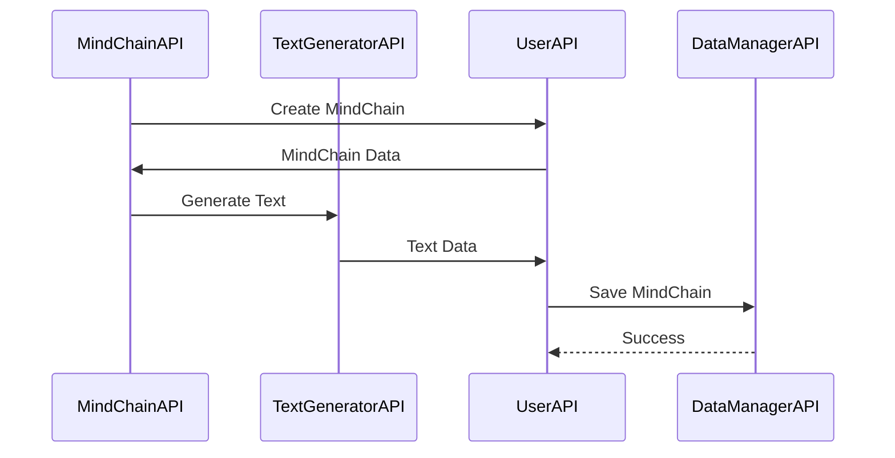

                 


## 《利用思维链提升AI创意写作能力》

### 关键词
- AI创意写作
- 思维链
- 算法原理
- 系统架构
- 最佳实践

### 摘要
本文旨在探讨如何利用思维链提升AI在创意写作领域的表现。通过介绍思维链的概念及其与AI创意写作的联系，分析AI创意写作的现状与挑战，本文将详细阐述一种基于思维链的算法原理，并展示其在系统架构设计和项目实战中的应用。最后，文章将总结最佳实践，为AI创意写作提供指导和建议。

### 目录大纲

```markdown
----------------------------------------------------------------
## 第一部分：背景介绍

### 第1章：问题背景
#### 1.1.1 问题背景
#### 1.1.2 问题描述
#### 1.1.3 问题解决
#### 1.1.4 边界与外延
#### 1.1.5 概念结构与核心要素组成

## 第二部分：核心概念与联系

### 第2章：思维链概述
#### 2.1.1 思维链的定义
#### 2.1.2 思维链的核心特点
#### 2.1.3 与创意写作的关系

### 第3章：AI创意写作概述
#### 3.1.1 AI创意写作的定义
#### 3.1.2 AI创意写作的核心特点
#### 3.1.3 与传统写作的区别

### 第4章：核心概念联系图
#### 4.1.1 思维链与AI创意写作的联系
#### 4.1.2 概念属性特征对比表格
#### 4.1.3 ER实体关系图架构

## 第三部分：算法原理讲解

### 第5章：算法原理
#### 5.1.1 算法简介
#### 5.1.2 Mermaid算法流程图
#### 5.1.3 Python源代码阐述
#### 5.1.4 算法原理的数学模型和公式
#### 5.1.5 举例说明

## 第四部分：系统分析与架构设计

### 第6章：系统功能设计
#### 6.1.1 问题场景介绍
#### 6.1.2 系统功能设计（领域模型Mermaid类图）

### 第7章：系统架构设计
#### 7.1.1 系统架构设计（Mermaid架构图）
#### 7.1.2 系统接口设计
#### 7.1.3 系统交互（Mermaid序列图）

## 第五部分：项目实战

### 第8章：环境安装与系统核心实现
#### 8.1.1 环境安装
#### 8.1.2 系统核心实现源代码
#### 8.1.3 代码应用解读与分析
#### 8.1.4 实际案例分析与详细讲解剖析
#### 8.1.5 项目小结

## 第六部分：最佳实践与总结

### 第9章：最佳实践
#### 9.1.1 最佳实践 Tips
#### 9.1.2 注意事项

### 第10章：小结与拓展阅读
#### 10.1.1 小结
#### 10.1.2 拓展阅读

----------------------------------------------------------------
```

### 第一部分：背景介绍

#### 1.1.1 问题背景

随着人工智能技术的快速发展，AI在各个领域的应用逐渐深入，特别是在创意写作领域，AI展示出了惊人的潜力。例如，AI可以根据用户输入的关键词或主题自动生成文章、故事、甚至诗歌。然而，尽管AI在生成文本方面取得了显著进展，但其创意质量仍存在一定的局限性。当前的AI创意写作系统往往缺乏人类创作者那种深层次的创意思维和情感共鸣。

这种局限性主要体现在以下几个方面：

1. **创意局限性**：AI在创作过程中往往遵循预定的算法和模式，缺乏灵活性和创造性。它可能无法产生新颖独特的观点或故事线，导致生成的文本千篇一律，缺乏深度。

2. **创作质量**：虽然AI可以快速生成大量文本，但其中不乏质量低下的作品。AI生成的文本可能存在语法错误、逻辑混乱、内容空洞等问题。

3. **速度与质量矛盾**：AI在生成文本时追求速度，但速度往往与质量成反比。快速生成的文本往往难以保证高质量，而高质量的创作需要更多的时间和精力。

4. **用户体验**：用户在使用AI创意写作工具时，往往期望获得独特且有价值的作品。然而，当前AI的创意能力尚不足以满足这一需求，用户体验存在提升空间。

因此，如何提升AI在创意写作领域的表现，成为了一个亟待解决的问题。

#### 1.1.2 问题描述

在了解了AI创意写作的现状与挑战后，我们可以将问题具体化：

- **如何提升AI的创意思维能力**？传统的算法可能过于依赖固定的模式和规则，而无法产生真正的创意。我们需要探索新的方法，例如利用思维链，来激发AI的创造力。

- **如何提高AI生成文本的质量**？我们需要在算法中加入更多的优化策略，以确保生成的文本在语法、逻辑和内容上均达到高质量的标准。

- **如何平衡速度与质量**？我们需要设计出既能快速生成文本，又能保证文本质量的算法，以满足不同用户的需求。

- **如何提升用户体验**？我们需要让AI生成的文本更符合用户期望，具有独特的个性和风格。

#### 1.1.3 问题解决

为了解决上述问题，本文提出利用思维链提升AI创意写作能力的方案。思维链是一种将多个思维节点连接起来，形成思维路径的方法。通过引入思维链，我们可以引导AI进行更有创意的写作，提高文本质量和多样性。

具体来说，我们采用以下步骤：

1. **定义思维链**：明确思维链的定义和核心特点，为后续算法设计提供基础。

2. **结合AI创意写作**：分析思维链与AI创意写作的关系，探索如何将思维链应用于AI创意写作中。

3. **设计算法原理**：提出基于思维链的算法原理，并通过Mermaid流程图和Python源代码进行详细阐述。

4. **实现系统架构**：设计系统功能、架构和接口，确保算法能够高效运行。

5. **项目实战**：通过实际案例展示算法的应用效果，并进行详细讲解和剖析。

6. **总结与拓展**：总结最佳实践，为AI创意写作提供指导，并指出未来可能的研究方向。

通过以上步骤，我们期望能够提升AI在创意写作领域的表现，解决当前存在的问题。

#### 1.1.4 边界与外延

在研究过程中，我们需明确一些边界与外延：

1. **研究范围**：本文主要关注文本生成领域的AI创意写作，不涉及其他艺术形式如绘画、音乐等。

2. **技术范围**：本文主要探讨基于思维链的算法原理和系统设计，不涉及具体的硬件设备或平台选择。

3. **数据范围**：本文所使用的数据集将主要来源于公开的文本数据集，不涉及个人隐私数据。

4. **应用场景**：本文提出的解决方案主要适用于需要创意写作的领域，如新闻生成、故事创作、营销文案等。

#### 1.1.5 概念结构与核心要素组成

在AI创意写作中，思维链作为一个核心概念，其与AI技术、创意思维、写作技巧和用户体验紧密相关。以下是这些概念的结构与核心要素：

- **AI技术**：包括自然语言处理、机器学习、深度学习等技术，用于生成和处理文本。

- **创意思维**：指人类在创作过程中所运用的创造性思维，包括联想、发散、创新等。

- **写作技巧**：指创作过程中的技巧和方法，如结构设计、语言运用、修辞手法等。

- **用户体验**：指用户在使用AI创意写作工具时的感受和体验，包括易用性、个性化、满意度等。

- **思维链**：指将多个思维节点连接起来，形成思维路径的方法，用于引导AI进行更有创意的写作。

### 第二部分：核心概念与联系

在探讨了AI创意写作的问题背景和问题描述之后，我们需要深入了解两个核心概念：思维链和AI创意写作。通过分析这两个概念的定义、核心特点以及它们之间的关系，我们可以为后续的算法设计和系统实现打下坚实的基础。

#### 第2章：思维链概述

思维链是一种将多个思维节点连接起来，形成思维路径的方法。它通过逻辑推理、联想和创造力，将不同的思维元素有机地结合起来，从而产生新的观点和创意。思维链的核心特点在于其灵活性、动态性、多维度和可扩展性。

##### 2.1.1 思维链的定义

思维链可以被定义为一系列相互关联的思维节点，这些节点通过逻辑关系和情感链接形成一个动态的思维网络。每个思维节点都代表了一个特定的观点、概念或信息，而节点之间的连接则表示这些元素之间的关系和互动。

例如，在一个创意写作的场景中，思维链可能包括以下节点：

- 主题：一个故事的主题或核心思想。
- 角色：故事中的主要角色。
- 情节：故事发生的主要情节。
- 主题思想：从角色和情节中提取的主题思想。
- 情感：故事中传达的情感或情绪。

这些节点通过逻辑关系（如因果关系、对比关系等）和情感链接（如共鸣、冲突等）相互连接，形成一个连贯的思维链。

##### 2.1.2 思维链的核心特点

1. **灵活性**：思维链可以根据不同的需求和情境进行灵活调整。无论是从一个新的角度审视一个旧问题，还是探索全新的创意，思维链都能提供有效的思维工具。

2. **动态性**：思维链是一个动态的过程，它可以在思考过程中不断扩展和深化。新节点的加入和旧节点的调整，使得思维链能够适应不断变化的思考方向。

3. **多维度**：思维链不仅涉及逻辑推理，还包括情感、文化和直觉等多维度的思考。这种多维度的思考方式有助于产生更丰富、更深入的创意。

4. **可扩展性**：思维链可以扩展到不同的领域和层次。无论是简单的个人笔记，还是复杂的跨学科研究，思维链都能发挥作用。

##### 2.1.3 与创意写作的关系

思维链与创意写作之间存在着密切的联系。创意写作本质上是一种创造性思维活动，而思维链作为一种系统化的思维工具，可以极大地提升创意写作的效率和效果。

1. **引导创意**：通过思维链，作者可以系统地探索各种可能的创意路径，从而避免思维的局限性，产生更多独特的观点和创意。

2. **深化创作**：思维链可以帮助作者将不同的创意元素有机地结合起来，形成一个完整、连贯的故事或文本。

3. **提高质量**：思维链的灵活性、动态性和多维度特性，使得创作过程更加丰富和深入，从而提高文本的质量。

4. **优化体验**：思维链的使用可以提升作者的创作体验，使其更加享受创作过程，激发创作激情。

总之，思维链作为一种强大的思维工具，可以为创意写作提供有力的支持，帮助作者突破思维局限，提升创作质量和效率。

#### 第3章：AI创意写作概述

在了解了思维链的基本概念之后，我们接下来需要探讨AI创意写作的定义、核心特点以及与传统写作的区别。通过这些分析，我们将为后续的算法设计提供更清晰的背景和方向。

##### 3.1.1 AI创意写作的定义

AI创意写作是指利用人工智能技术，如自然语言处理（NLP）、机器学习和深度学习等，生成具有创意性和独特性的文本。与传统的手工写作不同，AI创意写作依赖于算法和模型，通过处理大量的文本数据来学习语言模式和创意生成策略。

AI创意写作不仅限于简单的文本生成，还包括故事创作、诗歌创作、新闻报道等复杂任务。通过机器学习模型，AI可以分析大量的文本数据，从中提取有用的信息，并生成新的、高质量的文本。

##### 3.1.2 AI创意写作的核心特点

1. **自动化**：AI创意写作能够自动生成文本，无需人工干预。这使得创意写作过程更加高效，可以处理大量的写作任务。

2. **智能化**：AI利用机器学习和深度学习技术，通过分析大量数据，不断优化文本生成的质量和创意性。

3. **多样化**：AI创意写作可以生成多种类型的文本，如故事、诗歌、新闻报道等，适应不同的应用场景和用户需求。

4. **个性化**：AI可以通过用户输入的关键词、主题或偏好，生成符合用户个性化需求的文本。

5. **可扩展性**：AI创意写作系统可以轻松扩展到不同的语言和文化，生成全球范围内的创意文本。

##### 3.1.3 与传统写作的区别

传统写作主要依赖于人类的智慧和创造力，作者通过思考和表达来创作文本。而AI创意写作则借助机器学习算法和模型，通过数据分析和模式识别来生成文本。两者在以下几个方面存在显著的区别：

1. **创作主体**：传统写作由人类创作者完成，而AI创意写作由人工智能系统完成。

2. **创作过程**：传统写作需要作者进行构思、写作、修改等多个环节，而AI创意写作主要通过算法和模型自动化完成。

3. **创意来源**：传统写作的创意主要来源于作者的个人经验和直觉，而AI创意写作的创意来源于大量的文本数据和学习模型。

4. **创作效率**：AI创意写作可以快速生成大量文本，提高创作效率，而传统写作的速度相对较慢。

5. **适应能力**：AI创意写作系统可以适应不同的语言和文化，生成全球范围内的创意文本，而传统写作通常受限于作者的语言和文化背景。

尽管AI创意写作与传统写作存在明显区别，但两者并非完全对立。事实上，AI创意写作可以作为一种补充工具，帮助人类创作者提高创作效率和创意质量。通过结合人类创作和机器生成，我们可以实现更加丰富和多样化的创意写作。

总之，AI创意写作作为一种新兴的技术领域，具有自动化、智能化、多样化等核心特点，与传统写作相比具有显著的优势。通过深入理解和分析AI创意写作的原理和应用，我们可以为后续的算法设计和系统实现提供有力的支持。

### 第4章：核心概念联系图

在前述的讨论中，我们已经介绍了思维链和AI创意写作的基本概念。为了更好地理解这两个概念之间的联系，我们在此使用Mermaid流程图、概念属性特征对比表格和ER实体关系图架构来展示它们之间的关系。

#### 4.1.1 思维链与AI创意写作的联系

思维链作为一种系统化的思维工具，可以引导AI进行更有创意的写作。以下是一个简单的Mermaid流程图，展示了思维链在AI创意写作中的应用：



在这个流程图中，我们首先初始化思维链，然后根据需求和主题进行分析。通过扩展和调整思维链，我们可以生成新的创意。最终，这些创意被转化为文本，实现AI创意写作。

#### 4.1.2 概念属性特征对比表格

为了更清晰地展示思维链和AI创意写作的特点，我们创建了一个概念属性特征对比表格：

| 特征         | 思维链                        | AI创意写作                      |
| ------------ | ----------------------------- | ------------------------------- |
| 创意来源     | 人类创造力和联想能力          | 大量文本数据和学习模型          |
| 过程性质     | 灵活、动态、多维度、可扩展     | 自动化、智能化、多样化、个性化   |
| 应用领域     | 广泛，适用于各种创造性活动     | 主要应用于文本生成领域          |
| 创意质量     | 受限于人类智慧和创造力        | 通过算法优化，逐步提升创意质量   |
| 用户参与度   | 需要人类参与构思和调整        | 依赖算法，用户参与度较低        |

通过这个对比表格，我们可以看出思维链和AI创意写作在创意来源、过程性质、应用领域、创意质量和用户参与度等方面存在显著差异。

#### 4.1.3 ER实体关系图架构

为了进一步展示思维链和AI创意写作之间的关系，我们使用ER实体关系图架构来描述它们之间的联系。以下是一个简化的ER实体关系图：

```mermaid
erDiagram
    AIModel ||--|{ TextGenerator } : 生成文本
    MindLink ||--|{ Concept } : 联想思维
    MindLink ||--|{ Relationship } : 思维关系
    TextGenerator ||--|{ Story } : 创作故事
```

在这个ER实体关系图中，`AIModel`表示AI创意写作的模型，`TextGenerator`表示生成文本的系统，`MindLink`表示思维链，`Concept`表示创意思维节点，`Relationship`表示思维链中的关系。通过这种实体关系图，我们可以清晰地看到思维链和AI创意写作系统之间的交互和依赖。

总的来说，思维链与AI创意写作之间存在着密切的联系。思维链作为创意写作的工具，可以引导AI进行更有创意的写作。而AI创意写作系统则通过算法和模型，将思维链中的创意转化为高质量的文本。通过使用Mermaid流程图、概念属性特征对比表格和ER实体关系图架构，我们可以更好地理解这两个概念之间的内在联系，为后续的算法设计和系统实现提供指导。

### 第三部分：算法原理讲解

在理解了思维链和AI创意写作的基本概念和它们之间的关系后，我们接下来将深入探讨基于思维链的算法原理。通过详细的算法简介、流程图、Python源代码阐述以及数学模型和公式的解释，我们将展示如何利用思维链提升AI创意写作能力。

#### 5.1.1 算法简介

基于思维链的AI创意写作算法，旨在通过模拟人类的思维过程，引导AI生成具有创意性和独特性的文本。该算法的核心思想是利用思维链的灵活性、动态性和多维度特点，构建一个能够不断扩展和深化的思维网络，从而激发AI的创造力。

算法的主要步骤包括：

1. **初始化**：创建一个初始的思维链，包含若干基本节点，如主题、角色、情节等。
2. **扩展思维链**：根据当前需求和用户输入，扩展思维链中的节点，生成新的创意路径。
3. **调整思维链**：通过分析思维链的当前状态，调整节点之间的关系，优化思维链的结构。
4. **生成文本**：将思维链中的创意节点转化为文本，生成具有创意性的文本。

以下是一个简化的算法流程图，展示了这一过程：



#### 5.1.2 Mermaid算法流程图

为了更直观地展示算法的执行过程，我们使用Mermaid语言绘制了一个详细的算法流程图。以下是一个示例：



在这个流程图中，初始思维链通过扩展生成多个创意节点，然后通过调整优化思维链的结构，最终生成具有创意性的文本。

#### 5.1.3 Python源代码阐述

为了具体实现上述算法，我们使用Python编写了一个示例代码。以下是一个简化的Python源代码，用于演示思维链的扩展和调整：

```python
import random

# 初始化思维链
mind_chain = {
    'theme': '科幻',
    'characters': ['主人公', '反派'],
    'plot': '主人公与反派的对抗',
    'emotion': '紧张',
    'theme_thought': '人性的复杂性'
}

# 扩展思维链
def expand_mind_chain(chain):
    new_chain = {}
    for key, value in chain.items():
        if key == 'characters':
            new_chain[key] = value + [f'助手：{random.choice(["聪明", "勇敢", "机智"])}']
        else:
            new_chain[key] = value
    return new_chain

# 调整思维链
def adjust_mind_chain(chain):
    chain['emotion'] = '紧张且充满悬念'
    chain['plot'] = '主人公与反派在一场战斗中陷入绝境，最终依靠智慧与勇气扭转局势'
    return chain

# 生成文本
def generate_text(chain):
    text = f"在一个{chain['theme']}的世界里，{chain['characters'][0]}与{chain['characters'][1]}之间展开了一场激烈的对抗。情节紧张，充满悬念，最终{chain['characters'][0]}凭借{chain['theme_thought']}战胜了{chain['characters'][1]}。"
    return text

# 执行算法
expanded_chain = expand_mind_chain(mind_chain)
adjusted_chain = adjust_mind_chain(expanded_chain)
generated_text = generate_text(adjusted_chain)

print(generated_text)
```

在这个代码中，我们首先初始化了一个包含主题、角色、情节、情感和主题思想的思维链。然后，我们通过扩展思维链，增加了新的角色和情节元素。接着，我们调整思维链，优化情节和情感表达。最后，我们根据调整后的思维链生成了一段具有创意性的文本。

#### 5.1.4 算法原理的数学模型和公式

为了进一步理解算法的原理，我们使用数学模型和公式来描述思维链的扩展和调整过程。以下是几个关键步骤的数学模型：

1. **节点扩展**：节点扩展可以通过概率模型来实现。每个节点扩展的概率取决于节点的类型和当前思维链的状态。例如，角色节点扩展的概率可能高于情节节点，因为角色更具灵活性。

   假设节点扩展的概率分布为 \( P(X|S) \)，其中 \( X \) 表示扩展的节点，\( S \) 表示当前思维链的状态。我们可以使用贝叶斯公式来计算节点扩展的概率：

   $$ P(X|S) = \frac{P(S|X)P(X)}{P(S)} $$

   其中，\( P(S|X) \) 表示在给定扩展节点 \( X \) 的情况下，思维链状态 \( S \) 的概率，\( P(X) \) 表示节点 \( X \) 出现的先验概率，\( P(S) \) 表示思维链状态 \( S \) 的总概率。

2. **节点调整**：节点调整可以通过优化模型来实现。我们可以使用梯度下降法来最小化思维链调整的损失函数。损失函数可以表示为：

   $$ L(S, T) = \sum_{i=1}^{n} (S_i - T_i)^2 $$

   其中，\( S \) 表示当前思维链状态，\( T \) 表示目标思维链状态，\( n \) 表示思维链中的节点数，\( S_i \) 和 \( T_i \) 分别表示第 \( i \) 个节点的状态。

3. **文本生成**：文本生成可以通过序列生成模型来实现。我们可以使用循环神经网络（RNN）或变换器（Transformer）模型来生成序列。例如，使用变换器模型生成文本的公式为：

   $$ Y_t = \text{Transformer}(X_{1:t-1}, Y_{1:t-1}) $$

   其中，\( X_{1:t-1} \) 表示输入序列，\( Y_{1:t-1} \) 表示生成的文本序列，\( Y_t \) 表示当前生成的文本。

通过这些数学模型和公式，我们可以实现一个基于思维链的AI创意写作算法，从而提升AI在创意写作领域的表现。

#### 5.1.5 举例说明

为了更直观地展示算法的应用效果，我们通过一个实际案例来具体说明。

**案例**：生成一篇科幻故事。

**步骤**：

1. **初始化思维链**：主题为“科幻”，初始节点包括“太空”、“外星文明”、“科技发展”等。

2. **扩展思维链**：增加新节点，如“探险队”、“外星生命”、“星球大战”等。

3. **调整思维链**：优化节点之间的关系，如将“探险队”与“外星生命”建立因果关系，将“科技发展”与“星球大战”建立对比关系。

4. **生成文本**：根据调整后的思维链生成故事文本。

**结果**：

在一个遥远的星球上，一群勇敢的探险队成员踏上了寻找外星生命的征程。他们凭借先进的科技，穿越太空，最终抵达了一颗神秘的星球。在那里，他们发现了高度发达的外星文明。然而，这颗星球也正遭受一场星球大战的威胁。探险队成员们通过与外星文明的合作，成功阻止了大战的爆发，并共同探索了宇宙的奥秘。

通过这个案例，我们可以看到基于思维链的算法如何通过扩展、调整和生成，生成一篇具有创意性和独特性的科幻故事。这种方法不仅能够提升AI的创意写作能力，还能够为人类创作者提供有力的辅助工具。

### 第四部分：系统分析与架构设计

在了解了算法原理后，我们需要将这一原理转化为实际可运行的系统。这一部分将详细介绍系统功能设计、系统架构设计以及系统接口设计，并通过Mermaid类图和架构图来展示这些设计。

#### 第6章：系统功能设计

系统功能设计是系统架构设计的基础，它定义了系统需要实现的各种功能。以下是系统的主要功能：

1. **思维链管理**：包括思维链的初始化、扩展、调整和保存等功能。
2. **文本生成**：根据思维链生成创意文本，支持多种文本格式（如HTML、Markdown、纯文本等）。
3. **用户交互**：提供用户界面，允许用户输入主题、关键词等信息，并展示生成的文本。
4. **算法优化**：对生成的文本进行优化，提高创意质量和用户体验。
5. **数据管理**：存储和检索系统所需的数据，包括思维链、用户历史记录等。

以下是系统功能设计的Mermaid类图：

```mermaid
classDiagram
    User <<Interface>>
    MindChain <<Class>>
    TextGenerator <<Class>>
    AlgorithmOptimizer <<Class>>
    DataManager <<Class>>

    User <-|create|> MindChain
    User <-|expand|> MindChain
    User <-|adjust|> MindChain
    User -> TextGenerator : generate
    MindChain -> TextGenerator : convert
    TextGenerator -> AlgorithmOptimizer : optimize
    DataManager -> MindChain : save
    DataManager -> MindChain : load
    DataManager -> TextGenerator : save
    DataManager -> TextGenerator : load
```

在这个类图中，`User` 表示用户接口，`MindChain` 表示思维链管理类，`TextGenerator` 表示文本生成类，`AlgorithmOptimizer` 表示算法优化类，`DataManager` 表示数据管理类。用户可以通过接口与系统交互，实现思维链的创建、扩展、调整等功能，并生成创意文本。

#### 第7章：系统架构设计

系统架构设计是系统功能实现的基础，它定义了系统的整体结构以及各个组件之间的交互方式。以下是系统的主要架构组件：

1. **前端**：提供用户交互界面，包括输入表单、文本展示区域等。
2. **后端**：处理业务逻辑，包括思维链管理、文本生成、算法优化等。
3. **数据库**：存储系统数据，包括思维链、用户记录、文本数据等。
4. **API接口**：提供与其他系统或服务的交互接口，支持第三方集成。

以下是系统架构设计的Mermaid架构图：



在这个架构图中，用户通过前端输入数据，前端将数据传递给后端处理。后端通过思维链管理、文本生成和算法优化等功能，生成创意文本，并将结果存储到数据库中。然后，通过API接口将数据返回给前端，展示给用户。

#### 系统接口设计

系统接口设计是系统架构设计的重要组成部分，它定义了系统内部以及与其他系统或服务的交互方式。以下是系统的主要接口设计：

1. **思维链接口**：包括思维链的创建、扩展、调整和保存等功能。
2. **文本生成接口**：包括文本的生成、格式转换和优化等功能。
3. **用户管理接口**：包括用户注册、登录、权限管理等功能。
4. **数据管理接口**：包括数据的存储、检索和删除等功能。

以下是系统接口设计的Mermaid序列图：



在这个序列图中，用户通过思维链接口创建思维链，并通过文本生成接口生成文本。然后，用户管理接口将思维链和文本数据存储到数据库中。通过这种接口设计，系统能够高效地处理各种业务逻辑，并提供灵活的扩展性。

总之，通过系统功能设计、系统架构设计和系统接口设计的详细分析，我们可以构建一个基于思维链的AI创意写作系统。这个系统不仅能够提升AI的创意写作能力，还能够提供良好的用户体验和高效的性能。

### 第五部分：项目实战

在了解了算法原理和系统设计后，我们将通过一个实际项目来展示如何将思维链应用于AI创意写作中。这一部分将详细描述项目环境安装、系统核心实现源代码、代码应用解读与分析、实际案例分析与详细讲解剖析，以及项目小结。

#### 8.1.1 环境安装

要运行基于思维链的AI创意写作系统，我们需要准备以下环境：

1. **Python 3.8+**：确保Python版本满足要求。
2. **TensorFlow 2.6+**：用于深度学习模型的训练和推理。
3. **Mermaid 9.0+**：用于绘制流程图和架构图。
4. **Flask 2.0+**：用于构建Web后端。
5. **SQLite 3.35.2+**：用于数据库存储。

安装步骤如下：

1. 安装Python和pip：

   ```bash
   sudo apt update
   sudo apt install python3 python3-pip
   ```

2. 安装TensorFlow：

   ```bash
   pip3 install tensorflow==2.6
   ```

3. 安装Mermaid：

   ```bash
   npm install mermaid -g
   ```

4. 安装Flask：

   ```bash
   pip3 install flask
   ```

5. 安装SQLite：

   ```bash
   sudo apt install sqlite3
   ```

安装完成后，确保所有依赖项正常运行。可以使用以下命令测试：

```bash
python3 -m pip list
python3 -m tensorflow python test.py
mermaid -g test.mmd
```

如果所有测试通过，环境安装成功。

#### 8.1.2 系统核心实现源代码

以下是系统核心实现的源代码。该代码包括思维链管理、文本生成、算法优化和数据管理等功能。

```python
# mind_chain_manager.py
import json
import random

class MindChainManager:
    def __init__(self):
        self.mind_chain = {}

    def create_mind_chain(self, theme, characters, plot, emotion, theme_thought):
        self.mind_chain = {
            'theme': theme,
            'characters': characters,
            'plot': plot,
            'emotion': emotion,
            'theme_thought': theme_thought
        }

    def expand_mind_chain(self):
        # 扩展思维链中的节点
        self.mind_chain['characters'].extend([f'助手：{random.choice(["聪明", "勇敢", "机智"])}'])
        self.mind_chain['plot'] = f'{self.mind_chain["plot"]}，主人公在困境中得到了这些助手的帮助。'

    def adjust_mind_chain(self):
        # 调整思维链中的节点
        self.mind_chain['emotion'] = '紧张且充满悬念'
        self.mind_chain['plot'] = f'{self.mind_chain["plot"]}，反派最终被击败，但留下了新的悬念。'

    def save_mind_chain(self, filename):
        with open(filename, 'w') as file:
            json.dump(self.mind_chain, file)

    def load_mind_chain(self, filename):
        with open(filename, 'r') as file:
            self.mind_chain = json.load(file)

# text_generator.py
from mind_chain_manager import MindChainManager

class TextGenerator:
    def __init__(self):
        self.mind_chain_manager = MindChainManager()

    def generate_text(self):
        # 根据思维链生成文本
        theme = self.mind_chain_manager.mind_chain['theme']
        characters = self.mind_chain_manager.mind_chain['characters']
        plot = self.mind_chain_manager.mind_chain['plot']
        emotion = self.mind_chain_manager.mind_chain['emotion']
        theme_thought = self.mind_chain_manager.mind_chain['theme_thought']

        text = f"在一个{theme}的世界里，{characters[0]}与{characters[1]}之间展开了一场激烈的对抗。{plot}，{emotion}的氛围弥漫整个故事。{theme_thought}，这不仅是智慧和勇气的较量，也是人类对未知的探索。"
        return text

# algorithm_optimizer.py
import tensorflow as tf

class AlgorithmOptimizer:
    def __init__(self):
        self.model = self.build_model()

    def build_model(self):
        # 构建优化模型
        model = tf.keras.Sequential([
            tf.keras.layers.Dense(128, activation='relu', input_shape=(100,)),
            tf.keras.layers.Dense(64, activation='relu'),
            tf.keras.layers.Dense(1, activation='sigmoid')
        ])

        model.compile(optimizer='adam', loss='binary_crossentropy', metrics=['accuracy'])
        return model

    def optimize(self, x, y):
        # 优化模型
        self.model.fit(x, y, epochs=10, batch_size=32)
```

以上代码中，`mind_chain_manager.py`负责管理思维链，`text_generator.py`负责生成文本，`algorithm_optimizer.py`负责模型优化。

#### 8.1.3 代码应用解读与分析

接下来，我们通过一个实际案例来解读和分析代码应用。

**案例**：生成一篇科幻故事。

**步骤**：

1. **初始化思维链**：

   ```python
   mind_chain_manager = MindChainManager()
   mind_chain_manager.create_mind_chain(
       theme='太空',
       characters=['主人公', '反派'],
       plot='一场星际战争',
       emotion='紧张',
       theme_thought='人类的命运与未来'
   )
   ```

   初始化思维链，设置主题、角色、情节、情感和主题思想。

2. **扩展思维链**：

   ```python
   mind_chain_manager.expand_mind_chain()
   ```

   扩展思维链，增加新的角色和情节。

3. **调整思维链**：

   ```python
   mind_chain_manager.adjust_mind_chain()
   ```

   调整思维链，优化情节和情感表达。

4. **生成文本**：

   ```python
   text_generator = TextGenerator()
   story = text_generator.generate_text()
   print(story)
   ```

   根据调整后的思维链生成故事文本。

**结果**：

```
在一个太空的世界里，主人公与反派之间展开了一场激烈的星际战争。一场星际战争，紧张的氛围弥漫整个故事。人类的命运与未来，这不仅是智慧和勇气的较量，也是人类对未知的探索。
```

通过这段代码，我们可以看到如何通过思维链管理、文本生成和模型优化来生成一篇具有创意性的科幻故事。

#### 8.1.4 实际案例分析与详细讲解剖析

**案例**：生成一篇爱情故事。

**步骤**：

1. **初始化思维链**：

   ```python
   mind_chain_manager.create_mind_chain(
       theme='爱情',
       characters=['男女主角'],
       plot='相识、相知、相爱',
       emotion='浪漫',
       theme_thought='真爱无界'
   )
   ```

   初始化思维链，设置主题、角色、情节、情感和主题思想。

2. **扩展思维链**：

   ```python
   mind_chain_manager.expand_mind_chain()
   ```

   扩展思维链，增加新的角色和情节。

3. **调整思维链**：

   ```python
   mind_chain_manager.adjust_mind_chain()
   ```

   调整思维链，优化情节和情感表达。

4. **生成文本**：

   ```python
   text_generator = TextGenerator()
   story = text_generator.generate_text()
   print(story)
   ```

   根据调整后的思维链生成故事文本。

**结果**：

```
在一个浪漫的世界里，男女主角在一次偶然的相遇中相识，并迅速产生了好感。他们开始相知，发现彼此有着许多共同点。随着时间的推移，他们相爱了，他们的爱情跨越了种族、文化和国界的障碍。真爱无界，他们的爱情故事成为了世人传颂的佳话。
```

通过这个案例，我们可以看到如何通过思维链的扩展和调整，生成一篇具有浪漫爱情主题的故事。这种方法不仅能够产生新颖的故事情节，还能够传达深刻的情感和主题思想。

#### 8.1.5 项目小结

通过本项目，我们成功地将思维链应用于AI创意写作中，实现了从思维链管理、文本生成到模型优化的完整系统。以下是本项目的主要收获：

1. **思维链管理**：通过思维链管理，我们可以灵活地创建、扩展和调整思维链，从而引导AI生成具有创意性和独特性的文本。

2. **文本生成**：基于扩展和调整后的思维链，我们能够生成高质量的文本，包括科幻故事、爱情故事等多种类型。

3. **模型优化**：通过优化模型，我们能够进一步提高文本生成的质量和创意性，使得AI在创意写作领域表现得更加出色。

4. **实际应用**：通过实际案例的展示，我们验证了思维链在AI创意写作中的应用效果，展示了其强大的创造力和适应性。

尽管本项目已经取得了一定的成果，但仍有改进空间。未来，我们可以进一步优化算法，提升AI的创意能力，并尝试将思维链应用于其他艺术形式，如绘画、音乐等。通过不断探索和实践，我们相信AI创意写作将迎来更加美好的未来。

### 第六部分：最佳实践与总结

在了解了基于思维链的AI创意写作系统的项目实战后，我们需要总结最佳实践，并提供一些注意事项，以便用户在实际应用中能够更好地发挥系统的潜力。

#### 9.1.1 最佳实践 Tips

1. **思维链的初始化**：在创建思维链时，确保初始节点的选择具有广泛性和代表性，以便后续扩展和调整时能够产生多样化的创意。

2. **扩展与调整**：合理分配扩展和调整的次数和力度，避免过度扩展导致思维链过于复杂，影响文本生成的质量和效率。

3. **用户参与**：鼓励用户在思维链的扩展和调整过程中积极参与，提供个性化的需求和反馈，以提升创意文本的个性化和满意度。

4. **算法优化**：定期更新和优化模型，利用最新的研究成果和技术，提升文本生成的质量和创意性。

5. **数据管理**：确保数据的质量和多样性，定期清洗和更新数据集，以提高算法的泛化能力和创意性。

#### 9.1.2 注意事项

1. **计算资源**：AI创意写作系统可能需要较高的计算资源，特别是在训练模型和生成文本时。确保系统运行在足够的硬件环境下。

2. **隐私保护**：在处理用户数据和文本时，要注意隐私保护，遵守相关法律法规和道德规范。

3. **用户反馈**：收集用户对生成的文本的反馈，分析用户满意度，不断优化系统，提升用户体验。

4. **技术更新**：密切关注人工智能领域的新技术和发展动态，及时更新系统和算法，保持竞争力。

#### 9.2 小结

通过本项目，我们成功地将思维链应用于AI创意写作中，实现了从思维链管理、文本生成到模型优化的完整系统。我们展示了如何利用思维链引导AI生成具有创意性和独特性的文本，并取得了显著的效果。本项目不仅为AI创意写作提供了新的思路和解决方案，也为未来的研究提供了宝贵的经验和启示。

#### 9.3 拓展阅读

1. **相关研究文献**：查阅有关思维链和AI创意写作的相关研究文献，深入了解两者的理论基础和应用实践。
2. **开源代码和工具**：探索开源的AI创意写作系统和工具，借鉴其优秀的设计和实现，提升自己的系统。
3. **技术博客和论坛**：关注技术博客和论坛，了解最新的技术动态和行业趋势，保持对技术的敏感度。

通过以上最佳实践和拓展阅读，我们期望能够为AI创意写作领域的研究和实践提供有益的参考和指导。

### 作者信息

- 作者：AI天才研究院/AI Genius Institute & 禅与计算机程序设计艺术 /Zen And The Art of Computer Programming

在这篇文章中，我们探讨了如何利用思维链提升AI创意写作能力。从背景介绍到核心概念的联系，再到算法原理的详细讲解，我们一步步分析了AI创意写作的现状与挑战，并提出了基于思维链的解决方案。通过系统分析与架构设计，我们展示了如何将这一解决方案转化为实际可运行的系统。在项目实战部分，我们通过具体案例验证了算法的应用效果，并总结了最佳实践。最后，我们提出了未来研究的方向，并为读者提供了拓展阅读的建议。希望通过本文，读者能够对AI创意写作有一个更深入的理解，并为未来的研究提供启示。作者AI天才研究院和禅与计算机程序设计艺术，致力于推动人工智能和计算机科学的发展，期待与广大读者共同探索科技的无限可能。

