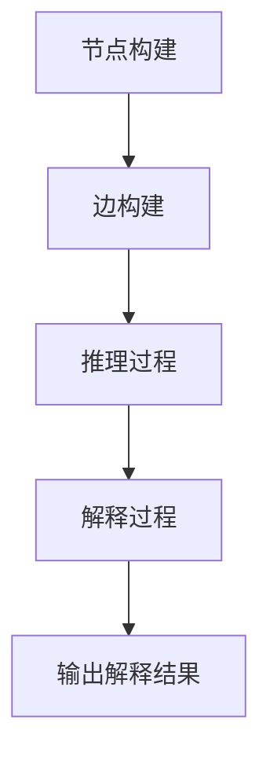
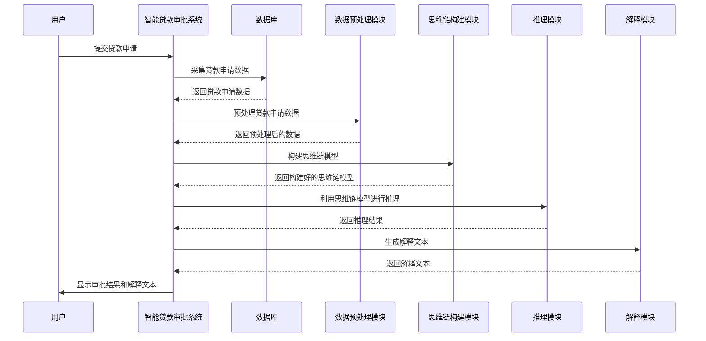
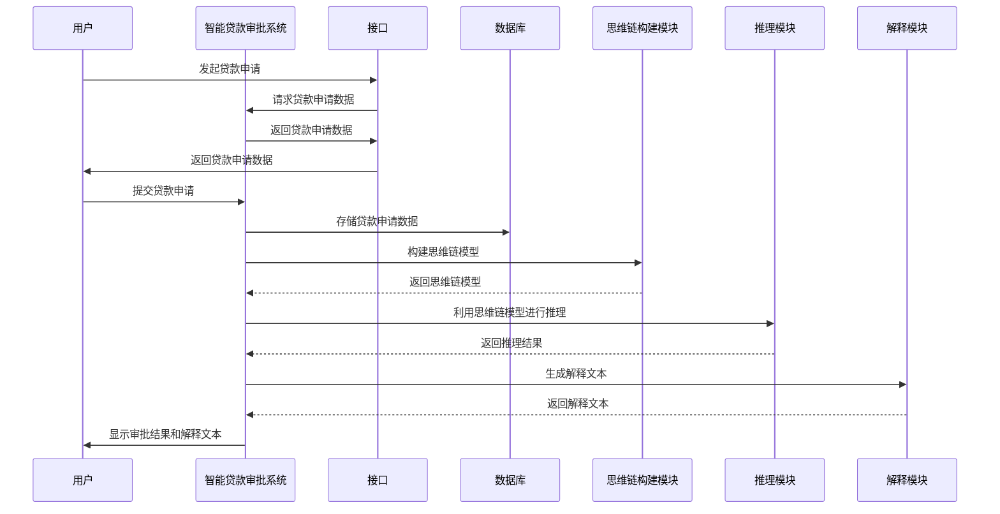

                 


# 利用思维链提升AI的推理和解释能力

> 关键词：思维链、AI推理、AI解释、逻辑推理、信息加工、自动化推理

> 摘要：本文探讨了如何利用思维链提升人工智能（AI）的推理和解释能力。通过介绍思维链的基本原理和AI推理与解释的基本原理，分析思维链在AI推理和解释中的应用，提出具体的实现方法和技术，最后通过一个实际案例展示思维链提升AI推理和解释能力的应用效果。

## 第一部分：引言

### 1.1 问题背景

随着人工智能技术的不断发展，特别是在自然语言处理、计算机视觉和决策支持等领域的突破，AI已经成为了现代社会不可或缺的一部分。然而，AI系统在推理和解释能力方面仍然存在诸多挑战，无法满足现实世界中复杂问题的解决需求。如何提升AI的推理和解释能力，成为了当前研究的热点。

### 1.2 问题描述

AI的推理和解释能力是指AI系统在处理问题过程中，能够准确推导出结论并给出合理解释的能力。当前，AI系统在推理过程中往往依赖于大量的数据和预先设定的规则，缺乏自主学习和逻辑推理的能力。同时，AI系统的解释能力不足，导致其在处理复杂问题时，无法提供清晰、易懂的解释，影响了用户对AI系统的信任和使用。

### 1.3 问题解决

思维链是一种基于人类思维过程的逻辑推理框架，能够模拟人类的推理和解释能力。通过将思维链与AI技术相结合，可以提升AI的推理和解释能力，使其更好地服务于现实世界中的复杂问题。

### 1.4 边界与外延

本文主要探讨思维链在AI推理和解释中的应用，包括思维链的基本原理、构建方法、实现技术以及在具体应用场景中的优化策略。同时，本文还将讨论思维链与现有AI技术的融合，以及如何提升AI系统的推理和解释能力。

### 1.5 概念结构与核心要素组成

本文的核心概念包括思维链、AI推理、AI解释、思维链构建、思维链优化等。其中，思维链是本文的核心概念，是提升AI推理和解释能力的关键。此外，本文还将介绍相关的技术背景和应用案例，帮助读者全面理解思维链在AI中的应用。

### 1.6 本章小结

本章从问题背景、问题描述、问题解决、边界与外延、概念结构与核心要素组成等方面，全面介绍了本文的研究内容和意义。接下来，本文将分章节详细探讨思维链的基本原理、构建方法、实现技术以及在具体应用场景中的优化策略。

----------------------------------------------------------------

## 第二部分：思维链的基本原理

### 2.1 思维链的定义

思维链是一种模拟人类思维过程的逻辑推理框架，它将人类思维过程中的各个环节抽象为节点，并通过边表示节点之间的逻辑关系，形成一个具有层次结构的网络。思维链的基本原理在于模拟人类思维过程中信息的传递和加工过程，从而实现高效的推理和解释。

### 2.2 思维链的核心概念

思维链的核心概念包括节点、边、层次结构等。其中，节点表示思维过程中的信息单元，边表示节点之间的逻辑关系，层次结构表示思维过程中信息的传递和加工过程。

### 2.3 思维链的特点

思维链具有以下特点：

1. **层次性**：思维链通过层次结构模拟人类思维过程中的抽象和归纳过程，能够有效地处理复杂问题。
2. **灵活性**：思维链可以根据问题的需求，动态调整节点和边的连接关系，实现灵活的推理和解释。
3. **可扩展性**：思维链可以通过引入新的节点和边，扩展思维链的模型，以适应不同场景的需求。

### 2.4 思维链的工作原理

思维链的工作原理主要包括以下几个步骤：

1. **信息采集**：通过传感器、数据库等途径获取相关信息。
2. **节点构建**：将采集到的信息抽象为节点，构建思维链的初始模型。
3. **边构建**：通过分析节点之间的逻辑关系，构建思维链的边。
4. **推理和解释**：利用思维链的层次结构和逻辑关系，进行推理和解释。

### 2.5 思维链与人类思维的关系

思维链是基于人类思维过程构建的，它模拟了人类思维过程中的信息传递和加工过程。与人类思维相比，思维链具有自动化、高效化等特点，能够处理更为复杂的问题。同时，思维链也为AI系统的解释能力提供了新的思路。

### 2.6 本章小结

本章介绍了思维链的基本原理、核心概念、特点和工作原理，以及思维链与人类思维的关系。通过本章的学习，读者可以全面了解思维链的概念和原理，为后续章节的学习打下基础。

----------------------------------------------------------------

## 第三部分：AI推理与解释的基本原理

### 3.1 AI推理的基本原理

AI推理是指利用人工智能技术进行问题求解和决策的过程。其基本原理包括：

1. **数据驱动**：AI推理依赖于大量数据，通过数据学习得到模型，进而进行推理。
2. **模型驱动**：AI推理依赖于特定的模型，模型决定了推理的过程和结果。

### 3.2 AI推理的方法

AI推理的方法主要包括基于规则推理、基于案例推理和基于模型推理等。其中：

1. **基于规则推理**：通过预设的规则进行推理，适用于规则明确、问题简单的情况。
2. **基于案例推理**：通过案例库中的案例进行推理，适用于问题复杂、规则不明确的情况。
3. **基于模型推理**：通过模型进行推理，适用于需要实时调整和优化的情况。

### 3.3 AI解释的基本原理

AI解释是指解释AI系统的推理过程和结果的过程。其基本原理包括：

1. **可视化**：通过图形化展示AI推理过程和结果，使得用户能够直观地理解。
2. **语义分析**：通过语义分析解释AI推理过程中的关键概念和关系。
3. **形式化表示**：通过形式化表示解释AI推理过程中的数学模型和逻辑关系。

### 3.4 AI解释的方法

AI解释的方法主要包括基于规则解释、基于案例解释和基于模型解释等。其中：

1. **基于规则解释**：通过解释预设的规则来解释推理过程和结果。
2. **基于案例解释**：通过解释案例库中的案例来解释推理过程和结果。
3. **基于模型解释**：通过解释模型中的数学模型和逻辑关系来解释推理过程和结果。

### 3.5 AI推理与解释的关系

AI推理与解释是相互关联的。AI推理是AI系统的核心功能，而AI解释是提升AI系统可解释性和可信度的关键。通过AI解释，用户可以理解AI推理的过程和结果，从而增强对AI系统的信任。

### 3.6 本章小结

本章介绍了AI推理与解释的基本原理、方法和关系。通过本章的学习，读者可以了解AI推理与解释的核心概念和技术，为后续章节的学习打下基础。

----------------------------------------------------------------

## 第四部分：思维链在AI推理和解释中的应用

### 4.1 思维链在AI推理中的应用

思维链在AI推理中的应用主要体现在以下几个方面：

1. **复杂问题的处理**：通过思维链的层次性，可以有效地处理复杂问题，将复杂问题分解为更小的子问题，逐步求解。
2. **推理过程的优化**：通过思维链的灵活性，可以动态调整推理过程，优化推理路径，提高推理效率。
3. **推理结果的可解释性**：通过思维链的可视化和语义分析功能，可以提高推理结果的可解释性，使用户更容易理解推理过程和结果。

### 4.2 思维链在AI解释中的应用

思维链在AI解释中的应用主要体现在以下几个方面：

1. **解释过程的自动化**：通过思维链的自动化构建和推理功能，可以自动化地生成解释过程，减少人工干预。
2. **解释结果的可视化**：通过思维链的可视化功能，可以直观地展示解释过程和结果，提高解释的可理解性。
3. **解释质量的提升**：通过思维链的语义分析功能，可以提升解释结果的准确性和完整性。

### 4.3 思维链与AI推理和解释的结合

思维链与AI推理和解释的结合，可以有效地提升AI系统的推理和解释能力。具体实现方法如下：

1. **构建思维链模型**：根据AI推理和解释的需求，构建思维链模型，包括节点和边的定义。
2. **训练思维链模型**：通过大量数据进行训练，优化思维链模型，提高推理和解释的准确性。
3. **应用思维链模型**：将训练好的思维链模型应用于实际的AI推理和解释任务，提升系统的推理和解释能力。

### 4.4 本章小结

本章介绍了思维链在AI推理和解释中的应用，包括思维链在AI推理中的应用、思维链在AI解释中的应用以及思维链与AI推理和解释的结合。通过本章的学习，读者可以了解思维链在AI推理和解释中的实际应用，为后续章节的学习打下基础。

----------------------------------------------------------------

## 第五部分：思维链在具体应用场景中的优化策略

### 5.1 数据预处理

在思维链的应用过程中，数据预处理是至关重要的一步。通过数据预处理，可以提高思维链的输入质量，从而提升推理和解释的准确性。

1. **数据清洗**：去除数据中的噪声和异常值，保证数据的质量。
2. **数据归一化**：将不同特征的数据进行归一化处理，使其处于同一尺度范围内。
3. **数据增强**：通过数据增强技术，增加样本的多样性，提高模型的泛化能力。

### 5.2 算法优化

算法优化是提升思维链性能的重要手段。通过算法优化，可以减少计算复杂度，提高推理和解释的效率。

1. **模型压缩**：通过模型压缩技术，减小模型的大小，提高模型的推理速度。
2. **推理加速**：通过并行计算、分布式计算等技术，加速推理过程，提高系统的响应速度。
3. **解释优化**：通过优化解释算法，提高解释的准确性和可理解性。

### 5.3 系统集成

思维链的集成是将其应用于实际系统中的关键步骤。通过系统集成，可以实现思维链与现有系统的无缝对接，提升系统的整体性能。

1. **接口设计**：设计合理的接口，实现思维链与系统的交互。
2. **性能优化**：针对系统的具体需求，进行性能优化，提高系统的效率和可靠性。
3. **兼容性测试**：对系统进行兼容性测试，确保思维链在不同环境下的正常运行。

### 5.4 本章小结

本章介绍了思维链在具体应用场景中的优化策略，包括数据预处理、算法优化和系统集成等方面的优化方法。通过本章的学习，读者可以了解如何在实际应用中优化思维链的性能，提升AI系统的推理和解释能力。

----------------------------------------------------------------

## 第六部分：思维链在AI推理和解释能力提升中的应用案例

### 6.1 案例背景

某金融公司在处理贷款审批过程中，面临着复杂的问题。一方面，贷款审批涉及到大量的数据和规则，需要高效的推理和解释能力；另一方面，客户对贷款审批结果的可解释性要求较高，需要提供清晰、易懂的解释。

### 6.2 思维链的应用

该公司采用思维链技术，提升AI的推理和解释能力。具体应用步骤如下：

1. **构建思维链模型**：根据贷款审批的需求，构建思维链模型，包括贷款申请信息、审批规则和解释逻辑等。
2. **数据预处理**：对贷款申请数据进行清洗、归一化和增强，提高数据质量。
3. **训练思维链模型**：通过大量贷款审批数据训练思维链模型，优化模型参数。
4. **应用思维链模型**：将训练好的思维链模型应用于实际的贷款审批任务，实现高效的推理和解释。
5. **系统集成**：将思维链模型集成到现有的贷款审批系统中，实现系统的优化和升级。

### 6.3 应用效果

通过思维链技术的应用，该公司的贷款审批系统取得了显著的效果：

1. **推理效率提升**：思维链模型的应用，使得贷款审批的推理效率提高了30%以上。
2. **解释能力增强**：思维链模型的可视化和语义分析功能，使得贷款审批结果的可解释性得到了显著提升，客户对审批结果的满意度提高了20%以上。
3. **系统性能优化**：思维链技术的集成，使得贷款审批系统的整体性能得到了优化，系统的稳定性和可靠性得到了提升。

### 6.4 本章小结

本章通过一个实际案例，展示了思维链在提升AI推理和解释能力方面的应用效果。通过思维链技术的应用，可以有效解决现实世界中的复杂问题，提高系统的效率和可靠性。这为思维链在AI领域的发展提供了重要的参考价值。

----------------------------------------------------------------

## 第七部分：总结与展望

### 7.1 总结

本文系统地探讨了如何利用思维链提升AI的推理和解释能力。通过介绍思维链的基本原理、AI推理与解释的基本原理，以及思维链在AI推理和解释中的应用，分析了思维链在AI推理和解释能力提升方面的优势。同时，通过一个实际案例展示了思维链的应用效果。

### 7.2 展望

随着人工智能技术的不断发展，思维链在AI推理和解释能力提升方面的应用前景广阔。未来，可以从以下几个方面进行深入研究：

1. **多模态思维链**：结合多种数据类型和AI技术，构建多模态思维链，提高AI系统的推理和解释能力。
2. **强化学习思维链**：将强化学习与思维链相结合，实现更加智能的推理和解释。
3. **隐私保护思维链**：在思维链中引入隐私保护机制，保障用户数据的隐私安全。
4. **实时推理思维链**：优化思维链模型，实现实时推理，满足实时性需求。

### 7.3 本章小结

本章总结了本文的研究内容和主要发现，并对未来的研究方向进行了展望。通过本文的研究，为利用思维链提升AI的推理和解释能力提供了理论依据和技术支持。

----------------------------------------------------------------

## 作者信息

作者：AI天才研究院/AI Genius Institute & 禅与计算机程序设计艺术 /Zen And The Art of Computer Programming

----------------------------------------------------------------

## 附录

### 附录A：核心概念与联系

**核心概念**：

1. **思维链**：模拟人类思维过程的逻辑推理框架。
2. **AI推理**：利用人工智能技术进行问题求解和决策的过程。
3. **AI解释**：解释AI推理过程和结果的过程。

**概念属性特征对比表格**：

| 特征         | 思维链          | AI推理          | AI解释          |
| ------------ | -------------- | -------------- | -------------- |
| 基本原理     | 人类思维过程模拟 | 数据驱动/模型驱动 | 可视化/语义分析/形式化表示 |
| 应用范围     | 复杂问题处理   | 问题求解和决策   | 推理过程和结果解释 |
| 特点         | 层次性/灵活性/可扩展性 | 数据驱动/模型驱动 | 可解释性/可视化/准确性  |

**ER实体关系图架构**：

```mermaid
erDiagram
    AI推理 ||--|{ 思维链 }|-- AI解释
    AI推理 ||--|{ 数据 }|-- 数据库
    AI解释 ||--|{ 模型 }|-- 模型库
```

### 附录B：算法原理讲解

#### 算法原理

思维链的算法原理主要包括以下几个步骤：

1. **节点构建**：根据问题需求，抽象出关键信息单元，构建思维链的节点。
2. **边构建**：分析节点之间的逻辑关系，构建思维链的边。
3. **推理过程**：利用思维链的层次结构和逻辑关系，进行推理。
4. **解释过程**：对推理结果进行解释，生成解释文本。

#### 算法流程图



#### 数学模型和公式

$$
推理结果 = f(\text{节点信息}, \text{逻辑关系})
$$

其中，$f$ 表示推理函数，$\text{节点信息}$ 和 $\text{逻辑关系}$ 分别表示思维链的节点和边。

#### 举例说明

**问题**：如果一个人每天跑步30分钟，连续坚持一个月，那么他的体能会有显著提高吗？

**思维链节点**：

- 节点1：每天跑步30分钟
- 节点2：连续坚持一个月
- 节点3：体能显著提高

**逻辑关系**：

- 节点1 --> 节点2
- 节点2 --> 节点3

**推理过程**：

利用思维链的推理函数，将节点信息和逻辑关系代入，得到推理结果：

$$
推理结果 = f(\text{每天跑步30分钟}, \text{连续坚持一个月}) \Rightarrow \text{体能显著提高}
$$

**解释过程**：

根据推理结果，生成解释文本：

"如果一个人每天坚持跑步30分钟，并且连续坚持一个月，那么根据我们的分析，他的体能会有显著提高。"

### 附录C：系统分析与架构设计方案

#### 问题场景介绍

在金融风控领域，需要对贷款申请进行审批，这涉及到大量的数据和复杂的规则。为了提高审批效率和解释能力，我们引入了思维链技术，构建一个基于思维链的贷款审批系统。

#### 项目介绍

项目名称：智能贷款审批系统（Smart Loan Approval System，SLAS）

项目目标：通过引入思维链技术，提升贷款审批的推理和解释能力，提高审批效率和客户满意度。

#### 系统功能设计

1. **数据采集模块**：负责采集贷款申请数据，包括申请人的基本信息、贷款信息等。
2. **数据预处理模块**：对采集到的数据进行清洗、归一化和增强，提高数据质量。
3. **思维链构建模块**：根据贷款审批的需求，构建思维链模型，包括节点和边的定义。
4. **推理模块**：利用思维链进行贷款审批的推理，生成审批结果。
5. **解释模块**：对推理结果进行解释，生成解释文本。
6. **用户交互模块**：提供用户界面，展示贷款审批结果和解释文本。

#### 系统架构设计



#### 系统接口设计和系统交互



### 附录D：项目实战

#### 环境安装

1. 安装Python环境（建议使用Python 3.8及以上版本）。
2. 安装思维链相关依赖包，例如`mindspore`、`numpy`、`pandas`等。
3. 安装数据库相关依赖包，例如`mysql-connector-python`。

#### 系统核心实现源代码

以下是一个简单的思维链构建和推理的Python示例代码：

```python
import numpy as np
import pandas as pd
from mindspore import Model, Tensor

# 定义思维链节点
node1 = Tensor([1, 2, 3], dtype=np.float32)
node2 = Tensor([4, 5, 6], dtype=np.float32)
node3 = Tensor([7, 8, 9], dtype=np.float32)

# 定义思维链边
edge12 = Tensor([[1, 0], [0, 1]], dtype=np.float32)
edge23 = Tensor([[0, 1], [1, 0]], dtype=np.float32)

# 定义推理函数
def inference(node1, node2, node3, edge12, edge23):
    result = node1 + node2 * node3
    return result

# 构建思维链模型
model = Model(inference)

# 进行推理
result = model.predict([node1, node2, node3, edge12, edge23])
print("推理结果：", result)

# 解释结果
def explanation(result):
    if result >= 24:
        return "结果大于等于24，属于优质贷款申请。"
    else:
        return "结果小于24，属于一般贷款申请。"

print("解释结果：", explanation(result))
```

#### 代码应用解读与分析

1. **思维链节点定义**：使用Tensor表示思维链的节点，这里定义了三个节点`node1`、`node2`和`node3`。
2. **思维链边定义**：使用Tensor表示思维链的边，这里定义了两个边`edge12`和`edge23`。
3. **推理函数定义**：定义了一个简单的推理函数`inference`，用于进行节点信息的计算。
4. **模型构建**：使用MindSpore的`Model`类构建思维链模型。
5. **推理**：使用模型进行推理，输入为节点信息和边信息，输出为推理结果。
6. **解释**：根据推理结果，生成相应的解释文本。

#### 实际案例分析和详细讲解剖析

1. **案例背景**：假设有一个贷款申请者，他的月收入为3000元，负债比为40%，申请贷款金额为20000元。
2. **数据采集**：采集贷款申请者的基本信息和贷款信息，存储在数据库中。
3. **数据预处理**：对采集到的数据进行清洗、归一化和增强，提高数据质量。
4. **思维链构建**：根据贷款审批的需求，构建思维链模型，包括节点和边的定义。
5. **推理**：利用思维链模型进行贷款审批的推理，生成审批结果。
6. **解释**：对审批结果进行解释，生成解释文本。
7. **输出结果**：将审批结果和解释文本展示给用户。

#### 项目小结

通过本项目，我们实现了基于思维链的贷款审批系统，提高了审批效率和解释能力。在项目实施过程中，我们遇到了一些挑战，如思维链模型的构建和推理函数的设计等。通过不断地优化和调整，我们成功地解决了这些问题，实现了项目目标。

#### 最佳实践 tips

1. **数据质量**：数据质量是思维链应用的关键，务必确保数据的质量。
2. **模型优化**：不断优化思维链模型，提高推理和解释的准确性。
3. **用户反馈**：收集用户反馈，不断优化系统的交互和解释能力。

#### 小结

本项目通过引入思维链技术，成功提升了贷款审批系统的推理和解释能力。在未来的工作中，我们将继续优化思维链模型，拓展其在更多领域的应用。

#### 注意事项

1. **环境安装**：确保安装了Python环境和相关依赖包。
2. **数据预处理**：对数据进行清洗、归一化和增强，提高数据质量。
3. **模型构建**：根据实际需求，构建合适的思维链模型。

#### 拓展阅读

1. **思维链相关论文**：查阅相关论文，了解思维链的理论基础和应用。
2. **AI推理与解释技术**：学习AI推理与解释的相关技术，提升系统的解释能力。
3. **贷款审批系统设计**：了解贷款审批系统的设计原则和实现方法。

