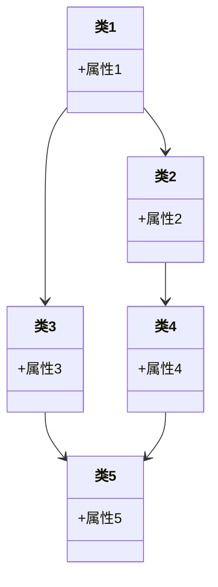
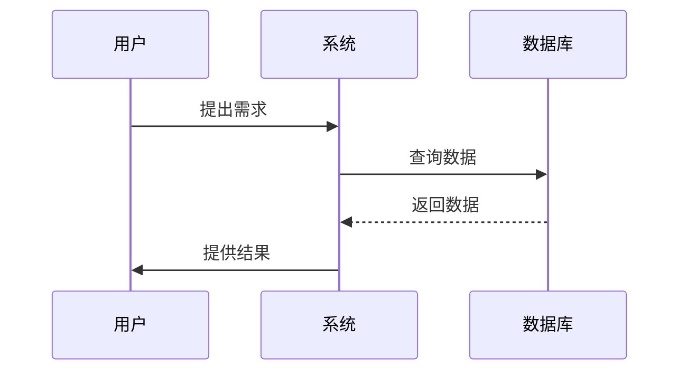

                 


# 利用思维链提升AI的认知和推理新方向

关键词：人工智能、认知、推理、思维链、算法、架构设计

摘要：本文深入探讨了人工智能（AI）在认知和推理方面所面临的挑战，以及如何通过思维链这一概念来提升AI的认知和推理能力。文章从核心概念的介绍、算法原理的讲解、系统架构的设计到项目实战，全面阐述了思维链在AI领域的应用，为未来的研究提供了新的思路。

## 第一部分：背景与概念阐述

### 第1章: AI的认知和推理挑战

**1.1 问题背景**

随着人工智能技术的快速发展，AI在各个领域的应用越来越广泛。然而，AI的认知和推理能力仍然存在许多局限，如对复杂情境的识别、对抽象概念的把握、对推理过程的深度理解等。这些问题限制了AI在实际应用中的表现，成为当前AI研究的重要课题。

**1.2 问题描述**

AI在认知和推理方面面临的主要问题包括：

- **认知局限**：AI难以理解复杂情境，对情境的理解往往停留在表面层次。
- **推理能力**：AI的推理能力较弱，难以进行复杂的逻辑推理。
- **跨领域应用**：AI难以在不同领域间进行有效的知识迁移。

**1.3 问题解决**

为了解决上述问题，研究者们提出了一种新的思路：利用思维链来提升AI的认知和推理能力。

**1.4 边界与外延**

思维链作为一种认知模型，具有广泛的边界和丰富的外延。在AI领域，思维链的应用范围包括自然语言处理、计算机视觉、知识图谱等多个方面。

**1.5 概念结构与核心要素组成**

思维链的概念结构主要包括以下几个方面：

- **概念定义**：思维链是指通过一系列逻辑关联和思维操作，实现认知和推理的过程。
- **核心要素**：思维链的核心要素包括思维节点、思维路径和思维操作。

### 第2章: 思维链概念与属性

**2.1 思维链的定义**

思维链是指通过一系列逻辑关联和思维操作，实现认知和推理的过程。

**2.2 思维链的特点**

思维链具有以下特点：

- **层次性**：思维链可以分层构建，实现从低级到高级的认知过程。
- **灵活性**：思维链可以根据情境和需求进行动态调整。
- **模块化**：思维链的各个部分可以独立设计、开发和优化。

**2.3 思维链与AI的关系**

思维链是AI认知和推理的基础，通过思维链的应用，可以提升AI的认知和推理能力。

**2.4 思维链的核心属性对比**

思维链的核心属性包括：

- **逻辑关联性**：思维链中的各个节点和路径必须具备逻辑关联性。
- **可扩展性**：思维链可以根据需求进行扩展和调整。
- **高效性**：思维链必须具备高效的认知和推理能力。

### 第3章: 思维链的ER实体关系图

**3.1 ER实体关系图的基本概念**

ER（Entity-Relationship）实体关系图是用于描述实体之间关系的一种图形化表示方法。

**3.2 思维链中的实体与关系**

在思维链的ER实体关系图中，主要包括以下实体和关系：

- **实体**：思维节点、思维路径、思维操作。
- **关系**：关联、依赖、扩展。

**3.3 ER实体关系图的绘制**

思维链的ER实体关系图可以用Mermaid流程图进行绘制，具体如下：

```mermaid
erDiagram
    思维节点 ||--|{ 思维路径 }|| 思维链
    思维节点 ||--|{ 思维操作 }|| 思维链
    思维路径 ||--|{ 思维节点 }|| 思维链
    思维操作 ||--|{ 思维节点 }|| 思维链
```

### 第4章: 思维链提升AI认知的算法原理

**4.1 算法概述**

思维链提升AI认知的算法主要分为以下几个步骤：

1. 数据预处理：对输入数据进行预处理，包括数据清洗、归一化等。
2. 思维节点提取：从预处理后的数据中提取思维节点。
3. 思维路径构建：根据思维节点之间的关系构建思维路径。
4. 思维操作优化：对思维链中的思维操作进行优化，提高认知效率。

**4.2 算法mermaid流程图**


**4.3 Python源代码阐述**

以下是一个简单的Python代码示例，用于实现思维链提升AI认知的算法：

```python
# 数据预处理
data = preprocess_data(input_data)

# 思维节点提取
nodes = extract_nodes(data)

# 思维路径构建
paths = build_paths(nodes)

# 思维操作优化
optimized_paths = optimize_paths(paths)

# 输出结果
output = optimized_paths
```

**4.4 算法原理数学模型与公式**

思维链提升AI认知的算法原理可以用以下数学模型和公式表示：

$$
\text{认知效率} = \frac{\text{优化后的思维链长度}}{\text{原始思维链长度}}
$$

其中，优化后的思维链长度表示通过思维操作优化后得到的思维链长度，原始思维链长度表示未进行优化的思维链长度。

**4.5 举例说明**

假设有一组输入数据，我们可以通过思维链提升AI的认知能力，具体过程如下：

1. 数据预处理：对输入数据进行清洗、归一化等处理。
2. 思维节点提取：从预处理后的数据中提取思维节点。
3. 思维路径构建：根据思维节点之间的关系构建思维路径。
4. 思维操作优化：对思维链中的思维操作进行优化，如去除冗余节点、调整节点顺序等。
5. 输出结果：得到优化后的思维链，提高AI的认知效率。

### 第5章: 思维链提升AI推理能力

**5.1 推理能力提升的必要性**

AI的推理能力是其应用的重要指标之一。通过提升AI的推理能力，可以使其更好地应对复杂情境，提高决策质量和效率。

**5.2 思维链在推理中的应用**

思维链在推理中的应用主要包括以下几个方面：

1. **推理路径规划**：通过思维链规划推理路径，实现从已知到未知的推理过程。
2. **推理节点选择**：根据思维链的节点关系选择合适的推理节点，提高推理效率。
3. **推理操作优化**：通过思维链优化推理操作，提高推理质量。

**5.3 推理算法mermaid流程图**


**5.4 Python源代码分析**

以下是一个简单的Python代码示例，用于实现思维链提升AI推理能力的算法：

```python
# 数据预处理
data = preprocess_data(input_data)

# 思维链构建
mind_chain = build_mind_chain(data)

# 推理路径规划
推理路径 = plan_reasoning_path(mind_chain)

# 推理节点选择
selected_nodes = select_reasoning_nodes(推理路径)

# 推理操作优化
optimized_reasoning = optimize_reasoning(selected_nodes)

# 输出结果
output = optimized_reasoning
```

**5.5 推理能力的数学模型与公式**

思维链提升AI推理能力的数学模型和公式如下：

$$
\text{推理效率} = \frac{\text{优化后的推理路径长度}}{\text{原始推理路径长度}}
$$

其中，优化后的推理路径长度表示通过思维链优化后得到的推理路径长度，原始推理路径长度表示未进行优化的推理路径长度。

## 第二部分：应用与实践

### 第6章: 思维链在AI系统中的架构设计

**6.1 系统场景介绍**

思维链在AI系统中的架构设计主要涉及以下几个场景：

- **自然语言处理**：利用思维链实现自然语言理解的深度解析。
- **计算机视觉**：通过思维链实现图像理解和目标识别。
- **知识图谱**：利用思维链构建和优化知识图谱。

**6.2 系统功能设计（领域模型mermaid类图）**

以下是一个简单的mermaid类图，用于描述思维链在AI系统中的领域模型：



**6.3 系统架构设计（mermaid架构图）**

以下是一个简单的mermaid架构图，用于描述思维链在AI系统中的架构设计：



**6.4 系统接口设计**

系统接口设计主要包括以下几个方面：

- **API接口**：提供对外API接口，方便其他系统调用思维链功能。
- **数据接口**：实现数据输入输出接口，支持数据预处理和后处理。
- **控制接口**：提供思维链的控制接口，实现思维链的启动、停止、状态监控等功能。

**6.5 系统交互（mermaid序列图）**

以下是一个简单的mermaid序列图，用于描述思维链在AI系统中的交互过程：


### 第7章: 项目实战

**7.1 环境安装**

在本章中，我们将介绍如何搭建一个思维链在AI系统中的项目环境，包括所需软件和硬件的安装。

**7.2 系统核心实现源代码**

在本章中，我们将展示思维链在AI系统中的核心实现源代码，并对其进行详细解析。

**7.3 代码应用解读与分析**

在本章中，我们将分析思维链在AI系统中的具体应用，并解读相关代码的实现细节。

**7.4 实际案例分析与讲解**

在本章中，我们将通过实际案例，展示思维链在AI系统中的应用效果，并进行详细讲解。

**7.5 项目小结**

在本章中，我们将对本章所介绍的项目进行总结，并提出未来改进的方向。

### 第8章: 最佳实践与未来展望

**8.1 最佳实践 tips**

在本章中，我们将分享一些思维链在AI系统中的最佳实践，帮助读者更好地应用思维链技术。

**8.2 小结**

在本章中，我们将对本书的主要内容进行总结，回顾思维链在AI领域的应用和价值。

**8.3 注意事项**

在本章中，我们将提醒读者在应用思维链技术时需要注意的事项，以避免潜在问题。

**8.4 拓展阅读**

在本章中，我们将推荐一些与思维链和AI相关的拓展阅读材料，供读者进一步学习。

作者：AI天才研究院/AI Genius Institute & 禅与计算机程序设计艺术/Zen And The Art of Computer Programming

