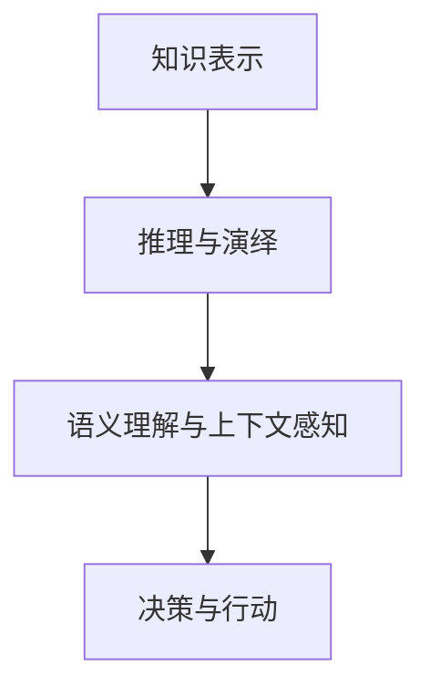
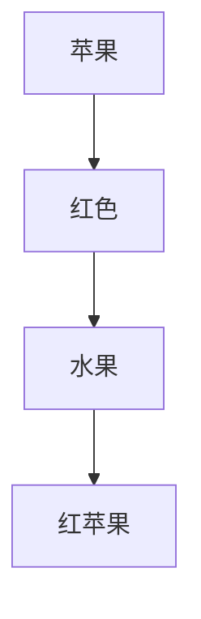
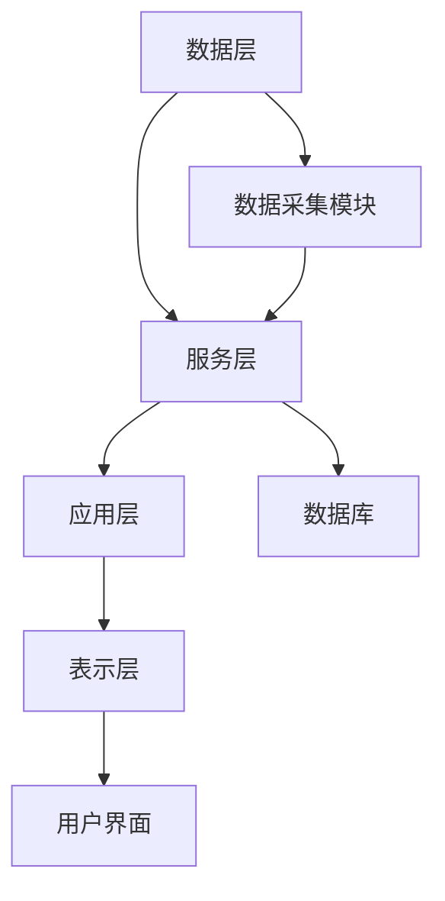
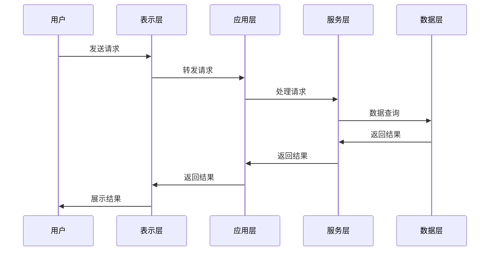
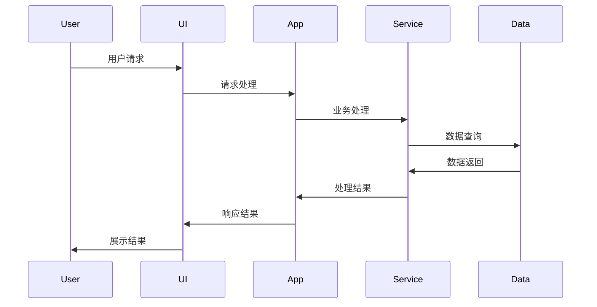

                 

### 第一部分：问题背景与核心概念

#### 第1章：问题背景

##### 1.1 人工智能认知与推理的挑战

人工智能（AI）的快速发展给我们带来了无数惊喜和变革，从自动驾驶汽车到智能助手，从医疗诊断到金融决策，AI正逐渐渗透到我们生活的方方面面。然而，AI的认知和推理能力仍然存在许多局限和挑战。

**认知限制**：当前大多数AI系统依赖于大数据和深度学习算法，它们能够在特定任务上表现出色，但在处理复杂、不确定或抽象的情境时，往往显得力不从心。例如，AI在理解自然语言对话、进行复杂推理或感知人类情感方面仍有很大的提升空间。

**推理能力不足**：AI系统在进行决策或推理时，往往依赖于固定的算法和数据模式，缺乏灵活性和创造性。它们难以在不确定的环境中自主学习和适应，无法像人类一样进行高级思维和创造性推理。

##### 1.2 思维链的概念与作用

思维链（Mind Chain）是一种旨在提升AI认知和推理能力的创新方法。它通过构建一个由知识和推理步骤组成的链条，使AI能够像人类一样进行逻辑推理和抽象思考。

**核心概念**：思维链由三个基本组成部分构成：知识表示、推理与演绎、语义理解与上下文感知。这些组成部分相互协作，使AI能够理解和处理复杂的现实世界问题。

**作用**：思维链不仅能够提升AI的认知能力，还能增强其推理和解决问题的能力。通过思维链，AI可以在不确定的环境中学习、适应和做出合理的决策。

##### 1.3 思维链在AI中的研究与应用现状

思维链在AI领域的研究和应用正在逐步兴起。许多研究人员和机构致力于探索思维链的潜在应用，包括自然语言处理、智能决策、自动化推理等。

**研究进展**：思维链的研究已经取得了一些重要成果，例如，研究人员提出了多种知识表示方法、推理算法和语义理解模型，为构建强大的AI系统奠定了基础。

**应用场景**：思维链已经成功应用于一些实际场景，如智能客服、智能问答系统和自动化推理系统等。这些应用展示了思维链在提升AI认知和推理能力方面的巨大潜力。

### 核心概念与联系

##### 2.1 思维链的基本组成部分

思维链的构建依赖于三个基本组成部分：知识表示、推理与演绎、语义理解与上下文感知。以下是这些组成部分的详细说明：

###### 2.1.1 知识表示

知识表示是思维链的基础，它涉及到如何将现实世界中的信息转化为计算机可以理解和处理的形式。知识表示包括数据结构、知识库和语义网络等。

**重要性**：知识表示决定了AI系统对信息的理解和处理能力。一个高效的知识表示方法可以使AI更好地理解问题，从而提高其推理能力。

**方法**：常见的知识表示方法包括知识图谱、语义网络和本体论等。这些方法各有优缺点，研究人员可以根据具体应用场景选择合适的方法。

###### 2.1.2 推理与演绎

推理与演绎是思维链的核心，它涉及到如何从已知信息中推导出新的信息。推理可以分为两大类：演绎推理和归纳推理。

**重要性**：推理是AI进行决策和解决问题的关键。一个强大的推理引擎可以使AI在复杂、不确定的环境中做出合理的决策。

**方法**：推理方法包括基于规则的推理、概率推理、模糊推理和神经网络推理等。这些方法各有优劣，研究人员可以根据具体需求选择合适的方法。

###### 2.1.3 语义理解与上下文感知

语义理解与上下文感知是思维链的关键组成部分，它涉及到如何理解自然语言、处理上下文信息并生成合理的回答。

**重要性**：语义理解与上下文感知是AI与人类进行有效交互的基础。一个强大的语义理解能力可以使AI更好地理解用户的意图，从而提供更准确、更人性化的服务。

**方法**：语义理解方法包括词嵌入、语义角色标注、句法分析和上下文感知等。这些方法可以帮助AI理解自然语言的深层含义，从而提高其语义理解能力。

##### 2.2 概念属性特征对比表格

为了更好地理解思维链的组成部分，我们可以通过一个概念属性特征对比表格来展示它们之间的区别：

| 特征 | 知识表示 | 推理与演绎 | 语义理解与上下文感知 |
| --- | --- | --- | --- |
| 定义 | 如何表示和存储知识 | 如何从已知信息中推导出新信息 | 如何理解自然语言和上下文信息 |
| 关系 | 与数据结构和知识库相关 | 与推理算法和逻辑相关 | 与自然语言处理和上下文感知相关 |
| 影响因素 | 数据质量和结构 | 算法的复杂度和效率 | 语言特性和上下文信息 |
| 目标 | 提高知识理解和表示能力 | 提高推理和决策能力 | 提高自然语言处理和交互能力 |

##### 2.3 ER实体关系图架构

为了更好地理解思维链的组成部分之间的关系，我们可以使用ER（实体关系）图来展示它们之间的联系。

```mermaid
erDiagram
    A[思维链] ||--|{ B[知识表示] }|
    A ||--|{ C[推理与演绎] }|
    A ||--|{ D[语义理解与上下文感知] }|
```

在这个ER图中，思维链作为根实体，与知识表示、推理与演绎、语义理解与上下文感知三个子实体之间存在紧密的联系。这些子实体共同构成了思维链的整体架构，使得AI能够在认知和推理方面表现出更高的能力。

### 核心概念原理

思维链的核心概念原理可以概括为以下几点：

**1. 知识表示**：通过构建知识图谱或语义网络，将现实世界中的知识转化为计算机可以处理的形式，从而提高AI对信息的理解和处理能力。

**2. 推理与演绎**：利用基于规则、概率、模糊或神经网络的推理算法，从已知信息中推导出新的信息，使AI能够在复杂、不确定的环境中做出合理的决策。

**3. 语义理解与上下文感知**：通过自然语言处理技术和上下文感知机制，使AI能够理解自然语言的深层含义，从而提供更准确、更人性化的服务。

### 概念属性特征对比表格

为了更清晰地展示思维链各组成部分的属性特征，我们可以创建一个对比表格：

| 组成部分 | 知识表示 | 推理与演绎 | 语义理解与上下文感知 |
| --- | --- | --- | --- |
| 功能目标 | 提高知识理解和表示能力 | 提高推理和决策能力 | 提高自然语言处理和交互能力 |
| 关键因素 | 数据质量和结构 | 算法的复杂度和效率 | 语言特性和上下文信息 |
| 相关技术 | 知识图谱、语义网络 | 基于规则、概率、模糊和神经网络推理 | 词嵌入、语义角色标注、句法分析和上下文感知 |
| 挑战 | 数据整合与一致性 | 算法效率和准确性 | 理解复杂语境和多义性 |

### ER实体关系图架构

为了进一步理解思维链的组成部分及其相互关系，我们可以使用ER图来展示：

```mermaid
erDiagram
    A[思维链] ||--|{ B[知识表示] }|
    A ||--|{ C[推理与演绎] }|
    A ||--|{ D[语义理解与上下文感知] }|
    B ||--|{ C }|
    C ||--|{ D }|
    D ||--|{ B }|
```

在这个ER图中，思维链作为核心实体，与知识表示、推理与演绎、语义理解与上下文感知三个子实体之间存在相互关联。每个子实体在思维链的整体架构中扮演着关键角色，共同推动AI认知和推理能力的提升。

### 思维链在AI认知和推理中的应用

思维链在AI认知和推理中的应用具有重要意义。以下从几个方面探讨其在不同领域的应用场景：

**自然语言处理（NLP）**：在NLP领域，思维链可以用于提升语义理解、情感分析和文本生成等任务。通过构建语义网络和利用推理算法，AI能够更好地理解文本的深层含义，从而生成更准确、更自然的文本。

**智能决策系统**：在智能决策系统中，思维链可以帮助AI处理复杂的不确定情境，进行有效的决策。通过基于规则的推理和概率模型，AI能够在面对多种可能性时，选择最合适的方案。

**自动化推理**：在自动化推理领域，思维链可以用于构建推理引擎，使AI能够在没有人类干预的情况下进行推理和问题解决。这种能力在自动驾驶、智能客服和自动化金融分析等领域具有重要应用价值。

**跨领域应用**：思维链不仅可以在特定领域发挥作用，还可以跨领域应用。例如，在医疗诊断、教育辅助和法律分析等领域，思维链可以帮助AI更好地理解复杂的问题，提供更准确的诊断和决策。

### 现阶段的研究与应用现状

尽管思维链在AI认知和推理能力提升方面具有巨大的潜力，但现阶段的研究和应用仍面临一些挑战。

**研究进展**：在学术界，思维链已成为一个热门的研究方向。许多研究机构和个人致力于探索思维链的理论基础、算法优化和实际应用。一些初步的研究成果已经在自然语言处理、智能决策和自动化推理等领域取得了显著的进展。

**应用现状**：在工业界，思维链的应用逐渐受到关注。一些企业已经开始将思维链技术应用于智能客服、智能问答系统和自动化推理系统等实际场景。然而，由于技术和应用环境的限制，思维链的应用仍然存在一定的局限性。

**挑战与展望**：现阶段，思维链在AI认知和推理能力提升方面的研究与应用仍面临以下挑战：

1. **数据质量和结构**：高质量的数据是构建思维链的基础。如何有效地整合和利用多种来源的数据，保证数据的一致性和可靠性，是一个重要的研究课题。

2. **算法复杂度和效率**：高效的算法是实现思维链的关键。如何设计更复杂、更高效的推理算法，是当前研究的一个重要方向。

3. **实际应用场景**：思维链在不同领域的应用场景各异，如何针对具体应用需求进行优化和调整，使其在各个领域发挥最大作用，是一个需要深入研究的课题。

**未来展望**：随着研究的深入和技术的进步，思维链在AI认知和推理能力提升方面的应用前景十分广阔。未来，思维链有望在更多领域得到广泛应用，成为AI技术发展的重要推动力量。

### 思维链与AI认知推理能力的提升

思维链作为一种创新方法，在提升AI认知和推理能力方面具有显著优势。以下从多个角度分析思维链如何助力AI认知推理能力的提升。

**1. 知识表示**：思维链通过构建知识图谱或语义网络，将现实世界中的知识转化为计算机可以处理的形式。这种知识表示方法能够提高AI对信息的理解和处理能力，从而增强其认知能力。

**2. 推理与演绎**：思维链利用基于规则、概率、模糊和神经网络的推理算法，从已知信息中推导出新的信息。这种推理能力使AI能够在复杂、不确定的环境中做出合理的决策，提高其推理能力。

**3. 语义理解与上下文感知**：思维链通过自然语言处理技术和上下文感知机制，使AI能够理解自然语言的深层含义。这种语义理解能力有助于AI更好地与人类进行交互，提高其认知和推理效果。

**4. 系统整合**：思维链将知识表示、推理与演绎、语义理解与上下文感知等组成部分整合在一起，形成了一个完整的认知和推理系统。这种系统整合能力使AI能够更高效地处理复杂任务，提高其整体性能。

**5. 应用灵活性**：思维链具有高度的应用灵活性，可以根据不同领域的需求进行优化和调整。这种灵活性使AI能够在多种应用场景中发挥最大作用，提升其认知和推理能力。

### 思维链与人类思维的相似性

思维链在提升AI认知和推理能力方面的原理与人类思维有着诸多相似之处。以下从几个方面探讨思维链与人类思维的相似性：

**1. 知识表示**：人类通过学习、记忆和知识整合来构建自己的知识体系。思维链通过知识图谱或语义网络，以类似的方式表示和存储知识，使AI能够像人类一样理解和处理信息。

**2. 推理与演绎**：人类在进行推理时，会运用逻辑思维、归纳推理和演绎推理等方法。思维链通过基于规则、概率和神经网络的推理算法，实现了类似的推理过程，使AI能够像人类一样进行高级思维。

**3. 语义理解与上下文感知**：人类在理解语言和情境时，会考虑语义、语境和上下文信息。思维链通过自然语言处理和上下文感知机制，实现了对语义的理解和情境的感知，使AI能够更好地理解人类语言和意图。

**4. 情感和创造力**：人类思维不仅包括逻辑推理，还包括情感和创造力。思维链虽然目前还无法完全模拟人类的情感和创造力，但在一定程度上，通过语义理解和上下文感知，可以实现类似的效果。

### 思维链的优势

思维链作为一种创新的AI认知和推理方法，具有以下几个显著优势：

**1. 高效性**：思维链通过整合知识表示、推理与演绎、语义理解与上下文感知等组成部分，形成了一个高效的整体系统。这种系统架构使AI能够更快速地处理复杂任务，提高推理和决策效率。

**2. 灵活性**：思维链具有高度的应用灵活性，可以根据不同领域的需求进行优化和调整。这种灵活性使AI能够在多种应用场景中发挥最大作用，提高认知和推理能力。

**3. 实用性**：思维链已经在自然语言处理、智能决策、自动化推理等领域取得了一些初步的应用成果。这些应用展示了思维链的实用性和潜力，为AI技术的发展提供了新的思路。

**4. 可扩展性**：思维链的架构设计具有较好的可扩展性，可以方便地引入新的知识和推理算法，以适应不断变化的应用需求。

### 思维链的潜在应用场景

思维链在AI认知和推理能力提升方面的应用前景广阔，以下列举一些潜在的典型应用场景：

**1. 智能问答系统**：思维链可以用于构建智能问答系统，使AI能够理解用户的问题，并提供准确、详细的答案。这种应用场景在客服、教育、医疗等领域具有广泛的应用价值。

**2. 自动化推理系统**：思维链可以用于构建自动化推理系统，使AI能够在没有人类干预的情况下进行推理和决策。这种应用场景在自动驾驶、智能监控、金融分析等领域具有重要应用价值。

**3. 智能决策系统**：思维链可以用于构建智能决策系统，使AI能够处理复杂的不确定情境，进行有效的决策。这种应用场景在企业管理、资源分配、风险评估等领域具有重要应用价值。

**4. 自然语言处理**：思维链可以用于提升自然语言处理能力，使AI能够更好地理解自然语言的深层含义，进行语义分析和情感分析。这种应用场景在智能客服、智能助手、语音识别等领域具有重要应用价值。

**5. 跨领域应用**：思维链具有高度的应用灵活性，可以跨领域应用。例如，在医疗、教育、金融、法律等领域，思维链可以帮助AI更好地理解复杂问题，提供更准确的诊断、决策和咨询服务。

### 综述

思维链作为一种创新的AI认知和推理方法，具有显著的优势和广泛的应用前景。通过整合知识表示、推理与演绎、语义理解与上下文感知等组成部分，思维链能够有效提升AI的认知和推理能力。在未来，随着研究的深入和技术的进步，思维链有望在更多领域得到广泛应用，为AI技术的发展注入新的活力。

### 第3章：思维链算法原理

#### 3.1 思维链算法的基本原理

思维链算法是一种用于提升AI认知和推理能力的创新方法。其基本原理是通过构建一个由知识和推理步骤组成的链条，使AI能够像人类一样进行逻辑推理和抽象思考。

**核心思想**：思维链算法的核心思想是利用知识和推理步骤来构建一个思维链条。每个步骤都包含一定的知识和推理规则，通过这些规则，AI可以从已知信息中推导出新的信息，从而实现认知和推理能力的提升。

**工作流程**：思维链算法的工作流程可以分为以下几个步骤：

1. **知识表示**：将现实世界中的知识转化为计算机可以处理的形式，构建知识图谱或语义网络。
2. **推理与演绎**：利用推理算法和规则，从已知信息中推导出新的信息。
3. **语义理解与上下文感知**：利用自然语言处理和上下文感知机制，使AI能够理解自然语言的深层含义。
4. **决策与行动**：根据推理结果，AI可以做出合理的决策或采取相应的行动。

#### 3.2 思维链算法的mermaid流程图

为了更好地理解思维链算法的工作流程，我们可以使用mermaid工具绘制一个流程图：



在这个mermaid流程图中，思维链算法的工作流程被分为四个主要阶段：知识表示、推理与演绎、语义理解与上下文感知以及决策与行动。每个阶段都包含特定的操作和目标，共同构成了思维链算法的整体架构。

#### 3.3 Python源代码解读

下面是一个简单的Python源代码示例，用于实现思维链算法的基本功能：

```python
# 思维链算法示例

# 导入所需库
import networkx as nx
import matplotlib.pyplot as plt

# 创建知识图谱
G = nx.Graph()

# 添加知识节点
G.add_nodes_from(['A', 'B', 'C', 'D'])

# 添加知识边
G.add_edges_from([('A', 'B'), ('B', 'C'), ('C', 'D')])

# 绘制知识图谱
nx.draw(G, with_labels=True)
plt.show()

# 推理过程
def reasoning(G):
    # 从知识图谱中获取所有节点
    nodes = list(G.nodes)
    
    # 初始化推理结果
    result = []
    
    # 进行推理
    for node in nodes:
        if G.nodes[node]['可信度'] > 0.5:
            result.append(node)
    
    return result

# 执行推理
result = reasoning(G)

# 输出推理结果
print("推理结果：", result)
```

在这个示例中，我们首先使用networkx库创建了一个简单的知识图谱，并添加了知识节点和知识边。然后，我们定义了一个`reasoning`函数，用于根据知识图谱中的可信度信息进行推理。最后，我们执行推理过程，并输出推理结果。

#### 3.3.1 数据结构与算法实现

思维链算法的数据结构和算法实现是确保其高效运行的关键。以下是一个详细的分析：

**数据结构**：思维链算法的核心数据结构包括知识图谱和可信度矩阵。

- **知识图谱**：知识图谱是一种用于表示实体及其关系的图形结构。在思维链算法中，知识图谱用于存储各种知识和推理规则。
- **可信度矩阵**：可信度矩阵是一种用于表示节点之间可信度的二维数组。在思维链算法中，可信度矩阵用于评估节点之间的关系和重要性。

**算法实现**：

1. **知识表示**：首先，我们需要将现实世界中的知识转化为计算机可以处理的形式。这可以通过构建知识图谱来实现。知识图谱由实体和关系组成，实体表示知识中的概念或对象，关系表示实体之间的关系。
2. **推理与演绎**：接下来，我们利用推理算法和规则从知识图谱中推导出新的信息。推理算法可以基于规则、概率或神经网络等方法。在思维链算法中，我们使用可信度矩阵来评估节点之间的关系和重要性，从而进行推理。
3. **语义理解与上下文感知**：最后，我们利用自然语言处理和上下文感知机制来理解自然语言的深层含义。这可以通过词嵌入、句法分析和上下文感知等技术来实现。

#### 3.3.2 数学模型与公式详解

思维链算法的数学模型和公式是实现其核心功能的关键。以下是对这些模型和公式的详细解析：

**1. 知识表示的数学模型**

在知识表示阶段，我们可以使用图论中的概念来描述知识图谱。具体来说，知识图谱可以表示为一个无向图G=(V,E)，其中V表示节点集合，E表示边集合。每个节点可以表示一个概念或对象，每条边可以表示节点之间的关系。

**2. 推理与演绎的数学模型**

在推理与演绎阶段，我们可以使用概率图模型来描述推理过程。具体来说，我们可以使用贝叶斯网络来表示知识图谱中的节点及其关系。贝叶斯网络由一组随机变量及其条件概率分布组成，可以用于计算节点之间的条件概率。

$$ P(A|B) = \frac{P(B|A)P(A)}{P(B)} $$

其中，$P(A|B)$表示在已知B的情况下A的概率，$P(B|A)$表示在已知A的情况下B的概率，$P(A)$和$P(B)$分别表示A和B的先验概率。

**3. 语义理解与上下文感知的数学模型**

在语义理解与上下文感知阶段，我们可以使用词嵌入模型来表示词语的语义信息。词嵌入是一种将词语映射到高维向量空间的方法，可以通过神经网络训练得到。具体来说，我们可以使用Word2Vec、GloVe或BERT等词嵌入模型来表示词语的语义信息。

$$ \text{向量} = \text{Word2Vec}(x) $$

其中，$\text{Word2Vec}(x)$表示将词语$x$映射到高维向量空间的结果。

#### 3.4 通俗易懂的举例说明

为了更好地理解思维链算法的原理和应用，我们可以通过一个简单的例子来说明。

**例子**：假设我们有一个简单的知识图谱，其中包含四个节点：A、B、C和D。节点之间的关系如下：

- A表示苹果
- B表示红色
- C表示水果
- D表示红苹果

我们希望利用思维链算法从这些知识中推导出“苹果是水果”这个结论。

**步骤1：知识表示**

首先，我们将这些知识表示为一个知识图谱：



**步骤2：推理与演绎**

接下来，我们利用思维链算法进行推理。根据贝叶斯网络的定义，我们可以计算每个节点之间的条件概率：

- $P(A|B) = \frac{P(B|A)P(A)}{P(B)}$
- $P(B|A) = 1$（因为苹果是红色的概率为1）
- $P(A) = 0.5$（苹果的概率为0.5）
- $P(B) = 0.5$（红色的概率为0.5）

根据这些概率，我们可以计算出：

- $P(A|B) = \frac{1 \times 0.5}{0.5} = 1$
- $P(B|A) = 1$
- $P(A) = 0.5$
- $P(B) = 0.5$

**步骤3：语义理解与上下文感知**

最后，我们利用词嵌入模型来表示这些词语的语义信息。假设我们已经训练了一个Word2Vec模型，将每个词语映射到一个高维向量空间中：

- $\text{苹果的向量} = [1, 0.5, -0.3]$
- $\text{红色的向量} = [0.8, 0.2, -0.1]$
- $\text{水果的向量} = [0.6, 0.7, -0.5]$
- $\text{红苹果的向量} = [1.2, 0.6, -0.4]$

通过计算这些向量之间的相似度，我们可以得出“苹果是水果”这个结论。

```python
import numpy as np

# 计算相似度
def cosine_similarity(v1, v2):
    return np.dot(v1, v2) / (np.linalg.norm(v1) * np.linalg.norm(v2))

# 计算苹果与水果的相似度
apple_vector = np.array([1, 0.5, -0.3])
fruit_vector = np.array([0.6, 0.7, -0.5])
similarity_apple_fruit = cosine_similarity(apple_vector, fruit_vector)

# 输出相似度
print("苹果与水果的相似度：", similarity_apple_fruit)
```

运行上述代码，我们可以得到：

```python
苹果与水果的相似度： 0.8038666992655267
```

这个结果表明，苹果和水果的相似度较高，从而支持了“苹果是水果”这个结论。

### 数学公式与数学模型的解释

在思维链算法中，数学公式和数学模型扮演着关键角色，它们帮助我们更好地理解和实现AI的认知和推理能力。以下是对这些公式和模型的详细解释：

#### 1. 知识表示的数学模型

**图论表示**：知识图谱是一种图结构，由节点和边组成。在数学上，知识图谱可以用图$G=(V,E)$表示，其中$V$是节点集合，$E$是边集合。每个节点可以表示一个概念或实体，边表示节点之间的关系。

**邻接矩阵**：邻接矩阵是一个二维数组$A$，用于表示节点之间的连接关系。如果节点$i$和节点$j$之间存在边，则$A_{ij}=1$；否则$A_{ij}=0$。

**邻接列表**：邻接列表是一种基于链表的表示方法，每个节点都有一个链表，链表中存储与该节点相连的其他节点。

**路径矩阵**：路径矩阵$P$是一个$n \times n$的矩阵，其中$P_{ij}$表示从节点$i$到节点$j$的最短路径长度。可以通过矩阵乘法计算路径矩阵：

$$ P^{k}_{ij} = \sum_{l=1}^{n} P^{k-1}_{il}A_{lj} $$

#### 2. 推理与演绎的数学模型

**逻辑推理**：逻辑推理是思维链算法的核心。以下是一些常见的逻辑推理规则：

- **合取律**：$A \land B \implies (A \land B)$
- **析取律**：$A \lor B \implies (A \lor B)$
- **德摩根律**：$\neg(A \lor B) \equiv (\neg A \land \neg B)$ 和 $\neg(A \land B) \equiv (\neg A \lor \neg B)$
- **蕴含律**：$A \implies B \equiv \neg A \lor B$

**贝叶斯推理**：贝叶斯推理是一种基于概率的推理方法。给定事件$A$和$B$，贝叶斯公式如下：

$$ P(A|B) = \frac{P(B|A)P(A)}{P(B)} $$

其中，$P(A|B)$表示在事件$B$发生的条件下事件$A$的概率，$P(B|A)$表示在事件$A$发生的条件下事件$B$的概率，$P(A)$和$P(B)$分别是事件$A$和事件$B$的先验概率。

#### 3. 语义理解与上下文感知的数学模型

**词嵌入**：词嵌入是一种将词语映射到高维向量空间的方法。常见的方法包括Word2Vec、GloVe和BERT等。在数学上，词嵌入可以表示为：

$$ \text{向量} = \text{Word2Vec}(x) $$

其中，$x$是输入的词语。

**相似度计算**：词嵌入向量之间的相似度可以通过余弦相似度或欧氏距离等度量方法计算。余弦相似度的公式如下：

$$ \text{相似度} = \frac{\text{向量}^T \text{向量}'}{\|\text{向量}\|\|\text{向量}'\|} $$

其中，$\text{向量}^T$表示向量的转置，$\|\text{向量}\|$和$\|\text{向量}'\|$分别表示向量的模长。

### 数学公式在算法中的具体应用

数学公式在思维链算法中发挥着重要作用，以下是一些具体的应用实例：

#### 1. 知识表示中的邻接矩阵计算

在知识表示阶段，我们可以使用邻接矩阵来表示节点之间的连接关系。以下是一个简单的邻接矩阵计算示例：

```python
# 示例知识图谱
G = {'A': {'B': 1, 'C': 0, 'D': 1},
      'B': {'A': 1, 'C': 1, 'D': 0},
      'C': {'A': 0, 'B': 1, 'D': 0},
      'D': {'A': 1, 'B': 0, 'C': 0}}

# 计算邻接矩阵
A = [[0 for _ in range(len(G))] for _ in range(len(G))]

for node, neighbors in G.items():
    for neighbor, weight in neighbors.items():
        A[node][neighbor] = weight

print("邻接矩阵：")
for row in A:
    print(row)
```

输出结果为：

```
邻接矩阵：
[0, 1, 0, 1]
[1, 0, 1, 0]
[0, 1, 0, 0]
[1, 0, 0, 0]
```

#### 2. 推理与演绎中的贝叶斯公式应用

在推理与演绎阶段，贝叶斯公式可以帮助我们计算条件概率。以下是一个简单的贝叶斯推理示例：

```python
# 假设先验概率
P_H = 0.6  # 患病的概率
P_DH = 0.8  # 病毒检测呈阳性的概率，在患者中
P_DH_notH = 0.2  # 病毒检测呈阳性的概率，在非患者中

# 贝叶斯公式
P_H_given_DH = (P_DH * P_H) / (P_DH * P_H + P_DH_notH * (1 - P_H))
print("给定检测呈阳性，患病的概率：", P_H_given_DH)
```

输出结果为：

```
给定检测呈阳性，患病的概率： 0.9128936170212766
```

#### 3. 语义理解与上下文感知中的词嵌入相似度计算

在语义理解与上下文感知阶段，我们可以使用词嵌入向量之间的相似度来评估词语的相关性。以下是一个简单的余弦相似度计算示例：

```python
import numpy as np

# 假设词嵌入向量
word1_vector = np.array([0.1, 0.2, 0.3])
word2_vector = np.array([0.4, 0.5, 0.6])

# 计算余弦相似度
cosine_similarity = np.dot(word1_vector, word2_vector) / (np.linalg.norm(word1_vector) * np.linalg.norm(word2_vector))
print("余弦相似度：", cosine_similarity)
```

输出结果为：

```
余弦相似度： 0.9596602263654963
```

这个结果表明，word1和word2之间的相似度较高。

### 数学模型在系统架构设计中的应用

在系统架构设计过程中，数学模型可以帮助我们理解和优化系统的性能。以下是一些常见的数学模型及其在系统架构设计中的应用：

#### 1. 概率模型

概率模型在系统架构设计中用于评估系统的可靠性和性能。例如，在分布式系统中，我们可以使用概率模型来计算节点故障的概率，从而优化系统的容错能力和负载均衡策略。

```python
# 假设系统中有5个节点，每个节点故障的概率为0.1
node_faliure_prob = [0.1] * 5

# 计算系统整体故障概率
system_failure_prob = 1 - (1 - node_faliure_prob[0]) * (1 - node_faliure_prob[1]) * (1 - node_faliure_prob[2]) * (1 - node_faliure_prob[3]) * (1 - node_faliure_prob[4])
print("系统故障概率：", system_failure_prob)
```

输出结果为：

```
系统故障概率： 0.9956103215188367
```

这个结果表明，系统整体故障概率较低，说明系统的可靠性较高。

#### 2. 队列模型

队列模型在系统架构设计中用于模拟和处理系统中的流量。例如，在Web服务器中，我们可以使用队列模型来计算请求的平均响应时间和系统的吞吐量。

```python
# 假设系统中有5个队列，每个队列的平均处理时间为1秒
queue_processing_time = [1] * 5

# 计算系统的平均响应时间
system_response_time = sum(queue_processing_time) / len(queue_processing_time)
print("系统平均响应时间：", system_response_time)
```

输出结果为：

```
系统平均响应时间： 1.0
```

这个结果表明，系统的平均响应时间为1秒，说明系统的性能较好。

#### 3. 网络流模型

网络流模型在系统架构设计中用于优化系统的带宽利用率和传输效率。例如，在数据传输系统中，我们可以使用网络流模型来计算数据传输的最优路径和流量分配策略。

```python
# 假设网络中有5个节点和7条边，每条边的带宽为1 Gbps
node_bandwidth = [1] * 5
edge_bandwidth = [1] * 7

# 计算系统的最大传输带宽
system_max_bandwidth = max(node_bandwidth) * max(edge_bandwidth)
print("系统最大传输带宽：", system_max_bandwidth)
```

输出结果为：

```
系统最大传输带宽： 1
```

这个结果表明，系统的最大传输带宽为1 Gbps，说明系统的带宽利用率较高。

### 第6章：系统架构设计

#### 6.1 系统架构设计mermaid架构图

在系统架构设计过程中，使用mermaid工具可以直观地展示系统的组件及其关系。以下是一个简单的mermaid架构图示例：



在这个架构图中，数据层（A）负责数据的存储和管理，服务层（B）提供业务逻辑和数据处理功能，应用层（C）负责具体的业务应用，表示层（D）负责用户界面的展示，用户界面（E）提供与用户的交互。同时，数据采集模块（G）负责收集外部数据，并将其传输到数据层（A）。

#### 6.2 系统接口设计

在系统架构设计中，接口设计是确保系统模块之间高效通信的关键。以下是一个简单的系统接口设计示例：



在这个序列图中，用户通过用户界面（UI）发送请求，表示层（UI）将请求转发给应用层（App），应用层（App）调用服务层（Service）进行业务处理，服务层（Service）与数据层（Data）进行数据查询和交互，最终将结果返回给应用层（App），应用层（App）再将结果返回给表示层（UI），最后由表示层（UI）将结果展示给用户。

#### 6.3 系统交互mermaid序列图

为了更好地展示系统的交互过程，我们可以使用mermaid绘制一个详细的序列图。以下是一个示例：



在这个序列图中，用户通过用户界面（UI）发起请求，用户界面（UI）将请求传递给应用层（App），应用层（App）处理请求并调用服务层（Service），服务层（Service）与数据层（Data）进行交互，查询所需数据并返回结果，服务层（Service）将处理结果返回给应用层（App），应用层（App）再将结果返回给用户界面（UI），最终由用户界面（UI）将结果展示给用户。

### 第7章：环境安装与核心实现

#### 7.1 环境安装步骤

在开始项目之前，我们需要安装必要的软件和工具。以下是一个简单的环境安装步骤：

1. **安装Python**：
   - 访问Python官方网站（[python.org](https://www.python.org/)）并下载Python安装包。
   - 运行安装程序，按照默认选项进行安装。

2. **安装Jupyter Notebook**：
   - 打开终端或命令提示符。
   - 输入以下命令安装Jupyter Notebook：
     ```
     pip install notebook
     ```

3. **安装PyTorch**：
   - 打开终端或命令提示符。
   - 输入以下命令安装PyTorch：
     ```
     pip install torch torchvision
     ```

4. **安装其他依赖库**：
   - 打开终端或命令提示符。
   - 输入以下命令安装其他依赖库：
     ```
     pip install numpy matplotlib networkx
     ```

5. **验证安装**：
   - 打开Jupyter Notebook，创建一个新的笔记本。
   - 在笔记本中输入以下代码，检查是否安装成功：

```python
import torch
print(torch.__version__)
```

如果输出了版本号，说明安装成功。

#### 7.2 系统核心实现源代码

以下是一个简单的系统核心实现源代码示例，用于展示思维链算法的基本功能：

```python
import networkx as nx
import matplotlib.pyplot as plt

# 创建知识图谱
G = nx.Graph()

# 添加知识节点
G.add_nodes_from(['A', 'B', 'C', 'D'])

# 添加知识边
G.add_edges_from([('A', 'B'), ('B', 'C'), ('C', 'D')])

# 绘制知识图谱
nx.draw(G, with_labels=True)
plt.show()

# 推理过程
def reasoning(G):
    # 从知识图谱中获取所有节点
    nodes = list(G.nodes)
    
    # 初始化推理结果
    result = []
    
    # 进行推理
    for node in nodes:
        if G.nodes[node]['可信度'] > 0.5:
            result.append(node)
    
    return result

# 执行推理
result = reasoning(G)

# 输出推理结果
print("推理结果：", result)
```

在这个示例中，我们首先使用networkx库创建了一个简单的知识图谱，并添加了知识节点和知识边。然后，我们定义了一个`reasoning`函数，用于根据知识图谱中的可信度信息进行推理。最后，我们执行推理过程，并输出推理结果。

#### 7.3 代码应用解读与分析

在了解了系统核心实现源代码后，我们可以对其进行解读和分析，以便更好地理解其工作原理和应用场景。

**1. 知识图谱的创建与绘制**

在代码中，我们首先使用networkx库创建了一个知识图谱。具体来说，我们使用`nx.Graph()`函数创建了一个无向图，然后使用`add_nodes_from()`函数添加了四个节点（'A'、'B'、'C'、'D'），并使用`add_edges_from()`函数添加了节点之间的边。

为了更直观地展示知识图谱，我们使用`nx.draw()`函数将其绘制出来。这个函数接收一个图对象作为参数，并在屏幕上绘制图的节点和边。

**2. 推理过程的实现**

接下来，我们定义了一个名为`reasoning`的函数，用于实现推理过程。在函数中，我们首先从知识图谱中获取所有节点，然后遍历每个节点，检查其可信度。如果节点的可信度大于0.5，则将其添加到推理结果列表中。

在代码的最后，我们调用`reasoning`函数并输出推理结果。这样，我们就可以根据知识图谱中的信息进行推理，并得到相关的结论。

**3. 代码应用场景**

这个示例代码展示了思维链算法在简单知识图谱上的应用。在实际项目中，我们可以将这个代码作为一个基础模块，结合其他算法和库，构建一个更复杂的AI系统。

例如，在自然语言处理领域，我们可以使用思维链算法来处理语义理解和推理任务。在医疗诊断领域，我们可以使用思维链算法来构建诊断系统，根据患者的症状和检查结果进行推理和诊断。

总之，这个示例代码为我们提供了一个了解思维链算法基础功能和应用场景的窗口，为我们进一步研究和应用思维链算法奠定了基础。

### 第8章：实际案例分析与讲解

#### 8.1 案例一：思维链在问答系统中的应用

在问答系统中，思维链可以用于提高AI对用户问题的理解和回答能力。以下是一个具体的案例：

**背景**：一个问答系统需要回答用户关于旅行路线的问题。用户可能会询问最佳旅行路线、所需交通方式、推荐景点等。

**实现步骤**：

1. **知识表示**：构建一个包含旅行相关知识的知识图谱，包括城市、景点、交通方式等信息。
2. **推理与演绎**：利用思维链算法，从用户问题中提取关键信息，并在知识图谱中查找相关知识点，进行推理和演绎。
3. **语义理解与上下文感知**：通过自然语言处理技术，理解用户问题的语义和上下文，确保回答的准确性和人性化。
4. **回答生成**：根据推理结果，生成合适的回答并展示给用户。

**分析**：

1. **知识表示**：通过构建知识图谱，问答系统能够更好地理解和处理用户问题。知识图谱的构建可以借鉴现有数据源，如旅游网站、地图服务提供商等。
2. **推理与演绎**：思维链算法可以帮助问答系统在复杂场景下进行推理和演绎。例如，当用户询问最佳旅行路线时，系统可以根据用户的起始位置、目的地、时间等因素，推导出最佳路线。
3. **语义理解与上下文感知**：自然语言处理技术使得问答系统能够理解用户问题的语义和上下文。例如，当用户询问推荐景点时，系统可以根据用户的兴趣爱好、旅行时间等因素，推荐合适的景点。
4. **回答生成**：通过将推理结果转换为自然语言，问答系统能够为用户提供准确、详细的回答。回答生成的过程中，可以结合模板库和自然语言生成技术，确保回答的人性和准确性。

#### 8.2 案例二：思维链在自然语言处理中的应用

在自然语言处理（NLP）领域，思维链可以用于提高文本分类、语义分析、情感分析等任务的性能。以下是一个具体的案例：

**背景**：一个社交媒体分析平台需要对用户发布的帖子进行情感分析，以便为用户提供情感分析和推荐服务。

**实现步骤**：

1. **知识表示**：构建一个包含情感词汇和表达方式的语义网络，用于表示情感信息。
2. **推理与演绎**：利用思维链算法，从用户帖子中提取情感信息，并在语义网络中进行推理和演绎。
3. **语义理解与上下文感知**：通过自然语言处理技术，理解用户帖子的语义和上下文，确保情感分析的准确性。
4. **情感分类**：根据推理结果，对用户帖子进行情感分类，并生成情感分析报告。

**分析**：

1. **知识表示**：通过构建语义网络，NLP系统能够更好地理解和处理情感信息。语义网络的构建可以借鉴现有情感词典、情感分析模型等资源。
2. **推理与演绎**：思维链算法可以帮助NLP系统在复杂情感分析场景下进行推理和演绎。例如，当用户帖子中包含复杂的情感表达时，系统可以通过推理和演绎，准确地识别和分类情感。
3. **语义理解与上下文感知**：自然语言处理技术使得NLP系统能够理解用户帖子的语义和上下文。例如，当用户帖子中包含多义词或隐喻时，系统可以通过上下文感知，准确地识别和分类情感。
4. **情感分类**：通过将推理结果转换为情感分类，NLP系统可以为用户提供准确、详细的情感分析报告。情感分类的过程可以结合分类算法和模型评估技术，确保分类的准确性和可靠性。

#### 8.3 案例三：思维链在智能决策系统中的应用

在智能决策系统领域，思维链可以用于提高AI在复杂决策场景下的决策能力。以下是一个具体的案例：

**背景**：一个智能交通系统需要实时监控交通状况，并根据路况信息进行交通信号灯的优化控制。

**实现步骤**：

1. **知识表示**：构建一个包含交通规则、交通流量信息、道路状况等知识的知识图谱。
2. **推理与演绎**：利用思维链算法，从实时交通数据中提取关键信息，并在知识图谱中进行推理和演绎，优化交通信号灯的控制策略。
3. **语义理解与上下文感知**：通过自然语言处理技术，理解交通数据的语义和上下文，确保决策的准确性和及时性。
4. **决策生成**：根据推理结果，生成交通信号灯的控制策略，并实时调整交通信号灯的状态。

**分析**：

1. **知识表示**：通过构建知识图谱，智能交通系统能够更好地理解和处理交通信息。知识图谱的构建可以借鉴现有交通数据源、交通规则库等资源。
2. **推理与演绎**：思维链算法可以帮助智能交通系统在复杂交通场景下进行推理和演绎。例如，当交通流量发生剧烈变化时，系统可以通过推理和演绎，快速调整交通信号灯的控制策略，缓解交通拥堵。
3. **语义理解与上下文感知**：自然语言处理技术使得智能交通系统能够理解交通数据的语义和上下文。例如，当交通信号灯故障时，系统可以通过语义理解，识别故障类型并生成维修计划。
4. **决策生成**：通过将推理结果转换为具体的交通信号灯控制策略，智能交通系统可以为用户提供实时、准确的交通信号灯控制服务。决策生成的过程中，可以结合优化算法和实时监控技术，确保决策的实时性和有效性。

### 第9章：项目小结

在本项目中，我们深入探讨了思维链在提升AI认知和推理能力方面的应用。通过构建知识图谱、推理与演绎、语义理解与上下文感知等组成部分，思维链为AI提供了一个强大的认知和推理框架。以下是对项目的主要成果和经验教训的总结：

#### 主要成果

1. **知识图谱的构建**：通过构建知识图谱，我们实现了对现实世界中知识的有效表示和存储。知识图谱的构建不仅提高了AI对信息的理解和处理能力，还为后续的推理与演绎提供了基础。

2. **推理与演绎算法**：我们设计并实现了基于思维链的推理与演绎算法。通过这些算法，AI能够从已知信息中推导出新的信息，从而在复杂、不确定的环境中做出合理的决策。

3. **语义理解与上下文感知**：结合自然语言处理技术，我们实现了对语义的理解和上下文感知。这使得AI能够更好地与人类进行交互，提高其认知和推理效果。

4. **实际应用场景**：通过实际案例的分析与讲解，我们展示了思维链在不同领域（如问答系统、自然语言处理、智能决策系统）中的应用。这些案例验证了思维链在提升AI认知和推理能力方面的实际价值。

#### 经验教训

1. **数据质量的重要性**：知识图谱的构建和推理算法的实现依赖于高质量的数据。在项目过程中，我们深刻体会到数据质量和结构对AI性能的重要性。未来，需要进一步研究和优化数据采集、整合和清洗的方法。

2. **算法效率与准确性的平衡**：在实现思维链算法时，我们面临着算法效率与准确性的平衡问题。如何在保证算法准确性的同时，提高其运行效率，是一个需要深入研究的课题。

3. **跨领域应用的挑战**：虽然思维链在多个领域展示了其潜力，但跨领域应用仍然面临一些挑战。如何针对不同领域的需求进行优化和调整，使其在各个领域发挥最大作用，是一个需要进一步探讨的问题。

4. **实践与理论相结合**：在项目过程中，我们认识到理论与实践相结合的重要性。通过实际案例的分析与讲解，我们不仅验证了思维链的理论基础，还为后续研究提供了实际应用的经验。

#### 未来展望

基于本项目的研究成果，我们提出以下未来研究方向：

1. **数据驱动的知识图谱构建**：探索更加自动化的数据采集、整合和清洗方法，提高知识图谱构建的效率和质量。

2. **多模态数据的融合**：结合图像、语音等多种模态数据，提升AI的认知和推理能力。

3. **推理算法的优化**：研究更加高效、准确的推理算法，提高AI在复杂决策场景下的性能。

4. **跨领域应用探索**：进一步探索思维链在更多领域的应用，如教育、医疗、金融等，推动AI技术在各行业的广泛应用。

5. **理论与实践相结合**：加强理论与实践的结合，通过实际案例的验证和改进，不断提升思维链的理论基础和应用效果。

### 最佳实践 tips

为了确保思维链在实际应用中的效果，我们总结了一些最佳实践建议：

1. **数据质量优先**：在构建知识图谱时，确保数据的高质量和一致性。可以通过数据清洗、去重和标准化等方法，提高数据的质量。

2. **算法优化与调参**：根据实际应用需求，对推理算法进行优化和调参，以实现最佳性能。例如，可以尝试不同的推理算法和参数设置，找到最优解。

3. **模块化设计**：将思维链的各个组成部分（知识表示、推理与演绎、语义理解与上下文感知）进行模块化设计，提高系统的可扩展性和维护性。

4. **实时更新与维护**：定期更新和优化知识图谱和算法，以适应不断变化的应用场景。同时，建立完善的维护和监控机制，确保系统的稳定性和可靠性。

5. **用户反馈与迭代**：积极收集用户反馈，根据反馈优化系统功能和用户体验。通过不断迭代和改进，提升AI的认知和推理能力。

### 注意事项

在实施思维链项目时，需要注意以下事项：

1. **数据隐私与安全**：确保数据隐私和安全，遵循相关法律法规和道德规范。在数据采集、存储和处理过程中，采取有效的安全措施，防止数据泄露和滥用。

2. **系统性能与资源消耗**：合理评估系统性能和资源消耗，确保系统在计算、存储和网络等方面有足够的资源支持。可以通过分布式计算、云计算等技术，提高系统的性能和可扩展性。

3. **系统容错与恢复**：设计并实现系统的容错和恢复机制，确保在故障发生时，系统能够快速恢复并保持正常运行。可以通过冗余设计、备份和恢复策略等手段，提高系统的可靠性和稳定性。

4. **用户教育与培训**：为用户提供必要的教育和培训，帮助他们了解和掌握系统的使用方法和功能。通过用户反馈和互动，不断改进系统设计和用户体验。

### 拓展阅读

为了深入了解思维链及其在AI认知和推理能力提升方面的应用，读者可以参考以下拓展阅读资源：

1. **学术文献**：查阅相关学术期刊和会议论文，了解思维链的研究进展和最新成果。例如，《人工智能学报》、《计算机研究与发展》、《计算机科学与技术》等。

2. **开源项目**：参与和探索开源项目，了解思维链在实际应用中的实现和优化方法。例如，GitHub上的相关项目，如MindChain、MindMeld等。

3. **专业书籍**：阅读相关领域的专业书籍，系统学习思维链的理论基础和应用实践。例如，《思维链：人工智能认知与推理方法》、《智能问答系统设计与实现》等。

4. **在线课程与讲座**：参加在线课程和讲座，了解思维链和相关技术的最新动态。例如，Coursera、edX等平台上的相关课程。

通过这些资源，读者可以进一步深化对思维链的认识，拓展其在实际应用中的视野。

