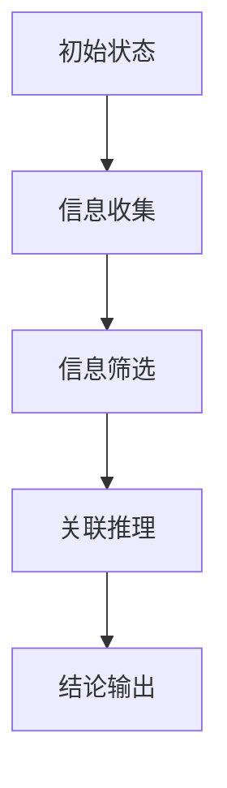
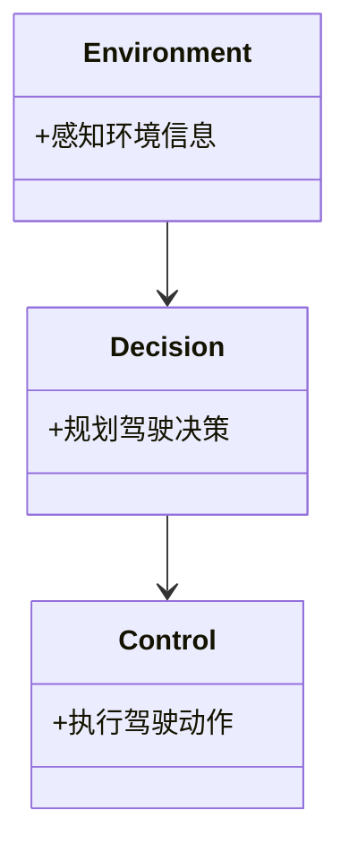
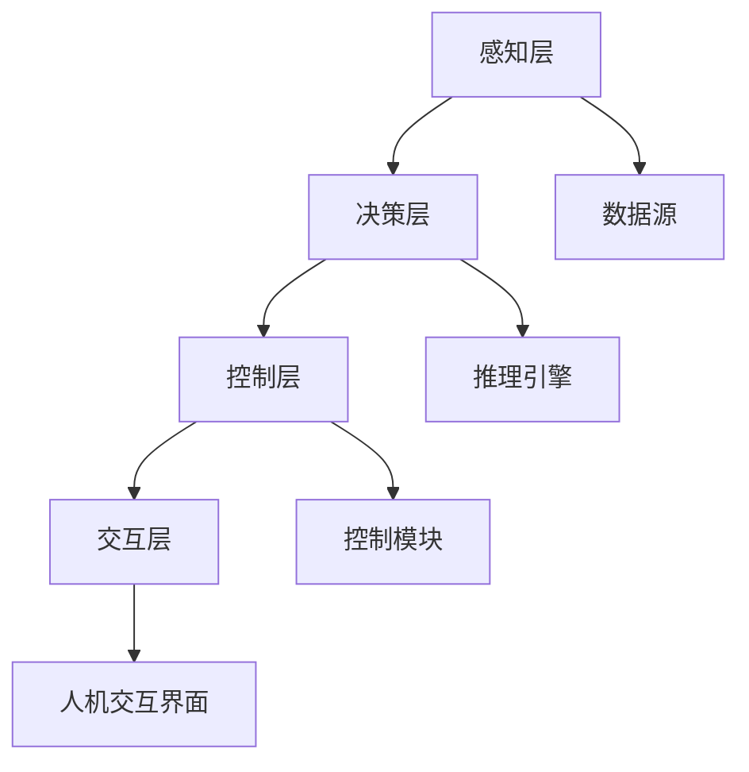
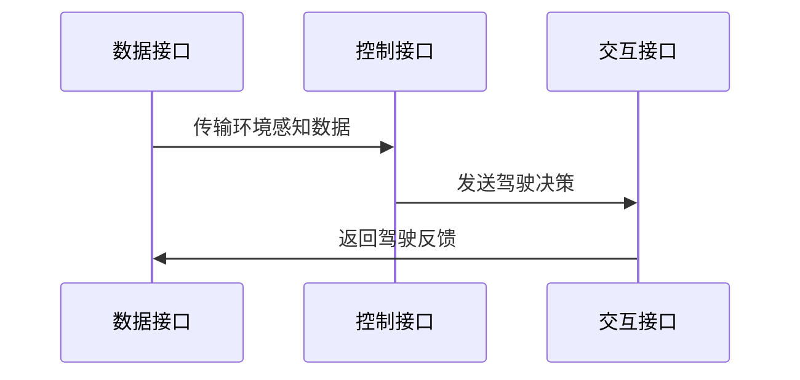
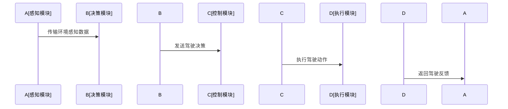

                 


# 利用思维链提升AI的逻辑推理能力

## 关键词：AI，逻辑推理，思维链，算法，系统架构

### 摘要：
本文将探讨如何利用思维链提升人工智能（AI）的逻辑推理能力。通过分析思维链的基本概念和逻辑推理能力的定义，本文介绍了如何将思维链应用于AI系统中，提升其推理能力。文章还将详细讲解相关的算法原理，并通过数学模型和实际案例进行说明，最后提出系统架构设计方案和项目实战经验。

### 第1章：利用思维链提升AI的逻辑推理能力概述

#### 1.1 问题背景

##### 1.1.1 AI逻辑推理能力的重要性

在人工智能领域，逻辑推理能力是AI系统智能化程度的重要标志。逻辑推理能力强的AI系统能够更好地理解和解决问题，从而在众多领域发挥重要作用，如医疗诊断、自动驾驶、智能客服等。

##### 1.1.2 当前AI逻辑推理能力的局限性

尽管AI在逻辑推理方面取得了显著进展，但仍然存在一些局限性。例如，传统机器学习算法依赖于大量数据训练，且在处理复杂问题时往往表现出不足。此外，现有算法在推理过程中往往缺乏透明度和可解释性。

##### 1.1.3 思维链与逻辑推理能力的关系

思维链是一种基于人类认知过程的推理方法，可以模拟人类的思维过程，从而提高AI的逻辑推理能力。通过引入思维链，AI系统可以更好地理解问题，进行更有效的推理。

#### 1.2 核心概念与联系

##### 1.2.1 思维链的定义

思维链是指一系列相关联的思维过程，通过这些过程，人们可以从一个概念过渡到另一个概念，从而逐步解决问题。思维链包括信息收集、信息筛选、关联推理和结论输出等环节。

##### 1.2.2 逻辑推理能力的定义

逻辑推理能力是指个体在解决问题时，根据已知信息和逻辑规则进行推理，得出结论的能力。逻辑推理能力在AI系统中表现为能够根据输入数据，通过推理过程得出合理的输出。

##### 1.2.3 思维链与逻辑推理能力的关联性

思维链与逻辑推理能力密切相关。通过模拟人类思维链的过程，AI系统可以更有效地进行逻辑推理，从而提高其智能化程度。

### 第2章：算法原理讲解

#### 2.1 思维链算法流程图



#### 2.2 Python代码实现

```python
def思维链算法(input_data):
    # 算法实现
    pass
```

#### 2.3 算法原理的数学模型

$$
f(x) = \frac{1}{1 + e^{-x}}
$$

#### 2.4 举例说明

##### 示例一：AI逻辑推理场景

在医疗诊断中，思维链可以帮助AI系统根据病人的症状和检查结果，推理出可能的疾病。

##### 示例二：思维链在AI中的应用

在自动驾驶中，思维链可以帮助AI系统根据周围环境信息，推理出行车的最佳路线。

### 第3章：数学模型和数学公式 & 详细讲解 & 举例说明

#### 3.1 数学模型

$$
P(A|B) = \frac{P(B|A)P(A)}{P(B)}
$$

#### 3.2 公式含义

条件概率公式表示在事件B发生的条件下，事件A发生的概率。

#### 3.3 应用场景

在AI逻辑推理中，用于计算给定条件下某个假设的概率。

#### 3.4 举例说明

##### 示例：天气预测

设事件A为“明天下雨”，事件B为“天气湿度高”。使用条件概率公式计算“明天下雨的概率，在天气湿度高的情况下”。

### 第4章：系统分析与架构设计方案

#### 4.1 问题场景介绍

在自动驾驶领域，思维链可以帮助AI系统根据实时环境信息，做出合理的驾驶决策。

#### 4.2 项目介绍

本项目旨在利用思维链提升自动驾驶AI的逻辑推理能力，提高自动驾驶的智能化程度。

#### 4.3 系统功能设计

系统功能包括环境感知、决策规划、控制执行等。



#### 4.4 系统架构设计

系统架构包括感知层、决策层、控制层和交互层。



#### 4.5 系统接口设计

系统接口包括数据接口、控制接口和交互接口。



#### 4.6 系统交互

系统交互过程包括数据收集、决策推理、控制执行和反馈调整。



### 第5章：项目实战

#### 5.1 环境安装

安装所需的软件和工具，如Python、Mermaid等。

#### 5.2 系统核心实现源代码

```python
# Python代码示例
def思维链算法(input_data):
    # 算法实现
    pass
```

#### 5.3 代码应用解读与分析

分析代码的实现逻辑和关键部分。

#### 5.4 实际案例分析和详细讲解剖析

通过实际案例展示思维链在AI逻辑推理中的应用。

#### 5.5 项目小结

总结项目实现过程中的收获和经验。

### 第6章：最佳实践 tips、小结、注意事项、拓展阅读等内容

- **最佳实践 tips**：如何优化思维链算法，提高推理效率。
- **小结**：本文介绍了利用思维链提升AI逻辑推理能力的方法和实际应用。
- **注意事项**：在实现思维链算法时，需要注意的问题。
- **拓展阅读**：相关领域的研究文献和资料。

### 作者

- 作者：AI天才研究院/AI Genius Institute & 禅与计算机程序设计艺术 /Zen And The Art of Computer Programming

