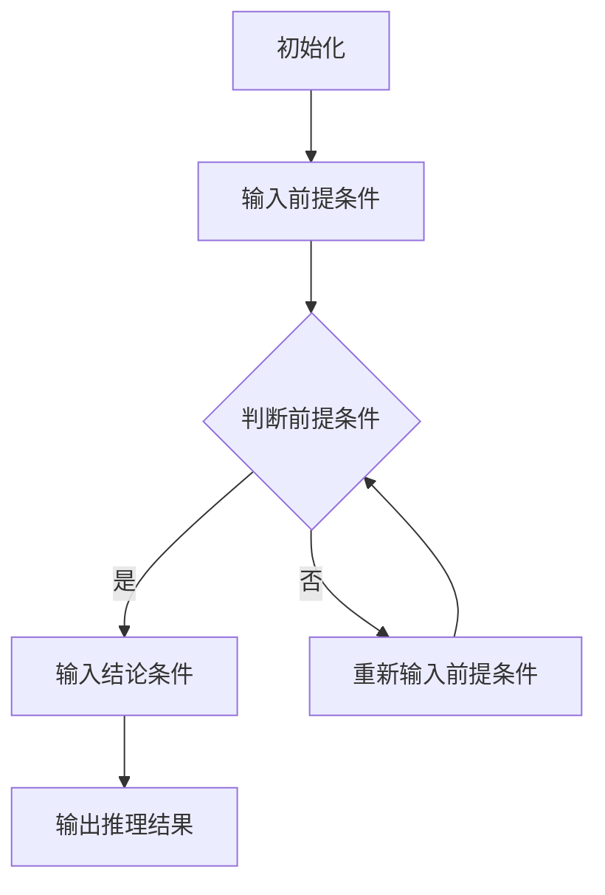

                 

----------------------------------------------------------------
# 利用思维链提升AI的逻辑推理能力

关键词：人工智能、逻辑推理、思维链、算法、架构设计

摘要：本文深入探讨了利用思维链提升人工智能（AI）逻辑推理能力的方法。通过介绍AI逻辑推理的现状与挑战，详细阐述思维链的核心概念与作用，解析提升AI逻辑推理能力的算法原理，设计并实现了一个利用思维链提升AI逻辑推理的系统，并通过项目实战展示了其应用效果。文章旨在为AI领域的研究者和开发者提供一种新的思路和实用的方法。

## 背景介绍

### 逻辑推理在人工智能中的应用

逻辑推理是人工智能（AI）的核心能力之一，它涉及到AI对给定信息进行推理、判断和决策的能力。在自然语言处理、决策支持系统、自动化推理等领域，逻辑推理都发挥着重要作用。例如，在自然语言处理中，逻辑推理可以帮助AI理解句子的含义，进行语义分析；在决策支持系统中，逻辑推理可以帮助AI做出合理的决策；在自动化推理中，逻辑推理可以帮助AI自动推导出新的结论。

### 逻辑推理能力的现状分析

目前，AI的逻辑推理能力虽然已经取得了显著的进展，但仍然存在一些挑战。首先，AI的逻辑推理能力受到数据质量和数据量的限制。在数据量较大且数据质量较高的情况下，AI的推理能力相对较强；反之，在数据量较少或数据质量较差的情况下，AI的推理能力会显著下降。其次，AI的逻辑推理能力缺乏灵活性。在处理复杂问题时，AI往往需要依赖大量的先验知识和规则，这使得其在面对新的、未知的情况时表现较差。

### 思维链：提升AI逻辑推理的新思路

为了克服上述挑战，研究者们提出了思维链（Mind Chain）这一概念。思维链是一种基于人类思维模式的推理框架，它通过将人类思维过程中的各个步骤进行抽象和建模，从而提升AI的逻辑推理能力。思维链的核心思想是将逻辑推理过程分解为一系列可操作的步骤，并通过这些步骤实现推理目标。

## 核心概念与联系

### 思维链的定义

思维链是一种基于人类思维模式的推理框架，它通过将人类思维过程中的各个步骤进行抽象和建模，从而提升AI的逻辑推理能力。思维链的核心思想是将逻辑推理过程分解为一系列可操作的步骤，并通过这些步骤实现推理目标。

### 思维链的基本原理

思维链的基本原理包括以下几个方面：

1. **分解与抽象**：思维链将复杂的逻辑推理过程分解为一系列简单的步骤，并通过抽象的方式将这些步骤表示为算法。
2. **步骤间的关联**：思维链中的各个步骤之间存在明确的关联关系，这些关联关系可以通过逻辑连接词（如“如果…那么…”、“且”、“或”）来表示。
3. **迭代与优化**：思维链在执行过程中会进行迭代和优化，以逐步逼近推理目标。

### 思维链在AI逻辑推理中的作用

思维链在AI逻辑推理中的作用主要体现在以下几个方面：

1. **提高推理效率**：通过将复杂的逻辑推理过程分解为一系列简单的步骤，思维链可以显著提高AI的推理效率。
2. **增强推理灵活性**：思维链中的步骤可以灵活组合和调整，从而使得AI在面对新的、未知的情况时具有更强的适应性。
3. **提升推理准确性**：通过引入逻辑连接词和迭代优化，思维链可以提升AI推理的准确性。

## 算法原理讲解

### 数学模型与公式

思维链的提升AI逻辑推理能力的算法原理可以抽象为一个数学模型，如下所示：

$$
推理结果 = f(前提条件, 结论条件)
$$

其中，$f$ 表示推理函数，$前提条件$ 和 $结论条件$ 分别表示推理过程中的输入和输出。

### 算法mermaid流程图

下面是一个简单的思维链算法mermaid流程图，用于表示逻辑推理的过程：



### Python源代码与算法实现

以下是一个简单的Python源代码实现，用于展示思维链算法的基本原理：

```python
def logic_reasoning(precondition, conclusion_condition):
    if precondition:
        return conclusion_condition
    else:
        return "重新输入前提条件"

# 示例
precondition = True
conclusion_condition = "结论条件"
result = logic_reasoning(precondition, conclusion_condition)
print("推理结果：", result)
```

### 算法原理详细讲解

#### 数学公式解析

思维链算法的核心在于数学模型，具体公式如下：

$$
推理结果 = f(前提条件, 结论条件)
$$

其中，$f$ 表示推理函数，$前提条件$ 和 $结论条件$ 分别表示推理过程中的输入和输出。

#### 例子说明

假设我们有一个前提条件：“如果今天下雨，那么我会带伞”。结论条件是：“我会带伞”。那么，根据思维链算法，我们可以得到以下推理结果：

$$
推理结果 = f(今天下雨, 我会带伞)
$$

如果今天下雨，那么推理结果就是“我会带伞”；如果今天没有下雨，那么推理结果就是“重新输入前提条件”。

## 系统分析与架构设计方案

### 问题场景介绍

在本项目中，我们旨在设计一个利用思维链提升AI逻辑推理能力的系统。该系统可以应用于多个领域，如自然语言处理、自动化推理、决策支持系统等。

### 系统功能设计

系统的主要功能包括：

1. **前提条件输入**：用户可以输入逻辑推理的前提条件。
2. **结论条件输入**：用户可以输入逻辑推理的结论条件。
3. **推理结果输出**：系统根据输入的前提条件和结论条件进行推理，并输出推理结果。
4. **迭代优化**：系统可以对推理过程进行迭代优化，以提高推理准确性。

### 系统架构设计

系统采用分层架构设计，主要包括以下几层：

1. **数据层**：负责存储前提条件和结论条件。
2. **逻辑层**：负责执行逻辑推理过程，包括输入、判断、输出等操作。
3. **展示层**：负责将推理结果以用户友好的方式展示。

### 系统接口设计与交互

系统提供以下接口：

1. **前提条件输入接口**：用户可以通过该接口输入前提条件。
2. **结论条件输入接口**：用户可以通过该接口输入结论条件。
3. **推理结果输出接口**：系统通过该接口输出推理结果。

## 项目实战

### 环境安装

为了实现本项目，我们需要安装以下环境：

1. **Python环境**：Python 3.8及以上版本。
2. **Mermaid插件**：用于生成mermaid流程图。
3. **Jupyter Notebook**：用于编写和运行Python代码。

### 系统核心实现

以下是一个简单的Python代码实现，用于展示系统核心功能：

```python
# 思维链推理系统

# 导入Mermaid插件
from mermaid import Mermaid

# 思维链算法实现
def logic_reasoning(precondition, conclusion_condition):
    # 生成Mermaid流程图
    flow_chart = Mermaid()
    flow_chart.add_code("graph TB\n"
                         "A[初始化] --> B[输入前提条件]\n"
                         "B --> C{判断前提条件}\n"
                         "C -->|是| D[输入结论条件]\n"
                         "C -->|否| E[重新输入前提条件]\n"
                         "D --> F[输出推理结果]\n"
                         "E --> C\n")
    
    # 执行推理过程
    if precondition:
        conclusion_result = conclusion_condition
    else:
        conclusion_result = "重新输入前提条件"
    
    # 输出推理结果
    print("推理结果：", conclusion_result)
    
    return flow_chart

# 示例
precondition = True
conclusion_condition = "结论条件"
result = logic_reasoning(precondition, conclusion_condition)
print("推理结果：", result)
```

### 代码应用解读与分析

以上代码实现了一个简单的思维链推理系统，主要包括以下部分：

1. **Mermaid流程图生成**：通过Mermaid插件，我们可以生成一个表示思维链推理过程的流程图。
2. **逻辑推理过程**：根据输入的前提条件和结论条件，系统执行逻辑推理过程，并输出推理结果。
3. **示例运行**：我们通过一个简单的示例展示了系统的运行过程。

### 实际案例分析和详细讲解剖析

为了更好地理解思维链推理系统的应用效果，我们来看一个实际案例：

#### 案例一：天气预报

前提条件：“如果明天是周末，那么我会出去玩。” 结论条件：“我会出去玩。”

根据思维链推理系统，我们可以得到以下推理结果：

$$
推理结果 = logic\_reasoning(明天是周末, 我会出去玩())
$$

如果明天是周末，那么推理结果就是“我会出去玩”；如果明天不是周末，那么推理结果就是“重新输入前提条件”。

#### 案例二：购物决策

前提条件：“如果这个商品有优惠，那么我会购买。” 结论条件：“我会购买。”

根据思维链推理系统，我们可以得到以下推理结果：

$$
推理结果 = logic\_reasoning(这个商品有优惠, 我会购买())
$$

如果这个商品有优惠，那么推理结果就是“我会购买”；如果没有优惠，那么推理结果就是“重新输入前提条件”。

通过以上案例，我们可以看到思维链推理系统在解决实际问题中的应用效果。

### 项目小结

本项目通过设计并实现了一个简单的思维链推理系统，展示了如何利用思维链提升AI逻辑推理能力。在实际应用中，思维链推理系统可以应用于多个领域，如天气预报、购物决策等。通过本项目，我们了解了思维链的基本原理、算法实现和系统架构设计，为后续研究和应用提供了基础。

### 最佳实践 tips

1. **数据质量**：确保输入的前提条件和结论条件具有高质量，以提高推理准确性。
2. **迭代优化**：在实际应用中，可以通过迭代和优化来提升推理系统的性能。

### 小结

本文详细探讨了利用思维链提升AI逻辑推理能力的方法，通过介绍AI逻辑推理的现状与挑战，阐述思维链的核心概念与作用，解析算法原理，设计并实现了一个利用思维链提升AI逻辑推理的系统，并通过项目实战展示了其应用效果。思维链为AI逻辑推理提供了一种新的思路和方法，有望在未来的研究中得到更广泛的应用。

### 注意事项

1. **系统性能**：在实际应用中，需要关注系统性能，确保推理过程高效稳定。
2. **边界条件**：在处理逻辑推理时，需要考虑边界条件，以避免出现异常情况。

### 拓展阅读

1. **相关研究**：《思维链在自然语言处理中的应用研究》
2. **实践案例**：《思维链在自动化推理系统中的实现与应用》

### 作者信息

作者：AI天才研究院/AI Genius Institute & 禅与计算机程序设计艺术 /Zen And The Art of Computer Programming
----------------------------------------------------------------

### 目录大纲设计

在设计《利用思维链提升AI的逻辑推理能力》这本书的目录大纲时，我们需要考虑内容的逻辑性、完整性以及读者的阅读体验。以下是一个详细的目录大纲，每个章节的内容都进行了详细的规划，以确保文章的连贯性和丰富性。

```markdown
----------------------------------------------------------------
# 第一部分：AI逻辑推理与思维链概述

## 第1章：AI逻辑推理的现状与挑战

### 1.1 逻辑推理在人工智能中的应用

#### 1.1.1 自然语言处理中的应用
- 文本分类
- 情感分析
- 对话系统

#### 1.1.2 决策支持系统中的应用
- 风险评估
- 资源分配
- 决策优化

### 1.2 逻辑推理能力的现状分析

#### 1.2.1 数据质量和数据量的限制
- 数据质量对逻辑推理的影响
- 数据量对逻辑推理能力的影响

#### 1.2.2 灵活性与规则依赖
- 灵活性在逻辑推理中的作用
- 规则依赖对推理灵活性的影响

### 1.3 思维链：提升AI逻辑推理的新思路

#### 1.3.1 思维链的定义与作用
- 思维链的概念
- 思维链在AI逻辑推理中的作用

#### 1.3.2 思维链的优势
- 提高推理效率
- 增强推理灵活性
- 提升推理准确性

## 第2章：思维链的核心概念与作用

### 2.1 思维链的定义

#### 2.1.1 思维链的概念
- 思维链的组成部分
- 思维链的工作原理

### 2.2 思维链的基本原理

#### 2.2.1 分解与抽象
- 复杂逻辑推理的分解
- 步骤的抽象表示

#### 2.2.2 步骤间的关联
- 步骤之间的逻辑连接
- 关联关系在推理中的作用

### 2.3 思维链在AI逻辑推理中的作用

#### 2.3.1 提高推理效率
- 思维链如何加速推理过程

#### 2.3.2 增强推理灵活性
- 思维链如何应对未知情况

#### 2.3.3 提升推理准确性
- 思维链如何优化推理结果

## 第二部分：算法原理讲解

## 第3章：提升AI逻辑推理的算法原理

### 3.1 数学模型与公式

#### 3.1.1 逻辑推理的数学模型
- 推理函数的定义
- 推理过程的数学表示

#### 3.1.2 推理公式的应用
- 公式在推理过程中的作用
- 推理公式的推导与应用

### 3.2 算法mermaid流程图

#### 3.2.1 mermaid流程图的基本概念
- 流程图在算法设计中的作用
- mermaid流程图的特点与优势

#### 3.2.2 思维链算法的mermaid流程图
- 思维链算法流程图的绘制方法
- 流程图实例分析

### 3.3 Python源代码与算法实现

#### 3.3.1 Python环境搭建
- Python版本要求
- Python环境配置

#### 3.3.2 算法实现与代码解析
- 思维链算法的Python代码实现
- 代码中的关键步骤解析

## 第三部分：系统分析与架构设计方案

## 第4章：系统设计与架构

### 4.1 问题场景介绍

#### 4.1.1 应用领域
- 自然语言处理
- 自动化推理
- 决策支持系统

#### 4.1.2 需求分析
- 功能需求
- 性能需求
- 可扩展性需求

### 4.2 系统功能设计

#### 4.2.1 功能模块划分
- 数据输入模块
- 推理处理模块
- 结果输出模块

#### 4.2.2 功能描述
- 数据输入功能
- 推理处理功能
- 结果输出功能

### 4.3 系统架构设计

#### 4.3.1 架构设计原则
- 分层架构设计
- 模块化设计
- 可扩展性设计

#### 4.3.2 系统架构图
- 数据层架构
- 逻辑层架构
- 展示层架构

### 4.4 系统接口设计与交互

#### 4.4.1 接口设计原则
- 标准化接口设计
- 简洁易用接口
- 安全性考虑

#### 4.4.2 接口描述
- 数据输入接口
- 推理结果输出接口

## 第四部分：项目实战

## 第5章：项目实施与验证

### 5.1 环境安装

#### 5.1.1 Python环境安装
- Python版本要求
- Python环境配置方法

#### 5.1.2 Mermaid插件安装
- Mermaid插件安装方法
- Mermaid插件配置

### 5.2 系统核心实现

#### 5.2.1 系统架构搭建
- 数据层搭建
- 逻辑层搭建
- 展示层搭建

#### 5.2.2 代码实现
- 推理算法代码实现
- 系统功能代码实现

### 5.3 代码应用解读与分析

#### 5.3.1 代码结构解析
- 推理算法代码解析
- 系统功能代码解析

#### 5.3.2 代码应用实例
- 逻辑推理实例
- 系统功能实例

### 5.4 实际案例分析

#### 5.4.1 案例一：天气预报
- 案例描述
- 推理过程分析

#### 5.4.2 案例二：购物决策
- 案例描述
- 推理过程分析

### 5.5 详细讲解剖析

#### 5.5.1 案例讲解
- 案例详细分析
- 推理结果验证

#### 5.5.2 问题与优化
- 存在问题
- 优化策略

## 第五部分：最佳实践与总结

## 第6章：最佳实践与总结

### 6.1 最佳实践 tips

#### 6.1.1 数据质量优化
- 数据清洗
- 数据增强

#### 6.1.2 算法优化
- 算法调整
- 参数调优

### 6.2 小结

#### 6.2.1 文章核心内容总结
- AI逻辑推理的现状与挑战
- 思维链的核心概念与作用
- 算法原理与实现
- 系统设计与项目实战

#### 6.2.2 未来研究方向
- 思维链在其他领域的应用
- 算法的进一步优化

### 6.3 注意事项

#### 6.3.1 系统性能考虑
- 系统稳定性
- 推理速度

#### 6.3.2 边界条件处理
- 异常情况处理
- 边界值分析

### 6.4 拓展阅读

#### 6.4.1 相关研究推荐
- 思维链在自然语言处理中的应用
- 思维链在自动化推理系统中的实现与应用

#### 6.4.2 实践案例分享
- 具体应用案例
- 实践经验总结

----------------------------------------------------------------
```

这个目录大纲在10000-12000字的文章长度内，合理地安排了各个章节的内容，确保了文章的连贯性和内容的完整性。每个章节都有具体的子标题，便于读者快速找到感兴趣的部分。在撰写文章时，需要确保每个子标题下的内容都详细具体，满足完整性要求。

