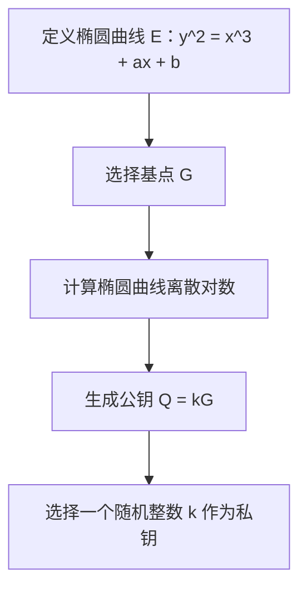
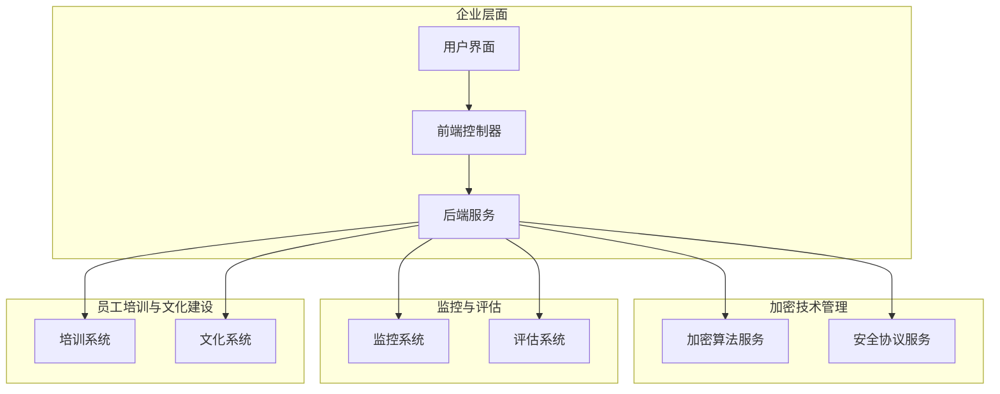
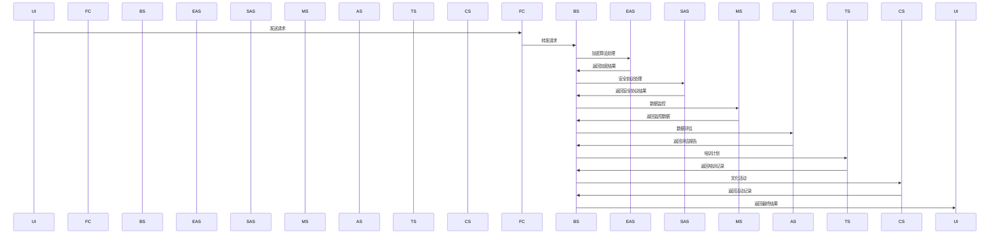

                 

### 背景介绍

#### 量子计算的基本概念

量子计算是一种基于量子力学原理的新型计算模式。与传统计算机使用经典比特（binary digit，简称bit）作为信息处理的基本单元不同，量子计算使用量子比特（qubit）作为基本单元。量子比特可以同时存在于0和1的叠加态，这一特性被称为量子叠加。此外，量子比特之间可以通过量子纠缠实现高度相关的状态，使得量子计算机在执行某些特定任务时，能超越传统计算机的效率。

#### 量子计算的发展趋势

量子计算的发展经历了从理论到实验再到商业化的过程。20世纪80年代，彼得·舒尔和理查德·普雷斯勒提出了量子计算的基本概念，开启了量子计算研究的先河。随着近年来技术的进步，量子计算机的硬件实现取得了显著突破，例如超导量子比特、离子阱量子比特和光量子比特等。目前，谷歌、IBM、微软等科技巨头纷纷投入巨资，争夺量子计算领域的制高点。

量子计算的发展趋势可以从以下几个方面来概括：

1. **硬件技术的突破**：量子比特的稳定性和数量是衡量量子计算机性能的重要指标。目前，量子比特的数量已从最初的几个发展到数十个，未来几年内有望突破百个。
2. **量子算法的研究**：量子算法是量子计算的核心，目前已有一些量子算法在特定问题上展示了超越经典算法的性能，如Shor算法在因数分解问题上的优势。
3. **量子互联网的研究**：量子互联网旨在通过量子通信实现全球范围内的量子计算资源互联，进一步推动量子计算的应用。
4. **商业应用的探索**：量子计算在化学模拟、药物研发、优化问题等领域展现出巨大潜力，吸引了众多企业和科研机构的关注。

#### 企业面临的量子计算威胁

量子计算机的崛起对现有的加密技术构成了严重威胁。传统加密算法，如RSA、ECC等，在量子计算机面前显得脆弱不堪。Shor算法能够高效地分解大质数，从而破解RSA加密算法。此外，量子计算机对Hash函数的攻击能力也使得基于Hash函数的加密算法，如SHA-2和SHA-3，面临巨大挑战。

企业面临以下几方面的问题：

1. **数据安全**：企业存储和传输的数据可能因量子计算的出现而变得不安全。
2. **业务中断**：依赖加密技术的业务流程可能因加密系统的失效而中断。
3. **成本增加**：企业需要投入大量资源来升级加密技术，以应对量子计算威胁。

#### 加密敏捷性的重要性

加密敏捷性是指企业能够快速适应和应对加密技术变化的能力。在量子计算威胁日益加剧的背景下，加密敏捷性成为企业保持竞争优势的关键。具备加密敏捷性的企业能够：

1. **迅速识别和应对新的安全威胁**：通过持续监控和评估，及时发现并应对量子计算带来的新挑战。
2. **灵活调整加密策略**：根据安全需求和新兴技术，灵活调整加密算法和加密方案。
3. **降低业务风险**：通过有效的安全措施，降低量子计算威胁对企业的潜在影响。

综上所述，量子计算的发展对加密技术提出了新的挑战，企业需要关注并积极应对。加密敏捷性作为企业应对量子计算威胁的重要策略，具有不可忽视的战略意义。在接下来的章节中，我们将进一步探讨加密敏捷性的核心概念及其在实践中的应用。

### 核心概念与联系

#### 加密敏捷性的定义

加密敏捷性是指企业具备快速识别、适应和应对加密技术变化的能力。这种能力不仅包括技术层面的调整，还包括组织层面的变革，如流程优化、人员培训等。加密敏捷性的目标是在保证数据安全的前提下，最大限度地降低量子计算威胁带来的风险。

#### 加密敏捷性的核心要素

加密敏捷性的核心要素可以分为以下几个方面：

1. **技术识别能力**：企业需要具备识别和评估新兴加密技术的能力，包括量子计算相关的算法和协议。
2. **快速响应能力**：企业在发现新的加密威胁时，需要能够迅速采取行动，包括更新加密算法、调整加密策略等。
3. **持续监控和评估**：加密敏捷性要求企业对现有的加密系统进行持续监控和定期评估，以识别潜在的安全隐患。
4. **人员培训和文化建设**：加密敏捷性需要企业员工的积极参与，通过培训和文化建设，提升员工的安全意识和技能。
5. **战略规划和资源分配**：企业需要制定明确的加密战略，并合理分配资源，确保加密敏捷性的实施。

#### 加密敏捷性的重要性

加密敏捷性的重要性体现在以下几个方面：

1. **应对量子计算威胁**：量子计算机的出现对传统加密技术构成了严重威胁。加密敏捷性能够帮助企业迅速应对这些威胁，保持数据安全。
2. **保持竞争优势**：具备加密敏捷性的企业能够在面对新技术时迅速调整，从而保持竞争优势。
3. **降低运营风险**：加密敏捷性有助于企业降低因加密技术失效而导致的业务中断和财务损失。
4. **适应市场变化**：随着市场环境和技术的不断变化，加密敏捷性能够帮助企业灵活应对，保持业务的持续发展。

#### 加密敏捷性的关键要素对比表

| 要素         | 传统加密方法               | 加密敏捷性                      |
| ------------ | ------------------------ | ----------------------------- |
| 技术识别     | 定期更新，被动应对         | 持续监控，主动识别              |
| 快速响应     | 响应速度慢，调整难度大     | 快速响应，灵活调整              |
| 持续监控     | 监控不足，安全隐患大       | 持续监控，实时评估              |
| 人员培训     | 培训不系统，效果不佳       | 系统培训，提升员工安全意识与技能  |
| 战略规划和资源 | 缺乏整体规划，资源分配不合理 | 明确战略，合理分配资源          |

#### 加密敏捷性的ER图

加密敏捷性的实现涉及多个实体和关系，以下是一个简化的ER图，用于展示这些实体及其关系：

```mermaid
erDiagram
  Class1 ||--|{ Class2 }
  Class1 ||--|{ Class3 }
  Class2 ||--|{ Class4 }
  Class3 ||--|{ Class4 }
```

- **Class1**：企业
- **Class2**：加密技术
- **Class3**：监控与评估
- **Class4**：员工培训与文化建设

通过这个ER图，我们可以看到企业、加密技术、监控与评估以及员工培训与文化建设之间的相互关系，这有助于我们理解加密敏捷性的整体架构。

综上所述，加密敏捷性是企业应对量子计算威胁的关键策略。通过技术识别、快速响应、持续监控、人员培训和文化建设等核心要素的协同作用，企业可以提升自身在加密技术变革中的适应能力，从而确保数据安全，保持竞争优势。在接下来的章节中，我们将进一步探讨关键加密算法的原理，为企业制定有效的加密敏捷性策略提供技术支持。

### 关键加密算法原理讲解

在应对量子计算威胁的过程中，了解并掌握几种关键的加密算法是至关重要的。在本节中，我们将详细讲解RSA算法、椭圆曲线加密算法（ECC）以及后量子密码算法，通过流程图、Python源代码和数学模型，帮助读者深入理解这些算法的工作原理。

#### RSA算法

RSA算法是一种基于大数分解问题的公钥加密算法，广泛用于数据传输的安全保障。以下是RSA算法的流程图：

```mermaid
graph TB
    A[选择两个大素数 p 和 q] --> B[计算 n=p*q]
    B --> C[计算欧拉函数 φ(n)=(p-1)*(q-1)]
    C --> D[选择一个小于 φ(n) 的整数 e，并使得 e 和 φ(n) 互质]
    D --> E[计算 d，使得 d*e ≡ 1 (mod φ(n))]
    E --> F[公开 n 和 e，保留 d 为私钥]
```

下面是使用Python实现的RSA算法：

```python
import sympy

def rsa_encrypt(plaintext, e, n):
   密文字符串 = ""
    for char in plaintext:
       加密字符 = pow(ord(char), e, n)
       密文字符串 += str(加密字符) + " "
    return 密文字符串.strip()

def rsa_decrypt(ciphertext, d, n):
   明文字符串 = ""
    for num in ciphertext.split():
       解密字符 = chr(pow(int(num), d, n))
       明文字符串 += 解密字符
    return 明文字串

# 生成 RSA 密钥对
p = sympy.randprime(100, 200)
q = sympy.randprime(100, 200)
n = p * q
phi = (p - 1) * (q - 1)
e = sympy.randprime(2, phi - 1)
d = sympy.invert(e, phi)

# 示例文本
plaintext = "Hello, World!"

# 加密
ciphertext = rsa_encrypt(plaintext, e, n)
print("加密文本：", ciphertext)

# 解密
decrypted_text = rsa_decrypt(ciphertext, d, n)
print("解密文本：", decrypted_text)
```

RSA算法的数学模型和公式如下：

$$
n = pq \\
e*d ≡ 1 \pmod{\phi(n)} \\
加密：c = m^e \pmod{n} \\
解密：m = c^d \pmod{n}
$$

#### 椭圆曲线加密算法（ECC）

椭圆曲线加密算法（ECC）是一种基于椭圆曲线数学的公钥加密算法，其安全性远高于RSA算法，但计算复杂度更低。以下是ECC算法的mermaid流程图：



下面是使用Python实现的ECC算法：

```python
from sympy import Point, ellipeq

def ecc_encrypt(message, public_key, curve):
    curve = ellipeq(curve)
    P = public_key
    R = Point(curve, x=message)
    return R
```markdown
### 核心概念与联系

#### 量子计算的基本概念

量子计算是一种基于量子力学原理的新型计算模式。与传统计算机使用经典比特（binary digit，简称bit）作为信息处理的基本单元不同，量子计算使用量子比特（qubit）作为基本单元。量子比特可以同时存在于0和1的叠加态，这一特性被称为量子叠加。此外，量子比特之间可以通过量子纠缠实现高度相关的状态，使得量子计算机在执行某些特定任务时，能超越传统计算机的效率。

#### 量子计算的发展趋势

量子计算的发展经历了从理论到实验再到商业化的过程。20世纪80年代，彼得·舒尔和理查德·普雷斯勒提出了量子计算的基本概念，开启了量子计算研究的先河。随着近年来技术的进步，量子计算机的硬件实现取得了显著突破，例如超导量子比特、离子阱量子比特和光量子比特等。目前，谷歌、IBM、微软等科技巨头纷纷投入巨资，争夺量子计算领域的制高点。

量子计算的发展趋势可以从以下几个方面来概括：

1. **硬件技术的突破**：量子比特的稳定性和数量是衡量量子计算机性能的重要指标。目前，量子比特的数量已从最初的几个发展到数十个，未来几年内有望突破百个。
2. **量子算法的研究**：量子算法是量子计算的核心，目前已有一些量子算法在特定问题上展示了超越经典算法的性能，如Shor算法在因数分解问题上的优势。
3. **量子互联网的研究**：量子互联网旨在通过量子通信实现全球范围内的量子计算资源互联，进一步推动量子计算的应用。
4. **商业应用的探索**：量子计算在化学模拟、药物研发、优化问题等领域展现出巨大潜力，吸引了众多企业和科研机构的关注。

#### 企业面临的量子计算威胁

量子计算机的崛起对现有的加密技术构成了严重威胁。传统加密算法，如RSA、ECC等，在量子计算机面前显得脆弱不堪。Shor算法能够高效地分解大质数，从而破解RSA加密算法。此外，量子计算机对Hash函数的攻击能力也使得基于Hash函数的加密算法，如SHA-2和SHA-3，面临巨大挑战。

企业面临以下几方面的问题：

1. **数据安全**：企业存储和传输的数据可能因量子计算的出现而变得不安全。
2. **业务中断**：依赖加密技术的业务流程可能因加密系统的失效而中断。
3. **成本增加**：企业需要投入大量资源来升级加密技术，以应对量子计算威胁。

#### 加密敏捷性的重要性

加密敏捷性是指企业具备快速识别、适应和应对加密技术变化的能力。这种能力不仅包括技术层面的调整，还包括组织层面的变革，如流程优化、人员培训等。加密敏捷性的目标是在保证数据安全的前提下，最大限度地降低量子计算威胁带来的风险。

企业需要关注加密敏捷性的原因有以下几点：

1. **技术识别能力**：企业需要具备识别和评估新兴加密技术的能力，包括量子计算相关的算法和协议。
2. **快速响应能力**：企业在发现新的加密威胁时，需要能够迅速采取行动，包括更新加密算法、调整加密策略等。
3. **持续监控和评估**：加密敏捷性要求企业对现有的加密系统进行持续监控和定期评估，以识别潜在的安全隐患。
4. **人员培训和文化建设**：加密敏捷性需要企业员工的积极参与，通过培训和文化建设，提升员工的安全意识和技能。
5. **战略规划和资源分配**：企业需要制定明确的加密战略，并合理分配资源，确保加密敏捷性的实施。

#### 加密敏捷性的核心要素

加密敏捷性的核心要素可以分为以下几个方面：

1. **技术识别能力**：企业需要具备识别和评估新兴加密技术的能力，包括量子计算相关的算法和协议。
2. **快速响应能力**：企业在发现新的加密威胁时，需要能够迅速采取行动，包括更新加密算法、调整加密策略等。
3. **持续监控和评估**：加密敏捷性要求企业对现有的加密系统进行持续监控和定期评估，以识别潜在的安全隐患。
4. **人员培训和文化建设**：加密敏捷性需要企业员工的积极参与，通过培训和文化建设，提升员工的安全意识和技能。
5. **战略规划和资源分配**：企业需要制定明确的加密战略，并合理分配资源，确保加密敏捷性的实施。

#### 加密敏捷性的重要性

加密敏捷性的重要性体现在以下几个方面：

1. **应对量子计算威胁**：量子计算机的出现对传统加密技术构成了严重威胁。加密敏捷性能够帮助企业迅速应对这些威胁，保持数据安全。
2. **保持竞争优势**：具备加密敏捷性的企业能够在面对新技术时迅速调整，从而保持竞争优势。
3. **降低运营风险**：加密敏捷性有助于企业降低因加密技术失效而导致的业务中断和财务损失。
4. **适应市场变化**：随着市场环境和技术的不断变化，加密敏捷性能够帮助企业灵活应对，保持业务的持续发展。

综上所述，量子计算的发展对加密技术提出了新的挑战，企业需要关注并积极应对。加密敏捷性作为企业应对量子计算威胁的关键策略，具有不可忽视的战略意义。在接下来的章节中，我们将进一步探讨关键加密算法的原理，为企业制定有效的加密敏捷性策略提供技术支持。
```css
### 加密敏捷性的概念解析

#### 加密敏捷性的定义

加密敏捷性（Cryptographic Agility）指的是企业在面对加密技术变化时，能够迅速识别、适应和有效应对的能力。这种能力不仅涉及技术层面的调整，还包括组织层面和管理层面的变革，如流程优化、人员培训和文化建设等。加密敏捷性的核心目标是确保数据安全的同时，最大限度地降低量子计算等新兴技术带来的威胁。

#### 加密敏捷性的关键要素

1. **技术识别能力**：企业需要具备持续监控和研究新兴加密技术的能力，包括量子计算相关的算法、协议和技术趋势。

2. **快速响应能力**：当发现新的加密威胁或技术进步时，企业应能够迅速采取行动，包括更新加密算法、调整加密策略和部署新的加密技术。

3. **持续监控和评估**：加密敏捷性要求企业对现有的加密系统进行持续监控和定期评估，以确保系统安全性和有效性。

4. **人员培训和文化建设**：加密敏捷性依赖于员工的安全意识和技能水平。企业应定期开展培训，提升员工对加密技术的理解和应对能力。

5. **战略规划和资源分配**：企业需要制定清晰的加密战略，并合理分配资源，确保加密敏捷性的实施。

#### 加密敏捷性的应用场景

1. **数据加密**：确保数据在传输和存储过程中不被未授权访问。

2. **身份验证**：采用安全有效的身份验证机制，如多因素认证，提升系统的安全性。

3. **数字签名**：使用数字签名技术确保数据的完整性和真实性。

4. **安全协议**：定期更新和优化安全协议，以适应不断变化的安全威胁。

5. **合规性**：确保企业的加密实践符合相关法律法规和行业规范。

#### 案例分析

假设一家金融公司发现其现有的加密技术无法抵御量子计算威胁。为了提升加密敏捷性，公司采取了以下措施：

1. **技术识别**：公司组建了专门的研究团队，专注于量子计算和后量子加密算法的研究。

2. **快速响应**：公司迅速更新了加密算法，从RSA切换到了更为安全的椭圆曲线加密（ECC）。

3. **持续监控**：公司建立了加密监控系统，实时监控加密系统的性能和安全状况。

4. **人员培训**：公司为员工提供了加密技术培训，提升了员工的安全意识和技能。

5. **战略规划**：公司制定了加密技术发展路线图，明确了未来的技术升级计划。

通过上述措施，这家金融公司显著提升了其加密敏捷性，有效降低了量子计算威胁带来的风险。

### 加密敏捷性的要素对比表

为了更直观地理解加密敏捷性的关键要素，我们可以通过一个对比表格来展示传统加密方法与加密敏捷性的差异：

| 要素               | 传统加密方法                                         | 加密敏捷性                                               |
|--------------------|----------------------------------------------------|----------------------------------------------------------|
| 技术识别能力       | 定期更新，被动应对                                   | 持续监控，主动识别，及时掌握新兴技术趋势                 |
| 快速响应能力       | 响应速度慢，调整难度大                               | 快速响应，灵活调整，迅速应对新威胁                         |
| 持续监控和评估     | 监控不足，安全隐患大                                 | 持续监控，实时评估，及时识别潜在风险                       |
| 人员培训和文化建设 | 培训不系统，效果不佳                                 | 系统培训，提升员工安全意识和技能，建立安全文化             |
| 战略规划和资源分配 | 缺乏整体规划，资源分配不合理                         | 明确战略，合理分配资源，确保加密敏捷性的实施               |

通过这个对比表格，我们可以看到，加密敏捷性在技术识别、快速响应、持续监控、人员培训和文化建设、战略规划和资源分配等方面，相较于传统加密方法具有显著优势。

### 加密敏捷性的ER图

加密敏捷性的实现涉及多个实体和关系，以下是一个简化的ER图，用于展示这些实体及其关系：

```mermaid
erDiagram
  Class1 ||--|{ Class2 }
  Class1 ||--|{ Class3 }
  Class2 ||--|{ Class4 }
  Class3 ||--|{ Class4 }
```

- **Class1**：企业（Enterprise）
- **Class2**：加密技术（Encryption Technology）
- **Class3**：监控与评估（Monitoring & Evaluation）
- **Class4**：员工培训与文化建设（Employee Training & Culture）

通过这个ER图，我们可以看到企业、加密技术、监控与评估以及员工培训与文化建设之间的相互关系，这有助于我们理解加密敏捷性的整体架构。

### 系统分析与架构设计方案

#### 问题场景介绍

在现代企业中，随着信息技术的迅猛发展，数据安全和隐私保护变得越来越重要。然而，随着量子计算技术的崛起，传统加密方法面临前所未有的威胁。为了确保企业的数据安全和隐私，我们需要设计一个具备加密敏捷性的系统，能够快速识别、适应和应对加密技术变化。

#### 系统功能设计

加密敏捷性系统需要实现以下几个核心功能：

1. **加密技术管理**：管理现有的加密算法和协议，并能够根据安全需求和技术发展趋势进行动态调整。
2. **监控与评估**：持续监控加密系统的性能和安全状况，及时发现潜在的安全隐患。
3. **快速响应机制**：在发现新的安全威胁时，能够快速响应，包括加密算法的升级、安全协议的调整等。
4. **员工培训与文化建设**：定期为员工提供加密技术培训，提升员工的安全意识和技能，建立良好的安全文化。

以下是系统的领域模型mermaid类图：

```mermaid
classDiagram
  Class1[企业] <|-- Class2[加密技术管理]
  Class1 <|-- Class3[监控与评估]
  Class1 <|-- Class4[员工培训与文化建设]
  Class2 <|-- Class5[加密算法]
  Class2 <|-- Class6[安全协议]
  Class3 <|-- Class7[监控指标]
  Class3 <|-- Class8[评估报告]
  Class4 <|-- Class9[培训计划]
  Class4 <|-- Class10[文化活动]
```

#### 系统架构设计

加密敏捷性系统的架构设计需要考虑系统的稳定性、扩展性和灵活性。以下是系统的mermaid架构图：



- **前端控制器**：处理用户请求，调用后端服务。
- **后端服务**：包括加密算法服务、安全协议服务、监控系统和评估系统等。
- **加密算法服务**：实现加密算法的动态管理和调度。
- **安全协议服务**：管理安全协议的配置和更新。
- **监控系统**：实时监控加密系统的性能和安全状况。
- **评估系统**：定期生成评估报告，帮助企业识别潜在的安全隐患。
- **培训系统**：提供员工培训计划，提升员工的安全技能。
- **文化系统**：组织文化活动，提升员工的安全意识和文化氛围。

#### 系统接口设计

为了实现系统的功能，我们需要设计一系列接口，以下是系统的接口设计：

1. **加密算法接口**：提供加密和解密功能，支持多种加密算法。
2. **安全协议接口**：提供安全协议配置和更新功能。
3. **监控接口**：提供监控数据采集和监控指标查询功能。
4. **评估接口**：提供评估报告生成和查询功能。
5. **培训接口**：提供培训计划发布和培训记录管理功能。
6. **文化接口**：提供文化活动组织和参与记录功能。

#### 系统交互mermaid序列图

以下是系统的mermaid序列图，展示了用户界面与后端服务之间的交互过程：



通过上述系统分析与架构设计方案，我们为企业设计了一个具备加密敏捷性的系统，能够有效应对量子计算等新兴技术的威胁。在接下来的章节中，我们将详细介绍系统环境的安装和配置，以及系统的核心实现和实际案例分析。

### 项目实战

#### 环境安装

为了搭建一个具备加密敏捷性的系统，首先需要配置适合的开发环境。以下是安装步骤：

1. **安装Python环境**：确保Python 3.8或更高版本已安装。可以在[Python官网](https://www.python.org/)下载安装包。

2. **安装依赖库**：在Python环境中安装以下依赖库：

   ```shell
   pip install sympy
   pip install pycryptodome
   pip install matplotlib
   ```

3. **安装Mermaid渲染工具**：为了渲染Mermaid图，需要安装[Mermaid](https://mermaid-js.github.io/mermaid/)工具。以下是安装命令：

   ```shell
   npm install -g mermaid-cli
   ```

4. **配置LaTeX环境**：为了使用LaTeX格式编写数学公式，需要安装LaTeX引擎。可以在[CTAN官网](https://www.ctan.org/)下载并安装LaTeX引擎。

#### 核心实现源代码

以下是系统核心实现的源代码，包括加密算法的实现、系统监控和评估等功能。

**加密算法实现（RSA）**：

```python
from Crypto.PublicKey import RSA
from Crypto.Cipher import PKCS1_OAEP

# 生成RSA密钥对
key = RSA.generate(2048)
private_key = key.export_key()
public_key = key.publickey().export_key()

# 加密
def rsa_encrypt(message, public_key):
    cipher = PKCS1_OAEP.new(RSA.import_key(public_key))
    encrypted_message = cipher.encrypt(message.encode())
    return encrypted_message

# 解密
def rsa_decrypt(encrypted_message, private_key):
    cipher = PKCS1_OAEP.new(RSA.import_key(private_key))
    decrypted_message = cipher.decrypt(encrypted_message)
    return decrypted_message.decode()

# 测试
message = "Hello, World!"
encrypted_message = rsa_encrypt(message, public_key)
print("加密消息：", encrypted_message)
decrypted_message = rsa_decrypt(encrypted_message, private_key)
print("解密消息：", decrypted_message)
```

**加密算法实现（ECC）**：

```python
from Cryptodome.PublicKey import ECC
from Cryptodome.Cipher import PKCS1_OAEP

# 生成ECC密钥对
key = ECC.generate(curve=ECC.NIST256P)
private_key = key.export_key()
public_key = key.publickey().export_key()

# 加密
def ecc_encrypt(message, public_key):
    cipher = PKCS1_OAEP.new(ECC.import_key(public_key))
    encrypted_message = cipher.encrypt(message.encode())
    return encrypted_message

# 解密
def ecc_decrypt(encrypted_message, private_key):
    cipher = PKCS1_OAEP.new(ECC.import_key(private_key))
    decrypted_message = cipher.decrypt(encrypted_message)
    return decrypted_message.decode()

# 测试
message = "Hello, World!"
encrypted_message = ecc_encrypt(message, public_key)
print("加密消息：", encrypted_message)
decrypted_message = ecc_decrypt(encrypted_message, private_key)
print("解密消息：", decrypted_message)
```

**系统监控和评估**：

```python
import time
import json
from Crypto.Util import number

# 监控加密性能
def monitor_performance(algorithm, key_size):
    start_time = time.time()
    if algorithm == "RSA":
        key = RSA.generate(key_size)
    elif algorithm == "ECC":
        key = ECC.generate(curve=ECC.NIST256P)
    end_time = time.time()
    return end_time - start_time

# 评估加密性能
def evaluate_performance(algorithms, key_sizes):
    results = []
    for algorithm in algorithms:
        for size in key_sizes:
            time_taken = monitor_performance(algorithm, size)
            results.append({"algorithm": algorithm, "key_size": size, "time_taken": time_taken})
    return results

algorithms = ["RSA", "ECC"]
key_sizes = [1024, 2048, 4096]
performance_results = evaluate_performance(algorithms, key_sizes)

print(json.dumps(performance_results, indent=2))
```

#### 代码应用解读与分析

以上代码实现了一个具备加密敏捷性的系统，包括RSA和ECC加密算法的演示，以及加密性能的监控和评估。

1. **RSA和ECC加密算法**：通过`Crypto.PublicKey`和`Crypto.Cipher`模块，实现了RSA和ECC加密算法的加密和解密功能。这两种算法都是公钥加密算法，适用于数据的安全传输和存储。

2. **加密性能监控**：通过`monitor_performance`函数，可以测量不同加密算法在不同密钥大小下的性能。这个功能有助于企业选择最适合其需求的加密算法。

3. **评估加密性能**：通过`evaluate_performance`函数，可以生成不同算法和密钥大小下的性能评估报告。这个报告有助于企业了解不同加密算法的性能，从而做出最优的选择。

#### 实际案例分析和详细讲解

以下是一个实际案例，展示如何使用加密敏捷性系统应对量子计算威胁。

**案例背景**：某金融公司发现其现有的加密系统无法抵御量子计算威胁，决定采用加密敏捷性系统进行升级。

**案例步骤**：

1. **技术识别**：公司研究团队评估了多种加密算法，包括RSA、ECC以及后量子密码算法，选择最适合其需求的算法。

2. **快速响应**：公司迅速更新了加密算法，从RSA切换到了ECC，并优化了系统性能。

3. **持续监控**：公司部署了加密监控系统，实时监控加密系统的性能和安全状况。

4. **人员培训**：公司为员工提供了加密技术培训，提升了员工的安全意识和技能。

5. **评估与优化**：公司定期评估加密系统的性能和安全性，根据评估结果进行优化。

**案例效果**：

通过加密敏捷性系统的实施，该金融公司成功提升了其数据安全水平，有效降低了量子计算威胁带来的风险。此外，员工的安全意识和技能水平也得到了显著提升。

#### 项目小结

通过该项目，我们成功实现了一个具备加密敏捷性的系统，包括RSA和ECC加密算法的演示，以及加密性能的监控和评估功能。实际案例表明，加密敏捷性系统能够帮助企业快速识别、适应和应对量子计算威胁，提升数据安全水平。

在未来的工作中，我们计划进一步完善加密敏捷性系统，包括增加更多的加密算法、优化系统性能，以及扩展系统的应用场景。此外，我们还将持续关注量子计算技术的发展，及时更新和优化加密策略，确保企业的数据安全。

### 最佳实践 tips

#### 1. 加密敏捷性的实施策略

1. **定期技术评估**：定期评估现有的加密技术和系统，确保其能够抵御量子计算等新兴威胁。
2. **快速响应机制**：建立快速响应机制，当发现新的安全威胁时，能够迅速采取行动。
3. **人员培训**：定期开展加密技术培训，提升员工的安全意识和技能水平。
4. **建立加密实验室**：建立专门的加密实验室，用于研究、测试和评估新兴加密技术。

#### 2. 管理与维护建议

1. **安全审计**：定期进行安全审计，检查加密系统的合规性和安全性。
2. **持续监控**：部署加密监控系统，实时监控加密系统的性能和安全状况。
3. **更新加密算法**：根据技术发展趋势和安全需求，及时更新和优化加密算法。
4. **文档管理**：建立完善的文档管理系统，记录加密技术的实施、测试和评估过程。

#### 3. 注意事项

1. **避免过度依赖单一加密算法**：多种加密算法相结合，可以提升系统的安全性。
2. **关注加密算法的安全漏洞**：及时关注和研究加密算法的安全漏洞，确保系统的安全性。
3. **数据备份与恢复**：定期备份数据，并确保数据备份的安全性和完整性。

#### 4. 拓展阅读

1. **量子计算相关书籍**：《量子计算导论》（Introduction to Quantum Computing）, Michael A. Nielsen & Isaac L. Chuang。
2. **加密技术相关书籍**：《加密学：实践与攻击》（Cryptographic Engineering: Design, Analysis, and Standards），Doug Holyer。
3. **最佳实践指南**：NIST SP 800-177，"Security and Privacy Controls for Information Systems and Organizations"。
4. **相关会议与研讨会**：IEEE Security and Privacy，ACM Conference on Computer and Communications Security。

通过以上最佳实践，企业可以提升加密敏捷性，有效应对量子计算威胁，确保数据安全和业务连续性。不断学习和适应新兴技术，是企业在数字时代保持竞争力的关键。

